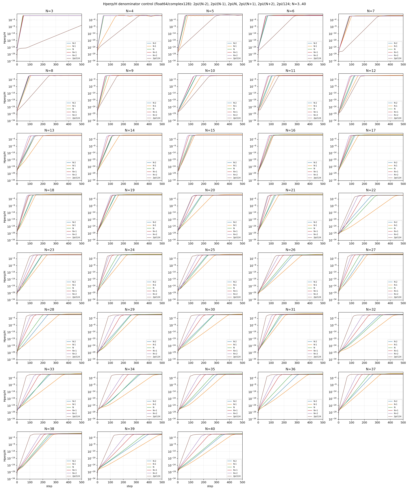
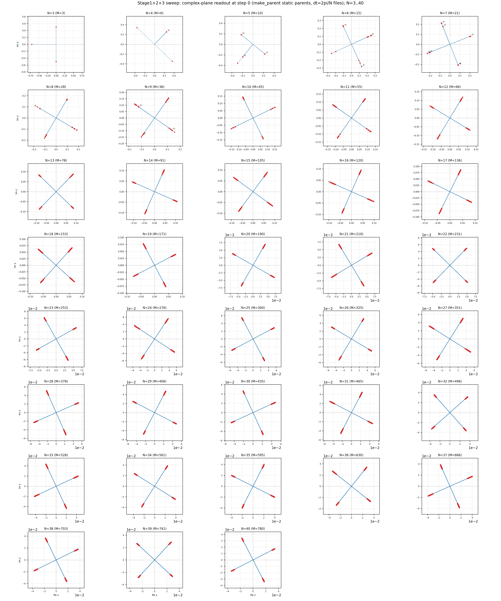
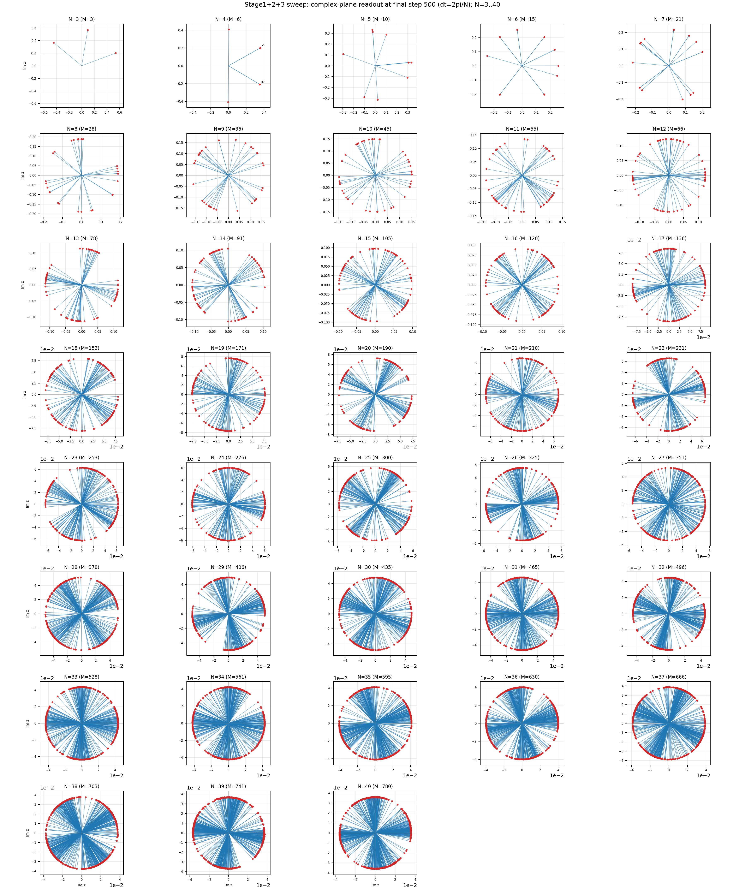
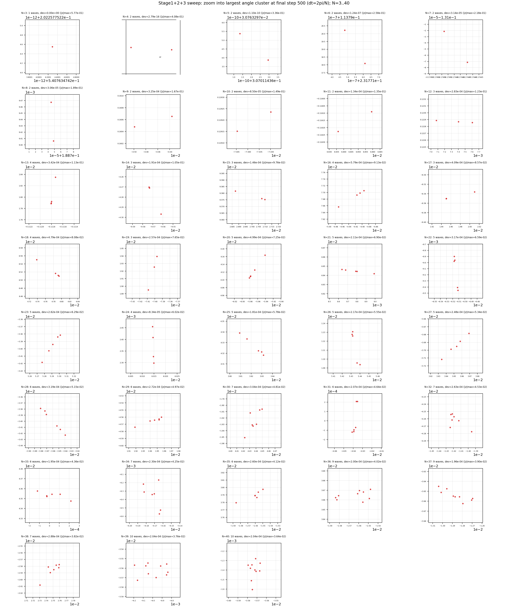

# インフレーションを起こす力学は、3つの部品でできていた

7月の記事「なぜ方向は三つで止まり、波はひとりでに増えるのか」で、不思議な現象を報告しました。測定にかからないほど小さな種——全体の1兆分の1のさらに1兆分の1のそのまた100万分の1ほどのエネルギー——が、外から何も加えていないのに、ひとりでに指数関数的に増幅して、宇宙初期のインフレーションを思わせる立ち上がりを見せたのです。

続く記事「インフレーションは、倒れかけの波にすでに書き込まれていた」では、この増幅が起こる仕組みを調べ、いくつかの主張を修正・撤回しながら、機構の核心に迫りました。

今回はその後続です。問いはひとつでした。

この増幅を起こしている力学は、いったい何でできているのか。

## やったこと

プログラムを1行ずつ変えて、走らせ直す。それだけを徹底的にやりました。

力学を3つの部品に分解します。

- 部品1: 波の集まり全体を回転させる基本の仕掛けと、時間の刻み方
- 部品2: 相互作用を組むときに、波の大きさを捨てて向きだけを使う正規化
- 部品3: 相互作用から特定の半分だけを取り出して、回転を実回転にする操作

そして、部品を1つずつ外した力学で、まったく同じ初期状態から走らせ直しました。初期状態は乱数の種の式から完全に決定的に作り直せるようにし、7月の計算が使った初期値とビット単位で一致することを毎回確認しています。

## 分かったこと

- 増幅が起こるのは、部品2と部品3が両方そろっているときだけでした。
- 部品2だけを外すと、増幅は最初の1歩で偽物にすり替わります。種よりはるかに大きなノイズが1歩目で注入され、種の増幅は観測できなくなります。
- 部品3だけを外しても同じです。1歩目でノイズが跳び込み、系は別の壊れ方をします。
- 部品2を最初に1回だけやっておく、という手抜きも試しました。これが一番激しく壊れます。正規化は毎ステップの掟であって、前処理ではありませんでした。
- 3部品そろえた力学を、系の大きさ N=3 から 40 まで全部で228通り走らせると、すべての走行で1歩目が種の大きさに留まり、そのほとんどで7月と同じ形の増幅曲線が現れました。この現象は特定の大きさの系の偶然ではありません。

## 図で見る

N=3 から 40 まで、38個の系すべての増幅曲線です。縦軸は、最初の波の組（親と呼んでいます）の外側にあるエネルギーの割合。下端が種の大きさ、上端が飽和です。どのパネルでも、種から始まる真っ直ぐな坂道——一定の倍率で増え続ける指数増幅——が現れています。

次の3枚は、同じ走行を別の窓から覗いたものです。780本の波の一本一本を、向きと大きさを持つ矢印として複素平面に打ってあります。

出発時。すべての波が4つの束にきれいに揃っています。これが親の形で、増幅曲線の出発点（種しかない状態）に対応します。

終了時。4つの束は消え、波はあらゆる方向へ散ったリング状になります。増幅曲線が登り切って飽和した状態の姿です。注目してほしいのは、リング上の波がほぼ完全に同じ振幅を持つことです。実測では、振幅が中央値の半分を下回る波はどの系にも1本もありませんでした。向きはばらばらに散り、大きさはきれいに揃う。これがこの力学の終状態の特徴です。

終了時のリングを最大限に拡大したものです。この図の窓は原点ではなく、リング上のひとつのクラスターを中心にした、リング半径の1万分の1ほどの極小範囲であることに注意してください。目盛の表示から点が小さな値に散っているように見えますが、ここに写る点はすべてリングと同じ振幅を持っています。読み取るべきは、同じ向きに集まった波たちが一点に完全には重ならず、ごくわずかに割れた緩い束になっていることです。増幅曲線には写らない、終状態の微細な組織です。

## 今回の主役は、検証のやり方です

この論文には物理の解釈を書いていません。書いたのは、誰でも同じ結果に到達できるための記録だけです。

- 7月の計算の再走行が、保存されていた数値と全行ビット一致すること
- 作り直した初期値が、7月の初期値とビット一致すること
- 228走行すべての開始状態が、その初期値とビット一致すること

この3段の照合が通って初めて、部品の抜き差しの比較に意味が生まれます。全ファイルにはSHA256という指紋の台帳を付け、数式とプログラムの行番号の対応表も付けました。

## 論文について

論文は研究向けで、かなりハードな内容です。総括と3つの章に分かれています。数式とプログラムの対応、検証の手順、全データの台帳が中心で、読み物としての面白さは期待しないでください。

日本語PDFはこちらから直接ダウンロードできます。

総括（全体の構成と同梱物の台帳）
https://raw.githubusercontent.com/WurabeSeiji/ai-chat-logs-open/main/次元の生成構造/電子の反跳実験/seed除去による準安定相追試/chatgpt追試/干渉保存力学_資格審査とシード無し系列_20260831/N3_N40_stage123_sweep_20260905/paper_overview/overview_stage123_sweep_ja.pdf

第1章 初期データの生成
https://raw.githubusercontent.com/WurabeSeiji/ai-chat-logs-open/main/次元の生成構造/電子の反跳実験/seed除去による準安定相追試/chatgpt追試/干渉保存力学_資格審査とシード無し系列_20260831/N3_N40_stage123_sweep_20260905/paper_ch1_static_parents/ch1_static_parents_ja.pdf

第2章 力学の定義とスイープ本体（主章）
https://raw.githubusercontent.com/WurabeSeiji/ai-chat-logs-open/main/次元の生成構造/電子の反跳実験/seed除去による準安定相追試/chatgpt追試/干渉保存力学_資格審査とシード無し系列_20260831/N3_N40_stage123_sweep_20260905/paper_ch2_sweep_dynamics/ch2_sweep_stage123_ja.pdf

第3章 複素平面の読出し図
https://raw.githubusercontent.com/WurabeSeiji/ai-chat-logs-open/main/次元の生成構造/電子の反跳実験/seed除去による準安定相追試/chatgpt追試/干渉保存力学_資格審査とシード無し系列_20260831/N3_N40_stage123_sweep_20260905/paper_ch3_complex_plane/ch3_complex_plane_ja.pdf

Zenodo（英語版・プログラム・全データ同梱、約710MB）
https://doi.org/10.5281/zenodo.22317636

7月の元論文（自発的分裂の開始と帰結の三分類）
https://doi.org/10.5281/zenodo.21486234
