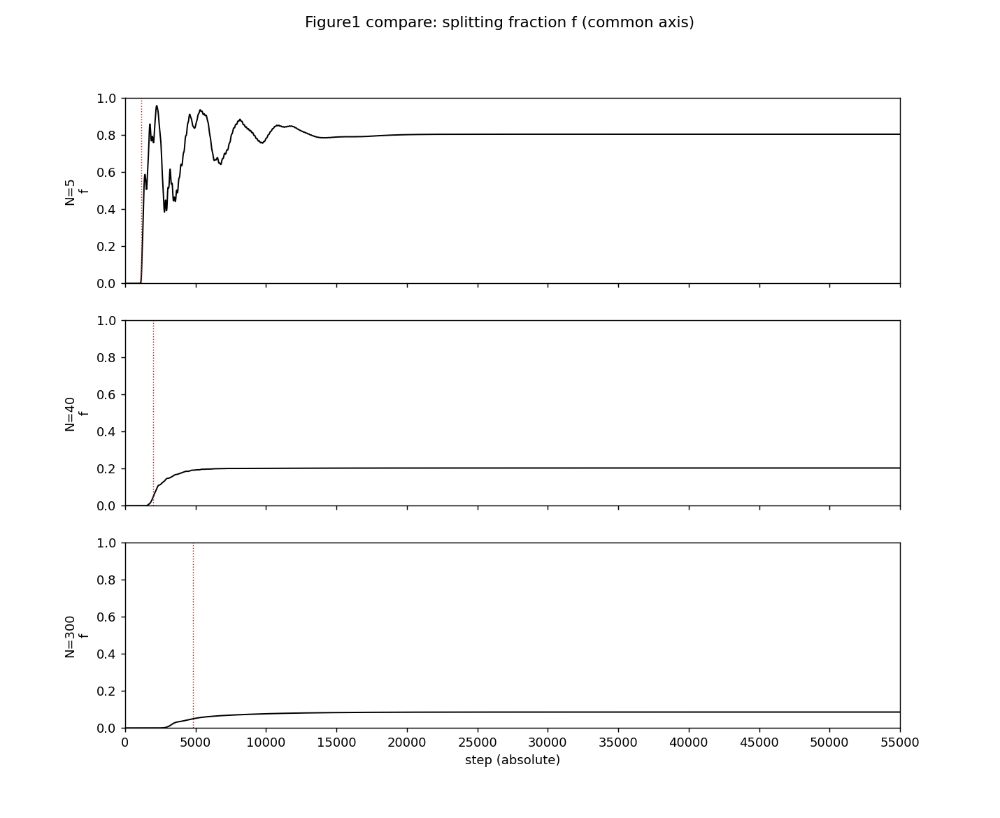
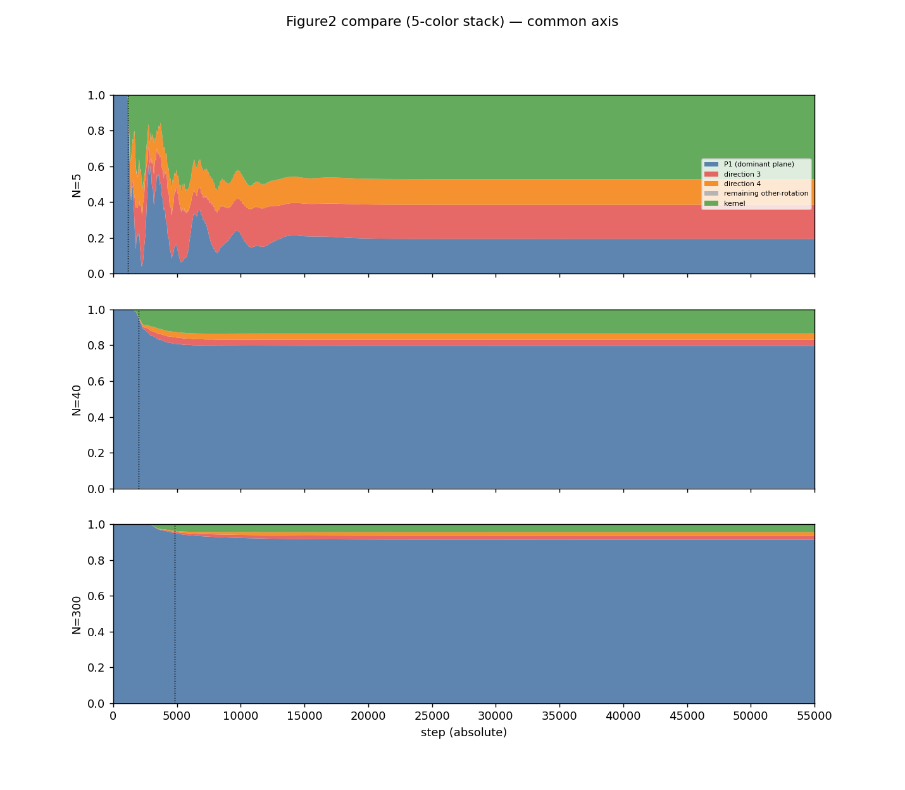
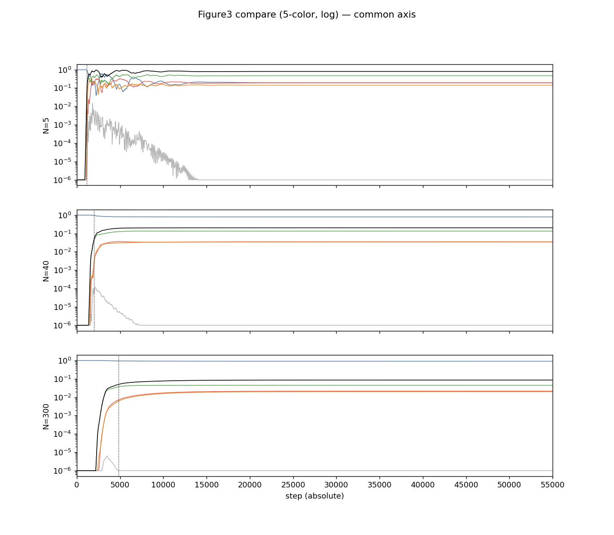
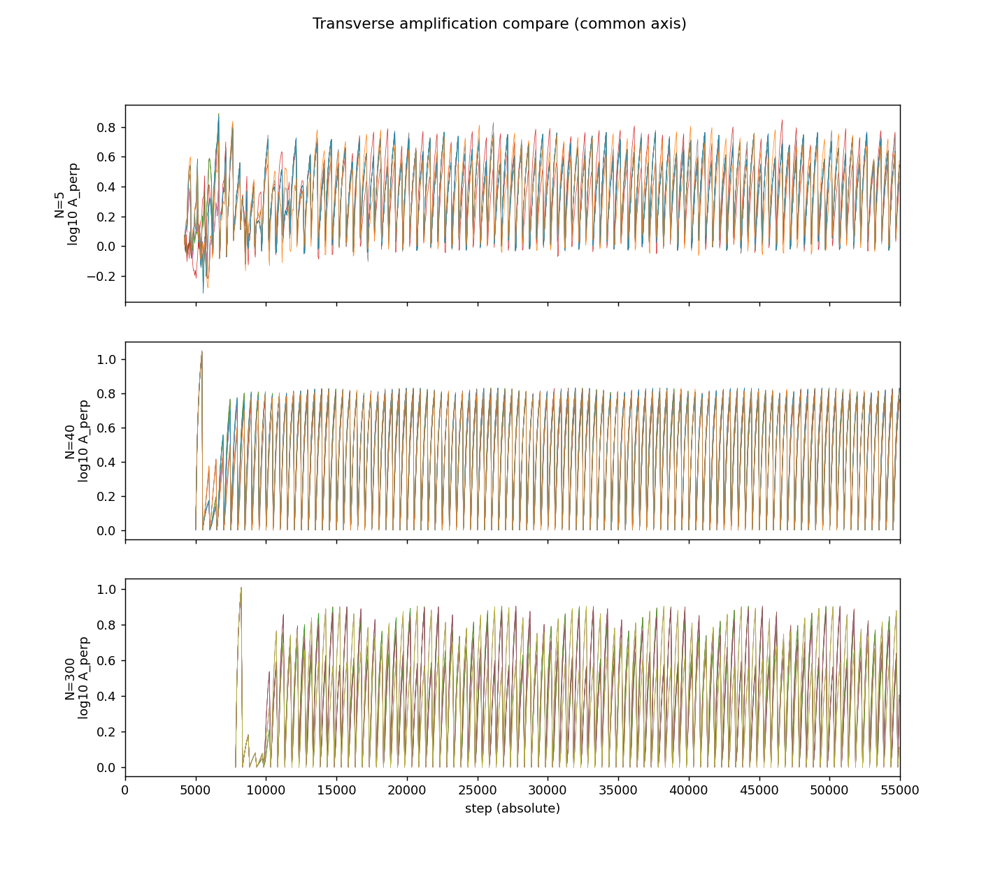

# Emergence of a Three-Direction Space in an N-Body Relational-Wave Closed System
## — Generation of a Third Direction from a Two-Direction Initial State and a Quasi-Stable Closure

**Noriaki Kihara**  
ORCID: 0009-0004-6753-4020  
July 26, 2026  
DOI: 10.5281/zenodo.21578402 (Concept DOI: 10.5281/zenodo.21578401)

---

## Abstract

In Paper 6 we showed that, in an N-body relational-wave closed system, spontaneous splitting stops simultaneously with the establishment of a new orthogonal rotation plane. That result raised the following question.

> Does an active subspace that starts from two directions successively generate a third, fourth, and fifth direction under time evolution?

This paper tests that question directly.

We tracked the two-direction initial states for N = 5, 40, 300 from absolute step 0 to 55000. An independent third space direction was generated outside the initial two directions, and a three-direction space was established. Because in the antisymmetric closed dynamics new directions appear as conjugate pairs, numerically the combined rank of the initial parent plane and the instantaneous dominant plane increases from 2 to 4. After the transition this rank of 4 was maintained at every recorded time.

On the other hand, within the investigated time-evolution range no new finite-occupation direction beyond three was observed. The system did not stop at a fixed point; it continued a bounded oscillation while keeping the three-direction occupation. Furthermore, a periodic amplification response was observed for small perturbations applied outside the three-direction closure. Therefore, directions beyond three are not established as finite occupation, but a transverse response that is their seed is inherent in the quasi-stable state.

The central result of this paper is the following.

$$
\boxed{
\text{A two-direction initial state generates a third direction and forms a dynamical quasi-stable closure consisting of a three-direction space.}
}
$$

This experiment also raised a new problem. The geometric-progression evolution observed in Paper 6 and here has an apparently flat period before its onset, and a small seed is given as an initial condition. In this paper we do not analyze this latent period and the internal structure of the seed. Given the scale invariance of the system, the flat period before the geometric-progression evolution may itself be a small quasi-stable state isomorphic to the quasi-stable oscillation observed here. This verification is the subject of the next paper.

---

## 1. The Problem Left by Paper 6

In Paper 6 we showed that a state localized on a single dominant plane amplifies outside the parent plane by phase feedback and re-localizes onto a new orthogonal rotation plane [5]. Combining the initial parent plane and the post-splitting dominant plane, the active subspace became four-dimensional.

However, there we did not determine what the new plane means. In particular, it was unresolved whether direction creation ends once, or whether the number of directions keeps increasing successively by the same mechanism.

Therefore, in this paper we tracked the time evolution without assuming the following.

$$
\text{two directions}
\longrightarrow
\text{three directions}
\longrightarrow
\text{four directions}
\longrightarrow\cdots
$$

The aim of the experiment is to determine, from long-time series and subspace rank, how far the number of directions actually increases.

The result was clear.

1. A third space direction was generated from the two-direction state.
2. Afterward, up to 55000 steps, no finite-occupation direction beyond three was generated.
3. The three-direction state did not become static; it continued a quasi-stable oscillation.
4. A transverse response that amplifies small perturbations remained outside the closure.

Therefore, direction creation is not a simple infinite sequence; after a three-direction space is established, it transitions to a dynamical quasi-stable phase.

---

## 2. Definition of the System

### 2.1 Complete two-body relational space

We represent the complete two-body relations of N unnamed vertices as edges. The number of edges is

$$
M=\binom{N}{2}=\frac{N(N-1)}{2}
$$

and the state is

$$
Z\in\mathbb C^M .
$$

The state satisfies

$$
Z^\dagger Z=1,
\qquad
Z^T Z=0 .
$$

We call the latter the null-square closure. Writing $Z=X+iY$,

$$
\|X\|=\|Y\|,
\qquad
X\cdot Y=0 .
$$

Thus one complex state is represented by two orthogonal directions in the real space.

### 2.2 State-dependent antisymmetric generator

From each edge phase

$$
\theta=\arg Z
$$

we construct the real antisymmetric generator

$$
K(\theta)=WJW^T,
\qquad
K^T=-K .
$$

With the maximum rotation rate denoted $\sigma_1$, we normalize as

$$
\widetilde K=\frac{K}{\sigma_1} .
$$

Time evolution is given by the Cayley update

$$
Z_{\tau+1}
=
\left(I-\gamma\widetilde K_\tau\right)^{-1}
\left(I+\gamma\widetilde K_\tau\right)Z_\tau,
\qquad
\gamma=\tan\frac{\pi}{144} .
$$

Since the Cayley matrix is a real orthogonal matrix, it conserves

$$
Z^\dagger Z,
\qquad
Z^T Z .
$$

### 2.3 Two-direction initial state and seed

The initial parent state $v$ satisfies, as the dominant eigenmode of the generator,

$$
K(\arg v)\,v=-i\sigma_1 v .
$$

The corresponding initial parent plane is

$$
P_1=\operatorname{span}\{\Re v,\Im v\},
$$

which consists of two real directions.

A small seed $g$ is added to the initial state:

$$
Z_0=\frac{v+\delta g}{\|v+\delta g\|},
\qquad
\delta=10^{-15} .
$$

In this paper we fix this seed as an experimental condition. The origin of the seed, its amplitude dependence, its direction dependence, and its relation to the latent period before the geometric-progression evolution are verified in the next paper.

---

## 3. Operational Definition of the Number of Directions

The basic unit of motion of the antisymmetric generator is a two-dimensional rotation plane [6]. Let $B_0$ be an orthonormal basis of the initial parent plane and $B_{\mathrm{dom}}(\tau)$ the instantaneous dominant plane at each time.

For the combined matrix

$$
Q(\tau)=[B_0\mid B_{\mathrm{dom}}(\tau)]
$$

let the singular values be

$$
q_1\ge q_2\ge q_3\ge q_4\ge0 .
$$

Before the transition,

$$
q_3=q_4=0,
\qquad
\operatorname{rank}Q=2,
$$

and the instantaneous dominant plane lies within the initial parent plane.

If after the transition

$$
q_3>0,
\qquad
q_4>0,
\qquad
\operatorname{rank}Q=4,
$$

then the instantaneous dominant plane has acquired an independent component outside the initial two directions.

In the antisymmetric dynamics that preserves the null-square closure, new directions are established as conjugate pairs. In this paper we read one of them as the third space direction and the other as the closure-conjugate direction. Therefore the emergence of a three-direction space is measured numerically as

$$
\boxed{
\operatorname{rank}Q:2\longrightarrow4 } .
$$

---

## 4. Numerical Experiment

### 4.1 Targets and observation time

We used

$$
N=5,\quad40,\quad300 ,
$$

with edge numbers

$$
M=10,\quad780,\quad44850 ,
$$

respectively.

The whole system was tracked on the common absolute time axis

$$
0\le\tau\le55000 .
$$

The onset time of direction generation was defined as the first step where the splitting fraction $f>0.05$.

| N | onset step |
|---:|---:|
| 5 | 1167 |
| 40 | 2011 |
| 300 | 4844 |

### 4.2 Five-component decomposition

The conserved norm was decomposed into the following five groups.

1. Initial dominant plane $P_1$
2. New direction 3
3. New direction 4
4. Remaining rotation subspace
5. Generator kernel

New directions 3 and 4 were constructed as the two directions orthogonal to $B_0$ within the time-dependent subspace

$$
S_4(\tau)=\operatorname{orth}[B_0\mid B_{\mathrm{dom}}(\tau)] .
$$

The sum of the occupations closes to 1 at all times.

---

## 5. Results

### 5.1 A third direction was generated from the two-direction state

For all of N = 5, 40, 300, before the transition

$$
\operatorname{rank}Q=2 ,
$$

and after the transition, at every recorded time,

$$
\operatorname{rank}Q=4 .
$$

The numerical-rank threshold is $10^{-8}$, and rank 4 was maintained at all 761 recorded points after the transition.

The values of $q_3,q_4$ in the quasi-stable region are as follows.

| N | $q_3$ | $q_4$ |
|---:|---:|---:|
| 5 | 0.751 | 0.631 |
| 40 | 0.338 | 0.311 |
| 300 | 0.200 | 0.195 |

Therefore, the three-direction space is not given as an initial condition. It was generated from the two-direction initial state by time evolution.

### 5.2 The splitting fraction moved to a finite value

**Figure 1:** The splitting fraction $f=1-E_{P_1}$ for N = 5, 40, 300. Each system moves, after a geometric-progression onset, to a finite quasi-stable region. The onset times are 1167 (N=5), 2011 (N=40), 4844 (N=300).

The final-time splitting fractions were

| N | $f$ |
|---:|---:|
| 5 | 0.805 |
| 40 | 0.204 |
| 300 | 0.086 |

For N = 40, 300 the splitting stops while most of the norm remains in the initial parent plane. Therefore the stopping is not depletion of the parent-plane norm.

### 5.3 Three-direction quasi-stable closure

**Figure 2:** Five-component occupation for N = 5, 40, 300. Shown are the initial dominant plane, new direction 3, new direction 4, the remaining rotation subspace, and the kernel. The black line is the splitting fraction $f$.

The final-time occupations are as follows.

| N | $P_1$ | dir 3 | dir 4 | remaining rot. | kernel | sum |
|---:|---:|---:|---:|---:|---:|---:|
| 5 | 0.195 | 0.190 | 0.143 | $\simeq0$ | 0.472 | 1.000000 |
| 40 | 0.796 | 0.034 | 0.035 | $\simeq0$ | 0.134 | 1.000000 |
| 300 | 0.914 | 0.021 | 0.020 | $\simeq0$ | 0.045 | 1.000000 |

The remaining rotation subspace becomes nearly zero in the quasi-stable region, and the finite occupation closes to the initial plane, new direction 3, new direction 4, and the kernel.

**Figure 3:** Logarithmic display of the five-component occupation. Even after the third direction is generated, each occupation does not converge to a perfect constant but continues a small bounded oscillation.

In this paper we call a state satisfying the following a three-direction quasi-stable closure.

$$
Z^\dagger Z=1,
\qquad
Z^T Z=0,
$$

$$
\operatorname{rank}Q=4,
$$

$$
E_{P_1},E_3,E_4,E_{\ker}
\text{ remain in a bounded region while continuing to vary in time.}
$$

This is not a static fixed point. It is a dynamical closure after a three-direction space is established.

### 5.4 Within the investigated time it did not increase beyond three directions

In the natural time evolution from absolute step 0 to 55000, no new finite-occupation band corresponding to a fifth or sixth direction was observed.

The remaining rotation subspace stayed nearly zero in the quasi-stable region, and no new finite band appeared in the occupation spectrum.

Therefore, for this experimental condition and observation time,

$$
\boxed{
\text{direction generation reached a three-direction quasi-stable closure.}
}
$$

### 5.5 Seeds of directions beyond three

To examine whether the three-direction closure is a completely static final state, we applied small perturbations in the quasi-stable region to the orthogonal complement of the active four-dimensional subspace $S_4(\tau)$.

**Figure 4:** Time evolution of small perturbations applied outside the three-direction closure. A periodic amplification response was observed for all of N = 5, 40, 300.

The maximum finite-time transverse growth rates obtained with the current implementation are

| N | $\lambda_{\perp,\max}$ | $\lambda_{\perp,\max}/\sigma_1$ |
|---:|---:|---:|
| 5 | $2.917\times10^{-3}$ | $7.305\times10^{-4}$ |
| 40 | $3.765\times10^{-3}$ | $9.653\times10^{-5}$ |
| 300 | $3.614\times10^{-3}$ | $1.209\times10^{-5}$ |

and a positive sign was reproduced for multiple seeds and multiple perturbation amplitudes.

This result shows that, while no finite occupation beyond three directions appears on the natural orbit, an amplifiable transverse direction remains outside the quasi-stable closure. Therefore, directions beyond three are inherent in the quasi-stable state not as completed new directions but as their seeds.

---

## 6. Numerical Verification

### 6.1 Conservation and projection closure

For all N,

- maximum conservation error: $2.0\times10^{-15}$
- maximum five-component projection-closure error: $2.2\times10^{-16}$ .

### 6.2 Agreement of the exact and low-rank methods at N=40

For N = 40, we compared the dense-matrix eigendecomposition and the low-rank $JG$ method on the same orbit.

| quantity | maximum deviation |
|:--|--:|
| five-component occupation | $1.78\times10^{-15}$ |
| splitting fraction $f$ | $1.78\times10^{-15}$ |
| onset step | agree (2011) |
| fixed parent-basis dimension | agree |

The low-rank method reproduced the dense-matrix method within double precision. The N = 300 results use this verified low-rank method.

### 6.3 Complete eigendecomposition

For N = 5 we performed a complete eigendecomposition of $H=iK$ as a Hermitian matrix and confirmed the following.

- eigenpair residual: $7.5\times10^{-15}$
- positive–negative pair error: $6.7\times10^{-15}$
- state-decomposition closure: $3.3\times10^{-15}$
- non-degenerate inter-plane orthogonality: $\le 9.7\times10^{-13}$

For N = 40 as well, we obtained an eigenpair residual of $2.4\times10^{-13}$ and a state-decomposition closure of $5.7\times10^{-15}$.

### 6.4 Implementation issue in the transverse-perturbation analysis

In the transverse-perturbation Benettin analysis, after renormalizing the physical perturbed state, the warm-start internal state of the iterative eigenvalue solver is not fully synchronized to the baseline orbit. For this reason, the quantitative values of the transverse growth rate may contain an iteration-history difference.

This issue affects Figure 4 and the quantitative evaluation of $\lambda_\perp$. It does not affect

$$
\operatorname{rank}Q:2\to4,
$$

the five-component occupation, the three-direction quasi-stable closure, or the non-appearance of additional finite directions up to 55000 steps, which are obtained directly from the natural orbit.

In the next paper we will re-measure the transverse response with a control computation in which the internal state is synchronized.

---

## 7. The Flat Period before the Geometric-Progression Evolution

In this experiment there is an apparently almost flat latent period before direction generation becomes visible, and a seed $\delta=10^{-15}$ is given as an initial condition.

Paper 6 and this paper confirmed the geometric-progression evolution from the seed to finite occupation. However, the following two points have not yet been examined.

1. From which layer the seed was formed.
2. What kind of small motion proceeds in the flat period before the geometric-progression evolution.

If the system is scale-invariant, the flat period before the visible geometric-progression evolution may itself be, rather than a true rest state, a state that is the quasi-stable oscillation observed in Figure 3 shrunk to a minimal scale.

That is,

$$
\boxed{
\text{the initial flat period may be a small quasi-stable phase before the next direction creation.}
}
$$

This possibility is a verification task discovered from the results of this paper. We do not include it in the conclusion of this paper; in the next paper we verify it by high-precision computation, seed sweeps, phase alignment, and scale comparison of early and late waveforms.

---

## 8. Conclusion

This paper tracked, over a long time, how the new orthogonal rotation plane discovered in Paper 6 subsequently evolves.

What we first expected was the possibility that a two-direction state successively generates a third, fourth, and fifth direction by time evolution.

The results obtained in the experiment are as follows.

1. A third space direction was generated from the two-direction initial state.
2. The active-subspace rank before the transition is 2 and after the transition is 4; the third direction was established by time evolution.
3. A three-direction quasi-stable closure was formed for all of N = 5, 40, 300.
4. Up to 55000 steps, no new finite-occupation direction beyond three was observed.
5. The three-direction closure is not a fixed point; it continued a bounded quasi-stable oscillation.
6. Small perturbations outside the closure had a periodic amplification response, and seeds of directions beyond three were observed.

Therefore, the conclusion of this paper is the following.

$$
\boxed{
\text{In an N-body relational-wave closed system, a third direction is generated from a two-direction initial state, and a three-direction space is established as a dynamical quasi-stable closure.}
}
$$

And this paper newly left the following question.

$$
\boxed{
\text{Is the flat period before the geometric-progression evolution also a quasi-stable state at a smaller scale?}
}
$$

This question, together with the origin of the seed, is verified in the next paper.

---

## 9. Verification Tasks for the Next Paper

1. Relation between seed amplitude and onset time
2. Relation between seed direction and generated direction
3. Dependence on numerical precision and the floating-point floor
4. Extraction of the small oscillation before the geometric-progression evolution
5. Time- and amplitude-scale comparison of the initial latent phase and the late quasi-stable phase
6. Synchronization of the warm-start internal state at Benettin renormalization
7. Re-measurement of the transverse growth rate outside the three-direction closure

---

## References

### Self-citations

[1] N. Kihara, "Linear upper bound on generator rank and three-direction saturation in N-body complete two-body relational waves," Zenodo, Concept DOI: 10.5281/zenodo.21465898, 2026.

[2] N. Kihara, "Plane-decomposition readout in N-body fixed-generator systems," Zenodo, Concept DOI: 10.5281/zenodo.21468959, 2026.

[3] N. Kihara, "Onset and three-way classification of outcomes of spontaneous state splitting in an N-body relational-wave closed system," Zenodo, Concept DOI: 10.5281/zenodo.21486233, 2026.

[4] N. Kihara, "The number of waves is the resolution of the system," Zenodo, Concept DOI: 10.5281/zenodo.21486544, 2026.

[5] N. Kihara, "Arrest of spontaneous splitting and emergence of a new orthogonal rotation plane in an N-body relational-wave closed system," Zenodo, Concept DOI: 10.5281/zenodo.21543070, 2026.

### External references

[6] R. A. Horn and C. R. Johnson, *Matrix Analysis*, 2nd ed., Cambridge University Press, 2013.

[7] A. Taghavi-Chabert, "Twistor Geometry of Null Foliations in Complex Euclidean Space," *SIGMA*, 13, 005 (2017). DOI: 10.3842/SIGMA.2017.005; arXiv:1505.06938.

[8] M. L. Walker, "Spontaneous Emergence of a Causal Time Axis in Euclidean Space from a Gauged Rotational Symmetry Theory," *Symmetry*, 16(1), 4 (2024). DOI: 10.3390/sym16010004.

[9] F. D. T. Smith, "Higgs and Fermions in D4-D5-E6 Model based on Cl(0,8) Clifford Algebra," arXiv:hep-th/9403007 (1994).

[10] N. Furey, "Three Generations, Two Unbroken Gauge Symmetries, and One Eight-Dimensional Algebra," *Physics Letters B*, 785, 84–89; arXiv:1910.08395.

[11] I. Todorov, "Octonion Internal Space Algebra for the Standard Model," *Universe*, 9(5), 222 (2023). DOI: 10.3390/universe9050222; arXiv:2206.06912.

[12] C. A. Manogue, T. Dray, and R. A. Wilson, "Octions: An E8 Description of the Standard Model," *Journal of Mathematical Physics*, 63, 081703 (2022). DOI: 10.1063/5.0095484; arXiv:2204.05310.

---

## Reproducibility

The long-time runs, five-component decomposition, figures, and numerical tables of this paper can be regenerated from the following artifacts.

- `run_n_scaling_lowrank_v1.py`
- `run_paper7_5color_timeseries.py`
- `run_paper7_transverse.py`
- `run_paper7_transverse_cached.py`
- `run_paper7_exact_vs_approx_N40.py`
- `make_paper7_figures.py`
- `paper7_long_timeseries.csv`
- `transverse_stability_timeseries.csv`
- `N_comparison_table.csv`
- `transverse_stability_summary.csv`

The original time-evolution engine was not modified. For N = 40 the dense-matrix method and the low-rank method agreed within double precision.
