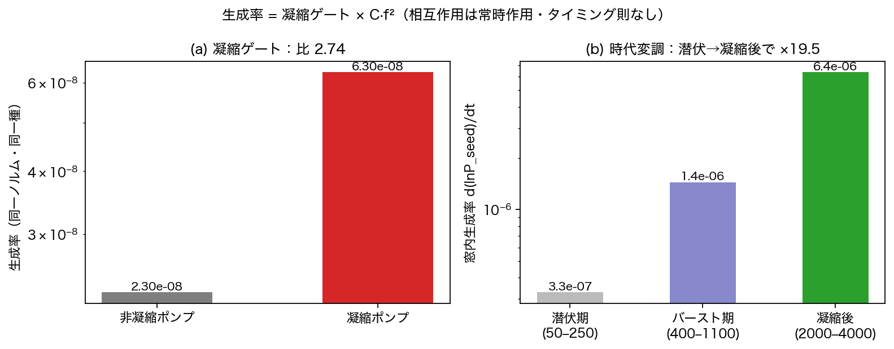

# The Timing Was Determined Without Being Told — How Inflation Ends Is How Matter Generation Begins

Noriaki Kihara  
August 6, 2026

In the previous articles I reported two stories.

Story one. Our wave model, starting only from a clear coherent wave on the verge of tipping over, undergoes rapid expansion on its own (inflation), gives birth to three directions, and stops.

Story two. A single IF-free equation that sees only wave shapes generates matter-like structure — induced by a seed, at a rate proportional to the seed's own square, always bringing along an antimatter partner.

There was, in fact, a serious problem with these two stories.

**They were not connected.**

At the end of the first story, spacetime exists but there is no matter. In the second story, we know how to make matter but there is no universe. The "collision" was a programming operation — turning a loop — and nobody had answered when or where collisions happen.

The new paper closes this gap.

And to give away the conclusion — **the timing was determined without being told.**

## The temptation to cheat

There is an easy way to connect the two stories. Just write:

If inflation has finished, then switch on matter generation.

But in our model this is a foul.

The interaction of this series is built under the discipline that it sees only the shapes of the two waves and may know nothing else. We have forbidden even the IF statement that distinguishes bosons from fermions. Writing the test "is inflation over yet?" is the same foul. A model that invokes its interaction only when convenient has no standing to speak about generation.

So there was only one possible design.

**Keep the interaction acting at all times, from beginning to end.**

And leave "when matter appears to be born" to the model's output. If nothing comes out, the theory ends there.

## The timing came out as physics

The result was clean.

With the interaction always on, the speed of generation turned out to be the product of two factors:

generation rate = condensation gate × (seed fraction) squared

The second factor is exactly the autocatalytic law of the previous article. The new one is the first — the condensation gate.

We compared runs with the same energy and the same seed, changing only the background wave. When the background is a condensed wave — that structure where the rapid expansion has stopped and settled into three directions — generation is 2.74 times faster.

(Insert Figure 1 here: `次元の生成構造/万能相互作用多体接続_v1/fig_mb2_gate_v1.png`)

Figure 1. Left: whether the background is condensed changes the generation rate by a factor 2.74, everything else equal. Right: in the end-to-end run of the universe, the generation rate opens up by a factor of about 20 with the passing eras.

And here is the thing to notice.

The condensed three-direction structure is **the ending of story one**. It is the terminus of inflation.

In other words — the way inflation ends (condensation into three directions) is, itself, the way matter generation begins (the opening of the gate). The two stories were not neighboring events in time; they were **the same single transition, seen from two different sides**.

That is where the title comes from.

## The end-to-end run — a history of the universe, with no switches

Does it really run end to end?

We dropped one tiny pinch of seed into the vacuum and ran the single dynamics for 4000 steps. No era switches, no parameter changes, nothing.

(Insert Figure 2 here: `次元の生成構造/万能相互作用多体接続_v1/fig_mb8_genesis_v1.png`)

Figure 2. Top: the vacuum, after a latency, amplifies exponentially and condenses into three directions. Middle: the clock-like quantity. Bottom: the generation rate opens up with the eras. There is no switch anywhere.

Vacuum → inflation → condensation → precipitation of matter ran in one continuous sweep.

## A failed prediction revealed the most important thing

There is one embarrassing story in this run. It became the biggest discovery.

Before running, we predicted and registered the ignition time of inflation: steps 1161–1171. The measurement: step 555. Badly wrong.

We diagnosed the cause, and were astonished.

**The seed we had put in for matter was igniting inflation as well.**

We had assumed, in our heads, that the "seed of inflation" and the "seed of matter" were separate roles. But plug the size of the matter seed into the law established two papers ago (the relation between seed size and ignition time), and the prediction becomes step 543 — agreeing with the measured 555 to two percent.

The seed was one.

The same single tiny fluctuation acts, early on, as the seed that builds spacetime, and after condensation, as the seed that becomes matter. The initial fluctuations of the universe and the origin of matter contract into a single cause — that structure emerged inside this model.

(Insert Figure 3 here: `次元の生成構造/万能相互作用多体接続_v1/fig_mb9_causal_v1.png`)

Figure 3. The whole paper in one causal diagram. From one seed, a branch that builds spacetime and a branch that becomes matter split off, and they merge again in the generation-rate formula. There is no timing rule anywhere.

## The question of place — where does "nearness" live?

One more delightful result.

The N-body system of this model has one "relational wave" living on every pair of bodies. With N bodies there are N(N−1)/2 relations, and which relations can interact is decided by whether they share a body.

So: if we concentrate the seed around a subset of bodies on this network of relations, does generation speed up?

It does not. Concentration on the network barely changes the rate (factors 1.3 and 1.0).

But concentrate the seed in waveform position (the axis we call the register), and generation becomes **19.6 times** faster. Moreover, the matter that is generated stays pinned at the position where it was born.

So in this model, "nearness" does not live on the network. **Position lives on the waveform axis.** The lines of the network say who is related to whom — not where anyone is.

Furthermore, when we install the dispersion relation derived in the earlier acceleration paper onto the waveform axis, a lump of matter moves at constant velocity without changing its shape at all. In three dimensions, all three velocity components match the prediction with zero deviation. Particles have positions, and they move.

## The direction lottery, and why matter remains

The previous article explained that generation has a matter side and an antimatter side. In the many-body sea, which way it goes is decided by the seed's phases — a nearly 50/50 lottery (52 percent matter-side over 50 random-phase seeds).

If it is fifty-fifty, why does net matter remain?

Because the autocatalysis makes whichever side has grown grow even faster. The side that gets ahead in the lottery accelerates under the square law. Running twenty universes, 80 percent grew net. With no symmetry breaking put in by hand, the bias survives out of reversible elementary processes and autocatalysis alone.

To be honest, though: the net amount at this stage is tiny (0.13 percent on average), and we do not yet claim this explains the matter dominance of the real universe. Whether the bias survives as the system grows is the next test.

## The failures are all written down

As always, the record of mistakes is in the paper. Five this time: twice we measured, in a conservation test, a quantity that was never supposed to be conserved; twice we built the generation-rate predictor wrongly; and once our motion gauge was reading a quantity that is mathematically identically zero. Having stepped on the same rake three times, we wrote the lesson out as a discipline — derive the properties of the quantity you measure before designing the instrument.

We also tested an internal hypothesis that something special happens when the register count is set to values like 137 or 248. The answer, on every instrument: nothing happens. A null result is recorded with the same weight as a positive claim.

## Summary

- The two stories (formation of spacetime, generation of matter) were not connected
- Teaching the timing by hand is a foul; we kept the interaction always on
- Then the timing came out as physics: generation rate = condensation gate × seed squared
- Condensation is the terminus of inflation itself. **How inflation ends is how matter generation begins**
- Vacuum → inflation → condensation → matter, demonstrated in one switchless run
- What the failed prediction revealed: the seed that builds spacetime and the seed that becomes matter are the same single fluctuation
- Position lives not on the network but on the waveform axis; particles have birthplaces and move
- The direction is a fifty-fifty lottery; net matter is left by autocatalytic rectification

One tiny fluctuation first builds a universe, and then becomes its contents.

Erase the "when," and the "when" comes back as a function of the state of the universe — that is the main report of this paper.

## Links to the paper

This paper (Japanese and English full texts and PDFs)

Concept DOI (always the latest version)  
https://doi.org/10.5281/zenodo.21809814

Version DOI (v1)  
https://doi.org/10.5281/zenodo.21809815

Zenodo record  
https://zenodo.org/record/21809815

All experiment programs, raw data, and figures are committed to the GitHub repository, with the judgment criteria and predictions fixed and recorded before execution.

The two-body paper (the mechanism of matter generation)  
https://doi.org/10.5281/zenodo.21808091

The onset-mode paper (the condition for inflation)  
https://doi.org/10.5281/zenodo.21798854

The previous article  
"Antimatter Came Out Without Being Put In — How the Grammar of Matter Emerged from a Single Equation That Knows Nothing"  
https://note.com/kiharanoriaki/n/n280577cf8bf8

Japanese version of this article  
https://note.com/kiharanoriaki/n/ne63f6e6d1e43

---

#TheoreticalPhysics #MathematicalPhysics #Cosmology #Inflation #MatterGeneration #BigBang #PrimordialFluctuations #ParticlePhysics #Emergence #Autocatalysis #Condensation #Waves #Anonymity #IndependentResearch #Preprint #Zenodo #NumericalExperiment #Simulation #ThoughtExperiment #Antimatter
