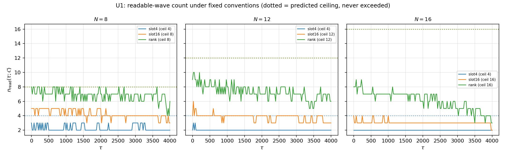
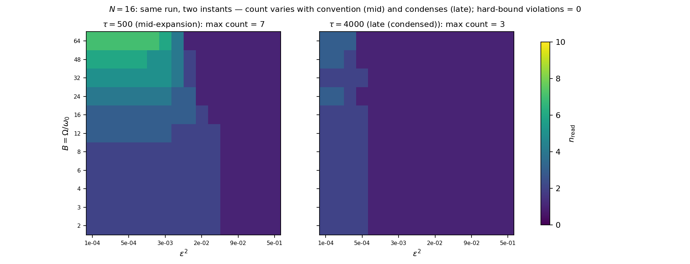
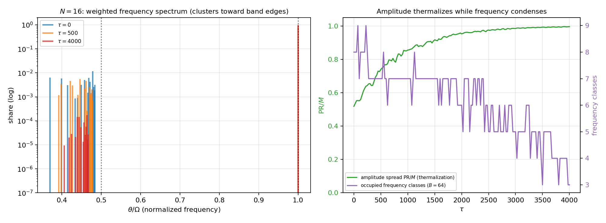

# The Number of Waves Is the Resolution of the System
## Externality of counting in closed systems and steady-state underfilling — once a way of counting is fixed, the readout count has a ceiling; the dynamics can transiently reach it, but the steady state stabilizes below it

**Author:** Noriaki Kihara 
**ORCID:** 0009-0004-6753-4020 
**Date:** July 22, 2026 
**Version DOI:** 10.5281/zenodo.21486545 
**Concept DOI:** 10.5281/zenodo.21486544 
**Position:** Dimensional Generation Structure series, Paper 6, v1

---

## Abstract

This paper presents two claims.

**Claim 1 (externality of counting)** The number of waves $\mathcal N$ is nothing but the number of terms $\mathcal N$ of the closure $\sum_{k=1}^{\mathcal N} x_k^2=0$ — the maximum harmonic index with respect to the base frequency when one writes $\sum_{k=1}^{\mathcal N} x_k^2=R^2$, that is, the resolution of the system itself — and it is not a quantity the system determines internally. This is not an assumption. It is a consequence of zero closure (Axiom 1 [1]: the zero on the right-hand side designates no privileged basis, no fundamental oscillation, and no decomposition depth), of the anonymity of components (Axiom 0 [1]: components are not intrinsic individuals but coordinates of a chosen decomposition), of the unreadability of phase (Axiom 5 [1]), and of the flattening of the closure tower (no internal readout can distinguish a reorganization of harmonics; Section 3): no internal readout exists whose result is $\mathcal N$, and $\mathcal N$ belongs to the specification of the representation, not to the state. The externality of $\mathcal N$ is equivalent to the preservation of anonymity (representation independence), and scale anonymity (Axiom 0.5 [2]) is one facet of it. The symbols are shared with Paper 5: $\mathcal N$ is the number of terms of a decomposition, $N$ is the number of bodies of the experimental model (a structural specification, an external input), and $k$ is a summation index.

**Claim 2 (conditional ceiling and underfilling)** Once a way of counting — a counting convention $\mathcal C=(\omega_0,\varepsilon)$ (a frequency resolution and a relative amplitude floor) — is given, the number of readable waves acquires a ceiling $n_{\max}(\mathcal C)=\min(\lfloor\Omega/\omega_0\rfloor,\ 1/\varepsilon^2)$. This ceiling is transiently attainable under the iterated dynamics. In the steady state, however, the system does not reach the ceiling and stabilizes below it.

Implementation of Claim 2 (measurements): in the unfrozen dynamics of the N-body relational-wave model ($N=8,12,16$), for every convention examined, the time series of the readout count and the convention grids (352 cells × 2 series plus a supplementary grid) never exceeded the ceiling (zero violations of the hard upper bound); transient contact with the ceiling was observed ($N=8$); and the steady state remained at filling ratios of $0.1$–$0.4$. Cause of Claim 2 (mechanism): although the amplitudes thermalize (the participation ratio $\mathrm{PR}/M$ rises from $0.52$ to $1.0$), the frequencies condense toward the band edge (the number of occupied frequency classes drops from $8$ to $3$), so the number of readable frequency classes decreases. The coexistence of amplitude thermalization and frequency condensation is the characteristic structure of this dynamics.

Both pillars of the ceiling come from closure. The amplitude-floor ceiling $1/\varepsilon^2$ is a pigeonhole consequence of the fixed sum of allocation ratios (= closure) and disappears in open systems. The frequency-slot ceiling $\lfloor\Omega/\omega_0\rfloor$ comes from the upper band limit of the discrete update (Nyquist type [7]). The value of the ceiling, however, is a ratio of conventions and is relative to the convention — **that a ceiling exists is a consequence of closure (convention invariant); what the ceiling is equals a convention (relative)**. This two-layer structure is made explicit in the statement of the theorem.

We also show that a reanalysis of one and the same run under a grid of conventions alone changes the readout count from $1$ to $7$ (the count is an attribute of the readout), and that with a fixed floor the ceiling is finite while lowering the floor without limit raises the ceiling without limit (why the number of waves appears to grow indefinitely) — two readings of the single ratio $\Omega/\omega_0$. Standard theory has counterparts — the resolution dependence of parton number [10] and the observer dependence of particle number [9]. This paper does not replace them; it is an alternative mapping that produces the same structure from closure and scale anonymity, and then adds the theorem on the ceiling obtained once the way of counting is fixed.

---

## 0. Conclusions

$$
\boxed{
\begin{aligned}
&\text{The number of waves }\mathcal N\text{ is the resolution of the system and is not determined internally}\\
&\text{(a consequence of zero closure and anonymity).}\\
&\text{Fixing a way of counting imposes a ceiling }\min(\lfloor\Omega/\omega_0\rfloor,\ 1/\varepsilon^2)\text{ on the readout count;}\\
&\text{the dynamics can transiently reach it, but the steady state does not attain it and stabilizes below it.}\\
&\text{The cause is the coexistence of amplitude thermalization and band-edge frequency condensation.}
\end{aligned}
}
$$

That a ceiling exists is a consequence of closure and does not depend on the convention. What the ceiling is equals a ratio of the convention and moves covariantly as the floor is exchanged. Lowering the floor without limit raises the ceiling without limit — the number of waves appears to grow indefinitely not because existence increases, but because the observational floor descends. With a fixed floor the ceiling is finite — this is the structure closure imposes on the operation of counting.

---

## 1. The Claims

### 1.1 Claim 1: externality of counting

> The number of waves $\mathcal N$ is nothing but the number of terms $\mathcal N$ of $\sum_{k=1}^{\mathcal N} x_k^2=0$ — the maximum harmonic index with respect to the base frequency $R$ when one writes $\sum_{k=1}^{\mathcal N} x_k^2=R^2$, that is, the resolution of the system itself — and it is **not a quantity the system determines internally**. This is not an assumption but a consequence of zero closure, the anonymity of components, the unreadability of phase, and the flattening of the closure tower.

- **Implementation (numerical demonstration)**: applying a grid of counting conventions (frequency resolution × amplitude floor) to one and the same run data, by reanalysis alone, changes the readout count from $1$ to $7$ (Section 5, Experiment U2). The count is decided not by the run but by the way of reading
- **Supporting structure (consistency)**: the closure-tower theorem (Section 3) guarantees that every decomposition into any $\mathcal N$ is a legitimate reading of the same closure — a harmonic of a harmonic is a harmonic, and grouping into blocks is merely a choice of intermediate basis

The dynamical expression of Claim 1 is "$\mathcal N$ does not saturate." Lining up what saturates and what does not across the series locates Claim 1.

| Quantity | Behavior |
|---|---|
| Number of terms of a decomposition $\mathcal N$ (layer of existence) | **Does not saturate** — the axioms admit any $\mathcal N$; no internal mechanism determines $\mathcal N$ |
| Number of bodies $N$ (model specification) | External input (structural specification of the representation; the flat representation has $M$ terms) |
| Number of relational waves $M=O(N^2)$ | Unbounded |
| Generator rank | Capped at $O(N)$ (readout layer) [4] |
| Uniquely readable spatial directions | Saturates at 3 (readout layer) [4] |
| Readout count $n_{\mathrm{read}}(\mathcal C)$ | Finite once a convention is fixed (this paper, Claim 2) |

Existence opens without limit; only the readout saturates. A world that looks finite is a consequence of readout saturation, not of the finiteness of existence.

### 1.2 Claim 2: conditional ceiling and underfilling

> Once $\mathcal N$ (a way of counting = a resolution) is given, the readout count acquires a ceiling. **This ceiling is transiently attainable under the iterated dynamics. In the steady state, however, the system does not reach the ceiling and stabilizes below it ($n_{\mathrm{read}}<n_{\max}$).**

- **Implementation (measurements)**: for every convention examined, the steady-state readout count remained below the ceiling (filling ratios $0.1$–$0.4$). Transient contact with the ceiling was observed ($N=8$, rank convention, $n_{\mathrm{read}}=8=$ ceiling). Violations of the hard upper bound were zero across all points of all time series and all cells of the convention grids (Section 5)
- **Cause (mechanism)**: although the amplitudes thermalize (move toward equipartition), the frequencies condense toward the band edge, so the number of readable frequency classes decreases (Section 6)

This hierarchy — claim, implementation, cause — is maintained throughout the paper. The existence of the ceiling is a consequence of closure (a theorem), the filling ratio is a measurement in this model, and condensation is its mechanism.

---

## 2. Classification of Claims

| Subject | Classification | Position in this paper |
|---|---|---|
| Claim 1 ($\mathcal N$ is the resolution of the system, not internally determined) | Consequence of layer 0 (zero closure + anonymity + unreadable phase + tower flattening) | Section 3. Not an assumption |
| Externality of $\mathcal N$ ⇔ preservation of anonymity (representation independence) | Mathematical equivalence | Section 3. Amplitude-scale covariance alone is insufficient (stated in the text) |
| Closure-tower theorem (irreducible closure block = family with a common fundamental wavelength) | Theorem candidate (proof sketch) | Section 3. Complete for continuous time and linear progression. Discrete-$\tau$ and nonlinear extensions are connection problems |
| Tower recursion (upper bases are harmonics of the upper closure) | Theorem candidate (proof sketch) | Section 3 |
| Conditional counting ceiling (two-layer theorem) | Pillar 2 fully proved; pillar 1 elementary | Section 4. Finiteness is convention invariant; the value is convention relative |
| Amplitude-floor ceiling $1/\varepsilon^2$ | Mathematical consequence (proof complete) | Section 4. Pigeonhole principle of closure. Disappears in open systems |
| Frequency-slot ceiling $\lfloor\Omega/\omega_0\rfloor$ | Mathematical consequence (elementary) | Section 4. The upper band limit is given by the implementation convention ($\gamma$, normalization) |
| Rank ceiling $\min(N,\lfloor M/2\rfloor)$ | Derived consequence [4] | Section 4. A third ceiling specific to this model |
| Hard upper bound holds in full enumeration (zero violations) | Numerical confirmation | Section 5. Noted as quasi-trivial once the operational definition is fixed |
| Transient attainment of the ceiling | Numerical confirmation | Section 5 (U1, $N=8$) |
| Steady-state underfilling (filling ratio 0.1–0.4) | Numerical finding | Section 5 (U1, U3). The main experimental result of this paper |
| Band-edge condensation (coexistence of thermalization and condensation) | Numerical insight | Section 6. No theoretical formula for condensation derived yet |
| Summit mode at about 99% plus halo structure | Numerical insight | Section 6. Universal structure in the instantaneous eigenbasis |
| Dynamics dependence of the filling ratio (thermalized > frozen > parent) | Numerical confirmation | Section 5 (U3). The convention sets the ceiling; the dynamics sets the filling |
| Correspondence with resolution/observer dependence of particle number | Structural correspondence | Section 7. Not a derivation [9,10] |
| Coupling of observation window and resolution ($\omega_0\ge2\pi/T_{\mathrm{obs}}$) | Theoretical remark | Section 7. Numerical verification not performed (connection problem) [8] |
| Dynamics of readout stabilization (formerly the stopping problem) | Connection problem | Sequel |

---

## 3. Derivation and Supporting Structure of Claim 1

### 3.1 Derivation

Throughout, we distinguish the summation index $k$, the number of terms of a decomposition (= the adopted maximum harmonic index) $\mathcal N$, and the number of bodies of the experimental model $N$ (notation shared with Paper 5).

The $\mathcal N$ in $\sum_{k=1}^{\mathcal N} x_k^2 = R^2$ is a number that is given only by externally placing a resolution with respect to $R^2$ (the base oscillation). The derivation is by the composite of layer 0.

1. **Zero closure (Axiom 1)**: that the right-hand side is zero means that the closure designates no privileged basis, no fundamental oscillation, and no decomposition depth. Already in passing to the representation $\sum x^2=R^2$, readout operations have entered — what to group as one block, what to read as $R$, how far to take components as independent, and how large to take $\mathcal N$
2. **Anonymity of components (Axiom 0)**: reifying the components of a decomposition as intrinsic individuals is forbidden. Components are coordinates of the chosen decomposition
3. **Unreadability of phase (Axiom 5)**: absolute phase cannot endow each component with an intrinsic origin
4. **Flattening of the closure tower (corollary in Section 3.2)**: the representation that reads one waveform as a single block and the representation that decomposes it into many harmonic components return to the same closure — no internal readout can distinguish a reorganization of harmonics

Therefore, **no internal readout exists whose result is $\mathcal N$**. $\mathcal N$ belongs to the same family of "quantities unreadable in principle" as absolute phase and absolute scale; it belongs to the specification of the representation, not to the state.

$$
\boxed{\ \text{externality of }\mathcal N\ \Longleftrightarrow\ \text{preservation of anonymity (representation independence)}\ }
$$

**Why amplitude-scale covariance alone is insufficient (explicit)** The dimensionless term count $\mathcal N$ is invariant under $Z\to\lambda Z$, and indeed the models of this series with a fixed decomposition run while satisfying Axiom 0.5. But this shows only that "scale covariance is maintained inside a representation once $\mathcal N$ has been chosen," not that "the closure prior to decomposition intrinsically selects an $\mathcal N$." Axiom 0.5 is one member — the amplitude facet — of the family of unreadable absolute quantities (name, phase, scale, count, floor).

**Support from practice** The axiom system [1] has never once derived the number of terms of a decomposition. The term count has always been supplied externally as a model specification. This is not an omission but a manifestation of the fact that $\mathcal N$ is a representational specification, not an intrinsic quantity of the closed system.

The representation with $\mathcal N=1$ ($R^2=R^2$) and representations with arbitrarily large $\mathcal N$ are equally legitimate readings of the same system; the only floor-invariant counting statement is $\mathcal N\ge1$ (nontrivial existence, Axiom 2 [1]).

### 3.2 Supporting structure: the closure-tower theorem

Among the ingredients of the derivation, flattening (ingredient 4) is established as a corollary of this subsection. The role of the tower theorem is to characterize which externally placed decompositions are dynamically consistent readings (the structure of reducibility). Reversing this logical order would make the explanation circular.

**Theorem candidate A (irreducible closure block = family with a common fundamental wavelength)** Require that the closure $\sum_k x_k^2=R^2$ persist for all $\tau$. If each component progresses as $x_k(\tau)=a_ke^{i\omega_k\tau}$, then

$$
\sum_k a_k^2 e^{2i\omega_k\tau}=R^2\quad\forall\tau,
$$

and by the linear independence of exponentials of distinct frequencies, the identity holds separately for each frequency class. Hence an irreducible closure block (one that cannot be decomposed into smaller closed sub-blocks) shares a common fundamental period. Conversely, a family with a common period can close collectively while keeping $R^2$ constant.

**Theorem candidate B (tower recursion)** If $\sum_k x_k^2=X^2,\ \sum_k y_k^2=Y^2,\ \sum_k z_k^2=Z^2$ and $X^2+Y^2+Z^2=R^2$ persist, then by the same argument $X,Y,Z$ share a common period — upper bases are harmonics of the upper closure. This extends inductively to arbitrary depth, and the structure is self-similar. Each block carries only its own fundamental oscillation as its "1" and connects to the level above only through harmonic indices (ratios).

**Corollary (flattening of decompositions)** Since a harmonic of a harmonic is a harmonic, the tower can always be flattened. The grouping into $X,Y,Z$ is a choice of intermediate basis: counting on the base $R$ gives 1, counting in $X,Y,Z$ gives 3, splitting down to individual components gives many — all are legitimate readings of the same closure. The register conservation of each rotation plane under a fixed generator (Consequence 16.5 [1,3]) is the linear limit (pure sinusoids) of this theorem.

The scope of the proof is continuous time and linear progression (constant frequencies); the extension to discrete-$\tau$ updates (the treatment of aliasing) and the formulation for the nonlinear case are connection problems (Section 8).

---

## 4. Defining the "Ceiling" of Claim 2: the Conditional Counting Ceiling

### 4.1 Counting conventions

A counting convention is the pair

$$
\mathcal C=(\ \omega_0,\ \varepsilon\ ).
$$

- $\omega_0$: the frequency resolution — the minimum spacing of frequency classes distinguished by this convention
- $\varepsilon$: the relative amplitude floor — only components with allocation ratio $\ge\varepsilon^2$ are counted as "readable waves"

Both are given as ratios and conform to Axiom 0.5. The readout count $n_{\mathrm{read}}(\mathcal C)$ is the number of bins, after binning the frequency axis at resolution $\omega_0$, whose in-bin allocation ratios sum to at least $\varepsilon^2$.

### 4.2 Theorem (conditional counting ceiling, two layers)

> **First layer (finiteness, convention invariant)** In a closed system, for any fixed counting convention $\mathcal C$, $n_{\mathrm{read}}(\mathcal C)$ is finite.
>
> **Second layer (value, convention relative)** The value of the ceiling is given by ratios of the convention:
>
> $$
> n_{\mathrm{read}}(\mathcal C)\ \le\ \min\left(\left\lfloor\frac{\Omega}{\omega_0}\right\rfloor,\ \frac{1}{\varepsilon^2}\right),
> $$
>
> where $\Omega$ is the upper band limit of the dynamics, whose value is itself given by the implementation convention (time step, normalization).

**Proof of pillar 2 (amplitude-floor ceiling)** Closure fixes the sum of allocation ratios: $\sum_j(\text{allocation ratio})_j=1$. Under a floor $\varepsilon$, the readable waves are exactly those with allocation ratio $\ge\varepsilon^2$, so by the pigeonhole principle $n_{\mathrm{read}}\le1/\varepsilon^2$. $\blacksquare$

A one-line proof — but it fails without the fixed sum (= closure). In an open system the sum of allocation ratios is undefined and this ceiling disappears. Finiteness is a consequence of closure.

**Pillar 1 (frequency-slot ceiling)** The rotation angle of a discrete-$\tau$ update is bounded (a Nyquist-type upper band limit [7]); in the implementation of this paper $\Omega=2\arctan\gamma$ ($\gamma=\tan(\pi/144)$, spectral-norm normalization). The number of frequency classes distinguishable at resolution $\omega_0$ is at most $\lfloor\Omega/\omega_0\rfloor$. $\blacksquare$

**Meaning of the two layers** That a ceiling exists is physics (a consequence of closure and bounded updates, convention invariant); what the ceiling is equals conventions (both $\Omega/\omega_0$ and $1/\varepsilon^2$ are ratios of the convention). Lowering the floor without limit ($\omega_0\to$ small) raises the ceiling without limit — why the number of waves appears to grow indefinitely. Fixing the floor makes the ceiling finite — the structure closure imposes on the operation of counting. Two readings of the same ratio.

In the N-body relational-wave model of this paper, the rank bound of Paper 3 [4] adds a third ceiling, $n_{\mathrm{read}}\le\min(N,\lfloor M/2\rfloor)$.

---

## 5. Experiments: Hard Bound, Transient Attainment, Underfilling

### 5.1 Design — separating the run from the counting

We use the $N$-body complete pairwise relational-wave model ($M=\binom N2$, unfrozen dynamics of the phase-difference sine generator, Cayley orthogonal update [12]; definitions inherited from [2,4]). During a run we record only the **weighted frequency spectrum** at each sample time, $\{(\theta_j,\ h_j/h_{\mathrm{total}})\}$ (the rotation angle $\theta_j=2\arctan(\gamma\sigma_j/\sigma_{\max})$ of each rotation plane of the instantaneous generator [3], together with its allocation ratio); $n_{\mathrm{read}}$ for any convention is obtained afterwards by reanalysis. The run knows no convention — this is the translation of Claim 1 into experimental design.

Once the operational definition is fixed, the bounds of Section 4.2 hold almost logically (bin-count limit and pigeonhole). The substance of the numerical experiments therefore lies not in confirming the bound itself but in (i) the soundness of the implementation, (ii) the attainability of the ceiling and the steady-state behavior, (iii) the demonstration of convention dependence, and (iv) the dynamics dependence of the filling ratio.

### 5.2 U0 (calibration): the parent state reads 1 under every convention

For the self-consistent single wave (the circularly polarized eigenmode parent [2]), $n_{\mathrm{read}}=1$ for all combinations of $B=\Omega/\omega_0\in\{2,8,32\}$ and $\varepsilon^2\in\{10^{-4},10^{-2},0.2\}$ ($N=8,12$). The reference point of the counting is correctly calibrated.

### 5.3 U1 (time series): hard bound and transient attainment

From a generic zero-closure state ($Z^{\mathsf T}Z=0$ exactly), the unfrozen dynamics ran 4000 steps, and $n_{\mathrm{read}}(\tau)$ was tracked under three conventions.

| $N$ | Convention | Ceiling | Final | Maximum |
|---|---|---|---|---|
| 8 | $B=4$ | 4 | 2 | 3 |
| 8 | $B=16$ | 8 (rank) | 3 | 5 |
| 8 | $B=64$ | 8 (rank) | 6 | **8 (contact)** |
| 12 | $B=4$ | 4 | 2 | 3 |
| 12 | $B=16$ | 12 | 3 | 6 |
| 12 | $B=64$ | 12 (rank) | 6 | 10 |
| 16 | $B=4$ | 4 | 2 | 2 |
| 16 | $B=16$ | 16 | 2 | 4 |
| 16 | $B=64$ | 16 (rank) | 3 | 9 |

($\varepsilon^2=10^{-4}$. The ceiling is $\min(B,1/\varepsilon^2,N)$.)

Ceiling violations across all time series: zero. At $N=8$, contact with the ceiling ($n_{\mathrm{read}}=8$) occurred transiently — the ceiling is attainable. Yet in every case the final value lay below the ceiling and, moreover, **decreased** from the mid-run maximum before stabilizing.

*Figure 1: $n_{\mathrm{read}}(\tau)$ under three conventions (dotted lines = ceilings). The count never exceeds the ceiling, transiently approaches or touches it, and decreases to stabilize in the late run.*

### 5.4 U2 (convention grid): the count is an attribute of the readout

For the spectra of two times of one and the same run ($N=16$), we reanalyzed a $(B,\varepsilon^2)$ grid ($11\times16=176$ cells × 2 times, plus a separate final-state grid of $176\times2$ series). **Zero violations of the hard bound in every cell.** At the intermediate time ($\tau=500$), $n_{\mathrm{read}}$ varied from $1$ to $7$ with the convention; at the final time ($\tau=4000$), condensation had flattened it to a maximum of $3$. The run was performed once; only the way of reading changed.

*Figure 2: convention grids of two times of the same run. Left (intermediate time): $1$–$7$ depending on the way of counting. Right (final time): at most $3$ after condensation.*

### 5.5 U3 (filling ratio): the convention sets the ceiling; the dynamics sets the filling

One and the same convention ($B=16$, $\varepsilon^2=10^{-3}$) was applied to three kinds of state.

| State | $N=8$ (ceiling 8) | $N=12$ (ceiling 12) |
|---|---|---|
| Thermalized (phase-only dynamics) | 3 (filling 0.38) | 2 (0.17) |
| Frozen by register feedback | 1 (0.12) | 1 (0.08) |
| Parent (single wave) | 1 | 1 |

The ordering of filling ratios (thermalized > frozen ≥ parent) is decided by the kind of dynamics. The existence of the ceiling (closure, convention) and the degree of filling (dynamics) are independent layers.

---

## 6. Mechanism: Amplitude Thermalization and Band-Edge Frequency Condensation

The cause of the steady state not reaching the ceiling was identified in the $N=16$ run.

*Figure 3: Left — the weighted frequency spectrum (log scale). The summit mode ($\theta=\Omega$, allocation ratio $\approx0.99$) and the bulk group at $\theta/\Omega\in[0.37,0.5)$. Over time the bulk contracts toward $\Omega/2$. Right — the participation ratio $\mathrm{PR}/M$ rises from $0.52$ to $1.0$ (amplitude thermalization [11]) while the number of occupied frequency classes ($B=64$) falls from $8$ to $3$ (frequency condensation).*

- **Amplitudes thermalize**: the participation ratio heads toward $M$; the allocation spreads over all relational waves
- **Frequencies condense**: the bulk spectrum gathers into a narrow band near the band edge $\Omega/2$, and the number of classes distinguishable at resolution $\omega_0$ decreases
- Consequence: the readout count decreases from its mid-run maximum and stabilizes below the ceiling (underfilling)

In the instantaneous eigenbasis, moreover, every state shows a "summit mode (allocation ratio about 99%) plus halo" structure; the substance of the counting is the number of classes inside the halo. The condensation of the bulk edge toward $\Omega/2$ is a generic property of the spectral density (not a dynamical selection: unevolved random states show the same edge), but the **progression** of condensation — the monotone decrease of the class count — is an effect of the dynamics. The theoretical formula for the condensation (why $\Omega/2$; the contraction rate) has not been derived and is left as a connection problem.

---

## 7. Discussion and Limitations

**Counterparts in standard theory** That particle number depends on the observational setup is already known to standard theory. The parton number in deep inelastic scattering is a function of resolution — the finer one looks, the more one sees [10]. An accelerated observer sees a particle number different from an inertial observer's [9]. This paper does not replace these results. It is an alternative mapping that produces the same structure — "the count is an attribute of the readout" — from a different starting point, closure and scale anonymity, and then adds the theorem on the ceiling obtained once the way of counting is fixed.

**Coupling with the observation window (theoretical remark)** Frequency resolution is rate-limited by the observation window: within a window $T_{\mathrm{obs}}$, distinguishable frequency spacings cannot go below $\omega_0\gtrsim2\pi/T_{\mathrm{obs}}$ [8]. The two components of a counting convention are therefore not independent: "to count many waves one must observe long." The readout by the instantaneous generator spectrum used in this paper is one convention that bypasses this constraint; cross-checking against true time spectra by windowed Fourier analysis has not been performed (connection problem).

**Limitations** (i) The tower theorem covers continuous time and linear progression. (ii) The $\Omega$ of pillar 1 comes from the implementation convention ($\gamma$, normalization); what can be verified is finiteness and the scaling of ratios, not the absolute value of $\Omega$. (iii) The numerical verification of the hard bound is quasi-trivial once the operational definition is fixed; the substance of the experiments lies in attainability, underfilling, and the convention-dependence demonstration (stated in the text). (iv) No theoretical formula for the condensation mechanism has been derived. (v) The filling-ratio values (0.1–0.4) are measurements for this model and this family of conventions; universality is unverified. (vi) Sensitivity analysis of the classification rules and thresholds (binning scheme, etc.) has not been performed.

---

## 8. Connection Problems

1. Extension of the tower theorem to discrete-$\tau$ updates (aliasing), formulation of the nonlinear case (moving frequencies), and a uniqueness lemma for irreducible decompositions
2. A theoretical formula for band-edge condensation (the origin of the destination $\Omega/2$; the contraction rate)
3. Cross-checking against true time spectra by windowed Fourier analysis (numerical verification of window conventions)
4. The dynamics of readout stabilization — which dynamics raises the filling ratio and which freezes it. Register-feedback dynamics (including the allocation-ratio theorem $r\le1/2$, coherent freezing, and the equilibrium law) is treated in the sequel
5. The problem that pillar 1 disappears in the continuum limit $\Delta\tau\to0$, and its relation to a discrete foundation
6. The problem of the concrete number of registers one closure can hold under a given convention (this paper does not identify the value)

---

## 9. Reproducibility

The numerical experiments of this paper are based on the following programs and outputs.

### Programs

- `dimension_generation_structure/spontaneous_splitting_preliminary_v1/run_counting_ceiling_v1.py` (U0–U3)
- `dimension_generation_structure/spontaneous_splitting_preliminary_v1/make_counting_figures_supplement_v1.py` (mechanism figure, convention-grid figure)
- `dimension_generation_structure/spontaneous_splitting_preliminary_v1/run_n_scaling_lowrank_v1.py` (dynamics backbone: vertex-decomposition low-rank implementation)

### Main outputs

- `counting_ceiling_result_v1/summary_v1.json`
- 4 figures (`u1_saturation_v1.png`, `u2_floor_grid_v2.png`, `mechanism_band_clustering_v1.png`, `u3_filling_v1.png`)

---

## 10. Final Conclusions

The number of waves $\mathcal N$ is the resolution of the system and is not determined inside the system. This is not an assumption but a consequence of zero closure, the anonymity of components, the unreadability of phase, and the flattening of the closure tower (layer 0); the externality of $\mathcal N$ is equivalent to the preservation of anonymity (representation independence). The apparent growth of the count is a readout of the descent of the observational floor, not an increase of existence.

Existence opens without limit; only the readout saturates. $\mathcal N$ does not saturate — what saturates are the generator rank, the spatial directions, and the readout count of this paper, all of which belong to the readout layer.

The moment a way of counting is fixed, closure imposes a ceiling on the readout count. The existence of the ceiling does not depend on the convention (the pigeonhole principle of closure and the boundedness of the band); the value of the ceiling is a ratio of the convention. The dynamics can transiently reach this ceiling, but the steady state does not attain it and stabilizes below it — because even as the amplitudes thermalize, the frequencies condense toward the band edge.

$$
\boxed{
\begin{aligned}
&\text{The way of reading decides the count; closure decides the ceiling; the dynamics decides the filling.}\\
&\text{This three-layer separation is the correct dismantling of the question "how many waves are there?"}
\end{aligned}
}
$$

The sequel will treat, on this foundation, the dynamics of readout stabilization (formerly the splitting-stopping problem) — the allocation-ratio theorem, coherent freezing, and the equilibrium law.

---

## References

### Self-citations

1. Noriaki Kihara, "Basic Axiom System of the Anonymous Equal-Amplitude Composite Wave Model v7," Zenodo, 2026. Version DOI: [10.5281/zenodo.21469133](https://doi.org/10.5281/zenodo.21469133), Concept DOI: [10.5281/zenodo.21315735](https://doi.org/10.5281/zenodo.21315735).
2. Noriaki Kihara, "Onset and Threefold Classification of Outcomes of Spontaneous Splitting in N-Body Relational-Wave Closed Systems," Zenodo, 2026. Version DOI: [10.5281/zenodo.21486234](https://doi.org/10.5281/zenodo.21486234), Concept DOI: [10.5281/zenodo.21486233](https://doi.org/10.5281/zenodo.21486233).
3. Noriaki Kihara, "Plane-Decomposition Readout in N-Body Fixed-Generator Systems," Zenodo, 2026. Version DOI: [10.5281/zenodo.21468960](https://doi.org/10.5281/zenodo.21468960), Concept DOI: [10.5281/zenodo.21468959](https://doi.org/10.5281/zenodo.21468959).
4. Noriaki Kihara, "Linear Upper Bound on Generator Rank and Three-Direction Saturation of Spatial-Direction Readout in N-Body Complete Pairwise Relational Waves," Zenodo, 2026. Version DOI: [10.5281/zenodo.21465899](https://doi.org/10.5281/zenodo.21465899), Concept DOI: [10.5281/zenodo.21465898](https://doi.org/10.5281/zenodo.21465898).
5. Noriaki Kihara, "Central Projection of the Vacuum Universe and Particle-like States with Spread Phase," Zenodo, 2026. Version DOI: [10.5281/zenodo.20543045](https://doi.org/10.5281/zenodo.20543045), Concept DOI: [10.5281/zenodo.20543044](https://doi.org/10.5281/zenodo.20543044). (A preceding observation placing particle-like states as relational, conventional readouts rather than entities.)
6. Noriaki Kihara, "Interference of Two Particles with Spread Phase — Observations on Characteristic Points of Relative Configuration and Statistical Correspondence," Zenodo, 2026. Version DOI: [10.5281/zenodo.20544005](https://doi.org/10.5281/zenodo.20544005), Concept DOI: [10.5281/zenodo.20544004](https://doi.org/10.5281/zenodo.20544004). (A preceding observation that the sharing of harmonic families governs interference.)

### External references

7. Harry Nyquist, "Certain Topics in Telegraph Transmission Theory," *Transactions of the AIEE*, 47(2), 617–644, 1928. DOI: [10.1109/T-AIEE.1928.5055024](https://doi.org/10.1109/T-AIEE.1928.5055024).
8. Dennis Gabor, "Theory of Communication," *Journal of the IEE Part III*, 93(26), 429–441, 1946. DOI: [10.1049/ji-3-2.1946.0074](https://doi.org/10.1049/ji-3-2.1946.0074).
9. William G. Unruh, "Notes on black-hole evaporation," *Physical Review D*, 14(4), 870–892, 1976. DOI: [10.1103/PhysRevD.14.870](https://doi.org/10.1103/PhysRevD.14.870).
10. Guido Altarelli and Giorgio Parisi, "Asymptotic freedom in parton language," *Nuclear Physics B*, 126(2), 298–318, 1977. DOI: [10.1016/0550-3213(77)90384-4](https://doi.org/10.1016/0550-3213(77)90384-4).
11. David J. Thouless, "Electrons in disordered systems and the theory of localization," *Physics Reports*, 13(3), 93–142, 1974. DOI: [10.1016/0370-1573(74)90029-5](https://doi.org/10.1016/0370-1573(74)90029-5).
12. Fasma Diele, Luciano Lopez, and R. Peluso, "The Cayley Transform in the Numerical Solution of Unitary Differential Systems," *Advances in Computational Mathematics*, 8(4), 317–334, 1998. DOI: [10.1023/A:1018908700358](https://doi.org/10.1023/A:1018908700358).
