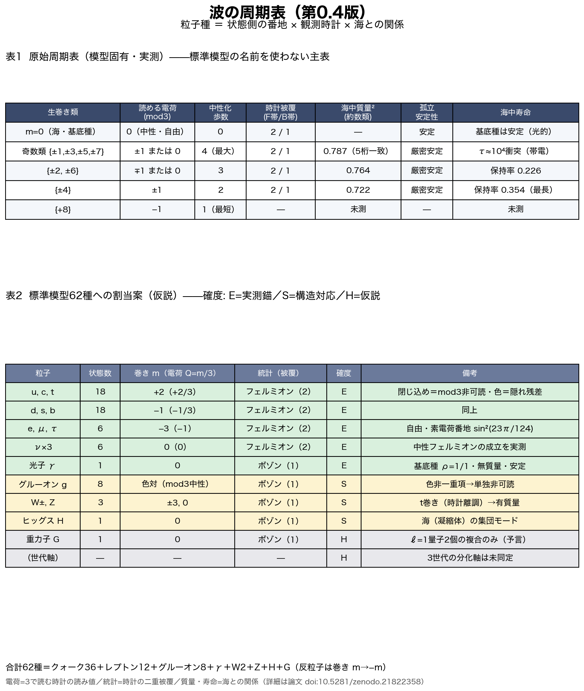

# The Periodic Table of Waves: A Thought-Experiment Assignment of 62 Particles Has Become a Testable Hypothesis

Noriaki Kihara
August 6, 2026

In an earlier note, I wrote down a thought experiment. Classify particles by which of six axes — x, y, z, t, R, Q — carries their "winding": the photon on the R axis only, the gluon on the Q axis only, the W and Z bosons on the time axis. I built a table of sign vectors and asked whether the 62 particles of the standard theory could be assigned to it.

Thought experiment: On the R Axis — examining the assignment of 62 particles (in Japanese)
https://note.com/kiharanoriaki/n/na95064891249

Back then, it was classification inside my head. There was no way to test it.

Today's paper is the continuation — but this time, **from the shapes of waves alone**. I ran wave dynamics that assume no concept of a particle whatsoever (two systems, both already published), accumulated nothing but numerical measurements, and arrived at the same assignment of 62 particles. And this time it comes as a hypothesis that anyone can reproduce and refute, with every experimental program published.

## The one idea at the center

The whole paper is bound by a single proposition.

**The species of a particle is not a fixed attribute of the wave itself. It is classified by how an observation clock reads the winding state.**

Charge, confinement, fermion versus boson, mass, lifetime — these are not separate labels. They decompose into "the address on the state side × the observation clock × the relation to the sea (the vacuum)." That is the proposal.

## Homework from the previous paper turned into a prediction

My previous paper, "Genesis of the Three Spatial Axes and Proper Time," carried an honestly stated open problem: **charge (winding number) refuses to stabilize at ±1 and scatters over multiple values.**

This time an answer was found — and it comes in two stages.

On the state side, charge really does keep scattering. I directly observed the interaction with the vacuum (the sea) walking the winding number up a doubling ladder, 1 → 2 → 4 → 8. The scattering is not a malfunction. It is a necessity of the dynamics.

But on the readout side, the story reverses. Among observation clocks, only the one that "reads by dividing by three" folds this entire scattered output neatly back into charges of magnitude one. The doubling ladder 2, 4, 8, 16… has remainders that alternate between +1 and −1 when divided by three. In the measurements, only the clock of three concentrated 100% of the charged content at magnitude one; the clock of four erased charge altogether; the clocks of five and six scattered it into many values.

(Insert Figure 1 here: `次元の生成構造/波の周期表検討/fig_p4_rectification_v1.png`)

Figure 1. Only the observation clock that reads by three reads all charged content as magnitude one — in either universe (seeded with +1 or with +2).

So "charge scatters" (the state side) and "there is exactly one elementary charge" (the readout side) coexist without contradiction. An open problem became a prediction of the hypothesis.

## A candidate answer to the one-third charge problem of quarks

Once you accept the clock of three, something unexpected falls out.

Set the unit of charge to "three raw windings = one elementary charge." Then the u quark, with winding +2, has charge +2/3. The d quark, with winding −1, has charge −1/3. The electron, with winding −3, has charge −1. The neutrino, with winding 0, has charge 0. The strange fractions of the standard theory appear as they are.

Check the bookkeeping: the proton (uud) has total winding 2+2−1 = +3, hence charge +1. The neutron (udd) has 2−1−1 = 0, hence charge 0. **The charge of every hadron comes out an integer automatically.**

And here is the most beautiful part. A wave whose winding is not divisible by three cannot be read **single-valuedly** on the observation clock of three. In other words —

**Why quarks carry one-third charges, and why quarks can never be observed alone (confinement), are two faces of one and the same fact.**

The numerical experiments confirm it. A quark-type wave (winding +2), kept in isolation, holds a readable fraction of exactly zero through 4000 collisions. Put into the sea, it becomes readable — only in units of integer charge — exactly to the extent that composites whose windings sum to a multiple of three (the analogue of hadrons) have grown.

(Insert Figure 2 here: `次元の生成構造/波の周期表検討/fig_p9_confinement_v1.png`)

Figure 2. The quark type (red) is born unreadable and becomes readable only through hadronization. The isolated quark type (gray) stays at zero forever. The electron type (blue) is free from the start.

## The fermion/boson distinction lives in the double cover of the clock

The other discovery concerns statistics. Where does the two-valuedness that separates fermions from bosons live?

Not in channel rotation (an exact symmetry). Not in spatial rotation (every mode is an ordinary vector). The place that remained was — **the clock**.

Track the state phase of a charged species at each recurrence of the observables, and the phase takes only the two values 0 and π, never anything in between. The state commutes between a +1 sheet and a −1 sheet. That is: **one revolution of the observables does not return the state; only two revolutions do** — the structure mathematicians call a double cover. And this two-valuedness appears only in fermionic waves (odd harmonics), never in bosonic ones.

(Insert Figure 3 here: `次元の生成構造/波の周期表検討/fig_p8_z2_quantization_v1.png`)

Figure 3. The phase of the charged species (red) is exactly quantized to 0 and π; the neutral bundle (blue) drifts continuously.

I also built and measured a charge-zero wave in the fermionic band. It, too, showed the double cover — **the neutrino has its proper seat in this classification.**

## The 62 assignments — and what this paper does *not* claim

On top of the classifiers obtained this way — the winding address, the clock of three, the double cover of the clock, the relation to the sea — I placed an assignment of the 62 particles of the standard theory (36 quarks, 12 leptons, 8 gluons, the photon, two Ws, the Z, the Higgs, the graviton). This is the periodic table that matters.

(Insert Figure 4 here: `次元の生成構造/波の周期表検討/fig_p11_periodic_table_visual_v1.png`)

Figure 4. The periodic table of waves (version 0.4). Top: the native periodic table, written without Standard-Model names (measured). Bottom: the 62-species assignment placed on top of it. Green = rows directly supported by measurement; yellow = structural correspondence; gray = hypothesis. Every row carries a confidence tag. Why there are three generations is honestly marked "unresolved."

And the most important limitation is stated explicitly.

**This is strictly a "periodic table of waves" — a hypothesis about readout and classification. The connection to the dynamics is future work.**

I have not yet drawn the 62 particles actually being created, decaying, and interacting. Verifying that requires unifying the two currently separate dynamics into a single universal interaction function with no case-splitting by species, and checking whether this periodic table emerges as the spectrum of that function. The closing section of the paper fixes eight requirements that the function must satisfy, each grounded in measurement. If any of the assignments fails to appear in the spectrum, this periodic table is refuted row by row.

A table of 62 that began as a thought experiment has become a refutable hypothesis — that is how far today reaches.

## Links to the paper

The paper (full text and PDF in Japanese and English)

Concept DOI (always the latest version)
https://doi.org/10.5281/zenodo.21822358

Version DOI (v1)
https://doi.org/10.5281/zenodo.21822359

Zenodo public record
https://zenodo.org/record/21822359

All 28 experimental programs, the data, and the figures are committed to the GitHub repository, with judgment criteria fixed and recorded before execution. The 13 refuted hypotheses are all included in the paper.

The thought-experiment note where it started (in Japanese)
https://note.com/kiharanoriaki/n/na95064891249

The previous article (the space-and-time paper — where today's homework came from)
https://note.com/kiharanoriaki/n/ne49fc8430271

---

#TheoreticalPhysics #MathematicalPhysics #ParticlePhysics #StandardModel #Quark #Charge #Confinement #Fermion #Boson #Neutrino #Spin #PeriodicTable #Classification #Emergence #IndependentResearch #Preprint #Zenodo #NumericalExperiment #Simulation #Hypothesis #ThoughtExperiment #Waves
