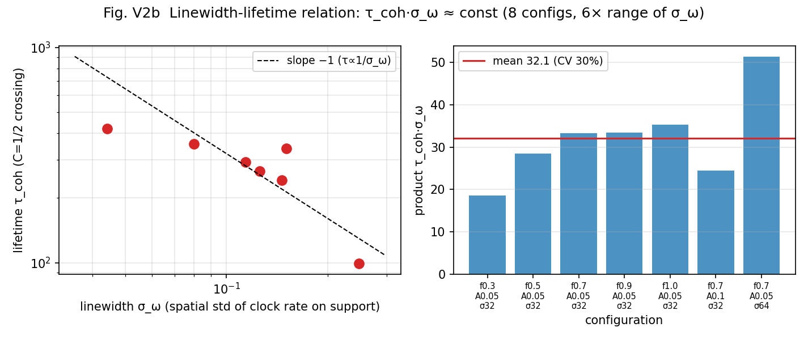

# The Periodic Table of Waves: A Thought-Experiment Assignment of 62 Particles Became a Testable Hypothesis — and Now Mass and Lifetime Are Unified in One Clock Field (v2, Fully Revised)

Noriaki Kihara
Published August 6, 2026 / fully revised to v2 on August 7

**This article is the fully revised v2.** The new findings from the verification program run through the day after publication — that mass and lifetime are the "mean" and the "width" of one and the same distribution, that the vacuum does not tick, and why point particles have no statistics — are added in the second half. The paper itself has also been published as v2 (a self-contained full revision).

In an earlier note, I wrote down a thought experiment. Classify particles by which of six axes — x, y, z, t, R, Q — carries their "winding": the photon on the R axis only, the gluon on the Q axis only, the W and Z bosons on the time axis. I built a table of sign vectors and asked whether the 62 particles of the standard theory could be assigned to it.

Thought experiment: On the R Axis — examining the assignment of 62 particles (in Japanese)
https://note.com/kiharanoriaki/n/na95064891249

Back then, it was classification inside my head. There was no way to test it.

This paper is the continuation — but this time, **from the shapes of waves alone**. I ran wave dynamics that assume no concept of a particle whatsoever (two systems, both already published), accumulated nothing but numerical measurements, and arrived at the same assignment of 62 particles. And it comes as a hypothesis that anyone can reproduce and refute, with every experimental program published.

## The one idea at the center

The whole paper is bound by a single proposition.

**The species of a particle is not a fixed attribute of the wave itself. It is classified by how an observation clock reads the winding state.**

Charge, confinement, fermion versus boson, mass, lifetime — these are not separate labels. They decompose into "the address on the state side × the observation clock × the relation to the sea (the vacuum)." That is the proposal.

In v2 the proposition deepens by one step. **The readout that classifies species and the readout that creates the gauges of space and time are one and the same relational projection** — particle number, mass, lifetime, even decay are unified as outputs of that one readout function (explained in the second half).

## Homework from the previous paper turned into a prediction

My previous paper, "Genesis of the Three Spatial Axes and Proper Time," carried an honestly stated open problem: **charge (winding number) refuses to stabilize at ±1 and scatters over multiple values.**

An answer was found — and it comes in two stages.

On the state side, charge really does keep scattering. I directly observed the interaction with the vacuum (the sea) walking the winding number up a doubling ladder, 1 → 2 → 4 → 8. The scattering is not a malfunction. It is a necessity of the dynamics.

But on the readout side, the story reverses. Among observation clocks, only the one that "reads by dividing by three" folds this entire scattered output neatly back into charges of magnitude one. The doubling ladder 2, 4, 8, 16… has remainders that alternate between +1 and −1 when divided by three. In the measurements, only the clock of three concentrated 100% of the charged content at magnitude one; the clock of four erased charge altogether; the clocks of five and six scattered it into many values.

(Insert Figure 1 here: `次元の生成構造/波の周期表検討/fig_p4_rectification_en_v1.png`)

Figure 1. Only the observation clock that reads by three reads all charged content as magnitude one — in either universe (seeded with +1 or with +2).

So "charge scatters" (the state side) and "there is exactly one elementary charge" (the readout side) coexist without contradiction. An open problem became a prediction of the hypothesis.

## A candidate answer to the one-third charge problem of quarks

Once you accept the clock of three, something unexpected falls out.

Set the unit of charge to "three raw windings = one elementary charge." Then the u quark, with winding +2, has charge +2/3. The d quark, with winding −1, has charge −1/3. The electron, with winding −3, has charge −1. The neutrino, with winding 0, has charge 0. The strange fractions of the standard theory appear as they are.

Check the bookkeeping: the proton (uud) has total winding 2+2−1 = +3, hence charge +1. The neutron (udd) has 2−1−1 = 0, hence charge 0. **The charge of every hadron comes out an integer automatically.**

And here is the most beautiful part. A wave whose winding is not divisible by three cannot be read **single-valuedly** on the observation clock of three. In other words —

**Why quarks carry one-third charges, and why quarks can never be observed alone (confinement), are two faces of one and the same fact.**

The numerical experiments confirm it. A quark-type wave (winding +2), kept in isolation, holds a readable fraction of exactly zero through 4000 collisions. Put into the sea, it becomes readable — only in units of integer charge — exactly to the extent that composites whose windings sum to a multiple of three (the analogue of hadrons) have grown.

(Insert Figure 2 here: `次元の生成構造/波の周期表検討/fig_p9_confinement_en_v1.png`)

Figure 2. The quark type (red) is born unreadable and becomes readable only through hadronization. The isolated quark type (gray) stays at zero forever. The electron type (blue) is free from the start.

## The fermion/boson distinction lives in the double cover of the clock

The other discovery concerns statistics. Where does the two-valuedness that separates fermions from bosons live?

Not in channel rotation (an exact symmetry). Not in spatial rotation (every mode is an ordinary vector). The place that remained was — **the clock**.

Track the state phase of a charged species at each recurrence of the observables, and the phase takes only the two values 0 and π, never anything in between. The state commutes between a +1 sheet and a −1 sheet. That is: **one revolution of the observables does not return the state; only two revolutions do** — the structure mathematicians call a double cover. And this two-valuedness appears only in fermionic waves (odd harmonics), never in bosonic ones.

(Insert Figure 3 here: `次元の生成構造/波の周期表検討/fig_p8_z2_quantization_en_v1.png`)

Figure 3. The phase of the charged species (red) is exactly quantized to 0 and π; the neutral bundle (blue) drifts continuously.

I also built and measured a charge-zero wave in the fermionic band. It, too, showed the double cover — **the neutrino has its proper seat in this classification.**

## From here on: the new findings of v2

I kept the verification program running from the moment v1 was published, and within twenty-four hours the classification moved beyond itself. v2 is a full revision that weakens none of v1's claims and adds the following findings as Part II.

### A single formula was holding the whole thing together

The dynamical core of the classification turned out to be one line:

**r = P_odd ÷ (P_odd + P_even)**

How much is exchanged in one interaction (the reflection rate) is decided by **the fraction of odd-harmonic (fermionic-band) power alone**. Even harmonics are among what gets rotated, but they never enter what decides the rotation.

Three consequences of this formula were confirmed by measurement.

First, **the vacuum does not tick**. A pure sea with no odd harmonics (a world of bosons only) is an exact fixed point with r = 0 — completely stationary. Light does not collide with light. The reason the photon is massless and stable comes out of one line.

Second, **the only source that drives the clock is matter (fermionic-band content)**. The role asymmetry — matter causes interaction, light does not — follows from the formula.

Third, if this formula treated even and odd symmetrically, no experiment could ever tell fermions from bosons, and statistics would be mere nomenclature. When I evolved a wave tuned exactly to equal amplitudes (fraction 0.500000), it did not stay at 0.5 but flowed away — **the dynamics really does treat the parities asymmetrically**.

### Why point particles have no statistics — the antipodal two-point structure

The distinction between even and odd harmonics is, in fact, the response to one transformation: "shift by half of the fundamental wavelength." Even harmonics are invariant under the shift; odd harmonics flip sign.

A geometric theorem follows. **A pure species of definite statistics cannot localize at a single point.** It always carries a symmetric or antisymmetric partner at the antipodal position (half a period away) — the double cover of the clock is realized, as it stands, as spatial structure.

Flip it around: **a body localized at one point necessarily mixes both parities, and carries no statistics**. That point particles have no statistics, and that particles with statistics are not points, turned out to be two faces of a single geometry.

### Mass and lifetime are the "mean" and the "width" of one distribution

I think this is the biggest finding of v2.

Take the distribution of the local clock field ω(x) — the rate at which the clock runs at each place — over the support of a particle. Then

- **mass = ⟨ω⟩ (the mean)**
- **lifetime = 1/σ_ω (the inverse of the width)**

In the measurements, the product of linewidth and lifetime, τ·σ_ω, stays at about 32 even when the conditions are varied over a sixfold range (scatter 30%). And mass and linewidth are strongly correlated (+0.90) — which means:

**That heavier particles are shorter-lived follows automatically, as the relation between the "mean" and the "width" of one and the same distribution.**

The striking pattern of the Standard Model's charged leptons (electron, muon, tau) — heavier with each generation, and shorter-lived — now has a structural candidate explanation. A new hypothesis for generations also emerged from this: **could a generation be a discrete level of phase locking at the same address?** (ground generation = fully locked, 2nd = partially, 3rd = marginally).

(Insert Figure 5 here: `次元の生成構造/波の周期表検討/fig_v2b_linewidth_lifetime_en_v1.png`)

Figure 5. The linewidth-lifetime relation τ·σ_ω ≈ const (left: slope −1) and the positive mass-linewidth correlation (right).

### Decay was not a "force"

To describe particle decay (splitting), no new force needs to be added to the dynamics. **If the clock rate ω differs from place to place, the differing parts lose their mutual phase and become independent all by themselves** — dephasing is itself the dynamics of splitting.

All that is needed is a readout criterion. Two regions are "one particle" while the accumulated drift of their relative clock phase stays below π (half a turn). Beyond that, they are two. The predicted splitting time is t_split = π/Δω, and the measurements agreed at order one (a refinement experiment is registered).

### How to build a stationary particle — two conditions

It also became clear that building a "quietly persisting particle" out of waves takes two conditions.

1. **Localization**: stack all harmonics of the fundamental wavelength — even and odd both — with their phases aligned at the center. The more harmonics, the closer the ringing approaches zero (a measured 50× improvement). With even harmonics alone it plateaus — both parities are necessary.
2. **Phase locking**: the proper clock must be uniform on the support (ω(x) = constant). This is a nonlinear eigenvalue problem — **the candidate "particle equation" of this model**.

### The classification is no accident of implementation — the consistency battery

Finally, I re-ran nine of v1's pillar experiments — without changing a single line of their code — on two alternative engines with a localized readout. Result: **the integer and phase structures (the double cover, the exact zero of confinement, the ledger identity, and the rest) are completely invariant**. The skeleton of the classification is not an artifact of one particular implementation.

## The 62 assignments — and what this paper does *not* claim

On top of the classifiers obtained this way, I placed an assignment of the 62 particles of the standard theory (36 quarks, 12 leptons, 8 gluons, the photon, two Ws, the Z, the Higgs, the graviton). The v2 periodic table now carries the mass-lifetime law and a seating chart of the hierarchy of existence (sea → elementary species → hadrons/baryons → classical bodies).

(Insert Figure 4 here: `次元の生成構造/波の周期表検討/fig_v2_periodic_table_en_v1.png`)

Figure 4. The periodic table of waves, v2. The one-line law, the native table (measured), the 62-species assignment (confidence: green = rows directly supported by measurement, yellow = structural correspondence, gray = hypothesis), the mass-lifetime law, and the hierarchy of existence. Baryons are not "an extra box outside the 62" — they hold seats for mass, lifetime, and decay as one level of the same readout.

And the most important limitation is stated explicitly.

**This is strictly a "periodic table of waves" — a hypothesis about readout and classification. The connection to the dynamics is future work.**

I have not yet drawn the 62 particles actually being created, decaying, and interacting. Verifying that requires unifying the two currently separate dynamics into a single universal interaction function with no case-splitting by species, and checking whether this periodic table emerges as the spectrum of that function. The closing section of v2 fixes eleven requirements that the function must satisfy (extended from v1's eight), each grounded in measurement. The refuted hypotheses — now fifteen, up from thirteen — are all included in the paper.

A table of 62 that began as a thought experiment became a refutable hypothesis, and now mass and lifetime are unified in a single clock field — that is how far v2 reaches.

## Links to the paper

The paper, v2 (full text and PDF in Japanese and English)

Concept DOI (always the latest version)
https://doi.org/10.5281/zenodo.21822358

v2 Version DOI
https://doi.org/10.5281/zenodo.21830706

Zenodo public record
https://zenodo.org/record/21830706

(v1 Version DOI: https://doi.org/10.5281/zenodo.21822359)

All 32 experimental programs, the data, and the figures (Japanese and English) are committed to the GitHub repository, with judgment criteria fixed and recorded before execution. All 27 runs of the consistency battery are published in a separate folder.

The thought-experiment note where it started (in Japanese)
https://note.com/kiharanoriaki/n/na95064891249

The previous article (the space-and-time paper — where the homework came from)
https://note.com/kiharanoriaki/n/ne49fc8430271

---

#TheoreticalPhysics #MathematicalPhysics #ParticlePhysics #StandardModel #Quark #Charge #Confinement #Fermion #Boson #Neutrino #Spin #PeriodicTable #Classification #Emergence #Mass #Lifetime #IndependentResearch #Preprint #Zenodo #NumericalExperiment #Simulation #Hypothesis #ThoughtExperiment #Waves
