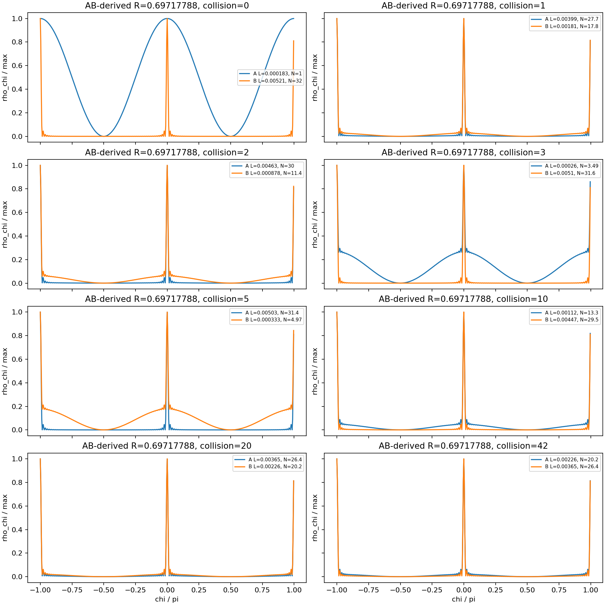
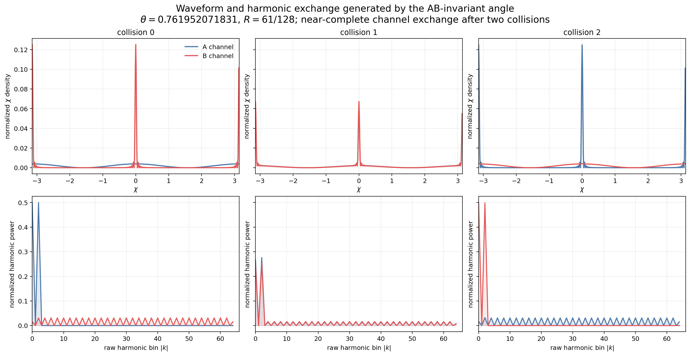
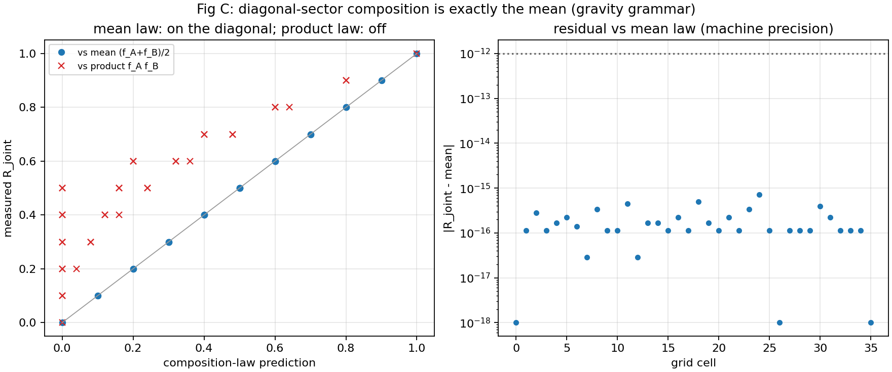
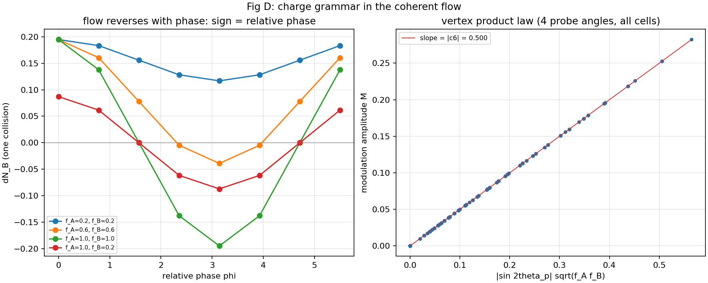
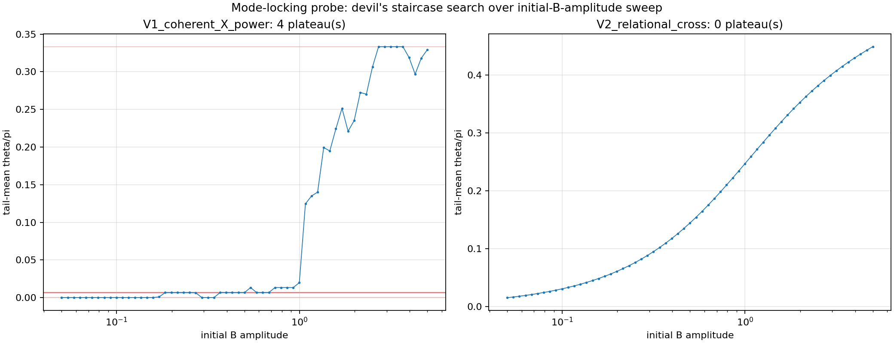

# Where Was the Electric Force Hiding? — Gravity and the Coulomb Force Separate from Wave Shape Alone

Noriaki Kihara
August 3, 2026

The previous article ended with an honest report.

Even with every fluctuation assumption removed, an inflation-like rapid expansion started on its own, three directions were born, and the system settled into a metastable state.

So we waited, expecting a **second expansion**. If inflation happened once more and a fourth or fifth direction emerged, the electromagnetic force should ride on it — or so we thought.

But even after doubling the observation period, not the slightest sign of a second expansion appeared.

Our analysis at the time was this: the system lacks the **degrees of freedom, the axes**, needed for a Coulomb-like interaction to be born. We recorded it as an open problem.

This time, we found out that this analysis was wrong.

**What was missing was not degrees of freedom. We were looking in the wrong place.**

The electric force was not waiting to be born as a new direction. It was hiding, **from the very beginning**, inside the collisions between waves.

## The clue came from a reflection rate

The turning point came from an unexpected direction.

In the fermionic wave interactions of this system, each collision transfers part of one wave's content to the other side, while part of it stays. The fraction that bounces back is the reflection rate R.

While studying an earlier phenomenon — R concentrating at special values — something caught our eye.

**Could the transmitted fraction 1−R be read as the elementary charge of physics?**

The elementary charge is the amount of electricity carried by a single electron. Written in a unit-independent, dimensionless form, it is about 0.30282.

And our system contained a mathematically exact, special point at which

1−R = sin²(23π/124) = 0.302822…

The two numbers agree to 16 parts in 100 million (0.16 ppm).

It might be a coincidence. But if it is real, then charge lives not in a direction but in **the way collisions are read**. So we took wave collisions apart, piece by piece.

(Insert Figure 1 here)

Figure 1. Two waves (blue and orange) colliding repeatedly at reflection rate R = 0.6972 (1−R = 0.3028, the elementary-charge candidate value). With each collision, the localized peak shuttles between the two channels. That shuttling fraction itself is the candidate for the value of the elementary charge.

## The two memories carried by the shape of a wave

Now to the main subject. The central discovery is this: **the shape of a wave carries two kinds of memory, and a collision reads the two with two different grammars.**

First, what do the waves of this system look like?

A single wave is built out of many **harmonics** — just like the sound of a musical instrument. When you play a C, vibrations at 2 times, 3 times, 5 times the fundamental frequency all sound together, and their mixture determines the timbre. The waves of our system are likewise determined by which harmonics they contain, and how much of each.

(Insert Figure 2 here)

Figure 2. Top row: the actual shapes of the two waves (blue is A, red is B). Bottom row: their content — which harmonics they hold, and how much. Collision by collision, the content of one wave moves wholesale to the other side.

The shape of such a wave carries two utterly different pieces of information.

The first is **magnitude**: how much the wave holds in total. It does not matter how the phases of the harmonics are shifted, or what shape the wave takes. Only the total amount.

The second is **overlap**: whether the two waves **share the same harmonics**, and whether the phases of the shared harmonics are **aligned or shifted**. This is relational information about the pair — you cannot determine it from either wave alone.

And when two waves collide, an exact calculation of the amount transferred in one collision always gives the answer as

a term that reads magnitude + a term that reads overlap

— **the sum of exactly two terms**. Here is the decisive point: **no third term exists.** This is not an experimental observation; it is a mathematical identity. Magnitude and overlap are *all* the information a wave collision can read.

## The magnitude term carries the grammar of gravity

We measured the properties of the first term, one by one, at machine precision.

- When two waves are mixed, their effective coupling composes strictly by **addition** (the mean). A product law fails completely
- It has **no sign**. There is no plus or minus; flow always goes from larger to smaller
- It **cannot be screened**. As long as the waves have magnitude, it acts — no matter how you manipulate the phases
- It is **not quantized**. The coupling strength is continuous and can take any value

(Insert Figure 3 here)

Figure 3. Left: the measured coupling compared with the composition-law predictions. The additive (mean) prediction (blue dots) falls perfectly on the diagonal; the product prediction (red crosses) misses badly. Right: the residual from the additive law is 10 to the minus 16 — exact agreement at the full precision of the computer.

Composes by addition, has no sign, cannot be screened, is not quantized — this inventory matches, item by item, the inventory of **gravity**: mass adds, there is no negative mass, it cannot be shielded, and it is continuous.

## The overlap term carries the grammar of the Coulomb force

The second term has an entirely different character.

- Its coupling strength is set by the **product** of the two waves' amplitudes
- It **has a sign**. Shift the relative phase of the shared harmonics by half a turn, and the direction of the flow reverses
- It **can be screened** — in two distinct ways: set the shared component to zero, or simply share no harmonics at all
- It **is quantized**. It locks onto discrete rational values

(Insert Figure 4 here)

Figure 4. Left: the amount transferred in one collision, measured while varying the relative phase. When the phase passes half a turn (center of the graph), the flow reverses direction. This is the candidate origin of plus and minus charge. Right: the modulation amplitude of the flow is strictly proportional to the product of the two waves' amplitudes (straight line) — the charge-times-charge multiplication structure of the Coulomb force.

Composes by multiplication, has plus and minus, can be screened, is quantized — this is the inventory of **the electric force**, item for item.

## Not a single external intervention

Here is the point we want to stress.

We taught this system neither gravity nor electricity. No particle species, no charge labels, no coupling constants were put in from outside. All the system has is the shape of its waves and the rule of collision.

And yet the collision identity splits into two terms, and one of them satisfies the inventory of gravity while the other satisfies the inventory of electricity — **on its own**.

Moreover, the assignment cannot be reversed.

If you tried to read the overlap term as gravity, then shifting a phase slightly would flip gravity's direction, and orthogonal waves would feel no gravity at all. That collides head-on with gravity's universality — it acts regardless of the partner's internal state.

If you tried to read the magnitude term as electricity, there is no sign, so plus and minus charges cannot be built; neither can the product structure or neutralization.

So the correspondence — magnitude term = gravity-type, overlap term = Coulomb-type — is not a naming born of resemblance. It is **the unique correspondence left standing after the reversed assignment is excluded**.

**Gravity-like interaction and Coulomb-like interaction separate and emerge from wave shape alone, with no external intervention.** That is the central claim of this work.

## The inverse square was already there too

The Coulomb force is famous for its inverse-square law — weakening with the square of distance. What became of that?

In fact, the inverse-square law had already been derived in a separate paper of this research series. In a closed phase system, integer harmonics fix the phase-cell width and the angular velocity simultaneously, so acceleration falls off as the inverse square of the cell width. No squared distance, no spheres, no gravitational field are put in from outside — an inverse-square phenomenon emerges from the harmonic structure alone.

What this experiment added is the division of labor. The direct overlap between waves does *not* carry the long-range inverse square (we record this honestly, as a refuted prediction, in the paper). The inverse square is carried by the harmonic-closure side; what the overlap term carries is the **charge grammar** — multiplication, sign, and quantization. The nature of the source and the law of long-range propagation live in separate parts — which is consistent with the picture in standard physics.

## Why is gravity so absurdly weak?

Once the two grammars separate, a structural answer emerges for one of physics' oldest puzzles.

Gravity is weaker than the electric force by a factor of 10 to the 40. Why?

The coupling of the electric grammar (the overlap term) is set by an angle. An angle has a mathematical ceiling, and quantization pins it to discrete values. It cannot leave a narrow band.

The coupling of the gravity grammar (the magnitude term) is set by a **ratio** of magnitudes. A ratio has no floor. If particles are far smaller than the background universe — that is, if localized particles exist at all — this ratio can be as small as it likes.

**A long-range force that is weaker by orders of magnitude can live only in the magnitude grammar.** Gravity's weakness is not a coincidence in need of explanation; it is a structural consequence of particles being smaller than the universe.

## We also saw where discreteness comes from

The quantization in the charge grammar — why values come in discrete steps — was also observed directly, as a mechanism, inside this small system.

Although no coupling is supplied from outside, the system's mean winding number **locks** onto specific rational values. It is a relative of phase locking — the phenomenon by which pendulum clocks synchronize with their surroundings.

(Insert Figure 5 here)

Figure 5. The mean winding number measured while continuously varying the initial amplitude. In the left panel the value refuses to vary continuously and sticks to flat plateaus at rational heights (locks). You turn a continuous knob, yet the output comes in discrete steps — a mechanism of quantization.

We could also prove that the locks reachable by counting alone are restricted to orders 3, 4, and 6 — the same menu as the rotational symmetries a crystal may have.

But let us be honest: the mechanism that *selects* order 124 — the order appearing in the elementary-charge value — has not been identified. Eliminating the candidates one by one by experiment, the mystery has been narrowed to a single question: why is the observation clock commensurable with 248? That is the task of the next paper.

## What we can claim, and what we cannot

What we can claim to have found:

- The information a wave collision can read is exactly two things — magnitude and overlap (no third term exists; this is an identity)
- The magnitude term satisfies gravity's inventory: additive, sign-free, unscreenable, unquantized
- The overlap term satisfies electricity's inventory: multiplicative, plus-and-minus, screenable, quantized
- The correspondence cannot be read in reverse (a unique assignment, with no external intervention)
- The transmitted fraction 1−R = sin²(23π/124) matches the dimensionless elementary charge to 0.16 ppm
- Inverse-square phenomena emerge from the harmonic closure structure (derived); the direct overlap does not carry the long-range law (recorded as a refutation)
- The enormous gap between the strengths of gravity and electricity follows structurally from the definition of localization
- The mechanism that produces discreteness (rational locking) really exists in this system

What we cannot yet claim — stated plainly:

- That this is real gravity and real electromagnetism themselves (we are at the stage of grammars, before a background spacetime stands up)
- That the three directions correspond to the length, width, and height of real space
- Why order 124 is selected
- Whether the sign of the overlap phase maps to attraction or to repulsion in real space (this is fixed in the papers as a prediction that will be decided automatically once the distance dictionary is completed)

## In one line

Last time we showed:

**Even without assuming fluctuations, inflation-like expansion and the birth of three directions happen on their own — and stop after one round** — and we left, as an open problem, the missing degrees of freedom for a Coulomb force.

This time, the answer to that problem turned out to be:

**Gravity-like and Coulomb-like interactions separate and emerge from wave shape alone, as two grammars, with no external intervention. Electricity was never a direction — it lived, from the start, in how waves read each other's overlap.**

Two mysteries remain.

Why does the elementary-charge angle choose a division into 124?

And how do three directions and two grammars become real space and real forces?

That is where we go next.

---

## Papers and reproduction data

This article is based on the following trilogy. Full texts in Japanese and English, PDFs, and the complete set of reproduction programs are public. Every figure in this article was generated by the reproduction programs in the public repository.

Part I
"Two-Grammar Decomposition of Interaction in an Anonymous Two-Channel Closed Wave System"

Concept DOI (always the latest version)
https://doi.org/10.5281/zenodo.21763995

Version DOI (v1)
https://doi.org/10.5281/zenodo.21763996

Part II
"Structure of Counting Readouts in an Anonymous Two-Channel Closed Wave System"

Concept DOI (always the latest version)
https://doi.org/10.5281/zenodo.21763997

Version DOI (v1)
https://doi.org/10.5281/zenodo.21763998

Part III
"Lock Dynamics in an Anonymous Two-Channel Closed Wave System"

Concept DOI (always the latest version)
https://doi.org/10.5281/zenodo.21763999

Version DOI (v1)
https://doi.org/10.5281/zenodo.21764000

Derivation of the inverse-square law
"An Inverse-Square Law from a Future-Phase-Position Acceleration Map and Harmonic Closure in a Closed Two-Body AB Phase System"

Concept DOI (always the latest version)
https://doi.org/10.5281/zenodo.21441081

Concentration of the reflection rate and the elementary-charge value
"Discovery of Finite-Order Resonance in Iterated Exchange Scattering"

Concept DOI (always the latest version)
https://doi.org/10.5281/zenodo.21421366

The two axioms
"Anonymous Equal-Amplitude Composite-Wave Model: Basic Axiom System"

Concept DOI (always the latest version)
https://doi.org/10.5281/zenodo.21315735

The previous article (Japanese)
https://note.com/kiharanoriaki/n/n48a02cd70f47

The previous article (English)
"The inflation happened without a seed — and the directions stopped at three"
https://note.com/kiharanoriaki/n/nb584455b0aa5

The Japanese version of this article
https://note.com/kiharanoriaki/n/n8b1fedaec944

---

#TheoreticalPhysics #MathematicalPhysics #Gravity #Electromagnetism #CoulombForce #ElementaryCharge #FineStructureConstant #Quantization #HierarchyProblem #InverseSquareLaw #Waves #Harmonics #Phase #Interference #ClosedSystem #Emergence #Inflation #IndependentResearch #Preprint #Zenodo #NumericalExperiment #NumericalSimulation
