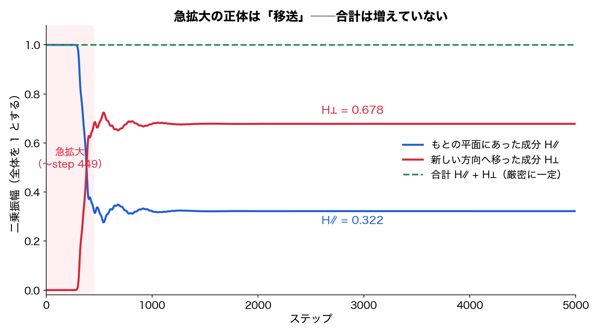
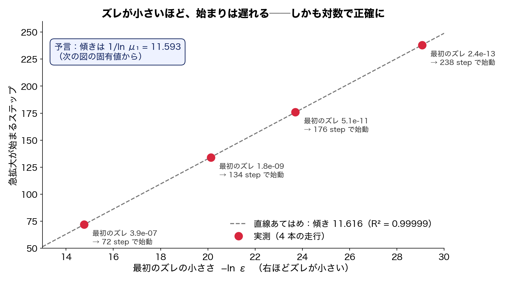
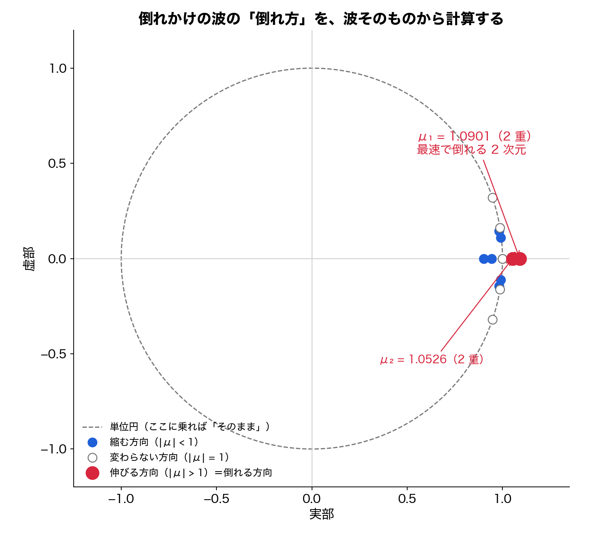
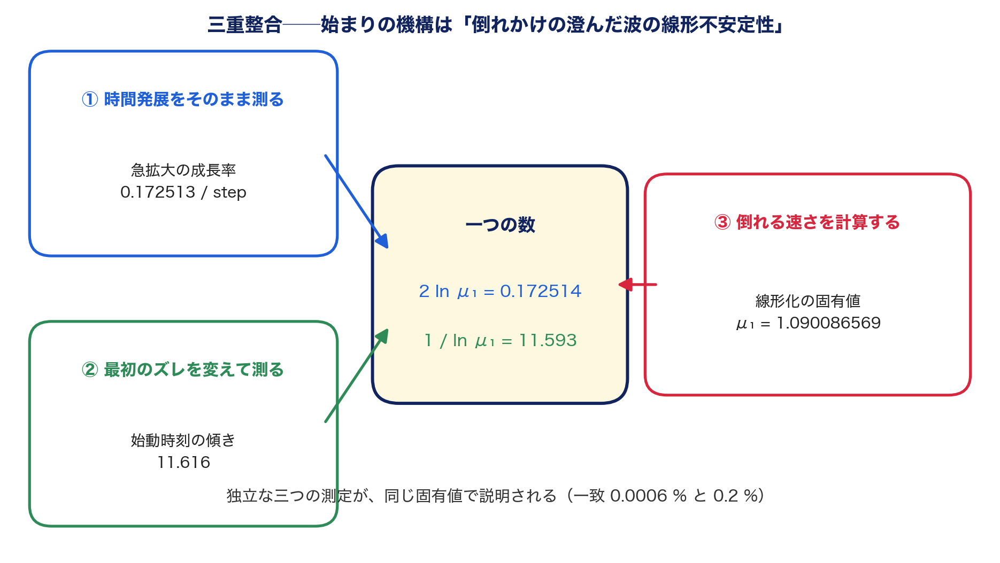
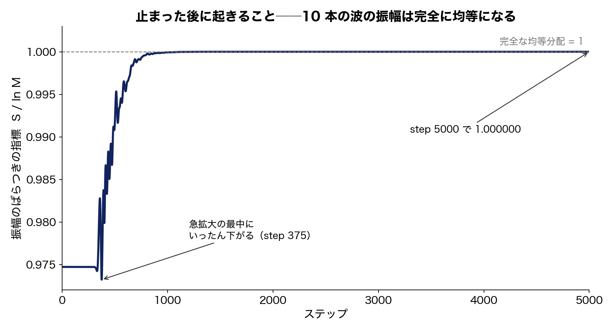
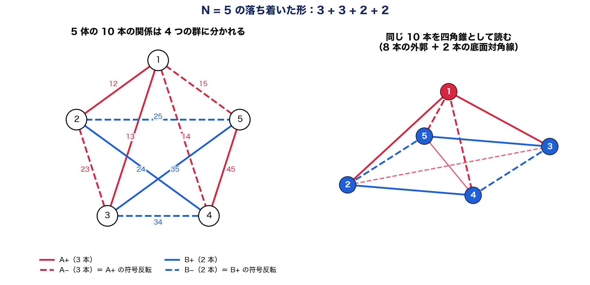
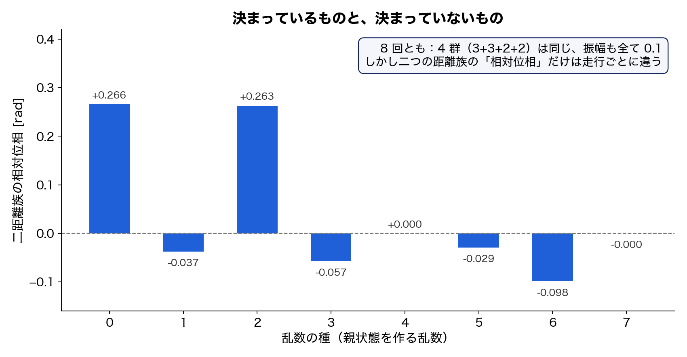

# インフレーションは、倒れかけの波にすでに書き込まれていた——三つの独立な測定が、一つの数で一致した

木原範昭  
2026年8月26日

前回の記事「タネがなくても、インフレーションは起きた」で、こう報告しました。

揺らぎの種を手で仕込まなくても、私たちの波のモデルは、ひとりでに急拡大を始め、三つの方向を生み、そして止まる。

その次の記事「雑踏からは、宇宙は始まらない」では、こう続けました。

急拡大を起こせるのは、雑踏のような波ではなく、たった一つの振動に全員が乗った、澄んだ波だけ。しかもその澄んだ波は、倒れかけの鉛筆のように、不安定な釣り合いの上に立っている。

ここまでで、残っていた問いは三つでした。

なぜ、急拡大は始まるのか。

いったい、何が増えているのか。

なぜ、止まるのか。

今回の論文は、この三つに数で答えます。そして途中で、私たち自身が置いていた公理が一つ減りました。

## 何が増えていたのか——貯金は、増えていなかった

まず、いちばん素朴な疑問から片づけます。

急拡大の最中、系の中の何かが10の30乗倍にも増えます。エネルギーを外から注ぎ込んでいるのでしょうか。

答えは、注ぎ込んでいません。それどころか、**合計は一円も増えていません。**

この系の時間発展は、Cayley 変換と呼ばれる一種の回転で書かれています。生成子が実の反対称行列であれば、この回転は必ず実の直交行列になります。直交行列は長さを変えません。だから、生成子が毎ステップ状態に応じて変わっても、波の全体の大きさは厳密に保存されます。

これは、実験で確かめたことではなく、更新則そのものの性質です。数値誤差 10⁻¹⁵ で「ほぼ一定」に見えていたものは、本当は厳密に一定だったのです。

では何が増えていたのか。

もともと波が乗っていた平面の成分が減り、その分だけ、新しい方向の成分が増えていました。**急拡大の正体は、生成ではなく移送です。**

（ここに図1を挿入）

図1。青は、もともとの平面にあった成分。赤は、新しい方向へ移った成分。緑の破線が合計で、5000 ステップの間、誤差 4×10⁻¹⁶ で一定のままです。赤が伸びた分だけ、青が減っています。

そしてこの図が、三つ目の問い「なぜ止まるのか」の半分に、その場で答えてしまいます。

合計が一定なら、新しい方向の成分は合計を超えられません。**無限に増え続けないことは、力学以前に、算数で決まっていた**のです。残る問いは「なぜ、この特定の形で落ち着くのか」だけになりました。

## なぜ始まるのか——最初のズレの大きさが、始まる時刻を決める

前々回の記事で、種を抜いても急拡大が起きることを示しました。しかし厳密に言えば、コンピュータの計算には必ず端数が残ります。澄んだ波を作る計算も、釣り合いの位置からごくわずかにズレたところで止まります。

そこで今回は、このズレの大きさを、わざと4段階に変えて走らせました。3.9×10⁻⁷ から 2.4×10⁻¹³ まで、100万倍の幅です。

結果は、きれいでした。

- ズレが小さいほど、急拡大の始まりは遅れる
- 遅れ方は、ズレの対数に正確に比例する（直線あてはめの R² は 0.99999）
- 一方、急拡大の速さそのものは、まったく変わらない

（ここに図2を挿入）

図2。横軸は最初のズレの小ささ（右ほど小さい）、縦軸は急拡大が始まるステップ。4点が一直線に乗ります。傾きは 11.616。

これは、倒れかけの鉛筆と同じです。

鉛筆を真上に立てようとしても、ごくわずかに傾きます。その傾きが小さいほど、倒れ始めるまでの時間は長くなる。しかし、いったん倒れ始めたあとの倒れ方は、最初の傾きに関係なく同じです。

**始まりの時刻はズレが決め、始まりの速さは波そのものが決めていました。**

## 倒れ方を、波そのものから計算する

ここで一歩踏み込みます。

倒れかけの鉛筆の倒れる速さは、鉛筆の長さと重力から計算できます。同じことが、この波でもできるはずです。

澄んだ波の釣り合いの位置のまわりで、時間発展を線形化しました。20次元の行列を作り、その固有値を求めます。固有値の大きさが1より大きい方向が、倒れる方向です。

（ここに図3を挿入）

図3。20個の固有値を複素平面に置いたもの。破線の単位円の内側は縮む方向、円の上は変わらない方向、円の外が伸びる方向です。外にあるのは、実軸上の2点だけ。しかもそれぞれが2重に縮退しています。

いちばん外にあるのが μ₁ = 1.090086569。この値が2重、つまり2次元分あります。

ここから、二つの予言が出ます。

一つ目。急拡大の成長率は 2 ln μ₁ = 0.172514 になるはずです。

二つ目。図2の直線の傾きは 1 / ln μ₁ = 11.593 になるはずです。

実測はどうだったか。

成長率は 0.172513。傾きは 11.616。

（ここに図4を挿入）

図4。時間発展をそのまま測った成長率、最初のズレを変えて測った始動時刻の傾き、そして釣り合いの位置で計算した固有値。三つは互いに独立な測定です。それが同じ一つの数で説明されました。

**急拡大の始まりは、倒れかけの澄んだ波の線形不安定性そのものでした。**

おまけが一つあります。倒れる方向がちょうど2次元だったことです。

もともとの澄んだ波は2次元の平面に乗っていました。そこに、最速で倒れる2次元が加わる。2 ＋ 2 ＝ 4。前々回の記事で「急拡大の途中で rank 4 が現れる」と報告したあの4は、**この足し算だった**のです。

なお、固有値がなぜ2重になるのか、その対称性の理由はまだ証明できていません。数値の事実として記録し、未解決課題に入れました。

## 疑いを一つ、消した

正直に書いておくべきことがあります。

以前のプログラムには、生成子を、その最大固有値で割ってから使う、という正規化が入っていました。この正規化が急拡大を作っていたのではないか——査読でそう疑われました。

調べると、こうでした。

生成子を σ で割ることと、時間の刻みを σ で割ることは、Cayley 変換では同じ式になります。つまり正規化は、**物理を変えていたのではなく、時計の目盛りを付け替えていただけ**でした。

ただし、有限の刻みでは、累積位相あたりの成長率に 6.8 パーセントの差が残りました。これは残しておけない差です。

そこで、別の実験で測ってあった「刻みを細かくしていったときの収束の仕方」を使いました。刻み n に対して成長率は g(n) = 1.15963 − 4.105 / n という形で収束します。正規化なしの走行は、実効的に刻みが 3.49 倍粗い走行に相当するので、n = 144 / 3.49 = 41.2 を入れると、予測は 1.0600。実測は 1.05874。差は 0.13 パーセント。

6.8 パーセントの差は、刻みの粗さの差でした。正規化の有無で物理は変わりません。ついでに言えば、プログラムに出てくる「144」という数も、2.5 度刻みを作るための分母であって、物理定数ではありません。

## 止まった後に、何が起きるか

急拡大は 450 ステップほどで飽和します。しかしそこで系が落ち着くわけではありません。

10本の波の振幅を見ると、急拡大の後、数百ステップかけて完全に均等になっていきます。ばらつきの指標（スペクトルエントロピー）は、5000 ステップで小数点以下6桁まで 1.000000、つまり完全な均等分配に達しました。

（ここに図5を挿入）

図5。10本の波の振幅のばらつきの指標。1 が完全な均等分配です。急拡大の最中にいったん下がり、その後、単調ではないものの、完全な均等へ向かいます。

ところが、位相のほうは、もっとゆっくりです。

5体の系では、10本の波の位相が最終的に 3 ＋ 3 ＋ 2 ＋ 2 の4つの群に分かれます。この構造が誤差 10⁻⁴ で完成するのが 2627 ステップ、10⁻⁸ で完成するのが 4923 ステップ。急拡大の 10 倍の時間をかけて、静かに秩序が刻まれていきます。

**急拡大と、秩序化は、別の段階でした。**

## 落ち着いた形の正体

落ち着いた後の形には、はっきりした幾何がありました。

10本の関係を複素数の距離と読んで、頂点どうしの距離行列を作ると、5個の頂点は4次元の単体（simplex）を作ります。調べた 3 体から 16 体まで、すべての系で、頂点の数マイナス1の次元でした。

さらに、どの頂点でも、そこにつながる関係波の二乗和がゼロになっています。

これを重心からの座標で書き直すと、一つの定理が出ます。すべての頂点で二乗和がゼロになることは、**すべての頂点が複素ヌル錐と呼ばれる面の上に乗っていること**と同じです。

振幅が均等になっていることと合わせると、落ち着いた形は一言で言えます。ヌル錐の上に乗った、辺の長さがすべて等しい複素単体です。

5体の場合は、さらに読みやすい姿になります。

（ここに図6を挿入）

図6。左は5体の10本の関係を色分けしたもの。赤が3本ずつ、青が2本ずつの4群で、実線と破線は符号が反転した対です。右は同じ10本を四角錐として読んだもの。頂点1から底面への4本と底面の4辺で8本の外郭、残る2本が底面の対角線です。

この 3 ＋ 3 ＋ 2 ＋ 2 という分かれ方から、以前の数値探索で見つかっていた二つの数が、導けます。

頂点の閉包から説明できない「2本だけでゼロになる組」が 13 個ありました。符号が反転した対どうしだけが打ち消し合えるので、3 × 3 ＋ 2 × 2 ＝ 13。

10本を5つの対に完全に分ける分け方が 12 通りありました。3本と3本の対応が 3! ＝ 6 通り、2本と2本が 2! ＝ 2 通りで、6 × 2 ＝ 12。

**13 も 12 も、偶然の数ではなく、この構造の必然でした。**

4体の系で「3つの群の位相が約120度ずつ離れる」と観察していたことも、同じ論法で定理になります。各頂点に3本の波が1本ずつ集まり、等しい大きさで和がゼロになるには、正三角形しかないからです。

## 決まっていないもの

ただし、すべてが決まっているわけではありません。

親となる澄んだ波を作る乱数を8通り変えて走らせました。3 ＋ 3 ＋ 2 ＋ 2 の分かれ方も、振幅が全て 0.1 になることも、8回とも同じでした。

しかし、二つの距離族のあいだの相対位相だけは、走行ごとに違いました。

（ここに図7を挿入）

図7。8回の走行での、二つの距離族の相対位相。群の分かれ方と振幅は毎回同じなのに、この一つの角度だけは毎回違います。

つまりこの系には、力学が固く決める部分と、決めずに残す自由な方向（モジュライと呼ばれます）が、両方あるようです。この自由な方向が、もっと長い時間で固定されるのか、永久に自由なのかは、まだ分かりません。

## 公理が、一つ減った

最後に、いちばん基礎の話です。

このシリーズは、二つの公理から出発してきました。波の二乗和がゼロになること（閉じていること）と、有限回で元に戻ること。

今回、初期状態を作るプログラムを原本まで遡って監査したところ、驚くことが分かりました。

**プログラムは、閉じている条件を、どこにも課していませんでした。**

やっていたのは、実の反対称行列の固有モードを探し、その固有モードの位相を行列に戻し、また固有モードを探す——この繰り返しで、位相が自分自身と一致する固定点を見つけることだけです。自己無撞着、つまり、自分で自分を支えている状態を探していただけでした。

そして、実の反対称行列の固有モードは、数学的に必ず二乗和がゼロになります。閉じている条件は、置かなくても出てくるものだったのです。

ここまで導けます。

　自己無撞着な固定点 → 複素数の回転対 → 二乗和ゼロ → 位相が円周上を回る（コンパクト）

ここから先は導けません。

　円周上を回る → 有限回で元に戻る

有限回で戻るには、一回転あたりの位相の進みが有理数でなければなりません。無理数なら、永遠に閉じない。この「有理数を選ぶ機構」は、今回の論文では導出できず、独立の課題として残しました。

公理は二つから一つに減りました。減った方の公理は、より深い原理から出てくる帰結でした。残った方は、まだ帰結ではありません。

## 反証と修正の記録

この論文は、生成と査読を別の AI に分担させて書きました。査読の過程で出た誤りは、直したうえで、論文本文に残しています。

- 始動時刻の回帰統計に、見かけの矛盾がありました。要求した精度と実際に到達した残差を取り違えていたためで、実測残差の表を載せて解消しました
- 固有値が2重になる理由を「複素共役の対だから」と説明していましたが、データを見ると固有値は実数でした。誤りを撤回し、理由は未解決として登録しました
- 6.8 パーセントの差を「追加実験に委ねる」と保留していましたが、既存の収束データで決着できることが分かり、本文で閉じました

正しい答えは、期待した答えより価値があります。

## 発見したと言えること、言えないこと

今回、発見したと言えることは次の通りです。

- 波の全体の大きさと、閉じている条件は、数値的にではなく厳密に保存される。急拡大は移送であり、合計を超えないことは算数で決まる
- 急拡大の始まりは、倒れかけの澄んだ波の線形不安定性である。始まる時刻は最初のズレの対数で決まり、速さはズレによらない
- 釣り合いの位置で計算した固有値 μ₁ = 1.0901 が、時間発展の成長率と、始動時刻の傾きを同時に予言する（三重整合）
- 倒れる方向はちょうど2次元で、もとの2次元と足して rank 4 になる
- 以前のプログラムの正規化は、時計の付け替えであり、急拡大を作っていない
- 落ち着いた形は、ヌル錐上の辺の長さがすべて等しい複素単体である
- 5体の 13 個の閉包と 12 通りの分割、4体の 120 度は、いずれも定理として導ける
- 閉じている条件は、自己無撞着性から導出できる

一方で、まだ言えないこともあります。

- なぜ、この特定の形（均等な振幅、3 ＋ 3 ＋ 2 ＋ 2）へ落ち着くのか、その力学
- 固有値がなぜ2重になるのか、その対称性の起源
- 二つの距離族の相対位相が、長い時間で固定されるかどうか
- 有限回で元に戻る、という残った公理を、より深い原理から導けるか
- 5体と他の体数で、どこまで同じ構造が続くか

そして、前回までと同じく、これが現実の宇宙のインフレーションそのものだ、とは言いません。全体の大きさが厳密に保存されたまま、澄んだ一つのモードから別のモードへ振幅が指数的に移り、飽和したあとに長い秩序化が続く——この構図は、宇宙論で言えばインフレーション本体より、その直後に起きるとされる preheating（パラメトリック共鳴）に近い、と考察に書きました。似ているのは構図であって、式が同じだと主張しているわけではありません。

## 一行でまとめると

前々回は、

**揺らぎを仮定しなくても、インフレーション的な急拡大と三方向の誕生はひとりでに起こる**

ことを示しました。

前回は、

**それを起こせるのは、倒れかけの澄んだ波だけである**

ことを示しました。

今回は、

**その倒れ方は、波そのものから計算でき、三つの独立な測定が一つの数で一致する**

ことを示しました。始まりの謎は、機構としては閉じました。

残る謎は、止まった先の形が、なぜその形なのか。そして、有限回で戻るという最後の公理は、どこから来るのか。

次はそこへ向かいます。

---

## 論文と再現用データ

今回の記事は、次の論文に基づいています。

「自己無撞着な関係波閉鎖系におけるインフレーション的急拡大の機構——正規化監査、rank 生成、二乗閉包保存、simplex 対称化および公理系の再構成」

Concept DOI（常に最新版）  
https://doi.org/10.5281/zenodo.22112008

Version DOI（v1）  
https://doi.org/10.5281/zenodo.22112009

Zenodo公開レコード  
https://zenodo.org/record/22112009

日本語・英語の論文本文、PDF、図一式、再現用の解析パッケージを公開しています。

前々回の記事  
「タネがなくても、インフレーションは起きた——そして方向は三つで止まった」  
https://note.com/kiharanoriaki/n/n48a02cd70f47

前回の記事  
「雑踏からは、宇宙は始まらない——インフレーションを起こせるのは、倒れかけの澄んだ波だけだった」  
https://note.com/kiharanoriaki/n/n7b655e3da27a

---

<!-- pdf-links -->
論文本体の PDF は、公開リポジトリから直接ダウンロードいただけます。

- nbody_self_consistent_inflation_mechanism_en.pdf
  https://raw.githubusercontent.com/WurabeSeiji/ai-chat-logs-open/main/次元の生成構造/nbody_self_consistent_inflation_mechanism_en.pdf
- nbody_self_consistent_inflation_mechanism_ja.pdf
  https://raw.githubusercontent.com/WurabeSeiji/ai-chat-logs-open/main/次元の生成構造/nbody_self_consistent_inflation_mechanism_ja.pdf

リポジトリ: https://github.com/WurabeSeiji/ai-chat-logs-open

#理論物理学 #数理物理学 #インフレーション #宇宙論 #力学系 #不安定性 #固有値 #波 #位相 #次元 #閉鎖系 #創発 #自己無撞着 #準安定 #独立研究 #プレプリント #Zenodo #数値実験 #数値シミュレーション
