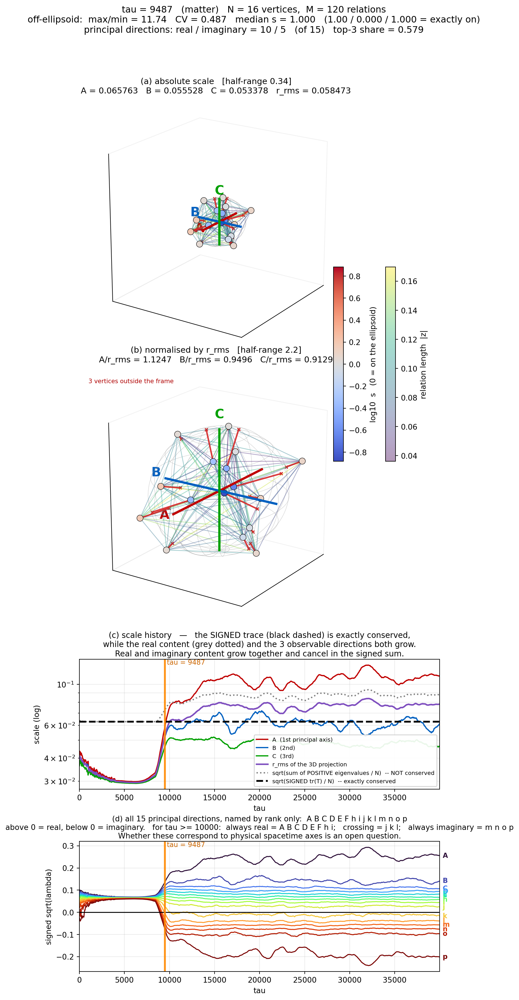
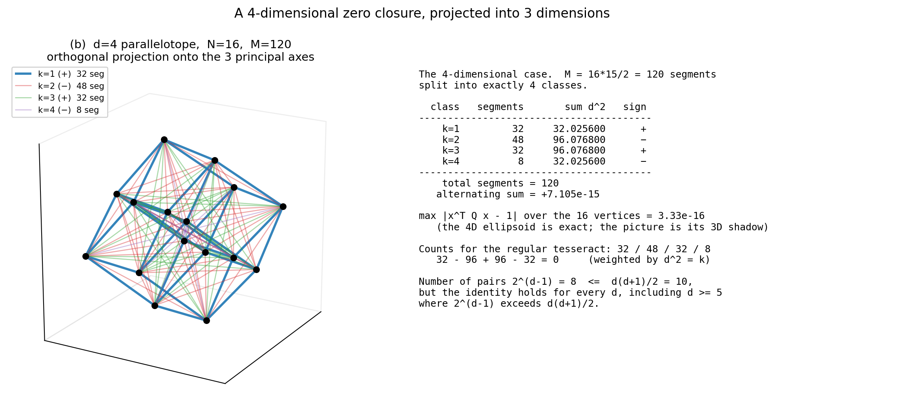

# ゼロ閉塞は4次元だった——複素数の世界でも「中心投影」は生き残る

## 多体問題を解かずに宇宙を計算する方法

私の論文シリーズは、ずっと一つの式から出発しています。

x² + y² + z² = R²

すべてを実数として扱うなら、これは半径 R の球面上の任意の点を表す方程式です。変数の数を増やせば、n+1 次元の超球面になります。

この形には、とてつもなく大きな利点があります。

**球面上を動くかぎり、多体問題を解かなくても運動が計算できる。**

なぜか。守るべき条件がたった一本しかないからです。「R を変えるな」——それだけ。あとは球面の上をどう動いてもよい。何百体、何千体の相互作用を一つずつ追いかける必要がない。これが中心投影という考え方であり、私がここから出発した理由です。

---

## 複素数へ拡張して、62種類の粒子表まで到達した

シリーズはここから、xₙ を複素数に拡張し、

Σ xₙ² = 0

という形を基本方程式として研究を進めてきました。観測できない量に虚数記号をつけて左辺に移す、という方針です。

この形からは、驚くほど多くのものが出てきました。

・単一振動数の波から、助走期間ののちに幾何級数的な発展が起き、自律的に準安定状態へ移る
・その移行の段階で、系に3つの方向が現れる
・波の個数は系の内部では決まらず、外から与える分解能が決める
・反射係数を持つ相互作用を入れると、フェルミオン的な弾性反射と、波束の収縮的な反応が再現される
・反射率 0.7 付近に特殊解があり、有限位数回帰の厳密根が α⁻¹ ≈ 137 の近傍に位置する

そして最終的に、**波の形だけから62種類の粒子的な波の周期律表**を作るところまで到達しました。

---

## ところが、動力学で行き詰まった

ここで壁にぶつかりました。

Σ xₙ² = 0 は、**3体以上の多体問題を含んでいます**。だから動力学が導けない。

実数の場合には、あんなに簡単だったのに。Σ xₙ² = R² なら「R を保存せよ」の一本で済んだのに。複素数にした瞬間、その利点が生きているのかどうかが分からなくなっていた。

**複素数に拡張しても、中心投影と同じ解き方ができるのか。**

これが今回の論文が答えた問いです。

---

## 答え：できる。しかも形は光錐だった

結論から書きます。できます。しかもきれいな形で。

複素数 xₙ = qₙ + i pₙ と書いて、Σ xₙ² = 0 を実部と虚部に分けると、代数だけで次の二本が出ます。

Σ qₙ² = Σ pₙ²
Σ qₙ pₙ = 0

一本目が本質です。**実部の二乗和と虚部の二乗和が等しい。** これは実数の中心投影 Σ xₙ² = R² と、まったく同じ型の条件です。複素数にしても「表面への写像」は消えていなかった。

そして観測できる側と観測できない側を分けると、これは

x² + y² + z² = t² + R² + Q²

という形になります。移項すれば

r² − t² − R² − Q² = 0

**光錐です。**

つまり基礎表現は (r, t, R, Q) の**4次元**であり、ゼロ閉塞はその上に光錐型の零錐を与える。これが表題の意味です。

そして実数の場合と同じく、**右辺の量を保存させるという一本の拘束を満たしさえすれば、あとは曲面上を自由に動いてよい。** 多体問題を個別に解く必要がない。中心投影の利点は、複素数の世界でも失われていませんでした。

---

## 発見1：n次元のはずが、3次元の楕円面だった

研究の途中で、予想していなかったことが分かりました。

Σ xₙ² = 0 は本来 n 次元の話です。ところが、その状態は**3次元の楕円面の上の任意の点**として表現できる。

下の図は、分解能 N = 16（つまり 120 本の関係を持つ系）の実際の計算結果です。16 個の頂点が、たしかに一つの楕円面の上に乗ろうとしているのが見えます。

上から2段目の図が分かりやすいでしょう。赤・青・緑の3本の軸が、この楕円面の3つの半径です。**n 次元の多体系が、3次元の面の上の一点として読める。**

もう一枚、こちらは幾何の側からの図です。

4次元の平行多面体（超立方体の斜めに歪んだもの）を3次元に落とした影です。16 個の頂点、120 本の線分。線分を「両端点を含む最小の面の次元」で4つのクラスに分けて符号をつけると、交代和がぴたりと零になります。図の右側に出ている数字が実測値で、

32 − 96 + 96 − 32 = 0

誤差は 7×10⁻¹⁵、つまり計算機の精度そのものです。**16 個の頂点は、4次元の楕円体の上に厳密に乗っています。** 誤差 3×10⁻¹⁶。

---

## 発見2：余剰次元はコンパクト化していない

ここが今回いちばん強く言いたいところです。

分解能 N = 16 の系は 15 本の主軸を持ちます。3次元に見えているのは、そのうちの上位3本だけ。では残りの12本はどこへ行ったのか。

高次元理論では普通、**余剰次元は小さく丸まって見えなくなった**と説明します。コンパクト化です。

**しかし、この系ではそうなっていませんでした。**

図1の一番下の段を見てください。15本の主軸の値が、時間 τ とともにどう変わるかを描いたものです。0 より上が実軸、下が虚軸です。

τ ≈ 9000 で、何かが起きています。

・上位3方向（A, B, C）は上へ跳ね上がる。A 軸は 2.80 倍
・中位の5方向（D〜i）はほとんど大きさを変えない
・下位の方向は 0 を**通過して下へ抜け、虚軸になる**

そして決定的なのはここです。虚軸に落ちた4本は、**小さくなって消えたのではありません。絶対値を増やしながら符号を変えている。**

・p 軸：5.57 倍
・o 軸：2.62 倍
・n 軸：1.67 倍
・m 軸：1.12 倍

**縮んでいない。むしろ育っている。**

だから起きているのは「余剰次元が丸まって消えた」ではなく、

**3方向だけが幾何級数的に拡大した**

です。上位3方向の占有率は 0.384 から 0.812 へ。全体の絶対値和は 2.79 倍。少なくとも「余剰方向が小さく縮んで見えなくなる」型のコンパクト化ではない、と言い切れます。

これはインフレーション的な拡大に見えます。

---

## 発見3：保存則は成り立っている。しかし誤読を禁じる

面白いのは、この激しい拡大の最中でも、**符号付きのトレースは完全に保存している**ことです。

図1の (c) 段の黒い破線が、それです。τ の全域で水平。実測では後期968点の最小値と最大値が8桁まで一致します。

ここで大事な注意があります。

**保存則が成り立っているから拡大は起きていない、と読んではいけません。**

同じ図の灰色の点線は、正の固有値だけの和です。これは水平ではなく、1.90 倍に跳ね上がる。実方向の総量が増え、虚方向の総量もゼロから現れて増え、**その差が保存している**のです。

実と虚が両方とも育って、符号付きの和の中で相殺している。これが今回の系で起きていることです。

そしてもう一つ。虚方向は真空側にはまったく現れません。真空では15本すべてが実で、しかも完全に等方（すべて 0.0645）。**虚方向は物質の生成とともに現れる**——これが対照実験の結論です。

---

## この論文が主張しないこと

強い主張をしたので、境界も明記しておきます。私はこの論文で次のことは主張していません。

・A, B, C といった主軸が、現実の時間や空間の軸に対応するとは主張していません。同定できる根拠は現時点で何もありません
・15 という主軸の本数が、超弦理論の11次元などと同じものだとも主張していません。この数は分解能から出た N−1 であって、外から選んだ数ではありません
・動力学の法則そのものを導いたとは主張していません。導いたのは「どの一本を保存すれば運動が閉じるか」という縮約の構造です

こういう線引きを毎回書くのは、自分の主張がどこまで支えられているかを自分で見失わないためです。

---

## それでも、道は通った

長いあいだ行き詰まっていたのは、複素数にした瞬間に「多体問題を解かなくてよい」という中心投影の最大の利点が生きているのかどうか分からなかったからです。

今回それが通りました。

**Σ xₙ² = 0 は、(r, t, R, Q) の4次元空間の上の光錐である。**
**そして右辺の量を保存させる一本の拘束を満たせば、多体問題を解かずに運動を設計できる。**

ここから先は動力学です。ようやく、その入口に立てました。

---

論文本体（日本語・英語、tex・PDF 同梱）は Zenodo で公開しています。

Version DOI（この版）: 10.5281/zenodo.21902806
https://doi.org/10.5281/zenodo.21902806

Concept DOI（常に最新版を指します）: 10.5281/zenodo.21902805
https://doi.org/10.5281/zenodo.21902805

日本語版の本文 PDF（78ページ）は、公開リポジトリから直接ダウンロードいただけます。

https://raw.githubusercontent.com/WurabeSeiji/ai-chat-logs-open/main/%E6%AC%A1%E5%85%83%E3%81%AE%E7%94%9F%E6%88%90%E6%A7%8B%E9%80%A0/%E3%82%BC%E3%83%AD%E9%96%89%E5%A1%9E%E3%81%AE%E5%B9%BE%E4%BD%95%E3%83%BB%E4%BB%A3%E6%95%B0%E6%A7%8B%E9%80%A0/%E3%82%BC%E3%83%AD%E9%96%89%E5%A1%9E%E3%81%AF%EF%BC%94%E6%AC%A1%E5%85%83%E3%81%A0%E3%81%A3%E3%81%9F_%E4%B8%BB%E5%BC%B5%E6%A1%88_v4.pdf

図・数値を再現するプログラムは全てリポジトリに置いてあり、md5 ハッシュ付きで一覧にしてあります。乱数シードも固定してあるので、同じ数字が出ます。

リポジトリ: https://github.com/WurabeSeiji/ai-chat-logs-open

#物理学 #理論物理 #数学 #幾何学 #複素数 #中心投影 #ゼロ閉塞 #余剰次元 #コンパクト化 #インフレーション #光錐 #独立研究者 #研究ノート #Zenodo #オープンサイエンス
