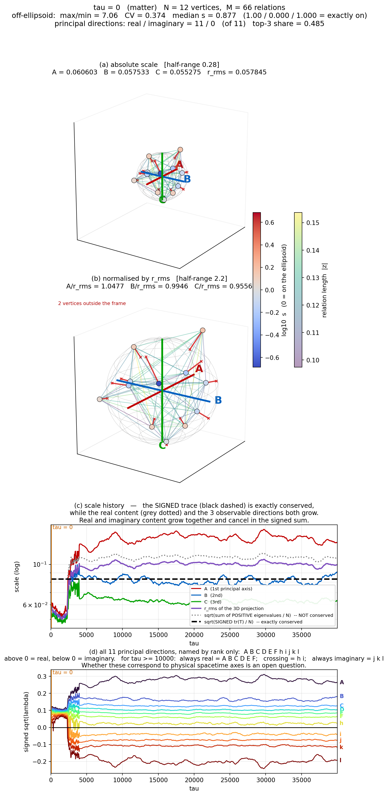
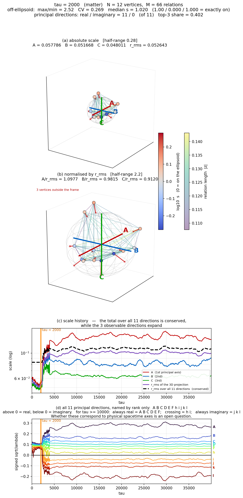
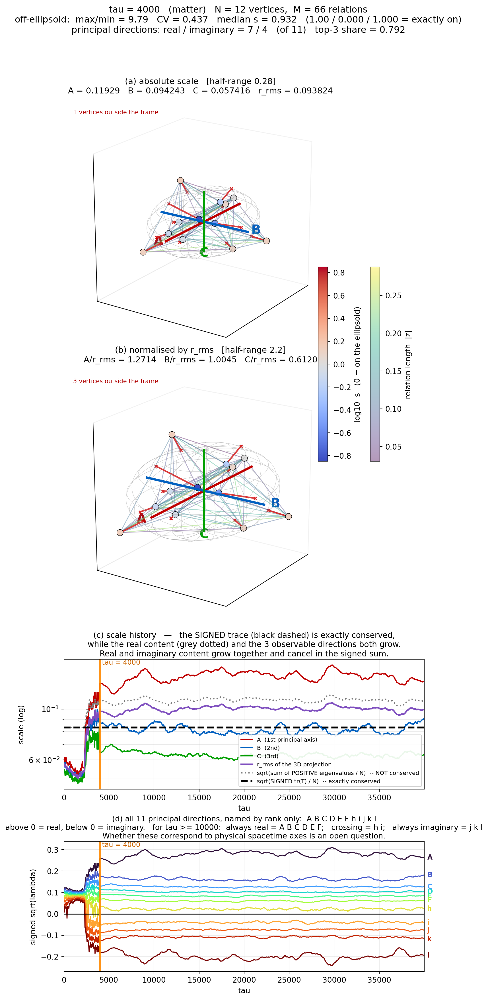
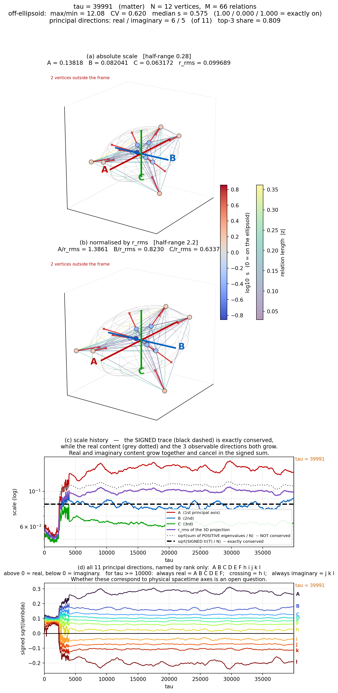
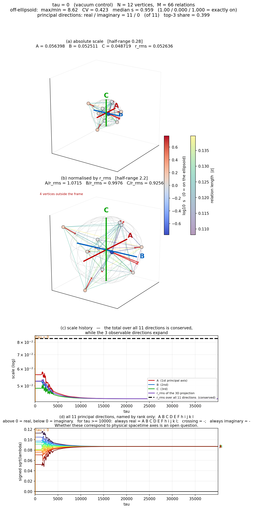
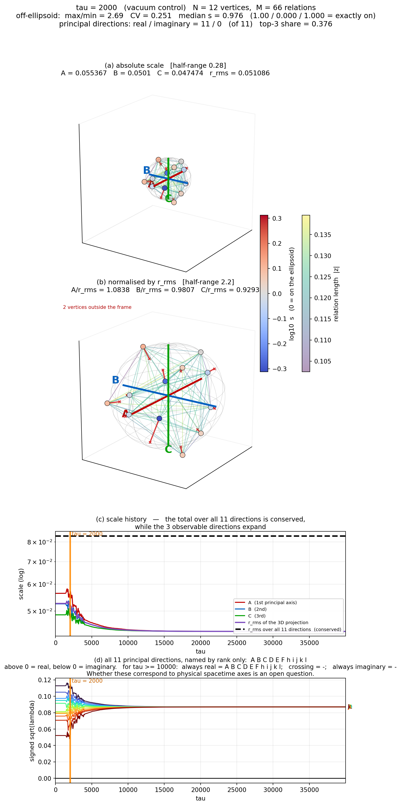
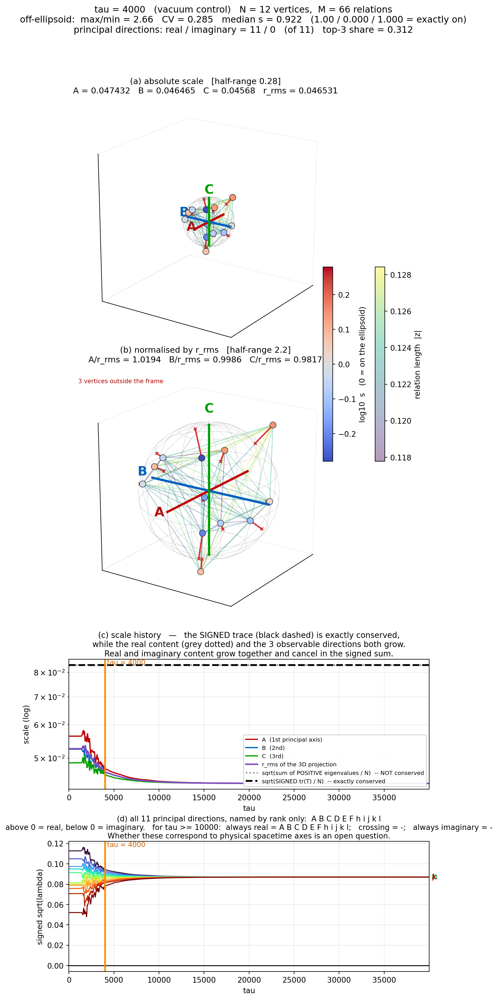
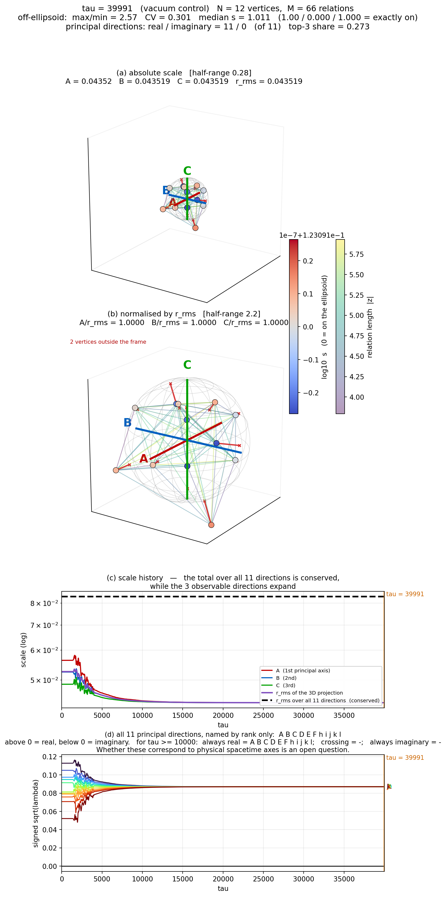
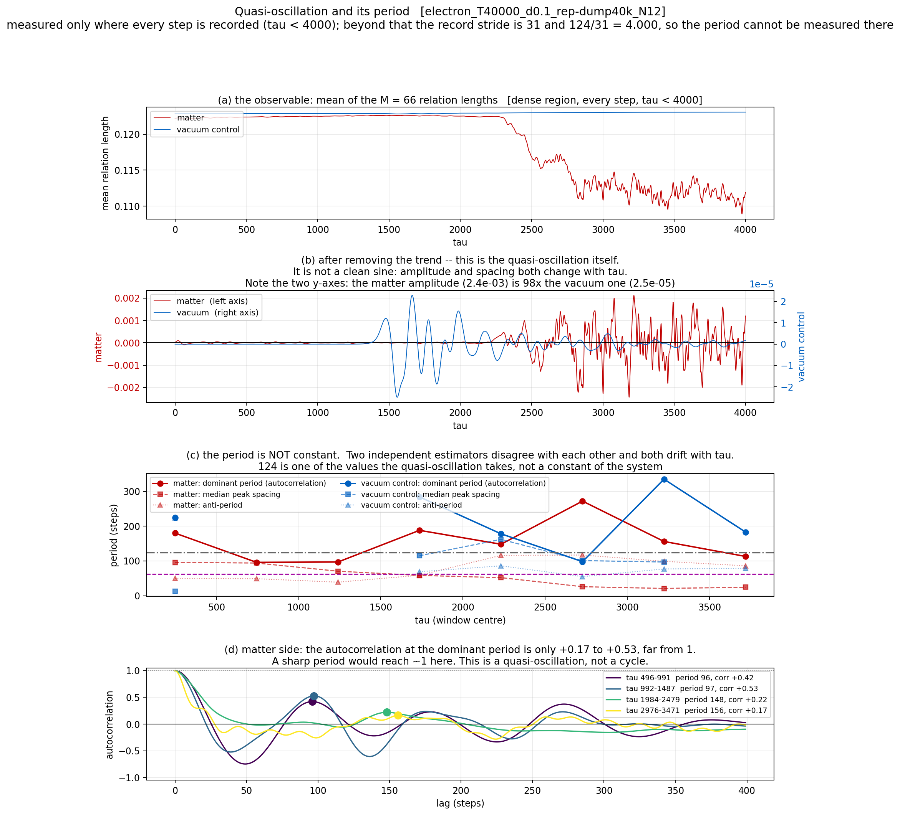

# ゼロ閉塞は4次元だった — 主張案 v3

2026年8月12日

本ノートの位置づけ：**解釈論文**。新しい定理は含まない。既知の定理を $\sum x_n^2 = 0$ という単一の閉鎖条件の下に並べ直し、そこから何が決まり何が決まらないかを確定させる。v3 では、シリーズの数値模型で実際に何が起きているかを測り、幾何の言明と数値の言明を突き合わせた。

**v1 → v2 の変更**：主張4を全面改訂した。v1 では「零閉鎖は中心対称かつ凸な配置を選び出す」とし、$N\ge5$ における符号の与え方を未解決としていた。v2 では (a) 符号は「両端点を含む最小の面の次元」により長さデータから一意に定まること、(b) 交代和が零になるのは**平行多面体**（$N=2^d$）であり、中心対称かつ凸では足りないこと、を示した。主張6B を新設し、この強い制約が主張6の楕円体構造と矛盾しないことを示した。

**v2 → v3 の変更**：数値模型の実測に基づく主張10〜14 を追加した。

- **主張10**：$\sum x_n^2 = 0$ は定常状態でのみ成立する恒等式であり、過渡状態と準安定状態では破れる。楕円面からの偏差として実測した。
- **主張11**：空間と物質の生成にはシードが必要であり、シード強度は偏差の大きさに直接効く。本走行のシード $\delta = 0.1$ は大きく、準安定状態に入っても偏差が残った。**シードを弱めた場合・$\tau$ を伸ばした場合に偏差が漸減するかは未確認である。**
- **主張12**：系は11次元の自由度を持ち、そのうち上位3方向 $A,B,C$ への集中により観測スケールが急拡大する。$D,E,F$ はほぼ大きさを変えず、$h,i,j,k,l$ は虚方向へ移る。**この11方向が物理的時空に同定できるか、別の写像が必要かは今後の課題である。**
- **主張13**：保存するのは**符号付き**トレースであり、実方向の総量と虚方向の総量はともに増えて符号付き和の中で相殺する。「保存則が成り立つのだから拡大は起きていない」という誤読を、この主張が明示的に禁じる。
- **主張14**：虚方向は真空対照には現れない。物質の生成とともに現れる。
- **主張15**：$10^2$ ステップ規模の準振動が観察されるが、その周期は $\tau$ の発展とともに変動する。**これが第2公理 $U^n = I$ によるものか、他の現象かは今後の課題である。**

軸の命名も v3 で変更した（§0B）。

---

## 0. 用語の定義

以下の語は本ノート内でこの意味に限る。定義していない語は使わない。

| 語 | 定義 |
|---|---|
| **分解能 $N$** | 系に置く頂点の個数。正整数。 |
| **頂点** | 関係の端点。それ自体は状態量を持たない。 |
| **関係**（辺、線分） | 相異なる2頂点の順序なし対。総数 $M = N(N-1)/2$。 |
| **関係量 $x_n$** | 各関係に割り当てるスカラー。実数か複素数かは各主張で明示する。 |
| **長さ $d_{ij}$** | 関係量を非負実数として読み、頂点 $i,j$ の距離と解釈したもの。 |
| **閉包** | 与えられた全ての長さ $d_{ij}$ を厳密に満たす $N$ 頂点のユークリッド空間内の配置。存在するか否かが定まる。 |
| **零閉鎖** | 条件 $\sum_n x_n^2 = 0$。 |
| **中心** | 全頂点の重心。頂点ではない。 |
| **中心対称** | 配置が中心に関する点対称写像で不変であること。 |
| **主対角線** | 中心対称配置において、点対称で移り合う2頂点を結ぶ線分。中心を通る。 |
| **慣性テンソル** | $T = \sum_i v_i v_i^{\mathsf T}$（$v_i$ は中心を原点とする頂点位置）。 |
| **慣性楕円体** | $T$ の等位面 $\{x : x^{\mathsf T}T^{-1}x = 1\}$。 |
| **半軸** | 慣性楕円体の主軸半長。$T$ の固有値の平方根。 |
| **回転平面** | $\mathfrak{so}(N)$ の元の直交標準形に現れる2次元不変部分空間。 |
| **読出し** | 状態から二次形式として取り出す操作。取り出せる独立成分の個数を読出しの成分数と呼ぶ。 |
| **主観空間** | 中心方向を座標に含まない局所座標系。球殻表面の住民が持てる座標系。 |
| **偏差 $s_i$** | 頂点 $i$ が慣性楕円体からどれだけ外れているか。$s_i = \sqrt{v_i^{\mathsf T}T^{-1}v_i / c}$（$c = 3/N$）。全頂点が楕円面上にあれば全ての $i$ で $s_i = 1$。 |
| **シード $\delta$** | 系に物質を生成させるために初期状態へ加える擾乱の強度。 |
| **虚方向** | 二重中心化グラム行列 $B$ の負固有値に対応する主軸。 |

---

## 0B. 主軸の命名規約

主軸は**固有値の大きい順に付けた序数的な抽象名**で呼ぶ。名前に物理的な意味は持たせない。

| 名前 | 位置 | 内容 |
|---|---|---|
| $A,\ B,\ C$ | 第1〜第3主軸 | 3次元射影に現れる。図化に用いる |
| $D,\ E,\ F$ | 第4〜第6主軸 | 実だが3次元射影には現れない |
| $h,\ i,\ j,\ k,\ l$ | 第7〜第11主軸 | 符号が $\tau$ により実／虚を往復しうる |

$N = 12$ では二重中心化により自明ゼロ（$B\mathbf{1} = 0$）が1個生じるため、主軸は $N-1 = 11$ 本である。

**この命名は $t, R, Q$ という以前の呼び方を置き換える。** $t/R/Q$ を捨てたのは、次の三つの測定によりその区別に根拠がないことが確定したためである。

1. ラベルは固有値の大小順で付けていたにすぎず、$t$ と $R$ と $Q$ を区別する独立な判定基準が一つも無かった。
2. 固有値がほぼ縮退する時刻がある。最小ギャップの実測値は、第1–2主軸間 $1.2\times10^{-4}$（$\tau = 1373$）、第2–3主軸間 $2.1\times10^{-4}$（$\tau = 2078$）、第3–4主軸間 $0.9\times10^{-4}$（$\tau = 1563$）。縮退点で順序が入れ替わる。
3. 主軸ベクトルが時間的に連続しない。第1主軸ベクトルの内積の絶対値は $\tau = 0$ と $\tau = 39991$ の間で $0.1786$、$\tau = 4000$ と $\tau = 39991$ の間で $0.0426$ である。固定した物理軸にラベルを貼ることはできない。

---

## 1. 背景（本研究に至る経緯）


シリーズは $\sum x_n^2 = R^2$ という**中心投影**から出発している。曲率半径 $R$ の球殻の表面において、主観空間は次の三つを観測できない。

- 中心投影の方向
- 投影軸の本数
- 各投影軸の寄与の内訳（$R'^2 = R^2 + Q^2$ の $R$ と $Q$ の別）

観測できるのは合成曲率の**大きさと符号だけ**である。この実数の系において $R^2$ を左辺へ移し

$$\sum_n x_n^2 - R^2 = 0$$

とし、無名性の第0公理に従って $\sum x_n^2 = 0$ の形に揃えるため、**観測できない量に虚数記号を付す**という方針で複素数を導入した [S1]。ここでの虚数は、左辺から観測できない右辺の量を左辺へ移すための演算記号として導入されたものであり、それ以上の意味を持たせていない。

以降のシリーズでは $x_n$ を複素数として扱っているが、標準的な量子論と異なり**共役複素数を用いない**。$x_n = a + ib$ に対し $x_n^2 = (a+ib)^2$ であって $|x_n|^2$ ではない [S1]。

さらに第0.5公理としてスケール対称性、追加公理として「唯一のパラメータは分解能である」を置き、分解能を $N$ としたとき関係数が $M = N(N-1)/2$ であること、関係の数だけ複素表現の波が存在することを仮定して研究を進めた [S1][S2]。得られた主な結果は以下である。

- 単一振動数の波を初期条件とすると、揺らぎが計算精度の下限であっても、助走期間の後に幾何級数的な発展が起き、その後に自律的に準安定状態へ移行する [S8][S14]。準安定状態へ移行する段階で系に3つの方向が現れる [S6][S7][S11]。分裂の停止と新しい直交回転平面の創発、およびその時間構造の因果分離は別途扱った [S10][S12]
- 波の個数は系の内部では定まらず、外から与える分解能が決める [S9]
- 局在した粒子的な波を再現するには、振幅の等しい倍音が必要である [S18]
- 線形波ではボゾン的な透過しか起こらない。反射係数を計算した相互作用（回転演算）を導入すると、フェルミオン的な弾性反射、波束の収縮的な反応が再現される [S3]。白猫・黒猫・灰色猫の混合状態の読出しも再現される [S4]
- 反射率 $0.7$ 付近に特殊解があり、有限位数回帰の厳密根が $\alpha^{-1}\approx137$ および $\alpha^{-1}\approx128.946$ の近傍に位置する [S5]。同じ $0.70$ 近傍の予測子は多体埋め込みでも現れた [S16]。**微細構造定数を導出したとは主張していない** [S5]
- この過程で第2公理 $U^n = I$ が要求されていることを見出した [S5]
- フェルミオン的構造の生成機構、および空間3軸と固有時間の創生を扱った [S13][S15][S17]
- 以上を整理し、粒子的な波62種の周期表を作成した [S18]。場の読出しへの拡張は別途扱った [S19]。シードが粒子を生む条件と分解能の下限は最新の論文で扱った [S20]

次に波の動力学へ進もうとした段階で、基礎の理解が不足していることが判明した。すなわち、**波を複素数で表現することが必須なのか**、複素表現した場合の中心投影がどういう形になるのか、が確定していない。本ノートはこの二点を確定させるために書かれた。

---

## 2. 主張

### 主張1（関係層は完全可約である）

$K_N$ の辺集合は $\mathfrak{so}(N)$ の基底と一対一に対応し、$\dim\mathfrak{so}(N) = M = N(N-1)/2$ である。任意の $A \in \mathfrak{so}(N)$ は直交変換により $\lfloor N/2\rfloor$ 個の2次元回転平面の直和に分解する。同時に独立に動かせる回転平面の数は $\mathrm{rank}\,\mathfrak{so}(N) = \lfloor N/2\rfloor$ を超えない。

**したがって、分解能 $N$ を増やす操作は2次元単位の個数を増やすだけであり、単位の内部構造を変えない。**

- 根拠：実反対称行列の直交標準形（既知）
- 数値確認：$N=3,4,5,6,8,12$ で独立回転平面の数 $=\lfloor N/2\rfloor$

### 主張2（読出しの成分数は3であり、その値は関係が2体であることから決まる）

2次元実ベクトル空間上の二次形式の独立成分は3個である。

$$\dim\mathrm{Sym}^2(\mathbb{R}^2) = \frac{2\cdot3}{2} = 3$$

主張1により系の運動は2次元回転平面の直和に分解するから、二次量として読み出せる共通の成分数は、**平面の枚数によらず3である**。

平面が2次元であるのは、関係が2頂点の対であること（線分の端点が2個であること）による。

- 数値確認：$N = 3,4,6,8,12,20,50,200$（独立平面 $1$〜$100$ 枚）で共通読出しの成分数は常に3
- **反証条件**：単位が $d$ 次元であれば読出しの成分数は $d(d+1)/2$ となる。実測が6なら単位は3次元、10なら4次元である。実測が3であることは、単位が2次元であること、すなわち関係が2体であることの直接の証拠である

### 主張3（長さは配置を鏡映を除いて決める。決まらないのは符号付き体積の符号ただ一つである）

$M$ 本の長さの全体は、配置をユークリッド運動と鏡映を除いて一意に決める。ケイリー・メンガー行列式が与えるのは体積の**二乗**であり、

$$V = \pm\sqrt{\text{ケイリー・メンガー行列式}}$$

の符号は長さデータから復元できない。

- 根拠：シェーンベルクの定理（1935）、ケイリー・メンガー行列式（既知）
- 数値確認：鏡像配置の距離行列は元の配置と厳密に一致し、符号付き体積のみが符号反転する

### 主張4（符号付き零閉鎖は、平行多面体だけを選び出す。中心対称かつ凸では足りない）

**4-a. 符号の与え方は一意に定まる。**

線分を、両端点を含む**最小の面の次元** $k$ によって分類する（$k = 1$ は辺、$k=2$ は面の対角線、$k=3$ は空間対角線、以下同様）。$d$ 次元では $k = 1,\dots,d$ の $d$ 種類に過不足なく分かれる。この線分に符号 $(-1)^{k+1}$ を与える。

この分類は**長さデータから一意に定まる**。長さ $\to$ 配置（シェーンベルクの定理により合同と鏡映を除いて一意、主張3）$\to$ 凸包 $\to$ 各線分を含む最小の面の次元。鏡映は面構造を変えないため、主張3の $(1{:}2)$ の不定性は分類に影響しない。**恣意的な規約ではない。**

**分類は長さで行ってはならない。** 斜交した平行六面体では相異なる長さ$^2$ が13種類現れるが、面の次元による分類はちょうど3種類である。立方体や正八面体のように対称性の高い図形でのみ、両者がたまたま一致する。

**4-b. 平行多面体では交代和が恒等的に零である。**

$d$ 本のベクトル $u_1,\dots,u_d$ のミンコフスキー和として作られる平行多面体（頂点数 $N = 2^d$）において、クラス $k$ の寄与は

$$\sum_{k\text{-クラス}} d_{ij}^2 \;=\; 2^{d-1}\binom{d-1}{k-1}\sum_{i=1}^{d}|u_i|^2$$

したがって交代和は

$$\sum_{k=1}^{d}(-1)^{k+1}\,2^{d-1}\binom{d-1}{k-1}\,U \;=\; 2^{d-1}U\sum_{j=0}^{d-1}(-1)^j\binom{d-1}{j} \;=\; 2^{d-1}U\,(1-1)^{d-1} \;=\; 0 \qquad (d\ge2)$$

生成元は直交である必要も、長さが等しい必要もない。**二項定理から従う恒等式である。**

- 数値確認：$d=2,\dots,7$（$N=4,\dots,128$）でランダムな斜交生成元に対し相対誤差 $10^{-16}$ 台。閉じた式との最大差 $10^{-11}$ 以下
- 数値確認（凸包による面次元分類）：斜交平行六面体 $N=8$ で $k=1{:}12$本$/30.670$、$k=2{:}12$本$/61.341$、$k=3{:}4$本$/30.670$、交代和 $-3.6\times10^{-15}$。斜交4次元平行多面体 $N=16$ でも交代和 $-2.0\times10^{-13}$

**4-c. $d=2$ では必要性も成立する。**

4頂点の6本を「辺4本・対角線2本」に分ける3通りそれぞれについて、オイラーの四角形定理より

$$\sum(\text{辺})^2 - \sum(\text{対角線})^2 = 4\,LM^2$$

が恒等的に成立する（$L,M$ は2本の対角線それぞれの中点）。右辺は非負であるから、左辺が零になるのは $LM=0$ のとき、かつそのときに限る。$LM=0$ は対角線が互いを二等分すること、すなわち平行四辺形であることと同値である。

- 数値確認：平行四辺形で $0$、凸だが平行でない四角形で $+4$、非凸配置では3通りどの分け方でも零にならない（最小 $16$）

**4-d. 「中心対称かつ凸」では足りない。平行多面体という、より厳しい制約が必要である。**

以下はいずれも**中心対称かつ凸**であるが、面次元分類による交代和は零にならない。

| 配置 | $N$ | クラス別の本数と $\sum d^2$ | 交代和 |
|---|---|---|---|
| 正八面体 | 6 | $k{=}1{:}12$本$/24.000$、$k{=}3{:}3$本$/12.000$ | $+36.000$ |
| 立方八面体 | 12 | $k{=}1{:}24/48.000$、$k{=}2{:}12/48.000$、$k{=}3{:}30/192.000$ | $+192.000$ |
| 正二十面体 | 12 | $k{=}1{:}30/120.000$、$k{=}3{:}36/400.997$ | $+521.000$ |
| 正十二面体 | 20 | $k{=}1{:}30/45.836$、$k{=}2{:}60/240.000$、$k{=}3{:}100/914.164$ | $+720.000$ |
| （対照）斜交平行六面体 | 8 | $k{=}1{:}12/30.670$、$k{=}2{:}12/61.341$、$k{=}3{:}4/30.670$ | $\mathbf{-3.6\times10^{-15}}$ |

**したがって零閉鎖が課す制約は「中心対称かつ凸」より真に強い。** 正八面体も正二十面体も中心対称かつ凸だが、零閉鎖しない。零閉鎖する配置は平行多面体であり、頂点数は $N = 2^d$ に限られる。中心対称と凸は帰結として含まれる（平行多面体は中心対称かつ凸である）が、それだけでは十分ではない。

**4-e. 未解決。**

$d \ge 3$ における必要性、すなわち「交代和が零 $\Rightarrow$ 平行多面体」は証明していない。上表は中心対称凸多面体の反例を与えるが、必要性の証明ではない。$d=2$ でのみ必要性が証明されている（4-c）。

### 主張5（零閉鎖が固定するのは慣性テンソルのトレース1個だけである）

任意の $N$、任意の次元で

$$\sum_{i<j} d_{ij}^2 = N\sum_i R_i^2 = N\,\mathrm{tr}(T)$$

が成立する（$R_i$ は中心から頂点 $i$ までの距離）。これは**恒等式であり、配置を制約しない**。

したがって零閉鎖が固定するのは $\mathrm{tr}(T)$ ただ一つである。個々の半軸、各頂点の半径、隠れた軸の本数は決まらない。

- 根拠：ラグランジュの恒等式（既知）
- 数値確認：$N = 3,4,5,6,8,12,20,50$、次元 $1$〜$7$ の全組合せで相対誤差 $10^{-15}$ 以下
- 数値確認：$\sum d^2$ を固定したまま半径の散らばりが大きい配置が多数存在する（2万試行中2434個）

### 主張6（二次形式が担えるのは多重極 $l \le 2$ までであり、そこで飽和する）

配置の二次の情報は慣性テンソル $T$ に尽きる。$d$ 次元で $T$ の独立成分は $d(d+1)/2$ 個であり、多重極で分けると

| 次数 | 成分数 | 内容 | 運命 |
|---|---|---|---|
| $l=0$ | $1$ | 大きさ | 零閉鎖が固定（主張5） |
| $l=1$ | $d$ | 中心のずれ | 中心対称配置では恒等的に零 |
| $l=2$ | $d(d+1)/2 - 1$ | 形と向き | 残る |
| $l\ge3$ | — | — | 二次形式では表現されない |

$d=3$ では $6 = 1 + 5$ であり、零閉鎖の後に残るのは **5個**、内訳は**形2個と向き3個**である。半軸は3本だが、そのうち大きさ1個は零閉鎖が固定するため、形の自由度は2である。

**飽和の原因は、閉鎖条件が二次式であることである。**

- 数値確認：立方体・正八面体・立方八面体の慣性楕円体は完全に等方（正規化した半軸$^2$ が $(1,1,1)$）であり、球と区別できない
- 数値確認：区別は四次モーメントで初めて現れる。$\langle x^4+y^4+z^4\rangle$ は立方体 $0.333$、正八面体 $1.000$、立方八面体 $0.500$、球 $0.600$
- 一般の中心対称配置において、全頂点が一つの楕円体に乗るのは対の数 $n \le d(d+1)/2$ のときに限る（二次形式の自由度による）

### 主張6B（主張4の平行多面体制約は、主張6の楕円体と矛盾しない）

主張4が選び出す平行多面体は、**必ず楕円体に内接する**。頂点は $A\mathbf{s}$（$\mathbf{s}\in\{\pm1\}^d$、$A = [u_1\cdots u_d]$）であるから、$Q = (A^{-1})^{\mathsf T}A^{-1}/d$ と置けば全頂点で $\mathbf{s}^{\mathsf T}\mathbf{s}/d = 1$ が成立する。すなわち平行多面体は、超立方体の外接球を線形写像 $A$ で写した楕円体の上にある。

さらに、この**外接楕円体と慣性楕円体は同一である**。

$$T = \sum_{\mathbf{s}} (A\mathbf{s})(A\mathbf{s})^{\mathsf T} = A\left(\sum_{\mathbf{s}}\mathbf{s}\mathbf{s}^{\mathsf T}\right)A^{\mathsf T} = 2^{d}\,AA^{\mathsf T}, \qquad Q^{-1} = d\,AA^{\mathsf T} \;\propto\; T$$

- 数値確認：$d=2,\dots,7$ で全頂点の $x^{\mathsf T}Qx$ が $1$ からの最大偏差 $10^{-13}$ 以下
- 数値確認：$d=2,3,4,5$ で $T = 2^d AA^{\mathsf T}$（最大差 $10^{-14}$）、$Q^{-1}T^{-1}$ が単位行列の定数倍（ずれ $10^{-15}$）

**さらに、平行多面体は一般の数え上げ上限を超えても楕円体に乗る。** 対の数は $2^{d-1}$ であり、$d=5$ では $16 > 15 = d(d+1)/2$、$d=7$ では $64 > 28$ となって主張6の適用範囲を超える。それでも外接楕円体は存在する（$d=5,6,7$ で数値確認済み）。平行多面体は生成的な配置ではないためである。

**したがって主張4と主張6は両立する。** 主張4が要求する平行多面体は主張6が述べる楕円体構造を持ち、しかも外接楕円体と慣性楕円体が一致するという、より強い性質を持つ。

### 主張7（虚数は移項の演算記号である）

実数の閉鎖式

$$\sum_{n \in L} x_n^2 = \sum_{m \in R} y_m^2$$

において、右辺の量を左辺へ移す操作は、その量の**二乗の符号を反転させる**。この操作を振幅に対する記号として書いたものが $i$ であり、$i^2 = -1$ はこの操作の定義そのものである。

同じ操作を2回行うと二乗は元に戻るが、振幅は符号が反転する。したがってこの記号が生む $\mathbb{Z}_2$ は「観測可能な側と観測不能な側の境界をまたいだ回数の偶奇」である。

$L$ を主観空間で観測できる量、$R$ を観測できない量とすると、虚数が付くのは $R$ の側だけであり、線分の長さは全て実数のままである。

- 状態：規約の帰結。数値確認：振幅 $A$ に対し $(iA)^2 = -A^2$、$(i^2A)^2 = +A^2$、$i^2A = -A$

### 主張8（スケール対称性は独立な公理ではない）

規約 $x_n = q_n + ip_n$、$x_n^2 = (q_n+ip_n)^2$（$|x_n|^2$ ではない）の下で、$\sum_n x_n^2 = 0$ は実二式と同値である。

$$\sum_n q_n^2 = \sum_n p_n^2, \qquad \sum_n q_n p_n = 0$$

第二式の左辺はスケール変換（ディラテーション）の生成子である。それが零であることは、系の全体スケールが物理的意味を持たないことと同値である。

**したがって第0.5公理（スケール対称性）は、複素規約 $x_n^2 = (a+ib)^2$ から従う。独立な公理として置く必要はない。公理は一つ減る。**

- 状態：代数的に厳密
- 数値確認：実の符号 $(n,n)$ 零閉鎖は $\sum q^2 = \sum p^2$ のみを要求し、$\sum q_np_n$ は自由に残る。複素零閉鎖はこれを零に落とす

### 主張9（複素数は必須ではない）

「$\sum x_n^2 = 0$ が非自明解を持つには虚数が必要である」という論証は、**全ての項が同符号であることを前提としている**。符号が不定であれば実数のまま非自明解が存在する（$x^2 - y^2 = 0 \Rightarrow x = \pm y$）。

実符号のまま、シリーズの主要構造は全て成立する。

| 成分数 | 実符号 | 因数分解 | 状態空間 |
|---|---|---|---|
| 3 | $(2,1)$ | $\sigma_\mathbb{R}(a,b) = (a^2-b^2,\ a^2+b^2,\ 2ab)$ | $\mathbb{RP}^1$ |
| 4 | $(2,2)$ | $\det X = 0 \iff X = \xi\eta^{\mathsf T}$（実） | $\mathbb{RP}^1\times\mathbb{RP}^1$ |
| 6 | $(3,3)$ | 実クライン二次曲面 | $\mathfrak{so}(3,3)\cong\mathfrak{sl}(4,\mathbb{R})$ |

実スピノル平方写像 $\sigma_\mathbb{R}$ も **2:1** であり、二重被覆は虚数由来ではない。射影化した実零錐 $(S^{p-1}\times S^{q-1})/\mathbb{Z}_2$ はコンパクトであるから、「閉じた面ゆえに離散スペクトル」という量子化の論証も虚数なしで成立する。

**複素数が付け加えているのは、実の符号不定形に対して $\sum q_n p_n = 0$ という一本の式だけである（主張8）。**

- 数値確認：$\sigma_\mathbb{R}$ の像の残差 $1.7\times10^{-13}$、$\sigma_\mathbb{R}(a,b) = \sigma_\mathbb{R}(-a,-b)$ は厳密一致、$\det X$ と符号 $(2,2)$ 形式の一致の残差 $3.6\times10^{-15}$

### 主張10（零閉鎖は定常状態でのみ成立する恒等式であり、過渡状態と準安定状態では破れる）

本シリーズは以前から、$\sum x_n^2 = 0$ は**安定状態での答え**であり、過渡期や状態が変化した直後には一時的に成立しなくなる、と述べてきた。v3 ではこれを幾何の側から測った。

**測定条件**：mode = electron、分解能 $N = 12$、シード $\delta = 0.1$、$T = 40000$ ステップ。物質側と真空対照の2系列。$M = 66$ 本の関係量から長さを読み、二重中心化により11本の主軸へ復元する。楕円面からの偏差 $s_i$ を全12頂点について測る。

**測定結果**

| $\tau$ | 系 | 偏差 max/min | 偏差 CV | 中央値 $s$ | 虚方向 | 上位3の占有率 |
|---|---|---|---|---|---|---|
| 0 | 物質 | 7.06 | 0.374 | 0.877 | 0 | 0.485 |
| 2000 | 物質 | **2.52** | **0.269** | 1.020 | 0 | 0.402 |
| 4000 | 物質 | 9.79 | 0.437 | 0.932 | 4 | 0.792 |
| 39991 | 物質 | **12.08** | **0.620** | 0.575 | 5 | 0.809 |
| 0 | 真空 | 8.62 | 0.423 | 0.959 | 0 | 0.399 |
| 2000 | 真空 | 2.69 | 0.251 | 0.976 | 0 | 0.376 |
| 4000 | 真空 | 2.66 | 0.285 | 0.922 | 0 | 0.312 |
| 39991 | 真空 | 2.57 | 0.301 | 1.011 | 0 | 0.273 |

全頂点が楕円面上にあれば max/min $= 1.00$、CV $= 0$、中央値 $s = 1.00$ である。

**読み取れること**

- 物質側の偏差は $\tau$ とともに単調に減らない。$\tau = 2000$（転移前）で $2.52$ まで下がった後、転移を経て $\tau = 4000$ で $9.79$、$\tau = 39991$ で $12.08$ へ**増加する**。
- 転移後 36,000 ステップにわたり偏差は $12$ 前後に留まり、楕円面へ戻らない。
- 真空対照は全区間で $2.5$〜$2.7$ に留まり、転移による増加を示さない。増加は物質の生成と同時に起きている。

**同じ走行の閉包残差の直接測定**：窓 $\tau \in [20000, 40000]$ において $N = 12$ の閉包残差の中央値は $1.796\times10^{-2}$ であり、条件付き閉包残差は $1.436\times10^{-1}$、厳密零となったステップ数は $0$ である。準安定状態においてもなお $\sum x_n^2 = 0$ は厳密には成立していない。

**したがって主張1〜9 の幾何的言明の適用範囲は定常状態に限られる。** 過渡状態と準安定状態は、幾何の言明が成立する領域の外にある。本ノートの主張4（平行多面体の選出）、主張6B（楕円体内接）は、定常状態に到達した配置についての言明であって、走行中の任意の $\tau$ についての言明ではない。

- 状態：実測。$T = 40000$ 走行、二段サンプリング（$\tau < 4000$ は全ステップ、以降31ステップ毎、計5162フレーム）
- 決定性の検証：$T = 40000$ 走行の密領域は $T = 4000$ 走行とビット一致（サンプルした全 $\tau$ で最大差 $0.000\times10^{0}$、99/99配列一致）

### 主張11（偏差はシード強度に依存する。本走行のシードは大きい）

空間と物質が現れるためには、系にシードとなる擾乱を与える必要がある。シードが閾値を下回ると物質はまったく育たない。本走行が $\delta = 0.1$ を用いたのは、既存データの実測により、これが $T = 4000$ の範囲内で最終値へ到達する唯一の水準だったからである。

| $\delta$ | $f_{\rm seed}$ の $\tau=0 \to 4000$ 倍率 | $T = 42000$ の最終値への到達度 |
|---|---|---|
| $10^{-15}$ | 1.69 | 59.3 % |
| $10^{-8}$ | 1.00 | 100.0 %（何も起きない） |
| $10^{-4}$ | 1.00 | 100.0 %（何も起きない） |
| $10^{-3}$ | 1.00 | 100.0 %（何も起きない） |
| $10^{-2}$ | 1.001 | 94.1 %（物質が動かない） |
| $3.16\times10^{-2}$ | 1.054 | 0.2 %（立ち上がりが遅すぎる） |
| $4.36\times10^{-2}$ | 1.218 | 0.5 % |
| $\mathbf{1.0\times10^{-1}}$ | **51.05** | **102.0 %** ← 採用 |

$\delta = 0.1$ は関係量の典型値に対して小さくない。**したがって主張10 で測った偏差 $12.08$ は、シードが大きいことに由来する成分を含む。**

**未確認事項（本ノートは答えを持たない）**

> シード強度 $\delta$ を下げた場合、あるいは $\tau$ をさらに伸ばした場合に、楕円面からの偏差が漸減して $1.00$ に近づくかどうかは**確認していない**。
>
> 本走行から言えるのは「$\delta = 0.1$、$\tau \le 40000$ の範囲では偏差は減衰しない」ことだけである。$\delta$ を下げる方向と $\tau$ を伸ばす方向の二軸掃引が、この主張を決着させるために必要な次の実験である。

**外れた予測を記録しておく。** $T = 4000$ までのデータから包絡線の減衰時定数を $1190$ と見積もり、$\tau \approx 9300$ で偏差が戻ると予測した。$T = 40000$ の実測ではこれは**外れた**。偏差は 36,000 ステップにわたり平坦であり、$T=4000$ で見えていた「減衰」は転移ピークからの一回限りの整定であって、包絡線の減衰ではなかった。

### 主張12（系は11次元の自由度を持ち、上位3方向への集中が観測スケールを拡大する）

$N = 12$ の系は $11$ 本の主軸を持つ。転移前と後期（$\tau \ge 10000$、968点平均）で各主軸の符号付き $\sqrt{\lambda}$ を測った。

| 名前 | 転移前 | 後期 | \|後期\|/\|転移前\| | 後期の実／虚 |
|---|---|---|---|---|
| $A$ | $+0.11162$ | $+0.27991$ | **2.508** | 実（100 %） |
| $B$ | $+0.10614$ | $+0.16228$ | **1.529** | 実（100 %） |
| $C$ | $+0.10090$ | $+0.12548$ | **1.244** | 実（100 %） |
| $D$ | $+0.09581$ | $+0.10237$ | 1.068 | 実（100 %） |
| $E$ | $+0.09095$ | $+0.08213$ | 0.903 | 実（100 %） |
| $F$ | $+0.08583$ | $+0.05984$ | 0.697 | 実（100 %） |
| $h$ | $+0.08131$ | $+0.02225$ | 0.274 | 往復（78 % が実） |
| $i$ | $+0.07663$ | $-0.03987$ | 0.520 | 往復（6 % が実） |
| $j$ | $+0.07035$ | $-0.07375$ | 1.048 | 虚（100 %） |
| $k$ | $+0.06123$ | $-0.10809$ | 1.765 | 虚（100 %） |
| $l$ | $+0.04874$ | $-0.20094$ | **4.122** | 虚（100 %） |

虚方向の本数の分布（$\tau \ge 10000$、968点）：3本が61点、**4本が696点**、5本が211点。

**構造**

- $A, B, C$ は $1.24$〜$2.51$ 倍に拡大する。この3方向を用いて図化した。上位3方向の占有率は $0.485 \to 0.809$ へ増える。
- $D, E, F$ はほぼ大きさを変えない（$0.70$〜$1.07$ 倍）。実軸のまま、3次元射影には現れない。
- $h, i, j, k, l$ は虚方向へ移る。ただし**大きさが小さくなって消えるのではない**。$h$ は $0.274$ 倍に縮んでゼロを通過するが、$l$ は $4.122$ 倍に**成長しながら**虚側へ落ちる。$j$ と $k$ も絶対値は増える。
- $h$ と $i$ は実虚の境界を往復する。虚方向の本数が 3〜5 で揺れるのはこの2本による。

**したがって、これはコンパクト化ではない。** 余剰次元が小さく丸まって観測から消えたのではなく、**3方向側が拡大した**。$h,i,j,k,l$ は大きさを保つか、むしろ増やしながら符号を変えている。

**今後の課題（本ノートは答えを持たない）**

> 1. $A,B,C,D,E,F,h,i,j,k,l$ の11方向が物理的時空（時間、空間3軸、$R$、$Q$ など）に**同定できるのか、同定できないのか、あるいは別の写像を挟む必要があるのかは今後の課題である。同定できる根拠は現時点で何もない**。名前は固有値の大小順で付けた序数にすぎない（§0B）。とくに主軸ベクトルが時間的に連続しないこと（§0B の3）は、固定した物理軸との対応付けに対する直接の障害である。
> 2. 11次元のうち3方向が急拡大し、3方向がほぼ不変にとどまり、5方向が虚方向へ移るというこの構造が、**超弦理論をはじめとする既存の高次元理論とどのような関係にあるのかも今後の課題である**。表面的には「11次元」「余剰次元」という語が一致するが、機構は異なる（コンパクト化ではない）。語の一致をもって理論の対応を主張しない。

### 主張13（保存するのは符号付きトレースであり、実と虚の総量はともに増える）

ラグランジュの恒等式（主張5）より $\sum_{i<j} d_{ij}^2 = N\,\mathrm{tr}(T)$ であり、$\mathrm{tr}(T) = \sum_a \lambda_a$ は**符号付きの和**である。実測する。

| 量 | 転移前 | 後期 | 比 |
|---|---|---|---|
| 符号付き $\sum_a \lambda_a = \mathrm{tr}(T)$ | $8.281725\times10^{-2}$ | $8.281725\times10^{-2}$ | **1.0000** |
| 絶対値和 $\sum_a \vert\lambda_a\vert$ | $8.283811\times10^{-2}$ | $2.046897\times10^{-1}$ | **2.4710** |
| 正の部分 $\sum_a \lambda_a^{+}$ | $8.284\times10^{-2}$ | $1.4375\times10^{-1}$ | 1.735 |
| 負の部分 $\sum_a \vert\lambda_a^{-}\vert$ | $\approx 0$ | $6.094\times10^{-2}$ | — |

符号付きトレースは後期968点の**最小値と最大値が7桁まで一致**する（$8.2817\times10^{-2}$）。厳密に保存している。一方、絶対値和は $2.47$ 倍に増える。実方向の総量が $1.74$ 倍に増え、虚方向の総量がゼロから $6.09\times10^{-2}$ まで現れ、その差が厳密に保存する。

**この主張が禁じる誤読**

> 「保存則が成り立っているのだから、拡大は起きていない」——これは誤りである。
>
> 保存しているのは符号付き和であって、実方向の総量ではない。実方向の総量は $1.74$ 倍、絶対値和は $2.47$ 倍に増えている。指数関数的な増幅は実在する（$f_{\rm seed}$ が $48$ 倍、$f_2$ が $10^5$ 倍、e-folding 時間が $7673$ ステップから $23$ ステップへ短縮）。観測される3方向のスケールは、絶対値和の増加と上位3方向への集中の**両方**によって拡大する。
>
> 逆向きの誤読も同様に禁じる。「$A$ が $2.5$ 倍になったのだから系全体が $2.5$ 倍になった」——これも誤りである。符号付きトレースは動いていない。

真空対照では符号付きトレースも絶対値和もともに比 $1.0000$ であり、$8.333333\times10^{-2} = 1/12$ で不変である。

### 主張14（虚方向は真空には現れない。物質の生成とともに現れる）

真空対照（同じ分解能、同じ $T$、物質を生成しない側）を測る。

- $\tau \ge 10000$ の全968点で、虚方向の本数は **0本**、グラム行列のランクは **11**（すなわち縮退なし）。
- $\tau = 39991$ において11本の主軸の値は全て $0.0870$ である。完全に等方。
- 上位3方向の占有率は $0.3990 \to 0.2727 = 3/11$。完全等方の値と一致する。
- $r_{\rm rms}$ は $\tau = 0$ から $\tau = 39991$ まで $0.083333 = 1/12$ で不変。

**それでも真空は楕円面に乗らない**（max/min $= 2.57$）。等方であることと、全頂点が一つの楕円面上にあることは別の条件である。等方な慣性テンソルは楕円体を球にするが、頂点がその球面上に並ぶことを要求しない。

- 物質側：虚方向 3〜5本、ランク 6〜8
- 真空側：虚方向 0本、ランク 11

**したがって虚方向は系に最初から備わっているものではなく、物質の生成に伴って現れる。** これは主張7（虚数は移項の演算記号である）と整合する。観測できない側へ移された量が存在しない状態、すなわち真空では、虚数記号を付けるべき対象が無い。

- 状態：実測。物質側・真空側とも同一プログラム・同一乱数で同時に走らせた対照

### 主張15（$10^2$ ステップ規模の準振動が存在するが、その周期は $\tau$ とともに変動する）

第2公理 $U^n = I$ は、系が有限位数で元に戻ることを要求する。もしこれが成立するなら**不動点は存在せず巡回のみが存在する**。すなわち完全な定常状態はありえない。これは主張10（零閉鎖は定常状態でのみ成立する）と直接に関わる。

そこで周期を測った。

**測定対象**：66本の関係長の平均。密領域（$\tau < 4000$）は全ステップ記録なので周期を分解できる。

**推定法（独立な2通りを並べる）**

1. **自己相関法**：201点移動平均でトレンドを除き、窓 $496$ ステップごとに自己相関をとり、ラグ $10$ 以上の第1極大を卓越周期とする。極大に至るまでの最小値のラグを反周期とする。
2. **山間隔法**：トレンド除去後の系列の局所極大を数え、隣接する山の間隔の中央値をとる（$8$ ステップ未満は除く）。

**2通りの推定が一致しないこと自体が結果である。**

**測定結果**（導出プログラム `make_period_figure_v1.py` の出力そのもの）

| $\tau$ 窓 | 物質 周期 | 相関 | 反周期 | (相関) | 物質 山間隔 | 真空 周期 | 相関 | 真空 山間隔 |
|---|---|---|---|---|---|---|---|---|
| 0–495 | 180 | $+0.338$ | 50 | $-0.506$ | 96.0 | 225 | $-0.104$ | 13.0 |
| 496–991 | **96** | $+0.421$ | 49 | $-0.749$ | 94.0 | 検出できず | — | — |
| 992–1487 | **97** | $+0.528$ | 39 | $-0.524$ | 70.5 | 検出できず | — | — |
| 1488–1983 | 188 | $+0.366$ | 59 | $-0.374$ | 58.5 | 284 | $+0.279$ | 115.0 |
| 1984–2479 | 148 | $+0.220$ | 116 | $-0.058$ | 52.0 | 178 | $+0.291$ | 162.0 |
| 2480–2975 | 272 | $+0.228$ | 117 | $-0.493$ | **26.0** | 98 | $+0.279$ | 101.0 |
| 2976–3471 | 156 | $+0.165$ | 99 | $-0.258$ | **21.0** | 335 | $+0.230$ | 97.0 |
| 3472–3967 | 113 | $+0.308$ | 86 | $-0.304$ | **24.5** | 183 | $+0.420$ | 検出できず |

**測定から言えること**

1. **$10^2$ ステップ規模の準振動は実在する。** $124$ ステップという値はこの準振動が取る値の一つであって、系の定数ではない。
2. **周期は $\tau$ とともに変動する。** 自己相関法による卓越周期は物質側で $96$ から $272$ まで振れる。山間隔法は同じ窓に対して $96.0$ から $21.0$ を与える。**2通りの推定が一致しない。**
3. **鋭い周期ではない。** 卓越周期における自己相関は $+0.165$〜$+0.528$ であって $1$ に近くない。鋭い周期であればここは $1$ に達するはずである。すなわちこれは巡回ではなく準振動である。
4. **反周期は概ね周期の半分にあたる。** 比は $1.28$〜$3.60$。周期／反周期の対という構造は見えるが、$2.00$ に張り付いてはいない。
5. **転移が周期を短くする。** 物質側の山間隔の中央値は転移前の $96.0 \to 94.0 \to 70.5 \to 58.5 \to 52.0$ から、転移後の $26.0 / 21.0 / 24.5$ へ短縮する。真空側にはこの短縮が現れない（$115.0 / 162.0 / 101.0 / 97.0$）。
6. **振幅の桁が違う。** トレンド除去後の振幅は物質側 $2.4\times10^{-3}$、真空側 $2.5\times10^{-5}$ であり、**98 倍**の開きがある。真空側は $\tau \approx 1400$〜$2200$ に限って比較的きれいな振動を見せるが、振幅は物質側の $1/98$ である。

**測定の限界（$\tau > 4000$ では周期を測れない）**

$\tau \ge 4000$ の記録間隔は $31$ ステップであり、ナイキスト周期は $62$ ステップである。しかも $124 / 31 = 4.000$ ちょうどであるため、周期がわずかにずれるとうなりとして現れる。**この領域の周期は本走行のデータからは直接測れない。** 後期の周期構造を決着させるには、後期でも全ステップ記録する別走行が必要である。

**今後の課題（本ノートは答えを持たない）**

> この準振動が**第2公理 $U^n = I$ に由来するものなのか、それとも別の現象なのかは今後の課題である**。
>
> $U^n = I$ に由来するのであれば周期は $n$ で決まる定数のはずであり、$\tau$ とともに変動することは説明を要する。有限位数の $n$ が状態に依存して変わるのか、複数の位数が重なっているのか、あるいは準振動が $U^n = I$ とは無関係な別の起源を持つのか、いずれも決着していない。厳密な周期は見つかっていない。

図は §5.5 に置いた。

---

## 3. 主張しないこと

- 本ノートは新しい定理を含まない
- 現実の物理空間が3次元であることを説明したとは主張しない。主張2は本模型の読出しについての言明である
- 微細構造定数、素電荷、粒子周期表との接続を主張しない
- $d\ge3$ における主張4の**必要性**（交代和が零ならば平行多面体である）を証明しない（主張4-e）
- 零閉鎖する配置が平行多面体に限られるという制約が、本シリーズの波の模型において何を意味するかは述べない。本ノートは幾何の言明に限る
- 個々の半軸、球であること、隠れた軸の本数は本ノートの範囲では決まらない（主張5・6）
- 力学、時間発展、相互作用については何も述べない。本ノートは運動学に限る
- **$A,B,C,D,E,F,h,i,j,k,l$ が物理的時空の軸に対応することを主張しない。同定できる根拠は何もない（主張12）**
- **11次元という自由度の数が、超弦理論その他の高次元理論の11次元と同じものであることを主張しない。語の一致をもって理論の対応を主張しない（主張12）**
- **シード強度を下げれば、あるいは $\tau$ を伸ばせば楕円面からの偏差が消えることを主張しない。未確認である（主張11）**
- **本シリーズの数値模型が定常状態に到達することを主張しない。$T = 40000$ の範囲では到達していない（主張10）**
- **観測された準振動が第2公理 $U^n = I$ に由来することを主張しない。周期が $\tau$ とともに変動するため、$U^n = I$ によるものか別の現象かは決着していない（主張15）**
- **$124$ ステップを系の周期定数として主張しない。準振動が取る値の一つにすぎない（主張15）**

---

## 3B. 未解決の理論的欠落

**本ノートの最大の欠落を明示しておく。**

数値模型は複素振幅に対して $\sum_e x_e^2 = 0$ を課している。一方、主張4の幾何が要求するのは、線分を面次元 $k$ で分類し符号 $(-1)^{k+1}$ を与えた**符号付き**閉包条件である。

**この二つを繋ぐものが、現時点で何も無い。** これが本ノートの隠れた仮定である。

関連する未解決の問い：

- 線分の長さは全て実数である。それにもかかわらず $\sum x_n^2 = 0$ は全て実数では非自明解を持たない。任意の $N$ で成立するはずであり、$N=3$ で成立するのは自明すぎる。したがって**線分のどれかを虚数と読んだ場合にのみ成立する。予想としては対角線である**が、これは検証していない。$N = 4, 5, 6$ での明示的な検証が次の課題である。
- 数値模型の配置は平行多面体に到達しない。ランクは $11$ から $6$〜$8$ へ落ちるが、$d$ までは落ちない（主張12）。主張4が要求する配置に系が向かわない理由は分かっていない。
- 第2公理 $U^n = I$ は、系が有限位数で元に戻ることを要求する。これが正しければ完全な定常状態は存在せず、巡回のみが存在する。$10^2$ ステップ規模の準振動は実測されたが、周期は $\tau$ とともに変動し、厳密な周期は見つかっていない。これが $U^n = I$ に由来するのか別の現象かは未決着である（主張15）。

---

## 4. 先行研究

本ノートで用いた事実は全て既知である。

| 用いた事実 | 先行研究 |
|---|---|
| $\sum$辺$^2 - \sum$対角線$^2 = 4LM^2$、等号 $\iff$ 平行四辺形 | オイラーの四角形定理（18世紀） |
| $\sum_{i<j}d_{ij}^2 = N\sum R_i^2$ | ラグランジュの恒等式 |
| 距離行列 $\to$ 配置は鏡映を除いて一意、次元 $=$ グラム行列のランク | I. J. Schoenberg, *Ann. of Math.* **36** (1935) 724 |
| 体積$^2 =$ ケイリー・メンガー行列式 | Cayley (1841), Menger (1928) |
| 実反対称行列の直交標準形、$\mathrm{rank}\,\mathfrak{so}(N) = \lfloor N/2\rfloor$ | Gantmacher, *The Theory of Matrices* (1959) |
| 実二次同次写像 $\mathbb{C}^2 \to \mathbb{R}^3$、ホップ写像、シェイプ球面 | R. Montgomery, *Amer. Math. Monthly* **122** (2015) 299 |
| 等方ベクトルとスピノルの対応、2:1 被覆 | É. Cartan, *Leçons sur la théorie des spineurs* (1938) |
| 関係のみから3次元の方向が創発する | R. Penrose, "Angular momentum: an approach to combinatorial space-time" (1971) |
| $n$ 体系における回転と内部運動の分離、シェイプ空間 | R. Littlejohn, M. Reinsch, *Rev. Mod. Phys.* **69** (1997) 213 |
| コンパクト状態空間 $\Rightarrow$ 離散スペクトル | Kostant (1970), Souriau (1970), Woodhouse (1992) |

**とくにペンローズのスピン幾何定理（1971）は、背景多様体を用いず組合せ的構造から3次元の方向を再構成する定理であり、主張2と同じ結論に到達している。** 主張2の寄与は、同じ結論を $\dim\mathrm{Sym}^2(\mathbb{R}^2) = 3$ という一行の線形代数に還元し、反証条件（単位が $d$ 次元なら $d(d+1)/2$）を与えた点にある。

---

## 4B. 自己引用（§1 で参照した本シリーズの論文）

いずれも木原範昭、Zenodo、2026年。DOI は Concept DOI（常に最新版を指す）。

| 記号 | タイトル | Concept DOI |
|---|---|---|
| [S1] | 無名等振幅複合波モデル 基本公理系 | [10.5281/zenodo.21315735](https://doi.org/10.5281/zenodo.21315735) |
| [S2] | 零二乗和拘束とスケール不変性の幾何学的正体——等方錐の射影化・射影クアドリック・内在的量子性（解説ノート） | [10.5281/zenodo.21495305](https://doi.org/10.5281/zenodo.21495305) |
| [S3] | 交換干渉散乱行列で局在性はどう交換されるか | [10.5281/zenodo.21333766](https://doi.org/10.5281/zenodo.21333766) |
| [S4] | 白猫・黒猫・灰色猫の準安定状態を閉鎖系で読む | [10.5281/zenodo.21353208](https://doi.org/10.5281/zenodo.21353208) |
| [S5] | 反復交換散乱における有限位数共鳴の発見 | [10.5281/zenodo.21421366](https://doi.org/10.5281/zenodo.21421366) |
| [S6] | N体完全二体関係波における生成子ランク線形上界と三方向飽和 | [10.5281/zenodo.21465898](https://doi.org/10.5281/zenodo.21465898) |
| [S7] | N体固定生成子系における平面分解読出し | [10.5281/zenodo.21468959](https://doi.org/10.5281/zenodo.21468959) |
| [S8] | N体関係波閉鎖系における状態の自発的分裂の開始と帰結の三分類 | [10.5281/zenodo.21486233](https://doi.org/10.5281/zenodo.21486233) |
| [S9] | 波の数は系の分解能である | [10.5281/zenodo.21486544](https://doi.org/10.5281/zenodo.21486544) |
| [S10] | 自発的分裂の停止と新しい直交回転平面の創発（第6論文） | [10.5281/zenodo.21543070](https://doi.org/10.5281/zenodo.21543070) |
| [S11] | 三方向空間の創発（第7論文） | [10.5281/zenodo.21578401](https://doi.org/10.5281/zenodo.21578401) |
| [S12] | 三方向生成の時間構造の因果分離——二段階seed除去（第8論文） | [10.5281/zenodo.21614402](https://doi.org/10.5281/zenodo.21614402) |
| [S13] | フェルミオンの生成構造（第9論文） | [10.5281/zenodo.21766706](https://doi.org/10.5281/zenodo.21766706) |
| [S14] | 幾何級数的急拡大は不安定な自己無撞着閉包に固有である——開始様式の因果判別 | [10.5281/zenodo.21798854](https://doi.org/10.5281/zenodo.21798854) |
| [S15] | フェルミオン的構造の生成は誘導・自己触媒・対相関で起こる——波形のみを入力とする万能非弾性写像の仮定と帰結 | [10.5281/zenodo.21808091](https://doi.org/10.5281/zenodo.21808091) |
| [S16] | インフレーションの終わり方が、物質生成の始まり方である——タイミング則を置かない万能相互作用のN体埋め込みと通し創世走行 | [10.5281/zenodo.21809814](https://doi.org/10.5281/zenodo.21809814) |
| [S17] | 空間軸3軸と固有時間の創生——凝縮体からの読出しの再導出と、唯一読めない座標時間 | [10.5281/zenodo.21816651](https://doi.org/10.5281/zenodo.21816651) |
| [S18] | 波の周期表——巻き数番地と観測時計による粒子分類の仮説（v2） | [10.5281/zenodo.21822358](https://doi.org/10.5281/zenodo.21822358) |
| [S19] | 波と場の二層分離——場の読出し万能関数によるゲージ場と重力場の統合 | [10.5281/zenodo.21832256](https://doi.org/10.5281/zenodo.21832256) |
| [S20] | 空間・物質・時計の生成条件は一致しない——シードが粒子を生む条件と分解能の下限 | [10.5281/zenodo.21874481](https://doi.org/10.5281/zenodo.21874481) |

本ノートは [S1] の公理系を前提とし、[S2] が同定した状態空間の幾何を出発点として、[S6][S7][S11] が数値的に見出した三方向飽和に線形代数的な根拠を与える。本ノートの主張8・主張9は [S1] の複素規約そのものを検討対象とするため、[S1] に対して**修正提案**の関係にある。

---

## 5. 図

本節および付録Aのパスは、すべて**このファイルの位置からの相対パス**である。

### 5.1 幾何の図（合成配置。数値模型ではない）

これら4枚は、主張4・6・6B が述べる幾何を、人工的に作った配置で示したものである。**数値模型の走行結果ではない。**

#### 図1 — 3次元の平行多面体と面次元分類


斜交した平行六面体（$d = 3$、$N = 2^3 = 8$、$M = 28$）。$28$ 本の線分を、両端点を含む最小の面の次元 $k$ で色分けする。$k=1$（辺）が12本、$k=2$（面の対角線）が12本、$k=3$（空間対角線）が4本。符号 $(-1)^{k+1}$ を付けた交代和が厳密に零になる。

**長さで分類してはならない。** 斜交した平行六面体では相異なる長さ$^2$ が13種類現れるが、面次元による分類はちょうど3種類である。立方体のように対称性の高い図形でのみ両者がたまたま一致する。

#### 図2 — 4次元の平行多面体（3次元への射影）


$d = 4$、$N = 16$、$M = 120$。$120$ 本が4クラスに分かれる（$32 / 48 / 32 / 8$）。$\sum d^2$ は $32.03 / 96.08 / 96.08 / 32.03$ で、交代和は $+7.1\times10^{-15}$。

**絵は3次元への影である。楕円体は4次元では厳密であり、$16$ 頂点全てで $|x^{\mathsf T}Qx - 1| \le 3.3\times10^{-16}$ が成立している。** 影の見た目が楕円からずれて見えても、それは射影の効果である。

対の数は $2^{d-1} = 8 \le d(d+1)/2 = 10$ であるが、この恒等式は $2^{d-1}$ が $d(d+1)/2$ を超える $d \ge 5$ でも成立する（主張6B）。

#### 図3 — 反例：楕円体に乗るだけでは足りない


(a) 正二十面体（$N=12$）、(b) 正八面体（$N=6$）、(c) 斜交平行六面体（$N=8$）。(a) と (b) は**中心対称かつ凸で、しかも球面上に乗っている**。それでも交代和は $+520.997$ と $+36.000$ であって零にならない。零になるのは (c) の平行多面体だけである（$+0.0000$）。

**この図が示すのは、「楕円面に乗ること」と「零閉鎖すること」は別の条件だという一点である。** 零閉鎖の方が真に強い。

#### 図4 — 零閉鎖の楕円体と、閉鎖が固定するもの


平行多面体の外接楕円体は慣性楕円体と一致する（主張6B）。半軸を $A, B, C$ とすると、零閉鎖が固定するのは $A^2 + B^2 + C^2 = r^2$ という**1個だけ**である（主張5）。個々の $A, B, C$ は固定されない。多重極で分けると $l=0$ の1自由度が固定され、$l=1$ の3自由度は中心対称性から恒等的に零、$l=2$ の5自由度（形2＋向き3）が自由に残る（主張6）。

$A, B, C$ という名前は固有値の大小順で付けた序数である。物理的時空との対応は今後の課題である（§0B、主張12）。

### 5.2 数値模型の図（走行結果）

条件：mode = electron、$N = 12$、$\delta = 0.1$、$T = 40000$。物質側（`_m_`）と真空対照（`_v_`）。各図は4段構成である。

| 段 | 内容 |
|---|---|
| (a) | 絶対スケール。枠は $\pm 0.28$ に固定。全 $\tau$ で同じ枠なので、枠に対する大きさの変化がそのままスケールの変化である |
| (b) | $r_{\rm rms}$ で正規化。枠は $\pm 2.2$ に固定。形だけを比較する |
| (c) | スケール履歴（対数）。現在の $\tau$ を縦線で示す |
| (d) | 全11主軸の履歴。$0$ より上が実、下が虚 |

頂点の色は偏差 $s_i$（青が楕円面の内側、赤が外側、白が楕円面上）、線分の色は関係の長さ $|z|$ である。

#### 図5〜8 — 物質側の4時点

| $\tau$ | 図 |
|---|---|
| 0（開始） |  |
| 2000（転移前） |  |
| 4000（転移直後） |  |
| 39991（終了） |  |

#### 図9〜12 — 真空対照の4時点

| $\tau$ | 図 |
|---|---|
| 0 |  |
| 2000 |  |
| 4000 |  |
| 39991 |  |

---

## 5.3 図の読み方 その1 — インフレーションの誤読を防ぐ

**この節は必読である。図5〜8 は二通りの正反対の誤読を招く。両方とも誤りである。**

### 誤読1：「保存則が成り立っているのだから、拡大は起きていない」

(c) 段の**黒い破線**は $\tau$ の全域で完全に水平である。これを見て「何も拡大していない」と読むのは誤りである。

黒い破線が表しているのは**符号付き**トレース $\mathrm{tr}(T) = \sum_a \lambda_a$ である。ラグランジュの恒等式 $\sum_{i<j}d_{ij}^2 = N\,\mathrm{tr}(T)$ により、これは関係量のパワーそのものであり、動力学が厳密に保存する。実測でも後期968点の最小値と最大値が7桁まで一致する。

しかし**符号付き和が保存することは、各方向が動かないことを意味しない。**

同じ (c) 段の**灰色の点線**は正の固有値だけの和である。これは水平ではなく、転移で跳ね上がって $1.74$ 倍になる。絶対値和 $\sum_a|\lambda_a|$ は $2.47$ 倍になる。実方向の総量が増え、虚方向の総量がゼロから現れ、その**差**が保存しているのである（主張13）。

指数関数的な増幅は実在する。$f_{\rm seed}$ が $48$ 倍、$f_2$ が $10^5$ 倍、e-folding 時間が $7673$ ステップから $23$ ステップへ短縮する。(c) 段の赤・青・緑の線が $\tau \approx 2500$ で垂直に跳ね上がっているのがそれである。

### 誤読2：「$A$ が $2.5$ 倍になったのだから、系全体が $2.5$ 倍になった」

これも誤りである。符号付きトレースは動いていない。

観測される3方向が拡大するのは、次の**二つの効果の積**である。

1. 絶対値和が $2.47$ 倍に増える
2. 上位3方向の占有率が $0.485$ から $0.809$ へ上がる（集中）

どちらか一方だけでは説明にならない。

### 誤読3：「余剰次元がコンパクト化した」

**これも誤りである。** $h, i, j, k, l$ は小さく丸まって観測から消えたのではない。

(d) 段を見ると、$l$ は $\tau \approx 2500$ でゼロを**通過して**下へ抜け、そのまま $-0.20$ まで**絶対値を増やしながら**落ちていく。転移前後の比は $4.122$ 倍である。$k$ も $1.765$ 倍、$j$ も $1.048$ 倍。縮んでいるのは $h$（$0.274$ 倍）と $i$（$0.520$ 倍）だけである。

したがって起きているのは「余剰次元が縮んだ」ではなく、**「3方向が拡大し、5方向が符号を変えた」**である。機構が違う。

### 図の見方の要点

- (a) 段は全 $\tau$ で枠が $\pm 0.28$ に固定してある。$\tau = 2000$ の図と $\tau = 39991$ の図を並べると、楕円体そのものが枠に対して大きくなっているのが直接見える。
- (b) 段は $r_{\rm rms}$ で割ってあるので、大きさの情報が消えて形だけが残る。$\tau = 39991$ で $A/r_{\rm rms} = 1.386$、$C/r_{\rm rms} = 0.634$ と、扁平になっているのがわかる。
- (c) 段の縦線が現在の $\tau$ である。各図がどの時点かを (c) 段の中で確認できる。**(a) 段の絶対スケールだけを見て時系列を判断してはならない。**
- (d) 段の右端の文字が11本の主軸の名前である。

### 真空対照との比較

図9〜12（真空）では、(c) 段の黒破線も灰点線も**両方とも**水平である。転移が起きないので絶対値和も増えない。(d) 段の11本は全て正の側に留まり、$\tau = 39991$ では全て $0.0870$ に集まって完全等方になる。

**図5〜8 で見えている拡大と虚方向への転落は、いずれも物質の生成に伴う現象であって、系が最初から持っていた性質ではない。** これが対照実験の結論である。

---

## 5.4 図の読み方 その2 — $A,B,C,D,E,F,h,i,j,k,l$ の11次元とは何か

### なぜ11本なのか

分解能 $N = 12$ の系は $M = N(N-1)/2 = 66$ 本の関係を持つ。各関係量から長さ $d_{ij}$ を読み、二重中心化

$$B = -\tfrac12\,J\,D^{\circ 2}\,J,\qquad J = I - \tfrac1N\mathbf{1}\mathbf{1}^{\mathsf T}$$

によりグラム行列を作ると、$B\mathbf{1} = 0$ が厳密に成り立つ。この自明ゼロは主軸ではないから、主軸は $N - 1 = 11$ 本である。

**11 という数は分解能 $N=12$ から出た $N-1$ であって、外から選んだ数ではない。** $N$ を変えれば $N-1$ に変わる。この点で、超弦理論の $10$ や $11$ のように理論の無矛盾性から一意に決まる次元数とは性格が異なる。

### 11本が何をしているか

| 組 | 主軸 | 転移前後の比 | 実／虚 | 役割 |
|---|---|---|---|---|
| **$A, B, C$** | 第1〜3 | $2.51$ / $1.53$ / $1.24$ | 実 | **拡大する。3次元射影に現れる。図化に使う** |
| **$D, E, F$** | 第4〜6 | $1.07$ / $0.90$ / $0.70$ | 実 | **ほぼ変わらない。実軸だが射影には現れない** |
| **$h, i$** | 第7〜8 | $0.27$ / $0.52$ | 往復 | **実虚の境界を行き来する。虚方向の本数が3〜5で揺れる原因** |
| **$j, k, l$** | 第9〜11 | $1.05$ / $1.77$ / $4.12$ | 虚 | **虚側に落ちる。ただし絶対値は増える** |

実軸は $A,B,C,D,E,F$ の6本、虚軸は $j,k,l$ の3本で確定しており、$h,i$ の2本が境界を往復する。「実6・虚5」が最も多い（968点中696点）。

### 名前が序数であることの意味

$A$ から $l$ までの名前は、**その時刻における固有値の大小順**を表すだけである。次のことに注意しなければならない。

1. **名前は物理量ではない。** $A$ が「時間軸」であるとか $B$ が「$R$」であるといった対応は、一切主張していない。
2. **同じ名前が同じ方向を指し続けるとは限らない。** 固有値が縮退する時刻では順序が入れ替わる。実測の最小ギャップは $10^{-4}$ 台であり、縮退は現実に起きている。
3. **主軸ベクトルは時間的に連続しない。** 第1主軸ベクトルの内積の絶対値は $\tau = 4000$ と $\tau = 39991$ の間でわずか $0.0426$ である。つまり $\tau=4000$ の $A$ と $\tau=39991$ の $A$ は、ほとんど直交した別の方向である。

**したがって (d) 段の11本の線は「11個の物理的な軸の時間発展」ではない。「各時刻において固有値の大きさで順位付けした値の系列」である。** この区別は重要である。

### 物理への同定は今後の課題である

11方向のうち3方向が急拡大し、3方向がほぼ不変にとどまり、5方向が虚方向へ移るという構造が得られた。しかし、

> **これらが物理的時空（時間1軸＋空間3軸、あるいは $R$ と $Q$）に同定できるのか、同定できないのか、あるいは別の写像を挟む必要があるのかは、今後の課題である。同定できる根拠は現時点で何もない。**

同様に、

> **この11次元構造が超弦理論をはじめとする既存の高次元理論とどのような関係にあるのかも、今後の課題である。**

表面的には「11次元」「余剰次元」という語が一致するが、§5.3 の誤読3 で述べた通り機構が異なる（コンパクト化ではない）。また 11 の出所も異なる（本模型では $N-1$、超弦理論では無矛盾性）。**語の一致をもって理論の対応を主張しない。**

---

## 5.5 図13 — 準振動とその周期（主張15）



導出プログラムは `複製_ダンプ版_v1/次元の生成構造/対照実験_N掃引1to20_三系_v2/make_period_figure_v1.py`。測定値そのものは `複製_ダンプ版_v1/次元の生成構造/対照実験_N掃引1to20_三系_v2/figures_tau/period_series_electron_T40000_d0.1_rep-dump40k_N12_v1.npz` に保存してある。

| 段 | 内容 |
|---|---|
| (a) | 観測量そのもの。66本の関係長の平均。密領域（全ステップ記録）のみ |
| (b) | 201点移動平均を引いた残り。これが準振動そのもの |
| (c) | 卓越周期の $\tau$ 依存。自己相関法（丸・実線）と山間隔法（四角・破線）と反周期（三角・点線）を重ねた |
| (d) | 自己相関そのもの。物質側の4窓 |

**この図の読み方**

- (a)：物質側は $\tau \approx 2300$ で関係長の平均が下がり始め、$\tau \approx 2800$ 以降は細かく振動する。真空側は全区間で平坦である。
- (b)：**左右で軸が違う。** 物質側の振幅 $2.4\times10^{-3}$ に対し真空側は $2.5\times10^{-5}$ で、**98倍**の開きがある。同じ軸に描くと真空側が見えない。真空側は $\tau \approx 1400$〜$2200$ に比較的きれいな振動を見せるが、振幅の桁が違う。
- (c)：**この段が主張15 の核心である。** 灰色の一点鎖線が $124$ である。2本の推定線はどちらもこの線の上を横切るだけで、その上に留まらない。**2つの推定法が互いに一致しないこと、そしてどちらも $\tau$ とともに漂動することが、単一の鋭い周期が存在しないことの証拠である。** 紫の破線は $\tau \ge 4000$ におけるナイキスト周期 $62$ で、この線より下は後期には測れない領域である。
- (d)：**鋭い周期であれば、卓越周期のラグで自己相関が $1$ に達するはずである。** 実際には $+0.165$〜$+0.528$ にとどまる（各曲線上の丸印）。これが「巡回」ではなく「準振動」だと判断した根拠である。曲線の形も窓ごとに違う。

**この図が禁じる誤読**

> 「$124$ ステップの周期がある」——正確ではない。$124$ は準振動が取る値の一つであって、系の定数ではない。(c) 段の2本の推定線が $124$ の線上に載っていないことを見ること。
>
> 「周期があるから $U^n = I$ が確認された」——確認されていない。$U^n = I$ に由来するなら周期は $n$ で決まる定数のはずである。実測は変動している。$U^n = I$ によるものか別の現象かは未決着である。

---

## 6. 本ノートが確定させたこと

冒頭に挙げた二つの問いへの答えは以下である。

**問1：波を複素数で表現することは必須か。**

必須ではない（主張9）。複素数が実の符号不定形に対して追加しているのは $\sum q_np_n = 0$ 一本だけであり、それはスケール対称性の言い換えである（主張8）。したがって複素表現は必須ではなく、公理を一つ節約する便法である。

**問2：複素表現した場合の中心投影はどういう形になるか。**

中心投影の中心は頂点ではなく、主観空間から観測できない。虚数記号が付くのは中心方向だけであり、線分の長さは全て実数のままである（主張7）。

この形の零閉鎖が選び出す配置は、**平行多面体**である（主張4）。頂点数は $N = 2^d$ に限られる。中心対称と凸はその帰結であって、それだけでは足りない。選び出された配置は必ず楕円体に内接し、その外接楕円体は慣性楕円体と一致する（主張6B）。そして配置の二次の情報は慣性楕円体に尽き、多重極 $l\le2$ で飽和する（主張6）。

すなわち中心投影の実体は、**$d$ 本の線分のミンコフスキー和として作られ、一つの楕円体に内接し、その楕円体の情報が $l\le2$ で飽和する配置**である。

**v3 で追加した問3：数値模型は実際にその配置になっているか。**

なっていない。

- 零閉鎖は定常状態でのみ成立する恒等式であり、過渡状態と準安定状態では破れる。楕円面からの偏差は $\tau$ とともに単調に減らず、転移後 36,000 ステップにわたり max/min $= 12$ 前後に留まる（主張10）
- この偏差はシード強度に依存する。本走行の $\delta = 0.1$ は大きい。**シードを弱めた場合・$\tau$ を伸ばした場合に偏差が漸減するかは未確認である**（主張11）
- 配置は平行多面体に到達しない。ランクは $11$ から $6$〜$8$ へ落ちるが $d$ までは落ちない（§3B）
- 系は11次元の自由度を持ち、上位3方向 $A,B,C$ への集中により観測スケールが拡大する。$D,E,F$ はほぼ不変、$h,i,j,k,l$ は虚方向へ移る。**これがコンパクト化でないこと**は確定したが、**物理的時空への同定は今後の課題であり、根拠は何もない**（主張12）
- 保存するのは符号付きトレースであり、実方向の総量と虚方向の総量はともに増えて相殺する（主張13）
- 虚方向は真空には存在せず、物質の生成とともに現れる（主張14）
- $10^2$ ステップ規模の準振動が存在するが、周期は $\tau$ とともに $96$〜$272$ の範囲で変動し、転移後は山間隔が $22$〜$37$ へ短縮する。**これが第2公理 $U^n = I$ によるものか別の現象かは今後の課題である**（主張15）

**幾何の言明（主張1〜9）と数値模型の実測（主張10〜14）の間には、まだ埋まっていない距離がある。** 本ノートはその距離を測り、どこが埋まっていないかを特定した。埋める作業は本ノートの範囲外である。

---

## 付録A. 本ノートで使用したプログラムの一覧

すべてリポジトリ内に保存してある。**パスはこのファイルの位置からの相対パスであり、略記を用いない。** ハッシュは MD5 の先頭8桁。

複製は2つある。

- `複製_対照実験_N16_v1/` — 検証済みレプリカ。正本を md5 一致で複製したもので、**一行も改変していない**
- `複製_ダンプ版_v1/` — ダンプ改造版。**実際に走らせたのはこちら**

依存が `HERE.parent` と `PAPER8.parent.parent` を使うため、複製はリポジトリ相対の入れ子構造を保っている。両複製の内部の相対構造は同一であり、以下では走行に用いた `複製_ダンプ版_v1/` 側のパスを示す。

### A.1 本ノートのために新規作成したプログラム（6本）

| ファイル | ハッシュ | 役割 | 生成物 |
|---|---|---|---|
| `複製_ダンプ版_v1/次元の生成構造/対照実験_N掃引1to20_三系_v2/make_scale_series_v1.py` | `4df6b80c` | ダンプから全 $\tau$ の主軸スペクトル・ランク・虚方向数・符号付きトレース・正負成分を抽出してキャッシュ | `複製_ダンプ版_v1/次元の生成構造/対照実験_N掃引1to20_三系_v2/scale_series_*.npz` |
| `複製_ダンプ版_v1/次元の生成構造/対照実験_N掃引1to20_三系_v2/make_ellipsoid_figure_v1.py` | `da11c229` | 指定 $\tau$ の4段図（楕円体・正規化・スケール履歴・11主軸履歴）。主張10・12・13・14 の導出 | 図5〜12 |
| `複製_ダンプ版_v1/次元の生成構造/対照実験_N掃引1to20_三系_v2/make_period_figure_v1.py` | `a384c970` | 準振動の周期を自己相関法と山間隔法の2通りで測り図化。主張15 の導出 | 図13、`複製_ダンプ版_v1/次元の生成構造/対照実験_N掃引1to20_三系_v2/figures_tau/period_series_*.npz` |
| `figures_v1/make_figs.py` | `7fc0ac70` | 平行多面体の面次元分類（$d=3$ と $d=4$）。主張4 の導出 | 図1、図2 |
| `figures_v1/make_fig3.py` | `ff721504` | 中心対称かつ凸な反例（正二十面体・正八面体）と平行多面体の対比。主張4-d の導出 | 図3 |
| `figures_v1/make_fig4.py` | `b940a9af` | 零閉鎖の楕円体と半軸 $A,B,C$、閉鎖が固定する自由度。主張5・6・6B の導出 | 図4 |

### A.2 走行プログラム — 改変したもの（2本）

正本（`複製_対照実験_N16_v1/` 側）は一行も書き換えていない。改変は `複製_ダンプ版_v1/` 側にのみ加えた。改変箇所には印を付けてある。ハッシュは改変前（正本）のもの。

| ファイル（`複製_ダンプ版_v1/次元の生成構造/対照実験_N掃引1to20_三系_v2/`） | `R` のハッシュ | 改変内容 |
|---|---|---|
| `run_nsweep_three_series_v2.py` | `3e8e06c8` | 二段サンプリングのダンプ機構を追加。`DUMP_TAUC`（既定 4000）まで全ステップ、以降 `DUMP_STRIDE`（既定 31）毎に $C_2$ を memmap へ書き出す。対応表 `dump_taus` をメタに保存。物理・記録項目・判定・図の生成ロジックには触れていない |
| `run_tb_nsweep_1to20_v1.py` | `bfa5d854` | 最終フレームの診断辞書をキー別に配列化して保存する経路を追加 |

### A.3 走行プログラム — 無改変（22本）

`複製_対照実験_N16_v1/` と `複製_ダンプ版_v1/` でバイト一致を確認済み。物理を決めているのはこれらである。

**核（統一万能関数）**

| ファイル（`複製_ダンプ版_v1/次元の生成構造/統一万能関数_v1/`） | ハッシュ |
|---|---|
| `unified_interaction_v1.py` | `bf45d4c7` |
| `unified_interaction_v2.py` | `728e79a7` |
| `unified_readout_v3.py` | `bea700fe` |
| `unified_dimension_v1.py` | `1416d9ad` |
| `selection_v1.py` | `5c23ced4` |

**万能非弾性写像・多体接続・親白色波**

| ファイル | ハッシュ |
|---|---|
| `複製_ダンプ版_v1/次元の生成構造/万能非弾性写像_managed_v1/universal_inelastic_map_v1.py` | `7c07a52e` |
| `複製_ダンプ版_v1/次元の生成構造/万能非弾性写像_managed_v1/universal_inelastic_map_v3.py` | `bfb15801` |
| `複製_ダンプ版_v1/次元の生成構造/万能非弾性写像_managed_v1/run_ignition_fate_exact_v3.py` | `a95f3327` |
| `複製_ダンプ版_v1/次元の生成構造/万能相互作用多体接続_v1/run_stage2_vertex_engine_v1.py` | `55f88e26` |
| `複製_ダンプ版_v1/次元の生成構造/万能相互作用多体接続_v1/run_stage3_sharedO_v2_and_hair_v1.py` | `75bc31db` |
| `複製_ダンプ版_v1/次元の生成構造/make_parent_white_managed_v1/make_parent_white_harmonics_n_only_v3.py` | `328c0457` |

**過去論文の走行環境（依存として読み込まれる）**

| ファイル | ハッシュ |
|---|---|
| `複製_ダンプ版_v1/次元の生成構造/第8論文_二段階seed除去による準安定相の因果分離/code/run_preliminary_seed_ablation_v1.py` | `45c4b42a` |
| `複製_ダンプ版_v1/次元の生成構造/第9論文_フェルミオンの生成構造/対照実験_波束収縮_実行環境_v1/20260713/run_exchange_scattering_matrix_fermionic_localization_transfer_preliminary_v1.py` | `3cb0bfda` |
| `複製_ダンプ版_v1/次元の生成構造/第9論文_フェルミオンの生成構造/対照実験_波束収縮_実行環境_v1/20260715/run_system_A_localization_exchange_R_sweep_preliminary_v1.py` | `941c7b21` |
| `複製_ダンプ版_v1/次元の生成構造/第9論文_フェルミオンの生成構造/対照実験_波束収縮_実行環境_v1/ab_invariant_theta_toy_v1/run_ab_invariant_theta_toy_v1.py` | `682a41ce` |
| `複製_ダンプ版_v1/時間軸Q軸とフェルミオンの生成構造/検証_対照実験/第5論文原本_自発的分裂予備実験_v1/run_n_scaling_lowrank_v1.py` | `1b63c1ec` |
| `複製_ダンプ版_v1/時間軸Q軸とフェルミオンの生成構造/検証_対照実験/第5論文原本_自発的分裂予備実験_v1/run_plane_flow_exact_v1.py` | `444ea69f` |
| `複製_ダンプ版_v1/時間軸Q軸とフェルミオンの生成構造/検証_対照実験/第5論文原本_自発的分裂予備実験_v1/run_plane_flow_approx_v1.py` | `5d6a5e8a` |
| `複製_ダンプ版_v1/時間軸Q軸とフェルミオンの生成構造/検証_対照実験/第5論文原本_自発的分裂予備実験_v1/exact_lowN_eigenspectrum_v2/code/run_n300_dimension_saturation_v2.py` | `a11fb4ca` |
| `複製_ダンプ版_v1/時間軸Q軸とフェルミオンの生成構造/検証_対照実験/第5論文原本_自発的分裂予備実験_v1/exact_lowN_eigenspectrum_v2/paper7_longtime/code/run_paper7_5color_timeseries.py` | `25b4dbde` |
| `複製_ダンプ版_v1/時間軸Q軸とフェルミオンの生成構造/検証_対照実験/第5論文原本_自発的分裂予備実験_v1/exact_lowN_eigenspectrum_v2/paper7_longtime/code/run_paper7_transverse.py` | `6c0125b5` |

**条件固定ランナー**

| ファイル | ハッシュ | 役割 |
|---|---|---|
| `複製_ダンプ版_v1/次元の生成構造/対照実験_N掃引1to20_三系_v2/run_sample4fig_electron_N12_d0.1_T4000_v1.py` | `d86c535f` | 正本を無改変のまま条件だけ固定して起動するラッパー。$\delta$ 水準の選択根拠を docstring に記録してある |

### A.4 再現手順

**開始ディレクトリはこのファイルの置かれている `次元の生成構造/ゼロ閉塞の幾何・代数構造/` である。** 以下の `cd` はそこからの相対移動である。

```bash
# 1. 走行（二段サンプリングでダンプ）
cd 複製_ダンプ版_v1/次元の生成構造/対照実験_N掃引1to20_三系_v2
DUMP_TAUC=4000 DUMP_STRIDE=31 \
  python3 run_nsweep_three_series_v2.py electron 12 12 40000 0.1

# 2. 主軸スペクトルの抽出（物質側・真空側）
python3 make_scale_series_v1.py electron_T40000_d0.1_rep-dump40k_N12 m v

# 3. 図5〜12（4時点 × 物質／真空）
for side in m v; do
  python3 make_ellipsoid_figure_v1.py \
    --stem electron_T40000_d0.1_rep-dump40k_N12 --side $side \
    --absmax 0.28 --tau 0 2000 4000 39991
done

# 4. 図13（準振動の周期）
python3 make_period_figure_v1.py electron_T40000_d0.1_rep-dump40k_N12

# 5. 図1〜4（幾何の合成配置）
#    ここまでで 複製_ダンプ版_v1/次元の生成構造/対照実験_N掃引1to20_三系_v2 に居るので、
#    3つ上がると開始ディレクトリに戻る
cd ../../../figures_v1
python3 make_figs.py && python3 make_fig3.py && python3 make_fig4.py
```

### A.5 生成データ

| ファイル | 大きさ | 備考 |
|---|---|---|
| `複製_ダンプ版_v1/次元の生成構造/対照実験_N掃引1to20_三系_v2/dump_C2_electron_T40000_d0.1_rep-dump40k_N12_{m,v}_v1.npy` | 各 697.7 MB | 5162 フレーム × 66 関係。**gitignore 済**（手順1で再生成できる） |
| `複製_ダンプ版_v1/次元の生成構造/対照実験_N掃引1to20_三系_v2/dump_meta_electron_T40000_d0.1_rep-dump40k_N12_{m,v}_v1.npz` | 小 | フレーム番号と $\tau$ の対応表 `dump_taus` を含む |
| `複製_ダンプ版_v1/次元の生成構造/対照実験_N掃引1to20_三系_v2/scale_series_electron_T40000_d0.1_rep-dump40k_N12_{m,v}_v1.npz` | 小 | 全 $\tau$ の主軸スペクトル等 |
| `複製_ダンプ版_v1/次元の生成構造/対照実験_N掃引1to20_三系_v2/figures_tau/period_series_electron_T40000_d0.1_rep-dump40k_N12_v1.npz` | 小 | 主張15 の測定値そのもの |
| `複製_ダンプ版_v1/次元の生成構造/対照実験_N掃引1to20_三系_v2/result_nsweep_electron_T40000_d0.1_rep-dump40k_v2.json` | 小 | 閉包残差等の判定値 |

**決定性の検証**：$T = 40000$ 走行の密領域は $T = 4000$ 走行とビット一致する（サンプルした全 $\tau$ で最大差 $0.000\times10^{0}$、99/99 配列一致）。手順1は同じ入力に対して同じ出力を与える。
