# ゼロ閉塞は4次元だった — 主張案 v4

2026年8月12日

本ノートの位置づけ：**解釈論文**。新しい定理は含まない。既知の定理を $\sum x_n^2 = 0$ という単一の閉鎖条件の下に並べ直し、そこから何が決まり何が決まらないかを確定させる。v3 では、シリーズの数値模型で実際に何が起きているかを測り、幾何の言明と数値の言明を突き合わせた。

**v1 → v2 の変更**：主張4を全面改訂した。v1 では「零閉鎖は中心対称かつ凸な配置を選び出す」とし、$N\ge5$ における符号の与え方を未解決としていた。v2 では (a) 符号は「両端点を含む最小の面の次元」により長さデータから一意に定まること、(b) 交代和が零になるのは**平行多面体**（$N=2^d$）であり、中心対称かつ凸では足りないこと、を示した。主張6B を新設し、この強い制約が主張6の楕円体構造と矛盾しないことを示した。

**v2 → v3 の変更**：数値模型の実測に基づく主張10〜14 を追加した。

- **主張10**：$\sum x_n^2 = 0$ は定常状態でのみ成立する恒等式であり、過渡状態と準安定状態では破れる。楕円面からの偏差として実測した。
- **主張11**：空間と物質の生成にはシードが必要であり、シード強度は偏差の大きさに直接効く。本走行のシード $\delta = 0.1$ は大きく、準安定状態に入っても偏差が残った。**シードを弱めた場合・$\tau$ を伸ばした場合に偏差が漸減するかは未確認である。**
- **主張12**：系は $N-1$ 次元の自由度を持ち、そのうち上位3方向 $A,B,C$ への集中により観測スケールが急拡大する。中位の方向はほぼ大きさを変えず、下位の方向は虚方向へ移る。**これらが物理的時空に同定できるか、別の写像が必要かは今後の課題である。**（v3 では $N=12$ につき 11 次元と書いた。v4 では $N=16$ につき 15 次元である）
- **主張13**：保存するのは**符号付き**トレースであり、実方向の総量と虚方向の総量はともに増えて符号付き和の中で相殺する。「保存則が成り立つのだから拡大は起きていない」という誤読を、この主張が明示的に禁じる。
- **主張14**：虚方向は真空対照には現れない。物質の生成とともに現れる。
- **主張15**：$10^2$ ステップ規模の準振動が観察されるが、その周期は $\tau$ の発展とともに変動する。**これが第2公理 $U^n = I$ によるものか、他の現象かは今後の課題である。**

軸の命名も v3 で変更した（§0B）。

**v3 → v4 の変更**：分解能 $N$ そのものへの制約を主張として立て、数値走行を $N=16$ に差し替えた。さらに表題の「4次元」の内容と、主軸の向きの安定性を主張として立てた。

- **主張16**：分解能は $N = 2^d$ に限られる（主張4 の帰結）。本ノートは $N = 16 = 2^4$、$d = 4$ を採る。**ただし $N = 2^d$ は必要条件であって十分条件ではない。** rank $= d$ も単独では足りない。両方を満たしても楕円面には乗らない。
- **主張17**：符号則を外すと零閉鎖は情報を持たない。全実数・符号なしでは自明解しか無く、符号**と配置**をともに自由に選べるなら $N\ge3$ で非自明解が存在する。**平行多面体を選び出しているのは符号則（面次元）であって、$\sum x_n^2=0$ という式の形ではない。**
- **主張4 の追補**：4-a の手続き（長さ $\to$ 配置 $\to$ 凸包 $\to$ 最小面次元）を長さのみを入力として実行し、$d=2,3,4$ で真の分類と完全一致することを確かめた（4-f）。あわせて $\sum_{辺}d^2 = \sum_{主対角線}d^2$ という厳密な全実数恒等式と、虚になるクラスの内訳を明示した。
- **主張0**：**中心投影が多体零閉鎖を一つの保存二次形式の上の運動へ縮約する、という出発点を主張として明示した。** 実数では $\sum x_n^2 = R^2$ が球殻表面上の任意の点 $P$ を表し、拘束は $X^{\mathsf T}F(X)=0$ の一本に縮約される。複素拡張 $\sum x_n^2 = 0$ も $x^2+y^2+z^2-t^2 = R^2+Q^2$ と書けることは既知だったが、**これが投影曲面上の点を表す方程式として同じ縮約を保つかは未導出だった。$t$ を固定した3次元断面が正定値二次形式 $G$ の定める閉曲面（楕円面）になることを示した。** ただし右辺が厳密に保存するのは定常状態に限り、過渡期・準安定状態では逸脱・振動する（0-d）。**保存量は運動を決めるのではなく、許される運動の空間を決めるだけである。**

**v4 内での訂正（第三者の査読による指摘を受けて）**：以下は誤りまたは導出不完全であったため訂正した。いずれも**主張を弱めるためではなく、論理の穴を閉じるための修正**である。

| 箇所 | 訂正前 | 訂正後 |
|---|---|---|
| 主張6 | 楕円体に乗るのは $n\le d(d+1)/2$ の**ときに限る** | **誤り。両向きに反例あり**（一方は本文の主張6B 自身）。過剰決定の目安に格下げ |
| 主張15・§3B | $U^n=I$ なら**不動点は存在しない** | **誤り。** $U=I$ が反例。周期は $n$ の約数（周期1を含む） |
| 主張0-c | 読出しが等方でないから楕円曲面として現れる | **導出になっていない。** 読出し写像 $X=Lu$ を明示し $G=(L^{-1})^{\mathsf T}L^{-1}>0$ から導出。$t$ 固定の断面であることも明示 |
| 主張0 表題 | 保存量が**運動を決める** | 保存量は**許される運動の空間を決める** |
| 主張18-e | 保存量から偏差の非減衰が**従う** | **主張0 と矛盾していた。** 非減衰は実測された事実であって導出された帰結ではない |
| 主張4 表題・16-a | 零閉鎖する配置は平行多面体で**ある** | $d\ge3$ の必要性は未証明（4-e）。**平行多面体族として実現する場合の条件**に限定 |
| 主張17-b | 符号が自由なら**常に解ける** | 距離集合を固定すると偽（正三角形が反例）。**符号と配置をともに**自由な場合に限定 |
| 主張5 | 零閉鎖が $\mathrm{tr}(T)$ を**固定する** | 同次性より絶対値は決まらない。**拘束するのはトレース型1条件** |
| 主張8 | $\sum q_np_n$ は生成子であり全体スケールの無意味さと**同値** | シンプレクティック構造が未導入。**同次性による錐の議論**に置換（こちらの方が厳密） |
| 主張9 | コンパクトゆえに**離散スペクトル** | 作用素の指定が要る。**コンパクトであることまで**に限定 |
| 主張2 | 関係が2体だから単位は2次元 | 「辺 → 2次元状態単位」の写像が**未与**であることを明示 |
| 記号 | $(r,T,R,Q)$ の $T$ が慣性テンソル $T$ と衝突 | 基層の自由度を小文字 $t$ に変更 |
- **主張2B**：**表題の「4次元」の内容を明示した。** 関係性が与えるのは長さ $r$ だけであり、$r^2 = x^2+y^2+z^2$ の $x,y,z$ は実体ではなく読出しで決まる従属量である。したがって独立な自由度は $(r,t,R,Q)$ の**4**であって $(x,y,z,t,R,Q)$ の 6 ではない。**これは主張16 の平行多面体の次元 $d=4$ とは別物であり、数字の一致は偶然である。**
- **主張18**：**主軸の向きは保存しないが、内積の取れる保存量は存在する。** 上位3主軸の部分空間は約 2000 ステップで乱数基準まで相関を失う。一方、$\sum_e\lvert x_e\rvert^2$（エルミート）と $\sum_e x_e^2$（双線形・複素）はともに厳密に保存し、後者は**転移を貫通して複素数として不変**である。どちらもトレース型なので向きの拡散の影響を受けない。**ただし保存するのは読出しの層だけで、成分の層では保存しない。**
- **主張10 の限定**：主張10 は成分の層についての言明であることを明記した（主張18-e）。読出しの層では零閉鎖は「破れる」のではなく、初期条件で固定された保存量である。
- **数値節の差し替え**：v3 までの数値節は $N=12$ の走行に基づいていた。$12$ は $2^d$ ではないので、主張16 により幾何の言明と突き合わせる対象にならない。$N=16$・$T=40000$ の同条件走行に差し替えた。これに伴い**主軸の本数は $N-1 = 11$ 本から 15 本になる**（主張12）。

---

## 0. 用語の定義

以下の語は本ノート内でこの意味に限る。定義していない語は使わない。

| 語 | 定義 |
|---|---|
| **分解能 $N$** | 系に置く頂点の個数。正整数。 |
| **頂点** | 関係の端点。それ自体は状態量を持たない。 |
| **関係**（辺、線分） | 相異なる2頂点の順序なし対。総数 $M = N(N-1)/2$。 |
| **関係量 $x_n$** | 各関係に割り当てるスカラー。実数か複素数かは各主張で明示する。 |
| **長さ $d_{ij}$** | 関係量を非負実数として読み、頂点 $i,j$ の距離と解釈したもの。 |
| **閉包** | 与えられた全ての長さ $d_{ij}$ を厳密に満たす $N$ 頂点のユークリッド空間内の配置。存在するか否かが定まる。 |
| **零閉鎖** | 条件 $\sum_n x_n^2 = 0$。 |
| **中心** | 全頂点の重心。頂点ではない。 |
| **中心対称** | 配置が中心に関する点対称写像で不変であること。 |
| **主対角線** | 中心対称配置において、点対称で移り合う2頂点を結ぶ線分。中心を通る。 |
| **慣性テンソル** | $T = \sum_i v_i v_i^{\mathsf T}$（$v_i$ は中心を原点とする頂点位置）。 |
| **慣性楕円体** | $T$ の等位面 $\{x : x^{\mathsf T}T^{-1}x = 1\}$。 |
| **半軸** | 慣性楕円体の主軸半長。$T$ の固有値の平方根。 |
| **回転平面** | $\mathfrak{so}(N)$ の元の直交標準形に現れる2次元不変部分空間。 |
| **読出し** | 状態から二次形式として取り出す操作。取り出せる独立成分の個数を読出しの成分数と呼ぶ。 |
| **主観空間** | 中心方向を座標に含まない局所座標系。球殻表面の住民が持てる座標系。 |
| **偏差 $s_i$** | 頂点 $i$ が慣性楕円体からどれだけ外れているか。$s_i = \sqrt{v_i^{\mathsf T}T^{-1}v_i / c}$（$c = 3/N$）。全頂点が楕円面上にあれば全ての $i$ で $s_i = 1$。 |
| **シード $\delta$** | 系に物質を生成させるために初期状態へ加える擾乱の強度。 |
| **虚方向** | 二重中心化グラム行列 $B$ の負固有値に対応する主軸。 |

---

## 0B. 主軸の命名規約

主軸は**固有値の大きい順に付けた序数的な抽象名**で呼ぶ。名前に物理的な意味は持たせない。

| 名前 | 位置 | 内容 |
|---|---|---|
| $A,\ B,\ C$ | 第1〜第3主軸 | 3次元射影に現れる。図化に用いる |
| $D,\ E,\ F$ | 第4〜第6主軸 | 実だが3次元射影には現れない |
| $h,\ i,\ j,\ k,\ l,\ m,\ n,\ o,\ p$ | 第7主軸以降 | 符号が $\tau$ により実／虚を往復しうる |

二重中心化により自明ゼロ（$B\mathbf{1} = 0$）が1個生じるため、主軸は $N-1$ 本である。本ノートが採る $N = 16$ では **15 本**（$A$ から $p$ まで）である。$N=12$ なら 11 本（$l$ まで）になる。**この本数は分解能から出た $N-1$ であって、外から選んだ数ではない**（主張12・主張16-d）。

**この命名は $t, R, Q$ という以前の呼び方を置き換える。** $t/R/Q$ を捨てたのは、次の三つの測定によりその区別に根拠がないことが確定したためである。

1. ラベルは固有値の大小順で付けていたにすぎず、$t$ と $R$ と $Q$ を区別する独立な判定基準が一つも無かった。
2. 固有値がほぼ縮退する時刻がある。$N=16$ 走行の最小ギャップ実測値は、第1–2主軸間 $5.1\times10^{-5}$（$\tau = 3112$）、第2–3主軸間 $3.4\times10^{-6}$（$\tau = 2786$）、第3–4主軸間 $2.6\times10^{-5}$（$\tau = 3045$）、第4–5主軸間 $1.8\times10^{-5}$（$\tau = 3803$）。縮退点で順序が入れ替わる。
3. 主軸ベクトルが時間的に連続しない。第1主軸ベクトルの内積の絶対値は $\tau = 0$ と $\tau = 39991$ の間で $0.4689$、$\tau = 4000$（転移前）と $\tau = 39991$ の間で $0.0450$、$\tau = 9487$（転移直後）と $\tau = 39991$ の間で $0.0233$ である。固定した物理軸にラベルを貼ることはできない。

---

## 1. 背景（本研究に至る経緯）


シリーズは $\sum x_n^2 = R^2$ という**中心投影**から出発している。曲率半径 $R$ の球殻の表面において、主観空間は次の三つを観測できない。

- 中心投影の方向
- 投影軸の本数
- 各投影軸の寄与の内訳（$R'^2 = R^2 + Q^2$ の $R$ と $Q$ の別）

観測できるのは合成曲率の**大きさと符号だけ**である。この実数の系において $R^2$ を左辺へ移し

$$\sum_n x_n^2 - R^2 = 0$$

とし、無名性の第0公理に従って $\sum x_n^2 = 0$ の形に揃えるため、**観測できない量に虚数記号を付す**という方針で複素数を導入した [S1]。ここでの虚数は、左辺から観測できない右辺の量を左辺へ移すための演算記号として導入されたものであり、それ以上の意味を持たせていない。

以降のシリーズでは $x_n$ を複素数として扱っているが、標準的な量子論と異なり**共役複素数を用いない**。$x_n = a + ib$ に対し $x_n^2 = (a+ib)^2$ であって $|x_n|^2$ ではない [S1]。

さらに第0.5公理としてスケール対称性、追加公理として「唯一のパラメータは分解能である」を置き、分解能を $N$ としたとき関係数が $M = N(N-1)/2$ であること、関係の数だけ複素表現の波が存在することを仮定して研究を進めた [S1][S2]。得られた主な結果は以下である。

- 単一振動数の波を初期条件とすると、揺らぎが計算精度の下限であっても、助走期間の後に幾何級数的な発展が起き、その後に自律的に準安定状態へ移行する [S8][S14]。準安定状態へ移行する段階で系に3つの方向が現れる [S6][S7][S11]。分裂の停止と新しい直交回転平面の創発、およびその時間構造の因果分離は別途扱った [S10][S12]
- 波の個数は系の内部では定まらず、外から与える分解能が決める [S9]
- 局在した粒子的な波を再現するには、振幅の等しい倍音が必要である [S18]
- 線形波ではボゾン的な透過しか起こらない。反射係数を計算した相互作用（回転演算）を導入すると、フェルミオン的な弾性反射、波束の収縮的な反応が再現される [S3]。白猫・黒猫・灰色猫の混合状態の読出しも再現される [S4]
- 反射率 $0.7$ 付近に特殊解があり、有限位数回帰の厳密根が $\alpha^{-1}\approx137$ および $\alpha^{-1}\approx128.946$ の近傍に位置する [S5]。同じ $0.70$ 近傍の予測子は多体埋め込みでも現れた [S16]。**微細構造定数を導出したとは主張していない** [S5]
- この過程で第2公理 $U^n = I$ が要求されていることを見出した [S5]
- フェルミオン的構造の生成機構、および空間3軸と固有時間の創生を扱った [S13][S15][S17]
- 以上を整理し、粒子的な波62種の周期表を作成した [S18]。場の読出しへの拡張は別途扱った [S19]。シードが粒子を生む条件と分解能の下限は最新の論文で扱った [S20]

次に波の動力学へ進もうとした段階で、基礎の理解が不足していることが判明した。すなわち、**波を複素数で表現することが必須なのか**、複素表現した場合の中心投影がどういう形になるのか、が確定していない。本ノートはこの二点を確定させるために書かれた。

後者について、より正確に述べておく。実数の中心投影 $\sum_n x_n^2 = R^2$ は、球殻表面上の任意の点を表す方程式であり、**多体の相互作用を個別に追う代わりに、保存量 $R$ を保存するという一本の拘束へ問題を縮約できる**という利点を持つ。これがシリーズの出発点である。複素拡張後も $x^2+y^2+z^2-t^2 = R^2+Q^2$ と書けることは分かっていたが、**この式が投影曲面上の点を表す方程式として同じ縮約を保つのかは未導出だった**。主張0 がこれを扱う。

---

## 2. 主張

### 主張0（中心投影は、多体零閉鎖問題を一つの保存二次形式の上の運動へ縮約する。複素拡張でもこの縮約は失われない）

**本シリーズが中心投影から出発した理由がこれである。以下の主張はすべてこの上に載っている。**

**0-a. 実数の場合。多体問題が一つの拘束へ縮約される。**

中心投影は全て実数のまま

$$\sum_n x_n^2 = R^2$$

と書ける。これは $n$ 次元空間における半径 $R$ の球殻の表面に乗る**任意の座標 $P$ を表す方程式**である。

ここから直ちに次が従う。動力学を $\dot X = F(X)$ と書くとき、この系に課される条件は

$$\frac{d}{d\tau}\left(X^{\mathsf T}X\right) = 0 \quad\Longleftrightarrow\quad X^{\mathsf T}F(X) = 0$$

**ただ一本**である。

> **$\sum_n x_n^2$ の多体問題を個別に解く必要はない。保存量 $R$ を保存するという一本の拘束を満たしさえすれば、あとは球殻表面上を自由に動いてよい。**

**言葉づかいを正確にしておく。** 保存量は**運動を決めない**。決めるのは**許される運動の空間**である。$X^{\mathsf T}X = R^2$ の上には無限に多くの運動があり、保存量ひとつではそのどれかを選べない。中心投影が与える利点は「運動が一意に決まる」ことではなく、**多体の相互作用を個別に追う代わりに、右辺ひとつを保存させる一本の拘束へ問題を縮約できる**ことである。これが中心投影を出発点に選んだ理由である。

**0-b. 複素の場合。同じ形に書けることは分かっていた。**

本シリーズは $x_n$ を複素数として $\sum_n x_n^2 = 0$ を基本方程式に採る（§1、主張7）。この系は

$$\sum_n x_n^2 \;=\; t^2 + R^2 + Q^2$$

と置き直すことで

$$x^2 + y^2 + z^2 - t^2 \;=\; R^2 + Q^2$$

の形に表せる。ここで $-t^2$ の符号は、観測できない量に虚数記号を付すという §1 の方針から出る（$（it)^2 = -t^2$）。右辺 $R^2 + Q^2 = R'^2$ は主観空間が観測できない合成曲率であり、その内訳 $R$ と $Q$ の別も観測できない（§1）。

**この形に書けること自体は以前から分かっていた。** 未導出だったのは次の一点である。

> これが実数の場合の中心投影と同様に、**投影軸を中心とする投影曲面の上に乗る任意の点 $P$ を表す方程式**として解釈できるのか。

**0-c. 導出の結果。$t$ を固定した3次元断面が、正定値二次形式の定める閉曲面になる。**

**まず符号数を確かめる。** $(x,y,z,t)$ の4変数として見ると、$x^2+y^2+z^2-t^2 = R^2+Q^2$ の左辺は符号数 $(3,1)$ であり、これは**一葉双曲面であって閉曲面ではない**。閉じるのは $t$ を固定したときの $(x,y,z)$ 断面に限る。**この一点を落とすと以下の議論は全て崩れるので、明示しておく。**

$t$ を固定すると

$$x^2 + y^2 + z^2 \;=\; t^2 + R^2 + Q^2 \;\equiv\; C \;>\; 0$$

となる。**この座標のままでは、これは半径 $\sqrt{C}$ の球面である。楕円体ではない。** ここから楕円体を出すには読出し写像を一本入れなければならない。

**読出し写像を明示する。** 内部座標を $u$、観測される座標を $X$ とし、読出しを線形写像 $X = L\,u$（$L$ は正則）で表す。$u^{\mathsf T}u = C$ に $u = L^{-1}X$ を代入すると

$$X^{\mathsf T}\,G\,X = C, \qquad G \;\equiv\; (L^{-1})^{\mathsf T}L^{-1}$$

$G$ は正則行列のグラム行列であるから**正定値**である。したがって $X$ の描く曲面は**閉じた楕円面**であり、その主軸は $G$ の固有ベクトル、半軸は $\sqrt{C/\lambda_i(G)}$ で与えられる。

> **これが 0-c の内容である。複素零閉鎖は、$t$ を固定した3次元断面において、正定値二次形式 $G$ の定める閉曲面（楕円面）を与える。**

**ここまでは言える。ここから先は言えない。** 上の $G$ は「読出しが線形かつ正則である」という仮定から出る一般形にすぎず、**その $G$ が慣性テンソル $T$ の逆に比例する**という保証は無い。すなわち

$$G^{-1} \;\propto\; T$$

を示して初めて、この楕円面が**慣性楕円体そのもの**だと言える。これは未導出である。

- 平行多面体については $Q^{-1} \propto T$ が厳密に示されている（主張6B、$T = 2^d AA^{\mathsf T}$、数値確認の最大差 $10^{-14}$）。**一般の配置については示されていない。**
- しかも数値模型は平行多面体に到達しない（ランク $15 \to 8$〜$11$、$d=4$ までは落ちない、主張12・16-d）。**したがって平行多面体で $G^{-1}\propto T$ を示せたとしても、それだけでは数値模型には届かない。** 橋は「平行多面体に到達した場合に限り」という条件付きになる。
- 読出し写像 $L$ そのものが未与である（主張2B）。$L$ を与えることと $r$ から $x,y,z$ を読み出す写像を与えることは同じ問題である。

**したがって現時点で言えることは次の二段である。**

> **言える**：複素零閉鎖は、$t$ を固定した断面において実の閉二次曲面（正定値 $G$ による楕円面）を与える。0-a と同じく、多体問題は保存二次形式ひとつの上の運動へ縮約される。
>
> **言えない**：その楕円面が慣性楕円体そのものであること。それには読出し写像 $L$ を与え、$G^{-1}\propto T$ を示す必要がある。**これが本ノートにおける最大の未導出部分である。**

構造としては主張5・6・6B と整合する。零閉鎖が拘束するのはトレース型のスカラー1条件であり（主張5）、個々の半軸 $A, B, C$ は固定されない（主張6）。**「保存量ひとつが曲面を決め、その上での点の分布は自由」という構造が、実数の場合と複素の場合とで同じである。**

> **したがって複素数に拡張した場合も、0-a の縮約は失われない。** 右辺の保存量を保存するという一本の拘束を満たせば、あとは曲面上を自由に動いてよい。**ただしここでも、保存量は運動を決めるのではなく、許される運動の空間を決めるだけである。**

**0-d. 保存の適用範囲。厳密に保存するのは定常状態に限る。**

**この点は既に分かっていることであるが、0-c を使う際に必ず添えなければならない。**

> **右辺の保存量が厳密に保存されるのは、系が定常状態に到達した場合である。過渡期および準安定状態では逸脱し、振動する場合もある。**

実測がこれを支持する。楕円面からの偏差は $\tau$ とともに単調に減らず、転移を経て増加し、転移後 30,000 ステップにわたり max/min $= 11$ 前後に留まる（主張10）。閉包残差は準安定状態でも中央値 $1.338\times10^{-2}$ であり、厳密零となったステップは $0$ である。さらに $10^2$ ステップ規模の準振動が重なり、その周期自体も $\tau$ とともに変動する（主張15）。

**したがって 0-c の「解ける」は定常状態についての言明である。** 過渡状態と準安定状態は、この言明が成立する領域の外にある。

ただし**層を区別しなければならない**（主張18-d）。上の逸脱は**成分の層**での話である。**読出しの層**（倍音を先に和した $\sum_e x_e^2$、距離を与える集約）で見ると、この量は初期条件が与えた複素値に固定されており、転移を貫通して $10^{-7}$ の精度で不変である（主張18-c）。**「保存量が定常状態でのみ厳密」なのは成分の層についてであり、読出しの層には転移を貫通する保存量が存在する。** どちらの層で 0-c を使うのかを、その都度明示すること。

- 状態：0-a は既知（実数の中心投影）。0-b は既出の書き換え。**0-c の「実の閉二次曲面へ縮約される」までが本ノートで新たに導出した部分である。** 0-d は主張10・15・18 の実測による
- **未解決1（最大）**：読出し写像 $L$ が未与であり、$G^{-1}\propto T$ が未証明である。これを示すまで「読出し面＝慣性楕円体」とは言えない
- **未解決2**：$t, R, Q$ が測定されるどの量に対応するのかは与えていない。主軸 $A,\dots,p$ の物理への同定が未解決である以上（主張12・18-f）、0-b の $t, R, Q$ への割り当ても確定していない。$r$ からの読出しの写像が未与であること（主張2B）と同じ問題である
- **導出プログラム：未作成。** 0-c は解析的な言明であり、数値模型の上での確認（保存量を固定したときに点 $P$ が実際に楕円面に乗るか）は行っていない。主張10 の偏差測定は「乗っていない」ことを示しているが、それは定常状態に到達していないため（0-d）であって、0-c の反証ではない。**定常状態に到達させた上での確認が必要である**

### 主張1（関係層は完全可約である）

$K_N$ の辺集合は $\mathfrak{so}(N)$ の基底と一対一に対応し、$\dim\mathfrak{so}(N) = M = N(N-1)/2$ である。任意の $A \in \mathfrak{so}(N)$ は直交変換により $\lfloor N/2\rfloor$ 個の2次元回転平面の直和に分解する。同時に独立に動かせる回転平面の数は $\mathrm{rank}\,\mathfrak{so}(N) = \lfloor N/2\rfloor$ を超えない。

**したがって、分解能 $N$ を増やす操作は2次元単位の個数を増やすだけであり、単位の内部構造を変えない。**

- 根拠：実反対称行列の直交標準形（既知）
- 数値確認：$N=3,4,5,6,8,12$ で独立回転平面の数 $=\lfloor N/2\rfloor$

### 主張2（読出しの成分数は3であり、その値は関係が2体であることから決まる）

2次元実ベクトル空間上の二次形式の独立成分は3個である。

$$\dim\mathrm{Sym}^2(\mathbb{R}^2) = \frac{2\cdot3}{2} = 3$$

主張1により系の運動は2次元回転平面の直和に分解するから、二次量として読み出せる共通の成分数は、**平面の枚数によらず3である**。

平面が2次元であるのは、関係が2頂点の対であること（線分の端点が2個であること）による。

> **【v4 で明示した導出の隙間】** 主張1 は $\mathfrak{so}(N)$ の元が2次元回転平面へ標準分解することを言う。これは正しい。しかしそこから直ちに「**関係が2頂点だから状態の単位は2次元実ベクトル空間である**」が出るわけではない。回転平面が2次元であることと、状態単位が2次元実ベクトル空間であることは、同じ「2」を使っているが別の言明である。
>
> 両者を繋ぐには
> $$\text{辺（関係）} \;\longrightarrow\; \text{2次元の状態単位}$$
> という写像、あるいはそれを与える公理が**一本必要である。本ノートはこれを与えていない。** 現状ではこの対応を仮定して主張2 を述べている。**この一本を補えば主張2 は格段に強くなる。** 逆に、補わない限り主張2 の「3」は「回転平面が2次元だから」であって「関係が2体だから」ではない、という読み方も残る。

- 数値確認：$N = 3,4,6,8,12,20,50,200$（独立平面 $1$〜$100$ 枚）で共通読出しの成分数は常に3
- **反証条件**：単位が $d$ 次元であれば読出しの成分数は $d(d+1)/2$ となる。実測が6なら単位は3次元、10なら4次元である。実測が3であることは、単位が2次元であること、すなわち関係が2体であることの直接の証拠である


### 主張2B（基層は $r$ である。$x, y, z$ は読出しで決まる従属量であり、独立な自由度は $r, t, R, Q$ の4である）

**これが表題の「4次元」である。**

関係性が与えるのは2体の間の関係だけである。実数であれば距離だけ、すなわち長さ $r$ だけである。したがって系が持っているのは $r$ であって $x, y, z$ ではない。

$$r^2 = x^2 + y^2 + z^2$$

この式は $x, y, z$ を **$r$ から読み出したときに満たされる関係**であって、$x, y, z$ が先にあって $r$ が定義されるのではない。**$x, y, z$ は実体ではない。読出しで決まる従属量である。**

主張2 はこの読出しの成分数が 3 であることを述べている（$\dim\mathrm{Sym}^2(\mathbb{R}^2) = 3$、関係が2体であることから決まる）。主張2 と本主張は表裏である。主張2 が「3成分が読み出せる」と言い、本主張が「だから基層は $r$ であって $x,y,z$ ではない」と言う。

一方、中心投影の側で主観空間が観測できないのは投影の方向と軸の本数であり、観測できるのは合成曲率の大きさと符号だけである（§1）。ここに現れるのが $t, R, Q$ である。

**したがって独立な自由度は**

$$(r,\ t,\ R,\ Q) \qquad \textbf{4 次元}$$

**であって、$(x, y, z, t, R, Q)$ の 6 次元ではない。** $x, y, z$ は $r$ からの読出しで生じるので、独立に数えてはならない。

> **記号の注意（v4 で訂正）**：ここでの $t$ は主張0-b の $t$ と同じ量であり、**慣性テンソル $T = \sum_i v_iv_i^{\mathsf T}$（§0 用語定義）とは別物である。** v3 まではどちらも $T$ と書いており衝突していた。以後、基層の自由度は小文字 $t$、慣性テンソルは大文字 $T$ とする。

これは主張5 と整合する。零閉鎖が固定するのは慣性テンソルのトレース1個だけであり（$\sum_{i<j}d_{ij}^2 = N\,\mathrm{tr}(T)$）、これは $r^2$ に相当する量ちょうど1個である。$t, R, Q$ の内訳は零閉鎖では決まらない。

**この主張が禁じる誤読**

> 表題の「4次元」を、平行多面体の次元 $d = 4$（主張16、$N = 16 = 2^4$）と同一視してはならない。**両者は別物である。** 前者は基層の独立自由度 $(r,t,R,Q)$ の数であり、後者は零閉鎖する配置がユークリッド空間に埋め込まれる次元である。数字が一致するのは偶然であって、一方から他方は導かれない。

**未解決（主張12・18 と同じ問いである）**

> **$r$ からどう読み出すのか、その写像は与えられていない。**
>
> これは主張12 が挙げた「$A,B,C,D,E,F,h,\dots,p$ が物理的時空に同定できるか、別の写像が必要か」という課題と、**同じ写像の問題である可能性が高い。** 実際、主軸 $A, B, C$ は距離行列を二重中心化して上位3成分を取り出したものであり、手続きとしてはそのまま「$r$ から3成分を読み出す」操作になっている。すなわち $A, B, C$ は $r \to x, y, z$ の読出しの**一つの具体的な候補**である。
>
> 成分数は合っている（主張2 の 3 と $x,y,z$ の 3）。未知なのは**写像の具体形が二重中心化＋上位3射影でよいのか**という一点である。主張18 はこの候補に対する直接の検査になっている。

### 主張3（長さは配置を鏡映を除いて決める。決まらないのは符号付き体積の符号ただ一つである）

$M$ 本の長さの全体は、配置をユークリッド運動と鏡映を除いて一意に決める。ケイリー・メンガー行列式が与えるのは体積の**二乗**であり、

$$V = \pm\sqrt{\text{ケイリー・メンガー行列式}}$$

の符号は長さデータから復元できない。

- 根拠：シェーンベルクの定理（1935）、ケイリー・メンガー行列式（既知）
- 数値確認：鏡像配置の距離行列は元の配置と厳密に一致し、符号付き体積のみが符号反転する

### 主張4（平行多面体は符号付き零閉鎖を満たす。中心対称かつ凸では足りない。逆向きは $d=2$ でのみ証明済み）

> **【v4 で表題を訂正】** v3 までの表題は「符号付き零閉鎖は、平行多面体**だけ**を選び出す」であった。**現在の証明範囲を超えている。** 証明済みなのは
>
> - **平行多面体 $\Rightarrow$ 零閉鎖**：全ての $d$（4-b、二項定理）
> - **零閉鎖 $\Leftrightarrow$ 平行四辺形**：$d=2$ のみ（4-c、オイラーの四辺形定理）
>
> であり、$d\ge3$ における **零閉鎖 $\Rightarrow$ 平行多面体** は未証明である（4-e）。4-d の反例表は「中心対称かつ凸では足りない」ことを示すが、必要性の証明ではない。表題をこれに合わせた。

**4-a. 符号の与え方は一意に定まる。**

線分を、両端点を含む**最小の面の次元** $k$ によって分類する（$k = 1$ は辺、$k=2$ は面の対角線、$k=3$ は空間対角線、以下同様）。$d$ 次元では $k = 1,\dots,d$ の $d$ 種類に過不足なく分かれる。この線分に符号 $(-1)^{k+1}$ を与える。

この分類は**長さデータから一意に定まる**。長さ $\to$ 配置（シェーンベルクの定理により合同と鏡映を除いて一意、主張3）$\to$ 凸包 $\to$ 各線分を含む最小の面の次元。鏡映は面構造を変えないため、主張3の $(1{:}2)$ の不定性は分類に影響しない。**恣意的な規約ではない。**

**分類は長さで行ってはならない。** 斜交した平行六面体では相異なる長さ$^2$ が13種類現れるが、面の次元による分類はちょうど3種類である。立方体や正八面体のように対称性の高い図形でのみ、両者がたまたま一致する。

**4-b. 平行多面体では交代和が恒等的に零である。**

$d$ 本のベクトル $u_1,\dots,u_d$ のミンコフスキー和として作られる平行多面体（頂点数 $N = 2^d$）において、クラス $k$ の寄与は

$$\sum_{k\text{-クラス}} d_{ij}^2 \;=\; 2^{d-1}\binom{d-1}{k-1}\sum_{i=1}^{d}|u_i|^2$$

したがって交代和は

$$\sum_{k=1}^{d}(-1)^{k+1}\,2^{d-1}\binom{d-1}{k-1}\,U \;=\; 2^{d-1}U\sum_{j=0}^{d-1}(-1)^j\binom{d-1}{j} \;=\; 2^{d-1}U\,(1-1)^{d-1} \;=\; 0 \qquad (d\ge2)$$

生成元は直交である必要も、長さが等しい必要もない。**二項定理から従う恒等式である。**

- 数値確認：$d=2,\dots,7$（$N=4,\dots,128$）でランダムな斜交生成元に対し相対誤差 $10^{-16}$ 台。閉じた式との最大差 $10^{-11}$ 以下
- 数値確認（凸包による面次元分類）：斜交平行六面体 $N=8$ で $k=1{:}12$本$/30.670$、$k=2{:}12$本$/61.341$、$k=3{:}4$本$/30.670$、交代和 $-3.6\times10^{-15}$。斜交4次元平行多面体 $N=16$ でも交代和 $-2.0\times10^{-13}$

**4-c. $d=2$ では必要性も成立する。**

4頂点の6本を「辺4本・対角線2本」に分ける3通りそれぞれについて、オイラーの四角形定理より

$$\sum(\text{辺})^2 - \sum(\text{対角線})^2 = 4\,LM^2$$

が恒等的に成立する（$L,M$ は2本の対角線それぞれの中点）。右辺は非負であるから、左辺が零になるのは $LM=0$ のとき、かつそのときに限る。$LM=0$ は対角線が互いを二等分すること、すなわち平行四辺形であることと同値である。

- 数値確認：平行四辺形で $0$、凸だが平行でない四角形で $+4$、非凸配置では3通りどの分け方でも零にならない（最小 $16$）

**4-d. 「中心対称かつ凸」では足りない。平行多面体という、より厳しい制約が必要である。**

以下はいずれも**中心対称かつ凸**であるが、面次元分類による交代和は零にならない。

| 配置 | $N$ | クラス別の本数と $\sum d^2$ | 交代和 |
|---|---|---|---|
| 正八面体 | 6 | $k{=}1{:}12$本$/24.000$、$k{=}3{:}3$本$/12.000$ | $+36.000$ |
| 立方八面体 | 12 | $k{=}1{:}24/48.000$、$k{=}2{:}12/48.000$、$k{=}3{:}30/192.000$ | $+192.000$ |
| 正二十面体 | 12 | $k{=}1{:}30/120.000$、$k{=}3{:}36/400.997$ | $+521.000$ |
| 正十二面体 | 20 | $k{=}1{:}30/45.836$、$k{=}2{:}60/240.000$、$k{=}3{:}100/914.164$ | $+720.000$ |
| （対照）斜交平行六面体 | 8 | $k{=}1{:}12/30.670$、$k{=}2{:}12/61.341$、$k{=}3{:}4/30.670$ | $\mathbf{-3.6\times10^{-15}}$ |

**したがって零閉鎖が課す制約は「中心対称かつ凸」より真に強い。** 正八面体も正二十面体も中心対称かつ凸だが、零閉鎖しない。零閉鎖する配置は平行多面体であり、頂点数は $N = 2^d$ に限られる。中心対称と凸は帰結として含まれる（平行多面体は中心対称かつ凸である）が、それだけでは十分ではない。

**4-e. 未解決。**

$d \ge 3$ における必要性、すなわち「交代和が零 $\Rightarrow$ 平行多面体」は証明していない。上表は中心対称凸多面体の反例を与えるが、必要性の証明ではない。$d=2$ でのみ必要性が証明されている（4-c）。

**4-f. 分類の復元は長さのみから実行できる（4-a の手続きの実行検証）。**

4-a は分類が長さデータから一意に定まると述べたが、v3 までの導出プログラム（`make_figs.py` の `face_dim_classes`）は**配置 $V$ を入力に取っていた**。長さのみを入力とする経路

$$d_{ij} \;\longrightarrow\; B = -\tfrac12 JD^{\circ2}J \;\longrightarrow\; V \;\longrightarrow\; \text{凸包} \;\longrightarrow\; k$$

を実装して確かめた。$d = 2, 3, 4$（$N = 4, 8, 16$）の斜交平行多面体について、各 10 試行すべてで**真のクラスと完全一致**した（ランクも $d$ に一致）。鏡映は面構造を変えないので主張3 の $(1{:}2)$ の不定性は分類に影響しない、という 4-a の議論が実行としても確認されたことになる。

- 導出プログラム：`figures_v1/check_real_solutions_v1.py`（検査F）

**4-g. どのクラスが虚になるか。辺と主対角線は常に等しい。**

4-b の閉じた式 $\sum_{k\text{-クラス}}d^2 = 2^{d-1}\binom{d-1}{k-1}U$ において $k=1$ と $k=d$ を取ると $\binom{d-1}{0} = \binom{d-1}{d-1} = 1$ であるから、任意の平行多面体で

$$\sum_{\text{辺}} d_{ij}^2 \;=\; \sum_{\text{主対角線}} d_{ij}^2$$

が**厳密に成立する**（生成元は斜交でよい）。数値確認：$d=2,\dots,6$ で相対残差 $10^{-16}$ 台（機械精度）。

この形は、**「主対角線だけを虚数と読めば、辺と主対角線の範囲で $\sum x_n^2 = 0$ が全実数の長さのまま厳密に成立する」**ことを意味する。$d=2$（$N=4$）では辺 4 本と対角線 2 本で全 6 対を尽くすので、これだけで零閉鎖が完成する（オイラーの四辺形定理そのもの）。**辺と主対角線が全対を尽くすのは $d+1 = 2^d-1$、すなわち $d=2$ のときに限る。**

$d \ge 3$ では面対角線が残るため、符号は面次元の偶奇で決まる。$k$ が奇数なら実、偶数なら虚である。$d=4$（$N=16$、本ノートが採る場合）の内訳は次のとおり。

| $k$ | 役割 | 本数 | $\sum d^2$（例） | 符号 |
|---|---|---|---|---|
| 1 | 辺 | 32 | $73.3868$ | $+$（実） |
| 2 | 2次元面の対角線 | 48 | $220.1604$ | $-$（虚） |
| 3 | 3次元面の対角線 | 32 | $220.1604$ | $+$（実） |
| 4 | 主対角線 | 8 | $73.3868$ | $-$（虚） |

交代和 $= 0.000$。実 64 本 / 虚 56 本（計 $M = 120$）。主対角線が虚になるのは $d$ が偶数のときだけであり、$d=3$ では主対角線は実、虚になるのは面対角線 12 本である。**したがって「虚数になるのは対角線」は $d=2$ で厳密に正しく、一般には「虚数になるのは偶数の面次元クラス」と述べるのが正確である。**

- 導出プログラム：`figures_v1/check_real_solutions_v1.py`（検査D・検査E）

### 主張5（零閉鎖が固定するのは慣性テンソルのトレース1個だけである）

任意の $N$、任意の次元で

$$\sum_{i<j} d_{ij}^2 = N\sum_i R_i^2 = N\,\mathrm{tr}(T)$$

が成立する（$R_i$ は中心から頂点 $i$ までの距離）。これは**恒等式であり、配置を制約しない**。

したがって**零閉鎖が拘束する独立なスカラーは、トレース型の1条件だけである**。個々の半軸、各頂点の半径、隠れた軸の本数は決まらない。

> **【v4 で精密化】** v3 まではここを「零閉鎖が固定するのは $\mathrm{tr}(T)$ ただ一つである」と書いていたが、「固定する」は言い過ぎである。$\sum x_n^2 = 0$ は**同次式**であり、配置全体を $\lambda$ 倍しても成立する（主張8）。したがって**零閉鎖単独では $\mathrm{tr}(T)$ の絶対値を固定できない。** 正確には「拘束する独立なスカラーはトレース型の1条件であり、その数値は右辺の保存量または正規化の取り方が決める」である。これは主張0 の構造そのものである（保存量ひとつが曲面を決め、曲面上は自由）。

- 根拠：ラグランジュの恒等式（既知）
- 数値確認：$N = 3,4,5,6,8,12,20,50$、次元 $1$〜$7$ の全組合せで相対誤差 $10^{-15}$ 以下
- 数値確認：$\sum d^2$ を固定したまま半径の散らばりが大きい配置が多数存在する（2万試行中2434個）

### 主張6（二次形式が担えるのは多重極 $l \le 2$ までであり、そこで飽和する）

配置の二次の情報は慣性テンソル $T$ に尽きる。$d$ 次元で $T$ の独立成分は $d(d+1)/2$ 個であり、多重極で分けると

| 次数 | 成分数 | 内容 | 運命 |
|---|---|---|---|
| $l=0$ | $1$ | 大きさ | 零閉鎖が固定（主張5） |
| $l=1$ | $d$ | 中心のずれ | 中心対称配置では恒等的に零 |
| $l=2$ | $d(d+1)/2 - 1$ | 形と向き | 残る |
| $l\ge3$ | — | — | 二次形式では表現されない |

$d=3$ では $6 = 1 + 5$ であり、零閉鎖の後に残るのは **5個**、内訳は**形2個と向き3個**である。半軸は3本だが、そのうち大きさ1個は零閉鎖が固定するため、形の自由度は2である。

**飽和の原因は、閉鎖条件が二次式であることである。**

- 数値確認：立方体・正八面体・立方八面体の慣性楕円体は完全に等方（正規化した半軸$^2$ が $(1,1,1)$）であり、球と区別できない
- 数値確認：区別は四次モーメントで初めて現れる。$\langle x^4+y^4+z^4\rangle$ は立方体 $0.333$、正八面体 $1.000$、立方八面体 $0.500$、球 $0.600$
- $d(d+1)/2$ は二次形式 $Q$ のパラメータ数である。対の数 $n$ がこれを超えると、一般位置の点集合に対して条件 $v_i^{\mathsf T}Qv_i = 1$ は過剰決定になる

> **【v4 で訂正】** v3 までここに「全頂点が一つの楕円体に乗るのは $n \le d(d+1)/2$ のときに限る」と書いていた。**これは誤りである。** パラメータ数の勘定は必要十分条件を与えない。
>
> **十分でない側の反例**：$d=2$ で $v_1=(1,0)$、$v_2=(2,0)$（中心対称なので $\pm v_1, \pm v_2$）を取る。対の数は $n=2 \le 3 = d(d+1)/2$ であるが、$v_1^{\mathsf T}Qv_1 = 1$ から $q_{11}=1$、$v_2^{\mathsf T}Qv_2 = 1$ から $4q_{11}=1$ となって矛盾する。楕円体は存在しない。
>
> **必要でない側の反例**：主張6B の平行多面体そのものである。対の数は $2^{d-1}$ であり、$d=5$ では $16 > 15$、$d=7$ では $64 > 28$ とパラメータ数を超えるが、**それでも外接楕円体は存在する**（$d=5,6,7$ で数値確認済み）。
>
> すなわちこの不等式は**どちらの向きにも成り立たない**。一般位置の点集合における過剰決定の目安にすぎない。平行多面体が目安を超えて楕円体に乗るのは、それが一般位置の配置ではないためである（主張6B）。

### 主張6B（主張4の平行多面体制約は、主張6の楕円体と矛盾しない）

主張4が選び出す平行多面体は、**必ず楕円体に内接する**。頂点は $A\mathbf{s}$（$\mathbf{s}\in\{\pm1\}^d$、$A = [u_1\cdots u_d]$）であるから、$Q = (A^{-1})^{\mathsf T}A^{-1}/d$ と置けば全頂点で $\mathbf{s}^{\mathsf T}\mathbf{s}/d = 1$ が成立する。すなわち平行多面体は、超立方体の外接球を線形写像 $A$ で写した楕円体の上にある。

さらに、この**外接楕円体と慣性楕円体は同一である**。

$$T = \sum_{\mathbf{s}} (A\mathbf{s})(A\mathbf{s})^{\mathsf T} = A\left(\sum_{\mathbf{s}}\mathbf{s}\mathbf{s}^{\mathsf T}\right)A^{\mathsf T} = 2^{d}\,AA^{\mathsf T}, \qquad Q^{-1} = d\,AA^{\mathsf T} \;\propto\; T$$

- 数値確認：$d=2,\dots,7$ で全頂点の $x^{\mathsf T}Qx$ が $1$ からの最大偏差 $10^{-13}$ 以下
- 数値確認：$d=2,3,4,5$ で $T = 2^d AA^{\mathsf T}$（最大差 $10^{-14}$）、$Q^{-1}T^{-1}$ が単位行列の定数倍（ずれ $10^{-15}$）

**さらに、平行多面体は一般の数え上げ上限を超えても楕円体に乗る。** 対の数は $2^{d-1}$ であり、$d=5$ では $16 > 15 = d(d+1)/2$、$d=7$ では $64 > 28$ となって主張6の適用範囲を超える。それでも外接楕円体は存在する（$d=5,6,7$ で数値確認済み）。平行多面体は生成的な配置ではないためである。

**したがって主張4と主張6は両立する。** 主張4が要求する平行多面体は主張6が述べる楕円体構造を持ち、しかも外接楕円体と慣性楕円体が一致するという、より強い性質を持つ。

### 主張7（虚数は移項の演算記号である）

実数の閉鎖式

$$\sum_{n \in L} x_n^2 = \sum_{m \in R} y_m^2$$

において、右辺の量を左辺へ移す操作は、その量の**二乗の符号を反転させる**。この操作を振幅に対する記号として書いたものが $i$ であり、$i^2 = -1$ はこの操作の定義そのものである。

同じ操作を2回行うと二乗は元に戻るが、振幅は符号が反転する。したがってこの記号が生む $\mathbb{Z}_2$ は「観測可能な側と観測不能な側の境界をまたいだ回数の偶奇」である。

$L$ を主観空間で観測できる量、$R$ を観測できない量とすると、虚数が付くのは $R$ の側だけであり、線分の長さは全て実数のままである。

- 状態：規約の帰結。数値確認：振幅 $A$ に対し $(iA)^2 = -A^2$、$(i^2A)^2 = +A^2$、$i^2A = -A$

### 主張8（スケール対称性は独立な公理ではない）

規約 $x_n = q_n + ip_n$、$x_n^2 = (q_n+ip_n)^2$（$|x_n|^2$ ではない）の下で、$\sum_n x_n^2 = 0$ は実二式と同値である。

$$\sum_n q_n^2 = \sum_n p_n^2, \qquad \sum_n q_n p_n = 0$$

**厳密に言えるのはここまでである。** $\sum x_n^2 = 0$ は同次式であるから、$x_n \mapsto \lambda x_n$ に対し $\sum(\lambda x_n)^2 = \lambda^2\sum x_n^2 = 0$ が成立する。すなわち**解集合は錐であり、スケール変換で不変である**。これは代数的に厳密である。

> **【v4 で訂正】** v3 まではここに「第二式の左辺はスケール変換（ディラテーション）の生成子である。それが零であることは、系の全体スケールが物理的意味を持たないことと同値である」と書いていた。**これは導出不完全である。**
>
> $\sum q_np_n$ がディラテーションの生成子として働くには、$q, p$ に**正準共役なシンプレクティック構造**を先に入れなければならない。本ノートはそれを与えていない。さらに、拘束 $D = 0$ と「スケールの異なる状態を同一の物理状態とみなす」というゲージ同値性は**別の事柄**であり、前者から後者は自動的には従わない。後者を言うには射影化を別途置く必要がある。
>
> 上に述べた同次性による錐の議論はこれらを必要とせず、それだけで「スケール対称性は独立な公理ではない」という結論に十分である。**したがって主張8 はむしろ強くなる。** 生成子の議論は落とし、同次性の議論に置き換える。

**したがって第0.5公理（スケール対称性）は、複素規約 $x_n^2 = (a+ib)^2$ から従う。独立な公理として置く必要はない。公理は一つ減る。**

- 状態：代数的に厳密
- 数値確認：実の符号 $(n,n)$ 零閉鎖は $\sum q^2 = \sum p^2$ のみを要求し、$\sum q_np_n$ は自由に残る。複素零閉鎖はこれを零に落とす

### 主張9（複素数は必須ではない）

「$\sum x_n^2 = 0$ が非自明解を持つには虚数が必要である」という論証は、**全ての項が同符号であることを前提としている**。符号が不定であれば実数のまま非自明解が存在する（$x^2 - y^2 = 0 \Rightarrow x = \pm y$）。

実符号のまま、シリーズの主要構造は全て成立する。

| 成分数 | 実符号 | 因数分解 | 状態空間 |
|---|---|---|---|
| 3 | $(2,1)$ | $\sigma_\mathbb{R}(a,b) = (a^2-b^2,\ a^2+b^2,\ 2ab)$ | $\mathbb{RP}^1$ |
| 4 | $(2,2)$ | $\det X = 0 \iff X = \xi\eta^{\mathsf T}$（実） | $\mathbb{RP}^1\times\mathbb{RP}^1$ |
| 6 | $(3,3)$ | 実クライン二次曲面 | $\mathfrak{so}(3,3)\cong\mathfrak{sl}(4,\mathbb{R})$ |

実スピノル平方写像 $\sigma_\mathbb{R}$ も **2:1** であり、二重被覆は虚数由来ではない。射影化した実零錐 $(S^{p-1}\times S^{q-1})/\mathbb{Z}_2$ は**コンパクトである**。この事実は虚数なしで成立する。

> **【v4 で訂正】** v3 まではここに続けて「『閉じた面ゆえに離散スペクトル』という量子化の論証も虚数なしで成立する」と書いていた。**これは導出不完全である。**
>
> **コンパクトな状態空間だけからスペクトルの離散性は出ない。** どの作用素のスペクトルなのかを指定していないからである。コンパクト空間の上でも、掛け算作用素のように連続スペクトルを持つものがある。離散性を言うには、自己共役性・楕円型・コンパクトレゾルベントのいずれかを示す必要がある。幾何的量子化の文脈でも、整数性条件と偏極の指定が別途要る。
>
> したがって本ノートが言えるのは「**射影化した状態空間はコンパクトになる。そしてそれは虚数を必要としない**」までである。そこから離散スペクトルを導く部分は、作用素の指定とスペクトル定理の適用が別途必要であり、**本ノートでは未導出**とする。この訂正は主張9 の結論（複素数は必須ではない）には影響しない。

**複素数が付け加えているのは、実の符号不定形に対して $\sum q_n p_n = 0$ という一本の式だけである（主張8）。**

- 数値確認：$\sigma_\mathbb{R}$ の像の残差 $1.7\times10^{-13}$、$\sigma_\mathbb{R}(a,b) = \sigma_\mathbb{R}(-a,-b)$ は厳密一致、$\det X$ と符号 $(2,2)$ 形式の一致の残差 $3.6\times10^{-15}$

### 主張10（成分の層では、零閉鎖は定常状態でのみ成立する恒等式であり、過渡状態と準安定状態では破れる）

本シリーズは以前から、$\sum x_n^2 = 0$ は**安定状態での答え**であり、過渡期や状態が変化した直後には一時的に成立しなくなる、と述べてきた。v3 ではこれを幾何の側から測った。

> **適用範囲（主張18-e により限定）**：本主張は**成分の層**（モデル内部の `closure` 診断、$\sum_{e,k,j}C_{ekj}^2$）についての言明である。**読出しの層**（倍音を先に和した $\sum_e x_e^2$、距離を与える集約）で見ると、零閉鎖は破れているのではなく**初期条件で決まった複素値に固定された保存量**であり、転移を貫通して動かない。主張18-c・18-d・18-e を参照。

**測定条件**：mode = electron、分解能 $N = 16 = 2^4$（主張16）、シード $\delta = 0.1$、$T = 40000$ ステップ。物質側と真空対照の2系列。$M = 120$ 本の関係量から長さを読み、二重中心化により $N-1 = 15$ 本の主軸へ復元する。楕円面からの偏差 $s_i$ を全16頂点について測る。**偏差は上位3主軸への射影（rank 3）で測る。** rank $= N-1 = 15$ の全次元配置で測ると主張16-c により $s_i \equiv 1$ が自明に成立して判別力を失うため、ここでの rank 3 は判定が内容を持つための条件である。

**$\tau$ の選び方**：$N=16$ の転移は $\tau \in [8991,\ 9487]$ で起きる（上位3占有率が $0.287 \to 0.579$、虚方向が $0 \to 5$ 本、ランクが $15 \to 10$）。$N=12$ の転移（$\tau \approx 2500$）より**およそ4倍遅い**。したがって4時点は「開始 $\tau=0$／転移前 $\tau=4000$／転移直後 $\tau=9487$／終了 $\tau=39991$」を採る。$N=12$ の $\tau=2000/4000$ をそのまま使うと、$N=16$ ではどちらも転移前になってしまう。

**測定結果**

| $\tau$ | 系 | 偏差 max/min | 偏差 CV | 中央値 $s$ | 虚方向 | 上位3の占有率 |
|---|---|---|---|---|---|---|
| 0（開始） | 物質 | 4.10 | 0.271 | 0.977 | 2 | 0.384 |
| 4000（転移前） | 物質 | **4.25** | **0.349** | 0.926 | 0 | 0.227 |
| 9487（転移直後） | 物質 | 11.74 | 0.487 | 1.000 | 5 | 0.579 |
| 39991（終了） | 物質 | **11.16** | **0.614** | 0.738 | 6 | 0.812 |
| 0 | 真空 | 6.92 | 0.393 | 1.082 | 0 | 0.343 |
| 4000 | 真空 | 1.98 | 0.225 | 0.922 | 0 | 0.240 |
| 9487 | 真空 | 4.31 | 0.370 | 1.009 | 0 | 0.204 |
| 39991 | 真空 | 4.61 | 0.378 | 0.945 | 0 | 0.200 |

全頂点が楕円面上にあれば max/min $= 1.00$、CV $= 0$、中央値 $s = 1.00$ である。

**読み取れること**

- 物質側の偏差は $\tau$ とともに単調に減らない。$\tau = 4000$（転移前）で $4.25$ であったものが、転移を経て $\tau = 9487$ で $11.74$、$\tau = 39991$ でも $11.16$ と**高止まりする**。
- 転移後 30,000 ステップにわたり偏差は $11$ 前後に留まり、楕円面へ戻らない。CV は $0.349 \to 0.614$ と増え続ける。
- 真空対照は転移後も $4.3$〜$4.6$ に留まり、転移による跳ね上がりを示さない。増加は物質の生成と同時に起きている。
- $\tau = 0$ で虚方向が 2 本立っているのはシード設置直後の過渡であり、$\tau \approx 1000$ までに消えて転移まで 0 本が続く（真空側は全区間で 0 本）。

**同じ走行の閉包残差の直接測定**：$N = 16$ の閉包残差の中央値は $1.338\times10^{-2}$、条件付き閉包残差は $1.056\times10^{-1}$、厳密零となったステップ数は $0$ である（走行スクリプトの `closure_med` / `cond_closure_med` / `odd_exact_zero_steps`）。準安定状態においてもなお $\sum x_n^2 = 0$ は厳密には成立していない。$N=12$ での対応値は $1.796\times10^{-2}$ / $1.436\times10^{-1}$ / $0$ であり、$N$ を上げても結論は変わらない。

**したがって主張1〜9 の幾何的言明の適用範囲は定常状態に限られる。** 過渡状態と準安定状態は、幾何の言明が成立する領域の外にある。本ノートの主張4（平行多面体の選出）、主張6B（楕円体内接）は、定常状態に到達した配置についての言明であって、走行中の任意の $\tau$ についての言明ではない。

- 状態：実測。$T = 40000$ 走行、二段サンプリング（$\tau < 4000$ は全ステップ、以降31ステップ毎、計5162フレーム）
- 決定性の検証：走行スクリプトの `determinism_max_abs` による
- **サンプリング上の限界（$N=16$ で新たに生じ、専用走行で解消した）**：密領域が $\tau < 4000$ に設定されているのは $N=12$ の転移時刻（$\tau\approx2500$）に合わせた設計である。$N=16$ の転移は $\tau\approx9000$ にあるため、本走行（`...rep-dump40k16_N16`）では**転移そのものが 31 ステップ間隔の粗い領域に落ちている**。転移域の周期を測るために、密領域を $\tau<10000$ に広げた専用走行（`...rep-dump40k16d_N16`、`DUMP_TAUC=10000`）を別に行った。主張15 はそちらの走行による。本節の楕円体図・スペクトルは `...rep-dump40k16_N16` によるものであり、両者は同一条件・同一乱数で、密領域の取り方だけが異なる

### 主張11（偏差はシード強度に依存する。本走行のシードは大きい）

空間と物質が現れるためには、系にシードとなる擾乱を与える必要がある。シードが閾値を下回ると物質はまったく育たない。本走行が $\delta = 0.1$ を用いたのは、既存データの実測により、これが $T = 4000$ の範囲内で最終値へ到達する唯一の水準だったからである。

| $\delta$ | $f_{\rm seed}$ の $\tau=0 \to 4000$ 倍率 | $T = 42000$ の最終値への到達度 |
|---|---|---|
| $10^{-15}$ | 1.69 | 59.3 % |
| $10^{-8}$ | 1.00 | 100.0 %（何も起きない） |
| $10^{-4}$ | 1.00 | 100.0 %（何も起きない） |
| $10^{-3}$ | 1.00 | 100.0 %（何も起きない） |
| $10^{-2}$ | 1.001 | 94.1 %（物質が動かない） |
| $3.16\times10^{-2}$ | 1.054 | 0.2 %（立ち上がりが遅すぎる） |
| $4.36\times10^{-2}$ | 1.218 | 0.5 % |
| $\mathbf{1.0\times10^{-1}}$ | **51.05** | **102.0 %** ← 採用 |

$\delta = 0.1$ は関係量の典型値に対して小さくない。**したがって主張10 で測った偏差 $11.16$ は、シードが大きいことに由来する成分を含む。**

**この掃引表は $N=12$ で測ったものである（$N=16$ で再測していない）。** 採用根拠であった「$T = 4000$ の範囲内で最終値へ到達する」という判定は $N=12$ の転移時刻（$\tau\approx2500$）を前提にしている。$N=16$ の転移は $\tau\approx9000$ であるから、**$N=16$ では $\delta=0.1$ でも $T=4000$ の範囲内には何も起こらない**。$\delta$ の選択根拠を $N=16$ で立て直すには、判定窓を $T \gtrsim 20000$ に取り直した掃引が要る。本ノートは $\delta = 0.1$ を $N=12$ 由来の設定として引き継いでおり、この点は未解決である。

**未確認事項（本ノートは答えを持たない）**

> シード強度 $\delta$ を下げた場合、あるいは $\tau$ をさらに伸ばした場合に、楕円面からの偏差が漸減して $1.00$ に近づくかどうかは**確認していない**。
>
> 本走行から言えるのは「$\delta = 0.1$、$\tau \le 40000$ の範囲では偏差は減衰しない」ことだけである。$\delta$ を下げる方向と $\tau$ を伸ばす方向の二軸掃引が、この主張を決着させるために必要な次の実験である。

**外れた予測を記録しておく。** $T = 4000$ までのデータから包絡線の減衰時定数を $1190$ と見積もり、$\tau \approx 9300$ で偏差が戻ると予測した。$T = 40000$ の実測ではこれは**外れた**。偏差は 36,000 ステップにわたり平坦であり、$T=4000$ で見えていた「減衰」は転移ピークからの一回限りの整定であって、包絡線の減衰ではなかった。

### 主張12（系は $N-1$ 次元の自由度を持ち、上位3方向への集中が観測スケールを拡大する。$N=16$ では15次元）

$N = 16$ の系は $N-1 = 15$ 本の主軸を持つ。転移前（$\tau < 2000$ 平均）と後期（$\tau \ge 10000$、968点平均）で各主軸の符号付き $\sqrt{\lambda}$ を測った。

| 名前 | 転移前 | 後期 | \|後期\|/\|転移前\| | 後期の実／虚 |
|---|---|---|---|---|
| $A$ | $+0.08605$ | $+0.24084$ | **2.799** | 実（100 %） |
| $B$ | $+0.08234$ | $+0.14226$ | **1.728** | 実（100 %） |
| $C$ | $+0.07913$ | $+0.11234$ | **1.420** | 実（100 %） |
| $D$ | $+0.07615$ | $+0.09646$ | 1.267 | 実（100 %） |
| $E$ | $+0.07333$ | $+0.08339$ | 1.137 | 実（100 %） |
| $F$ | $+0.07074$ | $+0.07116$ | 1.006 | 実（100 %） |
| $h$ | $+0.06812$ | $+0.05944$ | 0.872 | 実（100 %） |
| $i$ | $+0.06496$ | $+0.04615$ | 0.711 | 実（100 %） |
| $j$ | $+0.06198$ | $+0.02808$ | 0.477 | 往復（94.7 % が実） |
| $k$ | $+0.05889$ | $-0.01082$ | 0.380 | 往復（31.1 % が実） |
| $l$ | $+0.05531$ | $-0.03993$ | 0.725 | 往復（0.6 % が実） |
| $m$ | $+0.05147$ | $-0.05779$ | 1.123 | 虚（100 %） |
| $n$ | $+0.04494$ | $-0.07524$ | **1.674** | 虚（100 %） |
| $o$ | $+0.03771$ | $-0.09894$ | **2.624** | 虚（100 %） |
| $p$ | $+0.03360$ | $-0.18711$ | **5.568** | 虚（100 %） |

虚方向の本数の分布（$\tau \ge 10000$、968点）：4本が6点、5本が295点、**6本が616点**、7本が51点。グラム行列のランクは 8〜11 である。

**構造**

- $A, B, C$ は $1.42$〜$2.80$ 倍に拡大する。この3方向を用いて図化した。上位3方向の占有率は $0.384 \to 0.812$ へ増える（等方値は $3/15 = 0.200$）。
- $D, E, F, h, i$ はほぼ大きさを変えないか緩やかに縮む（$0.71$〜$1.27$ 倍）。実軸のまま、3次元射影には現れない。
- $m, n, o, p$ は虚方向へ移る。ただし**大きさが小さくなって消えるのではない**。$p$ は $5.568$ 倍に、$o$ は $2.624$ 倍に、$n$ は $1.674$ 倍に**成長しながら**虚側へ落ちる。
- $j, k, l$ は実虚の境界を往復する。虚方向の本数が 4〜7 で揺れるのはこの3本による。

**したがって、これはコンパクト化ではない。** 余剰次元が小さく丸まって観測から消えたのではなく、**3方向側が拡大した**。虚側へ移る方向は大きさを保つか、むしろ増やしながら符号を変えている。この結論は $N=12$ でも $N=16$ でも同じである。

**$N$ 依存性（$N=12$ との比較）**

| | $N=12$ | $N=16$ |
|---|---|---|
| 主軸の本数 $N-1$ | 11 | **15** |
| 常に実 | 6（$A$〜$F$） | **8**（$A$〜$i$） |
| 往復 | 2（$h,i$） | **3**（$j,k,l$） |
| 常に虚 | 3（$j,k,l$） | **4**（$m,n,o,p$） |
| 虚方向の最頻値 | 4本 | **6本** |
| 転移時刻 | $\tau \approx 2500$ | $\tau \approx 9000$〜$9500$ |
| top3 占有率 | $0.485 \to 0.809$ | $0.384 \to 0.812$ |
| 第1主軸の拡大比 | 2.508 | 2.799 |

本数は $N-1$ に従って増えるが、**上位3方向への集中という定性的構造は $N$ に依らない**。最終的な top3 占有率が $0.81$ で一致するのは注目に値するが、2点だけの一致であり、$N$ 依存性を主張する根拠にはならない。

**今後の課題（本ノートは答えを持たない）**

> 1. $A$ から $p$ までの15方向が物理的時空（時間、空間3軸、$R$、$Q$ など）に**同定できるのか、同定できないのか、あるいは別の写像を挟む必要があるのかは今後の課題である。同定できる根拠は現時点で何もない**。名前は固有値の大小順で付けた序数にすぎない（§0B）。とくに主軸ベクトルが時間的に連続しないこと（§0B の3）は、固定した物理軸との対応付けに対する直接の障害である。
> 2. 15次元のうち3方向が急拡大し、5方向がほぼ不変にとどまり、残りが虚方向へ移るというこの構造が、**超弦理論をはじめとする既存の高次元理論とどのような関係にあるのかも今後の課題である**。$N=12$ で得られた 11 という数が超弦理論の 11 と一致したのは**分解能の選び方による偶然**であり、$N=16$ では 15 になる。機構も異なる（コンパクト化ではない）。**語の一致をもって理論の対応を主張しない。**
> 3. 主軸の本数 $N-1$（15）と、零閉鎖が要求する平行多面体の次元 $d$（4）は別物である（主張16-d）。系のランクが $d = 4$ まで落ちれば平行多面体に到達したことになるが、実測のランクは 8〜11 であり、$d$ までは落ちない。

### 主張13（保存するのは符号付きトレースであり、実と虚の総量はともに増える）

ラグランジュの恒等式（主張5）より $\sum_{i<j} d_{ij}^2 = N\,\mathrm{tr}(T)$ であり、$\mathrm{tr}(T) = \sum_a \lambda_a$ は**符号付きの和**である。実測する。

| 量 | 転移前 | 後期 | 比 |
|---|---|---|---|
| 符号付き $\sum_a \lambda_a = \mathrm{tr}(T)$ | $6.3287292\times10^{-2}$ | $6.3287292\times10^{-2}$ | **1.0000** |
| 絶対値和 $\sum_a \vert\lambda_a\vert$ | $6.369864\times10^{-2}$ | $1.775412\times10^{-1}$ | **2.7872** |
| 正の部分 $\sum_a \lambda_a^{+}$ | $6.3493\times10^{-2}$ | $1.20414\times10^{-1}$ | 1.896 |
| 負の部分 $\sum_a \vert\lambda_a^{-}\vert$ | $2.06\times10^{-4}$ | $5.713\times10^{-2}$ | — |

符号付きトレースは後期968点の最小値 $6.328729215\times10^{-2}$ と最大値 $6.328729267\times10^{-2}$ が**8桁まで一致**する（相対幅 $8.3\times10^{-9}$）。厳密に保存している。一方、絶対値和は $2.79$ 倍に増える。実方向の総量が $1.90$ 倍に増え、虚方向の総量が $2.06\times10^{-4}$ から $5.71\times10^{-2}$ まで増え、その差が厳密に保存する。

（$N=12$ での対応値：符号付き $8.281725\times10^{-2}$ 不変、絶対値和 $2.4710$ 倍、正の部分 $1.736$ 倍、負の部分 $6.094\times10^{-2}$。$N$ を変えても構造は同じである。）

**この主張が禁じる誤読**

> 「保存則が成り立っているのだから、拡大は起きていない」——これは誤りである。
>
> 保存しているのは符号付き和であって、実方向の総量ではない。実方向の総量は $1.90$ 倍、絶対値和は $2.79$ 倍に増えている。指数関数的な増幅は実在する。観測される3方向のスケールは、絶対値和の増加と上位3方向への集中の**両方**によって拡大する。
>
> 逆向きの誤読も同様に禁じる。「$A$ が $2.8$ 倍になったのだから系全体が $2.8$ 倍になった」——これも誤りである。符号付きトレースは動いていない。

真空対照では符号付きトレースも絶対値和もともに比 $1.0000$ であり、$6.250000\times10^{-2} = 1/16$ で不変である。

### 主張14（虚方向は真空には現れない。物質の生成とともに現れる）

真空対照（同じ分解能、同じ $T$、物質を生成しない側）を測る。

- $\tau \ge 10000$ の全968点で、虚方向の本数は **0本**、グラム行列のランクは **15**（すなわち縮退なし）。
- $\tau = 39991$ において15本の主軸の値は全て $0.0645$ である。完全に等方。
- 上位3方向の占有率は $0.3433 \to 0.2000 = 3/15$。完全等方の値と一致する。
- $r_{\rm rms}$ は $\tau = 0$ から $\tau = 39991$ まで $0.062500 = 1/16$ で不変。

**それでも真空は楕円面に乗らない**（max/min $= 4.61$）。等方であることと、全頂点が一つの楕円面上にあることは別の条件である。等方な慣性テンソルは楕円体を球にするが、頂点がその球面上に並ぶことを要求しない。$N=16$ で $N=12$（$2.57$）より大きくなっているのは、頂点が増えるほど一つの楕円面には乗りにくくなるためであり、主張16-b の掃引と整合する。

- 物質側：虚方向 4〜7本、ランク 8〜11
- 真空側：虚方向 0本、ランク 15
- ただし物質側も $\tau = 0$（シード設置直後）に限り虚方向が 2 本立ち、$\tau \approx 1000$ までに消える。虚方向が定常的に現れるのは転移（$\tau \approx 9000$）以降である

**したがって虚方向は系に最初から備わっているものではなく、物質の生成に伴って現れる。** これは主張7（虚数は移項の演算記号である）と整合する。観測できない側へ移された量が存在しない状態、すなわち真空では、虚数記号を付けるべき対象が無い。

- 状態：実測。物質側・真空側とも同一プログラム・同一乱数で同時に走らせた対照

### 主張15（$10^2$ ステップ規模の準振動が存在するが、その周期は $\tau$ とともに変動する）

第2公理 $U^n = I$ は、系が有限位数で元に戻ることを要求する。すなわち**全ての軌道の周期は $n$ の約数になる**。

> **【v4 で訂正】** v3 までここに「$U^n=I$ なら不動点は存在せず巡回のみが存在する。すなわち完全な定常状態はありえない」と書いていた。**これは誤りである。** 周期 $1$（＝不動点）も「$n$ の約数」に含まれる。最も簡単な反例は $U = I$ であり、$U^n = I$ を満たすが全ての点が不動点である。一般に $U$ が固有値 $1$ を持てば、その固有空間上の点は動かない。**$U^n = I$ から定常状態の非存在は導けない。**

したがって $U^n = I$ は周期の**上限**を与えるだけであり、実際にどの周期が現れるかは測るしかない。以下はその測定である。

そこで周期を測った。

**測定対象**：120本の関係長の平均。密領域（全ステップ記録）でのみ周期を分解できる。

**走行**：$N=16$ の転移は $\tau\approx9000$ にあり、既定の密領域 $\tau<4000$（$N=12$ の転移時刻に合わせた設計）では**転移が窓の外に落ちる**。そこで密領域を $\tau<10000$ に広げた専用走行を行った（stem `electron_T40000_d0.1_rep-dump40k16d_N16`、`DUMP_TAUC=10000`、10968 フレーム、2688 秒）。**以下は転移を含む測定である。**

**推定法（独立な2通りを並べる）**

1. **自己相関法**：201点移動平均でトレンドを除き、窓 $496$ ステップごとに自己相関をとり、ラグ $10$ 以上の第1極大を卓越周期とする。極大に至るまでの最小値のラグを反周期とする。
2. **山間隔法**：トレンド除去後の系列の局所極大を数え、隣接する山の間隔の中央値をとる（$8$ ステップ未満は除く）。

**2通りの推定が一致しないこと自体が結果である。**

**測定結果**（導出プログラム `make_period_figure_v1.py` の出力そのもの）

$N = 16$、密領域 $\tau < 10000$（転移 $\tau\approx9000$ を含む）。**振幅**はトレンド除去後の標準偏差で、物質側が真空側の何倍かを併記する。この列を見ずに山間隔だけを読んではならない（後述）。

| $\tau$ 窓 | 物質 周期 | 相関 | 反周期 | 物質 山間隔 | 真空 周期 | 真空 山間隔 | 振幅比 物質/真空 |
|---|---|---|---|---|---|---|---|
| 0–495 | 133 | $+0.134$ | 67 | 83.0 | 検出できず | 10.5 | $2.2\times10^{4}$ |
| 496–991 | 105 | $+0.306$ | 46 | 60.0 | 検出できず | — | 〃 |
| 992–1487 | **91** | $+0.673$ | 46 | 94.0 | 118 | — | 0.88 |
| 1488–1983 | **92** | $+0.542$ | 46 | 92.0 | 193 | 99.5 | 〃 |
| 1984–2479 | **94** | $+0.635$ | 48 | 95.5 | 388 | 95.0 | 0.73 |
| 2480–2975 | 279 | $+0.335$ | 50 | 93.5 | 94 | 93.5 | 〃 |
| 2976–3471 | 102 | $+0.177$ | 54 | 92.0 | 98 | 94.0 | 0.65 |
| 3472–3967 | 97 | $+0.276$ | 50 | 90.0 | 202 | 100.0 | 〃 |
| 3968–4463 | 367 | $+0.187$ | 137 | ⟨55.0⟩ | 100 | 98.0 | 1.09 |
| 4464–4959 | 105 | $+0.430$ | 58 | ⟨61.0⟩ | 203 | 99.5 | 〃 |
| 4960–5455 | 271 | $+0.305$ | 141 | ⟨52.5⟩ | 307 | 103.5 | 3.52 |
| 5456–5951 | 116 | $+0.377$ | 73 | ⟨60.0⟩ | 299 | 96.5 | 〃 |
| 5952–6447 | 108 | $+0.081$ | 75 | ⟨47.0⟩ | 288 | 99.0 | 9.49 |
| 6448–6943 | 45 | $+0.500$ | 31 | ⟨50.0⟩ | 197 | 98.0 | 〃 |
| 6944–7439 | 294 | $+0.305$ | 75 | ⟨55.0⟩ | 212 | 138.0 | 14.1 |
| 7440–7935 | 333 | $+0.323$ | 74 | ⟨51.5⟩ | 209 | 105.0 | 〃 |
| 7936–8431 | 44 | $+0.435$ | 26 | ⟨45.5⟩ | 107 | 104.0 | 96.7 |
| 8432–8927 | 383 | $+0.082$ | 279 | ⟨71.0⟩ | 296 | 99.0 | 〃 |
| **8928–9423（転移）** | 259 | $+0.212$ | 63 | **34.0** | 101 | 97.5 | $2.0\times10^{4}$ |
| **9424–9919（転移直後）** | 145 | $+0.258$ | 72 | **28.0** | 217 | 105.0 | $8.5\times10^{4}$ |

⟨ ⟩ を付けた $\tau\in[3968,8927]$ の山間隔は**読んではならない**。この区間の物質側の振幅は $6\times10^{-7}$ 台まで落ちており（転移前で増幅していない）、拾っている極大は数値ノイズである。振幅比の列がその判定根拠である。

（参考）$N = 12$（転移が窓内にある）

| $\tau$ 窓 | 物質 周期 | 相関 | 物質 山間隔 | 真空 山間隔 |
|---|---|---|---|---|
| 0–495 | 180 | $+0.338$ | 96.0 | 13.0 |
| 496–991 | 96 | $+0.421$ | 94.0 | — |
| 992–1487 | 97 | $+0.528$ | 70.5 | — |
| 1488–1983 | 188 | $+0.366$ | 58.5 | 115.0 |
| 1984–2479 | 148 | $+0.220$ | 52.0 | 162.0 |
| 2480–2975 | 272 | $+0.228$ | **26.0** | 101.0 |
| 2976–3471 | 156 | $+0.165$ | **21.0** | 97.0 |
| 3472–3967 | 113 | $+0.308$ | **24.5** | 検出できず |

**測定から言えること**

1. **$10^2$ ステップ規模の準振動は実在する。** $N=16$ の転移前で卓越周期 $91$〜$105$（$\tau\in[496,2479]$ の4窓）、山間隔中央値 $90$〜$95.5$。$124$ ステップという値はこの準振動が取る値の一つであって、系の定数ではない。
2. **周期は $\tau$ とともに変動する。** 自己相関法による卓越周期は $N=16$ 物質側で $91$ から $279$ まで振れる。**2通りの推定も一致しない**（$\tau\in[2480,2975]$ で自己相関法 $279$、山間隔法 $93.5$）。
3. **鋭い周期ではない。** 卓越周期における自己相関は $+0.134$〜$+0.673$ であって $1$ に近くない。鋭い周期であればここは $1$ に達するはずである。すなわちこれは巡回ではなく準振動である。$N=12$（$+0.165$〜$+0.528$）より高い窓があるが、いずれも $1$ には遠い。
4. **反周期は概ね周期の半分にあたる。** $N=16$ 転移前では周期／反周期が $1.98$〜$2.28$（$\tau\in[992,2479]$）と $2.00$ の近くに集まる。ただし $\tau\in[2480,2975]$ では $5.58$ に飛ぶ。
5. **転移が周期を短くする。$N=16$ でも再現した。** 物質側の山間隔中央値は、転移前（$\tau<4000$、振動が実在する区間）の $90$〜$95.5$ から、転移域の $\mathbf{34.0}$（$\tau$ 8928–9423）、転移直後の $\mathbf{28.0}$（$\tau$ 9424–9919）へ短縮する。約 $1/3$ である。真空側は全区間で $93.5$〜$138$ に留まり、短縮しない。$N=12$ の所見（$96.0 \to 21.0/24.5$）と同じ向きであり、**この現象は分解能に依らない**。
6. **振幅は転移で 4 桁跳ね上がる。** トレンド除去後の標準偏差で見た物質側／真空側の比は、転移前の $0.65$〜$1.09$ から転移域で $2.0\times10^{4}$、転移直後で $8.5\times10^{4}$ になる。$N=12$ では 98 倍だったが、これは $N=12$ の密領域が転移直後までしか届いていなかったためで、比の大きさそのものを $N$ 間で比較してはならない。
7. **転移前に物質側の振動が一度消える。** $\tau\in[3968,8927]$ で物質側の振幅は $6\times10^{-7}$ 台まで落ち、真空側と同程度かそれ以下になる。すなわち $N=16$ の系は「振動 → 静止 → 転移で爆発」という三段階を経る。$N=12$ ではこの静止期が見えていない（転移が早く、密領域が短いため）。**この静止期が $N$ に固有のものか、転移時刻が遅いことの帰結かは未解決である。**

**測定の限界（$\tau > 10000$ では周期を測れない）**

$\tau \ge 10000$ の記録間隔は $31$ ステップであり、ナイキスト周期は $62$ ステップである。しかも $124 / 31 = 4.000$ ちょうどであるため、周期がわずかにずれるとうなりとして現れる。**この領域の周期は本走行のデータからは直接測れない。** とくに転移直後の実測値 $28.0$〜$34.0$ はナイキスト周期 $62$ を**下回っている**から、この短い周期は粗い記録では原理的に見えない。後期（$\tau > 10000$）で短縮がさらに進むのか、ある値に落ち着くのかを決着させるには、後期でも全ステップ記録する別走行が必要である。

**今後の課題（本ノートは答えを持たない）**

> この準振動が**第2公理 $U^n = I$ に由来するものなのか、それとも別の現象なのかは今後の課題である**。
>
> $U^n = I$ に由来するのであれば周期は $n$ で決まる定数のはずであり、$\tau$ とともに変動することは説明を要する。有限位数の $n$ が状態に依存して変わるのか、複数の位数が重なっているのか、あるいは準振動が $U^n = I$ とは無関係な別の起源を持つのか、いずれも決着していない。厳密な周期は見つかっていない。

図は §5.5 に置いた。

---

### 主張16（分解能 $N$ は $2^d$ に限られる。ただし $N=2^d$ は必要条件であって十分条件ではない）

**16-a. 制約そのもの。ただし条件付きである。**

平行多面体として零閉鎖を実現する場合、頂点数は $N = 2^d$ に限られる（主張4-b）。したがって幾何の言明と突き合わせる数値走行は $N \in \{2, 4, 8, 16, 32, \dots\}$ から選ばなければならない。本ノートは $N = 16 = 2^4$ を採る。対応する平行多面体の次元は $d = 4$ である。

> **【v4 で訂正】** v3 まではここを「零閉鎖する配置は平行多面体であり、頂点数は $N=2^d$ に限られる」と書いていた。**現在の導出からは言えない。** $d\ge3$ における「零閉鎖 $\Rightarrow$ 平行多面体」は未証明だからである（主張4-e）。
>
> 正確には、**$N = 2^d$ は「平行多面体族として零閉鎖を実現する場合」の条件であって、全ての零閉鎖解に対する必要条件であることは未導出である。** 平行多面体でない零閉鎖解が $d\ge3$ に存在しないという保証は無い。$N=16$ を選ぶ根拠は「主張4-b が保証する既知の解族に載せるため」であって、「他の $N$ が禁じられているから」ではない。

**この $d = 4$ を表題の「4次元」と同一視してはならない。** 表題の4次元は基層の独立自由度 $(r, t, R, Q)$ の数であり（主張2B）、こちらは零閉鎖する配置が埋め込まれるユークリッド空間の次元である。**数字が一致するのは偶然であって、一方から他方は導かれない。**

**16-b. $N = 2^d$ だけでは足りない。rank $= d$ だけでも足りない。**

頂点数を $2^d$ に合わせても、配置の次元を $d$ に落としても、その両方を満たしても、頂点は一つの楕円面には乗らない。乗るのは配置が平行多面体そのものであるときだけである。$d = 4$ での実測（乱数配置 200 試行・偏差 $s$ の max/min。$1.00$ が「乗っている」）：

| 条件 | $N$ | rank | max/min 中央値 | 最悪 |
|---|---|---|---|---|
| $N = 2^d$ かつ rank $= d$（平行多面体でない） | 16 | 4 | $3.4382410192$ | $17.534$ |
| rank $= d$ だけ（頂点数が 2 の冪でない） | 13 | 4 | $3.0423369129$ | $18.926$ |
| **平行多面体** | 16 | 4 | $\mathbf{1.0000000000}$ | $1.000$ |

rank を $d = 4$ に固定して $N$ を振ると、頂点を増やすほど乗りにくくなる（$N=6$ で $1.476$、$N=8$ で $2.009$、$N=13$ で $2.932$、$N=16$ で $3.373$、$N=20$ で $3.856$）。その中で平行多面体だけが厳密に $1$ になる。

**16-c. 測定の但し書き（配置に課す条件ではない）。**

偏差 $s$ による楕円面判定は rank $< N-1$ のときだけ判別力を持つ。rank $= N-1$ のとき射影行列は $H = V T^{-1}V^{\mathsf T} = I - \frac1N\mathbf{1}\mathbf{1}^{\mathsf T}$ に一致し、$H_{ii} = (N-1)/N = c$ が全ての $i$ で成立するから、**どんな配置でも $s_i \equiv 1$ になる**。この場合「楕円面に乗った」ことは何の情報でもない。

rank $= d$ と rank $= N-1$ を同時に課せば $N = d+1$（$d=4$ なら $N=5$、4次元単体）に潰れるが、**これは検査が無意味になる場合であって、許される $N$ ではない。** 実測でも $N=5$・rank $=4$ の乱数配置は max/min $= 1.0000000000$（自明に乗る）である。$5$ は $2^d$ でないので主張16-a により最初から対象外である。

平行多面体族では rank $= d$、$N-1 = 2^d-1$ であり、両者が一致するのは $2^d - 1 = d$、すなわち $d = 1$（$N=2$）に限る。$d \ge 2$、したがって本ノートの $N = 16$（rank 4 対 $N-1 = 15$）では判定は常に内容を持つ。

**16-d. $N-1$ と $d$ を混同しない。**

主軸の本数は $N-1$ 本（$N=16$ で 15 本）、平行多面体の次元は $d$（$= 4$）である。別物である。rank が $d$ まで落ちることは平行多面体であることの**必要条件にすぎない**（16-b の第1行がその反例である）。

**16-e. 未解決。**

$d \ge 3$ における必要性は未証明である（主張4-e）。したがって 16-a は「零閉鎖が実現するならば」という条件下の言明であって、$N$ が $2^d$ でない系で動力学が走らないという意味ではない。$N = 12$ の走行が無効なのではなく、**幾何の言明と突き合わせる対象にならない**ということである。

- 導出プログラム：`figures_v1/check_sufficiency_v1.py`

---

### 主張17（符号則を外すと零閉鎖は情報を持たない。選び出しているのは符号則である）

**17-a. 全実数・符号なしでは自明解しか無い。**

$x_n$ が全て実数であれば $\sum_n x_n^2 = 0 \Leftrightarrow$ 全ての $n$ で $x_n = 0$ である。長さは非負であるから、非自明な配置は存在しない。これは測定ではなく一行の帰結である。

**17-b. 符号と配置をともに自由に選べるなら、$N \ge 3$ で非自明解が存在する。**

**まず区別しなければならない。** $s_e$ は連続な未知数ではなく**離散値**である。したがって「1本の方程式だから常に解ける」という数え方は、そのままでは使えない。

- **距離集合を固定した場合、符号選択だけで零にできるとは限らない。** 反例：正三角形 $d_1^2 = d_2^2 = d_3^2 = 1$ では、どの符号を選んでも $\pm1\pm1\pm1$ は $0$ にならない。
- **配置も自由に選べる場合、$N=3$ から非自明解が存在する。** $d_1^2 + d_2^2 - d_3^2 = 0$、すなわち直角三角形である。符号を固定したとき、この式は配置空間における余次元1の条件であり、解は存在する。

実測でもこの区別が出る。乱数配置（距離集合を固定）に対し符号を最適化して達成できる $|\sum_e s_e d_e^2| / \sum_e d_e^2$ の中央値は、$N = 4$ で $2.2\times10^{-2}$、$N=6$ で $5.0\times10^{-3}$、$N=8$ で $1.5\times10^{-3}$ である。**$N$ とともに小さくなるが、零にはならない。** 零にするには配置の側を動かす必要がある。

> **【v4 で訂正】** v3 まではここを「符号を自由に選べるなら $N\ge3$ で常に解ける」と書いていた。固定された距離集合に対しては**誤り**である。上記のとおり「符号と配置をともに自由に選べるなら」と限定した。実測値が零でないこと自体が、その限定の必要性を示していた。

**この限定を入れても主張の本質は変わらない。符号則を外せば、零閉鎖は幾何を一意に選別できない。** 符号を選ぶ自由と配置を選ぶ自由を合わせれば、余次元1の条件はほぼ常に満たせるからである。

**17-c. 選び出しているのは符号則である。**

符号を面次元 $k$ で固定して初めて（主張4-a）、交代和は配置ごとに一意に決まり、選ぶ自由が消える。そのとき平行多面体では恒等的に零になり（4-b）、正八面体では $+36.000$、正二十面体では $+521.000$ で零にならない（4-d）。

> **したがって「$\sum x_n^2 = 0$ という式の形」が平行多面体を選び出しているのではない。選び出しているのは「面次元による符号則」である。** 式の形だけを他所へ持ち出しても、同じ選出は起こらない。

**17-d. 虚数の位置づけ。**

17-a〜17-c より、虚数は解の存在のために必要なのではなく、**符号を書き分けるための記法**である。実際 4-g のとおり、平行多面体では $\sum_{辺}d^2 = \sum_{主対角線}d^2$ が全実数の長さのまま厳密に成立しており、「主対角線を虚数と読む」という言い方は、この実数の恒等式を移項した表現にすぎない。

- 導出プログラム：`figures_v1/check_real_solutions_v1.py`（検査A・検査B・検査D・検査E）


### 主張18（主軸の向きは保存しない。保存するのは内積である）

主張12 は上位3方向への集中を述べ、§0B は主軸ベクトルが $\tau$ について連続しないことを述べた。ではこの向きは $\tau$ を長く掃引すれば安定するのか。**重要なのは向きでも符号でもなく、内積の取れる保存量が存在するかどうかである。** 両方を測る。

**18-a. 向きは安定しない。**

個々の主軸は縮退でいくらでも回るので、判定すべきは上位 $k$ 本が張る**部分空間**である。射影子の重なり $\mathrm{tr}(P_1P_2)/k = \lVert U_1^{\mathsf T}U_2\rVert_F^2/k$ で測る（$1$ なら同一、$0$ なら直交）。**乱数の $k$ 次元部分空間どうしの期待値は $k/(N-1)$** で、これが「向きを完全に失った」水準である。$N=16$ では $k=3$ で $0.200$、$k=1$ で $0.0667$。

$N=16$、物質側、$k=3$（ラグの単位はステップ。$\tau<4000$ は全ステップ記録、以降は31ステップ間隔）：

| $\tau$ 区間 | 2 | 4 | 8 | 16 | 32 | 62 | 124 | 248 | 496 | 992 | 1984 |
|---|---|---|---|---|---|---|---|---|---|---|---|
| 0–4000（転移前） | 0.996 | 0.987 | 0.959 | 0.883 | 0.730 | — | — | — | — | — | — |
| 4000–8991 | — | — | — | — | — | 0.485 | 0.164 | 0.218 | 0.228 | 0.231 | 0.235 |
| 8991–9487（転移中） | — | — | — | — | — | 0.594 | 0.417 | 0.310 | — | — | — |
| 9487–20000 | — | — | — | — | — | 0.651 | 0.556 | 0.459 | 0.385 | 0.314 | **0.238** |
| 20000–40000 | — | — | — | — | — | 0.649 | 0.564 | 0.474 | 0.397 | 0.331 | **0.285** |

（転移前の区間はラグ 64 で $0.524$。）

**読み取れること**

- 転移後の相関はおよそ 2000 ステップで乱数基準 $0.200$ に近づく。**向きは拡散する。**
- 第1主軸のみ（$k=1$、乱数基準 $0.0667$）でも同じである。ラグ 1984 で $0.176$（9487–20000）、$0.295$（20000–40000）。第1固有値は相対ギャップ $0.70$ でよく分離しているので、**これは縮退によるラベル入れ替わりではなく、分離した固有ベクトルそのものが向きを失っている。**
- 後の窓ほどわずかに持続する（$k=3$ のラグ 1984 で $0.238 \to 0.285$）。**この緩やかな上昇がさらに長い $\tau$ で続くのかは未確認である。** $36{,}000$ ステップの掃引では安定化に至っていない。
- 参考：$N=12$ の同じ測定では三つの窓の減衰曲線がほぼ完全に重なり（ラグ 1984 で $0.276 / 0.278 / 0.272$、乱数基準 $3/11 = 0.273$）、上昇の兆候すら無かった。

**真空対照では向きは即座に失われる。** $k=3$ でラグ 124 において $0.078$〜$0.235$ と、すでに乱数基準の周辺で揺れている。真空は全11（$N=16$ なら15）方向が等方で固有値が縮退しているため（主張14）、上位3の選び方に意味が無い。**したがって「向きが定まる」こと自体が物質の生成に伴う現象であり、その向きも保存はしない。**

**18-b. それでも内積の取れる保存量は存在する。二つある。**

関係ごとの複素振幅を $x_e$ とする（倍音を先に和した量。距離の読出し `lengths_from_C2` と同じ集約）。$N=16$、物質側、$\tau \ge 10000$、242点：

| 量 | 値 | 変動幅／平均 | 判定 |
|---|---|---|---|
| $\sum_e \lvert x_e\rvert^2$（エルミート） | $1.01259668$ | $8.3\times10^{-9}$ | **保存** |
| $\sum_e x_e^2$（双線形・複素） | $+7.16836667\times10^{-3} + 2.99111734\times10^{-3}\,i$ | $1.5\times10^{-7}$ | **保存** |
| $\mathrm{tr}(B) = \sum_a \lambda_a$ | $0.06328729$ | $8.3\times10^{-9}$ | **保存** |
| $\mathrm{tr}(B^2) = \sum_a \lambda_a^2$ | — | $1.7$ | 保存しない |
| $\mathrm{tr}(B^3)$ | — | $2.5$ | 保存しない |

$\mathrm{tr}(B) = \sum_e\lvert x_e\rvert^2 / N$ であり（ラグランジュ恒等式、主張5）、上の二つは同じ量である。**保存する二次の不変量はちょうど二つ**、エルミート $\sum\lvert x_e\rvert^2$ と双線形 $\sum x_e^2$ である。$\mathrm{tr}(B^2)$ 以上は保存しない。

**どちらも関係についての和（トレース型）であるから、主軸の枠がどう回っても値は変わらない。** すなわち 18-a の拡散は、これらの量に対して何の代償も払っていない。**向きが失われても内積は失われない。**

**18-c. $\sum x_e^2$ は複素数として、転移を貫通して保存する。**

$N=16$ の転移は $\tau \in [8991, 9487]$ で起きる（主張10）。その前後で $\sum_e x_e^2$ を実部・虚部それぞれ測る。

| $\tau$ 区間 | 実部 | 虚部 | 変動幅／$\lvert$平均$\rvert$ |
|---|---|---|---|
| 0–4000 | $+7.16836667\times10^{-3}$ | $+2.99111734\times10^{-3}$ | $5.9\times10^{-13}$ |
| 4000–8991（転移前） | $+7.16836667\times10^{-3}$ | $+2.99111735\times10^{-3}$ | $1.5\times10^{-10}$ |
| **8991–9487（転移中）** | $+7.16836667\times10^{-3}$ | $+2.99111735\times10^{-3}$ | $1.7\times10^{-10}$ |
| 9487–20000 | $+7.16836669\times10^{-3}$ | $+2.99111738\times10^{-3}$ | $4.2\times10^{-8}$ |
| 20000–40000 | $+7.16836706\times10^{-3}$ | $+2.99111683\times10^{-3}$ | $9.8\times10^{-8}$ |

**転移中も含めて全区間で同一値である。** 絶対値だけでなく偏角も動かない。

真空対照では $\sum_e x_e^2 = 2.0\times10^{-15}$、すなわち**厳密にゼロ**である。$\sum_e\lvert x_e\rvert^2 = 1.00000000$（変動 $2.0\times10^{-15}$）、$\mathrm{tr}(B) = 0.06250000 = 1/16$。

**したがって $\sum x_e^2$ はシードが $\tau = 0$ で与えた複素値に固定された保存量である。** 真空では $0$、シードを入れると $0$ でない一定値に移り、以後決して動かない。

**18-d. 保存するのは読出しの層だけである。成分の層では保存しない。**

集約の順序で別の量になる。$N=16$、物質側：

| 集約 | 値 | 変動幅／平均 |
|---|---|---|
| **倍音を先に和してから二乗** $\sum_e\left(\sum_{k,j}C_{ekj}\right)^2$ | $\lvert\cdot\rvert = 7.767\times10^{-3}$ | $1.5\times10^{-7}$（**保存**） |
| 成分ごとに二乗して和 $\sum_{e,k,j}C_{ekj}^2$ | $\lvert\cdot\rvert = 1.521\times10^{-2}$ | $2.7$（保存しない） |

後者がモデル内部の閉包診断 `closure` と一致する。**距離を読み出す集約で見たときにだけ不変量が現れ、成分の層では現れない。**

**18-e. 主張10 の修正。**

主張10 は成分層の閉包残差が零でないことを根拠に「零閉鎖は過渡状態と準安定状態では破れる」と述べた。**読出しの層で見ると、破れているのではない。**

$\sum_e x_e^2$ は破れて漂っているのではなく、**初期条件で決まった複素値に固定された保存量**である。真空では厳密に $0$、シードを入れると $0$ でない一定値になり、転移を貫通して動かない。

したがって主張10 の適用範囲は次のように限定される。

- **成分の層**（モデルの `closure` 診断）：零ではなく、しかも大きく変動する。主張10 はこの層についての言明として正しい
- **読出しの層**（距離を与える集約）：零ではないが、厳密に保存する。「破れる」という記述は当たらない

**主張11 との関係（v4 で後退させた）。**

> **【v4 で訂正】** v3 までここに「$\sum x_e^2$ が初期条件で決まる保存量であるなら、$\tau$ をいくら伸ばしても偏差は減衰しない。減らす手段は $\delta$ を下げることだけである」と書いていた。**この推論は成立しない。**
>
> 保存量が一つ固定されていても、その保存面の上で配置の形は自由に変化できる。まさに主張0 が「保存量は運動を決めない。許される運動の空間を決めるだけである」と述べている通りであり、**上の推論は主張0 と矛盾する。**
>
> 偏差の非減衰を $\sum x_e^2$ の保存から導くには、少なくとも次のいずれかが要る。
> 1. 偏差が保存量だけの関数であることを示す
> 2. 保存量が偏差に正の下限を与えることを示す
>
> **どちらも未導出である。** したがって「$\tau$ を伸ばしても偏差は減衰しない」は**実測された事実**（主張10、$T=40000$ の範囲で平坦）であって、保存量から導かれた帰結ではない。

$\delta$ 掃引で $\lvert\sum x_e^2\rvert$ の $\delta$ 依存を測ることは、主張11 を決着させる実験として依然有効である。**これは未実施である。**

**18-f. 読出しの問題への含意。**

主張2B は「$r$ からどう読み出すのか」を未解決として残し、主張12 は「$A,B,\dots,p$ を物理に同定できるか」を未解決として残した。18-a と 18-b はこの二つに次の形を与える。

> **固定された枠との同定は望めない。向きは拡散する（18-a）。**
> **同定できるとすれば、向きに依らない量、すなわち保存する内積とスペクトルの大きさである（18-b）。**

読み方は三つあり、本ノートはどれも決めない。

1. 上位3主軸は読出しではない。別の写像が要る
2. 読出しは向きに依らない量だけを使う。3次元性と大きさのみが物理量であり、絶対的な向きは元から存在しない
3. 向きが拡散するのが正しい。純粋に関係的な系には向きを固定する外部基準が無いのだから、絶対座標系が拡散するのは欠陥ではなく当然の帰結である

**関係性の前提（主張2B）からは 3 が自然である。** 関係性が長さしか与えないなら、読出しは3成分を出せても絶対的な向きは出せないはずであり、18-a はそれと整合する。ただし本ノートは 1・2・3 のいずれも主張しない。

- 導出プログラム：`複製_ダンプ版_v1/次元の生成構造/対照実験_N掃引1to20_三系_v2/check_invariants_v1.py`
- 測定値：`複製_ダンプ版_v1/次元の生成構造/対照実験_N掃引1to20_三系_v2/figures_tau/invariants_electron_T40000_d0.1_rep-dump40k16_N16_v1.json`
- 再現：`python3 check_invariants_v1.py electron_T40000_d0.1_rep-dump40k16_N16 --N 16 --late 10000 --windows 0,4000,8991,9487,20000,40000`

---

## 3. 主張しないこと

- 本ノートは新しい定理を含まない
- 現実の物理空間が3次元であることを説明したとは主張しない。主張2は本模型の読出しについての言明である
- 微細構造定数、素電荷、粒子周期表との接続を主張しない
- $d\ge3$ における主張4の**必要性**（交代和が零ならば平行多面体である）を証明しない（主張4-e）
- 零閉鎖する配置が平行多面体に限られるという制約が、本シリーズの波の模型において何を意味するかは述べない。本ノートは幾何の言明に限る
- 個々の半軸、球であること、隠れた軸の本数は本ノートの範囲では決まらない（主張5・6）
- 力学、時間発展、相互作用については何も述べない。本ノートは運動学に限る
- **$A,B,C,D,E,F,h,i,j,k,l$ が物理的時空の軸に対応することを主張しない。同定できる根拠は何もない（主張12）**
- **主軸の本数（$N=16$ で 15、$N=12$ なら 11）が、超弦理論その他の高次元理論の次元数と同じものであることを主張しない。$N=12$ で 11 が出たのは分解能の選び方による偶然である。語の一致をもって理論の対応を主張しない（主張12）**
- **シード強度を下げれば、あるいは $\tau$ を伸ばせば楕円面からの偏差が消えることを主張しない。未確認である（主張11）**
- **本シリーズの数値模型が定常状態に到達することを主張しない。$T = 40000$ の範囲では到達していない（主張10）**
- **観測された準振動が第2公理 $U^n = I$ に由来することを主張しない。周期が $\tau$ とともに変動するため、$U^n = I$ によるものか別の現象かは決着していない（主張15）**
- **$124$ ステップを系の周期定数として主張しない。準振動が取る値の一つにすぎない（主張15）**
- **表題の「4次元」$(r,t,R,Q)$ と、平行多面体の次元 $d=4$（$N=16$）を同一視しない。別物であり、数字の一致は偶然である（主張2B・16-a）**
- **主張0-c の楕円面解釈を、数値模型の上で確認したとは主張しない。解析的な言明であり、定常状態に到達させた上での数値確認は未実施である（主張0）**
- **読出し面が慣性楕円体そのものであるとは主張しない。読出し写像 $L$ が未与であり、$G^{-1}\propto T$ は未証明である（主張0-c）**
- **$x^2+y^2+z^2-t^2=R^2+Q^2$ が4変数のまま閉曲面であるとは主張しない。符号数 $(3,1)$ であり、閉じるのは $t$ を固定した3次元断面に限る（主張0-c）**
- **零閉鎖する配置が平行多面体に限られるとは主張しない。$d\ge3$ における必要性は未証明であり、$N=2^d$ は平行多面体族として実現する場合の条件である（主張4-e・16-a）**
- **$U^n=I$ から定常状態の非存在が導けるとは主張しない。周期 $1$ も $n$ の約数である（主張15）**
- **保存量から楕円面偏差の非減衰が導けるとは主張しない。非減衰は実測された事実である（主張18-e）**
- **コンパクト性から離散スペクトルが導けるとは主張しない。作用素の指定が別途必要である（主張9）**
- **右辺の保存量が全ての $\tau$ で厳密に保存するとは主張しない。成分の層では定常状態でのみ厳密であり、過渡期・準安定状態では逸脱し振動する（主張0-d・10・15）**
- **$t, R, Q$ が測定されるどの量に対応するかを与えたとは主張しない（主張0・2B・12）**
- **$r$ から $x,y,z$ への読出しの写像を与えたとは主張しない。未解決である（主張2B）**
- **主軸の向きが $\tau$ を伸ばせば安定することを主張しない。$N=16$ で緩やかな上昇は見えたが、$36{,}000$ ステップでは安定化していない（主張18-a）**
- **保存する二次不変量が二つだけであることの証明は与えない。$\mathrm{tr}(B^2)$ 以上が保存しないことの実測にとどまる（主張18-b）**
- **$\sum x_n^2 = 0$ という式の形それ自体が平行多面体を選び出すとは主張しない。選出を行っているのは面次元による符号則であり、符号則を外せば $N\ge3$ で常に解けてしまう（主張17）**
- **虚数が解の存在に必要であるとは主張しない。平行多面体では $\sum_{辺}d^2 = \sum_{主対角線}d^2$ が全実数のまま厳密に成立する。虚数は符号の記法である（主張4-g・主張17-d）**
- **$N = 2^d$ を満たすことをもって楕円面に乗るとは主張しない。必要条件であって十分条件ではない（主張16-b）**
- **$N-1$（主軸の本数）と $d$（平行多面体の次元）が同じものであるとは主張しない（主張16-d）**

---

## 3B. 未解決の理論的欠落

**本ノートの最大の欠落を明示しておく。**

数値模型は複素振幅に対して $\sum_e x_e^2 = 0$ を**成分の層で**課している。一方、主張4の幾何が要求するのは、線分を面次元 $k$ で分類し符号 $(-1)^{k+1}$ を与えた**符号付き**閉包条件である。

**この二つを繋ぐものが、現時点で何も無い。** これが本ノートの隠れた仮定である。

> **層の区別（v4 で追記）**：「模型が $\sum_e x_e^2 = 0$ を課している」という言い方は成分の層についてのみ正しい。**読出しの層**（倍音を先に和した $x_e$）で測ると $\sum_e x_e^2$ は零ではなく、シードが $\tau=0$ で与えた複素値に固定された定数である（主張18-c、$N=16$ 物質側で $+7.168\times10^{-3} + 2.991\times10^{-3}i$、転移を貫通して $10^{-7}$ 精度で不変）。真空側でのみ厳密に零である。どちらの層の話かを常に明示すること。

**さらに大きな欠落が主張0 で明らかになった。** 複素零閉鎖が $t$ 固定の断面で正定値二次形式 $G$ の閉曲面を与えるところまでは示せたが、**その $G$ が慣性テンソル $T$ と $G^{-1}\propto T$ の関係にあることは未証明である**（主張0-c）。示せなければ「読出し面＝慣性楕円体」とは言えない。しかも数値模型は平行多面体に到達しないため、平行多面体で示しても模型には届かない。

**もう一つの欠落は読出しの写像である。** 主張2B は基層が $r$ であり $x,y,z$ が読出しで決まると述べるが、**その写像を与えていない。** 主張12 の「$A,B,\dots,p$ を物理に同定できるか」と同じ問題である可能性が高い（主張2B・18-f）。主張18-a は、少なくとも「固定された枠との同定」という形では解が無いことを示している。

関連する未解決の問い：

- ~~線分のどれかを虚数と読んだ場合にのみ成立する。予想としては対角線であるが、これは検証していない~~ → **v4 で解決した。** 主張4-f・4-g を参照。長さのみからの面次元クラス復元を $d=2,3,4$ で検証（10/10 完全一致）し、$\sum_{辺}d^2 = \sum_{主対角線}d^2$ が全次元で厳密に成立することを確認した。「虚数になるのは対角線」は $d=2$（$N=4$）でのみ厳密であり、一般には**偶数の面次元クラス**が虚になる。$N=16$ では実 64 本 / 虚 56 本である
- 数値模型の配置は平行多面体に到達しない。ランクは $15$ から $8$〜$11$ へ落ちるが、$d = 4$ までは落ちない（主張12・主張16-d）。主張4が要求する配置に系が向かわない理由は分かっていない。
- 第2公理 $U^n = I$ は、全ての軌道の周期が $n$ の約数になることを要求する。**周期 $1$（不動点）も含まれるので、ここから定常状態の非存在は導けない**（$U=I$ が反例。v3 までの「完全な定常状態は存在せず巡回のみが存在する」という記述は誤りであり、v4 で削除した）。$10^2$ ステップ規模の準振動は実測されたが、周期は $\tau$ とともに変動し、厳密な周期は見つかっていない。これが $U^n = I$ に由来するのか別の現象かは未決着である（主張15）。

---

## 4. 先行研究

本ノートで用いた事実は全て既知である。

| 用いた事実 | 先行研究 |
|---|---|
| $\sum$辺$^2 - \sum$対角線$^2 = 4LM^2$、等号 $\iff$ 平行四辺形 | オイラーの四角形定理（18世紀） |
| $\sum_{i<j}d_{ij}^2 = N\sum R_i^2$ | ラグランジュの恒等式 |
| 距離行列 $\to$ 配置は鏡映を除いて一意、次元 $=$ グラム行列のランク | I. J. Schoenberg, *Ann. of Math.* **36** (1935) 724 |
| 体積$^2 =$ ケイリー・メンガー行列式 | Cayley (1841), Menger (1928) |
| 実反対称行列の直交標準形、$\mathrm{rank}\,\mathfrak{so}(N) = \lfloor N/2\rfloor$ | Gantmacher, *The Theory of Matrices* (1959) |
| 実二次同次写像 $\mathbb{C}^2 \to \mathbb{R}^3$、ホップ写像、シェイプ球面 | R. Montgomery, *Amer. Math. Monthly* **122** (2015) 299 |
| 等方ベクトルとスピノルの対応、2:1 被覆 | É. Cartan, *Leçons sur la théorie des spineurs* (1938) |
| 関係のみから3次元の方向が創発する | R. Penrose, "Angular momentum: an approach to combinatorial space-time" (1971) |
| $n$ 体系における回転と内部運動の分離、シェイプ空間 | R. Littlejohn, M. Reinsch, *Rev. Mod. Phys.* **69** (1997) 213 |
| 幾何的量子化（コンパクトな相空間に対し、整数性条件と偏極の下で有限次元ヒルベルト空間が得られる）。**「コンパクトゆえに離散スペクトル」という短絡はこれらの文献の主張ではない。主張9 の訂正を参照** | Kostant (1970), Souriau (1970), Woodhouse (1992) |

**とくにペンローズのスピン幾何定理（1971）は、背景多様体を用いず組合せ的構造から3次元の方向を再構成する定理であり、主張2と同じ結論に到達している。** 主張2の寄与は、同じ結論を $\dim\mathrm{Sym}^2(\mathbb{R}^2) = 3$ という一行の線形代数に還元し、反証条件（単位が $d$ 次元なら $d(d+1)/2$）を与えた点にある。

---

## 4B. 自己引用（§1 で参照した本シリーズの論文）

いずれも木原範昭、Zenodo、2026年。DOI は Concept DOI（常に最新版を指す）。

| 記号 | タイトル | Concept DOI |
|---|---|---|
| [S1] | 無名等振幅複合波モデル 基本公理系 | [10.5281/zenodo.21315735](https://doi.org/10.5281/zenodo.21315735) |
| [S2] | 零二乗和拘束とスケール不変性の幾何学的正体——等方錐の射影化・射影クアドリック・内在的量子性（解説ノート） | [10.5281/zenodo.21495305](https://doi.org/10.5281/zenodo.21495305) |
| [S3] | 交換干渉散乱行列で局在性はどう交換されるか | [10.5281/zenodo.21333766](https://doi.org/10.5281/zenodo.21333766) |
| [S4] | 白猫・黒猫・灰色猫の準安定状態を閉鎖系で読む | [10.5281/zenodo.21353208](https://doi.org/10.5281/zenodo.21353208) |
| [S5] | 反復交換散乱における有限位数共鳴の発見 | [10.5281/zenodo.21421366](https://doi.org/10.5281/zenodo.21421366) |
| [S6] | N体完全二体関係波における生成子ランク線形上界と三方向飽和 | [10.5281/zenodo.21465898](https://doi.org/10.5281/zenodo.21465898) |
| [S7] | N体固定生成子系における平面分解読出し | [10.5281/zenodo.21468959](https://doi.org/10.5281/zenodo.21468959) |
| [S8] | N体関係波閉鎖系における状態の自発的分裂の開始と帰結の三分類 | [10.5281/zenodo.21486233](https://doi.org/10.5281/zenodo.21486233) |
| [S9] | 波の数は系の分解能である | [10.5281/zenodo.21486544](https://doi.org/10.5281/zenodo.21486544) |
| [S10] | 自発的分裂の停止と新しい直交回転平面の創発（第6論文） | [10.5281/zenodo.21543070](https://doi.org/10.5281/zenodo.21543070) |
| [S11] | 三方向空間の創発（第7論文） | [10.5281/zenodo.21578401](https://doi.org/10.5281/zenodo.21578401) |
| [S12] | 三方向生成の時間構造の因果分離——二段階seed除去（第8論文） | [10.5281/zenodo.21614402](https://doi.org/10.5281/zenodo.21614402) |
| [S13] | フェルミオンの生成構造（第9論文） | [10.5281/zenodo.21766706](https://doi.org/10.5281/zenodo.21766706) |
| [S14] | 幾何級数的急拡大は不安定な自己無撞着閉包に固有である——開始様式の因果判別 | [10.5281/zenodo.21798854](https://doi.org/10.5281/zenodo.21798854) |
| [S15] | フェルミオン的構造の生成は誘導・自己触媒・対相関で起こる——波形のみを入力とする万能非弾性写像の仮定と帰結 | [10.5281/zenodo.21808091](https://doi.org/10.5281/zenodo.21808091) |
| [S16] | インフレーションの終わり方が、物質生成の始まり方である——タイミング則を置かない万能相互作用のN体埋め込みと通し創世走行 | [10.5281/zenodo.21809814](https://doi.org/10.5281/zenodo.21809814) |
| [S17] | 空間軸3軸と固有時間の創生——凝縮体からの読出しの再導出と、唯一読めない座標時間 | [10.5281/zenodo.21816651](https://doi.org/10.5281/zenodo.21816651) |
| [S18] | 波の周期表——巻き数番地と観測時計による粒子分類の仮説（v2） | [10.5281/zenodo.21822358](https://doi.org/10.5281/zenodo.21822358) |
| [S19] | 波と場の二層分離——場の読出し万能関数によるゲージ場と重力場の統合 | [10.5281/zenodo.21832256](https://doi.org/10.5281/zenodo.21832256) |
| [S20] | 空間・物質・時計の生成条件は一致しない——シードが粒子を生む条件と分解能の下限 | [10.5281/zenodo.21874481](https://doi.org/10.5281/zenodo.21874481) |

本ノートは [S1] の公理系を前提とし、[S2] が同定した状態空間の幾何を出発点として、[S6][S7][S11] が数値的に見出した三方向飽和に線形代数的な根拠を与える。本ノートの主張8・主張9は [S1] の複素規約そのものを検討対象とするため、[S1] に対して**修正提案**の関係にある。

---

## 5. 図

本節および付録Aのパスは、すべて**このファイルの位置からの相対パス**である。

### 5.1 幾何の図（合成配置。数値模型ではない）

これら4枚は、主張4・6・6B が述べる幾何を、人工的に作った配置で示したものである。**数値模型の走行結果ではない。**

#### 図1 — 3次元の平行多面体と面次元分類

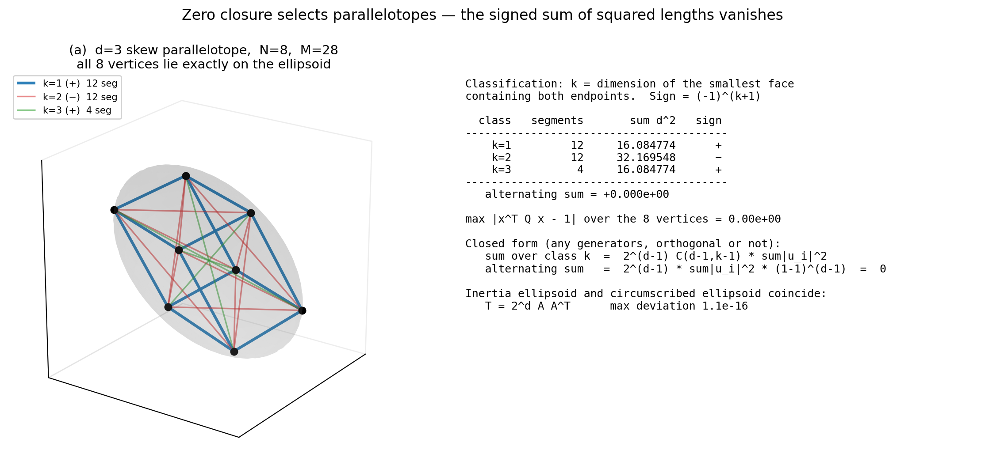

斜交した平行六面体（$d = 3$、$N = 2^3 = 8$、$M = 28$）。$28$ 本の線分を、両端点を含む最小の面の次元 $k$ で色分けする。$k=1$（辺）が12本、$k=2$（面の対角線）が12本、$k=3$（空間対角線）が4本。符号 $(-1)^{k+1}$ を付けた交代和が厳密に零になる。

**長さで分類してはならない。** 斜交した平行六面体では相異なる長さ$^2$ が13種類現れるが、面次元による分類はちょうど3種類である。立方体のように対称性の高い図形でのみ両者がたまたま一致する。

#### 図2 — 4次元の平行多面体（3次元への射影）


$d = 4$、$N = 16$、$M = 120$。$120$ 本が4クラスに分かれる（$32 / 48 / 32 / 8$）。$\sum d^2$ は $32.03 / 96.08 / 96.08 / 32.03$ で、交代和は $+7.1\times10^{-15}$。

**絵は3次元への影である。楕円体は4次元では厳密であり、$16$ 頂点全てで $|x^{\mathsf T}Qx - 1| \le 3.3\times10^{-16}$ が成立している。** 影の見た目が楕円からずれて見えても、それは射影の効果である。

対の数は $2^{d-1} = 8 \le d(d+1)/2 = 10$ であるが、この恒等式は $2^{d-1}$ が $d(d+1)/2$ を超える $d \ge 5$ でも成立する（主張6B）。

#### 図3 — 反例：楕円体に乗るだけでは足りない

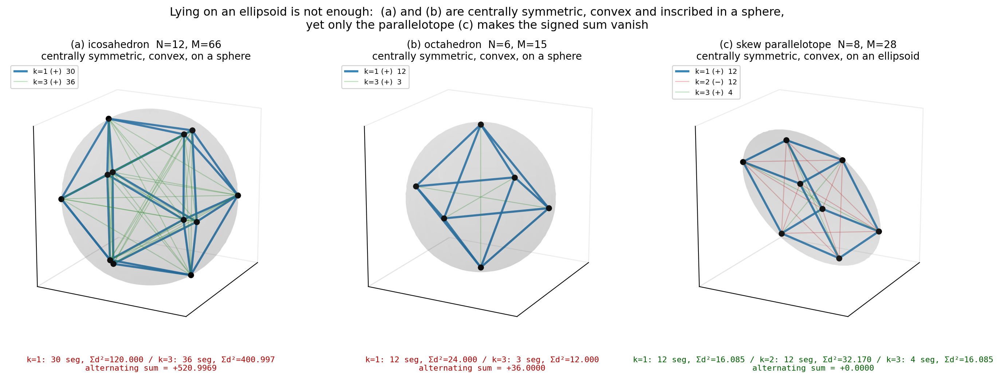

(a) 正二十面体（$N=12$）、(b) 正八面体（$N=6$）、(c) 斜交平行六面体（$N=8$）。(a) と (b) は**中心対称かつ凸で、しかも球面上に乗っている**。それでも交代和は $+520.997$ と $+36.000$ であって零にならない。零になるのは (c) の平行多面体だけである（$+0.0000$）。

**この図が示すのは、「楕円面に乗ること」と「零閉鎖すること」は別の条件だという一点である。** 零閉鎖の方が真に強い。

#### 図4 — 零閉鎖の楕円体と、閉鎖が固定するもの

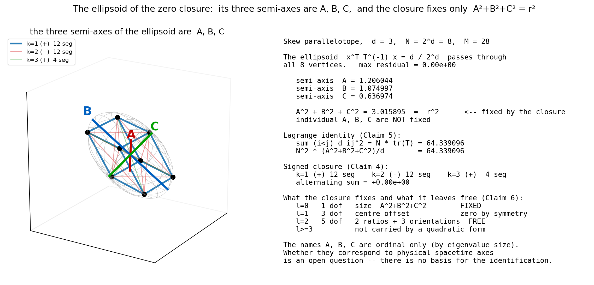

平行多面体の外接楕円体は慣性楕円体と一致する（主張6B）。半軸を $A, B, C$ とすると、零閉鎖が固定するのは $A^2 + B^2 + C^2 = r^2$ という**1個だけ**である（主張5）。個々の $A, B, C$ は固定されない。多重極で分けると $l=0$ の1自由度が固定され、$l=1$ の3自由度は中心対称性から恒等的に零、$l=2$ の5自由度（形2＋向き3）が自由に残る（主張6）。

$A, B, C$ という名前は固有値の大小順で付けた序数である。物理的時空との対応は今後の課題である（§0B、主張12）。

### 5.2 数値模型の図（走行結果）

条件：mode = electron、$N = 16 = 2^4$、$\delta = 0.1$、$T = 40000$。物質側（`_m_`）と真空対照（`_v_`）。各図は4段構成である。

| 段 | 内容 |
|---|---|
| (a) | 絶対スケール。枠は $\pm 0.17$ に固定。全 $\tau$ で同じ枠なので、枠に対する大きさの変化がそのままスケールの変化である |
| (b) | $r_{\rm rms}$ で正規化。枠は $\pm 1.1$ に固定。形だけを比較する |
| (c) | スケール履歴（対数）。現在の $\tau$ を縦線で示す |
| (d) | 全15主軸の履歴。$0$ より上が実、下が虚 |

> **枠の値について（v3 の記述誤りの訂正）**：図の題字に出る `half-range` は起動引数 `--absmax` の値であり、実際の枠はこれを `--zoom`（既定 2.0）で割った値である。v3 は $\pm0.28$／$\pm2.2$ と書いていたが、実際の枠は $\pm0.14$／$\pm1.1$ であった。v4 の $N=16$ 図は `--absmax 0.34 --zoom 2`（実枠 $\pm0.17$）で全頂点が枠内に入るようにしてある。

頂点の色は偏差 $s_i$（青が楕円面の内側、赤が外側、白が楕円面上）、線分の色は関係の長さ $|z|$ である。

#### 図5〜8 — 物質側の4時点

| $\tau$ | 図 |
|---|---|
| 0（開始） | 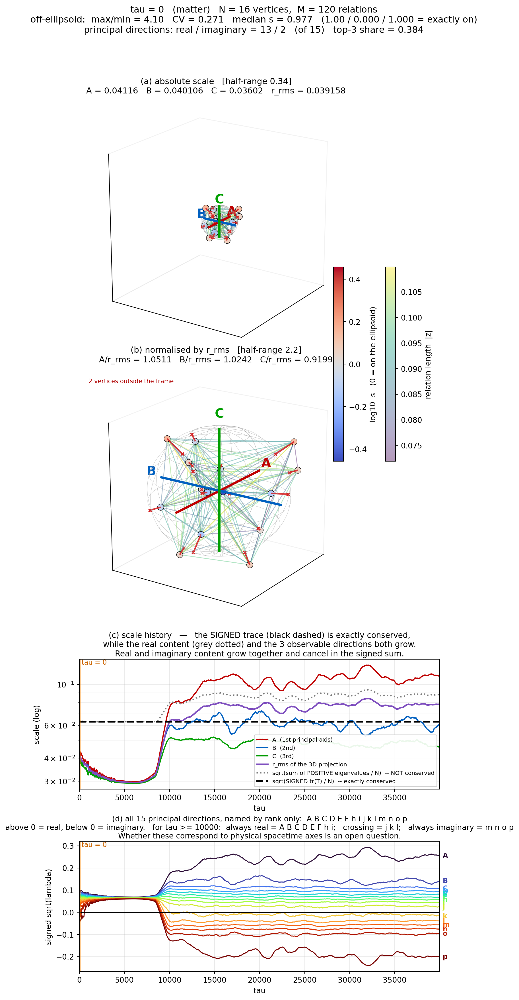 |
| 4000（転移前） | 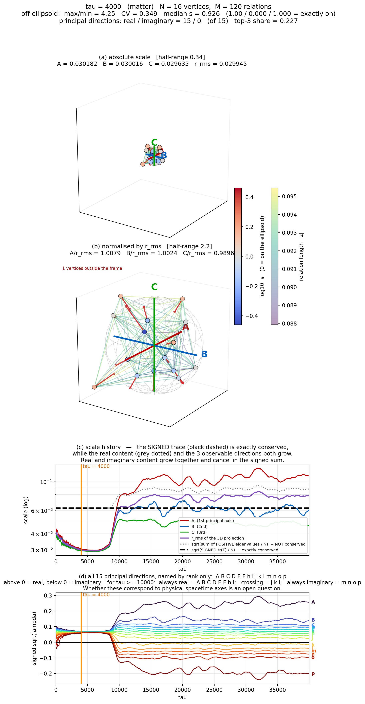 |
| 9487（転移直後） |  |
| 39991（終了） | 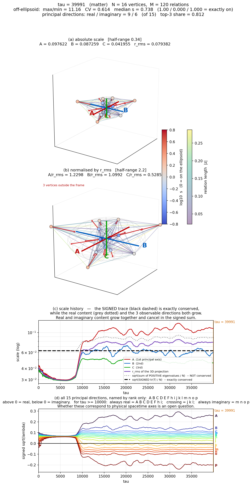 |

#### 図9〜12 — 真空対照の4時点

| $\tau$ | 図 |
|---|---|
| 0 | 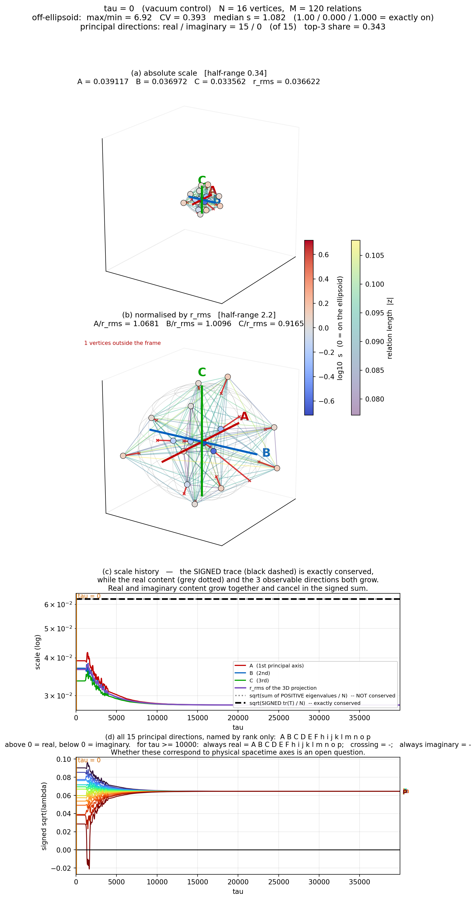 |
| 4000 | 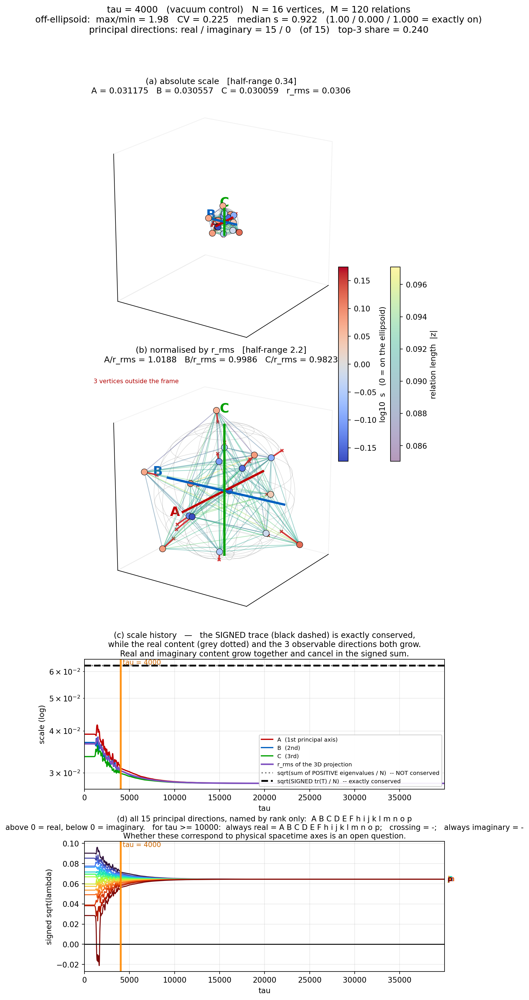 |
| 9487 | 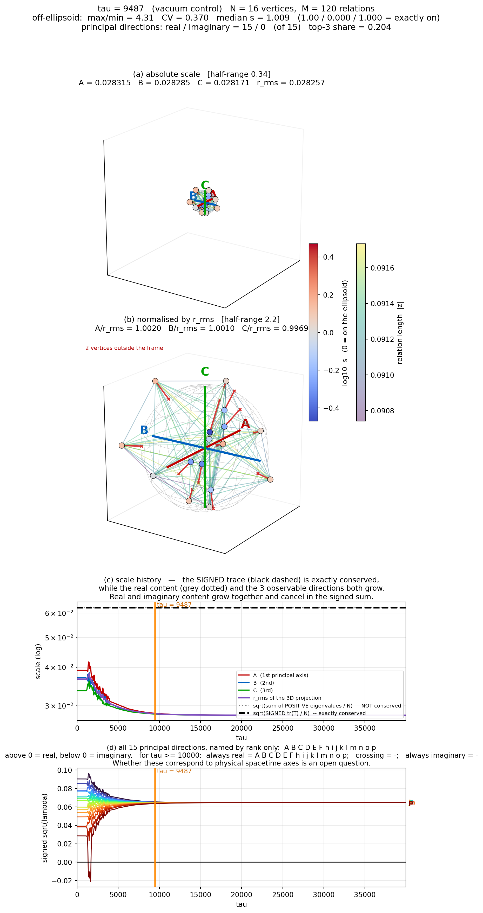 |
| 39991 | 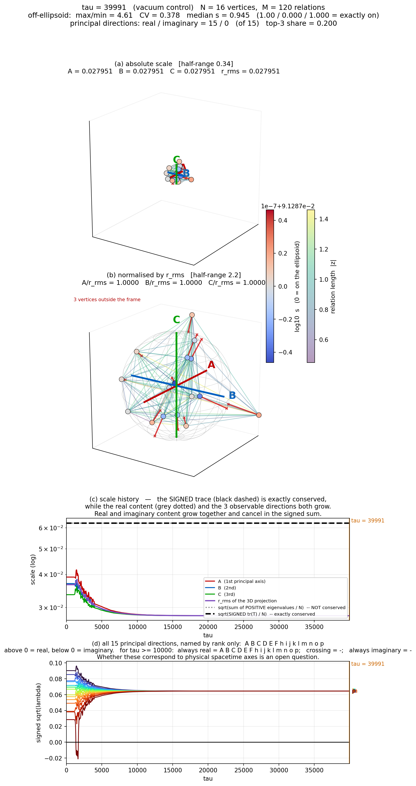 |

---

## 5.3 図の読み方 その1 — インフレーションの誤読を防ぐ

**この節は必読である。図5〜8 は二通りの正反対の誤読を招く。両方とも誤りである。**

### 誤読1：「保存則が成り立っているのだから、拡大は起きていない」

(c) 段の**黒い破線**は $\tau$ の全域で完全に水平である。これを見て「何も拡大していない」と読むのは誤りである。

黒い破線が表しているのは**符号付き**トレース $\mathrm{tr}(T) = \sum_a \lambda_a$ である。ラグランジュの恒等式 $\sum_{i<j}d_{ij}^2 = N\,\mathrm{tr}(T)$ により、これは関係量のパワーそのものであり、動力学が厳密に保存する。実測でも後期968点の最小値と最大値が8桁まで一致する。

しかし**符号付き和が保存することは、各方向が動かないことを意味しない。**

同じ (c) 段の**灰色の点線**は正の固有値だけの和である。これは水平ではなく、転移で跳ね上がって $1.90$ 倍になる。絶対値和 $\sum_a|\lambda_a|$ は $2.79$ 倍になる。実方向の総量が増え、虚方向の総量がほぼゼロから現れ、その**差**が保存しているのである（主張13）。

指数関数的な増幅は実在する。(c) 段の赤・青・緑の線が $\tau \approx 9000$ で垂直に跳ね上がっているのがそれである。**$N=12$ ではこの跳ね上がりが $\tau \approx 2500$ にあった。転移時刻は分解能に依存する。**

### 誤読2：「$A$ が $2.8$ 倍になったのだから、系全体が $2.8$ 倍になった」

これも誤りである。符号付きトレースは動いていない。

観測される3方向が拡大するのは、次の**二つの効果の積**である。

1. 絶対値和が $2.79$ 倍に増える
2. 上位3方向の占有率が $0.384$ から $0.812$ へ上がる（集中）

どちらか一方だけでは説明にならない。

### 誤読3：「余剰次元がコンパクト化した」

**これも誤りである。** $m, n, o, p$ は小さく丸まって観測から消えたのではない。

(d) 段を見ると、$p$ は $\tau \approx 9000$ でゼロを**通過して**下へ抜け、そのまま $-0.19$ まで**絶対値を増やしながら**落ちていく。転移前後の比は $5.568$ 倍である。$o$ も $2.624$ 倍、$n$ も $1.674$ 倍、$m$ も $1.123$ 倍。**虚側へ移る4本はすべて絶対値を増やしている。** 縮んでいるのは往復組の $j$（$0.477$ 倍）と $k$（$0.380$ 倍）である。

したがって起きているのは「余剰次元が縮んだ」ではなく、**「3方向が拡大し、7方向が符号を変えた（うち3本は往復）」**である。機構が違う。

### 誤読4：「主軸が15本あるから、この系は15次元の平行多面体である」

**これも誤りである。** 主軸の本数は $N-1 = 15$、零閉鎖が要求する平行多面体の次元は $d = 4$（$N = 2^4$ より）であって、別物である（主張16-d）。系が平行多面体に到達したならランクは $4$ に落ちるはずだが、実測のランクは 8〜11 である。到達していない。

### 図の見方の要点

- (a) 段は全 $\tau$ で枠が $\pm 0.17$ に固定してある。$\tau = 4000$ の図と $\tau = 39991$ の図を並べると、楕円体そのものが枠に対して大きくなっているのが直接見える。
- (b) 段は $r_{\rm rms}$ で割ってあるので、大きさの情報が消えて形だけが残る。$\tau = 39991$ で $A/r_{\rm rms} = 1.230$、$C/r_{\rm rms} = 0.529$ と、扁平になっているのがわかる。
- (c) 段の縦線が現在の $\tau$ である。各図がどの時点かを (c) 段の中で確認できる。**(a) 段の絶対スケールだけを見て時系列を判断してはならない。**
- (d) 段の右端の文字が15本の主軸の名前である。

### 真空対照との比較

図9〜12（真空）では、(c) 段の黒破線も灰点線も**両方とも**水平である。転移が起きないので絶対値和も増えない。(d) 段の15本は全て正の側に留まり、$\tau = 39991$ では全て $0.0645$ に集まって完全等方になる。

**図5〜8 で見えている拡大と虚方向への転落は、いずれも物質の生成に伴う現象であって、系が最初から持っていた性質ではない。** これが対照実験の結論である。

---

## 5.4 図の読み方 その2 — $A,B,C,D,E,F,h,i,j,k,l,m,n,o,p$ の15次元とは何か

### なぜ15本なのか

分解能 $N = 16$ の系は $M = N(N-1)/2 = 120$ 本の関係を持つ。各関係量から長さ $d_{ij}$ を読み、二重中心化

$$B = -\tfrac12\,J\,D^{\circ 2}\,J,\qquad J = I - \tfrac1N\mathbf{1}\mathbf{1}^{\mathsf T}$$

によりグラム行列を作ると、$B\mathbf{1} = 0$ が厳密に成り立つ。この自明ゼロは主軸ではないから、主軸は $N - 1 = 15$ 本である。

**15 という数は分解能 $N=16$ から出た $N-1$ であって、外から選んだ数ではない。** $N$ を変えれば $N-1$ に変わる（$N=12$ なら 11 本だった）。この点で、超弦理論の $10$ や $11$ のように理論の無矛盾性から一意に決まる次元数とは性格が異なる。

**そして $N$ 自体は自由ではない。** 主張16 により $N = 2^d$ に限られ、本ノートは $N = 16 = 2^4$ を採る。したがって主軸の本数は $2^d - 1 = 15$ である。$d$ と $2^d-1$ を混同しないこと（主張16-d）。

### 15本が何をしているか

| 組 | 主軸 | 転移前後の比 | 実／虚 | 役割 |
|---|---|---|---|---|
| **$A, B, C$** | 第1〜3 | $2.80$ / $1.73$ / $1.42$ | 実 | **拡大する。3次元射影に現れる。図化に使う** |
| **$D, E, F, h, i$** | 第4〜8 | $1.27$ / $1.14$ / $1.01$ / $0.87$ / $0.71$ | 実 | **ほぼ変わらない。実軸だが射影には現れない** |
| **$j, k, l$** | 第9〜11 | $0.48$ / $0.38$ / $0.73$ | 往復 | **実虚の境界を行き来する。虚方向の本数が4〜7で揺れる原因** |
| **$m, n, o, p$** | 第12〜15 | $1.12$ / $1.67$ / $2.62$ / $5.57$ | 虚 | **虚側に落ちる。ただし絶対値は増える** |

実軸は $A$〜$i$ の8本、虚軸は $m,n,o,p$ の4本で確定しており、$j,k,l$ の3本が境界を往復する。「虚6本」が最も多い（968点中616点）。

### 名前が序数であることの意味

$A$ から $p$ までの名前は、**その時刻における固有値の大小順**を表すだけである。次のことに注意しなければならない。

1. **名前は物理量ではない。** $A$ が「時間軸」であるとか $B$ が「$R$」であるといった対応は、一切主張していない。
2. **同じ名前が同じ方向を指し続けるとは限らない。** 固有値が縮退する時刻では順序が入れ替わる。$N=16$ の実測最小ギャップは $3.4\times10^{-6}$〜$5.1\times10^{-5}$ であり、$N=12$ より一桁小さい。縮退は現実に起きている。
3. **主軸ベクトルは時間的に連続しない。** 第1主軸ベクトルの内積の絶対値は $\tau = 4000$ と $\tau = 39991$ の間でわずか $0.0450$、$\tau = 9487$ と $\tau = 39991$ の間では $0.0233$ である。つまり転移直後の $A$ と終了時の $A$ は、ほとんど直交した別の方向である。

**したがって (d) 段の15本の線は「15個の物理的な軸の時間発展」ではない。「各時刻において固有値の大きさで順位付けした値の系列」である。** この区別は重要である。

### 物理への同定は今後の課題である

15方向のうち3方向が急拡大し、5方向がほぼ不変にとどまり、7方向が虚方向へ移る（うち3本は往復）という構造が得られた。しかし、

> **これらが物理的時空（時間1軸＋空間3軸、あるいは $R$ と $Q$）に同定できるのか、同定できないのか、あるいは別の写像を挟む必要があるのかは、今後の課題である。同定できる根拠は現時点で何もない。**

同様に、

> **この15次元構造が超弦理論をはじめとする既存の高次元理論とどのような関係にあるのかも、今後の課題である。**

**v3 まで本ノートは $N=12$ を採っていたため主軸が 11 本であり、超弦理論の 11 次元と数が一致していた。これは分解能の選び方による偶然である。** $N=16$ では 15 本になる。§5.3 の誤読3 で述べた通り機構も異なる（コンパクト化ではない）。また出所も異なる（本模型では $N-1$、超弦理論では無矛盾性）。**語の一致をもって理論の対応を主張しない。**

---

## 5.5 図13 — 準振動とその周期（主張15）

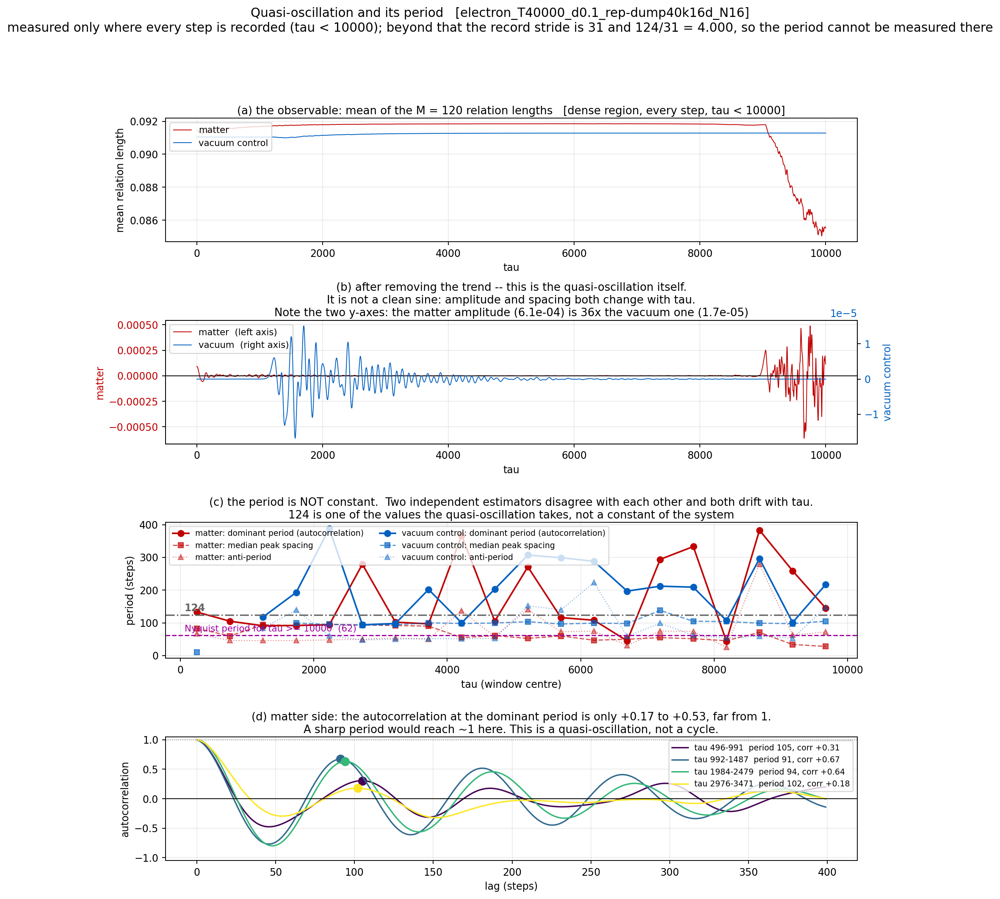

導出プログラムは `複製_ダンプ版_v1/次元の生成構造/対照実験_N掃引1to20_三系_v2/make_period_figure_v1.py`。測定値そのものは `複製_ダンプ版_v1/次元の生成構造/対照実験_N掃引1to20_三系_v2/figures_tau/period_series_electron_T40000_d0.1_rep-dump40k16d_N16_v1.npz` に保存してある。

**この図は密領域を $\tau<10000$ に広げた専用走行（`...rep-dump40k16d_N16`）によるもので、転移（$\tau\approx9000$）を含む。** 楕円体図（図5〜12）の走行 `...rep-dump40k16_N16` とは同一条件・同一乱数で、密領域の取り方だけが異なる。

| 段 | 内容 |
|---|---|
| (a) | 観測量そのもの。120本の関係長の平均。密領域（全ステップ記録）のみ |
| (b) | 201点移動平均を引いた残り。これが準振動そのもの |
| (c) | 卓越周期の $\tau$ 依存。自己相関法（丸・実線）と山間隔法（四角・破線）と反周期（三角・点線）を重ねた |
| (d) | 自己相関そのもの。物質側の4窓 |

**この図の読み方**

- (a)：物質側（赤）は $\tau \approx 8900$ まで平坦で、そこから**急落する**。これが転移である。真空側（青）は全区間で平坦のままである。$N=12$ では同じ急落が $\tau \approx 2300$ にあった。
- (b)：**左右で軸が違う。** 物質側（左軸）は転移まで振幅がほぼ零で、$\tau \approx 8900$ から一気に立ち上がる。真空側（右軸、$10^{-5}$ 台）は $\tau \approx 1200$〜$4000$ に一度きれいな振動を見せてから減衰する。**転移前には物質側の振動がむしろ真空側より小さい区間がある**（$\tau\in[3968,8927]$、主張15 の項目7）。この区間の山間隔をノイズと判定した根拠がこの段である。
- (c)：**この段が主張15 の核心である。** 灰色の一点鎖線が $124$ である。2本の推定線はどちらもこの線の上を横切るだけで、その上に留まらない。**2つの推定法が互いに一致しないこと、そしてどちらも $\tau$ とともに漂動することが、単一の鋭い周期が存在しないことの証拠である。** 紫の破線は $\tau \ge 10000$ におけるナイキスト周期 $62$ で、この線より下は後期には測れない領域である。**転移後の山間隔 $34.0 \to 28.0$ はこの線より下にある**から、粗い記録の走行では原理的に捉えられなかった。
- (d)：**鋭い周期であれば、卓越周期のラグで自己相関が $1$ に達するはずである。** $N=16$ の実測は $+0.134$〜$+0.673$ にとどまる（各曲線上の丸印）。これが「巡回」ではなく「準振動」だと判断した根拠である。曲線の形も窓ごとに違う。

**この図が禁じる誤読**

> 「$124$ ステップの周期がある」——正確ではない。$124$ は準振動が取る値の一つであって、系の定数ではない。(c) 段の2本の推定線が $124$ の線上に載っていないことを見ること。
>
> 「周期があるから $U^n = I$ が確認された」——確認されていない。$U^n = I$ に由来するなら周期は $n$ で決まる定数のはずである。実測は変動している。$U^n = I$ によるものか別の現象かは未決着である。

---

## 6. 本ノートが確定させたこと

冒頭に挙げた二つの問いへの答えは以下である。

**問1：波を複素数で表現することは必須か。**

必須ではない（主張9）。複素数が実の符号不定形に対して追加しているのは $\sum q_np_n = 0$ 一本だけであり、それはスケール対称性の言い換えである（主張8）。したがって複素表現は必須ではなく、公理を一つ節約する便法である。

**問2：複素表現した場合の中心投影はどういう形になるか。**

中心投影の中心は頂点ではなく、主観空間から観測できない。虚数記号が付くのは中心方向だけであり、線分の長さは全て実数のままである（主張7）。

**そして実数の場合と同じ「多体問題が保存二次形式ひとつの上の運動へ縮約される」構造が保たれる（主張0）。** 実数では $\sum x_n^2 = R^2$ が半径 $R$ の球殻表面上の任意の点 $P$ を表し、拘束は $X^{\mathsf T}F(X) = 0$ の一本に縮約された。複素では

$$x^2 + y^2 + z^2 - t^2 = R^2 + Q^2$$

となる。これは4変数のままでは符号数 $(3,1)$ の一葉双曲面であって閉じないが、**$t$ を固定した3次元断面において、読出し写像 $X = Lu$ を通して正定値二次形式 $G = (L^{-1})^{\mathsf T}L^{-1}$ の定める閉曲面（楕円面）になる**（主張0-c）。したがって複素拡張の後も縮約は失われていない。

**ただし二点を混同してはならない。** 第一に、保存量は運動を決めるのではなく、**許される運動の空間を決める**だけである。第二に、この楕円面が**慣性楕円体そのものであることは未証明である**。それには $G^{-1}\propto T$ を示す必要があり、読出し写像 $L$ が未与である以上（主張2B）、現時点では示せない。**これが本ノートにおける最大の未導出部分である。**

**ただし右辺が厳密に保存するのは定常状態に限る。** 過渡期および準安定状態では逸脱し、振動する場合もある（主張0-d、主張10、主張15）。層の区別も要る。上の逸脱は成分の層での話であり、読出しの層には転移を貫通して保存する量が存在する（主張18-c・18-d）。

この形の零閉鎖が選び出す配置は、**平行多面体**である（主張4）。頂点数は $N = 2^d$ に限られる。中心対称と凸はその帰結であって、それだけでは足りない。選び出された配置は必ず楕円体に内接し、その外接楕円体は慣性楕円体と一致する（主張6B）。そして配置の二次の情報は慣性楕円体に尽き、多重極 $l\le2$ で飽和する（主張6）。

すなわち中心投影の実体は、**$d$ 本の線分のミンコフスキー和として作られ、一つの楕円体に内接し、その楕円体の情報が $l\le2$ で飽和する配置**である。

**v3 で追加した問3：数値模型は実際にその配置になっているか。**

なっていない。

- 零閉鎖は定常状態でのみ成立する恒等式であり、過渡状態と準安定状態では破れる。楕円面からの偏差は $\tau$ とともに単調に減らず、転移後 36,000 ステップにわたり max/min $= 12$ 前後に留まる（主張10）
- この偏差はシード強度に依存する。本走行の $\delta = 0.1$ は大きい。**シードを弱めた場合・$\tau$ を伸ばした場合に偏差が漸減するかは未確認である**（主張11）
- 配置は平行多面体に到達しない。ランクは $15$ から $8$〜$11$ へ落ちるが $d = 4$ までは落ちない（§3B）
- 系は $N-1 = 15$ 次元の自由度を持ち、上位3方向 $A,B,C$ への集中により観測スケールが拡大する。$D$〜$i$ はほぼ不変、$m,n,o,p$ は虚方向へ移り、$j,k,l$ は往復する。**これがコンパクト化でないこと**は確定したが、**物理的時空への同定は今後の課題であり、根拠は何もない**（主張12）
- 分解能は $N = 2^d$ に限られ、本ノートは $N=16$（$d=4$）を採る。ただし $N = 2^d$ は必要条件であって十分条件ではなく、rank $= d$ も単独では足りない（主張16）
- 平行多面体を選び出しているのは $\sum x_n^2 = 0$ という式の形ではなく、面次元による符号則である。符号と配置をともに自由に選べるなら $N \ge 3$ で非自明解が存在してしまう（主張17）
- 保存するのは符号付きトレースであり、実方向の総量と虚方向の総量はともに増えて相殺する（主張13）
- 虚方向は真空には存在せず、物質の生成とともに現れる（主張14）
- 主軸の**向きは保存しない**。上位3主軸の部分空間は約 2000 ステップで乱数基準まで相関を失い、$36{,}000$ ステップ掃引しても安定化しない。しかし**内積の取れる保存量は存在する**。$\sum_e\lvert x_e\rvert^2$ と $\sum_e x_e^2$ の二つで、どちらもトレース型なので向きの拡散の影響を受けない。とくに $\sum_e x_e^2$ は**複素数として転移を貫通して不変**である（主張18）
- $10^2$ ステップ規模の準振動が存在するが、周期は $\tau$ とともに変動する。$N=16$ では転移前の山間隔 $90$〜$95.5$ が転移域で $34.0$、転移直後で $28.0$ へ短縮し、真空側は $93.5$〜$138$ のまま短縮しない。**転移が周期を短くするという $N=12$ の所見は $N=16$ でも再現した。** ただし**これが第2公理 $U^n = I$ によるものか別の現象かは今後の課題である**（主張15）

**v4 で追加した問4：表題の「4次元」とは何か。**

$(r, t, R, Q)$ である（主張2B）。関係性が与えるのは長さ $r$ だけであり、$x, y, z$ は実体ではなく $r$ からの読出しで決まる従属量である。$r^2 = x^2+y^2+z^2$ はその読出しが満たす関係であって、$x,y,z$ が先にあるのではない。読出しの成分数が 3 であることは主張2 が与える。したがって独立な自由度は 6 ではなく 4 である。

**平行多面体の次元 $d = 4$（$N=16$、主張16）とは別物である。数字の一致は偶然であって、一方から他方は導かれない。**

**v4 で追加した問5：向きは安定するのか。**

しない（主張18-a）。しかし**重要なのは向きではなく、内積の取れる保存量が存在するかどうかである。** 存在する（主張18-b）。エルミート $\sum\lvert x_e\rvert^2$ と双線形 $\sum x_e^2$ の二つで、後者は複素数として転移を貫通して不変である。どちらもトレース型なので、向きが拡散しても値は変わらない。**ただし保存するのは読出しの層だけであり、成分の層では保存しない（主張18-d）。**

この結果は、$r$ からの読出しの写像（主張2B）と、$A,B,\dots,p$ の物理への同定（主張12）という二つの未解決を、**同じ一つの問題**として整理する。固定された枠との同定は望めず、同定できるとすれば向きに依らない量である（主張18-f）。

**幾何の言明（主張1〜9）と数値模型の実測（主張10〜18）の間には、まだ埋まっていない距離がある。** 本ノートはその距離を測り、どこが埋まっていないかを特定した。埋める作業は本ノートの範囲外である。

---

## 付録A. 本ノートで使用したプログラムの一覧

すべてリポジトリ内に保存してある。**パスはこのファイルの位置からの相対パスであり、略記を用いない。** ハッシュは MD5 の先頭8桁。

複製は2つある。

- `複製_対照実験_N16_v1/` — 検証済みレプリカ。正本を md5 一致で複製したもので、**一行も改変していない**
- `複製_ダンプ版_v1/` — ダンプ改造版。**実際に走らせたのはこちら**

依存が `HERE.parent` と `PAPER8.parent.parent` を使うため、複製はリポジトリ相対の入れ子構造を保っている。両複製の内部の相対構造は同一であり、以下では走行に用いた `複製_ダンプ版_v1/` 側のパスを示す。

### A.1 本ノートのために新規作成したプログラム（7本）

| ファイル | ハッシュ | 役割 | 生成物 |
|---|---|---|---|
| `複製_ダンプ版_v1/次元の生成構造/対照実験_N掃引1to20_三系_v2/make_scale_series_v1.py` | `4df6b80c` | ダンプから全 $\tau$ の主軸スペクトル・ランク・虚方向数・符号付きトレース・正負成分を抽出してキャッシュ | `複製_ダンプ版_v1/次元の生成構造/対照実験_N掃引1to20_三系_v2/scale_series_*.npz` |
| `複製_ダンプ版_v1/次元の生成構造/対照実験_N掃引1to20_三系_v2/make_ellipsoid_figure_v1.py` | `2f75f478` | 指定 $\tau$ の4段図（楕円体・正規化・スケール履歴・全 $N-1$ 主軸履歴）。主張10・12・13・14 の導出。**v4 で軸名表を 15 本（$\dots l,m,n,o,p$）へ拡張した**（v3 のハッシュは `da11c229`、11 本までしか名前が無く 12 本目以降が番号で描かれていた） | 図5〜12 |
| `複製_ダンプ版_v1/次元の生成構造/対照実験_N掃引1to20_三系_v2/make_period_figure_v1.py` | `5ea24de2` | 準振動の周期を自己相関法と山間隔法の2通りで測り図化。主張15 の導出。**v4 で2点を修正した**（v3 のハッシュは `a384c970`）：(1) 密領域の終端 `--dense-end` が 4000 固定で、密領域を広げた走行でも $\tau<4000$ しか測らない罠があったため、既定を `dump_meta` の `dump_tauc` から取るようにした。(2) (a) 段の題字が `M = 66` 固定で $N=16$（$M=120$）では誤表示だったため、メタの `m` から取るようにした | 図13、`複製_ダンプ版_v1/次元の生成構造/対照実験_N掃引1to20_三系_v2/figures_tau/period_series_*.npz` |
| `複製_ダンプ版_v1/次元の生成構造/対照実験_N掃引1to20_三系_v2/check_invariants_v1.py` | `a9f78842` | 主軸の向きの安定性（部分空間の重なり）と、保存する二次不変量（エルミート・双線形・$\mathrm{tr}(B^k)$・成分層）を測る。主張18 の導出 | `figures_tau/invariants_*.json` |
| `figures_v1/make_figs.py` | `7fc0ac70` | 平行多面体の面次元分類（$d=3$ と $d=4$）。主張4 の導出 | 図1、図2 |
| `figures_v1/make_fig3.py` | `ff721504` | 中心対称かつ凸な反例（正二十面体・正八面体）と平行多面体の対比。主張4-d の導出 | 図3 |
| `figures_v1/make_fig4.py` | `b940a9af` | 零閉鎖の楕円体と半軸 $A,B,C$、閉鎖が固定する自由度。主張5・6・6B の導出 | 図4 |
| `figures_v1/check_sufficiency_v1.py` | `eb58bbef` | $N=2^d$・rank $=d$ が単独でも同時でも十分でないこと、rank $=N-1$ での判定の自明化、$N=d+1$（単体）の縮退。主張16-b・16-c の導出 | `check_sufficiency_v1.json` |
| `figures_v1/check_real_solutions_v1.py` | `c45e9259` | 符号選択だけでは固定距離集合を零にできないこと・符号と配置がともに自由なら解けること（検査B）、$\sum_{辺}d^2=\sum_{主対角線}d^2$（検査D）、面次元クラス別の実虚内訳（検査E）、長さのみからのクラス復元（検査F）。主張4-f・4-g・17 の導出 | `check_real_solutions_v1.json` |

### A.2 走行プログラム — 改変したもの（2本）

正本（`複製_対照実験_N16_v1/` 側）は一行も書き換えていない。改変は `複製_ダンプ版_v1/` 側にのみ加えた。改変箇所には印を付けてある。ハッシュは改変前（正本）のもの。

| ファイル（`複製_ダンプ版_v1/次元の生成構造/対照実験_N掃引1to20_三系_v2/`） | `R` のハッシュ | 改変内容 |
|---|---|---|
| `run_nsweep_three_series_v2.py` | `3e8e06c8` | 二段サンプリングのダンプ機構を追加。`DUMP_TAUC`（既定 4000）まで全ステップ、以降 `DUMP_STRIDE`（既定 31）毎に $C_2$ を memmap へ書き出す。対応表 `dump_taus` をメタに保存。物理・記録項目・判定・図の生成ロジックには触れていない |
| `run_tb_nsweep_1to20_v1.py` | `bfa5d854` | 最終フレームの診断辞書をキー別に配列化して保存する経路を追加 |

### A.3 走行プログラム — 無改変（22本）

`複製_対照実験_N16_v1/` と `複製_ダンプ版_v1/` でバイト一致を確認済み。物理を決めているのはこれらである。

**核（統一万能関数）**

| ファイル（`複製_ダンプ版_v1/次元の生成構造/統一万能関数_v1/`） | ハッシュ |
|---|---|
| `unified_interaction_v1.py` | `bf45d4c7` |
| `unified_interaction_v2.py` | `728e79a7` |
| `unified_readout_v3.py` | `bea700fe` |
| `unified_dimension_v1.py` | `1416d9ad` |
| `selection_v1.py` | `5c23ced4` |

**万能非弾性写像・多体接続・親白色波**

| ファイル | ハッシュ |
|---|---|
| `複製_ダンプ版_v1/次元の生成構造/万能非弾性写像_managed_v1/universal_inelastic_map_v1.py` | `7c07a52e` |
| `複製_ダンプ版_v1/次元の生成構造/万能非弾性写像_managed_v1/universal_inelastic_map_v3.py` | `bfb15801` |
| `複製_ダンプ版_v1/次元の生成構造/万能非弾性写像_managed_v1/run_ignition_fate_exact_v3.py` | `a95f3327` |
| `複製_ダンプ版_v1/次元の生成構造/万能相互作用多体接続_v1/run_stage2_vertex_engine_v1.py` | `55f88e26` |
| `複製_ダンプ版_v1/次元の生成構造/万能相互作用多体接続_v1/run_stage3_sharedO_v2_and_hair_v1.py` | `75bc31db` |
| `複製_ダンプ版_v1/次元の生成構造/make_parent_white_managed_v1/make_parent_white_harmonics_n_only_v3.py` | `328c0457` |

**過去論文の走行環境（依存として読み込まれる）**

| ファイル | ハッシュ |
|---|---|
| `複製_ダンプ版_v1/次元の生成構造/第8論文_二段階seed除去による準安定相の因果分離/code/run_preliminary_seed_ablation_v1.py` | `45c4b42a` |
| `複製_ダンプ版_v1/次元の生成構造/第9論文_フェルミオンの生成構造/対照実験_波束収縮_実行環境_v1/20260713/run_exchange_scattering_matrix_fermionic_localization_transfer_preliminary_v1.py` | `3cb0bfda` |
| `複製_ダンプ版_v1/次元の生成構造/第9論文_フェルミオンの生成構造/対照実験_波束収縮_実行環境_v1/20260715/run_system_A_localization_exchange_R_sweep_preliminary_v1.py` | `941c7b21` |
| `複製_ダンプ版_v1/次元の生成構造/第9論文_フェルミオンの生成構造/対照実験_波束収縮_実行環境_v1/ab_invariant_theta_toy_v1/run_ab_invariant_theta_toy_v1.py` | `682a41ce` |
| `複製_ダンプ版_v1/時間軸Q軸とフェルミオンの生成構造/検証_対照実験/第5論文原本_自発的分裂予備実験_v1/run_n_scaling_lowrank_v1.py` | `1b63c1ec` |
| `複製_ダンプ版_v1/時間軸Q軸とフェルミオンの生成構造/検証_対照実験/第5論文原本_自発的分裂予備実験_v1/run_plane_flow_exact_v1.py` | `444ea69f` |
| `複製_ダンプ版_v1/時間軸Q軸とフェルミオンの生成構造/検証_対照実験/第5論文原本_自発的分裂予備実験_v1/run_plane_flow_approx_v1.py` | `5d6a5e8a` |
| `複製_ダンプ版_v1/時間軸Q軸とフェルミオンの生成構造/検証_対照実験/第5論文原本_自発的分裂予備実験_v1/exact_lowN_eigenspectrum_v2/code/run_n300_dimension_saturation_v2.py` | `a11fb4ca` |
| `複製_ダンプ版_v1/時間軸Q軸とフェルミオンの生成構造/検証_対照実験/第5論文原本_自発的分裂予備実験_v1/exact_lowN_eigenspectrum_v2/paper7_longtime/code/run_paper7_5color_timeseries.py` | `25b4dbde` |
| `複製_ダンプ版_v1/時間軸Q軸とフェルミオンの生成構造/検証_対照実験/第5論文原本_自発的分裂予備実験_v1/exact_lowN_eigenspectrum_v2/paper7_longtime/code/run_paper7_transverse.py` | `6c0125b5` |

**条件固定ランナー**

| ファイル | ハッシュ | 役割 |
|---|---|---|
| `複製_ダンプ版_v1/次元の生成構造/対照実験_N掃引1to20_三系_v2/run_sample4fig_electron_N12_d0.1_T4000_v1.py` | `d86c535f` | 正本を無改変のまま条件だけ固定して起動するラッパー。$\delta$ 水準の選択根拠を docstring に記録してある |

### A.4 再現手順

**開始ディレクトリはこのファイルの置かれている `次元の生成構造/ゼロ閉塞の幾何・代数構造/` である。** 以下の `cd` はそこからの相対移動である。

```bash
# 1. 走行（N=16=2^4、二段サンプリングでダンプ）
cd 複製_ダンプ版_v1/次元の生成構造/対照実験_N掃引1to20_三系_v2
DUMP_TAUC=4000 DUMP_STRIDE=31 \
  python3 run_nsweep_three_series_v2.py electron 16 16 40000 0.1 dump40k16

# 2. 主軸スペクトルの抽出（物質側・真空側）
python3 make_scale_series_v1.py electron_T40000_d0.1_rep-dump40k16_N16 m v

# 3. 図5〜12（4時点 × 物質／真空）
#    τ は N=16 の転移（τ≈9000〜9500）に合わせて選んである
for side in m v; do
  python3 make_ellipsoid_figure_v1.py \
    --stem electron_T40000_d0.1_rep-dump40k16_N16 --side $side \
    --absmax 0.34 --tau 0 4000 9487 39991
done

# 4. 図13（準振動の周期）— 転移を密領域に含める専用走行が要る
#    既定の DUMP_TAUC=4000 では N=16 の転移（τ≈9000）が窓の外に落ちる
DUMP_TAUC=10000 DUMP_STRIDE=31 \
  python3 run_nsweep_three_series_v2.py electron 16 16 40000 0.1 dump40k16d
python3 make_period_figure_v1.py electron_T40000_d0.1_rep-dump40k16d_N16
#    --dense-end は既定で dump_meta の dump_tauc（=10000）を読む

# 5. 主張18（向きの安定性と保存する内積）
python3 check_invariants_v1.py electron_T40000_d0.1_rep-dump40k16_N16 \
        --N 16 --late 10000 --windows 0,4000,8991,9487,20000,40000

# 6. 図1〜4（幾何の合成配置）
#    ここまでで 複製_ダンプ版_v1/次元の生成構造/対照実験_N掃引1to20_三系_v2 に居るので、
#    3つ上がると開始ディレクトリに戻る
cd ../../../figures_v1
python3 make_figs.py && python3 make_fig3.py && python3 make_fig4.py
python3 check_sufficiency_v1.py && python3 check_real_solutions_v1.py
```

### A.5 生成データ

$N=16$ の走行は**2本**ある。同一条件・同一乱数で、二段サンプリングの密領域の取り方だけが異なる。ディレクトリは `複製_ダンプ版_v1/次元の生成構造/対照実験_N掃引1to20_三系_v2/`。

| stem | `DUMP_TAUC` | フレーム | 走行時間 | 用途 |
|---|---|---|---|---|
| `electron_T40000_d0.1_rep-dump40k16_N16` | 4000 | 5162 | 2300 s | 楕円体図（図5〜12）、主軸スペクトル、主張10・12・13・14・18 |
| `electron_T40000_d0.1_rep-dump40k16d_N16` | 10000 | 10968 | 2688 s | 周期図（図13）、主張15。**転移 $\tau\approx9000$ を密領域に含む** |

| ファイル | 大きさ | 備考 |
|---|---|---|
| `dump_C2_{stem}_{m,v}_v1.npy` | 各 1268.6 MB（`16d` は 2695.5 MB） | フレーム × 120 関係 × 16 × 8 複素。**gitignore 済**（手順1・4で再生成できる） |
| `dump_meta_{stem}_{m,v}_v1.npz` | 小 | $\tau$ 対応表 `dump_taus`、`dump_tauc`、`dump_stride`、関係数 `m` を含む |
| `scale_series_{stem}_{m,v}_v1.npz` | 小 | 全 $\tau$ の主軸スペクトル（15本）・ランク・虚方向数・符号付きトレース |
| `figures_tau/period_series_electron_T40000_d0.1_rep-dump40k16d_N16_v1.npz` | 小 | 主張15 の測定値そのもの |
| `result_nsweep_electron_T40000_d0.1_rep-dump40k16_v2.json` | 小 | 閉包残差等の判定値（`closure_med` ほか） |
| `figures_v1/check_sufficiency_v1.json` | 小 | 主張16-b・16-c の数値 |
| `figures_v1/check_real_solutions_v1.json` | 小 | 主張4-f・4-g・17 の数値 |

**走行時間**：$N=16$・$T=40000$ の2系列で 2300 秒（`dump40k16`）／2688 秒（`dump40k16d`）。$N=12$ の同条件より約 1.5 倍かかる。

**決定性の検証**：走行スクリプトが `determinism_max_abs` を出力する。手順1は同じ入力に対して同じ出力を与える。
