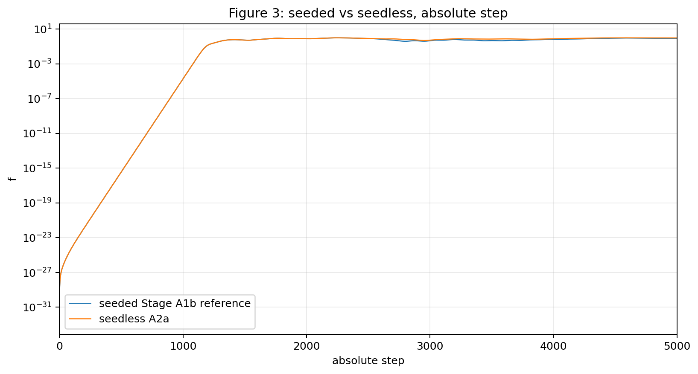
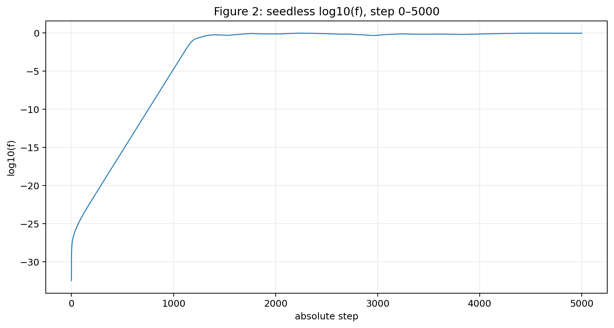
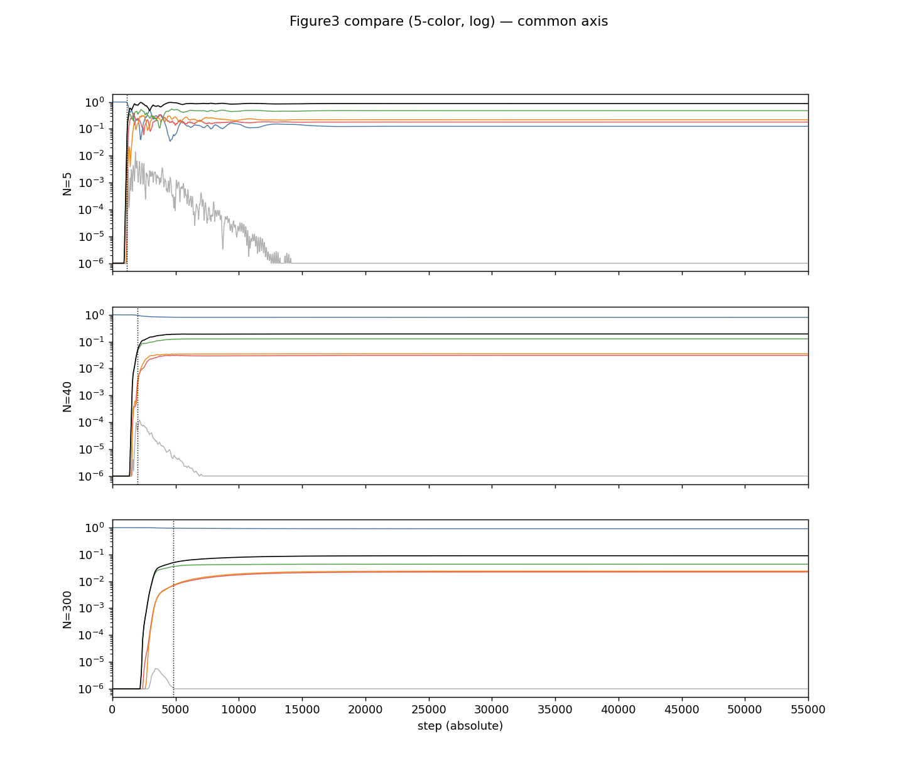

# タネがなくても、インフレーションは起きた——そして方向は三つで止まった

木原範昭  
2026年7月27日

宇宙は、生まれた直後に一瞬で桁違いに膨張した。

現代の宇宙論には、インフレーション理論と呼ばれる有力な考え方があります。

そして最新のインフレーション理論でも、その膨張の始まりには、零点振動と呼ばれる量子的な揺らぎの存在を仮定しています。

完全に静かな無ではなく、ごくごく小さな揺らぎがまずあって、それが引き金になる。

引き金の存在は、仮定なのです。

実は、私たちのモデルにも、同じものがありました。

## 前回までのあらすじ

このシリーズでは、背景の空間を最初から置かず、波どうしの関係だけから出発する系を調べてきました。

前回の記事「波はなぜ分裂を止めるのか」では、こんな結果を報告しました。

測定にかからないほど小さな種から、単一の波が指数関数的に急増幅して、ひとりでに分裂する。まるで宇宙初期のインフレーションのように。

そして増幅はあるところで止まり、その瞬間、それまで空だった新しい方向が、有限の大きさで立ち上がっていた。

ところが、この実験には正直に告白すべき点がありました。

**私たちも、揺らぎに相当する種を、手で仕込んでいたのです。**

小数点以下15桁目にようやく現れるほどの、極微の種です。

インフレーション理論が零点振動を仮定するように、私たちも最初の揺らぎを仮定して入れていました。

すると、当然の疑いが生まれます。

急拡大が起きたのは、種を入れたからではないのか。

新しい方向が生まれたのは、種が方向を教えたからではないのか。

今回の論文では、この疑いに決着をつけました。

## 種を、全部抜いた

やったことは単純です。

種を入れる行を、プログラムから消しました。

系に与えるのは、波の関係と、閉じているという条件だけ。揺らぎの仮定はゼロです。

結果はどうなったか。

**それでも、インフレーション的な急拡大は起きました。**

しかも、五体、四十体、三百体、調べたすべての大きさの系で起きました。

さらに驚くのは、そのタイミングです。

種を入れた場合と入れない場合で、急拡大の到着時刻を比べると——

- 五体の系で、差は1ステップ
- 四十体の系で、差はゼロ
- 三百体の系で、差は5ステップ

数千ステップの実験で、この差です。

種があってもなくても、系はほぼ同じ時刻に、同じように急拡大しました。

（ここに図1を挿入）

図1。種を入れた場合（青）と入れない場合（橙）の成長曲線を、同じ時間軸に重ねたものです。ずらして合わせたのではなく、そのまま重ねてこの一致です。

つまり、種は引き金ではありませんでした。

**この系のインフレーションは、揺らぎを仮定しなくても、ひとりでに始まります。**

## 助走期間の正体——止まって見えて、休んでいなかった

種なしの系を、毎ステップ記録しながら観察すると、面白いことが分かりました。

急拡大の前には、グラフがまっ平らに見える助走期間があります。

千ステップほど、何も起きていないように見える。

ところが、目盛りを対数に変えると、風景が一変します。

**平らに見えた期間、系は一度も休まず成長していました。**

毎ステップの変化を全部数えると、増えた回数が1129回、減った回数はゼロ、変わらなかった回数もゼロ。

一日も欠かさず、複利で増え続ける貯金と同じです。

1ステップあたりの増加率は約5パーセント。46ステップごとに10倍になります。

複利は最初、まったく目立ちません。しかしある日を境に、爆発的に見え始めます。

インフレーションの「突然の始まり」に見えたものは、突然ではありませんでした。

**最初から続いていた複利成長が、目に見える大きさへ到達しただけだったのです。**

（ここに図2を挿入）

図2。種なしの系の成長を対数目盛りで見たものです。平坦期と呼びたくなる区間は、実際には一直線の複利成長でした。

そして、この助走期間の間にも、後に立ち上がる方向の痕跡が、測定の底すれすれの大きさで、すでにちらついていました。

## 方向は、育てられたのではなく、選ばれた

では、その痕跡がそのまま大きくなって、新しい方向になったのでしょうか。

前回の論文を書いた時点では、私たちはそう予想していました。助走期間の小さな方向は、完成した方向のミニチュア版だろう、と。

調べてみると、違いました。

助走期間に見えていた方向と、急拡大が止まった後に定着した方向を比べると、**ほとんど別物だったのです。**

方向は、急拡大の真っ最中に、回転し、混ざり合い、組み替えられていました。

彫刻に似ています。

最初の粗削りの形は、完成品の縮小版ではありません。彫り進める中で、形は何度も変わります。

方向も同じでした。設計図どおりに拡大されたのではなく、**急拡大という過程の中で、動的に選ばれていた**のです。

そして、急拡大が止まるのとほぼ同時に、はっきりした構造が現れました。

前回の記事では、新しい方向が立ち上がる、と紹介しました。

今回、種を抜いた系で精密に調べると、立ち上がっていたのは二つの方向だけではありませんでした。

**前回は見通せていなかった第三の方向まで含めて、三つの方向の構造が、急拡大の停止とともに定着していたのです。**

（ここに図3を挿入）

図3。種なしの系での方向ごとの配分です。五体・四十体・三百体のいずれでも、立ち上がるのは決まった方向だけで、残りの方向はほとんど空のままです。

## 第二のインフレーションは、来るのか

ここで、次の疑問が浮かびます。

一度インフレーションが起きて、三つの方向ができた。

なら、その状態からもう一度インフレーションが起きて、四つ目、五つ目の方向ができてもよいのではないか。

実は前回の論文で、私たちはこれを試していました。

落ち着いた準安定状態に、もう一度、種を仕込んだのです。二度目の揺らぎです。

結果は——二度目のインフレーションは、起きませんでした。

今回の論文では、さらに徹底しました。

二度目の種も抜き、完全に無介入のまま、観測期間を前回の二倍に延ばして見守りました。

**それでも、二度目のインフレーションの兆候は、まったく現れませんでした。**

系は、最初の急拡大で三つの方向を作ったあと、揺れを少しずつ収めながら、静かな安定状態へ向かい続けました。

外から叩けば響く方向は、まだ残っています。しかし、自然には誰も鳴らさない。

少なくともこの実験の範囲で、この系のインフレーションは一回きりで、**方向は三つで打ち止め**でした。

## 生まれなかったもの——電磁力の気配はなかった

ここで、現実の宇宙論と突き合わせておきたいことがあります。

現代の定説では、インフレーションの終わりは、ビッグバンの始まりだと言われています。

そしてビッグバンの始まりには、重力とは別に、電磁力も発生していたとされています。

私たちの系はどうだったでしょうか。

この系には、回転せずに系全体で保存される量として読める方向が、たしかに存在します。私はこれを、重力に相当する量の候補として見ています。

しかし——残念ながら、と正直に書きます。

**電磁力に相当しそうな、三方向以外の新しい方向は、生まれませんでした。それに対応する第二の保存量のようなものも、現れませんでした。**

外から叩けば響く方向は残っているのに、自然には何も立ち上がらない。

三つの方向と、一つの保存量的な方向。この系が自発的に作ったのは、そこまででした。

## もしかすると、これは「あの」インフレーションではない

ここから先は、実験結果ではなく、私の仮定です。

もし、この系のインフレーションが本物の何かを写しているのなら——電磁力が生まれないのは、欠陥ではなく、ヒントかもしれません。

つまり、こういう疑問です。

**今回の急拡大は、プランクスケールの極小の領域から、原子オーダーの大きさへの急拡大を示しているだけなのではないか。**

現在言われているインフレーション——そこから現在の宇宙スケールへ至る膨張——とは別の、それより前にある、初期のインフレーションなのではないか。

電磁力の誕生は、その次の段階の話であって、この最初の急拡大には、まだ登場しないのではないか。

もしこの仮定が正しいとすると、一つの重い気づきが待っています。

現在の実験系のスケールと時間発展の規模から見て、そこには**10の20乗以上のスケール差**があります。

つまり、次の段階——電磁力が生まれるはずの段階——は、今の実験系の規模ではまったくシミュレーションできません。

現在の最大のスーパーコンピュータの能力でも、シミュレーション不可能かもしれない。

方向が三つで止まったことは、この系の限界を示しているのか。それとも、宇宙の歴史の中の、正しい一段階だけを切り取っているのか。

まだ、どちらとも言えません。

## では、最初の揺らぎは何だったのか

種を抜いた系にも、厳密に言えば、極微の揺らぎは残っています。

コンピュータの計算に必ず含まれる、丸めの端数です。小数点以下33桁目という、種よりさらに桁違いに小さな端数から、系は成長を始めました。

つまり、こう言えます。

**この系のインフレーションは、引き金の大きさを問いません。どんなに小さな揺らぎからでも、同じ時刻に、同じ姿で立ち上がります。**

引き金が現象を作るのではなく、系そのものが増幅装置なのです。

ただし、端数さえ完全にゼロの、厳密な数学の世界でも同じことが起きるのか——そこはまだ証明できていません。これは次に調べるべき課題です。

## 発見したと言えること、言えないこと

今回、発見したと言えることは次の通りです。

- 種（揺らぎの仮定）を完全に抜いても、インフレーション的な急拡大は起きる
- 種は、急拡大の時刻も、生まれる方向も、選んでいなかった
- 助走期間は停止ではなく、毎ステップ休みなしの複利成長だった
- 方向は、助走期間の痕跡がそのまま育ったのではなく、急拡大の中で組み替えられて選ばれた
- 急拡大の停止とともに、第三の方向まで含む三方向の構造が定着した
- 二度目の種を入れても、種を抜いて期間を二倍にしても、第二のインフレーションは起きなかった
- 三方向と保存量的な方向のほかには、電磁力に対応しそうな新しい方向も、第二の保存量も現れなかった

一方で、まだ言えないこともあります。

- これが現実の宇宙のインフレーションそのものを説明していること
- 三つの方向が、現実の空間の縦・横・高さに対応すること
- この急拡大が、宇宙の歴史のどの段階に対応するのか（プランクスケールから原子オーダーへの初期段階、という読みは私の仮定です）
- 端数まで完全にゼロの世界でも急拡大が始まること
- なぜ三つで止まるのか、その理由

現実の宇宙との対応は、あくまで「よく似た構図」という段階です。ただ、揺らぎの仮定なしで急拡大が始まり、方向が三つで止まる系が、波の関係と閉じる条件だけから作れた——この事実は、記録しておく価値があると考えています。

## 一行でまとめると

前回は、

**波の分裂は、新しい方向を有限に占有することで止まる**

ことを示しました。

今回は、その全過程から人の手を抜き、

**揺らぎを仮定しなくても、インフレーション的な急拡大と三方向の誕生はひとりでに起こり、そして一回で止まる**

ことを示しました。

残る謎は、三つに絞られました。

なぜ助走の後に急拡大が始まるのか。

なぜ組み替えは三つの方向を選ぶのか。

なぜ二度目は来ないのか。

そしてその先には、さらに大きな問いが待っています。

電磁力は、宇宙のどの段階で生まれるのか。それは、今の計算機で届く場所なのか。

次はこの謎に向かいます。

---

## 論文と再現用データ

今回の記事は、次の論文に基づいています。

第七論文  
「N体関係波閉鎖系における三方向生成の時間構造——二段階seed除去による因果分離」

Concept DOI（常に最新版）  
https://doi.org/10.5281/zenodo.21614402

Version DOI（v1）  
https://doi.org/10.5281/zenodo.21614403

Zenodo公開レコード  
https://zenodo.org/record/21614403

日本語・英語の論文本文、PDF、再現プログラム一式、図、実験報告を公開しています。

二つの公理の定義  
「無名等振幅複合波モデル 基本公理系」

Concept DOI（常に最新版）  
https://doi.org/10.5281/zenodo.21315735

前回の記事  
「波はなぜ分裂を止めるのか——止まる瞬間に、新しい方向が生まれていた」

---

#理論物理学 #数理物理学 #インフレーション #宇宙論 #ビッグバン #波 #位相 #次元 #零点振動 #揺らぎ #電磁力 #自発的分裂 #準安定 #閉鎖系 #創発 #独立研究 #プレプリント #Zenodo #数値実験 #数値シミュレーション
