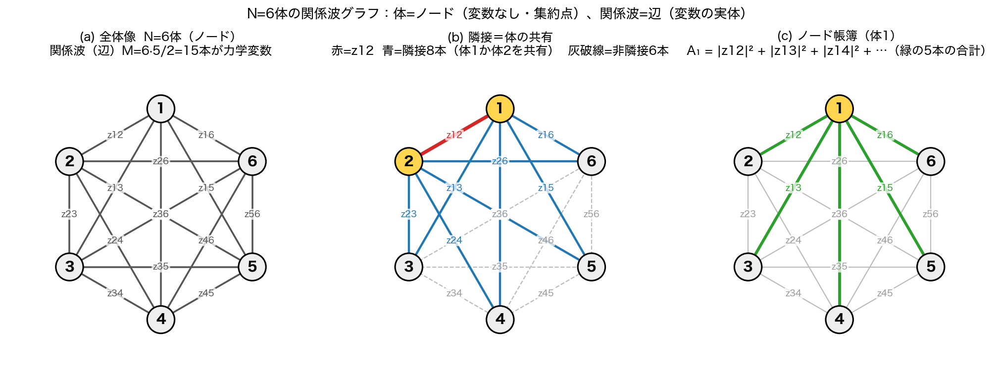
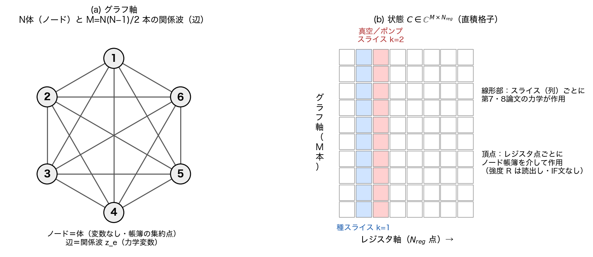
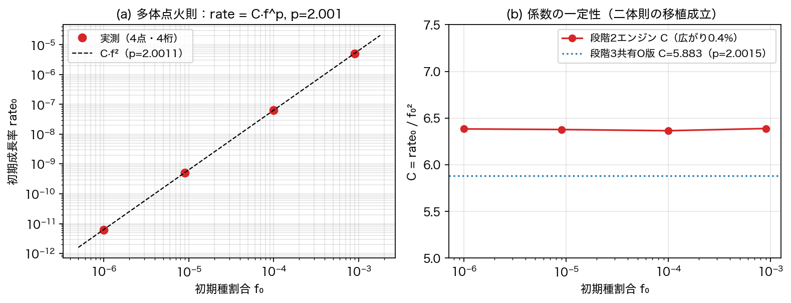
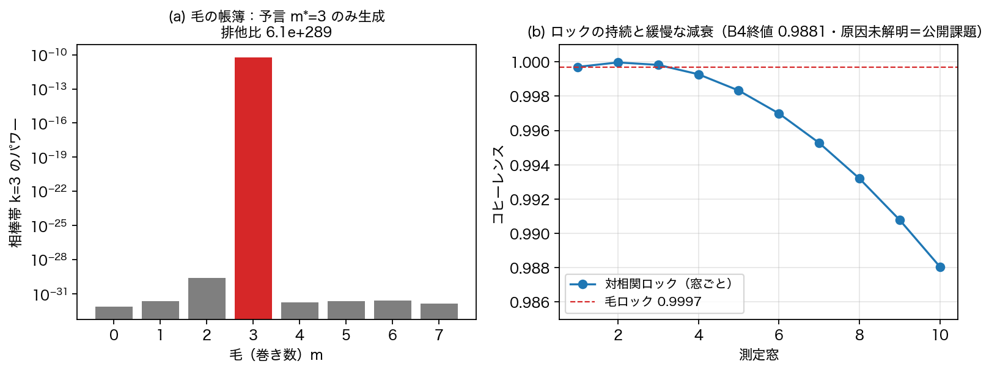
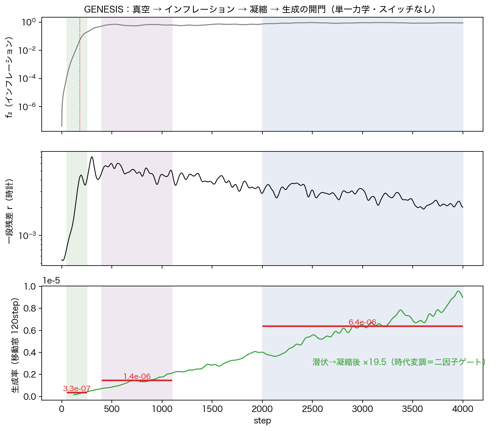
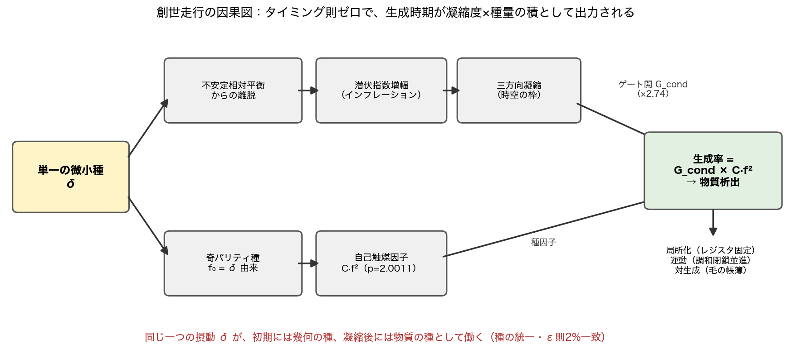
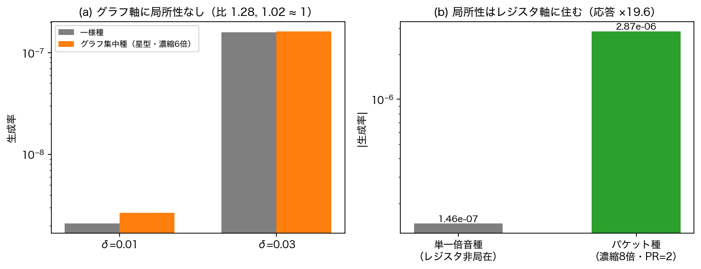
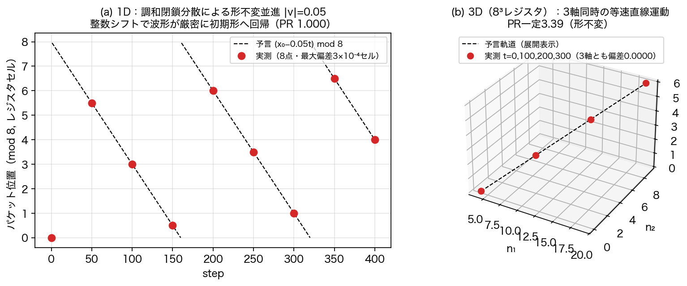
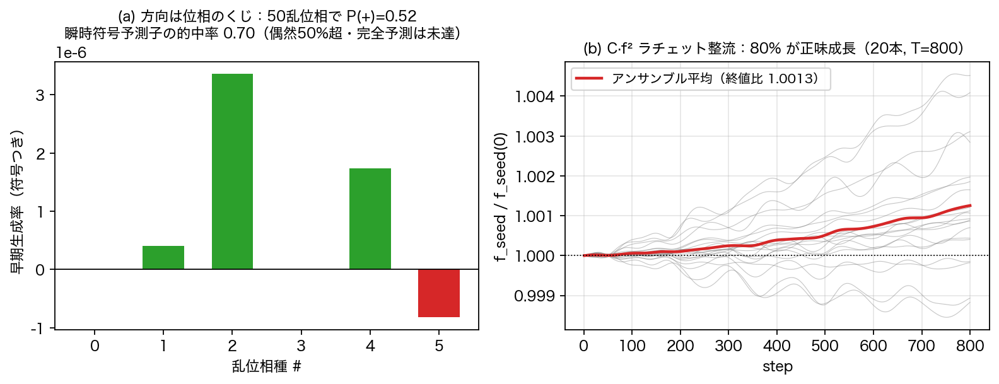

# インフレーションの終わり方が、物質生成の始まり方である——タイミング則を置かない万能相互作用のN体埋め込みと通し創世走行

木原範昭（独立研究者）

2026-08-05 v1

---

## 要旨

先行二論文は半分ずつを与えた：開始様式論文 [2] は宇宙の始まり方（不安定な自己無撞着閉包だけが潜伏指数増幅を起こし、三方向準安定構造で止まる）を与えたが、そこで力学は止まり物質がない。二体論文 [1] は生成の機構（波形のみを入力とする万能非弾性頂点）を与えたが、衝突はループカウンタであり、いつ・どこで起こるかは未回答だった。本稿はこの隙間を、**タイミング則を一切置かずに**閉じる。二体論文の頂点をN体関係波系（完全グラフの $M=N(N-1)/2$ 本の関係波 × レジスタ多スライス）に常時作用で埋め込み、次を実測した。(1) 生成の見かけの時期は**二因子則**——生成率 = 凝縮ゲート × $Cf^2$——が決める（ゲート比2.74実測）。そして凝縮とは開始様式論文の終着点そのものである：**前論文のエンディングが本論文のオープニングの条件であることは、仮定ではなく実測である**。(2) 二体の法則は多体で形を変えずに成立する：点火則は冪 $p=2.0011$・係数一定0.4%で移植され、対構造censusは毛（巻き数）込み完全版まで成立（和則排他比 $10^{289}$・毛ロック0.9997）。(3) 真空→潜伏指数増幅→三方向凝縮→物質析出を単一力学・スイッチなしで通しで走らせ（GENESIS）、インフレーションを点火する種と物質になる種が同一の摂動であること（種の統一）を発見した。(4) 局所性はグラフに住まない——完全グラフへの濃縮は生成率を変えず（比1.28, 1.02）、局所性はレジスタ軸に住む（濃縮応答×19.6）。生成物は生誕位置に固定され、調和閉鎖分散が形不変の並進を与える（1D偏差 $3\times10^{-4}$ セル以下・3D偏差0.0000）。(5) 生成方向は種の位相のくじ（50乱位相で $P(+)=0.52$）であり、正味の物質は $Cf^2$ 自己触媒の整流で生じる（アンサンブルの80%が正味成長）。条件付き導出として、媒介頂点一意化定理（閉塞保存 ⟺ $g_2=-g_1$ かつ媒介強度の対対称性——二体論文の一意化はその $M=2$ 特別場合）と、計算構造の恒等性（頂点の隣接和は辺→ノード→辺の2パスに厳密に畳め、演算量は状態サイズ線形＝理論下限。これを保証するのは無名性そのもの）を示す。本稿は仮定・条件付き導出・実測の三層を分離して報告し、仮定の価値は、独立に公開された二つの論文の物理がスイッチなしの単一力学の別の章として同時に再現されたこと——接続の実証——で測る。

---

## 1. 本稿の性格——仮定・導出・実測の三層分離

本稿は、新しい相互作用を提案する論文ではなく、その正しさを証明する論文でもない。二体論文 [1] で明示的な仮定として置かれ条件付きで一意化された万能非弾性頂点を、N体関係波系にタイミング則を一切置かずに埋め込み、何が起こるかを実測する論文である。

- **(a) 仮定**：二体論文からの頂点の継承と、埋め込みの設計選択（§4）。
- **(b) 条件付き導出**：媒介頂点一意化定理と計算構造の恒等性（§5）。
- **(c) 実測**：タイミングの解消、二体法則の移植、通し創世走行、位置と運動、方向のくじと整流（§6–§10）。

読者が検証できるのは (b) と (c) であり、(a) は出発点である。

## 2. 主張

**第一に——本稿の動機であり設計原理——「いつ相互作用が起こるか」を手で選ばない。** 先行二論文は半分ずつを与えた。開始様式論文は宇宙の始まり方を与えたが、終着点（三方向準安定構造）で力学は止まり、物質がない。二体論文は生成の機構を与えたが、衝突はループカウンタであり、いつ・どこで起こるかは未回答だった。この隙間を「凝縮後に相互作用を呼ぶ」等の規則で埋めれば、それはIF文であり、二体論文が守った無名性が多体で崩壊する。本稿の設計はただ一つ：**相互作用は常時作用する**。事象らしさは入力ではなく出力である。

**第二に、仮定を全て列挙する（§4）。** (i) 線形力学は第7・8論文の原本を無改変で継承（read-only import・SHA記録）。(ii) 頂点は二体論文の一意化形を隣接和に拡張——各関係波は、体を共有する関係波との二波頂点の単純和で結合する（三波以上を置かない）。(iii) 状態はレジスタ多スライス $C\in\mathbb{C}^{M\times N_{reg}}$、読出しは合算スペクトルの共有読出し。(iv) 強度は読出し量 $R$ の流用で新定数なし。**四項は設計上の選択であって導出ではない。**

**第三に、媒介頂点一意化定理（条件付き導出、§5.1）。** 仮定クラスの内部で、閉塞保存は $g_2=-g_1$ **かつ**媒介強度の対対称性を強制する。二体論文の $g_2=-g_1$ はこの定理の $M=2$ 特別場合である。閉塞が強度に要求するのは対対称性のみで、算術平均則は閉塞から導出されない追加の実験事実である。拡張定理 T-L：レジスタ点ごとの対対称強度 $R_{ee'}(n)$ も閉塞を厳密保存する——局所的な相互作用強度は公理と両立する（機械検証済み）。

**第四に、計算構造の恒等性（条件付き導出、§5.2）。** 頂点の隣接和は、辺→共有ノード→辺の2パス集約（頂点モーメントと自己減算）に厳密に畳める。演算量は状態サイズ線形 $O(M\cdot N_{reg}\log N_{reg})$——全対照合 $O(N^4)$ も隣接和 $O(N^3)$ も不要で、理論下限に達する。この畳み込みを可能にするのは無名性（全対同一法則・対固有定数なし）そのものである。

**第五に、実測1：タイミング問題は二因子則として解消した（§6）。** 生成率 = 凝縮ゲート × $Cf^2$。凝縮ゲート比2.74を実測した。凝縮とは開始様式論文の終着点——三方向準安定構造——である。前論文のエンディングが本論文のオープニングの条件であることは、仮定ではなく実測である。

**第六に、実測2：二体の法則は多体で形を変えずに成立する（§7）。** 点火則は冪 $p=2.0011$・係数一定0.4%で再現。censusは毛込み完全版まで成立：和則排他（予言外は $10^{-289}$ 倍）、毛ロック0.9997、厳密ゼロからの同時成長。

**第七に、実測3：通し創世走行 GENESIS（§8）。** 真空→潜伏指数増幅→三方向凝縮→物質析出を単一力学・スイッチなしで走らせた。発見：**種の統一**——インフレーションを点火する種と物質になる種は同一の摂動である。

**第八に、実測4：位置と運動（§9）。** 局所性はグラフに住まない（濃縮無効、比1.28, 1.02）。局所性はレジスタ軸に住む（応答×19.6）。生成物は生誕位置に固定され、運動は調和閉鎖分散 $\omega_k=k\,\omega_1$ [6] が与える（1D/3Dで形不変並進を実証）。

**第九に、実測5：方向のくじと整流（§10）。** 生成方向は種の位相が決める（50乱位相で $P(+)=0.52$）。瞬時符号予測子の的中率は0.70——偶然50%を上回るが、事前基準0.9には未達であり、くじの決定論性は部分的確認にとどまる（完全な瞬時予測子は公開課題）。正味の物質は対称性の破れの手置きではなく $Cf^2$ 自己触媒の整流で生じ、アンサンブルの80%が正味成長した。モデル内部の機構の実測であり、現実宇宙の物質優勢の説明とは主張しない。

**第十に、null結果を記録する（§11）。** E8関連特殊値系列（$N_{reg}=124,137,144,248$ 等）の選択性は、検定した全計器で null だった。

**第十一に、反証と修正の全過程を記録する（§12）。** 計器の誤り3系統（保存判定・生成率予測子・運動重心計）を含む。

**最後に、本稿が主張しないことと反証条件（§15）。**

## 3. 動機——二つの論文は、つながっていなかった

開始様式論文 [2] の結論はこうである：不安定な自己無撞着閉包（単一コヒーレント凝縮体）だけが潜伏指数増幅を起こし、白色の混沌からは何も増幅されない。増幅の終着点は三方向準安定構造であり、そこで線形力学は完結する。**時空はできた。しかし物質はなく、出来事もない。**

二体論文 [1] の結論はこうである：波形だけを見るIF文なしの単一写像が、誘導・自己触媒・対相関でフェルミオン的構造を生成する。**物質の作り方は分かった。しかし宇宙がない。** 二体系の「衝突」はループカウンタであり、いつ・どこで・なぜ衝突が起こるかは力学の外にあった。

この隙間は未完成ではなく致命傷の候補だった。「相互作用はインフレーション後に呼ぶ」とタイミングを手で選べば、それは粒子種判別と同格のIF文であり、二体論文が守り抜いた無名性が多体への埋め込みの瞬間に崩壊する。都合の良いときだけ相互作用を呼ぶモデルに、生成を語る資格はない。したがって設計は一つしかない：常時作用で埋め込み、「いつ」が物理として出力されるかどうかを実測する。それが本稿である。

## 4. モデルと仮定

### 4.1 関係波グラフ（継承）

基本変数は体（粒子）に住まない。$N$ 個の体（ノード）の各ペアに関係波 $z_e\in\mathbb{C}$ が1本ずつ住む（辺、$M=N(N-1)/2$ 本）。ノード自身は変数を持たず、帳簿の集約点である。二つの関係波は体を共有するとき（隣接）に限り相互作用の資格を持つ——共有する体が媒介する（図1）。線形力学（生成子 $K_{ef}=\sin(\theta_f-\theta_e)$、Cayley一歩、自己無撞着閉包・潜伏・急拡大・三方向生成）は第7・8論文 [3,4] の原本コードを無改変で継承する（SHA-256記録・read-only import）。

**図1**：N=6の関係波グラフ。(a) 体＝ノード、関係波＝辺（M=15本が力学変数）。(b) 隣接＝体の共有：z12（赤）の相互作用相手は体1か体2を共有する8本（青）のみで、共有のない6本（灰破線）は直接結合しない。(c) ノード帳簿：体1に集まる関係波の合計 $A_1$。

### 4.2 埋め込みの仮定

| # | 仮定 | 内容 |
|---|------|------|
| (i) | 線形力学の継承 | 第7・8論文原本の read-only import。スライス（レジスタ倍音）ごとに独立に作用 |
| (ii) | 頂点＝二波頂点の隣接和 | 各辺 $e$ は隣接辺 $e'$ との二体頂点の単純和で結合：$\delta z_e = i\sum_{e'\sim e} R_{ee'}(|z_{e'}|^2 z_e - z_{e'}^2\bar z_e)$。三波以上の頂点は置かない |
| (iii) | レジスタ多スライス | 状態 $C\in\mathbb{C}^{M\times N_{reg}}$。頂点はレジスタ位置空間の点ごとに作用。読出しは合算スペクトルの共有読出し $\theta=\operatorname{atan2}(\sqrt{P_f},\sqrt{P_b})$, $R=\sin^2\theta$ |
| (iv) | 新定数なし | 強度は $R$ の流用。判別分岐（IF文）なし（実装の `r>0` は強度ゼロスキップの数値ガード） |

四項は設計選択である。(ii) の二波型と (iv) の無名性は二体論文の仮定の直接継承であり、(i)(iii) は本稿固有の埋め込み選択である（図2）。

**図2**：状態はグラフ軸（M本の関係波）×レジスタ軸（$N_{reg}$ 点）の直積格子。線形部はスライス（列）ごと、頂点はレジスタ点ごとにノード帳簿を介して作用する。

## 5. 条件付き導出

### 5.1 媒介頂点一意化定理

仮定クラス（二波型・点ごと・三次・共通位相不変・自己散乱なし）の最も一般な形 $\delta z_e = i\sum_{e'\sim e}(g_1 R_{ee'}|z_{e'}|^2 z_e + g_2 R'_{ee'} z_{e'}^2\bar z_e)$ に対し、零二乗和閉塞 $\sum_e z_e^2$ の保存（レジスタ点ごと）は次を強制する：

$$g_2 = -g_1 \quad\text{かつ}\quad R_{ee'} = R_{e'e}\ (\text{対対称性}).$$

証明は一次変分の対ごとの相殺による：辺対 $(e,e')$ の寄与は $g_1 R_{ee'}|z_{e'}|^2 z_e^2 + g_2 R'_{ee'} z_{e'}^2 |z_e|^2$ とその $e\leftrightarrow e'$ 交換の和であり、恒等的にゼロになるのは係数が反対符号で強度が対対称のときに限る。三点を明確にする。第一に、これはクラス内一意性である。第二に、二体論文の $g_2=-g_1$ [1] は本定理の $M=2$（隣接和が相手一つ）特別場合である。第三に、閉塞が強度に要求するのは対対称性**のみ**であり、二辺の $R$ が異なる場合の混合則として算術平均も積もともに閉塞を厳密保存する（機械検証 T5）。実際の力学が算術平均と整合することは追加の実験事実である。

**拡張定理 T-L**：対対称性は点 $n$ ごとに成立するから、レジスタ点依存の対対称強度 $R_{ee'}(n)$ も閉塞を厳密保存する。機械検証：ランダムな $n$ 依存対対称 $R$ でドリフト $1.0\times10^{-17}$（機械零）、非対称にすると $1.7\times10^{-2}$（破れ）。**局所的な相互作用強度は公理と両立する**——局所性の禁止は公理からは出ない。

### 5.2 計算構造の恒等性——無名性が計算可能性を保証する

頂点の隣接和を素朴に評価すると、各辺が $2(N-2)$ 本の隣接辺を走査して $O(M\cdot N)=O(N^3)$／レジスタ点かかる。しかし (ii) の二波型（隣接相手について加法的、相手同士の交差項なし）と対対称平均強度の分離可能性により、隣接和は**厳密に**次へ畳める：辺 $e=(u,v)$ について

$$\sum_{e'\sim e} |z_{e'}|^2 = A_u + A_v - 2|z_e|^2, \qquad A_v \equiv \sum_{e\ni v}|z_e|^2$$

（$z^2$ 型・$R$ 重みつきを含む4種の帳簿で同様）。計算は「辺→ノード集約」「ノード→辺読み戻し＋自己減算」の2パス、各 $O(M)$ である。これは平均場近似ではなく恒等変形であり、素朴実装との一致は機械精度で検証した。1ステップの総演算量は $O(M\cdot N_{reg}\log N_{reg})$——全状態を毎ステップ読む必要があるというRAMモデル上の自明な下限と同オーダであり、この意味で理論下限である。

物理的意味を明示する。情報は辺→共有ノード→辺と流れる：**相互作用は対ごとの直接照合ではなく、体を媒介した集約と再配布**であり、$O(M)$ アルゴリズムは「媒介頂点」の文字通りの実装である。そしてこの畳み込みを可能にするのは無名性そのものである——対ごとに任意の結合定数 $R_{ee'}$ を置けば（無名性違反）、分離可能性は失われ $O(N^3)$ に戻る。物理の原理が実装の計算可能性を直接保証する。

**保存量の実測**（不変量を導出してから判定する規律の下で）：ノルム相対ドリフト $3.1\times10^{-14}$、頂点単独の点ごと閉塞ドリフト $7.3\times10^{-11}$、線形部単独のスライス閉塞ドリフト $1.4\times10^{-15}$（それぞれが不変量である場合のみ判定。§12参照）。頂点ON/OFFの生成量分離は11桁、ONの生成量は点火則から導出した予測値と因子4.2で整合。

## 6. 実測1：二因子則——タイミング問題の解消

常時作用で埋め込んだ結果、「いつ生成が起こるか」は消滅せず、物理として再出現した：

$$\text{生成率} = \text{凝縮ゲート} \times C f^2.$$

**凝縮ゲート**（図3a）：同一ノルム・同一種で、ポンプを凝縮状態（三方向準安定構造）と非凝縮状態（同エネルギーの非コヒーレント状態）に置いた対照で、生成率は $6.30\times10^{-8}$ 対 $2.30\times10^{-8}$——**ゲート比2.74**。凝縮とは開始様式論文 [2] の終着点そのものである。

**時代変調**（図3b）：通し走行（§8）の窓別生成率は、潜伏期 $3.3\times10^{-7}$ → バースト期 $1.4\times10^{-6}$ → 凝縮後 $6.4\times10^{-6}$ と単調に開き、潜伏期から凝縮後で**×19.5**。相互作用は常時作用しているのに、生成の見かけの時期は宇宙の時代が作る。

**図3**：(a) 凝縮ゲートの対照実験。(b) 通し走行の時代変調。タイミング則を書かずに、タイミングが出力された。

**読み（解釈として明示する）**：この実測は、「インフレーションが終わった後で、別の現象として物質生成が始まる」のではないことを示唆する。膨張の停止（線形側：不安定成長の飽和と三方向構造への定着）と生成の開始（非線形側：凝縮ゲートの開放）は、**同じ凝縮転移に対する二つの観測量**として読める——時空形成と物質生成は直列の二過程ではなく、一つの転移の外部幾何側と内部生成側である。この読み自体は解釈であるが、それを支える二つの量（ゲート比・時代変調）は実測である。

## 7. 実測2：二体法則の移植テスト

**点火則**（図4）：種割合 $f_0$ の4桁掃引で、初期生成率は $\mathrm{rate}=Cf^p$、$p=2.0011$、$C$ の広がり0.37%。エンジン改訂（段階2→段階3共有O版）を跨いでも $p=2.0015$・$C=5.88$ と法則形は不変である。二体論文の自己触媒点火則 [1] は多体の海の中で形を変えない。

**図4**：(a) 多体点火則 rate=C·f^p（log-log、4桁）。(b) 係数の一定性。

**対構造census・毛込み完全版**（図5）：狭帯域ポンプ＋単一種の事前予言型censusを、レジスタ（$k$）と毛（$\eta$ 巻き数 $m$）の2次元帳簿で実行した。相棒帯 $k=3$ の毛分解パワーは、和則 $m^* = 2m_B - m_s = 3$ の指定する毛にのみ現れ（**排他比 $6.1\times10^{289}$**——予言外の毛は機械零に対する比）、対相関ロックは0.9997。相棒帯は厳密ゼロから側帯と同時に立ち上がる。帳簿は頂点1回作用の出力から機械導出しており、手置きの定数はない。なお対相関ロックは長時間で緩慢に減衰する（10窓目0.988、図5b）——原因は未解明であり公開課題として記録する。

**図5**：(a) 毛の帳簿：予言 $m^*=3$ のみが生成。(b) ロックの持続と緩慢な減衰（公開課題）。

## 8. 実測3：GENESIS——通し創世走行

真空（二キラリティ真空対の不安定枝）に微小種 $\delta$ を加えた初期状態から、単一の力学を4000ステップ走らせた（図6）。スイッチ・時代切替・パラメータ変更は一切ない。

**図6**：上：スライス2真空の不安定枝が潜伏ののち指数増幅し（crossing $t=180$）、三方向準安定構造へ凝縮する。中：一段残差 $r$（時計）。下：移動窓の生成率が時代とともに開く（×19.5）——二因子則の通し実証。

**発見1：種の統一。** 走行前の予言では、インフレーションの点火は系の内在床（親固有モード残差 $2.1\times10^{-13}$ [2]）が種になると仮定し、crossing を1161–1171と登録した。実測は555（$\delta=10^{-6}$ 系列）——予言帯から大きく外れた。診断の結果、**物質用に注入した種 $\delta$ 自身がインフレーションを点火していた**：開始様式論文のε則（crossing は $-\ln\varepsilon$ に線形、傾き $1/\lambda$）に $\varepsilon=\delta=10^{-6}$ を代入すると予言は約543となり、実測555と2%で一致する。インフレーションを起こす種と物質になる種は、別々の仕掛けではなく同一の摂動である。予言の失敗が接続の発見に転じた。図10に本節までの因果構造をまとめる。

**図10**：創世走行の因果図。単一の摂動 $\delta$ から二つの枝が出る：幾何の枝（不安定離脱→潜伏指数増幅→三方向凝縮→ゲート開）と種の枝（奇パリティ種 $f_0$→自己触媒因子 $Cf^2$）。両者は生成率 $=G_{cond}\times Cf^2$ で合流し、物質析出・局所化・運動・対生成へ続く。タイミング則はどこにもない。

**帰結：小さい種の海は事実上不活性。** $\delta=10^{-6}$（$f_0=10^{-12}$）では3000ステップの生成が測定限界以下（$|g|<10^{-11}$）に留まり、$\delta=10^{-2}$ では明瞭に生成する（$6.4\times10^{-6}$）。点火時間が $1/f_0^2$ でスケールする二体則の帰結が、多体宇宙でそのまま現れる。

## 9. 実測4：位置と運動

**局所性はグラフに住まない**（図7a）。種を完全グラフの星型部分集合（濃縮6倍）へ集中させても、生成率は一様種と変わらない（比1.28, 1.02）。完全グラフ $K_N$ には距離がなく、頂点はノード帳簿越しの集約でしか隣接を見ないから、グラフ上の「近さ」は物理に存在しない。

**局所性はレジスタ軸に住む**（図7b）。同一パワーの種をレジスタ位置空間のパケット（濃縮8倍、実効幅 PR=2）に局在させると、生成応答は**19.6倍**になる。さらに生成物のレジスタ分布は成長を通じて PR=2 のまま生誕位置に固定される——**粒子は位置を持つ**。

**図7**：(a) グラフ濃縮は無効。(b) レジスタ濃縮は×19.6。局所性の住所はグラフではなくレジスタ軸である。

**運動**（図8）。線形部は分散を持たない（全倍音同速）ため、固定パケットは動かない。調和閉鎖分散 $\omega_k = k\,\omega_1$ ——逆二乗則論文 [6] が加速度の幾何から導いた分散関係——をレジスタ時計として導入すると、これは並進演算子に他ならず、パケットは形を変えずに等速で動く。実測：1Dで8記録点すべて予言と偏差 $3\times10^{-4}$ セル以下、整数セルシフトで波形が厳密に初期形へ回帰（PR 1.000）。3D（$8^3$ レジスタ・3軸独立速度）で全記録点の偏差0.0000、PR一定3.39。頂点ON・種込みでの剛体並進である。

**図8**：(a) 1D並進（mod 8表示）。(b) 3D等速直線運動。

## 10. 実測5：方向のくじと整流

**方向のくじ**（図9a）。個々の種の生成方向（物質側 $+$ か反物質側 $-$ か）は種の位相プロファイルが決める。50個の乱位相パケット種で $P(+)=0.52$——ほぼ50/50のくじである。頂点レートの奇数射影から構成した瞬時符号予測子の的中率は0.70で、偶然（0.5）を上回るが事前基準0.9には未達——くじが力学的に決定されていることの部分的確認にとどまる。的中率の不足は確率性の証拠ではなく、現在の予測子（頂点レートの奇数射影）が決定に必要な状態情報——毛別の位相整列、複数チャネルの干渉項、不安定固有モードへの射影符号など——を含みきれていない可能性を示す。完全な瞬時予測子の構成は公開課題である（§14-2）。なおチャネル多重度の検定では、種の倍音本数 $n_h$ に対し生成率が冪 $q=0.91$ で増加し、レジスタ局所性（§9）の Fourier 双対＝四波混合チャネル数の増加という読みと整合する。

**ラチェット整流**（図9b）。方向が50/50のくじなら、なぜ正味の物質が残るのか。自己触媒 $Cf^2$ は「増えた側がさらに速く増える」整流器である：乱位相アンサンブル20本・800ステップで、**80%が正味成長**した（平均終値比1.0013）。対称性の破れを手で置かずに、可逆な素過程＋自己触媒だけで正味が生じる。これはモデル内部の機構の実測であり、現実宇宙の物質優勢の説明とは主張しない。

**図9**：(a) 符号つき生成率（乱位相6例）と50個統計。(b) アンサンブル軌跡と平均（赤）。

## 11. null結果の記録——E8特殊値の選択性

レジスタ数 $N_{reg}$ がE8関連の特殊値（124, 137, 144, 248）で選択的な振る舞いを示すかを、四系統の計器——線形位相の全帯域検定・一次点火率・熱化エントロピー・梯子前線の衝突干渉（Nyquist帯パワー）——で検定した。**すべてnull**（特殊値と近傍の比が全て事前帯 [0.5, 2] 内）。探索の動機（シリーズ内部のE8構造仮説）と計器設計・失敗した初期計器（§12）を含めて記録する。選択性が「ない」ことの確定は、あることの主張と同じ重みで書かれるべきである。

## 12. 反証と修正の記録

| # | 誤り | 発見 | 修正 |
|---|------|------|------|
| 1 | 保存判定で非不変量を測定（スライス独立線形の下で点ごと閉塞は不変でない）＋根拠のない閾値 $10^{-6}$ | U2/U3 FAIL | 不変量を導出してから判定する方式へ（v2で全成立）。規律：**保存判定は必ず不変量の導出を先に書く** |
| 2 | 同種の誤りの再発（頂点ONの下でスライス閉塞は不変でない） | 段階3 B2 FAIL | 点ごとの場の閉塞（真の不変量）で再判定・規律を明文化 |
| 3 | 生成率予測子の誤り2回（累積量と瞬時量の混同／自辺積と媒介積の混同） | D1-P2 FAIL | 二チャネル完全予測子（パラメトリック＋うなりXPM）へ——段階コヒーレンス0.9998 |
| 4 | D2計器の盲点（点火窓が低スライスに閉じる／負周波数梯子の別名を「壁到達」と誤検出） | 全$N_{reg}$で $t_{wrap}=1$ | 第三世代の梯子前線計器（正枝制限・前線追跡）で再検定→null確定 |
| 5 | 運動計器の恒等零欠陥：奇数倍音パケット（$|W|^2$ が周期 $N/2$）に対し基本巻きモーメントは恒等的にゼロ——v1の位置読み値はノイズだった | 位置系列の検収で発覚（$|z_1|\sim10^{-16}$ を確認） | 巻き数2モーメント（位置は mod $N/2$）へ修正。さらに予言式の符号誤り（$e^{+ik\omega_1}$ は $-$方向並進）を較正。修正後、1D全8点偏差 $3\times10^{-4}$ 以下・3D全点0.0000で厳密成立 |

3系統（#1–2、#3、#5）はいずれも「測るべき量を導出せずに計器を作った」誤りである。同じ轍を三度踏んだことを、規律として明文化する：**計器は、測定量の不変性（または予言値）を導出してから設計する。**

## 13. 先行研究——独自検討の後に見出した対応

本稿のアーキテクチャは二公理と二体論文の頂点からの独自構成であり、以下に依拠して設計したものではない。設計後の再調査により次の対応を見出した。対応は枠組みが孤立した空想でないことの傍証であり、正しさの証明ではない。

1. **変数が辺に住む——格子ゲージ理論** [8]。Wilsonの格子ゲージ理論ではゲージ場（リンク変数）が辺に住み、相互作用はサイトとプラケット経由で構成される。相違：あちらは背景格子（固定幾何）とゲージ群を入力し、サイトに物質場が住む。本稿は幾何なし（完全グラフ）・群は事後分類・ノードに変数が一切ない。
2. **対自由度から時空が創発——行列模型（IKKT/BFSS）** [9]。基本自由度は行列の非対角成分＝ブレーン対を結ぶ弦（対ごとの関係自由度）で、背景時空はなく、Lorentzian IKKT のモンテカルロでは9次元対称性が自発的に破れ3次元の膨張空間が出現する [10]——本シリーズの三方向創発と現象論的に並行する。相違：作用は超弦理論由来（超対称性を入力）、行列は対角（体の位置変数）を持つが本稿は純関係、そして局所性の住所が異なる（次項）。
3. **完全グラフと局所性——quantum graphity** [11]。自由度が完全グラフに住み物理が頂点置換で不変（＝無名性）という出発点まで本稿と同型であり、低エネルギー相でグラフが間引かれることで局所性が創発すると提案した。本稿の実測は**同じ問いへの逆の答え**である：グラフは完全のまま局所性はグラフに現れず（§9）、レジスタ軸に住む。
4. **辺上の振動子とノード媒介——トポロジカルKuramoto** [12]。位相振動子を辺に載せHodgeラプラシアン（ノード共有）で結合する近年の枠組みは、本稿の隣接構造と最も近い数理形式である。相違：結合は勾配型で対象は同期、本稿は閉塞保存が選ぶ三次交換流で対象は生成。
5. **全結合の厳密縮約——Kuramoto平均場** [13]。秩序パラメータの先行集計による $O(N^2)\to O(N)$ 縮約は、本稿のノード帳簿の古典的先行である。相違：本稿は辺変数のノード集約＋自己減算（異常項 $z^2$ を含む4帳簿）で、厳密性の根拠が無名性（対固有定数の不在）にある。
6. **通し数値創世——preheating格子計算** [14]。LATTICEEASY等は真空からの粒子生成を一本の走行で追う。相違：膨張時空とポテンシャルと場の内容を入力する。本稿は単一の無名力学のみで、時空（三方向構造）自体が出力の一部であり、「いつ」も出力である。
7. **関係論的力学の系譜——Barbour–Bertotti** [15]。Mach原理のN体実装（相対配置空間上の力学）。相違：あちらは粒子位置を変数のまま商で割る（関係化＝縮約操作）。本稿は最初から関係が変数であり、体の変数が理論のどこにも現れない。

## 14. 展望——未解決課題（進行指針、本稿は主張しない）

1. **凝縮ゲートの秩序変数化**：ゲート比2.74が何を測っているかの解析式。凝縮状態と非凝縮状態はノルム・種・スペクトル占有を揃えてあるから、差は位相相関にあるはずで、候補は隣接辺間の相対位相コヒーレンス $\langle \mathrm{Im}(\bar z_e z_{e'})^2\rangle_{adj}$ 型の秩序変数である。抽出できれば生成則は $\Gamma = G(\mathcal{O}_{cond})\cdot Cf^2$ という閉じた形に進む。
2. **種の統一の射影分解**：現段階で示したのは「一つの $\delta$ が両者を点火した」ことである。$\delta = \delta_\parallel$（不安定固有空間への射影）$+\ \delta_\perp$（奇パリティ生成チャネルへの射影）の分解が同一自由度か独立成分かを、4種の摂動（固有方向あり/なし × 奇種あり/なし）の決定実験で判別する。あわせて完全な瞬時符号予測子（§10、的中率0.70→1へ）の構成もこの射影分解に属する。
3. **ラチェットの熱力学極限**：正味物質が (a) 有限サイズゆらぎ（$N\to\infty$ で平均非対称→0）か、(b) 自発的対称性選択（終値分布が $\pm m^*$ に二峰化）か、(c) 真の動力学的整流かを、系サイズ・時間・種数依存の分布測定で判定する。現段階の平均終値比1.0013は小さく、この判定なしに物質優勢を語らない。
4. **枠とレジスタの結婚**：三方向準安定構造（グラフ側の枠）とレジスタ位置の統合幾何、弦長公式 $R''=2R\sin(\Delta\theta/2)$ による計量。
5. **パリティ・毛の内部軸への分離**：純粋な位置3軸＋内部自由度への整理（周期律表プログラム）。
6. **E8**：全計器nullを踏まえ、探索の場を8軸スピノル構造（別系列の理論的検討）へ移す。

## 15. 本稿が主張しないこと・反証条件

本稿は、現実の宇宙がこの模型であることを主張しない。二因子則・種の統一・レジスタ局所性は「この力学とこの埋め込みを仮定すれば」の帰結である。反証条件：(a) 凝縮ゲートを通らない生成（非凝縮状態からの同率生成）、(b) 統一されない種（インフレーション種と物質種の乖離がε則を破る）、(c) グラフ局所性の発見（濃縮が生成率を系統的に変える）、(d) 移植法則の破れ（$p\neq2$ または $C$ の非一定性）——のいずれかがより制約の強い実験系で示されれば、埋め込みの主張は棄却される。仮定の価値は正しさではなく、**接続の実証**——独立に公開された二論文の物理が、スイッチなしの単一力学の別の章として同時に再現されたこと——で測る。

## 16. 再現性

シリーズ規約（シリーズ内完結の再現・原本はスナップショット照合の上 read-only import・判定基準は実行前固定）に従う。

- **原本**：第8論文 `run_preliminary_seed_ablation_v1.py`（SHA-256 75a10a5b…）、生成器v3 `make_parent_white_harmonics_n_only_v3.py`（SHA-256 d3217579…）。
- **本稿コード**（`次元の生成構造/万能相互作用多体接続_v1/`）：設計方針・定理文書（`媒介頂点の一意化と多体アーキテクチャ_v1.md`）、段階1–3エンジンとテスト（`run_stage1_multislice_engine_v1.py`, `run_stage2_vertex_engine_v1.py`, `run_stage2_tests_corrected_v2.py`, `run_stage3_sharedO_v2_and_hair_v1.py` ほか）、判別実験（`run_stage2_discriminators_v1.py`）、GENESIS（`run_genesis_v1.py`, `_v2_local`, `_v3_register_local`）、残穴実験（`run_holes_h1_h2_v1.py`, `run_h3_ladder_front_v1.py`）、ラチェット（`run_ratchet_test_v1.py`）、運動（`run_kinetic_dispersion_demo_v1–v3.py`, `run_genesis_3d_demo_v1–v2.py`）、図生成（`make_paper_figures_multibody_v1.py`——系列未保存実験は同一シードで再走行し保存済み要約値との一致を対照検定してから描画）。
- **結果JSON**：本文の全数値は各 `*_result_*.json` と一致する。
- **媒介定理の機械検証**：`test_mediated_vertex_closure_v1.py`（T1–T5）。

## 参考文献

**シリーズ内（依存箇所を明記）**

[1] 木原範昭『フェルミオン的構造の生成は誘導・自己触媒・対相関で起こる』(2026), Zenodo. Concept DOI: 10.5281/zenodo.21808091（埋め込む頂点・移植元の全法則、全編）

[2] 木原範昭『幾何級数的急拡大は不安定な自己無撞着閉包に固有である』(2026), Zenodo. Concept DOI: 10.5281/zenodo.21798854（開始様式・三方向凝縮・ε則・生成器、§3, §6, §8）

[3] 木原範昭『第7論文：N体関係波閉鎖系の時間構造』(2026), Zenodo. Concept DOI: 10.5281/zenodo.21543070（線形力学の現象の正典、§4）

[4] 木原範昭『第8論文：二段階seed除去による因果分離』(2026), Zenodo. Concept DOI: 10.5281/zenodo.21614402（線形力学コードの直接原本、§4, §16）

[5] 木原範昭『無名等振幅複合波モデル 基本公理系』(2026), Zenodo. Concept DOI: 10.5281/zenodo.21315735（零二乗和閉塞と有限回帰の二公理、§5）

[6] 木原範昭『AB二体閉鎖位相系における未来位相位置加速度写像と調和閉鎖による逆二乗則』(2026), Zenodo. DOI: 10.5281/zenodo.21441081（調和閉鎖分散 $\omega_k=k\,\omega_1$、§9のみ）

[7] 木原範昭『フェルミオンの生成構造』(2026), Zenodo. Concept DOI: 10.5281/zenodo.21766706（読出し $\theta$・$R$・フェルミオンマスクの定義の原本、§4）

**外部**

[8] K. G. Wilson, "Confinement of quarks," Phys. Rev. D **10**, 2445 (1974)

[9] N. Ishibashi, H. Kawai, Y. Kitazawa, A. Tsuchiya, "A large-N reduced model as superstring," Nucl. Phys. B **498**, 467 (1997); T. Banks, W. Fischler, S. H. Shenker, L. Susskind, "M theory as a matrix model," Phys. Rev. D **55**, 5112 (1997)

[10] S.-W. Kim, J. Nishimura, A. Tsuchiya, "Expanding (3+1)-dimensional universe from a Lorentzian matrix model," Phys. Rev. Lett. **108**, 011601 (2012)

[11] T. Konopka, F. Markopoulou, L. Smolin, "Quantum graphity," arXiv:hep-th/0611197 (2006); T. Konopka, F. Markopoulou, S. Severini, "Quantum graphity: a model of emergent locality," Phys. Rev. D **77**, 104029 (2008)

[12] A. P. Millán, J. J. Torres, G. Bianconi, "Explosive higher-order Kuramoto dynamics on simplicial complexes," Phys. Rev. Lett. **124**, 218301 (2020); A. Arnaudon, R. L. Peach, G. Petri, P. Expert, "Connecting Hodge and Sakaguchi-Kuramoto through a mathematical framework for coupled oscillators on simplicial complexes," Commun. Phys. **5**, 211 (2022)

[13] Y. Kuramoto, *Chemical Oscillations, Waves, and Turbulence* (Springer, 1984)

[14] G. Felder, I. Tkachev, "LATTICEEASY: A program for lattice simulations of scalar fields in an expanding universe," Comput. Phys. Commun. **178**, 929 (2008); A. V. Frolov, "DEFROST: A new code for simulating preheating after inflation," JCAP **0811**, 009 (2008)

[15] J. B. Barbour, B. Bertotti, "Mach's principle and the structure of dynamical theories," Proc. R. Soc. A **382**, 295 (1982)
