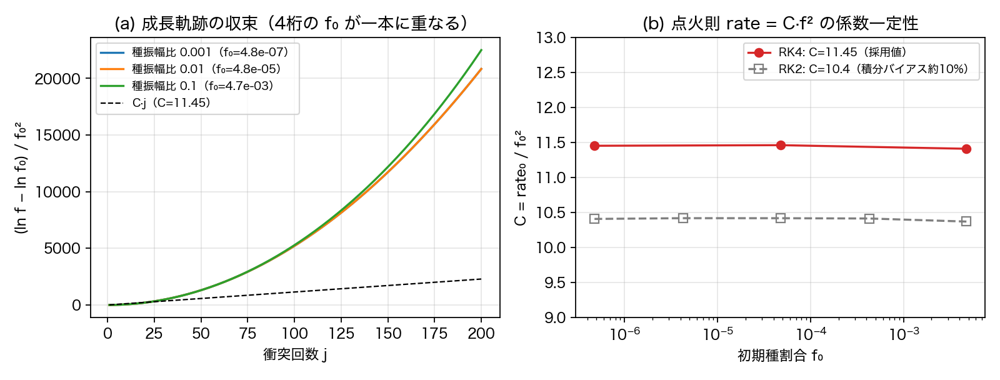
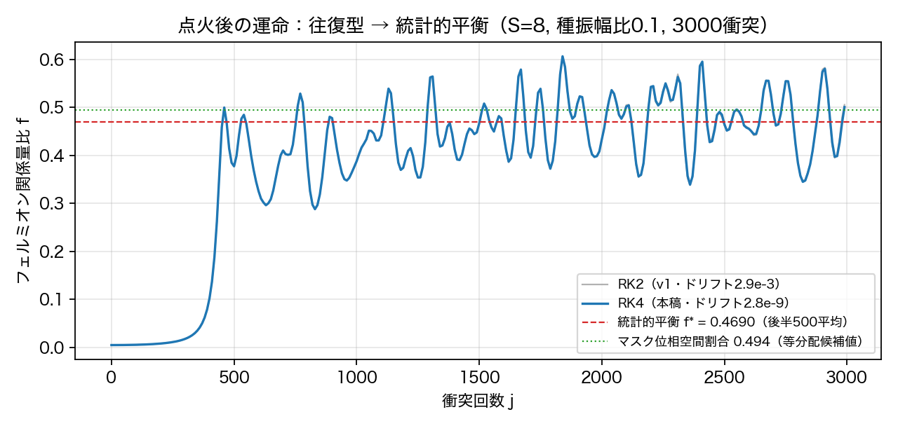
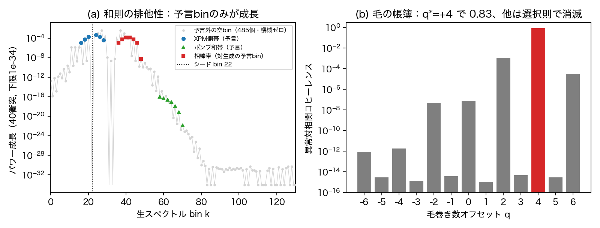

# フェルミオン的構造の生成は誘導・自己触媒・対相関で起こる——波形のみを入力とする万能非弾性写像の仮定と帰結

木原範昭（独立研究者）

2026-08-05 v1

---

## 要旨

二波の関係波系に対し、**波形だけを入力とし内部に判別分岐（IF文）を一切持たない**単一の非弾性相互作用演算を、明示的な仮定として設計する。仮定したクラス（二波型・点ごと・三次・共通位相不変・自己散乱なし・強度は既存読出し量 $R=\sin^2\theta$ の流用）の内部では、零二乗和閉塞の保存（公理）が相対係数を一意に固定し、頂点は $\delta a = i R\,(|b|^2 a - b^2 \bar a)$ の一形に限られる。この仮定された写像の帰結を数値実験で実測した結果：(1) 純粋な偶数倍音ポンプからは奇数内容が恒等的に生成されない（パリティ定理——生成は必ず誘導過程）、(2) 種割合 $f_0$ の4桁掃引で初期成長率は $\mathrm{rate}=C f_0^2$（$C=11.45$、一定性0.4%）に従う自己触媒点火、(3) 点火後は暴走せず統計的平衡 $f^*=0.4690$（フェルミオンマスクの位相空間割合0.494とほぼ一致）へ往復収束、(4) 反粒子的自由度を一切入力していないにもかかわらず、生成物は和則が指定する相棒binにのみ（予言外485binは機械ゼロ、比 $10^{-27}$）、毛（巻き数）の帳簿を清算する相関対（コヒーレンス0.83）として、厳密ゼロから同時に出現する。さらに、一意化された頂点は $\delta a = -2R\,\mathrm{Im}(\bar b a)\,b$, $\delta b = +2R\,\mathrm{Im}(\bar b a)\,a$ と厳密に書き換えられる——駆動スカラーは二波の相対位相の虚部ただ一つであり、頂点は点ごとの二チャネル回転として**閉形式で厳密可解**である（閉塞とパワーは点ごとに恒等保存、実測ドリフト $4\times10^{-14}$/3000衝突）。本稿は相互作用の形の正しさを証明する論文ではない。仮定・条件付き導出・実測の三層を分離して報告し、仮定の価値は正しさではなく整合性と生産性（N体模型への埋め込みで同一法則が再現されること）によって測る。以上は、粒子種・反粒子・選択則を一切入力しない単一の波形写像から、離散パリティ類・自己触媒的生成・統計的飽和・保存帳簿を閉じる共役対が、出力側の分類として創発することを示す。

---

## 1. 本稿の性格——仮定・導出・実測の三層分離

本稿は、生成相互作用を公理から導出する論文でも、その正しさを証明する論文でもない。本稿が行うのは次の三つであり、この三層を最初から分離して述べる。

- **(a) 仮定**：非弾性相互作用の形を明示的な仮定として置く（§4）。
- **(b) 条件付き導出**：置いたクラスの内部で、公理が何を強制するかを導出する（§5, §6）。
- **(c) 実測**：仮定された相互作用の帰結を数値実験で実測する（§8–§10）。

読者が検証できるのは (b) の導出と (c) の実測であり、(a) は検証対象ではなく本稿の出発点である。この区別を曖昧にした瞬間、本稿は意味を失う。

## 2. 主張

**第一に——本稿の最も重要な設計原理——相互作用を、二つの波形だけを入力とする単一の万能演算として定義する。** 無名性の原理に従い、写像の内部には特別扱いの分岐（IF文）が一切ない：粒子の種類を判別する分岐も、「ボゾンなら」「フェルミオンなら」「種なら」という場合分けも、閾値スイッチも存在しない。写像が受け取るのは波形 $(a,b)$ のみであり、返すのも波形のみである。衝突の強度でさえ外部から与えるパラメータではなく、波形自身から読み出される（反射率 $R=\sin^2\theta$、$\theta$ は既存の波形読出し）。したがって本稿に現れる「ボゾン」「フェルミオン」「種」「相棒」は全て**読出し側の分類**（スペクトルのマスク）であって、**動力学側のラベルではない**。写像は自分が何を生成しているかを知らない。この設計こそが以降の全結果を非自明にする：パリティ選択則も、自己触媒点火も、対構造も、単一の無差別な式が任意の入力に同一適用された帰結として現れる。

**第二に、仮定を全て列挙する。** 既存の万能相互作用（弾性部：波形読出し $\theta$ による二チャネル回転、AB合成パワーを厳密保存）に対し、非弾性拡張を次の形で置く：(i) 二波型、(ii) 点ごと（レジスタ格子の各点での積）、(iii) 三次（最低次の非線形）、(iv) 共通位相不変、(v) 自己散乱なし、(vi) 結合定数を新設せず強度は $R=\sin^2\theta$ を流用する。**この六項はいずれも設計上の選択であって導出ではない**——ただし全項が第一の設計原理（波形のみを入力とし内部分岐を持たない）に整合するよう選ばれており、(vi) はその直接の帰結である。各項には動機がある（無名性、操作代数、最低次性）が、動機は導出ではない。

**第三に、置いたクラスの内部で、公理1（零二乗和閉塞の保存）が形を一意化する。** 仮定の下での最も一般な形 $\delta a = i(g_1|b|^2 a + g_2 b^2\bar a)$ に対し、閉塞保存は $g_2=-g_1$ を強制する。ゆえに仮定されたクラスの中では頂点は $\delta a = igR(|b|^2 a - b^2\bar a)$ の一形に限られる。**これは条件付き一意性であり、クラス自体の一意性ではない。** なお一意化された頂点は点ごとの二チャネル回転として閉形式で厳密可解であることが判明した（§5.2）——閉塞保存は点ごとの恒等式になり、数値積分は不要である。 なお閉塞保存が強度に要求するのは対対称性のみであり、混合衝突での算術平均則は閉塞から導出されない**追加の実験事実**である（積型も閉塞は保存する——この区別を曖昧にしない）。

**第四に、パリティ定理。** 仮定された頂点の下で、純粋な偶数倍音ポンプからは奇数内容が恒等的に生成されない。ゆえに**この模型では生成は必ず誘導過程**であり、種なしの自発的生成は起こらない。定理として証明し、機械検証した。IF文なしの単一式が、それでも厳密な選択則を持つ——選択則は分岐からではなく式の指数算術から生じる。

**第五に、点火則の実測。** 種割合の4桁掃引で $\mathrm{rate} = C f^2$、$C = 11.45$、一定性0.4%。自己触媒的であり、点火時間は $1/f_0^2$ でスケールする。係数は較正済み：初期実測の $C=10.4$ は中点法積分の約10%バイアスを含んでいた。RK4再走行で零閉塞ドリフトは $2.9\times10^{-3}$ から $2.8\times10^{-9}$ に改善され、法則と一定性は両積分器で不変だった（経緯は§11に記録）。

**第六に、点火後の運命の実測。** 全変換（暴走）は起こらない。頂点は可逆であり、系は往復して統計的平衡 $f^* = 0.4690$ に達する。この値はフェルミオンマスクの位相空間割合 0.494 とほぼ一致し、等分配熱化として読める。

**第七に、対構造の実測（census三判定）。** 反粒子的自由度を初期条件にも写像にも入力していないにもかかわらず：(1) 生成は和則の指定する相棒binにのみ現れ、予言外の485個の空binは機械ゼロ（相棒帯平均の $10^{-27}$ 倍）。(2) 相棒は毛の和則が予言する位置 $q^*=+4$ でシードとコヒーレンス0.83の相関を示す（帳簿は頂点1回作用の出力から機械導出、手置きなし）。(3) 相棒帯は厳密ゼロから側帯と同時成長する。結論：**この模型の内部では、反粒子は入力ではなく出力である。**

**第八に、反証と修正の全過程を記録する（§11）。**

**最後に、本稿が主張しないことと、仮定の身分（§13, §14）。** 本稿は、自然の生成相互作用がこの形であることを主張しない。仮定の価値を高めるのは正しさの証明ではなく整合性と生産性の実証である。仮定は反証可能である。

## 3. 記号と土台——弾性万能相互作用

土台は第9論文 [1] の二波関係波系である。状態は複素波形の組 $(a,b)$（$\chi$ 格子 512 bin × $\eta$ 格子 16 点）。既存の**弾性**万能相互作用は、衝突一回ごとに

$$\theta = \operatorname{atan2}(\sqrt{P_f}, \sqrt{P_b}), \qquad R = \sin^2\theta,$$

$$\begin{pmatrix} a' \\ b' \end{pmatrix} = \begin{pmatrix} \cos\theta & -\sin\theta \\ \sin\theta & \cos\theta \end{pmatrix}\begin{pmatrix} a \\ b \end{pmatrix}$$

を適用する。ここで $P_f, P_b$ は AB 合成スペクトルのフェルミオン/ボゾン関係量（フェルミオンマスク＝偶数 $|k|\ge 4$ の bin 集合）。以降、フェルミオン関係量の全パワーに対する比 $f = P_f/\lVert(a,b)\rVert^2$ をフェルミオン関係量比と呼ぶ。この回転は AB 合成のビン別パワーを厳密保存する——**弾性**であり、倍音内容を変えるチャネルを持たない。ゆえにボゾン的な海からフェルミオン的構造を生成するには非弾性チャネルの追加が必要である。これが本稿の出発点の問いである。

読出し量 $\theta$（したがって $R$）は波形のみから決まる。この読出しの構成と検証は第9論文 [1] に属し、本稿では原本コード一式を無改変スナップショット（SHA-256 記録済み）として read-only 参照する（§15）。

## 4. 仮定——非弾性拡張の設計

### 4.1 設計原理（主張第一）

非弾性拡張は、弾性部と同じ資格の**万能演算**でなければならない：入力は波形 $(a,b)$ のみ、出力も波形のみ、内部に粒子種・状況の判別分岐を持たない。実装がもつ唯一の条件文は「強度がゼロなら何もしない」という数値スキップ（`if r > 0`）であり、これは判定規則ではない——強度 $r=R$ 自体が波形の読出し量だからである。ソース監査（テスト T5）でこれを確認した。

### 4.2 仮定リスト

| # | 仮定 | 動機（導出ではない） |
|---|------|--------------------|
| (i) | 二波型（三波以上の頂点を置かない） | 衝突は二波の事象 |
| (ii) | 点ごと（$\chi\times\eta$ 格子の各点での積） | 和則 $k_1+k_2-k_3=k_4$ 型の四波混合が格子の算術として自動成立。並進不変 |
| (iii) | 三次（最低次の非線形） | 希薄極限で消え弾性演算に還元（対応原理） |
| (iv) | 共通位相不変 | 全体位相は無意味という規約 |
| (v) | 自己散乱なし（$|a|^2a$ 型を置かない） | 操作代数「単一波の自己散乱は存在しない」 |
| (vi) | 結合定数を新設せず、強度 $=R=\sin^2\theta$ | 無名性：新しい自由パラメータを持ち込まない。$R$ の補（透過率 $1-R$）は素電荷と同定済み [4]——強度は既に物理的身分を持つ読出し量である |

この六項は設計上の選択である。動機は各項を**もっともらしく**するが、**強制**はしない。

### 4.3 実装形

衝突一回 ＝ 弾性部（無変更）∘ 非弾性部：

$$a' = a + i\,R\,(|b|^2 a - b^2 \bar a), \qquad b' = b + i\,R\,(|a|^2 b - a^2 \bar b)$$

（同時更新・点ごと。相対符号は次節の定理で固定される。数値実装は§5系2の閉形式厳密解を用いる——RK4 部分刻みは較正過程の歴史的実装であり、§11 に記録する。）

## 5. 定理1：閉塞保存が係数を一意化する

公理は零二乗和閉塞 $\mathcal{C} = \sum a^2 + \sum b^2 = 0$ の保存である。仮定 (i)–(v) の下での最も一般な頂点

$$\delta a = i(g_1 |b|^2 a + g_2 b^2 \bar a), \qquad \delta b = i(g_1 |a|^2 b + g_2 a^2 \bar b)$$

に対し、一次変分は

$$\delta \mathcal{C} = 2\sum (a\,\delta a + b\,\delta b) = 2i\,(g_1+g_2)\sum\left(|b|^2 a^2 + |a|^2 b^2\right).$$

右辺の和は一般にゼロでないから、$\delta\mathcal{C}=0 \iff g_2 = -g_1$。ゆえに**仮定されたクラスの内部では**頂点は §4.3 の一形に限られる（強度は $g_1$ の再定義で $R$ に吸収）。

三点を明確にする。第一に、これは**条件付き一意性**である：クラス (i)–(v) を置いた上で公理が係数を選ぶのであって、クラス自体は導出されていない。第二に、閉塞保存が強度について要求するのは**対対称性のみ**である。二波の強度が異なる場合の混合規則として、算術平均も積もともに閉塞を厳密保存する（数値検証済み、[9] の T5）。実際の力学が算術平均と整合し積と不整合であることは、閉塞からは導出されない**追加の実験事実**である。第三に、歴史的経緯として、初版 v1 は一般形（$g_2=+g_1$）で実装され閉塞ドリフトが観測された——閉塞保存の要求から $g_2=-g_1$ に修正したのが現行形である（§11）。

### 5.1 系1：頂点は相対位相駆動の交換流である

一意化された頂点は恒等変形により（機械精度で検証済み）

$$\delta a = -2R\,\mathrm{Im}(\bar b a)\,b, \qquad \delta b = +2R\,\mathrm{Im}(\bar b a)\,a$$

と書ける。三次非線形に見えた頂点の実体は、**二波の相対位相の虚部 $s=\mathrm{Im}(\bar b a)$ ただ一つを読み、相手方向へ振幅を移送する交換流**である。共通位相 $(a,b)\mapsto(e^{i\phi}a, e^{i\phi}b)$ の下で $s$ は不変だから、仮定 (iv) の共通位相不変はこの形から明示的に読める——相互作用を駆動するスカラーは一つの反対称相対位相量に縮約されており、共通位相は最初から式に入る余地がない。

### 5.2 系2：頂点は点ごとの二チャネル回転であり、閉形式で厳密可解である

系1の流れは、二成分ベクトル $(a,b)$ に対する接線方向 $(-b, a)$ への流れ、すなわち**点ごとの二チャネル回転**（角速度 $2s$）である。さらに $s$ 自身がこの回転の下で厳密に不変であることが直接計算で示せる（$ds/d\tau = 2s\,\mathrm{Im}(|a|^2) - 2s\,\mathrm{Im}(|b|^2) = 0$）。角速度が流れに沿って保存されるから、非弾性部は各格子点で**閉形式の厳密解**を持つ：

$$a' = \cos\varphi\,a - \sin\varphi\,b, \qquad b' = \sin\varphi\,a + \cos\varphi\,b, \qquad \varphi(x) = 2R\,\mathrm{Im}(\bar b a)(x).$$

三つの帰結がある。第一に、閉塞 $a^2+b^2$ とパワー $|a|^2+|b|^2$ は**点ごとに恒等保存**される（実回転の不変量）——一意化定理（§5本文）の幾何的意味は「閉塞を保存する方向とは回転の接線方向である」ことに透明化する。第二に、数値積分が不要になる：本稿の全実験を閉形式で再走行した結果、3000衝突の閉塞ドリフト $4.1\times10^{-14}$・ノルムドリフト $1.4\times10^{-14}$（機械精度）で、$f^*=0.4690$・$f$ 最大値と位置・$C$（0.5%内）が全て再現された（判定 E1–E3 事前固定・全成立）。第三に、弾性部と非弾性部が**同一の回転生成方向**を持つことが見える：衝突一回は「スペクトル読出しの有限角による大域回転」∘「局所相対位相が決める角度による点ごと回転」であり、二つの部分は同じ二チャネル関係空間の回転として統合的に読める。生成（新しい倍音の出現）は、回転角 $\varphi(x)$ が格子点ごとに異なることから生じる——点ごとの合成パワーを一切変えずにスペクトルだけが変わる。この統合読み（一つの生成子族からの導出可能性）は未検証の課題として §13.1 に挙げる。

## 6. 定理2：パリティ定理——生成は必ず誘導過程

**定理**：仮定された頂点の下で、$a, b$ がともに偶数倍音のみを含むとき、奇数倍音内容は恒等的にゼロに留まる。

**証明の骨子**：頂点は点ごとの三次積であるから、スペクトル空間では bin の合成 $k_1 + k_2 - k_3$ の畳み込みである。偶 + 偶 − 偶 = 偶。したがって偶パリティ類は閉じており、奇内容の生成項が存在しない。選択則は分岐からではなく、指数和の算術から生じる。∎

**機械検証**（T3）：純偶ポンプ同士（種なし）を強結合 $g=0.5$ で200衝突させ、フェルミオン関係量の最大値が $10^{-25}$ 未満（機械ゼロ）に留まることを確認した。

**帰結**：この模型では、種のない自発的生成は起こらない。生成は必ず**誘導**（種付き）過程である——微小な奇シードと強い偶ポンプの共存が条件になる。半古典輻射理論において自発放出が現れない事実（§12）の、離散写像版の厳密形である。自発版（零点揺らぎを種とする）は本写像の範囲外であると明記する。

**位置づけ**：倍音番号の偶奇類は商 $\mathbb{Z}/2\mathbb{Z}$ であり、和則 $k_1+k_2-k_3$ はこれを保存する。つまりパリティは外部から付けた量子数ではなく、**相互作用の指数算術が保存する最小の離散不変量**として現れている。強調しておく：群論を設計に入力したのではない。IF文なしの単一式の出力を事後分類したら、$\mathbb{Z}_2$ 型の保存類が既に存在していた、というのが正確な順序である。

## 7. 対応原理と保存量の帳簿

- **T1 対照**：強度ゼロで原本パイプラインと bit 単位で一致（非弾性部が完全に消えること）。
- **T3′ 希薄還元**：非弾性ありなしの軌道差はスケール $s$ に対し $s^2$ で消える（実測比 3.95, 4.00/半減——対応原理：希薄極限で弾性演算に還元）。
- **保存量**：§5.2 の閉形式により、AB合成ノルムと零閉塞は点ごとに**恒等保存**である。実測（3000衝突・強占有 $S=8$・閉形式実装）：零閉塞ドリフト $4.1\times10^{-14}$、ノルムドリフト $1.4\times10^{-14}$（機械精度）。較正過程の RK2/RK4 実装で観測されたドリフト（$2.9\times10^{-3}$ / $2.8\times10^{-9}$）は、遡って純粋な積分器誤差であったことが確定した（§11）。合成 $\chi$ 運動量は点ごと演算の並進不変性により和則で保存。

## 8. 実験1：自己触媒点火則 rate = C·f²

**手順**（事前登録）：偶ポンプ二波（スケール $S=8$）に奇シード（振幅比 $10^{-3}, 10^{-2}, 10^{-1}$——初期種割合 $f_0$ で4桁）を注入し、200衝突の $\ln P_f$ 初期勾配（$j\le 20$）から $\mathrm{rate}_0$ を測定、$C = \mathrm{rate}_0/f_0^2$ の一定性を判定する。

**結果**（図1）：

| 種振幅比 | $f_0$ | $C=\mathrm{rate}_0/f_0^2$ |
|---|---|---|
| $10^{-3}$ | $4.77\times10^{-7}$ | 11.453 |
| $10^{-2}$ | $4.77\times10^{-5}$ | 11.462 |
| $10^{-1}$ | $4.74\times10^{-3}$ | 11.410 |

$f_0$ の4桁にわたり $C = 11.45$、広がり0.4%。成長率が種割合の**二乗**に比例する自己触媒則であり、点火時間は $1/f_0^2$ でスケールする——種割合の小さい海は天文学的な時間発火しない。

**図1**：(a) 成長軌跡 $(\ln f - \ln f_0)/f_0^2$ は $f_0$ の4桁にわたり一本の共通曲線に重なる（$f^2$ 則の軌跡全体への拡張）。破線は初期勾配 $C=11.45$。共通利得曲線は衝突とともに超線形に成長する（この超線形性は全種割合に共通であり、種自身の成長では説明されない——機構の特定は本稿の範囲外として記録に留める）。最大種（緑）が後半で共通曲線から上方に乖離するのが、現在値 $f^2$ による自己触媒加速の直接の現れである。(b) $C$ の一定性。灰色は較正前（RK2積分、約10%の系統バイアス、§11）。

## 9. 実験2：点火後の運命——暴走せず統計的平衡へ

**手順**（事前登録）：$S=8$、種振幅比 $0.1$、3000衝突。零閉塞ドリフト・ノルムドリフト・$f$ の全系列を記録。判定は (R1) 閉塞ドリフトが較正前実測 $2.9\times10^{-3}$ の 1/100 未満、(R2) $f^*$（後半500平均）が較正前値 $0.469\pm0.02$ 内で往復型判定の保持。

**結果**（図2）：全変換（$f\to1$ の暴走）は起こらない。$f$ は $j\approx450$ で急峻に立ち上がった後、最大 $0.607$（$j=1841$）を経て往復し、統計的平衡 $f^* = 0.4690$ に達する。この値はフェルミオンマスクの位相空間割合 $0.494$（マスク bin 数の全 bin 数に対する比）とほぼ一致し、可逆頂点の下での等分配熱化として読める（両値の差約5%の帰属は§13.1）。閉塞ドリフトは閉形式実装で $4.1\times10^{-14}$、ノルムドリフト $1.4\times10^{-14}$——機械精度（較正過程のRK4走行では $2.8\times10^{-9}$ / $8.6\times10^{-11}$、R1・R2とも成立）。

**図2**：点火後の運命。青が本稿採用の RK4 積分。灰（RK2・較正前）は青とほぼ完全に重なり視認できない——積分器の6桁の精度差は軌跡と平衡値を変えない（物理は積分器非依存）。赤破線＝統計的平衡 $f^*=0.4690$、緑点線＝マスク位相空間割合 $0.494$（等分配の候補値）。

## 10. 実験3：対構造census——反粒子は入力ではなく出力である

**設計**：熱化前の刻印を bin 単位で分離できるよう、ポンプ＝単一巻き・狭帯域（倍音 $30,32,34$ → 生bin $\{29,31,33,35\}$）×2チャネル、シード＝単一巻き倍音 $21$（生bin $22$、振幅比 $0.2$）とし、測定窓を40衝突に限る。**事前予言**（実行前に固定・印字）：

- 相棒帯（対生成の出力）＝（ポンプ生bin ⊕ ポンプ生bin）− シードbin ＝ $\{36,38,\dots,48\}$（7bin）
- XPM側帯（位相変調・対でない）＝ シードbin ± ポンプ差 ＝ $\{16,18,20,24,26,28\}$（6bin）
- 上記とポンプ和帯・シード近傍を除く**全ての空bin（485個）は和則上生成されない**（機械ゼロの予言）
- 毛（$\eta$ 巻き数）の帳簿：相棒の毛は**頂点を初期状態に1回だけ作用させた増分から機械導出**する（手置き禁止）。導出値は対生成項 $b^2\bar a$ の和則 $m^* = 2m_B - m_s = 2(+2)-(+1) = +3$ と一致し、対相関の巻きオフセット予言は $q^* = m_s + m^* = +4$

**判定と結果**（全て RK4 で再測定済み・較正前実測と4桁一致）：

- **P1 和則の排他性**：予言外485binの成長中央値 $8.2\times10^{-32}$ ＝ 相棒帯平均成長 $5.8\times10^{-5}$ の $1.4\times10^{-27}$ 倍——機械ゼロ。**生成は予言binのみに現れる。**
- **P2 毛の帳簿**：$q$ 走査コヒーレンス（シード×相棒の異常対相関）は $q^*=+4$ で $0.832$、一様平均（$q=0$）では $7.5\times10^{-8}$——相関がないのではなく、毛の選択則が $q=0$ 成分を消している。**相棒は毛の帳簿を清算する形でシードと相関して生まれる。**
- **P3 対の同時性**：相棒帯は初期 $1.5\times10^{-28}$（厳密ゼロ）から立ち上がり、40衝突の成長が側帯成長の $0.45$ 倍——同一頂点の同時出力。

**図3**：(a) bin別パワー成長（40衝突）。予言binのみが成長し（赤＝相棒帯、青＝XPM側帯、緑＝ポンプ和帯）、予言外の空bin485個（灰・右側平坦部）は機械ゼロに張り付く。左側の灰色の裾はポンプ・シードの初期構造（空binでない）。(b) 毛巻き数オフセット $q$ ごとの異常対相関。予言 $q^*=+4$ のみが $0.83$、他は選択則で $10^{-8}$ 以下に消える。

**結論**：反粒子的自由度は初期条件にも写像にも入力されていない。にもかかわらず、産物は和則が指定する位置に、毛の帳簿を背負った相関対として、厳密ゼロから同時に出現した。**この模型の内部では、反粒子は入力ではなく出力である。** より正確に、本模型が与える非循環的な定義はこうである：**相棒（反粒子候補）とは、生成頂点が全保存帳簿（bin和則 $k^*=2k_p-k_s$ と毛和則 $m^*=2m_B-m_s$）を閉じるために同時生成する共役な関係状態**である。単独で見た波が粒子か反粒子かを持つのではなく、区別は生成事象内の役割として決まる——属性より関係が先、という本シリーズの設計原理の、生成現象レベルでの現れである。

## 11. 反証と修正の記録

本シリーズの規約（仮説→反証→修正の全過程を記録する）に従い、本研究で実際に誤った箇所を全て示す。

| # | 誤り | 発見 | 修正 |
|---|------|------|------|
| 1 | v1頂点を一般形 $g_2=+g_1$ で実装 | 零閉塞ドリフトの実測 | 閉塞保存の一次変分から $g_2=-g_1$ を導出（§5）。誤りが一意化定理の発見に転じた |
| 2 | census v1：熱化後（800衝突後）に対の刻印を測定 | 三判定FAIL | 測定窓を熱化前40衝突に移動 |
| 3 | census v2：広帯域ポンプで相棒が444binに分散、$\eta$ 一様平均で相関を測定 | 相関が厳密ゼロ | 狭帯域単一巻き設計＋毛分解相関に変更。「ゼロ」は非相関ではなく毛の選択則だった |
| 4 | 毛の帳簿を手計算（$m_B=-1$ と仮定）で事前登録 | P2 FAIL（実測 $q^*=+4\neq$ 予言） | ポンプBの実測キャリア毛は $+2$。帳簿を頂点1回作用の出力からの機械導出に置換——誤っていたのは判定側の手打ち帳簿であり写像の和則ではない |
| 5 | RK2（中点法）部分刻みの積分バイアス | 閉塞ドリフト $2.9\times10^{-3}$、多体実装でのRK4対照 | RK4 再走行：ドリフト $2.8\times10^{-9}$（6桁改善）。$f^*$・運命・census は4桁一致で不変、$C$ のみ $10.4\to11.45$ に較正（約10%の系統誤差だった）。その後§5.2の閉形式解の発見により積分器自体が不要となり（ドリフト $10^{-14}$）、この系列のドリフトが純粋な積分器誤差だったことが最終確定 |
| 6 | 「閉塞保存が混合強度の算術平均を選ぶ」と一時主張 | 数値検証：積型も閉塞を厳密保存 | 閉塞が要求するのは対対称性のみ。平均の選択は力学の実測による追加的事実に降格（§5） |

## 12. 先行研究——独自検討の後に見出した対応

本稿の頂点は独自の公理的検討（閉塞保存）から構成したものであり、以下の先行分野に依拠して導出したものではない。実測結果（相棒和則・誘導過程のみ・統計的平衡）が既知現象と同型であることに気づき、再調査した結果、次の対応を見出した。対応は本稿の仮定クラスが物理的に空虚でないことの傍証であり、正しさの証明ではない。

1. **頂点の代数形**：複屈折光ファイバーの結合非線形シュレディンガー方程式 [5] は、XPM項 $|A_y|^2A_x$ とコヒーレント結合項 $A_y^2 A_x^*$ を併せ持つ——本稿の $g_1|b|^2a + g_2 b^2\bar a$ と同一の代数クラスである。ただし光学では係数比は媒質の $\chi^{(3)}$ テンソル対称性が決めるのに対し、本稿では閉塞保存（公理）が $g_2=-g_1$ を強制する。同じクラス・異なる選択原理。
2. **相棒和則**：種付き四波混合 [6] ではアイドラーが $\omega_i = 2\omega_p - \omega_s$ に自動生成され位相共役の相関を持つ——本稿の $k^* = 2k_p - k_s$ と厳密に同型。ただし光学では周波数整合を分散関係が課すのに対し、本稿の和則は点ごと三次写像の指数算術から出る。毛込みの帳簿と機械ゼロ排他（$10^{-27}$）に対応物は見当たらない。
3. **誘導過程のみ**：半古典輻射理論では誘導放出と吸収のみが現れ、自発放出は現れない [7]。自発四波混合の種は量子真空ノイズである。本稿のパリティ定理はこの事実の離散写像版であり、近似的言明ではなく厳密選択則＋機械検証である。
4. **ボゾン背景からのフェルミオン生成**：宇宙論的 preheating では振動するインフラトンがフェルミオンをパラメトリック励起し、Pauli blocking の下で飽和する [8]。現象論は並行するが存在論が異なる：preheating はディラック場を入力として置く。本稿はフェルミオン的自由度を入力せず、「フェルミオン」は読出しマスクである。飽和機構も異なる（Pauli blocking と可逆頂点の等分配平衡）。
5. **往復と熱化**：FPU-Tsingou 再帰 [10] と古典光波の Rayleigh-Jeans 熱化・凝縮 [11] は、非線形古典波が再帰を経て統計平衡に達する系譜である。本稿の $f^*\approx$ マスク位相空間割合はこの系譜の等分配読みと整合する。ただし厳密二次不変量（零閉塞、ドリフト $10^{-9}$）保存下の熱化に対応物はない。Manley-Rowe 関係式 [12] は「保存則が変換経路を拘束する」遠い類似だが、あちらはハミルトニアン構造の帰結であり、本稿では保存が頂点を選択する公理として働く。
6. **rate = C·f² の対応物は見つからなかった**：種付きパラメトリック増幅では利得率はポンプが決め、種は前置因子にしか入らない。成長**率**自体が種割合の二乗に比例する自己触媒則は、調査した範囲で先行例を発見できなかった（化学反応論の二次自己触媒が形式類似のみ）。新規性候補として提示し、先行例の提示（反証）を歓迎する。

## 13. 展望——N体模型への埋め込み（検証済みの接続）

本稿の二体写像は、公開リポジトリ上の再現実験群により N体関係波系（完全グラフ・レジスタ多スライス）へ埋め込み済みである。要点のみ記す（詳細は各実験スクリプトとコミット系列 [9]）。

1. **「いつ相互作用が起こるか」は解決済み**：相互作用は常時作用し、生成の見かけのタイミングは二因子（凝縮ゲート×種割合²）が作る。凝縮による生成率のゲート比 2.74 を実測。
2. **本稿の一意化はM=2特別場合**：グラフ一般では、閉塞保存 ⟺ $g_2=-g_1$ かつ媒介強度の対対称性（媒介頂点一意化定理）。
3. **点火則の移植**：多体で冪 $2.001$・$C$ 一定0.4%を再現。
4. **運命のミクロ機構**：生成方向は種の位相条件（乱位相で50/50のくじ）、正味の物質は $C f^2$ 自己触媒による整流（アンサンブルの80%が正味成長）——本稿の「往復型平衡」の分解。
5. **位置と運動**：局所性はレジスタ（波形位置）軸に住み、生成物は生誕位置に固定される。運動は調和閉鎖分散 $\omega_k = k\,\omega_1$ [3] が与える（1D/3Dで形不変並進を実証）。
6. **census の移植**：和則排他・毛の帳簿・同時性の三判定は毛込み完全版まで多体で成立。

### 13.1 未解決課題（進行指針——本稿は主張しない）

以下は本稿の結果が開いた解析課題であり、いずれも本稿では主張しない。

1. **$f^2$ 則の摂動導出**：初期成長率がなぜ種割合の二乗になるのかを、頂点と初期スペクトルからの摂動展開で解析的に導く。図1(a) の共通超線形利得（全種割合に共通——現在値 $f^2$ だけでは説明されない）の機構特定を含む。閉じた成長式は $f$ のほかに相対位相の整列量（例えば $\mathrm{Im}(\bar b a)$ の分布）を含む可能性がある。
2. **平衡値の状態数導出**：$f^*=0.4690$ と単純bin数比 $0.494$ の差（約5%）が、閉塞・毛・運動量保存を課した**可到達位相空間の測度**で説明できるか。できれば $f^*$ は統計力学的公式に格上げされる。
3. **生成子代数の抽出**：弾性回転・非弾性点ごと回転（§5.2）・相対位相操作の生成子を数値的に抽出し、交換子が閉じるかを測る。弾性と非弾性が一つの生成子族から出るなら仮定 (vi) は導出に近づく。群論を入力するのではなく、写像から抽出した演算子を事後分類する。
4. **仮定の縮約**：(ii) 点ごと・(iii) 三次・(iv) 共通位相不変・(v) 自己散乱なしを、より上位の単一原理（局所・無名・関係的・最低次）から再導出できるか。

## 14. 本稿が主張しないこと・反証条件

本稿は、自然の生成相互作用が §4 の形であることを主張しない。仮定 (i)–(vi) は別の選択で置き換え可能であり、本稿の全結果は「このクラスを仮定すれば」という条件文の帰結である。仮定の価値を高めるのは正しさの証明ではなく、**整合性**（公理・既存弾性演算・保存量と矛盾しないこと）と**生産性**（同一の頂点がN体模型で同一の法則を再現すること、§13）の実証である。

反証条件：本クラスの予言——和則排他性（予言外binの機械ゼロ）、毛の帳簿（$q^*$ の機械導出値）、統計的平衡値 $f^*$ とマスク位相空間割合の一致——のいずれかが、より制約の強い実験系で破れれば、クラスごと棄却される。また §12-6 の自己触媒則に先行例が示されれば、新規性主張は撤回する。

## 15. 再現性

シリーズ規約（シリーズ内完結の再現・過去論文コードはスナップショット照合の上 read-only import）に従う。

- **原本**：第9論文実行環境 `ab_invariant_theta_toy_v1` 一式（無改変・スナップショット SHA-256 90c7b272…、bit一致確認済み）。
- **本稿コード**（リポジトリ `次元の生成構造/万能非弾性写像_managed_v1/`）：
  - `universal_inelastic_map_v1.py` … v1実装＋T1対照/T2保存/T3パリティ/T4種付き利得/T5 IF監査
  - `universal_inelastic_map_v3.py` … 確定版写像（強度$=R$）＋希薄還元・点火掃引
  - `run_ignition_fate_rk4_v2.py` … RK4運命再走行＋$C$掃引（判定 R1–R3 事前固定・較正記録）
  - `run_ignition_fate_exact_v3.py` … 閉形式厳密解（§5.2）の検証と運命・掃引の再走行（判定 E1–E3 事前固定・全成立）
  - `run_pair_structure_census_v3.py` … census確定版（事前予言の印字つき）
  - `make_paper_figures_v1.py` … 図1–3生成＋census RK4再測定
- **主要パラメータ**：$\chi$ 512 bin × $\eta$ 16、ポンプ倍音 $2\!-\!62$（偶）、$S=8$、RK4 部分刻み $h_{\max}=0.01$。
- **結果JSON**：`ignition_fate_rk4_result_v2.json`、`pair_structure_census_result_v3.json`、`pair_structure_census_rk4_result_v1.json` ほか（本文の全数値はこれらに一致する）。

## 参考文献

**シリーズ内（依存箇所を明記）**

[1] 木原範昭『フェルミオンの生成構造』(2026), Zenodo. Concept DOI: 10.5281/zenodo.21766706（弾性万能相互作用・マスク・実行環境の原本、§3）

[2] 木原範昭『幾何級数的急拡大は不安定な自己無撞着閉包に固有である』(2026), Zenodo. Concept DOI: 10.5281/zenodo.21798854（動機と「増幅⟺不安定平衡」の対応、§1・§6）

[3] 木原範昭『AB二体閉鎖位相系における未来位相位置加速度写像と調和閉鎖による逆二乗則』(2026), Zenodo. DOI: 10.5281/zenodo.21441081（調和閉鎖分散 $\omega_k=k\,\omega_1$——展望§13-5のみ）

[4] 木原範昭『相互作用の二文法分解』(Anonymous Two-Channel Closed Wave System Trilogy, Part I) (2026), Zenodo. Concept DOI: 10.5281/zenodo.21763995（透過率と素電荷の同定——仮定(vi)の動機のみ）

**外部**

[5] C. R. Menyuk, "Nonlinear pulse propagation in birefringent optical fibers," IEEE J. Quantum Electron. **23**, 174 (1987)

[6] G. P. Agrawal, *Nonlinear Fiber Optics*, 6th ed. (Academic Press, 2019)

[7] P. W. Milonni, "Semiclassical and quantum-electrodynamical approaches in nonrelativistic radiation theory," Phys. Rep. **25**, 1 (1976)

[8] P. B. Greene, L. Kofman, "Preheating of fermions," Phys. Lett. B **448**, 6 (1999); "Theory of fermionic preheating," Phys. Rev. D **62**, 123516 (2000); L. Kofman, A. Linde, A. A. Starobinsky, "Towards the theory of reheating after inflation," Phys. Rev. D **56**, 3258 (1997)

[9] 本リポジトリ `次元の生成構造/万能相互作用多体接続_v1/`（設計方針・媒介頂点一意化定理・段階1–3・GENESIS v1–v3・3Dデモの全スクリプトと結果JSON、コミット系列）

[10] E. Fermi, J. Pasta, S. Ulam (with M. Tsingou), "Studies of nonlinear problems I," Los Alamos Report LA-1940 (1955)

[11] K. Baudin *et al.*, "Classical Rayleigh-Jeans condensation of light waves," Phys. Rev. Lett. **125**, 244101 (2020)

[12] J. M. Manley, H. E. Rowe, "Some general properties of nonlinear elements," Proc. IRE **44**, 904 (1956)
