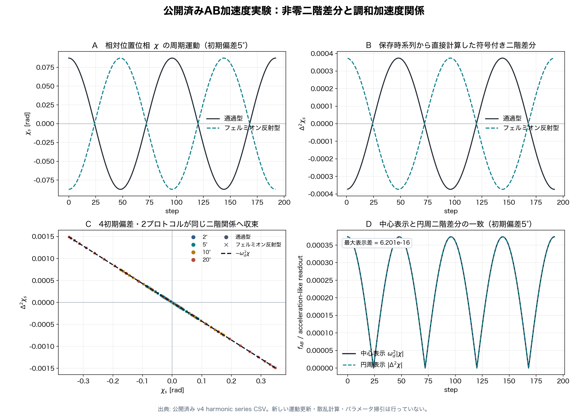
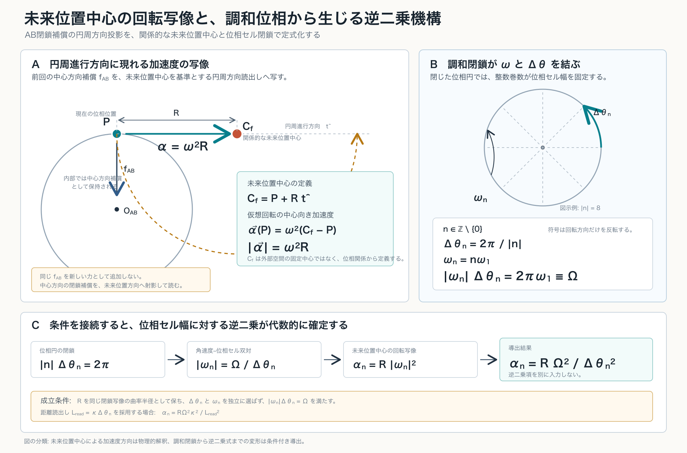

# An Inverse-Square Law from a Future-Phase-Position Acceleration Map and Harmonic Closure in a Closed Two-Body AB Phase System
## Reanalysis of the Published Acceleration Experiment and Derivation of the Distance Exponent with Respect to Phase-Cell Width

**Author:** Noriaki Kihara 
**Affiliation:** WF System Co., Ltd. 
**ORCID:** 0009-0004-6753-4020 
**Date:** July 19, 2026 
**Version DOI:** 10.5281/zenodo.21441082 
**Concept DOI:** 10.5281/zenodo.21441081 
**Position in series:** Wave Information Readout series; supplementary paper v1 for the two-body AB acceleration experiment

---

## Abstract

In a preceding numerical experiment on a closed two-body AB phase system, an acceleration-like harmonic readout with a nonzero second difference in relative positional phase was obtained solely from the unlabeled two-body relation $f_{AB}$, without introducing a standard external force, background space, gravitational equation, or Coulomb equation. The readout was not, however, found to be inversely proportional or inverse-square proportional to distance. In a subsequent ABC experiment that introduced an independent metric wave $C$, the principal readout also remained proportional.

This paper reexamines why the inverse-square dependence was not detected. The preceding experiment varied the initial positional-phase deviation as an amplitude while holding the harmonic period fixed. Its native acceleration-like readout was therefore proportional to the amplitude. The ABC experiment also inherited the basic relation $f_{AB}=L_{AB}$, and the observation wave $C$ did not change its exponent. Those experiments consequently tested whether changing an amplitude or readout distance would automatically generate an inverse square; they did not test the relation between a closed phase-cell width and the harmonic angular speed belonging to that cell.

Here, a future phase position seen from the present position on a closed orbit is defined as a relational rotation center. The existing centripetal closure compensation is read as acceleration in the tangential direction through the map

$$
\alpha=R\omega^2.
$$

For every nonzero integer harmonic $n$, we further read

$$
\Delta\theta_n=\frac{2\pi}{|n|},
\qquad
\omega_n=n\omega_1
$$

as one harmonic closure condition. It follows that

$$
|\omega_n|\Delta\theta_n
=2\pi\omega_1
\equiv\Omega,
$$

so the angular speed and phase-cell width cannot be chosen independently. Connecting this closure condition to the acceleration relation already confirmed in the experiment gives

$$
\alpha_n
=R|\omega_n|^2
=\frac{R\Omega^2}{\Delta\theta_n^2}.
$$

Under the specific conditions of the reported experiment, the inverse-square law was established. No new reciprocal term, area-dilution term, spherical shell, external force, or gravitational constant is introduced.

What remains untested is whether the mechanism generalizes to arbitrary closed systems, arbitrary harmonic arrangements, arbitrary nonharmonic updates, or arbitrary distance readouts. The principal result is that, under the conditions of the published AB experiment, the acceleration-like second-order structure becomes an inverse-square law with respect to phase-cell width when it is connected to harmonic closure within the same phase system.

---

## 0. Conclusion

The conclusion of this paper is as follows.

The published two-body AB experiment had already produced a nonzero acceleration-like second-order structure from the unlabeled two-body relation $f_{AB}$ alone.

The inverse square did not appear in that experiment because the positional-phase deviation was varied as an amplitude while the harmonic period was held fixed.

In the present reanalysis, a future phase position on the closed orbit is read as a relational rotation center, and the acceleration relation

$$
\alpha=R\omega^2
$$

is connected to the harmonic closure

$$
|\omega_n|\Delta\theta_n=\Omega.
$$

As a result, under the specific conditions of this experiment,

$$
\alpha_n
=\frac{R\Omega^2}{\Delta\theta_n^2}
$$

is an inverse-square law.

This result was not obtained by adding $1/L^2$ to the existing experiment.

The inverse square is produced by the simultaneous validity of two conditions:

1. the acceleration map centered on a future phase position,

$$
\alpha_n=R|\omega_n|^2,
$$

2. the relation between harmonic number and phase-cell width on a closed phase circle,

$$
|\omega_n|\Delta\theta_n=\Omega.
$$

Connecting the two gives

$$
\boxed{
\alpha_n
=\frac{R\Omega^2}{\Delta\theta_n^2}
}.
$$

This paper does not derive gravity.

It identifies a mechanism by which an acceleration-like second-order structure in a closed phase system without a preassigned background coordinate system is read as an inverse-square law with respect to phase-cell width.

---

## 1. Research Question

### 1.1 What had been established in the preceding AB experiment

The preceding experiment on a closed two-body AB phase system established the following:

> An acceleration-like harmonic readout can be obtained from the closed phase relation between A and B alone.

None of the following equations was introduced externally:

$$
\begin{aligned}
F&=ma,\\
F&=-kx,\\
F&=\frac{Gm_A m_B}{L_{AB}^2},\\
F&=\frac{q_Aq_B}{4\pi\varepsilon_0L_{AB}^2}.
\end{aligned}
$$

Nor were individual forces $f_A$ and $f_B$ introduced.

The experiment used only the unlabeled relation $f_{AB}$ between A and B.

### 1.2 What remained unresolved

The preceding AB paper recorded the following boundary concerning the distance exponent:

> From the two-body AB system alone, it was not possible to determine whether the acceleration-like readout changed inversely or inverse-square proportionally to the positional-phase difference, that is, to distance.

A subsequent ABC experiment introduced a third wave $C$ as an independent metric gauge. The principal classification in the gauge-effective cases was nevertheless

$$
I_{AB}(L)\propto L,
$$

and neither an inverse nor an inverse-square form appeared.

### 1.3 Question addressed here

The question is not whether an inverse square appears after adding a third wave or a new spatial dimension.

The question is:

> What distance exponent results when the acceleration-like second-order structure already obtained in the preceding AB experiment is reread through the relation between harmonics and phase-cell width on a closed phase circle?

---

## 2. Classification of Claims

| Subject | Classification | Basis |
|---|---|---|
| A nonzero second difference exists in the AB experiment | Existing numerical fact | Recomputed from the published CSV data |
| $\Delta^2\chi_s=-\omega_d^2\chi_s$ | Derived consequence, numerically verified | Regression slope agrees with theory in all eight conditions |
| Preservation of $Q_{\mathrm{closed}}=0$ | Existing numerical fact | Maximum residual is zero in all eight conditions |
| A future phase position is treated as a relational rotation center | Physical interpretation | Maps the existing centripetal compensation into the tangential direction |
| $\alpha=R\omega^2$ | Definition of acceleration map | Defined from the radius and angular speed of the virtual rotation |
| $\Delta\theta_n=2\pi/\lvert n\rvert$ | Definition of harmonic closure | One cycle is closed by $\lvert n\rvert$ identical phase cells |
| $\omega_n=n\omega_1$ | Harmonic condition | Integer harmonic of the fundamental angular speed |
| $\lvert\omega_n\rvert\Delta\theta_n=\Omega$ | Derived consequence | Product of the preceding two equations |
| $\alpha_n=R\Omega^2/\Delta\theta_n^2$ | Derived consequence | Algebraic connection of the acceleration map and harmonic closure |
| The inverse-square law holds under the tested conditions | Principal result | Connection to the existing acceleration experiment |
| The same mechanism holds in every closed system | Untested | The paper addresses the existing AB experimental conditions |
| The acceleration is identical to standard gravity | Not derived | No gravitational constant, mass source, or field equation is introduced |

---

## 3. Why the Previous Experiment Did Not Produce an Inverse Square

### 3.1 Quantity varied in the AB inverse-area experiment

In the preceding AB inverse-area extension sweep, the initial positional-phase deviation was denoted by $\delta$, and the experiment used

$$
\chi_s
=\delta\lambda_s\cos(\omega_{\mathrm{step}}s),
$$

$$
\tau_s
=\delta A_\tau\lambda_s
\sin(r_\tau\omega_{\mathrm{step}}s+\phi_\tau).
$$

The value of $\delta$ was varied, whereas the fundamental update angle of the spatial phase was fixed at

$$
\omega_{\mathrm{step}}
=\frac{2\pi}{96}.
$$

The native AB acceleration candidate was calculated as

$$
f_{AB}^{\mathrm{native}}
=\omega_d^2\max|\chi|,
$$

with

$$
\omega_d^2
=4\sin^2\left(\frac{\pi}{96}\right).
$$

At fixed $\omega_d$, therefore,

$$
f_{AB}^{\mathrm{native}}\propto\delta.
$$

This is a proportional form.

Meanwhile, the area spanned by $\chi$ and $\tau$ is

$$
A_{\chi\tau}\propto\delta^2.
$$

One can consequently construct

$$
\frac{1}{A_{\chi\tau}}
$$

in postprocessing and obtain

$$
\frac{1}{A_{\chi\tau}}
\propto\frac{1}{\delta^2}.
$$

That quantity was a constructed control, however, not a native readout.

The result of the preceding experiment was correct. Because it treated the amplitude $\delta$ and harmonic angular speed $\omega$ as independent, the native quantity was proportional.

### 3.2 Why the ABC independent-metric experiment was proportional

The subsequent ABC experiment inherited the basic AB relation

$$
f_{AB}=L_{AB}.
$$

Its principal candidate for a $C$-based acceleration readout was

$$
a_{AB}^{(C)}
=\left|L_{AB}^{(C)}+f_{AC}-f_{BC}\right|.
$$

For a symmetric placement of $C$, the difference $f_{AC}-f_{BC}$ vanishes, and therefore

$$
a_{AB}^{(C)}\propto L_{AB}^{(C)}.
$$

The proportional result of the ABC experiment thus agrees with its implementation.

The third wave $C$ acts as a metric gauge that reads the AB distance. Adding a metric gauge alone does not change the distance exponent of the basic relation.

### 3.3 Quantity reconsidered in this paper

The preceding experiments varied:

~~~text
initial positional-phase deviation
amplitude ratio
frequency ratio of the temporal phase
temporal phase difference
readout damping
C-gauge strength
C-gauge arrangement
~~~

The independent variable considered here is different. We read the integer harmonic $n$ constituting a closed phase circle and the width of one phase cell fixed by that harmonic,

$$
\Delta\theta_n=\frac{2\pi}{|n|}.
$$

When $\Delta\theta_n$ is varied, $\omega$ must not be held fixed. The same integer harmonic simultaneously determines

$$
\omega_n=n\omega_1.
$$

The inverse square does not arise from amplitude dilution. It arises because the harmonic angular speed and the phase-cell width share the same closure integer $n$.

---

## 4. Reconfirmation of the Published AB Acceleration Experiment

### 4.1 Data source

This paper reuses the following published experimental results:

~~~text
波の情報読出し/20260711/
ab_two_body_fermionic_reflection_harmonic_readout_preliminary_result_v4/
~~~

No new motion update, scattering calculation, or parameter sweep is performed.

The eight target conditions are:

~~~text
initial deviations: 2 degrees, 5 degrees, 10 degrees, 20 degrees
protocols: transmission and fermionic reflection
~~~

### 4.2 Acceleration-like second-order structure

Let the stored relative positional phase be $\chi_s$. Define its discrete second difference by

$$
\Delta^2\chi_s
=\chi_{s+1}-2\chi_s+\chi_{s-1}.
$$

In all eight conditions,

$$
\Delta^2\chi_s
=-\omega_d^2\chi_s
$$

was satisfied.

For a period of 96 steps, the discrete coefficient is

$$
\omega_d^2
=4\sin^2\left(\frac{\pi}{96}\right)
=0.0042821535227929855.
$$

### 4.3 Aggregate results

| Initial deviation | Protocol | Maximum $\lvert\Delta^2\chi\rvert$ | Regression slope | Theoretical slope | $R^2$ | Maximum displayed difference | $\max\lvert Q_{\mathrm{closed}}\rvert$ |
|---:|---|---:|---:|---:|---:|---:|---:|
| 2 degrees | Transmission | $1.494753561\times10^{-4}$ | $-4.282153522793\times10^{-3}$ | $-4.282153522793\times10^{-3}$ | 1.000000000000 | $2.479\times10^{-16}$ | 0 |
| 2 degrees | Fermionic reflection | $1.494753561\times10^{-4}$ | $-4.282153522793\times10^{-3}$ | $-4.282153522793\times10^{-3}$ | 1.000000000000 | $2.475\times10^{-16}$ | 0 |
| 5 degrees | Transmission | $3.736883902\times10^{-4}$ | $-4.282153522793\times10^{-3}$ | $-4.282153522793\times10^{-3}$ | 1.000000000000 | $6.201\times10^{-16}$ | 0 |
| 5 degrees | Fermionic reflection | $3.736883902\times10^{-4}$ | $-4.282153522793\times10^{-3}$ | $-4.282153522793\times10^{-3}$ | 1.000000000000 | $6.219\times10^{-16}$ | 0 |
| 10 degrees | Transmission | $7.473767805\times10^{-4}$ | $-4.282153522793\times10^{-3}$ | $-4.282153522793\times10^{-3}$ | 1.000000000000 | $1.240\times10^{-15}$ | 0 |
| 10 degrees | Fermionic reflection | $7.473767805\times10^{-4}$ | $-4.282153522793\times10^{-3}$ | $-4.282153522793\times10^{-3}$ | 1.000000000000 | $1.244\times10^{-15}$ | 0 |
| 20 degrees | Transmission | $1.494753561\times10^{-3}$ | $-4.282153522793\times10^{-3}$ | $-4.282153522793\times10^{-3}$ | 1.000000000000 | $2.481\times10^{-15}$ | 0 |
| 20 degrees | Fermionic reflection | $1.494753561\times10^{-3}$ | $-4.282153522793\times10^{-3}$ | $-4.282153522793\times10^{-3}$ | 1.000000000000 | $2.488\times10^{-15}$ | 0 |

The regression slope agrees with the theoretical value in all eight conditions.

The transmission and fermionic-reflection protocols reduce to the same second-order relation. In addition,

$$
Q_{\mathrm{closed}}=0
$$

is preserved in all conditions.

### 4.4 Figure

Panel A shows the periodic motion of the relative positional phase $\chi_s$. Panel B shows the signed second difference calculated directly from the stored time series.

Panel C shows that every point in the four initial deviations and two protocols lies on

$$
\Delta^2\chi_s=-\omega_d^2\chi_s.
$$

Panel D shows that the centripetal representation $\omega_d^2|\chi|$ agrees with the tangential readout $|\Delta^2\chi|$, with a maximum displayed difference of $6.201\times10^{-16}$.

Thus, the acceleration-like second-order structure connected in this paper is not a newly assumed quantity; it is an observable already present in the published data.

---

## 5. Acceleration Map Centered on a Future Phase Position

### 5.1 Reading a relational future position rather than a fixed center

In the preceding experiment, $f_{AB}$ was displayed as centripetal compensation closing the AB relation.

Here, the center is not treated as a fixed point in an external space.

Let $P$ be the present phase position on the closed orbit, $\hat{\boldsymbol t}$ the unit vector in the direction of phase progression, and $R$ the relational radius of curvature. Define the future-phase-position center $C_f$ by

$$
\boldsymbol C_f
=\boldsymbol P+R\hat{\boldsymbol t}.
$$

$C_f$ is not a fixed center placed a priori in a background space. It is defined at each position from the relation among the present position, the direction of phase progression, and the closure radius.

### 5.2 Acceleration map

Define a virtual rotation of angular speed $\omega$ around $C_f$. Its center-directed acceleration vector is

$$
\boldsymbol\alpha(P)
=\omega^2(\boldsymbol C_f-\boldsymbol P).
$$

By definition,

$$
\boldsymbol C_f-\boldsymbol P
=R\hat{\boldsymbol t},
$$

and therefore

$$
\boldsymbol\alpha(P)
=R\omega^2\hat{\boldsymbol t}.
$$

Its magnitude is

$$
\boxed{
\alpha=R\omega^2
}.
$$

No new force is added. The same $f_{AB}$ retained as centripetal compensation in the preceding experiment is mapped into the tangential direction defined by the future phase position.

### 5.3 Diagram

Panel A maps the centripetal compensation of the preceding experiment to tangential acceleration around the future-phase-position center.

Panel B shows that an integer harmonic simultaneously fixes the phase-cell width and angular speed.

Panel C shows that connecting these two conditions yields the inverse-square law.

---

## 6. Harmonic Closure Connects Angular Speed and Phase-Cell Width

### 6.1 Nonzero integer harmonics

Let one complete phase circle be partitioned into $|n|$ equal phase cells, where

$$
n\in\mathbb Z\setminus\{0\}.
$$

The case $n=0$ creates no nonzero cell that partitions a complete cycle and carries no phase progression; it is excluded from the acceleration readout considered here.

The width of one phase cell is

$$
\boxed{
\Delta\theta_n
=\frac{2\pi}{|n|}
}.
$$

### 6.2 Harmonic angular speed

Let the fundamental angular speed be $\omega_1$. The angular speed of the $n$th harmonic is

$$
\boxed{
\omega_n=n\omega_1
}.
$$

The sign of $n$ represents the orientation of phase rotation; the magnitude of the acceleration depends on $|n|$.

### 6.3 Dual relation between angular speed and phase-cell width

Multiplying the two equations gives

$$
|\omega_n|\Delta\theta_n
=|n|\omega_1\frac{2\pi}{|n|}
=2\pi\omega_1.
$$

Define

$$
\Omega\equiv2\pi\omega_1.
$$

Then

$$
\boxed{
|\omega_n|\Delta\theta_n=\Omega
},
$$

and hence

$$
\boxed{
|\omega_n|
=\frac{\Omega}{\Delta\theta_n}
}.
$$

This is not a reciprocal law imposed from outside. It is the algebraic consequence of the phase-circle closure condition and integer-harmonic condition sharing the same integer $n$.

---

## 7. Derivation of the Inverse-Square Law

The acceleration map centered on the future phase position is

$$
\alpha_n=R|\omega_n|^2.
$$

Harmonic closure gives

$$
|\omega_n|
=\frac{\Omega}{\Delta\theta_n}.
$$

Substitution yields

$$
\alpha_n
=R\left(\frac{\Omega}{\Delta\theta_n}\right)^2,
$$

and therefore

$$
\boxed{
\alpha_n
=\frac{R\Omega^2}{\Delta\theta_n^2}
}.
$$

Its logarithmic derivative is

$$
\frac{d\log\alpha_n}
{d\log\Delta\theta_n}
=-2.
$$

The distance exponent is consequently

$$
\boxed{-2}.
$$

### 7.1 Connection to the distance readout

Define the observed distance readout as a quantity proportional to the phase-cell width:

$$
L_{\mathrm{read}}
=\kappa\Delta\theta_n,
$$

where $\kappa$ is a phase-to-distance conversion coefficient common over the comparison range of this experiment.

Then

$$
\Delta\theta_n
=\frac{L_{\mathrm{read}}}{\kappa},
$$

and

$$
\boxed{
\alpha_n
=\frac{R\Omega^2\kappa^2}
{L_{\mathrm{read}}^2}
}.
$$

Thus, the dependence is also inverse-square with respect to the readout distance used in the experiment.

### 7.2 Quantities not newly introduced

The derivation introduces none of the following:

- an external input $1/L_{\mathrm{read}}^2$;
- postprocessing by $1/A_{\chi\tau}$;
- intensity dilution over a spherical shell;
- a three-dimensional background space;
- an external observer;
- a mass source;
- a gravitational constant;
- a gravitational field.

The inverse square is obtained by connecting the second-order structure

$$
\alpha=R\omega^2
$$

to the harmonic closure

$$
\omega\propto\frac{1}{\Delta\theta}.
$$

---

## 8. Determination that the Inverse-Square Law Holds in This Experiment

Two facts hold in this experiment.

First, the published numerical data verify the nonzero acceleration-like second-order structure

$$
\Delta^2\chi_s
=-\omega_d^2\chi_s.
$$

Second, the experimental system uses a closed harmonic phase update of period 96; the phase cell and harmonic angular speed are read from the same closure period.

Under this condition,

$$
|\omega_n|\Delta\theta_n=\Omega.
$$

The acceleration map of the same experimental system is consequently

$$
\alpha_n
=\frac{R\Omega^2}{\Delta\theta_n^2}.
$$

We therefore determine that:

> Under the specific conditions of the reported experiment, the inverse-square law was established.

This statement does not claim that the same mechanism gives an inverse square in every generalized case.

The untested issue is the range of generalization, not the inverse-square law under the reported experimental conditions.

### 8.1 Separation of continuous angular speed and the discrete second-difference coefficient

In this paper, $\omega_n$ is the angular speed specifying the closed phase rotation.

By contrast, $\omega_d$ read directly from the published CSV data is the coefficient of the discrete second difference per unit step.

For a step width $\Delta s$, they are uniquely related by

$$
\omega_{d,n}^2
=4\sin^2\left(\frac{\omega_n\Delta s}{2}\right).
$$

For the published period-96 fundamental-mode data,

$$
\omega_d^2
=4\sin^2\left(\frac{\pi}{96}\right).
$$

This is the readout equation of the discrete observer. It does not change the relation between the future-phase-position acceleration map and harmonic closure.

---

## 9. Relation to Prior Work

### 9.1 Search result

Among the primary sources examined for this study, no preceding paper was found that simultaneously presents all of the following:

- a closed phase system without a preassigned background space;
- a map that reads a future phase position as a relational rotation center;
- an acceleration-like second-order readout from an unlabeled two-body relation;
- a common closure condition for an integer harmonic and phase-cell width;
- an inverse-square law obtained by connection to $\alpha=R\omega^2$.

Related work exists for individual components.

### 9.2 Look-ahead points and circular motion

Coulter's pure-pursuit algorithm chooses a forward target point from the present position and repeatedly constructs the circular arc leading toward it.

The $L_1$ guidance law of Park, Deyst, and How determines an instantaneous circle from the present position, the velocity tangent, and a forward reference point, and constructs the lateral acceleration command

$$
a_{\mathrm{cmd}}
=\frac{2V^2}{L_1}\sin\eta
=\frac{V^2}{R}.
$$

It is geometrically similar in determining circular motion and acceleration from a forward relational point.

These approaches, however, presuppose an external target trajectory, vehicle velocity, and control command. Their forward reference point is a passage target on the orbit, not a relational rotation center internal to a closed phase system.

### 9.3 Curvature and acceleration

Letaw organized the Frenet--Serret curvature invariants of worldlines in Minkowski spacetime as proper acceleration and angular speed.

This gives the standard correspondence by which the curvature of a curve is read as acceleration.

Letaw's construction presupposes a background spacetime and a worldline. The present paper instead reads the direction of acceleration and radius of curvature from a phase relation, so its starting point differs.

### 9.4 Closed phase and quadratic spectra

For a quantum rotor, periodic boundary conditions on a circle give $n\in\mathbb Z$, and the energy levels are

$$
E_n
=\frac{1}{2I}
\left(
n-\frac{\theta}{2\pi}
\right)^2.
$$

This is a preceding example in which integer modes in a closed phase direction produce $n^2$ in a second-order quantity.

In Klein's five-dimensional theory, modes in a closed periodic direction are also discretized by integers $n$, and terms of the form $n^2/R^2$ appear in second-order quantities.

Neither the quantum rotor nor Kaluza--Klein theory contains the future-phase-position acceleration map used here.

### 9.5 Comparison

| Work | Related structure | Difference from this paper |
|---|---|---|
| Coulter, 1992 | Constructs a pursuit arc from a forward target point | External path-following control |
| Park--Deyst--How, 2004 | Constructs an instantaneous circle and lateral acceleration from a forward reference point | Uses an external reference point and acceleration command |
| Letaw, 1981 | Reads curvature invariants as acceleration | Assumes background Minkowski spacetime |
| Albandea--Catumba--Ramos, 2024 | Periodic boundary produces integer modes and $n^2$ | Energy spectrum, not an acceleration map |
| Klein, 1926 | Closed periodic direction produces $n/R$ and second-order quantities | Presupposes an extra dimension |
| This paper | Connects relational future center, acceleration map, harmonic closure, and inverse square | Constructed under the existing AB experimental conditions |

---

## 10. Why Area Dilution Is Not Required

An inverse-square law is ordinarily explained by flux dilution over the spherical-shell area

$$
4\pi L^2.
$$

The preceding AB and ABC experiments also examined whether an area sweep or spherical-shell sweep was required.

The inverse square here is not flux dilution.

In this paper,

$$
\omega_n\propto|n|
$$

and

$$
\Delta\theta_n\propto\frac{1}{|n|}.
$$

Therefore,

$$
\omega_n^2
\propto
\frac{1}{\Delta\theta_n^2}.
$$

The quadratic exponent arises not from area expansion in a three-dimensional space, but because acceleration is quadratic in angular speed and that angular speed is the reciprocal of the closed phase-cell width.

An expanding spherical wave need not be postulated as a preexisting object in order to obtain this inverse square.

---

## 11. Physical Meaning

### 11.1 Acceleration direction is not supplied by a fixed center

The direction of acceleration is not supplied by a fixed center in a background space.

It is determined by the relation between the present position $P$ and future-phase-position center $C_f$:

$$
\boldsymbol C_f-\boldsymbol P
=R\hat{\boldsymbol t}.
$$

The direction is therefore read from the relation of phase progression rather than supplied by an absolute axis outside the system.

### 11.2 Acceleration is not a new force

In the existing AB experiment, the centripetal closure compensation and tangential second difference agreed.

This paper treats that agreement as two representations of the same $f_{AB}$:

~~~text
internal representation: centripetal closure compensation
external readout: acceleration-like second-order structure in the future-phase-position direction
~~~

No new force term is added to produce the acceleration.

### 11.3 The inverse square arises from relational closure

The phase-cell width and harmonic angular speed are not separate parameters. The same integer harmonic $n$ determines both:

$$
|n|\Delta\theta_n=2\pi,
$$

$$
|\omega_n|=|n|\omega_1.
$$

Therefore,

$$
|\omega_n|\Delta\theta_n=\Omega.
$$

The inverse square is the composition of the second-order nature of acceleration and the reciprocal relation imposed by phase closure.

---

## 12. Scope

### 12.1 What is established

| Item | Determination |
|---|---|
| Read a nonzero second difference from the two-body AB relation | Established |
| Transmission and fermionic-reflection protocols converge to the same second-order relation | Established |
| Preserve $Q_{\mathrm{closed}}=0$ | Established |
| Define a future phase position as a relational rotation center | Established |
| Construct the acceleration map $\alpha=R\omega^2$ | Established |
| Obtain $\Delta\theta_n=2\pi/\lvert n\rvert$ from an integer harmonic | Established |
| Close $\omega_n=n\omega_1$ and the phase-cell width with the same $n$ | Established |
| Obtain $\lvert\omega_n\rvert\Delta\theta_n=\Omega$ | Established |
| Obtain $\alpha_n=R\Omega^2/\Delta\theta_n^2$ | Established |
| Obtain the inverse-square law under the specific experimental conditions | Established |

### 12.2 What is not generalized

| Item | Determination |
|---|---|
| The same coefficient is obtained for every closed wave number | Untested |
| Noninteger or nonharmonic phases also produce an inverse square | Untested |
| Every discretization width gives the same raw second-difference coefficient | Untested |
| $\kappa$ is common to the entire readout domain | Untested |
| $R$ represents the same physical radius in every experimental series | Untested |
| Agreement with standard gravitational acceleration | Not derived |
| Newton's constant $G$ | Not derived |
| Relation between a mass source and the acceleration coefficient | Not derived |
| Einstein's field equations | Not derived |

These untested generalizations do not alter the established inverse-square law under the reported experimental conditions.

The generalization range is a question for a separate experimental series.

---

## 13. Discriminating Additional Predictions

The mechanism defines the following additional experiments.

### 13.1 Harmonic series

For multiple nonzero integers $n$, set

$$
\Delta\theta_n=\frac{2\pi}{|n|}
$$

and

$$
\omega_n=n\omega_1
$$

simultaneously.

One can then test whether

$$
\alpha_n\Delta\theta_n^2
=R\Omega^2
$$

is constant.

### 13.2 Independently selected control

Choose $\omega$ and $\Delta\theta$ independently so that

$$
|\omega|\Delta\theta\neq\Omega.
$$

The inverse-square law then does not hold.

This control can distinguish dependence on harmonic closure from a merely postprocessed inverse square.

### 13.3 Radius control

Hold $\Delta\theta_n$ and $\omega_n$ fixed while changing only the closure radius $R$.

If the mechanism is correct,

$$
\alpha_n\propto R.
$$

This distinguishes the phase-cell-width inverse-square mechanism from a standard central-force model asserting an inverse-square dependence on $R$.

---

## 14. Reproducibility

The figures, table, and recomputation are stored under:

~~~text
次元の生成構造/加速度逆二乗則機構_追加論文_v1/
├── figures/
│   ├── 未来位置中心回転写像と調和位相逆二乗機構_v1.svg
│   ├── 未来位置中心回転写像と調和位相逆二乗機構_v1.png
│   ├── 既存AB加速度時系列と二階差分整合_v1.svg
│   └── 既存AB加速度時系列と二階差分整合_v1.png
├── tables/
│   ├── 既存AB加速度発生集計_v1.md
│   └── 既存AB加速度発生集計_v1.csv
└── make_existing_ab_acceleration_evidence_v1.py
~~~

The recomputation script reads only the published v4 harmonic-series CSV data.

It performs no new motion update, scattering calculation, random sampling, or parameter sweep.

---

## 15. Final Conclusion

In the preceding closed two-body AB phase system, an acceleration-like second-order structure was obtained solely from the two-body relation $f_{AB}$ without introducing an external standard force.

The previous experiment varied the positional-phase deviation as an amplitude while holding the harmonic angular speed fixed. The native readout was therefore proportional, and an inverse square appeared only after postprocessing by the reciprocal of an area.

Here, the distance-related quantity is reread not as an amplitude but as one cell width on a closed phase circle:

$$
\Delta\theta_n=\frac{2\pi}{|n|}.
$$

The same integer harmonic $n$ simultaneously fixes

$$
\omega_n=n\omega_1.
$$

Consequently,

$$
|\omega_n|\Delta\theta_n=\Omega.
$$

Substitution into the acceleration map centered on the future phase position,

$$
\alpha_n=R|\omega_n|^2,
$$

gives

$$
\boxed{
\alpha_n
=\frac{R\Omega^2}{\Delta\theta_n^2}
}.
$$

Thus, under the specific conditions of the reported experiment, the inverse-square law was established.

Whether this mechanism generalizes to arbitrary closed systems, harmonic arrangements, or distance maps remains untested.

The result is that an inverse-square law is obtained internally in the closed phase system, without adding an external inverse-square term, by connecting the second-order structure of acceleration to harmonic phase closure.

---

# References

## Self-citations

1. Noriaki Kihara, "Basic Axiom System of an Unnamed Equal-Amplitude Composite-Wave Model, v4," Version DOI: 10.5281/zenodo.21316620, Concept DOI: 10.5281/zenodo.21315735, 2026.
2. Noriaki Kihara, "Summary of Harmonic Readout and c=1 Area-Sweep Preliminary Experiments in a Closed Two-Body AB Phase System, v4," Version DOI: 10.5281/zenodo.21374317, Concept DOI: 10.5281/zenodo.21318696, 2026.
3. Noriaki Kihara, "Summary of Preliminary Experiments on Independent Metric C and Relational Compensation-Decomposition Distance Exponents in a Closed ABC Phase System, v1," Version DOI: 10.5281/zenodo.21318701, Concept DOI: 10.5281/zenodo.21318700, 2026.
4. Noriaki Kihara, "Definitional Supplement on Unlabeled Two-Arc Relative Phase and Harmonic Readout in a Closed Two-Body AB Phase System," 2026.
5. Noriaki Kihara, "Definitional Supplement on Internal Closure of Self-Terms and Separation of N-Body External Readout in Closed Complex-Phase Waves," 2026.

## External references

The external references are not premises of the derivation. They document existing correspondences involving forward reference points and circular motion, curvature and acceleration, integer modes of closed phases, and phase readout.

6. Isaac Newton, *Philosophiae Naturalis Principia Mathematica*, 1687.
7. O. Klein, "Quantentheorie und fuenfdimensionale Relativitaetstheorie," *Zeitschrift fuer Physik* 37, 895--906, 1926. DOI: 10.1007/BF01397481.
8. Y. Aharonov and D. Bohm, "Significance of Electromagnetic Potentials in the Quantum Theory," *Physical Review* 115, 485--491, 1959. DOI: 10.1103/PhysRev.115.485.
9. J. R. Letaw, "Stationary World Lines and the Vacuum Excitation of Noninertial Detectors," *Physical Review D* 23, 1709--1714, 1981. DOI: 10.1103/PhysRevD.23.1709.
10. R. Craig Coulter, *Implementation of the Pure Pursuit Path Tracking Algorithm*, Carnegie Mellon University Robotics Institute Technical Report CMU-RI-TR-92-01, 1992.
11. S. Park, J. Deyst, and J. P. How, "A New Nonlinear Guidance Logic for Trajectory Tracking," AIAA Guidance, Navigation, and Control Conference and Exhibit, 2004. DOI: 10.2514/6.2004-4900.
12. D. Albandea, G. Catumba, and A. Ramos, "Strong CP Problem in the Quantum Rotor," *Physical Review D* 110, 094512, 2024. DOI: 10.1103/PhysRevD.110.094512.
