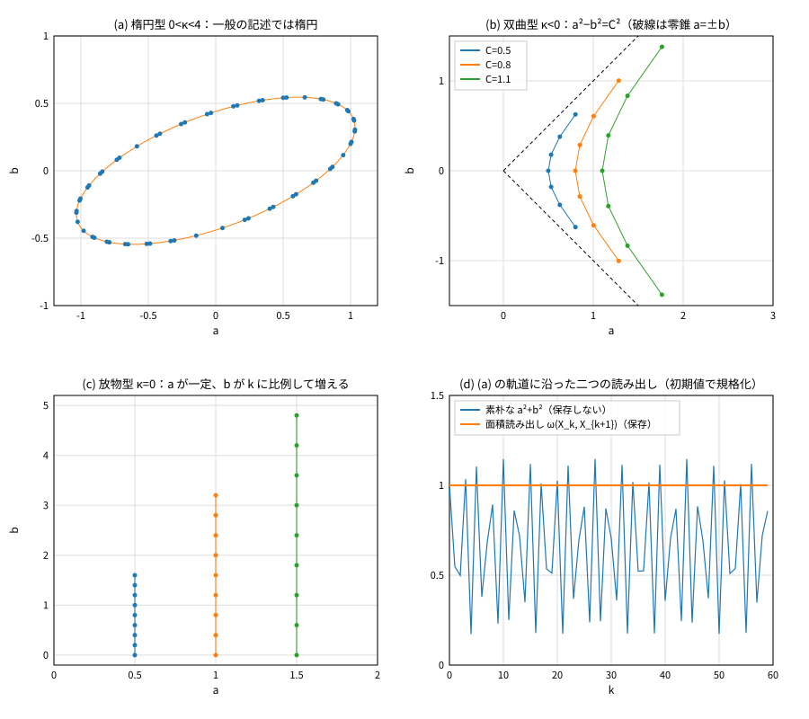
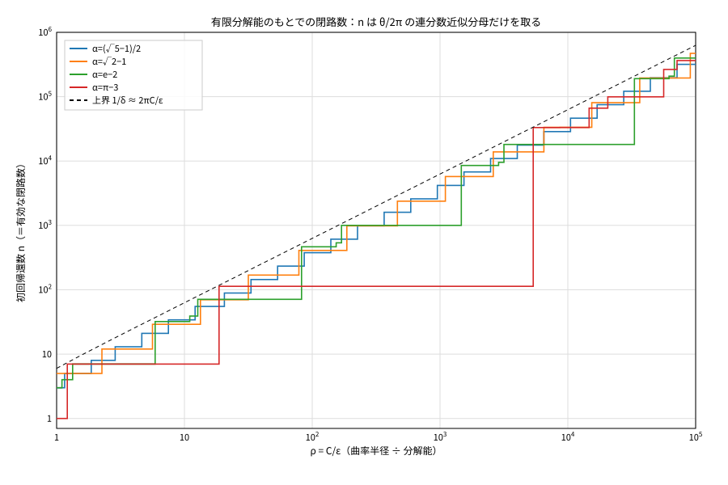
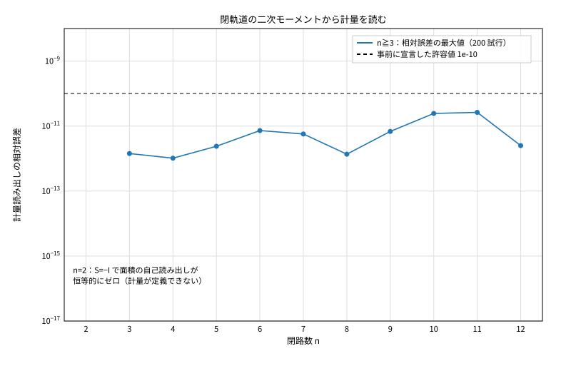

# 第一思考実験：等価原理を無名な二自由度まで遡る
## ― 面積読み出しの保存から、二乗和の符号・曲率半径・三つの系（慣性／一様加速／回転）を導く ―

**著者:** 木原範昭 (Noriaki Kihara)  
**ORCID:** 0009-0004-6753-4020  
**Version DOI:** 10.5281/zenodo.22857953  
**Concept DOI:** 10.5281/zenodo.22857952  
**版:** v1.0  
**日付:** 2026-09-20

---

## 要旨

Einstein の等価原理を、背景時空も計量も複素数も仮定しない最小の系まで遡る。入力は、二つの原則、一つの公理候補、三つの設計仮定（§6 に限り、第四の設計仮定として固定分解能 $\varepsilon$）だけである。原則は、状態と関係を区別する最小の表現としての無名な二つの値 $(a,b)\sim(b,a)$ と、「状態単独は読めず積だけが読める」という読み出しの原則である。公理候補は、保存される読み出しが存在することである。設計仮定は、実数値・線形・双線形の三つである。

このとき次が導かれる。

1. 状態単独が読めないという原則だけから、二つの配置の読み出しは、定数倍を除いて面積形式 $\omega(X,Y)=a_Xb_Y-b_Xa_Y$ に一意に決まる。ユークリッド内積もミンコフスキー内積も、単独の配置に値を与えてしまうので原則に反する。
2. 符号つきの読み出しの保存は $\det S=1$ と同値である（読めるのは大きさ $\lvert q\rvert$ だけなので、向きを反転する枝 $\det S=-1$ も残る。本稿は $\det S=1$ の枝を扱う）。このとき法則は一つの実数 $\tau=\operatorname{tr}S$ だけで書ける無向の二階則 $X_{k+1}+X_{k-1}=\tau X_k$ になる。この形では、速度（一階差分）は向きの取り方で符号を変え、最初に読める力学量は配置に比例する中心加速度 $\Delta^2X_k=-\kappa X_k$（$\kappa=2-\tau$）である。「読めるのは加速度だけで、その由来は読めない」という等価原理の操作的な中身が、公準としてではなく読み出しの構造として現れる。
3. 二乗和は入力ではなく、配置とその相互作用像が張る面積 $Q_S(X)=\omega(X,SX)$ として誘導される。その符号型は $\tau$ が決める。$|\tau|<2$ で $a^2+b^2$、$|\tau|>2$ で $a^2-b^2=a^2+(ib)^2$、$|\tau|=2$ で退化する。$\sum z_n^2=C^2$ は三つの型すべてで成り立ち、$z_2$ が実数か虚数か冪零かは相互作用の型が決める。
4. $\sum z_n^2=C^2$ の右辺 $C$ は、相互作用自身が誘導した計量で測った軌道の曲率半径に、任意の歩幅で厳密に等しい。すなわち $|\Delta^2X|/|\Delta X|^2=1/|C|$。
5. 三つの型は、慣性系・一様加速系（Born の双曲運動、$C=c^2/g$、1907 年の時計の遅れ）・回転系に照合される。等価原理の二つの古典的場面は、一つの構造の二つの非退化な型である。
6. ゼロ閉塞には内容のある形が二つある。零錐（相互作用で向きが変わらない配置）と、閉軌道の軌道和 $\sum_k z_k^2=0$（$n\ge3$、軌道が自分の誘導計量に対して等方的であること）である。
7. 閉路数 $n$ は公準にしなくてよい。有限分解能 $\varepsilon$ のもとでは $n$ は法則の回転数の連分数近似分母だけを取り、$n<2\pi C/\varepsilon$ を満たす。$n$ は $C$ と独立な自由度ではなく、曲率半径を分解能で測った値である。

数値検証は、落ちる条件を事前に宣言した 15 項目と、E4b の失敗を受けて追加した 2 項目（E4b′ は事後の診断、E6 は原因分析から立てて実行前に宣言した予測）で行った。事前宣言の 1 項目（E4b）は実際に落ちた。原因と処置は §7 に書く。最後に、設計書（第0論文）の最小骨格について、この思考実験から言えること（線形・実数・一階では閉じた構造が出ないこと、など）を §8 に戻す。

---

## 0. この稿の位置づけ

本稿は、設計書 [0] のもとでの第一思考実験である。主題は、等価原理から出発して、無名な状態―関係系と、二乗和・曲率半径・ゼロ閉塞を読み出すことである。どの入力からどこまで出るのかを、入力を明示して組み立てる。

設計書 §14 の六分類に「導出」を加え、本文のすべての言明に次の札を付ける。

| 札 | 意味 |
|---|---|
| 【原則】 | 哲学的原則 |
| 【公理候補】 | 公理として置く候補 |
| 【ゴール像】 | 設計書 §7 のゴール像との対応 |
| 【設計仮定】 | 予備設計上の仮定（外してよい、外す予定のもの） |
| 【導出】 | 上の札の言明から証明されるもの（証明は付録 A） |
| 【数値】 | 数値実験で確認したこと |
| 【照合】 | 既知物理との対応。導出ではない |

**入力の一覧（これ以外は使わない）**

| 記号 | 札 | 内容 |
|---|---|---|
| P1 | 【原則】 | 状態と関係を区別するには値が二つ要る。その最小の表現としての無名な二つの値。$(a,b)\sim(b,a)$。どちらが状態でどちらが関係かは決められない |
| P2 | 【原則】 | 状態単独は読めない。読めるのは積的演算だけで、読み出しは相互作用である（設計書 §5） |
| A1 | 【公理候補】 | 保存される読み出しが存在する（設計書 §7.1）。本稿は符号つきの $q$ の保存（$\det S=1$）として使う。読める量 $\lvert q\rvert$ の保存だけなら $\det S=-1$ の枝が残る（§3.1）。「法則は向きを区別しない」という条件との関係は T3′ |
| D1 | 【設計仮定】 | 二つの値はそれぞれ実数とする。実数でなければならないことは導出していない（§10）。配置を $X=(a,b)\in\mathbb R^2$ と書く |
| D2 | 【設計仮定】 | 相互作用は可逆な線形写像 $X\mapsto SX$ |
| D3 | 【設計仮定】 | 「積的演算」を、二つの配置の双線形形式 $B(X,Y)$ と解する |
| D4 | 【設計仮定】 | （§6 のみ）分解能 $\varepsilon$ を固定値として置く |

使わないもの：計量、内積、複素数、閉路条件 $S^n=I$、時間座標、釣り合いの式 $GM/R^2=\omega^2R$。

D2 について。絶対的な大きさは読めず比しか読めないので、法則は配置の一様な拡大と可換であるべきである。その最小の候補として線形を採る。同次だが非線形な候補は次稿に回す。

---

## 1. 等価原理の操作的な中身

等価原理には古典的な場面が二つある。一つは 1907 年の、一様に加速する箱と一様な重力場の等価 [1]。もう一つは、回転系の遠心加速度と重力の等価である [2,5]。

二つの場面に共通する操作的な中身を、相対性原理（速度は読めない）と合わせて一つの言明にすると、次のようになる。

$$
\boxed{\text{内側からは速度は読めない。最初に読めるのは加速度であり、その由来（慣性か重力か）は読めない。}}
$$

前半は相対性原理、後半が等価原理の中身である。本稿が導くのは、この言明に対応する読み出しの構造であり（§3.3）、等価原理そのものではない。本稿の問いは、この言明が意味を持つ最小の系は何か、そこで何が強制されるか、である。

---

## 2. 最小系と読み出し

### 2.1 無名な二自由度　【原則 P1】

状態と関係を区別して表すには、値が一つでは足りない。最低でも二つの値が要る。最小系なので二つとし、$(a,b)$ と書く。二つは区別できるが、どちらが状態でどちらが関係かを決める内部的な根拠はない。数えているのは値の個数であり、複素数 $a+ib$ は一つの値ではなく二つの値である。逆に、二つの値 $(a,b)$ を $a+ib$ と読むことを本稿は否定しない。その読みが成り立つかどうかは相互作用の型が決める（§4.1）。入れ替えを

$$
P=\begin{pmatrix}0&1\\1&0\end{pmatrix}
$$

と書く。

### 2.2 読み出しは一つに決まる　【導出 T1】

P2 により、単独の配置に値を与える読み出しは許されない。$B(X,X)$ は一つの配置 $X$ だけで決まる量なので、これがゼロでなければ単独の配置に値を与えたことになる。したがって D3 のもとでは、P2 は

$$
B(X,X)=0\quad(\forall X)
$$

と書ける。このとき $B$ は反対称になり、二自由度では定数倍を除いて一つしかない。

$$
\boxed{\;\omega(X,Y)=a_Xb_Y-b_Xa_Y\;}
$$

四つの注意。

(i) 対称な候補、すなわち $a_Xa_Y+b_Xb_Y$（ユークリッド）、$a_Xa_Y-b_Xb_Y$（ミンコフスキー）、$a_Xb_Y+b_Xa_Y$ は、どれも単独の配置に $B(X,X)\neq0$ を与える。P2 に反するだけでなく、どれを選ぶかが幾何の選択になる。$a^2+b^2$ を最初の読み出しに置くことは、この選択に当たる。

(ii) $\omega(PX,PY)=-\omega(X,Y)$。名前を付け替えると符号が変わるので、P1 のもとで $\omega$ の符号は読めない。読めるのは $|\omega|$ と、二つの $\omega$ の比である。

(iii) 各自由度を実数列 $a_k,b_k$ と見ると、$\omega(X_k,X_{k+1})=a_kb_{k+1}-a_{k+1}b_k$ は二つの列の Wronskian である。これは二つの無名な自由度の間の関係量であり、自分自身との関係量はゼロである。

(iv) 値が一つの場合、$B(X,X)=0$ を満たす双線形形式は恒等的にゼロで、読めるものが無い。値が二つで初めて読み出しが存在し、しかも一意になる。「二つ」は P1 の側からも P2 の側からも最小である。

---

## 3. 保存と法則

### 3.1 保存はユニモジュラ性と同値　【公理候補 A1】【導出 T2】

P2 により読み出しは相互作用である。配置とその相互作用像の読み出しを

$$
q_k:=\omega(X_k,X_{k+1}),\qquad X_{k+1}=SX_k
$$

と置く。$\omega(SX,SY)=\det S\cdot\omega(X,Y)$ なので $q_{k+1}=\det S\cdot q_k$ である。$S$ が単位行列の定数倍でなければ $q_0\neq0$ となる初期配置があるので、

$$
\boxed{\;S\neq\lambda I\ \text{のとき}\quad\text{符号つきの}\ q_k\ \text{がすべての初期配置で保存される}\iff\det S=1\;}
$$

$S=\lambda I$ のときは $q\equiv0$ で、読み出しそのものが無い（§4.1 の注意 (iv)）。保存されるのは、配置と次の配置が張る面積である。連続極限では面積速度一定（Kepler の第二法則）に当たる。ただしここでは計量を使っていない。

ここで一つ区別が要る。§2.2 の注意 (ii) のとおり、読めるのは $\lvert q\rvert$ だけである。$\lvert q\rvert$ の保存だけを求めるなら条件は $\lvert\det S\rvert=1$ で、向きを反転する枝 $\det S=-1$ が残る。この枝では $q$ の符号が一歩ごとに反転する。$S^2$ は $\det S^2=1$、$\operatorname{tr}S^2=\tau^2+2\ge2$ なので、二歩ごとに見れば §4 の双曲型（$\tau=0$ なら恒等写像）に入る。誘導される形式 $\omega(X,SX)$ は常に不定値で、符号が一歩ごとに入れ替わる。最小の例は入れ替え $P$ 自身で、$\omega(X,PX)=a^2-b^2$ である。本稿は以後、符号つきの $q$ が保存される枝 $\det S=1$ を扱う。A1 を $q$ の保存と読むか $\lvert q\rvert$ の保存と読むかは、ここでは決めない（§10）。

### 3.2 法則は一つの実数で書ける　【導出 T3】

$\det S=1$ のとき Cayley–Hamilton の定理から $S+S^{-1}=\tau I$（$\tau=\operatorname{tr}S$）。したがって

$$
\boxed{\;X_{k+1}+X_{k-1}=\tau X_k\;}
$$

この形には三つの性質がある。$\tau I$ は $P$ と可換なので、名前の付け替えで形が変わらない。$k\to-k$ で形が変わらない。パラメータは実数一つである。逆に、独立な二配置 $X_0,X_1$ と $\tau$ を与えれば $S$ は一意に決まる。つまり**法則は数 $\tau$ ただ一つであり、$S$ は法則と初期データを合わせたもの**である。

一階の形 $X_{k+1}=SX_k$ は、一般には無名な配置の上で定義できない。$PSP=S$ を満たす $S$ は $\gamma I+\beta P$ の形に限られ、固有値は実数である。回転は $PSP=S^{-1}$ を満たす。つまり名前の付け替えが反復の向きの反転になり、「次」と「前」が入れ替わる。回転を一階の形で書くと無名性と両立しないが、二階の無向則ではこの問題は生じない。

逆向きはどうか。【導出 T3′】$\det S=1$ を仮定しない一般の可逆な $S$ では、$d:=\det S$ として、Cayley–Hamilton の定理から $X_{k+1}+d\,X_{k-1}=\tau X_k$ である。列を逆向きに読んだ $Y_k=X_{-k}$ は $Y_{k+1}+d^{-1}Y_{k-1}=(\tau/d)\,Y_k$ に従う。二つの法則が一致する条件は $d^2=1$ かつ $\tau(d-1)=0$ なので、法則が $k\to-k$ で形を変えないのは、$d=1$ の場合と、$d=-1$ かつ $\tau=0$ の場合（$S^2=I$ となる鏡映。入れ替え $P$ 自身がその例）である。一方、読み出しは $q_{k+1}=d\,q_k$ に従うので、$q_0\neq0$ の軌道で符号つきの $q$ が保存されるのは $d=1$、読める量である $\lvert q\rvert$ が保存されるのは $\lvert d\rvert=1$ のときである。まとめると

$$
\boxed{\;q\ \text{の保存}\ (d=1)\ \Longrightarrow\ \text{法則が向きを区別しない}\ \Longrightarrow\ \lvert q\rvert\ \text{の保存}\ (\lvert d\rvert=1)\;}
$$

である。どちらの逆も成り立たない。$S=P$ は向きを区別しないが、$q$ の符号は一歩ごとに反転する。$S=\begin{pmatrix}1&1\\1&0\end{pmatrix}$（$d=-1$、$\tau=1$）は $\lvert q\rvert$ を保存するが、逆向きの法則は $\tau\to-\tau$ と変わる。$\lvert d\rvert\neq1$ なら、$q_0\neq0$ の軌道では $\lvert q_k\rvert=\lvert d\rvert^k\lvert q_0\rvert$ が単調に変わり、法則が与えた矢が読める。したがって「法則は向きを区別しない」は、符号つきの保存より弱く、読める量の保存より強い条件であり、A1 の言い換えにはならない。なお、これは法則の水準の主張である。法則が無向でも、個々の軌道に矢が読める場合はある（§4.1 の注意 (iii)）。

### 3.3 読めるのは加速度である　【導出 T4】

$q\neq0$ の軌道では、法則そのものが面積の比として読める。

$$
\tau=\frac{\omega(X_{k-1},X_{k+1})}{\omega(X_{k-1},X_k)}
$$

分子と分母は名前の付け替えで同時に符号を変えるので、比は読める。尺度にもよらない。

差分を見る。一階差分 $\Delta X_k=X_{k+1}-X_k$ は $k$ の向きの取り方で符号を変える。二階差分は向きによらず、

$$
\boxed{\;\Delta^2X_k:=X_{k+1}-2X_k+X_{k-1}=-\kappa X_k,\qquad\kappa:=2-\tau\;}
$$

読める言明としては、$\omega(X_k,\Delta^2X_k)=0$（加速度は中心を向く）と、$\kappa=-\omega(X_{k-1},\Delta^2X_k)/\omega(X_{k-1},X_k)$ である。

【照合】これが §1 の操作的な中身に当たる。最初に読める力学量は加速度である。それは一つしかなく、軌道の曲がり（慣性の側）と呼んでも中心場 $-\kappa X$（重力の側）と呼んでも同じ読み出しである。$\kappa$ は軌道によらない（どの $C$、どの位相でも同じ）ので、落下の普遍性も線形性から自動的に成り立つ。この系では等価原理は二つの量の釣り合いではなく、読み出しが一つしかないという事実である。

---

## 4. 三つの型

### 4.1 誘導される二乗和とその符号　【導出 T5】

保存される読み出し $q$ を配置の関数として書く。$\Omega=\begin{pmatrix}0&1\\-1&0\end{pmatrix}$、$N:=(S-S^{-1})/2$ として

$$
Q_S(X):=\omega(X,SX)=X^{\mathsf T}GX,\qquad G=\Omega N
$$

$$
\boxed{\;\det G=1-\frac{\tau^2}{4},\qquad N^2=-\Bigl(1-\frac{\tau^2}{4}\Bigr)I\;}
$$

二乗和は入力ではなく、相互作用が誘導する。符号型は $\tau$ だけで決まり、正規形は一つの式にまとまる。

$$
\boxed{\;a^2+s\,b^2=C^2,\qquad s=\operatorname{sgn}(4-\tau^2)\in\{+1,\,0,\,-1\}\;}
$$

$z_1=a$ とし、$z_2$ を $s=+1,\,0,\,-1$ に応じて $b$、$\epsilon b$（$\epsilon^2=0$）、$ib$ と置けば、これが $\sum z_n^2=C^2$ である。

| 型 | 条件 | $N^2$ | 現れる単位 | 正規形 | $\sum z_n^2=C^2$ の形 | 軌道 |
|---|---|---|---|---|---|---|
| 楕円型 | $\lvert\tau\rvert<2$、$\tau=2\cos\theta$ | $-\sin^2\theta\,I$ | $i$（$J=N/\sin\theta$） | $a^2+b^2$ | $z_2=b$ | 有界。閉じるか準周期 |
| 放物型 | $\lvert\tau\rvert=2$ | $0$ | 冪零 $\epsilon$（$\epsilon^2=0$） | $a^2$（退化） | $z_2=\epsilon b$ | $a$ が一定で、$b$ が $k$ に比例して増える |
| 双曲型 | $\lvert\tau\rvert>2$、$\lvert\tau\rvert=2\cosh H$ | $+\sinh^2H\,I$ | $j$（$j^2=+1$） | $a^2-b^2$ または $2ab$ | $z_2=ib$ | 指数的に増える |

四つの注意。

(i) 虚数構造は状態の値としてではなく、相互作用の側に $N^2\propto-I$ として現れる。ただしそれは三つの場合の一つで、相互作用の型によって $i$、$\epsilon$、$j$ のどれが現れるかが決まる。$\sum z_n^2=C^2$ は三つの型すべてで成り立つ。

(ii) $a^2+b^2$ は正規形であって入力ではない。楕円型で $PSP=S^{-1}$ のとき、一般の記述では $Q=A(a^2+b^2)+2Bab$（$A>\lvert B\rvert$）である。交差項は、無名性と両立する（$P$ と可換な）取り直し $a'=\alpha a+\beta b,\ b'=\beta a+\alpha b$ で消える。一般の記述では素朴な $a^2+b^2$ は保存しない（§7 の E1d、図1(d)）。

(iii) 双曲型の二つの正規形は同じものの二つの記述である。$PSP=S$（厳密に無名）なら $S$ はブースト $\begin{pmatrix}\cosh H&\sinh H\\\sinh H&\cosh H\end{pmatrix}$ で、不変量は $a^2-b^2$。$PSP=S^{-1}$ なら $a\mapsto e^Ha,\ b\mapsto e^{-H}b$ で、不変量は $ab$（光円錐座標）。入れ替えは $a^2-b^2$ の符号を変えるので、どちらが時間的でどちらが空間的かは、この段階では決められない。これは P1 の「どちらが状態でどちらが関係か決められない」の別の現れである。なお厳密に無名な型だけは、入れ替えで不変な組 $u=(a+b)/\sqrt2$ が伸びる向きとして、反復の向きを内部から読める。楕円型には向きがない。

(iv) $\det S=1$ の枝では、$n\le2$ の閉路は読めない。$S^n=I$（$n\le2$）なら $S=\pm I$ で、$N=0$、$Q_S\equiv0$ になる。配置とその像が平行で、面積が張れないからである。この枝で読める閉軌道は $n\ge3$ に限られる。$\det S=-1$ の枝の鏡映（$S^2=I$、たとえば $P$）は周期 2 で $\lvert q\rvert\neq0$ を持つが、本稿では扱わない（§3.1）。（$\tau\le-2$ は $S\to-S$ の鏡像で、符号が交互に変わる以外は同じ。）

以後、$\hat G:=G/\sqrt{\lvert\det G\rvert}$、$C^2:=\lvert X^{\mathsf T}\hat GX\rvert$ と規格化し、$\lvert v\rvert_{\hat G}:=\sqrt{\lvert v^{\mathsf T}\hat Gv\rvert}$ と書く（双曲型では $\hat G$ は不定値なので、これはノルムではなく記号である）。これは計量の面積要素を $\lvert\omega\rvert$ に合わせる規格化で、非退化型（$\lvert\tau\rvert\neq2$）に限る。放物型では $\det G=0$ で、$C$ は定数倍を除いてしか決まらない。

### 4.2 $C$ は曲率半径である　【導出 T6】

$S^{\mathsf T}GS=G$ から $(S-I)^{\mathsf T}G(S-I)=\kappa G$ が出る。面積の言葉では $\omega(\Delta X_k,\Delta X_{k+1})=\kappa\,\omega(X_k,X_{k+1})$ である。T4 と合わせると、非退化型（$\lvert\tau\rvert\neq2$）で $C\neq0$ のすべての軌道で

$$
\lvert\Delta X\rvert_{\hat G}^2=\lvert\kappa\rvert C^2,\qquad\lvert\Delta^2X\rvert_{\hat G}=\lvert\kappa\rvert\,\lvert C\rvert
$$

$$
\boxed{\;\frac{\lvert\Delta^2X\rvert_{\hat G}}{\lvert\Delta X\rvert_{\hat G}^{2}}=\frac{1}{\lvert C\rvert}\;}
$$

左辺、すなわち加速度を歩幅の二乗で割った量を、本稿では離散曲率と定義する。したがって $\sum z_n^2=C^2$ の右辺 $C$ は、相互作用自身が誘導した計量で測った軌道の曲率半径に、歩幅によらず厳密に等しい。ユークリッド型でもローレンツ型でも同じ式である。

「$C$ は曲率半径である」は、この形では名付けではなく定理である。半径を外から持ち込む必要はなく、計量も曲率も相互作用から読まれる。ただし単独の軌道の $C$ の絶対値は読めない。読めるのは二つの軌道の比 $C_1/C_2$ と、§6 の $C/\varepsilon$ である。

### 4.3 三つの型と三つの系　【照合 C1–C3】

**C1　放物型と慣性系。** $\kappa=0$ で $X_k=X_0+kV$。加速度はゼロである。正規形では $a$ が一定で、$b$ が $k$ に比例して積み上がる。【ゴール像】設計書 §7.6 の $L_t(n)\sim n$（因果的処理の累積として単調に増える方向）は、この型の振る舞いである。

**C2　双曲型と一様加速系。** 厳密に無名な型では $S$ はブーストで、軌道は $a^2-b^2=C^2$ の双曲線である。$(a,b)\leftrightarrow(x,ct)$ と読めば、これは Born の双曲運動 [3] で、固有加速度 $g$ の世界線であり、

$$
\boxed{\;C=\frac{c^2}{g}\;}
$$

である。T6 の「曲率 $=1/C$」は「固有加速度 $=c^2/C$」になる。同じ $S$ の、$C$ の異なる軌道の族は、一様加速する剛体系（Rindler 系 [4]）である。T6 により一歩あたりの固有長は $\sqrt{\lvert\kappa\rvert}\,C$ なので、高さ $C_1$ と $C_2=C_1+h$ の時計の進みの比は

$$
\frac{C_2}{C_1}=1+\frac{gh}{c^2}
$$

となる。これは 1907 年に Einstein が等価原理から導いた重力による時計の遅れ [1] に一致する（§7 の E4c はこの比の数値確認）。

**C3　楕円型と回転系。** 同じ $S$ の、$C$ の異なる軌道の族は剛体回転であり、歩幅は $C$ に比例し、中心加速度は一歩あたり $\kappa C$ である。回転系の遠心加速度の場面はこれに当たる。

したがって、等価原理の二つの古典的場面は、一つの構造の二つの非退化な型である。どちらでも「加速度 ÷ 速さ$^2=1/C$」が成り立つ。

**照合の範囲。** 一致しているのは、軌道の形、誘導計量の符号型、曲率と加速度の関係、時計の進みの比の四つである。一致を主張していないのは、3+1 次元、物理的な因果構造としての光円錐、逆二乗則、質量である。特に、釣り合いの式 $GM/R^2=\omega^2R$ はここでは課せない。線形の法則では $\kappa$ は $C$ によらず、中心場の大きさは $\lvert\Delta^2X\rvert_{\hat G}=\lvert\kappa\rvert\,C$ と、$C$ に線形になる。ニュートン重力では、これは点質量の場ではなく一様な背景の内部の場（$g\propto r$）に当たる。逆二乗則には $\kappa$ と $C$ の間の関係、つまり非線形性か系の族が必要で、この段階では手に入らない。

---

## 5. ゼロ閉塞の中身

$a^2+b^2=C^2$ を移項した $a^2+b^2+(iC)^2=0$ は T5 の書き換えであり、新しい内容を持たない。三つ組 $(a,b,iC)$ は実・実・純虚の定数で、互いに入れ替えられないので無名でもない。ゼロが内容を持つ形は次の二つである。

### 5.1 零錐は固有配置である　【導出 T7】

$$
Q_S(X)=0\iff SX\parallel X
$$

読み出し面積がゼロの配置とは、相互作用で向きが変わらない配置である。楕円型には存在しない。ゼロでない配置はすべて読める。双曲型では二方向あり、ブーストの正規形では $a=\pm b$、すなわち $a^2+(ib)^2=0$ である。

### 5.2 双曲型では零錐が射影的アトラクタになる　【導出 T8】

尺度は読めないので、読めるのは配置の向きだけである。双曲型の二つの固有方向を $v_\pm$（固有値の絶対値が $e^{\pm H}$）とし、配置を $X_k=A_kv_++B_kv_-$ と分ける。二つの成分の比は面積の比として読めて、

$$
\rho_k:=\left\lvert\frac{B_k}{A_k}\right\rvert=\left\lvert\frac{\omega(v_+,X_k)}{\omega(X_k,v_-)}\right\rvert=\rho_0\,e^{-2Hk}
$$

となる。これは面積の比なので尺度によらず、外から与えた長さを使わない（$v_\pm$ の長さの取り方は $\rho_0$ の定数倍にしか効かない）。配置の向きは零錐の方向 $v_+$ へ指数的に収束する。$\varepsilon_{\rm rel}$ 以下の $\rho$ をゼロと区別できないとすれば、およそ

$$
k^{*}\approx\frac{1}{2H}\ln\frac{\rho_0}{\varepsilon_{\rm rel}}
$$

歩で、配置はゼロ閉塞の配置（$\rho=0$）と区別できなくなる。保存量は保存されたまま読めなくなる。（この言明は E4b が落ちた原因の診断から得た。§7 の E6 は、記述のユークリッド長で規格化した量 $\lvert q\rvert/(\lvert X_k\rvert\lvert X_{k+1}\rvert)$ の減衰率が同じ $-2H$ になることの数値検証である。）

### 5.3 閉軌道の軌道和と、計量の読み出し　【導出 T9】

位数 $n\ge3$ の閉軌道について

$$
\boxed{\;\sum_{k=0}^{n-1}X_kX_k^{\mathsf T}=\frac{nC^2}{2}\,\hat G^{-1}\;}
$$

が成り立つ。正規記述で $z_k=a_k+ib_k$ と書けば

$$
\sum_kz_k=0,\qquad\boxed{\sum_kz_k^2=0},\qquad\sum_kz_k^{p}=0\quad(n\nmid p)
$$

である。$n$ 個の $z_k$ は相互作用で巡回的に移り合うので、互いに無名で等振幅である。最小は $n=3$ で、$n=2$ では成り立たない。

意味は二つある。第一に、二乗和のゼロ閉塞は「軌道が自分の誘導計量に対して等方的である」ことの正規記述での表現である。成分で書けば $\sum a_k^2=\sum b_k^2$ と $\sum a_kb_k=0$ で、「交差項が無い」の正当な形はこれである。第二に、この式は計量を軌道だけから読む手順を与える。

既存系列の無名複素ゼロ閉塞との照合は、本稿では行わない。設計書の付記に従い、既発表の結果を根拠に使わないためである。T9 は、その照合を行うときの最小の接点になりうる。

---

## 6. 閉路数は公準にしなくてよい

閉路条件 $S^n=I$ を公準として置く必要はない。楕円型の一般の法則では $\alpha:=\theta/2\pi$ は無理数で、軌道は厳密には閉じない。

【設計仮定 D4】誘導計量で測った分解能 $\varepsilon$ を固定値として置く。設計書 §8.3 は、分解能が相互作用する構造自身から決まることを求めている。固定値はその代用であり、外す予定の仮定として明示する。

【導出 T10】出発点と区別できない配置への初回帰還は、$\|x\|$ を $x$ と最も近い整数との距離として

$$
2C\,\Bigl\lvert\sin\frac{n\theta}{2}\Bigr\rvert<\varepsilon\iff\|n\alpha\|<\delta:=\frac1\pi\arcsin\frac{\varepsilon}{2C}
$$

を満たす最小の $n$ である。これを有効な閉路数と呼ぶ。$S^n=I$ が厳密に成り立つわけではない。この $n$ は $\|k\alpha\|$ の最小値を更新する時刻なので、第二種最良近似の定理 [7] により $\alpha$ の連分数近似分母 $q_j$ の一つである。さらに $n<1/\delta\approx2\pi C/\varepsilon$ が成り立つ。

$$
\boxed{\;n=n\bigl(\alpha,\;C/\varepsilon\bigr)\in\{q_j\},\qquad n<\frac{2\pi C}{\varepsilon}\;}
$$

法則 $\alpha$ と分解能 $\varepsilon$ を固定すれば、$n$ と $C$ は独立な自由度ではない。$n$ は、曲率半径を分解能で測った値が、法則の回転数の連分数の分母に量子化されたものである。連続量 $C$ は単独では読めないが、分解能があれば整数 $n$ として読める。【ゴール像】これは設計書 §9 の、離散性を有限分解能から出すという方針の最小の実例になっている。

【数値】（図2）黄金比の法則では $n$ は Fibonacci 数 $3,5,8,13,\dots$ だけを取り、$n/(2\pi C/\varepsilon)$ は理論値 $[1/\sqrt5,\ \varphi/\sqrt5]\approx[0.447,\ 0.724]$ の帯に入る（観測値 $0.4472$〜$0.7225$）。$\alpha=\pi-3$ では、$C/\varepsilon\approx18$ から $\approx5.3\times10^{3}$ まで $n=113$ のまま動かない。$355/113$ の共鳴である。回転数が有理数に異常に近い法則では、分解能を上げても閉路数が増えない台地が出る。

---

## 7. 数値検証

数値検証は、結果が事前に決まっていない形で行った。約束は次のとおりである。

- 検証される形式は $S$ から導く。$S$ を、検証される形式を保つように作らない。$S$ は $SL(2,\mathbb R)$ の乱数元である。
- 落ちる条件を、実行前にスクリプト冒頭の `FAIL_CONDITIONS` に宣言する。
- 状態更新の中で丸め・クリッピング・正規化をしない（設計書 §12）。
- 恒等式は有理数の厳密計算でも確かめる。乱数の種は固定（20260920）。

| 記号 | 落ちる条件（事前宣言） | 結果 | 判定 |
|---|---|---|---|
| E1a | 有理数厳密計算で $q_k\neq q_0$ が一度でも出る | 300 個の $S$ × 12 歩で違反 0 | PASS |
| E1b | 尺度で規格化した $q$ のずれが $10^{-9}$ を超える | 3000 個（楕円 1802、双曲 1198）× 40 歩で最大 $2.5\times10^{-13}$ | PASS |
| E1c | $G$ の符号型が $\tau$ による分類と食い違う | 食い違い 0／3000 | PASS |
| E1d | （対照）一般の記述で素朴な $a^2+b^2$ が保存してしまう | ゆらぎの中央値 122%。楕円型の全標本で 1% 超 | PASS |
| E2a | 無向則の残差が $10^{-9}$ を超える | 厳密計算で違反 0。浮動小数で最大 $1.3\times10^{-14}$ | PASS |
| E2b | 回転（$n=3..12$）で $\lvert PSP-S^{-1}\rvert>10^{-12}$ または $\lvert PSP-S\rvert<10^{-3}$ | 前者は最大 $3.8\times10^{-16}$、後者は最小 $1.41$ | PASS |
| E2c | 置換同変な実線形写像 $\gamma I+\beta\mathbf 1\mathbf 1^{\mathsf T}$（状態数 $N=2..8$）に複素固有値が出る | 2100 個で虚部の最大 $3.4\times10^{-15}$ | PASS |
| E3a | 初回帰還数が連分数近似分母でない値を取る | 4 法則 × 241 分解能で違反 0 | PASS |
| E3b | $n<1/\delta$ が破れる | 違反 0 | PASS |
| E4a | 厳密計算で T6 の二つの恒等式が破れる | 違反 0 | PASS |
| **E4b** | 浮動小数で（離散曲率）$\times\lvert C\rvert$ が 1 から $10^{-7}$ を超えてずれる | **最大 $1.9\times10^{-4}$** | **FAIL** |
| E4c | 同じ $S$ の二軌道で、固有長の比が $\lvert C_1/C_2\rvert$ から $10^{-7}$ を超えてずれる | 最大 $2.4\times10^{-14}$ | PASS |
| E5a | $n\ge3$ で計量読み出しの相対誤差が $10^{-10}$ を超える | $n=3..12$、各 200 試行で最大 $2.6\times10^{-11}$（図3） | PASS |
| E5b | $n\nmid p$ なのに冪和が $10^{-10}$ を超える | 最大 $3.9\times10^{-15}$ | PASS |
| E5c | $n=2$ で面積の自己読み出しがゼロにならない | $\lvert G\rvert=0$、$\operatorname{rank}\sum X_kX_k^{\mathsf T}=1$ | PASS |

**E4b が落ちたことについて。** 許容値を後から緩めて PASS に書き換えることはしていない。診断の結果は次のとおりである。落ちたのは双曲型だけで、楕円型の最大誤差は $4.9\times10^{-14}$ だった。最悪例は $\tau=61.1$ で、$\lvert X_k\rvert^2\lVert\hat G\rVert/C^2=2.4\times10^{10}$。不定値形式を、指数的に大きくなった配置の上で評価するときの桁落ちである。恒等式そのものは厳密計算 E4a で成り立っている。したがって、落ちたのは定理ではなく、検証の設計である。

この失敗から次の二つを行った。

| 記号 | 性格 | 落ちる条件 | 結果 | 判定 |
|---|---|---|---|---|
| E4b′ | **事後に追加した診断**。事前登録ではない | 成長を挟まない三点 $(X_{-1},X_0,X_1)$ での評価が $10^{-9}$ を超えてずれる | 最大 $3.4\times10^{-14}$ | PASS |
| E6 | E4b の原因から立て、実行前に宣言した**予測** | 双曲型で $\ln\bigl(\lvert q\rvert/\lvert X_k\rvert\lvert X_{k+1}\rvert\bigr)$ の傾きが $-2H$ から 1% を超えてずれる | 300 法則で最大 $0.05\%$ | PASS |

E6 は T8 の減衰率 $-2H$ の検証である。落ちた検証が、双曲型では保存量が指数的に読めなくなるという言明を教えた。

**別環境での再実行。** 上の表の数値と、同梱の JSON・図は、一つの実行（Linux x86_64、Python 3.12.3、NumPy 2.4.4、OpenBLAS 0.3.31）によるものである。別の環境（macOS arm64、Python 3.9.6、NumPy 2.0.2、Accelerate）でスクリプトを再実行したところ、17 項目の判定はすべて一致した（E4b だけが FAIL）。有理数の厳密計算（E1a、E2a の厳密部、E4a）と整数値の結果（E3a、E3b、閉路数の一覧）は完全に一致し、浮動小数の検証値は末尾の桁だけが変わった（例：E1b の最大値 $2.5\times10^{-13}\to$ $3.0\times10^{-13}$、E4b の最大値 $1.9\times10^{-4}\to$ $1.4\times10^{-4}$）。浮動小数の検証値は線形代数ライブラリの実装に依存するので、再現の対象は数値そのものではなく判定である。E4b は両方の環境で落ちており、桁落ちという診断と整合する。

**図1**　(a) 楕円型の軌道は、一般の記述では楕円になる。(b) 双曲型。同じ $S$ の $C$ の異なる軌道の族と零錐。(c) 放物型。(d) (a) の軌道に沿った素朴な $a^2+b^2$ と面積読み出し $\omega(X_k,X_{k+1})$。

**図2**　四つの法則（$\alpha=(\sqrt5-1)/2,\ \sqrt2-1,\ e-2,\ \pi-3$）について、$\rho=C/\varepsilon$ に対する初回帰還数 $n$。破線は上界 $1/\delta$。

**図3**　閉軌道の $\sum_kX_kX_k^{\mathsf T}$ と $(nC^2/2)\hat G^{-1}$ の相対誤差。

---

## 8. 設計書（第0論文）への戻し

### 8.1 実装可能性の五条件（設計書 §11）に対する現状

| 条件 | 本稿で言えること |
|---|---|
| 1. 全体保存量を持てるか | 持てる。面積読み出し $q$。符号つきの保存は $\det S=1$ と同値（T2）で、このとき法則は向きを区別しない（T3′）。したがってこの枝では法則の水準の矢は無く、矢は個々の軌道の側（§4.1 の注意 (iii)）からしか出ない。状態ごとの量 $\sum C(z_i)$ ではなく、関係の側の量である |
| 2. 自己相互作用を含む相互作用が定義できるか | 二自由度系の自己相互作用として定義できる。ただし無名な配置の上で定義できるのは二階の無向則である（T3） |
| 3. 状態数が増減しても保存構造を維持できるか | 本稿では扱えていない（二自由度に固定）。§8.3 に手がかりのみ |
| 4. 有限に保たれるか | 楕円型は有界。双曲型は非有界で、T8 により保存量が読めなくなる |
| 5. 外から軸を与えずに関係方向が生成されるか | 一部。計量の符号型と、双曲型の二つの零方向は、相互作用が生成する |

### 8.2 設計書 §6 の骨格について　【導出 T11】

（この節と次の節では $N$ は状態数を表す。§4.1 の行列 $N=(S-S^{-1})/2$ とは別である。）

設計書 §6 の骨格 $z_{i,n+1}=\sum_jf(z_{i,n},z_{j,n})$ を、実数値・線形の $f(x,y)=px+qy$ で実装する。自己項を含めて和を取ると

$$
z_i'=Np\,z_i+q\sum_jz_j,\qquad S=Np\,I+q\,\mathbf 1\mathbf 1^{\mathsf T}
$$

である。固有値は $Np$（$N-1$ 重）と $N(p+q)$ で、すべて実数である。$N=2$ では

$$
S=\begin{pmatrix}2p+q&q\\q&2p+q\end{pmatrix}
$$

となる。したがって次が言える。

- 線形・実数・一階の骨格からは、どの $N$ でも楕円型（閉じた軌道、位相、振動）は出ない。
- $N=2$ で A1 を課すと、条件は $\det S=4p(p+q)=1$ で、$S$ はブーストになる（$\cosh H=2p+q$、$\sinh H=q$）。指数的な広がり（設計書 §7.5）と不変量 $a^2-b^2$ は、この骨格から追加の仮定なしに出る。
- 閉じた構造（設計書 §7.7–7.8 の凝縮、粒子像）を得る道は三つある。(i) 係数に複素数を入れる。これは $i$ を入力することである。(ii) 法則を二階の無向則にする。このとき $i$ は入力ではなく、T5 の $J$ として現れる。(iii) 非線形にする。

これは設計書 §13 の言う「要求同士の関係についての成果」に当たる。

### 8.3 $N$ 状態の無向則への持ち上げ　【導出 T12】【ゴール像】

二階の無向則を $N$ 状態に持ち上げると、置換同変な線形の場合は

$$
X_{k+1}+X_{k-1}=(\gamma I+\beta\,\mathbf 1\mathbf 1^{\mathsf T})X_k
$$

である。一様モードは $\tau_u=\gamma+N\beta$ で、$N-1$ 個の相対モードは $\tau_r=\gamma$ で、それぞれ独立に T5 の三つの型に分かれる。ここから次が出る。

- $\lvert\gamma\rvert<2$、$\beta>0$ なら、相対モードは有界のまま、一様モードだけが $N>N^{*}=(2-\gamma)/\beta$ で双曲型に移る。型の境界を動かすのは状態数 $N$ である。
- $N$ と法則を固定した線形の系では $\tau$ は定数なので、型の転移は起こらない。設計書 §7.7 の相転移には、$N$ の変化か非線形性が要る。
- 対の関係量 $W_{ij}(k)=x_{i,k}x_{j,k+1}-x_{i,k+1}x_{j,k}$ は $W_{ij}(k)-W_{ij}(k-1)=\beta\bigl(\sum_mx_{m,k}\bigr)(x_{i,k}-x_{j,k})$ を満たす。二階則なので、状態は連続する二時刻の組 $(X_{k-1},X_k)$ である。その二時刻で $\sum_mx_m=0$ なら、法則から $\sum_mx_{m,k+1}=\tau_u\cdot0-0=0$ となり、以後ずっと $\sum_mx_m=0$ が保たれる。この一次の和のゼロ閉塞の上では、すべての $W_{ij}$ が保存される。そこでは全対全の和型相互作用が効かなくなり、各状態は同じ法則 $x_{k+1}+x_{k-1}=\gamma x_k$ に従う。したがって $\lvert\gamma\rvert<2$ なら、ゼロ閉塞の上では $N$ によらず有界である。

以上のスペクトルと保存の言明は導出である。それを設計書 §7.2・§7.5・§7.7 に対応させる読みはゴール像との対応であり、次の思考実験の検証対象とする。

---

## 9. 既知の数学との関係と、新しい部分

数学としては古典的である。$\omega$ を保つ線形写像の群は $SL(2,\mathbb R)=Sp(2,\mathbb R)$ で、$(a,b)$ を正準共役な対 $(q,p)$ と見れば、楕円型は調和振動子、双曲型は倒立振動子、放物型は自由粒子である [8]。三つの型と $i$・$\epsilon$・$j$、ユークリッド・ガリレイ・ミンコフスキーの三つの平面幾何との対応も知られている [6]。双曲運動と Rindler 系も既知である [3,4]。

最も近い既存の枠組みは中心アフィン幾何である。原点を固定する線形変換のもとでの平面曲線の幾何で、位置ベクトルと接ベクトルの行列式が基本不変量になる。$\det(\gamma,\gamma_\sigma)=1$ となる径数を取れば、微分して $\det(\gamma,\gamma_{\sigma\sigma})=0$、すなわち $\gamma_{\sigma\sigma}=-\mu\gamma$ となり、$\mu$ が一定の曲線は原点を中心とする楕円・双曲線と直線である [9,10]。離散版では、辺ベクトル $t_k=r_{k+1}-r_k$ の行列式の比として二つの離散曲率 $\kappa_k=[t_k,t_{k+1}]/[t_{k-1},t_k]$、$\bar\kappa_k=[t_{k-1},t_{k+1}]/[t_{k-1},t_k]$ が定義され、$t_{k+1}=-\kappa_kt_{k-1}+\bar\kappa_kt_k$ が成り立つ。定曲率の曲線が閉じる条件は $\kappa=1$、$\bar\kappa=2\cos\theta$、$p\theta=2l\pi$ で、それはアフィン正多角形である [11]。本稿の無向則はこの $\kappa_k\equiv1$、$\bar\kappa_k\equiv\tau$ の場合に当たり、T4 の $\tau$ の式は $\bar\kappa$ の式と同じ形である。したがって、T3・T4 の式の形と、閉軌道がアフィン正多角形であることは既知である。

この対応は P1 に一つの読みを与える。状態と関係の無名な対は、力学の言葉では正準共役な対に当たる。「どちらが状態でどちらが関係か決められない」は「どちらが位置でどちらが運動量か決められない」であり、入れ替えが時間反転になることも一致する。

本稿で新しいと考える部分は次である。

1. 面積形式が「状態単独は読めない」という原則だけから一意に出ること（T1）。計量を選ばない理由が、好みではなく原則になる。
2. 無名性と反復の向きの関係を整理し、無名な配置の上で定義できる法則が一つの実数 $\tau$ の二階則に限られること、そこで最初に読める量が加速度であること（T3、T4）。式の形は離散中心アフィン幾何の定曲率の場合として既知であり [11]、新しいのは、それが P1・P2・A1 から強制されるという導出の側である。
3. $\sum z_n^2=C^2$ の右辺が誘導計量での曲率半径に厳密に等しいこと。これは任意の歩幅、両方の符号型で成り立つ（T6）。あわせて、等価原理の二場面を二つの型として読む照合（C1–C3）。
4. ゼロ閉塞の二つの中身（T7、T9）と、双曲型での射影的収束（T8）。
5. 閉路数が $C/\varepsilon$ と法則の連分数から決まること（T10）。
6. 設計書の骨格についての帰結（T11、T12）。

---

## 10. 限界

- A1 は公理候補のままで、なぜ読み出しが保存されるのかは導出していない。「法則が向きを区別しない」という条件は、符号つきの $q$ の保存より弱く、読める量 $\lvert q\rvert$ の保存より強い（T3′）ので、A1 の言い換えにはならない。また本稿は $\det S=1$ の枝だけを扱った。向きを反転する枝 $\det S=-1$（最小の例は入れ替え $P$ 自身）は、$\lvert q\rvert$ を保存し、二歩ごとに見れば双曲型に入ることを確かめただけで、それ以上は調べていない。A1 を $q$ の保存と読むか、読める量 $\lvert q\rvert$ の保存と読むかも決めていない。
- D2（線形）は仮定である。線形である限り、型の転移も逆二乗則も出ない。
- 値が二つであることは P1 から出る（§2.1）。導出していないのは、その二つの値が実数でなければならないことである（D1）。T1〜T4 と、T5・T6 の恒等式は実数でなくても成り立つ（E1a・E4a は有理数の厳密計算である）。実数性が本質的に効くのは三つの型の区別である。楕円型と双曲型が別の型であるのは、値の中で $-1$ が平方にならないからで、$a,b$ 自身が複素数なら $b\to ib$ で $a^2+b^2$ と $a^2-b^2$ は同じものになり、符号 $s$ の区別は消える（そのとき $a^2+b^2=0$ は非自明な解 $a=\pm ib$ を持つ）。したがって、実数性の導出は、符号型の区別がなぜ在るのかの導出と同じ問題である。
- 照合 C1–C3 は 1+1 次元の運動学までである。二つの系を結合したとき相対的な読み出しがどう合成されるか（速度の合成則に当たるもの）は、照合を落としうる次の検証である。また、照合 C2 の対応（$(a,b)\leftrightarrow(x,ct)$）の物理的な妥当性は、数式の検算では確かめられない点として残る。
- D4 の固定分解能は代用である。分解能を相互作用から決めると、T10 の $n(C/\varepsilon)$ がどう変わるかは未検討である。
- 状態数の変化（設計書 §7.2）は扱っていない。

**次の思考実験の候補。** (i) $\kappa$ が配置に依存する最小の非線形化で、双曲型から楕円型への転移が起こるか。(ii) 二つの二自由度系の結合で、相対的な読み出しの合成則が C2 と整合するか。(iii) 分解能を $\omega$ の比から内生的に定義できるか。

---

## 11. 作業記録

設計書 §14 の「なぜその計算を行ったのかを保存する」に従って記す。

- **検証の記録。** E4b の失敗は書き換えずに残した。E4b′ は事後の診断であり、E6 は実行前に宣言した予測である。この区別を表に明記した。
- **再現性。** スクリプトは相対パスだけを使い、出力ファイル名は本文の記載と一致する。図の SVG は依存なしの簡易描画で常に生成される。PNG は matplotlib がある場合だけ生成され、日本語フォントは複数の候補から探し、無ければ英語表記に切り替わる。恒等式の記号検証は別スクリプトに分けた。

---

## 参考文献

### 本系列

[0] 木原範昭, **状態と関係性から時空・粒子・相互作用の創発を探索する研究プロジェクト設計 ― 不確実性下の基礎物理モデル探索に対する予備設計と実装可能性検証の枠組み ―**, v1.0 (2026-09-20). Concept DOI: 10.5281/zenodo.22851944.

### 外部

[1] Einstein, A., **Über das Relativitätsprinzip und die aus demselben gezogenen Folgerungen**, *Jahrbuch der Radioaktivität und Elektronik*, **4** (1907), 411–462.

[2] Einstein, A., **Die Grundlage der allgemeinen Relativitätstheorie**, *Annalen der Physik*, **354**(7) (1916), 769–822. DOI: 10.1002/andp.19163540702.

[3] Born, M., **Die Theorie des starren Elektrons in der Kinematik des Relativitätsprinzips**, *Annalen der Physik*, **30** (1909), 1–56.

[4] Rindler, W., **Kruskal Space and the Uniformly Accelerated Frame**, *American Journal of Physics*, **34** (1966), 1174–1178.

[5] Norton, J. D., **What Was Einstein's Principle of Equivalence?**, *Studies in History and Philosophy of Science Part A*, **16**(3) (1985), 203–246. DOI: 10.1016/0039-3681(85)90002-0.

[6] Yaglom, I. M., **A Simple Non-Euclidean Geometry and Its Physical Basis**, Springer, 1979.

[7] Khinchin, A. Ya., **Continued Fractions**, University of Chicago Press, 1964.（第二種最良近似と近似分数の関係）

[8] Arnold, V. I., **Mathematical Methods of Classical Mechanics**, 2nd ed., Springer, 1989.

[9] Olver, P. J., **Moving Frames and Differential Invariants in Centro-Affine Geometry**, *Lobachevskii Journal of Mathematics*, **31**(2) (2010), 77–89. DOI: 10.1134/S1995080210020010.

[10] Qu, C. Z., Yang, Y., **An invariant second-order curve flow in centro-affine geometry**, *Journal of Geometry and Physics*, **174** (2022), 104447.

[11] Yang, Y., Yu, Y., **Moving frame and integrable system of the discrete centroaffine curves in $\mathbb R^3$**, arXiv:1601.06530v2 (2016).（v1 の題は The Frenet–Serret formulas of a discrete centroaffine curve）

---

## 付録 A：証明

**A.1（T1）** $B(X,X)=0$ がすべての $X$ で成り立つなら、$0=B(X+Y,X+Y)=B(X,Y)+B(Y,X)$ なので $B$ は反対称である。$\mathbb R^2$ 上の反対称双線形形式は一次元で、$B=c\,\omega$。

**A.2（T2）** $\omega(X,Y)=\det[X\ Y]$ なので $\omega(SX,SY)=\det(S[X\ Y])=\det S\cdot\omega(X,Y)$。よって $q_{k+1}=\omega(SX_k,SX_{k+1})=\det S\cdot q_k$。$S$ が単位行列の定数倍でなければ、固有ベクトルでない $X_0$ で $q_0=\omega(X_0,SX_0)\neq0$ となるので、すべての初期配置での符号つきの $q$ の保存は $\det S=1$ と同値である（$\lvert q\rvert$ の保存なら $\lvert\det S\rvert=1$）。

**A.3（T3）** $2\times2$ 行列の Cayley–Hamilton の定理より $S^2-\tau S+(\det S)I=0$。$\det S=1$ として $S^{-1}$ を掛けると $S+S^{-1}=\tau I$。$X_k$ に作用させて無向則を得る。逆に、独立な $X_0,X_1$ に対して $SX_0=X_1$、$SX_1=\tau X_1-X_0$ で $S$ を定めると、この基底での行列は $\begin{pmatrix}0&-1\\1&\tau\end{pmatrix}$ で、$\det=1$、$\operatorname{tr}=\tau$。

**A.3′（T3′）** $d:=\det S$ とする。一般の $S$ で $S^2-\tau S+dI=0$ なので、$X_{k-1}$ に作用させて $X_{k+1}-\tau X_k+d\,X_{k-1}=0$。添字 $k$ を $-k$ に取り替え、$d$ で割って並べ替えると、$Y_k=X_{-k}$ の従う法則 $Y_{k+1}-(\tau/d)Y_k+d^{-1}Y_{k-1}=0$ を得る。$Y$ を元の法則に入れた残差は $\frac{d-1}{d}\bigl[-\tau Y_k+(d+1)Y_{k-1}\bigr]$ で、すべての配置で消えるのは、$d=1$ のときと、$d=-1$ かつ $\tau=0$ のときである。後者では $S^2=\tau S-dI=I$。読み出しについては A.2 より $q_{k+1}=d\,q_k$。$\det S=-1$ の枝では、$\operatorname{tr}S^2=\tau^2-2d=\tau^2+2$、誘導形式の行列は $\Omega(S-dS^{-1})/2$ でその行列式は $d-\tau^2/4<0$、また $\omega(SX,S^2X)=d\,\omega(X,SX)$ である。

**A.4（T4）** $X_{k+1}=\tau X_k-X_{k-1}$ を $\omega(X_{k-1},\cdot)$ に入れると $\omega(X_{k-1},X_{k+1})=\tau\,\omega(X_{k-1},X_k)$。二階差分は無向則の書き換えである。

**A.5（T5）** $\det S=1$ は $S^{\mathsf T}\Omega S=\Omega$ と同値なので $S^{\mathsf T}\Omega=\Omega S^{-1}$。$\Omega S$ の対称部分は $(\Omega S-S^{\mathsf T}\Omega)/2=\Omega(S-S^{-1})/2=G$。$S-S^{-1}=2S-\tau I$ より $\det(S-S^{-1})=4\chi_S(\tau/2)=4-\tau^2$ で、$\det G=1-\tau^2/4$。また $S^2+S^{-2}=(\tau^2-2)I$ より $N^2=(S^2-2I+S^{-2})/4=(\tau^2/4-1)I$。保存は $Q_S(SX)=\omega(SX,S\,SX)=\omega(X,SX)$ による。

**A.6（T6）** $S^{\mathsf T}GS=G$ と $S^{\mathsf T}G=GS^{-1}$ から $(S-I)^{\mathsf T}G(S-I)=2G-G(S^{-1}+S)=(2-\tau)G=\kappa G$。よって $Q_S(\Delta X)=\kappa Q_S(X)$。$\Delta^2X=-\kappa X$ より $Q_S(\Delta^2X)=\kappa^2Q_S(X)$。$\hat G$ で規格化し、絶対値の平方根を取って比を作る。

**A.7（T7）** $\omega(X,SX)=\det[X\ SX]=0$ は、$X$ と $SX$ が一次従属であることと同値である。

**A.8（T8）** 双曲型では $S$ は実固有値 $\lambda_\pm$（$\lvert\lambda_\pm\rvert=e^{\pm H}$）と固有方向 $v_\pm$ を持つ。$X_k=A_kv_++B_kv_-$ と分けると $A_k=\lambda_+^kA_0$、$B_k=\lambda_-^kB_0$ である。$\omega(X_k,v_-)=A_k\,\omega(v_+,v_-)$、$\omega(v_+,X_k)=B_k\,\omega(v_+,v_-)$ なので、$A_0\neq0$ のとき $\rho_k=\lvert B_k/A_k\rvert=\rho_0e^{-2Hk}$。また $\lvert X_k\rvert\sim\lvert A_0\rvert e^{Hk}\lvert v_+\rvert$ なので、$\lvert q\rvert/(\lvert X_k\rvert\lvert X_{k+1}\rvert)$ も同じ率 $e^{-2Hk}$ で減る。

**A.9（T9）** 正規記述で $X_k=C(\cos\varphi_k,\sin\varphi_k)$、$\varphi_k=\varphi_0+2\pi mk/n$、$\gcd(m,n)=1$ とする。$n\ge3$ なら $n\nmid2m$ なので $\sum_ke^{2i\varphi_k}=0$ で、$\sum X_kX_k^{\mathsf T}=(nC^2/2)I$。一般の記述 $X=TY$（$\hat G=T^{-\mathsf T}T^{-1}$）では $\sum X_kX_k^{\mathsf T}=(nC^2/2)TT^{\mathsf T}=(nC^2/2)\hat G^{-1}$。冪和は等比級数の和である。

**A.10（T10）** 誘導計量で $\lvert X_n-X_0\rvert=2C\lvert\sin(n\theta/2)\rvert$。条件を満たす最小の $n$ では、それ以前の $\|k\alpha\|$ はすべて $\delta$ 以上なので、$n$ は $\|k\alpha\|$ の最小値を更新する時刻である。最小値の更新時刻は近似分数の分母に限る [7]。一つ前の更新時刻 $q_{j-1}$ について $\delta\le\|q_{j-1}\alpha\|<1/q_j$ なので $n=q_j<1/\delta$。

**A.11（T11）** 置換表現 $\mathbb R^N$ は自明表現と $(N-1)$ 次元の既約表現に分かれるので、置換と可換な線形写像は $I$ と $\mathbf 1\mathbf 1^{\mathsf T}$ で張られる。$\gamma I+\beta\mathbf 1\mathbf 1^{\mathsf T}$ の固有値は、$\mathbf 1$ 方向で $\gamma+N\beta$、その直交補空間で $\gamma$。

**A.12（T12）** 固有分解でモードごとに T3 の形になる。$W_{ij}(k)-W_{ij}(k-1)=x_{i,k}(x_{j,k+1}+x_{j,k-1})-x_{j,k}(x_{i,k+1}+x_{i,k-1})$ に法則を代入すると、$\gamma$ の項が打ち消し合い、$\beta\bigl(\sum_mx_{m,k}\bigr)(x_{i,k}-x_{j,k})$ が残る。和については $\sum_mx_{m,k+1}=\tau_u\sum_mx_{m,k}-\sum_mx_{m,k-1}$ なので、連続する二時刻で和がゼロなら以後もゼロである。

---

## 付録 B：ファイルと再現手順

| ファイル | 内容 |
|---|---|
| `run_area_readout_experiments_v1.py` | E1〜E6 の全検証と図の生成。冒頭の `FAIL_CONDITIONS` が落ちる条件の宣言 |
| `area_readout_experiments_results_v1.json` | 実行結果（判定、数値、閉路数の一覧） |
| `verify_area_readout_identities_sympy_v1.py` | 付録 A の恒等式（T2、T3、T3′、T5、T6、T11 と正規形の読み出し）の記号計算による確認 |
| `fig01_area_readout_three_classes_ja_v1.svg` | 図1 |
| `fig02_area_readout_closure_staircase_ja_v1.svg` | 図2 |
| `fig03_area_readout_metric_from_orbit_ja_v1.svg` | 図3 |

実行は `python3 run_area_readout_experiments_v1.py`。依存は numpy と mpmath。出力はスクリプトと同じフォルダに書かれる。matplotlib があれば、同じ名前の PNG 版の図も生成される。記号検証は `python3 verify_area_readout_identities_sympy_v1.py`（依存は sympy）。
