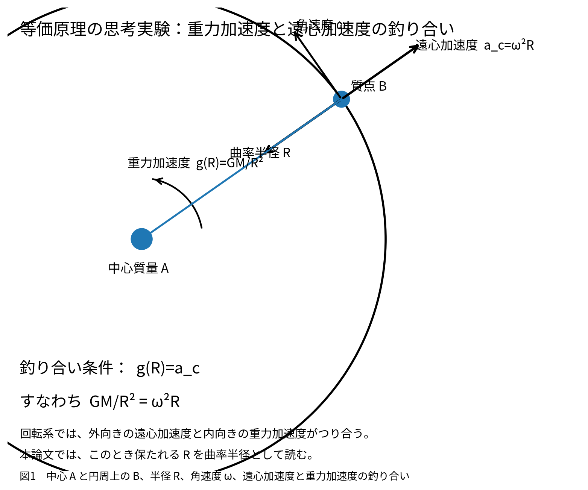
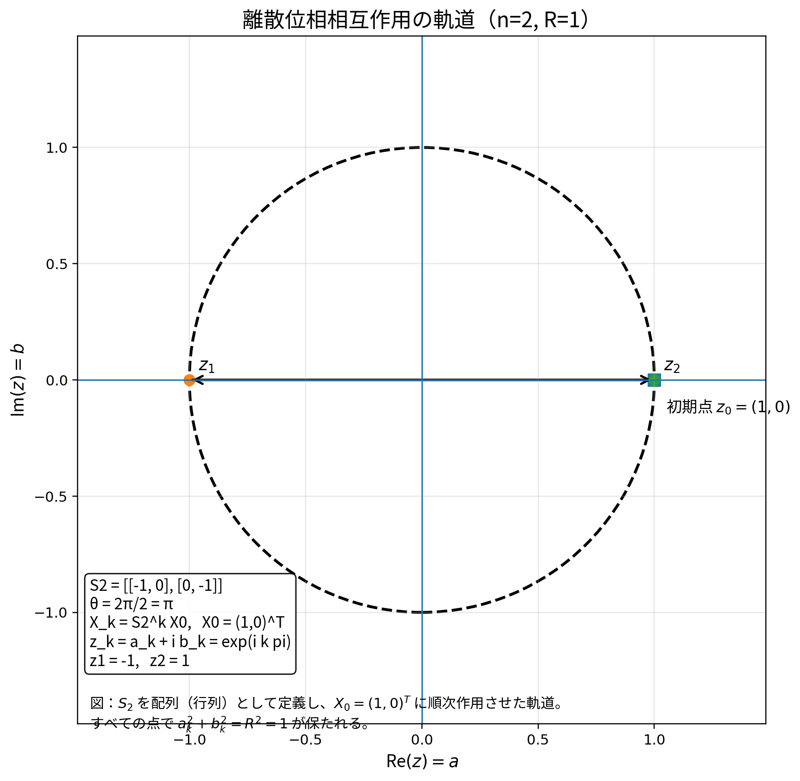
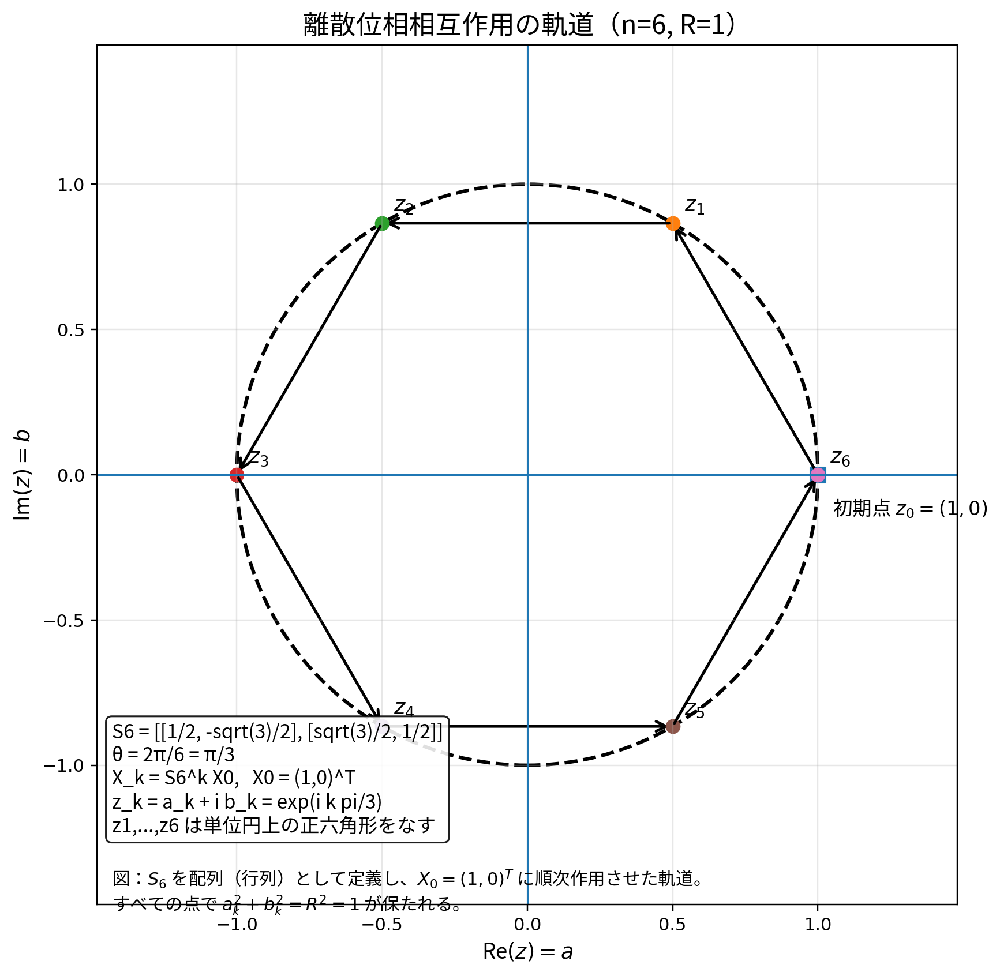

# 第一思考実験  
# 等価原理から無名な状態―関係系と二乗和曲率半径を読み出す  
## ― AIとの対話における誤推論と修正過程を含む基礎思考実験 ―

**著者**：木原範昭  
**ORCID**：0009-0004-6753-4020  
**DOI**：TBD  
**Concept DOI**：TBD  
**版**：2026-09-20 Draft 1  

---

## 要旨

本稿では、Einstein の等価原理を、背景時空・微分可能性・連続極限をできるだけ先に仮定せず、最小の関係系まで遡って再検討する。出発点は、重力加速度と回転系における遠心加速度が区別できないという古典的思考実験である。通常は、二体、距離、回転中心、時間、角速度などを最初から導入する。しかし、それらはすでに多くの背景構造を含んでいる。

そこで本稿では、さらに根本へ戻り、「状態」と「その状態に対する関係性」は本当に最初から区別可能なのか、という問いを立てる。無名性を要求すると、二つの自由度を区別すること自体は可能であっても、

$$
a=\text{state},\qquad b=\text{relation}
$$

のように役割を固定する内部的根拠は存在しない。したがって最小系は、「状態」と「関係」というラベル付き二成分ではなく、

$$
(a,b)\sim(b,a)
$$

という無名な二自由度として扱われる。

さらに、読み出しと自己相互作用を区別せず、同じ相互作用を反復したとき有限回で閉じるという条件

$$
S^n=I
$$

を考えると、相互作用軌道には

$$
\phi_k=\frac{2\pi k}{n}
$$

という離散位相構造が現れる。ここに、等価原理の思考実験から独立な自由度として曲率半径 $R$ を保持する。無名性と有限位相相互作用、および重力加速度と遠心加速度が釣り合って曲率半径が保存されるという拘束を合わせると、二次不変量として

$$
a^2+b^2=R^2
$$

が選ばれる。したがって、

$$
\sum_{n=1}^{2}z_n^2=R^2
$$

という実数二乗和の最小構成が得られる。さらに、

$$
z_3=iR
$$

を追加すれば、

$$
a^2+b^2+(iR)^2=0
$$

すなわち、

$$
\sum_{m=1}^{3}z_m^2=0
$$

という二乗和ゼロ閉塞へ直ちに移行する。

本思考実験の重要点は、単に二乗和ゼロを得ることではない。より重要なのは、

$$
\boxed{\sum z_n^2=C^2}
$$

の右辺 $C$ を、この思考実験において

$$
\boxed{C=R=\text{curvature radius}}
$$

と物理的に読む具体的構成を示した点にある。

---

## 1. 目的

本研究プロジェクトでは、既存理論を出発点として未知理論を拡張するのではなく、できるだけ少数の前提へ戻り、

- 何が本当に必要な自由度なのか
- どの仮定が外部から持ち込まれているのか
- どの量が内部関係だけから定義できるのか

を逐次確認する。

第一思考実験では、Einstein の等価原理を入口とする。古典的には、重力場による加速度と回転系における遠心加速度が局所的に区別不能であることが議論される。円運動では、

$$
a_{\mathrm c}=\omega^2R
$$

であり、重力による加速度との釣り合いを

$$
a_{\mathrm g}=a_{\mathrm c}
$$

と書ける。しかし、この記述はすでに、二つの物体、空間、距離、回転中心、時間、角速度、座標などを利用している。本思考実験では、それらを直ちに使わず、

> この実験を成立させるために本当に必要な最小構造は何か

まで遡る。

---

## 2. 二体だけの宇宙で何が観測できるか

二つの対象 $A,B$ だけを持つ系を考える。通常であれば、その間の距離を

$$
r_{AB}
$$

とする。しかし、この時点ですでに「二つの対象が存在すること」と「それらの間に距離という関係が存在すること」を仮定している。さらに深く問えば、「なぜ二つあると分かるのか」という問題が生じる。

一つのものしか存在しない系で、そのものの「状態」は単独で定義可能なのか。この問いから、

$$
\text{state}
$$

だけでは不十分であり、

$$
\text{state}+\text{relation}
$$

が必要ではないか、という検討へ進んだ。しかし、ここでもまだ隠れた仮定が残っていた。

---

## 3. 状態と関係性は本当に区別できるのか

二つの自由度を暫定的に

$$
(a,b)
$$

と書く。重要なのは、最初から

$$
a=\text{state},\qquad b=\text{relation}
$$

と決めてはいないことである。二つの自由度が異なれば、

$$
a\neq b
$$

として区別自体は可能である。しかし無名性を要求すると、

$$
(a,b)
$$

と

$$
(b,a)
$$

のどちらを採用すべきかを決める内部的根拠は存在しない。したがって、

$$
\boxed{(a,b)\sim(b,a)}
$$

と考えなければならない。これは、「二つを区別できる」ことと、「どちらが状態で、どちらが関係性であるかを区別できる」ことが異なることを意味する。したがって、現段階でより基本的なのは

$$
\boxed{\text{無名な二自由度}}
$$

である。

---

## 4. 読み出しと相互作用を分離しない

次に必要なのは、二自由度の関係を読み出す操作である。しかし外部観測者を導入すれば、再び背景を持ち込むことになる。そこで、

$$
\boxed{\text{readout}=\text{interaction}}
$$

と考える。読み出しとは、その系自身への相互作用であり、読み出せば系は変化する。系を

$$
X_k=(a_k,b_k)
$$

と書き、同じ作用 $S$ を反復する。

$$
X_{k+1}=S(X_k)
$$

とする。

---

## 5. 有限閉路

最低限、反復によって系そのものの定義が無制限に失われてはならない。最小の閉路条件を一般化すると、

$$
\boxed{S^n=I}
$$

となる。したがって、

$$
X_n=S^nX_0=X_0
$$

である。ここで $n$ は外部から与えた時間座標ではなく、同一作用が有限回で閉じるために現れた整数である。

---

## 6. $n$ による位相の離散化

有限巡回作用を位相として表現すると、

$$
U=e^{2\pi i/n}
$$

と書くことができる。したがって、

$$
U^n=1
$$

であり、

$$
U^k=e^{2\pi ik/n},\qquad k=0,1,\ldots,n-1
$$

となる。よって位相は、

$$
\boxed{\phi_k=\frac{2\pi k}{n}}
$$

と離散化される。ここで重要なのは、複素数を「状態の値」として最初から仮定したわけではないことである。虚数構造は、まず相互作用側に現れる。

---

## 7. 曲率半径 $R$ の自由度

ここで最初の等価原理の思考実験へ戻る。重力加速度と遠心加速度が釣り合う円運動では、

$$
a_{\mathrm g}=a_{\mathrm c}
$$

である。遠心加速度は、

$$
a_{\mathrm c}=\omega^2R
$$

である。この思考実験には、$a,b,n$ だけでは表されていない自由度が残っている。それが、

$$
\boxed{R}
$$

である。本稿では、これをあえて

$$
\boxed{\text{curvature radius}}
$$

と呼ぶ。ここで重要なのは、$R$ を最初からユークリッド空間内の二点間距離として定義していないことである。$R$ は、等価原理の思考実験で保たれる閉じた運動の曲率半径として導入される独立自由度である。

---

## 8. 等価原理の基本図

**図1**　中心質量 $A$ と円周上の質点 $B$、曲率半径 $R$、角速度 $\omega$、重力加速度 $g(R)$、遠心加速度 $a_{\mathrm c}$ の関係。回転系では

$$
g(R)=a_{\mathrm c}
$$

すなわち

$$
\frac{GM}{R^2}=\omega^2R
$$

が釣り合い条件になる。本稿では、このとき保たれる $R$ を曲率半径として読む。

---

## 9. $a^2+b^2$ は何か

ここで、

> この時点で $a^2+b^2$ は何か。

という問いを立てる。この問いに対し、最初に

$$
a^2+b^2=R^2
$$

と置いてしまうことはできない。それでは「半径だからピタゴラス」という既成幾何学を先に導入することになる。そこで、二次量を一般形から考える。

$$
Q(a,b)=Aa^2+2Bab+Cb^2.
$$

無名性より、

$$
Q(a,b)=Q(b,a)
$$

でなければならない。したがって、

$$
A=C
$$

であり、

$$
Q(a,b)=A(a^2+b^2)+2Bab.
$$

まだ交差項は残る。

---

## 10. 相互作用による交差項の除去

虚数作用を二実成分へ展開すると、最小の四分の一回転は、

$$
J=
\begin{pmatrix}
0 & -1\\
1 & 0
\end{pmatrix}
$$

であり、

$$
J^2=-I
$$

を満たす。作用すると、

$$
(a,b)\longmapsto(-b,a)
$$

である。等価原理の思考実験では、重力加速度と遠心加速度が釣り合った定常解として曲率半径 $R$ が保たれる。したがって、$R$ を読む二次量 $Q$ も相互作用で不変でなければならない。

$$
Q(-b,a)=Q(a,b)
$$

左辺を展開する。

$$
Q(-b,a)=A(-b)^2+2B(-b)a+Aa^2=A(a^2+b^2)-2Bab.
$$

一方、

$$
Q(a,b)=A(a^2+b^2)+2Bab.
$$

よって、

$$
A(a^2+b^2)-2Bab=A(a^2+b^2)+2Bab.
$$

したがって、

$$
4Bab=0.
$$

任意の $a,b$ に対して成立するには、

$$
\boxed{B=0}
$$

でなければならない。よって、

$$
Q(a,b)=A(a^2+b^2).
$$

尺度 $A$ を $R$ の定義へ吸収すれば、

$$
\boxed{Q(a,b)=a^2+b^2}
$$

となる。そして等価原理側から保たれていた曲率半径を $R$ と読むことで、

$$
\boxed{a^2+b^2=R^2}
$$

を得る。

---

## 11. 一般の離散位相作用での確認

一般に、

$$
\theta=\frac{2\pi}{n}
$$

とする。一回の相互作用を、

$$
a'=a\cos\theta-b\sin\theta,
$$

$$
b'=a\sin\theta+b\cos\theta
$$

と書く。すると、

$$
a'^2+b'^2
$$

は、

$$
(a\cos\theta-b\sin\theta)^2+(a\sin\theta+b\cos\theta)^2
$$

に等しい。展開すると、

$$
\begin{aligned}
a'^2+b'^2
&=a^2\cos^2\theta-2ab\sin\theta\cos\theta+b^2\sin^2\theta\\
&\quad+a^2\sin^2\theta+2ab\sin\theta\cos\theta+b^2\cos^2\theta\\
&=a^2(\cos^2\theta+\sin^2\theta)+b^2(\sin^2\theta+\cos^2\theta)\\
&=a^2+b^2.
\end{aligned}
$$

したがって、

$$
\boxed{a_k^2+b_k^2=R^2}
$$

を保ったまま、

$$
\boxed{\phi_k=\frac{2\pi k}{n}}
$$

だけが離散的に変化する。

---

## 12. 実数二乗和としての最小構成

ここで、

$$
z_1=a,\qquad z_2=b
$$

と置けば、

$$
\boxed{z_1^2+z_2^2=R^2}
$$

である。すなわち、

$$
\boxed{\sum_{n=1}^{2}z_n^2=C^2}
$$

という形に対して、

$$
\boxed{C=R}
$$

と読むことができる。これは単なる代数的定数ではない。本思考実験では、その右辺は等価原理の思考実験から得られた

$$
\boxed{\text{曲率半径}}
$$

である。

---

## 13. 二乗和ゼロ閉塞

さらに、

$$
z_3=iR
$$

と置く。すると、

$$
z_1^2+z_2^2+z_3^2=a^2+b^2+(iR)^2.
$$

すでに、

$$
a^2+b^2=R^2
$$

なので、

$$
a^2+b^2+(iR)^2=R^2-R^2=0.
$$

したがって、

$$
\boxed{a^2+b^2+(iR)^2=0}
$$

である。すなわち、

$$
\boxed{\sum_{m=1}^{3}z_m^2=0}
$$

という最小の三成分閉塞構成を得る。したがって、

$$
\boxed{\sum z_n^2=R^2\quad\Longleftrightarrow\quad \sum z_n^2+(iR)^2=0}
$$

である。

---

## 14. この思考実験で最も重要な読み

本思考実験の重要点を、

$$
\sum z_m^2=0
$$

という閉塞式そのものだけに置くと、本質を取り逃がす。より重要なのは、

$$
\boxed{\sum z_n^2=C^2}
$$

の右辺について、

$$
\boxed{C=R=\text{curvature radius}}
$$

という具体的な物理的読みが得られたことである。導出順序は、

$$
\text{equivalence principle}
\Downarrow
\text{gravity/centrifugal balance}
\Downarrow
\text{preserved curvature radius }R
\Downarrow
 a^2+b^2=R^2
\Downarrow
\sum z_n^2=R^2
$$

である。したがって右辺の物理的意味が先に存在している。

---

## 15. 対話記録から見えたAIの誤推論

本思考実験では、結論だけでなく、AIが何度も既存概念を先回りして導入し、そのたびに問いへ戻された過程自体を研究記録として保存する。これは、最小仮定による基礎物理研究において、AIがどのような方向へ自動的に補完・暴走しやすいかを示す実例でもある。

### 15.1 状態と関係性の固定そのものへの疑問

> 状態と関係性はおそらく本質的に区別不能ですよ。区別はできますが、無名性のためどちらかが状態でどちらが関係性かは判断できない。

この指摘により、

$$
a=\text{state},\qquad b=\text{relation}
$$

というラベル付き構造そのものが未導出であることが明らかになった。

### 15.2 等価原理へ戻る

> 古典論では2体の質量のある点で考えて重力相互作用と遠心力が区別不能だといっていますが、関係性の観点では距離と見える関係性一つだけですよね。今の検討から、この相互作用考えると自由度は a, b, n だけでなく半径 R（あえて曲率半径 R）と呼びます の自由が一個増えてますよ。

ここで、

$$
(a,b,n)
$$

だけではなく、

$$
\boxed{R}
$$

という独立自由度が認識された。

### 15.3 AIによる先回り

AIはここで、標準量子論や一般相対論への対応写像を先に議論し始めた。しかし、これは背景時空、微分可能性、連続極限を先に導入する誤りであると修正された。現段階で要求されるのは、既存理論に明示的に逸脱していないことだけである。

### 15.4 $a^2+b^2$ を巡る誤推論

AIは一度、

$$
a^2+b^2=R^2
$$

を「半径」という語から即断し、次には逆に「$S^n=I$ だけからは導出できない」と後退した。後者は数学的には正しいが、思考実験全体としては不十分であった。なぜなら、等価原理の拘束

$$
a_{\mathrm g}=a_{\mathrm c}
$$

を落としていたからである。この修正により、無名性・虚数位相作用・釣り合い条件を同時に用いることで、

$$
a^2+b^2=R^2
$$

が二次不変量として選ばれることが明確になった。

---

## 16. 既存理論との関係

この段階で、標準理論または一般相対性理論を完全に再構成することは本思考実験の目的ではない。また、

- 背景時空
- 微分可能多様体
- 連続極限
- 計量テンソル
- 波動関数
- エネルギー
- 時間座標

などを、この段階で追加することもしない。第一思考実験における既存理論との比較条件は一つだけである。

$$
\boxed{\text{現在までに得られた構造が、既存の標準理論および一般相対性理論から明示的に逸脱していないこと}}
$$

未接続であることは、矛盾を意味しない。

---

## 17. 第一思考実験から得られた固定点

1. 無名な二自由度

$$
\boxed{(a,b)\sim(b,a)}
$$

2. 自己相互作用

$$
\boxed{X_{k+1}=S(X_k)}
$$

3. 有限閉路

$$
\boxed{S^n=I}
$$

4. 離散位相

$$
\boxed{\phi_k=\frac{2\pi k}{n}}
$$

5. 独立した曲率半径

$$
\boxed{R}
$$

6. 等価原理による定常拘束

$$
\boxed{a_{\mathrm g}=a_{\mathrm c}}
$$

7. 二次不変量

$$
\boxed{a^2+b^2=R^2}
$$

8. 実数二乗和

$$
\boxed{\sum_{n=1}^{2}z_n^2=R^2}
$$

9. 二乗和ゼロ閉塞

$$
\boxed{\sum_{n=1}^{2}z_n^2+(iR)^2=0}
$$

したがって、

$$
\boxed{\sum_{m=1}^{3}z_m^2=0}
$$

---

## 18. 結論

Einstein の等価原理を、既成の背景時空をできるだけ使わずに最小関係系まで遡ると、最初に問題となるのは「二体」でも「距離」でもなく、

$$
\boxed{\text{状態と関係性をそもそも区別できるのか}}
$$

という問いであった。無名性を要求すると、二自由度は区別可能であっても、どちらを状態、どちらを関係性と呼ぶかは決められない。その無名な二自由度に自己相互作用を導入し、

$$
S^n=I
$$

という有限閉路を要求すると、離散位相

$$
\phi_k=\frac{2\pi k}{n}
$$

が現れる。さらに元の等価原理の思考実験へ戻ると、系には独立な曲率半径

$$
R
$$

が存在する。無名性、有限位相相互作用、および重力加速度と遠心加速度が釣り合う定常拘束を合わせることで、

$$
\boxed{a^2+b^2=R^2}
$$

が得られる。したがって、

$$
\boxed{\sum z_n^2=C^2}
$$

における $C$ を、

$$
\boxed{C=R=\text{curvature radius}}
$$

と読む具体的な最小構成が得られる。さらに、

$$
\boxed{\sum z_n^2+(iR)^2=0}
$$

より、

$$
\boxed{\sum z_m^2=0}
$$

という二乗和ゼロ閉塞が同一構造から得られる。本思考実験における主要結果は、二乗和ゼロそのものだけではない。最も重要なのは、

$$
\boxed{\sum z_n^2=C^2}
$$

という式の右辺が、少なくともこの最小思考実験では、

$$
\boxed{\text{曲率半径の二乗}}
$$

として物理的に読めることを具体的に示した点である。

---

## 参考文献

### 自己引用（最小限）

[0] 木原範昭, **実験計画シリーズ 第0論文（設計方針）**, unpublished internal design paper.

### 外部引用

[1] Einstein, A., **Das Relativitätsprinzip und die aus demselben gezogenen Folgerungen**, *Jahrbuch der Radioaktivität und Elektronik*, **4** (1907), 411–462.

[2] Einstein, A., **Die formale Grundlage der allgemeinen Relativitätstheorie**, *Sitzungsberichte der Königlich Preussischen Akademie der Wissenschaften* (1914), 1030–1085.

[3] Einstein, A., **Die Grundlage der allgemeinen Relativitätstheorie**, *Annalen der Physik*, **354**(7) (1916), 769–822. DOI: 10.1002/andp.19163540702.

[4] Norton, J. D., **What Was Einstein’s Principle of Equivalence?**, *Studies in History and Philosophy of Science Part A*, **16**(3) (1985), 203–246. DOI: 10.1016/0039-3681(85)90002-0.

---

## 付録：図生成プログラム

本論文の日本語図・英語図は、次のプログラムで自動生成した。

`generate_equivalence_principle_figures_v1.py`

生成されるファイルは以下の4点である。

- `fig01_equivalence_principle_centrifugal_gravity_ja_v1.png`
- `fig01_equivalence_principle_centrifugal_gravity_ja_v1.svg`
- `fig01_equivalence_principle_centrifugal_gravity_en_v1.png`
- `fig01_equivalence_principle_centrifugal_gravity_en_v1.svg`

---

## 付録B：数値実験（離散位相相互作用の複素平面図）

本稿の理論式を最小の配列実装として確認するため、$R=1$ に固定し、相互作用行列

$$
S_n=
\begin{pmatrix}
\cos(2\pi/n) & -\sin(2\pi/n)\\
\sin(2\pi/n) & \cos(2\pi/n)
\end{pmatrix}
$$

を配列として定義し、初期値 $X_0=(1,0)^T$ に順次作用させる数値実験を追加した。

### 付録B.1 n=2 の軌道

この場合、

$$
S_2=
\begin{pmatrix}
-1 & 0\\
0 & -1
\end{pmatrix}
$$

であり、$z_1=-1$, $z_2=1$ となる。

### 付録B.2 n=6 の軌道

この場合、

$$
S_6=
\begin{pmatrix}
\frac12 & -\frac{\sqrt3}{2}\\
\frac{\sqrt3}{2} & \frac12
\end{pmatrix}
$$

であり、$z_k=e^{ik\pi/3}$ に従って単位円上の正六角形を巡回する。

### 付録B.3 保存プログラム

この図を生成するプログラムは次である。

`generate_discrete_phase_orbits_v1.py`

詳細な導出解説は次に別紙として保存した。

`数値実験_離散位相相互作用の導出と図化_ja.md`

---

## 19. 数値実験の追加：離散位相相互作用 $S_n$ の明示的構成

本稿では、相互作用 $S$ に対して

$$
S^n=I
$$

を要請した。この条件が具体的にどのような配列（行列）として実装でき、どのような軌道を複素平面上に与えるかを、最小の数値実験として確認する。

### 19.1 実装する相互作用

複素数

$$
z=a+ib
$$

を二実成分ベクトル

$$
X=
\begin{pmatrix}
a\\b
\end{pmatrix}
$$

として表す。

$n$ 分割の離散位相相互作用は、角度

$$
\theta=\frac{2\pi}{n}
$$

だけ回転する実 $2\times 2$ 行列

$$
\boxed{
S_n=
\begin{pmatrix}
\cos \theta & -\sin \theta\\
\sin \theta & \cos \theta
\end{pmatrix}
}
$$

で与える。

初期値を

$$
X_0=
\begin{pmatrix}
R\\0
\end{pmatrix},
\qquad R=1
$$

とし、反復を

$$
X_{k+1}=S_nX_k
$$

で定義する。このとき

$$
X_k=S_n^kX_0
$$

である。

### 19.2 なぜこれで $S_n^n=I$ になるか

$S_n$ は角度 $\theta=2\pi/n$ の回転であるから、$k$ 回作用すると角度は $k\theta$ だけ加算される。したがって、$n$ 回作用したときの全角は

$$
n\theta=n\cdot\frac{2\pi}{n}=2\pi
$$

となり、一周回って元に戻る。よって

$$
\boxed{S_n^n=I}
$$

である。これは本稿で抽象的に導入した閉路条件を、実二次元回転として最も素直に実装した例である。

### 19.3 複素数表示

ベクトル表示と複素数表示は同値なので、

$$
z_k=a_k+ib_k
$$

と置けば、

$$
z_k=e^{ik\theta}z_0=e^{2\pi ik/n}z_0
$$

である。初期値を $z_0=1$ とすると、

$$
\boxed{z_k=e^{2\pi ik/n}}
$$

となる。

### 19.4 半径保存の導出

相互作用後の成分を

$$
a'=a\cos\theta-b\sin\theta,
\qquad
b'=a\sin\theta+b\cos\theta
$$

とする。すると、

$$
\begin{aligned}
a'^2+b'^2
&=(a\cos\theta-b\sin\theta)^2+(a\sin\theta+b\cos\theta)^2\\
&=a^2\cos^2\theta-2ab\sin\theta\cos\theta+b^2\sin^2\theta\\
&\quad+a^2\sin^2\theta+2ab\sin\theta\cos\theta+b^2\cos^2\theta\\
&=a^2(\cos^2\theta+\sin^2\theta)+b^2(\sin^2\theta+\cos^2\theta)\\
&=a^2+b^2.
\end{aligned}
$$

したがって、

$$
\boxed{a_k^2+b_k^2=R^2}
$$

が各ステップで保存される。ここでは $R=1$ としているため、すべての点は単位円上に並ぶ。

---

## 20. 数値実験 1：$n=2$ の場合

### 20.1 行列の明示形

$n=2$ のとき

$$
\theta=\frac{2\pi}{2}=\pi
$$

なので、

$$
S_2=
\begin{pmatrix}
\cos\pi & -\sin\pi\\
\sin\pi & \cos\pi
\end{pmatrix}
=
\begin{pmatrix}
-1 & 0\\
0 & -1
\end{pmatrix}.
$$

したがって

$$
X_{k+1}=S_2X_k
$$

は、各ステップで点を原点対称な位置へ移す。

### 20.2 軌道

初期値

$$
X_0=(1,0)^T
$$

に対して、

$$
X_1=S_2X_0=(-1,0)^T,
$$

$$
X_2=S_2X_1=(1,0)^T
$$

である。複素数表示では

$$
z_1=e^{i\pi}=-1,
\qquad
z_2=e^{i2\pi}=1.
$$

したがって、$z_1,z_2$ は単位円上の互いに反対側の2点になる。

**図2**　$S_2$ を配列（行列）として定義し、初期点 $X_0=(1,0)^T$ に順次作用させた軌道。$z_1, z_2$ は単位円上の 2 点を与え、

$$
S_2^2=I,
\qquad
a_k^2+b_k^2=1
$$

が確認できる。

---

## 21. 数値実験 2：$n=6$ の場合

### 21.1 行列の明示形

$n=6$ のとき

$$
\theta=\frac{2\pi}{6}=\frac{\pi}{3}
$$

なので、

$$
S_6=
\begin{pmatrix}
\cos\frac{\pi}{3} & -\sin\frac{\pi}{3}\\
\sin\frac{\pi}{3} & \cos\frac{\pi}{3}
\end{pmatrix}
=
\begin{pmatrix}
\frac12 & -\frac{\sqrt3}{2}\\
\frac{\sqrt3}{2} & \frac12
\end{pmatrix}.
$$

### 21.2 軌道

初期値 $X_0=(1,0)^T$ に作用させると、

$$
X_1=
\begin{pmatrix}
\frac12\\
\frac{\sqrt3}{2}
\end{pmatrix},
\quad
X_2=
\begin{pmatrix}
-\frac12\\
\frac{\sqrt3}{2}
\end{pmatrix},
\quad
X_3=
\begin{pmatrix}
-1\\
0
\end{pmatrix},
$$

$$
X_4=
\begin{pmatrix}
-\frac12\\
-\frac{\sqrt3}{2}
\end{pmatrix},
\quad
X_5=
\begin{pmatrix}
\frac12\\
-\frac{\sqrt3}{2}
\end{pmatrix},
\quad
X_6=
\begin{pmatrix}
1\\
0
\end{pmatrix}.
$$

複素数表示では

$$
z_k=e^{ik\pi/3}
\qquad (k=1,2,3,4,5,6)
$$

であり、$z_1,\ldots,z_6$ は単位円上の正六角形をなす。

**図3**　$S_6$ を配列（行列）として定義し、初期点 $X_0=(1,0)^T$ に順次作用させた軌道。$z_1,\ldots,z_6$ は単位円上の正六角形を与え、

$$
S_6^6=I,
\qquad
a_k^2+b_k^2=1
$$

が確認できる。

---

## 22. 実験結果の意味

この最小数値実験から確認できることは次の通りである。

1. 抽象的に導入した条件

$$
S^n=I
$$

は、回転行列 $S_n$ により極めて具体的に実装できる。

2. そのとき軌道は複素平面上で

$$
z_k=e^{2\pi ik/n}
$$

という離散位相列になる。

3. 各点において

$$
a_k^2+b_k^2=R^2
$$

が保存される。したがって、本稿で導いた

$$
a^2+b^2=R^2
$$

は、単なる静的関係ではなく、相互作用の反復の下で実際に保たれる不変量として確認できる。

4. $n=2$ では 2 点、$n=6$ では 6 点というように、離散位相数 $n$ がそのまま軌道の分解能を与える。

---

## 23. 追加したプログラム

本稿の追加数値実験には、以下のプログラムを用いた。

### 23.1 図1生成（等価原理の概念図）

`generate_equivalence_principle_figures_v1.py`

### 23.2 図2・図3生成（離散位相相互作用の軌道）

`generate_discrete_phase_orbits_v1.py`

このプログラムは、

- $S_n$ を $2\times 2$ 配列として定義し、
- 初期値 $X_0=(1,0)^T$ に順次作用させ、
- $n=2$ と $n=6$ の軌道をそれぞれ図化する。

生成される図ファイルは、以下の4点である。

- `fig02_discrete_phase_orbit_n2_ja_v1.png`
- `fig02_discrete_phase_orbit_n2_ja_v1.svg`
- `fig03_discrete_phase_orbit_n6_ja_v1.png`
- `fig03_discrete_phase_orbit_n6_ja_v1.svg`
