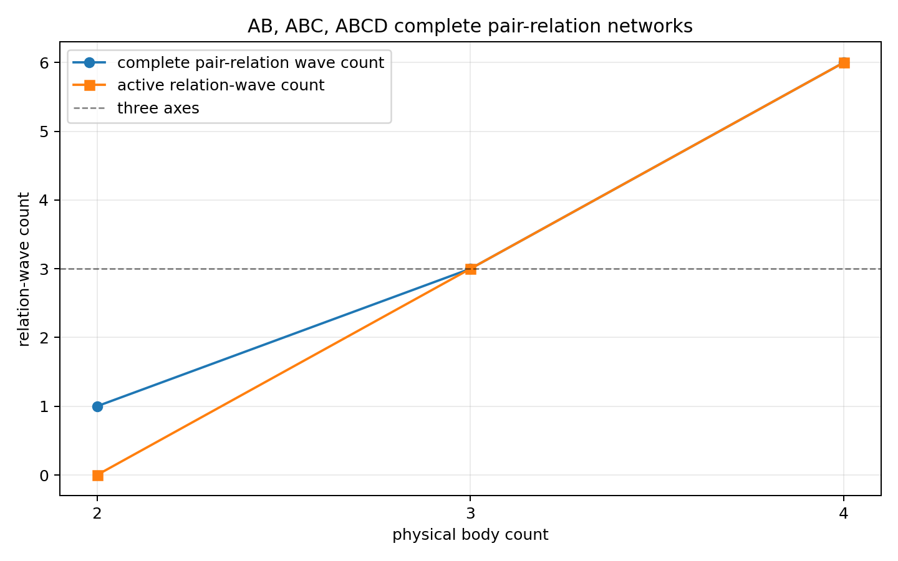
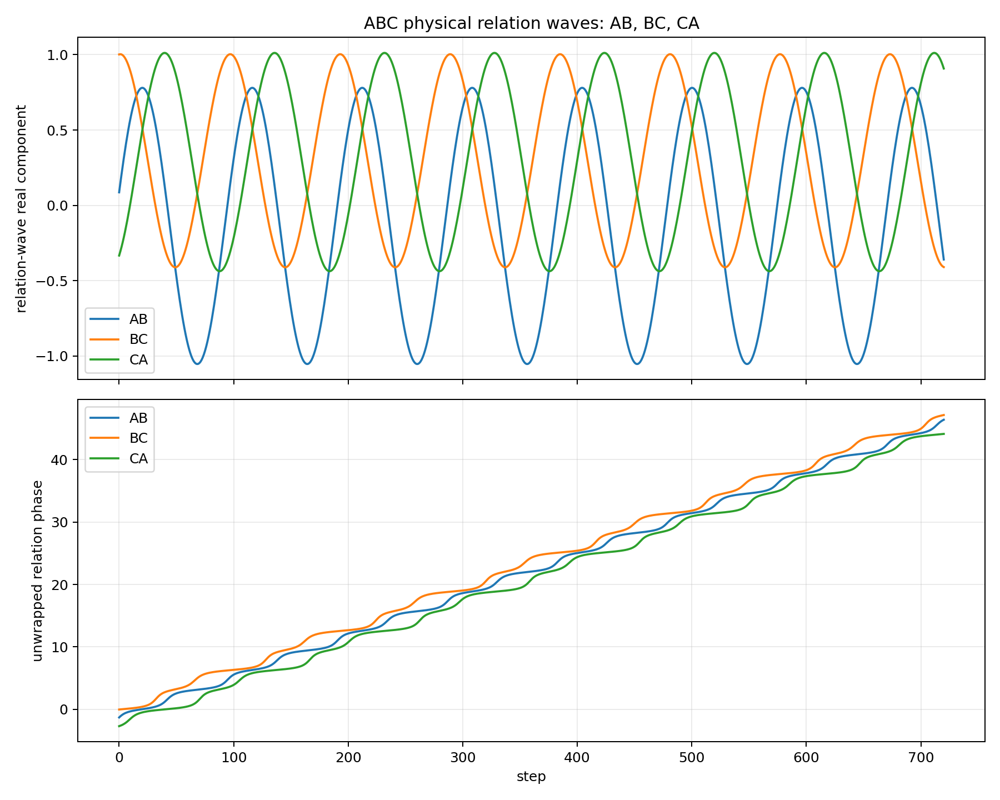
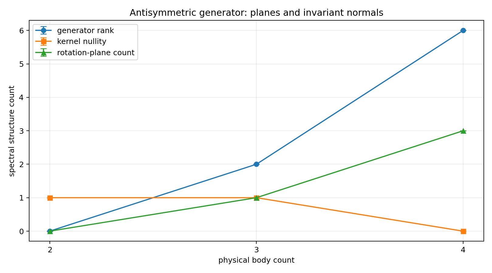
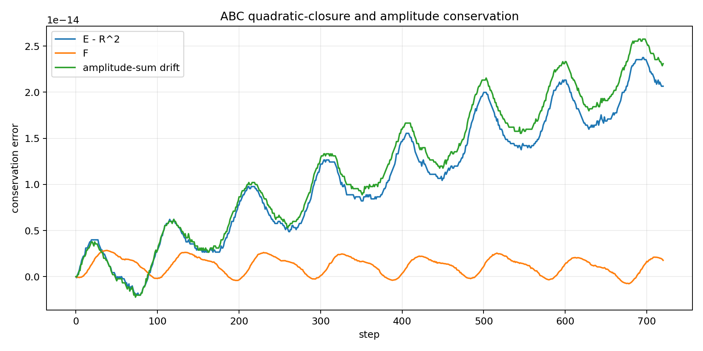

# Three XYZ Directions Read from Complete Pairwise Relational Waves
## Growth of Internal Relational Directions and Saturation of Spatial-Direction Readout in Closed AB, ABC, and ABCD Systems

**Author:** Noriaki Kihara 
**ORCID:** 0009-0004-6753-4020 
**Date:** July 20, 2026 
**Version DOI:** 10.5281/zenodo.21454790 
**Concept DOI:** 10.5281/zenodo.21454789 
**Position:** “Generative Structure of Dimensions” series, Paper 2, v1

---

## Abstract

Previous closed two-body AB phase-system studies contained only one phase-difference relation, $AB$, and examined whether position and acceleration-like readouts could be constructed from that one-dimensional relation. They did not treat phase relations corresponding to multiple spatial directions such as XY or XYZ. This paper does not assume background coordinate axes in advance. Instead, it examines whether relations readable as XY and XYZ directions can be constructed from the complete pairwise relations of an ABC three-body system and an ABCD four-body system.

For $N$ bodies, define the set of all pairwise relations by

$$
\mathcal E_N
=
\bigl\{\{i,j\}\mid 1\le i<j\le N\bigr\},
\qquad
M=\lvert\mathcal E_N\rvert=\binom{N}{2}.
$$

One complex relational wave $X_e$ is assigned to every relation $e\in\mathcal E_N$. All relational waves are physical state components; neither C nor D is used as an observer. The state is constructed to satisfy

$$
\sum_{e\in\mathcal E_N}X_e^2=R^2.
$$

Relations are coupled only when they share an endpoint. A real skew-symmetric generator is built from these shared endpoints and phase differences, and the system is evolved by the real orthogonal update obtained from its Cayley transform.

In 32 trials of 720 steps for each configuration, AB had only one relational wave and was stationary with generator rank zero. ABC had three relational waves, $AB$, $BC$, and $CA$, and all three were active in every trial. Three directions readable internally as XYZ axes emerged, but the generator rank was two: the phase relation actually read out consisted of the two XY axes. The remaining Z direction was the invariant normal determined by the XY plane and was not read out as an independent phase relation. ABCD had six relational waves; in every trial its generator had rank six, nullity zero, and decomposed into three rotation planes. Of the six internal relational directions, the three directions uniquely readable as spatial directions were XYZ, while the remaining three had no unique direction.

Across all configurations, the maximum quadratic-closure error was $1.92\times10^{-13}$, the maximum drift of the absolute-square sum was $2.42\times10^{-13}$, and the maximum label-permutation covariance error was $1.47\times10^{-13}$. No stepwise state normalization, observation damping, or absolute background axis was used.

This paper distinguishes the number of internal relational directions from the number of directions uniquely readable as spatial directions. ABC contains three directions internally, but only two phase axes, XY, are read out. ABCD contains six directions internally, but only the three XYZ axes are uniquely readable as spatial directions. This paper interprets the additional relations introduced for five or more bodies as non-uniquely oriented internal relations rather than new spatial directions beyond XYZ. Identifying the remaining directions with physical axes is outside the subject of this paper.

---

## 0. Conclusion

The previous AB two-body problem contained only one phase-difference relation, $AB$. Both position readout and acceleration-like readout were constructed from this one-dimensional relation. The present work extends the construction to the ABC three-body and ABCD four-body problems and examines the readout of phase relations corresponding to multiple spatial directions.

When complete pairwise relations are counted as independent state waves, the number of internal relational directions is

$$
M=\binom{N}{2}.
$$

Therefore,

$$
AB:1,
\qquad
ABC:3,
\qquad
ABCD:6.
$$

ABC produces the three phase relations $AB$, $BC$, and $CA$. These can be read internally as three XYZ-axis directions. Its generator, however, satisfies

$$
\operatorname{rank}K=2,
\qquad
\dim\ker K=1.
$$

The phase relation actually read out is therefore the pair of XY axes corresponding to rank two. The remaining direction is the invariant normal Z determined by the XY plane; it is not read out as an independent phase relation.

Thus the ABC relation space decomposes as

$$
\boxed{
\text{one rotation plane}
\;\oplus\;
\text{one invariant direction}
}.
$$

In the numerical experiment, all three relational waves remained active while this XY-plane/Z-normal structure, quadratic closure, absolute-square sum, and label-permutation covariance were simultaneously preserved.

ABCD produces six phase relations. Its generator satisfies

$$
\operatorname{rank}K=6,
\qquad
\dim\ker K=0,
$$

and the six directions decompose into three rotation planes. The six internal relational directions cannot all be read as independent spatial axes. The directions uniquely readable as spatial directions are the three XYZ directions; the other three do not have uniquely determined directions.

The central claim of this paper is therefore

$$
\boxed{
\text{internal relational directions increase, while}
\quad
\text{uniquely readable spatial directions stop at XYZ}
}.
$$

Increasing the number of complete pairwise relations for five or more bodies does not add new uniquely readable spatial directions. This paper reads the added relations as internal directions whose orientations are not unique. The physical-axis identities of the residual directions are outside the subject of this paper.

---

## 1. Research Question

### 1.1 Beginning with relations rather than background coordinates

One-, two-, and three-dimensional spaces are ordinarily described by the number of coordinate axes specified in advance. Such a description leaves the existence of those axes as a premise.

This paper reverses that order.

The initial objects are not spatial axes but relational waves between bodies. Two bodies AB have one relation $AB$. Three bodies ABC have three relations $AB$, $BC$, and $CA$. Four bodies ABCD have six complete pairwise relations.

The question is:

> When the system is extended from one AB relation to three ABC relations and six ABCD relations, how many phase relations readable as XY and XYZ directions can be determined uniquely?

### 1.2 The question left by the preceding AB system

The preceding closed two-body AB phase-system study showed that position and acceleration-like harmonic readouts can be constructed from the unlabeled two-body relation $AB$ without assuming a background coordinate system [2].

The AB system, however, has only one phase-difference relation. The preceding experiment therefore treated a one-dimensional relational readout and did not treat multiple phase relations corresponding to XY or XYZ directions.

The present work does not add a third observer wave. Instead, it treats every pairwise relation of ABC and ABCD as a physical relational wave of equal status.

### 1.3 What is discriminated in this paper

For each configuration, this paper determines:

1. the number of complete pairwise relational waves;
2. the number of relational waves that are active;
3. whether the three ABC relations can distinguish the two XY axes and the Z normal;
4. whether the six ABCD relations can read out three XYZ directions uniquely;
5. whether an increase in internal relations also increases readable spatial directions;
6. whether quadratic closure and the absolute-square sum are preserved; and
7. whether the result transforms covariantly under permutations of body labels.

---

## 2. Classification of Claims

Definitions, mathematical consequences, numerical facts, physical interpretations, and statements outside the subject are separated below. The use of anonymity and quadratic closure follows the preceding Basic Axiom System v4 [1].

| Object | Classification | Status in this paper |
|---|---|---|
| No absolute physical meaning is assigned to a body label | Requirement adopted from Axiom 0 | Tested by label-permutation covariance |
| $\sum_e X_e^2=R^2$ | Closure condition | Computed at every step |
| Every pairwise relation is an independent relational wave | Model definition | $M=\binom{N}{2}$ |
| Only relations sharing an endpoint are coupled | Working hypothesis | Implemented by relational adjacency |
| A real skew-symmetric generator is built from the sine of phase differences | Working hypothesis | Not derived from Axioms 0 and 1 alone |
| A real skew-symmetric generator decomposes into two-dimensional rotation blocks and a kernel | Mathematical consequence | Canonical form of a real skew-symmetric matrix |
| A nonzero ABC generator has one rotation plane and a one-dimensional kernel | Mathematical consequence | A nonzero $3\times3$ skew-symmetric matrix has rank two |
| All three ABC relational waves are active | Numerical fact | Verified in 32 trials |
| The ABCD generator has rank six | Numerical fact | Verified in 32 trials |
| Rank two in ABC is read as the two phase-readable XY axes | Spatial-direction interpretation of this paper | Two phase axes are actually read out |
| The one-dimensional ABC kernel is read as the Z normal | Spatial-direction interpretation of this paper | Third direction determined by the XY plane |
| The three ABCD rotation planes are read as XYZ | Spatial-direction interpretation of this paper | Three of the six relations are read uniquely |
| The remaining three ABCD directions | Spatial-direction interpretation of this paper | Internal relations without unique direction |
| Directions added for five or more bodies | Generalized interpretation of this paper | They increase non-unique internal directions, not XYZ |
| Physical-axis identities of the residual directions | Outside the subject | Not identified here |

---

## 3. Complete Pairwise Relational-Wave Model

### 3.1 Relation set

Consider $N$ bodies. The letters A, B, C, and D are computational identifiers and have no intrinsic physical roles.

Define

$$
\mathcal E_N
=
\bigl\{\{i,j\}\mid 1\le i<j\le N\bigr\}.
$$

The number of relations is

$$
M
=
\lvert\mathcal E_N\rvert
=
\binom{N}{2}
=
\frac{N(N-1)}{2}.
$$

The three configurations used in this paper are

$$
\begin{aligned}
\mathcal E_2&=\{AB\},\\
\mathcal E_3&=\{AB,BC,CA\},\\
\mathcal E_4&=\{AB,AC,AD,BC,BD,CD\}.
\end{aligned}
$$

Assign one complex state wave

$$
X_e=a_e+i b_e
$$

to every relation $e$ and write the full state as

$$
X=
\begin{pmatrix}
X_{e_1} & X_{e_2} & \cdots & X_{e_M}
\end{pmatrix}^{\mathsf T}
\in\mathbb C^M.
$$

The relations $AB$, $BC$, $CA$, and so on are not observation channels. They are physical state components of equal status.

### 3.2 Adjacency between relations

Two distinct relations $e,f\in\mathcal E_N$ are adjacent only when they share one endpoint:

$$
A_{ef}
=
\begin{cases}
1,
& e\ne f\ \text{and}\ e\cap f\ne\varnothing,\\
0,
& \text{otherwise}.
\end{cases}
$$

This is the line-graph construction of the complete graph $K_N$, where bodies are vertices and pairwise relations are edges [3].

The coupling is therefore determined not by the body names but only by whether two relations share an endpoint.

---

## 4. Quadratic Closure and Initial State

### 4.1 Closure condition

Define the quadratic closure of the complex relational waves by

$$
q(X)
=
X^{\mathsf T}X
=
\sum_{e\in\mathcal E_N}X_e^2
=
R^2.
$$

This is the equivalent form of zero-square-sum closure obtained by writing the closure term as

$$
(iR)^2=-R^2
$$

in

$$
\sum_{e\in\mathcal E_N}X_e^2+(iR)^2=0.
$$

The numerical experiment directly preserves the rearranged form $q(X)=R^2$.

For $X_e=a_e+i b_e$, write

$$
q(X)=E+iF,
$$

where

$$
E
=
\sum_e\left(a_e^2-b_e^2\right)
$$

and

$$
F
=
2\sum_e a_e b_e.
$$

At every step, the experiment directly tests

$$
E=R^2,
\qquad
F=0.
$$

An independent comparison quantity is the absolute-square sum

$$
H(X)
=
X^\dagger X
=
\sum_e\lvert X_e\rvert^2
=
\sum_e\left(a_e^2+b_e^2\right).
$$

The quantities $q(X)$ and $H(X)$ are not the same. The first is the sum of complex squares; the second is the sum of absolute squares.

### 4.2 Initial closed state

For $M>1$, construct real unit vectors $u,v\in\mathbb R^M$ satisfying

$$
u^{\mathsf T}u=1,
\qquad
v^{\mathsf T}v=1,
\qquad
u^{\mathsf T}v=0.
$$

The initial state is

$$
X(0)
=
\sqrt{R^2+s^2}\,u
+
i s\,v,
$$

where $s$ is the initial imaginary amplitude. Then

$$
\begin{aligned}
X(0)^{\mathsf T}X(0)
&=
(R^2+s^2)u^{\mathsf T}u
-s^2v^{\mathsf T}v
+2is\sqrt{R^2+s^2}\,u^{\mathsf T}v\\
&=R^2.
\end{aligned}
$$

Thus closure holds exactly at the initial state.

The experiment uses

$$
R^2=1,
\qquad
s=0.35.
$$

For AB, where $M=1$,

$$
X_{AB}(0)=R.
$$

---

## 5. Closure-Preserving Generator

### 5.1 Skew-symmetric generator from phase differences

Let the initial phase of a relational wave be

$$
\theta_e=\arg X_e(0).
$$

Define the unnormalized generator coupling only endpoint-sharing relations by

$$
\widetilde K_{ef}
=
A_{ef}\sin(\theta_f-\theta_e).
$$

Because $A_{ef}=A_{fe}$ and

$$
\sin(\theta_e-\theta_f)
=
-\sin(\theta_f-\theta_e),
$$

we have

$$
\widetilde K^{\mathsf T}
=
-\widetilde K.
$$

When nonzero, it is normalized by its spectral norm:

$$
K
=
\frac{\widetilde K}{\lVert\widetilde K\rVert_2}.
$$

This generator is constructed solely from relational sharing and phase differences. The particular sine-coupling rule is not derived from Axiom 0 and quadratic closure in the preceding Basic Axiom System v4 [1]. It is the closure-preserving working hypothesis used in this constructive numerical experiment.

### 5.2 Cayley update

For a real skew-symmetric generator $K$, define the one-step update by

$$
U
=
\left(I-\gamma K\right)^{-1}
\left(I+\gamma K\right),
$$

where $\gamma$ is a real coefficient determining the finite update width.

The Cayley transform of a real skew-symmetric matrix is real orthogonal [5]:

$$
U^{\mathsf T}U=I.
$$

The state update is

$$
X_{s+1}=UX_s.
$$

### 5.3 Two conserved quantities

Because $U$ is real orthogonal, the complex bilinear quadratic form satisfies

$$
\begin{aligned}
q(X_{s+1})
&=
(UX_s)^{\mathsf T}(UX_s)\\
&=
X_s^{\mathsf T}U^{\mathsf T}UX_s\\
&=
X_s^{\mathsf T}X_s\\
&=q(X_s).
\end{aligned}
$$

Since $U^\dagger=U^{\mathsf T}$, the absolute-square sum is also conserved:

$$
\begin{aligned}
H(X_{s+1})
&=
(UX_s)^\dagger(UX_s)\\
&=
X_s^\dagger U^{\mathsf T}UX_s\\
&=
X_s^\dagger X_s\\
&=H(X_s).
\end{aligned}
$$

These quantities are not preserved by renormalizing the state at every step. They are preserved by the orthogonality of the update itself.

---

## 6. Rotation Planes and Spatial-Direction Readout

### 6.1 Canonical form of a real skew-symmetric matrix

A real skew-symmetric matrix $K\in\mathbb R^{M\times M}$ can be decomposed by a real orthogonal matrix $Q$ into two-dimensional rotation blocks and a zero block [4]:

$$
Q^{\mathsf T}KQ
=
\bigoplus_{j=1}^{r}
\begin{pmatrix}
0 & -\sigma_j\\
\sigma_j & 0
\end{pmatrix}
\oplus
0_{M-2r},
\qquad
\sigma_j>0.
$$

Hence

$$
\operatorname{rank}K=2r
$$

is always even, and

$$
\dim\ker K=M-2r.
$$

Here $r$ is the number of independent rotation planes, and $\ker K$ is the set of invariant directions not moved by the generator.

### 6.2 AB

For AB, $M=1$, and there is no other relation with which the single relation can mix. Therefore,

$$
K=(0),
\qquad
\operatorname{rank}K=0,
\qquad
\dim\ker K=1.
$$

There is one invariant direction but no rotation plane. AB alone cannot construct a plane together with a normal to that plane.

### 6.3 ABC

For ABC,

$$
X=
\begin{pmatrix}
X_{AB} & X_{BC} & X_{CA}
\end{pmatrix}^{\mathsf T}
\in\mathbb C^3.
$$

The rank of a nonzero $3\times3$ real skew-symmetric matrix is even and does not exceed three. Consequently,

$$
\operatorname{rank}K=2,
\qquad
\dim\ker K=1.
$$

The ABC relation space decomposes as

$$
\mathbb R^3
=
\mathcal P_{\mathrm{rot}}
\oplus
\ker K,
$$

with

$$
\dim\mathcal P_{\mathrm{rot}}=2,
\qquad
\dim\ker K=1.
$$

Once a nonzero generator exists, the three relational directions contain one rotation plane and one invariant direction. This paper reads the rotation plane as the two phase-readable XY axes and the invariant direction as the Z normal determined by the XY plane. ABC contains three XYZ directions internally, but the independent phase relation readout is limited to the two XY axes.

### 6.4 Invariant projection

Let $P_0$ be the orthogonal projector onto $\ker K$. Then

$$
KP_0=P_0K=0.
$$

For the Cayley update,

$$
UP_0=P_0U=P_0.
$$

Therefore,

$$
P_0X_{s+1}
=
P_0UX_s
=
P_0X_s,
$$

and the kernel component is conserved.

Because $\ker K$ is one-dimensional in ABC, this conserved component determines a unique Z direction up to sign. Z is not an independent phase-relation readout; it is the normal determined by the XY plane.

### 6.5 ABCD

For ABCD, $M=6$. The rank of a real skew-symmetric generator can be

$$
0,2,4,6.
$$

In all 32 trials,

$$
\operatorname{rank}K=6,
\qquad
\dim\ker K=0,
$$

so

$$
r=3.
$$

ABCD therefore has six active relational directions that decompose into three rotation planes. This paper reads these three rotation planes as the XYZ directional readout. The remaining three internal directions depend on phase selection within the rotation planes and do not determine unique spatial directions.

---

## 7. Label-Permutation Covariance

### 7.1 Permutation action

Let $\pi$ be a permutation of body labels and $P_\pi$ the induced permutation matrix on the relational-wave space. The initial state transforms as

$$
X'_0=P_\pi X_0.
$$

Compatibility with anonymity requires

$$
K'=P_\pi K P_\pi^{\mathsf T},
$$

$$
U'=P_\pi U P_\pi^{\mathsf T},
$$

and therefore

$$
X'_s=P_\pi X_s
$$

for the complete trajectory.

### 7.2 Meaning of the test

The test verifies that relabeling A, B, C, and D changes only the component ordering of the same physical state. The implementation contains no privileged rule tied to a particular body name.

For ABC, the kernel projector is also tested for

$$
P'_0
=
P_\pi P_0P_\pi^{\mathsf T}
$$

within numerical precision.

---

## 8. Numerical Experiment

### 8.1 Conditions

| Item | Value |
|---|---:|
| Configurations | AB, ABC, ABCD |
| Trials | 32 for each configuration |
| Update steps | 720 for each trial |
| $R^2$ | 1.0 |
| Initial imaginary amplitude $s$ | 0.35 |
| Random seed | 20260720 |
| Invariant tolerance | $10^{-10}$ |
| Covariance tolerance | $10^{-10}$ |
| Activity-variance threshold | $10^{-10}$ |
| Stepwise state normalization | None |
| Observation damping | None |
| Observer-only C or D | None |
| Absolute background axis | None |

### 8.2 Quantities recorded at every step

For each state $X_s$, the experiment records

$$
E_s
=
\sum_e
\left[
(\Re X_{e,s})^2
-(\Im X_{e,s})^2
\right],
$$

$$
F_s
=
2\sum_e
(\Re X_{e,s})(\Im X_{e,s}),
$$

$$
\varepsilon_{q,s}
=
\sqrt{(E_s-R^2)^2+F_s^2},
$$

and

$$
H_s
=
\sum_e\lvert X_{e,s}\rvert^2.
$$

The computation also records generator rank, kernel dimension, number of rotation planes, number of independent rotation frequencies, activity variance of each relational wave, kernel-projection drift, and covariance errors of the generator, update matrix, and trajectory after label permutation.

### 8.3 Acceptance conditions

The experiment requires all of the following:

1. quadratic-closure error is below tolerance;
2. absolute-square-sum drift is below tolerance;
3. update-matrix orthogonality error is below tolerance;
4. the generator, update matrix, and trajectory are covariant after label permutation;
5. all three ABC relational waves are active;
6. ABC has one rotation plane and a one-dimensional kernel;
7. the ABC kernel projection is conserved; and
8. activity and spectral structure are recorded for all six ABCD relational waves.

---

## 9. Results

### 9.1 Main results by configuration

| Configuration | Relational waves | Active waves | Generator rank | Kernel dimension | Rotation planes | Independent frequencies |
|---|---:|---:|---:|---:|---:|---:|
| AB | 1 | 0 | 0 | 1 | 0 | 0 |
| ABC | 3 | 3 | 2 | 1 | 1 | 1 |
| ABCD | 6 | 6 | 6 | 0 | 3 | 3 |

Every entry in the table was the same in all 32 trials of the corresponding configuration.

### 9.2 Conserved quantities and covariance

| Configuration | Maximum closure error | Maximum absolute-square drift | Maximum orthogonality error | Maximum trajectory-covariance error |
|---|---:|---:|---:|---:|
| AB | $0$ | $0$ | $0$ | $0$ |
| ABC | $1.3628\times10^{-13}$ | $1.6809\times10^{-13}$ | $5.0984\times10^{-16}$ | $1.1776\times10^{-13}$ |
| ABCD | $1.9218\times10^{-13}$ | $2.4114\times10^{-13}$ | $8.7433\times10^{-16}$ | $1.4609\times10^{-13}$ |

Across all configurations,

$$
\max_s\lvert q(X_s)-R^2\rvert
=
1.9218001973240896\times10^{-13},
$$

$$
\max_s\lvert H(X_s)-H(X_0)\rvert
=
2.41140440948584\times10^{-13},
$$

and

$$
\varepsilon_{\mathrm{label,max}}
=
1.4608516699761366\times10^{-13}.
$$

All values are below the tolerance $10^{-10}$.

### 9.3 AB result

AB has only one relational wave, $AB$. Since there is no separate relation sharing an endpoint with it, the generator is zero and the state is stationary in all 32 trials.

A single relation cannot generate an internal rotation of relational space.

### 9.4 ABC result

ABC has three relational waves, $AB$, $BC$, and $CA$, and all three are active in all 32 trials. The ABC relation space therefore contains three directions readable internally as XYZ axes.

In every trial,

$$
\operatorname{rank}K=2,
\qquad
\dim\ker K=1.
$$

The state decomposes into one rotation plane and one invariant direction. The rank-two rotation plane is the pair of XY axes actually read out as a phase relation. The one-dimensional kernel is the Z normal determined by the XY plane and is not read out as an independent phase relation.

The maximum kernel-projection drift is

$$
4.073028073875021\times10^{-14},
$$

the maximum drift of the squared kernel-projection norm is

$$
4.718447854656915\times10^{-14},
$$

and the maximum drift of the squared active-plane norm is

$$
1.34781075189494\times10^{-13}.
$$

The maximum label-permutation covariance error of the kernel projector is

$$
7.591035761743328\times10^{-16}.
$$

Thus the Z normal is not fixed to a particular label. It is determined covariantly from the XY phase relation and the generator.

### 9.5 ABCD result

ABCD has six complete pairwise relational waves, and all six are active in all 32 trials. The ABCD relation space therefore contains six internal relational directions.

In every trial,

$$
\operatorname{rank}K=6,
\qquad
\dim\ker K=0.
$$

The motion decomposes into three rotation planes distinguished as three independent rotation frequencies. This paper reads the three rotation planes as the XYZ directional readout.

Of the six internal relational directions, the uniquely readable spatial directions are XYZ. The other three depend on phase selection within the rotation planes and do not determine unique spatial directions. ABCD therefore increases the number of internal relational directions to six while the number of readable spatial directions stops at XYZ.

---

## 10. Discussion

### 10.1 Why ABC is the minimum configuration

AB has only one relational direction and cannot construct a rotation plane.

ABC has three complete pairwise relations. A nonzero three-dimensional real skew-symmetric generator decomposes into one two-dimensional rotation plane and one one-dimensional kernel.

Thus ABC is the minimum complete pairwise relational system having

$$
\boxed{
\text{three internal XYZ directions}
=
\text{two readable XY axes}
+
\text{a Z normal determined by the XY plane}
}.
$$

The third direction is not an absolute axis specified in advance. It is the kernel of the generator acting on the three relational directions and is determined by its relation to the rotation plane.

### 10.2 A right angle is not specified in advance

The model does not first specify an orthogonal XYZ coordinate system and then define a rotation.

The initial objects are three relational waves and a skew-symmetric generator that mixes them. The two-dimensional rotation subspace $\mathcal P_{\mathrm{rot}}$ and the kernel $\ker K$ are orthogonal under the real inner product:

$$
\mathcal P_{\mathrm{rot}}
\perp
\ker K.
$$

The orthogonal relation is therefore obtained from the decomposition of relational motion rather than specified as a background spatial relation. Orthogonality in this model means orthogonality under the real inner product of relational-wave space.

### 10.3 Internal relational directions and spatial-direction readout

The number of internal relational directions is not the same as the number of directions uniquely readable as spatial directions.

| Configuration | Internal relational directions | Phase-relation readout | Spatial-direction readout |
|---|---:|---|---|
| AB | 1 | One $AB$ relation | One-dimensional |
| ABC | 3 | Two XY axes | XY axes and the Z normal determined by them |
| ABCD | 6 | Three rotation planes | Three XYZ axes |

ABC contains three relational directions, but the phase-relation readout consists of the two XY axes. The third direction Z is the normal determined by the XY plane and is not an independent phase relation.

ABCD contains six relational directions, but they do not become six spatial axes. They decompose into three rotation planes, and the uniquely readable spatial directions are XYZ. The remaining three do not have uniquely determined directions.

### 10.4 XYZ becomes readable with four bodies

AB reads one relation. ABC reads the two-axis XY phase relation and determines the Z normal from it. ABCD produces three rotation planes and reads the three XYZ directions uniquely as spatial directions.

Therefore, a relation structure readable as the three spatial XYZ directions becomes available in the ABCD four-body system.

### 10.5 What increases beyond four bodies

For five or more bodies, the number of complete pairwise relations

$$
M=\binom{N}{2}
$$

continues to grow. These added relations do not define new unique spatial axes. This paper interprets the increase as additional internal relations without unique direction; the spatial-direction readout does not exceed XYZ.

The physical-axis identities of the residual directions are outside the subject of this paper.

---

## 11. Scope of the Claims

### 11.1 Facts verified by the numerical experiment

1. Complete pairwise relations of AB, ABC, and ABCD were implemented as physical waves of equal status without observer-only waves.
2. The numbers of internal relational directions were one for AB, three for ABC, and six for ABCD.
3. All three ABC relational waves were active in every trial, and the generator had rank two and kernel dimension one.
4. All six ABCD relational waves were active in every trial, and the rank-six, zero-kernel generator decomposed into three rotation planes with three independent rotation frequencies.
5. Quadratic closure and the absolute-square sum were preserved without stepwise state normalization.
6. The generator, update matrix, trajectory, and kernel projection were covariant under label permutations.

### 11.2 Spatial-direction interpretation adopted in this paper

1. The one AB relation is a one-dimensional phase readout.
2. Rank two in ABC is the two-axis XY phase readout.
3. The one-dimensional ABC kernel is the Z normal determined by the XY plane.
4. The three ABCD rotation planes are the three XYZ directional readouts.
5. The remaining three ABCD directions are internal relations without unique direction.
6. Directions added for five or more bodies increase internal relations without adding spatial directions beyond XYZ.

### 11.3 Items not fixed in this paper

The numerical experiment covers AB, ABC, and ABCD. The statement for five or more bodies is the generalized spatial-direction interpretation of this paper.

The phase-difference sine generator is the closure-preserving working hypothesis of the model.

This paper does not assign physical-axis identities to residual directions that are not uniquely readable as spatial directions.

---

## 12. Reproducibility

The numerical results are based on the following program:

<code>次元の生成構造/対照実験_一角度円周位相調和読出し_v1/run_ab_abc_abcd_complete_pair_relation_network_preliminary_v1.py</code>

The principal outputs are:

- <code>ab_abc_abcd_complete_pair_relation_network_preliminary_result_v1.json</code>
- <code>ab_abc_abcd_complete_pair_relation_network_trial_summary_v1.csv</code>
- <code>ab_abc_abcd_complete_pair_relation_network_body_summary_v1.csv</code>
- <code>ab_abc_abcd_complete_pair_relation_network_selected_series_v1.csv</code>
- <code>ab_abc_abcd_complete_pair_relation_network_preliminary_report_v1.md</code>

They are stored in:

<code>次元の生成構造/対照実験_一角度円周位相調和読出し_v1/ab_abc_abcd_complete_pair_relation_network_preliminary_result_v1/</code>

---

## 13. Final Conclusion

The previous AB two-body problem had only one phase-difference relation, $AB$, and constructed position and acceleration-like readouts as one-dimensional relational readouts.

The present work extends the model to the ABC three-body and ABCD four-body problems and constructs relations readable as XY and XYZ directions from complete pairwise phase differences.

Without specifying background spatial axes in advance, the number of internal relational directions grows as

$$
1\longrightarrow3\longrightarrow6.
$$

In ABC, all three relational waves are active while the skew-symmetric generator decomposes as

$$
\text{one rotation plane}
\oplus
\text{one invariant direction}.
$$

ABC therefore contains three XYZ directions internally, but the phase relation actually read out consists of the two XY axes. Z is the normal determined by the XY plane and is not read out as an independent phase relation.

In ABCD, six relational waves decompose into three rotation planes. This paper reads the three rotation planes as the XYZ directional readout. Of the six internal relational directions, the remaining three have no uniquely determined directions.

Extending the system to five or more bodies increases the number of internal relational directions but does not increase the number of uniquely readable spatial directions. What increases is the number of internal relations without unique direction.

Therefore,

$$
\boxed{
\text{internal relational directions increase, while}
\quad
\text{uniquely readable spatial directions stop at XYZ}
}.
$$

The physical-axis identities of the residual directions are outside the subject of this paper.

---

## References

### Author’s related works

1. Noriaki Kihara, “Basic Axiom System of the Unnamed Equal-Amplitude Composite-Wave Model, v4,” Zenodo, 2026. Version DOI: [10.5281/zenodo.21316620](https://doi.org/10.5281/zenodo.21316620), Concept DOI: [10.5281/zenodo.21315735](https://doi.org/10.5281/zenodo.21315735).
2. Noriaki Kihara, “Preliminary Summary of Harmonic Readout and c=1 Area Sweep in an AB Two-Body Closed Phase System, v4,” Zenodo, 2026. Version DOI: [10.5281/zenodo.21374317](https://doi.org/10.5281/zenodo.21374317), Concept DOI: [10.5281/zenodo.21318696](https://doi.org/10.5281/zenodo.21318696).

### External references

3. Hassler Whitney, “Congruent Graphs and the Connectivity of Graphs,” *American Journal of Mathematics*, 54(1), 150–168, 1932. DOI: [10.2307/2371086](https://doi.org/10.2307/2371086).
4. Milan Vujivčić, Fedor Herbut, and Gradimir Vujivčić, “Canonical Form for Matrices Under Unitary Congruence Transformations. I: Conjugate-Normal Matrices,” *SIAM Journal on Applied Mathematics*, 23(2), 225–238, 1972. DOI: [10.1137/0123025](https://doi.org/10.1137/0123025).
5. Fasma Diele, Luciano Lopez, and R. Peluso, “The Cayley Transform in the Numerical Solution of Unitary Differential Systems,” *Advances in Computational Mathematics*, 8(4), 317–334, 1998. DOI: [10.1023/A:1018908700358](https://doi.org/10.1023/A:1018908700358).
