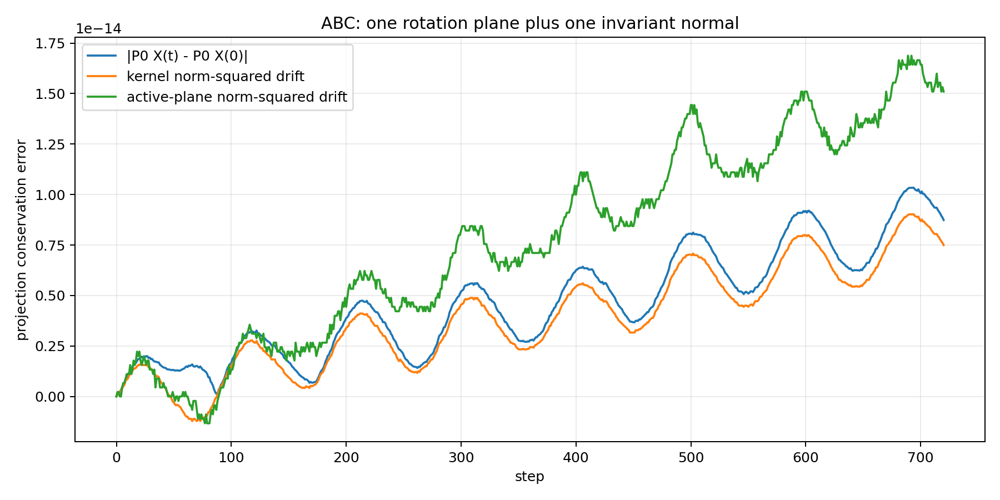

# 完全二体関係波から読み出されるXYZ三方向
## AB・ABC・ABCD閉鎖系における内部関係方向の増加と空間方向読出しの飽和

**著者:** 木原 範昭 
**ORCID:** 0009-0004-6753-4020 
**日付:** 2026年7月20日 
**Version DOI:** 取得予定 
**Concept DOI:** 取得予定 
**位置づけ:** 「次元の生成構造」シリーズ・第2論文 v1

---

## 要旨

これまでのAB二体閉鎖位相系では、位相差の関係は $AB$ の一つだけであり、その一次元的な関係から位置読出しや加速度様読出しが可能かを検討してきた。しかし、XY方向、XYZ方向に相当する複数の空間的方向の位相関係は扱っていなかった。本稿では、背景空間の座標軸を先に仮定せず、ABC三体問題およびABCD四体問題の完全二体関係から、XY方向、XYZ方向と読める位相関係を構成できるかを検討する。

$N$体から得られる全二体関係の集合を

$$
\mathcal E_N
=
\bigl\{\{i,j\}\mid 1\le i<j\le N\bigr\},
\qquad
M=\lvert\mathcal E_N\rvert=\binom{N}{2}
$$

とし、各関係 $e\in\mathcal E_N$ に一つの複素関係波 $X_e$ を対応させる。すべての関係波は物理状態の成分であり、CまたはDを観測器として使用しない。状態は

$$
\sum_{e\in\mathcal E_N}X_e^2=R^2
$$

を満たすように構成し、端点を共有する二関係だけを結ぶ実反対称生成子と、そのCayley変換による実直交更新で発展させた。

32試行、各720ステップの数値実験では、ABは一つの関係波だけを持ち、生成子ランク0の定常系となった。ABCは $AB,BC,CA$ の三つの関係波を持ち、全試行で三波すべてが活動した。内在的にはXYZ三軸方向と読める三方向が生じたが、生成子ランクは2であり、位相関係として実際に読み出せたのはXY二軸だった。残るZ方向はXY面から定まる不変法線であり、独立した位相関係としては読み出されなかった。ABCDは六つの関係波を持ち、全試行で生成子ランク6、零空間次元0、三つの回転平面へ分解した。六つの内部関係方向のうち、一意に空間方向として読めるのはXYZ三方向であり、残る三方向は一意に方向を定められなかった。

全構成を通じた二乗閉鎖誤差は最大 $1.92\times10^{-13}$、絶対値二乗和の変動は最大 $2.42\times10^{-13}$、名称置換共変性の誤差は最大 $1.47\times10^{-13}$ であった。状態の逐次正規化、観測減衰、絶対背景軸は用いていない。

本稿は、内部の関係方向数と、空間方向として一意に読み出せる方向数を区別する。ABCでは三方向が内在するが、位相関係として読めるのはXY二軸である。ABCDでは六方向が内在するが、空間方向として一意に読めるのはXYZ三軸である。本稿では、五体以上へ関係数を増やしても、増えるのは一意に方向を定められない内部関係であり、空間方向として読める関係はXYZ三方向を超えないと解釈する。残余方向が物理的にどの軸に対応するかは、本稿の対象外である。

---

## 0. 結論

これまでのAB二体問題で扱ってきた位相差の関係は $AB$ の一つだけであり、位置読出しと加速度様読出しはいずれも、この一次元的な関係から構成されていた。本稿は、この構成をABC三体問題とABCD四体問題へ拡張し、複数の空間方向に対応する位相関係を読み出せるかを検討した。

完全二体関係を独立な状態波として数えると、内部の関係方向数は

$$
M=\binom{N}{2}
$$

で与えられる。

したがって、

$$
AB:1,
\qquad
ABC:3,
\qquad
ABCD:6
$$

となる。

ABCでは $AB,BC,CA$ の三つの位相関係が生じる。これは内在的にはXYZ三軸方向と読める。しかし、生成子は

$$
\operatorname{rank}K=2,
\qquad
\dim\ker K=1
$$

となる。このため、位相関係として実際に読み出せるのは、ランク2に対応するXY二軸である。残る一方向は、XY面から定まる不変法線Zであり、独立した位相関係としては読み出されない。

したがってABC関係空間は、

$$
\boxed{
\text{一つの回転平面}
\;\oplus\;
\text{一つの不変方向}
}
$$

へ分かれる。数値実験では三つの関係波がすべて活動しながら、このXY平面・Z法線構造、二乗閉鎖、絶対値二乗和、名称置換共変性が同時に保存された。

ABCDでは六つの位相関係が生じる。生成子は

$$
\operatorname{rank}K=6,
\qquad
\dim\ker K=0
$$

となり、六方向は三つの回転平面へ分解された。六つの内部関係方向すべてを独立した空間軸として読むことはできず、空間方向として一意に読めるのはXYZ三方向である。残る三方向は一意に方向を定められない。

したがって、本稿の主張は次である。

$$
\boxed{
\text{内部の関係方向は増加するが、}
\quad
\text{一意に読み出せる空間方向はXYZ三方向で止まる}
}
$$

五体以上で完全二体関係数が増えても、それは新しい一意な空間方向を追加しない。本稿では、追加関係を方向が一意に定まらない内部方向と解釈する。残余方向が物理的にどの軸へ対応するかは、本稿の対象外である。

---

## 1. 研究課題

### 1.1 背景座標ではなく関係から始める

通常、一次元、二次元、三次元という区別は、あらかじめ与えられた座標軸の本数として記述される。しかし、この記述では、なぜその軸が存在するのかは前提に残る。

本稿では順序を逆にする。

最初に置くのは空間軸ではなく、個体間の関係波だけである。二体ABに対しては関係 $AB$ が一つ存在する。三体ABCに対しては関係 $AB,BC,CA$ が三つ存在する。四体ABCDに対しては六つの完全二体関係が存在する。

本稿の問いは次である。

> AB一関係からABC三関係、ABCD六関係へ拡張したとき、XY方向およびXYZ方向と読める位相関係をどこまで一意に読み出せるか。

### 1.2 先行AB系から残った問い

先行AB二体閉鎖位相系では、背景座標を置かず、ラベルなし二体関係 $AB$ から位置読出しと加速度様調和読出しを構成できることが確認されている［2］。

しかしAB二体から得られる位相差の関係は $AB$ の一つだけである。したがって先行実験が扱ったのは一次元的な関係読出しであり、XY方向やXYZ方向に対応する複数の位相関係は扱っていなかった。

したがって本稿では、観測用の第三波を追加するのではなく、ABCおよびABCDの全二体関係を、すべて同格の物理的関係波として追加する。

### 1.3 本稿で判別すること

本稿では、構成ごとに次を判別する。

1. 完全二体関係波はいくつ存在するか。
2. 何本の関係波が実際に活動するか。
3. ABCの三関係からXY二軸とZ法線を読み分けられるか。
4. ABCDの六関係からXYZ三方向を一意に読み出せるか。
5. 内部関係数が増えたとき、空間方向として読める方向数も増えるか。
6. 二乗閉鎖と絶対値二乗和が保存されるか。
7. 個体名を置換しても結果が共変に移るか。

---

## 2. 主張の分類

本稿では、定義、数学的帰結、数値実験事実、物理的解釈、未導出事項を区別する。無名性と二乗閉鎖の基本的な用法は、先行する基本公理系v4に基づく［1］。

| 対象 | 分類 | 本稿での位置づけ |
|---|---|---|
| 個体名に絶対的な物理的意味を与えない | 第0公理から採用する要請 | 名称置換共変性として検査 |
| $\sum_e X_e^2=R^2$ | 閉鎖条件 | 各ステップで直接計算 |
| 全二体関係を独立な関係波とする | モデル定義 | $M=\binom{N}{2}$ |
| 端点共有関係だけを結合する | 作業仮説 | 関係グラフの隣接行列で実装 |
| 位相差の正弦から実反対称生成子を作る | 作業仮説 | 第0・第1公理だけからは未導出 |
| 実反対称生成子が二次元回転ブロックと零空間に分かれる | 数学的帰結 | 実反対称行列の標準形 |
| ABCの非零生成子が一回転平面と一次元核を持つ | 数学的帰結 | $3\times3$ 実反対称行列のランクは2 |
| ABCの三関係波が全試行で活動する | 数値実験事実 | 32試行で確認 |
| ABCD生成子が全試行でランク6となる | 数値実験事実 | 32試行で確認 |
| ABCのランク2をXY二軸の位相読出しとする | 本稿の空間方向解釈 | 実際に読み出せる位相関係は二軸 |
| ABCの一次元核をZ法線とする | 本稿の空間方向解釈 | XY面から定まる第三方向 |
| ABCDの三回転平面をXYZ三方向の読出しとする | 本稿の空間方向解釈 | 六関係のうち三方向を一意に読む |
| ABCDの残る三方向 | 本稿の空間方向解釈 | 一意に方向を定められない内部関係 |
| 五体以上で増える関係方向 | 本稿の一般化解釈 | XYZを増やさず、非一意な内部方向を増やす |
| 残余方向が対応する物理軸 | 対象外 | 本稿では同定しない |

---

## 3. 完全二体関係波モデル

### 3.1 関係集合

$N$個の個体を考える。A、B、C、Dという文字は計算上の識別子であり、固有の物理的役割ではない。

全二体関係の集合を

$$
\mathcal E_N
=
\bigl\{\{i,j\}\mid 1\le i<j\le N\bigr\}
$$

とする。関係数は

$$
M
=
\lvert\mathcal E_N\rvert
=
\binom{N}{2}
=
\frac{N(N-1)}{2}
$$

である。

本稿で用いる三構成は、

$$
\begin{aligned}
\mathcal E_2&=\{AB\},\\
\mathcal E_3&=\{AB,BC,CA\},\\
\mathcal E_4&=\{AB,AC,AD,BC,BD,CD\}
\end{aligned}
$$

である。

各関係 $e$ に一つの複素状態波

$$
X_e=a_e+i b_e
$$

を対応させ、全状態を

$$
X=
\begin{pmatrix}
X_{e_1} & X_{e_2} & \cdots & X_{e_M}
\end{pmatrix}^{\mathsf T}
\in\mathbb C^M
$$

と書く。

このとき、関係波 $AB,BC,CA$ などは観測チャネルではない。すべてが同格の物理状態成分である。

### 3.2 関係どうしの隣接

二つの関係 $e,f\in\mathcal E_N$ が一つの端点を共有するときだけ、それらを隣接とする。

$$
A_{ef}
=
\begin{cases}
1,
& e\ne f\ \text{かつ}\ e\cap f\ne\varnothing,\\
0,
& \text{それ以外}.
\end{cases}
$$

これは、個体を頂点、二体関係を辺とする完全グラフ $K_N$ の線グラフに対応する構成である［3］。

重要なのは、結合が個体名そのものではなく、関係どうしが端点を共有するかどうかだけで決まることである。

---

## 4. 二乗閉鎖と初期状態

### 4.1 閉鎖条件

複素関係波全体に対し、二乗閉鎖を

$$
q(X)
=
X^{\mathsf T}X
=
\sum_{e\in\mathcal E_N}X_e^2
=
R^2
$$

とする。

これは零二乗和閉鎖に対して、閉鎖項を

$$
(iR)^2=-R^2
$$

と書いた

$$
\sum_{e\in\mathcal E_N}X_e^2+(iR)^2=0
$$

の等価な表示である。本稿の数値実験で直接保存対象とするのは、右辺へ移した表示 $q(X)=R^2$ である。

$X_e=a_e+i b_e$ と分解すると、

$$
q(X)=E+iF
$$

であり、

$$
E
=
\sum_e\left(a_e^2-b_e^2\right),
$$

$$
F
=
2\sum_e a_e b_e
$$

となる。本実験では各ステップで

$$
E=R^2,
\qquad
F=0
$$

が保たれるかを直接検査した。

比較用の独立な保存量として、絶対値二乗和

$$
H(X)
=
X^\dagger X
=
\sum_e\lvert X_e\rvert^2
=
\sum_e\left(a_e^2+b_e^2\right)
$$

も記録した。

$q(X)$ と $H(X)$ は同じ量ではない。前者は複素二乗の総和であり、後者は各成分の絶対値二乗和である。

### 4.2 初期閉鎖状態

$M>1$ の場合、実単位ベクトル $u,v\in\mathbb R^M$ を

$$
u^{\mathsf T}u=1,
\qquad
v^{\mathsf T}v=1,
\qquad
u^{\mathsf T}v=0
$$

となるように構成し、初期状態を

$$
X(0)
=
\sqrt{R^2+s^2}\,u
+
i s\,v
$$

とした。ここで $s$ は虚部の初期振幅である。

この構成から、

$$
\begin{aligned}
X(0)^{\mathsf T}X(0)
&=
(R^2+s^2)u^{\mathsf T}u
-s^2v^{\mathsf T}v
+2is\sqrt{R^2+s^2}\,u^{\mathsf T}v\\
&=R^2
\end{aligned}
$$

が初期値で厳密に成立する。

本実験では

$$
R^2=1,
\qquad
s=0.35
$$

とした。

ABの $M=1$ では、

$$
X_{AB}(0)=R
$$

とした。

---

## 5. 閉鎖保存生成子

### 5.1 位相差から作る反対称生成子

初期関係波の位相を

$$
\theta_e=\arg X_e(0)
$$

とする。

端点共有関係だけを結ぶ生成子の未規格化形を

$$
\widetilde K_{ef}
=
A_{ef}\sin(\theta_f-\theta_e)
$$

と置く。

$A_{ef}=A_{fe}$ かつ

$$
\sin(\theta_e-\theta_f)
=
-\sin(\theta_f-\theta_e)
$$

であるから、

$$
\widetilde K^{\mathsf T}
=
-\widetilde K
$$

となる。

非零の場合はスペクトルノルムで割り、

$$
K
=
\frac{\widetilde K}{\lVert\widetilde K\rVert_2}
$$

とした。

この生成子は、関係共有と位相差だけから構成される。しかし、この具体的な正弦結合則は、先行する基本公理系v4［1］の第0公理と二乗閉鎖だけから導出したものではない。本稿の構成的数値実験で用いる保存的な作業仮説である。

### 5.2 Cayley更新

実反対称生成子 $K$ から、一ステップ更新を

$$
U
=
\left(I-\gamma K\right)^{-1}
\left(I+\gamma K\right)
$$

とする。ここで $\gamma$ は有限更新幅を定める実係数である。

実反対称性 $K^{\mathsf T}=-K$ により、Cayley変換 $U$ は実直交行列となる［5］。

$$
U^{\mathsf T}U=I
$$

状態更新は

$$
X_{s+1}=UX_s
$$

とする。

### 5.3 二つの保存量

$U$ は実直交行列なので、複素双線形二乗形式は

$$
\begin{aligned}
q(X_{s+1})
&=
(UX_s)^{\mathsf T}(UX_s)\\
&=
X_s^{\mathsf T}U^{\mathsf T}UX_s\\
&=
X_s^{\mathsf T}X_s\\
&=q(X_s)
\end{aligned}
$$

と保存される。

同時に、$U^\dagger=U^{\mathsf T}$ であるため、

$$
\begin{aligned}
H(X_{s+1})
&=
(UX_s)^\dagger(UX_s)\\
&=
X_s^\dagger U^{\mathsf T}UX_s\\
&=
X_s^\dagger X_s\\
&=H(X_s)
\end{aligned}
$$

も保存される。

この保存は各ステップで状態を再正規化して得るものではない。更新行列自体の直交性から生じる。

---

## 6. 回転平面と空間方向読出し

### 6.1 実反対称行列の標準形

実反対称行列 $K\in\mathbb R^{M\times M}$ は、適切な実直交行列 $Q$ によって、二次元回転ブロックと零ブロックへ分解できる［4］。

$$
Q^{\mathsf T}KQ
=
\bigoplus_{j=1}^{r}
\begin{pmatrix}
0 & -\sigma_j\\
\sigma_j & 0
\end{pmatrix}
\oplus
0_{M-2r},
\qquad
\sigma_j>0
$$

したがって、

$$
\operatorname{rank}K=2r
$$

は必ず偶数であり、

$$
\dim\ker K=M-2r
$$

となる。

ここで $r$ は独立な回転平面の数であり、$\ker K$ は生成子によって動かされない不変方向の集合である。

### 6.2 AB

ABでは $M=1$ であり、結合相手となる別の関係波がない。

したがって、

$$
K=(0),
\qquad
\operatorname{rank}K=0,
\qquad
\dim\ker K=1
$$

である。

不変方向は一つ存在するが、回転平面が存在しない。よってABだけでは「平面と、その平面に対する法線」という構造は作れない。

### 6.3 ABC

ABCでは

$$
X=
\begin{pmatrix}
X_{AB} & X_{BC} & X_{CA}
\end{pmatrix}^{\mathsf T}
\in\mathbb C^3
$$

である。

非零の $3\times3$ 実反対称行列のランクは偶数であり、3を超えない。したがって、

$$
\operatorname{rank}K=2,
\qquad
\dim\ker K=1
$$

となる。

これは、ABC関係空間が

$$
\mathbb R^3
=
\mathcal P_{\mathrm{rot}}
\oplus
\ker K,
$$

$$
\dim\mathcal P_{\mathrm{rot}}=2,
\qquad
\dim\ker K=1
$$

へ分かれることを意味する。

つまり、非零の生成子が成立した時点で、三つの関係方向の内部に、一つの回転平面と一つの不変方向が同時に生じる。本稿では、回転平面を位相関係として読み出せるXY二軸、不変方向をXY面から定まるZ法線と読む。ABCはXYZ三方向を内在するが、独立した位相関係として読み出せるのはXY二軸である。

### 6.4 不変射影

$\ker K$ への直交射影を $P_0$ とする。

$$
KP_0=P_0K=0
$$

であるため、Cayley更新に対して

$$
UP_0=P_0U=P_0
$$

となる。したがって、

$$
P_0X_{s+1}
=
P_0UX_s
=
P_0X_s
$$

であり、零空間成分は保存される。

ABCでは $\ker K$ が一次元なので、この保存成分は符号を除いて一意なZ方向を定める。Zは独立した位相関係の読出しではなく、XY面から定まる法線である。

### 6.5 ABCD

ABCDでは $M=6$ である。実反対称生成子のランクは

$$
0,2,4,6
$$

のいずれかを取り得る。

本実験の32試行ではすべて

$$
\operatorname{rank}K=6,
\qquad
\dim\ker K=0
$$

となり、

$$
r=3
$$

個の回転平面へ分解した。

したがって、ABCDには六つの活動関係方向が存在し、それらは三つの回転平面へ分かれる。本稿では、この三回転平面をXYZ三方向の読出しとする。六つの内部関係方向のうち残る三方向は、それぞれの回転平面内の位相選択に依存し、一意な空間方向としては定まらない。

---

## 7. 名称置換共変性

### 7.1 置換作用

個体名の置換を $\pi$ とし、それが関係波空間に誘導する置換行列を $P_\pi$ とする。

状態は

$$
X'_0=P_\pi X_0
$$

と移る。

無名性と両立するなら、生成子と更新行列は

$$
K'=P_\pi K P_\pi^{\mathsf T},
$$

$$
U'=P_\pi U P_\pi^{\mathsf T}
$$

と移り、軌道全体は

$$
X'_s=P_\pi X_s
$$

を満たす必要がある。

### 7.2 本稿で検査した意味

この検査は、A、B、C、Dの文字を入れ替えても、同じ物理状態が成分順序を変えて表現されるだけであることを確認する。

この検査が確認するのは、本実装が個体名に依存する特権規則を持たず、名称置換に対して同じ物理状態を返すことである。

ABCでは、零空間射影についても

$$
P'_0
=
P_\pi P_0P_\pi^{\mathsf T}
$$

が数値精度内で成立するかを検査した。

---

## 8. 数値実験

### 8.1 条件

数値実験の条件は次である。

| 項目 | 値 |
|---|---:|
| 構成 | AB、ABC、ABCD |
| 試行数 | 各32 |
| 更新ステップ数 | 各720 |
| $R^2$ | 1.0 |
| 虚部初期振幅 $s$ | 0.35 |
| 乱数シード | 20260720 |
| 不変量判定許容差 | $10^{-10}$ |
| 共変性判定許容差 | $10^{-10}$ |
| 活動判定分散閾値 | $10^{-10}$ |
| 状態の逐次正規化 | なし |
| 観測減衰 | なし |
| 観測専用C・D | なし |
| 絶対背景軸 | なし |

### 8.2 各ステップの記録量

各状態 $X_s$ に対して、少なくとも次を記録した。

$$
E_s
=
\sum_e
\left[
(\Re X_{e,s})^2
-(\Im X_{e,s})^2
\right],
$$

$$
F_s
=
2\sum_e
(\Re X_{e,s})(\Im X_{e,s}),
$$

$$
\varepsilon_{q,s}
=
\sqrt{(E_s-R^2)^2+F_s^2},
$$

$$
H_s
=
\sum_e\lvert X_{e,s}\rvert^2.
$$

また、生成子ランク、零空間次元、回転平面数、独立回転周波数数、各関係波の活動分散、零空間射影の変動、置換後の生成子・更新行列・軌道の共変誤差を計算した。

### 8.3 合格条件

本実験では次を同時に満たすことを要求した。

1. 二乗閉鎖誤差が許容差以下である。
2. 絶対値二乗和の変動が許容差以下である。
3. 更新行列の直交誤差が許容差以下である。
4. 名称置換後の生成子、更新行列、軌道が共変である。
5. ABCでは三関係波がすべて活動する。
6. ABCでは一回転平面と一次元核が存在する。
7. ABCの零空間射影が保存される。
8. ABCDでは六関係波の活動と生成子のスペクトル構造を記録する。

---

## 9. 結果

### 9.1 構成別の主要結果

| 構成 | 関係波数 | 活動波数 | 生成子ランク | 零空間次元 | 回転平面数 | 独立周波数数 |
|---|---:|---:|---:|---:|---:|---:|
| AB | 1 | 0 | 0 | 1 | 0 | 0 |
| ABC | 3 | 3 | 2 | 1 | 1 | 1 |
| ABCD | 6 | 6 | 6 | 0 | 3 | 3 |

表の各値は、各構成32試行のすべてで一致した。

### 9.2 保存量と共変性

| 構成 | 最大二乗閉鎖誤差 | 最大絶対値二乗和変動 | 最大直交誤差 | 最大軌道置換共変誤差 |
|---|---:|---:|---:|---:|
| AB | $0$ | $0$ | $0$ | $0$ |
| ABC | $1.3628\times10^{-13}$ | $1.6809\times10^{-13}$ | $5.0984\times10^{-16}$ | $1.1776\times10^{-13}$ |
| ABCD | $1.9218\times10^{-13}$ | $2.4114\times10^{-13}$ | $8.7433\times10^{-16}$ | $1.4609\times10^{-13}$ |

全構成を通じた最大値は、

$$
\max_s\lvert q(X_s)-R^2\rvert
=
1.9218001973240896\times10^{-13},
$$

$$
\max_s\lvert H(X_s)-H(X_0)\rvert
=
2.41140440948584\times10^{-13},
$$

$$
\varepsilon_{\mathrm{label,max}}
=
1.4608516699761366\times10^{-13}
$$

であった。

これらは、設定した許容差 $10^{-10}$ より小さい。

### 9.3 ABの結果

ABには関係波 $AB$ が一つだけ存在した。端点を共有する別の関係がないため、生成子は零となり、全32試行で状態は定常だった。

これは、一つの関係だけでは関係空間内部の回転を作れないことを示す。

### 9.4 ABCの結果

ABCでは $AB,BC,CA$ の三関係波が存在し、全32試行で三波すべてが活動した。したがって、ABC関係空間にはXYZ三軸方向と読める三方向が内在する。

生成子は全試行で

$$
\operatorname{rank}K=2,
\qquad
\dim\ker K=1
$$

となり、一回転平面と一不変方向へ分解した。ランク2の回転平面が、位相関係として実際に読み出せるXY二軸である。零空間の一方向は、XY面から定まるZ法線であり、独立した位相関係としては読み出されない。

零空間射影の最大変動は

$$
4.073028073875021\times10^{-14}
$$

であり、零空間射影ノルム二乗の最大変動は

$$
4.718447854656915\times10^{-14}
$$

であった。

活動平面ノルム二乗の最大変動は

$$
1.34781075189494\times10^{-13}
$$

であった。

また、零空間射影子の名称置換共変誤差は最大

$$
7.591035761743328\times10^{-16}
$$

であった。

したがって、Z法線は特定の名称に固定された方向ではなく、XYの位相関係と生成子から共変に定まる。

### 9.5 ABCDの結果

ABCDでは六つの完全二体関係波が存在し、全32試行で六波すべてが活動した。したがってABCD関係空間には、六つの内部関係方向が存在する。

一方、生成子は全試行で

$$
\operatorname{rank}K=6,
\qquad
\dim\ker K=0
$$

となった。

したがって運動は三つの回転平面へ分解し、三つの独立回転周波数として区別された。本稿では、この三回転平面をXYZ三方向の読出しとする。

六つの内部関係方向のうち、空間方向として一意に読めるのはXYZ三方向である。残る三方向は、それぞれの回転平面内で位相選択に依存するため、一意な空間方向としては定まらない。したがってABCDでは、内部関係方向は六つへ増えるが、読み出せる空間方向はXYZ三方向で止まる。

---

## 10. 考察

### 10.1 ABCが最小構成である理由

ABは関係方向を一つしか持たず、回転平面を作れない。

ABCは三つの完全二体関係を持つ。非零の三次元実反対称生成子は、一つの二次元回転平面と一つの一次元核へ分かれる。

したがってABCは、

$$
\boxed{
\text{内在するXYZ三方向}
=
\text{読み出されるXY二軸}
+
\text{XY面から定まるZ法線}
}
$$

という構造を持つ最小の完全二体関係系である。

ここで第三方向は、先に置いた絶対軸ではない。三つの関係方向に作用する反対称生成子の零空間として、運動平面との関係から定まる。

### 10.2 「直角」を先に置いていない

本モデルは、最初にXYZ直交座標を置いてから回転を定義していない。

先にあるのは、三つの関係波と、それらを混合する反対称生成子である。生成子が作る二次元回転部分空間 $\mathcal P_{\mathrm{rot}}$ と、その零空間 $\ker K$ は、実内積に関して直交する。

$$
\mathcal P_{\mathrm{rot}}
\perp
\ker K
$$

この意味で、直交関係は背景空間の指定としてではなく、関係運動の分解から得られる。本モデルで用いる直交とは、関係波空間の実内積に対する直交である。

### 10.3 内部関係方向数と空間方向読出し数

本稿の結果は、内部に存在する関係方向数と、空間方向として一意に読み出せる方向数が同じではないことを示す。

| 構成 | 内部関係方向数 | 位相関係としての読出し | 空間方向としての読出し |
|---|---:|---|---|
| AB | 1 | $AB$ 一関係 | 一次元 |
| ABC | 3 | XY二軸 | XY二軸と、そこから定まるZ法線 |
| ABCD | 6 | 三つの回転平面 | XYZ三軸 |

ABCでは三関係方向が内在するが、位相関係として読み出せるのはXY二軸である。第三方向ZはXY面から定まる法線であり、独立した位相関係ではない。

ABCDでは六関係方向が内在するが、六本の空間軸が生じるのではない。六方向は三つの回転平面へ分かれ、空間方向として一意に読めるのはXYZ三方向である。残る三方向は一意に方向を定められない。

### 10.4 四体で空間方向がXYZまで読める

ABでは一つの関係しか読めない。ABCではXY二軸の位相関係を読み、そこからZ法線を定められる。ABCDでは三つの回転平面が成立し、XYZ三方向を空間方向として一意に読める。

したがって、空間方向的なXYZ三方向と読める関係性は、ABCD四体で読み出し可能になる。

### 10.5 五体以上で増えるもの

五体以上では完全二体関係数

$$
M=\binom{N}{2}
$$

がさらに増える。しかし、増加する関係を新しい一意な空間軸として読むことはできない。本稿では、五体以上で増えるのは方向を一意に定められない内部関係であり、空間方向として読める関係はXYZ三方向を超えないと解釈する。

残余方向が物理的にどの軸へ対応するかは、本稿の対象外である。

---

## 11. 本稿の主張範囲

### 11.1 数値実験で確認した事実

1. AB・ABC・ABCDの完全二体関係を、観測専用波なしに同格の物理波として実装した。
2. 内部関係方向数は、ABで1、ABCで3、ABCDで6となった。
3. ABCの三関係波は全32試行で同時に活動し、生成子はランク2、零空間次元1となった。
4. ABCDの六関係波は全32試行で同時に活動し、生成子はランク6、零空間次元0となり、三つの独立回転周波数を持つ三回転平面へ分解した。
5. 状態は逐次正規化なしで二乗閉鎖と絶対値二乗和を保存した。
6. 生成子、更新行列、軌道、零空間射影は名称置換に対して共変だった。

### 11.2 本稿が採用する空間方向解釈

1. ABの一関係を一次元的な位相読出しとする。
2. ABCのランク2をXY二軸の位相読出しとする。
3. ABCの一次元核をXY面から定まるZ法線とする。
4. ABCDの三回転平面をXYZ三方向の読出しとする。
5. ABCDの残る三方向を、一意に方向を定められない内部関係とする。
6. 五体以上で増える関係方向もXYZを増やさず、一意に方向を定められない内部関係を増やすとする。

### 11.3 本稿で固定しないもの

数値実験の対象はAB、ABC、ABCDである。五体以上について述べるのは、本稿の空間方向解釈を一般化した結果である。

位相差正弦型の反対称生成子は、本稿の保存的な作業仮説である。

一意に空間方向として読まれない残余方向が、物理的にどの軸へ対応するかは本稿で固定しない。

---

## 12. 再現可能性

本稿の数値実験は、次の実プログラムと出力に基づく。

### 実行プログラム

`次元の生成構造/対照実験_一角度円周位相調和読出し_v1/run_ab_abc_abcd_complete_pair_relation_network_preliminary_v1.py`

### 主要出力

- `ab_abc_abcd_complete_pair_relation_network_preliminary_result_v1.json`
- `ab_abc_abcd_complete_pair_relation_network_trial_summary_v1.csv`
- `ab_abc_abcd_complete_pair_relation_network_body_summary_v1.csv`
- `ab_abc_abcd_complete_pair_relation_network_selected_series_v1.csv`
- `ab_abc_abcd_complete_pair_relation_network_preliminary_report_v1.md`

これらは次のディレクトリに保存されている。

`次元の生成構造/対照実験_一角度円周位相調和読出し_v1/ab_abc_abcd_complete_pair_relation_network_preliminary_result_v1/`

---

## 13. 最終結論

これまでのAB二体問題では、位相差の関係は $AB$ の一つだけであり、位置読出しと加速度様読出しは一次元的な関係として構成されていた。

本稿ではABC三体問題とABCD四体問題へ拡張し、完全二体関係の位相差から、XY方向およびXYZ方向と読める関係性を構成した。

背景空間の軸を先に置かず、完全二体関係を状態波として置くと、内部関係方向数は

$$
1\longrightarrow3\longrightarrow6
$$

と増える。

ABCでは三つの関係波がすべて活動しながら、反対称生成子が

$$
\text{一回転平面}
\oplus
\text{一不変方向}
$$

へ分解した。したがって、ABCにはXYZ三方向が内在するが、位相関係として読み出せるのはXY二軸である。ZはXY面から定まる法線であり、独立した位相関係としては読み出されない。

ABCDでは六つの関係波が三つの回転平面へ分解した。本稿では、この三回転平面をXYZ三方向の読出しとする。六つの内部関係方向のうち、残る三方向は一意に方向を定められない。

五体以上へ拡張すると内部関係方向数は増えるが、一意に読み出せる空間方向は増えない。増えるのは方向を一意に定められない内部関係である。

したがって、本稿の結論は次である。

$$
\boxed{
\text{内部の関係方向は増加するが、}
\quad
\text{一意に読み出せる空間方向はXYZ三方向で止まる}
}
$$

残余方向が物理的にどの軸へ対応するかは、本稿の対象外である。

---

## 参考文献

### 自己引用

1. 木原 範昭「無名等振幅複合波モデル基本公理系 v4」Zenodo, 2026. Version DOI: [10.5281/zenodo.21316620](https://doi.org/10.5281/zenodo.21316620), Concept DOI: [10.5281/zenodo.21315735](https://doi.org/10.5281/zenodo.21315735).
2. 木原 範昭「AB二体閉鎖位相系における調和読出しとc=1面積スイープ予備実験総括 v4」Zenodo, 2026. Version DOI: [10.5281/zenodo.21374317](https://doi.org/10.5281/zenodo.21374317), Concept DOI: [10.5281/zenodo.21318696](https://doi.org/10.5281/zenodo.21318696).

### 外部文献

3. Hassler Whitney, “Congruent Graphs and the Connectivity of Graphs,” *American Journal of Mathematics*, 54(1), 150–168, 1932. DOI: [10.2307/2371086](https://doi.org/10.2307/2371086).
4. Milan Vujivčić, Fedor Herbut, and Gradimir Vujivčić, “Canonical Form for Matrices Under Unitary Congruence Transformations. I: Conjugate-Normal Matrices,” *SIAM Journal on Applied Mathematics*, 23(2), 225–238, 1972. DOI: [10.1137/0123025](https://doi.org/10.1137/0123025).
5. Fasma Diele, Luciano Lopez, and R. Peluso, “The Cayley Transform in the Numerical Solution of Unitary Differential Systems,” *Advances in Computational Mathematics*, 8(4), 317–334, 1998. DOI: [10.1023/A:1018908700358](https://doi.org/10.1023/A:1018908700358).
