# 空間・物質・時計の生成条件は一致しない——シードが粒子を生む条件と分解能の下限

**著者:** 木原 範昭（WF System Co., Ltd.）　**日付:** 2026-08-10　**版:** v1

---

## 本稿の性格

本稿は新しい力学を提案する論文ではない。前回の論文で確立した力学を一切変更せずに
読み込み専用で取り込み、**種の置き場所・種の強さ・種の位相・分解能・周期の等分数だけを
変えて**、何が起こるかを実測する論文である。

主張の数値は、保存してある走行データから独立に計算し直し、既存の記録と機械的に照合してある
（補遺E）。測定の前に予想を文書へ固定してから走らせた実験については、その旨を本文に明記した。

## 前提

前回の論文で、波の形から 62 種類の標準理論の粒子に対応しそうな波を同定することができたが、
この過程で、インフレーション実験で現れた奇数倍音の場合のみフェルミオン的な波になり、
偶数倍音の場合にはボゾン的な波になる、また、相互作用の反射率（混合率）が 0.7 前後の場合には、
フェルミオン的な状態とボゾン的な状態が混合した状態になることも分かっているが、
その機構については課題として残った。

とくに、インフレーション的な幾何級数拡大はシードを与えなくても発生したが、
粒子的な波が生まれるためにはシードが不可欠で、比較的大きな振幅のシードを与えたが、
どのようなシードがどのような粒子的な波を生むのかについても課題として残った。

また、分解能 N による影響の分析も課題として残った。

このため、本論文では、以下の課題に取り組み、一定の結果を得た。

## 本稿の結果を、確からしさで 5 つに分ける

読者が取り違えないよう、得られたものを最初に分類しておく。

**(1) 実測則として強いもの**

- 立ち上がりが、種を複素数として足した大きさの対数で決まること（R² = 0.99987）
- 出そろう時刻が、奇数の帯に置いたパワーの冪で決まること（R² = 0.996、14 点）
- 偶数の帯だけの種では、奇数の帯が厳密にゼロのままであること（42000 回 × 8 段階）
- 約数による分類が、周期の等分数を変えても追随すること（278 通り・外れ 0）

**(2) 機構まで説明できているもの**

- 立ち上がりが複素数の和で決まるのは、更新の前半が和だけを見て
  同じ回転を全部の場所にかけるからである
- 偶数の帯だけの種で何も起きないのは、相互作用の係数が
  奇数の帯と偶数の帯のパワーの比から作られており、
  奇数の帯がゼロなら係数もゼロになるからである。
  奇数の帯が現れないこと自体も、3 つの波が出会う形から偶奇の保存として出る

**(3) 経験則にとどまるもの**

- 出そろう時刻の冪 −1.073 そのもの（なぜ −1 に近いのかは説明できていない）
- 狙った場所への集中度が中間の強さで最大になること
- 分解能ごとの様相の違い
- 更新の前半が見ているのが「和」か「二乗して足した和」かは、
  実験では分けられていない（更新の手続きからは和である）

**(4) 異常として記録するが、解釈は保留するもの**

- 分解能 4 で時計の刻む速さが 9.9 倍になること
- 分解能 4 でだけ、揺れが 0.6972 を横切ること
- 分解能 8 と 10 で初期状態が作れなかったこと
- 分解能 13 と 20 で拮抗が再発すること

**(5) 現実の物理への対応仮説（本稿では検証していない）**

- 奇数の帯・偶数の帯が、フェルミオンとボゾンに対応すること
- 3 方向目の生成が、現実の空間の生成に対応すること
- 系が持つ時計が、物理的な時間に対応すること
- 種が、粒子の生成源に対応すること

**(5) はいずれも前回の論文から引き継いだ前提であり、本稿はそれを検証していない。**
本稿が実測したのは、あくまで模型の内部で何がどの条件で読み出せるかである。

---

## 測定の作法

独立した研究で最も疑われるのは、結果を見てから条件を選んでいないかである。
本稿では次の手続きを取った。

- **走らせる前に予想を文書へ固定した実験がある。**
  位相を打ち消した種の 4 条件（本文 3）節）と、周期の等分数を変えた検定（8）節）は、
  測定前に予想値を書いた文書を作ってから走らせ、そのまま的中した
- **力学は読み込み専用で取り込み、走行の前後で自身の照合値を検査している。**
  食い違えばその場で停止する
- **主張の数値は、保存データから独立に計算し直して既存の記録と照合してある**（補遺E）
- **走行ごとの記録図 462 枚を全数目視した。**
  その結果、本文の主張のうち 6 つに訂正が必要と分かり、訂正した
  （とくに 2）節の「強さの窓」は、この監査で観測時間の産物だと判明したものである）
- 走行 126 件・保存データ 1174 MB・プログラム 13 本の照合値を補遺に載せた

---

## 実験系

主張を読むために必要な範囲で、この実験が何を扱っているかを述べる。

### 点・関係・分解能

系は **N 個の点**からなる。点どうしのすべての組に**関係**があり、
関係の本数は N(N−1)/2 である。この N を**分解能**と呼ぶ。主実験では N=12、関係は 66 本である。

### 波と「場所」

**各関係は 1 個の波を持つ。ただしこの波は 1 個の複素数ではない。**
2 つの周期的な向きに沿って並んだ値の組である。
第 1 の向きは 1 周を 16 等分、第 2 の向きは 8 等分してあり、合わせて 128 個の値を持つ。

周期的な向きに沿った波は、1 周する間に位相が何回まわるかで分類できる。
この回数を**巻き数**と呼ぶ。第 1 の向きの巻き数を k、第 2 の向きの巻き数を m と書く。
128 個の値は、この (k, m) の組ごとの成分に分けて見ることができる。
本論文で**場所**というのは、この (k, m) の組のことである。場所は 128 か所ある。

**この「場所」は、波が記憶している番地ではない。**
波が 1 個の複素数ではなく分布であるから、その成分に番号が付いているだけである。

k が同じ場所をまとめたものを**帯**と呼ぶ。帯は 16 本ある。
前回の論文で、**k が奇数の帯に立つ波はフェルミオン的、偶数の帯に立つ波はボゾン的**な
振る舞いを示すことが分かっている。本論文はこの対応をそのまま引き継ぐ。
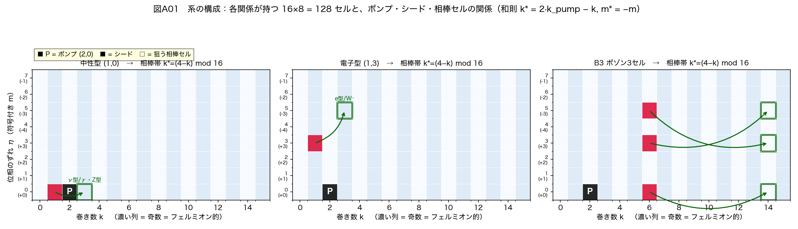

**図1　系の構成。各関係が持つ 128 か所の地図と、背景の振動（黒）・種（赤）・種が狙う相手の場所（緑枠）の関係。濃い列が奇数の帯である。**

### 背景の振動とシード

実験を始める前に、場所 (k=2, m=0) に大きな振幅の波を置く。これを**背景の振動**と呼ぶ。
背景の振動はすべての条件で共通であり、後述の「シードなし」の場合にも置かれる。
**シードを与えなくてもインフレーション的な拡大が起こるのは、この背景の振動があるためである。**

そのうえで、指定した場所に小さな振幅を足す操作を**シード**（種）と呼ぶ。
足す振幅の大きさを**種の強さ**、足す場所の組を**種の置き場所**と呼ぶ。

### 更新と、外から数える回数

系は離散的な更新を繰り返す。**本論文に秒は存在せず、時間はすべて更新の回数で測る。**
この回数は、我々が外から数えている目盛りであって、系の中にあるものではない。

1 回の更新は 2 段からなる。前半は、各関係について
**128 か所の値を複素数として全部足した和**を作り、その和の偏角から回転を決めて、
**その同じ回転を 128 か所すべてに施す**。後半は、3 つの波が出会って別の波を作る相互作用である。
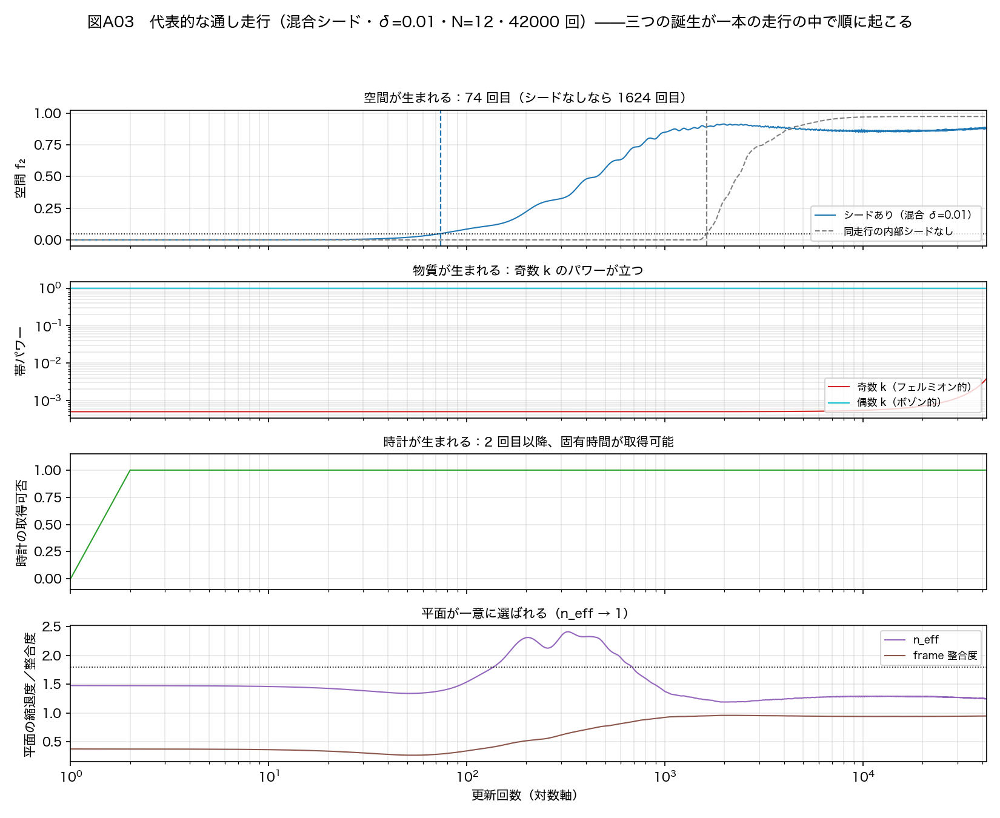

**図2　代表的な 1 本の走行（混合 8 か所・強さ 0.01・分解能 12・42000 回）。空間・物質・時計がこの順に生まれ、最後に平面が 1 枚に決まる。**

### 時計——系が自分で持つ時間

系が育っていくと、ある時点から、**全体が形を変えずに一定の角度ずつ回る**状態になる。
この状態になると、系の状態そのものから「1 回の更新あたり何度回ったか」を読み取れる。
**これが系にとっての時間の刻みであり、本論文ではこれを時計と呼ぶ。**

読み取れる条件は 2 つある。直前の状態との重なりが一定の下限を超えていること、
そして回転を担っている成分の振幅が一定の下限を超えていることである。
この 2 つが揃った最初の更新回数を、**時計が生まれた**と言う。

**外から数える更新回数と、系が持つこの時計は別物である。**
「時計が 2 回目に生まれた」とは、外の目盛りで 2 回更新したところで、
系の中に時間の刻みが現れた、という意味である。

### 凝縮体

背景の振動が置かれた場所では、集まっている値どうしの位相がそろい、
**それらを二乗して足すとゼロに落ちる**（打ち消し合う）。この状態を**凝縮体**と呼ぶ。
粒子的な波は、この塊を土台にして生まれる。
本論文では、打ち消し残りが 10⁻⁵ を下回っているとき「凝縮体ができている」とする。

### 3 方向目

背景の振動の分布は、はじめ 1 枚の平面の中に収まっている。
そこから平面の外へはみ出す成分が育つと、**3 方向目**が立つ。
はみ出した割合が 5% を超えた最初の更新回数を、**空間が生まれた**と言う。

ただし「はみ出した」だけでは 3 方向目の向きは決まらない。
はみ出す先の平面が 2 枚以上拮抗していると、どちらを基準に取るかが定まらないからである。
基準の平面が 1 枚に決まっている度合いを別に測り、それが一定の値を超えているとき
**3 方向目が定まった**とする。
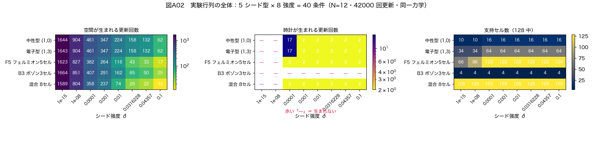

**図3　主実験の全体。5 通りの種の置き方 × 8 段階の強さ = 40 条件を、同じ力学・同じ分解能・同じ更新回数で走らせた。赤い「—」は生まれないことを表す。**

---

## 1）シードの形で、生まれる粒子の種類をある程度制御できることがわかった

第 1 の向きの巻き数 k を同じにして、**第 2 の向きの巻き数 m だけを変えた 2 種類の種**を、
同じ強さで置いて比べた。一方は狙う相手が電荷のない波（ニュートリノ型）になる場所、
もう一方は狙う相手が電子型の波になる場所である。

インフレーションが立ち上がる更新回数も、時計が生まれる更新回数も、
**8 段階の強さのうち 7 段階で完全に一致した**。
いちばん弱い 1 段階でのみ 1 回だけずれたが、その強さでは種なしの場合と区別がつかない。

**それでいて、生まれた波が占める場所は 16 か所と 64 か所に分かれた。**
電子型では、第 1 の巻き数が偶数なら第 2 の巻き数も偶数、
第 1 が奇数なら第 2 も奇数、という市松模様になった。

すなわち**「いつ生まれるか」と「何が生まれるか」は別々に決まる**。
前者は種の置き場所に鈍感で、後者は置き場所で決まる。
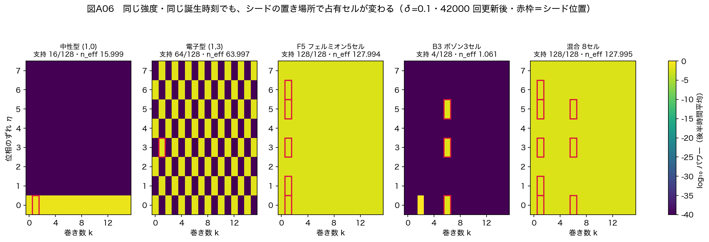

**図4　5 通りの種の置き方による、波が占める場所の違い（強さ 0.1・42000 回更新後）。赤枠が種の位置。ニュートリノ型は 16 か所、電子型は市松状の 64 か所、偶数の帯 3 か所の種は 4 か所だけである。**

### 狙ったとおりに生まれるのは、中間の強さのときだけである

狙った場所のパワーを、狙っていない場所のパワーで割って、
「狙った場所にどれだけ集中して入ったか」を測った。

| 種の強さ | 10⁻⁸ | 10⁻⁴ | **10⁻³** | 10⁻² | 0.03 以上 |
|---|---:|---:|---:|---:|---:|
| 集中度 | ほぼ 0 | 0.009 | **1 万倍** | 2 千倍 | 0.08 |

**種が強すぎると、波は 128 か所すべてに広がってしまい、狙いが利かなくなる。**
狙いが最もよく利くのは強さ 10⁻³ 付近で、そこでは狙った場所に 1 万倍集中する。
強くしていくと、この集中度は 6 桁落ちる。

この集中度は分解能によっても 120 倍変わる（N=3 で 57 倍、N=20 で 0.47 倍）。
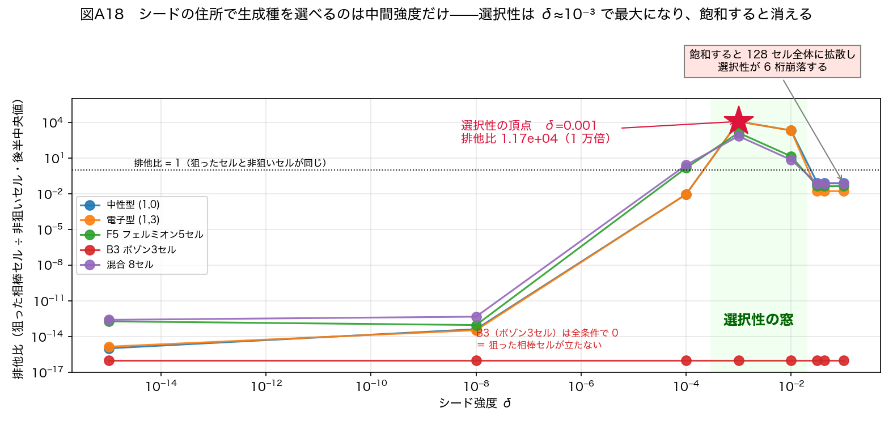

**図5　狙った場所への集中度は強さ 10⁻³ 付近で最大になり、強くすると 6 桁落ちる。**

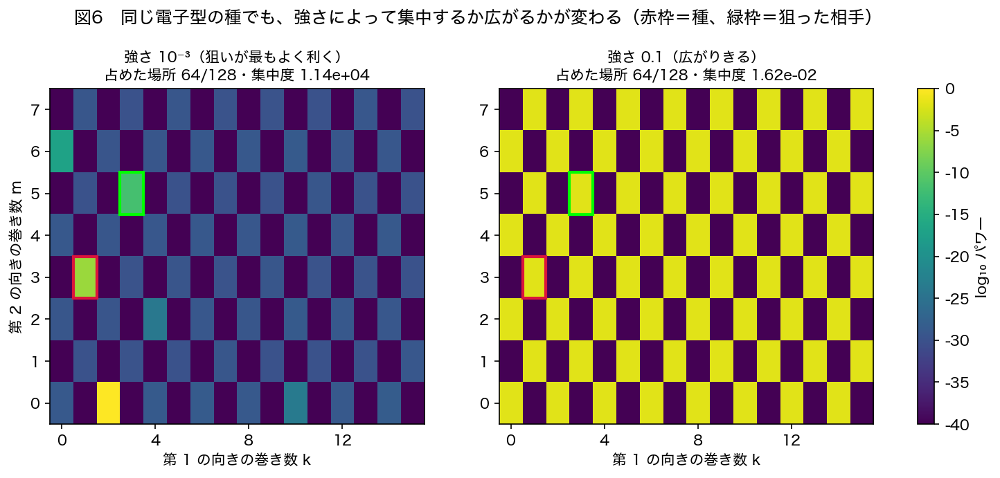

**図6　集中しているとき（強さ 10⁻³）と、広がりきったとき（強さ 0.1）の 128 か所の地図。同じ電子型の種である。**

---

## 2）シードの振幅には一定の幅があるように見えるが、それは観測時間の長さが作る見かけである

42000 回の更新までしか見なければ、弱すぎるとインフレーションは起こり 3 方向も現れるが
粒子的な波ができず、強くすると粒子的な波ができ、それ以上強くしても頭打ちになる、と見える。

ところが更新を 300000 回まで延ばしたところ、
**42000 回では「何も起きない」と見えていた強さ 10⁻² でも、262,751 回目に
粒子的な波が一気に立ち上がった**。効かないのではなく、効くまでに時間がかかっていた。

粒子的な波が出そろうまでの回数を、種の強さごとに測るとこうなる。

| 種の強さ | 10⁻³ | **10⁻²** | 0.03 | 0.044 | 0.1 |
|---|---:|---:|---:|---:|---:|
| 出そろうまでの更新回数 | 42000 回では未了 | **262,751** | 25,760 | 13,391 | 2,352 |

測った範囲では境目のような強さは現れず、次の経験則で滑らかにつながる。

    出そろうまでの回数 ∝（種のうち奇数の帯に置いたパワーの合計）の −1.073 乗
    当てはまりの良さ R² = 0.996（14 点）

この経験則をそのまま外挿すると、奇数の帯に置くパワーをゼロに近づける極限で
出そろうまでの回数は無限に発散する。**したがって、有限の観測時間で見るかぎり、
見かけの下限は必ず生じる。** 実際、奇数の帯にまったく置かない種（パワーが厳密にゼロ）は、
どの強さでも永久に出そろわない。

ただし、**あらゆる非ゼロの種が無限時間の極限で必ず出そろうことを示したわけではない。**
示したのは、42000 回で閾値に見えたものが 300000 回で崩れたことと、
測定できた 14 点がこの冪則に乗ることである。

**測った範囲では、種の強さは粒子的な波ができるかどうかではなく、
できるまでの時間を決めている。**

出そろう前と後では、できる波の量が質的に違う。

- 出そろう前は、奇数の帯にある量が**投入した分ちょうど**（置いた種のパワーそのまま）
- 出そろった後は、**奇数の帯と偶数の帯がほぼ半々**になる

「弱すぎると粒子的な波ができない」という下限についても、
同じく観測時間の産物である可能性が高い。長時間の走行で確かめる必要がある（未実施）。
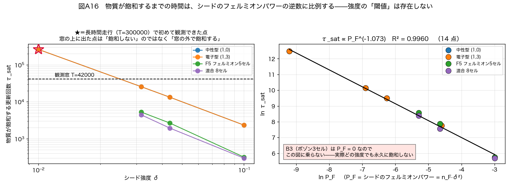

**図7　粒子的な波が出そろうまでの回数。★は 300000 回の走行で初めて観測できた点である。42000 回の線より上に出た点は、出そろわないのではなく、その線の外で出そろう。右は、奇数の帯に置いたパワーに対して整理したもの。**

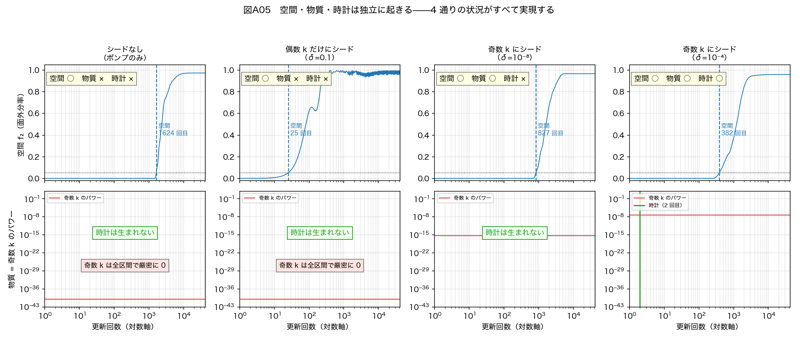

**図8　空間・物質・時計は独立に起きる。4 通りの組み合わせがすべて実現する。**

---

## 3）シードの強さにより、インフレーションの立ち上がりまでの助走期間が変わることがわかった

助走期間は、種の強さの対数に比例して短くなる。

    助走期間 = 9.892 − 48.611 × ln（種を複素数として足し合わせた大きさ）
    当てはまりの良さ R² = 0.99987

ここで効いているのは、**種のパワーの合計ではなく、種を複素数として足し合わせた大きさ**である。
パワーの合計で整理すると、ずれが 7.7 倍に悪化する。

これは更新の仕組みから出る。更新の前半は
**128 か所の値を複素数として全部足した和だけを見て**、同じ回転を全部の場所にかける。
したがって、和が同じ 2 つの初期状態は、前半では区別できない。

これを直接試した。種のパワーも置き場所も一切変えず、
**位相だけを打ち消し合うように置いた**。和だけがゼロになる。
そして「偶数の帯に種を持たない場合と、更新回数まで一致するはずだ」と
**測る前に予告し、4 つの強さすべてで 1 回単位で的中した**。

| 種の強さ | 通常の種 | 位相を打ち消した種 | 偶数の帯に種を持たない場合 |
|---:|---:|---:|---:|
| 0.01 | 74 | **116** | 116 |
| 0.03 | 29 | **43** | 43 |
| 0.044 | 22 | **33** | 33 |
| 0.1 | 12 | **17** | 17 |
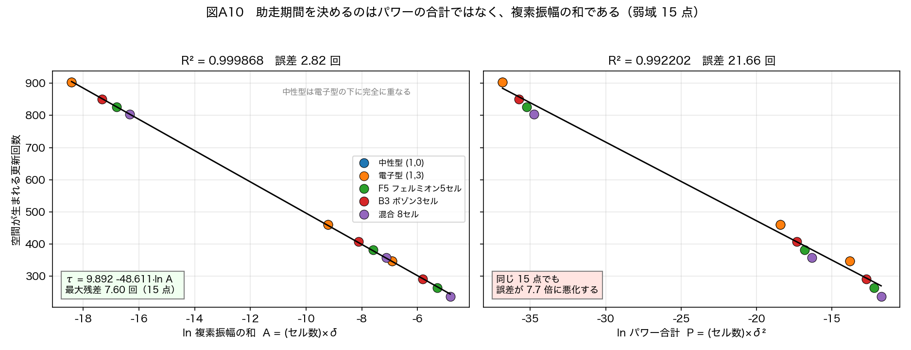

**図9　助走期間。左は種を複素数として足した大きさで整理した場合、右は同じ 15 点をパワーの合計で整理した場合。**

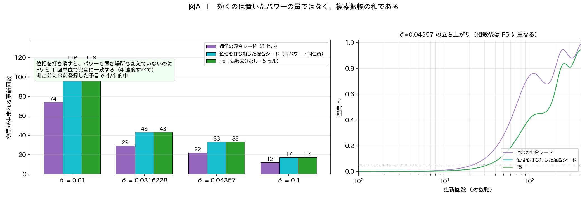

**図10　位相を打ち消した種の対照。パワーも置き場所も変えていないのに、偶数の帯に種を持たない場合と 1 回単位で一致する。**

### この対照実験だけでは、和と二乗の和を区別できない

位相を打ち消すのに用いたのは、同じ振幅で位相を 0・2π/3・4π/3 とした 3 つ組である。
この配置は複素数として足した和をゼロにするが、**同時に、二乗して足した和もゼロにする**
（どちらも 10⁻¹⁵ 程度）。

したがって**この実験だけでは、更新の前半が見ているのが
「和」なのか「二乗して足した和」なのかを区別できない。**
本稿が和だと述べているのは、更新の手続きそのものが
和の偏角しか使っていないことによる。実験はそれと矛盾しないが、
実験単独で和を選び出したわけではない。

区別するには、和はゼロだが二乗の和はゼロでない配置
（たとえば位相差 π の 2 つ組）を別の腕として走らせる必要がある。本稿では行っていない。

### 複素数として足した大きさが効くのは、立ち上がりについてだけである

2）で述べた「粒子的な波が出そろうまでの回数」のほうは、パワーの合計で決まる。
同じ系に、性質の違う二つの決まり方が同居している。

| 何を見るか | 決めているのは | 効く量 |
|---|---|---|
| インフレーションの立ち上がり | 更新の前半 | 複素数として足した**和** |
| 粒子的な波が出そろう時刻 | 更新の後半 | **パワー**の合計 |

前半は和だけを見る。後半は、奇数の帯と偶数の帯のパワーの比から作った係数に比例する。
だから見る現象によって効く量が変わる。

偶数の帯だけに種を置いた場合が、この二つを同時に満たしている。
奇数の帯のパワーがゼロなので出そろう時刻は無限（実際どの強さでも永久に出そろわない）、
一方で立ち上がりのほうは、複素数として足した大きさの直線に乗る。
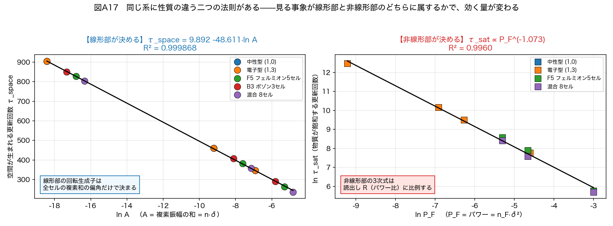

**図11　同じ系にある二つの決まり方。左は更新の前半が決める立ち上がり、右は後半が決める出そろう時刻。**

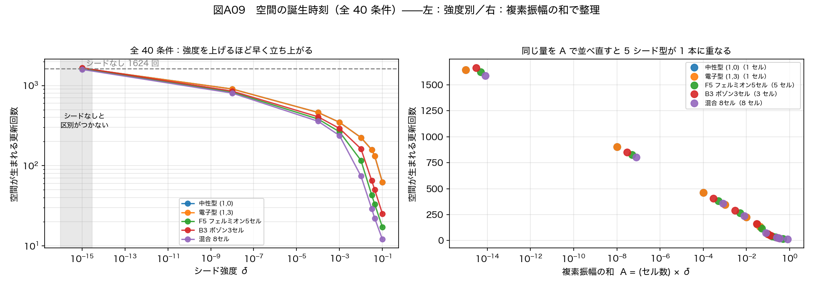

**図12　立ち上がりの更新回数（40 条件すべて）。右のように複素数として足した大きさで並べ直すと、5 通りの種の置き方が 1 本に重なる。**

---

## 4）分解能 N には最低があり、N＝1, 2 では、インフレーションも 3 方向も現れなかった

N=1 では点どうしの関係が 1 本もなく、N=2 では 1 本しかないため、系そのものが作れない。

### 分解能に特異な値があり、N=3, 4 では 3 方向目が定まらない

**N=3 と N=4 では、基準にすべき平面が拮抗して 1 枚に決まらないため、3 方向目が定まらない。**
N=3 では 3 枚が、N=4 では 2 枚が拮抗する。しかもこの拮抗は
**最後まで落ち着かず、全区間にわたって揺れ続ける**。定常状態が無い。

N=5, 6 はまた別の様相で、**静かな期間と激しく揺れる期間が交替する**。
N=7 以上でようやく 1 枚が卓越する。

**N=8 と N=10 では初期状態そのものが作れなかった。**
ただしこれは、実装が 1 回試して失敗したら中断する仕様のためであり、
構造的に不可能だと確かめたわけではない（未検証）。

**種は、この拮抗を解く方向に働く。** 作れた 16 通りの分解能のうち、
拮抗している分解能の個数は、種なしで 8 個、1 か所に種を置くと 4 個、
8 か所に置くと 2 個に減る。ただし **N=3 と N=4 だけは、どれだけ種を置いても解けない**。

「拮抗している分解能では助走が長い」という関係はなかった。両者は別々の性質である。
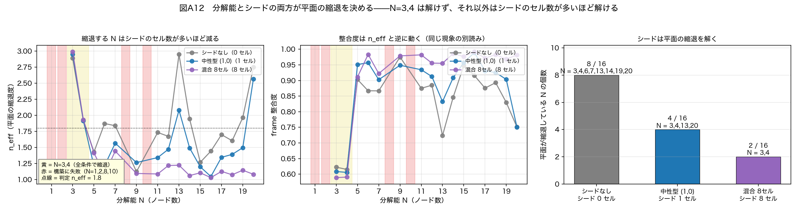

**図13　分解能と種による平面の拮抗。黄は N=3, 4（どの条件でも拮抗）、赤は初期状態が作れなかった分解能。右は、種を多く置くほど拮抗する分解能が減ることを示す。**

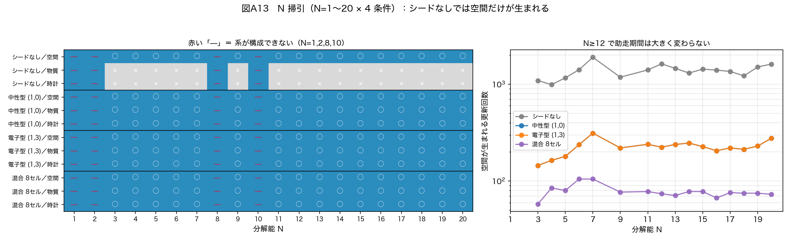

**図14　分解能 1〜20 での 4 条件の判定。種なしの行は空間だけが○で、物質と時計はすべての分解能で×である。**

### N=4 だけに現れた 3 つの異常

1. 平面が 2 枚拮抗して 3 方向目が定まらない
2. **時計の刻む速さが、他の分解能の 9.9 倍になる**
3. **前論文で出た特別な値 0.6972 を、読み出しが唯一横切る分解能である**

126 通りの走行すべてを調べたところ、この値を越えたのは
**N=4 に 1 か所だけ種を置いた 2 走行のみ**で、到達した最大値は 0.8019 だった。
ニュートリノ型と電子型でこの値が 12 桁一致している。
最も近づいたときの差は 0.0000068（相対 0.001%）である。

ただし、越えるだけで留まらない。この値の ±0.001 の範囲に入っていたのは
42000 回のうち**わずか 9 回**である。N=4 では波が出そろったあと激しく揺れ続けており、
その揺れが偶然この値を横切る瞬間があるにすぎない。
N=12 では最大 0.6786 で、この値に 2.7% 手前までしか届かない。
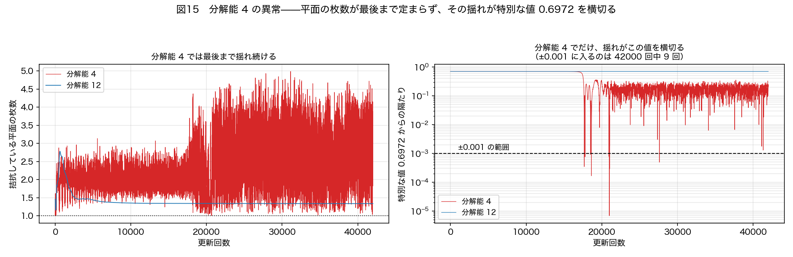

**図15　分解能 4 の異常。平面の枚数が最後まで揺れ続け（左）、その揺れが特別な値 0.6972 を横切る（右）。**

### 分解能 N ≥ 12 以降は N=20 まで試験をおこなったが、おおむね大きな挙動の変化はなかった

助走期間は 206〜277 回の範囲に収まり、単調な傾向はない。

**ただし例外が 2 つある。** N=13 と N=20 では平面の拮抗が再発する。
とくに **N=20 では 3 方向目が定まらない**。

### 波が出そろったあとは、平面はふたたび定まらなくなる

「N=7 以上で 1 枚が卓越する」は、粒子的な波が出そろう前の話である。
出そろったあとは、どの分解能でも平面の枚数が揺れ続ける。

---

## 5）「生まれる」は 4 つではなく 6 つあり、強い種は後の 2 つを壊す

本実験が判定しているのは、次の 6 つである。

系が作れたか／**空間が生まれたか**（3 方向目が立つ）／**物質が生まれたか**（奇数の帯に波が現れる）／
**時計が生まれたか**（系が自分の時間を読み出せる）／**3 方向目が定まったか**／
**凝縮体ができているか**。

種を強くしていくと、**前の 4 つは増えるが、後の 2 つは失われる**。

| 種の強さ | 空間 | 物質 | 時計 | 3 方向目が定まる | 凝縮体 |
|---:|:--:|:--:|:--:|:--:|:--:|
| 10⁻¹⁵、10⁻⁸ | ○ | ○ | **×** | ○ | ○ |
| 10⁻⁴、10⁻³ | ○ | ○ | ○ | ○ | ○ |
| 10⁻² | ○ | ○ | ○ | ○ | **×**（種を多く置いた場合） |
| 0.03 以上 | ○ | ○ | ○ | **×** | **×** |

**強い種は、物質と時計を生む代わりに、3 方向目の確かさと凝縮体を壊す。**
単純に生まれていくのではなく、引き換えになっている。

さらに、更新を 300000 回まで延ばすと、**強さ 10⁻² でも最後には凝縮体が壊れる**。
42000 回で凝縮体ありと見えていたのは、まだ壊れる前だっただけである。
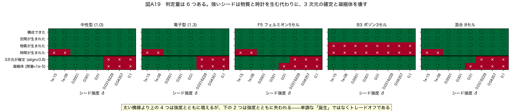

**図16　6 つの判定。太い横線より上の 4 つは種を強くすると増えるが、下の 2 つは失われる。**

---

## 6）偶数の帯だけに種を置くと、相互作用そのものが一度も起こらない

偶数の帯だけに種を置くと、42000 回の全区間・8 段階の強さすべてで、
**奇数の帯に波がまったく現れない**。それだけでなく、
**波が立った帯は 16 本のうち 2 本だけ**——背景の振動と種そのもの——で、
**この種が狙っていた相手の帯すら立たない**。

理由はこうである。相互作用の強さを決める係数は、
奇数の帯と偶数の帯のパワーの比から作られている。奇数の帯がゼロなら、この係数もゼロになる。
係数がゼロなら、相互作用の式は丸ごとゼロになる。
**偶数の帯だけに種を置くと、相互作用が一度も起こらず、系は更新の前半だけで動く。**

奇数の帯に波が現れない理由自体は、更新の仕組みから出る。
相互作用は 3 つの波が出会う形をしているので、
出てくる波が偶数の帯か奇数の帯かは、入ってきた 3 つの偶奇の合計で決まる。
偶数だけが集まっても、出てくるのは偶数だけである。

そのかわり、この種は 3 方向目の確かさと凝縮体を、どの強さでも保つ。
相互作用が起こらないから壊れない。5）で述べた引き換えの、最も分かりやすい対照になっている。
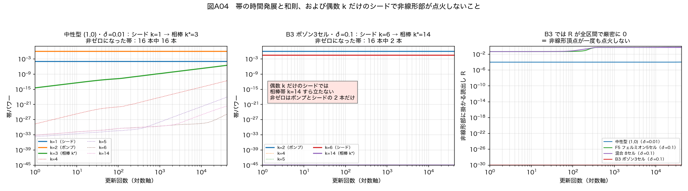

**図17　帯ごとの育ち方。左はニュートリノ型で、狙った相手の帯が立つ。中は偶数の帯だけの種で、立った帯は 2 本だけである。右は相互作用の強さを決める係数で、偶数の帯だけの種では全区間ゼロである。**

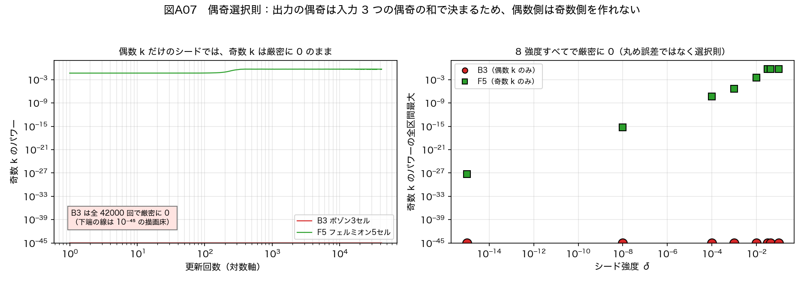

**図18　偶数の帯だけの種では、奇数の帯が 42000 回の全区間・8 段階の強さすべてで厳密にゼロのままである。**

---

## 7）本系には時間が二重に現れる。更新の順序は時間ではない

本稿には時間と呼びうるものが 2 つ現れる。ひとつは**外から数える更新の回数**で、
これは我々が実験を回すために付けた通し番号にすぎず、系の中にはない。
もうひとつは**系が自分の状態から読み出す時計**で、
これは全体が形を変えずに一定の角度ずつ回るようになって初めて存在する。

**この 2 つを混同してはならない。**
本系の力学には、時間という名前の量が入力されていない。
入っているのは更新の手続きだけである。
それにもかかわらず、系が育つと、状態どうしの関係から回転の刻みが読めるようになる。
**時間は与えたものではなく、読み出せるようになったものである。**

さらに、その時計についても 3 つが別の量であることが分かった。

### 時計が「ある」ことと「一定である」ことと「その速さ」は別である

系が自分の時間を読み出せるようになる更新回数と、
その読み出した速さが一定値に落ち着く更新回数は、別の量である。

- 8 か所に種を置いた場合、4000 回の更新では **N が 15 以上で速さが落ち着かない**
  （時間を読み出せるようにはなっている）
- 3）で述べた位相を打ち消す操作をすると、**落ち着くまでの回数が 15638 回から 18 回へ、
  870 倍速くなる**（強さ 0.1 では 96 回から 6 回）
- 時計の刻む速さそのものが条件によって変わる。
  132 走行のうち **67 走行で基準から 5% 以上ずれた**。最大は N=4 での 9.9 倍である

**時計が生まれただけでは、系が一定の時を刻んでいることを意味しない。**
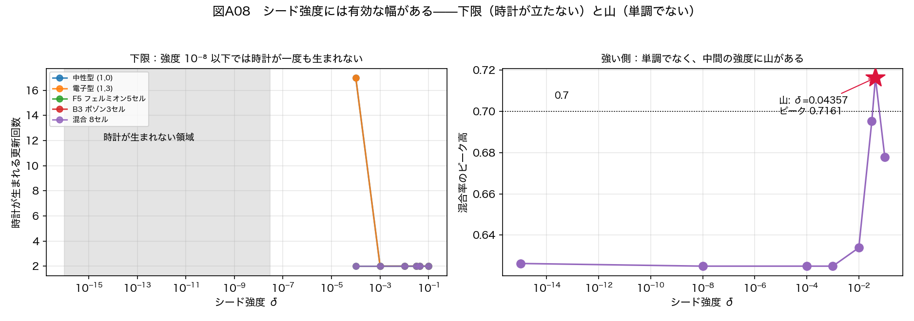

**図19　時計が生まれる更新回数（左）と、混合率の山（右）。左の灰色の領域では、42000 回の観測のあいだ時計が生まれない。**

---

## 8）前論文で見つけた約数の類による分類は、周期の等分数を変えても成り立つ

前回の論文は、背景の海の中では波の性質が第 2 の向きの巻き数そのものではなく、
**その巻き数と「周期の等分数」との最大公約数**にしか依存しないことを見つけていた。

ここで**周期の等分数**とは、実験系の説明で述べた「第 2 の向きを 1 周何等分してあるか」である。
巻き数は等分数で割った余りとしてしか意味を持たないので、
等分数を変えれば、どの巻き数どうしが同じ類に入るかも変わるはずである。
前回の論文はこの点を検証課題として登録していた。本実験ではこれを検定した。

前論文と同じ等分数 16 で走らせ直し、前論文の保存済み結果と
**62 件すべてがビット単位で一致**することを確認した。
そのうえで等分数 8・12・32 を追加し、
**278 通りの組すべてで予想どおり、外れはゼロ**であった。

決め手は巻き数 1 と 3 の組である。最大公約数で決まるなら、この組は
等分数 8・16・32 では同じ類、**等分数 12 でだけ別の類**になるはずである。
実測では、等分数 8・16・32 で **14 桁一致**し、等分数 12 でだけ **60% 違った**。
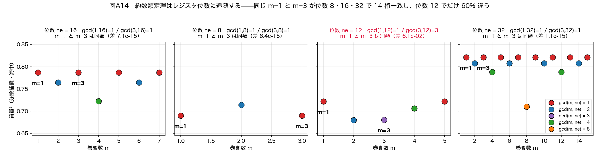

**図20　周期の等分数を変えた検定。同じ色の点が同じ高さに揃う。巻き数 1 と 3 は等分数 8・16・32 で 14 桁一致し、等分数 12 でだけ 60% 違う。**

---

## 残された課題

1. N=8 と N=10 で初期状態が作れなかったのは、構造的なものか実装の打ち切りか
2. 「弱すぎると粒子的な波ができない」も観測時間の産物か
3. 種を多く置いた場合の強さ 10⁻² の長時間走行（2 点が未取得）
4. 多体の系でも約数の類による分類が成り立つか（8）は 2 つの波の系で確かめた）
5. 第 1 の向きの等分数（本実験では 16）を変えた検定
6. 相互作用が実際に使っている係数そのものの測定
   （前論文の 0.6972 との関係はここで決まる）
7. 前論文の 62 種類と、本実験でどの場所がどの粒子に当たるかの突き合わせ

以下は本稿の範囲を超えるため、続篇で扱う。

8. **助走則と飽和則を分ける直交実験。**
   本稿の位相相殺実験は、パワーと置き場所を固定して複素数の和を変えた。
   その直交な対として、**和を固定したままパワーだけを変える**初期条件を作れば、
   立ち上がりは変わらず出そろう時刻だけが変わるはずである。
   同時に、3）節で述べた「和か二乗の和か」の区別も、
   和はゼロだが二乗の和はゼロでない配置を入れれば決着する
9. **飽和則の外挿による反証。**
   既存 14 点で冪を固定したまま、未測定の強さについて出そろう時刻を事前に予測し、
   フィットし直さずに当てにいく。当たれば経験則が一段強くなる
10. **どこまでが関係だけで閉じているかの形式的な監査。**
    本稿が使った 3 つの読出し（平面と 3 方向目、帯と混合率、時計の判定）について、
    入力が関係の組だけで閉じているか、点に付随する量が混じっていないかを分類する。

    **ただしここは 2 段に分けて考える必要がある。**
    読出しが関係だけで閉じていると確かめられても、それが示すのは
    **読み出す写像が関係だけで閉じている**ことであって、
    **系そのものが関係だけで動いている**ことではない。
    後者を言うには、初期状態の作り方・更新の前半・相互作用の側にも同じ監査が要る。

    すなわち、状態を作る → 更新する → 相互作用する → 読み出す、の各段について、
    点そのものに付いた量が紛れ込んでいないかを順に確かめる必要がある。
    本稿はその最後の 1 段（読み出す）についてすら、まだ確かめていない

---

# 補遺　全実験・全図表・全プログラムの一覧

本補遺は `make_paperA_appendix_v1.py` がフォルダを走査して自動生成したものである。
手作業で書き写した箇所はない。

## 補遺A　実験の一覧

走行ごとの保存データ（NPZ）は **126 件**、合計 1174 MB である。
種の置き場所・種の強さ・更新回数・分解能のいずれかが違えば別の走行として数えている。

### A-1　走行の内訳

| 更新回数 | 分解能 N | 走行数 | 内容 |
|---:|---:|---:|---|
| 300000 | 12 | 2 | ニュートリノ型（1か所）、電子型（1か所） |
| 42000 | 4 | 4 | ニュートリノ型（1か所）、奇数の帯5か所、混合8か所、電子型（1か所） |
| 42000 | 12 | 52 | ニュートリノ型（1か所）、偶数の帯3か所、奇数の帯5か所、混合8か所、種なし、電子型（1か所） |
| 4000 | 3 | 4 | ニュートリノ型（1か所）、混合8か所、種なし、電子型（1か所） |
| 4000 | 4 | 8 | ニュートリノ型（1か所）、奇数の帯5か所、混合8か所、種なし、電子型（1か所） |
| 4000 | 5 | 4 | ニュートリノ型（1か所）、混合8か所、種なし、電子型（1か所） |
| 4000 | 6 | 4 | ニュートリノ型（1か所）、混合8か所、種なし、電子型（1か所） |
| 4000 | 7 | 4 | ニュートリノ型（1か所）、混合8か所、種なし、電子型（1か所） |
| 4000 | 9 | 4 | ニュートリノ型（1か所）、混合8か所、種なし、電子型（1か所） |
| 4000 | 11 | 4 | ニュートリノ型（1か所）、混合8か所、種なし、電子型（1か所） |
| 4000 | 12 | 4 | ニュートリノ型（1か所）、混合8か所、種なし、電子型（1か所） |
| 4000 | 13 | 4 | ニュートリノ型（1か所）、混合8か所、種なし、電子型（1か所） |
| 4000 | 14 | 4 | ニュートリノ型（1か所）、混合8か所、種なし、電子型（1か所） |
| 4000 | 15 | 4 | ニュートリノ型（1か所）、混合8か所、種なし、電子型（1か所） |
| 4000 | 16 | 4 | ニュートリノ型（1か所）、混合8か所、種なし、電子型（1か所） |
| 4000 | 17 | 4 | ニュートリノ型（1か所）、混合8か所、種なし、電子型（1か所） |
| 4000 | 18 | 4 | ニュートリノ型（1か所）、混合8か所、種なし、電子型（1か所） |
| 4000 | 19 | 4 | ニュートリノ型（1か所）、混合8か所、種なし、電子型（1か所） |
| 4000 | 20 | 4 | ニュートリノ型（1か所）、混合8か所、種なし、電子型（1か所） |

### A-2　主実験（分解能 12・更新 42000 回）の 40 条件

| 種の置き方 | 1e-15 | 1e-08 | 0.0001 | 0.001 | 0.01 | 0.0316228 | 0.04357 | 0.1 |
|---|---|---|---|---|---|---|---|---|
| ニュートリノ型（1か所） | ○ | ○ | ○ | ○ | ○ | ○ | ○ | ○ |
| 電子型（1か所） | ○ | ○ | ○ | ○ | ○ | ○ | ○ | ○ |
| 奇数の帯5か所 | ○ | ○ | ○ | ○ | ○ | ○ | ○ | ○ |
| 偶数の帯3か所 | ○ | ○ | ○ | ○ | ○ | ○ | ○ | ○ |
| 混合8か所 | ○ | ○ | ○ | ○ | ○ | ○ | ○ | ○ |

### A-3　対照・追試・長時間走行

| 種類 | 走行 | 目的 |
|---|---|---|
| 再現対照 | 混合8か所・強さ 0.01・更新 42000・N=12 | `cohmixv1-ctl1` |
| 再現対照 | 混合8か所・強さ 0.0316228・更新 42000・N=12 | `cohmixv1-ctl1` |
| 再現対照 | 混合8か所・強さ 0.04357・更新 42000・N=12 | `cohmixv1-ctl1` |
| 再現対照 | 混合8か所・強さ 0.1・更新 42000・N=12 | `cohmixv1-ctl1` |
| 再現対照 | 混合8か所・強さ 0.01・更新 42000・N=12 | `controlrep1` |
| 再現対照 | ニュートリノ型（1か所）・強さ 0.01・更新 42000・N=12 | `controlrep1` |
| 位相を打ち消した種 | 混合8か所・強さ 0.01・更新 42000・N=12 | `pbmixv1-r1` |
| 位相を打ち消した種 | 混合8か所・強さ 0.0316228・更新 42000・N=12 | `pbmixv1-r1` |
| 位相を打ち消した種 | 混合8か所・強さ 0.04357・更新 42000・N=12 | `pbmixv1-r1` |
| 位相を打ち消した種 | 混合8か所・強さ 0.1・更新 42000・N=12 | `pbmixv1-r1` |
| 位相を打ち消した種 | 混合8か所・強さ 0.04357・更新 42000・N=12 | `pbmixv1-r2` |
| 長時間走行 | 電子型（1か所）・強さ 0.01・更新 300000・N=12 | `s4-n12-electron-t300000-l1` |
| 長時間走行 | ニュートリノ型（1か所）・強さ 0.01・更新 300000・N=12 | `s4-n12-neutral-t300000-l1` |
| 分解能 4 の追加走行 | 電子型（1か所）・強さ 0.01・更新 4000・N=4 | `s4-n4-electron-t4000-c1` |
| 分解能 4 の追加走行 | 電子型（1か所）・強さ 0.01・更新 42000・N=4 | `s4-n4-electron-t42000-l1` |
| 分解能 4 の追加走行 | 奇数の帯5か所・強さ 0.01・更新 4000・N=4 | `s4-n4-f5-t4000-c1` |
| 分解能 4 の追加走行 | 奇数の帯5か所・強さ 0.01・更新 42000・N=4 | `s4-n4-f5-t42000-l1` |
| 分解能 4 の追加走行 | 混合8か所・強さ 0.01・更新 4000・N=4 | `s4-n4-mixed-t4000-c1` |
| 分解能 4 の追加走行 | 混合8か所・強さ 0.01・更新 42000・N=4 | `s4-n4-mixed-t42000-l1` |
| 分解能 4 の追加走行 | ニュートリノ型（1か所）・強さ 0.01・更新 4000・N=4 | `s4-n4-neutral-t4000-c1` |
| 分解能 4 の追加走行 | ニュートリノ型（1か所）・強さ 0.01・更新 42000・N=4 | `s4-n4-neutral-t42000-l1` |

## 補遺B　図の一覧

本文で使う図は **19 枚**、走行ごとの記録図は **462 枚**、
全数目視のために焼いた一覧シートは **41 枚**である。

### B-1　本文の図

| 図 | ファイル |
|---|---|
| figA01 | `figA01_lattice_and_seeds_v1.png` |
| figA02 | `figA02_experiment_matrix_v1.png` |
| figA03 | `figA03_full_run_example_v1.png` |
| figA04 | `figA04_band_evolution_sumrule_v1.png` |
| figA05 | `figA05_three_births_v1.png` |
| figA06 | `figA06_support_structure_v1.png` |
| figA07 | `figA07_parity_selection_rule_v1.png` |
| figA08 | `figA08_amplitude_window_v1.png` |
| figA09 | `figA09_tau_space_all_conditions_v1.png` |
| figA10 | `figA10_runup_log_law_v1.png` |
| figA11 | `figA11_phase_cancellation_v1.png` |
| figA12 | `figA12_resolution_regimes_v1.png` |
| figA13 | `figA13_nsweep_birth_matrix_v1.png` |
| figA14 | `figA14_divisor_class_register_order_v1.png` |
| figA15 | `figA15_reproduction_controls_v1.png` |
| figA16 | `figA16_saturation_power_law_v1.png` |
| figA17 | `figA17_two_laws_v1.png` |
| figA18 | `figA18_selectivity_window_v1.png` |
| figA19 | `figA19_six_criteria_tradeoff_v1.png` |

### B-2　走行ごとの記録図（系統別の枚数）

| 系統 | 内容 | 枚数 |
|---|---|---:|
| 4panel | 空間・平面の枚数・時計・打ち消し残りの 4 段 | 126 |
| mix | 帯ごとのパワーと混合率 | 126 |
| ledger | 128 か所の地図と、狙った場所の育ち方 | 78 |
| summary | 分解能ごとの要約 | 66 |
| birth_matrix | 6 つの判定の一覧 | 66 |

命名は `fig_<種の置き方>[_T更新回数][_d強さ][_rep-識別子]_<系統>[_N分解能]_v2.png`。
この規約により、本文で参照した図はファイル名から一意に特定できる。

### B-3　全数目視のための一覧シート

走行ごとの記録図 462 枚を 1 枚あたり 12 図で焼いた 41 枚。
`sheet_<系統>_<通し番号>.png`。監査の経過は `分析記録_全図面監査_v2.md` に記録した。

## 補遺C　プログラムの一覧

| 役割 | ファイル | SHA-256（先頭16桁） |
|---|---|---|
| 実験本体（分解能掃引・種の置き方・強さ） | `run_nsweep_three_series_v2.py` | c4b3b33a82657232 |
| 実験本体の下層（分解能 1〜20 の掃引と図） | `run_tb_nsweep_1to20_v1.py` | 1615b8769cf765a4 |
| 不足していた種の置き方の追加取得 | `run_missing_seed_sweeps_T42000_v1.py` | 75f9ee9745209f89 |
| 位相を打ち消した種の走行 | `run_phase_balanced_mixed_v1.py` | 7c53508c13c23776 |
| 同上（強さを変えた版） | `run_phase_balanced_mixed_grid_v1.py` | fe1d21ce92958ebd |
| 周期の等分数を変えた検定 | `run_divisor_class_register_order_v1.py` | 29f9c1f8a6334c29 |
| 主張の数値を保存データから再計算し照合 | `aggregate_paperA_claims_v1.py` | 4a3a00e4d4cf3dc1 |
| 本文の図（15 枚） | `make_paperA_figures_v2.py` | 40106fda39749245 |
| 監査から出た図（4 枚） | `make_paperA_figures_audit_v1.py` | 10c912b5c7dfebd6 |
| 特別な値 0.6972 への最接近を全走行から取得 | `probe_alpha_root_closest_approach_v1.py` | 9c2564174074e7a2 |
| 全数目視のための一覧シート | `make_contact_sheets_v1.py` | 5f17d29b5837210b |
| 本補遺の生成 | `make_paperA_appendix_v1.py` | 897e33d4923e10a0 |
| 長時間走行と分解能 4 の追加走行の管理 | `run_stage4_longtime_orchestrator_v1.py` | d8114c14ed54a3a6 |

### C-1　外部から読み込んでいる力学（本論文では一切変更していない）

| 役割 | ファイル | SHA-256（先頭16桁） |
|---|---|---|
| 相互作用（更新の後半） | `../統一万能関数_v1/unified_interaction_v1.py` | b4db659b9bf95824 |
| 平面と 3 方向目の読み出し | `../統一万能関数_v1/unified_dimension_v1.py` | cfc9cf5d835e39ec |
| 帯・混合率・物質量の読み出し | `../統一万能関数_v1/unified_readout_v3.py` | 4dec07c9811c3c06 |
| 時計が読めるかどうかの判定 | `../統一万能関数_v1/selection_v1.py` | 90d546e61e20ce58 |
| 2 つの波の系（8）の検定に使用） | `../万能非弾性写像_managed_v1/run_ignition_fate_exact_v3.py` | f8aa9a12fe88d205 |

これらは読み込み専用で取り込んでおり、走行の前後で自身の SHA-256 を検査する。
食い違えばその場で停止する。

## 補遺D　事前登録・結果報告・検算の記録

| 種類 | ファイル |
|---|---|
| 事前登録（測定前に予想を固定した文書） | `事前登録_d3.162e-2_v1.md` |
| 事前登録（測定前に予想を固定した文書） | `事前登録_d4.36e-2_v1.md` |
| 事前登録（測定前に予想を固定した文書） | `事前登録_electron_affine16_16to64診断_v1.md` |
| 事前登録（測定前に予想を固定した文書） | `事前登録_シード型別δ一括掃引_T42000_v1.md` |
| 事前登録（測定前に予想を固定した文書） | `事前登録_シード生成構造判別実験_v1.md` |
| 事前登録（測定前に予想を固定した文書） | `事前登録_第1段階格子拡張_phase_balanced_v1.md` |
| 事前登録（測定前に予想を固定した文書） | `事前登録_第3段階有限位数root_passive_probe_v1.md` |
| 事前登録（測定前に予想を固定した文書） | `事前登録_約数類定理レジスタ位数追随検定_v1.md` |
| 結果報告 | `結果報告_α根最接近_全走行_v1.md` |
| 結果報告 | `結果報告_シード型別δ一括掃引_T42000_v1.md` |
| 結果報告 | `結果報告_約数類定理レジスタ位数追随検定_v1.md` |
| 分析記録 | `分析記録_全図面監査_v1.md` |
| 分析記録 | `分析記録_全図面監査_v2.md` |
| 数値の記録 | `result_paperA_claims_v1.json` |
| 数値の記録 | `result_paperA_audit_figs_v1.json` |
| 数値の記録 | `result_divisor_class_register_order_v1.json` |
| 数値の記録 | `result_alpha_root_closest_v1.json` |

## 補遺E　検算の結果

主張の数値は、保存データから独立に計算し直して、既存の記録と機械的に照合してある。

| 検査 | 結果 |
|---|---|
| 保存データから再計算した立ち上がり・時計の回数が記録と一致するか | 40 条件・食い違い 0 件 |
| 波が占める場所の数 | 一致 |
| 偶数の帯だけの種で奇数の帯が厳密にゼロか | 最大値 0.0 |
| 助走期間の式 | 9.8922 − 48.6108 × ln（複素数として足した大きさ）　R² = 0.999868 |
| 同じ点をパワーの合計で整理した場合 | R² = 0.992202 |
| 位相を打ち消した種の 4 条件 | すべて予想どおり |
| 前論文の結果の再現（等分数 16） | 62 件・最大の食い違い 0.0e+00 |
| 周期の等分数を変えた検定 | 278 通り・外れ 0 件 |
| 波が出そろうまでの回数の式 | 奇数の帯に置いたパワーの -1.073 乗に比例　R² = 0.9960（14 点） |
