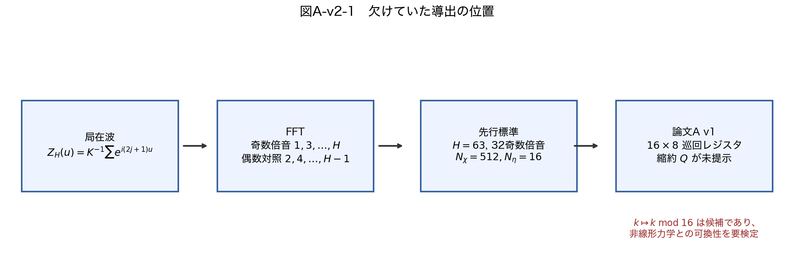
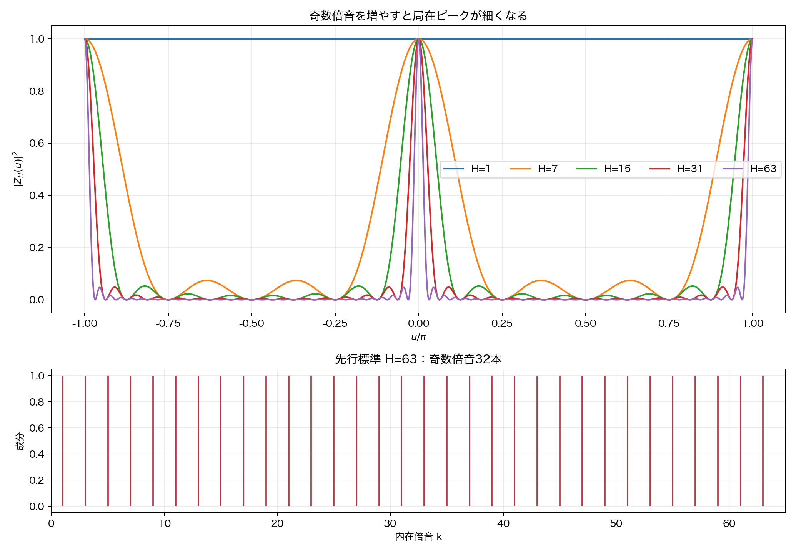
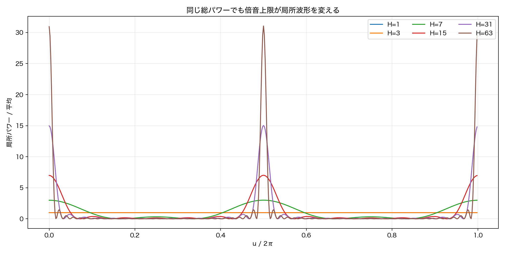
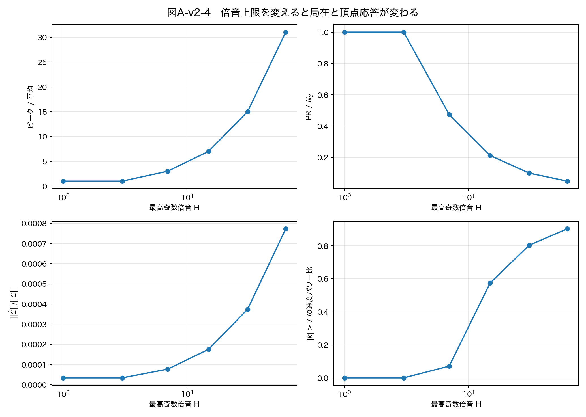
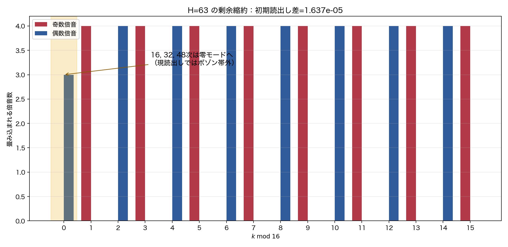

# 空間・物質・時計の生成条件は一致しない——倍音構造を明示した論文A訂正版

> **上流監査中（2026-08-11）:** 本ファイルは現在、完成稿ではなく作業稿である。論文Aより前の「波の数は系の分解能である」論文、白色親生成、インフレーション開始様式論文、多体接続論文まで遡る監査と、閉塞を保つ全倍音長時間対照が完了するまで、以下の結論を確定版として公開しない。

**著者:** 木原 範昭（WF System Co., Ltd.）　**日付:** 2026-08-11　**版:** v2  
**v1 Version DOI:** [10.5281/zenodo.21874482](https://doi.org/10.5281/zenodo.21874482)　**Concept DOI:** [10.5281/zenodo.21874481](https://doi.org/10.5281/zenodo.21874481)

---

## v2を作成した理由

**論文A v1では、最高第63次までの倍音合成波を、16帯・8巻き数の有限巡回レジスタへ置き換える構造を、導出も縮約写像も示さずに仮定していたことに気付いた。そこでv2では、この構造がどこから来たのかを先行模型まで戻って示すことにした。その結果、この欠落は説明上の問題だけでなく、局所波形と非線形相互作用の実験結果にも影響する誤りであることが分かったため、事前登録した訂正再実験を行った。**

訂正再実験の結果、v1の $16\times8$ 系は、先行模型の第63次倍音局在波を保った低解像度表示ではなく、別の**有限巡回レジスタ模型**だったことが明確になった。v1の保存済み数値は、その有限模型の結果としては再現可能である。しかし、それを第63次までの倍音から成るフェルミオン的局在波の結果と直接読むことはできない。

さらに、倍音を単純に戻した訂正候補は、厳密な零二乗和閉塞を初期値で満たさなかった。このため本稿は、完成した代替模型を提示したとは主張しない。v1の内部数値を保存しつつ、物理解釈の射程を訂正し、次に何を導出しなければならないかを確定する訂正版である。

---

## 要旨

本研究系列では、関係波の位相差から生成子を読み、閉塞保存回転と点ごとの三次頂点によって状態を更新する。論文A v1は、各関係に $16\times8=128$ 個の複素係数を置き、第1添字 $k$ の奇偶をフェルミオン的／ボゾン的読出しに使った。しかし、その前段の波模型では、局在波は

$$
S_H(u)=\frac{1}{K}\sum_{j=0}^{K-1}\cos((2j+1)u),
\qquad H=2K-1
$$

という奇数倍音合成で定義され、標準数値条件は $H=63$、すなわち32本の奇数倍音と、$512\times16$ の位相格子だった。v1には、この空間から $16\times8$ への写像が存在しなかった。

本稿は、局在波、FFT係数、半周・四分の一周での倍音位相、有限DFTの符号付き波数、剰余類レジスタを順に分離して導出する。四分の一周では $e^{ik\pi/2}=i^k$ により4位相類が現れ、半周では $(-1)^k$ により奇偶類が現れる。この構造は奇偶読出しの数学的根拠になるが、標本数16または8を一意に導くものではない。

同じ親、同じ総偶数パワー1、同じ総奇数パワー $10^{-4}$ で、単一モードから第63次までの倍音上限を掃引した。その結果、読出し $R$ は $2.85\times10^{-19}$ 以内で一致した一方、第63次条件の局所頂点速度は単一モードの22.9957倍となり、速度パワーの90.2273%が16標本の無折返し帯域 $|k|\le7$ の外に現れた。第63次倍音を $k\bmod16$ で縮約する明示的候補も、1更新について相対 $L^2$ 差 $3.9873\times10^{-4}$ で力学と非可換だった。

したがって、**奇偶パワーだけを見る読出しが等しいことは、波形または力学が等しいことを意味しない。** v1の長時間則、分解能則、支持セル数は有限巡回レジスタ内の実測として残るが、完全倍音模型または現実の粒子への対応は、閉塞を保つ倍音埋込みを構成して再走行するまで保留する。

---

## 1. 本稿の主張を確からしさで分ける

### 1.1 定義または数学的に導出できるもの

- 周期変数上の波はFFTにより整数巻き数成分へ分解できる。
- 半周移動 $u\mapsto u+\pi$ で第 $k$ 倍音は $(-1)^k$ を得る。
- 四分の一周移動 $u\mapsto u+\pi/2$ で第 $k$ 倍音は $i^k$ を得る。
- $H=63$ の奇数倍音列 $1,3,\ldots,63$ は32本である。
- 16点DFTで独立に表せる符号付き波数は $0,1,\ldots,7,-8,-7,\ldots,-1$ である。
- 点ごとの三次積はフーリエ空間で $k_\mathrm{out}=k_1+k_2-k_3$ の混合を作る。

### 1.2 今回の数値実験で確認したもの

- v1の単一モード初期配列を正本ビルダーからバイト単位で再現した。
- 総奇数／偶数パワーを固定すれば、現読出し $R$ は倍音上限を変えても同じになる。
- それでも局所波形、頂点速度、生成される波数範囲は大きく変わる。
- 明示した $k\bmod16$ 縮約は、読出しも1更新の力学も保存しない。
- 単純な第63次倍音埋込みは、厳密な零二乗和閉塞を初期値で満たさない。

### 1.3 有限巡回レジスタについてだけ残るもの

v1で報告した助走則、飽和則、偶奇選択則、支持セル数、分解能 $N$ ごとの様相、時計の読出し、約数類による分類は、保存済みの $16\times8$ 模型内では再現可能な計算結果である。ただし、これらは第63次倍音局在波へまだ持ち上げられていない。

### 1.4 対応仮説として保留するもの

- 奇数倍音族が現実のフェルミオンに対応すること。
- 偶数倍音族が現実のボゾンに対応すること。
- 模型の第3方向が現実の空間、内部時計が物理的時間に対応すること。
- $16\times8$ または $512\times16$ が自然界に一意な標本数であること。

「未接続」は反証ではない。しかし、接続写像を作らずに同一視することもできない。本稿の訂正点はここである。

---

## 2. 「各関係が1個の波を持つ」とは何か

点の数を $N$、点の対である関係の数を

$$
M=\frac{N(N-1)}{2}
$$

とする。論文Aの主条件 $N=12$ では $M=66$ である。関係を $e=1,\ldots,M$ と書く。

各関係が持つ「1個の波」は、1個の複素数ではない。二つの周期変数 $u,v$ 上の複素関数

$$
W_e(u,v)
$$

である。有限標本では $u$ を $N_u$ 点、$v$ を $N_v$ 点に分けるので、各関係の波は $N_uN_v$ 個の複素標本を持つ。

同じ波を二次元離散フーリエ変換すると、

$$
C_{e,k,m}
=
\frac{1}{N_uN_v}
\sum_{a=0}^{N_u-1}\sum_{b=0}^{N_v-1}
W_e(u_a,v_b)e^{-i(ku_a+mv_b)}
$$

となる。逆変換は

$$
W_e(u_a,v_b)
=
\sum_{k,m}C_{e,k,m}e^{i(ku_a+mv_b)}
$$

である。

ここで $(a,b)$ は波形を標本化した格子点、$(k,m)$ はFFT後の巻き数成分である。両者は同じ128個の配列要素を別の基底で見ているが、物理的意味は異なる。

したがって、v1で $(k,m)$ を「場所」と呼んだのは不正確だった。$(k,m)$ は波が記憶する物理的番地ではなく、**倍音係数のレジスタセル**である。本稿では、実空間に相当する位相標本を「波形点」、FFT後の $(k,m)$ を「倍音セル」と呼び分ける。

> **数の注意**：論文A v1の配列は $16\times8=128$ セルである。$128\times8$ ではない。先行模型は $512\times16=8192$ 標本であり、これも別の数である。

**図1　欠けていた導出の位置。** 局在波からFFT成分までは定義される。第63次・512標本の先行標準から16帯の有限レジスタへ移る写像 $Q$ が、v1にはなかった。

---

## 3. 奇数倍音から局在波を作る

### 3.1 実波と複素解析波

最高奇数倍音を

$$
H=2K-1
$$

とする。先行模型は、正規化等振幅奇数倍音局在波を

$$
S_H(u)=\frac{1}{K}\sum_{j=0}^{K-1}\cos((2j+1)u)
$$

と定義した。等比級数を使うと、

$$
S_H(u)
=
\frac{\sin((H+1)u)}{(H+1)\sin u}
$$

である。$u=0$ では極限により $S_H(0)=1$ となる。中央ピークから最初の零点までの幅はおよそ $1/H$ で縮む。

複素解析波としては

$$
Z_H(u)
=
\frac{1}{K}\sum_{j=0}^{K-1}e^{i(2j+1)u}
=
e^{iKu}\frac{\sin(Ku)}{K\sin u}
$$

と書ける。この形では正の奇数倍音が各1本ずつ明示される。

**図2　倍音合成による局在。** $H=1$ は局在しない。$H=7,15,31,63$ と高周波成分を足すほど、同相点の周囲に細いピークが形成される。奇数倍音は局在を作る唯一の方法ではないが、半波反対称性を持つ鋭い波形の代表構成である。

### 3.2 なぜ奇数と偶数が分かれるのか

第 $k$ 倍音 $e^{iku}$ を半周だけ動かすと、

$$
e^{ik(u+\pi)}=(-1)^k e^{iku}
$$

となる。偶数 $k$ は同相、奇数 $k$ は逆相になる。したがって、半周反転に対する表現として奇数／偶数の二類は数学的に自然である。

ただし、これだけで標準理論のスピン統計や反交換関係が導かれるわけではない。本系列でいう「フェルミオン的」「ボゾン的」は、現段階ではこの倍音パリティと先行する交換干渉実験に基づく対応仮説である。

### 3.3 $\pi/2,\pi,3\pi/2,2\pi$ の4位相類

四分の一周だけ動かすと、

$$
e^{ik(u+\pi/2)}=e^{ik\pi/2}e^{iku}=i^k e^{iku}
$$

となる。$k$ を4で割った余りだけを見れば、位相は次の4類に分かれる。

| $k\bmod4$ | 位相因子 | 位相 | 奇偶 |
|---:|---:|---:|---|
| 0 | $+1$ | $0$ または $2\pi$ | 偶数 |
| 1 | $+i$ | $\pi/2$ | 奇数 |
| 2 | $-1$ | $\pi$ | 偶数 |
| 3 | $-i$ | $3\pi/2$ | 奇数 |

したがって、ユーザーが指摘した $\pi/2,\pi,3\pi/2,2\pi$ という分類は、倍音番号の $\mathbb Z_4$ 分類として正しく現れる。奇偶分類はこの4類を2類へ粗視化したものである。

しかし、ここから導かれるのは「4で割った位相類」であって、「第1軸は必ず16等分」「第2軸は必ず8等分」という結論ではない。16は4の倍数なので4位相類を表現できるが、8、12、20でも表現できる。標本数の選択には、最高倍音と非線形混合を折返しなく保持する別の条件が要る。

---

## 4. FFT標本数と最大倍音

### 4.1 16点FFTが持つ符号付き波数

$N_u=16$ のDFT配列番号と物理的な符号付き波数は次のように対応する。

| 配列番号 | 0 | 1 | 2 | 3 | 4 | 5 | 6 | 7 | 8 | 9 | 10 | 11 | 12 | 13 | 14 | 15 |
|---:|---:|---:|---:|---:|---:|---:|---:|---:|---:|---:|---:|---:|---:|---:|---:|---:|
| 符号付き $k$ | 0 | 1 | 2 | 3 | 4 | 5 | 6 | 7 | −8 | −7 | −6 | −5 | −4 | −3 | −2 | −1 |

したがって、配列番号14を「正の第14倍音」と読むことはできない。FFT波数なら $-2$ である。

別の読み方として、配列番号を巡回群 $\mathbb Z_{16}$ の住所と定義することはできる。その場合は

$$
k\sim k+16
$$

であり、第1、17、33、49次は同じ住所へ入る。これは有効な有限模型だが、整数倍音を区別する完全波形とは別物である。点ごとの積をFFTすると畳込みも16を法として行われるため、

$$
k_\mathrm{out}=k_1+k_2-k_3\pmod{16}
$$

となり、高倍音は低倍音へ折り返す。

### 4.2 第63次には最低いくつの標本が必要か

第63次までを初期状態で表すだけなら、ナイキスト条件から少なくとも

$$
N_u>2H=126
$$

が必要である。128点は初期波形の標本化には最小に近い。ただし三次相互作用を1回作用させると、正の解析倍音 $1\le k\le63$ では

$$
k_{\max}=63+63-1=125
$$

まで生成できる。この出力を折返しなく保持するには

$$
N_u>250
$$

が必要で、256点が境界に近い。

先行実装の $N_\chi=512$ はナイキスト波数256を持つため、この初回三次混合を余裕をもって保持する。外側の搬送波で最大波数が64へずれ、実波の正負両側を保守的に数えた場合の $64+64-(-64)=192$ も256未満である。

ここから、512は**数値的には妥当な安全幅**を持つと言える。しかし、リポジトリ内の先行論文は512をこの不等式から一意に導出していない。512は標準実装値であり、自然界の定数として導出済みではない。256、512、1024の収束検定も必要である。

### 4.3 数字を混同しないための表

| 数 | 役割 | 状態 |
|---:|---|---|
| 63 | 標準条件の最高奇数倍音 | 作業条件。自然界から未導出 |
| 32 | $1,3,\ldots,63$ の奇数倍音本数 | 63から導出 |
| 512 | 先行模型の $\chi$ 標本数 | 数値的安全幅あり。一意性未検証 |
| 16 | 先行模型の $\eta$ 標本数 | 識別位相の標準条件。自然界から未導出 |
| $16\times8=128$ | 論文A v1の倍音レジスタセル数 | 内部設計。先行模型からの縮約未導出 |
| 12 | 論文A主条件の点の分解能 $N$ | 関係数66を決める。FFT標本数とは別 |

先行模型の $\eta=16$ は、粒子を局在させる $\chi$ 倍音とは別の識別位相である。論文A v1はこれを8へ減らしたが、$16\to8$ の縮約も導出していない。今回の再実験は $m=0$ だけを使ったため、この第2軸の妥当性はまだ検査していない。

---

## 5. 論文A v1が実際に計算していたもの

v1の初期状態は、背景を1本のセル $(k,m)=(2,0)$ に置き、代表的なフェルミオン型シードを $(1,m_s)$ に置いた。ボゾン型シードでは $k=6$ を使った。

たとえば「奇数の帯5か所」という条件は、5本の奇数倍音 $k=1,3,5,7,9$ を合成したものではない。すべて $k=1$ のまま、$m$ 軸の5セルへ置いたものである。同様に「偶数の帯3か所」は3本の偶数倍音ではなく、$k=6$ の3つの $m$ 住所である。

したがって、v1の状態は

$$
C_{e,k,m}\in\mathbb C^{66\times16\times8}
$$

という有限レジスタであり、初期状態ではごく少数のセルだけが非零である。後半の相互作用は逆FFTして各波形点で同じ三次頂点を作用させるため、有限環上のモード混合を起こす。この模型自体は定義可能であり、内部結果も再現可能である。

誤りは、この内部設計を、32本の奇数倍音を合成した先行局在波の構造として説明なしに扱った点にある。

---

## 6. 訂正再実験

### 6.1 事前登録と固定条件

結果を見る前に、比較条件、予測、判定境界、停止条件を
`paperA_v2_harmonic_correction_v1/事前登録_倍音構造訂正再実験_v1.md`
へ固定した。力学はv1と同じ `UnifiedEngine` を無改変で読み込んだ。

主条件は $N=12$、$M=66$、親シード2、$\delta=10^{-2}$、$m=0$ である。背景の偶数族の総パワーを1、シードの奇数族の総パワーを $10^{-4}$ に揃えた。この比較では、ピーク振幅を揃える先行定義の $1/K$ ではなく、総パワーを揃える $1/\sqrt K$ を使った。これは「倍音本数を増やしたため総エネルギーが増えた」という自明な差を除くためである。

| 条件 | 格子 | 背景 | シード |
|---|---:|---|---|
| `single16` | $16\times8$ | $k=2$ | $k=1$ |
| `H1_full` | $512\times16$ | $k=2$ | $k=1$ |
| `H7_full` | $512\times16$ | $k=2,4,6$ | $k=1,3,5,7$ |
| `H15_full` | $512\times16$ | $k=2,4,\ldots,14$ | $k=1,3,\ldots,15$ |
| `H31_full` | $512\times16$ | $k=2,4,\ldots,30$ | $k=1,3,\ldots,31$ |
| `H63_full` | $512\times16$ | $k=2,4,\ldots,62$ | $k=1,3,\ldots,63$ |
| `H63_fold16` | $16\times8$ | 第63次条件を剰余縮約 | 同左 |

`single16` の初期配列は、v1正本 `build_standard_universe` の出力とバイト単位で一致した。

### 6.2 明示した縮約候補

第63次までの選択倍音を16セルへ写す候補として、各剰余 $r$ に入る倍音数を $n_r$ とし、

$$
(QC)_r
=
\frac{1}{\sqrt{n_r}}
\sum_{k\equiv r\;(\mathrm{mod}\;16)}C_k
$$

を採用した。初期状態の平行・等振幅係数について剰余群ごとのパワーを保つ線形写像である。これは唯一の縮約ではない。少なくとも一つを明示し、力学との可換性を検査するための候補である。

---

## 7. 再実験の結果

### 7.1 読出しは同じでも波形は同じではない

full系列の初期読出し平均はすべて

$$
\bar R=0.0001002764811775708
$$

であり、各辺を含む最大差は $2.8460\times10^{-19}$ だった。現読出しは奇数族と偶数族の合計パワーを見るので、総パワーを揃えれば予測どおり一致する。

一方、逆FFTした局所パワーのピーク／平均は、`H1_full` の1.00247から `H63_full` の31.0511へ増えた。規格化参加率 PR/$N_\chi$ は0.999997から0.0483617へ減った。同じ $R$ の背後に、ほぼ一様な波と強く局在した波が共存する。

**図3　実エンジンの局所波形。** 倍音上限だけを変えても、点ごとの波形は大きく変わる。$H=1\to3$ の総波形指標には背景との干渉による微小な非単調性があり、事前予測の厳密な単調性は不成立として記録した。

### 7.2 三次頂点の応答は約23倍になった

初期状態で実装そのものの点ごとの頂点速度を評価した。結果は次のとおりである。

| 最高奇数倍音 $H$ | $\|\dot C\|/\|C\|$ | $|k|>7$ の速度パワー比 | 有意な最大 $|k|$ |
|---:|---:|---:|---:|
| 1 | 3.35966e-5 | 5.46e-32 | 3 |
| 3 | 3.35966e-5 | 5.90e-32 | 5 |
| 7 | 7.67773e-5 | 0.0709240 | 13 |
| 15 | 1.75234e-4 | 0.574421 | 29 |
| 31 | 3.74119e-4 | 0.802695 | 61 |
| 63 | 7.72578e-4 | **0.902273** | **125** |

第63次条件の速度ノルムは単一モードの22.9957倍である。第63次条件の速度パワーの90.2273%は、16点DFTで無折返しに保持できる $|k|\le7$ の外に出た。

**図4　倍音上限掃引。** 奇偶パワー読出しは一定でも、局在度、頂点速度、必要帯域は一定でない。16帯模型と第63次模型の違いは表示解像度だけではなく、力学入力の違いである。

### 7.3 剰余縮約は読出しを保存しない

$H=63$ では奇数倍音は各奇数剰余へ4本ずつ入る。偶数倍音も各偶数剰余へ原則4本ずつ入るが、第16、32、48次は剰余0へ入る。

**図5　第63次倍音の剰余縮約。** 零モードへ偶数背景パワーの $3/31=0.0967742$ が入る。現読出しは $k=0$ をボゾン帯から除外するため、縮約後の平均 $R$ は0.000111019へ変化し、各辺の最大差は $1.63655\times10^{-5}$ となった。

### 7.4 縮約と力学は可換でない

1更新について、512帯で更新してから縮約した状態と、先に16帯へ縮約してから更新した状態を比べた。

$$
\frac{\|QF_{512}(C)-F_{16}(QC)\|_2}
{\|QF_{512}(C)\|_2}
=
3.987274\times10^{-4}
$$

事前登録した一致境界 $10^{-10}$ より約400万倍大きい。したがって、少なくともこの自然な候補 $Q$ は力学と可換でない。

### 7.5 保存した量と、満たさなかった閉塞を分ける

1更新後の総パワー相対ドリフトは最大 $4.44\times10^{-16}$ であり、数値更新自体は保存的だった。しかし、点ごとの二乗和閉塞

$$
\left|\sum_e W_e(u,v)^2\right|
$$

の初期最大値は、`single16` の $1.8158\times10^{-3}$ に対し、`H63_full` では $5.6544\times10^{-2}$ だった。更新はこの非零値を保存しただけで、ゼロにはしない。

原因は明確である。各倍音へ零閉塞の関係ベクトルを個別に置いても、逆FFT後の和を二乗すると異なる関係ベクトル間の交差項が生じる。全 $u,v$ で零閉塞を満たすには、倍音係数どうしにも

$$
C_k^T C_\ell=0
$$

に相当する相互条件が必要である。今回の単純な複製はこの条件を課していない。

これは事前登録した失敗条件に当たる。ゆえに本稿は `H63_full` を完成した修正物理模型として採用せず、**v1の構造感度を示す診断実験**として採用する。

---

## 8. v1の主張をどう訂正するか

| v1の主張 | v2での扱い | 理由 |
|---|---|---|
| 各関係は $16\times8$ の「場所」を持つ | **用語訂正**：倍音係数の有限巡回レジスタセル | 物理的位置ではなくFFT／レジスタ添字 |
| 奇数帯はフェルミオン的、偶数帯はボゾン的 | **対応仮説として維持** | 半周パリティは導出できるが、標準理論の統計までは未接続 |
| v1は前の第63次倍音模型をそのまま引き継ぐ | **撤回** | 512×16から16×8への縮約がなく、応答も不一致 |
| v1の保存データと内部数値 | **維持** | 正本対照がバイト一致し、有限模型として再現可能 |
| 助走則・飽和則・支持セル数 | **有限模型内の経験則へ限定** | 完全倍音・閉塞保存条件では未再実験 |
| 偶数だけから奇数が生まれない | **有限環上のパリティ定理として維持** | 三次則の偶奇保存。ただし現実粒子への対応は別問題 |
| $N$ による分解能の様相 | **計算結果は維持、物理解釈は保留** | 関係数 $M$ の効果に加え、倍音表現の影響を分離できていない |
| 128セルの支持数が粒子種を表す | **物理解釈を保留** | エイリアスを含む有限環の支持数である |
| 16と8は妥当な物理解像度 | **未導出** | 四位相類だけでは標本数を一意に決められない |

v1の実験が「無意味になった」のではない。どの模型の結果かを取り違えていたのである。有限巡回レジスタの創発現象を調べた計算としては残るが、第63次倍音局在波、さらに現実の粒子へ進むには新しい接続が必要である。

---

## 9. 今後必要な正しい再実験

論文Aの長時間結果を物理模型として回復するには、次の順序を崩してはならない。

1. **閉塞を保つ倍音埋込みを導出する。**  
   背景族とシード族を、互いの双線形積も消える共通の全等方部分空間に置き、全波形点で $\sum_eW_e^2=0$ を満たすことを解析的・数値的に確認する。

2. **倍音上限を独立変数にする。**  
   $H=1,3,7,15,31,63$ を走らせ、局在幅、読出し、頂点速度、閉塞、長時間則の収束を見る。63を最初から自然定数としない。

3. **標本数を独立に収束検定する。**  
   同じ $H$ について $N_\chi=256,512,1024$ を比較する。結果が一致する範囲で初めて512を数値解像度として採用できる。

4. **$\eta$ 軸を別に検定する。**  
   $N_\eta=8,16,32$ と識別巻き数を掃引し、$16\to8$ の縮約がどの観測量を保存するか調べる。

5. **完全模型と有限模型を対照にする。**  
   完全倍音模型、明示的な縮約模型、v1の単一モード模型を同じ親・総パワー・時間窓で走らせる。縮約写像 $Q$ について

   $$
   QF_{\mathrm{full}}^t(C)
   \stackrel{?}{=}
   F_{\mathrm{eff}}^t(QC)
   $$

   を時刻ごとに検定する。

6. **その後に長時間則を再測定する。**  
   助走則、飽和則、分解能掃引、粒子セル支持、時計、第三方向を同じ判定コードで再取得する。v1と違う条件の成果物は別タグで保存する。

この手順が完了するまでは、v1の長時間数値を「第63次倍音から粒子が生成した証拠」として使わない。

---

## 10. 結論

論文A v1の迷走の起点は、波形とFFT係数と有限巡回レジスタを同じ「場所」という語でまとめたことだった。

正しい構造は次の順である。

$$
\text{局在させたい波形}
\longrightarrow
\text{倍音合成}
\longrightarrow
\text{FFT係数 }(k,m)
\longrightarrow
\text{有限標本}
\longrightarrow
\text{必要なら明示的縮約 }Q.
$$

奇数倍音は半周移動で逆相となり、四分の一周では $\pi/2$ と $3\pi/2$ の位相類へ入る。偶数倍音は $0$ と $\pi$ の類へ入る。この $\mathbb Z_4$ 構造は奇偶分類の背景を説明する。しかし、16帯、8巻き数、第63次、512標本を一意に決めるものではない。

今回の訂正再実験では、奇偶パワー読出しを同じに保っても、第63次倍音を戻すと局所頂点応答が約23倍となり、その90%以上が16標本の帯域外へ出た。単純な剰余縮約も力学と可換でなかった。したがって、$16\times8$ を第63次倍音模型と同一視したことは、実験結果に影響する具体的な誤りだった。

同時に、単純な倍音復元は零閉塞を満たさず、まだ最終解ではないことも判明した。ここで必要なのは、新しい物理的意味を後付けすることではない。閉塞を保つ倍音埋込みを先に導出し、その構造から標本数と縮約を決め、同一条件で再実験することである。

---

# 補遺　再現資料

訂正再実験の全成果物は `paperA_v2_harmonic_correction_v1/` に分離して保存した。v1のコード、データ、図、論文は変更していない。

## 補遺A　構造を遡った正本

| 内容 | 正本 | 該当箇所 |
|---|---|---|
| 奇数倍音局在波の定義 | `../波の情報読出し/20260710/無名等振幅複合波モデル基本公理系v9_純化定義論文.md` | 定義A1、定理A1・A2 |
| 実波の閉形式と局在 | `../波の情報読出し/20260710/背景空間を仮定しない閉じた位相系におけるフェルミオン的二局所波の完全弾性反射の構成実験.md` | 4.1、4.2 |
| 512×16格子と `high_n=63` | `../波の情報読出し/20260713/干渉計算プログラムの読み方.md` | 1.1、1.2 |
| 奇数／偶数パケットの実装 | `../万能非弾性写像_managed_v1/toy_snapshot_run_ab_invariant_theta_toy_v1.py` | `build_cases` |
| 現相互作用の倍音集合 | `../万能非弾性写像_managed_v1/universal_inelastic_map_v1.py` | `EVEN_KS`、`ODD_KS` |
| 四分の一周期と各倍音の位相 | `../波の情報読出し/20260710/full_verbatim_chat_part2.md` | 各周波数成分の90度位相シフトの議論 |

この系譜を遡ることで、奇数倍音、最高第63次、512×16は確認できた。一方、そこから論文Aの16×8へ移す導出文書は見つからなかった。

## 補遺B　訂正再実験の成果物

| 役割 | ファイル |
|---|---|
| 事前登録 | `事前登録_倍音構造訂正再実験_v1.md` |
| 実行コード | `run_harmonic_structure_correction_v1.py` |
| 標準出力ログ | `run_harmonic_structure_correction_v1.log` |
| 数値要約 | `harmonic_structure_correction_results_v1.json` |
| 配列 | `harmonic_structure_correction_arrays_v1.npz` |
| 結果報告 | `結果報告_倍音構造訂正再実験_v1.md` |
| SHA-256一覧 | `manifest_harmonic_structure_correction_v1.json` |
| 図 | `figA_v2_01`〜`figA_v2_05` |

実験コードが読み込んだ統一相互作用正本は `unified_interaction_v1.py` であり、変更していない。`single16` と正本ビルダーの初期配列はバイト単位で一致した。1更新の総パワー相対ドリフトは最大 $4.44\times10^{-16}$ だった。

事前登録 P4 に書いた「解析倍音の初回最大 $|k|=189$」は算術誤りであり、正しくは $63+63-1=125$ である。結果を見て事前登録を上書きせず、結果報告で明示して訂正した。
