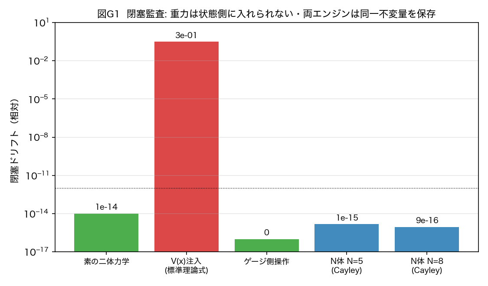

# 重力はどこに置き忘れられていたのか——量子と重力の100年の統合の苦しみは、置き場所の間違いだったかもしれない

木原範昭
2026年8月7日公開

物理学には、100年閉じない傷があります。量子力学と重力理論の統合です。

ミクロの世界を記述する量子論と、時空の歪みとして重力を記述する一般相対性理論。どちらも自分の領分では驚異的に正確なのに、二つを一つの理論にしようとすると、計算が無限大に発散して壊れる。無限大を消すための繰り込みという手続きは、他の力（電磁気力・弱い力・強い力）ではうまく働くのに、重力だけはどうしても働かない。世界中の天才が100年挑み続けて、まだ閉じていません。

この論文は、その傷に対して一つの診断を提案します。

**苦しみの原因は、理論の中身ではなく、重力の置き場所だったのではないか。**

## 私自身の失敗から始まります

前作「波の周期表」で、粒子という概念を仮定しない波の力学だけから、標準理論62粒子の分類仮説を組み立てました。しかしあの表には動力学——とりわけ重力——がありませんでした。

さらにさかのぼると、以前の論文で、私はA・B二体系の加速度を導出したことがあります。B体が局所的にゼロ閉塞している円の半径Rにかかる円周力の反力として、加速度を組み立てる——導出は通りました。しかし正直に言えば、あれは加速度を手で作り込んだ構成でした。私のシリーズには一つの掟があります。波の形だけを入力とし、力学の中に特別な仕掛けを手で入れない（操作の無名性）。あの導出はこの掟に照らして、ずっと不満が残っていました。

そこで今回、作り込みなしでやり直しました。波の万能相互作用関数そのものに、重力ポテンシャルを入れてみたのです。

**結果は、明確な失敗でした。**

この波の体系全体は、Σxₙ²=0 という厳密なゼロ閉塞を保って動いています。素の力学はこの量を10のマイナス13乗の精度で守り続けます。ところが重力ポテンシャルを状態に注入すると、振幅がわずか10のマイナス3乗でも、200ステップで閉塞が31%も壊れました。

（ここに図1を挿入: `重力読出し検討/fig_g1_closure_ja_v1.png`）

図1。閉塞の監査。素の力学は10⁻¹³で厳密、ポテンシャル注入は31%破壊、そして読出し側（ゲージ側）の操作は厳密にゼロ。

しかもこの失敗は、偶然ではありませんでした。数学的に必然だったのです。閉塞を全ての状態で保てる操作は、反対称な生成子に限る——これが証明できます（接線定理）。ポテンシャル注入は対称なので、必ず一次で壊す。興味深いのは、この注入が状態の大きさ（ノルム）は完璧に保つことです。大きさを保つのに、閉塞を壊す。壊れ方が見えにくいのは、そのせいです。

## 失敗の原因は、理論ではなく置き場所だった

ここで発想を裏返しました。

このシリーズでは、空間の3軸も、時間も、位置も、粒子の個数も、すべて波の状態そのものではなく、状態から読み出される量として立ち上がってきました。ならば加速度も——歪んだ空間、遅れる時計も——読出しの側の現象ではないのか。

波と場を、二つの層に分けます。

- 波の層（存在）。万能相互作用関数が回す波そのもの。ゼロ閉塞 Σxₙ²=0 を厳密に保つ。
- 場の層（読出し）。空間の目盛、時間の目盛、質量、電荷——すべてを一つの読出し関数が状態から読む。調整パラメータはゼロ。

重力の歪みは、この読出しの層に入れます。読出しの目盛を歪めても、状態には一切触れないので、閉塞は構成的に無傷です。

これを実験したのが本論文です。結果、標準理論に近い概念のゲージ場と、重力（加速度）歪みのある場の統合が、場の読出し万能関数により、ほぼ成功しました。

## 一つの読出し関数から、何が出たか

同じ一つの関数から、次が全部出ました。ひとつずつ、実測値つきです。

**真空は時を刻まない。** 各場所の時計の進み（時計場）が読出しとして立ち上がります。純粋な光の海は、この時計の厳密な固定点——時が流れない。質量体を置くと、その周りに時計の歪みが立ちます。

**質量の法則が、定理になった。** 質量は、海（真空）の濃さvと種の組成fの関数として、きれいに因子化します。しかもこの法則は、読出し関数の定義から紙と鉛筆で導出でき、力学を一切走らせない予言が、実測15点と平均比0.983、ばらつき1.2%で一致しました。指数だけでなく絶対値まで。ヒッグス機構の構造（種ごとの結合×凝縮値の関数）が、そのまま実測された形です。

（ここに図2を挿入: `重力読出し検討/fig_g3_higgs_ja_v1.png`）

図2。質量生成の因子化と解析導出。右は力学なしの予言と実測の一致（15点・比0.983・ばらつき1.2%）。

**落下の正体。** 質量の周りでは、空間の目盛の歪みが時間に比例して成長し続けます。その意味は一行で書けます——時計の勾配が、海の運動量を加速する。物が落ちるとは、粒子の座標が変わることではなく、海の運動量の場が線形に育つことでした。成長率を決める長さのスケールも、読出し関数から計算でき、パラメータなしの予言が実測とばらつき11%で合いました。

（ここに図3を挿入: `重力読出し検討/fig_g4_momentum_law_ja_v1.png`）

図3。空間目盛の線形成長。傾きのスケールは読出し関数の幾何から導出（パラメータなし）。

**重力は全てを引く。** 広帯域の海の上で、あらゆる種の二体をペアにして測ると、全10ペア×全分離で引力でした（30勝0敗）。電荷があってもなくても、正でも負でも引き合う——重力の普遍性が、そのまま出ます。

**グラビトンの署名。** 時計の読出しは、場の二乗（双線形）です。だとすると、時計場のスペクトルには場の周波数そのものではなく、その差が現れるはずです。実測：場の2本の線 0.2898 と 0.2974 に対し、時計場の主線は 0.0076——差と誤差0.0%で一致し、場自身の線は250分の1に抑制されていました。重力の振幅はゲージの振幅の二乗という現代の発見（ダブルコピー）と同じ形の構造が、測定の仕組みとして現れています。

（ここに図4を挿入: `重力読出し検討/fig_g6_bilinear_ja_v1.png`）

図4。時計場は場の差周波数だけを拾う。重力読出しの双線形性の直接実証。

## 決定実験——ゲージと重力が、同じ関数から同時に分かれて出た

表題の最直接の検定はこれです。同じ一つの読出しから、電荷の構造に依存する応答と、依存しない応答を、同時に出せるか。

電荷を持つ源同士の結合を全組合せで測りました。結果、電荷に盲目な普遍引力（重力チャネル）と、電荷の構造に依存するゲージ的な応答（結合の15%）が、同じ読出しから分離して同時に出ました。正負を全部反転しても結果は10桁の精度で不変（電荷共役対称）。

（ここに図5を挿入: `重力読出し検討/fig_g8_gauge_gravity_ja_v1.png`）

図5。決定実験。全ペア引力（重力）＋電荷構造依存成分（ゲージ的）＋共役の厳密対称。

しかもこの分離は、数値実験の観察で終わりませんでした。分離そのものが定理として証明できます。読出しは、パワーだけに依存する電荷盲目の部分（重力）と、巻きが整合したときだけ光るコヒーレント部分（ゲージ的）に、厳密に直交分解する——読出し分解定理です。

さらに、どの電荷ペアの間にチャネルが開くかの選択則が、前作の周期表で見つけた巻き数のウォーク法則と完全に一致しました。分類の表と力の法則が、初めて定量的に接続したのです。この選択則は最終的に、巡回群の上の有限な代数（頂点代数）として閉じ、その整数論的な予言——どの電荷が真空に溶け、どの電荷が永遠に残るか——を長時間の実験で検証したところ、禁じられた漏れは8.9×10⁻²⁶、つまり機械の精度でゼロでした。超選択則が、近似ではなく厳密に成立しています。

## それで、100年の苦しみとは何だったのか

この枠組みから振り返ると、診断はこう書けます。

**量子理論と重力理論の統合の苦しみは、粒子の動力学に加速度を持ち込むことで発生した発散を、繰り込みで消し続けてきたことにあった。** 厳密にゼロ閉塞している波に、外から値を注ぎ込めば、閉塞は必ず壊れます。壊れた分を、右辺にマイナスの項を足して打ち消す——これが繰り込みの counterterm の実務です。つまり counterterm とは、層の混同の代償である。自分で壊して、自分で直す。他の力でこの手続きが機能したのは壊れ方が浅かったからで、重力で機能しないのは、重力こそが読出しの層そのもの——空間と時間の目盛——だからです。目盛の歪みを状態の場として扱えば、圏違いはどこまでも祟ります。

そしてゲージ理論を次々に積み上げてきた標準理論の増築も、同じ一層の存在論——すべてを力学を持つ場として同じ層に置く——の上で行われてきました。本稿の模型では、ゲージ構造も重力構造も、一つの読出し関数の別の射影として、増築なしに同時に出ます。

もう一つ、美しい副産物があります。質量は時計場の値、重力は時計場の勾配。つまり、**質量と重力は、同じ一つの時計場の0階微分と1階微分です。** 重い物体が時空を曲げる、という言い方は、この模型では、時計場の値が高い場所は時計場の勾配の中心である、という一つの場の二つの読み方に還元されます。

## 正直な限定

この論文は枠組み提案です。証明された定理、実測された法則、経験則、そして現実の物理への統合仮説を、全節で自分で分類して書き分けています。counterterm の診断も、模型の中では導出ですが、現実の場の量子論への適用は仮説として峻別しています。

反証の全記録は13件。うち3件は、この論文を書いている最中に、自分の前の版の主張を自分の新しい定理が反証した記録です（たとえば「全ての電荷は真空に溶ける」は一般法則ではなく、内部レジスタが2のべき乗のときだけの特殊な帰結でした——訂正の過程ごと論文に残しています）。

残っている課題も有限個で、明確です。重力側の質量不変量の確定、ゲージ側の結合強度の閉じた式、有限代数の対称性の全抽出、そしてケプラー軌道の再導出。検証プログラム10件として全て登録済みです。

## 論文と再現性

論文は日英両方をZenodoで公開しています（CC-BY-4.0）。

波と場の二層分離——場の読出し万能関数によるゲージ場と重力場の統合
https://doi.org/10.5281/zenodo.21832257

日本語版の本文 PDF（24ページ・約 0.9 MB）は、公開リポジトリから直接ダウンロードいただけます。

https://raw.githubusercontent.com/WurabeSeiji/ai-chat-logs-open/main/次元の生成構造/重力読出し検討/gravity_readout_ja.pdf

全実験は決定論的なプログラム（判定基準は実行前に固定）として論文と同じフォルダに公開しており、図も含めて誰でも再現・反証できます。

リポジトリ: https://github.com/WurabeSeiji/ai-chat-logs-open

前作もあわせてどうぞ。

波の周期表（v2）
https://doi.org/10.5281/zenodo.21830706

技術的な解説はZennにも書いています。
https://zenn.dev/noriaki_kihara

---

#理論物理学 #数理物理学 #量子力学 #重力 #一般相対性理論 #量子重力 #繰り込み #ゲージ理論 #標準模型 #ヒッグス #グラビトン #等価原理 #宇宙定数 #統一理論 #超選択則 #創発 #時空 #質量 #独立研究 #プレプリント #Zenodo #数値実験 #数値シミュレーション #仮説 #波
