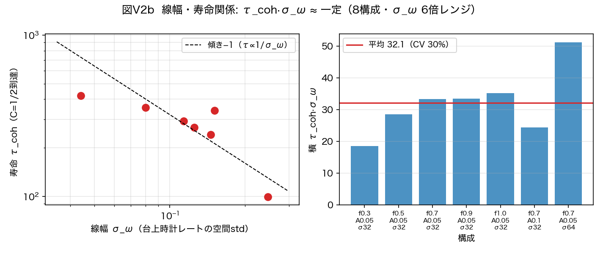

# 波の周期表——思考実験だった62粒子の割り当てが、検証可能な仮説になり、質量と寿命まで一つの時計場に統合された（v2全面改訂）

木原範昭
2026年8月6日公開・8月7日 v2 全面改訂

**この記事は v2 への全面改訂版です。** 公開翌日までの検証プログラムで得た新しい発見——質量と寿命が同じ一つの分布の「平均」と「幅」であること、真空は時を刻まないこと、点粒子に統計がない理由——を後半に追加しました。論文本体も v2（自己完結の全面改訂版）を公開しています。

以前のノートで、一つの思考実験を書きました。粒子というものを、x, y, z, t, R, Q という6本の軸のどこに「巻き」を持つかで分類してみる——光子はR軸だけ、グルーオンはQ軸だけ、WボソンとZボソンは時間軸、という符号ベクトルの表を作り、標準理論の62個の粒子を当てはめられないかを検討した記事です。

思考実験：R軸について——62粒子の割り当ての検討
https://note.com/kiharanoriaki/n/na95064891249

あのときは、あくまで頭の中の分類でした。検証する方法がなかったからです。

この論文は、その続きです。ただし今度は、**波の形だけから**。粒子という概念を一切仮定しない波の力学（すでに公開済みの2つの系）を走らせ、数値実験の測定だけを積み上げて、同じ62個の割り当てにたどり着きました。しかも実験プログラムごと公開して、誰でも再現・反証できる形の仮説としてです。

## 中心にある一つの考え方

論文の全体は、一つの命題に束ねられます。

**粒子の種類は、波そのものの固定属性ではなく、巻き数の状態を観測時計がどう読むかによって分類される。**

電荷、閉じ込め、フェルミオンかボゾンか、質量、寿命——これらは別々のラベルではなく、「状態側の番地 × 観測時計 × 海（真空）との関係」に分解される、という提案です。

v2ではこの命題が一段深まりました。**種を分類する読出しと、空間や時間の目盛を創る読出しは、同じ一つの関係量の射影である**——粒子の数も、質量も、寿命も、崩壊さえも、その読出し関数の出力に統一される、という仮説です（後半で説明します）。

## 前の論文の宿題が、予言に変わった

前作「空間軸3軸と固有時間の創生」には、正直に書いた未解決課題がありました。**電荷（巻き数）が±1に安定せず、複数の値に散らばってしまう**という問題です。

今回、この宿題に答えが見つかりました。しかも二段構えの答えです。

状態の側では、電荷は本当に散らばり続けます。真空（海）との相互作用が巻き数を 1→2→4→8 と倍々に歩かせていく様子を、実験でそのまま観測しました。散らばるのは故障ではなく、力学の必然でした。

ところが読出しの側では、話が逆転します。観測時計のうち「3で割って読む」時計だけが、この散らばった全生成物を、大きさ1の電荷にきれいに折り返して読むのです。倍々の梯子 2, 4, 8, 16… を3で割った余りは、+1と−1を交互に踏むからです。実測では、3で読む時計だけが荷電内容の100%を大きさ1に集中させ、4で読むと電荷が消え、5や6で読むと多値に散らばりました。

（ここに図1を挿入: `次元の生成構造/波の周期表検討/fig_p4_rectification_v1.png`）

図1。3で読む観測時計だけが、どちらの宇宙（+1種でも+2種でも）でも全荷電内容を大きさ1に読む。

つまり「電荷が散らばる」（状態側）と「素電荷はただ一つ」（読出し側）は、矛盾せずに同居します。未解決課題が、この仮説の予言に変わりました。

## クォークの3分の1電荷問題にも、答えの候補が出た

この「3で読む時計」を認めると、思いがけないものが転がり出てきました。

電荷の単位を「生の巻き数3個ぶん＝素電荷1」と置いてみます。すると、uクォークは巻き+2で電荷+2/3、dクォークは巻き−1で電荷−1/3、電子は巻き−3で電荷−1、ニュートリノは巻き0で電荷0。標準理論のあの奇妙な分数がそのまま出ます。

検算をすると、陽子（uud）は巻きの合計が 2+2−1=+3 で電荷+1。中性子（udd）は 2−1−1=0 で電荷0。**すべてのハドロンの電荷が自動的に整数になります。**

そして、ここが一番きれいなところです。3で割り切れない巻きを持つ波は、3で読む観測時計の上では**一価に読めません**。つまり——

**クォークがなぜ3分の1の電荷を持つのかと、クォークがなぜ単独で観測できないのか（閉じ込め）は、同じ一つの事実の裏表になります。**

数値実験でも確かめました。クォーク型の波（巻き+2）は、孤立させると4000回の衝突を経ても可読分率が厳密にゼロのまま。海に入れると、巻きの合計が3の倍数になる複合（ハドロンに相当）が育った分だけ、整数電荷の単位でのみ、世界に読み出されてきます。

（ここに図2を挿入: `次元の生成構造/波の周期表検討/fig_p9_confinement_v1.png`）

図2。クォーク型（赤）は生まれつき読出し不能で、ハドロン化の分だけ可読化する。孤立クォーク型（灰）は永遠にゼロのまま。電子型（青）は最初から自由。

## フェルミオンとボゾンの区別は「時計の二重被覆」に住んでいた

もう一つの発見は統計です。フェルミオンとボゾンを分ける二値性が、どこに住んでいるかを探しました。

チャネルの回転には住んでいませんでした（厳密な対称性）。空間の回転にも住んでいませんでした（すべてのモードが普通のベクトル）。残った場所は——**時計**でした。

帯電した種の状態位相を観測の回帰ごとに追跡すると、位相は0とπの二値だけを取り、中間の値を一切取りません。状態は+1のシートと−1のシートを行き来する。つまり**観測量が一周しても状態は戻らず、二周で初めて戻る**——数学でいう二重被覆の構造です。しかもこの二値性は、フェルミオン的な波（奇数倍音）にだけ現れ、ボゾン的な波には現れませんでした。

（ここに図3を挿入: `次元の生成構造/波の周期表検討/fig_p8_z2_quantization_v1.png`）

図3。帯電種（赤）の位相は0とπに厳密に量子化され、中性の束（青）は連続的に漂う。

電荷ゼロのフェルミオン帯の波も作って測ると、やはり二重被覆を示しました——**ニュートリノの席が、この分類の中にちゃんとあります。**

## ここから v2 の新しい発見です

論文をv1として公開した直後から検証プログラムを走らせたところ、24時間で分類が「その先」へ進みました。v2は、v1の主張を一つも弱めずに、次の発見を第II部として追加した全面改訂版です。

### たった一つの式が全体を束ねていた

分類の力学的な核心は、実はたった一行でした。

**r = P奇 ÷（P奇 + P偶）**

一回の相互作用でどれだけ交換が起きるか（反射率）を、**奇数倍音（フェルミオン帯）のパワーの分率だけ**が決める——この式です。偶数倍音は回される側には入りますが、回す量を決める側には入りません。

この式の帰結が三つ、すべて実測で確認されました。

第一に、**真空は時を刻みません**。奇数倍音を含まない純粋な海（ボゾンだけの世界）は r=0 の厳密な固定点で、完全に静止します。光は光と衝突しない。光子が無質量で安定である理由が、式の一行から出ます。

第二に、**時計を動かす源は物質（フェルミオン帯の内容）だけ**。物質＝相互作用を起こす側、光＝起こさない側という役割の非対称が、式から従います。

第三に、もしこの式が偶奇対称だったら、どんな実験もフェルミオンとボゾンを区別できず、統計はただの命名になります。実際に等振幅（分率0.500000）に厳密調整した波を進化させると、0.5には留まらず流出しました——**力学は確かに偶奇を非対称に扱っています**。

### 点粒子に統計がない理由——対蹠二点構造

偶数倍音と奇数倍音の区別は、実は「基本波長の半分だけずらす」という変換への応答です。偶数倍音はずらしても不変、奇数倍音は符号が反転する。

ここから幾何学の定理が出ます。**統計の確定した純粋な種は、一点に局在できません**。必ず、対蹠の位置（半周期ずれた場所）に対称または反対称の相棒を持つ——時計の二重被覆が、空間の構造としてそのまま実体化しているのです。

裏返すと、**一点に局在した物体は必然的に偶奇の混合であり、統計を持ちません**。点粒子に統計がなく、統計のある素粒子が点でないのは、同じ一つの幾何の両面でした。

### 質量と寿命は、同じ分布の「平均」と「幅」だった

v2で一番大きい発見はこれだと思います。

局所時計場 ω(x)——場所ごとの時計の進む速さ——の分布を粒子の台の上で取ると、

- **質量 ＝ ⟨ω⟩（平均）**
- **寿命 ＝ 1/σ_ω（幅の逆数）**

になります。実測では、線幅と寿命の積 τ·σ_ω が、条件を6倍振っても約32でほぼ一定（ばらつき30%）。そして質量と線幅は強く正相関（+0.90）——つまり、

**重い粒子ほど短寿命であることが、同じ一つの分布の「平均」と「幅」の関係として、自動的に従います。**

標準模型の荷電レプトン（電子・ミューオン・タウ）で顕著なあのパターン——世代が上がるほど重く、短寿命——に、構造的な説明の候補が出たことになります。ここから世代の新しい仮説も出ました：**世代とは、同じ番地の「位相ロックの水準」の離散系列ではないか**（基底世代=完全ロック、第2=部分、第3=辺縁）。

（ここに図5を挿入: `次元の生成構造/波の周期表検討/fig_v2b_linewidth_lifetime_ja_v1.png`）

図5。線幅・寿命関係 τ·σ_ω ≈ 一定（左：傾き−1）と、質量・線幅の正相関（右）。

### 崩壊は「力」ではなかった

粒子の崩壊（分裂）を表すために、力学に新しい力を足す必要はありませんでした。**時計の速さ ω が場所ごとに違えば、違う部分同士は勝手に位相を失って独立になる**——脱コヒーレンスが分裂の力学そのものです。

必要なのは読出しの基準だけです。二つの領域が「一つの粒子」であるのは、相対的な時計位相のずれの累積が π（半回転）を超えるまで。超えたら二つ。分裂時刻の予言は t_split = π/Δω で、実測はオーダー1で整合しました（精密化の実験は登録済み）。

### 定常な粒子の作り方——二つの条件

「静かに存在し続ける粒子」を波で作るには、二つの条件が要ることも分かりました。

1. **局在**：基本波長の全倍音（偶数も奇数も）を、中心で位相を揃えて積み上げる。倍音を増やすほどリンギング（鳴り）はゼロへ漸近します（実測50倍改善）。偶数倍音だけでは頭打ちになる——両方が必要です
2. **位相ロック**：台の上で固有時計が一様（ω(x)=一定）。これは非線形の固有値問題で、**この模型の「粒子方程式」の候補**です

### 分類は実装の偶然ではない——整合性検査

最後に、v1の柱実験9本を、プログラム本文を一切変えずに、読出しを局所化した別エンジン2種で走らせ直しました。結果：**整数と位相の構造（二重被覆・閉じ込めの厳密ゼロ・簿記恒等式など）は完全に不変**。分類の骨格は、特定の実装の人工物ではありませんでした。

## 62個の割り当てと、この論文が「言わないこと」

こうして得た分類子の上に、標準理論の62個（クォーク36・レプトン12・グルーオン8・光子・W2つ・Z・ヒッグス・重力子）の割り当て案を置きました。v2の周期表には、質量・寿命の法則と、存在の階層構造（海→素種→ハドロン/バリオン→古典物体）の座席表が加わっています。

（ここに図4を挿入: `次元の生成構造/波の周期表検討/fig_v2_periodic_table_ja_v1.png`）

図4。波の周期表 v2。一行定式・原始周期表（実測）・62種割当（確度：緑=実測が直接支える行、黄=構造対応、灰=仮説）・質量寿命の法則・存在の階層構造。バリオンは「62種の外の別枠」ではなく、同じ読出しの一階層として質量・寿命・崩壊の座席を持ちます。

そして、最も大事な限界も明記しています。

**これはあくまで「波の周期表」——読出しと分類の仮説です。動力学との接続は、今後の課題です。**

62個の粒子が実際に生成し、崩壊し、相互作用する様子は、まだ描けていません。それを検証するには、現在2つに分かれている力学を、種ごとの場合分けを一切持たない単一の万能相互作用関数に統一し、この周期表がその関数のスペクトルとして出てくるかを確かめる必要があります。v2の終節には、その関数が満たすべき要件を11項目（v1の8項目から拡張）、実測に基づいて確定してあります。反証された仮説も15件（v1の13件から追加）、すべて論文に載せてあります。

思考実験から始まった62個の表が、反証可能な仮説になり、質量と寿命まで一つの時計場に統合された——v2の到達点はここまでです。

## 論文へのリンク

今回の論文 v2（日本語・英語の本文とPDF）

Concept DOI（常に最新版）
https://doi.org/10.5281/zenodo.21822358

v2 Version DOI
https://doi.org/10.5281/zenodo.21830706

Zenodo公開レコード
https://zenodo.org/record/21830706

（v1 Version DOI: https://doi.org/10.5281/zenodo.21822359）

実験プログラム32本・実験データ・図（日英）はすべてGitHubリポジトリにコミットされており、判定基準は実行前に固定して記録しています。整合性検査の全27走行も別フォルダで公開しています。

出発点の思考実験ノート
https://note.com/kiharanoriaki/n/na95064891249

前作（空間と時間の論文——今回解いた宿題の出どころ）
https://note.com/kiharanoriaki/n/n41839f4350fa

---

<!-- pdf-links -->
論文本体の PDF は、公開リポジトリから直接ダウンロードいただけます。

- wave_periodic_table_en.pdf
  https://raw.githubusercontent.com/WurabeSeiji/ai-chat-logs-open/main/次元の生成構造/波の周期表検討/wave_periodic_table_en.pdf
- wave_periodic_table_ja.pdf
  https://raw.githubusercontent.com/WurabeSeiji/ai-chat-logs-open/main/次元の生成構造/波の周期表検討/wave_periodic_table_ja.pdf

リポジトリ: https://github.com/WurabeSeiji/ai-chat-logs-open

#理論物理学 #数理物理学 #素粒子 #標準模型 #クォーク #電荷 #閉じ込め #フェルミオン #ボゾン #ニュートリノ #スピン #周期表 #分類 #創発 #質量 #寿命 #独立研究 #プレプリント #Zenodo #数値実験 #数値シミュレーション #仮説 #思考実験 #波
