# The Periodic Table of Waves v2 — Particle Classification by Winding Addresses and Observation Clocks, and the Unification of Mass, Lifetime, and Splitting by the Clock Field ω(x)

**Author**: Noriaki Kihara
**Date**: August 7, 2026
**Type**: Fully revised hypothesis-proposal paper (supported by numerical experiments; not a proof paper)
**Relation between versions**: This paper is a full revision of v1 [21] and is self-contained —
it can be read without v1. All claims of v1 (the five pillars) are carried over without
weakening, and the new findings obtained by the post-publication verification program
(new pillars 6–10 and the consistency battery) are added as Part II.

---

## Abstract

What classifies a particle? From numerical experiments on wave dynamics that assume no
concept of a particle (two already-published systems, used as they are), this paper
proposes the **"periodic table of waves"** — a classification hypothesis based on
winding-number addresses and observation clocks. The starting point was a sign-vector
thought experiment [1] that classified particles by which of the six axes (x, y, z, t,
R, Q) carries their winding. This paper rebuilds that classification purely from the
shapes of waves, by measurement, and arrives at five pillars. **Pillar 1 (periodic
law)**: the foundation of the classification is a measured universal clock — the
collective clock ω = π/72/step holds across the entire range N = 4 to 144 (long window
±0.1%) — and species are classified by rational addresses on a single U^144 clock
lattice and their relation to the clock. **Pillar 2 (charge law)**: charge is
Q_em = m/3 (m the raw winding number); the dominant observation clock (denominator 3 —
based on the previously measured tongue-width ratio of 461) reads "3 windings = one
elementary charge". Consequently the u type m=+2 reads +2/3, the d type m=−1 reads
−1/3, the electron m=−3 reads −1, and **confinement and fractional charge become two
faces of the single fact of "mod-3 readability"** (the arithmetic checks pass
automatically: proton uud = +3 → +1, neutron udd = 0). In the numerical experiments,
quark-type addresses remain strictly unreadable in isolation (readable fraction 0.0000
persists), while in the sea they become readable, in integer charge units only, exactly
to the extent that hadronization (formation of m≡0 composites) proceeds. **Pillar 3
(statistics law)**: the fermion/boson distinction lives not in spatial rotation but in
the **double cover of the clock**. The state phase is quantized to {0, π} at each
observable recurrence (measured to 3 digits); fermionic species (odd harmonics) visit
both sheets (covering degree 2) and bosonic species do not (covering degree 1). A pure
m=0 species in the fermionic band also shows covering degree 2 — the row of the neutral
fermion (neutrino) is established. **Pillar 4 (mass law)**: mass is not an attribute of
the address but a relational quantity with the sea (vacuum) — isolated addresses are
all unitarily equivalent by winding-shift symmetry (measured), and in-sea properties
depend only on the divisor class gcd(m, 16) (odd addresses match to 5 digits).
**Pillar 5 (the periodic table)**: the table is a pair — the isolated stable-element
table and the in-sea lifetime table — on which an assignment of the 62 Standard-Model
species is proposed.

v2 goes one step further (Part II, new pillars 6–10). **New pillar 6 (the one-line
law)**: the dynamical core of the classification is bound into a single formula,
**r = sin²θ = P_odd/(P_odd + P_even)** — the reflection rate per interaction equals the
fraction of odd-harmonic (fermionic-band) power. The pure bosonic sea is an exact fixed
point with r = 0 (the vacuum does not tick); the source that drives the clock is
fermionic-band content only; and the necessary condition for the Z₂ classification to
have dynamical meaning in this model is precisely this asymmetric coupling
(equal-amplitude f = 0.500000 is not a fixed point but flows to f* = 0.4936 ± 0.0012 —
measured). **New pillar 7 (the spatial double-cover theorem)**: the even/odd
distinction is the Z₂ representation of the half-translation T: x → x + n/2 of the
fundamental wavelength; pure-parity species cannot localize at a single point and
necessarily carry an antipodal two-point structure — the double cover of the clock is
realized as spatial structure. A point-localized body necessarily mixes both parities
and carries no statistics. **New pillar 8 (unification of mass, lifetime, and
generations)**: for the distribution of the local clock field ω(x) on the support of a
species, mass = ⟨ω⟩ (the mean) and lifetime = 1/σ_ω (the inverse width); the
linewidth-lifetime relation τ_coh·σ_ω ≈ 32 (CV 29.7%, over a 6× range of σ_ω,
measured) holds. Mass and linewidth are positively correlated (+0.904, measured) —
**"the heavier, the shorter-lived" follows automatically as two moments of one
distribution**. From this we propose a new candidate for generations: "generations =
a discrete series of phase-lock levels". **New pillar 9 (the splitting readout)**: the
splitting (decay) of a wave requires no added force — dephasing by non-uniform ω *is*
the dynamics of splitting; all that is needed is a readout criterion (accumulated
relative phase exceeding π = two particles; t_split = π/Δω; measured t·Δω/π = 1.29).
**New pillar 10 (the two conditions of a stationary particle)**: a true stationary
particle of the dynamics requires both localization (stacking all harmonics of the
fundamental wavelength, center-phased — ringing decreases monotonically toward zero,
a 50× improvement measured) and phase locking (ω(x) = const, a nonlinear eigenvalue
problem = the candidate particle equation). Together, the classification of species,
particle number, mass, lifetime, and splitting, and the gauges of space and time, are
unified as **outputs of a single readout function** (the readout unification
hypothesis).

v2 additionally reports a consistency battery (Part II, §14): nine pillar experiments
were run, with scripts unmodified, against two localized readout engines in parallel,
confirming that the integer and phase structures (Z₂ covering, cross table, neutrino
row, exact confinement zero, ledger identity, address equivalence, divisor classes)
are completely robust — the classification is not an artifact of a particular engine.
Under this hypothesis, the problem left open by the previous paper [5] — "charge does
not stabilize at ±1" — turns from a contradiction into a prediction, the 1/3-charge
problem of quarks connects to confinement through a single mechanism, and the
Standard-Model pattern "heavier generations are shorter-lived" acquires a structural
candidate explanation. This paper claims no proof. What it claims is that twelve
independently measured structures connect, under a single classification hypothesis,
the particle structure of the Standard Model, the open problem of the previous paper,
and the sign-vector thought experiment, all at once. All experiments are published as
deterministic scripts, and the entire process, including fifteen refutations, is
reproducible. The closing section extends the requirements that the universal
interaction function of the next paper must satisfy, from 8 items to 11.

---

# Part I — The Classification Hypothesis (the five pillars of v1, carried over in full)

## 1. Introduction — why a "periodic table", and why a hypothesis proposal

### 1.1 Starting point: the sign-vector thought experiment

A preceding thought experiment [1] proposed classifying particles by which of the six
axes (x, y, z, t, R, Q) carries their winding — photon γ=(0,0,0,0,R,0),
W±=(0,0,0,±t,0,0), gluon g=(0,0,0,0,0,Q), graviton G=(0,0,0,±t,±R,0). The
classification is attractive but remained at the level of a thought experiment. Can
particle species be classified as **measurements** of wave dynamics — that is the
question of this paper.

### 1.2 The central proposition

All pillars of this paper are bound by one proposition:

> **The species of a particle is not a fixed attribute of the wave itself; it is
> classified by how an observation clock reads the winding state.** Charge,
> confinement, statistics, mass, and lifetime are not independent labels — they
> decompose into **the state-side address × the observation clock × the relation to
> the sea**.

Charge quantization exists neither in the state space alone nor in the measuring
device alone — it exists in **the relation between the cyclic structure of the state
and the divisor structure of the clock** (§4). Statistics lives in the double cover of
the clock, not in spatial rotation (§5), and mass is differentiated by the sea (§6).
v2 deepens the proposition by one step:

> **(v2 extension) The readout that classifies species and the readout that creates
> the gauges of space and time are one and the same relational projection.** Particle
> number, mass, lifetime, and splitting are unified as outputs of that readout
> function (Part II).

### 1.3 Declaration of method: no particles assumed

This paper introduces no new dynamics. It uses the two already-published systems — the
N-body relational-wave dynamics [2] (used for the measurements on three-direction
condensates) and the closed-form exact solution of the two-body universal inelastic
map [3] (used for all measurements of charge, statistics, and confinement) — both
built on the anonymity principle: "only the shape of the wave is input, and there is
no special-casing inside." The concepts of particle, charge, and spin are not in the
dynamics. We measure how they arise **as readouts**. (Part of the measurements in
Part II are performed on a localization prototype of the readout — §2.4; that the
prototype preserves the classification of this paper is confirmed by the consistency
battery of §14.)

### 1.4 Declaration of character, and historical lessons

This is a **hypothesis-proposal paper**. The enterprise of classifying particles has
a history of both success and failure. Gell-Mann's Eightfold Way [9] predicted the
Ω⁻ from SU(3) classification and succeeded. Kelvin's vortex atoms [8] — atoms as
knotted vortices, a topological classification — were beautiful, but the dynamics was
wrong. Preon models [14] attempted full assignments at the 62-species scale and
declined. **A beautiful classification does not guarantee correct dynamics.** That
this paper remains a hypothesis proposal, strictly separates readout-level claims
from dynamics-level claims (§2.3), and states its refutation conditions (§17), is due
to this lesson. The value of the hypothesis should be measured by the breadth of its
connections and the clarity of its refutation conditions.

## 2. Methods and conventions

### 2.1 Dynamics (read-only)

- **N-body system** [2]: closure dynamics of N relational waves (edges of the complete
  graph). Forms three-direction metastable condensates. Used for the clock
  universality scan (§3).
- **Two-body system** [3]: closed-form exact solution of the two-channel wave (a, b)
  with pointwise interaction δa = −2R·Im(b̄a)·b. States live on a (χ, η) lattice; the
  η winding number m is the object of the charge readout. Used for all experiments on
  charge, statistics, and confinement (§4–6).

Both are deterministic; every script and result can be independently re-run following
the attached inventory (実験一覧_v1.md).

### 2.2 Machine-checked conventions

To avoid convention clashes, two points were machine-verified (attachment #25):
(i) bundle-construction bin numbers and χ frequencies correspond with a ±1 shift and
parity inversion (even-bin bundles → odd frequencies, and vice versa; power ratio
1.0000). The text uses the **χ-frequency convention** throughout. Fermionic =
even χ frequency (≥4) = odd harmonics [7]. (ii) Bundles carry exactly one unit of η
winding m=+1 by construction (η occupancy (1, 1.000)); species of arbitrary winding m
are constructed by the winding shift e^{i(m−1)η}, not by projection.

### 2.3 Most important convention: readout level vs. dynamics level

The claims of this paper are restricted to the **readout level** — "particle
classification arises as the relation between observation clocks and addresses." The
**dynamics level** — "the 62 species are generated, decay, and interact as the
spectrum of a single dynamics" — is outside the scope of this paper and is deferred to
the next paper (the universal interaction function). The closing section (§19) fixes
the requirement table for that function on the basis of the present measurements.

### 2.4 v2 addition: the localization prototype of the readout (used for part of Part II)

For the measurements of new pillars 8–10, we use a **localization prototype** that
promotes the θ readout of the two-body system [3] (one scalar from the global
spectrum) to a local field θ(x) (definitions self-contained in attachments #30–32):
from band weights W_f, W_b built by the parity split (even k / odd k = the exact
symmetry of the half-ring translation, scale-free) and a smooth IR roll-off
exp(−(|k|/3)⁴), we form θ(x) = atan2(√f_loc, √b_loc) and apply per-cell SO(2)
rotations plus the pointwise inelastic rotation. The rotations preserve |a|²+|b|²
exactly at every cell (closure conservation; measured drift ~10⁻¹³). The channel ratio
λ = b/a = −i (circular polarization) is an **exact invariant manifold** of these
rotations (verified algebraically; numerical deviation 0.0). That this prototype
preserves the classification of Part I is confirmed by the consistency battery of §14
(nine pillar experiments × three engines). Because localization shifts continuous
quantities by a few percent, all quantitative values in Part II are flagged as
prototype measurements, and the claims are restricted to scaling forms (invariance of
products; order-1 statements).

## 3. Pillar 1: the foundation of the periodic law — the universal clock (measured)

The collective clock of the N-body condensate was scanned from N = 4 to 144
(28 points).

**Measured**: ω_clock = π/72/step holds across the whole range — ratio 0.988±0.028 in
the short window (T=4000) and 0.9992–1.0013 (**±0.1%**) in the long window (T=42000).
One clock cycle = 144 steps, independent of the effective energy (N).

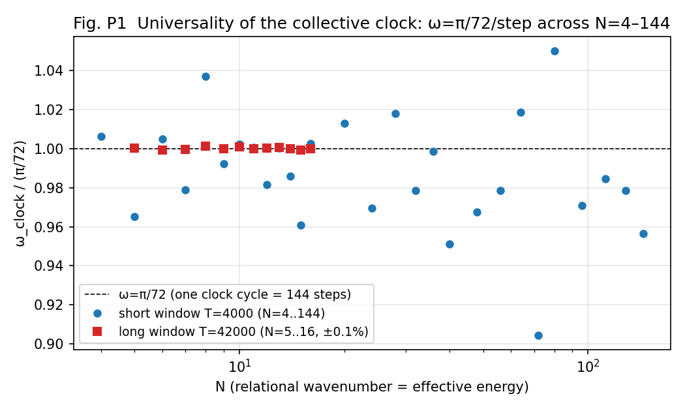

**Fig. P1**: Clock universality. ω/(π/72) = 1 for all N.

The long-window census further shows that the only long-time stationary species in
the low-energy sea (N≤16) is **the single massless ground species locked to the
clock, ρ = 1/1** (|ρ−1| < 9×10⁻⁴; mass measure 10⁻¹¹). All massive sidebands visible
in short windows are finite-lifetime transients, entrained into the clock and gone
(Fig. P2). This refutation process (apparent short-window addresses and a mass law
that vanish in the long window) is fully recorded in §18.

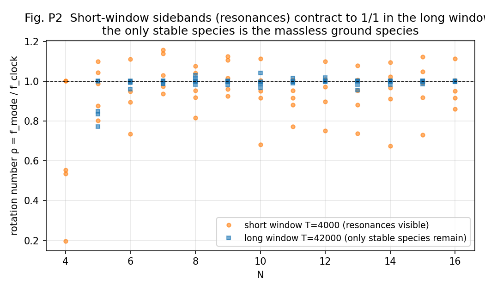

**Fig. P2**: Short-window sidebands (resonances) contract to 1/1 in the long window.

**Hypothesis (Pillar 1)**: the classifier of particle species is the rational address
of U^n = I, and the foundation is a single U^144 clock lattice. Species are classified
by "address (winding) × relation to the clock."

## 4. Pillar 2: the charge law — Q_em = m/3 and confinement = mod-3 readability

### 4.1 Multi-valuedness of charge (state side, measured)

Charged species (winding q=+1) live orders of magnitude longer than neutral
transients (τ≈1.3×10⁴ collisions, 85% retention), but not forever. Their decay is not
disappearance but transport to the partner (+3) by the sum-rule walk m* = 2m_B − m_s
[4] (Fig. P3). Furthermore, isolated pure winding species **self-replicate exactly for
any m** (retention 1.000; τ numerically ∞), and even the sea-free mixture {+1,+3}
does not leak — **the walk requires the m=0 sea as its driver** (the leak targets
{0,−1,+2}/{±4} agree completely with products of the sum rule). The "charge does not
stabilize at ±1" of the previous paper [5] §9.5 is a direct consequence of this
sea-driven walk.

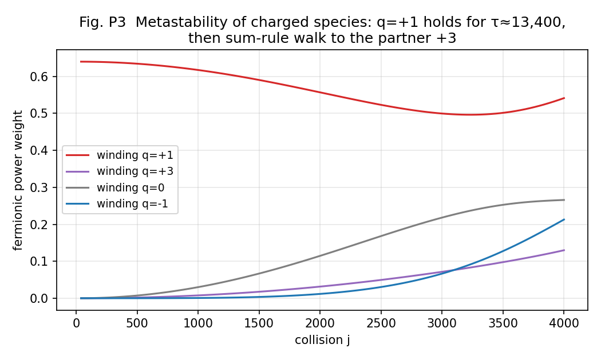

**Fig. P3**: Metastability of charged species and the sum-rule walk (+1 → +3).

### 4.2 The conservation law of winding charge is cyclic

The true conservation law of winding charge is not integer conservation but **cyclic
conservation mod ne** (the η register order; 16 in this system). The pointwise
interaction is a cyclic convolution of the η spectrum (in the continuum limit
δQ = R∮∂_η(s²) = 0), and conservation of the integer charge Q_wind is merely the
in-band special case (measured exactly, CV≈0, in the charged census construction,
Fig. P6a). The apparent breaking is the fold-back of the doubling walk reaching
Nyquist (37% edge-power accumulation; correlation −0.93; Fig. P6b). On a finite
register the doubling ladder neutralizes in 4 steps: 1→2→4→8→0.

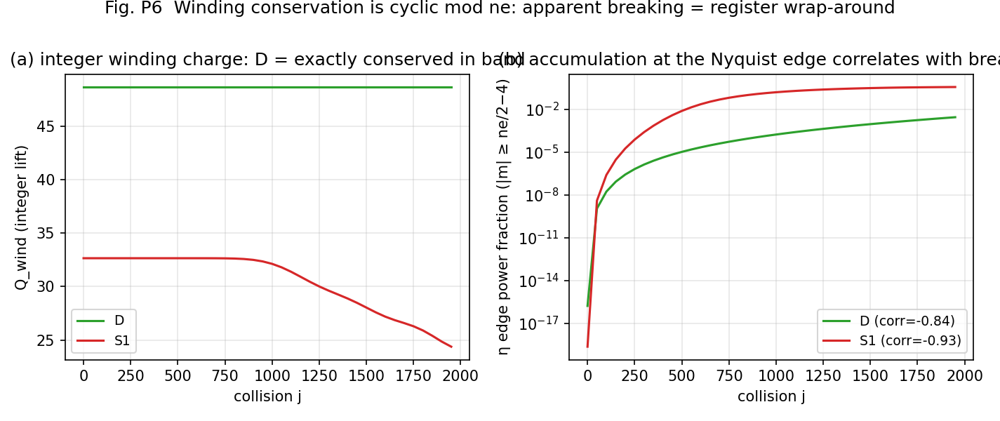

**Fig. P6**: Cyclic conservation and Nyquist fold-back.

### 4.3 Readout rectification (readout side, measured)

Against all products of the sea-driven walk (the doubling/inversion ladder 2^b·(±1)),
**only the observation clock J=3 reads all charged content at |q|=1** (concentration
1.000 — in a universe seeded with +1 as well as one seeded with +2). J=4 erases
charge; J=5, 6 scatter it into many values (Fig. P4). The algebraic basis is
2^b mod 3 = ±1. That the observation clock has denominator 3 rests on prior
measurement [6][7] — the locking tongue widths are dominated by denominator 3 with a
width ratio >461. The value of the elementary charge itself connects to the published
measurement [6] as the rational address sin²(23π/124) = √(4πα) (agreement 16/10⁸).

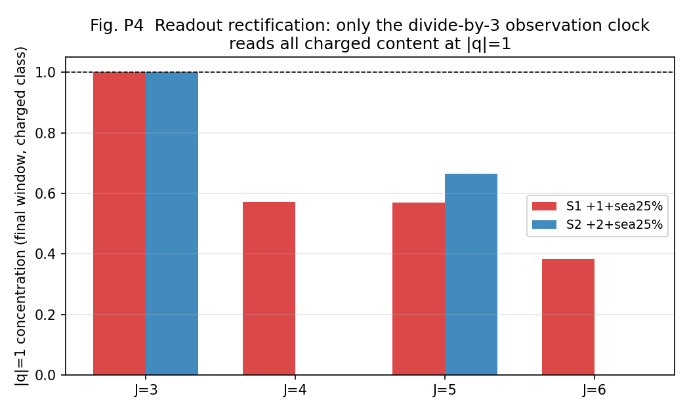

**Fig. P4**: Readout rectification. Only the divide-by-3 clock reads all charged
content at |q|=1.

The bookkeeping also closes: in conserving constructions, ΔQ3 = −3ΔW holds to
7×10⁻¹⁰ (Q3 = net charge readable mod 3; W = the ledger of charge hidden in
mod-3-neutral composites). **Readable charge does not disappear — its decrease equals
exactly what is carried into composites that the denominator-3 clock reads as
neutral** (Fig. P5).

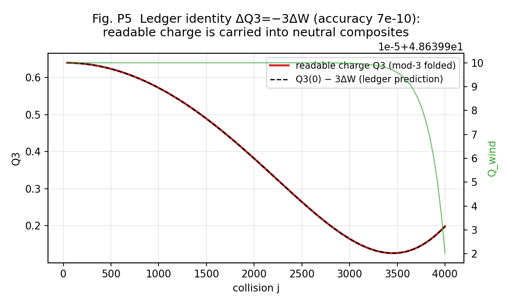

**Fig. P5**: The ledger identity ΔQ3 = −3ΔW.

### 4.4 Hypothesis (Pillar 2): Q_em = m/3 and confinement

We propose the charge law binding the above: **charge is Q_em = m/3, and the dominant
observation clock (denominator 3) reads "3 raw windings = one elementary charge."**
Consequences:

- u type m=+2 → +2/3; d type m=−1 → −1/3; electron m=−3 → −1; ν m=0 → 0.
- **Confinement = mod-3 readability**: the observer's space is the Z₃ quotient of the
  η circle, and only species single-valued on it (m≡0 mod 3) can be read freely.
  Quarks (m≢0) are unreadable alone — **1/3 charge and confinement are two faces of
  one fact** and need no separate explanations.
- Check: proton uud = 2+2−1 = +3 → Q=+1. Neutron udd = 2−1−1 = 0 → Q=0.
  π⁺(ud̄) = 2+1 = +3 → +1. **Integer charges of all hadrons follow automatically.**

**Confinement test (measured)**: quark type (m=+2) + sea starts from readable
fraction f_read = 0.0000 and becomes readable exactly to the extent that the walk
forms m≡0 composites (hadron analogues) (→0.2504 over 4000 collisions). Electron type
(m=+3) + sea starts from f_read = 1.0000 (free from the start). **The isolated
quark-type system stays at f_read = 0.0000 even after 4000 collisions** — "a single
quark cannot be observed" is realized as a consequence of readout (Fig. P9).

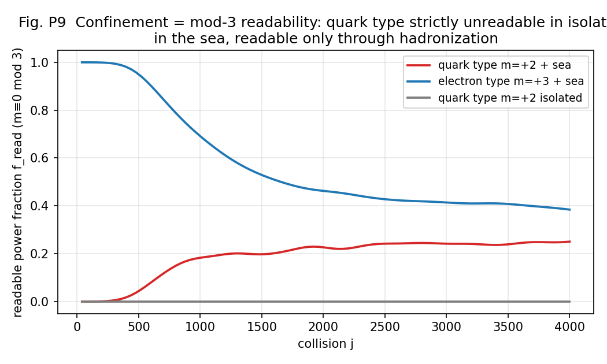

**Fig. P9**: The confinement = mod-3 readability test.

Correspondence with the standard theory: the structure is isomorphic to the Z₃
superselection of the SU(3) center — "free states are triality 0 only" [10][11].
But whereas in the standard theory Z₃ enters as an axiom on the dynamics side (the
center of the gauge group), here mod 3 comes out of the **readout side**, as the
dominant denominator of the observation clock (measured) — one of the novelties of
this paper (§15).

**Two precise distinctions**: (i) this section contains two logics that must be kept
apart — "the denominator-3 clock rectifies the charged walk to ±1" is measurement;
"identifying physical charge with m/3" is hypothesis. To promote the identification
to a law requires the dynamical test of **response** — whether the interaction
strength Γ_int of species with different m scales as m/3 (or (m/3)²) (§19). (ii) The
confinement here is **readout-level confinement** (unreadability in isolation); the
standard notion also contains growing separation energy, flux tubes, and asymptotic
freedom, none of which are derived here. Precisely, this is a **readout precursor
structure of confinement**; the test of whether separating two unreadable species
costs energy increasing with distance (§19) is the condition for promotion to
dynamical confinement.

## 5. Pillar 3: the statistics law — the Z₂ clock cover

### 5.1 Statistics does not live in spatial rotation (measured)

Global rotation of the channel doublet is an exact symmetry of the dynamics (control
runs flat at machine zero for all observables; rotation invariance of Im(b̄a) verified
analytically), and the spatial rotation charge is ℓ=±1 for all observed modes (after
calibration, deviations within ±0.01 at N=6, 8) — neither half-integers nor ℓ=2
appear in occupied modes. The two-valuedness of statistics lives neither on the
channel side nor on the spatial side.

### 5.2 Statistics lives in the double cover of the clock (measured)

Tracking the state phase of a species along the recurrence sequence of the
observables (the autocorrelation peak sequence of the observable field s = Im(b̄a)),
**the phase of charged species is strictly quantized to {0, π} at every recurrence
point** (Φ/π = ±0.999 or +0.002; 3-digit precision; no continuous values) — the state
commutes between the +1 and −1 sheets (Fig. P8). Neutral non-projected bundles show
continuous phases; the presence or absence of quantization separates the species.

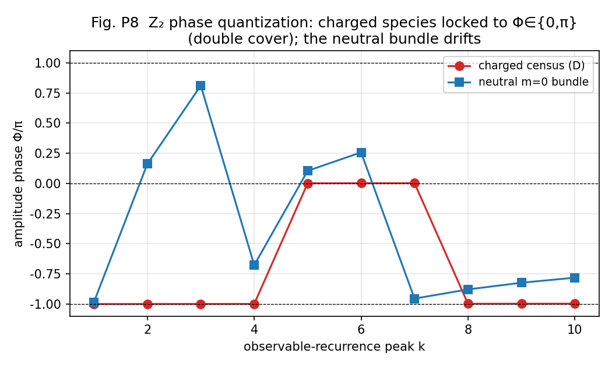

**Fig. P8**: Z₂ phase quantization. Charged species: Φ∈{0,π}; the neutral bundle
drifts.

The cross-table experiment (4 cells: χ parity × winding {1,2}) shows that **the
covering degree depends only on χ parity and not on the winding (charge)**: fermionic
species (even χ frequency = odd harmonics) = covering degree 2 (Z₂, both sheets);
bosonic species = covering degree 1. Moreover a pure m=0 species in the fermionic band
(winding-shift construction; η occupancy (0, 1.000)) also shows covering degree 2 with
Qz2 = 1.00 — **the row of the neutral fermion (neutrino) is established** (Fig. P10).

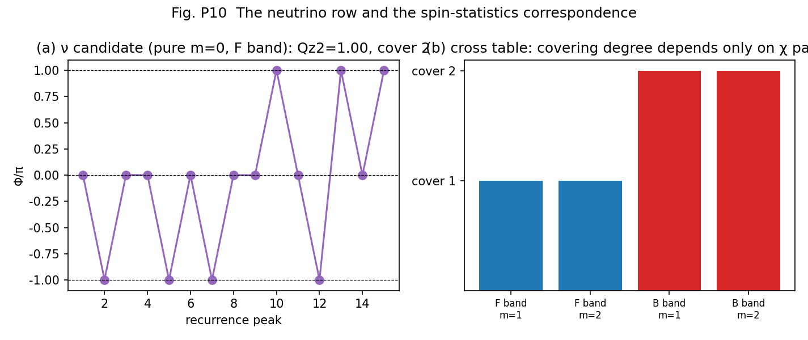

**Fig. P10**: The neutrino row and the spin-statistics correspondence.

### 5.3 Hypothesis (Pillar 3) and prior contrast

We propose **fermion/boson distinction = clock covering degree** (1 = bosonic /
2 = fermionic). This corresponds to the structure by which Finkelstein–Rubinstein
[12] derived the spin-statistics of solitons from the double cover of configuration
space — but differs in that **the double cover lives not in space (rotation,
exchange) but in the clock (state period = observation period × 2)**. The structure
connects to the prior measurement [6][7] of the order-248/observation-124 fidelity
(no recurrence visible on the F₁₂₄ side; F₂₄₈ = 1). (v2 addition: the double cover
also has a spatial embodiment — not as rotation but as **antipodal structure**; see
the spatial double-cover theorem of §10.)

## 6. Pillar 4: the mass law — mass is a relation to the sea

### 6.1 Equivalence theorems (three, measured)

- **Winding-shift equivalence**: e^{imη} is an exact symmetry of the dynamics (b̄a
  invariant); isolated pure-address species are all unitarily equivalent — measured:
  mass², polarization, s_z agree at machine precision for all addresses. **Mass and
  spin are not attributes of an isolated address.**
- **Divisor-class theorem**: in the sea, properties differentiate — but **only down to
  the divisor class gcd(m, 16)** (mass² of odd {1,3,5,7} matches to 5 digits; {2,6}
  match; {4} distinct; Fig. P7). The reason is exact: the unit automorphisms m→um of
  Z₁₆ fix the sea (m=0), so sea coupling cannot distinguish unit addresses in
  principle. Consequence: **the distinction between ±1 and ±5, ±7 does not exist in
  the dynamics; only the mod-3 readout breaks the unit class** — independent support
  for Pillar 2 (readout rectification).
- **χ-band translation symmetry**: placing the same winding species on χ bands
  (10,12,14)/(30,32,34)/(50,52,54) leaves mass² identical to 5 digits — band position
  does not differentiate species either (§16, weakness 1).

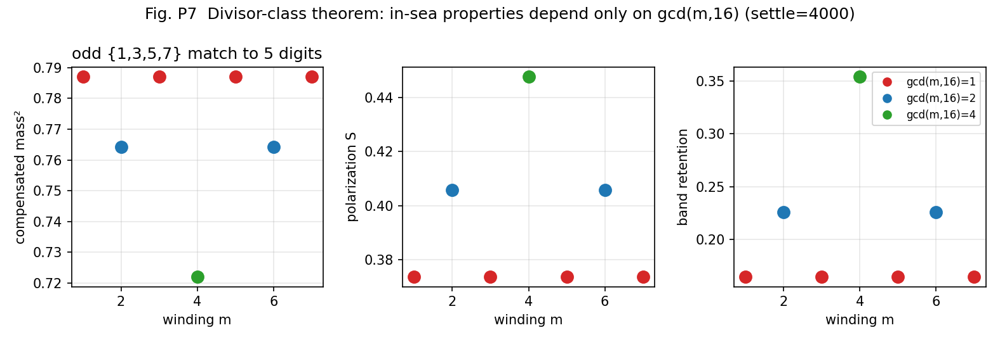

**Fig. P7**: The divisor-class theorem. In-sea properties depend only on gcd(m,16).

### 6.2 Hypothesis (Pillar 4)

**Mass is a relational quantity with the sea (vacuum).** Only the species locked to
the clock (ρ = 1/1) is massless and stable (the photonic ground species; mass measure
10⁻¹¹, measured); content detuned from the clock carries mass as resonance; and the
sea differentiates the individuality of species (lifetime, polarization, mass) at the
level of divisor classes. The view of the vacuum-as-sea as a co-determiner of particle
properties resonates with the lineage of emergent gauge and emergent fermions [13]
(string-net condensation; superfluid ³He), but this paper differs in having measured
the sea dependence of properties in the form of equivalence theorems. (v2 addition:
the readout embodiment of mass is the mean of the local clock field, ⟨ω⟩ — see §11.
The "mass → proper clock" framework originates in the previous paper [5].)

## 7. Pillar 5: the periodic table of waves — the two-sided table and the 62-species assignment

### 7.1 The two-sided table

- **Table A (isolated stable elements)**: pure address species on the U^144 clock
  lattice. All exactly stable by self-replication (measured). Algebraic classifiers:
  readable charge (mod 3), doubling orbit, neutralization steps, η parity. A second
  parity structure: odd addresses resist doubling neutralization maximally (4 steps);
  even ones fall fast (±4 in 2 steps; +8 in 1).
- **Table B (in-sea lifetimes)**: sea coupling selects species — charged means
  long-lived (τ~10⁴), neutral transients short-lived (τ~10²⁻³), composites
  neutralize. **Actually observed "particles" are this metastable hierarchy.**

**The native periodic table (model-intrinsic, the measured primary table)**: we first
place the table written purely in the classifiers of this paper, without
Standard-Model names. The Standard-Model assignment (§7.2) is a hypothesis on top of
this table.

| Raw winding class | mod-3 readable | Neutralization steps | Clock cover (F/B band) | In-sea mass² (divisor class) | Isolated stability | In-sea lifetime |
|---|---|---|---|---|---|---|
| m=0 | 0 (free, neutral) | 0 | 2 / 1 | — (sea, ground species) | stable | ground species stable |
| odd (units) {±1,±3,±5,±7} | ±1 or 0 | 4 (max) | 2 / 1 | 0.787 (5-digit match) | exactly stable | τ~10⁴ (charged) |
| {±2,±6} | ∓1 or 0 | 3 | 2 / 1 | 0.764 | exactly stable | retention 0.226 |
| {±4} | ±1 | 2 | 2 / 1 | 0.722 | exactly stable | retention 0.354 (longest) |
| {+8} | −1 | 1 (shortest) | — | unmeasured | — | unmeasured |

The covering degree is decided by χ parity, not the raw winding class (cross-table
measurement), hence an independent column.

### 7.2 The assignment of the 62 Standard-Model species

Confidence tags: **E** = measured anchor (directly supported by measurements here or
already published) / **S** = structural correspondence (mechanism matches;
quantitative check pending) / **H** = hypothesis (target of future tests).

| Particle | States | Winding m (Q_em=m/3) | Cover | Conf. | Notes |
|---|---|---|---|---|---|
| u, c, t | 18 | +2 (+2/3) | 2 | **E** | m≢0 → confinement (Fig. P9 measured). Color = mod-3-unreadable raw-winding residue (ledger W) |
| d, s, b | 18 | −1 (−1/3) | 2 | **E** | same |
| e, μ, τ | 6 | −3 (−1) | 2 | **E** | free (m≡0). Elementary-charge address sin²(23π/124) [6] |
| ν ×3 | 6 | 0 (0) | 2 | **E** | neutral fermion (established by §5.2) |
| γ | 1 | 0 | 1 | **E** | ground species ρ=1/1 (massless, stable, measured) = vacuum fixed point (§9) |
| g | 8 | color pair (mod-3 neutral, raw winding nonzero) | 1 | S | non-singlet color → unreadable alone = confinement. Octet generation not derived |
| W±, Z | 3 | ±3, 0 | 1 | S | t winding (detuning of its own clock) → massive (consistent with entrainment measurements; dynamics untested) |
| H | 1 | 0 | 1 | S | collective mode of the sea (condensate). ℓ=0 |
| G | 1 | 0 | 1 | H | only as a composite of two ℓ=1 quanta (§8.4 prediction). ℓ=±2 |
| (generation axis) | — | — | — | H | v2 candidate: generations = discrete series of phase-lock levels (§11) |

Total **62 species** (36 quarks + 12 leptons + 8 g + γ + 2 W + Z + H + G).
Antiparticles are m→−m (charge conjugation = η inversion; pair creation measured
[3]). The confidence of each row (measured anchor / structural / hypothesis) is made
explicit in the attached v2 periodic-table visual (Fig. T, Japanese and English).
**Scope of the confidence tags**: the row confidence applies to the primary
attributes (charge identification, statistics cover, confinement); **the generation
assignment (e.g., mapping all three generations u, c, t to the single address m=+2)
and quantitative masses are H for all rows** (the differentiation axis of generations
is the candidate of §11.3; verification program §19.2-6).

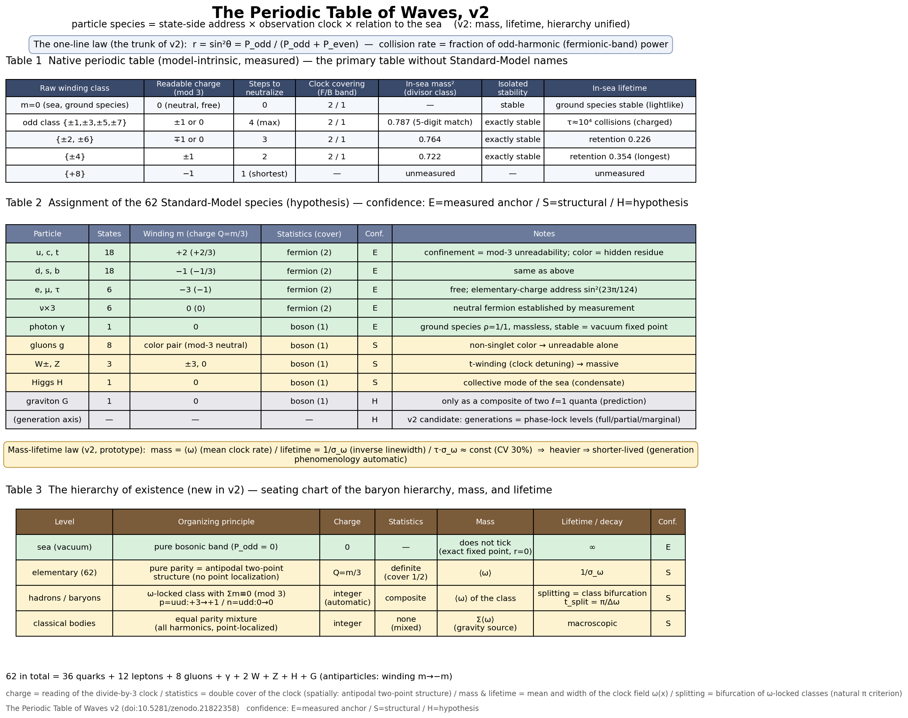

**Fig. T**: The periodic table of waves v2 (the one-line law, the native table, the
62-species assignment, the mass-lifetime law, and the hierarchy of existence).

### 7.3 The relation of the two finite structures (an open structural problem)

Two finite structures are measured in this paper: the universal clock U^144 (§3) and
the winding register Z₁₆ (§4.2). The factorizations are 144 = 2⁴·3², 16 = 2⁴,
144/16 = 9 = 3², and the classifiers of this paper correspond to these factors —
**2 = statistics cover (§5), 3 = charge readability (§4), 16 = raw winding cycle
(§4.2)**. Whether this coincidence is accidental, or a resonance structure in which
both follow from the update rule (a resonance classification of clock order ×
internal winding order), is the largest open structural problem of this paper. It is
registered in §19 as a task to be tested **as the recurrence structure of an
operator**, not as numerology: bring each readout operation into the same operator
representation and measure the order ord(U|_{H_i}) per subspace — the true periodic
law is possibly the family of "orders that a single operator has on different readout
subspaces." The real periodic law of the "periodic table" probably lives here.

## 8. Explanatory power — connections to existing problems

### 8.1 The open problem of the previous paper, "charge unstable at ±1", resolved

The previous paper [5] §9.5 recorded as an open problem that "charge (winding number)
does not stabilize at ±1 but distributes over several values." Under the present
hypothesis this is no contradiction: on the **state side**, the sea-driven walk
(measured, §4.1) keeps dispersing the winding; on the **readout side**, the
denominator-3 observation clock folds all its products back to |q|=1 (measured,
§4.3). "Multi-valuedness of charge" and "universality of the elementary charge"
coexist without contradiction — the open problem turns into a prediction of the
hypothesis.

### 8.2 The 1/3-charge problem of quarks

Under Q_em = m/3, fractional charge (why 1/3) and confinement (why never seen alone)
are a single mechanism, mod-3 readability (§4.4; measured, Fig. P9).

### 8.3 Antimatter

Charge conjugation m→−m is a symmetry of the spectrum, and pair creation is a
necessity of the walk (published measurement [3]).

### 8.4 The weakness of gravity

The rotation-generator spectrum of the condensate has no linear ℓ=2 frame
(calibration ratio at most 1.000 exactly; measured). Spin 2 can exist only as a
**composite** of two ℓ=1 quanta, and indeed the spectrum of the squared readout
carries a coherent 2ω quadrupole line at all N (ratio 2±6%). The measurements end
here. Beyond this we state a conjecture: if it is a second-order composite, its
coupling is expected to suffer square suppression as a product of first-order
quantities (the connection to an α_G=(m/M)²-type gravitational coupling [15] is
untested — a prediction); if it passes, **the reason gravity is weak and the reason
it is hard to test become one structure**. This is a candidate appearance, from the
state-space side, of a structure isomorphic to gravity amplitude = gauge amplitude²
(double copy [16]).

### 8.5 v2 addition: correlation of the mass and lifetime hierarchies

In the charged-lepton series e, μ, τ of the Standard Model, a striking pattern holds:
as the generation rises and the mass grows, the lifetime shortens (for quarks the
very concept of a free-particle lifetime is not simple because of confinement).
Conventionally this correlation is computed case by case from decay phase space. New
pillar 8 (§11) offers a structural candidate: if mass and linewidth (inverse
lifetime) are **the mean and the width of one and the same clock-field
distribution**, their correlation is a consequence of structure, not of computation.

### 8.6 v2 addition: why elementary particles are not points

New pillar 7 (§10) gives as a geometric theorem: "species with definite statistics
carry an antipodal two-point structure and do not localize at a point." It is the
in-model counterpart of the circumstance that in quantum field theory particles are
modes, not points. Conversely, a body localized at a point necessarily mixes both
parities and has no statistics — that point particles have no statistics and that
statistical species are not points are two faces of the same geometry.

### 8.7 v2 addition (conjecture, confidence H): a hint that vacuum energy does not gravitate

A uniform sea contributes only a uniform offset to the local clock field and nothing
to its **gradient**. If gravity is read as the gradient of the clock field, vacuum
energy may be absorbed into a uniform gauge shift and fail to gravitate. This is a
conjecture (confidence H), registered as a target of the next paper (the gravity
readout).

---

# Part II — The new findings of v2: unification by the clock field ω(x) (new pillars 6–10)

Of the measurements in Part II, §9(A) is on the published system itself (global θ,
[3]); §§11–13 are on the localization prototype of the readout (§2.4). The
legitimacy of the prototype rests on the consistency battery of §14. Quantitative
values are flagged as prototype measurements, and claims are restricted to scaling
forms.

## 9. New pillar 6: the one-line law — r = P_odd/(P_odd+P_even)

### 9.1 The law

Exactly from the definition of the θ readout of the two-body system [3], the
reflection rate per interaction is

**r = sin²θ = P_odd / (P_odd + P_even)**

(P_odd = the power of the fermionic band = the intrinsic odd harmonics; P_even = the
rest). **The reflection rate per interaction — how much is exchanged — is decided by
the odd-harmonic fraction alone** (r is a rate, not a probability; the interaction
acts at all times). Even harmonics enter the rotated side but appear only in the
denominator of what decides the rotation. The response signs are opposite:
∂r/∂P_odd = P_even/P² > 0, ∂r/∂P_even = −P_odd/P² < 0 — even at equal amounts the
roles remain distinct (the analogue of the ± of charge).

### 9.2 Consequences (all measured)

1. **The vacuum fixed point**: the pure bosonic sea (P_odd=0) is exactly stationary
   at r=0 — **light does not collide with light, and the vacuum does not tick**
   (std of τ_t ~10⁻¹⁶ in control runs). It is the dynamical embodiment of the γ row
   of Pillar 5 (ground species; massless; stable). **The two clocks distinguished
   (important)**: "the vacuum does not tick" means that the **local reflection clock
   of the two-body system** (the local readout τ_t) does not advance; it does not
   mean that the **collective phase clock of the N-body condensate**,
   ω_clock = π/72 (Pillar 1), does not exist. The relation between the two clocks —
   the local reflection clock and the collective phase clock — is registered as an
   open problem in §16 (if unified, Pillar 1 and new pillar 6 connect).
2. **The candidate source that drives the clock and mass readouts = odd-band
   power**: the source that moves the clock is odd-harmonic content only. The role
   asymmetry — matter = the side that causes interaction; light = the side that does
   not — follows from the formula. (What is exact is P_odd → r; P_odd → mass passes
   through the connection hypotheses of §11 — r → ω(x) → ⟨ω⟩.)
3. **The necessary condition for the Z₂ classification to have dynamical meaning
   (within this model)**: if r were parity-symmetric, no readout of this model could
   distinguish the fermionic and bosonic sectors, and the Z₂ classification would
   degenerate into nomenclature. The necessary condition for the statistics
   classification to make a readable difference in this model is this asymmetric
   coupling (we do not claim a necessary-and-sufficient condition for fermi/bose
   statistics in general).

### 9.3 The asymmetry, measured (attachment #29)

An equal-amplitude initial condition — a bundle tuned by bisection to fermionic
fraction f₀ = 0.500000 exactly — evolved for 3000 collisions in the published system
(global θ) **flows out to f* = 0.4936 ± 0.0012**. f = 0.5 is not a fixed point = the
parity coupling is indeed asymmetric (Fig. V2a). The breaking is small, about 1% —
the dynamics is nearly parity-symmetric, with a slight breaking (near-symmetry; the
near-degeneracy of the two sectors is registered as an observation to track).

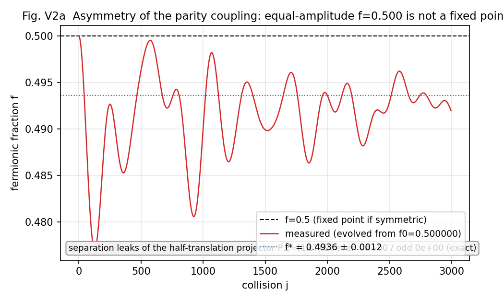

**Fig. V2a**: Equal-amplitude f = 0.500 is not a fixed point (asymmetry of the
parity coupling).

## 10. New pillar 7: the spatial double-cover theorem

### 10.1 The even/odd distinction is a transformation response

The even/odd distinction is not an absolute label but the **Z₂ representation of the
half-translation T: x → x + n/2 of the fundamental wavelength λ₀** (even = +1
representation; odd = −1). The projectors P± = (1±T)/2 separate exactly regardless of
amplitudes — measured (attachment #29B): applied to the full-harmonic, center-phased
ladder (an equal mixture, even 49% / odd 51%), the odd-k leak of the even part and
the even-k leak of the odd part are both **0.0** (machine precision). "If both are
present at equal amplitude they cannot be distinguished" does not hold — the
discriminator is not amplitude but transformation response.

### 10.2 The theorem (constructive)

As direct consequences of the half-translation representation:

1. **Pure-parity species (species of definite statistics) cannot localize at a single
   point and necessarily carry an antipodal two-point structure** (even = symmetric
   image; odd = antisymmetric image). The double cover of the clock (Pillar 3) is
   realized as spatial structure.
2. **A point-localized body requires parity mixing and carries no statistics**
   (composites; classical bodies; see the hierarchy of §13). Precisely: a strictly
   point (delta) localized state requires **equal norms** of even and odd parts;
   finite-width localization admits width-dependent deviations (the measured
   full-harmonic ladder is even 49% / odd 51%; attachment #29B).

### 10.3 Position

Pillar 3 said "the double cover lives in the clock." New pillar 7 reinforces it: the
double cover also has a spatial embodiment — not as rotation
(Finkelstein–Rubinstein type [12]) but as **antipodal structure**. The covering
degree of the clock (dynamical) and the antipodal structure (geometric) are two faces
of the same Z₂.

## 11. New pillar 8: unification of mass, lifetime, and generations — the mean and width of the clock field

### 11.1 Definitions and prediction

Take the distribution of the local clock field ω(x) (the phase advance per step; the
readout τ_t(x)) on the support of a species:

- **mass = ⟨ω⟩** (the mean clock rate on the support)
- **lifetime = 1/σ_ω** (the inverse linewidth; σ_ω = the spatial std of the clock
  rate on the support)

Prediction: **the linewidth-lifetime relation τ_coh · σ_ω ≈ const** — the dynamical
version, as statistics of the clock field, of the energy-time uncertainty
(the Weisskopf–Wigner linewidth-lifetime relation [23]).

### 11.2 Measured (attachment #30; localization prototype)

Over 8 configurations (composition f, amplitude, and harmonic width varied
independently; σ_ω swept over a 6× range):

1. τ_coh is monotonically anti-correlated with σ_ω (σ_ω 0.044→0.247 as τ 420→99).
2. **The product τ_coh·σ_ω = 32.1, CV 29.7%** (7 uncensored) — order-1 invariance
   over the 6× range (Fig. V2b).
3. **Correlation of mass ⟨ω⟩ and linewidth σ_ω: +0.904** — the heavier, the broader
   the linewidth, the shorter-lived.

**Fig. V2b**: The linewidth-lifetime relation τ·σ_ω ≈ const, and the positive
mass-linewidth correlation.

### 11.3 The new candidate for generations

In v1, the hypothesis "generation = χ-band position" had been refuted (χ-band
translation symmetry; §6.1). New pillar 8 supplies a replacement candidate:

> **Generation = a discrete series of phase-lock levels at the same address**
> (ground generation = full lock; 2nd = partial; 3rd = marginal).

Under this candidate, mass ratios, linewidth ratios, and inverse-lifetime ratios
between generations should correlate as deformations of a single distribution.
Verification program (§19): the **generation triple-correlation test** — do mass
ratio ≈ σ_ω ratio ≈ inverse lifetime ratio hold across generations? Confidence H
(hypothesis; preliminary measurements support the mechanism).

### 11.4 The three mass readouts and (t, R, Q) — the component hypothesis (confidence H)

This series contains three readouts of mass: (i) μ_Gram = detΓ/T² (the degree of
non-coherence [5]; T is the conserved readout R1); (ii) the relational quantity with
the sea (divisor class gcd(m,16); Pillar 4; η = the charge axis); (iii)
m_clock = ⟨ω⟩ (the local clock mean; new pillar 8). Instead of viewing these as
"different quantities under one name," we propose the **component hypothesis**: the
three readouts correspond respectively to the three right-hand axes of the signature
split of the zero closure, x² + y² + z² = t² + R² + Q² —
**⟨ω⟩ = the t axis (proper clock), μ_Gram = the R axis (radial norm), sea relation =
the Q axis (charge register)**. That is, the hypothesis is that **the internal state
supporting the mass readouts has three components (t, R, Q)**. The observed mass
(a Lorentz scalar) is the quadratic invariant m² = M_t² + M_R² + M_Q² (equal to the
spatial-side norm by the closure); there is no need to call the components
themselves "three kinds of mass." The S row of Pillar 5 in which W/Z acquire mass by
t winding (clock detuning) fits this picture in which different species draw their
mass from different axes, and the sign-vector thought experiment [1] of the starting
point returns at the readout level. A discriminating experiment is registered in
§19.2: the **two-hypothesis form of the simultaneous three-way test** — (A) the
dictionary hypothesis: the three lie on a single-valued curve; (B) the component
hypothesis: the three are independent components lying on a quadratic-form surface.
Discriminating point: if a pair of states can be constructed with nearly equal mass
but different charge/clock character (the proton/neutron type — Σm = +3 vs 0 with
nearly equal masses), A breaks and B survives.

## 12. New pillar 9: the splitting readout — decay requires no added force

### 12.1 The claim

The splitting (decay) of a wave requires no force added to the dynamics.
**Dephasing by non-uniform ω is itself the dynamics of splitting** — parts with
different ω lose their mutual phase and become independent without anything being
done. All that is needed is a readout criterion:

- **Particle number = the number of ω-locked equivalence classes**. Two regions are
  one particle while the accumulated relative clock phase stays below π (inside one
  interference fringe = coherent). π is a natural criterion, not a tuning parameter.
- Prediction: **t_split = π/Δω**.

This readout derives from the same fiber relational quantities as the spacetime
gauges (τ_x, τ_t) and position. That is, **the classification of species, particle
number, mass, lifetime, and splitting, and the gauges of space and time, are outputs
of a single readout function** (the readout unification hypothesis). The perspective
of classicality emerging by decoherence belongs to the lineage of [24]; this paper
differs in formulating it as a readout criterion for particle number (the π
criterion).

### 12.2 Measured (attachment #31; localization prototype)

Over six pairs of different composition, the readout detects the 1-particle →
2-particle transition, with
**t_split·Δω/π = 1.29 (CV 67%; all pairs at order 1)** (Fig. V2c).

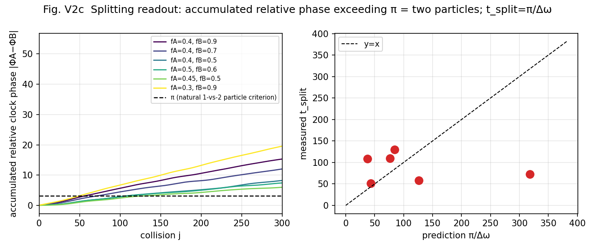

**Fig. V2c**: The splitting readout. Accumulated relative phase crossing π, and
t_split = π/Δω.

**Known design limitation (honest registration)**: splitting was detected even for a
same-composition control pair. The cause is that the phase of the sea carrier
(wavelength n/3) differs between the packet positions, and the interference creates a
spurious Δω. The refined experiment with carrier-phase-aligned placement (separation
= integer multiples of the carrier wavelength) is registered in the verification
program (§19).

### 12.3 Side observation: survival of a coherent core

The self-overlap C(t) does not fall to 0 but bottoms out at 0.55–0.76 — **a
phase-locked coherent core survives**. This suggests that decay may be not
"annihilation" but splitting into "a stable descendant + dephased fragments"
(to be tracked).

## 13. New pillar 10: the two conditions of a stationary particle, and the hierarchy of existence

### 13.1 The two conditions (measured; attachment #32)

A true stationary particle of the dynamics requires both of:

1. **Localization**: stack all harmonics (even + odd) of the fundamental wavelength
   λ₀ with phases aligned at the center. Measured: the ringing (the maximum time-std
   of the instantaneous field τ_t) decreases monotonically with the harmonic width
   σ_k and approaches zero (σ_k=8: 3.6×10⁻¹ → σ_k=128: 7.4×10⁻³; Fig. V2d). With
   even harmonics only it plateaus at 4.0×10⁻¹ — **both parities of harmonics are
   necessary**.
2. **Phase locking**: ω(x) = const (the proper clock uniform on the support). This is
   a nonlinear eigenvalue problem — the **candidate stationary-particle equation** of
   this model. The true next step is the enumeration of localized nonlinear
   eigensolutions F[Ψ] = e^{iΩ}Ψ of the universal interaction map F (§19.2) — if
   found, a "particle" becomes not a classification name but an isolated
   eigensolution of the dynamics.

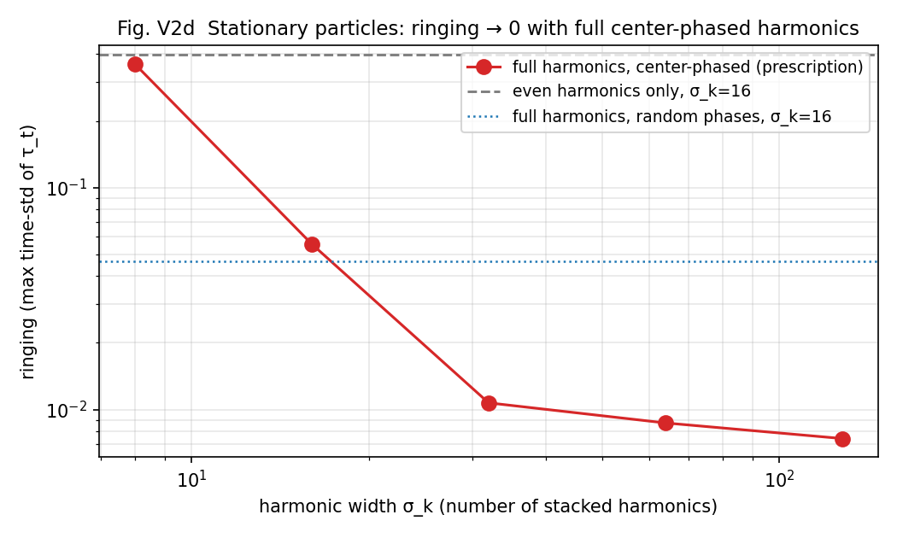

**Fig. V2d**: The stationary-particle prescription. Full harmonics, center-phased →
ringing → 0.

Accompanying exact structure: the channel ratio λ = b/a = −i (circular polarization)
is an **exact invariant manifold** of the elastic and inelastic rotations (verified
algebraically; numerical deviation 0.0; amplitudes frozen everywhere) = the definite
charge state. The construction by stacking the harmonic family (= child closures)
originates in the two axioms of [15] (resolution + scale invariance), and the
correspondence ringing = unstable relative equilibria connects to the onset-mode
classification of [22].

### 13.2 The hierarchy of existence (the seating chart of the baryon hierarchy)

Combining new pillars 7, 8, and 9, the hierarchy of existence becomes one table
(Fig. T, bottom panel; Table 3):

| Level | Organizing principle | Charge | Statistics | Mass | Lifetime / decay | Conf. |
|---|---|---|---|---|---|---|
| sea (vacuum) | pure bosonic band (P_odd=0) | 0 | — | does not tick (exact fixed point, r=0) | ∞ | E |
| elementary species (62) | pure parity = antipodal two-point structure (no point localization) | Q=m/3 | definite (cover 1/2) | ⟨ω⟩ | 1/σ_ω | S |
| hadrons / baryons | ω-locked class with Σm≡0 (mod 3); p=uud:+3→+1 / n=udd:0→0 | integer (automatic) | composite | ⟨ω⟩ of the class | splitting = class bifurcation, t_split=π/Δω | S |
| classical bodies / condensates | equal parity mixture (all harmonics, point-localized) | integer | none (mixed) | Σ⟨ω⟩ (gravity source) | macroscopic | S |

Baryons are not "an extra box outside the 62 species" — they hold seats for mass,
lifetime, and decay as one level of the same readout, the ω-locked classes. The
integer-charge check of hadrons of Pillar 2 (p = uud → +1) lives directly in the
third row of this table.

## 14. The consistency battery — the classification is not an artifact of a particular engine

In the v2 verification program we constructed two localization prototypes of the θ
readout of the two-body system [3] (§2.4). Does localization break the
classification? — nine pillar experiments (v4b, v6, v7, v9, v10b, v13b, v14, v15,
v17b) were run **with script bodies unmodified**, swapping only collision_step,
against three engines in parallel (the published system = global θ / local θ sharp /
local θ smooth; attachment folder 周期表追試_局所θ_v1).

**Results**:

1. **Soundness**: the global-θ runs agree completely with the published result JSONs
   for all scripts (verdict strings and all numbers).
2. **The integer and phase structures are completely robust**: the Z₂ covering cross
   table (identical verdicts in 4 cells), the neutrino row (covering 2; Qz2 = 1.00;
   phases strictly {0,±π}), confinement (isolated exactly 0, ~10⁻²⁹), the ledger
   identity (ΔQ3=−3ΔW residual ~10⁻¹⁴), address equivalence (all claims identical),
   the divisor-class theorem (pass; spreads even shrink). **The skeleton of the
   classification is invariant under localization of the readout.**
3. **Continuous quantities shift by a few percent**: the equilibrium fermionic
   fraction of the sea f* is 0.4695 (published) → 0.4578 (sharp, −2.4%) / 0.4428
   (smooth, −5.6%); hadronization rates by −2.7 to −4.1%. Continuous quantities
   require recalibration if a local engine is adopted.
4. **The single qualitative regression = Q_wind conservation**: the conservation of
   the net winding charge, exact under global θ (CV 2.6×10⁻⁷), leaks slowly under
   local θ (5–6% over 4000 collisions). This is a limitation of the prototypes and is
   registered as requirement 10 for the universal function (§19).

This battery is simultaneously independent evidence that the classification of
Part I is carried not by "the particular implementation called global θ" but by the
structure of the readout (band fractions, parity, mod 3).

---

# Part III — Position, weaknesses, refutations, and requirements for the next paper

## 15. Relation to prior work, and the novelty restricted

Each component of this hypothesis has a strong prior lineage: winding = charge
(Skyrme [17]; Kaluza–Klein [18]), mod-3 confinement (triality [10][11]), the double
cover of statistics (Finkelstein–Rubinstein [12]), vacuum = sea (Wen, Volovik [13]),
gravity = square (KLT/BCJ [16]), full-assignment enterprises (the Eightfold Way [9];
preons [14]), the linewidth-lifetime relation (Weisskopf–Wigner [23]), classicality
by decoherence (Zurek [24]). **This paper claims no novelty for the components.**
The novelty is restricted to four points:

1. That these components come out simultaneously as **measurements of a single
   anonymous dynamics** that assumes no particles (confluence).
2. The presentation of a counterpart in which charge unit, confinement, and
   elementary-charge uniqueness come from **the divisor structure of the observation
   clock (the readout side)**, not from axioms on the dynamics side (the center of a
   gauge group).
3. The measurement that the double cover of statistics lives in **the clock** (state
   period = observation period × 2), not in space (rotations of configuration space)
   (with v2 adding its spatial embodiment as antipodal structure; §10).
4. (v2) The presentation of the unification in which mass, lifetime, generations, and
   splitting come out as statistics (mean, width, locked classes) of a single clock
   field ω(x), from the same readout function as the spacetime gauges.

## 16. Weaknesses and untested parts (honest registration)

1. **The origin of generations is unresolved (though v2 obtained a positive
   candidate)**: the naive hypothesis generation = χ-band position is refuted
   (χ-band translation symmetry; §6.1). The v2 candidate is the discrete series of
   phase-lock levels (§11.3) — verification program specified; not yet run.
2. **The W/Z rows**: not directly producible in the low-energy laboratory (N≤16,
   small sea; immediate register-edge decay; structural). The 1/δ² scaling test of
   the effective contact vertex (the Fermi-theory road) is specified; not yet run.
3. **The graviton row**: the 2ω quadrupole line exists at all N, but the pre-fixed
   criterion (|ratio−2|<0.02) passes only 1/3 — frame calibration incomplete.
4. **Dependence on the register order ne=16**: details of Table A (neutralization
   steps etc.) are functions of ne. Re-examination on ne-variable systems is needed
   (also a testable prediction: "the period of the periodic table is a function of
   the register order").
5. **The unification of Q_em = m/3 with the transmission charge √(4πα) [6][19] is
   incomplete** — the relation between the "unit" (3 windings) and the "value"
   (0.302822) of the elementary charge is a task for the next papers. v2 addendum:
   the hypothesis "fermions concentrate at odd fraction f≈0.7 = 1−√(4πα)" was
   **refuted** by test (the f of actual species distributes over 0.02–0.53; the
   prototype's maximum position is configuration-dependent; §18 (14)). The seat of
   0.6972 remains in the context of **the reflection rate of a charge-readout
   event**, not species composition.
6. Part of the sea constructions (artificial projected seas) are known to be outside
   the conservation class (Nyquist fold-back; §4.2). The quantitative results of the
   affected experiments are treated with reservation; the qualitative conclusions
   were cross-checked on in-class series.
7. **(v2) The quantitative values of Part II are prototype measurements**:
   τ·σ_ω=32.1, the t_split coefficient 1.29 etc. carry scatter of CV 30–67%. The
   claims are restricted to scaling forms (invariance of products; order-1), and no
   precise coefficient values are claimed. The splitting control requires
   carrier-phase alignment (§12.2; a design rule).
8. **(v2) The relation of the two clocks is unresolved**: the local reflection clock
   of the two-body system (τ_t; stops at P_odd=0) and the collective phase clock of
   the N-body condensate (ω_clock = π/72; Pillar 1) are not yet unified (§9.2). If
   unified, Pillar 1 and new pillar 6 connect; if not, the word "clock" was naming
   two independent quantities — registered as a decidable open problem.

## 17. Refutation conditions

1. If an observation clock with a denominator other than 3 is constructed that
   rectifies the entire product set of the same charged walk into a unique
   elementary-charge unit, Pillar 2 is rejected.
2. If, in the long-window limit with the same condensed phase, the same update rule,
   and the same settling criteria, a series is obtained in which ω deviates
   systematically from π/72, Pillar 1 is rejected.
3. If a species is constructed whose covering degree varies independently of χ
   parity, Pillar 3 is rejected.
4. If a measurement shows species properties (mass, lifetime, polarization)
   differentiating without a sea, Pillar 4 is rejected.
5. If a construction is found in which a species with m≢0 (mod 3) becomes readable
   alone, the confinement law is rejected.
6. (v2) If a parity-symmetric dynamics (r symmetric in parity) reproduces any of the
   covering-degree difference, confinement, or elementary-charge uniqueness, new
   pillar 6 is rejected.
7. (v2) If a point localization of a pure-parity species is constructed, new pillar 7
   is rejected.
8. (v2) If a family is found in which τ_coh·σ_ω systematically diverges or vanishes,
   new pillar 8 is rejected.
9. (v2) If, after carrier-phase alignment, t_split·Δω/π does not converge to order
   1, the π criterion of new pillar 9 is rejected (search for another criterion).

## 18. Record of refutations and corrections (15 items, summarized)

We record every hypothesis and instrument refuted in the course of this work:
(1) short-window sideband addresses are transients, not stable species (vanish in the
long window). (2) The mass = detuning² law is an apparent relation on transients.
(3) The naive form of ±1 fixed-point uniqueness (any pure m is a fixed point;
uniqueness does not follow). (4) The mass-width correlation fails (r=−0.07). (5) The
sea-construction-convention hypothesis (χ analytic projection) fails — the true cause
of conservation breaking is Nyquist fold-back (§4.2). (6) ±1 uniqueness by escape
rates is undecidable in principle by the divisor-class theorem. (7) The kinematic
version of the SU(2) recurrence-angle discriminator is spinorial for all states
(trivial). (8) Single-point covering-degree judgment picks accidental π proximity
(calibrated to recurrence-sequence judgment). (9) The linear ℓ=2 frame for the
graviton is absent (reinterpreted as composite). (10) Generation = χ-band position is
refuted. (11) The band-shift method of W/Z detuning injection fails (effectively
linear dispersion). (12) The projection method of the ν construction fails (the
bundle hair m=+1 is the cause; solved by the shift method). (13) The earlier
projected seas are amplified numerical residue (legitimate as an m=0 field;
qualitative results unchanged; recorded). **(14) (v2) The hypothesis "fermions
concentrate at odd fraction f≈0.7" is refuted** — the prototype's signal maximum at
f≈0.77 is configuration-dependent (vanishing under amplitude/harmonic-width change),
and the f of actual species distributes over 0.02–0.53, not clustering at 0.7;
dynamical equilibria are pulled instead toward f≈0.5 (near symmetry). **(15) (v2) The
window-mean drift indicator of the splitting experiments is broken** — it misjudges
stationarity through incommensurability of beat periods with the observation window
(calibrated to the true indicator = the time-std of the instantaneous field; §13.1).
Details of each item are in the attached analysis notes.

## 19. Requirements handed to the unified dynamics (the specification of the next paper; 8 → 11 items)

To verify the classification hypothesis at the dynamics level, the two dynamics must
be unified into a single **universal interaction function**, and the 62 species must
be shown to be generated, to decay, and to interact as its spectrum. The present
measurements fix the requirements that function must satisfy:

1. **Anonymity**: only wave shapes as input; no per-species casework (no IF
   statements).
2. **All channels at once**: electromagnetic (winding exchange), weak (clock
   detuning), strong (mod-3-unreadable raw-winding residue), and gravitational
   (second-moment coupling) arise not as separate terms but as different readouts of
   one operation. It must drive the three planes (xy = spin / zR = mass / tQ =
   charge) [20] simultaneously.
3. **Conservation laws automatic**: cyclic winding conservation (§4.2), closure
   conservation, and norm conservation held by the structure of the operation, not by
   design.
4. **Reproduction of the universal clock**: the U^144 clock lattice with ω = π/72
   (§3) appears as spectrum.
5. **Emergence of selection rules**: the sum rule m*=2m_B−m_s, the
   doubling/inversion ladder, Z₂ phase quantization, and the divisor-class structure
   appear without hand placement.
6. **Exact computability**: anonymity ⇒ computation linear in state size [4]
   (closed-form or integer-exact).
7. **Specialization to the two systems**: the two-body closed-form solution [3] and
   the N-body relational-wave dynamics [2] re-derived as restrictions/limits of the
   function.
8. **Refutation form**: if any of the 62 assignments (§7.2) fails to appear in the
   spectrum, the periodic-table hypothesis is rejected row by row.
9. **(v2) Gravity on the gauge side**: gravity cannot be inserted as a state-side
   potential — it necessarily breaks the closure Σx²=0 (measured: an injection of
   amplitude 10⁻³ breaks it by 31% in 200 steps; the bare dynamics 10⁻¹³; gauge-side
   operations exactly 0). Gravity enters as gauge distortion on the projection
   (readout) side that creates space.
10. **(v2) Conservation under localization**: the localization of the θ readout must
    preserve Q_wind conservation exactly (§14: both current prototypes leak 5–6%
    over 4000 collisions = requirement unmet; conservation-compatible localizations
    such as the circular-polarization invariant manifold are the search direction).
11. **(v2) Splitting as readout**: splitting/decay is not added as a force but read
    as ω-coherence clustering of the spacetime readout function (the π criterion; no
    tuning parameters; the interaction function untouched; §12).

### 19.2 The verification program (8 items, in priority order)

In parallel with the construction of the universal function, we register the
experiments that can directly strengthen or refute the present hypotheses:

1. **Dynamical derivation of denominator 3, and charge response**: the dominance of
   denominator 3 currently rests on the locking measurements [20]. An analytic
   derivation of why the denominator-3 Arnold tongue is maximal in this dynamics
   would promote the "3" of Q_em = m/3 from empirical choice to dynamical necessity.
   Together, measure whether the exchange and phase shift of two species (m₁, m₂)
   scales as the product m₁m₂/9 (the Coulomb-type charge-product test) — if it
   passes, m/3 is promoted from bookkeeping to a physical charge appearing in
   interactions.
2. **Clock covering degree and exchange sign in one experiment (the decisive
   experiment to run before the universal function is built)**: connect covering
   degree 2 ⟺ exchange sign −1 of two identical species in a single experiment. If
   the exchange operation E and the one-clock-cycle operation T are shown to belong
   to the same nontrivial class of one double cover on state space (E ≃ T,
   E²=T²=I), then half-integer return, exchange sign, exclusivity, and clock
   covering reduce to a single Z₂, and Pillar 3 advances from "resembles statistics"
   to "a reconstruction of the structure of statistics."
3. **(v2) The simultaneous three-way mass-dictionary test (two-hypothesis form;
   §11.4)**: on one family of states, measure μ_Gram = detΓ/T², r = P_odd/P_total,
   and ⟨ω⟩ simultaneously, and discriminate whether they (A) lie on a single-valued
   dictionary curve or (B) lie on a quadratic-form surface (the component
   hypothesis). Under A, the mass theory of the previous paper, new pillar 6, and
   new pillar 8 contract into a single theorem candidate; under B, the (t,R,Q)
   three-component structure of the mass readouts is established — a discriminating
   experiment that fixes structure whichever way it falls, and with this one
   experiment the Gram mass of the previous paper, the sea-dependent mass of v1, the
   clock mass of v2, and the (t,R,Q) hypothesis are sorted at once; hence its
   priority is raised.
4. **The deformation law of the table under variable register order**: for ne = 12,
   18, 24, 32, …, measure whether divisor classes, neutralization steps,
   readability, and covering structure track gcd(m, ne)/Div(ne). If they track, the
   divisor-class theorem generalizes; if not, there is hidden structure specific
   to 16.
5. **Blind prediction**: without Standard-Model names, predict from the model alone
   the unoccupied addresses, lifetime ordering, charges, covering degrees, and decay
   targets, then compare after the fact with the known particle table — a test
   format with the decisive power of the Ω⁻ of the Eightfold Way.
6. **(v2) The generation triple-correlation test with orthogonal control**:
   construct the phase-lock-level series at one address and measure whether mass
   ratio ≈ σ_ω ratio ≈ inverse-lifetime ratio across generations (the direct test of
   new pillar 8). Together, with a factorial sweep of amplitude, composition, and
   harmonic width, construct series in which ⟨ω⟩ is held nearly constant while σ_ω
   varies (and vice versa), to confirm that the +0.904 mass-linewidth correlation is
   not a product of common driving.
7. **(v2) The carrier-phase-aligned splitting experiment**: align packet separations
   to integer multiples of the carrier wavelength, separate the composition-borne Δω
   from the spurious carrier-phase Δω, and re-test t_split = π/Δω (the refinement of
   new pillar 9).
8. **(v2) Explicit verification of the Z₂ covering on the local engines**: re-run
   the covering-degree experiments not yet included in the consistency battery
   (§14) on the local engines, completing the robustness of the integer structures.

## 20. Reproducibility

All experiments are published as deterministic scripts (32) in the same folder as
this paper. The correspondence table (実験一覧_v1.md, including the v2 additions
#29–35) gives the complete mapping of scripts ↔ result JSONs (29) ↔ figures (the ten
v1 figures in Japanese and English; the four new v2 figures in Japanese and English;
the periodic-table visual in Japanese and English) ↔ claims. The full consistency
battery (§14; 27 runs = 9 experiments × 3 engines) is published in a separate folder
(周期表追試_局所θ_v1) together with run logs, result JSONs, the comparator, and the
battery report. Judgment criteria are fixed and recorded at the head of each script
before execution.

## References

**Self-citations (sources of the dynamics and measurements)**
[1] N. Kihara, Thought experiment "On the R axis", Zenodo (2026). doi:10.5281/zenodo.19902677
[2] N. Kihara, Causal separation of the metastable phase by two-stage seed removal (Paper 8), Zenodo (2026). doi:10.5281/zenodo.21614402
[3] N. Kihara, Generation of fermionic structure — the universal inelastic map, Zenodo (2026). doi:10.5281/zenodo.21808091
[4] N. Kihara, How inflation ends is how matter creation begins (many-body connection), Zenodo (2026). doi:10.5281/zenodo.21809814
[5] N. Kihara, Genesis of the three spatial axes and proper time, Zenodo (2026). doi:10.5281/zenodo.21816651
[6] N. Kihara, Counting readout in an anonymous two-channel closed wave system (Trilogy B), Zenodo (2026). doi:10.5281/zenodo.21763997
[7] N. Kihara, The generative structure of fermions (Paper 9), Zenodo (2026). doi:10.5281/zenodo.21766706
[15] N. Kihara, Re-reading centered on reality — the derivation-replacement edition, Zenodo (2026). doi:10.5281/zenodo.21765367
[19] N. Kihara, Two-grammar decomposition in an anonymous two-channel closed wave system (Trilogy A), Zenodo (2026). doi:10.5281/zenodo.21763995
[20] N. Kihara, Locking dynamics in an anonymous two-channel closed wave system (Trilogy C), Zenodo (2026). doi:10.5281/zenodo.21763999
[21] N. Kihara, The Periodic Table of Waves (v1), Zenodo (2026). doi:10.5281/zenodo.21822359
[22] N. Kihara, Discriminating onset modes — amplification and unstable relative equilibria, Zenodo (2026). doi:10.5281/zenodo.21798854

**External citations**
[8] W. Thomson (Lord Kelvin), "On Vortex Atoms," Proc. Roy. Soc. Edinburgh 6, 94 (1867).
[9] M. Gell-Mann, "The Eightfold Way," Caltech Report CTSL-20 (1961); M. Gell-Mann and Y. Ne'eman, The Eightfold Way (Benjamin, 1964).
[10] K. G. Wilson, "Confinement of quarks," Phys. Rev. D 10, 2445 (1974).
[11] G. 't Hooft, "On the phase transition towards permanent quark confinement," Nucl. Phys. B 138, 1 (1978).
[12] D. Finkelstein and J. Rubinstein, "Connection between spin, statistics, and kinks," J. Math. Phys. 9, 1762 (1968).
[13] M. A. Levin and X.-G. Wen, "String-net condensation," Phys. Rev. B 71, 045110 (2005); G. E. Volovik, The Universe in a Helium Droplet (Oxford, 2003).
[14] H. Harari, "A schematic model of quarks and leptons," Phys. Lett. B 86, 83 (1979); M. A. Shupe, Phys. Lett. B 86, 87 (1979).
[16] Z. Bern, J. J. M. Carrasco, and H. Johansson, "Perturbative quantum gravity as a double copy of gauge theory," Phys. Rev. Lett. 105, 061602 (2010); H. Kawai, D. C. Lewellen, and S. H. H. Tye, Nucl. Phys. B 269, 1 (1986).
[17] T. H. R. Skyrme, "A unified field theory of mesons and baryons," Nucl. Phys. 31, 556 (1962).
[18] T. Kaluza, Sitzungsber. Preuss. Akad. Wiss. (1921) 966; O. Klein, Z. Phys. 37, 895 (1926).
[23] V. Weisskopf and E. Wigner, "Berechnung der natürlichen Linienbreite auf Grund der Diracschen Lichttheorie," Z. Phys. 63, 54 (1930).
[24] W. H. Zurek, "Decoherence, einselection, and the quantum origins of the classical," Rev. Mod. Phys. 75, 715 (2003).

Note: S. Coleman, "Quantum sine-Gordon equation as the massive Thirring model,"
Phys. Rev. D 11, 2088 (1975) is referenced via [7] as the representative of the
bosonization lineage.
