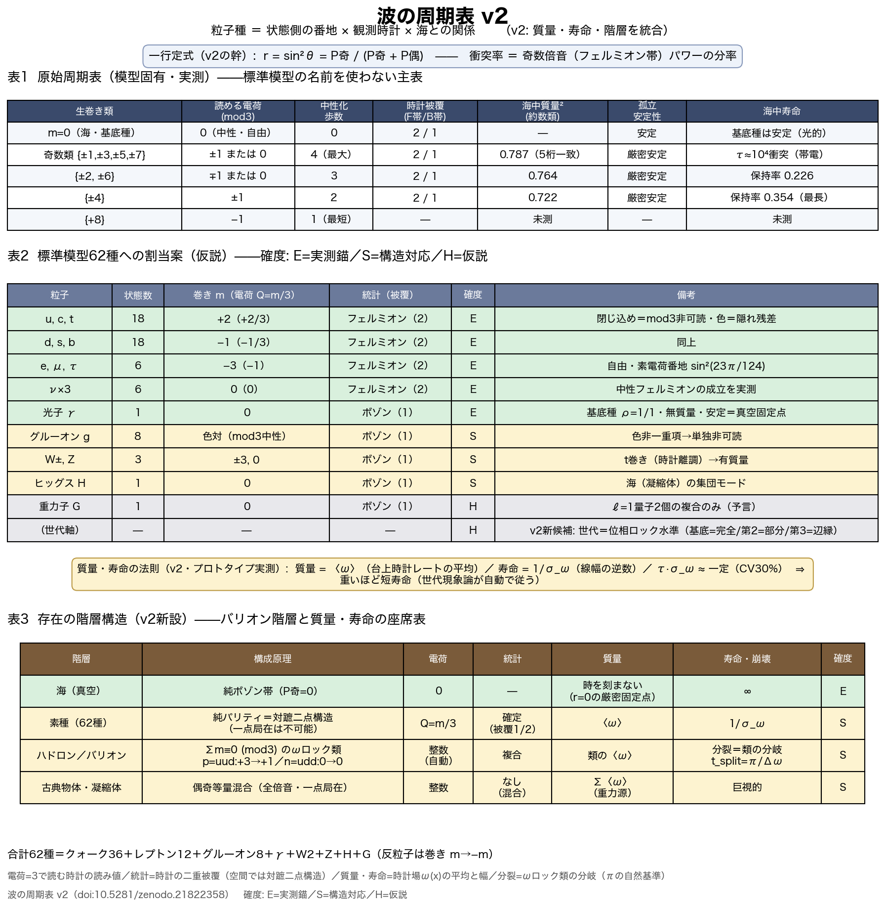
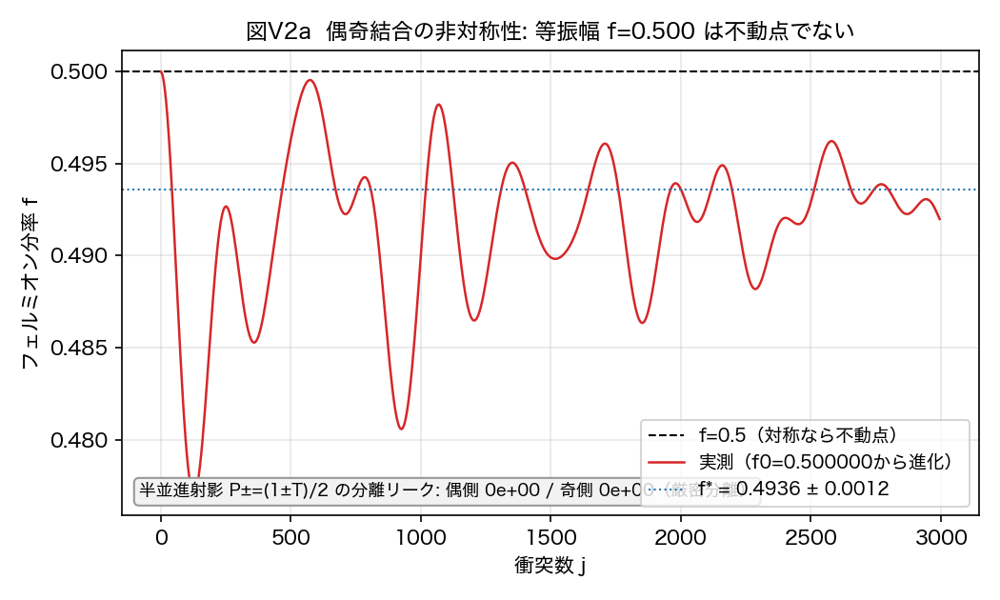
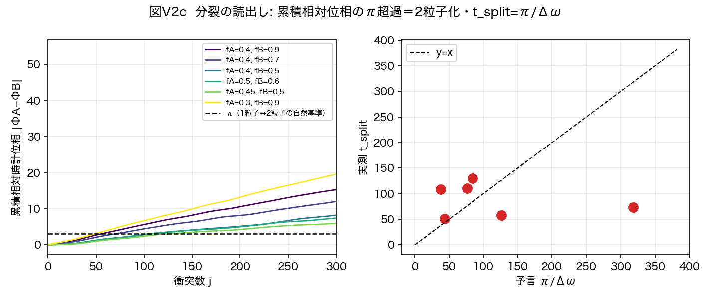
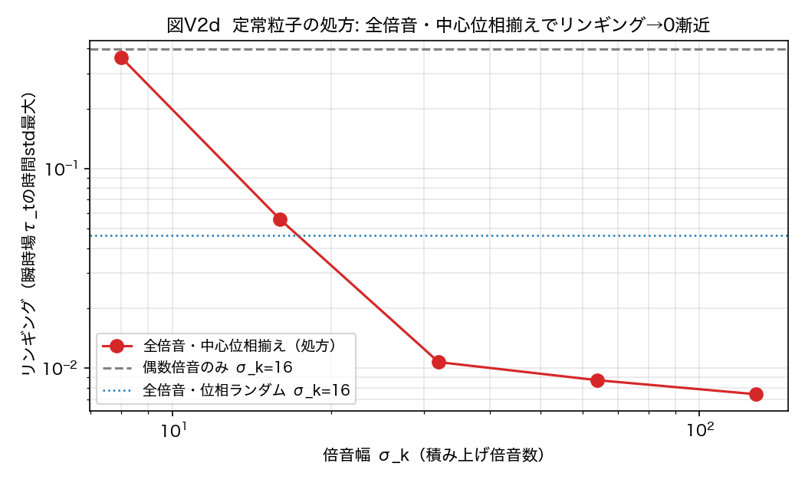

# 波の周期表 v2——巻き数番地と観測時計による粒子分類、および時計場 ω(x) による質量・寿命・分裂の統合

**著者**: 木原範昭
**日付**: 2026年8月7日
**種別**: 仮説提案論文の全面改訂版（数値実験による支持つき・証明論文ではない）
**版の関係**: 本稿は v1 [21] の全面改訂であり、v1 を読まずに本稿だけで完結する。
v1 の主張（5本柱）は弱めずに全て引き継ぎ、公開後の検証プログラムで得た
新規発見（新柱6〜10・整合性検査）を第II部として追加した。

---

## 要旨

粒子とは何で分類されるのか。本稿は、粒子概念を一切仮定しない波の力学（既公開の
二系をそのまま用いる）の数値実験から、**「波の周期表」**——巻き数番地と観測時計に
よる粒子分類の仮説——を提案する。出発点は、粒子を6軸 (x,y,z,t,R,Q) のどこに
巻きを持つかで分類する符号ベクトル思考実験 [1] であった。本稿はこの分類を波の形
だけから実測で作り直し、次の5本柱に到達する。**柱1（周期律）**: 分類の土台は
実測された普遍時計——集団時計 ω=π/72/step が N=4 から 144 の全域で成立
（長窓±0.1%）——であり、種は U^144 時計格子上の有理番地と時計との関係で
分類される。**柱2（電荷則）**: 電荷は Q_em = m/3（m は生の巻き数）であり、
支配的観測時計（分母3——先行実測のタング幅比 461 に基づく）が「3巻き＝素電荷1」
と読む。帰結として u型 m=+2 は +2/3、d型 m=−1 は −1/3、電子 m=−3 は −1 となり、
**閉じ込めと分数電荷は「mod 3 可読性」という同一の事実の二面**になる（陽子
uud=+3→+1、中性子 udd=0 の検算が自動で通る）。数値実験では、クォーク型番地は
孤立で厳密に非可読のまま（可読分率 0.0000 が持続）であり、海中ではハドロン化
（m≡0 複合の形成）の分だけ整数電荷単位で可読化した。**柱3（統計則）**: フェルミ/
ボーズの区別は空間回転ではなく**時計の二重被覆**に住む。状態位相は観測回帰ごとに
{0, π} に量子化され（実測3桁）、フェルミオン的種（奇数倍音）は両シートを訪れ
（被覆度2）、ボゾン的種は訪れない（被覆度1）。純 m=0 のフェルミオン帯種も
被覆度2を示し、中性フェルミオン（ニュートリノ）の行が成立する。**柱4（質量則）**:
質量は番地の属性ではなく海（真空）との関係量である——孤立番地は巻きシフト
対称性により全てユニタリ等価（実測）であり、海中の性質は約数類 gcd(m, 16) のみに
依存する（奇数番地が5桁一致）。**柱5（周期表）**: 表は孤立安定元素表と海中寿命表
の二枚看板であり、その上に標準模型62種の割当案を与える。

v2 はさらに一歩進める（第II部・新柱6〜10）。**新柱6（一行定式）**: 分類の力学的
核心はただ一つの式 **r = sin²θ = P奇/(P奇+P偶)**——1衝突あたりの反射率＝奇数倍音
（フェルミオン帯）パワーの分率——に束ねられる。純ボゾン海は r=0 の厳密固定点
（真空は時を刻まない）、質量の源はフェルミオン帯パワーのみであり、統計が物理で
あるための必要条件はこの結合の非対称性である（等振幅 f=0.500000 は不動点でなく
f*=0.4936±0.0012 へ流出・実測）。**新柱7（空間的二重被覆定理）**: 偶奇の区別は
基本波長の半並進 T: x→x+n/2 の Z₂ 表現であり、純パリティ種は一点局在できず必ず
対蹠二点構造を持つ——時計の二重被覆が空間構造として実体化する。一点局在体は
必然的に偶奇等量混合であり統計を持たない。**新柱8（質量・寿命・世代の統合）**:
局所時計場 ω(x) の台上分布について、質量＝⟨ω⟩（平均）、寿命＝1/σ_ω（幅の逆数）
であり、線幅・寿命関係 τ_coh·σ_ω ≈ 32（CV 29.7%・σ_ω 6倍レンジ・実測）が成立
する。質量と線幅は正相関（+0.904・実測）——**「重いほど短寿命」が同一分布の
2つのモーメントとして自動的に従う**。ここから世代の新候補「世代＝位相ロック水準の
離散系列」を提案する。**新柱9（分裂の読出し）**: 波の分裂（崩壊）は力として力学に
追加する必要がない——非一様な ω による脱コヒーレンスが分裂の力学そのものであり、
必要なのは読出し基準のみ（累積相対位相の π 超過＝2粒子化・t_split=π/Δω・
実測 t·Δω/π=1.29）。**新柱10（定常粒子の二条件）**: 力学の真の定常粒子は
局在（基本波長の全倍音・中心位相揃えの積み上げ——リンギングがゼロへ単調漸近・
実測50倍改善）と位相ロック（ω(x)=const・非線形固有値問題＝粒子方程式）の両立を
要する。以上により、種の分類・粒子数・質量・寿命・分裂と、空間・時間の目盛が、
**単一の読出し関数の出力**に統一される（読出し統一仮説）。

さらに v2 は整合性検査（第II部 §14）を報告する: 柱実験9本をスクリプト無改変で
読出し局所化エンジン2種と並走させ、整数・位相構造（Z₂被覆度・クロス表・ν行・
閉じ込め厳密0・簿記恒等式・番地等価性・約数類）が完全に頑健であること——分類が
特定エンジンの人工物でないこと——を確認した。この仮説の下で、前論文 [5] が
未解決課題として明記した「電荷が±1に安定しない」問題は矛盾ではなく予言に転じ、
クォークの1/3電荷問題は閉じ込めと単一機構で接続され、標準模型の「重い世代ほど
短寿命」は構造的必然の候補を得る。本稿は証明を主張しない。主張するのは、独立に
実測された12の構造が、単一の分類仮説の下で、標準模型の粒子構造と、前論文の
未解決課題と、符号ベクトル思考実験とを同時に接続することである。全実験は決定論的
スクリプトとして公開され、反証15件を含む全過程が再現可能である。終節で、次論文の
万能相互作用関数が満たすべき要件を8項から11項へ拡張して確定する。

---

# 第I部　分類仮説（v1の5本柱・完全引き継ぎ）

## 1. 序論——なぜ「周期表」か、なぜ仮説提案か

### 1.1 出発点: 符号ベクトル思考実験

先行する思考実験 [1] は、粒子を6軸 (x,y,z,t,R,Q) のどの軸に巻きを持つかで分類する
仮説を立てた——光子 γ=(0,0,0,0,R,0)、W±=(0,0,0,±t,0,0)、グルーオン
g=(0,0,0,0,0,Q)、グラビトン G=(0,0,0,±t,±R,0)。この分類は魅力的だが、思考実験の
水準に留まっていた。粒子種を波の力学の**実測**として分類できるか——それが本稿の
問いである。

### 1.2 中心命題

本稿の全ての柱は、一つの命題に束ねられる:

> **粒子種は、波そのものの固定属性ではなく、巻き数状態を観測時計がどう読むかに
> よって分類される。** 電荷・閉じ込め・統計・質量・寿命は独立のラベルではなく、
> **状態側の番地 × 観測時計 × 海との関係** に分解される。

電荷量子化は状態空間だけにも観測装置だけにも存在しない——**状態の巡回構造と
時計の約数構造との関係**に存在する（§4）。統計は空間回転ではなく時計の二重被覆に
住み（§5）、質量は海が分化させる（§6）。v2 はこの命題を一段深める:

> **（v2 拡張）種を分類する読出しと、空間・時間の目盛を創る読出しは、同一の
> 関係量射影である。** 粒子数・質量・寿命・分裂までが、その読出し関数の出力に
> 統一される（第II部）。

### 1.3 方法の宣言: 粒子を仮定しない

本稿は新しい力学を一切導入しない。用いるのは既公開の二系——N体関係波力学 [2]
（三方向凝縮体の実測に使用）と、二体万能非弾性写像の閉形式厳密解 [3]（電荷・
統計・閉じ込めの実測に使用）——であり、いずれも「波の形だけを入力とし、内部に
特別な場合分けを持たない」無名性の原理で構成されている。粒子・電荷・スピンの
概念は力学に入っていない。それらが**読出しとして**どう立ち上がるかを測る。
（第II部の一部の実測は、読出しの局所化プロトタイプ——§2.4——上で行う。その
プロトタイプが本稿の分類を保存することは §14 の整合性検査で確認する。）

### 1.4 性格の宣言と歴史的教訓

本稿は**仮説提案論文**である。粒子の分類企図には成功と失敗の両方の歴史がある。
Gell-Mann の八道説 [9] は SU(3) 分類から Ω⁻ を予言して成功した。他方、Kelvin の
渦原子 [8]——原子＝渦の結び目というトポロジー分類——は美しかったが、力学が
間違っていた。プレオン模型 [14] は62種級の全割当を試みたが衰退した。
**美しい分類は力学の正しさを保証しない。** 本稿が証明でなく仮説提案に留まり、
読出しレベルの主張と力学レベルの主張を峻別し（§2.3）、反証条件を明示する
（§17）のは、この教訓による。仮説の価値は「接続の広さと反証条件の明確さ」で
測られたい。

## 2. 方法と規約

### 2.1 力学（read-only）

- **N体系** [2]: N本の関係波（完全グラフの辺）の閉鎖力学。三方向準安定凝縮体を
  形成する。時計普遍性の走査（§3）に使用。
- **二体系** [3]: 二チャネル波 (a, b) の点毎相互作用 δa = −2R·Im(b̄a)·b の閉形式
  厳密解。状態は (χ, η) 格子上に住み、η 巻き数 m が電荷読出しの対象。
  電荷・統計・閉じ込めの全実験（§4-6）に使用。

いずれも決定論であり、全スクリプト・全結果は添付一覧（実験一覧_v1.md）に従って
単独再実行できる。

### 2.2 実測済みの規約検算

表示規約の衝突を避けるため、次の2点を機械検算した（添付 #25）:
(i) 束の構成 bin 番号と χ周波数は ±1 シフトで反転対応する（偶bin束→奇周波数、
逆も、パワー比 1.0000）。本文は**χ周波数表示**に統一する。フェルミオン的
＝χ周波数偶（≥4）＝奇数倍音 [7]。(ii) 束は構成上 η巻き m=+1 を厳密に1単位持つ
（η占有 (1, 1.000)）。任意の巻き m の種は射影ではなく巻きシフト e^{i(m−1)η} で
構成する。

### 2.3 最重要規約: 読出しレベルと力学レベルの区別

本稿の主張は**読出しレベル**——「観測時計と番地の関係として粒子分類が立ち上がる」
——に限定される。**力学レベル**——「62種が単一動力学のスペクトルとして生成・
崩壊・相互作用する」——の検証は本稿の範囲外であり、次論文（万能相互作用関数）
に委ねる。本稿の終節（§19）はその要件表を実測に基づいて確定する。

### 2.4 v2 追加: 読出し局所化プロトタイプ（第II部の一部実測に使用）

第II部の新柱8〜10の実測には、二体系 [3] の θ 読出し（全格子スペクトルの1スカラー）
を局所場 θ(x) に昇格した**局所化プロトタイプ**を用いる（添付 #30-32 に定義を
自己完結収録）: パリティ分割（偶k/奇k＝半環並進の厳密対称性・スケールフリー）と
滑らかIRロールオフ exp(−(|k|/3)⁴) による帯域重み W_f, W_b から
θ(x)=atan2(√f_loc, √b_loc) を作り、セルごとの SO(2) 回転と点毎非弾性回転を
適用する。回転は各セルで |a|²+|b|² を厳密に保つ（閉塞保存・実測ドリフト ~10⁻¹³）。
チャネル比 λ=b/a=−i（円偏波）はこの回転の**厳密不変多様体**である（代数的に
確認・数値逸脱 0.0）。このプロトタイプが第I部の分類構造を保存することは §14 の
整合性検査（柱実験9本×3エンジン並走）で確認した。局所化で連続量は数%シフト
するため、第II部の定量値はプロトタイプ実測であることを明示し、主張はスケーリング
形（積の不変性・オーダー1）に限定する。

## 3. 柱1: 周期律の土台——普遍時計（実測）

N体凝縮体の集団時計を N=4 から 144 まで走査した（28点）。

**実測**: ω_clock = π/72/step が全域で成立する——短窓（T=4000）で比
0.988±0.028、長窓（T=42000）で 0.9992〜1.0013（**±0.1%**）。時計一周＝144
ステップは実効エネルギー（N）に依存しない。

**図P1**: 時計普遍性。全Nで ω/(π/72)=1。

さらに長窓の census は、低エネルギー領域（N≤16）の海で長時間定常な種が
**時計にロックした無質量基底種 ρ=1/1 ただ一つ**であることを示した（|ρ−1|<9×10⁻⁴・
質量度 10⁻¹¹）。短窓で見える質量を持つ側帯は全て有限寿命の過渡であり、時計へ
引き込まれて消える（図P2）。この反証過程（短窓の見かけの番地と質量則が長窓で
消える）は §18 に全記録した。

**図P2**: 短窓の側帯（共鳴）は長窓で 1/1 へ収縮する。

**仮説（柱1）**: 粒子種の分類子は U^n=I の有理番地であり、土台は単一の U^144
時計格子である。種は「番地（巻き数）×時計との関係」で分類される。

## 4. 柱2: 電荷則——Q_em = m/3 と閉じ込め＝mod 3 可読性

### 4.1 電荷の多値性（状態側の実測）

帯電種（巻き q=+1）は中性過渡より桁で長寿命（τ≈1.3×10⁴衝突・保持85%）だが、
永続はしない。その崩壊は消失ではなく、和則 m* = 2m_B − m_s [4] のウォークによる
相棒（+3）への移送である（図P3）。さらに孤立した純粋巻き数種は**任意の m で
厳密に自己複製し**（保持率 1.000・τ 数値∞）、海なしの混合 {+1,+3} すら漏れない
——**ウォークの駆動には m=0 の海が必須**である（漏れ先 {0,−1,+2}/{±4} は和則の
積と完全整合）。前論文 [5] §9.5 の「電荷が±1に安定しない」は、この海駆動
ウォークの直接の帰結である。

**図P3**: 帯電種の準安定性と和則ウォーク（+1→+3）。

### 4.2 巻き数電荷の保存則は巡回である

巻き数電荷の真の保存則は整数ではなく **mod ne（ηレジスタ位数、本系では16）の
巡回保存**である。点毎相互作用はηスペクトルの巡回畳み込みであり（連続極限では
δQ = R∮∂_η(s²) = 0）、整数電荷 Q_wind の保存は帯域内状態の系にすぎない（帯電
census 構成で CV≈0 の厳密保存を実測、図P6a）。見かけの破れは倍加ウォークが
Nyquist に届いた折返しである（端パワー37%蓄積・相関 −0.93、図P6b）。有限レジスタ
上で倍加梯子は 1→2→4→8→0 と 4歩で中性化する。

**図P6**: 巡回保存と Nyquist 折返し。

### 4.3 読出し整流（読出し側の実測）

海駆動ウォークの全生成物（倍加・反転梯子 2^b·(±1)）に対し、**観測時計 J=3 だけが
荷電内容の全てを |q|=1 に読む**（集中度 1.000——+1種の宇宙でも +2種の宇宙でも）。
J=4 は電荷を消し、J=5, 6 は多値に散らす（図P4）。代数的根拠は 2^b mod 3 = ±1。
観測時計が分母3であることは、先行実測 [6][7]——ロックのタング幅は分母3が
幅比>461で支配する——に基づく。素電荷の値そのものは有理番地
sin²(23π/124) = √(4πα)（16/10⁸ 一致）として既公開の実測 [6] に接続する。

**図P4**: 読出し整流。分母3の観測時計だけが全荷電内容を |q|=1 に読む。

簿記も閉じる: 保存構成において ΔQ3 = −3ΔW が精度 7×10⁻¹⁰ で成立する（Q3=mod3で
読める正味電荷、W=mod3中性複合に隠れた電荷の帳簿）。**読める電荷は消えない——
その減少は、分母3時計に中性と読める複合への持ち込みと厳密に等しい**（図P5）。

**図P5**: 簿記恒等式 ΔQ3 = −3ΔW。

### 4.4 仮説（柱2）: Q_em = m/3 と閉じ込め

以上を束ねる電荷則を提案する: **電荷は Q_em = m/3 であり、支配的観測時計（分母3）
が「3生巻き＝素電荷1」と読む。** 帰結:

- u型 m=+2 → +2/3、d型 m=−1 → −1/3、電子 m=−3 → −1、ν m=0 → 0。
- **閉じ込め＝mod 3 可読性**: 観測者の空間はη円の Z₃ 商であり、その上で一価な
  種（m≡0 mod 3）だけが自由に読出せる。クォーク（m≢0）は単独では非可読——
  **1/3電荷と閉じ込めは同一の事実の二面**であり、別々の説明を要しない。
- 検算: 陽子 uud = 2+2−1 = +3 → Q=+1。中性子 udd = 2−1−1 = 0 → Q=0。
  π⁺(ud̄) = 2+1 = +3 → +1。**全ハドロンの整数電荷が自動で従う。**

**閉じ込め検定（実測）**: クォーク型（m=+2）＋海は可読分率 f_read = 0.0000 から
出発し、ウォークが m≡0 複合（ハドロン相当）を作った分だけ可読化する
（→0.2504/4000衝突）。電子型（m=+3）＋海は f_read = 1.0000 から出発する
（最初から自由）。**クォーク型の孤立系は4000衝突走っても f_read = 0.0000 の
まま**——「単独のクォークは観測できない」が読出しの帰結として実現する（図P9）。

**図P9**: 閉じ込め＝mod 3 可読性の検定。

標準理論との対応: 「自由な状態は triality 0 のみ」という SU(3) 中心 Z₃ の超選択
[10][11] と同型の構造である。ただし標準理論では Z₃ はゲージ群の中心として力学側の
公理に入るのに対し、本仮説では mod 3 は観測時計の支配分母（実測）として
**読出し側**から出る——これが本稿の新規性の一つである（§15）。

**主張の精密化（2点）**: (i) 本節には二つの論理があり区別する——「分母3時計が
荷電ウォークを±1に整流する」は実測、「物理電荷を m/3 と同定する」は仮説である。
同定を法則に昇格させるには、電荷による**応答**——異なる m の種の相互作用強度
Γ_int が m/3（または (m/3)²）に比例するか——の動力学的検定が要る（§19）。
(ii) 本稿の閉じ込めは**読出しレベルの閉じ込め**（単独非可読性）であり、標準的な
閉じ込めが含む分離エネルギーの増大・フラックス管・漸近的自由はまだ導出していない。
正確には**閉じ込めの読出し的前駆構造**であり、二つの非可読種を引き離すコストが
距離とともに増えるかの検定（§19）が動力学的閉じ込めへの昇格条件である。

## 5. 柱3: 統計則——Z₂ 時計被覆

### 5.1 統計は空間回転に住まない（実測）

チャネル二重項の全体回転は力学の厳密対称性であり（対照実験で全観測量が機械零で
平坦・Im(b̄a) の回転不変を解析確認）、空間回転荷は全観測モードで ℓ=±1（校正後、
N=6, 8 で偏差±0.01以内）——半整数もℓ=2も占有モードには現れない。統計の二値性は
チャネル側にも空間側にも住んでいない。

### 5.2 統計は時計の二重被覆に住む（実測）

種の状態位相を観測回帰列（観測量場 s=Im(b̄a) の自己相関ピーク列）で追うと、
**帯電種の位相は全回帰点で {0, π} に厳密に量子化される**（Φ/π = ±0.999 または
+0.002・3桁精度・連続値を取らない）——状態は +1/−1 の二シートを行き来する
（図P8）。中性の非射影束は連続位相を示し、量子化の有無が種を分ける。

**図P8**: Z₂位相量子化。帯電種は Φ∈{0,π}、中性束は連続。

クロス表実験（χパリティ×巻き数 {1,2} の4セル）は、**被覆度がχパリティのみに
依存し、巻き数（電荷）に依存しない**ことを示した: フェルミオン的種（χ周波数偶
＝奇数倍音）＝被覆度2（Z₂・両シート）、ボゾン的種＝被覆度1。さらに純 m=0 の
フェルミオン帯種（巻きシフト構成・η占有 (0, 1.000)）も Qz2=1.00 で被覆度2を
示した——**中性フェルミオン（ニュートリノ）の行が成立する**（図P10）。

**図P10**: ν行の成立とスピン統計対応。

### 5.3 仮説（柱3）と先行対照

**フェルミ/ボーズの区別＝時計被覆度**（1＝ボゾン的／2＝フェルミオン的）を提案
する。これは Finkelstein–Rubinstein [12] がソリトンのスピン統計を配位空間の
二重被覆から導いた構造の対応物だが、**二重被覆の住む場所が空間（回転・交換）では
なく時計（状態周期＝観測周期×2）である**点が異なる。同構造は先行実測 [6][7] の
位数248/観測124の忠実度（F₁₂₄側では回帰が見えず F₂₄₈=1）と接続する。
（v2 追加: 二重被覆は空間にも実体を持つ——ただし回転ではなく**対蹠構造**として。
§10 の空間的二重被覆定理を見よ。）

## 6. 柱4: 質量則——質量は海との関係量

### 6.1 等価性定理（実測3件）

- **巻きシフト等価性**: e^{imη} は力学の厳密対称性（b̄a 不変）であり、孤立した
  純粋番地種は全てユニタリ等価——実測でも全番地の質量²・偏極・s_z が機械精度で
  一致した。**質量・スピンは孤立番地の属性ではない。**
- **約数類定理**: 海中では性質が分化するが、**約数類 gcd(m, 16) までしか分化
  しない**（奇数 {1,3,5,7} の質量²が5桁一致・{2,6} 一致・{4} 独自、図P7）。
  理由は厳密: Z₁₆ の単元自己同型 m→um は海（m=0）を固定するため、海結合は
  単元番地を原理的に区別できない。帰結: **±1 と ±5, ±7 の区別は力学に存在せず、
  mod3 読出しだけが単元類を破る**——柱2（読出し整流）の独立な裏づけ。
- **χ帯平行移動対称性**: 同一巻き種を χ帯 (10,12,14)/(30,32,34)/(50,52,54) に
  置いても質量²は5桁一致——帯の位置も種を分化させない（§16 弱点1）。

**図P7**: 約数類定理。海中の性質は gcd(m,16) のみに依存する。

### 6.2 仮説（柱4）

**質量は海（真空）との関係量である。** 時計にロックした種（ρ=1/1）だけが無質量で
安定（光子的基底種・質量度10⁻¹¹実測）、時計から離れた内容は共鳴として質量を
持ち、海が種の個性（寿命・偏極・質量）を約数類の水準で分化させる。真空＝海を
粒子の性質の共同決定者とする視点は、創発ゲージ・創発フェルミオンの系譜
[13]（string-net凝縮・超流動³He）と共鳴するが、本稿は性質の海依存を等価性定理と
いう形で実測した点が異なる。（v2 追加: 質量の読出し実体は局所時計場の平均 ⟨ω⟩
である——§11 を見よ。「質量→固有時計」の枠組みは前論文 [5] に発する。）

## 7. 柱5: 波の周期表——二枚看板と62種割当

### 7.1 二枚看板

- **表A（孤立安定元素表）**: U^144 時計格子上の純粋番地種。全て自己複製で安定
  （実測）。代数的分類子: 読める電荷（mod3）・倍加軌道・中性化歩数・ηパリティ。
  第二のパリティ構造: 奇数番地は倍加中性化に最大限（4歩）抵抗し、偶数は速く
  落ちる（±4は2歩、+8は1歩）。
- **表B（海中寿命表）**: 海結合が種を淘汰する——帯電で長寿命（τ~10⁴）・中性
  過渡で短寿命（τ~10²⁻³）・複合で中性化。**実観測される「粒子」はこの準安定
  階層である。**

**原始周期表（模型固有・実測に基づく主表）**: 標準模型の粒子名を使わずに、
本稿の分類子だけで書いた表を先に置く。標準模型への割当（§7.2）はこの表の上の
仮説である。

| 生巻き類 | mod3可読 | 中性化歩数 | 時計被覆（F帯/B帯） | 海中質量²（約数類） | 孤立安定性 | 海中寿命 |
|---|---|---|---|---|---|---|
| m=0 | 0（自由・中性） | 0 | 2 / 1 | —（海・基底種） | 安定 | 基底種は安定 |
| 奇数（単元）{±1,±3,±5,±7} | ±1 or 0 | 4（最大） | 2 / 1 | 0.787（5桁一致） | 厳密安定 | τ~10⁴（帯電） |
| {±2,±6} | ∓1 or 0 | 3 | 2 / 1 | 0.764 | 厳密安定 | 保持率0.226 |
| {±4} | ±1 | 2 | 2 / 1 | 0.722 | 厳密安定 | 保持率0.354（最長） |
| {+8} | −1 | 1（最短） | — | 未測 | — | 未測 |

被覆度は生巻き類でなくχパリティで決まる（クロス表実測）ため独立列である。

### 7.2 標準模型62種の割当案

確度記号: **E**=実測錨（本稿または既公開の実測が直接支える）／**S**=構造対応
（機構は一致するが定量未検証）／**H**=仮説（今後の検証対象）。

| 粒子 | 状態数 | 巻き m（Q_em=m/3） | 被覆 | 確度 | 摘要 |
|---|---|---|---|---|---|
| u, c, t | 18 | +2（+2/3） | 2 | **E** | m≢0→閉じ込め（図P9実測）。色=mod3非可読の生巻き残差（簿記W） |
| d, s, b | 18 | −1（−1/3） | 2 | **E** | 同上 |
| e, μ, τ | 6 | −3（−1） | 2 | **E** | 自由（m≡0）。素電荷番地 sin²(23π/124) [6] |
| ν ×3 | 6 | 0（0） | 2 | **E** | 中性フェルミオン（§5.2実測で成立） |
| γ | 1 | 0 | 1 | **E** | 基底種 ρ=1/1（無質量・安定・実測）＝真空固定点（§9） |
| g | 8 | 色対（mod3中性・生巻き非零） | 1 | S | 色非一重項→単独非可読=閉じ込め。8重項の生成は未導出 |
| W±, Z | 3 | ±3, 0 | 1 | S | t巻き（自前時計の離調）→有質量（引き込み実測と整合・力学未検証） |
| H | 1 | 0 | 1 | S | 海（凝縮体）の集団モード。ℓ=0 |
| G | 1 | 0 | 1 | H | ℓ=1量子2個の複合のみ（§8.4予言）。ℓ=±2 |
| （世代軸） | — | — | — | H | v2新候補: 世代＝位相ロック水準の離散系列（§11） |

計 **62種**（クォーク36＋レプトン12＋g8＋γ＋W2＋Z＋H＋G）。反粒子は m→−m
（電荷共役＝η反転・対生成は実測 [3]）。各行の確度（実測錨／構造対応／要検定仮説）
は添付の v2 周期表ビジュアル（図T・日英）に明示した。**確度の適用範囲**: 行の
確度は主属性（電荷同定・統計被覆・閉じ込め）に対するものであり、**世代割当
（例えば u, c, t の3世代全てを同一番地 m=+2 に対応づけること）と質量の定量は
全行で H** である（世代の分化軸は §11.3 の候補・検証プログラム §19.2-5）。

**図T**: 波の周期表 v2（一行定式・原始周期表・62種割当・質量寿命法則・
存在の階層構造）。

### 7.3 二つの有限構造の関係（開いた構造問題）

本稿には二つの有限構造が実測されている: 普遍時計 U^144（§3）と巻きレジスタ
Z₁₆（§4.2）。因数構造は 144 = 2⁴·3²、16 = 2⁴、144/16 = 9 = 3² であり、
本稿の分類子はこの因数に対応する——**2＝統計被覆（§5）、3＝電荷可読性（§4）、
16＝生巻き巡回（§4.2）**。この一致が偶然か、更新則から両方が従う共鳴構造
（時計位数×内部巻き位数の共鳴分類）かは、本稿最大の開いた構造問題であり、
数合わせではなく**作用素の回帰構造として**検定すべき課題として §19 に登録する。
定式化: 各読出し操作を同一の作用素表現に持ち込み、部分空間ごとの位数
ord(U|_{H_i}) を測る——本当の周期律は「同一作用素が異なる読出し部分空間で持つ
位数」の族である可能性がある。「周期表」の本当の周期律はおそらくここに住む。

## 8. 説明力——既存課題への接続

### 8.1 前論文の未解決課題「電荷±1非安定」の解決

前論文 [5] §9.5 は「電荷（巻き数）は±1に安定せず複数の値に分布する」を未解決
課題として明記した。本仮説の下でこれは矛盾ではない: **状態側**では海駆動ウォーク
（実測・§4.1）が巻き数を分散させ続ける。**読出し側**では分母3の観測時計がその
全生成物を |q|=1 に折り返して読む（実測・§4.3）。「電荷の多値性」と「素電荷の
普遍性」は矛盾なく同居する——未解決課題が仮説の予言に転じる。

### 8.2 クォークの1/3電荷問題

Q_em = m/3 の下で、分数電荷（なぜ1/3か）と閉じ込め（なぜ単独で見えないか）は
mod 3 可読性という単一機構である（§4.4・実測図P9）。

### 8.3 反物質

電荷共役 m→−m はスペクトルの対称であり、対生成はウォークの必然である
（既公開実測 [3]）。

### 8.4 重力の弱さ

凝縮体の回転生成子スペクトルに ℓ=2 の線形枠は存在しない（校正比最大 1.000 厳密・
実測）。スピン2はℓ=1量子2個の**複合**としてのみ存在でき、実際に読出し二乗の
スペクトルには 2ω の四重極線が全Nでコヒーレントに立つ（比 2±6%）。実測は
ここまでである。その先は予想として述べる: 二次複合であるなら、結合が一次量の
積として二乗抑制を受けることが予想され（α_G=(m/M)² 型 [15] への接続は未検証・
予言）、通れば**重力が弱い理由と検証が難しい理由は同一構造**になる。これは
重力振幅＝ゲージ振幅²（double copy [16]）と同型の構造の、状態空間側からの
出現の候補である。

### 8.5 v2 追加: 質量階層と寿命階層の相関

標準模型の荷電レプトン系列 e, μ, τ では、世代が上がり質量が増すほど寿命が
短くなる顕著な系列が成り立つ（クォークは閉じ込めのため自由粒子寿命の概念自体が
単純でない）。従来この相関は崩壊の位相空間から個別に計算される。新柱8（§11）は
構造的説明の候補を与える: 質量と線幅（逆寿命）が**同一の時計場分布の平均と幅**
であるなら、両者の相関は計算結果ではなく構造の帰結である。

### 8.6 v2 追加: なぜ素粒子は点でないか

新柱7（§10）は「統計の確定した種は対蹠二点構造を持ち、一点局在しない」を
幾何定理として与える。場の量子論で粒子が点ではなくモードである事情の、
本模型内での対応物である。逆に、一点に局在した古典物体は必然的に偶奇等量混合で
あり統計を持たない——点粒子に統計がなく、統計ある種が点でないのは、同一の
幾何の両面である。

### 8.7 v2 追加（推測・確度H）: 真空エネルギーの非重力化の示唆

一様な海は局所時計場に一様オフセットしか与えず、時計場の**勾配**に寄与しない。
重力が時計場の勾配として読まれるなら、真空エネルギーは一様ゲージシフトに吸収され
重力源にならない可能性がある。これは推測（確度H）であり、次論文（重力読出し）の
検証対象として登録する。

---

# 第II部　v2の新規発見——時計場 ω(x) による統合（新柱6〜10）

第II部の実測のうち、§9(A) は公開系（大域θ・[3]）そのもの、§11〜13 は読出し
局所化プロトタイプ（§2.4）上の実測である。プロトタイプの正当性は §14 の
整合性検査による。定量値はプロトタイプ実測であることを明示し、主張は
スケーリング形に限定する。

## 9. 新柱6: 一行定式——r = P奇/(P奇+P偶)

### 9.1 定式

二体系 [3] の θ 読出しの定義から厳密に、1衝突あたりの反射率は

**r = sin²θ = P奇 / (P奇 + P偶)**

である（P奇＝フェルミオン帯＝内在的な奇数倍音のパワー、P偶＝残り）。
**一回の相互作用あたりの反射率——どれだけ交換されるか——を、奇数倍音の分率
だけが決める**（r は確率ではなくレートである。相互作用は常時作用している）。 偶数倍音は回転される側には
入るが、回転量を決める側には分母にしか入らない。応答の符号は逆である:
∂r/∂P奇 = P偶/P² > 0、∂r/∂P偶 = −P奇/P² < 0——量が等しくても役割で区別される
（電荷の±の類比）。

### 9.2 帰結（全て実測）

1. **真空固定点**: 純ボゾン海（P奇=0）は r=0 で厳密に静止する——**光は光と
   衝突せず、真空は時を刻まない**（対照走行で τ_t の std ~10⁻¹⁶）。柱5の
   γ行（基底種・無質量・安定）の力学的実体である。**二時計の区別（重要）**:
   ここで「真空は時を刻まない」とは、**二体系の局所反射時計**（局所読出し τ_t）
   が進まないという意味であり、**N体凝縮体の集団位相時計** ω_clock=π/72（柱1）
   が存在しないという意味ではない。両時計——局所反射時計と集団位相時計——の
   関係は未解決課題として §16 に登録する（統一されれば柱1と新柱6が接続する）。
2. **時計・質量読出しを駆動する源候補＝奇帯パワー**: 時計を動かす源は奇数倍音の
   内容のみ。物質＝相互作用を起こす側／光＝起こさない側の役割非対称が式から従う。
   （厳密なのは P奇→r であり、P奇→質量は §11 の接続仮説——r→ω(x)→⟨ω⟩——を
   介する。）
3. **Z₂ 分類が力学的意味を持つための必要条件（本模型内）**: r が偶奇対称なら、
   本模型のいかなる読出しもフェルミオン的セクターとボゾン的セクターを区別できず、
   Z₂ 分類は命名規約に退化する。本模型で統計分類が読出し可能な差を持つための
   必要条件が、この非対称結合である（フェルミ/ボース統計一般の必要十分条件とは
   主張しない）。

### 9.3 非対称性の実測（添付 #29）

等振幅初期条件——フェルミオン分率 f₀ = 0.500000 に二分法で厳密調整した束——を
公開系（大域θ）で3000衝突進化させると、**f*=0.4936±0.0012 へ流出する**。
f=0.5 は不動点ではない＝偶奇結合は確かに非対称である（図V2a）。ただし破れは
約1%と小さい——力学はほぼ偶奇対称で、わずかに破れている（近対称性。二セクターの
近縮退は要追跡の観察として登録する）。

**図V2a**: 等振幅 f=0.500 は不動点でない（偶奇結合の非対称性）。

## 10. 新柱7: 空間的二重被覆定理

### 10.1 偶奇の区別は変換応答である

偶奇の区別は絶対ラベルではなく、**基本波長 λ₀ の半並進 T: x→x+n/2 に対する
Z₂ 表現**である（偶=+1表現・奇=−1表現）。射影 P± = (1±T)/2 は振幅によらず厳密に
分離する——実測（添付 #29B）: 全倍音・中心位相揃えの梯子（偶49%/奇51%の
等量混合）に適用して、偶成分の奇kリーク・奇成分の偶kリークとも **0.0**（機械精度）。
「両方を同振幅で含むと区別できない」は成り立たない——区別子は振幅ではなく
変換応答である。

### 10.2 定理（構成的）

半並進表現の直接の帰結として:

1. **純パリティ種（統計の確定した種）は一点に局在できず、必ず対蹠二点構造を
   持つ**（偶=対称像・奇=反対称像）。時計の二重被覆（柱3）が空間構造として
   実体化する。
2. **一点局在体は偶奇混合を要し、統計を持たない**（複合体・古典物体。
   §13 の階層構造を見よ）。精密には: 厳密な一点（デルタ）局在状態は偶奇
   **等ノルム**を要する。有限幅の局在では幅に応じた偏差を許す（実測の
   全倍音梯子は偶49%/奇51%・添付 #29B）。

### 10.3 位置づけ

柱3は「二重被覆は時計に住む」と述べた。新柱7はこれを補強する: 二重被覆は空間にも
実体を持つ——ただし回転（Finkelstein–Rubinstein 型 [12]）ではなく**対蹠構造**
として。時計の被覆度（動的）と対蹠構造（幾何）が同じ Z₂ の二つの顔である。

## 11. 新柱8: 質量・寿命・世代の統合——時計場の平均と幅

### 11.1 定義と予言

局所時計場 ω(x)（1ステップの位相進み・読出し量 τ_t(x)）の分布を種の台上で取る:

- **質量 = ⟨ω⟩**（台上時計レートの平均）
- **寿命 = 1/σ_ω**（線幅の逆数。σ_ω＝台上時計レートの空間std）

予言: **線幅・寿命関係 τ_coh · σ_ω ≈ 定数**——エネルギー・時間不確定性
（Weisskopf–Wigner の線幅・寿命関係 [23]）の、時計場の統計量としての力学版。

### 11.2 実測（添付 #30・局所化プロトタイプ）

8構成（組成 f・振幅・倍音幅を独立に変え、σ_ω を6倍振る）で:

1. τ_coh は σ_ω に単調逆相関（σ_ω 0.044→0.247 で τ 420→99）。
2. **積 τ_coh·σ_ω = 32.1、CV 29.7%**（非打ち切り7件）——6倍レンジで
   オーダー1の不変性（図V2b）。
3. **質量 ⟨ω⟩ と線幅 σ_ω の相関 +0.904**——重いほど線幅が広く、短寿命。

**図V2b**: 線幅・寿命関係 τ·σ_ω ≈ 一定と、質量・線幅の正相関。

### 11.3 世代の新候補

v1 では「世代＝χ帯位置」仮説が反証済みであった（χ帯平行移動対称性・§6.1）。
新柱8は代替候補を与える:

> **世代＝同一番地の位相ロック水準の離散系列**（基底世代=完全ロック・
> 第2世代=部分ロック・第3世代=辺縁ロック）。

この候補の下では、世代間の質量比・線幅比・逆寿命比が同一分布の変形として
相関するはずである。検証プログラム（§19）: **世代三重相関検定**——世代間で
質量比 ≈ σ_ω比 ≈ 逆寿命比が成り立つか。確度は H（仮説・予備測定が機構を支持）。

### 11.4 質量の三読出しと (t, R, Q)——成分仮説（確度H）

本シリーズには質量の読出しが三つ存在する: (i) μ_Gram = detΓ/T²（非コヒーレンス度
[5]・T は保存読出し R1）、(ii) 海との関係量（約数類 gcd(m,16)・柱4・η＝電荷軸）、
(iii) m_clock = ⟨ω⟩（局所時計平均・新柱8）。これらを「同名の別量」と見るのでは
なく、次の**成分仮説**を提案する: ゼロ閉塞の符号分割
x²+y²+z² = t²+R²+Q² の右辺三軸に、三読出しがそれぞれ対応する——
**⟨ω⟩＝t軸（固有時計）、μ_Gram＝R軸（動径ノルム）、海関係＝Q軸（電荷レジスタ）**。
すなわち、**質量的読出しを支える内部状態が (t,R,Q) の3成分を持つ**という仮説で
ある。観測される質量（ローレンツスカラー）はその二次形式不変量
m² = M_t² + M_R² + M_Q²（閉塞により空間側ノルムと等値）であり、三成分そのものを
「三種類の質量」と呼ぶ必要はない。W/Z が t巻き（時計離調）で質量を得るという
柱5のS行は「種によって質量を担う軸が違う」というこの絵に整合し、出発点の
xyztRQ 符号ベクトル [1] が読出しレベルで回帰する。判別実験を §19.2 に登録する:
**三者同時検定の二仮説形**——(A) 辞書仮説: 三者は一価曲線に乗る／(B) 成分仮説:
三者は独立成分で二次形式面に乗る。判別点: ほぼ同質量で電荷・時計性格の異なる
状態対（陽子/中性子型——Σm は +3 と 0 で異なるのに質量がほぼ同じ）が構成でき
れば A は破れ B が生き残る。

## 12. 新柱9: 分裂の読出し——崩壊は力の追加を要しない

### 12.1 主張

波の分裂（崩壊）は、力として力学に追加する必要がない。**非一様な ω による
脱コヒーレンスが分裂の力学そのもの**である——ω の異なる部分同士は、何もしなくて
も位相を失って独立になる。必要なのは読出し側の判定基準のみである:

- **粒子数 = ωロック同値類の数**。二領域が一つの粒子であるのは、相対時計位相の
  累積が π を超えるまで（同一干渉縞の内側＝コヒーレント）。π は自然基準であり
  調整パラメータではない。
- 予言: **t_split = π/Δω**。

この読出しは、時空目盛（τ_x, τ_t）・位置と同一のファイバー関係量から派生する。
すなわち**種の分類・粒子数・質量・寿命・分裂と、空間・時間の目盛は、単一の
読出し関数の出力である**（読出し統一仮説）。脱コヒーレンスによる古典性の創発
という視点は [24] の系譜にあるが、本稿は粒子数の読出し基準（π基準）として
定式化した点が異なる。

### 12.2 実測（添付 #31・局所化プロトタイプ）

組成差ペア6種で、読出しは1粒子→2粒子の遷移を検出し、
**t_split·Δω/π = 1.29（CV 67%・全ペアがオーダー1）**（図V2c）。

**図V2c**: 分裂の読出し。累積相対位相の π 超過と t_split=π/Δω。

**既知の設計限界（正直な登録）**: 同組成の対照ペアでも分裂が検出された。原因は
海キャリアの位相（波長 n/3）がパケット位置で異なり、干渉が偽の Δω を作るため
である。キャリア位相を整列した配置（間隔=キャリア波長の整数倍）での精密化を
検証プログラム（§19）に登録する。

### 12.3 副観察: コヒーレント芯の生存

自己重なり C(t) は 0 に落ちず 0.55〜0.76 で下げ止まる——**位相ロックした
コヒーレント芯が生き残る**。崩壊が「消滅」ではなく「安定子孫＋脱コヒーレンス片」
への分裂である可能性を示唆する（要追跡）。

## 13. 新柱10: 定常粒子の二条件と存在の階層構造

### 13.1 定常粒子の二条件（実測・添付 #32）

力学の真の定常粒子は次の二条件の両立を要する:

1. **局在**: 基本波長 λ₀ の全倍音（偶+奇）を、中心位相を揃えて積み上げる。
   実測: リンギング（瞬時場 τ_t の時間std最大）は倍音幅 σ_k とともに単調減少
   し、ゼロへ漸近する（σ_k=8: 3.6×10⁻¹ → σ_k=128: 7.4×10⁻³・図V2d）。
   偶数倍音のみでは 4.0×10⁻¹ で頭打ち——**偶奇両方の倍音が必要**である。
2. **位相ロック**: ω(x) = const（台上で固有時計が一様）。これは非線形固有値問題
   であり、本模型の**定常粒子方程式（候補）**である。真の次段階は、万能相互作用
   写像 F に対する局在非線形固有解 F[Ψ]=e^{iΩ}Ψ の列挙である（§19.2）——
   これが見つかれば「粒子」は分類名ではなく力学の孤立した固有解になる。

**図V2d**: 定常粒子の処方。全倍音・中心位相揃えでリンギング→0漸近。

付随する厳密構造: チャネル比 λ=b/a=−i（円偏波）は弾性・非弾性回転の**厳密不変
多様体**である（代数確認・数値逸脱 0.0・振幅は全域で凍結）＝確定電荷状態。
倍音族＝子閉鎖の積み上げという構成は [15] の2公理（分解能＋スケール不変）に
発し、リンギング＝不安定な相対平衡の対応は [22] の開始様式分類に接続する。

### 13.2 存在の階層構造（バリオン階層の座席表）

新柱7・8・9を併せると、存在の階層が一枚の表になる（図T下段・表3）:

| 階層 | 構成原理 | 電荷 | 統計 | 質量 | 寿命・崩壊 | 確度 |
|---|---|---|---|---|---|---|
| 海（真空） | 純ボゾン帯（P奇=0） | 0 | — | 時を刻まない（r=0の厳密固定点） | ∞ | E |
| 素種（62種） | 純パリティ＝対蹠二点構造（一点局在不能） | Q=m/3 | 確定（被覆1/2） | ⟨ω⟩ | 1/σ_ω | S |
| ハドロン／バリオン | Σm≡0 (mod3) の ωロック類。p=uud:+3→+1／n=udd:0→0 | 整数（自動） | 複合 | 類の⟨ω⟩ | 分裂＝類の分岐 t_split=π/Δω | S |
| 古典物体・凝縮体 | 偶奇等量混合（全倍音・一点局在） | 整数 | なし（混合） | Σ⟨ω⟩（重力源） | 巨視的 | S |

バリオンは「62種の外の別枠」ではなく、ωロック類という同じ読出しの一階層として
質量・寿命・崩壊の座席を持つ。柱2のハドロン整数電荷の検算（p=uud→+1）は
この表の第3行にそのまま住む。

## 14. 整合性検査——分類は特定エンジンの人工物ではない

v2 の検証プログラムでは、二体系 [3] の θ 読出しを局所化した2種のプロトタイプ
（§2.4）を構築した。局所化は分類を壊さないか——柱実験9本（v4b, v6, v7, v9,
v10b, v13b, v14, v15, v17b）を**スクリプト本文無改変**のまま、collision_step の
差し替えのみで3エンジン並走させた（公開系＝大域θ／局所θ急峻／局所θ滑らか。
添付フォルダ 周期表追試_局所θ_v1）。

**結果**:

1. **健全性**: 大域θ走行は公開結果JSONと全スクリプトで完全一致（判定文字列・
   全数値）。
2. **整数・位相構造は完全に頑健**: Z₂被覆度クロス表（4セル判定同一）・ν行
   （被覆度2・Qz2=1.00・位相厳密{0,±π}）・閉じ込め（孤立厳密0・~10⁻²⁹）・
   簿記恒等式（ΔQ3=−3ΔW residual ~10⁻¹⁴）・番地等価性（全主張一致）・
   約数類定理（pass・spread はむしろ縮小）。**分類の骨格は読出しの局所化に
   対して不変である。**
3. **連続量は数%シフト**: 海の平衡フェルミオン分率 f* は 0.4695（公開系）→
   0.4578（急峻・−2.4%）／0.4428（滑らか・−5.6%）。ハドロン化率も −2.7〜−4.1%。
   局所エンジン採用時は連続量の再較正を要する。
4. **唯一の質的後退＝Q_wind 保存**: 大域θで厳密（CV 2.6×10⁻⁷）だった正味巻き数
   電荷の保存が、局所θでは緩慢に漏れる（4000衝突で5〜6%）。これはプロトタイプの
   限界であり、万能関数の要件第10項（§19）として登録する。

この検査は同時に、第I部の分類が「大域θという特定の実装」の人工物ではなく、
読出しの構造（帯の分率・パリティ・mod3）に担われていることの独立証拠である。

---

# 第III部　位置づけ・弱点・反証・次論文への要件

## 15. 先行研究との関係と新規性の限定

本仮説の部品にはそれぞれ強い先行系譜がある: 巻き数＝荷（Skyrme [17]・
Kaluza–Klein [18]）、mod3 閉じ込め（triality [10][11]）、統計の二重被覆
（Finkelstein–Rubinstein [12]）、真空＝海（Wen・Volovik [13]）、重力＝二乗
（KLT/BCJ [16]）、全種割当の企図（八道説 [9]・プレオン [14]）、線幅・寿命関係
（Weisskopf–Wigner [23]）、脱コヒーレンスによる古典性（Zurek [24]）。
**本稿は部品の新規性を主張しない。** 新規性は次の4点に限定する:

1. これらの部品が、粒子概念を仮定しない**単一の無名力学の実測**として同時に
   出ること（合流）。
2. 電荷単位・閉じ込め・素電荷一意性が、力学側の公理（ゲージ群の中心）ではなく
   **観測時計の約数構造（読出し側）**から出るという対応物の提示。
3. 統計の二重被覆が空間（配位空間の回転）ではなく**時計**（状態周期＝観測周期×2）
   に住むという実測（v2 で空間の対蹠構造としての実体も追加・§10）。
4. （v2）質量・寿命・世代・分裂が、単一の時計場 ω(x) の統計量（平均・幅・
   ロック類）として、時空目盛と同じ読出し関数から出るという統合の提示。

## 16. 仮説の弱点と未検証部分（正直な登録）

1. **世代の起源は未解決（ただし v2 で肯定的候補を得た）**: 世代＝χ帯位置の素朴
   仮説は反証済み（χ帯平行移動対称性・§6.1）。v2 の新候補は位相ロック水準の
   離散系列（§11.3）——検証プログラム指定済み・未実施。
2. **W/Z行**: 低エネルギー実験室（N≤16・小さな海）では直接生成不可（レジスタ端
   即崩壊・構造的）。有効接触頂点の 1/δ² スケーリング検定（Fermi理論の道）を
   指定済み・未実施。
3. **グラビトン行**: 四重極2ω線は全Nで実在するが、事前基準（|比−2|<0.02）は
   1/3のみ通過——読出し枠の較正が未了。
4. **レジスタ位数 ne=16 依存性**: 表Aの詳細（中性化歩数等）は ne の関数である。
   ne 可変系での再検が必要（「周期表の周期はレジスタ位数の関数」という検証可能
   予言でもある）。
5. **Q_em = m/3 と透過率電荷 √(4πα) [6][19] の二読出しの統一は未完**——素電荷の
   「単位」（3巻き）と「値」（0.302822）の関係は次論文の課題。v2 追記:
   「フェルミオンは奇分率 f≈0.7=1−√(4πα) に集中する」仮説は検定の結果**反証**
   された（実在種の f は 0.02〜0.53 に分布・プロトタイプの極大位置は構成依存・
   §18 (14)）。0.6972 の居場所は種の組成ではなく**電荷読出しイベントの反射率**の
   文脈に残る。
6. 海構成の一部（人工射影海）は保存クラス外と判明済み（Nyquist折返し・§4.2）。
   該当実験の定量は保留付きで扱い、定性結論は保存クラス内の系列で整合確認した。
7. **（v2）第II部の定量値はプロトタイプ実測**: τ·σ_ω=32.1・t_split 係数 1.29 等は
   CV 30〜67% の散らばりを含む。主張はスケーリング形（積の不変性・オーダー1）に
   限定し、係数の精密値は主張しない。分裂実験の対照には海キャリア位相の整列が
   必要（§12.2・設計則）。
8. **（v2）二時計の関係は未解決**: 二体系の局所反射時計（τ_t・P奇=0 で停止）と
   N体凝縮体の集団位相時計（ω_clock=π/72・柱1）の関係は未統一である（§9.2）。
   統一されれば柱1と新柱6が接続し、されなければ「時計」の語が二つの独立量を
   指していたことになる——判定可能な開いた問題として登録する。

## 17. 反証条件

1. 分母3以外の観測時計が、同一の荷電ウォーク生成物の集合全体を一意の素電荷
   単位に整流する例が構成されれば、柱2は棄却される。
2. 同じ凝縮相・同じ更新則・同じ整定基準の長窓極限で、ω が π/72 から系統的に
   逸脱する系列が得られれば、柱1は棄却される。
3. 被覆度がχパリティと独立に変わる種が構成されれば、柱3は棄却される。
4. 海なしで種の性質（質量・寿命・偏極）が分化する実測が出れば、柱4は棄却される。
5. m≢0 (mod 3) の種が単独で可読になる構成が見つかれば、閉じ込め則は棄却される。
6. （v2）偶奇対称な力学（r が偶奇に対称）で被覆度差・閉じ込め・素電荷一意性の
   いずれかが再現されれば、新柱6は棄却される。
7. （v2）純パリティ種の一点局在が構成されれば、新柱7は棄却される。
8. （v2）τ_coh·σ_ω が系統的に発散または消失する族が見つかれば、新柱8は棄却される。
9. （v2）キャリア位相整列後も t_split·Δω/π がオーダー1に収束しなければ、
   新柱9の π 基準は棄却される（別基準の探索へ）。

## 18. 反証と修正の記録（15件・要約）

本研究の過程で反証された仮説と計器を全て記録する: (1) 短窓の側帯番地は安定種では
なく過渡（長窓で消滅）。(2) 質量＝離調²則は過渡上の見かけの関係。(3) ±1不動点
一意性の素朴形（任意の純粋mが不動点であり一意性は出ない）。(4) 質量-幅相関は
不成立（r=−0.07）。(5) 海構成規約（χ解析射影）仮説は不成立——保存の破れの正体は
Nyquist折返し（§4.2）。(6) escape率による±1一意性は約数類定理により原理的に
判定不能と判明。(7) SU(2)回帰角判別の運動学版は全状態でスピノル的（自明）。
(8) 被覆度の単点判定は位相の偶然のπ近傍を拾う（回帰列判定に較正）。
(9) グラビトンℓ=2の線形枠は不在（複合へ再解釈）。(10) 世代＝χ帯位置は反証。
(11) W/Z離調注入の帯シフト法は失敗（実効線形分散）。(12) ν構成の射影法は失敗
（束の毛m=+1が原因・シフト法で解決）。(13) 過去の射影海は増幅数値残差
（m=0場として正当・定性不変・記録）。**(14)（v2）「フェルミオンは奇分率 f≈0.7 に
集中する」仮説は反証**——プロトタイプの信号極大 f≈0.77 は構成依存（振幅・倍音幅で
消失）であり、実在種の f は 0.02〜0.53 に分布して 0.7 に集まらない。動的平衡は
むしろ f≈0.5（近対称）へ引き込まれる。**(15)（v2）分裂実験の窓平均ドリフト指標は
破綻**——唸り周期と観測窓の非通約により定常性を誤判定する（真の指標＝瞬時場の
時間stdに較正・§13.1）。各件の詳細は添付の分析ノートにある。

## 19. 統一動力学への要件引き継ぎ（次論文の仕様・8項→11項）

本稿の分類仮説を力学レベルで検証するには、現在二系に分かれている力学を単一の
**万能相互作用関数**に統一し、62種がそのスペクトルとして生成・崩壊・相互作用する
ことを示す必要がある。本稿の実測は、その関数が満たすべき要件を確定する:

1. **無名性**: 波の形だけを入力とし、種ごとの場合分けを持たない（IF文なし）。
2. **全チャネル同時**: 電磁（巻き交換）・弱（時計離調）・強（mod3非可読の生巻き
   残差）・重力（二次モーメント結合）が、別々の項でなく同一演算の異なる読出しと
   して出ること。三平面（xy=スピン／zR=質量／tQ=電荷）[20] を同時に駆動する。
3. **保存則の自動成立**: 巡回巻き保存（§4.2）・閉塞保存・ノルム保存を設計でなく
   演算構造から保つ。
4. **普遍時計の再現**: ω=π/72 の U^144 時計格子（§3）がスペクトルとして出る。
5. **選択則の創発**: 和則 m*=2m_B−m_s・倍加反転梯子・Z₂位相量子化・約数類構造が
   手置きなしに出る。
6. **厳密計算可能性**: 無名性⇒状態サイズ線形の計算構造 [4] を保つ（閉形式または
   整数厳密）。
7. **二系の特殊化**: 二体閉形式解 [3] と N体関係波力学 [2] が、その関数の
   制限・極限として再導出される。
8. **反証形**: 62種割当（§7.2）のいずれかがスペクトルに現れなければ、本稿の
   周期表仮説は該当行ごとに棄却される。
9. **（v2）重力はゲージ側**: 重力は状態側のポテンシャル注入では入れられない——
   Σx²=0 の閉塞を必ず破る（実測: 振幅10⁻³の注入で200ステップに31%の破れ、
   素の力学は10⁻¹³、ゲージ側操作は厳密0）。重力は空間を創生する射影（読出し）側の
   ゲージ歪みとして入る。
10. **（v2）局所化の保存則**: θ読出しの局所化は Q_wind 保存を厳密に保つ形で
    なければならない（§14: 現行プロトタイプ2種は4000衝突で5〜6%漏れ＝要件未達。
    円偏波不変多様体など保存両立の局所化が探索方向）。
11. **（v2）分裂は読出し**: 分裂・崩壊は力として追加せず、時空読出し関数の
    ωコヒーレンス・クラスタリングとして読む（π基準・調整パラメータなし・
    相互作用関数は無変更・§12）。

### 19.2 検証プログラム（8件・優先順）

万能関数の構築と並行して、本稿の仮説を直接強化・反証しうる実験を優先順に登録する:

1. **分母3の力学的導出と電荷応答**: 観測時計の分母3支配は現在ロック実測 [20] に
   基づく。この力学で分母3の Arnold tongue が最大になる理由の解析的導出が
   得られれば、Q_em = m/3 の「3」は経験的選択から力学的必然へ進む。あわせて、
   二種 (m₁, m₂) の交換量・位相変化が積 m₁m₂/9 に比例するか（クーロン型の
   電荷積検定）を測る——通れば m/3 は帳簿から相互作用に現れる物理電荷へ昇格する。
2. **時計被覆度と交換符号の同一実験（万能関数の構築に先行して実施すべき決定実験）**:
   被覆度2 ⟺ 二つの同種の交換符号 −1 を同一実験で結ぶ。交換操作 E と時計一周
   操作 T が状態空間上で同じ二重被覆の非自明類に属する（E ≃ T、E²=T²=I）ことが
   示されれば、半整数的帰還・交換符号・排他性・時計被覆度が単一の Z₂ に縮約され、
   柱3は「統計に似ている」から「統計構造の再構成」へ進む。
3. **（v2）質量辞書の三者同時検定（二仮説形・§11.4）**: 同一状態群について
   μ_Gram = detΓ/T²・r = P奇/P全・⟨ω⟩ を同時測定し、(A) 一価辞書に乗るか
   (B) 二次形式面（成分仮説）に乗るかを判別する。A なら前論文の質量論・新柱6・
   新柱8 が単一の定理候補に縮約され、B なら質量的読出しの (t,R,Q) 3成分構造が
   確立する——どちらに転んでも構造が確定する判別実験であり、この一つで
   前論文の Gram 質量・v1 の海依存質量・v2 の時計質量・(t,R,Q) 仮説を同時に
   整理できるため優先度を上げて登録する。
4. **レジスタ位数可変の周期表変形則**: ne = 12, 18, 24, 32, … で約数類・
   中性化歩数・可読性・被覆構造が gcd(m, ne)／Div(ne) に追随するかを測る。
   追随すれば約数類定理が一般化され、しなければ16固有の隠れ構造がある。
5. **盲検予言**: 標準模型の粒子名を使わず、模型だけから未占有番地・寿命順位・
   電荷・被覆度・崩壊先を予言し、事後に既知粒子表と照合する——八道説の Ω⁻ 型の
   決定力を持つ検定形式。
6. **（v2）世代三重相関検定と直交制御**: 同一番地の位相ロック水準系列を構成し、
   世代間で質量比 ≈ σ_ω比 ≈ 逆寿命比が成り立つかを測る（新柱8の直接検定）。
   あわせて振幅・組成・倍音幅の factorial sweep で ⟨ω⟩ をほぼ一定に保ち σ_ω
   だけを変える系列（およびその逆）を構成し、質量-線幅相関 +0.904 が共通駆動の
   産物でないことを確かめる。
7. **（v2）キャリア位相整列の分裂精密実験**: パケット間隔をキャリア波長の整数倍に
   揃え、組成起源の Δω とキャリア位相起源の偽 Δω を分離して t_split=π/Δω を
   再検定する（新柱9の精密化）。
8. **（v2）Z₂被覆度の局所エンジン明示検証**: 整合性検査（§14）で未実施の
   被覆度実験を局所エンジンで再走し、整数構造の頑健性を完結させる。

## 20. 再現性

全実験は決定論的スクリプト（32本）として本稿と同じフォルダに公開する。
対応表（実験一覧_v1.md・v2追加分 #29-35 を含む）にスクリプト↔結果JSON（29点）↔
図（v1図10枚の日英・v2新図4種の日英・周期表ビジュアル日英）↔主張の完全対応を
示した。整合性検査（§14）の全27走行（9実験×3エンジン）は別フォルダ
（周期表追試_局所θ_v1）に、走行ログ・結果JSON・比較器・追試報告とともに公開する。
判定基準は各スクリプト冒頭に実行前に固定して記録した。

## 引用文献

**自己引用（力学と実測の出所）**
[1] 木原範昭, 思考実験「R軸について」, Zenodo (2026). doi:10.5281/zenodo.19902677
[2] 木原範昭, 二段階seed除去による準安定相の因果分離（第8論文）, Zenodo (2026). doi:10.5281/zenodo.21614402
[3] 木原範昭, フェルミオン的構造の生成——万能非弾性写像, Zenodo (2026). doi:10.5281/zenodo.21808091
[4] 木原範昭, インフレーションの終わり方が物質生成の始まり方である（多体接続）, Zenodo (2026). doi:10.5281/zenodo.21809814
[5] 木原範昭, 空間軸3軸と固有時間の創生, Zenodo (2026). doi:10.5281/zenodo.21816651
[6] 木原範昭, 無名二チャネル閉鎖波系における数え上げ読出し（三部作B）, Zenodo (2026). doi:10.5281/zenodo.21763997
[7] 木原範昭, フェルミオンの生成構造（第9論文）, Zenodo (2026). doi:10.5281/zenodo.21766706
[15] 木原範昭, 実在中心の読み直し——導出置換編, Zenodo (2026). doi:10.5281/zenodo.21765367
[19] 木原範昭, 無名二チャネル閉鎖波系における二文法分解（三部作A）, Zenodo (2026). doi:10.5281/zenodo.21763995
[20] 木原範昭, 無名二チャネル閉鎖波系におけるロック動力学（三部作C）, Zenodo (2026). doi:10.5281/zenodo.21763999
[21] 木原範昭, 波の周期表（v1）, Zenodo (2026). doi:10.5281/zenodo.21822359
[22] 木原範昭, 開始様式の判別——増幅と不安定な相対平衡, Zenodo (2026). doi:10.5281/zenodo.21798854

**外部引用**
[8] W. Thomson (Lord Kelvin), "On Vortex Atoms," Proc. Roy. Soc. Edinburgh 6, 94 (1867).
[9] M. Gell-Mann, "The Eightfold Way," Caltech Report CTSL-20 (1961); M. Gell-Mann and Y. Ne'eman, The Eightfold Way (Benjamin, 1964).
[10] K. G. Wilson, "Confinement of quarks," Phys. Rev. D 10, 2445 (1974).
[11] G. 't Hooft, "On the phase transition towards permanent quark confinement," Nucl. Phys. B 138, 1 (1978).
[12] D. Finkelstein and J. Rubinstein, "Connection between spin, statistics, and kinks," J. Math. Phys. 9, 1762 (1968).
[13] M. A. Levin and X.-G. Wen, "String-net condensation," Phys. Rev. B 71, 045110 (2005); G. E. Volovik, The Universe in a Helium Droplet (Oxford, 2003).
[14] H. Harari, "A schematic model of quarks and leptons," Phys. Lett. B 86, 83 (1979); M. A. Shupe, Phys. Lett. B 86, 87 (1979).
[16] Z. Bern, J. J. M. Carrasco, and H. Johansson, "Perturbative quantum gravity as a double copy of gauge theory," Phys. Rev. Lett. 105, 061602 (2010); H. Kawai, D. C. Lewellen, and S. H. H. Tye, Nucl. Phys. B 269, 1 (1986).
[17] T. H. R. Skyrme, "A unified field theory of mesons and baryons," Nucl. Phys. 31, 556 (1962).
[18] T. Kaluza, Sitzungsber. Preuss. Akad. Wiss. (1921) 966; O. Klein, Z. Phys. 37, 895 (1926).
[23] V. Weisskopf and E. Wigner, "Berechnung der natürlichen Linienbreite auf Grund der Diracschen Lichttheorie," Z. Phys. 63, 54 (1930).
[24] W. H. Zurek, "Decoherence, einselection, and the quantum origins of the classical," Rev. Mod. Phys. 75, 715 (2003).

補足: S. Coleman, "Quantum sine-Gordon equation as the massive Thirring model," Phys. Rev. D 11, 2088 (1975) はボゾン化系譜の代表として [7] 経由で参照する。
