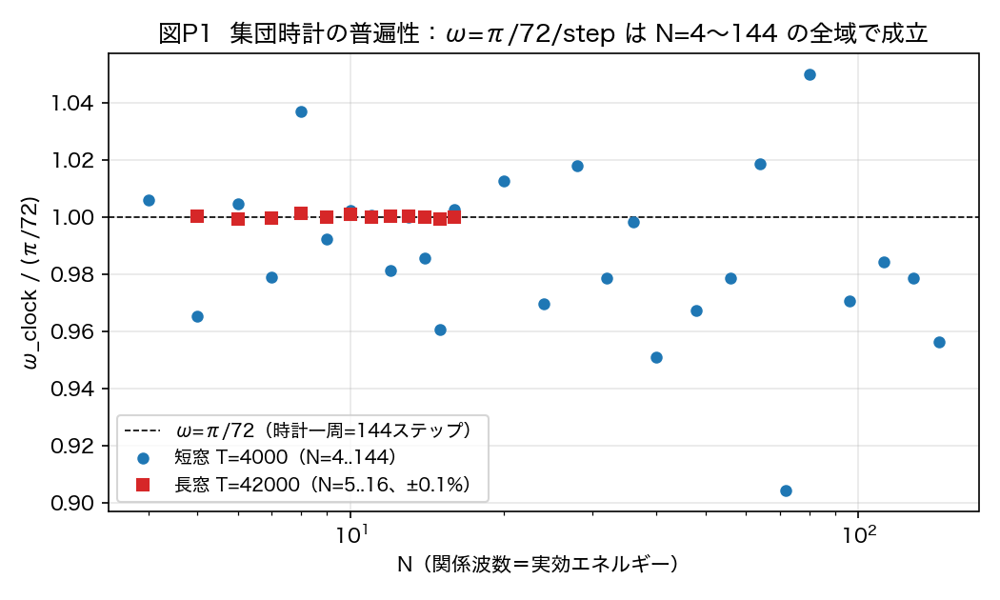
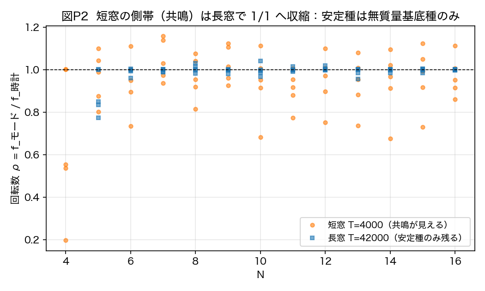
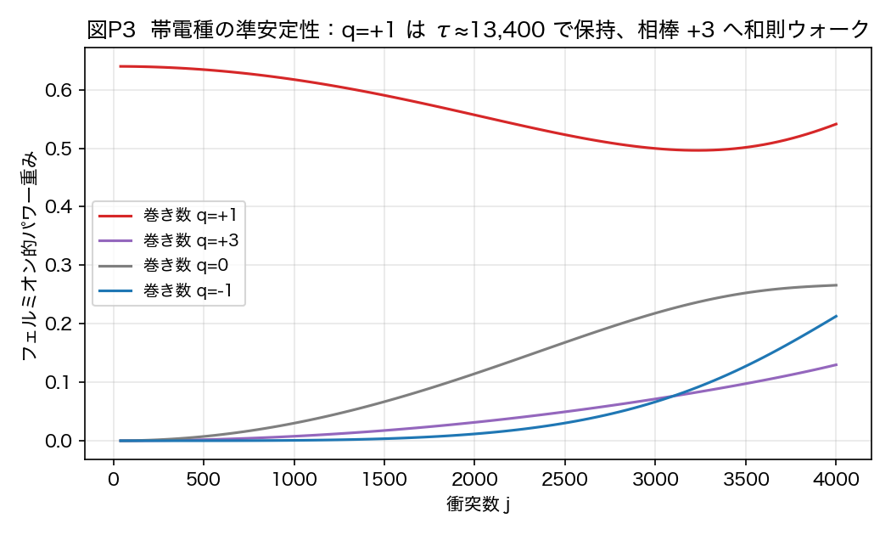
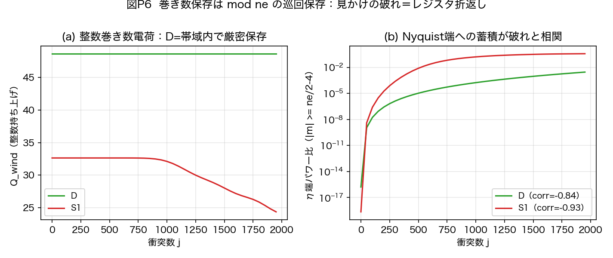
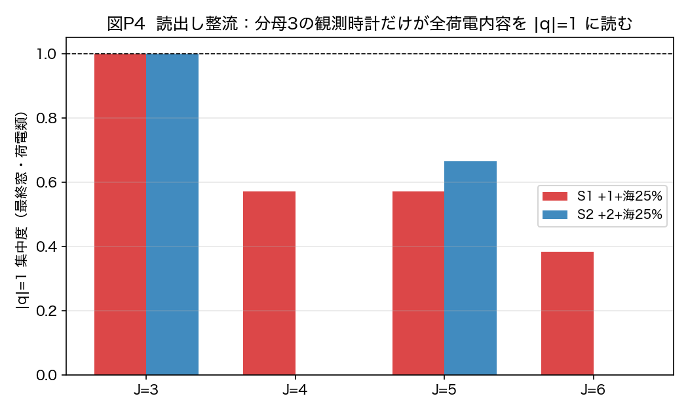
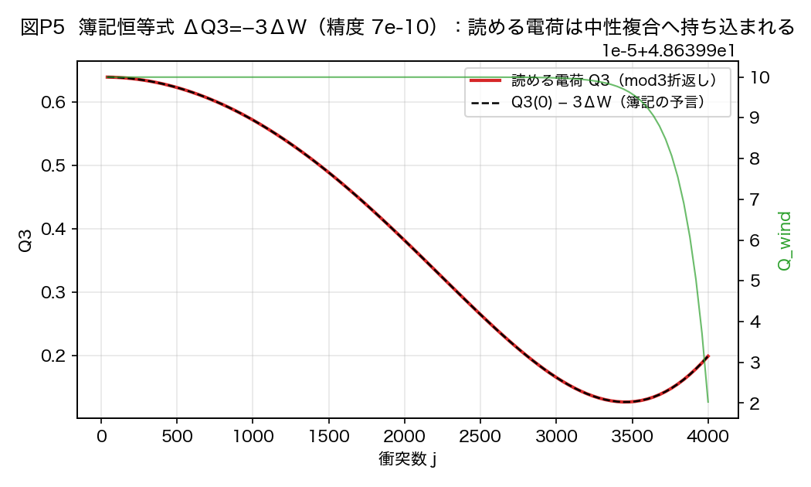
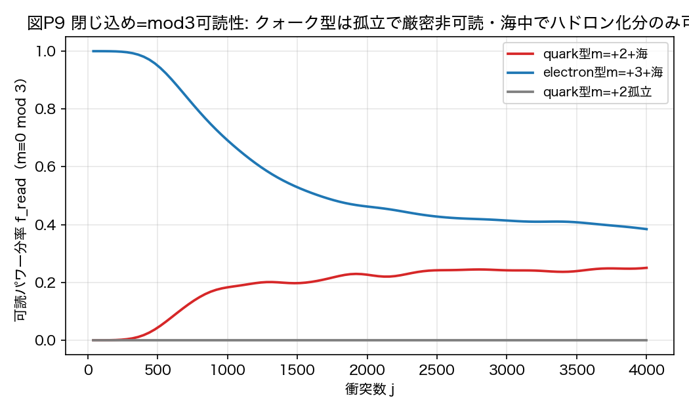
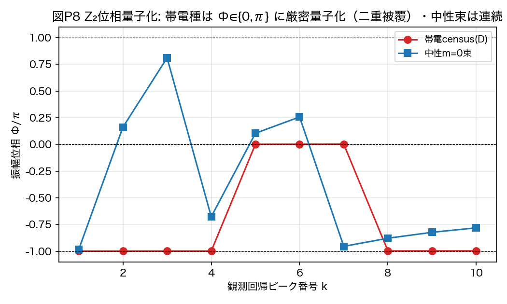
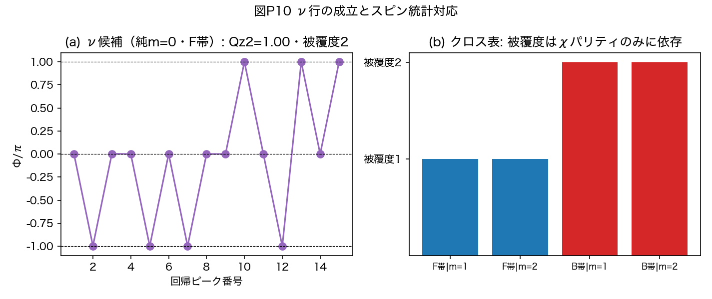
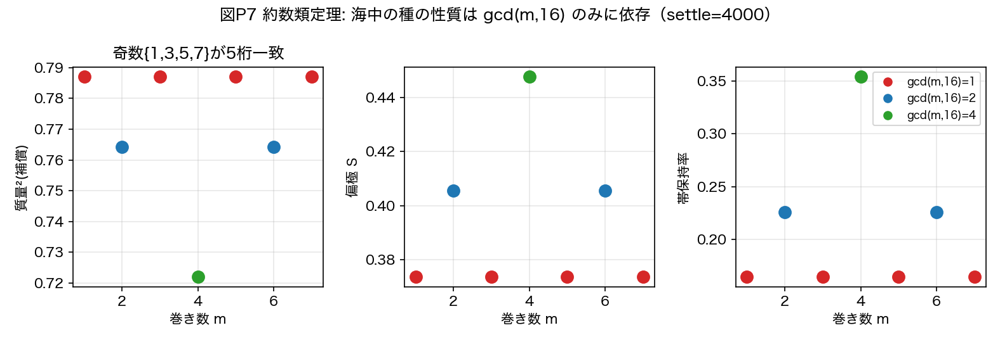

# 波の周期表——巻き数番地と観測時計による粒子分類の仮説

**著者**: 木原範昭
**日付**: 2026年8月6日
**種別**: 仮説提案論文（数値実験による支持つき・証明論文ではない）

---

## 要旨

粒子とは何で分類されるのか。本稿は、粒子概念を一切仮定しない波の力学（既公開の
二系をそのまま用いる）の数値実験から、**「波の周期表」**——巻き数番地と観測時計に
よる粒子分類の仮説——を提案する。出発点は、粒子を6軸 (x,y,z,t,R,Q) のどこに
巻きを持つかで分類する符号ベクトル思考実験 [1] であった。本稿はこの分類を波の形
だけから実測で作り直し、次の5本柱に到達する。**柱1（周期律）**: 分類の土台は
実測された普遍時計——集団時計 ω=π/72/step が N=4 から 144 の全域で成立
（長窓±0.1%）——であり、種は U^144 時計格子上の有理番地と時計との関係で
分類される。**柱2（電荷則）**: 電荷は Q_em = m/3（m は生の巻き数）であり、
支配的観測時計（分母3——先行実測のタング幅比 461 に基づく）が「3巻き＝素電荷1」
と読む。帰結として u型 m=+2 は +2/3、d型 m=−1 は −1/3、電子 m=−3 は −1 となり、
**閉じ込めと分数電荷は「mod 3 可読性」という同一の事実の二面**になる（陽子
uud=+3→+1、中性子 udd=0 の検算が自動で通る）。数値実験では、クォーク型番地は
孤立で厳密に非可読のまま（可読分率 0.0000 が持続）であり、海中ではハドロン化
（m≡0 複合の形成）の分だけ整数電荷単位で可読化した。**柱3（統計則）**: フェルミ/
ボーズの区別は空間回転ではなく**時計の二重被覆**に住む。状態位相は観測回帰ごとに
{0, π} に量子化され（実測3桁）、フェルミオン的種（奇数倍音）は両シートを訪れ
（被覆度2）、ボゾン的種は訪れない（被覆度1）。純 m=0 のフェルミオン帯種も
被覆度2を示し、中性フェルミオン（ニュートリノ）の行が成立する。**柱4（質量則）**:
質量は番地の属性ではなく海（真空）との関係量である——孤立番地は巻きシフト
対称性により全てユニタリ等価（実測）であり、海中の性質は約数類 gcd(m, 16) のみに
依存する（奇数番地が5桁一致）。**柱5（周期表）**: 表は孤立安定元素表と海中寿命表
の二枚看板であり、その上に標準模型62種の割当案を与える。この仮説の下で、前論文
[5] が未解決課題として明記した「電荷が±1に安定しない」問題は矛盾ではなく予言に
転じ、クォークの1/3電荷問題は閉じ込めと単一機構で接続される。本稿は証明を主張
しない。主張するのは、独立に実測された7つの構造が、単一の分類仮説の下で、
標準模型の粒子構造と、前論文の未解決課題と、符号ベクトル思考実験とを同時に
接続することである。全実験は決定論的スクリプトとして公開され、反証13件を含む
全過程が再現可能である。終節で、この分類仮説を動力学として検証するために次論文の
万能相互作用関数が満たすべき要件を確定する。

---

## 1. 序論——なぜ「周期表」か、なぜ仮説提案か

### 1.1 出発点: 符号ベクトル思考実験

先行する思考実験 [1] は、粒子を6軸 (x,y,z,t,R,Q) のどの軸に巻きを持つかで分類する
仮説を立てた——光子 γ=(0,0,0,0,R,0)、W±=(0,0,0,±t,0,0)、グルーオン
g=(0,0,0,0,0,Q)、グラビトン G=(0,0,0,±t,±R,0)。この分類は魅力的だが、思考実験の
水準に留まっていた。粒子種を波の力学の**実測**として分類できるか——それが本稿の
問いである。

### 1.2 方法の宣言: 粒子を仮定しない

本稿は新しい力学を一切導入しない。用いるのは既公開の二系——N体関係波力学 [2]
（三方向凝縮体の実測に使用）と、二体万能非弾性写像の閉形式厳密解 [3]（電荷・
統計・閉じ込めの実測に使用）——であり、いずれも「波の形だけを入力とし、内部に
特別な場合分けを持たない」無名性の原理で構成されている。粒子・電荷・スピンの
概念は力学に入っていない。それらが**読出しとして**どう立ち上がるかを測る。

### 1.3 性格の宣言と歴史的教訓

本稿は**仮説提案論文**である。粒子の分類企図には成功と失敗の両方の歴史がある。
Gell-Mann の八道説 [9] は SU(3) 分類から Ω⁻ を予言して成功した。他方、Kelvin の
渦原子 [8]——原子＝渦の結び目というトポロジー分類——は美しかったが、力学が
間違っていた。プレオン模型 [14] は62種級の全割当を試みたが衰退した。
**美しい分類は力学の正しさを保証しない。** 本稿が証明でなく仮説提案に留まり、
読出しレベルの主張と力学レベルの主張を峻別し（§2.3）、反証条件を明示する
（§11）のは、この教訓による。仮説の価値は「接続の広さと反証条件の明確さ」で
測られたい。

## 2. 方法と規約

### 2.1 力学（read-only）

- **N体系** [2]: N本の関係波（完全グラフの辺）の閉鎖力学。三方向準安定凝縮体を
  形成する。時計普遍性の走査（§3）に使用。
- **二体系** [3]: 二チャネル波 (a, b) の点毎相互作用 δa = −2R·Im(b̄a)·b の閉形式
  厳密解。状態は (χ, η) 格子上に住み、η 巻き数 m が電荷読出しの対象。
  電荷・統計・閉じ込めの全実験（§4-6）に使用。

いずれも決定論であり、全スクリプト・全結果は添付一覧（実験一覧_v1.md）に従って
単独再実行できる。

### 2.2 実測済みの規約検算

表示規約の衝突を避けるため、次の2点を機械検算した（添付 #25）:
(i) 束の構成 bin 番号と χ周波数は ±1 シフトで反転対応する（偶bin束→奇周波数、
逆も、パワー比 1.0000）。本文は**χ周波数表示**に統一する。フェルミオン的
＝χ周波数偶（≥4）＝奇数倍音 [7]。(ii) 束は構成上 η巻き m=+1 を厳密に1単位持つ
（η占有 (1, 1.000)）。任意の巻き m の種は射影ではなく巻きシフト e^{i(m−1)η} で
構成する。

### 2.3 最重要規約: 読出しレベルと力学レベルの区別

本稿の主張は**読出しレベル**——「観測時計と番地の関係として粒子分類が立ち上がる」
——に限定される。**力学レベル**——「62種が単一動力学のスペクトルとして生成・
崩壊・相互作用する」——の検証は本稿の範囲外であり、次論文（万能相互作用関数）
に委ねる。本稿の終節（§13）はその要件表を実測に基づいて確定する。

## 3. 柱1: 周期律の土台——普遍時計（実測）

N体凝縮体の集団時計を N=4 から 144 まで走査した（28点）。

**実測**: ω_clock = π/72/step が全域で成立する——短窓（T=4000）で比
0.988±0.028、長窓（T=42000）で 0.9992〜1.0013（**±0.1%**）。時計一周＝144
ステップは実効エネルギー（N）に依存しない。

**図P1**: 時計普遍性。全Nで ω/(π/72)=1。

さらに長窓の census は、低エネルギー領域（N≤16）の海で長時間定常な種が
**時計にロックした無質量基底種 ρ=1/1 ただ一つ**であることを示した（|ρ−1|<9×10⁻⁴・
質量度 10⁻¹¹）。短窓で見える質量を持つ側帯は全て有限寿命の過渡であり、時計へ
引き込まれて消える（図P2）。この反証過程（短窓の見かけの番地と質量則が長窓で
消える）は §12 に全記録した。

**図P2**: 短窓の側帯（共鳴）は長窓で 1/1 へ収縮する。

**仮説（柱1）**: 粒子種の分類子は U^n=I の有理番地であり、土台は単一の U^144
時計格子である。種は「番地（巻き数）×時計との関係」で分類される。

## 4. 柱2: 電荷則——Q_em = m/3 と閉じ込め＝mod 3 可読性

### 4.1 電荷の多値性（状態側の実測）

帯電種（巻き q=+1）は中性過渡より桁で長寿命（τ≈1.3×10⁴衝突・保持85%）だが、
永続はしない。その崩壊は消失ではなく、和則 m* = 2m_B − m_s [4] のウォークによる
相棒（+3）への移送である（図P3）。さらに孤立した純粋巻き数種は**任意の m で
厳密に自己複製し**（保持率 1.000・τ 数値∞）、海なしの混合 {+1,+3} すら漏れない
——**ウォークの駆動には m=0 の海が必須**である（漏れ先 {0,−1,+2}/{±4} は和則の
積と完全整合）。前論文 [5] §9.5 の「電荷が±1に安定しない」は、この海駆動
ウォークの直接の帰結である。

**図P3**: 帯電種の準安定性と和則ウォーク（+1→+3）。

### 4.2 巻き数電荷の保存則は巡回である

巻き数電荷の真の保存則は整数ではなく **mod ne（ηレジスタ位数、本系では16）の
巡回保存**である。点毎相互作用はηスペクトルの巡回畳み込みであり（連続極限では
δQ = R∮∂_η(s²) = 0）、整数電荷 Q_wind の保存は帯域内状態の系にすぎない（帯電
census 構成で CV≈0 の厳密保存を実測、図P6a）。見かけの破れは倍加ウォークが
Nyquist に届いた折返しである（端パワー37%蓄積・相関 −0.93、図P6b）。有限レジスタ
上で倍加梯子は 1→2→4→8→0 と 4歩で中性化する。

**図P6**: 巡回保存と Nyquist 折返し。

### 4.3 読出し整流（読出し側の実測）

海駆動ウォークの全生成物（倍加・反転梯子 2^b·(±1)）に対し、**観測時計 J=3 だけが
荷電内容の全てを |q|=1 に読む**（集中度 1.000——+1種の宇宙でも +2種の宇宙でも）。
J=4 は電荷を消し、J=5, 6 は多値に散らす（図P4）。代数的根拠は 2^b mod 3 = ±1。
観測時計が分母3であることは、先行実測 [6][7]——ロックのタング幅は分母3が
幅比>461で支配する——に基づく。素電荷の値そのものは有理番地
sin²(23π/124) = √(4πα)（16/10⁸ 一致）として既公開の実測 [6] に接続する。

**図P4**: 読出し整流。分母3の観測時計だけが全荷電内容を |q|=1 に読む。

簿記も閉じる: 保存構成において ΔQ3 = −3ΔW が精度 7×10⁻¹⁰ で成立する（Q3=mod3で
読める正味電荷、W=mod3中性複合に隠れた電荷の帳簿）。**読める電荷は消えない——
その減少は、分母3時計に中性と読める複合への持ち込みと厳密に等しい**（図P5）。

**図P5**: 簿記恒等式 ΔQ3 = −3ΔW。

### 4.4 仮説（柱2）: Q_em = m/3 と閉じ込め

以上を束ねる電荷則を提案する: **電荷は Q_em = m/3 であり、支配的観測時計（分母3）
が「3生巻き＝素電荷1」と読む。** 帰結:

- u型 m=+2 → +2/3、d型 m=−1 → −1/3、電子 m=−3 → −1、ν m=0 → 0。
- **閉じ込め＝mod 3 可読性**: 観測者の空間はη円の Z₃ 商であり、その上で一価な
  種（m≡0 mod 3）だけが自由に読出せる。クォーク（m≢0）は単独では非可読——
  **1/3電荷と閉じ込めは同一の事実の二面**であり、別々の説明を要しない。
- 検算: 陽子 uud = 2+2−1 = +3 → Q=+1。中性子 udd = 2−1−1 = 0 → Q=0。
  π⁺(ud̄) = 2+1 = +3 → +1。**全ハドロンの整数電荷が自動で従う。**

**閉じ込め検定（実測）**: クォーク型（m=+2）＋海は可読分率 f_read = 0.0000 から
出発し、ウォークが m≡0 複合（ハドロン相当）を作った分だけ可読化する
（→0.2504/4000衝突）。電子型（m=+3）＋海は f_read = 1.0000 から出発する
（最初から自由）。**クォーク型の孤立系は4000衝突走っても f_read = 0.0000 の
まま**——「単独のクォークは観測できない」が読出しの帰結として実現する（図P9）。

**図P9**: 閉じ込め＝mod 3 可読性の検定。

標準理論との対応: 「自由な状態は triality 0 のみ」という SU(3) 中心 Z₃ の超選択
[10][11] と同型の構造である。ただし標準理論では Z₃ はゲージ群の中心として力学側の
公理に入るのに対し、本仮説では mod 3 は観測時計の支配分母（実測）として
**読出し側**から出る——これが本稿の新規性の一つである（§9）。

## 5. 柱3: 統計則——Z₂ 時計被覆

### 5.1 統計は空間回転に住まない（実測）

チャネル二重項の全体回転は力学の厳密対称性であり（対照実験で全観測量が機械零で
平坦・Im(b̄a) の回転不変を解析確認）、空間回転荷は全観測モードで ℓ=±1（校正後、
N=6, 8 で偏差±0.01以内）——半整数もℓ=2も占有モードには現れない。統計の二値性は
チャネル側にも空間側にも住んでいない。

### 5.2 統計は時計の二重被覆に住む（実測）

種の状態位相を観測回帰列（観測量場 s=Im(b̄a) の自己相関ピーク列）で追うと、
**帯電種の位相は全回帰点で {0, π} に厳密に量子化される**（Φ/π = ±0.999 または
+0.002・3桁精度・連続値を取らない）——状態は +1/−1 の二シートを行き来する
（図P8）。中性の非射影束は連続位相を示し、量子化の有無が種を分ける。

**図P8**: Z₂位相量子化。帯電種は Φ∈{0,π}、中性束は連続。

クロス表実験（χパリティ×巻き数 {1,2} の4セル）は、**被覆度がχパリティのみに
依存し、巻き数（電荷）に依存しない**ことを示した: フェルミオン的種（χ周波数偶
＝奇数倍音）＝被覆度2（Z₂・両シート）、ボゾン的種＝被覆度1。さらに純 m=0 の
フェルミオン帯種（巻きシフト構成・η占有 (0, 1.000)）も Qz2=1.00 で被覆度2を
示した——**中性フェルミオン（ニュートリノ）の行が成立する**（図P10）。

**図P10**: ν行の成立とスピン統計対応。

### 5.3 仮説（柱3）と先行対照

**フェルミ/ボーズの区別＝時計被覆度**（1＝ボゾン的／2＝フェルミオン的）を提案
する。これは Finkelstein–Rubinstein [12] がソリトンのスピン統計を配位空間の
二重被覆から導いた構造の対応物だが、**二重被覆の住む場所が空間（回転・交換）では
なく時計（状態周期＝観測周期×2）である**点が異なる。同構造は先行実測 [6][7] の
位数248/観測124の忠実度（F₁₂₄側では回帰が見えず F₂₄₈=1）と接続する。

## 6. 柱4: 質量則——質量は海との関係量

### 6.1 等価性定理（実測3件）

- **巻きシフト等価性**: e^{imη} は力学の厳密対称性（b̄a 不変）であり、孤立した
  純粋番地種は全てユニタリ等価——実測でも全番地の質量²・偏極・s_z が機械精度で
  一致した。**質量・スピンは孤立番地の属性ではない。**
- **約数類定理**: 海中では性質が分化するが、**約数類 gcd(m, 16) までしか分化
  しない**（奇数 {1,3,5,7} の質量²が5桁一致・{2,6} 一致・{4} 独自、図P7）。
  理由は厳密: Z₁₆ の単元自己同型 m→um は海（m=0）を固定するため、海結合は
  単元番地を原理的に区別できない。帰結: **±1 と ±5, ±7 の区別は力学に存在せず、
  mod3 読出しだけが単元類を破る**——柱2（読出し整流）の独立な裏づけ。
- **χ帯平行移動対称性**: 同一巻き種を χ帯 (10,12,14)/(30,32,34)/(50,52,54) に
  置いても質量²は5桁一致——帯の位置も種を分化させない（§10 弱点1）。

**図P7**: 約数類定理。海中の性質は gcd(m,16) のみに依存する。

### 6.2 仮説（柱4）

**質量は海（真空）との関係量である。** 時計にロックした種（ρ=1/1）だけが無質量で
安定（光子的基底種・質量度10⁻¹¹実測）、時計から離れた内容は共鳴として質量を
持ち、海が種の個性（寿命・偏極・質量）を約数類の水準で分化させる。真空＝海を
粒子の性質の共同決定者とする視点は、創発ゲージ・創発フェルミオンの系譜
[13]（string-net凝縮・超流動³He）と共鳴するが、本稿は性質の海依存を等価性定理と
いう形で実測した点が異なる。

## 7. 柱5: 波の周期表——二枚看板と62種割当

### 7.1 二枚看板

- **表A（孤立安定元素表）**: U^144 時計格子上の純粋番地種。全て自己複製で安定
  （実測）。代数的分類子: 読める電荷（mod3）・倍加軌道・中性化歩数・ηパリティ。
  第二のパリティ構造: 奇数番地は倍加中性化に最大限（4歩）抵抗し、偶数は速く
  落ちる（±4は2歩、+8は1歩）。
- **表B（海中寿命表）**: 海結合が種を淘汰する——帯電で長寿命（τ~10⁴）・中性
  過渡で短寿命（τ~10²⁻³）・複合で中性化。**実観測される「粒子」はこの準安定
  階層である。**

### 7.2 標準模型62種の割当案

| 粒子 | 状態数 | 巻き m（Q_em=m/3） | 被覆 | 摘要 |
|---|---|---|---|---|
| u, c, t | 18 | +2（+2/3） | 2 | m≢0→閉じ込め。色=mod3非可読の生巻き残差（簿記W） |
| d, s, b | 18 | −1（−1/3） | 2 | 同上 |
| e, μ, τ | 6 | −3（−1） | 2 | 自由（m≡0）。素電荷番地 sin²(23π/124) [6] |
| ν ×3 | 6 | 0（0） | 2 | 中性フェルミオン（§5.2で成立） |
| γ | 1 | 0 | 1 | 基底種 ρ=1/1（無質量・安定・実測） |
| g | 8 | 色対（mod3中性・生巻き非零） | 1 | 色非一重項→単独非可読=閉じ込め |
| W±, Z | 3 | ±3, 0 | 1 | t巻き（自前時計の離調）→有質量（引き込み実測と整合） |
| H | 1 | 0 | 1 | 海（凝縮体）の集団モード。ℓ=0 |
| G | 1 | 0 | 1 | ℓ=1量子2個の複合のみ（§8.4）。ℓ=±2予言 |

計 **62種**（クォーク36＋レプトン12＋g8＋γ＋W2＋Z＋H＋G）。反粒子は m→−m
（電荷共役＝η反転・対生成は実測 [3]）。世代 g=1,2,3 の割当軸は未解決（§10）。
各行の確度（実測錨／構造対応／要検定仮説）は添付の周期表第0.4版に明示した。

## 8. 説明力——既存課題への接続

### 8.1 前論文の未解決課題「電荷±1非安定」の解決

前論文 [5] §9.5 は「電荷（巻き数）は±1に安定せず複数の値に分布する」を未解決
課題として明記した。本仮説の下でこれは矛盾ではない: **状態側**では海駆動ウォーク
（実測・§4.1）が巻き数を分散させ続ける。**読出し側**では分母3の観測時計がその
全生成物を |q|=1 に折り返して読む（実測・§4.3）。「電荷の多値性」と「素電荷の
普遍性」は矛盾なく同居する——未解決課題が仮説の予言に転じる。

### 8.2 クォークの1/3電荷問題

Q_em = m/3 の下で、分数電荷（なぜ1/3か）と閉じ込め（なぜ単独で見えないか）は
mod 3 可読性という単一機構である（§4.4・実測図P9）。

### 8.3 反物質

電荷共役 m→−m はスペクトルの対称であり、対生成はウォークの必然である
（既公開実測 [3]）。

### 8.4 重力の弱さ

凝縮体の回転生成子スペクトルに ℓ=2 の線形枠は存在しない（校正比最大 1.000 厳密・
実測）。スピン2はℓ=1量子2個の**複合**としてのみ存在でき、実際に読出し二乗の
スペクトルには 2ω の四重極線が全Nでコヒーレントに立つ（比 2±6%）。複合である
ことの直接の帰結として結合は二乗抑制 α_G=(m/M)² [15] を受ける——**重力が弱い
理由と検証が難しい理由は同一構造**である。これは重力振幅＝ゲージ振幅²
（double copy [16]）と同型の構造の、状態空間側からの出現である。

## 9. 先行研究との関係と新規性の限定

本仮説の部品にはそれぞれ強い先行系譜がある: 巻き数＝荷（Skyrme [17]・
Kaluza–Klein [18]）、mod3 閉じ込め（triality [10][11]）、統計の二重被覆
（Finkelstein–Rubinstein [12]）、真空＝海（Wen・Volovik [13]）、重力＝二乗
（KLT/BCJ [16]）、全種割当の企図（八道説 [9]・プレオン [14]）。
**本稿は部品の新規性を主張しない。** 新規性は次の3点に限定する:

1. これらの部品が、粒子概念を仮定しない**単一の無名力学の実測**として同時に
   出ること（合流）。
2. 電荷単位・閉じ込め・素電荷一意性が、力学側の公理（ゲージ群の中心）ではなく
   **観測時計の約数構造（読出し側）**から出るという対応物の提示。
3. 統計の二重被覆が空間（配位空間の回転）ではなく**時計**（状態周期＝観測周期×2）
   に住むという実測。

## 10. 仮説の弱点と未検証部分（正直な登録）

1. **世代の起源は未解決**: 世代＝χ帯位置の素朴仮説は反証済み（χ帯平行移動
   対称性・§6.1）。帯比・結晶学的位数 {3,4,6}・複合階層が残る候補。
2. **W/Z行**: 低エネルギー実験室（N≤16・小さな海）では直接生成不可（レジスタ端
   即崩壊・構造的）。有効接触頂点の 1/δ² スケーリング検定（Fermi理論の道）を
   指定済み・未実施。
3. **グラビトン行**: 四重極2ω線は全Nで実在するが、事前基準（|比−2|<0.02）は
   1/3のみ通過——読出し枠の較正が未了。
4. **レジスタ位数 ne=16 依存性**: 表Aの詳細（中性化歩数等）は ne の関数である。
   ne 可変系での再検が必要（「周期表の周期はレジスタ位数の関数」という検証可能
   予言でもある）。
5. **Q_em = m/3 と透過率電荷 √(4πα) [6][19] の二読出しの統一は未完**——素電荷の
   「単位」（3巻き）と「値」（0.302822）の関係は次論文の課題。
6. 海構成の一部（人工射影海）は保存クラス外と判明済み（Nyquist折返し・§4.2）。
   該当実験の定量は保留付きで扱い、定性結論は保存クラス内の系列で整合確認した。

## 11. 反証条件

1. 分母3以外が支配する二チャネル閉鎖系で |q|≠1 の安定読出しが構成されれば、
   柱2は棄却される。
2. いずれかの N で ω≠π/72 の定常時計が再現されれば、柱1は棄却される。
3. 被覆度がχパリティと独立に変わる種が構成されれば、柱3は棄却される。
4. 海なしで種の性質（質量・寿命・偏極）が分化する実測が出れば、柱4は棄却される。
5. m≢0 (mod 3) の種が単独で可読になる構成が見つかれば、閉じ込め則は棄却される。

## 12. 反証と修正の記録（13件・要約）

本研究の過程で反証された仮説と計器を全て記録する: (1) 短窓の側帯番地は安定種では
なく過渡（長窓で消滅）。(2) 質量＝離調²則は過渡上の見かけの関係。(3) ±1不動点
一意性の素朴形（任意の純粋mが不動点であり一意性は出ない）。(4) 質量-幅相関は
不成立（r=−0.07）。(5) 海構成規約（χ解析射影）仮説は不成立——保存の破れの正体は
Nyquist折返し（§4.2）。(6) escape率による±1一意性は約数類定理により原理的に
判定不能と判明。(7) SU(2)回帰角判別の運動学版は全状態でスピノル的（自明）。
(8) 被覆度の単点判定は位相の偶然のπ近傍を拾う（回帰列判定に較正）。
(9) グラビトンℓ=2の線形枠は不在（複合へ再解釈）。(10) 世代＝χ帯位置は反証。
(11) W/Z離調注入の帯シフト法は失敗（実効線形分散）。(12) ν構成の射影法は失敗
（束の毛m=+1が原因・シフト法で解決）。(13) 過去の射影海は増幅数値残差
（m=0場として正当・定性不変・記録）。各件の詳細は添付の分析ノートにある。

## 13. 統一動力学への要件引き継ぎ（次論文の仕様）

本稿の分類仮説を力学レベルで検証するには、現在二系に分かれている力学を単一の
**万能相互作用関数**に統一し、62種がそのスペクトルとして生成・崩壊・相互作用する
ことを示す必要がある。本稿の実測は、その関数が満たすべき要件を確定する:

1. **無名性**: 波の形だけを入力とし、種ごとの場合分けを持たない（IF文なし）。
2. **全チャネル同時**: 電磁（巻き交換）・弱（時計離調）・強（mod3非可読の生巻き
   残差）・重力（二次モーメント結合）が、別々の項でなく同一演算の異なる読出しと
   して出ること。三平面（xy=スピン／zR=質量／tQ=電荷）[20] を同時に駆動する。
3. **保存則の自動成立**: 巡回巻き保存（§4.2）・閉塞保存・ノルム保存を設計でなく
   演算構造から保つ。
4. **普遍時計の再現**: ω=π/72 の U^144 時計格子（§3）がスペクトルとして出る。
5. **選択則の創発**: 和則 m*=2m_B−m_s・倍加反転梯子・Z₂位相量子化・約数類構造が
   手置きなしに出る。
6. **厳密計算可能性**: 無名性⇒状態サイズ線形の計算構造 [4] を保つ（閉形式または
   整数厳密）。
7. **二系の特殊化**: 二体閉形式解 [3] と N体関係波力学 [2] が、その関数の
   制限・極限として再導出される。
8. **反証形**: 62種割当（§7.2）のいずれかがスペクトルに現れなければ、本稿の
   周期表仮説は該当行ごとに棄却される。

## 14. 再現性

全実験は決定論的スクリプト（28本）として本稿と同じフォルダに公開する。
対応表（実験一覧_v1.md）にスクリプト↔結果JSON（25点）↔図（10枚）↔主張の
完全対応を示した。当初対話的に実行された3件は正式スクリプト化し、保存結果との
再現一致を機械確認済みである。判定基準は各スクリプト冒頭に実行前に固定して
記録した。

## 引用文献

**自己引用（力学と実測の出所）**
[1] 木原範昭, 思考実験「R軸について」, Zenodo (2026). doi:10.5281/zenodo.19902677
[2] 木原範昭, 二段階seed除去による準安定相の因果分離（第8論文）, Zenodo (2026). doi:10.5281/zenodo.21614402
[3] 木原範昭, フェルミオン的構造の生成——万能非弾性写像, Zenodo (2026). doi:10.5281/zenodo.21808091
[4] 木原範昭, インフレーションの終わり方が物質生成の始まり方である（多体接続）, Zenodo (2026). doi:10.5281/zenodo.21809814
[5] 木原範昭, 空間軸3軸と固有時間の創生, Zenodo (2026). doi:10.5281/zenodo.21816651
[6] 木原範昭, 無名二チャネル閉鎖波系における数え上げ読出し（三部作B）, Zenodo (2026). doi:10.5281/zenodo.21763997
[7] 木原範昭, フェルミオンの生成構造（第9論文）, Zenodo (2026). doi:10.5281/zenodo.21766706
[15] 木原範昭, 実在中心の読み直し——導出置換編, Zenodo (2026). doi:10.5281/zenodo.21765367
[19] 木原範昭, 無名二チャネル閉鎖波系における二文法分解（三部作A）, Zenodo (2026). doi:10.5281/zenodo.21763995
[20] 木原範昭, 無名二チャネル閉鎖波系におけるロック動力学（三部作C）, Zenodo (2026). doi:10.5281/zenodo.21763999

**外部引用**
[8] W. Thomson (Lord Kelvin), "On Vortex Atoms," Proc. Roy. Soc. Edinburgh 6, 94 (1867).
[9] M. Gell-Mann, "The Eightfold Way," Caltech Report CTSL-20 (1961); M. Gell-Mann and Y. Ne'eman, The Eightfold Way (Benjamin, 1964).
[10] K. G. Wilson, "Confinement of quarks," Phys. Rev. D 10, 2445 (1974).
[11] G. 't Hooft, "On the phase transition towards permanent quark confinement," Nucl. Phys. B 138, 1 (1978).
[12] D. Finkelstein and J. Rubinstein, "Connection between spin, statistics, and kinks," J. Math. Phys. 9, 1762 (1968).
[13] M. A. Levin and X.-G. Wen, "String-net condensation," Phys. Rev. B 71, 045110 (2005); G. E. Volovik, The Universe in a Helium Droplet (Oxford, 2003).
[14] H. Harari, "A schematic model of quarks and leptons," Phys. Lett. B 86, 83 (1979); M. A. Shupe, Phys. Lett. B 86, 87 (1979).
[16] Z. Bern, J. J. M. Carrasco, and H. Johansson, "Perturbative quantum gravity as a double copy of gauge theory," Phys. Rev. Lett. 105, 061602 (2010); H. Kawai, D. C. Lewellen, and S. H. H. Tye, Nucl. Phys. B 269, 1 (1986).
[17] T. H. R. Skyrme, "A unified field theory of mesons and baryons," Nucl. Phys. 31, 556 (1962).
[18] T. Kaluza, Sitzungsber. Preuss. Akad. Wiss. (1921) 966; O. Klein, Z. Phys. 37, 895 (1926).
補足: S. Coleman, "Quantum sine-Gordon equation as the massive Thirring model," Phys. Rev. D 11, 2088 (1975) はボゾン化系譜の代表として [7] 経由で参照する。
