# Genesis of the Three Spatial Axes and Proper Time: Re-Derivation of Readouts from the Condensate, and the Uniquely Unreadable Coordinate Time

**Author:** Noriaki Kihara (WF System Co., Ltd.)　**Date:** 2026-08-06　**Version:** v1
**Version DOI:** [10.5281/zenodo.21816652](https://doi.org/10.5281/zenodo.21816652)
**Concept DOI:** [10.5281/zenodo.21816651](https://doi.org/10.5281/zenodo.21816651)

---

## Abstract

The preceding paper demonstrated shape-invariant translation of matter packets, but supplied the position axes (a three-dimensional register lattice) and the clock (harmonic-closure dispersion) externally. This paper **re-derives both** from the observables of the three-direction metastable condensate itself, re-derives the readouts of the mass-like and charge-like quantities in the same framework, and states every readout method in the text. Measured results: (1) the substance of the condensate is not three equal axes but **2+1** — the only independent substance is one complex eigenpair (a single rotation plane), and the third direction is dependent, being the rotation axis of the generator (agreement with the cross product 0.987 → 0.9965, improving with N). (2) The spatial $x, y$ axes are derived as the **quadratures** of the plane's complex coordinate demodulated by the proper clock — orthogonality is a construction of the readout, not a property of the substance. (3) Proper time τ is the tick of the condensate's **single collective clock** (ω ≈ π/72 per step; all occupied planes rotate rigidly), and this clock is collectively enforced by **entrainment**: clockless coherent perturbations are synchronized to the condensate clock and brought to rest. Displacements of the rest component persist undamped, and motion becomes the privilege of content carrying its own clock — mass. (4) Mass reads as the **non-coherence** $\det\Gamma = T^2\!-\!X^2\!-\!Y^2\!-\!Z^2 \ge 0$ of a readout pair (the mathematics is known from the coherence-matrix theory of polarization; our contribution is the physical identification and the in-model measurement: light-like eigenmode $1.2\times10^{-7}$ vs. condensate $3.1\times10^{-3}$). (5) Charge separates via transmission, relative phase, and winding number — readouts of waveform structure. (6) The **distributions** of the derived readouts are measured: sea modes concentrate at maximal non-coherence in both the growth and the thermal epoch — the sea is "heavy"; charge (winding) distributes over multiple quantized values and does not stabilize at ±1 — recorded as a known open problem; the fermionic content of the symmetric sea is gray (particle–antiparticle balanced), while structures with charged seeds concentrate on the particle side; matter-packet motion is visualized in the four-dimensional xyz+τ readout as uniform translation (all 10 points at deviation 0.000 for τ = 0–900). Organizing all of this on the closure cone $x^2+y^2+z^2 = t^2+R^2+Q^2 = R'^2$: **the full content of observation is the three spatial axes + proper time τ + mass m + charge q, and the uniquely unreadable quantity is the coordinate time t** — t appears only as the arithmetic residue $t^2 = R'^2 - m^2 - q^2$, or as a selection that postulates a wide-area shared time over the spatial oscillations of a large system. Consequently, the distinction that general relativity postulates — proper time is physical, coordinate time is convention — is **derived** from the readout structure. Dimensional sharpness is finite (ambiguity $\sim 1/M$), and at N=4 the third dimension does not crystallize — the few-body composite (baryon) domain is cut out of this paper as a separate subject.

---

## 1. The Character of This Paper — Separating Premises, Derivations, and Measurements

This paper proposes no new dynamics. Three layers are stated separately.

- **(a) Premises**: the inherited dynamics (the linear dynamics of Papers 7 and 8, read-only import with recorded SHA) and the three-direction metastable condensate (discovered in Paper 7; its genesis measured end-to-end in the preceding paper).
- **(b) Derivations**: the construction of the readout methods for $x, y, z$, proper time τ, mass m, and charge q (Sections 6–9). **Citations are provenance labels, not substitutes for derivation** — every readout is re-derived in the text so that verification closes within this paper alone.
- **(c) Measurements**: the preliminary experiment series v1–v5 and MC (see the experiment inventory; all result JSONs with contrast checks).

## 2. Claims

**First — the purpose of this paper — re-derivation of the readouts.** The readout methods for the three spatial axes $x,y,z$, proper time τ, the mass-like quantity m, and the charge-like quantity q are re-derived from the observables of the three-direction metastable condensate alone, with no hand-placed register lattice and no hand-placed dispersion clock. Each derivation is stated in the text (Sections 6–9).

**Second, the structure of the substance (measured, Section 5).** The substance of the condensate is not three equal axes but **2+1**: the top of the occupancy is one complex eigenpair (a single rotation plane; the conjugate pair of the tangent map with $|\lambda|=0.99998$), and the third direction is not an independent degree of freedom but the **rotation axis** of the antisymmetric flow obtained by projecting the generator onto the occupied subspace — its agreement with the cross product of the top two directions is 0.987 (N=5) → 0.9965 (N=8), improving with N.

**Third, derivation of the three spatial axes (Section 6).** $x$ and $y$ are derived as the quadratures of the plane's complex coordinate $c(n)$ demodulated by the proper-clock phase $\varphi(n)$: $x=\mathrm{Re}\,(c\,e^{-i\varphi})$, $y=\mathrm{Im}\,(c\,e^{-i\varphi})$. $z$ is the demodulated projection onto the rotation axis. **Orthogonality is a construction of the readout, not a property of the substance.** The 3D register the preceding paper supplied externally was an external surrogate of this intrinsic readout.

**Fourth, derivation of proper time τ (Section 7).** τ is the tick of the R′ clock — the condensate's single collective clock. Measured: all occupied planes rotate rigidly at the single frequency ω ≈ π/72 per step (agreeing with the fundamental angle of the dynamics to 0.04%). Moreover this clock is collectively enforced by **entrainment**: clockless coherent perturbations cannot keep their own detuning and synchronize to the condensate's clock. Rest = clock lock; displacements of the rest component persist undamped. Motion is the privilege of content with its own clock — mass — whose demonstration was already given by the matter-packet translation of the preceding paper. The whole is visualized in the four-dimensional xyz+τ readout as uniform translation (Figure 8: the equally spaced points of the 3D trajectory and the straight lines of the x–τ, y–τ, z–τ projections; all 10 points at deviation 0.000 for τ = 0–900).

**Fifth, re-derivation of the mass-like quantity m (Section 8).** m is the magnitude of the R component and reads from waveform **structure** in three ways: (i) non-coherence — the determinant of the Gram matrix of a readout pair, $\det\Gamma = T^2-X^2-Y^2-Z^2$ (fully derived in the text; the mathematics is known from polarization theory, the identification is this paper's contribution); (ii) closure-completion cost; (iii) the strength of one's own clock.

**Sixth, re-derivation of the charge-like quantity q (Section 9).** q is the magnitude plus relative sign of the Q component, and reads from waveform structure in three ways: (i) transmission, (ii) relative phase (the charge grammar), (iii) winding number (Kaluza–Klein-type momentum).

**Seventh, distributions of the readouts (measured supplement, Section 9.5).** Applying the derived readouts to the mode set $(k,m)$ in three states (the symmetric sea in its growth and thermal epochs; a charged structure): (a) sea modes concentrate at **maximal non-coherence (mass²/T² ≈ 1)** in both epochs — the sea is heavy, and light (light-like) states exist only as coherent structures. (b) **Charge (winding) distributes over multiple quantized values and does not stabilize at ±1** — the origin of the uniqueness of the elementary charge is a known open problem, and this paper provides the direct measurement of the distribution (Section 15-6). (c) In the spin-like quantity (the Bloch vector of the Gram — an exploratory readout) the sea is essentially unpolarized. (d) Fermionic waves classify by sign balance into **particle-like, antiparticle-like, and gray**; the symmetric sea concentrates on gray, structures with a charged seed on the particle side — the particle/antiparticle distinction does not exist in the symmetric sea; it is brought in by charged seeds.

**Eighth — the central thesis — the full content of observation, and the single unreadable (Section 10).** On the closure cone $x^2+y^2+z^2 = t^2+R^2+Q^2 = R'^2$, the full content of observation is **the three spatial axes + proper time τ + mass m + charge q**. **The uniquely unreadable quantity is the coordinate time t**: no direct readout instrument for t exists; t appears only as the arithmetic residue $t^2=R'^2-m^2-q^2$, or as the **selection** that postulates a wide-area shared time over the spatial oscillations of a large system. Two consequences. (1) The distinction general relativity postulates — proper time is physical, coordinate time is convention — is **derived** from the readout structure. (2) A candidate answer to why observed spacetime is 3+1 — because the readable content is exactly three real axes plus one clock.

**Ninth, conventions of orientation (Section 11).** There is no arrow of time. The imaginary sign is the bookkeeping of "the direction of this axis cannot be read" — the closure sees only squares. Physical quantities are relative signs only; the relative handedness of clock × rotation axis (−) is measured stably as a convention-invariant.

**Tenth, the boundary of applicability (Section 12).** The sharpness of the third dimension is finite: ambiguity $1-|\hat n\cdot\hat a| \sim 1/M$. At N=4 the third dimension does not crystallize. N=4,5 is the domain of few-body composites (baryons), where dimension, time, and even existence are ambiguous — that is the physics of that domain; this paper's subject is the large-N side where space exists, and the few-body domain is cut out as a separate subject.

**Eleventh, the full record of refutations and corrections (Section 13)** — five instrument errors, one of which is a live example of "the limits of resolution fabricating structure": the paper's own subject appearing on the instrument side.

**Finally, what this paper does not claim, and the falsification conditions (Section 16).**

## 3. Motivation — the Two Things Supplied Externally

The preceding paper (the many-body connection paper [1]) ran vacuum → inflation → condensation → matter precipitation under a single dynamics with no timing rule, and demonstrated that the generated matter packets move at constant velocity without changing shape. But that motion demo had two hand-placed inputs: **the position axes** (a $8^3$ register lattice) and **the clock** (the harmonic-closure dispersion $\omega_k = k\,\omega_1$ [6] inserted as a register clock).

With space and time supplied externally, one has not yet earned the title "genesis of the three spatial axes and proper time." The question of this paper is: **can the condensate supply the position axes and the clock from its own observables?** The answer is affirmative — and stronger than expected: the three axes are not equal but 2+1, orthogonality is manufactured by the readout, the clock is single and collectively enforced by entrainment, and exactly one quantity remains unreadable.

## 4. Premises — Dynamics and the Condensate

The dynamics is inherited unmodified from Papers 7 and 8 [3,4] (read-only import, recorded SHA series). Relational waves $Z \in \mathbb{C}^M$ of $N$ bodies ($M=N(N-1)/2$), generator $K_{ef}=\sin(\theta_f-\theta_e)$ (adjacent edges, antisymmetric), Cayley step. Starting from a self-consistent closure the system reaches, after latency and burst, the **three-direction metastable structure** (the discovery of Paper 7). All measurements of this paper are performed on this metastable condensate (post-settling windows; see the experiment inventory). Hereafter the **update count (the computational step label) is written $n$** — this is distinct from the coordinate time $t$ that appears in the closure cone ($t$ is the subject of Section 10 and appears in this paper only inside the decomposition of the cone). The argument of the parent plane's complex coordinate (the plane spanned by the real and imaginary parts of the self-consistent solution $v$) is written $\varphi(n)$, and the component with the parent plane projected out is written $Z_\perp$.

## 5. The Structure of the Substance — 2+1 (Measured)

Three measurements on the metastable-window trajectory pin down the substance of the condensate (Figure 1).

First, the singular values of the $Z_\perp$ trajectory come **strictly in pairs** (1.000, 0.998 / 0.427, 0.426 / 0.207, 0.207 / …) — the occupancy is a hierarchy of rotation planes. Second, in the eigendecomposition of the one-step tangent matrix ($2M\times2M$, finite differences), the occupied subspace is carried by **one complex-conjugate eigenpair** ($|\lambda|=0.999984$) — the independent substance is a single rotation plane, and no independent eigenvalue exists for a third direction. Third, the rotation axis $\hat a$ of the antisymmetric $3\times3$ obtained by projecting the generator $K$ onto the occupied 3D subspace agrees with the cross product of the plane's two directions, $\hat n = \hat d_1\times\hat d_2$: $|\hat n\cdot\hat a| = 0.9874$ (N=5) → 0.9918 (N=6) → 0.9965 (N=8).

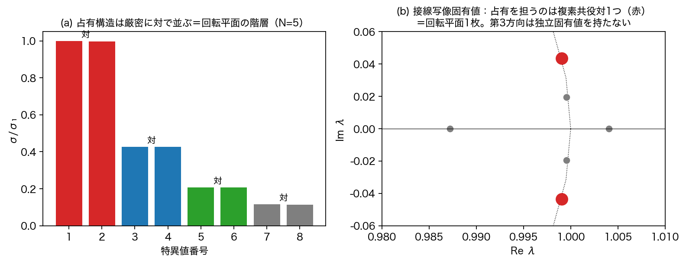

**Figure 1**: (a) singular values come strictly in pairs = a hierarchy of rotation planes. (b) Tangent-map eigenvalues: the occupancy is carried by one conjugate pair (red). The third direction has no independent eigenvalue.

In sum, the substance is **one plane (one complex degree of freedom) + one dependent rotation axis** — the substance of the "three directions" is not 3 but 2+1; more precisely, complex-1 + real-1.

## 6. Derivation of the Three Spatial Axes

**Derivation.** A state rotating within the plane is perfectly correlated in its projections onto **any** two in-plane directions (measured: readout correlation 1.0000) — hence the plane does not possess two independent real readouts. The plane's one independent readout is the complex coordinate

$$c(n) = \langle d_{\text{plane}},\, Z_\perp(n)\rangle$$

(where $d_{\text{plane}}$ is the complex direction of the plane constructed from the eigenpair). This is demodulated by the proper-clock phase $\varphi(n)$ (Section 7) and **decomposed into quadratures**:

$$x(n) = \mathrm{Re}\,\big(c\,e^{-i\varphi}\big), \qquad y(n) = \mathrm{Im}\,\big(c\,e^{-i\varphi}\big).$$

An important point must be made explicit: $\varphi(n)$ is **not** the argument of $c(n)$ itself (if it were, $c\,e^{-i\varphi}=|c|$ and $y\equiv0$ — the readout would degenerate). $\varphi$ is the collective clock phase read independently from the parent plane, and $c$ is a coordinate of $Z_\perp$ — two different readouts — so $c\,e^{-i\varphi}$ gives the **relative complex coordinate with respect to the clock**. The orthogonality of $x$ and $y$ is the orthogonality of the real and imaginary parts of a complex number — that is, a **construction of the readout** — and does not correspond to two orthogonal axes on the substance side (the substance is one complex degree of freedom). The third axis is the demodulated projection onto the rotation axis:

$$z(n) = \mathrm{Re}\,\big(\langle \hat a, Z_\perp\rangle\, e^{-i\varphi}\big).$$

The seemingly isotropic orthogonal three axes are thus manufactured as "the phase decomposition of one complex coordinate + the dependent axis."

**Measurements** (Figure 2): the clock-synchronized component keeps a constant radius $|r|=0.983\pm0.005$ and only precesses slowly in angle (0.12% per clock) — quasi-rest with invariant amplitude. A displacement (kick) of the rest component persists undamped for 8000 steps.

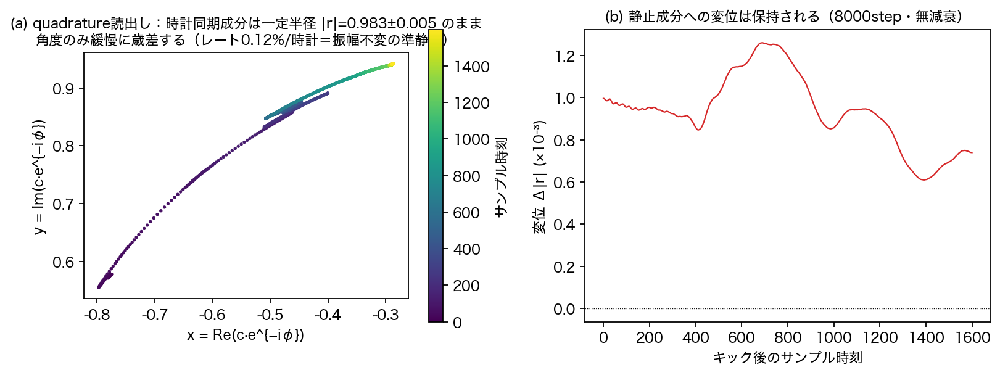

**Figure 2**: (a) quasi-rest of the clock-synchronized component. (b) persistence of a displacement.

The 3D register lattice supplied externally by the preceding paper turns out to have been an external surrogate of this intrinsic readout.

## 7. Derivation of Proper Time τ

**Derivation.** As the clock corresponding to the right side of the cone, $R'^2 = t^2+R^2+Q^2$, what a local system can read is the tick of the total $R'$ (the decomposition is Section 10). In the condensate this appears as the **rotation phase $\varphi(n)$ of the parent plane** — the single collective clock. The proper-time readout is

$$\tau(n) = \varphi(n)\,/\,\omega_{\text{clock}}.$$

**Measurement 1: the clock is single (Figure 3a).** At high resolution (10× window, zero padding), the rotation frequencies of all occupied planes converge to the single value ω ≈ π/72 per step (agreeing with the fundamental angle of the dynamics to 0.04%; ratios $1\pm1\%$). There is no ladder of frequencies (the "ladder" seen at low resolution was an instrument artifact — Section 13).

**Measurement 2: the clock is collectively enforced by entrainment (Figure 3b).** The natural fluctuation content of the condensate shows asynchronous phase with slips, but a **coherent** kick in the same direction cannot keep its own detuning and locks to the condensate clock (drift $-1.4\% \to -0.05\%$). Proper time is not an attribute of individual components; it is **an order that the condensate enforces collectively through entrainment**.

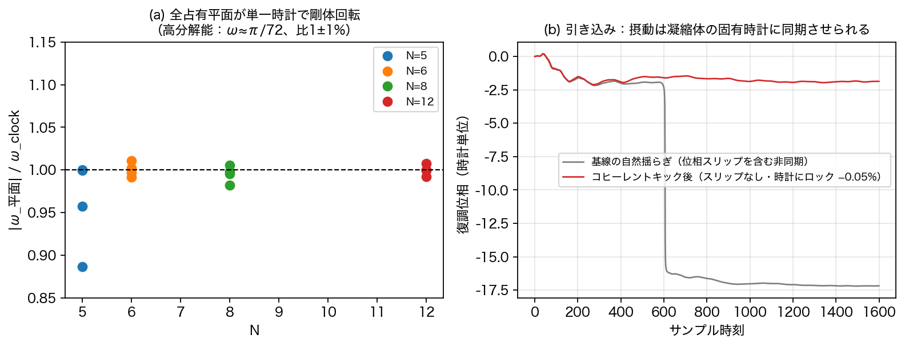

**Figure 3**: (a) all occupied planes rotate rigidly at a single clock (four values of N). (b) Entrainment — perturbations are synchronized to the condensate's proper clock.

**Consequence: the classification of rest and motion.** Rest = clock lock (displacements persist, Figure 2b). All clockless perturbations are entrained to rest. Hence **motion is the privilege of content that keeps ticking its own phase against entrainment — that which carries its own clock = mass.** The mass-side demonstration was already given by the matter-packet translation of the preceding paper [1] — Figure 8 visualizes the whole in this paper's readout vocabulary: the 3D trajectory of the xyz readout draws an equally spaced sequence of points (uniform translation), and in all three projection planes x–τ, y–τ, z–τ, the measured points lie on the predicted straight lines (τ = 0–900, all 10 points at deviation 0.000, PR constant 3.39 — the packet travels straight for 900 steps without changing shape at all). The chain mass → proper clock → time → motion closes.

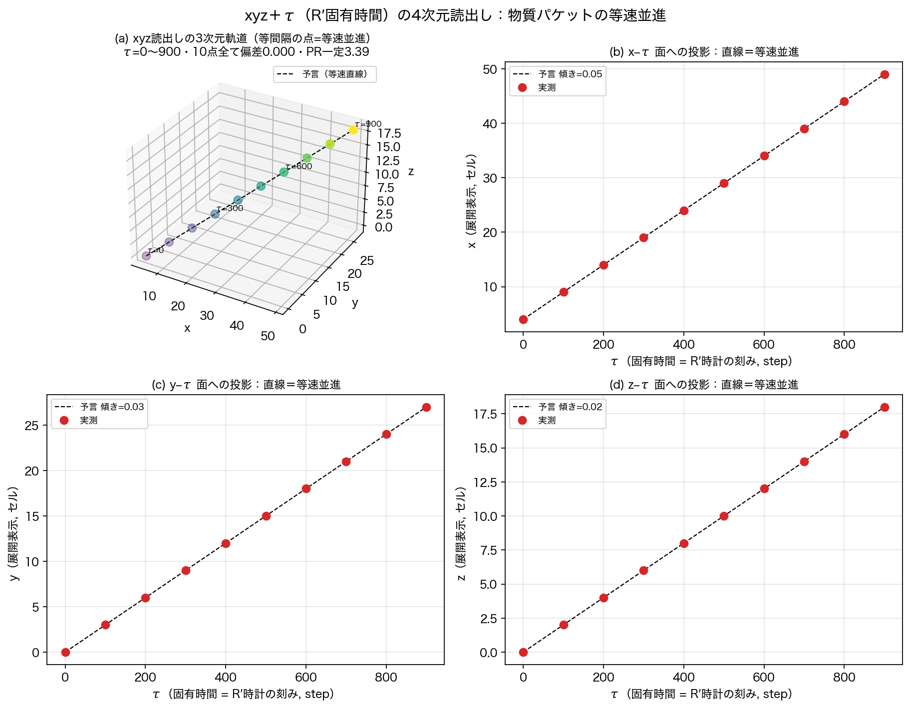

**Figure 8**: the four-dimensional xyz+τ (R′ proper time) readout. (a) 3D trajectory — equally spaced points = uniform translation. (b)(c)(d) projections onto the x–τ, y–τ, z–τ planes — straight lines = constant velocity. All 10 points at deviation 0.000.

## 8. Re-Derivation of the Mass-Like Quantity m

Mass is the magnitude of the R component and reads from waveform **structure** (quantities visible in a snapshot). Three routes are derived.

### 8.1 Readout (i): non-coherence (fully derived)

For a two-component complex readout $u=(c_1, c_2)$ (e.g., the parent-plane coordinate and the principal out-of-plane coordinate), the window-averaged Gram matrix

$$\Gamma = \langle u\,u^\dagger\rangle = \begin{pmatrix} \langle|c_1|^2\rangle & \langle c_1\bar c_2\rangle \\ \langle c_2\bar c_1\rangle & \langle|c_2|^2\rangle \end{pmatrix}$$

is $2\times2$ Hermitian. Decomposing in the Pauli basis, $\Gamma = T\,\mathbb{1} + X\sigma_x + Y\sigma_y + Z\sigma_z$, the determinant is identically

$$\det\Gamma = T^2 - X^2 - Y^2 - Z^2.$$

Since $\Gamma$ is positive semidefinite, $\det\Gamma \ge 0$ — **a light-cone-type bound holds automatically**. Equality $\det\Gamma=0$ holds if and only if $\Gamma$ has rank 1, i.e., $u$ is proportional to a single complex amplitude within the window ($c_2 = \text{const}\cdot c_1$) — fully coherent = **light-like**. We therefore take

$$m^2 \equiv \det\Gamma$$

as the mass readout: mass is the **non-coherence** of the readout pair. We distinguish normalizations: $\det\Gamma$ is quartic in amplitude, so the absolute mass candidate is $\sqrt{\det\Gamma}$, while the dimensionless **mass degree** is $\det\Gamma/T^2 \in [0,1]$. What this paper measures (including Section 9.5) is the latter; "maximal mass" means, precisely, maximal non-coherence degree — fixing the absolute energy scale (the scale of the R axis) remains future work.

**Provenance of the mathematics.** This mathematics is not new: the Pauli coefficients of a $2\times2$ coherence matrix are the Stokes parameters of polarization, and $\det J \ge 0$ (equality = full polarization) is a classical identity of polarization theory [11,12]. This paper's contribution is the physical **identification** — reading the degree of depolarization as mass² and identifying light-like = fully polarized (rank 1) — plus the following in-model measurements.

**Machine verification** (Figure 4; criteria fixed before execution): a synthetic rank-1 state gives $m^2/T^2 = 1.4\times10^{-16}$ (machine zero); an incoherent synthesis of two independent components gives $1.000$. In the model, the pre-condensation parent eigenmode (the light-like candidate) gives $1.2\times10^{-7}$, the metastable condensate $3.1\times10^{-3}$ — **the condensate carries $2.5\times10^4$ times the mass degree of the light-like eigenmode**, consistent with the entrainment of Section 7 (the condensate enforces its own clock).

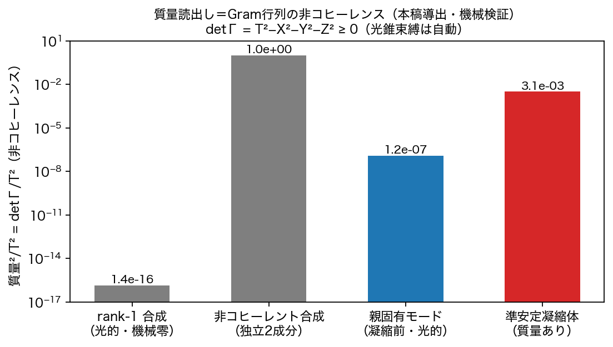

**Figure 4**: the mass readout = non-coherence of the Gram matrix. Machine verification on four states.

### 8.2 Readout (ii): closure-completion cost

In the frame reading generation as "completion of closure" (Paper 9 [7]), mass reads as the cost of completing the closure (the operational definition and the $f(N)=2\ln N/N$-type counting are given in [7]; the identification is established by that paper's experiments). Here we keep this as a provenance label; the primary readouts of this paper are (i) and (iii).

### 8.3 Readout (iii): the strength of one's own clock

From Section 7, mass reads dynamically as the **degree of resistance to entrainment** — the strength with which content keeps ticking its own phase. Light-like linear perturbations are entrained completely (zero mass); matter content keeps its clock and moves. Consistency with readout (i): fully coherent (rank 1) ⟺ entrained ⟺ massless holds simultaneously in the measurements of Section 7 and Figure 4.

## 9. Re-Derivation of the Charge-Like Quantity q

Charge is the magnitude plus relative sign of the Q component and likewise reads from waveform structure. Three operational definitions are stated.

**Readout (i): transmission.** From the two-wave collision readout $\theta = \operatorname{atan2}(\sqrt{P_f}, \sqrt{P_b})$ (the ratio of fermionic to bosonic relational content of the combined spectrum), the reflection rate $R=\sin^2\theta$ is read, and its complement — the transmission $1-R$ — is the elementary-charge readout (the quantitative identification $1-R=\sqrt{4\pi\alpha}$ was established in Trilogy A [6]).

**Readout (ii): relative phase (the charge grammar).** The **sign** of charge reads as the relative phase of two waves (same sign = one phase relation, opposite sign = inverted; the grammar including its two neutralization mechanisms was established in [6]). This is consistent with the principle of Section 11 (physical quantities are relative signs only) — the sign of charge, too, is relational, not a standalone attribute.

**Readout (iii): winding number.** The dominant winding number $m$ of the Fourier transform along the internal ($\eta$) axis is the charge-type (Kaluza–Klein) momentum. That pair creation obeys the winding sum rule $m^* = 2m_B - m_s$ exactly is measured in the two-body and many-body censuses [2,1] (unpredicted windings at machine zero).

All three read structural quantities from waveform snapshots; consistently with the closure (which sees only squares), what is readable is magnitude and relative sign — not the signed coordinate itself.

## 9.5 Distributions of the Readouts — Mass, Charge, Spin, and Classes in the Sea (Measured Supplement)

The readouts of Sections 8–9 are applied to the mode set $(k, m)$ (raw bin × winding) in three states — the symmetric sea in its growth epoch (j=400–500) and its thermal epoch (j=3000–3200), and a charged structure (census-type: single-winding pumps + a single-winding seed).

**The mass distribution (Figure 9)**: sea modes concentrate at **maximal non-coherence (mass²/T² ≈ 1)** in both epochs — the sea is "heavy." Light (light-like) states do not appear in the sea; they are confined to coherent structures (the eigenmode at $1.2\times10^{-7}$, Figure 4). The structure of the mass spectrum is carried by coherent structures, not by the sea.

**The charge distribution (Figure 10)**: in the symmetric sea, charge (winding) distributes almost flatly over many values and **does not stabilize at ±1 — this is a known open problem, and this measurement is its direct observation** (Section 15-6). In the charged structure, multiple charge values coexist: the seed $m=1$ dominates and the sum-rule partner $m=3$ stands clearly above the machine-zero floor (log display) — charge takes a **set** of quantized values, but the mechanism that collapses it to ±1 has not been found.

**The distributions of bosonic and fermionic waves, and of the spin-like quantity (Figure 11)**: the class-resolved power spectra show the growth-epoch structure (pump lines, the fermionic hump) flattening under thermalization (class totals F/B 21.9/42.2 → 28.9/35.1 — approach to equipartition). The spin-like quantity (the Bloch vector of the Gram — an **exploratory** readout, a by-product of Section 8.1) shows the sea essentially unpolarized ($|S|\approx0.03$), the coherent charged seed about five times more polarized ($|S|\approx0.13$) yet far from full polarization. A full identification of spin is future work.

**The distribution of particle-like, antiparticle-like, and gray states (Figure 12)**: the sign-balance $b=(P_+-P_-)/(P_++P_-)$ distribution of fermionic waves concentrates near $b=0$ (**gray**) in the symmetric sea (particle and antiparticle fractions zero in both epochs) and at $b=+1$ (**particle-like**) in the structure with a charged seed. Particle/antiparticle/gray is readable as a three-way classification of states: symmetric initial conditions grow a gray sea; charged seeds grow particle-like content.

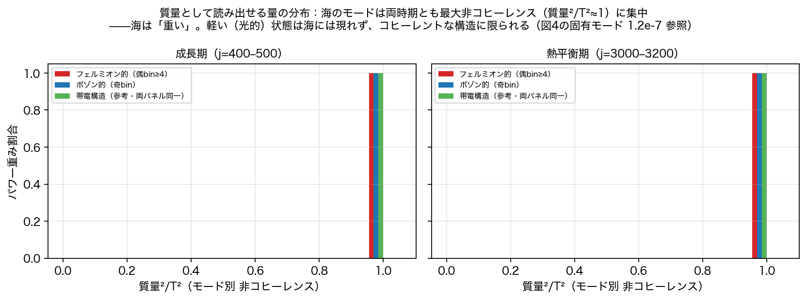

**Figure 9**: the distribution of the mass readout. The sea concentrates at maximal non-coherence.

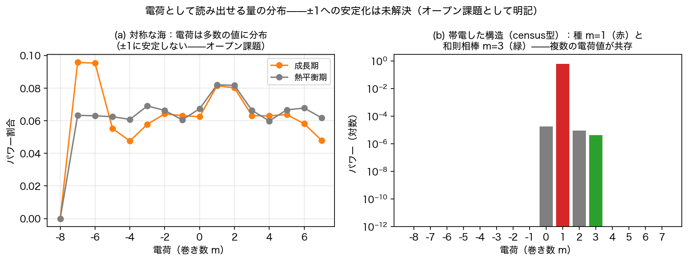

**Figure 10**: the distribution of the charge readout. Stabilization at ±1 is unresolved (open problem).

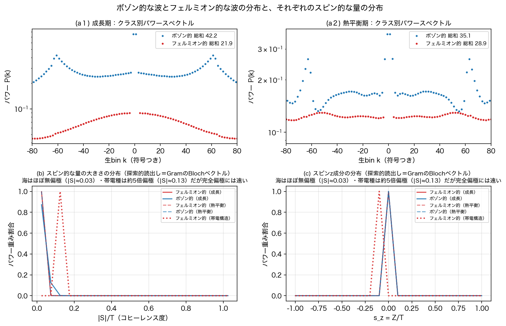

**Figure 11**: the distributions of bosonic and fermionic waves and of the spin-like quantity.

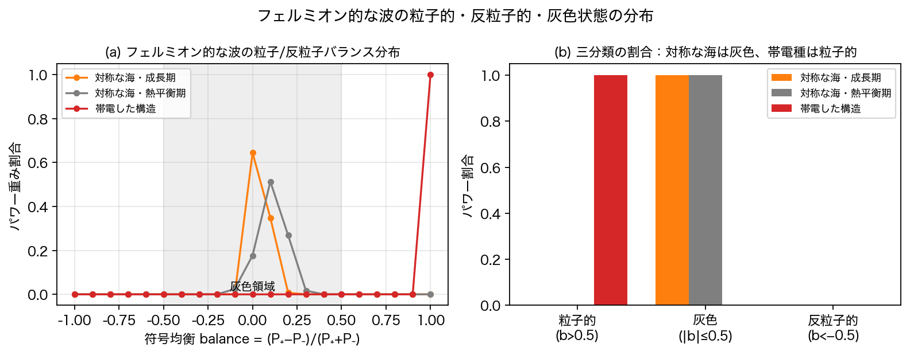

**Figure 12**: the distribution of particle-like, antiparticle-like, and gray states of fermionic waves.

## 10. The Central Thesis — the Full Content of Observation, and the Single Unreadable

The readouts of Sections 6–9 are organized on the closure cone

$$x^2 + y^2 + z^2 \;=\; t^2 + R^2 + Q^2 \;=\; R'^2$$

(Figure 5).

| Quantity | Readable? | Means (derived in the text) |
|---|---|---|
| $x, y, z$ | ○ direct | quadratures (Section 6) |
| proper time τ = the R′ clock | ○ direct | the tick of the single clock, collectively enforced by entrainment (Section 7) |
| mass m (R component) | ○ separable | non-coherence / completion cost / own-clock strength (Section 8) |
| charge q (Q component) | ○ separable | transmission / relative phase / winding (Section 9) |
| **coordinate time t** | **× uniquely not** | only as the residue $t^2=R'^2-m^2-q^2$ or as a wide-area selection |

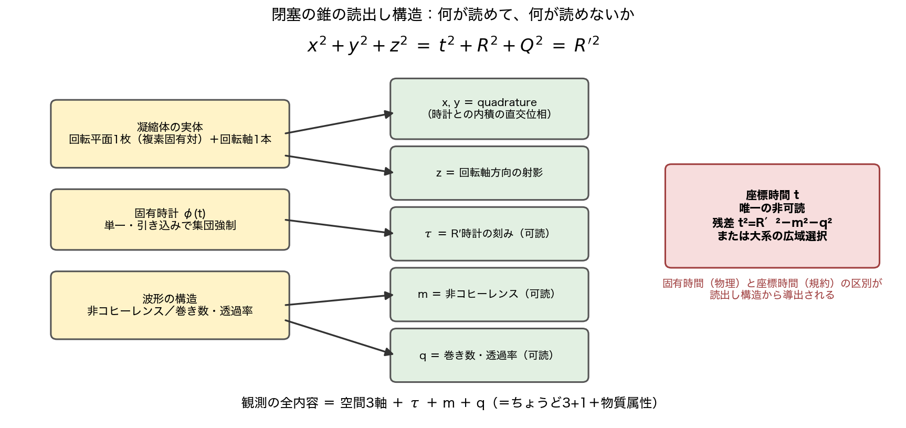

**Figure 5**: what can be read, and what cannot.

**The uniquely unreadable quantity is the coordinate time t.** Surveying the entire experimental corpus of this series, no direct readout instrument for t exists (the "time" of every experiment is either a step counter = convention, or the R′ clock). t appears through exactly two routes: (a) the arithmetic residue $t^2 = R'^2 - m^2 - q^2$; (b) the route that collates the spatial oscillations of a large system (many local clocks) and **selects** the postulate of a wide-area shared time — indeed, the everyday separation of t proceeds by this route, and the separations of R and Q likewise proceed by bookkeeping from spring-like and electromagnetic oscillations observed **in space**.

**A structural reason (candidate)**: the contents of R and Q are waveform **structure** (non-coherence, winding — they appear in a snapshot), but the content of t is the **flow** itself, which leaves no trace in a snapshot. The flow cannot be read from within the flow.

**Consequence 1: derivation of the proper-time/coordinate-time distinction.** In general relativity, "proper time is what clocks measure — physical; coordinate time is gauge — convention" follows from the **principle** of diffeomorphism invariance. Here the same distinction is **derived** from the readout structure of the closure cone — the direction of the principle is reversed.

**Consequence 2: why 3+1.** The structure of observation is exactly 3+1 (three real axes + one clock) plus matter attributes (m, q). Because the readable content is exactly that — this is the model's candidate answer.

## 11. Conventions of Orientation — There Is No Arrow of Time

The model has no arrow of time. The imaginary sign is the bookkeeping of "the direction of this axis cannot be read" ($(it)^2=(-it)^2$ — the closure sees only squares), and running the map forward is convention, not physics. Measurements agree: replacing the initial state by its complex conjugate (conjugation of the state is not time reversal — Section 13) leaves the convention-invariant **relative sign** — the relative handedness of the clock rotation and the rotation axis — unchanged (−). Physical quantities are relative signs only; absolute orientations (the arrow of time, the handedness of space) are selection problems. Note that the claim of this section is that **the fundamental closure and the reversible map have no absolute time orientation**; whether a **statistical effective arrow of time** emerges from the history of thermalization, generation, and autocatalysis is a separate question (Section 15-9).

## 12. The Boundary of Applicability — Dimensional Sharpness and the Few-Body Domain

The agreement of the third direction's dependence (rotation axis = cross product) is not perfect and improves with N. The ambiguity $1-|\hat n\cdot\hat a|$ scales roughly as the inverse of the number of relational waves $M$ (0.0126 → 0.0082 → 0.0035 for N=5,6,8), and **at N=4 the ambiguity is 0.9986 (agreement $|\hat n\cdot\hat a|=0.0014$) — the third dimension does not crystallize at all** (Figure 6). Explicitly, the hierarchy is continuous: N=4 = non-crystallized; N=5 = crystallized but with maximal ambiguity (the edge of the few-body domain); large N = a sharp spatial phase.

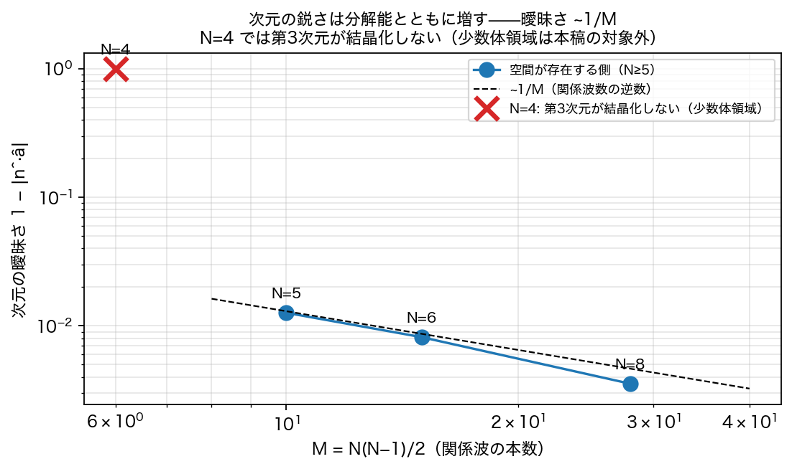

**Figure 6**: dimensional ambiguity ~1/M. At N=4 the third dimension does not crystallize.

This is not a defect but the boundary of applicability. As closed relational systems, N=4,5 is the domain of **few-body composites — baryons** — extremely quantized and discretized, alias-ridden, with dimension, time, and even existence ambiguous: that is the physics of that domain itself (consistent with the separate line of this series identifying fractional quark charges with low-order rational addresses). The subject of this paper is the large-N side where space exists; the few-body domain is explicitly cut out as a separate research subject.

## 13. Record of Refutations and Corrections

| # | Error | Discovery | Correction |
|---|------|------|------|
| 1 | Phase-gradient gauge: frequency measured by the slope of the demodulated phase | Phase slips at amplitude zero crossings contaminate it | Switched to FFT-peak gauges. The baseline "detuning" numbers contain slip contamination, so the entrainment conclusion is stated as "slipping asynchrony → slip-free lock" (Figure 3b) |
| 2 | **FFT bin quantization misread as an "equally spaced comb at 0.1% precision"** | The "spacing" agreed exactly with the FFT bin width $2\pi/n_s$ at every N | Re-measured with a 10× window plus zero padding → the comb vanishes; a single clock (Figure 7). **The limits of resolution fabricate structure — a live instance of this paper's subject appearing on the instrument side** |
| 3 | Window transients mistaken for real structure | Vanish at high resolution in late windows | Standardized on post-settling windows |
| 4 | Conjugation of the state confused with time reversal (chirality-test design error) | The conjugate state also converged to the same sign | Reinterpreted via "physical quantities are relative signs only" (Section 11); the conjugation test stands as a check of convention invariance |
| 5 | The naive design "motion = detuning" | Kicks do not keep their detuning; they lock to the clock | **The discovery of entrainment** (Section 7) — a refutation turned into the central result |

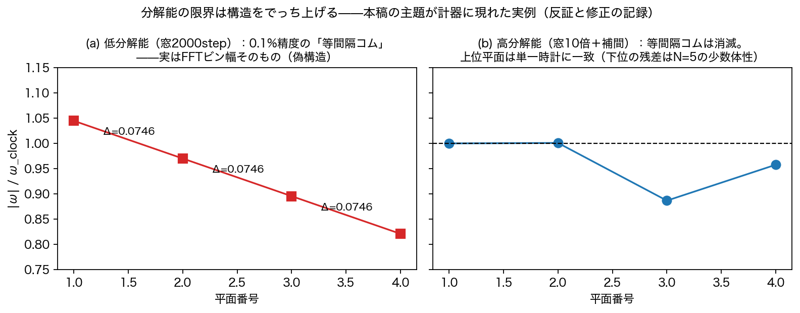

**Figure 7**: instrument lesson #2. The low-resolution "equally spaced comb" (left) is exactly the FFT bin width and vanishes at high resolution (right).

Three of the five (#1–2, #5 with #4) are the same mistake: building an instrument without deriving the properties of the measured quantity. The discipline is written out: **derive the invariance (or the predicted value) of the measured quantity before designing the instrument.**

## 14. Prior Work — Correspondences Found After Independent Derivation

The readout constructions of this paper were derived independently from the closure cone and the condensate's observables. Re-surveying afterwards, we find the following correspondences — supporting evidence, not proofs.

1. **Relational time — the Page–Wootters mechanism** [8]. Time emerges for subsystems from correlations with a clock subsystem inside a globally stationary state ("evolution without evolution"). Differences: there, conditioning on quantum constraints and entanglement; here, the clock itself is dynamically self-generated (condensation + entrainment), and the unreadability of coordinate time is derived from the readout structure.
2. **Coordinate time is gauge — partial observables** [9]. That coordinate time is not an observable in general relativity is orthodox, formalized by Rovelli's partial observables. Difference: in GR the distinction follows from the principle of diffeomorphism invariance; here it is derived from the readout structure — **the direction of the principle is reversed**.
3. **Quadrature readout — homodyne detection** [10]. Reading the two quadratures against the phase of a local oscillator is standard quantum optics, mathematically identical to our $x, y$ readout. Difference: in optics the LO is an external device supplied by the experimenter; here the phase reference is the system's own condensate (the proper clock self-selected by entrainment) — **the universe supplies its own local oscillator**.
4. **The mathematics of the mass readout — the coherence matrix of polarization** [11,12]. Pauli decomposition of the $2\times2$ coherence matrix = Stokes parameters; $\det J\ge0$ (equality = full polarization) is classical. This paper's contribution is limited to the physical identification (depolarization degree = mass²; light-like = fully polarized) and the in-model measurements.
5. **Scale-dependent dimensionality — the spectral dimension of CDT** [13]. The effective dimension of spacetime runs and decreases at short distances. Same direction as our "ambiguity ~1/M; non-crystallization in the few-body domain." Difference: theirs is a diffusion dimension; ours is a constructive, algebraic dimension gauge (the agreement of rotation axis and cross product).
6. **Entrainment — synchronization theory** [14]. Entrainment into collective rhythms is classical since Huygens. Difference: this paper reads entrainment as the **mechanism by which proper time subsists** — the clock is an order collectively enforced by the condensate — leading to the kinematic classification "rest is the fate of massless perturbations; motion is the privilege of mass."
7. **Reference frames as physical systems — quantum reference frames** [15]. Directions and times are defined only relative to physical systems (unspeakable information). Difference: there the reference frame is given as a resource; here the reference frame (clock and axes) is measured to self-generate from the dynamics.

## 15. Outlook — Open Problems (working guide; not claimed here)

1. **Matter tracking in intrinsic coordinates only**: track a matter packet resisting entrainment using the intrinsic coordinates of Section 6, with no external register referenced (completing "motion = the privilege of mass" intrinsically).
2. **The dynamics of t selection**: place several local condensates in a large system and measure how a wide-area time t is selected (the collation of clocks = a synchronization network).
3. **The full geometry**: metric via the chord formula $R''=2R\sin(\Delta\theta/2)$, curvature, back-reaction of matter.
4. **The few-body (baryon) domain**: the physics of the domain where dimension, time, and existence are ambiguous — as a separate subject.
5. **Attribution of the ±1% residuals**: resolution or fine structure (recorded as low priority).
6. **Stabilization of charge at ±1**: charge (winding) distributes over multiple quantized values with no collapse mechanism to ±1 found (Figure 10). Where the uniqueness of the elementary charge comes from is a principal open problem of this series. Additionally, the three charge readouts (transmission, relative phase, winding) should be measured simultaneously on one state set and unified into a single table of monotone relations, sign correspondences, conservation, and pair-creation conjugacy.
7. **Continuous sweep of mass degree vs. entrainment resistance**: sweep the non-coherence degree $\mu=\det\Gamma/T^2$ from 0 to 1 and measure lock time, residual detuning, own frequency, and velocity. If $\mu$ and entrainment resistance are related one-to-one, "mass = non-coherence" advances from an identification to dynamical mass. Whether the total $\sum \det\Gamma$ is conserved or monotone should be measured at the same time.
8. **Completeness of the readout algebra**: classify the admissible invariant readouts (instantaneous snapshots and finite-window correlations; common-phase, permutation, and convention invariant) and show that the invariant ring is generated by $\{x,y,z,\tau,m,q\}$ with no independent $t$ — turning "uniquely unreadable" into a no-go theorem.
9. **A statistical arrow of time**: the fundamental dynamics has no absolute orientation (Section 11); whether an entropic effective arrow emerges from the history of thermalization and autocatalysis is an untouched, separate question.

## 16. What This Paper Does Not Claim; Falsifiability

This paper does not claim that real spacetime is this model. Falsification conditions: (a) if, from the admissible readouts (functions of waveform snapshots or finite-window correlations, invariant under common phase, node permutations, and conventions), a **time readout t** independent of $\tau, m, q$ and independent of coordinate choices is constructed, the "uniquely unreadable" thesis is rejected — a form searchable and refutable on the public code. (b) A clockless perturbation that moves without being entrained. (c) Evidence that three orthogonal axes exist on the substance side independently of the readout (e.g., coexistence of an independent complex eigenpair at equal occupancy in the same condensate). (d) Violation of the 1/M law of ambiguity. (e) Divergence of mass readouts (i) and (iii) (non-coherence and entrainment resistance behaving independently).

**Closing**: the condensate supplied its own position axes and its own clock — the axes as the phase decomposition of one complex coordinate, the clock as the single tick enforced by entrainment. And exactly one quantity remained unreadable — coordinate time. Proper time is physics; coordinate time is a selection — and this distinction itself emerged from the readout structure of the closure cone.

## 17. Reproducibility

We follow the series convention (verification closes within this paper; originals imported read-only; criteria fixed before execution). The correspondence table of 8 experiment scripts (including the 4D translation readout `run_translation_4d_readout_v1.py` and the three-system distribution readout `run_distribution_readouts_v1.py`), 2 figure generators, 10 result JSONs plus one npz is canonical in the same folder's experiment inventory (`実験一覧_v1.md`). All scripts are deterministic; reproduction agreement with stored JSONs is machine-checked (performed for v3b/v3c). Experiments whose series were not stored in early versions (v4) were re-run with identical seeds and contrast-checked against stored summary values (agreement to six digits) before being used in figures. The two failed instruments (phase-gradient gauge; bin quantization) are preserved with their scripts and result JSONs.

## References

**Within the series (provenance labels; the logic of the text depends on none of them — all readouts are derived in the text)**

[1] N. Kihara, *How Inflation Ends Is How Matter Generation Begins* (2026), Zenodo. Concept DOI: 10.5281/zenodo.21809814 (the preceding paper: externally supplied position axes and clock; matter-packet translation; the many-body hair census)

[2] N. Kihara, *Generation of Fermionic Structure Is Induced, Autocatalytic, and Pair-Correlated* (2026), Zenodo. Concept DOI: 10.5281/zenodo.21808091 (the 2+1 precursor = the closed-form rotation; the principle of readout-side classification; the two-body census)

[3] N. Kihara, *Paper 7: The Temporal Structure of the N-Body Relational Closed Wave System* (2026), Zenodo. Concept DOI: 10.5281/zenodo.21543070 (discovery of the three-direction metastable structure)

[4] N. Kihara, *Paper 8: Causal Separation by Two-Stage Seed Removal* (2026), Zenodo. Concept DOI: 10.5281/zenodo.21614402 (direct original of the dynamics code)

[5] N. Kihara, *Fundamental Axioms of the Anonymous Equal-Amplitude Composite Wave Model* (2026), Zenodo. Concept DOI: 10.5281/zenodo.21315735 (the zero-square-sum closure — the axiom of the cone)

[6] N. Kihara, *Two-Grammar Decomposition of Interaction* (Anonymous Two-Channel Closed Wave System Trilogy, Part I) (2026), Zenodo. Concept DOI: 10.5281/zenodo.21763995 (identification of transmission with the elementary charge; the charge grammar); *Future-Phase Position-Acceleration Map in an AB Two-Body Closed Phase System and the Inverse-Square Law via Harmonic Closure* (2026), Zenodo. DOI: 10.5281/zenodo.21441081 (provenance of the preceding paper's external dispersion clock)

[7] N. Kihara, *The Generative Structure of Fermions* (2026), Zenodo. Concept DOI: 10.5281/zenodo.21766706 (operational definition of the closure-completion cost)

**External**

[8] D. N. Page, W. K. Wootters, "Evolution without evolution: Dynamics described by stationary observables," Phys. Rev. D **27**, 2885 (1983)

[9] C. Rovelli, "Partial observables," Phys. Rev. D **65**, 124013 (2002)

[10] U. Leonhardt, *Measuring the Quantum State of Light* (Cambridge Univ. Press, 1997); H. P. Yuen, V. W. S. Chan, "Noise in homodyne and heterodyne detection," Opt. Lett. **8**, 177 (1983)

[11] G. G. Stokes, "On the composition and resolution of streams of polarized light from different sources," Trans. Cambridge Philos. Soc. **9**, 399 (1852)

[12] E. Wolf, "Coherence properties of partially polarized electromagnetic radiation," Nuovo Cimento **13**, 1165 (1959); M. Born, E. Wolf, *Principles of Optics*, 7th ed. (Cambridge Univ. Press, 1999)

[13] J. Ambjørn, J. Jurkiewicz, R. Loll, "Spectral dimension of the universe," Phys. Rev. Lett. **95**, 171301 (2005)

[14] A. Pikovsky, M. Rosenblum, J. Kurths, *Synchronization: A Universal Concept in Nonlinear Sciences* (Cambridge Univ. Press, 2001)

[15] S. D. Bartlett, T. Rudolph, R. W. Spekkens, "Reference frames, superselection rules, and quantum information," Rev. Mod. Phys. **79**, 555 (2007)
