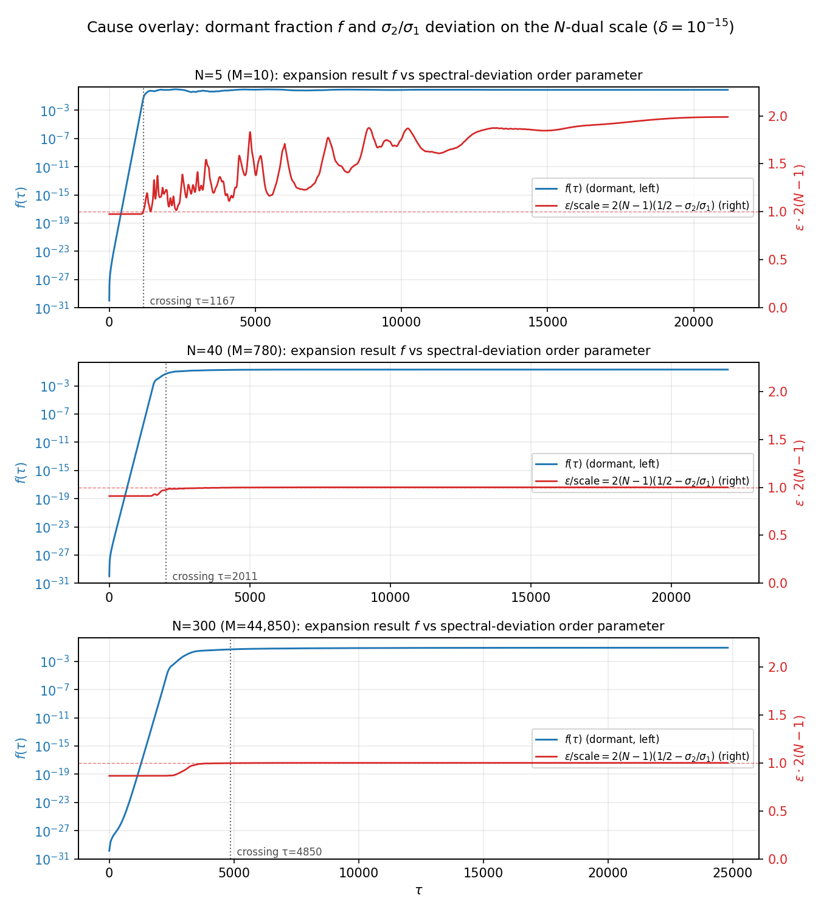
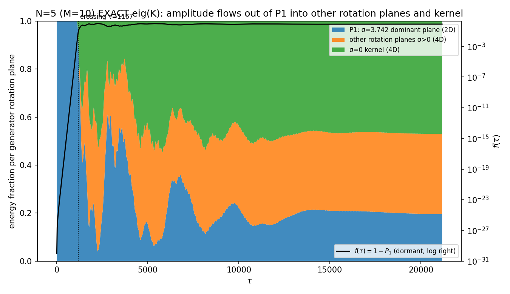
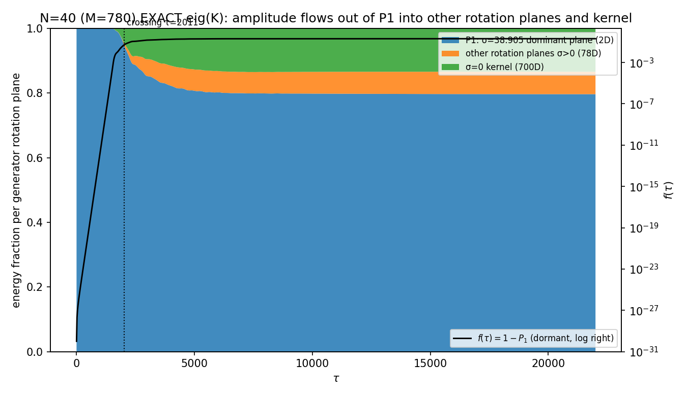
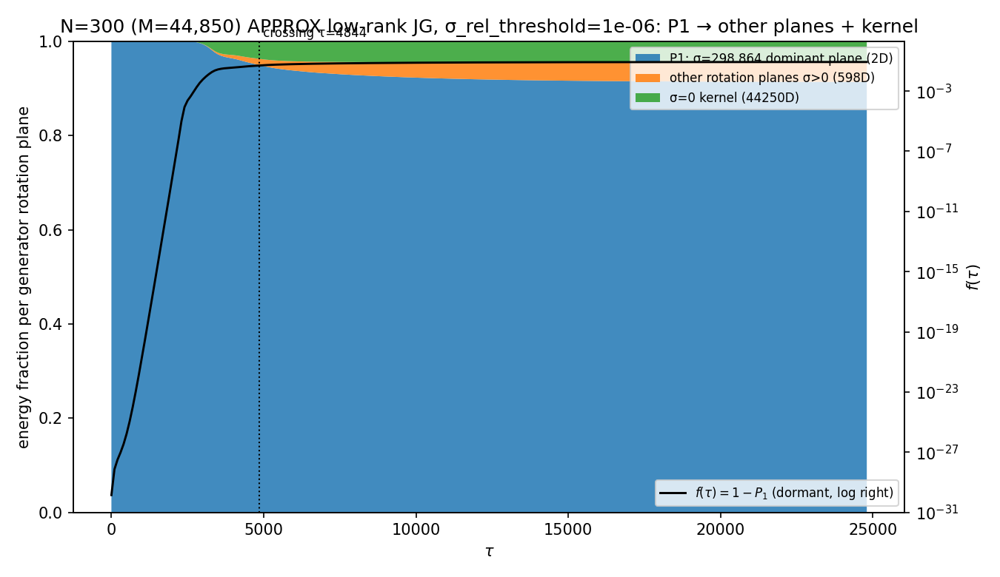

# 第6論文
# 自発的分裂の停止と新しい直交回転平面の創発

**木原 範昭**  
**2026年7月24日**  
**DOI:** 10.5281/zenodo.21543071 （Concept DOI: 10.5281/zenodo.21543070）

## 概要

前論文では、

$$
\sum_n x_n^2=0,
\qquad
U^n=I
$$

という二つの単純な公理から出発し、背景時空を仮定しない閉鎖系においても、三つの空間方向として読める方向と、一つの保存量として読める方向が自発的に生じることを示した [1,2]。

さらに、最初は一つしか存在しなかった波が、測定できないほど小さな種から幾何級数的に増幅し、複数の波へ自発的に分裂することを示した。この増幅はインフレーションに似た指数的拡大を示すが、無限には続かず、有限の振幅を持つ準安定状態へ移行した [3]。

しかし、なぜ自発的分裂が停止するのか、また、準安定状態への移行時に系の内部で何が生じているのかは未解明であった。

本論文では、この停止過程を直接計測した。その結果、自発的分裂が停止して準安定状態へ移行するのと同時に、それまで存在しなかった複数の直交回転方向と、保存量として読める新しい方向が自発的に生じることを確認した。

したがって、本論文の主張は次の通りである。

$$
\boxed{
\text{単一波の自発的分裂は、新しい直交方向の創生とともに停止する。}
}
$$

分裂によって増えた波は、既存の一つの回転方向の中へ蓄積されるのではない。分裂の停止点で、新しい互いに直交する回転方向が立ち上がり、保存量がそれらの方向へ分配される。準安定状態とは、分裂が単に弱まった状態ではなく、系が新しい方向を獲得した後の状態である。

この結果により、前論文で観察された

$$
\text{指数的な自発的分裂}
\longrightarrow
\text{準安定状態}
$$

という変化は、

$$
\boxed{
\text{単一方向への局在}
\longrightarrow
\text{自発的分裂}
\longrightarrow
\text{新しい直交方向の創生}
\longrightarrow
\text{複数方向を持つ準安定状態}
}
$$

として記述できる。

また、準安定状態では、一つの関係波あたりの振幅が

$$
A_{\mathrm{rel}}
\simeq
\frac{1}{\sqrt{M}}
=
\sqrt{\frac{2}{N(N-1)}}
$$

に従う。これは、系の規模 $N$ が大きくなるほど、各関係波の振幅が $1/N$ に比例して小さくなることを意味する。したがって、準安定状態の振幅が $N$ と双対に見える理由は、保存量が

$$
M=\frac{N(N-1)}{2}
$$

本の関係波へ分配されるためである。

本論文で示す、新しい直交回転方向の創生、分裂停止との同時性、保存量の流入、および振幅の $1/\sqrt{M}$ 則は、本モデルの力学と数値実験から得られた結果であり、仮説ではない。

現時点で未確定なのは、新しく生じた方向が現実の物理において何に対応するかである。これらを時間方向、電荷方向、その他の内部自由度として同定できる可能性はあるが、その物理的同定は本論文の主張には含めない。本論文では、新しい方向の存在と創生機構だけを示し、その名称と物理的意味は今後の課題とする。

---

## 1. 系と測定量

### 1.1 状態空間

N個の頂点の完全二体関係を辺として表し、辺数を

$$
M=\binom{N}{2}=\frac{N(N-1)}{2}
$$

とする。状態は

$$
Z\in\mathbb C^M
$$

で表す。

本稿では次の二つの二次量を用いる。

$$
Z^\dagger Z=1,
\qquad
Q(Z)=Z^T Z=0.
$$

$Z=X+iY$ と書けば、零二乗閉鎖は

$$
\|X\|=\|Y\|,
\qquad
X\cdot Y=0
$$

に等しい。したがって状態は、実M次元空間内の直交二成分によって表される。

### 1.2 生成子

各辺の位相

$$
\theta=\arg Z
$$

から、前報で導出した低ランク頂点分解 [1] により実反対称生成子

$$
K(\theta)=WJW^T,
\qquad
K^T=-K
$$

を構成する。時間発展は正規化生成子

$$
\widetilde K=\frac{K}{\sigma_1}
$$

に対するCayley変換

$$
Z_{\tau+1}
=
\left(I-\gamma\widetilde K_\tau\right)^{-1}
\left(I+\gamma\widetilde K_\tau\right)Z_\tau,
\qquad
\gamma=\tan\frac{\pi}{144}
$$

で与える。

各ステップのCayley行列は実直交行列であるため、

$$
Z^\dagger Z,
\qquad
Z^T Z
$$

を保存する。数値走行では零二乗閉鎖の偏差は最大 $10^{-14}$ 程度であった。

### 1.3 親状態と休眠種

初期親状態 $v$ は、固定生成子系の平面分解 [2] に基づき、自身の位相から作られた生成子の支配固有モードとして

$$
K(\arg v)v=-i\sigma_1 v
$$

を満たすよう構成する。親状態は一つの実二次元回転平面

$$
P_1=\operatorname{span}\{\Re v,\Im v\}
$$

に局在する。

この親状態に、初期生成子の核に属する微小な零閉鎖種 $g$ を加える。

$$
Z_0=\frac{v+\delta g}{\|v+\delta g\|},
\qquad
K(\arg v)g=0,
\qquad
\delta=10^{-15}.
$$

### 1.4 分裂量

親平面への射影比を

$$
P_1(\tau)
=
\frac{|p^T Z_\tau|^2+|q^T Z_\tau|^2}{Z_\tau^\dagger Z_\tau}
$$

とし、親平面外の割合を

$$
f(\tau)=1-P_1(\tau)
$$

と定義する。ここで $p,q$ は親平面の正規直交基底である。

---

## 2. 分裂の開始機構

### 2.1 状態依存生成子

固定生成子

$$
K_0=K(\arg v)
$$

の下では、核成分 $g$ は

$$
K_0g=0
$$

を満たすため成長しない。

一方、原本力学では各ステップで

$$
K_\tau=K(\arg Z_\tau)
$$

を再構成する。微小種が状態位相を変えると生成子も変化し、初期には核であった成分が次の生成子に対して核でなくなる。この帰還によって親平面外成分が増幅される。

### 2.2 生成子凍結実験

N=6で、同一親状態と同一種を用いて二つの走行を比較した。

- 生成子固定：$K_\tau=K_0$
- 生成子更新：$K_\tau=K(\arg Z_\tau)$

生成子固定では、$f$ は約 $10^{-27}$ のまま2000ステップ成長しなかった。生成子更新では、同じ初期種から約30桁の増幅が生じ、$f\simeq0.70$ に達した。

したがって、分裂の増幅源は固定された生成子の作用ではなく、状態位相と生成子の帰還である。

初期増幅域では

$$
f(\tau)\simeq f_0e^{r\tau}
$$

が成り立ち、N=6では

$$
r\simeq0.044
$$

を得た。これは横方向摂動の成長率 $\lambda_\perp$ に対する

$$
r\simeq2\lambda_\perp
$$

と一致する。

### 2.3 結論

本稿ではこの機構を、**位相帰還による自己励起型増幅**と呼ぶ。全ノルムは保存されるため、増幅はノルムの生成ではなく、親平面からその直交補への再配分である。

---

## 3. 分裂の停止と準安定化

### 3.1 単純な親ノルム枯渇ではない

分裂量の準安定値を $f_{\mathrm{sat}}$ とする。代表値は次の通りである。

| N | f_sat | 親平面残留比 1−f_sat |
|---:|---:|---:|
| 5 | 0.80 | 0.20 |
| 40 | 0.20 | 0.80 |
| 300 | 0.083 | 0.917 |

N=40およびN=300では、親平面に大部分のノルムを残したまま分裂量が飽和する。したがって、停止を親平面ノルムの枯渇だけで説明することはできない。

現時点で確定しているのは、

$$
\boxed{f_{\mathrm{sat}}(N)\text{ はNの増加とともに低下する}}
$$

こと、およびその停止が単純な資源枯渇ではないことである。$f_{\mathrm{sat}}(N)$ の閉形式と幾何学的起源は未導出である。

### 3.2 準安定状態は固定点ではない

飽和後も状態は時間変化を続ける。N=5〜7では、準安定域の横方向成長率は初期値の約8割を保った。したがって、準安定化は安定固定点への収束ではない。

本稿でいう準安定状態とは、

- $Z^\dagger Z=1$
- $Z^T Z=0$
- $f$ が有限区間に留まる
- 状態自身は変動を続ける

という有界な非定常状態である。

「混合」の厳密な判定には、リアプノフスペクトル、自己相関、再帰統計などの追加測定が必要である。

### 3.3 スペクトル指標

生成子の非零回転率を

$$
\sigma_1\ge\sigma_2\ge\cdots>0
$$

とする。第2回転率の比

$$
\rho_2=\frac{\sigma_2}{\sigma_1}
$$

は増幅中に親状態の値へ固定され、分裂量が飽和域へ移る時点で変化する。

大Nでは

$$
\varepsilon
=
\frac12-\frac{\sigma_2}{\sigma_1}
$$

が $1/N$ 程度で減少する。図1では

$$
2(N-1)\varepsilon
$$

を表示し、増幅域から準安定域への移行とスペクトル変化の時間的一致を示す。

*図1：N=5,40,300における分裂量 $f(\tau)$ と $2(N-1)(1/2-\sigma_2/\sigma_1)$。点線は分裂量が飽和域へ移る時刻を示す。*

この指標が転移の原因であるか、転移に伴うスペクトル応答であるかは未確定である。本稿では、移行時刻を標識する観測量として扱う。

---

## 4. 準安定振幅のN依存

### 4.1 関係成分の代表振幅

準安定域における一関係あたりの代表振幅は

$$
A_{\mathrm{rel}}
\simeq
\frac{1}{\sqrt M}
=
\sqrt{\frac{2}{N(N-1)}}
\sim
\frac{\sqrt2}{N}
$$

に従う。

N=3〜300、18種類のN、計38試行について、

$$
A_{\mathrm{rel}}\sqrt M
$$

の平均は1.00004であった。N≥20のべき近似では指数

$$
\alpha=1.00820,
\qquad
R^2=0.999990
$$

を得た。これは同じN格子上で評価した厳密二項式の有効指数1.00823と一致する。N=300では

$$
A_{\mathrm{rel}}=0.00472237,
\qquad
\frac1{\sqrt{44850}}=0.00472192
$$

であった。

### 4.2 規約と力学

$1/\sqrt M$ 則には二つの要素がある。

第一に、

$$
\sum_{e=1}^{M}|Z_e|^2=1
$$

という規約から、完全等配分なら各成分の振幅は $1/\sqrt M$ になる。

第二に、実際の力学が準安定域で

$$
\frac{\mathrm{PR}}{M}\to1
$$

へ近づき、辺基底における振幅分布幅を縮小させる。非自明な結果は、正規化そのものではなく、力学が辺基底上で等配分に近い状態を作ることである。

したがって、観測される $1/N$ は基本則ではなく、

$$
M=\frac{N(N-1)}2
$$

に対する $1/\sqrt M$ の大N極限である。

### 4.3 スペクトル比との関係

$$
\frac12-\frac{\sigma_2}{\sigma_1}=O\left(\frac1N\right)
$$

も観測される。ただし、辺振幅の $1/\sqrt M$ 則とスペクトル比の $1/N$ 則が同一機構から生じることはまだ示されていない。両者の関係は親生成子スペクトルの解析課題である。

---

## 5. 直交回転平面への流入

### 5.1 反対称生成子の正準分解

実反対称行列 $K$ は、互いに直交する二次元回転平面と核に正準分解できる [5]。適切な直交基底では、

$$
K
\sim
\bigoplus_{j=1}^{r}
\begin{pmatrix}
0 & \sigma_j\\
-\sigma_j & 0
\end{pmatrix}
\oplus 0.
$$

したがって、本系の基本的な運動単位は一方向の軸ではなく、二次元回転平面である。

N=5では、支配平面の回転率は

$$
\sigma_1=3.742
$$

であり、次の非零回転率は

$$
\sigma_2=\sqrt2
$$

であった。両部分空間の主角の余弦は数値精度内で0となり、直交性を確認した。

### 5.2 N=4とN=5の境界

親生成子の非零回転平面数と分裂結果を比較する。

| N | 第2非零回転率 σ₂/σ₁ | 分裂結果 |
|---:|---:|---|
| 3 | 0.000 | 持続的拡大なし |
| 4 | 0.000 | 持続的拡大なし |
| 5 | 0.378 | 拡大 |
| 6 | 0.386 | 拡大 |
| 7 | 0.407 | 拡大 |

N≤4では親生成子に第2非零回転部分空間が存在せず、N≥5で初めて現れる。この境界は、前論文で得た持続的分裂の境界と一致する [3]。

この結果は、持続的分裂には親平面外に非零回転部分空間が存在することが必要である可能性を示す。ただし、$\sigma_2>0$ のみで十分条件となることは未証明である。

### 5.3 平面別ノルムの測定

親生成子

$$
K(\arg v)
$$

の固有部分空間に対して、各時刻の状態ノルムを次の三群へ射影した。

1. 支配平面 $P_1$：$\sigma_1$ に対応する2次元平面
2. その他の回転部分空間：$0<\sigma<\sigma_1$
3. 核：$\sigma=0$

親平面の基底を用いた分裂量の定義から、

$$
\boxed{f(\tau)=1-E_{P_1}(\tau)}
$$

が恒等的に成り立つ。ここで $E_{P_1}$ は支配平面への射影ノルム比である。

したがって、$f$ は抽象的な「新しい波の量」ではなく、支配平面からその直交補へ流出した保存ノルムの割合である。

### 5.4 密行列による分解：N=5,40

N=5およびN=40では、密行列 $K$ を直接構成し、固有分解から回転部分空間と核を求めた。非零固有値群と数値ゼロ群の間には明確なスペクトルギャップが存在した。

射影次元は次の通りである。

| N | M | 支配平面 | その他の回転部分空間 | 核 |
|---:|---:|---:|---:|---:|
| 5 | 10 | 2 | 4 | 4 |
| 40 | 780 | 2 | 78 | 700 |

恒等式 $f=1-E_{P_1}$ の最大偏差は、N=5で $3.7\times10^{-14}$、N=40で $3.8\times10^{-15}$ であった。記録した $f$ は原本走行の値とビット一致した。

*図2：N=5。支配平面、その他の回転部分空間、核への射影ノルム比。$\tau=1167$ 付近で支配平面から他の二群への流出が始まる。準安定域の代表比は約0.20、0.33、0.47である。*

*図3：N=40。$\tau=2011$ 付近で流出が始まり、準安定域では支配平面約0.80、その他の回転部分空間約0.07、核約0.13となる。*

N=5とN=40の双方で、分裂量の立ち上がりと支配平面外へのノルム流出が同一時刻に生じる。

### 5.5 低ランク分解：N=300

N=300では

$$
M=44850
$$

となり、密行列固有分解は本計算環境では実行できない。このため、

$$
K=WJW^T
$$

の低ランク構造を用い、$JG$ の固有対を辺空間へ持ち上げて射影部分空間を構成した。

数値ゼロ固有値を除くため、

$$
\sigma>10^{-6}\sigma_{\max}
$$

を非零回転率の判定条件とした。この近似法はN=40で密行列法と比較し、部分空間次元が一致し、全時刻・全射影群の最大偏差は $2.0\times10^{-15}$ であった。

N=300では、

| 群 | 次元 |
|---|---:|
| 支配平面 | 2 |
| その他の回転部分空間 | 598 |
| 核 | 44250 |

を得た。

*図4：N=300。低ランク法、非零判定閾値 $10^{-6}\sigma_{\max}$。$\tau=4844$ 付近で流出が始まり、準安定域では支配平面約0.91、その他の回転部分空間約0.04、核約0.05となる。*

### 5.6 基底依存性

辺基底では、準安定状態は $1/\sqrt M$ に近い等振幅分布を示す。一方、生成子固有部分空間への射影では、次元あたりのノルムは等分配されない。

たとえばN=40では、次元あたりの代表値は

$$
P_1:0.398,
\qquad
\text{その他回転}:0.0009,
\qquad
\text{核}:0.0002
$$

であり、支配平面が強く占有される。

したがって、

- 辺基底における成分等配分
- 生成子固有部分空間におけるノルム配分

は別の性質であり、同一視できない。

### 5.7 結論

本稿の観測から、分裂は次の過程として記述できる。

$$
\boxed{
\text{単一支配平面への局在}
\rightarrow
\text{位相帰還による横方向増幅}
\rightarrow
\text{その他の回転部分空間と核へのノルム流出}
\rightarrow
\text{有界な準安定配分}
}
$$

新たに占有される部分空間が、現実の時間、電荷、内部自由度のいずれに対応するかは本稿では同定しない。

---

## 6. 無名方向の物理的同定と関連研究

本論文が示したのは、支配平面とは別の直交回転部分空間および核が存在し、分裂と同時にそこへ保存ノルムが流入することである。この存在、直交性、占有開始およびノルム流入は、本モデル内の導出・計測結果であり、仮説ではない。

一方、これらの無名方向を時間軸、内部電荷軸、その他の物理量として読むことは別の問題である。その同定には、少なくとも次の条件が必要である。

1. $N$ に依存して増える回転平面群から、固定個数の物理量を選ぶ読出し写像
2. 各読出し量の保存則または変換則
3. 支配平面の位相進行と時間計測の操作的対応
4. 内部回転自由度と電荷の符号・合成則との対応

固定個数への読出しという課題は、波の個数が系内の絶対量ではなく読出し分解能に依存することを示した前報 [4] と接続する。

零二乗閉鎖によって得られる等方二平面は、純スピノルおよびツイスター理論における全等方部分空間と比較できる [6]。ただし、本論文の回転平面は状態依存生成子の時間発展から構成されるため、この比較は数学的構造の類似を示すものであり、同一性を主張するものではない。

回転対称性から時間方向を創発させる研究例として、四次元Euclid空間のゲージ化回転対称性から有効時間軸を得るWalkerのモデルがある [7]。また、$D_4$、Clifford代数、八元数、$E_8$を用いて時空・内部対称性・標準模型表現を結び付ける構成も提案されている [8–11]。これらは、本論文が将来検討する物理的同定の比較対象であるが、本論文の分裂停止および新方向創生の証明には用いない。

別文書では、

$$
(x,y,z,R)\oplus(Q_1,Q_2,Q_3,t)
$$

を二つの $D_4$ 構造として読む仮説を検討している。しかし、本論文の数値結果だけからこの同定は導かれない。本論文では、新しい方向を無名のまま扱い、その物理的名称付けを後続研究へ分離する。

---

## 7. 結論

本稿では、N体関係波閉鎖系における自発的分裂の開始、飽和、流入先を計測した。

第一に、生成子を親状態へ固定すると分裂は起こらず、状態位相から生成子を毎ステップ再構成した場合にのみ指数増幅が生じた。分裂の開始機構は、状態と生成子の位相帰還である。

第二に、大Nでは親平面に80〜92%のノルムを残したまま分裂量が飽和した。したがって、停止は親ノルムの単純な枯渇ではない。N依存の飽和値を決める機構は未導出である。

第三に、分裂量は支配平面から流出したノルム比に等しく、流出先はその他の非零回転部分空間と生成子核であった。これにより、本系の自発的分裂は、保存ノルムの直交部分空間間再配分として定式化できる。

第四に、準安定域の辺成分振幅は

$$
A_{\mathrm{rel}}\simeq\frac1{\sqrt M}
$$

に従った。この法則は、全ノルム規約と、辺基底における力学的等配分の組合せとして説明できる。

以上から、本系の単一波状態は、状態依存生成子の下で横方向に不安定であり、保存量を新たな直交部分空間へ移す。準安定化は波の生成停止ではなく、有限な流出量の下で続く有界な再配分状態である。

---

## 8. 確定事項・仮説・未導出事項

### 8.1 確定事項

- Cayley更新は $Z^\dagger Z$ と $Z^T Z$ を保存する。
- 生成子固定時には核種は増幅せず、状態依存生成子で増幅する。
- 初期分裂量は指数的に増加する。
- 大Nでの飽和は親平面ノルムの枯渇では説明できない。
- 準安定状態は固定点ではなく、時間変動を続ける有界状態である。
- 辺基底の代表振幅は $1/\sqrt M$ に従う。
- N≤4では第2非零回転平面がなく、N≥5で現れる。
- $f=1-E_{P_1}$ が成り立ち、分裂量は支配平面からの流出量である。
- N=5およびN=40では、流出先がその他の回転部分空間と核であることを密行列固有分解で確認した。
- N=300の低ランク分解は、N=40において密行列法を機械精度で再現した。

### 8.2 観測されたが未証明の関係

- $f_{\mathrm{sat}}(N)$ はNとともに低下する。
- $\sigma_2/\sigma_1\to1/2$ に見える。
- $1/2-\sigma_2/\sigma_1=O(1/N)$ に見える。
- 第2非零回転平面の存在が持続的分裂の必要条件である可能性がある。

### 8.3 未導出事項

- 飽和値 $f_{\mathrm{sat}}(N)$ の閉形式
- 準安定域で流出量が有界に留まる条件
- $\sigma_2/\sigma_1\to1/2$ の解析的導出
- その他の回転部分空間内部の個別平面別流入量
- 核へ流入する成分の力学的役割
- 無名回転部分空間の物理的読出し

---

## 9. 参考文献

### 自己引用

[1] 木原範昭, 「N体完全二体関係波における生成子ランク線形上界と三方向飽和」, Zenodo, Concept DOI: 10.5281/zenodo.21465898, 2026.

[2] 木原範昭, 「N体固定生成子系における平面分解読出し」, Zenodo, Concept DOI: 10.5281/zenodo.21468959, 2026.

[3] 木原範昭, 「N体関係波閉鎖系における状態の自発的分裂の開始と帰結の三分類」, Zenodo, Concept DOI: 10.5281/zenodo.21486233, 2026.

[4] 木原範昭, 「波の数は系の分解能である」, Zenodo, Concept DOI: 10.5281/zenodo.21486544, 2026.

### 外部文献

[5] R. A. Horn and C. R. Johnson, *Matrix Analysis*, 2nd ed., Cambridge University Press, 2013.  
実反対称行列の直交標準形と二次元回転ブロック分解の参照。

[6] A. Taghavi-Chabert, “Twistor Geometry of Null Foliations in Complex Euclidean Space,” *SIGMA*, 13, 005 (2017). DOI: 10.3842/SIGMA.2017.005; arXiv:1505.06938.  
全等方部分空間、純スピノルおよびツイスター空間との構造比較。

[7] M. L. Walker, “Spontaneous Emergence of a Causal Time Axis in Euclidean Space from a Gauged Rotational Symmetry Theory,” *Symmetry*, 16(1), 4 (2024). DOI: 10.3390/sym16010004.  
回転対称性から時間方向を創発させる先行例。

[8] F. D. T. Smith, “Higgs and Fermions in D4-D5-E6 Model based on Cl(0,8) Clifford Algebra,” arXiv:hep-th/9403007 (1994).  
$D_4$、Clifford代数および8次元構造を物理表現へ接続する先行提案。

[9] N. Furey, “Three Generations, Two Unbroken Gauge Symmetries, and One Eight-Dimensional Algebra,” *Physics Letters B*, 785, 84–89 (2018/2019 preprint). arXiv:1910.08395.  
複素八元数から三世代と $SU(3)\times U(1)$ 表現を構成する研究。

[10] I. Todorov, “Octonion Internal Space Algebra for the Standard Model,” *Universe*, 9(5), 222 (2023). DOI: 10.3390/universe9050222; arXiv:2206.06912.  
八元数・Clifford代数による標準模型内部空間の整理。

[11] C. A. Manogue, T. Dray, and R. A. Wilson, “Octions: An $E_8$ Description of the Standard Model,” *Journal of Mathematical Physics*, 63, 081703 (2022). DOI: 10.1063/5.0095484; arXiv:2204.05310.  
$E_8$ 内の標準模型およびLorentz代数表現に関する比較対象。

---

## 10. 再現性

### 10.1 原本プログラム

- `run_n_scaling_lowrank_v1.py`
- `run_spontaneous_splitting_largeN_v1.py`

原本はSHA-256で固定し、計装プログラムでは時間発展ループを変更していない。全計装走行で、分裂量 $f$ は原本出力とビット一致した。

### 10.2 計装プログラム

- `run_metastable_series_v1.py`
- `run_cause_instrumented_v1.py`
- `make_cause_overlay_figure_v1.py`
- `run_plane_flow_exact_v1.py`
- `run_plane_flow_approx_v1.py`
- `make_metastable_series_figure_v1.py`
- `trace_parent_iteration_v1.py`

低ランク近似の非零判定閾値はCLI引数、出力JSON、図中に記録する。既定値は

$$
\texttt{sigma\_rel\_threshold}=10^{-6}
$$

である。

### 10.3 出力データ

- `cause_instrumented_result_v1/`
- `plane_flow_result_v1/`
- `metastable_series_result_v1/`
- `関係波準安定振幅_N300定量結果_v1.md`
- `親結晶_低N観察記録_v1.md`

CSVは再生成可能な出力としてリポジトリ追跡外とする。

---

## 11. 次の実験

1. **初期種走査**  
   $\delta=10^{-9}$ から $10^{-15}$ を走査し、飽和時刻の対数シフトと飽和値の独立性を測る。

2. **大Nでの横方向成長率**  
   N=40、300を含む走行で有限時間横方向成長率を同時計測する。

3. **個別回転平面への流入**  
   「その他の回転部分空間」を各 $\sigma_j$ 平面へ分解し、流入が少数平面へ集中するか、多数平面へ分散するかを調べる。

4. **飽和則**  
   Nを密に走査して $f_{\mathrm{sat}}(N)$ の関数形を求める。

5. **核成分の役割**  
   核への流入量、滞在時間、回転部分空間との交換率を測る。

物理的同定、D4構造、E8対角接着との対応は、これらの力学的測定とは分離し、後続論文で扱う。
