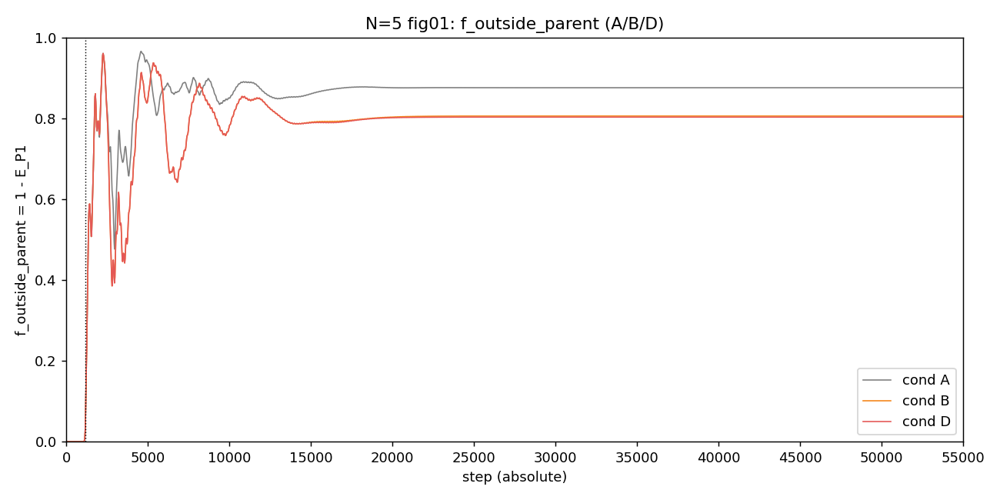
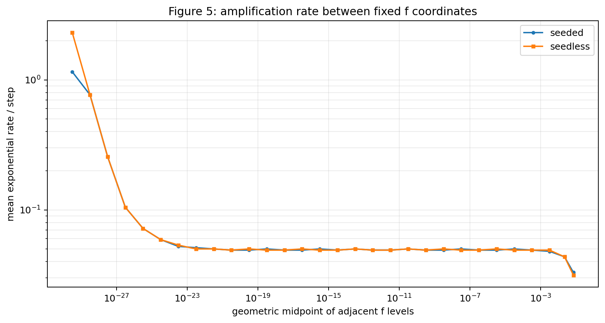
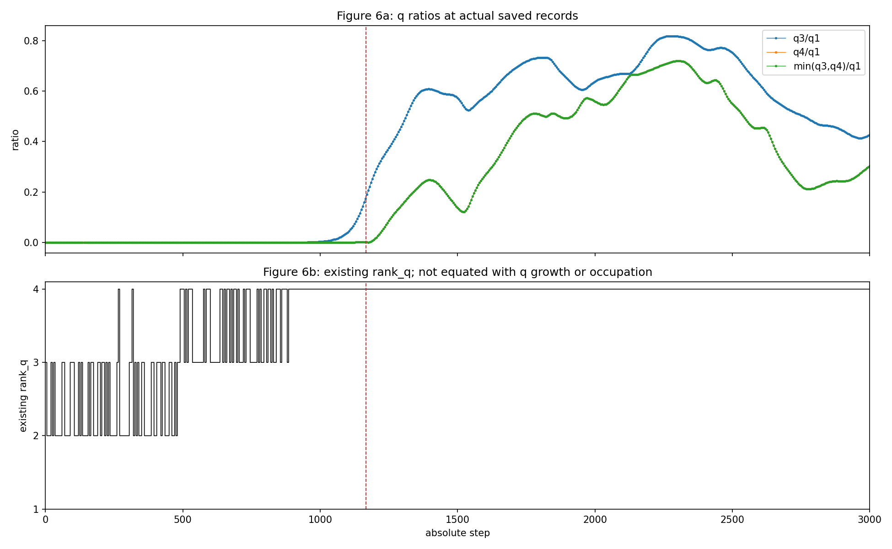
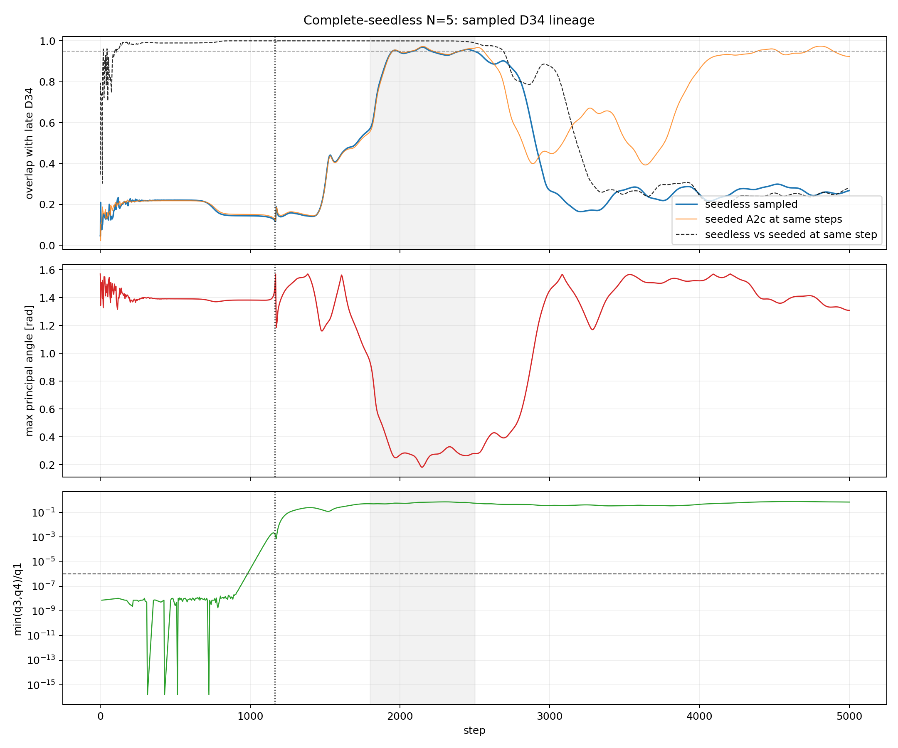
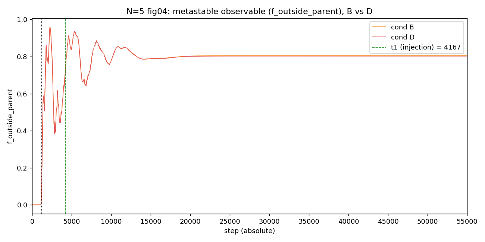
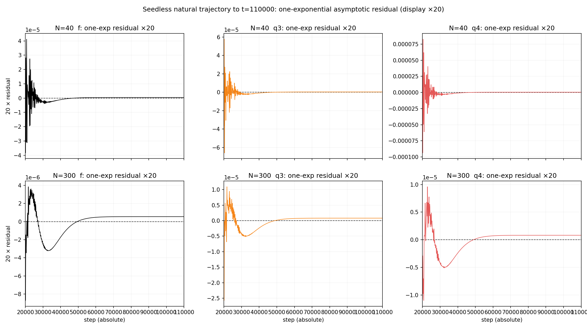

# 第8論文　二段階seed除去による準安定相の因果分離

## 冒頭の主張

第7論文では、零二乗閉鎖された関係系が、長い低変化領域の後に幾何級数的な急拡大を起こし、その過程を経て、初期には存在しなかった三方向的な準安定構造を自発的に形成する現象を発見した。これは本研究の中心的な実験事実である。本稿は、その三方向生成を疑うものではない。第8論文の目的は、急拡大以前の平坦に見える領域の内部に、同じ生成過程を一段下で繰り返す別の底が存在するかを調べると同時に、急拡大後の準安定状態が、さらに次の急拡大サイクルを生み得るかを検証し、三方向生成へ至る時間構造と、その後の長時間発展を分離して明らかにすることにある。

検証の結果、少なくとも N=5、倍精度計算の範囲では、初期の平坦領域内に、独立した急拡大・停止・準安定化を備えた別の底は確認されなかった。明示的なseedを除去しても、系は極微小な状態から同じ幾何級数的増大を開始し、主要な振幅水準をほぼ同じ時刻に通過した。したがって、平坦に見えた区間は静止相ではなく、後の急拡大へ連続する長い潜伏過程である。

この潜伏段階から、行列診断上の rank_q=4 はすでに断続的に現れ、幾何級数的急拡大中にも存在し、急拡大後の準安定領域では明瞭かつ持続的な構造となった。急拡大後には新しい方向占有が有限量へ成長して保持されており、三方向的構造が実際に生成されたことは否定できない観測事実である。

一方、詳細な方向系譜の追跡によって、急拡大前の微小な方向部分空間が、完成後の三方向へ固定されたまま単純増幅されたのではないことも判明した。方向部分空間は急拡大中に実際に回転・混合し、再編成されている。これは三方向生成を弱める結果ではなく、むしろ三方向があらかじめ固定された軸として存在したのではなく、急拡大過程の内部で動的に選択・形成されたことを示す新しい発見である。

さらに本稿は、急拡大後に形成された準安定状態が、次の急拡大を準備する中間相である可能性も検証した。第7論文では、この準安定状態に第二のseedを加え、その後の時間発展を観測したが、論文6以来用いてきた時間方向の観測範囲内では、二度目の急拡大は確認されなかった。本稿では、この第二のseedそのものを除去し、準安定状態の自然な長時間発展を観察した。その結果、準安定状態はおおむね一周期程度で定常的な振動状態へ移行し、さらに時間軸方向の観測範囲を拡張しても、二度目の幾何級数的急拡大へ接続する兆候は観測されなかった。

したがって、急拡大後の準安定状態は、少なくとも今回観測した範囲では、次の急拡大を自動的に生む中継点とは確認されなかった。準安定状態は長時間存続するが、その内部に第二の急拡大へ向かう明瞭な成長系列は見いだされていない。この結果は、最初の急拡大が単純に周期反復する普遍サイクルではない可能性を示すと同時に、三方向生成後の状態が独立した安定化機構を持つことを示唆する。

本稿が明らかにした現象は、長い潜伏過程、幾何級数的急拡大、急拡大中の方向再編成、三方向的準安定構造の自発的生成、そして第二の急拡大を伴わない長時間準安定化という一連の時間発展である。未解明なのは現象の存在ではない。なぜ潜伏時間が必要なのか、なぜ幾何級数的急拡大が開始するのか、急拡大中の再編成がなぜ三方向を選択するのか、そして生成後の準安定状態がなぜ次の急拡大へ進まず定常化するのかという生成・停止機構である。

なお、本実験系の初期状態について、重要な点を明記しておく必要がある。実験では、N 個の存在から得られる N(N−1)/2 個の関係波を make_parent によって初期化しているが、この初期化は、本論文シリーズの第一公理である零二乗閉塞条件を前提としている。したがって、初期状態は任意の連続値を無条件に配置したものではなく、最初から閉じた関係系として構成されている。

別稿で検討したように、この閉塞条件は本質的に量子化を内在している。閉塞可能な状態が連続的に無制限に存在するのではなく、閉塞条件を満たす特定の位相関係へ状態が制限されるためである。この観点からは、複素位相にも量子化が要請され、位相が π 周期を単位として離散化される可能性がある。本論文の実装では、そのような位相量子化規則を外部から明示的に与えてはいない。

それにもかかわらず、make_parent によって生成された多数の関係波は、初期状態において結果的に二つの直交方向へ集約され、定常的な二方向状態を形成した。実験者が二本の軸を初期条件として指定したわけではない。与えたのは関係系と閉塞条件であり、二方向構造はその帰結として自発的に現れたものである。

したがって、本稿で観測された三方向生成は、人為的に設定された二軸へ第三軸を追加した実験ではない。零二乗閉塞から自発的に成立した二方向状態が、長い潜伏過程と幾何級数的急拡大、さらに急拡大中の方向再編成を経て、三方向的準安定構造へ移行した現象である。この初期二方向への集約が三方向生成の直接原因であるかどうかは、本稿ではまだ特定できていない。しかし、初期二方向が外部から導入されたものではなく、第一公理を満たす関係系の内部から生じたことは、本現象の解釈において不可欠な実験事実である。

なお、本論文シリーズでは、波の相互作用に少なくとも二つの異なる型があることを、別の実験系で確認している。一つは、波同士が重ね合わせ可能なまま交換・混合するボゾン的な線形相互作用であり、もう一つは、反射と透過を伴う非線形散乱を起こすフェルミオン的な相互作用である。後者の相互作用では、広がった波と局在した波の間で局在性が交換され、準安定な中間状態が形成されることが確認されている。

ただし、現在までの実験では、このフェルミオン的な波または非線形散乱則は、閉じた関係系の内部から自発的に発生したものではない。相互作用の型として、実験者が外部から明示的に与えている。したがって、本稿で観測された幾何級数的急拡大と三方向生成を、フェルミオン的相互作用の自然発生によって説明できるとは、現段階では言えない。

本稿では、初期二方向状態から三方向的準安定構造へ移行する過程において、線形的な波と非線形反射散乱を起こす波との区別が内部から現れる可能性、すなわちボゾン的状態とフェルミオン的状態の分離が、急拡大または方向生成の開始と関係している可能性についても、その予兆を探索した。しかし、今回観測した時系列、方向占有、rankの変化および準安定化過程の中には、その区別が自発的に形成されたと判定できる明確な兆候は見いだされなかった。

したがって、ボゾン的相互作用とフェルミオン的相互作用の分離が、幾何級数的急拡大や三方向生成の原因である可能性は否定されていないが、本実験によって支持されたとも言えない。今回確認されたのは、フェルミオン的散乱則を外装しなくても、零二乗閉塞から成立した二方向状態が、自発的な急拡大と方向再編成を経て三方向的準安定構造へ移行することである。波の統計的区別が、この生成過程の結果として後から現れるのか、それとも本実験ではまだ観測できない別の自由度を必要とするのかは、引き続き未解明である。

---

## 1. 系（定義と公理）

**公理1（非自明零二乗和閉鎖）** $\sum_e Z_e^2=0,\ Z\neq0$。
**公理2（有限回帰）** $U^n=I$。二公理は基本公理系 [1] による。系の定義は第7論文 [2] と完全に同一であり、力学コードは第7論文原本を SHA-256 固定で再利用した（§10）。

完全グラフ $K_N$ の各辺 $e$ に複素振幅 $Z_e$ を置く（$M=N(N-1)/2$）。状態は

$$Z\in\mathbb C^M,\qquad \lVert Z\rVert^2=1,\qquad Z^{\mathsf T}Z=0$$

に閉じる。生成子 $K$ は辺の位相 $\theta_e=\arg Z_e$ のみの関数で、頂点を共有する辺の間を位相差の正弦で結ぶ実反対称行列：

$$(KZ)_e=\cos\theta_e\!\sum_{e'\sim e}\!\sin\theta_{e'}Z_{e'}-\sin\theta_e\!\sum_{e'\sim e}\!\cos\theta_{e'}Z_{e'}.$$

更新はスペクトルノルム正規化後の Cayley 変換 $Z\leftarrow(I-\gamma\tilde K)^{-1}(I+\gamma\tilde K)Z$（$\tilde K=K/\sigma_{\max}$, $\gamma=\tan(\pi/144)$）。$K$ は反対称ゆえこれはユニタリで $\lVert Z\rVert^2$ を厳密保存する。

親状態 $v$ は自己無撞着な円偏波固有モード（全辺が同一周波数で剛体回転、$v^{\mathsf T}v=0$）。親平面 $P_1=\mathrm{span}\{\mathrm{Re}\,v,\mathrm{Im}\,v\}$。倍精度で構成した親の固有モード残差は N=5 で $2.140\times10^{-13}$ である（Stage A2a 実測）。

### 1.1 観測量

- **分裂フラクション** $f(t)=\lVert Z-\Pi_{P_1}Z\rVert^2/\lVert Z\rVert^2$。親平面の外に出た占有の総量。
- **crossing**: 第7論文既存閾値 $f>0.05$ の初回到達 step。イベントの定義ではなく参照座標である。
- **準安定開始**: crossing+3000（第7論文の規約）。
- **$q_1\ge q_2\ge q_3\ge q_4$**: 支配平面 Gram 縮約から得る特異値系列。**rank_q** は既存相対閾値による有効ランク。
- **方向占有** direction 1〜4: 親平面2方向と追加2方向への状態占有。**kernel 占有**を含め、全占有の和は毎 step 1 に閉じる（射影閉鎖誤差 0）。
- **方向部分空間** $D_{34}(t)$: 既存 `s4_new_dirs` が返す追加2方向の正規直交基底。比較の正本は列ではなく射影行列

$$P_{34}(t)=D_{34}(t)D_{34}(t)^{\mathsf T},\qquad \mathcal O(P,Q)=\tfrac12\operatorname{tr}(PQ)$$

である。$\mathcal O=1$ が部分空間の一致。個別の direction 3・4 列は基底選択（列交換・符号）に依存するため、系譜判定には使わない。

- **first-passage 座標** $\tau_k=\min\{t\mid f(t)\ge 10^{-k}\}$。各10進水準の初回通過 step。区間増幅率は $\ln 10/\Delta\tau$ で定義する。これらは増幅過程の座標であり、イベント閾値ではない。

### 1.2 二段階の明示的 seed

第7論文の軌道には人為的入力が二箇所ある。

1. **初期 seed**: 親の核内の零閉鎖対を $\delta=10^{-15}$ 加える（$f(0)\approx\delta^2=10^{-30}$）。
2. **準安定 seed**: 準安定域 $t_1=\mathrm{crossing}+3000$ で横摂動 $\varepsilon\eta_\perp$（$\varepsilon=10^{-8}$）を一回注入する（第7論文図4の摂動応答測定）。

本稿はこの二つを独立に除去し、どの観測事実が seed に因果的に依存するかを分離する。

### 1.3 初期状態の構造: 零二乗閉鎖が定める二方向性【帰結】

冒頭の主張の末尾4段落に対応する実験事実をここで固定する。

まず代数的帰結として、$Z=X+iY$ に対し

$$Z^{\mathsf T}Z=\lVert X\rVert^2-\lVert Y\rVert^2+2i\,X\cdot Y$$

であるから、第一公理の零二乗閉鎖 $Z^{\mathsf T}Z=0$ は

$$\lVert X\rVert=\lVert Y\rVert,\qquad X\cdot Y=0$$

と同値である。すなわち、閉鎖条件を満たす任意の非零状態は、実 $M$ 次元関係空間内に等ノルムで直交する二方向の組を必然的に定める。二方向構造は初期条件の選択ではなく、第一公理そのものの帰結である。

次に `make_parent` の出力を実測した（原本 SHA-256 照合済み、Stage A2a と同一 PRNG）。

| 量 | N=5 (M=10) | N=40 (M=780) |
|:--|:--|:--|
| 非零複素成分数 / M | 10 / 10 | 780 / 780 |
| min $\lvert v_e\rvert$ | 0.2887 | 0.0324 |
| rank$[\mathrm{Re}\,v,\ \mathrm{Im}\,v]$ | **2** | **2** |
| $\lVert\mathrm{Re}\,v\rVert=\lVert\mathrm{Im}\,v\rVert$ | $1/\sqrt2$（誤差 $10^{-15}$） | $1/\sqrt2$（誤差 $10^{-15}$） |
| $\mathrm{Re}\,v\cdot\mathrm{Im}\,v$ | $-4.4\times10^{-16}$ | $-3.6\times10^{-16}$ |
| $\lvert v^{\mathsf T}v\rvert$ | $1.1\times10^{-15}$ | $2.3\times10^{-15}$ |
| 不変平面残差 $\lVert KX-\mu Y\rVert$ | $2.0\times10^{-13}$ | $1.1\times10^{-13}$ |
| 初期 $K$ の分解次元（親平面/回転補/核） | 2 / 4 / 4 | 2 / 78 / 700 |

（正本: `paper8_draft_supporting_analysis_v1/reports/parent_state_structure_check_v1.md`）

この表が示す実験事実は次の通りである。第一に、$M$ 個の関係波は**すべて非零**であり、特定の2成分だけを残した状態ではない。第二に、それにもかかわらず状態全体の実 rank は厳密に 2 であり、全関係波が一つの二次元回転平面（生成子 $K$ の不変平面、残差 $10^{-13}$）へ集約されている。第三に、`make_parent` が課しているのは閉鎖条件と自己無撞着性（自身の位相が作る $K$ の固有モードであること）だけであり、位相の量子化規則も、二本の軸の座標も、外部から与えていない。

なお、冒頭の主張が参照する「閉塞条件が量子化を内在する」という別稿の検討は、解説ノート [3] にまとめられている。そこでは、零二乗和拘束とスケール不変性の二要請だけから、状態空間が複素射影空間内の射影クアドリック（コンパクト・ケーラー多様体）になり、離散スペクトル・整数チャーン類・$N=3$ での量子ビット同型が既知数学の引用のみで従うことが確認されている。本稿の実装はこの量子化規則を外部から与えておらず（§9）、上表の二方向集約はあくまで倍精度力学系としての実測である。

したがって初期二方向状態は、実験者が指定した二軸ではなく、閉鎖された関係系の内部から自発的に成立した構造である。本稿の三方向生成は「人為的な二軸への第三軸の追加」ではなく、「公理の帰結として成立した二方向閉包からの、三方向閉包への移行」として読まなければならない。なお、この初期二方向への集約が三方向生成の直接原因であるかどうかは本稿では特定していない（§9）。

---

## 2. 実験設計

### 2.1 条件と実験系

| 条件 | 初期 seed | 準安定 seed | 初期状態 |
|:--|:--:|:--:|:--|
| A（完全無seed） | OFF | OFF | $Z_0=v$（乱数も消費しない） |
| B（初期のみ） | ON | OFF | $Z_0=(v+\delta g)/\lVert\cdot\rVert$ |
| D（第7論文相当） | ON | ON | B と同一、$t_1$ で $\varepsilon\eta_\perp$ を一回注入 |

- **予備実験**（N=5, 40, 300、t=55000 まで）: 条件 A/B/D の全比較。正本: `reports/preliminary_seed_ablation_report.md`
- **Stage A2a**（N=5、毎 step 記録、t=5000 まで）: 完全無seed軌道の高密度観測。$Z_0=v$ の数値床 $f(0)=3.275\times10^{-33}$ から出発する。正本: `paper8_stage_A2a_seedless_N5/`
- **Stage A2c / A2d**（N=5）: seedあり／完全無seed軌道の方向系譜 $P_{34}(t)$ 追跡。正本: `paper8_stage_A2c_direction_lineage_N5/`, `paper8_stage_A2d_seedless_direction_lineage_N5/`
- **長時間対照**（N=40, 300、完全無seed、t=110000 まで）: 第二の急拡大の探索。正本: `paper7_seedless_natural_figures3_4_v1/validation_report.md`
- **移行解剖**（N=5、第7論文再現軌道）: rank_q・占有・f の時刻分離。正本: `paper7_N5_transition_anatomy/`

### 2.2 検証すべき仮説（事前に立てたもの）

第7論文を閉じた時点で、次の仮説が残っていた。

- **H-下位底**: 急拡大前の平坦領域の内部に、同型の成長・停止過程を持つ下位の準安定相（第二の底）が隠れている。
- **H-seed因果**: 明示的 seed が、分裂の発生・時刻・最初の生成方向のいずれかを決めている。
- **H-縮小コピー**: 急拡大前の微小方向部分空間は、後期三方向の縮小コピーである。
- **H-反復サイクル**: 急拡大後の準安定状態は、次の急拡大を準備する中間相である。

本稿の結果はこの四仮説をいずれも棄却または不支持とし、その過程で冒頭の主張に述べた時間構造を確定する。

---

## 3. 結果1: seed を除去しても現象の全系列が再現する【帰結】

条件 A（完全無seed）は、全 N で crossing・rank_q 増加・準安定化のすべてを再現した。

| N | 条件 | crossing | 準安定開始 | max_f | final_f | final rank_Q | mean_meta(f) | std_meta(f) |
|--:|:--|--:|--:|--:|--:|--:|--:|--:|
| 5 | A | 1166 | 4166 | 0.9655 | 0.8754 | 4 | 0.8744 | 1.29×10⁻² |
| 5 | B | 1167 | 4167 | 0.9600 | 0.8053 | 4 | 0.8054 | 2.87×10⁻² |
| 5 | D | 1167 | 4167 | 0.9600 | 0.8026 | 4 | 0.8034 | 2.88×10⁻² |
| 40 | A | 2011 | 5011 | 0.1938 | 0.1938 | 4 | 0.1934 | 7.38×10⁻⁴ |
| 40 | B | 2011 | 5011 | 0.2035 | 0.2035 | 4 | 0.2030 | 1.29×10⁻³ |
| 40 | D | 2011 | 5011 | 0.2035 | 0.2035 | 4 | 0.2030 | 1.29×10⁻³ |
| 300 | A | 4849 | 7849 | 0.0898 | 0.0898 | 4 | 0.0882 | 3.53×10⁻³ |
| 300 | B | 4844 | 7844 | 0.0861 | 0.0861 | 4 | 0.0848 | 2.94×10⁻³ |
| 300 | D | 4844 | 7844 | 0.0861 | 0.0861 | 4 | 0.0848 | 2.94×10⁻³ |

*図1: N=5 の条件 A/B/D の f(t)。無seed（A）と seedあり（B/D）の crossing 差は 1 step。N=40, 300 も同型（`figures/fig01_f_compare_N00040.png`, `fig01_f_compare_N00300.png`）。*

crossing の差は N=5 で 1 step、N=40 で 0 step、N=300 で 5 step である。したがって明示的初期 seed は、分裂の発生にも時刻にも実質的に寄与していない（H-seed因果の第一部を棄却）。

---

## 4. 結果2: 潜伏領域の内部に別の底はない【帰結】

これが本稿の第一の中心結果である。完全無seed N=5 軌道（Stage A2a、毎 step 記録）で、初期数値床 $f(0)=3.275\times10^{-33}$ から主増大までの全構造を検査した。

### 4.1 毎 step 差分の符号検査

step 0 から $f\ge10^{-2}$ 初回到達（step 1129）の直前までの全 1129 本の差分について:

- 正の差分: **1129 本（全数）**
- 負の差分: **0 本**
- ゼロ差分: **0 本**

（正本: `paper8_draft_supporting_analysis_v1/reports/monotonicity_and_regression_check_v1.md`。Stage A2a 正本 CSV からの再計算）

「成長→停止→下位準安定棚→再成長」という形は、初期床から主増大までの毎 step データのどこにも存在しない。線形表示上の「平坦さ」は観測量が極端に小さいことによる見かけであり、対数表示では一つの連続した立ち上がりである。

*図2: 完全無seed N=5 の $\log_{10}f$。数値床からの単一の連続増大。*

### 4.2 first-passage 系列と一桁あたり通過時間

$10^{-30}$ から $10^{-23}$ までの通過 step は 1, 2, 5, 14, 36, 68, 107, 150 と滑らかに立ち上がり、$10^{-23}\to10^{-2}$ の全 21 区間では一桁あたり **46 または 47 step** に収束する。区間平均指数率の中央値は $4.95\times10^{-2}$（自然対数/step）である。

$f\ge10^{-23}$（step 150）から $f\ge10^{-2}$（step 1129）までの 980 点の $\ln f$ 線形回帰は

$$\lambda=0.04937,\qquad R^2=0.9999993$$

を与える。1 step あたりの f 比は $e^{\lambda}=1.0506$、振幅比は $e^{\lambda/2}=1.0250$ である。潜伏領域の主要部は、単一の幾何級数則で 7 桁の決定係数一致をもって記述される。

*図3: 一桁ごとの平均指数率。seedあり・無seedが全水準で重なる。*

### 4.3 判定

以上により **H-下位底を棄却する**。ただしこの棄却は N=5・倍精度・毎 step 記録範囲（t≤5000）に限る。倍精度の数値床より下の構造、および厳密算術における無摂動離脱は本稿の範囲外である（§9）。

---

## 5. 結果3: seed は時刻も初期方向も選んでいない【帰結】

### 5.1 時刻

seedあり・無seed の first-passage を全水準で比較すると、$f\ge10^{-12}$ の初回到達はともに絶対 step 662 であり、一桁通過時間の差は全区間で最大 1 step である（Stage A2a）。

*図4: seedあり・無seedの f(t) を絶対 step で重ねたもの。平行移動なしでほぼ重なる。*

注意すべきは初期値の逆転である。seedあり軌道の $f(0)=1.066\times10^{-30}$ に対し、無seed軌道は $f(0)=3.275\times10^{-33}$ から出発するにもかかわらず、両者は step 数百のうちに同じ幾何級数系列へ合流する。明示 seed $\delta=10^{-15}$ は、倍精度親状態の固有モード残差 $2.140\times10^{-13}$ より小さい。すなわち、seedあり軌道においても実効的な最小横成分を支配していたのは明示 seed ではなかったと読める。

### 5.2 初期方向

無seed軌道と seedあり軌道の $P_{34}(t)$ を同一 step で直接比較すると（Stage A2d）:

| 区間 | 標本数 | overlap 中央値 | overlap 最小値 |
|:--|--:|--:|--:|
| crossing 前・解像可能 | 40 | **0.999999987** | 0.999976 |
| crossing〜1799 | 128 | 0.999997 | 0.994306 |
| 1800〜2500 | 141 | 0.999852 | 0.990155 |
| 2500 より後 | 500 | 0.265980 | 0.203573 |

急拡大前から三方向閉包の成立直後まで、両軌道の方向部分空間はほぼ同一である。**明示的初期 seed は、最初に生成される方向部分空間を選択していない**（H-seed因果の第二部を棄却）。

step 2500 以後の分岐（overlap が 0.95 を初めて下回るのは step 2690、0.5 を下回るのは step 3185）は、方向生成の初期選択とは分離された長期軌道差である。§6.3 の通り、この分岐後も rank_q=4 と占有水準は両軌道で保持されており、準安定なのは方向部分空間の同一性ではなく占有構造である。

---

## 6. 結果4: rank_q=4 の出現・方向占有の成長・f の急拡大は別の時刻に起きる【帰結】

### 6.1 rank_q=4 は数値床段階で既に現れる

- 無seed軌道: 最初の rank_q=4 は保存 step **120**。その時点で $f=2.089\times10^{-24}$、これを挟む占有実保存行（step 107 / 125）の direction 3・4 占有は $10^{-30}\sim10^{-29}$ 台（正本: `paper8_draft_supporting_analysis_v1/reports/`）。
- seedあり軌道（移行解剖）: 最初の保存 rank_q=4 は step **265**、$f=3.127\times10^{-21}$、これを挟む direction 3・4 占有は $4\times10^{-28}\sim8\times10^{-28}$。crossing 前の rank_q=4 保存行数は 97。

分裂量・方向占有が数値床付近にある段階で rank_q=4 は既に断続的に出現している。したがって、

$$\mathrm{rank_q}=4\quad\not\Rightarrow\quad\text{有限占有を持つ方向構造の成立}$$

である。rank_q=4 の出現だけをもって三方向成立の時刻とすることはできない。

*図5: N=5 の q₃/q₁, q₄/q₁ と rank_q（step 0〜3000）。rank_q の早期応答と占有の成長は別の時刻に起きる。*

### 6.2 crossing 後に遅れて成長する量

crossing=1167 の後も、direction 3・4 占有・kernel・q 比は同じ速度では変化しない（移行解剖 §10）:

| step | f | d3 占有 | d4 占有 | q₃/q₁ | q₄/q₁ |
|--:|--:|--:|--:|--:|--:|
| 1200 | 0.133 | 0.0027 | 0.0035 | 0.279 | 0.016 |
| 1400 | 0.585 | 0.023 | 0.195 | 0.608 | 0.248 |
| 1800 | 0.840 | 0.213 | 0.210 | 0.733 | 0.507 |
| 2500 | 0.801 | 0.319 | 0.045 | 0.752 | 0.549 |

f の crossing、方向占有の有限化、q 比の成長は数百 step にわたって分離しており、「三方向が一つの時刻に同時成立した」という単一イベント記述はデータに支持されない。一方、急拡大後に direction 3・4 占有が有限量（$10^{-1}$ 台）へ成長して保持されることは、この表と図5の通り観測事実である。

### 6.3 準安定なのは占有構造である

条件 A と B は準安定域で軌道として分岐する（§5.2）が、rank_Q=4・天井水準の f・方向占有の有限性は両者で保たれる（§3 の表）。三方向閉包は固定された三本の軸ではなく、占有次元数と占有分配を保ちながら内部方向が長期的に混合し得る動的閉包である。

---

## 7. 結果5: 方向部分空間は急拡大中に再編成される【帰結】

これが本稿の第二の中心結果である。

### 7.1 急拡大前の方向は後期方向の縮小コピーではない

完全無seed軌道（Stage A2d）で、急拡大前に解像可能になった $P_{34}$（解像基準 $\min(q_3,q_4)/q_1\ge10^{-6}$、step 985〜1165 の 40 標本）と、後期代表部分空間（step 1800〜2500 の平均射影の上位2固有ベクトル）の overlap は

$$\mathcal O_{\mathrm{early,late}}\ \text{中央値}=0.1425\qquad(\text{範囲}\ [0.1210,\ 0.1445])$$

である。seedあり軌道（Stage A2c）でも同水準（中央値 0.1495）であった。部分空間が一致していれば 1 に近づくべき量が 0.14 前後であるから、**急拡大前の微小方向部分空間は、後期三方向の縮小コピーではない**（H-縮小コピーを棄却）。

*図6: 完全無seed N=5 の早期対後期方向系譜。早期 $P_{34}$ と後期代表の overlap は 0.14 前後に留まる。*

### 7.2 再編は急拡大中の実回転として観測される

seedあり軌道の固定観察窓 step 900〜1400 で、連続 step 間の $P_{34}$ 最大主角の総和（回転経路長の記述量）は 3.871 rad、連続 step 間最大主角の最大値は 0.372 rad である（Stage A2c）。列交換は 0 回であるから、これは基底ラベルの入れ替えではなく、部分空間そのものの回転・混合である。Stage A2c/A2d はこの系譜を **ROTATING_OR_MIXED_LINEAGE** と分類した。

### 7.3 第7論文図4の再分類

第7論文図4で準安定域に与えた横摂動方向 $T_\perp$ と、後期代表方向の overlap は 3 つの摂動方向 seed について

$$\mathcal O(D_{34}^{\mathrm{late}},T_\perp)=0.0330,\ 0.0301,\ 0.0182$$

に留まる。すなわち、人工的に励起できた応答チャネルは、自然に占有された三方向とも、急拡大前の前駆方向とも一致しない。第7論文図4が測っていたのは「自然に生じつつある追加方向の萌芽」ではなく、**三方向閉包の外部に残る、励起可能だが自然には占有されない応答チャネル**である。

---

## 8. 結果6: 準安定状態は第二の急拡大へ進まない【帰結】

これが本稿の第三の中心結果であり、冒頭の主張第5・6段落に対応する。

### 8.1 第二 seed の除去: 準安定振動は seed の産物ではない

条件 B（準安定 seed なし）でも、準安定域の時間変動は最終 step まで継続した（std_meta: N=5 で 2.87×10⁻²、N=40 で 1.29×10⁻³、N=300 で 2.94×10⁻³）。条件 D（$t_1$ で $\varepsilon=10^{-8}$ を一回注入）との差は、N=40, 300 で記録精度内の完全一致、N=5 で ~10⁻³ である。

*図7: N=5 の準安定域における条件 B と D。横摂動の有無は準安定振動をほとんど変えない。*

したがって準安定振動は横摂動 seed の産物ではなく、閉鎖力学の自然な帰結である。また条件 D において、注入後の観測範囲（t=55000 まで）に二度目の crossing・rank 増加は現れなかった。

### 8.2 長時間対照: t=110000 まで第二の急拡大の兆候なし

完全無seed軌道を N=5, 40, 300 で t=110000 まで延長した（N=5 は本稿で追加実行。駆動・判定の正本は `paper8_draft_supporting_analysis_v1/`）。

- N=40, 300: t=55000〜110000 の生の f, q₃, q₄ は**極値を一つも作らず**、終端値へ単調に接近した。t=90000〜110000 の peak-to-peak は N=40 で f=1.0×10⁻¹¹、N=300 で f=2.1×10⁻¹¹（記録精度水準）。
- N=5: 準安定振動（step 4166〜55000 で f 範囲 [0.807, 0.966]）は t=55000 までに減衰し、延長域 55000〜110000 の f は 0.875392 で一定（peak-to-peak 1.0×10⁻¹¹、記録精度床）。延長域で f が準安定域最大値を更新した step は 0、f<0.05 への転落 0、二度目の crossing 0。
- 後半の緩和は単一指数では吸収できず、二重指数で残差の谷が消失する（N=300 の AIC 改善量: f=2848.6, q₃=1568.8, q₄=2172.0）。
- 初期の準安定域には減衰振動の生値反転が確認できる（N=40: q₃ の極大 t=1650、極小 t=1700）。N=300 は 100 step 記録間隔のため、これより短い振動は未分解の可能性を残す。

*図8: 長時間対照の単一指数残差。残る構造は二重指数緩和で説明され、再増幅への反転はない。*

以上により、観測範囲内で **H-反復サイクルは支持されない**。準安定状態は、初期の減衰振動ののち多重指数的に緩和して定常水準へ接近する長時間持続相であり、その内部に第二の幾何級数的増大へ向かう成長系列は見いだされなかった。

### 8.3 ボゾン的／フェルミオン的区別の予兆は観測範囲に現れない

冒頭の主張の末尾4段落に対応する探索結果をここで固定する。

本シリーズは別の実験系で、波の相互作用に二つの型があることを確認している。重ね合わせ可能なまま交換・混合する線形相互作用に対し、反射と透過を伴う非線形の交換干渉散乱では、広がった波と局在した波の間で局在性が交換され [4]、準安定な中間状態（白猫・黒猫・灰色猫界面）が形成される [5]。ただしこれらの実験では、散乱則は相互作用の型として実験者が外部から与えたものである。

本稿の実験系にはこの型の判別を行う直接観測量がない。本系の更新は状態依存生成子による全状態一括のユニタリ一歩であり、波対ごとの反射・透過という散乱過程を構成するテスト方向を持たない。したがって以下は、設計された検定ではなく、既存観測量（時系列・方向占有・rank・準安定化過程）に対する受動的な予兆探索である。

探索の operational な中身は「三方向を超える追加の離散方向、または新しい離散チャネルが自然に占有されるか」である。もし線形波と非線形散乱波の分離が急拡大や方向生成に伴って内部から発生するなら、その最初の痕跡は追加方向の自然占有として現れると期待した。結果は次の通りである。

- 追加方向の直接測定は五色分解の**残余回転占有**（direction 1〜4 と kernel 以外の回転部分空間占有、全占有和=1）である。rank_q は $Q=[B_0\mid B_{\mathrm{dom}}]$（$M\times4$ 行列）の rank であり構造上 4 が上限のため、追加方向の検出器にならないことに注意する。完全無seed自然軌道の準安定域で、残余回転占有は N=5（残余次元 2）で最大 $1.5\times10^{-3}$・末端 $4.4\times10^{-16}$、N=40（残余次元 76）で最大 $4.7\times10^{-6}$・末端 0、N=300（残余次元 596、本稿で追加実行し既存条件Aと共通27列の一致を対照確認）で最大 $9.7\times10^{-8}$・末端 $2.1\times10^{-17}$ であり、いずれも成長せず数値零へ減衰した（正本: `paper8_draft_supporting_analysis_v1/reports/residual_rotating_occupation_check_v1.md`）。
- 閉包外の応答チャネル（第7論文図4の横摂動方向）は、励起すれば増幅可能だが、無介入軌道では自然占有されない（§7.3、overlap 0.018〜0.033）。
- 長時間対照（§8.2、N=5, 40, 300、t≤110000）でも、新しいチャネルの成長系列は現れず、全観測量は緩和へ向かった。

したがって、ボゾン的状態とフェルミオン的状態の分離が自発的に形成されたと判定できる兆候は、今回の観測量の中には見いだされなかった。この分離が急拡大・三方向生成の原因である可能性は否定されないが、支持もされない。確認されたのは、フェルミオン的散乱則を外装しなくても、二方向状態から三方向的準安定構造への移行が起きることである。

---

## 9. 境界条件（本稿が証明していないこと）

1. **倍精度の床**: 無seed軌道の最小入力は、親状態の固有モード残差（$2.14\times10^{-13}$）と丸め誤差である。厳密算術における無摂動離脱、すなわち「最初の微小差の物理的起源」は本稿では分離されていない。これは中心主張を弱める条件ではなく、次に分離すべき対象である。
2. **N と時間範囲**: 下位底の棄却（§4）の毎 step 検査は N=5・t≤5000。長時間対照（§8.2）は N=5, 40, 300・t≤110000。さらに長い周期の反復を論理的に排除するものではないが、その候補を示す生データの反転は今回の範囲にない。
3. **記録間隔**: q は 5 step、占有は 25 step（予備実験は 25〜100 step）保存であり、同時性の主張は実保存レコードの範囲に限る。系譜解析の標本間回転量は 1-step 最大値ではない。
4. **未完了の対照**: 数値分解能掃引（人工量子化演算子による対照）は集計未完了である。完了分は「微小増幅源を分解能で完全に切り捨てると軌道が親状態に固定される」対照であり、第二の底の証拠ではない。
5. **物理的 XYZ との対応**: 生成された三方向閉包と物理的空間方向との対応は、射影 Gram 行列・主角・干渉量で扱う別の接続課題である。本シリーズが確定しているのは「$M$ 個の位相関係から三方向が読出し可能になった」ことであり、それが背景空間の xyz であることの証明ではない。読出しの物理的正本は方向面の干渉（法線間内積）である。
6. **初期二方向と三方向生成の因果**: 初期状態が第一公理の帰結として二方向へ集約されること（§1.3）は実測事実だが、この集約が三方向生成の直接原因であるかどうかは特定されていない。閉鎖条件のみを満たす一般状態（固有モード条件を課さない `zero_closure_generic` 初期化）からの系統的対照は今後の課題である。
7. **位相量子化の内在**: 閉鎖条件が量子化を内在するという解説ノート [3] の観点は、本稿の実装では外部規則として与えておらず、本稿のデータからは検証していない。
8. **統計的区別の検定不能性**: §8.3 の予兆探索は、本実験系に相互作用型（ボゾン的／フェルミオン的）を判別する直接観測量が存在しないという制約下の受動的探索であり、統計的区別の自発的形成を検定した実験ではない。この検定には、閉じた関係系の内部に散乱過程を構成できる観測系（局在波束の生成と衝突の読出し）の設計が必要であり、それは交換干渉散乱系 [4,5] と本系の接続課題である。

---

## 10. 再現性

- 力学コードは第7論文原本（`run_n_scaling_lowrank_v1.py` ほか）を SHA-256 固定・read-only import で再利用し、原本フォルダは一切変更していない。全ハッシュは各 Stage 報告書と `config/source_file_hashes.json` に記録。
- 第7論文 N=5 軌道は f・q 系列とも原本出力とビット一致で再現された（Stage A0）。無seed軌道は独立 2 実行がビット一致した（Stage A2a exec 1/2）。
- 数値健全性: 規格化誤差 ≤1.4×10⁻¹⁴、零二乗閉鎖 ≤1.8×10⁻¹⁰（条件Dの注入直後、他は ≤1.3×10⁻¹³）、射影閉鎖誤差 0。
- 本文の全数値の正本: §1.3 は `paper8_draft_supporting_analysis_v1/reports/parent_state_structure_check_v1.md`、§3・§8.1 は `reports/preliminary_seed_ablation_report.md`、§4・§5.1 は `paper8_stage_A2a_seedless_N5/reports/` と `paper8_draft_supporting_analysis_v1/reports/`、§5.2・§7.1 は `paper8_stage_A2d_seedless_direction_lineage_N5/reports/`、§6 は `paper7_N5_transition_anatomy/reports/`、§7.2・§7.3 は `paper8_stage_A2c_direction_lineage_N5/reports/`、§8.2 は `paper7_seedless_natural_figures3_4_v1/validation_report.md` と `paper8_draft_supporting_analysis_v1/reports/long_horizon_N5_check_v1.md`、§8.3 は `paper8_draft_supporting_analysis_v1/reports/residual_rotating_occupation_check_v1.md`。

---

## 11. 結論

第7論文が発見した現象——長い低変化領域、幾何級数的急拡大、三方向的準安定構造の自発的生成——は、二つの明示的 seed をともに除去しても、N=5, 40, 300 の全てで完全に再現された。seed は分裂の発生・時刻・最初の生成方向・準安定振動のいずれの原因でもない。

出発点となる初期二方向状態そのものも、実験者が置いた二軸ではない。零二乗閉鎖は任意の非零状態に等ノルム直交二方向を強制し、`make_parent` の全 $M$ 関係波は非零のまま実 rank 2 の単一回転平面へ自発的に集約していた。すなわち本シリーズの観測系列は、公理から自発的に成立した二方向閉包に始まり、三方向閉包の動的形成で終わる。

急拡大以前の平坦に見える領域は、毎 step 検査で負差分ゼロの単一の連続増大であり、内部に下位の底を持たない長い潜伏過程である。rank_q=4 の早期出現は数値床への応答であり、方向成立と同一視できない。方向部分空間は急拡大中に回転・混合して再編成され、三方向はあらかじめ置かれた軸としてではなく、急拡大過程の内部で動的に選択・形成される。生成後の準安定状態は、初期の減衰振動ののち多重指数的に緩和し、観測範囲 t=110000 まで第二の急拡大を生まない。

これにより未解決問題は次の三点へ限定された。(i) なぜ長い潜伏時間の後に幾何級数的増大が始まるのか——倍精度床の下にある最初の微小差の物理的起源を含む。(ii) 急拡大中の再編成がなぜ三方向を選択するのか。(iii) 生成後の準安定状態がなぜ次の急拡大へ進まず定常化するのか。(i) には厳密算術または高精度算術での潜伏領域再現、(ii) には共回転座標での横 Jacobian（144-step Floquet 行列）の最大不安定固有平面と実測前駆 $P_{34}$ の照合、(iii) には準安定殻上の緩和スペクトルの同定が、それぞれ次の直接検証となる。

また、ボゾン的相互作用とフェルミオン的相互作用の分離が本現象の背後にある可能性は、否定も支持もされないまま残る（§8.3）。フェルミオン的散乱則を外装せずに三方向生成が起きることは確認されたが、波の統計的区別がこの生成過程の結果として後から現れるのか、本実験系では観測できない別の自由度を必要とするのかは、閉じた関係系の内部に散乱過程を構成する観測系の設計とともに、次の実験系列の課題である。

### 11.1 先行研究との関係

本稿の各結果は、既存分野の確立した現象と次の対応・相違を持つ。

- **潜伏と幾何級数的増大**は、一様搬送波が雑音床から横帯域へ指数的に不安定化する変調不安定性 [8] と同型の時間構造を持つ。ただし本系で成長するのは空間側帯波ではなく方向部分空間そのものであり、増幅中に方向が再編成される（§7）点が異なる。
- **状態依存生成子の横スペクトル**という道具立ては、結合位相振動子系のロック状態スペクトル解析 [7] と共通する。ただし本系は零二乗閉鎖というノルム構造上の拘束を持ち、読出される対象は同期度ではなく方向構造である。
- **第二の急拡大を伴わない長時間準安定化**（§8）は、FPUT 系の準安定状態 [6] や孤立系の前熱化 [9] と同じ「長寿命の非熱的中間状態」の語彙で読める。ただし FPUT 型の再帰に相当する回帰は観測範囲 t≤110000 に現れない。
- 「対称な候補空間から三つの方向だけが拡大する」という主張の形が最も近い先行研究は、IIB（IKKT）型行列模型における (3+1) 次元時空の動的創発 [10] である。そこでは SO(9,1)/SO(10) 対称性の自発的破れとして 3 方向だけが伸長する。ただし機構も水準も異なる。行列自由度の経路積分に対し、本稿は N 体関係波の決定論的閉鎖力学であり、三方向は背景空間の次元ではなく関係波の干渉から読出される方向構造である。両者がともに「3」を選ぶことが同一機構の別表現であるかどうかは、開いた問いとして残す。

本稿の中心結果——明示的 seed の因果的除去、潜伏領域の毎 step 連続性による下位底の棄却、急拡大中の方向部分空間再編成の直接測定——に対応する先行研究は、上記のいずれにも見当たらない。

---

## 参考文献

[1] 木原 範昭, 無名等振幅複合波モデル 基本公理系（純化定義論文）, Zenodo. Concept DOI: [10.5281/zenodo.21315735](https://doi.org/10.5281/zenodo.21315735).

[2] 木原 範昭, N体関係波閉鎖系における自発的分裂の停止と追加軸の創生（第7論文）, Zenodo. Concept DOI: [10.5281/zenodo.21543070](https://doi.org/10.5281/zenodo.21543070).

[3] 木原 範昭, 零二乗和拘束とスケール不変性の幾何学的正体——等方錐の射影化・射影クアドリック・内在的量子性（解説ノート）, Zenodo. Concept DOI: [10.5281/zenodo.21495305](https://doi.org/10.5281/zenodo.21495305). 一般向け解説: note記事[「Σxₙ² = 0 という式は、生まれつき量子化されていた」](https://note.com/kiharanoriaki/n/nc0ea47060f4b).

[4] 木原 範昭, 交換干渉散乱行列で局在性はどう交換されるか, Zenodo. Concept DOI: [10.5281/zenodo.21333766](https://doi.org/10.5281/zenodo.21333766).

[5] 木原 範昭, 白猫・黒猫・灰色猫の準安定状態を閉鎖系で読む, Zenodo. Concept DOI: [10.5281/zenodo.21353208](https://doi.org/10.5281/zenodo.21353208).

[6] G. Benettin ほか, The Metastable State of Fermi–Pasta–Ulam–Tsingou Models, Entropy **25**(2), 300 (2023).

[7] R. E. Mirollo, S. H. Strogatz, The spectrum of the locked state for the Kuramoto model of coupled oscillators, Physica D **205**, 249 (2005).

[8] I. Daumont, T. Dauxois, M. Peyrard, Modulational instability: first step towards energy localization in nonlinear lattices, Nonlinearity **10**, 617 (1997).

[9] T. Mori, T. N. Ikeda, E. Kaminishi, M. Ueda, Thermalization and prethermalization in isolated quantum systems, J. Phys. B **51**, 112001 (2018).

[10] S.-W. Kim, J. Nishimura, A. Tsuchiya, Expanding (3+1)-dimensional universe from a Lorentzian matrix model for superstring theory in (9+1)-dimensions, Phys. Rev. Lett. **108**, 011601 (2012).