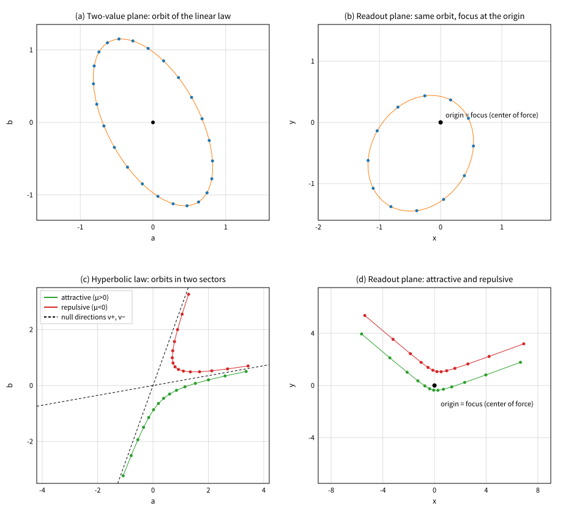
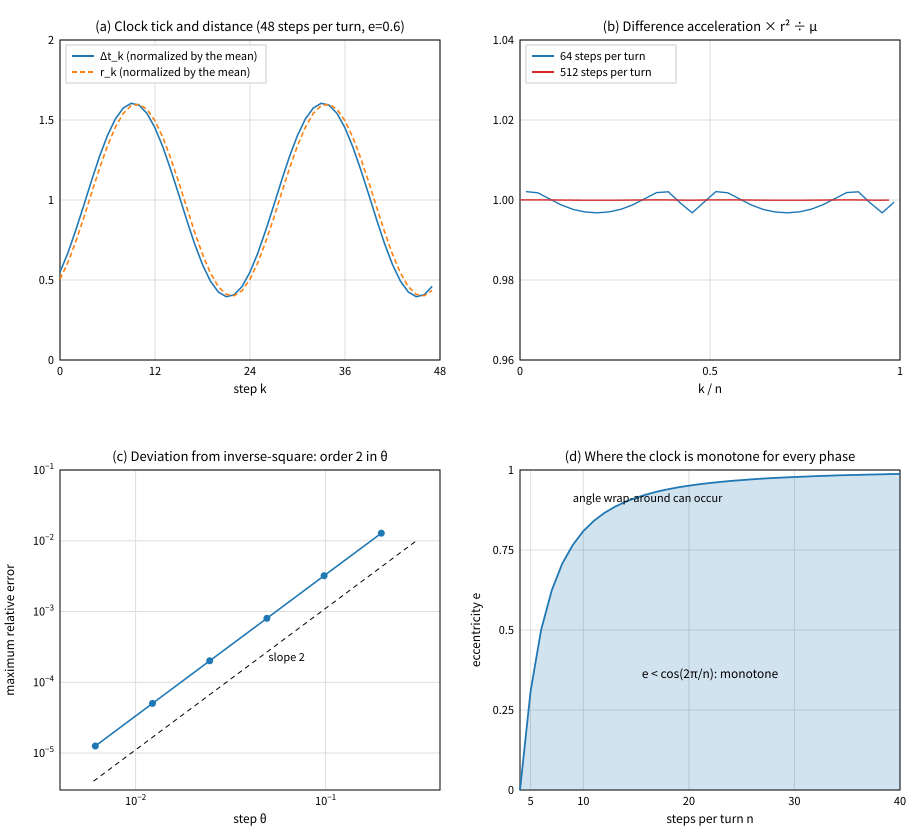
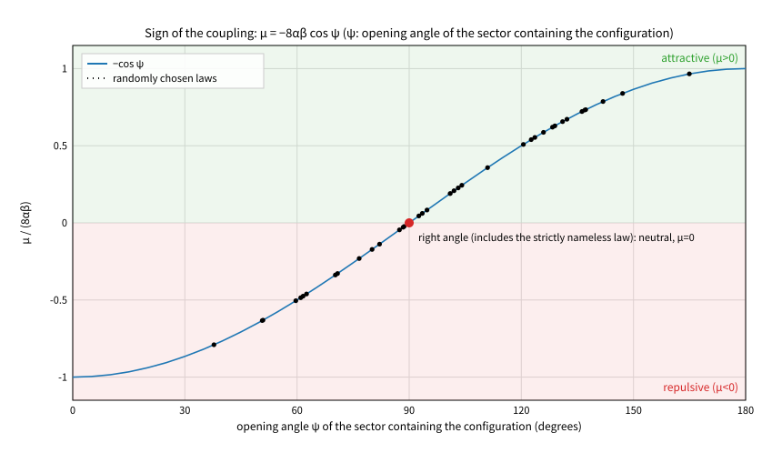
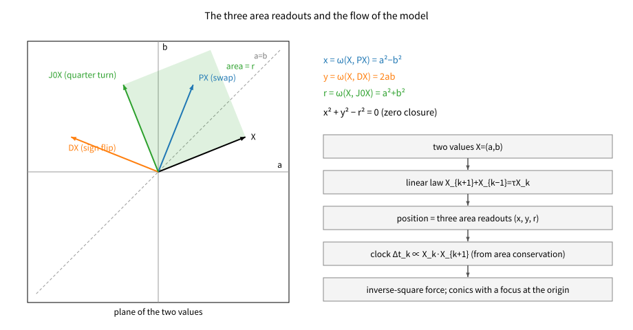
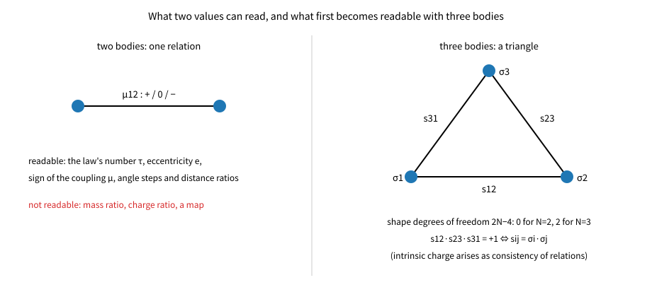

# The Second Thought Experiment: Deriving the Coulomb-Type Inverse-Square Force from a Product Readout and an Area Clock
## - Keeping Two Values and a Linear Law, Obtaining the Focus, Attraction and Repulsion and Neutrality, and Fixing What Two Values Cannot Write -

**Author:** Noriaki Kihara  
**ORCID:** 0009-0004-6753-4020  
**Version DOI:** 10.5281/zenodo.22867900  
**Concept DOI:** 10.5281/zenodo.22867336  
**Version:** v1.1  
**Date:** 2026-09-21

---

## Abstract

The law of the first thought experiment [1] is used unchanged: two values $X=(a,b)$, conservation of an area readout, and the undirected second-order rule $X_{k+1}+X_{k-1}=\tau X_k$. Only two design assumptions (D5, D6) are added, both obtained by applying the principles of the design document [0] to the readout side: position is also a product readout, and the clock too is fixed from the readout.

For position, principle P2 (a state alone is unreadable) is applied to position as well (D5). Reading a product as a bilinear form (D3), position is read from the product of a state and a relation. The swap $P$ follows from principle P1. A second reflection, the sign flip $D$, is posited as the minimal second reflection by D5. Replacing $D$ by any other reflection (other than $\pm P$) changes neither the readout plane nor the distance $r$, and hence none of the conclusions below. The choice of the orientation of $D$ amounts to a convention of taking orthogonal coordinates for position; the existence of a second reflection is itself the assumption D5. The three non-identity elements $P$, $D$, $J_0=DP$ of the group generated by $P$ and $D$ give exactly a basis of the space of quadratic readouts, and from them the readouts are fixed to three.

$$
x=\omega(X,PX)=a^2-b^2,\qquad y=\omega(X,DX)=2ab,\qquad r=\omega(X,J_0X)=a^2+b^2
$$

Identically, $x^2+y^2-r^2=0$. The readout invariant under both $P$ and $D$ is $r$ up to a constant, so there is no need to choose which one is the distance. The distance of the readout plane appears as a zero closure.

For the clock, the axiom candidate A1 (a conserved readout exists) is imposed on the readout plane as well (D6). The area swept in one step is exactly $q\cdot(X_k\cdot X_{k+1})$, so the tick of the clock is fixed to $\Delta t_k\propto X_k\cdot X_{k+1}$, and in the continuum to $dt\propto r\,ds$. Time is the accumulation of $r$ and is not an independent degree of freedom.

The following are then derived.

1. The readout point $z=x+iy$ obeys an inverse-square force whose focus is the origin. Along the continuous interpolation built from $z=w^2$ and $dt\propto r\,ds$, the relation $d^2z/dt^2=-\mu z/r^3$ holds exactly, and for the discrete readout it converges to second order in the step size.
2. The orbit is a conic with the origin as focus, and its equation is the conserved quantity $q$ of the first thought experiment itself. $q$ equals the linear form $\frac{g_{11}-g_{22}}{2}x+g_{12}y+\frac{g_{11}+g_{22}}{2}r$ in the readouts (where $g_{ij}$ are the components of the induced metric $G$), which is of the form $r=p-\mathbf e\cdot(x,y)$. The eccentricity is read from the induced metric as $e^2=1-4\det G/(\operatorname{tr}G)^2$. What $\tau$ fixes is only the type (whether $e$ is smaller than, equal to, or larger than 1); the value of $e$ also depends on $\operatorname{tr}G$.
3. The sign of the coupling $\mu$ need not be given from outside. In the hyperbolic case $\mu=-8\alpha\beta\cos\psi$, where $\psi$ is the opening angle of the sector in which the configuration lies. Attraction and repulsion appear within one and the same linear law as a difference of sectors. The elliptic case is always attractive.
4. There is a neutral case. For hyperbolic laws, symmetry of $S$, orthogonality of the two null directions, $\operatorname{tr}G=0$, and $\mu=0$ for every orbit are mutually equivalent. The "strictly nameless law" (the boost) of the first thought experiment is this case, and the readout point moves in a straight line at constant speed.
5. An orbit with zero angular momentum also has zero coupling ($\mu=2q\operatorname{tr}(\Omega A)$). Within two values and D2, a collision orbit with nonzero coupling ($L=0$, $\mu\neq0$) cannot be represented. The map $z=w^2$ and the clock $dt\propto r\,ds$ have the same form as the Levi-Civita regularization, but the collision orbits that regularization treats lie outside this model.
6. What two values cannot write is fixed. The map (direction) cannot be written because the shape freedom $2N-4$ of $N$ planar bodies vanishes at $N=2$. The mass ratio and the charge ratio cannot be written because the only quantity readable from the relative motion of two bodies is the single coupling $\mu_{12}$, from which the individual ratios cannot be recovered.

The numerical verification used 16 preregistered failure conditions and 2 conditions added afterwards (E4c', E6b). One preregistered item (E4c) actually failed; the cause and the treatment are given in Section 7. As mathematics this is classical, being the regularization of Bohlin and Levi-Civita. What is specific to this paper lies in the route of derivation - from which principles and design assumptions the known map is assembled - and its extent is stated in Section 9.

---

## 0. Position of this paper

This paper is the second thought experiment under the design document [0]. Keeping the law of the first thought experiment [1] unchanged, it asks what follows when position and the clock are fixed from the readout side. Theorem numbers continue from [1] and start at T13. T1 through T12 and T3' of [1], and the symbols $\omega$, $q$, $G$, $\tau$, $\kappa$, are used without re-derivation.

The labels are the same as in [1].

| Label | Meaning |
|---|---|
| [Principle] | Philosophical principle |
| [Axiom candidate] | Candidate to be posited as an axiom |
| [Goal image] | Correspondence with the goal image of Section 7 of the design document |
| [Design assumption] | Assumption of the preliminary design (removable, intended to be removed) |
| [Derivation] | Proved from the statements above (proofs in Appendix A) |
| [Numerical] | Confirmed by numerical experiment |
| [Cross-check] | Correspondence with known physics; not a derivation |

**List of inputs (nothing else is used)**

| Symbol | Label | Content |
|---|---|---|
| P1 | [Principle] | Distinguishing a state from a relation requires two values. The minimal expression of this is two nameless values, $(a,b)\sim(b,a)$ (Section 2.1 of [1]) |
| P2 | [Principle] | A state alone is unreadable. Only products are readable, and a readout is an interaction (Section 5 of the design document) |
| A1 | [Axiom candidate] | A conserved readout exists (Section 7.1 of the design document). Here too it is used as conservation of the signed $q$ ($\det S=1$) |
| D1 | [Design assumption] | Each of the two values is real (undetermined, as stated in Section 10 of [1]) |
| D2 | [Design assumption] | The interaction is an invertible linear map $X\mapsto SX$ |
| D3 | [Design assumption] | A "product" is read as a bilinear form of two configurations |
| D5 | [Design assumption] | Position is also a product readout. The readouts are taken from the group generated by the swap $P$ (which follows from P1) together with a second reflection $D$. $D$ does not follow from P1, but any reflection other than $\pm P$ gives the same conclusions (Section 2.4, T22). The choice of the orientation of $D$ amounts to a convention of taking orthogonal coordinates for position; the existence of a second reflection is itself the assumption D5 |
| D6 | [Design assumption] | A1 is imposed on the readout plane as well. The clock is fixed from it (Section 3) |

Not used: a metric, an inner product, complex numbers, a closure condition $S^n=I$, an externally given time coordinate, a force law, mass, charge. D4 of [1] (fixed resolution) is not used here either.

D5 and D6 are new design assumptions. Both apply the principles to the readout side; neither is a principle itself. What is forced and what is chosen are separated in Sections 2 and 3.

---

## 1. The question

In the first thought experiment, elliptic orbits followed from two values and a linear law. The centre of force, however, was at the centre of the ellipse, and the central force was of the type proportional to distance. The inverse-square law did not appear. Section 4.3 of [1] also gave the reason: under a linear law $\kappa$ does not depend on the size of the orbit, so a relation between $\kappa$ and $C$ would be needed.

The question of this paper is the following.

$$
\boxed{\text{Can a Coulomb-type inverse-square force be written with one state and one relation alone? May the interaction stay linear?}}
$$

The answer is that the interaction may stay linear. The inverse-square force comes not from the side of the law but from the side of the readout and the clock.

This gives one consequence for the exploration of Section 11 of the design document. That an observed force is nonlinear does not mean that the underlying interaction is nonlinear.

$$
\boxed{\;\text{linear law}\;+\;\text{quadratic readout}\;+\;\text{clock fixed from the readout}\;\Longrightarrow\;\text{inverse-square force}\;}
$$

This does not contradict "a linear law does not give the inverse-square law" of the first thought experiment (Section 4.3 of [1]). There the force was in the plane of two values, here it is in the readout plane; the levels differ. It means that obtaining the two-body inverse-square law does not require making $f$ nonlinear.

---

## 2. Position is also a product readout

### 2.1 The space of readouts is three-dimensional [Design assumption D5] [Derivation T13]

By P2, position too cannot be read from a single configuration. It must be read as a product of two configurations. By T1 of [1], a readout is restricted to the area form $\omega$. We therefore consider the readout of a configuration and its image,

$$
\omega(X,MX),\qquad M\ \text{a real}\ 2\times2\ \text{matrix}.
$$

$M$ is not a constant given from outside; it is the input of the relation. $\omega(X,MX)$ is the area of two configurations, the state $X$ and the image $MX$ produced by the relation $M$, and is not the readout of a single configuration. It is a readout of the same type as the conserved quantity $q=\omega(X,SX)$ of [1]. What P2 demands is a readout from the pair of a state and a relation, and D5 takes $\omega(X,MX)$ as its minimal form. [Derivation T13] The kernel of this correspondence is restricted to the case in which $M$ is a constant multiple of the identity (this is "the relational quantity with oneself is zero" of [1]), and the image is the whole space of quadratic forms, that is, three-dimensional.

To take three readouts, no choice of basis has to be made, because the operations tied to namelessness give exactly a basis.

$$
P=\begin{pmatrix}0&1\\1&0\end{pmatrix}\ \text{(swap)},\qquad
D=\begin{pmatrix}-1&0\\0&1\end{pmatrix}\ \text{(sign flip of one side)},\qquad
J_0=DP=\begin{pmatrix}0&-1\\1&0\end{pmatrix}
$$

The group generated by $P$ and $D$ consists, up to sign, of the four elements $\{I,P,D,J_0\}$ (the sign is unreadable by remark (ii) of Section 2.2 of [1]). The three non-identity elements give the three readouts.

$$
\boxed{\;x=\omega(X,PX)=a^2-b^2,\qquad y=\omega(X,DX)=2ab,\qquad r=\omega(X,J_0X)=a^2+b^2\;}
$$

[Derivation T13] These three are a basis of the space of quadratic readouts. Hence what can be read as position is restricted to linear combinations of these three.

Where is the choice? Generating the group from $P$ and $D$ is the choice. The choice of basis is not, because the three elements are themselves a basis.

From here on this paper uses $X\cdot Y$ and $\lvert X\rvert^2$, but this is not an inner product introduced from outside. Setting $\langle X,Y\rangle_0:=\omega(X,J_0Y)$ gives $\langle X,X\rangle_0=a^2+b^2=r$, so the Euclidean inner product is induced from $\omega$ and $J_0$. This inner product therefore also depends on D5.

### 2.2 The distance appears as a zero closure [Derivation T14]

There is an identity among the three readouts.

$$
\boxed{\;x^2+y^2-r^2=0\;}
$$

That is, $x^2+y^2+(ir)^2=0$. There is no need to choose which one to read as the distance. Among general quadratic readouts $Q=ux+vy+wr$, those invariant under both $P$ and $D$ satisfy $u=v=0$, that is, they are constant multiples of $r$. (Being of definite sign is not enough: if $w>\sqrt{u^2+v^2}$ then $Q$ is positive definite, and there are infinitely many such readouts.) $r$ is the unique readout invariant under the namelessness group $\langle P,D\rangle$, and it is the distance of $(x,y)$. The Pythagorean theorem of the readout plane appears not as an assumption but as a zero closure.

Three remarks.

(i) The swap $P$ sends the readouts to $(x,y,r)\mapsto(-x,y,r)$, and the sign flip $D$ to $(x,y,r)\mapsto(x,-y,r)$. Under both, $r$ is unchanged. The orientation of the readout plane (clockwise or counterclockwise) is unreadable.

(ii) $X$ and $-X$ give the same readouts. One revolution in the plane of two values corresponds to two revolutions in the readout plane.

(iii) $P$ and $D$ are reflections with $\det=-1$. These correspond to what Section 3.1 of [1] left as "a branch not treated in this paper". Here they act not as a law but as operators that read position.

### 2.3 The readout plane is not a map

$(x,y)$ are not coordinates of a pre-existing space. Their content is the ratio $a:b$ of the two values and the magnitude $r$. The angle $\varphi=2\arg(a+ib)$ is a restatement of the ratio, and its origin is an internal axis (the line $a=b$), not a direction referred to something outside.

What can be read from inside are five things: the number of the law $\tau$, the eccentricity $e$, the sign of the coupling $\mu$, the sequence of angular differences per step, and the sequence of distance ratios (Section 8, E7). Direction and a map are not among them.

### 2.4 Independence of the choice of $D$ [Derivation T22]

Since $D$ does not follow from P1, the question remains whether choosing another reflection would change the conclusions. It does not.

Replace $D$ by an arbitrary reflection about the line at angle $\varphi$,

$$
D'_\varphi=\begin{pmatrix}\cos2\varphi&\sin2\varphi\\\sin2\varphi&-\cos2\varphi\end{pmatrix}
$$

($\varphi=\pi/2$ gives $D$). If $D'\neq\pm P$, the following hold.

1. The three readouts become $\omega(X,PX)=x$, $\omega(X,D'X)=\sin2\varphi\,x-\cos2\varphi\,y$, and $\omega(X,D'PX)=-\cos2\varphi\,r$. The determinant of the coefficients is $\cos^22\varphi\neq0$, so they remain a basis of the quadratic readouts.
2. The readouts invariant under $\langle P,D'\rangle$ are constant multiples of $r$.
3. The point $z=w^2$ of the readout plane and the distance $r$ do not depend on $D'$. On the readout plane $D'$ acts only as the reflection $z\mapsto e^{4i\varphi}\bar z$.

Hence the clock $dt\propto r\,ds$, the inverse-square force, the conic with the origin as focus, and T15 through T21 are unchanged for any choice of $D'$. What $D'$ changes is only the pair of coordinates attached to the same point. Only when $D'=\pm D$ are the two coordinates orthogonal and does the zero closure take the Pythagorean form $x^2+y^2=r^2$. For $D'=\pm P$ the two reflections coincide, the group shrinks, and $r$ drops out of the basis.

The orientation of the second reflection (which $D'$ to choose) amounts to a convention of taking orthogonal coordinates for position and is not a physical assumption. The existence of a second reflection besides $P$, on the other hand, is itself the assumption D5.

---

## 3. The clock too is fixed from the readout

### 3.1 The swept area is a product readout [Design assumption D6] [Derivation T15]

How is the clock to be fixed? Section 7.6 of the design document asks for a temporal direction as a monotone accumulation, but does not give its tick. We therefore impose A1 on the readout plane as well: the area swept in one step on the readout plane is constant per unit of the clock. This is D6.

[Derivation T15] The area of the triangle swept in one step by $z_k=x_k+iy_k$ on the readout plane is exactly

$$
\tfrac12\operatorname{Im}(\bar z_kz_{k+1})=q\cdot(X_k\cdot X_{k+1}),
$$

where $q=\omega(X_k,X_{k+1})$ is the conserved quantity of [1]. Since $q$ does not change from step to step, the swept area is determined by $X_k\cdot X_{k+1}$ alone. The tick of the clock is therefore fixed to

$$
\boxed{\;\Delta t_k\propto X_k\cdot X_{k+1}\;}\qquad\text{and in the continuum}\qquad\boxed{\;dt\propto r\,ds\;}
$$

The continuous rate of sweeping is $dA/ds=q\,r$, which is also exact.

From here on we set $\Delta s=\arccos(\tau/2)$ in the elliptic case and $\Delta s=\operatorname{arccosh}(|\tau|/2)$ in the hyperbolic case, and normalize the clock as $\Delta t_k=(2\Delta s/\tau)\,X_k\cdot X_{k+1}$ (in the parabolic case $\Delta s=0$, so this normalization is not used).

### 3.2 Time is the accumulation of $r$

The clock and the distance are not separate readouts. In the discrete case the tick is $\Delta t_k\propto X_k\cdot X_{k+1}$, which in general differs from $r_k$. In the continuum limit $t\propto\int r\,ds$, that is, the accumulation of $r$. Neither is an independent degree of freedom. The step count $k$ is the number of interactions, not time.

Before monotonicity is imposed, $\Delta t_k$ may carry a sign (E4c of Section 7, Figure 2(d)). It should be called a signed clock parameter, and it can be taken as a physical clock only where $e<\cos\theta$ holds. Under this condition $\cos\theta>e\ge0$, hence $\tau=2\cos\theta>0$, so the problem that the normalization $\Delta t_k=(2\Delta s/\tau)X_k\cdot X_{k+1}$ becomes singular at $\tau=0$ (four steps per revolution) disappears at the same time. As in T3' of [1] there is no direction at the level of the law, so this clock too does not give an arrow of time.

In the continuum limit the number of interactions per unit physical time is $dk/dt\propto1/r$. The closer the configuration, the more frequently it interacts.

[Numerical] That the discrete clock is proportional to the swept area was confirmed to a relative $2.4\times10^{-14}$ (E4a).

---

## 4. The inverse-square force and conics

### 4.1 The inverse-square force [Derivation T16]

[Derivation T16] Under $z=w^2$ (with $w=a+ib$) and $dt\propto r\,ds$, the readout point obeys

$$
\boxed{\;\frac{d^2z}{dt^2}=-\mu\,\frac{z}{r^3},\qquad \mu=2\lvert X'\rvert^2-E\lvert X\rvert^2,\quad E=2\sigma,\ \ \sigma=-\det A\;}
$$

$E$ is $-2$ for the elliptic type, $0$ for the parabolic type, and $+2$ for the hyperbolic type. The centre of force is the origin, that is, the focus of the orbit.

$\mu$ is not a parameter of the law but a conserved quantity on the side of the orbit. $q$ corresponds to the angular momentum. $E$ corresponds to the Kepler energy, but under the normalization of Section 3.1 it is $E=2\sigma$ (with $\sigma=-\det A$, where $A$ is the normalized generator) and takes only the three values $-2$, $0$, $+2$. What $\tau$ fixes is not the value of $E$ but its type.

[Numerical] On interpolated orbits this was confirmed to a relative $1.2\times10^{-12}$ for all of the elliptic and hyperbolic cases and for attraction and repulsion (E3). The difference acceleration under the discrete clock also converges to the inverse square to second order in the step size $\theta$ (E4d, order 1.998).

**Figure 1** (a) An elliptic-type orbit in the plane of two values: an ellipse centred at the origin. (b) The readout of the same orbit: an ellipse with the origin as focus. (c) Orbits in the two sectors of a hyperbolic-type law. (d) Their readouts: one is an attractive, the other a repulsive hyperbola.

### 4.2 The conic is the conserved quantity of the first thought experiment [Derivation T17] [Cross-check C1]

[Derivation T17] The conserved quantity $q=X^{\mathsf T}GX$ of [1] (with $G=\Omega(S-S^{-1})/2$ and components $g_{11},g_{12},g_{22}$) equals a linear form in the readouts.

$$
\boxed{\;q=\frac{g_{11}-g_{22}}{2}\,x+g_{12}\,y+\frac{g_{11}+g_{22}}{2}\,r\;}
$$

If $\operatorname{tr}G=g_{11}+g_{22}\neq0$, this can be written as

$$
r=p-\mathbf e\cdot(x,y),\qquad \lvert\mathbf e\rvert=e=\sqrt{1-\frac{4\det G}{(\operatorname{tr}G)^2}}
$$

which is the equation of a conic with the origin as focus. Since $\det G=1-\tau^2/4$ is fixed by the number of the law $\tau$ alone, whether $e$ is smaller than, equal to, or larger than 1 is fixed by $\tau$. However $\operatorname{tr}G$ is not fixed by $\tau$, so the value of $e$ itself is not fixed by $\tau$ alone. As a counterexample, the laws $S_\lambda=T_\lambda R_\theta T_\lambda^{-1}$ with $\tau=1$ (where $T_\lambda=\mathrm{diag}(\lambda,\lambda^{-1})$ and $2\cos\theta=1$) give $e=0$ for $\lambda=1$ and $e=15/17$ for $\lambda=2$. $e$ is determined by $S$ alone and does not depend on the initial configuration $X_0$ among the orbits of the same $S$. Indeed, T19' of Section 5.2 gives $e^2=1+2E/\operatorname{tr}(\Omega A)^2$. This is consistent with listing $\tau$ and $e$ as separate readable quantities in Section 8.1.

[Cross-check C1] This is Kepler's first law. When $\operatorname{tr}G\neq0$, the elliptic case gives $e<1$, the parabolic case $e=1$, and the hyperbolic case $e>1$ ($\operatorname{tr}G=0$ is the neutral case; see T19). It agrees with Kepler's formula $e^2=1+2EL^2/\mu^2$.

[Cross-check C2] The definition of the clock is itself Kepler's second law (Section 3.1).

[Cross-check C3] For closed orbits the physical time of one revolution of the readout $z$ is $T=2\pi\sqrt{a^3/\mu}$ (with $a=\mu/2\lvert E\rvert$). Since one revolution of $X$ corresponds to two revolutions of $z$, the discrete clock summed over one revolution of $X$, which is what E4b sums, agrees with $2T=4\pi\sqrt{a^3/\mu}$. This is the cross-check against Kepler's third law in this paper.

[Numerical] That $q$ is a linear form in the readouts was confirmed by exact rational arithmetic (E1b, 0 violations). The agreement of the two eccentricity formulas is relative $5.3\times10^{-13}$ (E2a), the correspondence between type and eccentricity had 0 violations over 2000 laws (E2b), and the third law is relative $9.3\times10^{-15}$ (E4b).

**Figure 2** (a) The tick of the clock and the distance. (b) The difference acceleration multiplied by $r^2$ and divided by $\mu$; a value of 1 means the inverse square. (c) The deviation from the inverse-square law decreases to second order in the step size. (d) The range in which the clock is monotone for every initial phase.

---

## 5. Attraction, repulsion and neutrality

### 5.1 The sign of the coupling is fixed from inside [Derivation T18]

In what follows we may take $\tau>2$ in the hyperbolic case. For a law $S$ with $\tau<-2$, the law $-S$ has $\tau>2$, and configurations are carried to $X_k\to(-1)^kX_k$. Since the readouts are quadratic, $z_k=w_k^2$ is unchanged, and the clock normalization $2\Delta s/\tau$ also changes sign consistently and gives the same tick. The numerical verification (E5b, E5d) was carried out in this range.

Can attraction or repulsion be decided without giving the sign of a charge from outside? It can.

[Derivation T18] Let $v_\pm$ be the two null directions of a hyperbolic-type law and split a configuration as $X=\alpha v_++\beta v_-$. Then

$$
\boxed{\;\mu=-8\alpha\beta\,(v_+\!\cdot v_-)=-8\alpha\beta\cos\psi\;}
$$

Here $\psi$ is the opening angle of the sector in which the configuration lies, when the orientations of $v_\pm$ are taken so that $\alpha>0$ and $\beta>0$. What fixes the sign is only which sector the configuration is in and the opening angle of that sector. Relabelling by $P$ does not change this sign.

$$
\psi>90^\circ\ \Longleftrightarrow\ \text{attraction},\qquad \psi<90^\circ\ \Longleftrightarrow\ \text{repulsion}
$$

In the elliptic case there are no null directions, so this branching does not occur. The elliptic case is always attractive.

[Numerical] The formula for $\mu$ holds to a relative $5.3\times10^{-13}$ (E5b). Among 1518 elliptic laws there were 0 cases with $\mu\le0$ (E5a). Among 482 hyperbolic laws there were 336 attractive and 146 repulsive cases, with 0 violations of the correspondence with the opening angle (E5b, E5d).

**Figure 3** The sign of the coupling is fixed by the opening angle of the sector in which the configuration lies. A right angle is neutral.

### 5.2 Neutrality [Derivation T19]

First an identity. [Derivation T19'] For the normalized generator $A$ (with $X'=AX$),

$$
\boxed{\;\mu=2\,q\,\operatorname{tr}(\Omega A)\;}
$$

holds identically. Here $q=\omega(X,AX)$ is the continuous version of the conserved quantity and is a constant multiple of the discrete $q$. From this single identity the following follow. Within one law, $\mu$ is proportional to $q$. The agreement of the two eccentricity formulas of T17 (E2a) is an identity, not a numerical coincidence. And T19 below follows immediately.

[Derivation T19] For hyperbolic laws the following four are equivalent.

1. The two null directions are orthogonal ($\psi=90^\circ$)
2. $S$ is a symmetric matrix
3. $\operatorname{tr}G=0$
4. $\mu=0$ for every orbit

In this case the readout point moves in a straight line at constant speed. There is no force. The "strictly nameless law" (the boost) of remark (iii) of Section 4.1 of [1], and the squeeze that restates it, are this case.

Hence a relation carrying no charge has a place in this model from the start. Neutrality is not a special adjustment but the single condition that $S$ be symmetric. Since the eigenvalues of a symmetric real matrix are real, neutrality does not occur in the elliptic case.

[Numerical] For the normal forms of the boost and the squeeze, both $\lvert\mu\rvert$ and the acceleration are at most $7.0\times10^{-15}$ (E5c). $\operatorname{tr}G$ is exactly 0 for these normal forms.

---

## 6. Orbits with zero angular momentum, and collisions that cannot be represented [Derivation T20]

An orbit with zero angular momentum is, in the plane of two values, an orbit with $q=0$, that is, one in which $X_0$ and $X_1$ are parallel. This corresponds to the null cone of T7 of [1] (configurations whose direction is unchanged by the interaction).

Such an orbit lies within D2 only when $\lvert\tau\rvert\ge2$. To realize $X_1=\lambda X_0$ with an $S$ satisfying $\det S=1$, $X_0$ must be a real eigenvector of $S$, which requires $\tau=\lambda+\lambda^{-1}$, that is, $\lvert\tau\rvert\ge2$. The same can be said from the readout side: in the elliptic case $\det G=1-\tau^2/4>0$ and $G$ is definite, so the only configuration with $q=0$ is $X=0$. For $\lvert\tau\rvert<2$ one can still write collinear sequences satisfying the second-order rule, but they are not orbits of an $S$.

[Derivation T20] Within D2, orbits with $q=0$ are restricted to the eigen-orbits $X_k=\lambda^kX_0$. Since $S$ is invertible, $\lambda\neq0$, and the origin is never reached in a finite number of steps. The readout point moves along a single ray from the origin as $z_k=\lambda^{2k}z_0$. By T19', the coupling of this orbit is $\mu=0$. That is, an orbit with $q=0$ is neutral and is not a Coulomb collision orbit ($L=0$, $\mu\neq0$). In the hyperbolic case ($\lvert\tau\rvert>2$) the readout point moves along the ray at constant speed in the continuum limit ($\lvert z\rvert=r_0\pm2t$). An inward orbit ($\lvert\lambda\rvert<1$) fits infinitely many steps into the finite physical time $t=r_0/2$ and reaches the origin in that limit. In the parabolic case ($\lvert\tau\rvert=2$) we have $\lambda=\pm1$ and the readout point does not move ($z_k=z_0$).

The clock needs one repair. The clock of T15 was fixed from the conservation of the swept area, but on an orbit with $q=0$ the swept area is identically zero, so that argument does not fix the clock. We take $dt\propto r\,ds$, obtained on orbits with $q\neq0$, and extend it continuously to $q=0$. The map $z=w^2$ and this clock have the same form as the Levi-Civita regularization [4,4a]. However, the collision orbits with nonzero coupling that this regularization treats do not occur in this model, by T19'.

Within two values and D2, a collision orbit with nonzero coupling cannot be represented. The reason is that the strength of the coupling $\mu$ and the angular momentum $L=2q$ are proportional within each law (T19'), so $L\to0$ forces $\mu\to0$. In the hyperbolic type ($\lvert\tau\rvert>2$), looking at the second-order rule alone, one can write collinear sequences $c_k=C_+\lambda^k+C_-\lambda^{-k}$ (with $C_+C_-<0$) that cross the origin, but they are not orbits of a single $S$. In the parabolic type ($\lvert\tau\rvert=2$) the second-order rule has a double root, so its general solution is $c_k=(C_0+C_1k)(\pm1)^k$. Rather than hiding this as a defect, it should be recorded as a boundary condition for the next thought experiment (Section 11).

[Numerical] E6 confirmed by exact rational arithmetic that over 40 steps $q_k$ is exactly 0, that the readout point lies on the ray, and that all values are finite. However, the value $\tau=17/10$ used by E6 is elliptic and, as above, lies outside D2. A collision orbit within D2 was therefore verified separately as E6b. With $\tau=149/70=\lambda+\lambda^{-1}$ (where $\lambda=7/10$), the eigen-orbit (an orbit of $S$) gives $c_k=\lambda^k$ exactly and crosses the origin 0 times. A sequence with coefficients of opposite signs satisfies the second-order rule and crosses the origin exactly once, but since the orbits of $S$ with $X_0\parallel X_1$ are restricted to the eigen-orbits, this is not an orbit of $S$. The "7 crossings in 40 steps" reported by E6 is specific to oscillating sequences with $\lvert\tau\rvert<2$ and is not a property of orbits of $S$. The proof of A.20 uses only the second-order rule and stands as it is.

---

## 7. Numerical verification

The commitments are the same as in [1]. The forms to be verified are derived from $S$; $S$ is not constructed so that the forms hold. The failure conditions are declared before execution in `FAIL_CONDITIONS` at the head of the script. No rounding, clipping or normalization is inserted into the state update (Section 12 of the design document). Identities are also checked by exact rational arithmetic. The random seed is fixed (20260921).

| Symbol | Failure condition (preregistered) | Result | Verdict |
|---|---|---|---|
| E1a | $x^2+y^2-r^2$ fails to be 0 even once in exact arithmetic | 0 violations over 300 laws x 10 steps | PASS |
| E1b | $q$ disagrees with the linear form in the readouts in exact arithmetic | 0 violations | PASS |
| E2a | The eccentricity from the metric deviates from Kepler's formula ($10^{-9}$) | max $5.3\times10^{-13}$ over 2000 laws (1518 elliptic, 482 hyperbolic) | PASS |
| E2b | The correspondence between type and eccentricity breaks | 0 violations | PASS |
| E3 | The acceleration deviates from $-\mu z/r^3$ ($10^{-9}$) | max $1.2\times10^{-12}$ | PASS |
| E4a | (swept area) / (clock tick) varies along the orbit ($10^{-12}$) | max $2.4\times10^{-14}$ | PASS |
| E4b | The sum of the clock over one revolution of $X$ deviates from twice the Kepler period ($10^{-12}$) | max $9.3\times10^{-15}$ | PASS |
| **E4c** | "the clock is monotone $\iff\cos\theta>e$" breaks even once | **broke in 3 of 400 cases** | **FAIL** |
| E4d | The order in the step size of the error of the difference acceleration falls outside $[1.8,2.2]$ | order 1.998 ($n=32\ldots1024$, error $1.3\times10^{-2}\to1.3\times10^{-5}$) | PASS |
| E5a | $\mu\le0$ occurs even once in the elliptic case | 0 violations over 1518 cases | PASS |
| E5b | The formula for $\mu$ deviates, or attraction or repulsion fails to occur | max $5.3\times10^{-13}$, 336 attractive and 146 repulsive | PASS |
| E5c | $\lvert\mu\rvert$ or the acceleration exceeds $10^{-12}$ for the neutral normal forms | max $7.0\times10^{-15}$ | PASS |
| E5d | "attraction $\iff\psi>90^\circ$" breaks even once | 0 violations over 482 cases | PASS |
| E6 | On a collision orbit, $q_k\neq0$, departure from the ray, or values ceasing to be finite | 0 violations in exact arithmetic, deviation $5.0\times10^{-16}$. However the tested sequence lies outside D2 and is not a verification of an orbit of the model (Section 6; the case within D2 is E6b) | PASS |
| E6b | **Added afterwards.** With $\tau=149/70$: (i) for an orbit with $q=0$ within D2 (an eigen-orbit), $c_k=\lambda^k$ fails, $q_k\neq0$, departure from the ray, or the number of origin crossings is not 0; (ii) for the general solution of the second-order rule (coefficients of opposite signs, not an orbit of $S$), the number of origin crossings is not 1 | 0 violations in exact arithmetic; crossings are 0 and 1 | PASS |
| E7a | Under a rotation of the description, the eccentricity, the angular differences or the distance ratios change ($10^{-10}$) | max $2.8\times10^{-14}$ | PASS |
| E7b | The swap fails to give $(x,y,r)\to(-x,y,r)$, or $X\to-X$ changes the readouts | 0 violations | PASS |

The numerical verification was carried out for the elliptic and hyperbolic types. The parabolic type ($\lvert\tau\rvert=2$) is excluded by the way the random laws are drawn, so the parabolic branches of T16 and C1 are confirmed only by symbolic computation (the script of Appendix B).

**Execution environment and a second-environment reproduction.** The values in the table above, together with the accompanying JSON and figures, come from one execution (macOS arm64, Python 3.9.6, NumPy 2.0.2, Accelerate). Running the same script in another environment (Linux x86_64, Python 3.12.3, NumPy 2.4.4, OpenBLAS 0.3.31) gave the same verdicts for all 18 items (only E4c FAIL). The exact rational computations (E1a, E1b, E6, E6b) and the integer results agreed completely, and the floating-point verification values differed only in their last digits (for example, the maximum for E2a was $8.5\times10^{-13}$ against $5.3\times10^{-13}$, and E4b was $1.5\times10^{-14}$ against $9.3\times10^{-15}$). As in the first thought experiment, what is to be reproduced is not the numbers themselves but the verdicts.

**On the failure of E4c.** No tolerance was loosened afterwards. The failures were 3 out of 400 cases, all on the side "although $\cos\theta\le e$, the clock was monotone for that initial phase"; the converse (not monotone although $\cos\theta>e$) occurred 0 times.

The cause lies in how the preregistered condition was written. The tick has the form $X_k\cdot X_{k+1}=a[\cos\theta-e\cos(u_k+\theta)]$, where $u_k$ is the eccentric anomaly (this formula was also checked numerically). The condition $\cos\theta>e$ is the condition for monotonicity at every initial phase. Even when $\cos\theta\le e$, the clock is monotone if the orbit happens not to step on a phase where the tick becomes negative. The declared equivalence does not hold unless the initial phase is scanned. What failed is not the theorem but the way the verification was written.

The following diagnostic was therefore added.

| Symbol | Character | Failure condition | Result | Verdict |
|---|---|---|---|---|
| E4c' | **Diagnostic added afterwards.** Not preregistered | (i) a negative tick occurs although $\cos\theta>e$, or (ii) no negative tick occurs even when the initial phase is finely scanned, although $\cos\theta<e$ | over 200 laws x 400 phases: (i) 0 cases, (ii) 0 cases | PASS |

The correct statement is the following. $\cos\theta>e$ is equivalent to the clock being monotone for every initial phase. For $\cos\theta<e$ there exists an initial phase at which it fails to be monotone.

This failure taught something. The discrete clock can take negative ticks when the step size is coarse and the eccentricity is large. That time advances monotonically is not automatic in this system. It holds only when the step size and the eccentricity satisfy $e<\cos(2\pi/n)$ (Figure 2(d)). This is carried over to the next thought experiment as a condition for causal ordering under finite resolution.

---

## 8. What is readable and what is not

### 8.1 What is readable with two values [Numerical E7]

The following are readable from inside.

- The law's number $\tau$ (it fixes the type of the energy $E$; under the normalization of §3.1, $E$ takes only the values $-2$, $0$, or $+2$)
- The eccentricity $e$
- The sign of the coupling $\mu$ (attraction, repulsion, neutrality)
- The sequence of angular differences per step
- The sequence of distance ratios. At a finite step size this is a different sequence from the ratios of the clock ticks, and they agree only in the continuum limit ($r_k=1-e\cos2u_k$, $\Delta t_k\propto\cos\theta-e\cos(2u_k+\theta)$)

[Numerical] Under a rotation of the description ($X\to RX$, $S\to RSR^{-1}$) these five are unchanged to within $2.8\times10^{-14}$ (E7a). The behaviour under the swap and the sign flip was also checked (E7b).

### 8.2 What two values cannot write [Derivation T21a] [Derivation T21b]

[Derivation T21a] The shape freedom of a configuration of $N$ planar bodies, after removing translation, rotation and scale, is $2N-4$. At $N=2$ it is 0. A two-body system has no shape (map) in principle. Direction acquires meaning only with three bodies.

The reason why the mass ratio and the charge ratio cannot be written is different. [Derivation T21b] [Cross-check C4] Writing the Newton and Coulomb laws in relative coordinates, the coefficient of the relative acceleration is

$$
\mu_{12}=(m_1+m_2)\bigl(G-k\,\sigma_1\sigma_2\bigr),\qquad \sigma_i=q_i/m_i
$$

With a single relation, only this one combination is readable; its absolute value is a scale and hence unreadable, and only the sign remains. The map $(m_1,m_2,\sigma_1,\sigma_2)\mapsto\mu_{12}$ is not injective, so the individual ratios cannot be recovered from $\mu_{12}$. This is not a counting of degrees of freedom but a statement of indistinguishability. The same holds in standard physics: reading the mass ratio $m_1/m_2=-a_2/a_1$ requires additional relational information that allows the two accelerations to be compared against one and the same inertial reference, and the charge ratio is not fixed by the product $q_1q_2$ alone.

The results of this paper are therefore at a stage at which mass and charge are not yet distinguished.

**Figure 4** The three readouts and the flow from the inputs to the conclusions.

**Figure 5** What is readable with two values, and what becomes readable only with three bodies.

### 8.3 What becomes readable with three bodies [Cross-check C5]

[Cross-check C5] Translating known physics into the language of relations, the coefficient of the acceleration that body $i$ receives from $k$ is $c_{ik}=m_k(G-k\,\sigma_i\sigma_k)$. It is not symmetric. From this the following can be said.

- The mass ratio can be read as the asymmetry of the directed couplings: $c_{ik}/c_{ki}=m_k/m_i$. This is Mach's definition written in relations alone.
- Charge can be read as the symmetric remainder after removing mass. If three products $\sigma_i\sigma_k$ are readable, the individual $\sigma_i$ are fixed. The overall sign, however, is not: flipping all signs at once changes nothing, which is unreadability of the same type as namelessness.
- The pairwise sign $s_{ij}$ can be written as a product of individual signs $\sigma_i\sigma_j$ only when $s_{12}s_{23}s_{31}=+1$. Intrinsic charge stands not as an input but as a triangle consistency condition.
- Mass enters the coupling additively and charge multiplicatively. A candidate reason why mass and charge become separate readouts lies in this difference of entry.

This is not a derivation. When a model with three or more values is built, whether the pairwise couplings decompose into this structure will be used as a failure condition.

### 8.4 Back to the design document

| Condition (Section 11 of the design document) | What can be said here |
|---|---|
| 1. Can a global conserved quantity exist | As in [1]. Here that $q$ turned out to be the angular momentum on the readout plane and at the same time the equation of the conic itself (T17) |
| 2. Can an interaction including self-interaction be defined | As in [1]. Here position and the clock were built from the same readout |
| 3. Can the conserved structure be maintained as the number of states changes | Not treated here either. Section 8.3 is the next verification condition |
| 4. Is it kept finite | The elliptic type is bounded, the hyperbolic type unbounded. Orbits with $q=0$ are neutral and do not reach the origin in a finite number of steps (T20) |
| 5. Are relational directions generated without an externally given axis | The distance is generated as a zero closure (T14). Direction (a map) is not generated (T21a) |

There is nothing here corresponding to "transmission, distribution, redistribution" of Section 7.9 of the design document, because the system is two-body.

---

## 9. Relation to known mathematics, and the assembly specific to this paper

As mathematics this is classical. That the planar Kepler problem is carried to a harmonic oscillator by $z=w^2$ together with the time transformation $dt\propto r\,ds$ was shown by Bohlin (1911) [3], and this map is at the centre of the regularization of Levi-Civita [4]. Arnold [5] treated it as the "duality of Hooke and Newton", and the three-dimensional version is Kustaanheimo-Stiefel [6]. The correspondence of conserved quantities under this duality (the Fradkin tensor of the oscillator and the Runge-Lenz vector of Kepler) has also been studied [7].

The content of T15 through T17 of this paper therefore amounts to a restatement of the known regularization in the language used here. In particular the eccentricity correspondence of T17 is likely to be the same as the known correspondence of conserved quantities. The extent of the overlap has not been settled (Section 11).

Rather than claiming established novelty, the following are presented as the assembly specific to this paper; the overlap with earlier work will be investigated further. T17 is treated as making explicit, in the notation of this model, that the conserved quantity of the first thought experiment falls within the known correspondence of Kepler conserved quantities, and is not counted among the items of novelty.

1. That from D5, which applies P2 to position, together with D3, which reads a product as a bilinear form, position is fixed as a product readout, that the space of readouts is three-dimensional, and that the group generated by $P$ and $D$ gives exactly its basis (T13). The map of the regularization comes not from a convenient change of variables but from the principles and explicitly stated design assumptions. $D$ was posited by D5, but any reflection other than $\pm P$ gives the same conclusions (T22).
2. That the distance appears as a zero closure of the readouts, and that there is no need to choose which one is the distance (T14).
3. That Kepler's first law is the linear form of the conserved quantity $q$ of the first thought experiment itself (T17).
4. That the clock is fixed from D6, which applies A1 to the readout plane, and that time is not an independent degree of freedom but, in the continuum limit, the accumulation of $r$ (T15).
5. That the sign of the coupling is fixed from inside as the opening angle of a sector, and that neutrality is equivalent to symmetry of $S$ (T18, T19).
6. The boundary between what two values can and cannot write (T21a, T21b).

---

## 10. Limits

- This goes only as far as the planar Coulomb problem. The known Kustaanheimo-Stiefel regularization lifts the three-dimensional Kepler problem to a four-dimensional harmonic oscillator [6], but it has not been derived from the principles of this paper that three dimensions require four values.
- The family of orbits of one law is a family with "common $E$ and varying $\mu$". Treating various orbits around the same charge (fixing $\mu$ and varying $E$) requires a relation between $\tau$ and the size of the orbit. This is the precise form of the point stated in Section 4.3 of [1].
- D5 and D6 are new design assumptions. Both apply the principles to the readout side; neither is a principle itself.
- Mass and charge are not distinguished. There is no map either (T21a, T21b).
- Collision orbits with nonzero coupling ($L=0$, $\mu\neq0$) cannot be represented (T19', T20). The map and the clock have the same form as the Levi-Civita regularization, but the collisions that regularization treats lie outside this model.
- $\tau$ plays two roles here as well: it is the number of the law and at the same time the phase per step. That the two look like the same number is because there is only one relation, and this cannot be carried over as it is to three or more bodies (Section 11).
- D1 (reality) and D2 (linearity) remain assumptions, as in [1]. A1 also remains an axiom candidate.

---

## 11. The next thought experiment

**A common $\tau$ cannot be assumed.** For three bodies the following three cannot hold at once: a common number of the law $\tau$, a common stepping, and a common physical time. The reason is that the clock differs for each relation (in the continuum limit $dt_{ij}\propto r_{ij}\,ds_{ij}$, and in the discrete case $\Delta t_{ij,k}\propto X_{ij,k}\cdot X_{ij,k+1}$). At least one must be given up. Even in the known regularizations, treating several pairs at once requires a global time transformation rather than a per-pair one [8,9]. The first branching of the third thought experiment is placed here.

**Conditions for verification.** Returning to the results of this paper in the two-body limit. Being able to represent collision orbits with nonzero coupling (not possible here; Section 6). The influence of a third body appearing with the structure of Section 8.3 for three bodies. An option that fails any of these three conditions is discarded.

**The next questions.** (i) Whether the inverse-square structure survives replacing $D$ by a general second reflection was settled in Section 2.4: it does (T22). The Coulomb law does not depend on the orientation chosen for $D$. The orientation of the second reflection has no physical content, while the existence of a second reflection is itself the assumption D5. (ii) When three relations are consistent, do shape (a map) and intrinsic state (charge) become readable at the same time? (iii) Does the magnitude of charge become discrete? Here only the sign is discrete, while the magnitude of $\mu$ is continuous. What the finite resolution of [1] quantizes is the closure number of an orbit, not the magnitude of a coupling. (iv) Does monotonicity of the clock (E4c' of Section 7) become the condition for causal ordering under finite resolution?

---

## 12. Work record

Recorded in accordance with Section 14 of the design document.

- **Background.** This paper was drafted by Claude in response to Kihara's question, "Can the simplest model of the Coulomb force be represented with one state and one relation alone? Can the interaction be represented linearly?" The two ideas of making position a product readout and of fixing the clock from the conservation of area were put together by Claude. The decision to restrict the scope to two bodies for publication was Kihara's.
- **Provenance of the elements.** P1, P2, A1 and D1 through D3 come from [0] and [1]. D5, D6 and T13-T22 were constructed in this paper (T19' arose during the verification, and T22 was added following a reviewer's suggestion). Section 8.2 ("with two values neither the mass ratio nor the charge ratio is readable"), the three-body structure of Section 8.3, the two roles of $\tau$ in Section 10, and the problem of a common $\tau$ in Section 11 came from Kihara's remarks. In particular the question "the interaction too has namelessness; can the cases that look attractive and repulsive be decided without external intervention?" led to T18 and T19.
- **Risks specific to this draft.** As with [1], it was written in one pass without Kihara's corrections. The places to be checked independently are the individual proofs of Appendix A, the delimitation of what is claimed as known in Section 9, and the validity of the cross-checks C4 and C5. In particular reference [7] has not been read in full. How far the known correspondence of conserved quantities and T17 are the same has not been settled. This is to be checked by third-party review.
- **Record of the verification.** The failure of E4c was left without rewriting. E4c' is an after-the-fact diagnostic. E5d was a prediction formed after seeing the result of E5b, but it was declared before execution. This distinction is stated explicitly in the table.
- **Corrections from review.** The first draft was wrong in T17, stating that "the eccentricity is fixed by the number of the law alone" (the counterexample is the family with $\tau=1$ and varying $\lambda$). In addition, the reason for the uniqueness of the distance was weak; $D$ was written as if it followed from P1; the discrete and the continuous clock were mixed; the definition of the clock ran idle on orbits with $q=0$; a counting of degrees of freedom was used as a proof of indistinguishability; $\tau<-2$ was not treated; and it was asserted outright that three dimensions require four values. These were found in the review by ChatGPT. Both the Claude that wrote the draft and the Claude Code that re-derived the results had missed them. As with the first thought experiment, they were not found by verification of the same lineage but by review of a different lineage.
- **Corrections from re-derivation.** Claude Code independently re-derived T13 through T21 and Appendix A and found the same error in T17 by a different route. In addition it was found that the condition $\operatorname{tr}G\neq0$ was missing for the hyperbolic and parabolic branches of A.17; that $E=\mp2$ of T16 did not cover the parabolic type; that the collision orbit of E6 was outside D2 ($\tau=17/10$ is elliptic and has no nontrivial configuration with $q=0$); that the way the correspondence between $E$ and $\tau$ was written was imprecise; and that the distance ratios and the ratios of the clock ticks were written as the same thing. The identity $\mu=2q\operatorname{tr}(\Omega A)$ (T19') also came out of the re-derivation and was not in the first draft. The symbolic computation is kept in the script of Appendix B.
- **Generalization of $D$ (T22).** The review by ChatGPT proposed that "before going to three bodies, one should check whether the inverse-square structure survives replacing $D$ by a general reflection". Claude computed it and confirmed that it does. The orientation of $D$ is a convention of taking orthogonal coordinates for position and is not a physical assumption. The existence of a second reflection is itself the assumption D5.
- **Corrections from the second review.** ChatGPT pointed out the following. Since $q=0\Rightarrow\mu=0$ follows from T19', the orbits with $q=0$ of T20 are neutral orbits rather than Coulomb collision orbits. The sequence with coefficients of opposite signs in E6b is not an orbit of $S$. Between P2 and $\omega(X,MX)$ a step is needed, namely that "$M$ is the input of the relation". What is not a physical assumption in T22 is the orientation of the second reflection, not its existence. All are correct. The Claude and the Claude Code that derived T19' had not carried its consequence into T20.
- **Corrections from the third review.** ChatGPT pointed out that the continuum limit of T20 does not hold in the parabolic case ($A^2=0$, so the readout point does not move); that item 6 of the abstract did not reflect the distinction between T21a and T21b; that Section 9 and elsewhere compressed what follows from design assumptions into what follows from principles; and that an outdated clock formula remained in Section 11. All are correct.
- **Bibliographic checks.** References [3] through [6], [4a], [8] and [9] were checked down to volume and pages against several independent sources. For [7] only the arXiv bibliographic record was checked.
- **Corrections in v1.1.** After v1.0 (Version DOI 10.5281/zenodo.22867337) was published, the following inconsistencies were found and corrected in v1.1. (1) In Section 8.1, "The number of the law $\tau$ (corresponding to the energy)" contradicted the correction in Section 4.1. (2) In Section 4.1, the parabolic value $E=0$ was missing. (3) In Section 4.2, $e$ was described as "fixed by $S$, that is, in the language of [1], by the law and the initial data"; in fact $e$ is determined by $S$ alone and does not depend on the initial configuration. (4) In Appendix A.19, the components of $S$ were written with $q,r$, clashing with the conserved quantity and the distance; in T17, the components of $G$ were written $A,B,C$, clashing with the normalized generator $A$. The components are now written $s_{ij}$ and $g_{ij}$. (5) In Appendix B and the script description, the verified range was still given as A.13 through A.21. (6) In Section 12, the range of the constructed results was still given as T13 through T21. The derivations and numerical results are unchanged. (1)-(3) were errors or omissions in the correction instructions written by Claude, the drafter; (4) came from the notation of the first draft; (5) and (6) were caused by correction instructions that were never applied before publication. Claude Code, the verifier, noticed (1), (3) and (6) while applying edits but only added notes instead of issuing warnings.
- **Final audit before publication.** Before v1.1 was published, ChatGPT re-checked the full text against the verification code and corrected the following: (1) C3 and E4b confused one revolution of $X$ with one revolution of the readout $z$ (one revolution of $X$ is two of $z$, so the clock sum of E4b is twice the Kepler period); (2) A.20 did not make explicit the double root of the second-order rule in the parabolic type; (3) Section 9 listed T17 among the candidates for novelty while admitting that it may overlap with the known correspondence of conserved quantities; (4) the operational explanation of the mass ratio in C4 was too strong; (5) Section 11 wrote "either" for three conditions. The main theorems and the numerical data are unchanged.
- **Reproducibility.** The numbers were reproduced in two environments and the verdicts agreed (Section 7). The scripts use relative paths only. Each figure is described once, and the same description produces both SVG and PNG in Japanese and English versions. SVG is always generated without dependencies, and PNG only when matplotlib is available.

---

## References

### This series

[0] Noriaki Kihara, **Designing a Research Project to Explore the Emergence of Spacetime, Particles, and Interactions from States and Relations: A Framework of Preliminary Design and Feasibility Verification for Foundational-Physics Model Exploration under Uncertainty**, v1.0 (2026-09-20). Concept DOI: 10.5281/zenodo.22851944.

[1] Noriaki Kihara, **The First Thought Experiment: Tracing the Equivalence Principle Down to Two Nameless Degrees of Freedom - Deriving the Sign of the Sum of Squares, the Curvature Radius, and Three Systems (Inertial, Uniformly Accelerated, Rotating) from the Conservation of an Area Readout**, v1.0 (2026-09-20). Concept DOI: 10.5281/zenodo.22857952.

### External

[2] Newton, I., **Philosophiae Naturalis Principia Mathematica**, London, 1687.

[3] Bohlin, K., **Note sur le probleme des deux corps et sur une integration nouvelle dans le probleme des trois corps**, *Bulletin Astronomique*, **28** (1911), 113-119.

[4] Levi-Civita, T., **Sur la regularisation du probleme des trois corps**, *Acta Mathematica*, **42** (1920), 99-144. DOI: 10.1007/BF02404404.

[4a] Levi-Civita, T., **Sur la resolution qualitative du probleme restreint des trois corps**, *Acta Mathematica*, **30** (1906), 305-327. (planar regularization)

[5] Arnold, V. I., **Huygens and Barrow, Newton and Hooke**, Birkhauser, 1990.

[6] Kustaanheimo, P., Stiefel, E., **Perturbation theory of Kepler motion based on spinor regularization**, *Journal fur die reine und angewandte Mathematik*, **218** (1965), 204-219. DOI: 10.1515/crll.1965.218.204.

[7] Grandati, Y., Berard, A., Mohrbach, H., **Bohlin-Arnold-Vassiliev's duality and conserved quantities**, arXiv:0803.2610 (2008).

[8] Aarseth, S., Zare, K., **A regularization of the three-body problem**, *Celestial Mechanics*, **10**(2) (1974), 185-205. DOI: 10.1007/BF01227619.

[9] Heggie, D., **A global regularisation of the gravitational N-body problem**, *Celestial Mechanics*, **10**(2) (1974), 217-241. DOI: 10.1007/BF01227621.

---

## Appendix A: Proofs

**A.13 (T13)** The quadratic form $\omega(X,MX)=X^{\mathsf T}\Omega MX$ is determined by the symmetric part of $\Omega M$. The map $M\mapsto\operatorname{sym}(\Omega M)$ is a linear map from four dimensions to three, and its kernel is restricted to the case in which $\Omega M$ is antisymmetric, that is $\Omega M=c\Omega$, that is $M=cI$. Hence the image is the whole space of quadratic forms (three-dimensional). Substituting $M=P,D,J_0$ gives $a^2-b^2$, $2ab$ and $a^2+b^2$ respectively, and these are linearly independent.

**A.14 (T14)** $(a^2-b^2)^2+(2ab)^2=(a^2+b^2)^2$. Writing $w=a+ib$ gives $z=w^2=x+iy$ and $r=\lvert w\rvert^2=\lvert z\rvert$. $P$ changes the sign of $x$ and $D$ the sign of $y$, and neither changes $r$. Hence if $Q=ux+vy+wr$ is invariant under $P$ then $u=0$, and if it is invariant under $D$ then $v=0$, so the readouts invariant under both are constant multiples of $r$. As for the swap, $\omega(PX,P\,MPX)=-\omega(X,(PMP)X)$ together with $PPP=P$, $PDP=-D$ and $PJ_0P=-J_0$ gives $(x,y,r)\mapsto(-x,y,r)$. Under $X\to-X$ nothing changes, since the readouts are quadratic forms.

**A.15 (T15)** $\bar z_kz_{k+1}=(\bar w_kw_{k+1})^2$. Since $\bar w_kw_{k+1}=p+iq$ (with $p=X_k\cdot X_{k+1}$ and $q=\omega(X_k,X_{k+1})$), we get $\operatorname{Im}(\bar z_kz_{k+1})=2pq$, so the area of the swept triangle is $pq$. Since $q$ is conserved by T2 of [1], the area is proportional to $p$. In the continuum, $z'=2ww'$ gives $\operatorname{Im}(\bar zz')=2\lvert w\rvert^2\operatorname{Im}(\bar ww')=2r\,\omega(X,X')$, that is, $dA/ds=q\,r$.

**A.16 (T16)** Take $z=w^2$ and $dt=r\,ds$ (with $r=\lvert w\rvert^2$). Then $\dot z=dz/dt=(2ww')/r$ and $\ddot z=(z''r-z'r')/r^3$ (primes are $s$-derivatives). The normalized generator $A$ (with $X'=AX$, traceless; the normalization of $N=(S-S^{-1})/2$ of [1]) satisfies $A^2=\sigma I$ with $\sigma=-\det A$ by Cayley-Hamilton. Here $\sigma=-1$ is the elliptic type, $0$ the parabolic type, and $+1$ the hyperbolic type. Using $w''=\sigma w$ gives $z''=2(w')^2+2\sigma w^2$ and $r'=2\operatorname{Re}(\bar ww')$. Rearranging yields $\ddot z=-\mu z/r^3$ with $\mu=2\lvert w'\rvert^2-2\sigma\lvert w\rvert^2$. Writing $E=2\sigma$ gives $\mu=2\lvert X'\rvert^2-E\lvert X\rvert^2$. That $\mu$ is conserved follows from $d\mu/ds=4\operatorname{Re}(\bar w'w'')-4\sigma\operatorname{Re}(\bar ww')=0$.

**A.17 (T17)** Write the components of $G$ as $g_{11},g_{12},g_{22}$, so that $q=g_{11}a^2+2g_{12}ab+g_{22}b^2$. Substituting $a^2=(r+x)/2$, $b^2=(r-x)/2$, $ab=y/2$ gives $q=\frac{g_{11}-g_{22}}{2}x+g_{12}y+\frac{g_{11}+g_{22}}{2}r$. Rewriting this as $r=p-\mathbf e\cdot(x,y)$ gives $p=2q/(g_{11}+g_{22})$ and $\mathbf e=\frac{2}{g_{11}+g_{22}}\bigl(\frac{g_{11}-g_{22}}{2},g_{12}\bigr)$, hence $e^2=\lvert\mathbf e\rvert^2=\frac{(g_{11}-g_{22})^2+4g_{12}^2}{(g_{11}+g_{22})^2}=1-\frac{4(g_{11}g_{22}-g_{12}^2)}{(g_{11}+g_{22})^2}=1-\frac{4\det G}{(\operatorname{tr}G)^2}$. Since $\det G=1-\tau^2/4$ (T5 of [1]), in the elliptic type $\det G>0$, so $g_{11}$ and $g_{22}$ have the same sign, $\operatorname{tr}G\neq0$ and $e<1$. In the hyperbolic and parabolic types $\det G\le0$, so $\operatorname{tr}G\neq0$ is not automatic. When $\operatorname{tr}G\neq0$, $e>1$ in the hyperbolic type and $e=1$ in the parabolic type. $\operatorname{tr}G=0$ is exactly the neutral case of T19; then $e$ is undefined and the readout point traces a straight line rather than a conic.

**A.18 (T18)** In the hyperbolic case let the eigenvalues of $S$ be $e^{\pm H}$ and the eigendirections $v_\pm$, and write $X=\alpha v_++\beta v_-$. The normalized generator $A$ (with $A^2=I$) satisfies $Av_\pm=\pm v_\pm$, so $X'=AX=\alpha v_+-\beta v_-$. From $\lvert X'\rvert^2-\lvert X\rvert^2=-4\alpha\beta(v_+\!\cdot v_-)$ we get $\mu=2(\lvert X'\rvert^2-\lvert X\rvert^2)=-8\alpha\beta(v_+\!\cdot v_-)$. Taking the orientations of $v_\pm$ so that $\alpha,\beta>0$ gives $\mu=-8\alpha\beta\cos\psi$, whose sign is opposite to that of $\cos\psi$.

**A.19 (T19)** $v_+\!\cdot v_-=0$ iff the eigen-directions of $S$ are orthogonal iff $S$ is symmetric. Writing $S=\begin{pmatrix}s_{11}&s_{12}\\s_{21}&s_{22}\end{pmatrix}$, the components of $G=\operatorname{sym}(\Omega S)$ are $g_{11}=s_{21}$, $g_{12}=(s_{22}-s_{11})/2$, $g_{22}=-s_{12}$, so $\operatorname{tr}G=s_{21}-s_{12}$; that is, $\operatorname{tr}G=0$ iff $s_{12}=s_{21}$ iff $S$ is symmetric. By T18, $\mu=0$ for every configuration iff $v_+\!\cdot v_-=0$ (this also follows directly from $\mu=2q\operatorname{tr}(\Omega A)$ of T19'). If $\mu=0$, the force of A.16 vanishes and $\ddot z=0$. Since a real symmetric matrix has real eigenvalues, this case has $\lvert\tau\rvert\ge2$ and does not occur in the elliptic type.

**A.20 (T20)** $q=0$ iff $X_0\parallel X_1$ (T7 of [1]). The second-order rule then puts all $X_k$ on the same line, so that $X_k=c_ku$. The readouts are $z_k=c_k^2u^2$, which lie on the ray from the origin in the direction of $u^2$. Within D2 we have $SX_0=X_1=\lambda X_0$, so $X_0$ is an eigenvector and $X_k=\lambda^kX_0$ with $\lambda\neq0$. In the hyperbolic type ($\lvert\tau\rvert>2$) the general solution of the second-order rule is $c_k=C_+\lambda^k+C_-\lambda^{-k}$, of which only the case $C_+C_-=0$ is an orbit of $S$ (if $c_1/c_0$ is not an eigenvalue, $S$ cannot reproduce $c_2$). In the parabolic type ($\lvert\tau\rvert=2$) the root is double, so the general solution is $c_k=(C_0+C_1k)(\pm1)^k$; for a $q=0$ orbit within D2 the direction is an eigen-direction, hence $C_1=0$. The coupling is $\mu=2q\operatorname{tr}(\Omega A)=0$ by T19'. In the hyperbolic case ($A^2=I$) the eigendirections satisfy $AX_0=\pm X_0$, so in the continuum limit $X(s)=e^{\pm s}X_0$, $r=r_0e^{\pm2s}$, and $dt=r\,ds$ give $r=r_0\pm2t$, so the readout point moves at constant speed; for the inward case ($-$), $s\to\infty$ gives $t\to r_0/2$. In the parabolic case ($A^2=0$) the eigendirections satisfy $AX_0=0$, so $X(s)=X_0$ and both $r$ and $z$ are constant.

**A.21a (T21a)** A configuration of $N$ planar points has $2N$ real numbers; removing translation (2), rotation (1) and scale (1) leaves $2N-4$. This is 0 at $N=2$ and 2 at $N=3$.

**A.21b (T21b)** The formula for $\mu_{12}$ follows immediately from writing the two-body Newton-Coulomb system in relative coordinates. The right-hand side of $\mu_{12}=(m_1+m_2)(G-k\sigma_1\sigma_2)$ is a single combination of four quantities, so different sets $(m_1,m_2,\sigma_1,\sigma_2)$ give the same $\mu_{12}$. For example, there is always a replacement that fixes $(m_1,m_2)$ and preserves $\sigma_1\sigma_2$, or one that preserves both $m_1+m_2$ and $\sigma_1\sigma_2$. Hence neither $m_1/m_2$ nor $\sigma_1/\sigma_2$ is fixed by $\mu_{12}$.

**A.22 (T22)** $D'_\varphi$ is a reflection with $\det D'=-1$ and $D'^2=I$. Expanding $\omega(X,D'X)=X^{\mathsf T}\Omega D'X$ gives $\sin2\varphi(a^2-b^2)-\cos2\varphi\,(2ab)$. The product $D'P$ of two reflections is a rotation, and $\omega(X,D'PX)=-\cos2\varphi(a^2+b^2)$. The coefficient matrix of the three readouts with respect to $(x,y,r)$ is lower triangular with determinant $\cos^22\varphi$. As for invariance, $P$ changes the sign of $x$, so $u=0$ in $Q=ux+vy+wr$; and $D'$ sends $y$ to $(\sin4\varphi)x-(\cos4\varphi)y$, so if $\cos4\varphi\neq-1$ (that is, $D'\neq\pm P$) then $v=0$. The quantity $z=w^2$ does not involve $D'$, and $w\mapsto e^{2i\varphi}\bar w$ gives $z\mapsto e^{4i\varphi}\bar z$. The distance $r=\lvert z\rvert$ is unchanged by $D'$, and the Euclidean structure of the readout plane is fixed by $r$ alone (the inner product is determined by the norm $\lvert z\rvert=r$), so all angles and distances are independent of $D'$.

---

## Appendix B: Files and reproduction

| File | Content |
|---|---|
| `run_coulomb_readout_experiments_v1.py` | All verifications E1 through E7. The `FAIL_CONDITIONS` at the head declares the failure conditions |
| `coulomb_readout_experiments_results_v1.json` | Execution results (verdicts and numbers) |
| `make_coulomb_readout_figures_v1.py` | Generation of Figures 1 through 5, in Japanese and English versions, as SVG and PNG |
| `verify_coulomb_readout_identities_sympy_v1.py` | Symbolic verification of the identities of Appendix A (A.13-A.22), including T19' ($\mu=2q\operatorname{tr}(\Omega A)$) and T22 (the reflection $D'_\varphi$ at a general angle). The three types, parabolic included, are treated in one formula with the normalized generator (written $N$ in the script) |
| `fig01_coulomb_readout_two_readouts_ja_v1.svg` and others | Figures 1 through 5 (`_ja_` / `_en_`, `.svg` / `.png`) |

The failure condition of E1b and the internal variable names in the script keep the notation of v1.0 as the record of the pre-declaration ($A=g_{11}$, $B=g_{12}$, $C=g_{22}$).

Run with `python3 run_coulomb_readout_experiments_v1.py` (depends on numpy) and `python3 make_coulomb_readout_figures_v1.py` (depends on numpy, and on matplotlib when PNG is also produced). Output is written to the same folder as the scripts. Figure generation does not re-run the numerical experiment; it reads only the convergence table of Figure 2 from the JSON.
