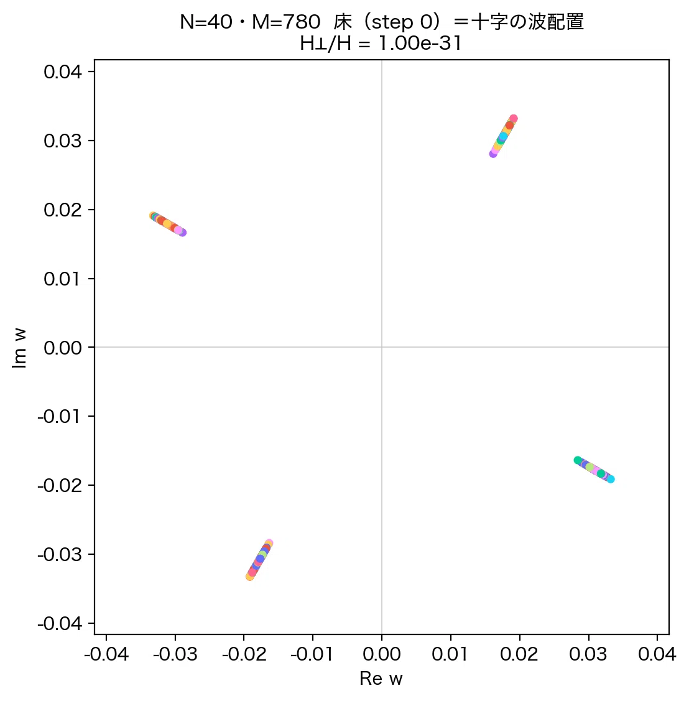
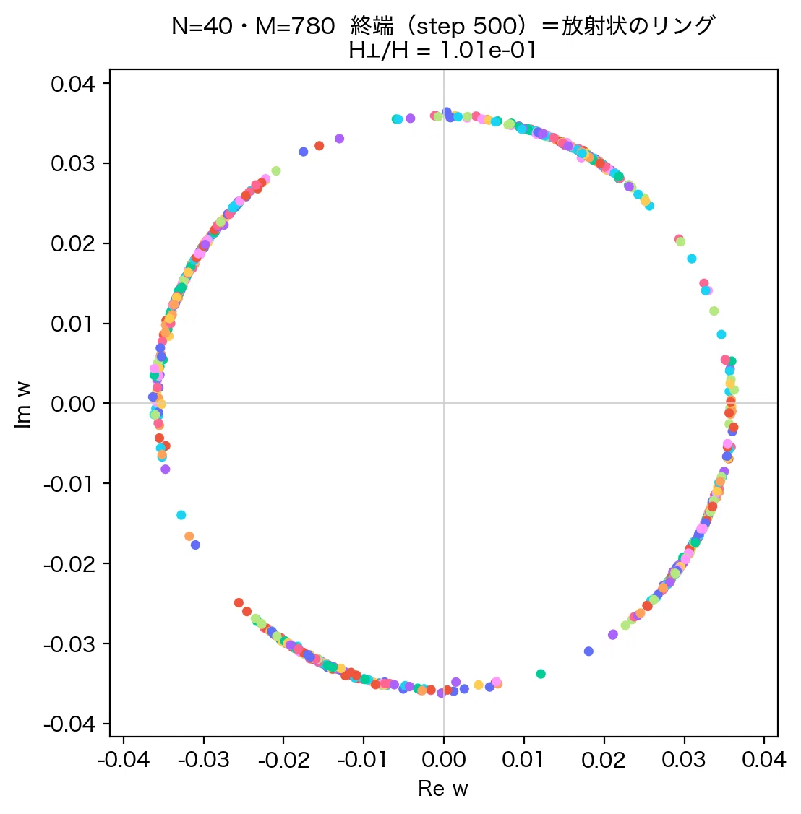
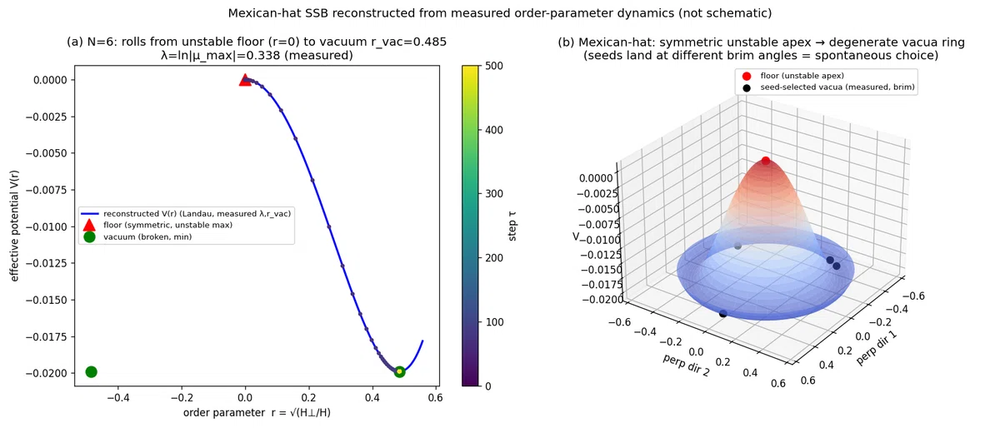
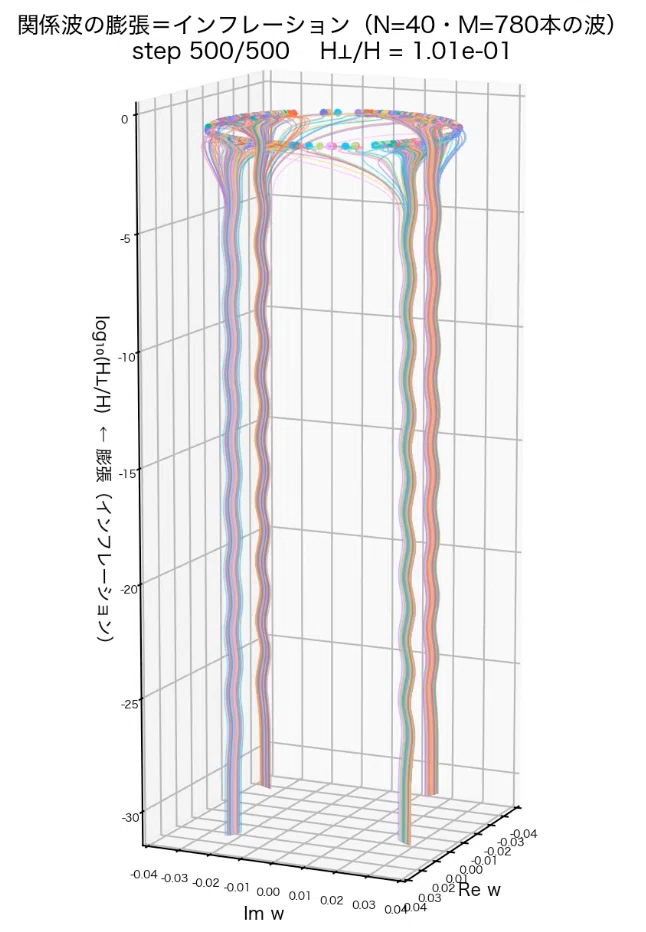
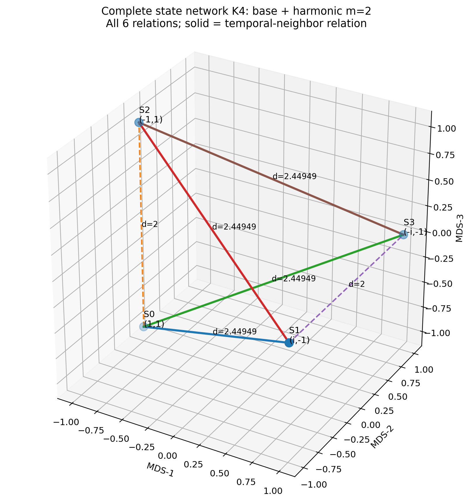
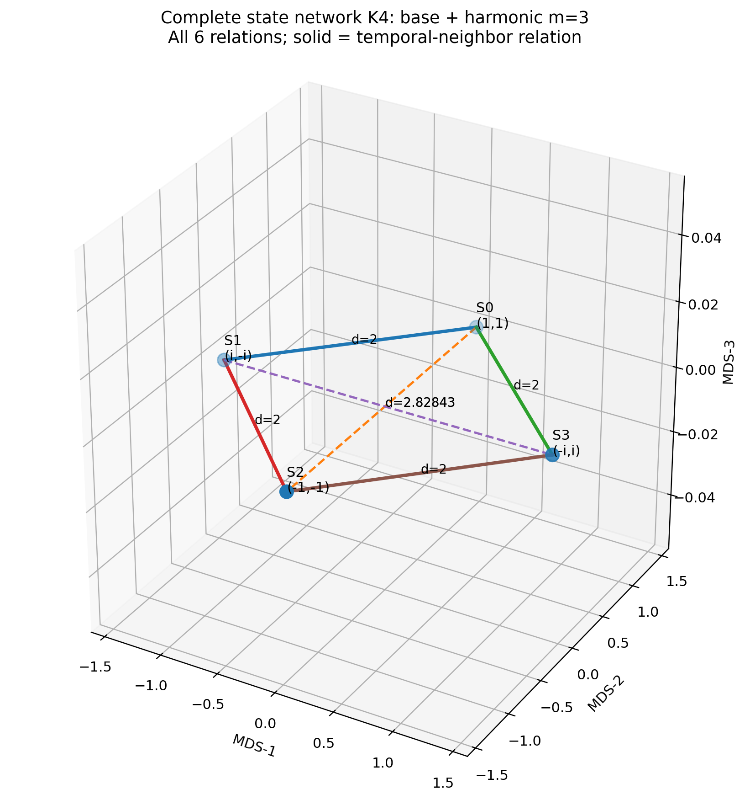

# 時間を外から進めない――インフレーション実験から生まれた「最小完全関係閉系」

公開: 2026-09-15　note: https://note.com/kiharanoriaki/n/n6f3dfc53df36

「時間発展を頂点化した有限完全関係閉系―― U^K=I による N=1, K=4 最小厳密閉系と偶奇倍音の完全ネットワーク解析」
を公開しました。

この論文は、以前に行った「自己無撞着な関係波閉鎖系におけるインフレーション的急拡大」の数値実験から、そのまま続いて出てきた研究です。

前の研究では、多数の複素関係波を相互作用させると、90度系列の近くに集まった高対称な初期状態から、横方向成分が急激に増え、ほぼ等振幅で位相が広く分散した準安定状態へ移ることを観測しました。

今回は、その結果をさらに単純化して問い直しました。

そもそも「時間を進める」という操作を、外から与える必要があるのだろうか。

これが論文1の出発点です。

## まず、前のインフレーション実験で何が起きていたか

先行実験では、N個の頂点のすべての組に複素関係波を置きました。

関係数は

　M = N(N-1)/2

です。N=40 なら、780本の関係波があります。

初期状態では、それらの波は複素平面上の約90度ごとの4方向近傍に強く拘束され、十字架状の狭い帯を作っていました。

N=40、M=780 の初期状態。関係波は90度系列近傍の4方向へ集中している。

その状態を相互作用させると、短い区間で横方向成分が急増し、最終的には振幅がほぼ揃ったリング状の分布へ移ります。

step 500 の準安定状態。ほぼ同一半径のリングへ広がるが、初期90度系列の異方性は残っている

私はこの急激な遷移を「インフレーション的」と呼んでいます。

ここでいうインフレーションは、宇宙論的インフレーションと同一だと最初から仮定しているわけではありません。高対称な状態から、短い区間で秩序パラメータが大きく変化し、別の準安定状態へ移るという、数値実験で実際に観測した挙動を指しています。

その実測値から再構成した Mexican-hat 型の有効表示も作りました。

実測した秩序パラメータの発展から再構成した Mexican-hat 型の有効表示。ポテンシャルを先に仮定した図ではない。

さらに、多数の関係波が初期状態から準安定状態へ移る様子を3次元で表示したものが次の図です。

N=40 の関係波が高対称な拘束状態から展開していく3D表示。

## ここで、ひとつ気になることが出てきた

この実験では、状態を

　state at τ → state at τ + Δτ

という順番で更新していました。更新刻みは

　Δτ = 2π/N

です。数値実験としては普通の書き方です。

しかし、私の系では「すべての状態や関係に、最初から名前や特別な役割を与えない」という無名性を重視しています。

そうすると、疑問が出ます。

なぜ τ だけが、頂点でも関係でもなく、外部から全体を進める特別な変数なのか。

さらに、「ある瞬間にN個の頂点がある」と先に決めること自体も、本当に基本的な構造なのか分かりません。

そこで、発想を逆にしました。

時間を外から進めるのではなく、
異なる位相状態そのものを、全部ふつうの頂点として置いてしまう。
過去・現在・未来らしきものを最初から区別しない。

状態がK個あり、各状態にN個の対象があるなら、全体を

　P = KN

個の頂点として扱います。そして、その全頂点対を完全に関係化します。関係数は

　M_P = KN(KN-1)/2

です。

ここには「kは時間である」という仮定は入っていません。単に、K個の異なる位相状態を、ほかの状態と同じ種類の頂点として扱っているだけです。

## 巨大な系を近似するのではなく、最小の厳密系を全部解く

この考えをそのまま巨大系へ持っていくと、関係数はすぐに膨大になります。

そこで今回の論文では、巨大系を粗く近似する方法を取りませんでした。

逆です。

同じ閉路公理と完全関係構造を一切壊さず、最小サイズまで縮めて、全状態・全関係を完全に解く。

先行インフレーション実験では、初期状態に90度系列の4方向構造が明瞭に現れていました。そこで最小閉路として

　N = 1
　K = 4

を採用しました。

N=1 でも、4つの位相状態をすべて頂点にすれば、全体は4頂点6関係の完全グラフ K4 になります。

位相生成子は

　U = exp(2πi/4) = i

で、

　U^4 = 1

です。

今回比較した状態は

　S_k = (U^k, U^(mk))

です。m=2 を最小の非自明な偶数倍音、m=3 を最小の非自明な奇数倍音として比較しました。

## 同じK4なのに、偶数倍音と奇数倍音で中身が違う

外側のグラフ構造は、どちらも同じ4頂点6辺の K4 です。

ところが内部の巡回構造は違います。

m=2 では

　ord(U^2) = 2

となり、倍音成分だけが2周期へ縮退します。

一方、m=3 では

　ord(U^3) = 4

で、基底波と倍音の両方が4状態を維持します。

それでも二成分を合わせた状態全体は、m=2 も m=3 も4状態で閉じます。

ここが最初の重要な結果です。

m=2 偶数倍音のK4完全ネットワーク。外側の組合せ構造は4頂点6関係で完全に閉じている。

m=3 奇数倍音のK4完全ネットワーク。同じK4でも内部の位相・距離・二乗閉塞構造はm=2と異なる。

## さらに、二乗和で決定的な違いが出た

4状態全体にわたって、二つの波成分の二乗を足します。

　Q_loop(m) = Σ[(U^k)^2 + (U^(mk))^2]
　k = 0,1,2,3

とすると、K=4 では厳密に

　m が偶数 → Q_loop = 4
　m が奇数 → Q_loop = 0

となります。

つまり最小比較では、

m=2 は二乗ゼロ閉塞しない。
m=3 は二乗ゼロ閉塞する。

これは数値近似ではありません。有限巡回群上の幾何級数からそのまま導けます。

さらに一般のKについては

　Q_loop(m;K) = K × 1[K divides 2] + K × 1[K divides 2m]

となります。

したがって、K=4 で見えた「偶数／奇数」の差は、もっと一般には整除条件として理解できます。

ここは今回の論文で、かなり重要な点だと思っています。

## 動画にすると、何を計算しているかが分かりやすい

今回の系は「連続的に波が流れている図」を見せたいのではありません。

固定された完全ネットワーク上で、有限個の離散位相状態が巡回します。

そのため、m=2 と m=3 について forward / reverse の MP4 を作りました。

（動画: [m=2 forward](K4_harmonic_discrete_phase_m2_20260915.mp4)）
m=2 forward。倍音成分は2状態へ縮退するが、二波状態全体は4状態で閉じる。

（動画: [m=3 forward](K4_harmonic_discrete_phase_m3_20260915.mp4)）
m=3 forward。基底波・倍音ともに4状態を維持し、4状態全体では二乗ゼロ閉塞する。

逆順に読んでも同じ有限状態集合へ戻ることを確認する reverse 版もあります。

これは「物理的な時間反転対称性を証明した」という意味ではありません。固定された有限閉路を逆向きに読んでも、同じ状態集合を巡回できることを可視化したものです。

## この論文で、あえて主張していないこと

今回、数学的に示した部分と、物理的な解釈候補を意図的に分けました。

数学的に確定しているのは、

・K4 の完全関係構造
・U^4=1 による有限巡回
・偶数倍音と奇数倍音の位数差
・状態空間距離の違い
・二乗和の閉塞条件
・一般Kに対する整除条件

です。

一方、まだ仮説として残しているのは、

・N=1 を「光子1個」と読むこと
・k を物理的な過去・現在・未来と読むこと
・状態空間距離を実空間や時空の距離と読むこと

です。

ここは意識的に分けています。物理解釈が将来変わっても、有限完全関係系としての数学的結果はそのまま残るようにしました。

## 私が今回いちばん重要だと思っている点

前のインフレーション実験では、状態を外から順番に更新していました。

今回の論文では、その外部更新をいったん外して、異なる状態そのものを全部頂点として置きました。

つまり、

「状態を時間発展させる」

から、

「全状態の関係の中から、順序や時間らしきものを読み出せないか」

へ、問題の立て方を変えています。

今回のK4は、そのための最小厳密閉系です。巨大な宇宙を4頂点で近似した模型ではありません。同じ完全関係と閉路条件を保ったまま、全状態・全関係を一つも落とさず解析できる最小サイズまで縮めた系です。

そして、この最小系だけでも、偶数倍音と奇数倍音で位数・距離幾何・二乗閉塞がはっきり分かれました。

次の課題は、順序ラベル k を外しても、完全関係だけから巡回順序そのものを再構成できるかどうかです。

もしそれが可能なら、外から「時間」を与える記述から、関係性の中から時間順序を読む記述へ進める可能性があります。

## 論文・PDF

論文タイトル:
時間発展を頂点化した有限完全関係閉系―― U^K=I による N=1, K=4 最小厳密閉系と偶奇倍音の完全ネットワーク解析

著者: 木原範昭
ORCID: 0009-0004-6753-4020

Version DOI:
https://doi.org/10.5281/zenodo.22763330

Concept DOI:
https://doi.org/10.5281/zenodo.22763329

Zenodo 公開ページ:
https://zenodo.org/records/22763330

先行研究:
自己無撞着な関係波閉鎖系におけるインフレーション的急拡大の機構
Version DOI: https://doi.org/10.5281/zenodo.22176949
Concept DOI: https://doi.org/10.5281/zenodo.22112008

#理論物理 #量子力学 #宇宙論 #時間 #複素数 #離散幾何 #グラフ理論 #完全グラフ #倍音 #自己無撞着性 #インフレーション #数値実験 #物理学 #研究ノート
