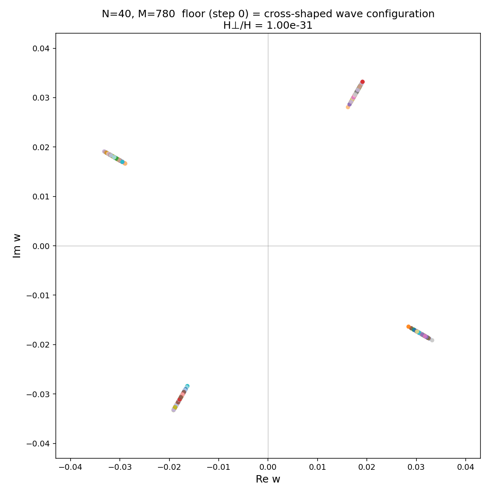
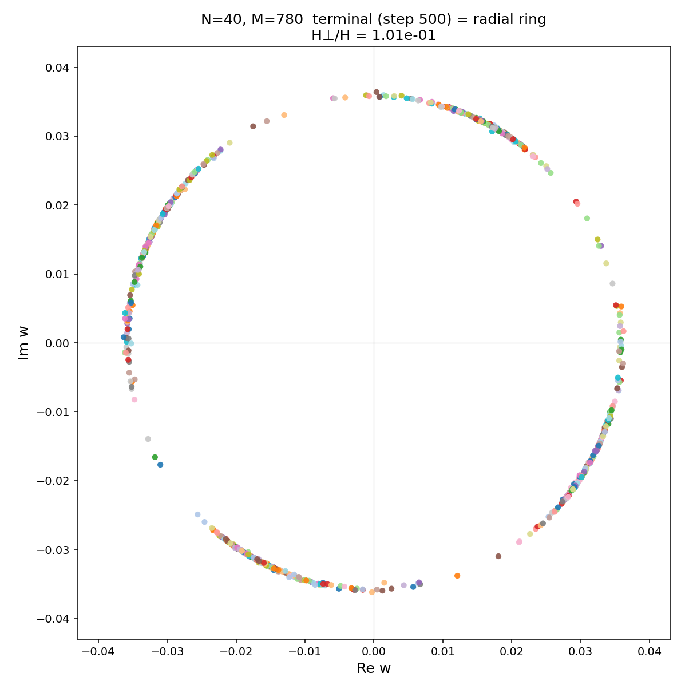
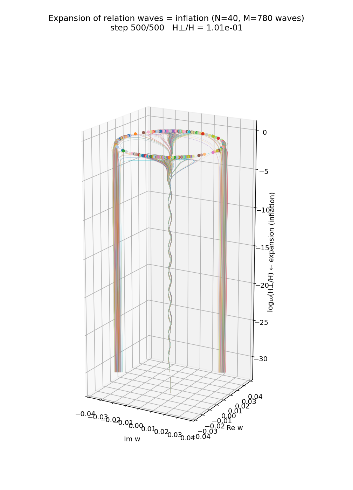

# A Finite Complete-Relation Closed System with Time Evolution as Vertices
## — Exact Minimal Closure at $N=1, K=4$ under $U^K=I$ and Complete-Network Analysis of Even and Odd Harmonics

**Author:** Noriaki Kihara (WF System Co., Ltd.)  
**ORCID:** 0009-0004-6753-4020  
**Date:** 2026-09-15  
**Version:** v1.2 English edition (post-review revision)  
**Version DOI:** [10.5281/zenodo.22763330](https://doi.org/10.5281/zenodo.22763330)  
**Concept DOI:** [10.5281/zenodo.22763329](https://doi.org/10.5281/zenodo.22763329)  

---

## Abstract

The aim of this study is to analyze a minimal exactly closed system in which time evolution is not given as an external distinguished parameter: states at different phase instants are treated as ordinary state vertices, without distinction, and all their relations are closed into a complete network. The starting point is the numerical experiment on a self-consistent closed system of relational waves in the preceding study [K1]. There, $N$ vertices and $M=N(N-1)/2$ relational waves were placed at a nominal instant, and the interaction was iterated with respect to a discrete update variable $\tau$ with $\Delta\tau=2\pi/N$. For highly symmetric initial states, the relational waves were observed to concentrate in narrow bands near the 90-degree series in the complex plane — a cross-shaped configuration — and then, after a rapid growth of the transverse component, to transition to a quasi-stable ring of nearly equal amplitudes with widely dispersed phases. However, this description singles out $\tau$ as a special update direction distinguished from the other state variables, and presupposes "$N$ vertices at a given instant"; both points leave a possible violation of the anonymity principle.

In this paper, when each nominal instant carries $N$ states and the phase closure carries $K$ phase states, we treat all states without distinction as $P=KN$ vertices, and take the total number of relations to be $M_P=P(P-1)/2=KN(KN-1)/2$. The phase cycle is closed by $U^K=I$. In this construction, even for $N=1$, as long as $K\ge 3$, multiple relations and cycles can be defined among the distinct phase states of a single object. This paper completely analyzes the minimal nontrivial exactly closed case $N=1, K=4$. Here $U=\exp(2\pi i/4)=i$ is taken as the primitive 4-th root, and the states are defined by $S_k=(U^k,U^{mk})$. We compare $m=2$, the minimal nontrivial even harmonic, with $m=3$, the minimal nontrivial odd harmonic.

The results are stated in three strictly separated layers. First, the existence of the complete graph $K_4$, the state cycle, the orders, and the squared sums of the two wave components are mathematically exact and require no physical identification. Second, when the Euclidean distance $d_{ij}$ on $\mathbb C^2$ is **defined as an analytical readout**, the distance multisets of the 6 edges differ between $m=2$ and $m=3$. This is exact once defined, but identifying $d_{ij}$ with real spatial distance is not a claim of this paper. Third, identifying the $N=1$ system with "one photon", reading the cycle of $k$ as physical past, present, and future, and reading the network distance as physical length are all **physical hypotheses** to be tested in the future; they are not preconditions for the complete-network analysis of this paper.

For $K=4$, the minimal order of the harmonic component degenerates to 2 when $m=2$, while both the base wave and the harmonic retain minimal order 4 when $m=3$. Furthermore, defining the total squared sum of the two wave components over the 4 states as

$$
Q_{\mathrm{loop}}(m)
=
\sum_{k=0}^{3}\left[(U^k)^2+(U^{mk})^2\right]
$$

we obtain exactly

$$
Q_{\mathrm{loop}}(m)
=
\begin{cases}
4,&m\ \mathrm{even},\\
0,&m\ \mathrm{odd}
\end{cases}
$$

Thus, in the minimal comparison, $m=2$ does not close to squared-sum zero, whereas $m=3$ closes to squared-sum zero exactly. This paper derives this difference completely — not as a numerical approximation but as geometric series over a finite cyclic group — and includes all states, all 6 relations, all visualizations, dynamic HTML, MP4, CSV, and reproduction programs in the same folder.

**Keywords:** complete graph, discrete phase, finite cyclic group, $U^K=I$, relational waves, time as vertices, zero square-sum closure, harmonics, anonymity, self-consistency

---

# 1. Fixing the Scope of Claims First

This paper deliberately separates physical identification from mathematical network analysis. This is not a stylistic caution; it is the logical structure of the paper itself.

| Layer | Content | Status in this paper |
|---|---|---|
| A | Treating $P=KN$ vertices with all relations, the 6 relations of $K_4$, $U^K=I$, the state cycle, orders, squared sums of the two wave components | **Exact mathematical/algebraic claims** |
| B | Numerical edge lengths of the 6 edges via the Euclidean distance $d_{ij}$ on $\mathbb C^2$ | **Explicitly defined analytical readout**. Exact once defined, but not physical distance |
| C | 3-dimensional configuration via MDS | **Visualization of the distance matrix**. No physical meaning is assigned to the coordinate values themselves |
| D | Regarding $N=1$ as one photon, and the base wave plus one harmonic as its minimal state | **Physical hypothesis** |
| E | Reading the phase state $k$ as physical past/present/future, and reading network distance as spacetime distance | **Physical readout hypotheses to be tested in the future** |

Therefore, even if D or E is refuted in the future, the complete-network analysis of layer A and the results on the finite cyclic group are unaffected. Likewise, even if the distance readout of layer B turns out to be unusable as physical length, the complete relational structure of $K_4$, the orders, and the squared-sum results remain.

---

# 2. Motivation: What Was Observed in the Preceding Inflation System

## 2.1 Basic construction of the preceding system

In the preceding study [K1], $N$ vertices were nominally placed "at an instant", and a complex relational wave was assigned to every vertex pair of the complete graph. The number of relations is

$$
M
=
\binom{N}{2}
=
\frac{N(N-1)}{2}
$$

For example, with $N=40$,

$$
M
=
\frac{40\times39}{2}
=
780
$$

relational waves exist.

In the preceding experiments, when these relational waves are observed in the complex plane, highly symmetric initial states concentrate near the 90-degree series and form a cross-shaped set of narrow bands. Because this is easily misunderstood from text alone, we reproduce the measured figure for $N=40$ as is.

### Figure 1: Initial state at $N=40, M=780$: cross-shaped bands near the 90-degree series

In Figure 1, the relational waves are not placed uniformly on a phase circle; they are strongly constrained near four directions about 90 degrees apart, each forming a band with a small amplitude width. Thus the statement "the initial state is cross-shaped" is not a schematic metaphor but an observation obtained by directly plotting the set of $N=40, M=780$ relational waves in the complex plane.

## 2.2 Quasi-stable ring after iteration

In the preceding system, iterating the interaction causes a rapid growth of the transverse component, after which the amplitudes become nearly uniform and the phase constraint largely dissolves. The terminal distribution is, however, not a perfectly equiangular configuration; it retains an anisotropy corresponding to the original 90-degree series.

### Figure 2: Terminal state at $N=40, M=780$: radial ring

Figure 2 is a terminal example at step 500. The distribution has transitioned from the initial four narrow bands to a ring of nearly equal radius, but the angular density is not perfectly uniform. This paper takes this phenomenon as the starting problem: can the totality of state relations, including the time direction, be described from the outset as a single closed network?

## 2.3 What "inflation-like" means in this paper

When this paper uses the words "inflation" or "inflation-like", it **does not presuppose identity with cosmological inflation**. It refers to the observed behavior in the preceding relational-wave system in which, over a short interval starting from a small transverse component, the transverse order parameter grows rapidly and the system moves from a symmetric unstable state to a degenerate quasi-stable state.

To make the meaning of this terminology clear, we reproduce two figures from the preceding experiment.

### Figure 3: Mexican-hat SSB figure reconstructed from measured order-parameter dynamics

This figure was not drawn by assuming a schematic potential in advance. It is an auxiliary visualization reconstructed by mapping the evolution of the measured order parameter

$$
r=\sqrt{H_\perp/H}
$$

onto a Landau-type effective potential

$$
V(r)
=
-\frac12\lambda_0 r^2
+
\frac{\lambda_0}{4r_{\mathrm{vac}}^2}r^4
$$

with coefficients set from measured values as

$$
\lambda_0=\ln\rho_0,
\qquad
r_{\mathrm{vac}}
=
\sqrt{(H_\perp/H)_{\mathrm{sat}}}
$$

Here $H=\langle z,z\rangle=\sum_e|z_e|^2$ is the total squared norm of the relational-wave state, and $H_\perp=\|\Pi_\perp z\|^2$ is the squared norm of the component in the orthogonal complement of the initial floor plane $\Pi_0$. Thus $H_\perp/H$ is a dimensionless readout quantity representing the relative departure from the initial floor plane. Further, $J_0$ is the Jacobian in the co-rotating coordinates that fix the initial relative equilibrium, $\rho_0=\rho(J_0)$ is its spectral radius, and $(H_\perp/H)_{\mathrm{sat}}$ is the saturation value of $H_\perp/H$ measured in the terminal quasi-stable phase.

Therefore this $V(r)$ is an **effective description (ansatz) whose coefficients are identified from measured quantities**; the potential shape itself is not derived from first principles in this paper. Nor is this effective potential a precondition of the $K_4$ complete-network analysis. What matters here is to show visually the preceding observation of the transition from the central high-symmetry state to the terminal ring-shaped quasi-stable set. This paper introduces no new dynamical law from this figure.

### Figure 4: 3D evolution display of the $N=40$ relational waves

Figure 4 is an example displaying, in three dimensions, the trajectories of many relational waves from the initial highly symmetric constrained state to the terminal ring. This, too, is not an input to the $K_4$ analysis of this paper. It is used **only as the preceding observation that motivated this paper**.

---

# 3. Anonymity Concerns Remaining in the Preceding System

By **anonymity** this paper means assigning to none of the states and variables constituting the system any a priori kind (for example, "spatial vertex" versus "time label") or any external role (for example, a special variable that provides the order in which the other states are updated). Accordingly, an "anonymity concern" in this paper means a structural check of whether some variable or vertex set is being treated specially from outside the computational procedure.

## 3.1 Special treatment of the external update variable $\tau$

In the preceding experiments, the interaction was iterated along a discrete update variable $\tau$, typically with

$$
\Delta\tau
=
\frac{2\pi}{N}
$$

Here, this paper does not assume that $\tau$ is identified with physical time. Even so, as long as the computational procedure updates one way,

$$
\text{state at }\tau
\longrightarrow
\text{state at }\tau+\Delta\tau
$$

$\tau$ alone is treated specially as "the external order used to update the other variables".

If anonymity is to be enforced thoroughly, the question remains:

$$
\boxed{
\text{why must }\tau\text{ alone be an external label — neither a vertex nor a relation?}
}
$$

## 3.2 The assumption of "$N$ vertices at an instant"

Similarly, when we posit

$$
N\text{ vertices}
\quad\Longrightarrow\quad
M=\frac{N(N-1)}{2}\text{ relations}
$$

we classify the $N$ vertices in advance as "existing at the same instant". Seen from a higher-level anonymous relational system, this classification may also be artificial.

Therefore, in this paper, "vertices arranged in space" and "states arranged along the time direction" are not treated as different kinds from the outset.

---

# 4. Turning Time-Direction States into Vertices

## 4.1 Total number of vertices $P=KN$

Nominally, suppose one phase section carries $N$ states, and the closed phase sequence carries $K$ state labels.

Conventionally, one treats

$$
\{1,2,\ldots,N\}
$$

as "vertices" and

$$
\{0,1,\ldots,K-1\}
$$

separately as "time or update labels".

This paper removes this distinction and counts the pairs

$$
(k,a),
\qquad
k\in\{0,1,\ldots,K-1\},
\qquad
a\in\{1,2,\ldots,N\}
$$

all as vertices of the same kind.

Therefore the total number of vertices is

$$
P
=
K\times N
=
KN
$$

No assumption "$k$ is physical time" enters here. $k$ is a state label on a finite closed cycle; whether it is later read as physical time is a separate question.

## 4.2 Derivation of the total number of relations

Keeping every distinct pair of the $P$ vertices as a relation, the number of edges of the complete graph $K_P$ is

$$
M_P
=
\binom{P}{2}
$$

From the definition of the binomial coefficient,

$$
\binom{P}{2}
=
\frac{P!}{2!(P-2)!}
$$

and since

$$
P!
=
P(P-1)(P-2)!
$$

we have

$$
\binom{P}{2}
=
\frac{P(P-1)(P-2)!}{2(P-2)!}
=
\frac{P(P-1)}{2}.
$$

Substituting $P=KN$,

$$
\boxed{
M_P
=
\frac{KN(KN-1)}{2}
}
$$

This formula assumes no physical meaning of time. It is the combinatorial count obtained when "$N$ objects with $K$ distinct state layers" are completely related as $KN$ vertices without distinction.

## 4.3 Why we do not directly compute huge systems

Conventional numerical experiments reach at most $N\sim40$. Decomposed as $KN$, even $N=6, K=7$ already gives a comparable number of vertices.

On the other hand, if one considers $N\sim10^{60}$ as a rough physical state count and also $K\sim10^{60}$ in the phase direction, then

$$
P=KN\sim10^{120}
$$

and the number of complete relations is

$$
M_P
=
\frac{P(P-1)}{2}
\sim
\frac{10^{240}}{2}
$$

that is, of order $10^{240}$. These numbers are not experimental values of this paper; they are order estimates showing that direct enumeration of huge systems is impossible in principle.

Therefore the strategy of this paper is not to coarsely approximate a huge system, but to

$$
\boxed{
\text{solve completely the minimal exactly closed system, keeping the same closure axiom and complete relational structure}
}
$$

---

# 5. Why Can We Go Down to $N=1$?

## 5.1 Looking only at a single section

Considering the ordinary complete graph alone:

### $N=1$

$$
M
=
\frac{1(1-1)}{2}
=0.
$$

There is no relation.

### $N=2$

$$
M
=
\frac{2(2-1)}{2}
=1.
$$

There is only one relation, so relations cannot be compared with each other.

### $N=3$

$$
M
=
\frac{3(3-1)}{2}
=3.
$$

For the first time, three relations

$$
r_{12},\quad r_{23},\quad r_{31}
$$

can be mutually compared, and the cycle

$$
1\to2\to3\to1
$$

can be defined.

Therefore, counting only "vertices at the same nominal instant", $N=3$ is the minimal nontrivial cycle.

## 5.2 With state-direction vertices, a cycle exists already at $N=1, K\ge3$

However, if the $K$ states in the state direction are all vertices, then even for $N=1$ the total number of vertices is

$$
P=K.
$$

The number of relations is then

$$
M_P
=
\frac{K(K-1)}{2}.
$$

For $K=3$,

$$
M_P
=
3,
$$

for $K=4$,

$$
M_P
=
6.
$$

That is, even a single object, if its distinct phase states are treated as equal vertices, carries multiple relations among its own distinct states and can form a cycle.

The initial state of the preceding system was constrained, as shown in Figure 1, to four directional bands about 90 degrees apart in the complex plane. As the minimal phase cycle corresponding to this **observed four-direction structure**, we adopt

$$
\boxed{N=1,\quad K=4}
$$

On top of this, we compare the minimal nontrivial even harmonic $m=2$ and odd harmonic $m=3$. Thus "$K=4$ because of 90 degrees" is not placed circularly from the definition alone; it is a comparison setting that maps the four-direction structure observed in the preceding experiment into the minimal exactly closed system of this paper.

This is not a coarse approximation of a huge system. It is a **finite complete-relation closed system that keeps all 4 vertices and all 6 relations without omitting a single one**.

---

# 6. Physical Correspondences Are Kept Separate as Hypotheses

## 6.1 "One photon" is not a precondition of the mathematical analysis

As a physical candidate for $N=1$, this paper envisions "one photon". However, this identification is unnecessary for the complete-network analysis to hold.

We therefore clearly distinguish:

$$
\boxed{
\text{analyzing the }N=1\text{ finite closed system}
}
$$

is the mathematical setting of this paper, whereas

$$
\boxed{\text{reading that }N=1\text{ as one photon}}
$$

is a physical hypothesis.

## 6.2 Motivation: a single complex wave is insufficient for localization readout

Let a single complex wave be

$$
z
=
a+ib
$$

In polar form,

$$
z
=
A e^{i\theta}
$$

If, as a single monochromatic wave, $A$ is constant, its phase exists over the entire closed cycle, and one wave alone carries little information for distinguishing a localized state position.

This paper therefore uses, as the minimal additional relation, "a base wave plus one integer harmonic":

$$
z_1(\theta)
=
e^{i\theta},
$$

$$
z_m(\theta)
=
e^{im\theta}.
$$

This two-wave system shares the same phase variable $\theta$. No independent second clock is introduced.

Moreover, in this paper the amplitudes are defined to be 1, and this is not a normalization operation performed at each step. That is,

$$
|z_1|=|z_m|=1
$$

is **the definition of the state family itself**; no operation readjusting the norm during time evolution is introduced.

---

# 7. Definition of the Finite Cycle: $U^K=I$

## 7.1 Choosing a primitive $K$-th root

The condition

$$
U^K=I
$$

alone does not guarantee that the minimal order of $U$ is $K$. For example, $U=1$ also satisfies $U^K=1$ but closes in one step.

Therefore, to obtain $K$ distinct base phases, this paper adopts the primitive $K$-th root

$$
U
=
\exp\left(\frac{2\pi i}{K}\right)
$$

Then

$$
U^K
=
\exp\left(\frac{2\pi i}{K}K\right)
=
\exp(2\pi i)
=
1.
$$

Also, for $0<q<K$, in general $U^q\ne1$, so the minimal order of the base generator is $K$.

## 7.2 In this paper, $K=4$

$$
U
=
\exp\left(\frac{2\pi i}{4}\right)
=
\exp\left(\frac{\pi i}{2}\right)
=i.
$$

Therefore

$$
U^0=1,
$$

$$
U^1=i,
$$

$$
U^2=-1,
$$

$$
U^3=-i,
$$

$$
U^4=1.
$$

The four discrete phase states are labeled

$$
k=0,1,2,3
$$

## 7.3 Definition of the two-wave states

For an integer harmonic $m$, define the state $S_k$ by

$$
\boxed{
S_k
=
\left(z_1(k),z_m(k)\right)
=
\left(U^k,U^{mk}\right)
}
$$

From this definition, the next state is

$$
S_{k+1}
=
\left(U^{k+1},U^{m(k+1)}\right).
$$

Using the law of exponents,

$$
U^{k+1}
=
U\,U^k,
$$

$$
U^{m(k+1)}
=
U^{mk+m}
=
U^m U^{mk}.
$$

Therefore

$$
\boxed{
S_{k+1}
=
\left(U z_1(k),U^m z_m(k)\right)
}
$$

Furthermore, after $K$ steps,

$$
S_{k+K}
=
\left(U^{k+K},U^{m(k+K)}\right).
$$

The first component is

$$
U^{k+K}
=
U^k U^K
=
U^k.
$$

The second component is

$$
U^{m(k+K)}
=
U^{mk}U^{mK}
=
U^{mk}(U^K)^m
=
U^{mk}.
$$

Hence

$$
\boxed{
S_{k+K}=S_k
}
$$

Here the fact that "all states form a cycle" is derived algebraically from the definition.

---

# 8. Minimal Comparison: Even Harmonic $m=2$ versus Odd Harmonic $m=3$

## 8.1 Even harmonic $m=2$

The definition is

$$
S_k
=
(U^k,U^{2k}).
$$

### $k=0$

$$
S_0
=
(U^0,U^0)
=
(1,1).
$$

### $k=1$

$$
S_1
=
(U,U^2)
=
(i,-1).
$$

### $k=2$

$$
S_2
=
(U^2,U^4)
=
(-1,1).
$$

### $k=3$

$$
S_3
=
(U^3,U^6).
$$

Here

$$
U^6
=
U^{4+2}
=
U^4U^2
=
1\times(-1)
=
-1
$$

so

$$
S_3
=
(-i,-1).
$$

Therefore

$$
\boxed{
(1,1)
\to
(i,-1)
\to
(-1,1)
\to
(-i,-1)
\to
(1,1)
}
$$

Looking at the harmonic component alone,

$$
1,-1,1,-1
$$

it has degenerated to 2 states instead of 4.

## 8.2 Odd harmonic $m=3$

The definition is

$$
S_k
=
(U^k,U^{3k}).
$$

### $k=0$

$$
S_0
=
(1,1).
$$

### $k=1$

$$
S_1
=
(U,U^3)
=
(i,-i).
$$

### $k=2$

$$
S_2
=
(U^2,U^6).
$$

From

$$
U^6
=
U^{4+2}
=
U^2
=
-1
$$

we get

$$
S_2
=
(-1,-1).
$$

### $k=3$

$$
S_3
=
(U^3,U^9).
$$

Since

$$
U^9
=
U^{8+1}
=
(U^4)^2U
=
i
$$

we have

$$
S_3
=
(-i,i).
$$

Therefore

$$
\boxed{
(1,1)
\to
(i,-i)
\to
(-1,-1)
\to
(-i,i)
\to
(1,1)
}
$$

In this case, the harmonic component also cycles through all four states:

$$
1,-i,-1,i
$$

---

# 9. Algebraic Self-Consistency as a Finite Closed System

To avoid confusing the term "self-consistent" with the full nonlinear-interaction fixed-point condition of the preceding inflation system, this paper restricts its meaning.

What is checked here is **algebraic consistency as a finite closed system**, namely:

1. As defined, $|z_1|=|z_m|=1$.
2. At every state, $z_m=z_1^m$ holds.
3. The transition rule $S_{k+1}=(Uz_1,U^m z_m)$ holds.
4. Forward and reverse give the same complex state for the same $k$.
5. After $K$ steps the system returns exactly to the initial state.

## 9.1 Amplitude condition

Since $U$ lies on the unit circle,

$$
|U|=1.
$$

Therefore, for any integer $q$,

$$
|U^q|
=
|U|^q
=
1.
$$

Hence

$$
|z_1(k)|
=
|U^k|
=
1,
$$

$$
|z_m(k)|
=
|U^{mk}|
=
1.
$$

## 9.2 Harmonic relation

The first component is

$$
z_1(k)=U^k.
$$

Its $m$-th power is

$$
[z_1(k)]^m
=
(U^k)^m
=
U^{mk}
=
z_m(k).
$$

Therefore

$$
\boxed{z_m=z_1^m}
$$

holds identically at every state.

## 9.3 Forward / reverse

Let forward be

$$
0\to1\to2\to3
$$

and reverse be

$$
0\to3\to2\to1
$$

Since the state $S_k$ is uniquely defined as a function of $k$, not of the ordering, forward and reverse give the same $S_k$ for the same $k$.

This is not a proof that "physical time is reversible". It is a check that **enumerating the same finite cycle in two directions produces no contradiction in the state definition**.

## 9.4 Cross-check against numerical data

In the raw data generated with exact-$i$, the maximum residual of the above algebraic conditions is 0 for both $m=2$ and $m=3$.

- [exact-$i$ complex state data](再現性検証_生データ読出し_20260915/raw_data/complex_states_animation_exact_i.csv)
- [static recomputation via $\exp(i\theta)$](再現性検証_生データ読出し_20260915/raw_data/complex_states_static_exp.csv)
- [per-state check CSV for self-consistency and squared sums](再現性検証_生データ読出し_20260915/自己無撞着性_二乗和_U4検証_20260915/K4_self_consistency_square_sum_by_state_20260915.csv)
- [summary CSV](再現性検証_生データ読出し_20260915/自己無撞着性_二乗和_U4検証_20260915/K4_self_consistency_square_sum_summary_20260915.csv)
- [analysis details](再現性検証_生データ読出し_20260915/自己無撞着性_二乗和_U4検証_20260915/K4_self_consistency_square_sum_analysis_20260915.md)

The maximum difference from floating-point $\exp(i\theta)$ generation is about $4.0\times10^{-16}$ for $m=2$ and about $5.5\times10^{-16}$ for $m=3$, in agreement with the exact-$i$ discrete states within rounding error.

---

# 10. The Complete Network $K_4$

## 10.1 Not a single one of the 6 relations is omitted

Since $K=4$, there are 4 vertices, and the number of edges of the complete graph is

$$
M
=
\frac{4(4-1)}{2}
=
6.
$$

All vertex pairs are

$$
(0,1),
(0,2),
(0,3),
(1,2),
(1,3),
(2,3)
$$

The important point is that the existence of the complete graph itself requires no definition of "length". The combinatorial structure of keeping all 6 relations comes first.

## 10.2 The distance on $\mathbb C^2$ is defined as an analytical readout

For states

$$
S_i=(U^i,U^{mi}),
$$

$$
S_j=(U^j,U^{mj})
$$

take the difference

$$
S_i-S_j
=
(U^i-U^j,\;U^{mi}-U^{mj})
$$

Defining, **as an analytical readout**, the standard Euclidean norm of this two-component complex vector,

$$
\boxed{
d_{ij}
=
\sqrt{
|U^i-U^j|^2
+
|U^{mi}-U^{mj}|^2
}
}
$$

This paper gives no grounds for identifying $d_{ij}$ with real spatial distance, spacetime interval, or interparticle distance. The distance geometry below is therefore **state-space geometry** based on the definition on $\mathbb C^2$.

## 10.3 Complete derivation of the distance formula

In general, for unit complex numbers $e^{i\alpha},e^{i\beta}$,

$$
|e^{i\alpha}-e^{i\beta}|^2
=
(e^{i\alpha}-e^{i\beta})(e^{-i\alpha}-e^{-i\beta}).
$$

Expanding,

$$
=
1-e^{i(\alpha-\beta)}-e^{-i(\alpha-\beta)}+1.
$$

By Euler's formula,

$$
e^{ix}+e^{-ix}=2\cos x
$$

so

$$
|e^{i\alpha}-e^{i\beta}|^2
=
2-2\cos(\alpha-\beta).
$$

Together with

$$
1-\cos x
=
2\sin^2\frac{x}{2}
$$

we get

$$
|e^{i\alpha}-e^{i\beta}|^2
=
4\sin^2\frac{\alpha-\beta}{2}.
$$

With $U=e^{2\pi i/4}$ and $\Delta=i-j$, the first component gives

$$
|U^i-U^j|^2
=
4\sin^2\left(\frac{\pi\Delta}{4}\right).
$$

The second component gives

$$
|U^{mi}-U^{mj}|^2
=
4\sin^2\left(\frac{\pi m\Delta}{4}\right).
$$

Therefore

$$
\boxed{
d_{ij}^2
=
4\sin^2\left(\frac{\pi\Delta}{4}\right)
+
4\sin^2\left(\frac{\pi m\Delta}{4}\right)
}
$$

## 10.4 All 6 edges for $m=2$

For $\Delta=1$,

$$
4\sin^2\frac{\pi}{4}=2,
$$

$$
4\sin^2\frac{2\pi}{4}
=
4\sin^2\frac{\pi}{2}
=4.
$$

Therefore

$$
d^2=2+4=6,
$$

$$
d=\sqrt6.
$$

For $\Delta=2$,

$$
4\sin^2\frac{2\pi}{4}
=4,
$$

$$
4\sin^2\frac{4\pi}{4}
=
4\sin^2\pi
=0.
$$

Therefore

$$
d^2=4,
$$

$$
d=2.
$$

$\Delta=3$ is symmetric to $\Delta=1$, so $d=\sqrt6$.

All 6 edges are as follows.

| Edge | $\min(\lvert\Delta\rvert,\,4-\lvert\Delta\rvert)$ | $d_{ij}$ |
|---|---:|---:|
| $(0,1)$ | 1 | $\sqrt6$ |
| $(0,2)$ | 2 | $2$ |
| $(0,3)$ | 1 | $\sqrt6$ |
| $(1,2)$ | 1 | $\sqrt6$ |
| $(1,3)$ | 2 | $2$ |
| $(2,3)$ | 1 | $\sqrt6$ |

Hence the distance multiset is

$$
\boxed{
\{2,2,\sqrt6,\sqrt6,\sqrt6,\sqrt6\}
}
$$

### Figure 5: Complete state network for $m=2$

[SVG version](K4_complete_network_m2.svg) / [edge data CSV](edges_m2.csv)

## 10.5 All 6 edges for $m=3$

For $\Delta=1$,

$$
4\sin^2\frac{\pi}{4}=2,
$$

$$
4\sin^2\frac{3\pi}{4}=2.
$$

Therefore

$$
d^2=4,
$$

$$
d=2.
$$

For $\Delta=2$,

$$
4\sin^2\frac{2\pi}{4}=4,
$$

$$
4\sin^2\frac{6\pi}{4}
=
4\sin^2\frac{3\pi}{2}
=4.
$$

Therefore

$$
d^2=8,
$$

$$
d=2\sqrt2.
$$

$\Delta=3$ is symmetric to $\Delta=1$, so $d=2$.

All 6 edges are as follows.

| Edge | $\min(\lvert\Delta\rvert,\,4-\lvert\Delta\rvert)$ | $d_{ij}$ |
|---|---:|---:|
| $(0,1)$ | 1 | $2$ |
| $(0,2)$ | 2 | $2\sqrt2$ |
| $(0,3)$ | 1 | $2$ |
| $(1,2)$ | 1 | $2$ |
| $(1,3)$ | 2 | $2\sqrt2$ |
| $(2,3)$ | 1 | $2$ |

Hence the distance multiset is

$$
\boxed{
\{2,2,2,2,2\sqrt2,2\sqrt2\}
}
$$

### Figure 6: Complete state network for $m=3$

[SVG version](K4_complete_network_m3.svg) / [edge data CSV](edges_m3.csv) / [combined $m=2,3$ edge data](all_edges_m2_m3.csv)

## 10.6 What the MDS display means — and what it does not claim

The 3-dimensional coordinates in Figures 5 and 6 are display coordinates reconstructed by classical MDS from the distance matrix of the 6 values $d_{ij}$.

Therefore it is essential that

$$
\boxed{
\text{the MDS-1, MDS-2, MDS-3 axes of the figures are not identified with physical }x,y,z
}
$$

What this paper claims to be meaningful is not the 3D coordinates themselves but the fact that **for the defined $\mathbb C^2$ distance, the distance multisets of the 6 edges differ between $m=2$ and $m=3$**.

---

# 11. Waveform Displays: Continuous Curves Are Readout Figures; the States Themselves Are Discrete

The state network consists of only the 4 points

$$
k=0,1,2,3
$$

On the other hand, to understand the waveforms visually, the same base and harmonic can be drawn on the continuous phase variable $\theta$ as

$$
\psi_1(\theta)=\cos\theta,
$$

$$
\psi_m(\theta)=\cos(m\theta)
$$

Drawing continuous curves here is not a new assumption that the actual state transitions are continuous. The discrete states of this paper remain the 4 states sampled at

$$
\theta_k
=
\frac{2\pi k}{4}
=
\frac{k\pi}{2}
$$

### Figure 7: Base wave and even harmonic $m=2$

[SVG version](waves_base_harmonic_m2.svg)

### Figure 8: Base wave and odd harmonic $m=3$

[SVG version](waves_base_harmonic_m3.svg)

The composite wave is

$$
\psi_{\mathrm{sum}}(\theta)
=
\cos\theta+\cos(m\theta)
$$

### Figure 9: Composite wave $m=2$

[SVG version](composite_wave_m2.svg)

### Figure 10: Composite wave $m=3$

[SVG version](composite_wave_m3.svg)

These waveform figures, too, are readout displays separate from the state network. The construction of the complete network can be defined without using the waveform figures.

---

# 12. Complex-Vector Displays

At each state $k$, the two complex numbers

$$
z_1=U^k,
$$

$$
z_m=U^{mk}
$$

can be displayed as vectors on the unit circle.

### Figure 11: $m=2$: the two complex vectors at all 4 states

[SVG version](complex_vectors_all_states_m2.svg)

### Figure 12: $m=3$: the two complex vectors at all 4 states

[SVG version](complex_vectors_all_states_m3.svg)

For $m=2$, the harmonic vector degenerates to the two directions $+1,-1$, whereas for $m=3$ it cycles through four directions — this is directly visible.

Although not the discrete states themselves, figures confirming the relative orientation of the two waves at the representative continuous-phase position $\theta=\pi/4$ are also kept.

### Figure 13: Representative complex vectors at $m=2,\ \theta=\pi/4$

[SVG version](complex_vectors_theta_pi4_m2.svg)

### Figure 14: Representative complex vectors at $m=3,\ \theta=\pi/4$

[SVG version](complex_vectors_theta_pi4_m3.svg)

Figures 13 and 14 are not the discrete $k$ states themselves; they are auxiliary figures on the continuous-phase display. This distinction is maintained.

---

# 13. Complete Expansion of the Squared Sum

## 13.1 What is being squared and summed

The squared sum in this section is not the squared sum of the 6 network edge lengths $d_{ij}$.

For the two wave components constituting each vertex state $S_k$,

$$
z_1(k),
\qquad
z_m(k)
$$

first define, per state,

$$
Q_k
=
[z_1(k)]^2+[z_m(k)]^2
$$

and then compute, over all 4 states,

$$
Q_{\mathrm{loop}}
=
\sum_{k=0}^{3}Q_k
$$

This is therefore **the total squared sum of the two-component complex states attached to the 4 vertices**.

Note that the conjugated norm sum at each state is

$$
|z_1(k)|^2+|z_m(k)|^2=1+1=2
$$

so over the 4 states

$$
\sum_{k=0}^{3}\left(|z_1(k)|^2+|z_m(k)|^2\right)=8
$$

which is constant regardless of $m$ and hence carries no discriminating power for this comparison. In contrast, the squared sum without conjugation reduces to

$$
Q_{\mathrm{loop}}(m)
=
\sum_k U^{2k}+\sum_k U^{2mk}
$$

a **finite geometric series in doubled phase**. Its value can therefore vary with the divisibility structure of the harmonic index $m$ and the cycle length $K$. This is why this paper examines $Q_{\mathrm{loop}}$; it is not because probabilities or norms are being identified with $\sum z^2$.

## 13.2 Expansion into real and imaginary parts

Write a general complex number as

$$
z_j
=
a_j+i b_j
$$

Squaring,

$$
z_j^2
=
(a_j+i b_j)^2.
$$

Expanding the product,

$$
(a_j+i b_j)^2
=
a_j^2+2i a_j b_j+(i b_j)^2.
$$

From $i^2=-1$,

$$
(i b_j)^2
=
i^2 b_j^2
=
-b_j^2.
$$

Therefore

$$
\boxed{
z_j^2
=
a_j^2-b_j^2+2i a_j b_j
}
$$

Summing over components,

$$
\sum_j z_j^2
=
\sum_j(a_j^2-b_j^2+2i a_jb_j).
$$

By linearity of the sum,

$$
\boxed{
\sum_j z_j^2
=
\sum_j a_j^2
-
\sum_j b_j^2
+
2i\sum_j a_jb_j
}
$$

Therefore, the real conditions for

$$
\sum_j z_j^2=0
$$

are

$$
\sum_j a_j^2
=
\sum_j b_j^2
$$

and

$$
\sum_j a_jb_j
=
0
$$

## 13.3 State-by-state computation for $m=2$

### $k=0$

$$
S_0=(1,1).
$$

Therefore

$$
Q_0
=
1^2+1^2
=
2.
$$

### $k=1$

$$
S_1=(i,-1).
$$

From

$$
i^2=-1,
$$

$$
(-1)^2=1
$$

we get

$$
Q_1
=
-1+1
=
0.
$$

### $k=2$

$$
S_2=(-1,1).
$$

$$
Q_2
=
(-1)^2+1^2
=
1+1
=
2.
$$

### $k=3$

$$
S_3=(-i,-1).
$$

Since

$$
(-i)^2
=
(-1)^2i^2
=
-1,
$$

$$
(-1)^2=1
$$

we get

$$
Q_3
=
-1+1
=
0.
$$

Hence

$$
\boxed{
(Q_0,Q_1,Q_2,Q_3)
=
(2,0,2,0)
}
$$

and

$$
Q_{\mathrm{loop}}(2)
=
2+0+2+0
=
\boxed{4}.
$$

## 13.4 State-by-state computation for $m=3$

### $k=0$

$$
S_0=(1,1)
$$

so

$$
Q_0=2.
$$

### $k=1$

$$
S_1=(i,-i).
$$

From

$$
i^2=-1,
$$

$$
(-i)^2=-1
$$

we get

$$
Q_1
=
-1-1
=
-2.
$$

### $k=2$

$$
S_2=(-1,-1)
$$

so

$$
Q_2
=
1+1
=
2.
$$

### $k=3$

$$
S_3=(-i,i).
$$

$$
Q_3
=
(-i)^2+i^2
=
-1-1
=
-2.
$$

Hence

$$
\boxed{
(Q_0,Q_1,Q_2,Q_3)
=
(2,-2,2,-2)
}
$$

and

$$
Q_{\mathrm{loop}}(3)
=
2-2+2-2
=
\boxed{0}.
$$

## 13.5 Aggregation of the squared real and imaginary components

Collecting all 4 states and both components: for $m=2$,

$$
\sum a^2=6,
$$

$$
\sum b^2=2,
$$

$$
\sum ab=0.
$$

Therefore

$$
\sum z^2
=
6-2+2i\times0
=
4.
$$

For $m=3$,

$$
\sum a^2=4,
$$

$$
\sum b^2=4,
$$

$$
\sum ab=0.
$$

Therefore

$$
\sum z^2
=
4-4+2i\times0
=
0.
$$

On the other hand, the linear sums of the complex numbers themselves vanish in both systems:

$$
\sum z_1(k)=0,
$$

for $m=2$

$$
\sum z_2(k)
=
1-1+1-1
=
0,
$$

for $m=3$

$$
\sum z_3(k)
=
1-i-1+i
=
0.
$$

Therefore "zero linear sum" and "zero squared sum" are distinct conditions, and $m=2$ satisfies the former but not the latter.

---

# 14. Exact Derivation of the Parity Selection Rule at $K=4$

To check whether the difference between $m=2,3$ is an accidental numerical instance, we derive the total squared sum at $K=4$ for arbitrary integer $m$.

By definition,

$$
Q_{\mathrm{loop}}(m)
=
\sum_{k=0}^{3}
\left[(U^k)^2+(U^{mk})^2\right].
$$

From the law of exponents,

$$
(U^k)^2
=
U^{2k},
$$

$$
(U^{mk})^2
=
U^{2mk}.
$$

Therefore

$$
Q_{\mathrm{loop}}(m)
=
\sum_{k=0}^{3}U^{2k}
+
\sum_{k=0}^{3}U^{2mk}.
$$

At $K=4$, $U=i$, so

$$
U^2=i^2=-1.
$$

The first term is

$$
\sum_{k=0}^{3}U^{2k}
=
\sum_{k=0}^{3}(-1)^k
$$

which is

$$
=1-1+1-1
=0.
$$

For the second term,

$$
U^{2m}
=(i^2)^m
=(-1)^m.
$$

Hence

$$
\sum_{k=0}^{3}U^{2mk}
=
\sum_{k=0}^{3}\left[(-1)^m\right]^k.
$$

### For even $m$

$$
(-1)^m=1
$$

so

$$
\sum_{k=0}^{3}\left[(-1)^m\right]^k
=
1+1+1+1
=4.
$$

Therefore

$$
Q_{\mathrm{loop}}(m)
=0+4
=4.
$$

### For odd $m$

$$
(-1)^m=-1
$$

so

$$
\sum_{k=0}^{3}\left[(-1)^m\right]^k
=
1-1+1-1
=0.
$$

Therefore

$$
Q_{\mathrm{loop}}(m)
=0+0
=0.
$$

Hence, at $K=4$, exactly

$$
\boxed{
Q_{\mathrm{loop}}(m)
=
\begin{cases}
4,&m\ \mathrm{even},\\
0,&m\ \mathrm{odd}
\end{cases}
}
$$

Therefore $m=2$ and $m=3$ are not merely two individual examples; they are the minimal nontrivial even and odd representatives at $K=4$.

This parity selection rule at $K=4$ can be written as a corollary of the following general theorem. For the primitive $K$-th root

$$
U=e^{2\pi i/K}
$$

define

$$
Q_{\mathrm{loop}}(m;K)
=
\sum_{k=0}^{K-1}
\left(U^{2k}+U^{2mk}\right)
$$

For the finite geometric series, for an integer $r$,

$$
\sum_{k=0}^{K-1}U^{rk}
=
\begin{cases}
K,&K\mid r,\\
0,&K\nmid r
\end{cases}
$$

Indeed, if $K\mid r$ then $U^r=1$, so all $K$ terms are 1. If $K\nmid r$ then $U^r\ne1$ and $(U^r)^K=1$, hence

$$
\sum_{k=0}^{K-1}(U^r)^k
=
\frac{1-(U^r)^K}{1-U^r}
=
0
$$

Evaluating the two series separately, we obtain

$$
\boxed{
Q_{\mathrm{loop}}(m;K)
=
K\,\mathbf 1_{K\mid2}
+
K\,\mathbf 1_{K\mid2m}
}
$$

where $\mathbf 1_{P}$ equals 1 when condition $P$ holds and 0 otherwise.

At $K=4$, since $4\nmid2$, the first term vanishes and

$$
Q_{\mathrm{loop}}(m;4)
=
4\,\mathbf 1_{4\mid2m}.
$$

Furthermore,

$$
4\mid2m
\iff
2\mid m
$$

so the previously obtained

$$
Q_{\mathrm{loop}}(m;4)
=
\begin{cases}
4,&m\ \mathrm{even},\\
0,&m\ \mathrm{odd}
\end{cases}
$$

follows immediately. Therefore the parity difference at $K=4$ is not an isolated numerical instance but an exact corollary of divisibility conditions on the finite cyclic group. For general $K$, it is not "parity" itself but $K\mid2$ and $K\mid2m$ that govern the classification. For example, at $K=6,m=3$ we have $6\mid2m$, so $Q_{\mathrm{loop}}=6$: an odd $m$ that does not close to zero.

---

## 14.1 A Note on $m=1$ versus $m=3$: Distinction via the Gram Structure

At $K=4$, if one looks only at the distance multiset, the minimal harmonic orders, and $Q_{\mathrm{loop}}$, then $m=1$ and $m=3$ are not distinguished. This corresponds to $U^3=\overline U$.

The additional relational invariant that provides this distinction is the standard Hermitian inner product between states,

$$
\langle S_j,S_k\rangle
=
\overline{U^j}U^k
+
\overline{U^{mj}}U^{mk}
$$

For adjacent states,

$$
\langle S_k,S_{k+1}\rangle
=
\overline{U^k}U^{k+1}
+
\overline{U^{mk}}U^{m(k+1)}
=
U+U^m
$$

which is independent of $k$. Substituting $U=i$,

$$
m=1:\quad i+i=2i,
$$

$$
m=2:\quad i+i^2=-1+i,
$$

$$
m=3:\quad i+i^3=i-i=0.
$$

Therefore

$$
\boxed{
m=1,\ m=3\text{ are indistinguishable by the distance multiset but distinguishable by the complex Gram structure}
}
$$

In particular, for $m=3$ all adjacent inner products vanish, and

$$
S_{k+2}
=
\left(U^2 U^k,\;U^6 U^{3k}\right)
=
-S_k
$$

holds. Hence the 4 states take the form

$$
\boxed{
S_0,S_1,S_2,S_3
=
\{v,w,-v,-w\},
\qquad
\langle v,w\rangle=0
}
$$

an orthogonal-pair $\pm$ structure in $\mathbb C^2$. This result provides an invariant that refines the classification of complete networks beyond the distance multiset. The comparison of $m=2$ versus $m=3$ remains valid as the minimal parity comparison, and the results of this subsection do not alter that conclusion.

---

# 15. $U^K=I$ and Minimal Orders

## 15.1 General order of the harmonic generator

Let $U$ have order $K$, and let $r$ be the order of $U^m$.

By the definition of order,

$$
(U^m)^r=1.
$$

This is equivalent to

$$
U^{mr}=1
$$

Since the minimal order of $U$ is $K$,

$$
K\mid mr
$$

is required.

Setting $g=\gcd(K,m)$ and decomposing

$$
K=gK',
\qquad
m=gm'
$$

with

$$
\gcd(K',m')=1,
$$

the condition $K\mid mr$ becomes

$$
gK'\mid gm'r
$$

so, cancelling $g$,

$$
K'\mid m'r.
$$

Since $K'$ and $m'$ are coprime, the minimal positive integer $r$ is

$$
r=K'.
$$

Therefore

$$
\boxed{
\operatorname{ord}(U^m)
=
\frac{K}{\gcd(K,m)}
}
$$

## 15.2 $K=4,\ m=2$

$$
\gcd(4,2)=2
$$

so

$$
\operatorname{ord}(U^2)
=
\frac{4}{2}
=2.
$$

Indeed,

$$
U^2=-1,
$$

$$
(U^2)^2=(-1)^2=1.
$$

## 15.3 $K=4,\ m=3$

$$
\gcd(4,3)=1
$$

so

$$
\operatorname{ord}(U^3)
=
\frac{4}{1}
=4.
$$

Indeed,

$$
U^3=-i,
$$

$$
(-i)^2=-1,
$$

$$
(-i)^3=i,
$$

$$
(-i)^4=1.
$$

## 15.4 The cycle of the full two-wave state

Since the first component $U^k$ itself maintains the primitive 4-state cycle, even though the harmonic degenerates to 2 states at $m=2$, the full two-wave state pair $S_k$ first returns after 4 steps.

Therefore,

$$
\boxed{
\operatorname{ord}(S_k)=4
\quad\text{for both }m=2,3
}
$$

The difference lies in the fact that

$$
\boxed{
\text{for }m=2\text{, one of the internal components degenerates to period 2 first}
}
$$

---

# 16. Dynamic Displays: Only the Discrete State Moves on a Fixed Network

To prevent misunderstanding of the discreteness of this paper, dynamic HTML and MP4 files were created.

The important point is that the network background and the waveforms themselves are not redrawn at each step; only the marker showing the current state moves discretely through

$$
k=0\to1\to2\to3\to0
$$

## 16.1 Dynamic HTML

- [combined version: network + complex vectors + waveforms](K4_harmonic_discrete_phase_animation_20260915.html)
- [$m=2$: discrete-phase HTML with the original complete-network figure and base/harmonic figures as fixed background](K4_network_wave_discrete_m2.html)
- [$m=3$: discrete-phase HTML with the original complete-network figure and base/harmonic figures as fixed background](K4_network_wave_discrete_m3.html)
- [HTML index](K4_network_wave_index.html)

In the individual HTML files for $m=2,3$, the original static figures are not replaced; a red circle marking the current state and a red vertical dotted line marking the phase position are overlaid on them.

## 16.2 MP4

- [$m=2$ forward](K4_harmonic_discrete_phase_m2_20260915.mp4)
- [$m=3$ forward](K4_harmonic_discrete_phase_m3_20260915.mp4)
- [$m=2$ reverse](K4_harmonic_discrete_phase_m2_reverse_20260915.mp4)
- [$m=3$ reverse](K4_harmonic_discrete_phase_m3_reverse_20260915.mp4)

The reverse versions serve to confirm visually that reading the cycle in reverse order returns to the same finite state set. This is not a physical claim of time-reversal symmetry.

---

# 17. What This Paper Establishes Exactly

We summarize the results so far without admixture of hypotheses.

## 17.1 Complete relational structure

For $N=1, K=4$, the total number of vertices is

$$
P=4
$$

and the total number of relations is

$$
M_P=6.
$$

Since all 6 relations are kept, the network is the complete graph $K_4$.

## 17.2 Finite cycle

Using the primitive root

$$
U=i
$$

the states

$$
S_k=(U^k,U^{mk})
$$

satisfy

$$
S_{k+4}=S_k
$$

exactly.

## 17.3 Internal order difference of even and odd harmonics

$$
m=2:
\quad
\operatorname{ord}(U^2)=2,
$$

$$
m=3:
\quad
\operatorname{ord}(U^3)=4.
$$

## 17.4 Complete-network geometric difference once a state-space distance is defined

Defining the $\mathbb C^2$ Euclidean distance,

$$
m=2:
\quad
\{d_{ij}\}
=
\{2,2,\sqrt6,\sqrt6,\sqrt6,\sqrt6\},
$$

$$
m=3:
\quad
\{d_{ij}\}
=
\{2,2,2,2,2\sqrt2,2\sqrt2\}.
$$

Thus, with the same combinatorial $K_4$ structure, the distance geometry defined from the state labels differs.

## 17.5 Difference in squared closure of the two-wave state components

$$
m=2:
\quad
Q_{\mathrm{loop}}=4,
$$

$$
m=3:
\quad
Q_{\mathrm{loop}}=0.
$$

Furthermore, for $K=4$ and arbitrary integer $m$, we derived exactly that

$$
Q_{\mathrm{loop}}(m)
=
4
$$

for even $m$ and

$$
Q_{\mathrm{loop}}(m)
=
0
$$

for odd $m$.

---

# 18. What This Paper Does Not Yet Establish

The following do not follow automatically from the mathematical results of this paper.

1. That $N=1$ is a real single photon.
2. That the base wave plus one harmonic is the complete internal degrees of freedom of a photon.
3. That $k=0,1,2,3$ are four instants of physical time.
4. That the period of $U^K=I$ is a physical time period of the universe.
5. That $d_{ij}$ is any of real spatial distance, proper time, geodesic length, or causal distance.
6. That the MDS coordinates are physical space coordinates.
7. That the "inflation-like rapid expansion" of the preceding relational-wave system is identical to cosmological inflation.
8. That the squared-zero closure at $m=3$ alone can select real particle states.

Peer evaluation should therefore proceed in two stages.

The first stage is:

$$
\boxed{
\text{are the mathematical results correct as a finite complete-relation closed system?}
}
$$

The second stage is:

$$
\boxed{
\text{which physical quantities is it valid to map this closed system onto?}
}
$$

The validity of the first stage cannot be denied on the grounds that the second stage is unsettled. Conversely, the mathematical validity of the first stage alone cannot establish the physical identifications of the second stage.

---

# 19. Relation to Prior Concepts

To the author's knowledge, no prior work adopts the same construction as this paper — completely relating the $KN$ states as anonymous vertices and closing them by $U^K=I$. Concepts close to parts of the problem, however, exist.

## 19.1 Page–Wootters: descriptions that do not take external time as fundamental

Page and Wootters [E1] proposed treating the closed total system as a stationary state and describing observed time evolution through correlations with an internal clock.

The point of contact with this paper is that external time is not taken as a fundamental variable. However, Page–Wootters splits the Hilbert space into clock/system, and does not integrate all states into anonymous vertices of the same kind forming a complete graph as this paper does.

## 19.2 Discrete history states

Boette and Rossignoli [E2] treat discrete system-time history states for finite-dimensional clocks, embedding states at multiple instants into one static structure.

The point of contact is holding finite discrete history states at once. The difference is that this paper assumes no separate clock Hilbert space; the state instants themselves become vertices and all relations are kept.

## 19.3 All-at-once / time-symmetric boundary conditions

Wharton [E3] argued against taking the generation of the future from initial conditions as the only fundamental form, considering instead constraints on entire histories from boundary conditions including initial and final ones.

The point of contact is not privileging the "sequentially generate the future" description. On the other hand, this paper does not start from action principles or continuous-field boundary-value problems; it starts from finite cyclic groups and complete relational networks.

## 19.4 Causal sets

Bombelli, Lee, Meyer, and Sorkin [E4] proposed the causal set: treating spacetime as a set of discrete events and causal relations prior to any continuous manifold.

The point of contact is taking relational structure as fundamental without presupposing continuous coordinates. However, the fundamental relation of a causal set is a causal partial order, mathematically different from the complete graph of this paper, which keeps every vertex pair.

These are therefore cited not as derivational grounds but as **conceptually neighboring studies**.

---

# 20. The Meaning of the Connection to the Preceding Inflation System

This paper does not claim to reproduce the inflation-like relational-wave dynamics of Figures 1–4 from the $K_4$ system alone.

The connection is restricted to the following problem setting.

The preceding system used the update

$$
\text{state}(\tau)
\to
\text{state}(\tau+\Delta\tau)
$$

This paper is the minimal exactly closed system for examining whether this can be replaced by a finite state set

$$
\{S_0,S_1,\ldots,S_{K-1}\}
$$

together with its complete relations

$$
K_{KN}
$$

The question we ultimately want to ask is therefore

$$
\boxed{
\text{can the orbit order be read from the complete relations alone, without an external update variable?}
}
$$

What was confirmed here is part of the necessary conditions for that:

- A finite complete-relation system with a cycle can be constructed.
- With only internal states of base wave plus harmonic, the same 4 vertices can carry different relational geometries depending on parity.
- At $K=4$, the harmonic orders and the squared closure have exact parity differences.

This alone does not derive physical time. But neither does "turning the time direction into vertices" break the structure.

---

# 21. Future Verification Tasks

Tasks naturally following from this paper, separated into mathematical and physical ones.

## 21.1 Mathematical tasks

### (a) Extension of the complete classification for general $K$

For the total squared sum, this paper classified exactly

$$
Q_{\mathrm{loop}}(m;K)
=
K\,\mathbf 1_{K\mid2}
+
K\,\mathbf 1_{K\mid2m}
$$

The next task is to combine this divisibility classification with the minimal order of the harmonic component

$$
\operatorname{ord}(U^m)=\frac{K}{\gcd(K,m)}
$$

and the distance multisets and Gram invariants (the invariants provided by the inter-state complex inner products $\langle S_i,S_j\rangle$) of the complete network, to classify completely the equivalence classes of general $(K,m)$.

### (b) General $N>1,\ K>1$

For the total number of vertices

$$
P=KN
$$

with all relations

$$
\frac{P(P-1)}2
$$

kept anonymously, investigate whether the original $N$-decomposition and $K$-decomposition can be reconstructed from relational invariants.

This is important. If, given only $KN$ anonymous vertices from outside, the $N\times K$ decomposition had to be supplied a priori, the anonymity problem would persist in a different form.

### (c) Relational reconstruction of order

A complete graph has all relations, but that alone does not automatically specify a "next state". In this paper, the order is known through the phase cycle of $S_k=(U^k,U^{mk})$.

In the future, it must be verified whether, after erasing the order label $k$, the cycle

$$
S_0\to S_1\to\cdots\to S_{K-1}\to S_0
$$

can be reconstructed from relational quantities alone.

This is the central falsifiable point of this research program.

At $K=4$, the undirected cyclic order is reconstructible from the distance structure, while reconstructing the direction is a separate problem. Whether directional information can be obtained from additional invariants including the complex inner products will be treated in a separate paper.

## 21.2 Physical tasks

### (a) Photon identification

Whether the $N=1$ system of base wave plus one harmonic can reproduce photon polarization, helicity, energy–momentum, and quantum statistics is unverified.

### (b) Length readout

The $d_{ij}$ of this paper is the standard norm on $\mathbb C^2$. To claim physical spacetime distance, the same distance law must be derived independently from measurement procedures or invariants.

### (c) Returning to the inflation system

The final connection test is to reconstruct the measured trajectories of the preceding $N=40$ system as a $KN$ complete-relation system without external $\tau$ updates, and check agreement with the conventional trajectories.

---

# 22. Reproducibility Materials

All static figures, dynamic displays, raw data, and analysis programs of this paper are stored in the same folder as this Markdown file or in the reproducibility-verification folder directly below it.

## 22.1 Static figure generation

- [generation program for all K4 figures](generate_all_K4_harmonic_figures_20260915.py)
- [$m=2$ complete network PNG](K4_complete_network_m2.png)
- [$m=2$ complete network SVG](K4_complete_network_m2.svg)
- [$m=3$ complete network PNG](K4_complete_network_m3.png)
- [$m=3$ complete network SVG](K4_complete_network_m3.svg)
- [$m=2$ base + harmonic PNG](waves_base_harmonic_m2.png)
- [$m=2$ base + harmonic SVG](waves_base_harmonic_m2.svg)
- [$m=3$ base + harmonic PNG](waves_base_harmonic_m3.png)
- [$m=3$ base + harmonic SVG](waves_base_harmonic_m3.svg)
- [$m=2$ composite wave PNG](composite_wave_m2.png)
- [$m=2$ composite wave SVG](composite_wave_m2.svg)
- [$m=3$ composite wave PNG](composite_wave_m3.png)
- [$m=3$ composite wave SVG](composite_wave_m3.svg)
- [$m=2$ all-states complex vectors PNG](complex_vectors_all_states_m2.png)
- [$m=2$ all-states complex vectors SVG](complex_vectors_all_states_m2.svg)
- [$m=3$ all-states complex vectors PNG](complex_vectors_all_states_m3.png)
- [$m=3$ all-states complex vectors SVG](complex_vectors_all_states_m3.svg)
- [$m=2,\ \theta=\pi/4$ PNG](complex_vectors_theta_pi4_m2.png)
- [$m=2,\ \theta=\pi/4$ SVG](complex_vectors_theta_pi4_m2.svg)
- [$m=3,\ \theta=\pi/4$ PNG](complex_vectors_theta_pi4_m3.png)
- [$m=3,\ \theta=\pi/4$ SVG](complex_vectors_theta_pi4_m3.svg)

## 22.2 Complete-network edge data

- [$m=2$ 6-edge CSV](edges_m2.csv)
- [$m=3$ 6-edge CSV](edges_m3.csv)
- [$m=2,3$ combined CSV](all_edges_m2_m3.csv)

## 22.3 Raw data of the discrete complex states

- [raw-data readout folder](再現性検証_生データ読出し_20260915/)
- [exact-$i$ discrete states](再現性検証_生データ読出し_20260915/raw_data/complex_states_animation_exact_i.csv)
- [static $\exp(i\theta)$ states](再現性検証_生データ読出し_20260915/raw_data/complex_states_static_exp.csv)
- [original complex-state CSV](再現性検証_生データ読出し_20260915/raw_data/complex_states.csv)
- [raw data manifest](再現性検証_生データ読出し_20260915/raw_data/RAW_DATA_MANIFEST.csv)
- [$\theta=\pi/4$ representative vectors](再現性検証_生データ読出し_20260915/raw_data/representative_vectors_theta_pi4.csv)

## 22.4 Waveform sample data

- [$m=2$ static 2000 samples](再現性検証_生データ読出し_20260915/raw_data/wave_samples_static_2000_m2.csv)
- [$m=3$ static 2000 samples](再現性検証_生データ読出し_20260915/raw_data/wave_samples_static_2000_m3.csv)
- [$m=2$ HTML 800 samples](再現性検証_生データ読出し_20260915/raw_data/wave_samples_html_800_m2.csv)
- [$m=3$ HTML 800 samples](再現性検証_生データ読出し_20260915/raw_data/wave_samples_html_800_m3.csv)
- [$m=2$ MP4 1200 samples](再現性検証_生データ読出し_20260915/raw_data/wave_samples_mp4_1200_m2.csv)
- [$m=3$ MP4 1200 samples](再現性検証_生データ読出し_20260915/raw_data/wave_samples_mp4_1200_m3.csv)

## 22.5 Self-consistency and squared-sum analysis

- [analysis program](再現性検証_生データ読出し_20260915/自己無撞着性_二乗和_U4検証_20260915/analyze_K4_self_consistency_square_sum_20260915.py)
- [per-state results](再現性検証_生データ読出し_20260915/自己無撞着性_二乗和_U4検証_20260915/K4_self_consistency_square_sum_by_state_20260915.csv)
- [summary results](再現性検証_生データ読出し_20260915/自己無撞着性_二乗和_U4検証_20260915/K4_self_consistency_square_sum_summary_20260915.csv)
- [analysis report](再現性検証_生データ読出し_20260915/自己無撞着性_二乗和_U4検証_20260915/K4_self_consistency_square_sum_analysis_20260915.md)

## 22.6 Dynamic HTML / MP4

- [combined HTML](K4_harmonic_discrete_phase_animation_20260915.html)
- [$m=2$ fixed-background HTML](K4_network_wave_discrete_m2.html)
- [$m=3$ fixed-background HTML](K4_network_wave_discrete_m3.html)
- [HTML index](K4_network_wave_index.html)
- [$m=2$ forward MP4](K4_harmonic_discrete_phase_m2_20260915.mp4)
- [$m=3$ forward MP4](K4_harmonic_discrete_phase_m3_20260915.mp4)
- [$m=2$ reverse MP4](K4_harmonic_discrete_phase_m2_reverse_20260915.mp4)
- [$m=3$ reverse MP4](K4_harmonic_discrete_phase_m3_reverse_20260915.mp4)
- [MP4 generation program](generate_K4_harmonic_discrete_phase_mp4_20260915.py)
- [forward/reverse MP4 generation program](generate_K4_harmonic_discrete_phase_forward_reverse_mp4_20260915.py)
- [HTML generation program](generate_k4_phase_html.py)
- [raw complex-state generation program](generate_K4_harmonic_complex_raw_states_20260915.py)

## 22.7 Figures reproduced from the preceding inflation system

- [N=40 step0 cross-shaped bands (English)](英語版図_inflation_en_20260915/en/inflation_N40_phase_step0_cross_en_20260915.png)
- [N=40 step500 ring (English)](英語版図_inflation_en_20260915/en/inflation_N40_phase_step500_ring_en_20260915.png)
- [Mexican-hat / SSB reconstruction](inflation_mexican_hat_SSB_reconstruction_20260915.png)
- [N=40 relation-wave 3D evolution (English)](英語版図_inflation_en_20260915/en/inflation_N40_relation_wave_3D_step500_en_20260915.png)

These four figures were placed in the same folder so that the background of the preceding inflation system [K1] can be understood within this paper. The English versions of Figures 1, 2, and 4 were faithfully reconstructed from the canonical data ([reconstruction package](英語版図_inflation_en_20260915/)).

---

# 23. Conclusion

This paper proposed a construction that does not treat the time direction as a special external update parameter: distinct phase states themselves are treated on an equal footing with ordinary state vertices, and all states are completely related. The minimal exactly closed system $N=1, K=4$ was analyzed completely.

The total number of vertices is

$$
P=KN
$$

and the total number of relations is

$$
M_P
=
\frac{KN(KN-1)}2
$$

At $N=1, K=4$, this yields the complete graph $K_4$ with 4 vertices and 6 relations. Using the primitive root

$$
U=e^{2\pi i/4}=i
$$

and defining

$$
S_k=(U^k,U^{mk})
$$

an exact 4-state cycle was obtained without using external continuous time.

Comparing the minimal nontrivial even harmonic $m=2$ and odd harmonic $m=3$,

$$
m=2:
\quad
\operatorname{ord}(U^2)=2,
$$

$$
m=3:
\quad
\operatorname{ord}(U^3)=4,
$$

is the internal order difference.

Furthermore, when the $\mathbb C^2$ Euclidean distance is defined as an analytical readout, the distance multisets of the 6 edges differ:

$$
m=2:
\quad
\{2,2,\sqrt6,\sqrt6,\sqrt6,\sqrt6\},
$$

$$
m=3:
\quad
\{2,2,2,2,2\sqrt2,2\sqrt2\}
$$

Moreover, the total squared sum of the two-wave state components over all 4 states is

$$
Q_{\mathrm{loop}}(2)=4,
$$

$$
Q_{\mathrm{loop}}(3)=0.
$$

And for $K=4$ and arbitrary integer $m$, we obtained the exact parity selection rule

$$
\boxed{
Q_{\mathrm{loop}}(m)
=
\begin{cases}
4,&m\ \mathrm{even},\\
0,&m\ \mathrm{odd}
\end{cases}
}
$$

These claims require no photon identification, no physical-time identification, and no physical-length readout. Conversely, reading $N=1$ as one photon, reading $k$ as past/present/future, and reading $d_{ij}$ as physical spacetime distance were explicitly reserved as hypotheses.

The central result of this paper is therefore:

$$
\boxed{
\text{without assuming external time evolution, a minimal exactly closed complete-relation system of finite phase states as vertices can be constructed,}
\\
\text{and the difference in its internal harmonic structure produces exact differences in orders, state-space distance geometry, and squared closure}
}
$$

shown while omitting no state and no relation.

The decisive next task is to verify whether the cycle order itself can be reconstructed from the complete relational data alone, with the order label $k$ removed. If this is possible, a concrete mathematical bridge is obtained from the description "evolving states in time" to the description "reading time order from all state relations".

---

# References

## Self-citation

**[K1]** Noriaki Kihara, "The Mechanism of Inflation-like Rapid Expansion in Self-Consistent Closed Systems of Relational Waves", 2026. Version DOI: [10.5281/zenodo.22176949](https://doi.org/10.5281/zenodo.22176949); Concept DOI: [10.5281/zenodo.22112008](https://doi.org/10.5281/zenodo.22112008).

Used only as the source of the $N$-body complete relational-wave system, the 90-degree high-symmetry floor, the rapid transverse growth, and the quasi-stable ring that motivate this paper. The $KN$ vertexization, the $K_4$ analysis, and the parity squared-closure derivation of this paper are completed independently within this paper.

## External references: conceptually neighboring studies

**[E1]** D. N. Page and W. K. Wootters, "Evolution without evolution: Dynamics described by stationary observables," *Physical Review D* **27**, 2885 (1983). DOI: [10.1103/PhysRevD.27.2885](https://doi.org/10.1103/PhysRevD.27.2885).

**[E2]** A. Boette and R. Rossignoli, "History states of systems and operators," *Physical Review A* **98**, 032108 (2018). DOI: [10.1103/PhysRevA.98.032108](https://doi.org/10.1103/PhysRevA.98.032108).

**[E3]** K. Wharton, "Time-Symmetric Boundary Conditions and Quantum Foundations," *Symmetry* **2**, 272–283 (2010). DOI: [10.3390/sym2010272](https://doi.org/10.3390/sym2010272).

**[E4]** L. Bombelli, J. Lee, D. Meyer, and R. D. Sorkin, "Space-time as a causal set," *Physical Review Letters* **59**, 521–524 (1987). DOI: [10.1103/PhysRevLett.59.521](https://doi.org/10.1103/PhysRevLett.59.521).

---

# Appendix A: Minimal Table of Results

| Item | $m=2$ even harmonic | $m=3$ odd harmonic |
|---|---:|---:|
| Base generator | $i$ | $i$ |
| Minimal order of base | 4 | 4 |
| Harmonic generator | $-1$ | $-i$ |
| Minimal order of harmonic | 2 | 4 |
| Minimal loop of full two-wave state | 4 | 4 |
| Per-state $Q_k$ | $[2,0,2,0]$ | $[2,-2,2,-2]$ |
| $\sum a^2$ | 6 | 4 |
| $\sum b^2$ | 2 | 4 |
| $\sum ab$ | 0 | 0 |
| $Q_{\mathrm{loop}}=\sum z^2$ | 4 | 0 |
| Zero squared closure | NO | YES |
| Short edges of the $\mathbb C^2$ distance | 2 edges × 2 | 4 edges × 2 |
| Long edges of the $\mathbb C^2$ distance | 4 edges × $\sqrt6$ | 2 edges × $2\sqrt2$ |

---

# Appendix B: Strict Usage of Terms

**Complete network:** the combinatorial structure keeping every vertex pair as a relation. No physical distance is assumed.  
**State-space distance:** the $d_{ij}$ defined in this paper as the standard norm on $\mathbb C^2$. Not physical distance.  
**MDS coordinates:** embedding coordinates for visualizing the distance matrix. Not physical coordinates.  
**Discrete phase states:** $k=0,1,2,3$. They do not mean continuous time.  
**Waveform figures:** readout figures displaying $\cos\theta$ and $\cos(m\theta)$ continuously. The actual network states are 4 discrete points.  
**Algebraic self-consistency:** the internal consistency of the state generation rule, the harmonic relation, and the cycle as defined in this paper. Not synonymous with the fixed-point condition of the preceding nonlinear dynamics.  
**Zero squared closure:** in this paper, $Q_{\mathrm{loop}}=0$ for the two-wave state components at the 4 vertices. Not the squared sum of the 6 edge lengths.  
**Inflation-like:** refers to the rapid order-parameter growth observed in the preceding relational-wave system. No identity with cosmological inflation is claimed.  
**Photon model:** a candidate physical interpretation of the $N=1$ closed system. Not a precondition of the mathematical network analysis.
