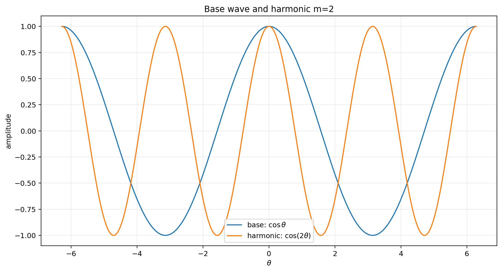
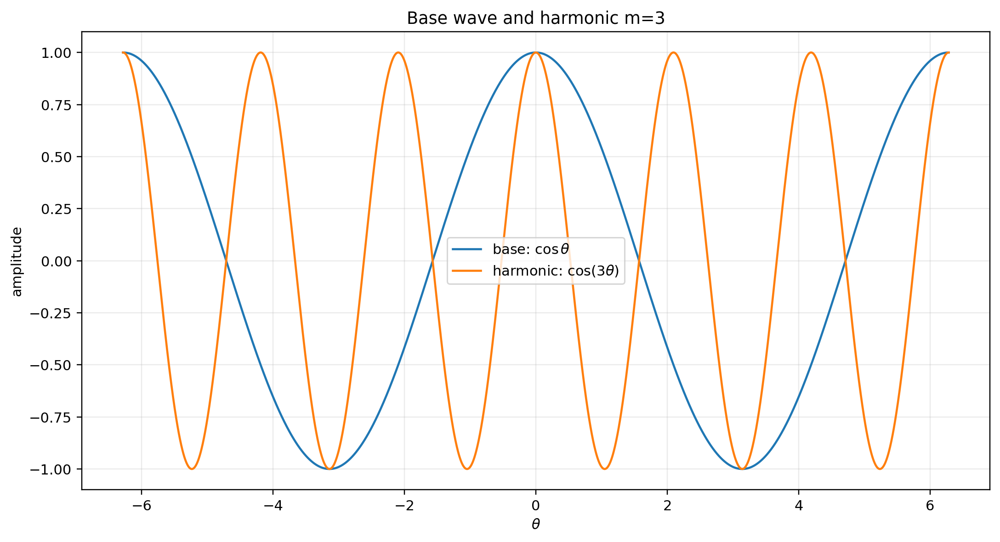
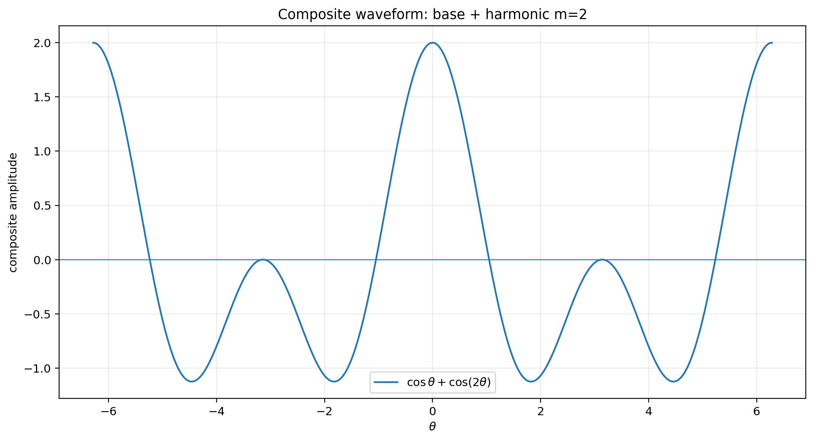
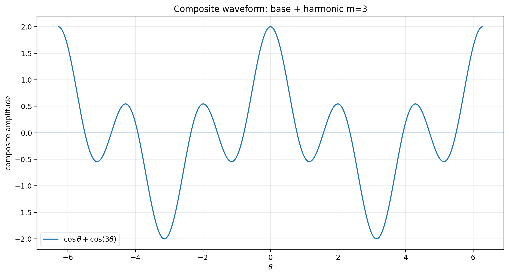
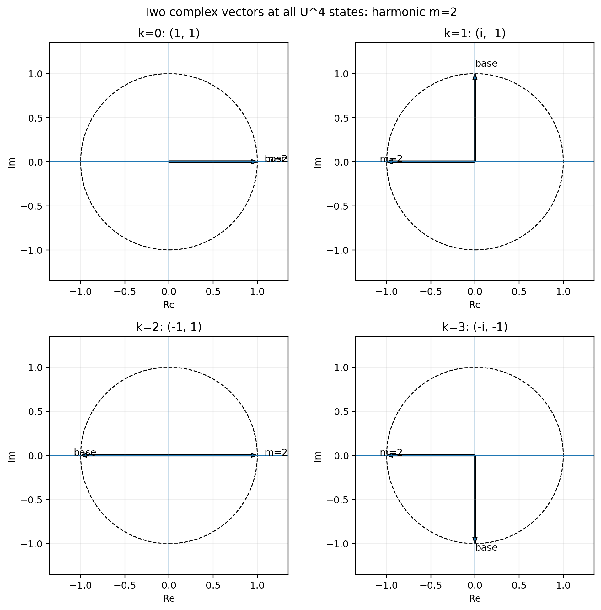
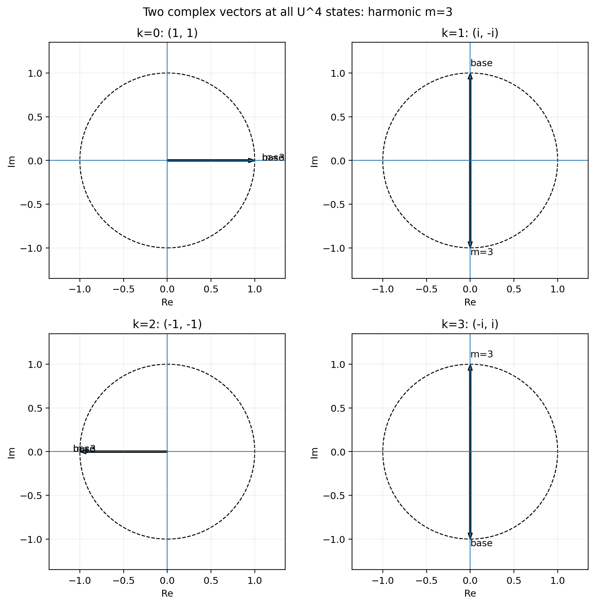
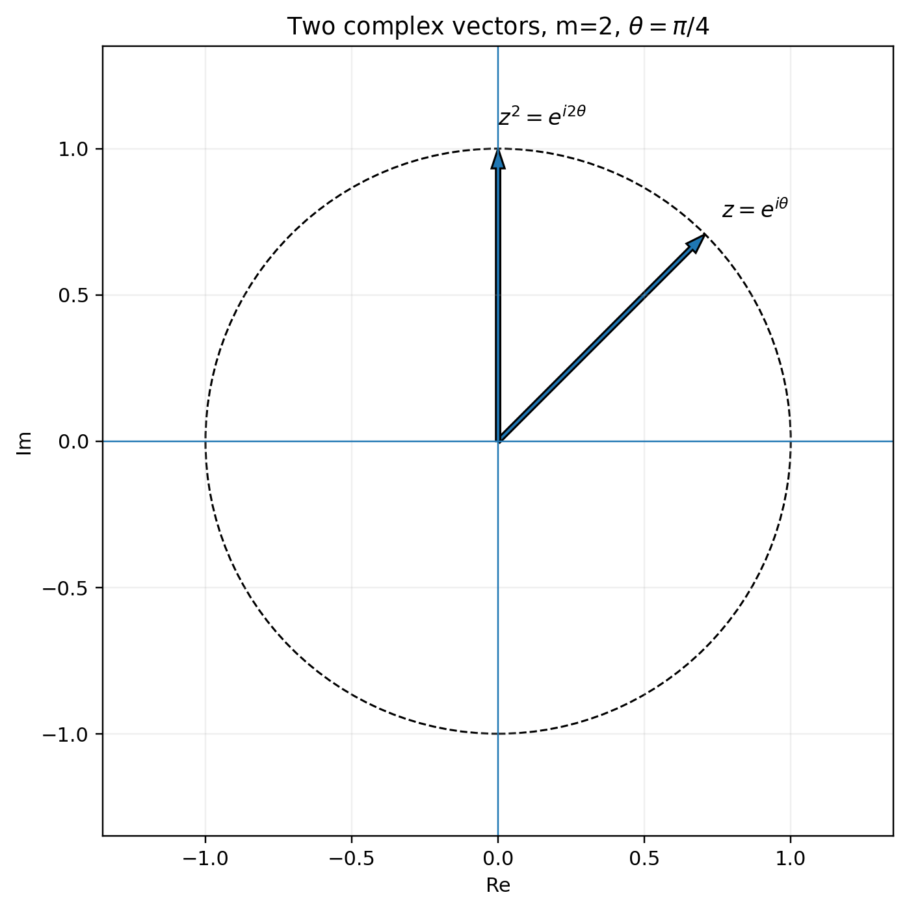
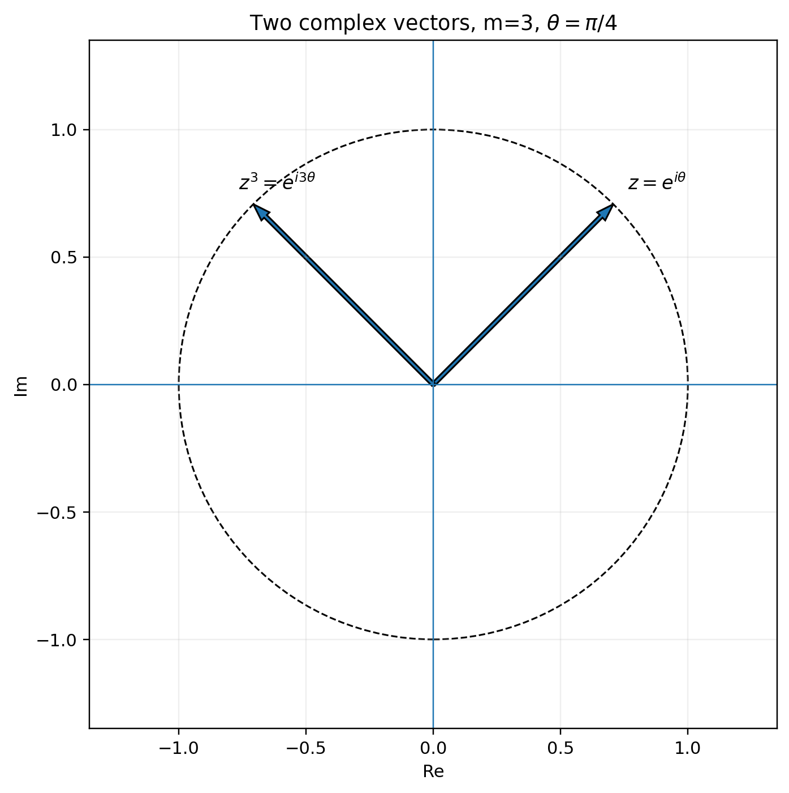

# 時間発展を頂点化した有限完全関係閉系
## ―― $U^K=I$ による $N=1, K=4$ 最小厳密閉系と偶奇倍音の完全ネットワーク解析

**著者:** 木原 範昭（WF System Co., Ltd.）  
**ORCID:** 0009-0004-6753-4020  
**日付:** 2026-09-15  
**版:** v1.1 日本語完成稿（再査読修正版）  
**Version DOI:** （取得後記入）  
**Concept DOI:** （取得後記入）  

---

## 要旨

本研究の目的は、時間発展を外部の特別なパラメータとして与えず、異なる位相時点の状態そのものを通常の状態頂点と区別せずに有限個の頂点として扱い、それらの全関係を完全ネットワークとして閉じる最小厳密系を解析することである。出発点は、先行研究 [K1] における自己無撞着な関係波閉鎖系の数値実験である。そこでは、ある瞬間に $N$ 個の頂点と $M=N(N-1)/2$ 個の関係波を置き、離散更新変数 $\tau$ に対して $\Delta\tau=2\pi/N$ として相互作用を反復した。高対称な初期状態では関係波が複素平面上の 90 度系列近傍、すなわち十字架状の狭い帯に集中し、その後、急激な横方向成分の増大を経て、ほぼ等振幅かつ位相が広く分散した準安定リングへ遷移することが観測された。しかしこの記述は、$\tau$ を他の状態変数から区別して更新方向として特別扱いしている点、および「ある瞬間の $N$ 頂点」を先に仮定している点で、無名性の原則に抵触している可能性を残す。

本稿では、各名目時点に $N$ 個の状態があり、閉路上に $K$ 個の位相状態がある場合、全状態を区別せず $P=KN$ 個の頂点とみなし、全関係数を $M_P=P(P-1)/2=KN(KN-1)/2$ とする。さらに位相閉路を $U^K=I$ で閉じる。この構成では $N=1$ であっても $K\ge 3$ ならば自己の異なる位相状態間に複数の関係と閉路を定義できる。本稿は最小の非自明かつ厳密に閉じた場合として $N=1, K=4$ を完全解析する。ここで $U=\exp(2\pi i/4)=i$ を primitive 4-th root とし、状態を $S_k=(U^k,U^{mk})$ と定義する。$m=2$ を最小の非自明な偶数倍音、$m=3$ を最小の非自明な奇数倍音として比較する。

結果は三層に分離して記述する。第一に、完全グラフ $K_4$ の存在、状態巡回、位数、二波成分の二乗和は数学的に厳密であり、物理的同定を必要としない。第二に、$\mathbb C^2$ 上のユークリッド距離 $d_{ij}$ を**解析上の読出しとして定義した場合**、$m=2$ と $m=3$ で 6 辺の距離多重集合が異なる。これは定義後には厳密だが、$d_{ij}$ を実空間距離と同定することは本稿の主張ではない。第三に、$N=1$ 系を「光子1個」に対応させること、$k$ の巡回を物理時間の過去・現在・未来として読むこと、ネットワーク距離を物理的長さとして読むことは、すべて今後検証すべき**物理的仮定**であり、本稿の完全ネットワーク解析の成立条件ではない。

$K=4$ について、$m=2$ では倍音成分の最小位数が 2 に縮退し、$m=3$ では基底波・倍音とも最小位数 4 を維持する。さらに 4 状態にわたる二波成分の二乗総和を

$$
Q_{\mathrm{loop}}(m)
=
\sum_{k=0}^{3}\left[(U^k)^2+(U^{mk})^2\right]
$$

と定義すると、厳密に

$$
Q_{\mathrm{loop}}(m)
=
\begin{cases}
4,&m\ \mathrm{even},\\
0,&m\ \mathrm{odd}
\end{cases}
$$

となる。したがって最小比較では $m=2$ が二乗ゼロ閉塞せず、$m=3$ が厳密に二乗ゼロ閉塞する。本稿はこの差を数値近似ではなく有限巡回群上の幾何級数として完全導出し、全状態、全 6 関係、全可視化、動的 HTML、MP4、CSV および再現プログラムを同一フォルダに収録する。

**キーワード:** 完全グラフ、離散位相、有限巡回群、$U^K=I$、関係波、時間の頂点化、二乗ゼロ閉塞、倍音、無名性、自己無撞着性

---

# 1. 本稿の主張範囲を最初に固定する

本稿は、物理的同定と数学的ネットワーク解析を意図的に分離する。これは表現上の注意ではなく、本稿の論理構造そのものである。

| 層 | 内容 | 本稿での位置づけ |
|---|---|---|
| A | $P=KN$ 個の頂点を全関係化すること、$K_4$ の 6 関係、$U^K=I$、状態巡回、位数、二波成分の二乗和 | **厳密な数学的・代数的主張** |
| B | $\mathbb C^2$ のユークリッド距離 $d_{ij}$ による 6 辺の数値的長さ | **明示的に定義した解析読出し**。定義後は厳密だが、物理距離ではない |
| C | MDS による 3 次元配置 | **距離行列の可視化**。座標値自体に物理的意味を与えない |
| D | $N=1$ を光子1個とみなすこと、基底波＋倍音1本をその最小状態とみなすこと | **物理的仮定** |
| E | 位相状態 $k$ を物理的な過去・現在・未来と読むこと、ネットワーク距離を時空距離として読むこと | **今後検証すべき物理的読出し仮説** |

したがって、D または E が将来否定されたとしても、A の完全ネットワーク解析および有限巡回群上の結果は影響を受けない。また B の距離読出しが物理的長さとして採用できないことが判明した場合でも、$K_4$ の完全関係構造、位数、二乗和の結果は残る。

---

# 2. 動機：先行インフレーション系で何が観測されたか

## 2.1 先行系の基本構成

先行研究 [K1] では、名目上「ある瞬間」に $N$ 個の頂点を置き、全頂点対に複素関係波を対応させる完全グラフを用いた。関係数は

$$
M
=
\binom{N}{2}
=
\frac{N(N-1)}{2}
$$

である。

例えば $N=40$ では、

$$
M
=
\frac{40\times39}{2}
=
780
$$

本の関係波が存在する。

先行実験では、これらの関係波を複素平面上で観測すると、高対称な初期状態が 90 度系列の近傍に集中し、十字架状の狭い帯を形成した。これは文章だけでは誤解されやすいため、$N=40$ の実測図をそのまま再掲する。

### 図1　$N=40, M=780$ の初期状態：90度系列近傍の十字架状帯

図1では、関係波が一様な位相円上に置かれているのではなく、約 90 度ごとの 4 方向近傍に強く拘束され、それぞれに小さい振幅幅を持つ帯として分布している。したがって「初期状態が十字架状である」という記述は模式的比喩ではなく、$N=40, M=780$ の関係波集合を複素平面に直接描いた観測結果である。

## 2.2 反復後の準安定リング

先行系では相互作用を反復すると、横方向成分が急増した後、振幅がほぼ均一化し、位相拘束が大きく解ける。ただし終端分布は完全な等角度配置ではなく、元の 90 度系列に対応する異方性を残す。

### 図2　$N=40, M=780$ の終端状態：放射状リング

図2は step 500 の終端例である。初期の 4 本の狭い帯から、ほぼ同一半径のリング状分布へ遷移しているが、角度密度は完全一様ではない。本稿では、この現象を「時間方向も含めた全状態関係を、最初から一つの閉じたネットワークとして記述できないか」という問題意識の出発点とする。

## 2.3 本稿で「インフレーション的」と呼ぶ意味

本稿で「インフレーション」または「インフレーション的」という語を用いる場合、それは**宇宙論的 inflation と同一であることを前提としない**。先行関係波系において、低い横成分から短い区間で横方向の秩序パラメータが急増し、対称な不安定状態から縮退した準安定状態へ移る観測挙動を指す。

この用語の意味を明確にするため、先行実験から二つの図を再掲する。

### 図3　測定された秩序パラメータ力学から再構成した Mexican-hat 型 SSB 図

この図は模式的なポテンシャルを先に仮定して描いたものではなく、先行実験で測定された秩序変数

$$
r=\sqrt{H_\perp/H}
$$

の発展を、Landau 型の有効ポテンシャル

$$
V(r)
=
-\frac12\lambda_0 r^2
+
\frac{\lambda_0}{4r_{\mathrm{vac}}^2}r^4
$$

へ写像して再構成した補助的可視化である。係数は測定値から

$$
\lambda_0=\ln\rho_0,
\qquad
r_{\mathrm{vac}}
=
\sqrt{(H_\perp/H)_{\mathrm{sat}}}
$$

と置く。したがってこの $V(r)$ は**測定量で係数を同定した有効記述（アンサッツ）**であり、ポテンシャル形そのものを本稿で第一原理から導出したものではない。また、この有効ポテンシャルは本稿の $K_4$ 完全ネットワーク解析の前提でもない。ここで重要なのは、中心の高対称状態から、終端のリング状準安定集合へ遷移する先行観測を視覚的に示すことである。本稿はこの図から新しい力学則を導入しない。

### 図4　$N=40$ 関係波の 3D 発展表示

図4は、初期の高対称な拘束状態から終端リングへ至る多数の関係波軌道を 3 次元的に表示した例である。これも本稿の $K_4$ 解析の入力ではない。**本稿の動機を与えた先行観測**としてのみ用いる。

---

# 3. 先行系に残る無名性上の懸念

本稿でいう**無名性**とは、系を構成する状態・変数のいずれにも、先験的な種別（例えば「空間頂点」か「時間ラベル」か）や、外部的役割（例えば他の状態を更新する順序を与える特別な変数）を割り当てないことをいう。したがって本稿でいう「無名性上の懸念」は、ある変数や頂点集合を計算手続きの外側から特別扱いしていないか、という構造上の検査を意味する。

## 3.1 外部更新変数 $\tau$ の特別扱い

先行実験では、相互作用を離散更新変数 $\tau$ に沿って反復し、典型的には

$$
\Delta\tau
=
\frac{2\pi}{N}
$$

という刻みを用いた。

ここで本稿は、$\tau$ を物理時間と同定しているとは仮定しない。それでもなお、計算手続きとして

$$
\text{state at }\tau
\longrightarrow
\text{state at }\tau+\Delta\tau
$$

と一方向に更新する以上、$\tau$ だけが「他の変数を更新するための外部順序」として特別扱いされる。

無名性を徹底するならば、

$$
\boxed{
\text{なぜ }\tau\text{ だけが頂点でも関係でもなく、外部ラベルでなければならないのか}
}
$$

という疑問が残る。

## 3.2 「ある瞬間の $N$ 頂点」という仮定

同様に、

$$
N\text{ 個の頂点}
\quad\Longrightarrow\quad
M=\frac{N(N-1)}{2}\text{ 個の関係}
$$

と置くとき、$N$ 個の頂点を「同一時点に存在するもの」として先に分類している。この分類も、より上位の無名な関係系から見れば人工的である可能性がある。

したがって本稿では、「空間的に並ぶ頂点」と「時間方向に並ぶ状態」を初めから別種のものとして扱わない。

---

# 4. 時間方向の状態を頂点化する

## 4.1 全頂点数 $P=KN$

名目上、一つの位相断面に $N$ 個の状態があり、閉じた位相系列に $K$ 個の状態ラベルがあるとする。

従来なら、

$$
\{1,2,\ldots,N\}
$$

を「頂点」、

$$
\{0,1,\ldots,K-1\}
$$

を「時間または更新ラベル」として別に扱う。

本稿ではこの区別を外し、組

$$
(k,a),
\qquad
k\in\{0,1,\ldots,K-1\},
\qquad
a\in\{1,2,\ldots,N\}
$$

をすべて同種の頂点として数える。

したがって全頂点数は

$$
P
=
K\times N
=
KN
$$

である。

ここには「$k$ は物理時間である」という仮定は入っていない。$k$ は有限閉路上の状態ラベルであり、これを後に物理時間として読むかどうかは別問題である。

## 4.2 全関係数の導出

$P$ 個の頂点の全ての異なる 2 頂点対を関係として保持すると、完全グラフ $K_P$ の辺数は

$$
M_P
=
\binom{P}{2}
$$

である。

組合せの定義から、

$$
\binom{P}{2}
=
\frac{P!}{2!(P-2)!}
$$

であり、

$$
P!
=
P(P-1)(P-2)!
$$

なので、

$$
\binom{P}{2}
=
\frac{P(P-1)(P-2)!}{2(P-2)!}
=
\frac{P(P-1)}{2}.
$$

ここへ $P=KN$ を代入すると、

$$
\boxed{
M_P
=
\frac{KN(KN-1)}{2}
}
$$

を得る。

この式は時間の物理的意味を仮定していない。「$K$ 個の異なる状態層をもつ $N$ 個の対象」を、区別なく $KN$ 頂点として完全関係化したときの組合せ数である。

## 4.3 巨大系を直接数値計算しない理由

従来の数値実験は高々 $N\sim40$ 程度までである。これを $KN$ に分解すれば、例えば $N=6, K=7$ 程度でもすでに同程度の頂点数となる。

一方、仮に物理的な状態数の目安として $N\sim10^{60}$、位相方向にも $K\sim10^{60}$ を考えるなら、

$$
P=KN\sim10^{120}
$$

であり、完全関係数は

$$
M_P
=
\frac{P(P-1)}{2}
\sim
\frac{10^{240}}{2}
$$

すなわち $10^{240}$ オーダとなる。この数値は本稿の実験値ではなく、巨大系を直接列挙することが原理的に困難であることを示すオーダ評価である。

したがって本稿の戦略は、巨大系を粗く近似することではない。

$$
\boxed{
\text{同じ閉路公理と全関係構造を保ったまま、最小の厳密閉系を完全に解く}
}
$$

ことである。

---

# 5. なぜ $N=1$ まで下げられるのか

## 5.1 同一断面だけを見る場合

通常の完全グラフだけを考えると、

### $N=1$

$$
M
=
\frac{1(1-1)}{2}
=0.
$$

関係がない。

### $N=2$

$$
M
=
\frac{2(2-1)}{2}
=1.
$$

関係は 1 本だけなので、関係同士を比較できない。

### $N=3$

$$
M
=
\frac{3(3-1)}{2}
=3.
$$

初めて 3 関係

$$
r_{12},\quad r_{23},\quad r_{31}
$$

を相互比較でき、閉路

$$
1\to2\to3\to1
$$

を定義できる。

したがって「同じ名目時点の頂点だけ」を数えるなら、$N=3$ が最小の非自明閉路である。

## 5.2 状態方向も頂点なら $N=1, K\ge3$ で閉路が作れる

しかし、状態方向の $K$ 個もすべて頂点なら、$N=1$ でも全頂点数は

$$
P=K.
$$

このとき関係数は

$$
M_P
=
\frac{K(K-1)}{2}.
$$

$K=3$ なら

$$
M_P
=
3,
$$

$K=4$ なら

$$
M_P
=
6.
$$

すなわち、単一対象であっても、その異なる位相状態を同等の頂点として扱えば、自己の異なる状態間に複数の関係を持ち、閉路を形成できる。

先行系の初期状態は図1の通り、複素平面上で約90度ごとの4方向帯に拘束されていた。この**観測された4方向構造**に対応する最小の位相閉路として、

$$
\boxed{N=1,\quad K=4}
$$

を採用する。その上で、最小の非自明な偶数倍音 $m=2$ と奇数倍音 $m=3$ を比較する。したがって「90度だから $K=4$」を定義だけから循環的に置くのではなく、先行実験で観測された4方向構造を本稿の最小厳密閉系へ写した比較設定である。

これは巨大系の粗い近似ではない。4 頂点と 6 関係を**一つも省略せず保持する有限完全関係閉系**である。

---

# 6. 物理的対応は仮定として別立てにする

## 6.1 「光子1個」は数学的解析の前提ではない

$N=1$ の物理的候補として、本稿では「光子1個」を想定する。しかし、この同定は完全ネットワーク解析を成立させるためには不要である。

したがって以下を明確に区別する。

$$
\boxed{
N=1\text{ の有限閉系を解析する}
}
$$

は本稿の数学的設定であり、

$$
\boxed{\text{その }N=1\text{ を光子1個と読む}}
$$

ことは物理的仮定である。

## 6.2 単一複素波だけでは局在読出しが不足するという動機

単一複素波を

$$
z
=
a+ib
$$

とする。

極形式では

$$
z
=
A e^{i\theta}
$$

である。

単一の単色波として $A$ が一定なら、その位相は全閉路にわたって存在し、一つの波だけから局在した状態位置を区別する情報は乏しい。

そこで本稿では、最小限の追加関係として「基底波＋整数倍音1本」を用いる。

$$
z_1(\theta)
=
e^{i\theta},
$$

$$
z_m(\theta)
=
e^{im\theta}.
$$

この二波系は、同一の位相変数 $\theta$ を共有する。独立な別時計を導入しない。

さらに本稿では振幅を 1 と定義するが、これは各 step で行う正規化操作ではない。すなわち、

$$
|z_1|=|z_m|=1
$$

は**状態族そのものの定義**であり、時間発展の途中でノルムを再調整する演算を導入していない。

---

# 7. 有限閉路の定義：$U^K=I$

## 7.1 primitive $K$-th root を選ぶ

単に

$$
U^K=I
$$

だけでは、$U$ の最小位数が $K$ であるとは限らない。例えば $U=1$ も $U^K=1$ を満たすが、1 ステップで閉じる。

そこで本稿では、$K$ 個の異なる基底位相を得るために primitive $K$-th root

$$
U
=
\exp\left(\frac{2\pi i}{K}\right)
$$

を採用する。

すると

$$
U^K
=
\exp\left(\frac{2\pi i}{K}K\right)
=
\exp(2\pi i)
=
1.
$$

また $0<q<K$ に対して一般には $U^q\ne1$ なので、基底生成子の最小位数は $K$ である。

## 7.2 本稿では $K=4$

$$
U
=
\exp\left(\frac{2\pi i}{4}\right)
=
\exp\left(\frac{\pi i}{2}\right)
=i.
$$

したがって

$$
U^0=1,
$$

$$
U^1=i,
$$

$$
U^2=-1,
$$

$$
U^3=-i,
$$

$$
U^4=1.
$$

4 個の離散位相状態を

$$
k=0,1,2,3
$$

とする。

## 7.3 二波状態の定義

整数倍音 $m$ に対し、状態 $S_k$ を

$$
\boxed{
S_k
=
\left(z_1(k),z_m(k)\right)
=
\left(U^k,U^{mk}\right)
}
$$

と定義する。

この定義から次状態は

$$
S_{k+1}
=
\left(U^{k+1},U^{m(k+1)}\right).
$$

指数法則を用いると、

$$
U^{k+1}
=
U\,U^k,
$$

$$
U^{m(k+1)}
=
U^{mk+m}
=
U^m U^{mk}.
$$

したがって

$$
\boxed{
S_{k+1}
=
\left(U z_1(k),U^m z_m(k)\right)
}
$$

である。

さらに $K$ ステップ後は

$$
S_{k+K}
=
\left(U^{k+K},U^{m(k+K)}\right).
$$

第一成分は

$$
U^{k+K}
=
U^k U^K
=
U^k.
$$

第二成分は

$$
U^{m(k+K)}
=
U^{mk}U^{mK}
=
U^{mk}(U^K)^m
=
U^{mk}.
$$

ゆえに

$$
\boxed{
S_{k+K}=S_k
}
$$

である。

ここで「全状態が閉路になる」ことが、定義から代数的に導かれる。

---

# 8. 最小比較：偶数倍音 $m=2$ と奇数倍音 $m=3$

## 8.1 偶数倍音 $m=2$

定義は

$$
S_k
=
(U^k,U^{2k}).
$$

### $k=0$

$$
S_0
=
(U^0,U^0)
=
(1,1).
$$

### $k=1$

$$
S_1
=
(U,U^2)
=
(i,-1).
$$

### $k=2$

$$
S_2
=
(U^2,U^4)
=
(-1,1).
$$

### $k=3$

$$
S_3
=
(U^3,U^6).
$$

ここで

$$
U^6
=
U^{4+2}
=
U^4U^2
=
1\times(-1)
=
-1
$$

なので、

$$
S_3
=
(-i,-1).
$$

したがって

$$
\boxed{
(1,1)
\to
(i,-1)
\to
(-1,1)
\to
(-i,-1)
\to
(1,1)
}
$$

である。

倍音成分だけを見ると、

$$
1,-1,1,-1
$$

であり、4 状態ではなく 2 状態へ縮退している。

## 8.2 奇数倍音 $m=3$

定義は

$$
S_k
=
(U^k,U^{3k}).
$$

### $k=0$

$$
S_0
=
(1,1).
$$

### $k=1$

$$
S_1
=
(U,U^3)
=
(i,-i).
$$

### $k=2$

$$
S_2
=
(U^2,U^6).
$$

$$
U^6
=
U^{4+2}
=
U^2
=
-1
$$

より、

$$
S_2
=
(-1,-1).
$$

### $k=3$

$$
S_3
=
(U^3,U^9).
$$

$$
U^9
=
U^{8+1}
=
(U^4)^2U
=
i
$$

なので、

$$
S_3
=
(-i,i).
$$

したがって

$$
\boxed{
(1,1)
\to
(i,-i)
\to
(-1,-1)
\to
(-i,i)
\to
(1,1)
}
$$

である。

この場合、倍音成分も

$$
1,-i,-1,i
$$

と 4 状態をすべて巡回する。

---

# 9. 有限閉系としての代数的自己無撞着性

「自己無撞着」という語は、先行インフレーション系の完全な非線形相互作用固定点条件と混同しないよう、本稿では意味を限定する。

本稿で検査するのは、**有限閉系としての代数的一貫性**であり、条件は以下である。

1. 状態定義どおり $|z_1|=|z_m|=1$ である。
2. 各状態で $z_m=z_1^m$ が成立する。
3. 遷移則 $S_{k+1}=(Uz_1,U^m z_m)$ が成立する。
4. forward と reverse で同じ $k$ は同じ複素状態を与える。
5. $K$ ステップ後に厳密に初期状態へ戻る。

## 9.1 振幅条件

$U$ は単位円上にあるので、

$$
|U|=1.
$$

したがって任意の整数 $q$ について

$$
|U^q|
=
|U|^q
=
1.
$$

ゆえに

$$
|z_1(k)|
=
|U^k|
=
1,
$$

$$
|z_m(k)|
=
|U^{mk}|
=
1.
$$

## 9.2 倍音関係

第一成分は

$$
z_1(k)=U^k.
$$

その $m$ 乗は

$$
[z_1(k)]^m
=
(U^k)^m
=
U^{mk}
=
z_m(k).
$$

したがって

$$
\boxed{z_m=z_1^m}
$$

は全状態で恒等的に成立する。

## 9.3 forward / reverse

forward を

$$
0\to1\to2\to3
$$

reverse を

$$
0\to3\to2\to1
$$

とする。

状態 $S_k$ は順序ではなく $k$ の関数として一意に定義されるため、同じ $k$ に対して forward/reverse は同じ $S_k$ を与える。

これは「物理時間が可逆である」ことの証明ではない。**同じ有限閉路を二方向から列挙しても状態定義が矛盾しない**ことの検査である。

## 9.4 数値データとの照合

exact-$i$ で生成した生データでは、$m=2$、$m=3$ とも上記代数条件の最大残差は 0 である。

- [exact-$i$ 複素状態データ](再現性検証_生データ読出し_20260915/raw_data/complex_states_animation_exact_i.csv)
- [$\exp(i\theta)$ による静的再計算データ](再現性検証_生データ読出し_20260915/raw_data/complex_states_static_exp.csv)
- [自己無撞着性・二乗和の状態別検査 CSV](再現性検証_生データ読出し_20260915/自己無撞着性_二乗和_U4検証_20260915/K4_self_consistency_square_sum_by_state_20260915.csv)
- [集計 CSV](再現性検証_生データ読出し_20260915/自己無撞着性_二乗和_U4検証_20260915/K4_self_consistency_square_sum_summary_20260915.csv)
- [解析詳細](再現性検証_生データ読出し_20260915/自己無撞着性_二乗和_U4検証_20260915/K4_self_consistency_square_sum_analysis_20260915.md)

浮動小数の $\exp(i\theta)$ 生成との最大差は $m=2$ で約 $4.0\times10^{-16}$、$m=3$ で約 $5.5\times10^{-16}$ であり、exact-$i$ の離散状態と丸め誤差内で一致する。

---

# 10. 完全ネットワーク $K_4$

## 10.1 6 関係を一つも省略しない

$K=4$ なので頂点数は 4 であり、完全グラフの辺数は

$$
M
=
\frac{4(4-1)}{2}
=
6.
$$

全頂点対は

$$
(0,1),
(0,2),
(0,3),
(1,2),
(1,3),
(2,3)
$$

である。

ここで重要なのは、完全グラフの存在自体には「長さ」の定義は不要なことである。6 本すべての関係を保持する、という組合せ構造がまず本体である。

## 10.2 $\mathbb C^2$ 上の距離は解析読出しとして定義する

状態

$$
S_i=(U^i,U^{mi}),
$$

$$
S_j=(U^j,U^{mj})
$$

の差を

$$
S_i-S_j
=
(U^i-U^j,\;U^{mi}-U^{mj})
$$

とする。

この 2 成分複素ベクトルに標準ユークリッドノルムを**解析上の読出しとして定義**すると、

$$
\boxed{
d_{ij}
=
\sqrt{
|U^i-U^j|^2
+
|U^{mi}-U^{mj}|^2
}
}
$$

である。

この $d_{ij}$ を実空間距離、時空間隔、粒子間距離と同定する根拠は本稿では与えない。したがって以下の距離幾何は、$\mathbb C^2$ 上の定義に基づく**状態空間幾何**である。

## 10.3 距離公式の完全導出

一般に単位複素数 $e^{i\alpha},e^{i\beta}$ に対して、

$$
|e^{i\alpha}-e^{i\beta}|^2
=
(e^{i\alpha}-e^{i\beta})(e^{-i\alpha}-e^{-i\beta}).
$$

展開すると、

$$
=
1-e^{i(\alpha-\beta)}-e^{-i(\alpha-\beta)}+1.
$$

オイラー公式より

$$
e^{ix}+e^{-ix}=2\cos x
$$

なので、

$$
|e^{i\alpha}-e^{i\beta}|^2
=
2-2\cos(\alpha-\beta).
$$

さらに

$$
1-\cos x
=
2\sin^2\frac{x}{2}
$$

より、

$$
|e^{i\alpha}-e^{i\beta}|^2
=
4\sin^2\frac{\alpha-\beta}{2}.
$$

$U=e^{2\pi i/4}$ で $\Delta=i-j$ と置けば、第一成分について

$$
|U^i-U^j|^2
=
4\sin^2\left(\frac{\pi\Delta}{4}\right).
$$

第二成分について

$$
|U^{mi}-U^{mj}|^2
=
4\sin^2\left(\frac{\pi m\Delta}{4}\right).
$$

したがって

$$
\boxed{
d_{ij}^2
=
4\sin^2\left(\frac{\pi\Delta}{4}\right)
+
4\sin^2\left(\frac{\pi m\Delta}{4}\right)
}
$$

を得る。

## 10.4 $m=2$ の全 6 辺

$\Delta=1$ のとき、

$$
4\sin^2\frac{\pi}{4}=2,
$$

$$
4\sin^2\frac{2\pi}{4}
=
4\sin^2\frac{\pi}{2}
=4.
$$

したがって

$$
d^2=2+4=6,
$$

$$
d=\sqrt6.
$$

$\Delta=2$ のとき、

$$
4\sin^2\frac{2\pi}{4}
=4,
$$

$$
4\sin^2\frac{4\pi}{4}
=
4\sin^2\pi
=0.
$$

したがって

$$
d^2=4,
$$

$$
d=2.
$$

$\Delta=3$ は $\Delta=1$ と対称なので $d=\sqrt6$ である。

全 6 辺は次の通り。

| 辺 | $\min(|\Delta|,\,4-|\Delta|)$ | $d_{ij}$ |
|---|---:|---:|
| $(0,1)$ | 1 | $\sqrt6$ |
| $(0,2)$ | 2 | $2$ |
| $(0,3)$ | 1 | $\sqrt6$ |
| $(1,2)$ | 1 | $\sqrt6$ |
| $(1,3)$ | 2 | $2$ |
| $(2,3)$ | 1 | $\sqrt6$ |

よって距離多重集合は

$$
\boxed{
\{2,2,\sqrt6,\sqrt6,\sqrt6,\sqrt6\}
}
$$

である。

### 図5　$m=2$ 完全状態ネットワーク

[SVG版](K4_complete_network_m2.svg) / [辺データ CSV](edges_m2.csv)

## 10.5 $m=3$ の全 6 辺

$\Delta=1$ のとき、

$$
4\sin^2\frac{\pi}{4}=2,
$$

$$
4\sin^2\frac{3\pi}{4}=2.
$$

したがって

$$
d^2=4,
$$

$$
d=2.
$$

$\Delta=2$ のとき、

$$
4\sin^2\frac{2\pi}{4}=4,
$$

$$
4\sin^2\frac{6\pi}{4}
=
4\sin^2\frac{3\pi}{2}
=4.
$$

したがって

$$
d^2=8,
$$

$$
d=2\sqrt2.
$$

$\Delta=3$ は $\Delta=1$ と対称なので $d=2$ である。

全 6 辺は次の通り。

| 辺 | $\min(|\Delta|,\,4-|\Delta|)$ | $d_{ij}$ |
|---|---:|---:|
| $(0,1)$ | 1 | $2$ |
| $(0,2)$ | 2 | $2\sqrt2$ |
| $(0,3)$ | 1 | $2$ |
| $(1,2)$ | 1 | $2$ |
| $(1,3)$ | 2 | $2\sqrt2$ |
| $(2,3)$ | 1 | $2$ |

よって距離多重集合は

$$
\boxed{
\{2,2,2,2,2\sqrt2,2\sqrt2\}
}
$$

である。

### 図6　$m=3$ 完全状態ネットワーク

[SVG版](K4_complete_network_m3.svg) / [辺データ CSV](edges_m3.csv) / [$m=2,3$ 統合辺データ](all_edges_m2_m3.csv)

## 10.6 MDS 表示の意味と非主張

図5、図6の 3 次元座標は、6 本の $d_{ij}$ を距離行列として classical MDS で再構成した表示座標である。

したがって、

$$
\boxed{
\text{図の MDS-1,MDS-2,MDS-3 軸を物理空間の }x,y,z\text{ と同定しない}
}
$$

ことが重要である。

物理的に意味があると本稿で主張しているのは 3D 座標そのものではなく、**定義した $\mathbb C^2$ 距離に対して 6 辺の距離多重集合が $m=2$ と $m=3$ で異なる**という事実である。

---

# 11. 波形表示：連続曲線は読出し図であり、状態そのものは離散である

状態ネットワークは

$$
k=0,1,2,3
$$

の 4 点だけから成る。

一方、波形を視覚的に理解するために、同じ基底と倍音を連続位相変数 $\theta$ 上で

$$
\psi_1(\theta)=\cos\theta,
$$

$$
\psi_m(\theta)=\cos(m\theta)
$$

として描くことができる。

ここで連続曲線を描くことは、実際の状態遷移が連続であるという新たな仮定ではない。本稿の離散状態はあくまで

$$
\theta_k
=
\frac{2\pi k}{4}
=
\frac{k\pi}{2}
$$

でサンプリングされた 4 状態である。

### 図7　基底波と偶数倍音 $m=2$

[SVG版](waves_base_harmonic_m2.svg)

### 図8　基底波と奇数倍音 $m=3$

[SVG版](waves_base_harmonic_m3.svg)

合成波は

$$
\psi_{\mathrm{sum}}(\theta)
=
\cos\theta+\cos(m\theta)
$$

である。

### 図9　合成波 $m=2$

[SVG版](composite_wave_m2.svg)

### 図10　合成波 $m=3$

[SVG版](composite_wave_m3.svg)

この波形図も、状態ネットワークとは別の読出し表示である。完全ネットワークの構成は波形図を用いなくても定義できる。

---

# 12. 複素ベクトル表示

各状態 $k$ では、二つの複素数

$$
z_1=U^k,
$$

$$
z_m=U^{mk}
$$

を単位円上のベクトルとして表示できる。

### 図11　$m=2$：全4状態の二複素ベクトル

[SVG版](complex_vectors_all_states_m2.svg)

### 図12　$m=3$：全4状態の二複素ベクトル

[SVG版](complex_vectors_all_states_m3.svg)

$m=2$ では倍音ベクトルが $+1,-1$ の 2 方向に縮退するのに対し、$m=3$ では 4 方向を巡回することが直接見える。

離散状態そのものではないが、連続位相の代表位置 $\theta=\pi/4$ で二波の相対向きを確認した図も残している。

### 図13　$m=2,\ \theta=\pi/4$ の代表複素ベクトル

[SVG版](complex_vectors_theta_pi4_m2.svg)

### 図14　$m=3,\ \theta=\pi/4$ の代表複素ベクトル

[SVG版](complex_vectors_theta_pi4_m3.svg)

図13、図14は離散 $k$ 状態そのものではなく、連続位相表示上の補助図である。この区別を保持する。

---

# 13. 二乗和の完全展開

## 13.1 何を二乗和しているか

本節でいう二乗和は、6 本のネットワーク辺長 $d_{ij}$ の二乗和ではない。

各頂点状態 $S_k$ を構成する二波成分

$$
z_1(k),
\qquad
z_m(k)
$$

について、まず状態ごとに

$$
Q_k
=
[z_1(k)]^2+[z_m(k)]^2
$$

を定義し、その後 4 状態全体について

$$
Q_{\mathrm{loop}}
=
\sum_{k=0}^{3}Q_k
$$

を計算する。

したがってこれは、**4 頂点に付随する 2 成分複素状態の二乗総和**である。

なお、共役付きのノルム和は各状態で

$$
|z_1(k)|^2+|z_m(k)|^2=1+1=2
$$

であるから、4状態全体では

$$
\sum_{k=0}^{3}\left(|z_1(k)|^2+|z_m(k)|^2\right)=8
$$

となり、$m$ によらず一定であるため、この比較に対する判別力を持たない。一方、共役を取らない二乗和は

$$
Q_{\mathrm{loop}}(m)
=
\sum_k U^{2k}+\sum_k U^{2mk}
$$

という**2倍位相の有限幾何級数**へ帰着する。このため、その値は倍音指数 $m$ と閉路長 $K$ の整除構造によって変化しうる。本稿が $Q_{\mathrm{loop}}$ を検査する理由はここにあり、物理的確率やノルムを $\sum z^2$ と同定しているからではない。

## 13.2 実部・虚部への展開

一般の複素数を

$$
z_j
=
a_j+i b_j
$$

とする。

二乗すると、

$$
z_j^2
=
(a_j+i b_j)^2.
$$

積を展開すると、

$$
(a_j+i b_j)^2
=
a_j^2+2i a_j b_j+(i b_j)^2.
$$

$i^2=-1$ より、

$$
(i b_j)^2
=
i^2 b_j^2
=
-b_j^2.
$$

したがって

$$
\boxed{
z_j^2
=
a_j^2-b_j^2+2i a_j b_j
}
$$

である。

複数成分について和を取ると、

$$
\sum_j z_j^2
=
\sum_j(a_j^2-b_j^2+2i a_jb_j).
$$

和の線形性から、

$$
\boxed{
\sum_j z_j^2
=
\sum_j a_j^2
-
\sum_j b_j^2
+
2i\sum_j a_jb_j
}
$$

となる。

したがって

$$
\sum_j z_j^2=0
$$

であるための実条件は

$$
\sum_j a_j^2
=
\sum_j b_j^2
$$

かつ

$$
\sum_j a_jb_j
=
0
$$

である。

## 13.3 $m=2$ の状態別計算

### $k=0$

$$
S_0=(1,1).
$$

したがって

$$
Q_0
=
1^2+1^2
=
2.
$$

### $k=1$

$$
S_1=(i,-1).
$$

$$
i^2=-1,
$$

$$
(-1)^2=1
$$

より、

$$
Q_1
=
-1+1
=
0.
$$

### $k=2$

$$
S_2=(-1,1).
$$

$$
Q_2
=
(-1)^2+1^2
=
1+1
=
2.
$$

### $k=3$

$$
S_3=(-i,-1).
$$

$$
(-i)^2
=
(-1)^2i^2
=
-1,
$$

$$
(-1)^2=1
$$

なので、

$$
Q_3
=
-1+1
=
0.
$$

よって

$$
\boxed{
(Q_0,Q_1,Q_2,Q_3)
=
(2,0,2,0)
}
$$

であり、

$$
Q_{\mathrm{loop}}(2)
=
2+0+2+0
=
\boxed{4}.
$$

## 13.4 $m=3$ の状態別計算

### $k=0$

$$
S_0=(1,1)
$$

なので、

$$
Q_0=2.
$$

### $k=1$

$$
S_1=(i,-i).
$$

$$
i^2=-1,
$$

$$
(-i)^2=-1
$$

より、

$$
Q_1
=
-1-1
=
-2.
$$

### $k=2$

$$
S_2=(-1,-1)
$$

なので、

$$
Q_2
=
1+1
=
2.
$$

### $k=3$

$$
S_3=(-i,i).
$$

$$
Q_3
=
(-i)^2+i^2
=
-1-1
=
-2.
$$

よって

$$
\boxed{
(Q_0,Q_1,Q_2,Q_3)
=
(2,-2,2,-2)
}
$$

であり、

$$
Q_{\mathrm{loop}}(3)
=
2-2+2-2
=
\boxed{0}.
$$

## 13.5 実部・虚部の二乗成分集計

4 状態、二成分すべてをまとめると、$m=2$ では

$$
\sum a^2=6,
$$

$$
\sum b^2=2,
$$

$$
\sum ab=0.
$$

したがって

$$
\sum z^2
=
6-2+2i\times0
=
4.
$$

$m=3$ では

$$
\sum a^2=4,
$$

$$
\sum b^2=4,
$$

$$
\sum ab=0.
$$

したがって

$$
\sum z^2
=
4-4+2i\times0
=
0.
$$

一方、複素数そのものの線形和は両系とも 0 である。

$$
\sum z_1(k)=0,
$$

$m=2$ では

$$
\sum z_2(k)
=
1-1+1-1
=
0,
$$

$m=3$ では

$$
\sum z_3(k)
=
1-i-1+i
=
0.
$$

したがって「線形和ゼロ」と「二乗和ゼロ」は別条件であり、$m=2$ は前者を満たしても後者を満たさない。

---

# 14. $K=4$ における偶奇選択則の厳密導出

$m=2,3$ の違いが偶然の数値例かどうかを確認するため、任意の整数 $m$ について $K=4$ の二乗総和を導出する。

定義より

$$
Q_{\mathrm{loop}}(m)
=
\sum_{k=0}^{3}
\left[(U^k)^2+(U^{mk})^2\right].
$$

指数法則から

$$
(U^k)^2
=
U^{2k},
$$

$$
(U^{mk})^2
=
U^{2mk}.
$$

したがって

$$
Q_{\mathrm{loop}}(m)
=
\sum_{k=0}^{3}U^{2k}
+
\sum_{k=0}^{3}U^{2mk}.
$$

$K=4$ では $U=i$ なので

$$
U^2=i^2=-1.
$$

第一項は

$$
\sum_{k=0}^{3}U^{2k}
=
\sum_{k=0}^{3}(-1)^k
$$

であり、

$$
=1-1+1-1
=0.
$$

第二項について、

$$
U^{2m}
=(i^2)^m
=(-1)^m.
$$

よって

$$
\sum_{k=0}^{3}U^{2mk}
=
\sum_{k=0}^{3}\left[(-1)^m\right]^k.
$$

### $m$ が偶数の場合

$$
(-1)^m=1
$$

なので、

$$
\sum_{k=0}^{3}\left[(-1)^m\right]^k
=
1+1+1+1
=4.
$$

したがって

$$
Q_{\mathrm{loop}}(m)
=0+4
=4.
$$

### $m$ が奇数の場合

$$
(-1)^m=-1
$$

なので、

$$
\sum_{k=0}^{3}\left[(-1)^m\right]^k
=
1-1+1-1
=0.
$$

したがって

$$
Q_{\mathrm{loop}}(m)
=0+0
=0.
$$

ゆえに $K=4$ では厳密に

$$
\boxed{
Q_{\mathrm{loop}}(m)
=
\begin{cases}
4,&m\ \mathrm{even},\\
0,&m\ \mathrm{odd}
\end{cases}
}
$$

である。

したがって $m=2$ と $m=3$ は単なる二つの個別例ではなく、$K=4$ での最小の非自明な偶数・奇数代表である。

この $K=4$ の偶奇選択則は、次の一般定理の系として書ける。primitive $K$-th root

$$
U=e^{2\pi i/K}
$$

に対し、

$$
Q_{\mathrm{loop}}(m;K)
=
\sum_{k=0}^{K-1}
\left(U^{2k}+U^{2mk}\right)
$$

と定義する。有限幾何級数について、整数 $r$ に対し

$$
\sum_{k=0}^{K-1}U^{rk}
=
\begin{cases}
K,&K\mid r,\\
0,&K\nmid r
\end{cases}
$$

である。実際、$K\mid r$ なら $U^r=1$ なので全 $K$ 項が 1 である。一方 $K\nmid r$ なら $U^r\ne1$ かつ $(U^r)^K=1$ だから、

$$
\sum_{k=0}^{K-1}(U^r)^k
=
\frac{1-(U^r)^K}{1-U^r}
=
0
$$

となる。したがって二つの級数を別々に評価して、

$$
\boxed{
Q_{\mathrm{loop}}(m;K)
=
K\,\mathbf 1_{K\mid2}
+
K\,\mathbf 1_{K\mid2m}
}
$$

を得る。ここで $\mathbf 1_{P}$ は条件 $P$ が成立するとき 1、成立しないとき 0 である。

$K=4$ では $4\nmid2$ なので第一項は 0 であり、

$$
Q_{\mathrm{loop}}(m;4)
=
4\,\mathbf 1_{4\mid2m}.
$$

さらに

$$
4\mid2m
\iff
2\mid m
$$

なので、先に得た

$$
Q_{\mathrm{loop}}(m;4)
=
\begin{cases}
4,&m\ \mathrm{even},\\
0,&m\ \mathrm{odd}
\end{cases}
$$

が直ちに従う。したがって $K=4$ における偶奇差は個別数値例ではなく、有限巡回群上の整除条件の厳密な系である。一般 $K$ では「偶奇」そのものではなく、$K\mid2$ と $K\mid2m$ が分類を支配する。例えば $K=6,m=3$ では $6\mid2m$ なので $Q_{\mathrm{loop}}=6$ となり、奇数 $m$ であってもゼロ閉塞しない。

---

## 14.1 $m=1$ と $m=3$ に関する注意

$K=4$ では、距離多重集合・倍音最小位数・$Q_{\mathrm{loop}}$ だけを見ると $m=1$ と $m=3$ は区別されない。これは $U^3=\overline U$ に対応する。したがって本稿の $m=2$ 対 $m=3$ 比較は偶奇差の最小比較として有効だが、将来、異なる奇数倍音同士まで分類するには追加の関係不変量が必要である。この注意は、本稿の $m=2$ と $m=3$ の差を変更しない。

---

# 15. $U^K=I$ と最小位数

## 15.1 倍音生成子の一般位数

$U$ の位数が $K$ のとき、$U^m$ の位数を $r$ とする。

位数の定義から

$$
(U^m)^r=1.
$$

これは

$$
U^{mr}=1
$$

と同値である。

$U$ の最小位数が $K$ なので、

$$
K\mid mr
$$

が必要である。

$g=\gcd(K,m)$ と置き、

$$
K=gK',
\qquad
m=gm'
$$

と分解する。ここで

$$
\gcd(K',m')=1.
$$

条件 $K\mid mr$ は

$$
gK'\mid gm'r
$$

なので、$g$ を消して

$$
K'\mid m'r.
$$

$K'$ と $m'$ は互いに素だから、最小の正整数 $r$ は

$$
r=K'.
$$

したがって

$$
\boxed{
\operatorname{ord}(U^m)
=
\frac{K}{\gcd(K,m)}
}
$$

である。

## 15.2 $K=4,\ m=2$

$$
\gcd(4,2)=2
$$

なので、

$$
\operatorname{ord}(U^2)
=
\frac{4}{2}
=2.
$$

実際、

$$
U^2=-1,
$$

$$
(U^2)^2=(-1)^2=1.
$$

## 15.3 $K=4,\ m=3$

$$
\gcd(4,3)=1
$$

なので、

$$
\operatorname{ord}(U^3)
=
\frac{4}{1}
=4.
$$

実際、

$$
U^3=-i,
$$

$$
(-i)^2=-1,
$$

$$
(-i)^3=i,
$$

$$
(-i)^4=1.
$$

## 15.4 二波状態全体の閉路

第一成分 $U^k$ 自体が primitive 4-state cycle を保つので、$m=2$ で倍音が 2 状態に縮退しても、二波状態対 $S_k$ 全体は 4 ステップで初めて戻る。

したがって、

$$
\boxed{
\operatorname{ord}(S_k)=4
\quad\text{for both }m=2,3
}
$$

である。

違いは、

$$
\boxed{
\text{$m=2$ では内部成分の一つが先に 2 周期へ縮退する}
}
$$

点にある。

---

# 16. 動的表示：固定ネットワーク上を離散状態だけが移る

本稿の離散性を誤解しないため、動的 HTML と MP4 を作成した。

重要なのは、ネットワークの背景や波形そのものを毎 step 作り直すのではなく、

$$
k=0\to1\to2\to3\to0
$$

の現在状態を示すマーカーだけを離散的に移動させる点である。

## 16.1 動的 HTML

- [統合版：ネットワーク＋複素ベクトル＋波形](K4_harmonic_discrete_phase_animation_20260915.html)
- [$m=2$：元の完全ネットワーク図＋元の基底波/倍音図を固定背景にした離散位相 HTML](K4_network_wave_discrete_m2.html)
- [$m=3$：元の完全ネットワーク図＋元の基底波/倍音図を固定背景にした離散位相 HTML](K4_network_wave_discrete_m3.html)
- [HTML インデックス](K4_network_wave_index.html)

$m=2,3$ の個別 HTML では、元の静的図を差し替えず、その上に現在状態を示す赤丸および位相位置を示す赤い縦点線を重ねている。

## 16.2 MP4

- [$m=2$ forward](K4_harmonic_discrete_phase_m2_20260915.mp4)
- [$m=3$ forward](K4_harmonic_discrete_phase_m3_20260915.mp4)
- [$m=2$ reverse](K4_harmonic_discrete_phase_m2_reverse_20260915.mp4)
- [$m=3$ reverse](K4_harmonic_discrete_phase_m3_reverse_20260915.mp4)

reverse 版は、閉路を逆順に読んだ場合にも同じ有限状態集合に戻ることを視覚的に確認するためのものである。これは時間反転対称性の物理的主張ではない。

---

# 17. 本稿から厳密に言えること

ここまでの結果を、仮説を混入させず整理する。

## 17.1 完全関係構造

$N=1, K=4$ なら、全頂点数は

$$
P=4
$$

であり、全関係数は

$$
M_P=6.
$$

全 6 関係を保持するため、ネットワークは完全グラフ $K_4$ である。

## 17.2 有限閉路

primitive root

$$
U=i
$$

を用いた状態

$$
S_k=(U^k,U^{mk})
$$

は

$$
S_{k+4}=S_k
$$

を厳密に満たす。

## 17.3 偶奇倍音の内部位数差

$$
m=2:
\quad
\operatorname{ord}(U^2)=2,
$$

$$
m=3:
\quad
\operatorname{ord}(U^3)=4.
$$

## 17.4 状態空間距離を定義した場合の完全ネットワーク幾何差

$\mathbb C^2$ ユークリッド距離を定義すると、

$$
m=2:
\quad
\{d_{ij}\}
=
\{2,2,\sqrt6,\sqrt6,\sqrt6,\sqrt6\},
$$

$$
m=3:
\quad
\{d_{ij}\}
=
\{2,2,2,2,2\sqrt2,2\sqrt2\}.
$$

したがって同じ $K_4$ の組合せ構造でも、状態ラベルから定義した距離幾何は異なる。

## 17.5 二波状態成分の二乗閉塞差

$$
m=2:
\quad
Q_{\mathrm{loop}}=4,
$$

$$
m=3:
\quad
Q_{\mathrm{loop}}=0.
$$

さらに $K=4$ について任意整数 $m$ に対し、

$$
Q_{\mathrm{loop}}(m)
=
4
$$

は $m$ 偶数、

$$
Q_{\mathrm{loop}}(m)
=
0
$$

は $m$ 奇数であることを厳密に導出した。

---

# 18. 本稿からはまだ言えないこと

以下は本稿の数学的結果から自動的には従わない。

1. $N=1$ が実在の光子1個であること。
2. 基底波＋倍音1本が光子の完全な内部自由度であること。
3. $k=0,1,2,3$ が物理時間の四時点であること。
4. $U^K=I$ の周期が宇宙の物理的時間周期であること。
5. $d_{ij}$ が実空間距離、固有時間、測地線長、因果距離のいずれかであること。
6. MDS 座標が物理空間座標であること。
7. 先行関係波系の「インフレーション的急拡大」が宇宙論的 inflation と同一現象であること。
8. $m=3$ の二乗閉塞だけで現実の粒子状態を選別できること。

したがって、査読上の判定は二段階で行うべきである。

第一段階は、

$$
\boxed{
\text{有限完全関係閉系としての数学的結果が正しいか}
}
$$

である。

第二段階は、

$$
\boxed{
\text{その閉系をどの物理量へ対応させる読出しが妥当か}
}
$$

である。

第一段階の成立を、第二段階の未確定性を理由に否定することはできない。一方で第一段階の数学的成立だけから第二段階の物理的同定を正しいと主張することもできない。

---

# 19. 先行概念との関係

本稿と同一の「$KN$ 状態を匿名頂点として完全関係化し、$U^K=I$ で閉じる」構成を先行研究として採用するものは、著者が確認した範囲では見出していない。ただし問題意識の一部に近い概念は存在する。

## 19.1 Page–Wootters：外部時間を基本にしない記述

Page と Wootters [E1] は、閉じた全体系を stationary state として扱い、内部時計との相関から観測される時間発展を記述する考えを示した。

本稿との接点は、外部時間を基本変数として置かない点にある。しかし Page–Wootters は Hilbert 空間を clock/system に分ける構成であり、本稿のように全状態を同種の匿名頂点へ統合して完全グラフ化するものではない。

## 19.2 離散 history state

Boette と Rossignoli [E2] は、有限次元 clock に対する discrete system-time history state を扱い、複数時点の状態を一つの静的構造へ埋め込む。

本稿との接点は有限離散の履歴状態を一括して持つ点である。相違点は、本稿では clock Hilbert space を別に仮定せず、状態時点そのものを頂点として全関係を保持する点である。

## 19.3 all-at-once / time-symmetric boundary condition

Wharton [E3] は初期条件だけから一方向発展を作ることを唯一の基本形式とせず、初期・終端を含む境界条件から全履歴を一括して制約する考えを論じた。

本稿との接点は「未来を逐次生成する」記述を唯一視しない点にある。一方、本稿は作用原理や連続場境界値問題から出発せず、有限巡回群と完全関係ネットワークを出発点とする。

## 19.4 causal set

Bombelli, Lee, Meyer, Sorkin [E4] は、時空を連続多様体よりも先に離散イベントと因果関係の集合として扱う causal set を提案した。

本稿との接点は、時空を先に連続座標として仮定せず、関係構造を基本にする点である。しかし causal set の基本関係は因果半順序であり、本稿の全頂点対を保持する完全グラフとは数学的構造が異なる。

したがってこれらは本稿の導出根拠ではなく、**概念上の近隣研究**として引用する。

---

# 20. 先行インフレーション系との接続の意味

本稿は、図1〜図4のインフレーション的関係波力学を $K_4$ 系だけから再現したと主張するものではない。

接続は次の問題設定に限定される。

先行系では、

$$
\text{state}(\tau)
\to
\text{state}(\tau+\Delta\tau)
$$

という更新を用いた。

本稿は、これを

$$
\{S_0,S_1,\ldots,S_{K-1}\}
$$

という有限状態集合と、その全関係

$$
K_{KN}
$$

に置き換えられる可能性を検査する最小厳密閉系である。

したがって最終的に問いたいのは、

$$
\boxed{
\text{外部更新変数を使わず、全関係だけから軌道順序を読めるか}
}
$$

である。

今回確認したのは、そのための必要条件の一部である。

- 閉路を持つ有限完全関係系が構成できる。
- 基底＋倍音という内部状態だけで、同じ 4 頂点でも偶奇に応じて異なる関係幾何を持ちうる。
- $K=4$ では倍音位数と二乗閉塞に厳密な偶奇差がある。

これだけで物理時間は導出されない。しかし「時間方向を頂点化した瞬間に構造が破綻する」ということもない。

---

# 21. 今後の検証課題

本稿から自然に続く課題を、数学的課題と物理的課題に分離する。

## 21.1 数学的課題

### (a) 一般 $K$ における完全分類の拡張

本稿では二乗総和について

$$
Q_{\mathrm{loop}}(m;K)
=
K\,\mathbf 1_{K\mid2}
+
K\,\mathbf 1_{K\mid2m}
$$

まで厳密に分類した。次の課題は、この整除分類と、倍音成分の最小位数

$$
\operatorname{ord}(U^m)=\frac{K}{\gcd(K,m)}
$$

および完全ネットワークの距離多重集合・Gram 不変量を組み合わせ、一般 $(K,m)$ の同値類を完全分類することである。

### (b) 一般 $N>1,\ K>1$

全頂点数

$$
P=KN
$$

に対し、全関係

$$
\frac{P(P-1)}2
$$

を匿名に保持したまま、元の $N$ 分解と $K$ 分解が関係不変量から再構成できるかを調べる。

これは重要である。もし外から $KN$ 個の匿名頂点だけを与えたとき、$N\times K$ の分解を先験的に与えなければならないなら、無名性問題が形を変えて残るからである。

### (c) 順序の関係的再構成

完全グラフは全関係を持つが、それだけでは「次状態」が自動的に指定されるとは限らない。本稿では $S_k=(U^k,U^{mk})$ の位相巡回により順序を既知としている。

将来は、順序ラベル $k$ を消した後でも、関係量だけから

$$
S_0\to S_1\to\cdots\to S_{K-1}\to S_0
$$

を再構成できるかを検証する必要がある。

これは本研究計画における中心的な反証可能点である。

## 21.2 物理的課題

### (a) 光子同定

基底波＋倍音1本の $N=1$ 系が、光子の偏光、ヘリシティ、エネルギー・運動量、量子統計等を再現できるかは未検証である。

### (b) 長さ読出し

本稿の $d_{ij}$ は $\mathbb C^2$ 上の標準ノルムである。物理的時空距離を主張するためには、観測手続きまたは不変量から独立に同じ距離則が導出される必要がある。

### (c) インフレーション系への戻し

先行 $N=40$ 系の実測軌道を、外部 $\tau$ 更新なしの $KN$ 完全関係系として再構成し、従来の軌道と一致するかを検査することが最終的な接続試験となる。

---

# 22. 再現性資料

本稿の全静的図、動的表示、生データ、解析プログラムはこの Markdown と同じフォルダ、またはその直下の再現性検証フォルダに保存する。

## 22.1 静的図生成

- [全 K4 図生成プログラム](generate_all_K4_harmonic_figures_20260915.py)
- [$m=2$ 完全ネットワーク PNG](K4_complete_network_m2.png)
- [$m=2$ 完全ネットワーク SVG](K4_complete_network_m2.svg)
- [$m=3$ 完全ネットワーク PNG](K4_complete_network_m3.png)
- [$m=3$ 完全ネットワーク SVG](K4_complete_network_m3.svg)
- [$m=2$ 基底波＋倍音 PNG](waves_base_harmonic_m2.png)
- [$m=2$ 基底波＋倍音 SVG](waves_base_harmonic_m2.svg)
- [$m=3$ 基底波＋倍音 PNG](waves_base_harmonic_m3.png)
- [$m=3$ 基底波＋倍音 SVG](waves_base_harmonic_m3.svg)
- [$m=2$ 合成波 PNG](composite_wave_m2.png)
- [$m=2$ 合成波 SVG](composite_wave_m2.svg)
- [$m=3$ 合成波 PNG](composite_wave_m3.png)
- [$m=3$ 合成波 SVG](composite_wave_m3.svg)
- [$m=2$ 全状態複素ベクトル PNG](complex_vectors_all_states_m2.png)
- [$m=2$ 全状態複素ベクトル SVG](complex_vectors_all_states_m2.svg)
- [$m=3$ 全状態複素ベクトル PNG](complex_vectors_all_states_m3.png)
- [$m=3$ 全状態複素ベクトル SVG](complex_vectors_all_states_m3.svg)
- [$m=2,\ \theta=\pi/4$ PNG](complex_vectors_theta_pi4_m2.png)
- [$m=2,\ \theta=\pi/4$ SVG](complex_vectors_theta_pi4_m2.svg)
- [$m=3,\ \theta=\pi/4$ PNG](complex_vectors_theta_pi4_m3.png)
- [$m=3,\ \theta=\pi/4$ SVG](complex_vectors_theta_pi4_m3.svg)

## 22.2 完全ネットワーク辺データ

- [$m=2$ 6辺 CSV](edges_m2.csv)
- [$m=3$ 6辺 CSV](edges_m3.csv)
- [$m=2,3$ 統合 CSV](all_edges_m2_m3.csv)

## 22.3 離散複素状態の生データ

- [生データ読出しフォルダ](再現性検証_生データ読出し_20260915/)
- [exact-$i$ 離散状態](再現性検証_生データ読出し_20260915/raw_data/complex_states_animation_exact_i.csv)
- [静的 $\exp(i\theta)$ 状態](再現性検証_生データ読出し_20260915/raw_data/complex_states_static_exp.csv)
- [元の複素状態 CSV](再現性検証_生データ読出し_20260915/raw_data/complex_states.csv)
- [raw data manifest](再現性検証_生データ読出し_20260915/raw_data/RAW_DATA_MANIFEST.csv)
- [$\theta=\pi/4$ 代表ベクトル](再現性検証_生データ読出し_20260915/raw_data/representative_vectors_theta_pi4.csv)

## 22.4 波形サンプルデータ

- [$m=2$ static 2000 samples](再現性検証_生データ読出し_20260915/raw_data/wave_samples_static_2000_m2.csv)
- [$m=3$ static 2000 samples](再現性検証_生データ読出し_20260915/raw_data/wave_samples_static_2000_m3.csv)
- [$m=2$ HTML 800 samples](再現性検証_生データ読出し_20260915/raw_data/wave_samples_html_800_m2.csv)
- [$m=3$ HTML 800 samples](再現性検証_生データ読出し_20260915/raw_data/wave_samples_html_800_m3.csv)
- [$m=2$ MP4 1200 samples](再現性検証_生データ読出し_20260915/raw_data/wave_samples_mp4_1200_m2.csv)
- [$m=3$ MP4 1200 samples](再現性検証_生データ読出し_20260915/raw_data/wave_samples_mp4_1200_m3.csv)

## 22.5 自己無撞着性・二乗和解析

- [解析プログラム](再現性検証_生データ読出し_20260915/自己無撞着性_二乗和_U4検証_20260915/analyze_K4_self_consistency_square_sum_20260915.py)
- [状態別結果](再現性検証_生データ読出し_20260915/自己無撞着性_二乗和_U4検証_20260915/K4_self_consistency_square_sum_by_state_20260915.csv)
- [集計結果](再現性検証_生データ読出し_20260915/自己無撞着性_二乗和_U4検証_20260915/K4_self_consistency_square_sum_summary_20260915.csv)
- [分析レポート](再現性検証_生データ読出し_20260915/自己無撞着性_二乗和_U4検証_20260915/K4_self_consistency_square_sum_analysis_20260915.md)

## 22.6 動的 HTML / MP4

- [統合 HTML](K4_harmonic_discrete_phase_animation_20260915.html)
- [$m=2$ 元図固定 HTML](K4_network_wave_discrete_m2.html)
- [$m=3$ 元図固定 HTML](K4_network_wave_discrete_m3.html)
- [HTML index](K4_network_wave_index.html)
- [$m=2$ forward MP4](K4_harmonic_discrete_phase_m2_20260915.mp4)
- [$m=3$ forward MP4](K4_harmonic_discrete_phase_m3_20260915.mp4)
- [$m=2$ reverse MP4](K4_harmonic_discrete_phase_m2_reverse_20260915.mp4)
- [$m=3$ reverse MP4](K4_harmonic_discrete_phase_m3_reverse_20260915.mp4)
- [MP4生成プログラム](generate_K4_harmonic_discrete_phase_mp4_20260915.py)
- [forward/reverse MP4生成プログラム](generate_K4_harmonic_discrete_phase_forward_reverse_mp4_20260915.py)
- [HTML生成プログラム](generate_k4_phase_html.py)
- [複素生状態生成プログラム](generate_K4_harmonic_complex_raw_states_20260915.py)

## 22.7 先行インフレーション系から本稿へ再掲した図

- [N=40 step0 十字架状帯](inflation_N40_phase_step0_cross_20260915.png)
- [N=40 step500 リング](inflation_N40_phase_step500_ring_20260915.png)
- [Mexican-hat / SSB 再構成](inflation_mexican_hat_SSB_reconstruction_20260915.png)
- [N=40 関係波 3D 発展図](inflation_N40_relation_wave_3D_step500_20260915.png)

これら 4 図は先行インフレーション系 [K1] の背景を本稿内で理解できるよう、同一フォルダに再配置したものである。

---

# 23. 結論

本稿は、時間方向を外部更新パラメータとして特別扱いせず、異なる位相状態そのものを通常の状態頂点と同等に扱い、全状態を完全関係化する構成を提案し、その最小厳密閉系 $N=1, K=4$ を完全解析した。

全頂点数は

$$
P=KN
$$

であり、全関係数は

$$
M_P
=
\frac{KN(KN-1)}2
$$

である。

$N=1, K=4$ では 4 頂点、6 関係の完全グラフ $K_4$ となる。primitive root

$$
U=e^{2\pi i/4}=i
$$

を用い、

$$
S_k=(U^k,U^{mk})
$$

と定義することで、外部の連続時間を用いずに 4 状態の厳密閉路を得た。

最小の非自明な偶数倍音 $m=2$ と奇数倍音 $m=3$ を比較すると、

$$
m=2:
\quad
\operatorname{ord}(U^2)=2,
$$

$$
m=3:
\quad
\operatorname{ord}(U^3)=4,
$$

という内部位数差がある。

また、$\mathbb C^2$ ユークリッド距離を解析読出しとして定義した場合、6 辺の距離多重集合は

$$
m=2:
\quad
\{2,2,\sqrt6,\sqrt6,\sqrt6,\sqrt6\},
$$

$$
m=3:
\quad
\{2,2,2,2,2\sqrt2,2\sqrt2\}
$$

と異なる。

さらに二波状態成分の全 4 状態二乗総和は、

$$
Q_{\mathrm{loop}}(2)=4,
$$

$$
Q_{\mathrm{loop}}(3)=0.
$$

そして $K=4$ に対しては任意整数 $m$ について

$$
\boxed{
Q_{\mathrm{loop}}(m)
=
\begin{cases}
4,&m\ \mathrm{even},\\
0,&m\ \mathrm{odd}
\end{cases}
}
$$

という厳密な偶奇選択則を得た。

これらの主張は、光子同定、物理時間同定、物理的長さ読出しを必要としない。一方、$N=1$ を光子1個と読むこと、$k$ を過去・現在・未来と読むこと、$d_{ij}$ を物理時空距離と読むことは、本稿では仮定として明確に保留した。

したがって本稿の中心成果は、

$$
\boxed{
\text{外部時間発展を仮定しなくても、有限位相状態を全頂点化した最小厳密完全関係閉系が構成でき、}
\\
\text{その内部倍音構造の違いが、位数・状態空間距離幾何・二乗閉塞に厳密な差を生む}
}
$$

ことを、全状態・全関係を省略せず示した点にある。

次段階の決定的課題は、$k$ という順序ラベルを外した完全関係データだけから、閉路の順序そのものを再構成できるかを検証することである。これが可能なら、「状態を時間発展させる」という記述から「全状態関係から時間順序を読む」という記述へ移るための具体的な数学的橋が得られる。

---

# 参考文献

## 自己引用

**[K1]** 木原範昭, 「自己無撞着な関係波閉鎖系におけるインフレーション的急拡大の機構」, 2026. Version DOI: [10.5281/zenodo.22176949](https://doi.org/10.5281/zenodo.22176949); Concept DOI: [10.5281/zenodo.22112008](https://doi.org/10.5281/zenodo.22112008).

本稿の動機となる $N$ 体完全関係波系、90度高対称床、急激な横成分増大、準安定リングの出典としてのみ用いる。本稿の $KN$ 頂点化、$K_4$ 解析、偶奇二乗閉塞の導出は本稿内で独立に完結する。

## 外部参考文献：概念上の近隣研究

**[E1]** D. N. Page and W. K. Wootters, “Evolution without evolution: Dynamics described by stationary observables,” *Physical Review D* **27**, 2885 (1983). DOI: [10.1103/PhysRevD.27.2885](https://doi.org/10.1103/PhysRevD.27.2885).

**[E2]** A. Boette and R. Rossignoli, “History states of systems and operators,” *Physical Review A* **98**, 032108 (2018). DOI: [10.1103/PhysRevA.98.032108](https://doi.org/10.1103/PhysRevA.98.032108).

**[E3]** K. Wharton, “Time-Symmetric Boundary Conditions and Quantum Foundations,” *Symmetry* **2**, 272–283 (2010). DOI: [10.3390/sym2010272](https://doi.org/10.3390/sym2010272).

**[E4]** L. Bombelli, J. Lee, D. Meyer, and R. D. Sorkin, “Space-time as a causal set,” *Physical Review Letters* **59**, 521–524 (1987). DOI: [10.1103/PhysRevLett.59.521](https://doi.org/10.1103/PhysRevLett.59.521).

---

# 付録A：結果の最小表

| 項目 | $m=2$ 偶数倍音 | $m=3$ 奇数倍音 |
|---|---:|---:|
| 基底生成子 | $i$ | $i$ |
| 基底最小位数 | 4 | 4 |
| 倍音生成子 | $-1$ | $-i$ |
| 倍音最小位数 | 2 | 4 |
| 二波状態全体の最小ループ | 4 | 4 |
| 状態別 $Q_k$ | $[2,0,2,0]$ | $[2,-2,2,-2]$ |
| $\sum a^2$ | 6 | 4 |
| $\sum b^2$ | 2 | 4 |
| $\sum ab$ | 0 | 0 |
| $Q_{\mathrm{loop}}=\sum z^2$ | 4 | 0 |
| 二乗ゼロ閉塞 | NO | YES |
| $\mathbb C^2$ 距離の短辺 | 2本 × 2 | 4本 × 2 |
| $\mathbb C^2$ 距離の長辺 | 4本 × $\sqrt6$ | 2本 × $2\sqrt2$ |

---

# 付録B：用語の厳密な使い分け

**完全ネットワーク:** 全頂点対を関係として保持する組合せ構造。物理距離を仮定しない。  
**状態空間距離:** 本稿で $\mathbb C^2$ 標準ノルムとして定義した $d_{ij}$。物理距離ではない。  
**MDS 座標:** 距離行列を可視化するための埋め込み座標。物理座標ではない。  
**離散位相状態:** $k=0,1,2,3$。連続時間を意味しない。  
**波形図:** $\cos\theta$、$\cos(m\theta)$ を連続表示した読出し図。実際のネットワーク状態は 4 離散点。  
**代数的自己無撞着性:** 本稿で定義した状態生成則、倍音関係、閉路の内部整合性。先行非線形力学の固定点条件と同義ではない。  
**二乗ゼロ閉塞:** 本稿では 4 頂点の二波状態成分に対する $Q_{\mathrm{loop}}=0$。6 辺長の二乗和ではない。  
**インフレーション的:** 先行関係波系で観測された急激な秩序パラメータ増大を指す。宇宙論的 inflation との同一性を主張しない。  
**光子モデル:** $N=1$ 閉系に対する物理的候補解釈。数学的ネットワーク解析の前提ではない。

