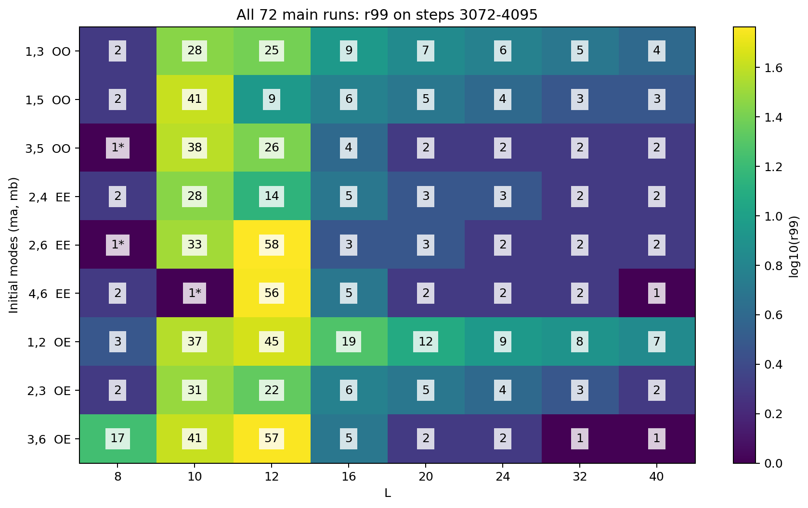
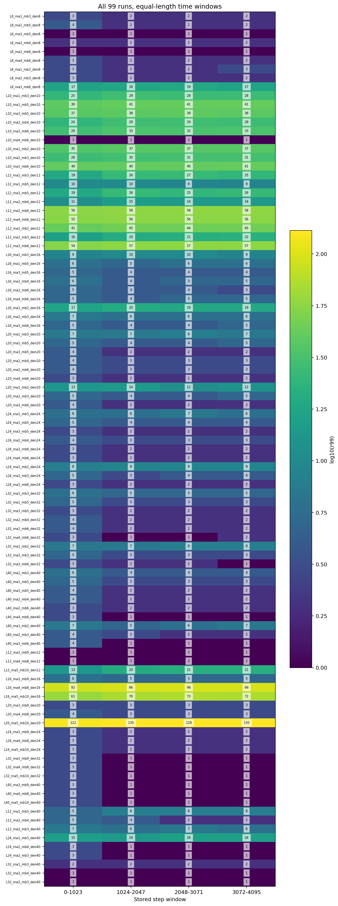
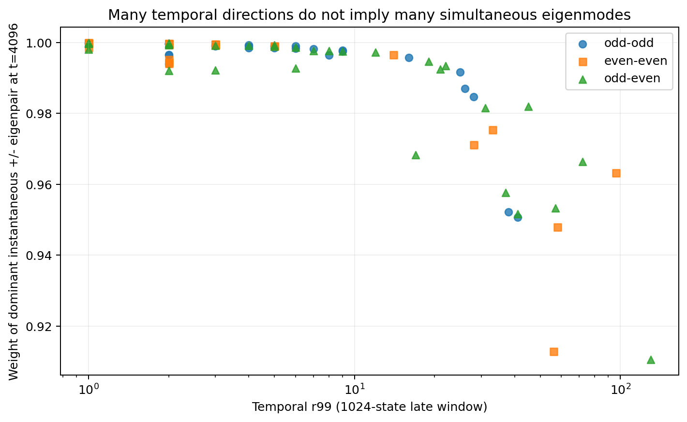
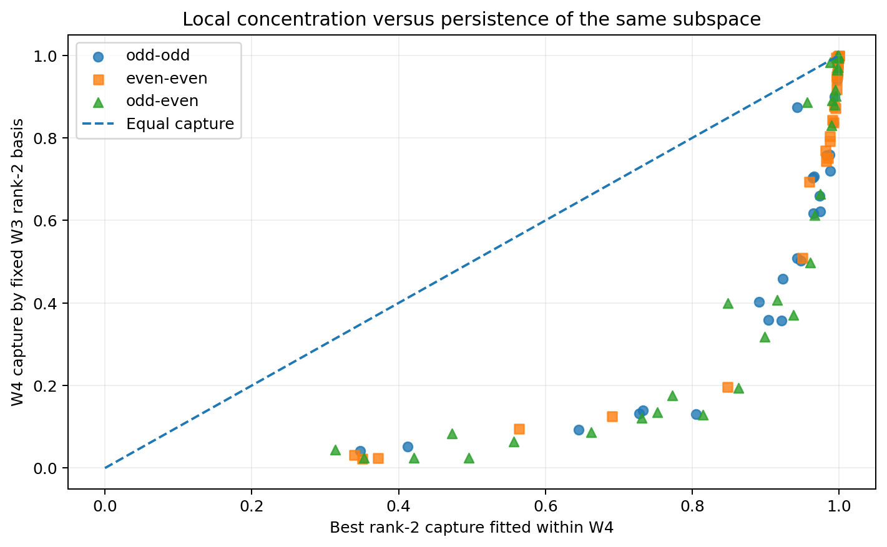
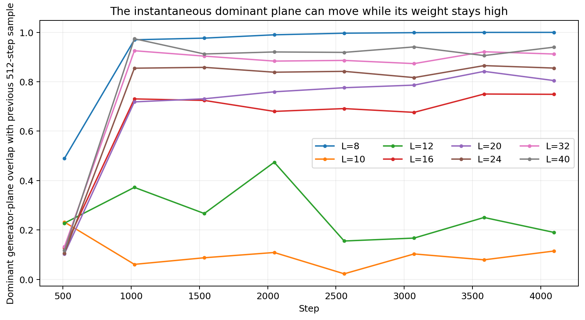
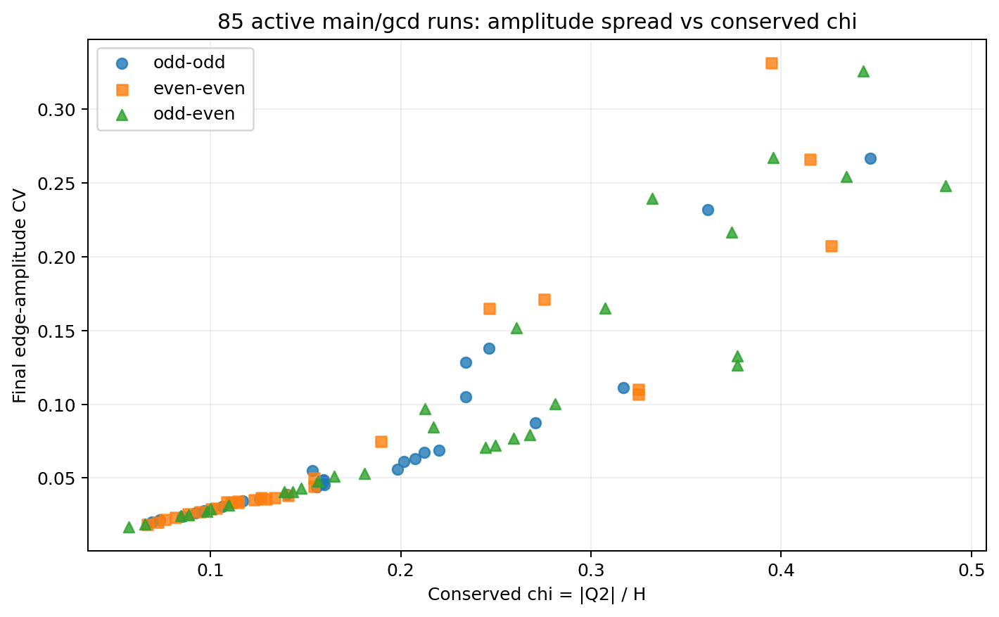
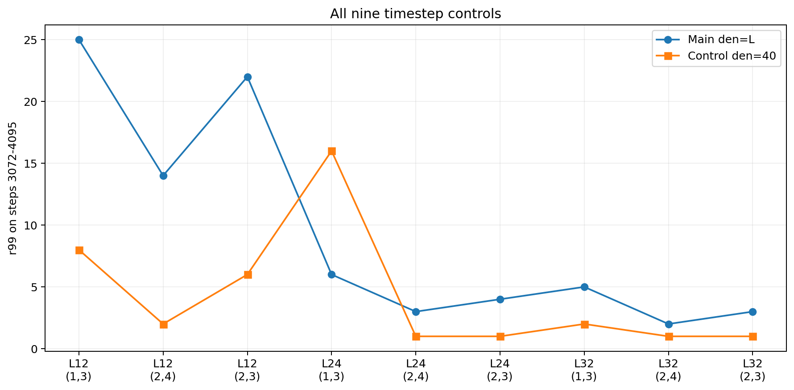
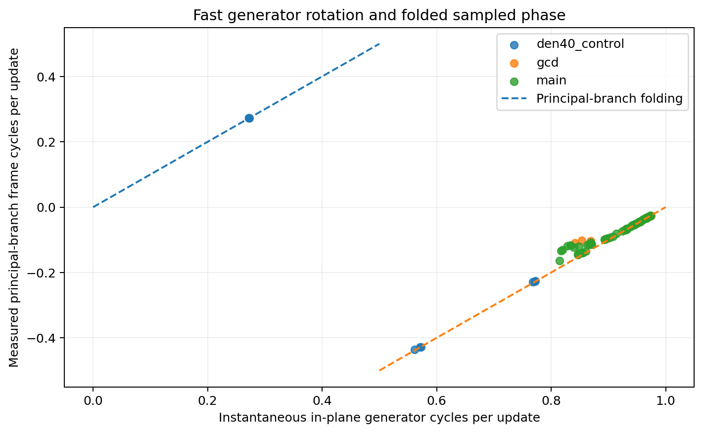

# 二波完全関係力学・99走行の全数解析
## 瞬時のモード集中、回転平面の移動、保存比、更新刻みを分離した探索的解析

対象：2026年9月15日収集の二波サーベイ。  
事前登録コミット：`1c0ec176172abf7465c73f3a8eac681edab12f69`  
収集完了コミット：`4b665512`  
解析：ChatGPT。元の99走行は変更せず、保存された全複素状態から再計算した。

**この文書は収集後の探索的解析である。収集の事前登録と、本解析の新しい観測量・時間窓を混同しない。物理的な粒子同定、時計の実在、一般解の成立は主張しない。**

---

## 1. 主結果

最も重要な結果は、「多モードに拡散した」か「二モードへ凝縮した」かという二択ではない。

**多数の走行では、その時点の生成子に対する一つの±固有値対へ状態の大部分が集まる。一方、その固有モードが張る平面自体が動くため、時間窓全体を固定した基底で表すSVDでは、多くの方向が必要になる。**

これと独立に、次のことを確認した。

1. 初期から解析的固定点となる5走行を除いた94走行すべてで、最終時点の辺振幅の変動係数が初期値より小さくなった。94走行すべてで、最終時点の支配的な瞬時±固有値対への配分も初期より増えた。
2. 偶奇だけでは結果を分類できない。今回の初期値族では、保存比 χ=|Q₂|/H が振幅のばらつきや後半の時間窓ランクを強く順序付ける。
3. 後半の低ランク性は、ほぼ静止した平均状態が大きいだけ、という説明ではない。非固定点94走行すべてで、平均を引いても r99 は変わらなかった。
4. 更新刻みを変えた9対照のすべてで後半 r99 が変わった。観測される長周期には、生成子の大きな回転角を2πで折り返して読む効果が含まれる。
5. 最初に与えた二モード部分空間の保存、初期状態へ戻る非自明閉路、物理的なビート時計の一般的成立は確認されていない。

---

## 2. 入力の実体監査と解析範囲

`states.npz` 99本のバイナリ実体を取得し、SHA256を再計算した。原 `SHA256SUMS.txt` と原 `qa_summary.json` の両方に全件一致した。各ファイルは4097×Mのcomplex128で、M=L(L−1)/2。重複・欠損・未知ファイルはなく、NaN/Infと厳密なゼロ辺もなかった。

- 99走行、合計405,603状態スナップショット。
- 合計107,779,779個の複素値を対象とした。
- 主系列72本、追加gcd系列18本、刻み対照9本。全体では奇奇・偶偶・奇偶が各33本。
- 解析的固定点5本を除くと94本。主系列とgcd系列をまとめ、対照を除いた非固定点集合は85本。
- 再計算した保存量ドリフトの最大値はH・Q₂とも1.807389167206476×10⁻¹²。事前閾値10⁻¹¹以下。
- 収集完了報告にある「最大8.5×10⁻¹⁴」は最大値の誤記である。全99本PASSという判定自体は変わらない。

QA合格は保存量・有限値などの品質を意味し、長期間の軌道誤差の厳密上界を意味しない。

原本資料は `source_records/` に収録した。生states 1.7 GBは本解析パッケージに重複収録していない。99本の照合結果は `raw_hash_audit.json`、各原本ハッシュは `overview_99.csv` と各run JSONに記録した。

### 時間窓

比較窓を全99本に共通の長さで固定した。

| 窓 | 使用する状態 |
|---|---|
| W1 | t=0…1023 |
| W2 | t=1024…2047 |
| W3 | t=2048…3071 |
| W4 | t=3072…4095 |
| full | t=0…4096 |
| 最終時点 | t=4096 |

tは保存データの更新番号であり、物理的な絶対時間との同定はしていない。W4のr99は、以前の300ステップ窓のr99と直接同じものではない。

### 観測量

H=Σ|zₑ|²、Q₂=Σzₑ²、χ=|Q₂|/H。
辺振幅の変動係数CV=std(|zₑ|)/mean(|zₑ|)。
初期モード残差η=‖Z−B B⁺Z‖/‖Z‖、B=[v_ma,v_mb]。非直交性を擬似逆行列で補正した。

時間窓の複素SVDでは特異値の二乗を規格化し、その累積が99%に達する最小の数をr99とした。r99は粒子数でも時空次元でもない。平均引き後のSVDも同じ基準で比較した。

---

## 3. 偶偶・奇奇・奇偶の全体比較

以下は主系列72本のW4のr99である。「＊」は初期から解析的固定点となる条件。

| 初期モード | 分類 | 8 | 10 | 12 | 16 | 20 | 24 | 32 | 40 |
|---|---|---:|---:|---:|---:|---:|---:|---:|---:|
| (1,3) | 奇奇 | 2 | 28 | 25 | 9 | 7 | 6 | 5 | 4 |
| (1,5) | 奇奇 | 2 | 41 | 9 | 6 | 5 | 4 | 3 | 3 |
| (3,5) | 奇奇 | 1＊ | 38 | 26 | 4 | 2 | 2 | 2 | 2 |
| (2,4) | 偶偶 | 2 | 28 | 14 | 5 | 3 | 3 | 2 | 2 |
| (2,6) | 偶偶 | 1＊ | 33 | 58 | 3 | 3 | 2 | 2 | 2 |
| (4,6) | 偶偶 | 2 | 1＊ | 56 | 5 | 2 | 2 | 2 | 1 |
| (1,2) | 奇偶 | 3 | 37 | 45 | 19 | 12 | 9 | 8 | 7 |
| (2,3) | 奇偶 | 2 | 31 | 22 | 6 | 5 | 4 | 3 | 2 |
| (3,6) | 奇偶 | 17 | 41 | 57 | 5 | 2 | 2 | 1 | 1 |

この表から直接言えることは次の通り。

**L=8では、多くの動的走行がr99=2に集中するが、奇偶(3,6)は17、奇偶(1,2)は3である。同じ奇偶でも結果は一様ではない。**

**L=10では非固定点8本すべてがr99=28〜41である。** 奇奇だけ、偶偶だけ、奇偶だけの現象ではない。

**L=12では主系列の全9本がr99=9〜58であり、(2,3)だけが特別な一般代表ではない。**

**L=16→20→24→32→40では、同じ初期モード組を追った9系列すべてで、W4のr99は非増加になった。** ただしLとともに辺数M、初期位相オフセットπ/L、更新刻み2π/Lも変わる。したがって、これをLだけの因果効果と断定してはいけない。

非固定点94走行全体では、W4のr99≤2が38本、そのうちr99=1が13本。r99≥10は24本だった。低ランク・高ランクの両方が存在する。

全99本・4窓の数値は `window_metrics.csv` に収録した。

---

## 4. 「初めから動かない5本」を、生成した安定性から分離する

初期値は因数分解すると、

$$
z_\Delta(0)
=
2\cos\!\left(\frac{\pi(m_b-m_a)\Delta}{L}+\frac{\pi}{2L}\right)
\exp\!\left(i\frac{\pi(m_a+m_b)\Delta}{L}\right).
$$

したがってma+mb≡0 (mod L)なら全辺が実数となり、位相差は0またはπ、K=0でF(Z)=Zになる。これは相互作用後に初めて得た結論ではなく、初期値の代数から従う。

| 条件 | 全期間の最大状態変位 / √H(0) | 最終生成子作用ノルム / √H(0) |
|---|---:|---:|
| L8_ma3_mb5_den8 | 2.5209e-11 | 7.8339e-15 |
| L8_ma2_mb6_den8 | 2.2722e-11 | 7.0614e-15 |
| L10_ma4_mb6_den10 | 2.7339e-11 | 1.0616e-14 |
| L12_ma3_mb9_den12 | 2.3128e-11 | 1.0775e-14 |
| L12_ma4_mb8_den12 | 2.8122e-11 | 1.3100e-14 |

これらの全期間最大変位は2.3〜2.8×10⁻¹¹程度であり、巨視的な動的変化はない。平均引き後のW4の状態ノルム比は約10⁻²⁴だった。これらを「凝縮が起きて停止した例」と数えていない。

一方、残り94本は全期間最大変位が1.79〜1.97（‖Z(0)‖単位）あり、単なる数値固定点とは明確に異なる。

---

## 5. 初期の二モードは保たれていない。しかし「多数の独立波になった」とはまだ言えない

非固定点94本のW4平均ηは0.546〜0.999、中央値約0.984だった。初期部分空間内に残るノルム二乗の時間平均は、94本での中央値が約3.1270%である。

したがって、**最初に与えたv_maとv_mbを、そのまま長期に独立に存在する二波として追い続ける読み方は、一般には支持されない。**

ただし、ここから「相互作用が多数の独立した波を生成した」と直結するのは誤りである。以下の瞬時生成子の分解と比較する必要がある。

### 瞬時生成子の分解

各保存状態からK(Z)を再構成し、Hermitian行列𝓗=iKを対角化した。計算時点は全99本共通でt=0,512,…,4096の9点。

辺–頂点接続行列をB_incとし、

$$
C=\operatorname{diag}(\cos\theta)B_{\rm inc},
\qquad
S=\operatorname{diag}(\sin\theta)B_{\rm inc}
$$

とおくと、

$$
K=CS^{\mathsf T}-SC^{\mathsf T}.
$$

これは元のline-graph生成子の厳密な因数分解であり、近似モデルへの変更ではない。非零固有値を最大2L次元の行列で計算し、零固有空間はまとめて計上した。

非固定点94本について、支配的な±固有値対のノルム配分は、

- 初期中央値：80.575%
- 最終中央値：99.8971%
- 最終最小値：91.0613%
- 最終最大値：99.9949%

となった。**最終配分は94本すべてで初期より増加した。** これは端点間の比較であり、全時点で単調増加したという意味ではない。

| 条件 | 後半 r99 | 最終瞬時±対の重み | W3基底でW4を説明する割合 |
|---|---:|---:|---:|
| L8_ma2_mb4_den8 | 2 | 99.4365% | 99.7281% |
| L10_ma1_mb5_den10 | 41 | 95.0657% | 4.1299% |
| L12_ma2_mb4_den12 | 14 | 99.6532% | 19.7096% |
| L16_ma4_mb8_den16 | 96 | 96.3337% | 2.5312% |
| L20_ma5_mb10_den20 | 130 | 91.0613% | 2.4426% |
| L40_ma2_mb4_den40 | 2 | 99.9447% | 87.2772% |

L20(5,10)は時間窓r99=130だが、最終瞬間には一つの±対へ91.06%が入っている。L12(2,4)はr99=14だが、瞬時の±対へ99.65%が入っている。

**時間窓SVDは「同じ基底で窓全体を説明する」問題を解く。瞬時生成子分解は「いまの更新でどのモードに状態が配分されているか」を読む。両者は別の量である。**

### 平面自体の移動

W3で決めた上位2方向を固定し、W4をどれだけ説明できるかも、全99本について計算した。

例えばL12(2,4), den=12では19.71%しか保持できない。L20(5,10)では2.44%。一方L8(2,4)では99.73%。

瞬時の支配的±対の平面についても512ステップ前との重なりを測った。集中の強さが大きくても、平面の向きが維持されるとは限らない。

ここから支持される解釈は、**「その時点の少数の支配的関係へ集中しながら、その関係を担う平面が移動する」**というもの。これを粒子数の増減と同定する根拠は、今回のデータにはない。

なお±固有値対は実反対称生成子の一つの実回転平面に対応する。これを、当初の二つの独立した波族そのものとは呼んでいない。

---

## 6. 低ランク性は、静的な平均成分による見かけではなかった

非固定点94本のW4における平均成分の割合、

$$
\frac{\|\overline Z\|^2}{\langle\|Z\|^2\rangle}
$$

は最大でも0.000142766、すなわち0.014277%だった。

**平均を引いたSVDでも、94本すべてでW4のr99は変わらなかった。** したがって、今回の後半窓では「ほぼ静的な平均の周囲に微小な揺れが乗っているだけ」という説明は支持されない。

これはcanonicalな複素位相表示の下での結果であり、時刻ごとに任意の大域位相を付け替えた平均まで不変だと主張していない。大域位相を除いた一段変位も別途記録した。

---

## 7. 偶奇より強い記述変数として、保存比χが現れた

全辺の振幅のばらつきは、非固定点94本すべてで最終値が初期値より小さい。最終CV/初期CVの中央値は0.10415。中央値として初期の約10.4%に減っている。

その残るばらつきとχ=|Q₂|/Hを照合した。

刻み対照を除く非固定点85本で、χと最終CVのSpearman順位相関は0.98454。χと後半r99は0.80964だった。

Lを固定した比較でも、L=24、32、40では、それぞれ12組すべてについてχの順位と最終CVの順位が完全一致した（順位相関1.000）。L=16、20でも0.965だった。

**この初期値族では、「偶数か奇数か」だけでなく、保存比χがどのセクターを選んだかを見ないと、結果を取り違える。**

ただし相関を因果的な唯一の説明には昇格しない。ma、mb、初期振幅配置、初期位相配置は連動している。また保存則だけからCVがχの一価関数になるわけでもない。

### χの幾何学的意味

α=arg(Q₂)/2とし、

$$
e^{-i\alpha}Z=a+ib
$$

と書けば、

$$
a\cdot b=0,\qquad
\|a\|^2=\frac{H+|Q_2|}{2},\qquad
\|b\|^2=\frac{H-|Q_2|}{2}.
$$

実直交更新は、この二つの長さと直交性を保つ。χはこの二方向の長さの非対称性を表している。この実二方向のGram条件を全非固定点・全保存時刻で数値確認し、最大誤差は6.13×10⁻¹³以下だった。

ここでa,bが二方向だからといって、M個の辺状態の力学が二つのスカラーだけへ厳密に縮約できたわけではない。a,bの向き自体がM次元の中で動くためである。

### r99=1でも、逆回転成分が消えたとは限らない

一つの固定された実平面内を十分に一巡する楕円回転という比較モデルでは、順・逆回転複素モードへの配分は、

$$
p_\pm=\frac{1\pm\sqrt{1-\chi^2}}{2}.
$$

χ<√0.0396≈0.199なら少数側は1%未満であり、99%基準でr99=1となっても、少数側の成分が数学的にゼロになったわけではない。

L24(2,4), den=40では、この比較式の少数側は0.448479%。最終瞬時スペクトルで実測した反対側は0.448376%だった。L40(5,10)では比較式0.081639%、実測0.081644%。

これは固定平面の比較式との近似的対応であり、全軌道が厳密な一平面運動であるとの証明ではない。94本の少数側重みの式との差は中央値6.81×10⁻⁶、最大0.004886で、複雑な走行ではずれが大きい。

---

## 8. 刻み対照は、全9本で結果を変えた

| L | 組 | 主刻み r99 | den=40 r99 | 主刻みピーク周期 | den=40ピーク周期 |
|---:|---|---:|---:|---:|---:|
| 12 | (1,3) | 25 | 8 | 10.2400 | 3.6703 |
| 12 | (2,4) | 14 | 2 | 10.7789 | 3.6571 |
| 12 | (2,3) | 22 | 6 | 10.4490 | 3.6571 |
| 24 | (1,3) | 6 | 16 | 19.6923 | 2.2857 |
| 24 | (2,4) | 3 | 1 | 22.2609 | 2.3379 |
| 24 | (2,3) | 4 | 1 | 21.3333 | 2.3326 |
| 32 | (1,3) | 5 | 2 | 25.6000 | 4.3761 |
| 32 | (2,4) | 2 | 1 | 29.2571 | 4.4138 |
| 32 | (2,3) | 3 | 1 | 28.4444 | 4.4138 |

周期はW4の平均引き後の全成分FFTを足し上げた最大ピークの周期で、単位は更新step。周波数ビン幅は1/1024であり、整数の厳密周期の認定ではない。

den=40で常に低ランク化するわけではない。L24(1,3)は6→16と逆に大きくなった。よって都合のよい例だけから「小刻みほど凝縮する」と結論できない。

また、denを変えると同じ4096stepが対応するτ範囲も変わる。固定刻み・固定総τの連続極限を調べた実験ではない。**現時点で言えるのは、この二つの離散写像と同じ更新回数の比較で結果が変わることまで。**

---

## 9. 長周期の読出しには、大きな回転角の折り返しが含まれる

正本の一段更新は、

$$
Z'=\exp(-i\Delta\tau\mathcal H)Z,\qquad
\mathcal H=iK,\qquad\Delta\tau=2\pi/\mathrm{den}.
$$

瞬時固有値λの成分は、一段でexp(−2πiλ/den)を掛けられる。保存状態間の位相差だけから読む周波数は、

$$
f_{\rm sample}
=
-\lambda/\mathrm{den}\pmod1
$$

で、主値では[−1/2,1/2)へ折り返される。

これは今回のカーネルの指数写像そのものの性質であり、外部の物理理論を仮定したものではない。

### L32・(2,4)の具体例

t=3584の瞬時生成子を密行列でも独立検算した。

| 条件 | 支配的固有値λ | 折り返し前の回転数/step | 主値の回転数/step |
|---|---:|---:|---:|
| den=32 | −30.9078247 | +0.96586952 | −0.03413048 |
| den=40 | −30.9396488 | +0.77349122 | −0.22650878 |

生成子の支配的固有値はほぼ同じ大きさだが、保存状態に見える周期は約29stepと約4.4stepへ変わる。W4 FFTのピーク周期も29.2571と4.4138だった。

全94本について、Q₂で向きを固定した実二方向から一段の平面内回転を読み、瞬時生成子の平面内回転と比較した。特に大Lの主系列は、生成子側が一段でほぼ一周進むため、主値では小さい逆向きの位相進行として見える。

**したがって、長周期や逆向きの巻きを、そのまま独立な固有時計の生成と解釈することはできない。** 生成子の回転、更新刻み、保存間隔、モード平面の移動を分ける必要がある。

一方で、離散写像F自体を基本法則とするなら、これはその写像の正当な挙動でもある。連続流の数値アーティファクトだと即断してはいない。またden変更は写像自体も変えるので、全ての差を単なる観測間引きだけでは説明していない。

上位SVD係数の相対位相に一方向の主値進行を持つ例も12本あったが、位相の折り返し、弱い第2成分、基底の移動を伴う。その検出だけでは物理的時計の確認にならない。今回、時計の一般的成立とは判定しない。

---

## 10. 閉路について言える範囲

初期状態への絶対回帰と、共通U(1)位相だけを許した回帰を全保存時刻で調べた。

非固定点94本の最小U(1)回帰残差は0.0717843で、該当はL40(5,10)のq=1。最小絶対残差も0.146927であり、数値誤差級の初期回帰はなかった。

したがって、**t≤4096の保存格子上で、初期状態に戻る非自明閉路は未検出**である。これは、過渡後の周期軌道の不在、連続的な途中時刻での回帰の不在、さらに長期間の閉路の不在を意味しない。

Q₂≠0のときにF^q(Z)=exp(iφ)Zが厳密に成り立つなら、二乗和保存よりexp(2iφ)=1が必要で、φは0またはπに限られる。この制約は二波間の位相差の進行を禁止するものではない。

今回の99初期値はすべてQ₂≠0である。χ=0の厳密零閉塞セクターについては、このサーベイだけでは一般化できない。

---

## 11. 偶奇を評価する上での、もう一つの厳密な制約

各辺の独立な符号反転D=diag(±1)に対して、辺値が非零の範囲で、

$$
K(DZ)=DK(Z)D,\qquad
F(DZ)=DF(Z)
$$

が成立する。

偶数Lで両モード番号へL/2を加えれば、Dₑ=(−1)^Δという符号反転になる。例えばL=10の(1,3)と(6,8)は、奇奇と偶偶であってもこの変換で軌道が対応する。後者は今回の99本にはないため、これはサーベイの観測例ではなくカーネルからの代数的帰結として記す。

**モード番号の偶奇は重要な比較軸だが、カーネルの同変性で対応する表現を区別する絶対的な分類とは限らない。** 物理的に同一視するかは、読出し写像を指定して別に考える必要がある。

---

## 12. 数値検算と限界

### 解析コードの検算

3条件で直接複素SVDを行い、共分散行列の固有値から得た値と照合した。規格化最大差は9.15×10⁻¹⁶以下。平均引き後も6.02×10⁻¹⁶以下。

6条件のt=3584で密生成子を対角化し、低ランク因数分解経由の固有値・重みと照合した。最大固有値差7.11×10⁻¹⁴、最大重み差2.00×10⁻¹⁵。同じ瞬間からの一段密更新と保存された次状態との差は1.97×10⁻¹⁴以下。

支配固有値の相対ギャップは全非固定点・全9サンプルの最小でも0.4896以上であり、この支配固有値が数値的縮退のため恣意的に分かれたという問題は検出していない。零固有空間は個別方向へ分解せず合算した。

### 限界

- 収集後に定めた探索的解析であり、新しい仮説を事前登録検証したものではない。
- 99本は独立なランダム反復ではない。順位相関はこの有限条件表の記述統計であり、母集団へのp値や因果性を主張しない。
- 主系列ではL、M、初期オフセット、denが連動する。因子を完全に独立化した実験ではない。
- 全Lが偶数であり、頂点数の偶奇は検証していない。二モード入力であって、二つの波族それぞれの基波・倍音を独立に持つ四成分実験ではない。
- 瞬時スペクトルは512step間隔の9点であり、その間の全瞬間についての単調性は判定していない。
- 静的平均の判定、SVD、フレーム回転はそれぞれ観測定義が異なる。物理的読出しとの同定は未実施。
- 4096stepで観測される緩和が指数・対数・さらに長い周期の一部のどれかは、この報告では決めていない。
- 保存量の良好さは長期軌道の精度保証ではない。特に敏感な軌道の詳細な位相には慎重な解釈が必要。

---

## 13. 元の研究目標に対する位置づけ

このデータは、初期の二モードをそのまま基本対象として保存する描像を支持しなかった。一方、**その時点の生成子で読むと、多数辺の状態が支配的な一つの回転平面に強く集中する**という構造は、条件を広げても現れた。

ここで問題になるのは、「固定された二モードか、多数モードか」だけではなく、**集中した平面の形と、その平面が関係空間内でどう移動するか**である。

これは、凝縮体を一つの代表波へまとめるという目標に対して、何を代表情報に含めなければならないかを具体化する。ただし現在の結果は、移動するモード平面を含めた有効力学が二つの代表複素数だけで閉じることを証明していない。

したがって本報告の結論は、

**「初期二モードは再編成される。瞬時には少数の回転構造へ集中する。しかしその構造自体の移動、保存比χ、更新刻みの効果を落とすと、波の数・時計・凝縮の読み方を誤る」**

である。

元の99走行をやり直したり延長したりせず、この全体像を次の実験の比較基準として残す。

---

## 14. 再現用ファイル

- `overview_99.csv`：全99本の主要比較表。
- `window_metrics.csv`：全99本×full/W1/W2/W3/W4。
- `all_runs_metrics.csv`：全観測量の詳細表。
- `instantaneous_metrics.csv`：全99本×9時点の瞬時生成子スペクトル要約。
- `all_frame_metrics.csv`：Q₂を基準にした実二方向の回転・平面移動。
- `timestep_comparisons.csv`：全9刻み対照の対比較。
- `all_results.json`、`all_instantaneous.json`、`all_frames.json`：詳細数値。
- `independent_analysis_checks.json`：独立SVD・密生成子との検算。
- `timeseries/`：全99本の派生時系列。元のstatesではない。
- `source_records/`：元の仕様書、manifest、QA、ハッシュ目録、カーネル。
- `executed_code/`：この実行に使ったコード。
- ルートのPythonコード：同じ数値処理を別ディレクトリで実行できるようパス指定を整理した版。使用法はREADME。

原データの名称・条件・ハッシュは保持し、解析用ファイルの追加だけで完結している。
