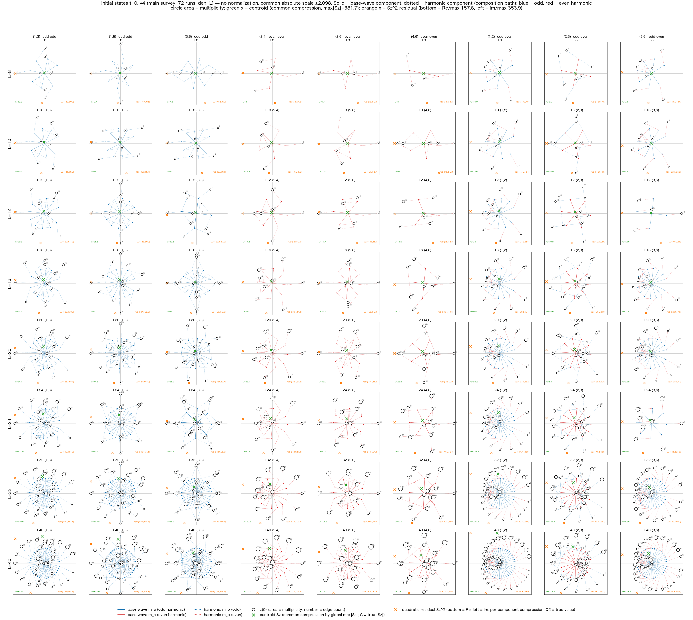
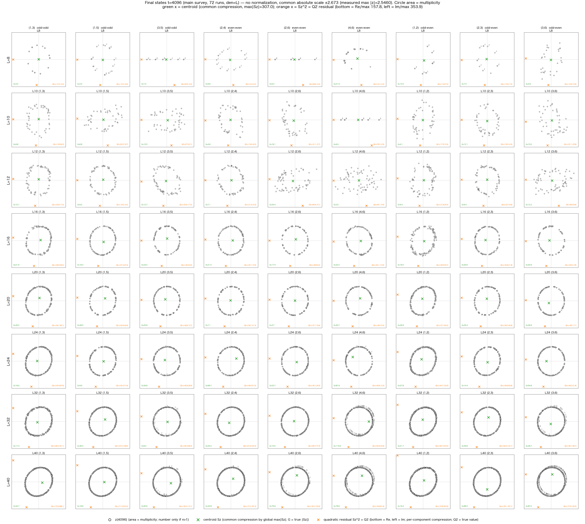
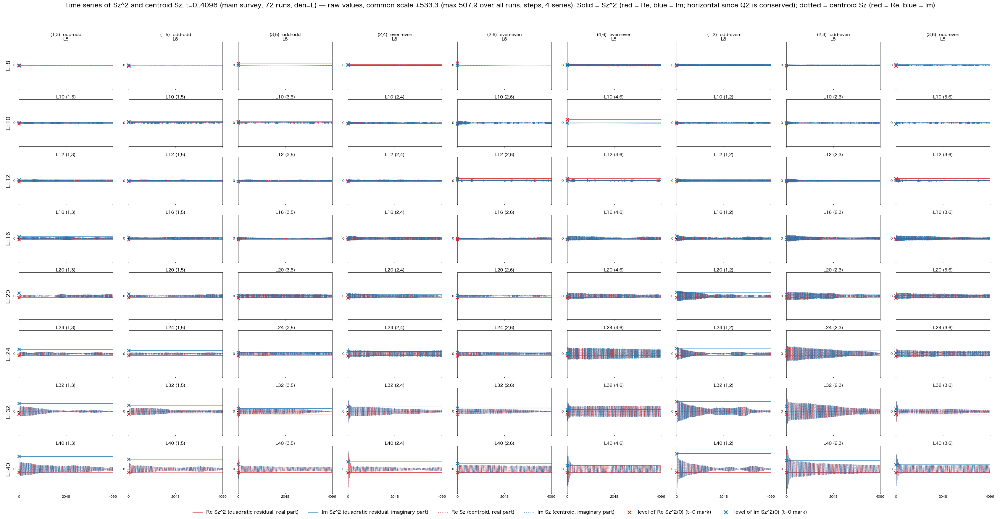
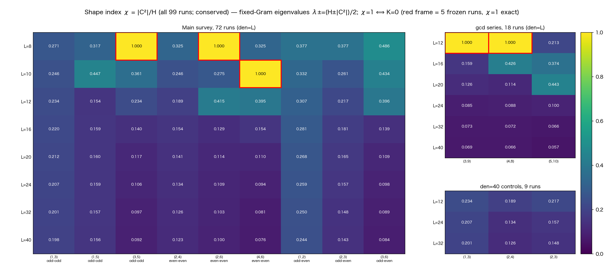

# The Clock Is Inside the Other — Quadratic Condensation and the Kepler Equation, Found by 99 Runs That Defied Expectations

Published: 2026-09-16　note: https://note.com/kiharanoriaki/n/na841c2f298db

I have published the paper
"Quadratic Condensation and Relational Local Time in a Many-Wave Complete Relational System — From Relational Closure without Spacetime as Fundamental Variables to the Kepler Equation and the Inverse-Square Central Force".

- Zenodo (Japanese and English Markdown, LaTeX, PDF): https://doi.org/10.5281/zenodo.22788738
- GitHub (English PDF): https://raw.githubusercontent.com/WurabeSeiji/ai-chat-logs-open/main/%E6%AC%A1%E5%85%83%E3%81%AE%E7%94%9F%E6%88%90%E6%A7%8B%E9%80%A0/%E8%87%AA%E7%99%BA%E7%9A%84%E5%88%86%E8%A3%82%E4%BA%88%E5%82%99%E5%AE%9F%E9%A8%93_v1_N40%E5%AF%BE%E7%85%A7%E5%AE%9F%E9%A8%93%E7%B3%BB_20260904/%E9%9D%99%E7%9A%84%E5%AE%8C%E5%85%A8%E3%83%8D%E3%83%83%E3%83%88%E3%83%AF%E3%83%BC%E3%82%AF_Z4%E8%A2%AB%E8%A6%86%E6%99%82%E7%A9%BA_%E6%A4%9C%E8%A8%8E_20260915/%E4%BA%8C%E6%B3%A2%E5%88%86%E9%9B%A2_%E5%9B%BA%E6%9C%89%E5%91%A8%E6%9C%9F_CRT%E6%A4%9C%E8%A8%BC_20260915/%E4%BA%8C%E6%B3%A2%E3%82%B5%E3%83%BC%E3%83%99%E3%82%A4_%E7%94%9F%E8%BB%8C%E9%81%93%E3%83%87%E3%83%BC%E3%82%BF%E3%83%99%E3%83%BC%E3%82%B9_20260915/figures_v1/quadratic_condensation_relational_local_time_en_v0_2_20260916.pdf
- Japanese version of this article: https://note.com/kiharanoriaki/n/n5f7376624629

This paper is the direct sequel to paper 1, "A Finite Complete-Relation Closed System with Time Evolution as Vertices". There, without advancing time from outside, the states at different phase instants were themselves treated as vertices, and the minimal closed system was analyzed exactly with just two waves.

This time, that two-wave structure is extended to a complete network carrying many relational waves.

## Motivation: I went looking for relaxation curves

The system is built as follows. For a finite cyclic length L, one complex relational wave is placed on every edge of the complete graph. The initial state is nothing but a superposition of two integer harmonics:

　z(0) = ca U^(ma Δ) + cb U^(mb Δ)

The dynamical kernel is never told the harmonic numbers or their parity. A real antisymmetric generator is built only from the relative phases of waves sharing a vertex, and all states are updated simultaneously.

The conditions were frozen by preregistration: 99 runs sweeping the system size L and the harmonic pairs (ma, mb), 4096 steps each, all states stored. Changing conditions after seeing results was forbidden. This is the collection of a raw-trajectory database.

Initial states of all 99 runs. Each panel is one run, overlaying the two-component composition paths (solid = base wave, dotted = harmonic), edge multiplicities, the centroid (green x), and the quadratic sum (orange x).

The target was the relaxation-type temporal structure observed in earlier high-symmetry experiments: staying on a floor for a while, then rising suddenly, then saturating. I intended to map out systematically under which conditions that inflation-like relaxation curve appears.

## Result: not a single relaxation curve appeared

Of the 99 runs, 5 stayed frozen as exact fixed points. The other 94 left the initial plane within the first few steps. Runs that lingered on the floor and then rose: zero.

The long-time states look like this.

All 99 runs after 4096 steps. Large-L systems condense into rings of nearly equal amplitude, while exactly 5 runs remain frozen in their initial configuration.

The expected phenomenon did not appear. But in place of that failure, a simpler and stronger structure was found running through all 99 runs.

## Discovery: the quadratic sum is an exact conserved quantity

For each run, track the unconjugated quadratic sum of all waves,

　Σ z² = C²,

over every step: it is a perfectly horizontal line. This contrasts with the centroid Σ z, which oscillates violently and sometimes amplifies well beyond its initial value.

Time series over all 99 runs: the quadratic sum (solid) is a horizontal line in every panel — exact conservation. Only the centroid (dotted) oscillates.

This is no numerical accident. Because the generator is real antisymmetric (K^T = −K), each simultaneous update is a real orthogonal transformation, and the unconjugated quadratic sum is conserved as an algebraic identity. In the numerical audit, the drift over all 99 runs and 4097 states stayed within a relative 10^-12.

Here a rereading takes place. Instead of viewing this quantity as a deviation from zero, read it as:

　one complex number C² exactly represents the many internal waves.

I call this quadratic condensation. Not an approximation, not an average — an identity.

Moreover, however many condensates you gather,

　Σ Cn² = Σ z² (total)

holds across the hierarchy in the same form. Quadratic closure is form-invariant under coarse-graining by condensation.

## The shape was decided from the start: the shape index χ

When the energy H and C² are conserved together, the shape of the two-frame spanned by the real and imaginary parts of the state (its Gram matrix) is fixed. That shape is captured by a single number,

　χ = |C²| / H　(0 ≤ χ ≤ 1).

The motion never changes the shape. The fixed two-frame merely rotates inside a high-dimensional space.

χ for all 99 runs. Exactly the 5 red-framed runs have χ = 1 (exact) — and they coincide perfectly with the 5 frozen runs.

A theorem follows. If all components are nonzero and the coupling is connected,

　χ = 1 ⟺ K = 0 (exact fixed point).

So the 5 frozen runs were no coincidence: they are the analytic consequence of χ = 1. Furthermore, χ has a closed form in the initial integers (L, ma, mb) alone, matching the measurements of all 99 runs to machine precision. The shape of each run was decided before the 4096 steps were ever run.

## The clock is inside the other

C itself carries the two-valuedness of the square root (C and −C), so the basic invariant is C². From its argument, a relational phase between condensates A and B,

　Ũ(A→B) = e^(i(ΘB − ΘA)),

is defined single-valuedly. The reverse direction is exactly the inverse. For three bodies the composition law Ũ(A→B) Ũ(B→C) = Ũ(A→C) holds, so the clocks compose consistently over the whole relational network.

No absolute clock is needed anywhere. B is a clock for A, and A is a clock for B.

And at the minimal closure C1² + C2² = 0 we get Ũ = −1, whose square roots are +i and −i. Reversing the order of the relation swaps +i and −i. The direction of time was not a variable added from outside — it is the freedom carried by the square-root structure of the quadratic itself.

## And then Kepler appears

Writing the fixed two-frame in principal axes and adding the complementary component i√|C²|, the three-component state satisfies the quadratic zero closure Σ V² = 0 exactly, while giving the elliptic motion

　u(τ) = a cos ωτ + i b sin ωτ.

Apply the squaring map

　w = u².

An ellipse appears whose one focus falls exactly on the origin. And its eccentricity coincides exactly with

　e = χ.

The shape index is precisely the eccentricity of the Kepler ellipse after the squaring map. C² = 0 corresponds to the circular orbit.

Positing just one axiom for reading the clock,

　dt = r dτ

(this is an axiom, not a derivation — the paper says so explicitly), all of the following are derived:

- the Kepler equation　M = E − e sin E
- the constancy of areal velocity (the second law)
- the inverse-square central force　d²r/dt² = −μ r / r³
- the third law　n² A³ = μ

The squaring correspondence between the harmonic oscillator and the Kepler problem is itself classical, going back to Bohlin and Levi-Civita. What differs here is that the squaring map was not assumed to build the model — it emerged independently from relational closure and the fixed Gram geometry — and that the time variable t itself is not given from outside but appears as the readout of a relational clock.

## What is established, and what is assumed

The paper explicitly separates 16 established mathematical and numerical results from 8 items not yet established.

Established: the exact conservation of the quadratic sum; the form invariance of quadratic condensation and hierarchical closure; the equivalence of χ = 1 with fixed points; the closed form of χ; the antisymmetric quadratic flux between condensates; the composition law of the relational phase and its double cover; e = χ under the squaring map; and the family of Kepler laws under the readout axiom.

Not yet established: what the condensates correspond to in reality; the derivation of the readout axiom dt = r dτ itself; the generation conditions of relaxation curves; and more. A hypothesis attempted and withdrawn along the way — identifying the hyperbolic angle with the orbit parameter contradicts the periodicity — is also kept in the paper as a record of the investigation.

## Closing

In one chain:

　real antisymmetry → conservation of H and C² → fixed Gram → quadratic condensation and hierarchical closure → relational clocks → squaring map → e = χ → dt = r dτ → Kepler equation → inverse-square force

Without placing physical time or spatial coordinates as fundamental variables, conserved geometry, local clocks, the Kepler equation, and the inverse-square central force are connected by a single quadratic structure.

The starting point was a failure: not one of the expected relaxation curves appeared. Preregistering the 99 runs and keeping every result without bending the conditions is what allowed this conservation law to be found.

The next task is to construct multiple condensates preserving quadratic closure explicitly, and to test independently whether the earlier inflation-type relaxation curves are reproduced in the intermediate regime — high symmetry, centroid near the origin, yet not an exact fixed point.

The full paper (Japanese and English, with 11 figures) is published on Zenodo.

- Version DOI: https://doi.org/10.5281/zenodo.22788738
- Concept DOI: https://doi.org/10.5281/zenodo.22788737
- GitHub (English PDF): https://raw.githubusercontent.com/WurabeSeiji/ai-chat-logs-open/main/%E6%AC%A1%E5%85%83%E3%81%AE%E7%94%9F%E6%88%90%E6%A7%8B%E9%80%A0/%E8%87%AA%E7%99%BA%E7%9A%84%E5%88%86%E8%A3%82%E4%BA%88%E5%82%99%E5%AE%9F%E9%A8%93_v1_N40%E5%AF%BE%E7%85%A7%E5%AE%9F%E9%A8%93%E7%B3%BB_20260904/%E9%9D%99%E7%9A%84%E5%AE%8C%E5%85%A8%E3%83%8D%E3%83%83%E3%83%88%E3%83%AF%E3%83%BC%E3%82%AF_Z4%E8%A2%AB%E8%A6%86%E6%99%82%E7%A9%BA_%E6%A4%9C%E8%A8%8E_20260915/%E4%BA%8C%E6%B3%A2%E5%88%86%E9%9B%A2_%E5%9B%BA%E6%9C%89%E5%91%A8%E6%9C%9F_CRT%E6%A4%9C%E8%A8%BC_20260915/%E4%BA%8C%E6%B3%A2%E3%82%B5%E3%83%BC%E3%83%99%E3%82%A4_%E7%94%9F%E8%BB%8C%E9%81%93%E3%83%87%E3%83%BC%E3%82%BF%E3%83%99%E3%83%BC%E3%82%B9_20260915/figures_v1/quadratic_condensation_relational_local_time_en_v0_2_20260916.pdf

See also the previous work:

- Paper 1 note article (English): https://note.com/kiharanoriaki/n/n17676d930a0c

#TheoreticalPhysics #Time #ConservationLaw #ComplexNumbers #Kepler #CelestialMechanics #GraphTheory #CompleteGraph #Harmonics #NumericalExperiment #Preregistration #Relationalism #Physics #ResearchNote
