# 多波完全関係系における二乗凝縮と関係的局所時間
## ―― 時空を基本変数として仮定しない関係閉塞からケプラー方程式と逆二乗中心力へ

**著者:** 木原 範昭（WF System Co., Ltd.）  
**ORCID:** 0009-0004-6753-4020  
**日付:** 2026-09-16  
**版:** v0.2 日本語完成稿  
**Version DOI:** [10.5281/zenodo.22788738](https://doi.org/10.5281/zenodo.22788738)  
**Concept DOI:** [10.5281/zenodo.22788737](https://doi.org/10.5281/zenodo.22788737)  

---

## 要旨

本研究は、先行研究で構成した有限完全関係閉系を、多数の関係波を含む非線形系へ拡張した数値実験から得られた予期しない保存構造を報告する。初期状態は二つの整数倍音成分の線形和から生成し、その後の力学カーネルには倍音番号や偶奇分類を渡さず、共有頂点を持つ関係波間の相対位相のみから実反対称生成子を構成して全状態を一斉更新した。事前登録した99走行を4096 stepまで実行したところ、当初期待していた「床への長い滞在、onset、飽和」という緩和型発展は得られず、5走行は厳密固定点、残る94走行は初期平面からほぼ即時に離脱した。

一方、全走行・全時刻を通じて

$$
\boxed{\sum_m z_m^2=C^2}
$$

が同一の複素定数 $C^2$ として保存されることが確認された。これは更新行列が実直交であることから厳密に従う。本稿ではこの恒等的保存構造を、多数の内部波を一つの複素二乗量で代表できる**二乗凝縮（quadratic condensation）**として読む。各凝縮体 $n$ に対して

$$
C_n^2=\sum_m z_{nm}^2
$$

と定義すると、

$$
\sum_n C_n^2=\sum_{n,m}z_{nm}^2
$$

であり、上位階層に再び

$$
\boxed{\sum_n C_n^2=0}
$$

を課すことができる。したがって、二乗閉塞は内部自由度を凝縮しても同じ形式で階層的に閉じる。

さらに $H=Z^\dagger Z$ と $C^2=Z^TZ$ の同時保存は、状態の実部・虚部の Gram 行列の固定と等価であり、固有値 $\lambda_\pm=(H\pm|C^2|)/2$ と形状指標 $\chi=|C^2|/H\in[0,1]$ を定める。全成分非零・連結の下で $\chi=1\iff K=0$ が成り立ち、実測でも99走行中の厳密固定点5走行のみが $\chi=1$ であった（他は $\chi\le0.486$）。凝縮体分割に対しては反対称二乗流 $J_{nm}=2Z_n^TK_{nm}Z_m=-J_{mn}$ が定義でき、$\dot C_n^2=\sum_{m\ne n}J_{nm}$ — 局所保存・二体交換・全体閉塞が一つの構造で接続する。さらに、二モード初期族では $\chi$ は $(L,m_a,m_b)$ の閉形式で決まり、局所 Gram 形状は時間発展を実行する前に決定される。

さらに最小二凝縮体系

$$
C_1^2+C_2^2=0
$$

では $C_2=\pm iC_1$ となり、90度位相関係が得られる。この閉塞を保存する状態変換は実直交変換として定義でき、連続表示では実反対称生成子による保存運動となる。ここでは外部の物理時間を基本変数として仮定する必要がない。二つの局所凝縮体 $A,B$ が存在するとき、AにとってB、BにとってAが相対位相を通じた時計となり、絶対時計は必要ない。二乗代表量から一価な関係位相 $\tilde U_{AB}$ が定まり、その二重被覆上の二つの持ち上げが最小閉塞における二つの時間方向 $U_{AB}=\pm i$ を与える。時間そのものの完全な導出は次段階の課題である。本稿が示すのは、長い内部状態系列が一つの不変二乗セクターに閉じること、および局所時計が系間関係として定義可能であることである。

さらに、固定 Gram 2-frame を二乗写像すると、一方の焦点が原点に一致する楕円が得られ、その離心率は $\chi=|C^2|/H$ に厳密に一致する。補完成分 $i\sqrt{|C^2|}$ を加えた3成分埋め込みでは、二乗ゼロ閉塞を保ったまま任意の非縮退楕円離心率 $0\le e<1$ が表現され、$C^2=0$ が円軌道に対応する。時計読み出し公理 $dt=r\,d\tau=|u|^2d\tau$ を置くと、偏心近点角に対するケプラー方程式が現れ、同じ変換から面積速度一定および逆二乗中心力 $\ddot{\mathbf r}=-\mu\,\mathbf r/r^3$ が導かれる。したがって本系では、物理時間・空間座標を基本変数として出発点に置かずに、ケプラー力学の中心構造が再構成される。

インフレーション型の緩和発展については、本99走行が厳密固定点と低対称即時離脱の両極のみを標本化していた可能性が高い。過去の高対称90度配置で観測された緩和曲線との比較から、高い対称性を保ちつつ固定点からわずかに外れ、かつ重心が原点近傍にある「中間窓」が候補となる。その検証手順は結論に示す。

**キーワード:** 完全関係系、二乗凝縮、二乗閉塞、固定Gram幾何、形状指標χ、階層閉塞、反対称二乗流、関係的局所時間、二重被覆、二乗写像、ケプラー方程式、逆二乗中心力

---

# 1. はじめに

先行研究[K1]では、外部時間を最初から特別な物理変数として置くことなく、有限個の位相状態そのものを同種の状態頂点として扱い、完全関係ネットワークとして閉じる最小厳密系を解析した。特に

$$
U^K=I
$$

に対して $N=1,K=4$ を取り、基底波と1本の整数倍音

$$
S_k=(U^k,U^{mk})
$$

を用いることで、偶数倍音と奇数倍音の位数、完全関係距離、二乗閉塞の違いを厳密に比較した。

その直接の背景となった先行研究[K2]では、$N$ 頂点の完全グラフに

$$
M=\frac{N(N-1)}{2}
$$

本の複素関係波を置き、高対称な90度位相系列近傍から非線形相互作用を反復すると、初期の十字架状帯から急激な横方向成分増大を経て、ほぼ等振幅で位相が広く分散した準安定リングへ移ることが数値的に観測された。

本研究の当初の動機は単純であった。論文1[K1]の二波構造を、より多数の関係波を持つ完全関係系へ拡張し、偶数・奇数倍音、固有周期、有限閉路、長時間発展の間にどのような一般構造が現れるかを調べることである。

結果は期待と異なった。99走行を4096 stepまで実行しても、狙っていた緩和型の時間構造は得られなかった。しかしその代わりに、全走行を貫く、より単純で強い恒等構造

$$
\boxed{\sum_m z_m^2=C^2}
$$

が現れた。

本稿の目的は、この結果を以下の三段階に分けて整理することである。

1. **数値的事実:** 99走行の非線形発展で $\sum_m z_m^2$ が同一の複素定数として保存された。
2. **数学的帰結:** 多数の内部波を一つの二乗代表量 $C^2$ に厳密縮約でき、その縮約は階層化に対して閉じている。
3. **物理解釈候補:** 複数凝縮体の相対位相関係から、絶対時計を仮定しない局所時計を定義できる可能性がある。
4. **幾何学的帰結:** 固定 Gram 幾何の二乗写像からケプラー楕円を導出する（離心率 $e=\chi$）。
5. **力学的帰結:** 時計読み出し公理 $dt=|u|^2d\tau$ の下で、ケプラー方程式および逆二乗中心力を再構成する。

本稿では、上記1・2・4・5を数学的・数値的結果として扱い、3は解釈および今後の検証課題として区別する。

---

# 2. 数値実験系

## 2.1 初期状態

有限巡回長 $L$ に対し、

$$
U=\exp\left(\frac{2\pi i}{L}\right)
$$

とする。完全グラフの無向辺を $e=(j,k)$, $j<k$ とし、

$$
\Delta=k-j
$$

を用いる。

二つのモード番号 $m_a,m_b$ に対し、初期状態を

$$
z_{jk}(0)
=
c_a U^{m_a\Delta}
+
c_b U^{m_b\Delta}
$$

と置く。ただし

$$
c_a=e^{-i\pi/(2L)},
\qquad
c_b=e^{+i\pi/(2L)}.
$$

したがって、初期状態は**二つの有限位相波を重ねただけの単純な構成**である。モード番号は初期条件生成にのみ用い、その後の力学には渡さない。

## 2.2 完全関係力学

二辺 $e,f$ が頂点を共有するとき隣接とし、線グラフ隣接行列を $A_{ef}$ とする。各状態を

$$
z_e=|z_e|e^{i\theta_e}
$$

と書き、実反対称生成子

$$
K_{ef}(Z)
=
A_{ef}\sin(\theta_f-\theta_e)
$$

を構成する。

一ステップ更新は

$$
\boxed{
Z'=\exp(\Delta\tau K(Z))Z
}
$$

である。ここで

$$
K^T=-K
$$

なので、

$$
R(Z)=\exp(\Delta\tau K(Z))
$$

は各ステップで実直交行列となる。

$K$ は状態依存であり力学全体は非線形だが、**各一斉更新そのものは実直交変換**である。

## 2.3 99走行サーベイ

事前登録したサーベイは合計99走行であり、すべて

$$
t=0,\ldots,4096
$$

の4097状態を保存した。

**表1　99走行の条件構成**

| 系列 | $L$ | モード対 | den | 走行数 |
|---|---|---|---|---:|
| 主サーベイ | 8,10,12,16,20,24,32,40 | (1,3),(1,5),(3,5),(2,4),(2,6),(4,6),(1,2),(2,3),(3,6) | $L$ | 72 |
| gcd 系列 | 12,16,20,24,32,40 | (3,9),(4,8),(5,10) | $L$ | 18 |
| 刻み対照 | 12,24,32 | (1,3),(2,4),(2,3) | 40 | 9 |
| **合計** |  |  |  | **99** |

全99走行がQAを通過し、元データは後処理によって変更していない。

---

# 3. 初期状態カタログ：二波生成子が作る幾何

本カタログ（図1）は、同一の99初期状態に対して「点配置」「二成分フェーザ合成路と重複辺数」「重心」「二乗代表量」を一枚に重ねた完成図である。以下の各小節は図1の各要素に対応する。

**図1a　初期状態カタログ（完成図）：主サーベイ72走行**

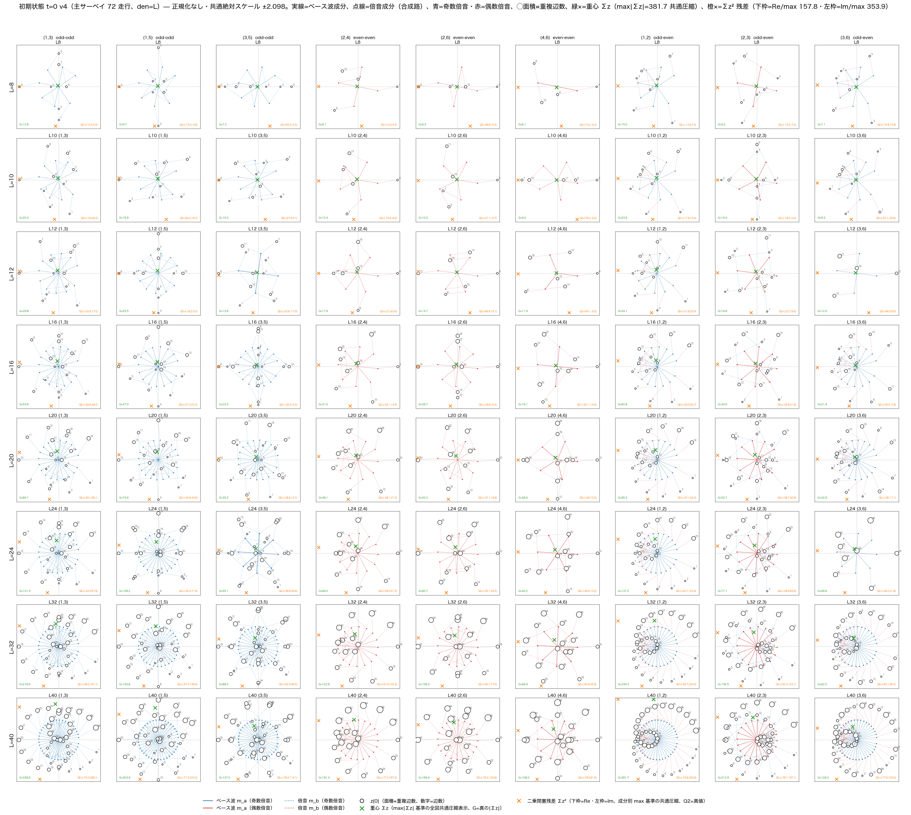

**図1b　初期状態カタログ（完成図）：gcd系列18＋den=40対照9**

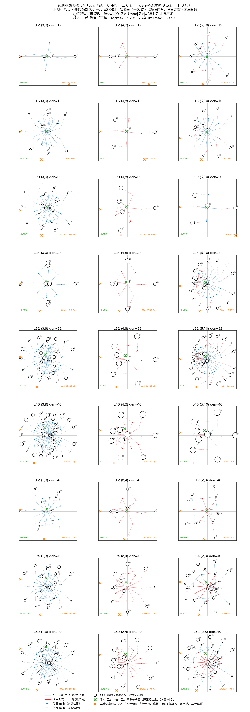

## 3.1 点配置

初期状態は $\Delta=k-j$ のみに依存するため、多数の辺が同一点へ縮退する。全辺は非零であり、$L$ が増えるにつれて星型、十字型、疎配置、二重リングなど、モード対に応じた特徴的配置が現れる。

## 3.2 二成分合成経路と重複数

図1の合成路（実線＝ベース波成分、点線＝倍音成分）は、一つの初期複素数 $z_e(0)$ が二つのモード成分の和として生成されることを明示する。力学が複雑であっても、出発点は二成分の単純合成である。

## 3.3 重心

全99走行で重心

$$
G=\sum_e z_e
$$

は非零であった。重心は保存量ではなく、時間発展中に大きく組み替わる。したがって、本稿では重心を凝縮体の保存代表量とはみなさず、**対称配置の程度を読む補助量**として扱う。

## 3.4 二乗量

図1の外枠マーク（$\sum z^2$ の実部・虚部）を作成した時点では $\sum z^2$ を「二乗閉塞残差」と呼び、ゼロからの偏差として読んでいた。しかし後の全時系列比較によって、この読み方は不十分であることが分かった。

全99走行で

$$
\sum_e z_e^2\neq0
$$

であること自体は「閉塞の破れ」ではない。むしろ各走行について

$$
\boxed{
\sum_e z_e^2=C^2
}
$$

という**固有の複素定数 $C^2$** が選ばれ、その同じ値が全時間で保存されている。

したがって、本稿では以後これを残差ではなく**二乗代表量**と呼ぶ。

---

# 4. 完全線形合成波形

各辺に担わせた二つの生成波を全 $M$ 辺について線形合成すると、初期状態がどの周波数成分をどの利得で含むかを直接確認できる。

**図2a　全 $M$ 辺波の完全線形合成波形：主72**

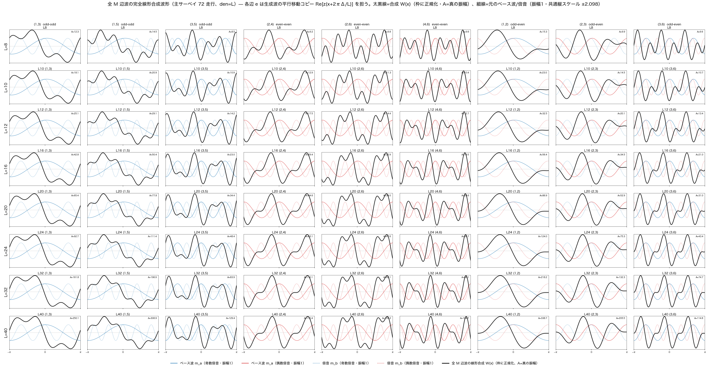

**図2b　全 $M$ 辺波の完全線形合成波形：gcd＋対照**

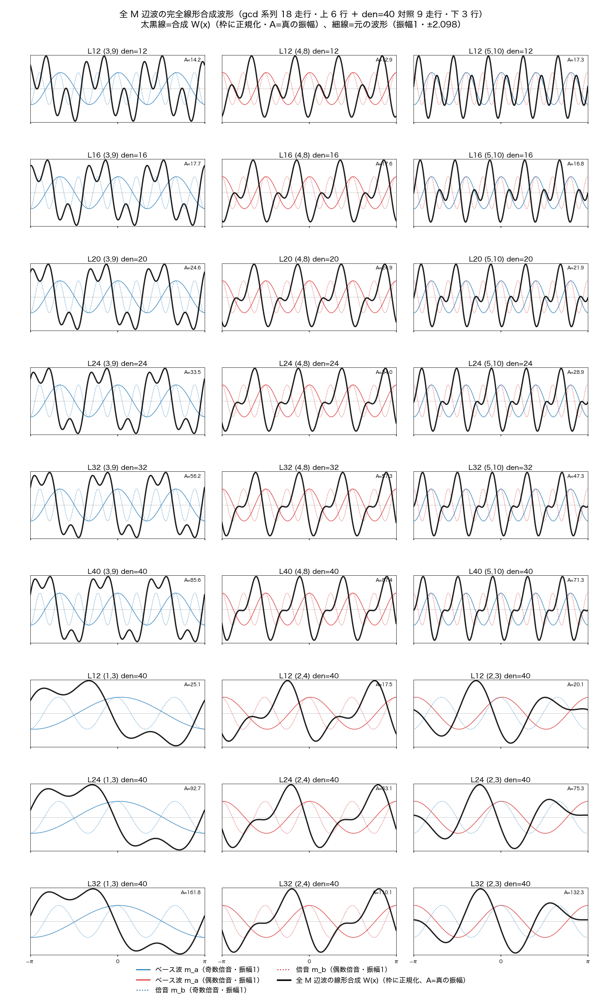

初期二モードを $m_a,m_b$ とすると、全辺合成は

$$
W(x)
=
\Re\left[
\left(\sum_e A_e\right)e^{im_ax}
+
\left(\sum_e B_e\right)e^{im_bx}
\right]
$$

と書ける。小さい $m/L$ では基本波側が優勢となる場合が多いが、有限巡回系では $\sin(\pi m/L)$ の折り返しがあるため、単純な連続周波数比とは異なる利得反転も生じる。

初期構成は二波だが、その後の非線形力学はモードラベルを知らない。したがって、後に得られる二乗保存は「倍音番号を固定して保存した」結果ではない。

---

# 5. 最終状態：4096 step後の内部再編成

**図3a　最終状態 $t=4096$：主72**

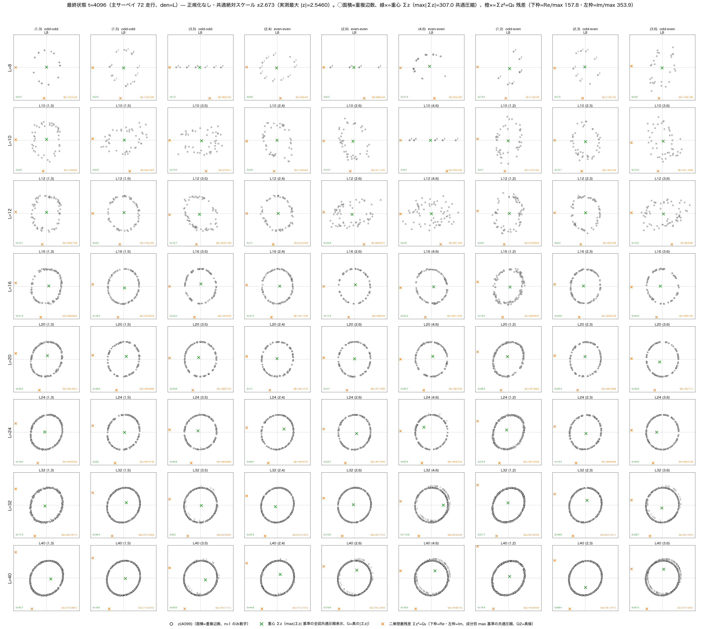

**図3b　最終状態 $t=4096$：gcd＋対照**

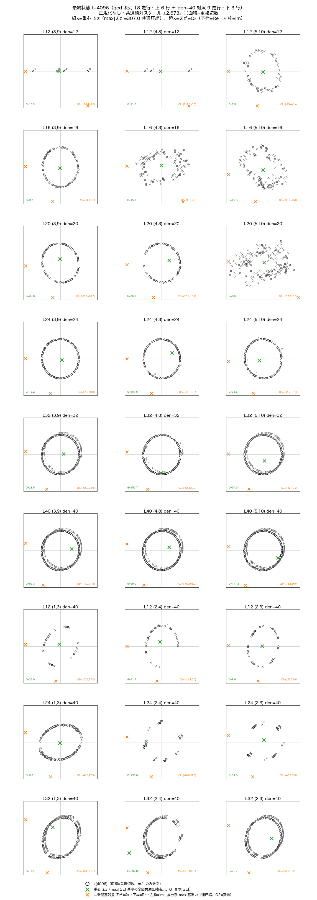

$L\ge16$ の多くの走行では、初期の縮退した点配置が崩れ、振幅が近いリング状の分布へ再編成された。一方、

$$
m_a+m_b\equiv0\pmod L
$$

を満たす5走行は、初期状態が共通位相を除いて実ベクトルとなり、

$$
K=0
$$

の厳密固定点として初期配置を保った。この5走行は §6.3 の定理（$\chi=1\iff K=0$）の実例であり、$\chi=1$ を厳密に満たす（図5）。

したがって内部状態は、走行によって静止する場合も、大きく再配置される場合もある。しかし次節で示すように、どちらの場合でも二乗代表量 $C^2$ は同じ意味で保存される。

---

# 6. 中心結果：$\sum z_m^2=C^2$ は全時間で厳密に閉じる

## 6.1 数値観測

**図4a　$\sum z^2$ と重心 $\sum z$ の時系列：主72**

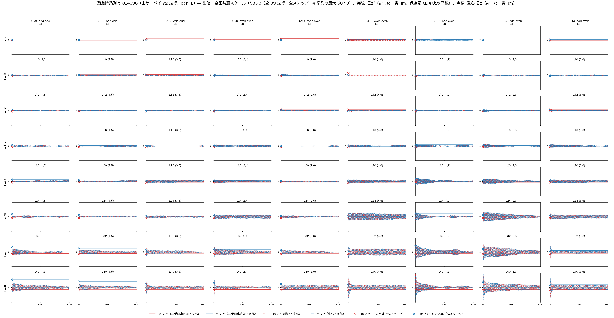

**図4b　$\sum z^2$ と重心 $\sum z$ の時系列：gcd＋対照**

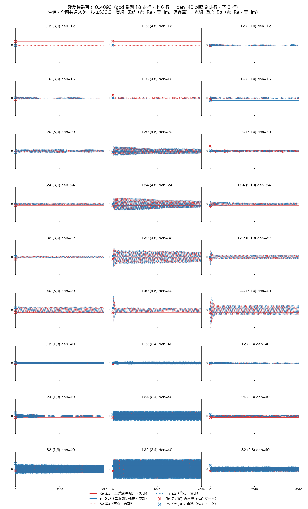

図4では、重心 $\sum z$ が大きく振動し、ときには初期値より増幅する一方、

$$
Q_2(t)=\sum_m z_m(t)^2
$$

は全パネルで水平線となる。数値監査では、4097状態を持つ全99走行について $Q_2$ のドリフトは $\max_t|Q_2(t)-Q_2(0)|=4.1\times10^{-10}$（$H_0\sim10^3$ に対し相対 $\sim10^{-12}$）に収まった。

この時点で重要なのは、

$$
Q_2(t)\approx Q_2(0)
$$

という数値的近似ではなく、次の代数的恒等性である。

## 6.2 厳密保存の導出

一ステップを

$$
Z'=R(Z)Z,
\qquad
R(Z)=e^{\Delta\tau K(Z)}
$$

とする。

$K^T=-K$ なので、

$$
R^TR=I.
$$

したがって

$$
Z'^T Z'
=
Z^T R^T R Z
=
Z^T Z.
$$

すなわち

$$
\boxed{
\sum_m z_m'^2
=
\sum_m z_m^2
}
$$

である。

$R$ は実行列なので $R^\dagger=R^T$ であり、同時に

$$
\boxed{
Z'^\dagger Z'
=
Z^\dagger R^TRZ
=
Z^\dagger Z
=
H
}
$$

も成立する。したがって

$$
\boxed{H=\text{const},\qquad C^2=\text{const}}
$$

が本節だけで完結する。

初期値で

$$
C^2:=\sum_m z_m(0)^2
$$

と定義すれば、任意ステップ $t$ で

$$
\boxed{
\sum_m z_m(t)^2=C^2
}
$$

が成立する。

力学は $K(Z)$ の状態依存性によって非線形である。しかしその非線形性は、軌道を別の二乗セクターへ移すことはない。全軌道は

$$
\mathcal M_{C^2}
=
\left\{
Z\in\mathbb C^M
\mid
Z^T Z=C^2
\right\}
$$

の内部に閉じている。

## 6.3 固定 Gram 幾何と形状指標 χ

$Z=x+iy$（$x,y\in\mathbb R^M$）と分解すると、

$$
H=Z^\dagger Z=x^2+y^2,
\qquad
C^2=Z^TZ=x^2-y^2+2i\,x\cdot y
$$

であり、$H$ と $C^2$ の同時保存は

$$
x^2=\frac{H+\Re C^2}{2},
\qquad
y^2=\frac{H-\Re C^2}{2},
\qquad
x\cdot y=\frac{\Im C^2}{2},
$$

すなわち実部と虚部の Gram 行列

$$
G=
\begin{pmatrix}
x^2 & x\cdot y\\
x\cdot y & y^2
\end{pmatrix}
$$

の固定と等価である。実直交更新 $Z'=RZ$ は $x'=Rx,\ y'=Ry$ と作用するから、これは追加仮定ではなく導出である。$G$ の固有値は

$$
\boxed{\lambda_\pm=\frac{H\pm|C^2|}{2}}
$$

である（$(\lambda_+-\lambda_-)^2=(x^2-y^2)^2+4(x\cdot y)^2=|C^2|^2$）。そこで形状指標

$$
\boxed{\chi=\frac{|C^2|}{H}},
\qquad
0\le\chi\le1
$$

を定義すると、$\chi=0$ は等長・直交の円形 2-frame、$0<\chi<1$ は楕円 2-frame、$\chi=1$ は一直線への縮退に対応する。したがって運動は形を変えているのではなく、**固定 Gram の 2-frame を $\mathbb R^M$ 内で回転させている**。

Gram 面積 $A_{\rm Gram}$ の二乗は

$$
\boxed{
A_{\rm Gram}^2=\det G=\lambda_+\lambda_-=\frac{H^2-|C^2|^2}{4}=\frac{H^2}{4}\left(1-\chi^2\right)
}
$$

であり、$\chi=1\iff\det G=0$。すなわち凍結類は内部 2-frame の面積がゼロへ縮退した状態であり、$\chi=0$ は固定 $H$ の下で最大面積である。

**定理（χ=1 ⟺ K=0）** 全成分が非零で相互作用グラフ（線グラフ）が連結なら、

$$
\boxed{\chi=1\iff K=0}.
$$

証明: $|C^2|=|\sum_m z_m^2|\le\sum_m|z_m|^2=H$ の等号は全 $z_m^2$ が同位相のときに限る。すなわち $\theta_m\equiv\theta_0\pmod\pi$ であり、全相対位相の $\sin$ が消えて $K=0$。逆に $K=0$ なら隣接する位相差が $0\pmod\pi$ で、連結性により全体へ伝播する。∎

実測（図5）: 99走行のうち $\chi=1$（機械精度）は凍結類の5走行のみであり、これは $m_a+m_b\equiv0\pmod L$ で $z(0)$ が実×大域位相となる解析的帰結と一致する。残る94走行は $\chi\in[0.057,\,0.486]$ にあり、$\chi=1$ との間に明確なギャップを持つ。$\chi$ は $H$ と $C^2$ の保存から各走行の**保存ラベル**であり、invariants 系列での時間変動は全 4097 step で $1.3\times10^{-13}$ 以内であった。

二モード初期族では、$\chi$ は $(L,m_a,m_b)$ の閉形式で決まる。$\alpha=\pi/L$、$M=L(L-1)/2$、

$$
S_L(r)=\sum_{\Delta=1}^{L-1}(L-\Delta)U^{r\Delta}
=
\begin{cases}
M, & r\equiv0\pmod L,\\[6pt]
\dfrac{LU^r}{1-U^r}
=-\dfrac L2+\dfrac{iL}{2}\cot\dfrac{\pi r}{L},
& r\not\equiv0\pmod L
\end{cases}
$$

に対して

$$
\boxed{
C^2
=
e^{-i\alpha}S_L(2m_a)
+
e^{i\alpha}S_L(2m_b)
+
2S_L(m_a+m_b)
},
$$

$$
\boxed{
H
=
2M+2\Re\!\left[e^{-i\alpha}S_L(m_a-m_b)\right]
},
\qquad
\boxed{
\chi(L,m_a,m_b)=\frac{|C^2|}{H}
}
$$

である（導出は付録C）。この閉形式は全99走行の実測 $\chi,\ C^2,\ H$ と最大相対偏差 $9.3\times10^{-15}$ で一致し、実測最大の $\chi(8,3,6)=0.486422965736\ldots$ を再現する。凍結類 $m_a+m_b\equiv0\pmod L$ では閉形式レベルで $C^2=H$（実正値）となり $\chi=1$ が解析的に従う。$\chi$ は保存量なので、**局所 Gram 形状は時間発展を実行する前に初期整数だけから決まる**。

**図5　形状指標 χ カタログ（全99走行、保存量）**

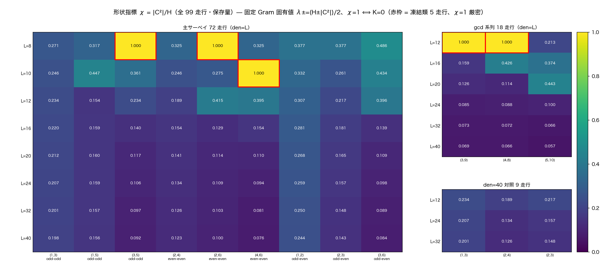

## 6.4 局所状態空間

$H$ と $C^2$ の同時固定は、一つの凝縮体の内部状態空間を

$$
\boxed{
\mathcal L_{H,C^2}
=
\{Z\in\mathbb C^M \mid
Z^\dagger Z=H,\;
Z^TZ=C^2\}
}
$$

と定める。一般の rank 2（$\chi<1$）では固定 Gram 2-frame の軌道であり、

$$
\boxed{
\mathcal L_{H,C^2}
\simeq
O(M)/O(M-2)
},
\qquad
\dim_{\mathbb R}=2M-3
$$

である。縮退時（$\chi=1$、rank 1）は次元 $M-1$ に落ちる。したがって

$$
\boxed{
C^2=\text{局所閉塞のラベル},
\qquad
\mathcal L_{H,C^2}=\text{その内部の局所状態空間}
}
$$

と読める。軌道 $Z(0)\to Z(1)\to\cdots$ はこの局所空間内の運動である。

## 6.5 ゼロ閉塞への埋め込み

任意の非零 $C^2$ に対して

$$
(iC)^2=-C^2
$$

だから、

$$
\boxed{
\sum_m z_m^2+(iC)^2=0
}
$$

と書ける。

したがって非零の二乗代表量は、ゼロ閉塞原理と矛盾しない。むしろ多数の内部波 $\{z_m\}$ と、それを代表する補完成分 $iC$ を合わせれば、完成した局所凝縮体を同じ二乗ゼロ閉塞形式へ厳密に埋め込める。

---

# 7. 二乗凝縮：多数波を一つの複素量が代表する

## 7.1 定義

本稿では、

$$
C^2=\sum_m z_m^2
$$

が厳密に成立する部分系を、二乗量の意味で一つの**凝縮体**と呼ぶ。

この縮約は恒等式であり、平均値・SVD低ランク近似・正規化・フィッティングのいずれも用いない。

二乗量に関しては、

$$
\{z_1,z_2,\ldots,z_M\}
$$

という多数の内部自由度を

$$
\boxed{C^2}
$$

という一つの複素量が**厳密に代表する**。

$C$ 自身には

$$
C\leftrightarrow -C
$$

の平方根二価性があるため、基本的な不変量は $C^2$ である。

## 7.2 内部の長時間発展も同一凝縮体に属する

本実験では一つの走行について

$$
Z(0),Z(1),\ldots,Z(4096)
$$

という長い状態系列が存在する。内部配置は大きく変わるが、

$$
Z(t)^T Z(t)=C^2
$$

は変わらない。

したがって、上位の二乗読み出しから見れば、

$$
\boxed{
Z(0),Z(1),\ldots,Z(4096)
\quad\text{はすべて同じ }C^2\text{ に属する}
}
$$

ことになる。

これは「4096個の状態が同一である」という意味ではない。内部状態は異なる。しかしそれらの全履歴が一つの不変二乗セクターの内部に閉じている。

この意味で、本実験は

$$
\boxed{
\text{長い局所状態発展が、一つの凝縮体内部に閉じうる}
}
$$

ことを示している。

---

# 8. 階層閉塞と凝縮体間流

## 8.1 階層縮約の形式不変性

複数の凝縮体を考える。凝縮体 $n$ の内部波を $z_{nm}$ とし、

$$
\boxed{
C_n^2=\sum_m z_{nm}^2
}
$$

と定義する。

すると単純な和の結合則から、

$$
\sum_n C_n^2
=
\sum_n\sum_m z_{nm}^2
=
\sum_{n,m}z_{nm}^2.
$$

したがって、上位階層に

$$
\boxed{
\sum_n C_n^2=0
}
$$

を課せば、

$$
\boxed{
\sum_{n,m}z_{nm}^2=0
}
$$

が自動的に成立する。

さらに複数の $C_n$ をまとめ、

$$
D_a^2=\sum_{n\in a}C_n^2
$$

と定義すれば、

$$
\sum_aD_a^2=\sum_nC_n^2.
$$

したがって

$$
z_{nm}\rightarrow C_n\rightarrow D_a\rightarrow\cdots
$$

と階層を上げても、二乗閉塞の形式は変わらない。

本稿の中心的な代数結果をまとめると、

$$
\boxed{
\text{二乗閉塞は、二乗凝縮による粗視化に対して形式不変である}
}
$$

となる。

## 8.2 凝縮体間の反対称二乗流

全状態を凝縮体ごとに $Z=(Z_1,Z_2,\ldots)$ と分割し、実反対称生成子をブロック化する（$K_{mn}=-K_{nm}^T$）。連続表示 $\dot Z=KZ$（各ステップの凍結 $K$ による流れ、§9.2 と同じ規約）で $q_n=Z_n^TZ_n=C_n^2$ と置くと、

$$
\dot q_n
=
2Z_n^T\dot Z_n
=
2\sum_m Z_n^TK_{nm}Z_m
$$

であり、自己項は反対称性から $Z_n^TK_{nn}Z_n=0$ で消える。そこで

$$
\boxed{J_{nm}=2Z_n^TK_{nm}Z_m},
\qquad
\boxed{J_{mn}=-J_{nm}}
$$

と定義すれば、

$$
\boxed{
\dot C_n^2
=
\sum_{m\ne n}J_{nm}
},
\qquad
\frac{d}{ds}\sum_nC_n^2=0.
$$

内部運動は自分自身の $C_n^2$ を変えない。$C_n^2$ を変えるのは他の凝縮体との関係だけであり、その交換量は反対称である。すなわち

$$
\boxed{
\text{局所保存}
+
\text{二体関係による交換}
=
\text{全体閉塞}
}
$$

がそのまま成立する。

この交換則は連続表示に限らない。step $t$ で $K_t=K(Z_t)$ を固定し、$Z(s)=e^{sK_t}Z_t$（$0\le s\le\Delta\tau$）とすれば、

$$
\mathcal J_{nm}^{(t)}
=
\int_0^{\Delta\tau}
2Z_n(s)^T K_{nm}^{(t)}Z_m(s)\,ds
$$

に対して

$$
\boxed{
C_n^2(t+1)-C_n^2(t)
=
\sum_{m\ne n}\mathcal J_{nm}^{(t)}
},
\qquad
\boxed{
\mathcal J_{mn}^{(t)}=-\mathcal J_{nm}^{(t)}
}
$$

が厳密に成立する。したがって反対称二乗流は連続表示の近似ではなく、実際の一斉更新アルゴリズムそのものの厳密な交換則である。

---

# 9. 最小二凝縮体系と時間を仮定しない保存運動

## 9.1 二凝縮体のゼロ閉塞

最小の上位閉塞として、

$$
\boxed{
C_1^2+C_2^2=0
}
$$

を考える。

非自明解は

$$
C_2=\pm iC_1.
$$

したがって二つの凝縮体は、

- 等振幅
- 90度位相差

を持つ。

これは先行研究[K2]で数値的に重要であった90度位相骨格と同型の最小関係である。この一致が同一機構によるものかは、結論に示す二凝縮体系の明示的構成で検証する。

## 9.2 閉塞を保存する変換

状態ベクトル

$$
\mathbf C=
\begin{pmatrix}
C_1\\
C_2
\end{pmatrix}
$$

に対して

$$
\mathbf C'=R\mathbf C
$$

とする。

$$
R^TR=I
$$

なら、

$$
{\mathbf C'}^T\mathbf C'
=
\mathbf C^TR^TR\mathbf C
=
\mathbf C^T\mathbf C
=
0.
$$

したがって、二乗閉塞を壊さない状態変換のクラスが定義できる。

連続パラメータ $s$ を単なる軌道パラメータとして導入すれば、

$$
R(s)=e^{sK},
\qquad K^T=-K
$$

であり、

$$
\frac{d\mathbf C}{ds}=K\mathbf C.
$$

このとき

$$
\frac{d}{ds}
\left(
\mathbf C^T\mathbf C
\right)
=
0.
$$

重要なのは、ここで $s$ を最初から物理的絶対時間と仮定する必要がないことである。

まず

$$
\boxed{
\text{閉塞を保存する状態間の運動}
}
$$

があり、その軌道を記述するために $s$ を用いているだけである。

---

# 10. 局所時計：絶対時計ではなく二体系の関係

各凝縮体が内部状態発展を持つとしても、一つの凝縮体だけに絶対時計を付与する必要はない。

各凝縮体の二乗代表量を

$$
C_n^2=\rho_n e^{i\Theta_n},
\qquad
\rho_n=|C_n^2|,
\qquad
\Theta_n\in\mathbb R/2\pi\mathbb Z
$$

と書く。$\Theta_n=\arg C_n^2$ は一価である（$C_n$ 自身の位相は $C\leftrightarrow-C$ の二価性を持つ、§7.1）。

二乗代表量だけから一価に定まる A から B への関係位相を

$$
\boxed{
\tilde U_{AB}
=
e^{i(\Theta_B-\Theta_A)}
=
\frac{C_B^2/|C_B^2|}{C_A^2/|C_A^2|}
}
$$

と定義する。逆向きの関係は

$$
\boxed{
\tilde U_{BA}=\tilde U_{AB}^{-1}
}
$$

である。全凝縮体への共通位相変換 $\Theta_n\to\Theta_n+\beta$ に対して $\tilde U_{AB}$ は不変である。したがって絶対位相は関係量から完全に消える。

三体系では直ちに合成則

$$
\boxed{
\tilde U_{AB}\tilde U_{BC}=\tilde U_{AC}
},
\qquad
\boxed{
\tilde U_{AB}\tilde U_{BC}\tilde U_{CA}=1
}
$$

が成立する。AがBを読み、BがCを読めば、AからCの時計関係が合成される。局所時計は二体比にとどまらず、完全関係ネットワーク上で整合的に合成される。

局所時計の有向関係は、この一価な関係量の二重被覆上に存在する。

$$
\boxed{
U_{AB}^2=\tilde U_{AB}
}
$$

を満たす持ち上げ $U_{AB}$ を取ると、逆向きは

$$
\boxed{
U_{BA}=U_{AB}^{-1}
}
$$

である。最小閉塞 $C_B^2=-C_A^2$ では

$$
\tilde U_{AB}=-1
$$

であり、その二つの持ち上げは $U_{AB}=+i,\,-i$。関係の順序を反転すると $+i\leftrightarrow-i$ となる。したがって最小二凝縮体系では、**二重被覆の $\mathbb Z_2$ ファイバーそのものが局所時計の方向性を担う**。これは外部から追加した方向変数ではなく、二乗凝縮がもともと持つ平方根構造に内在する。

ここに第三者の絶対時計は必要ない。

$$
\boxed{
\text{AにとってBが時計であり、BにとってAが時計である}
}
$$

と読むことができる。

この解釈では時間は、一つの系に付属する絶対量ではなく、二つの局所閉塞系の間の有向関係として現れる。

全体系を一つの閉じた関係構造として見ると、

$$
\sum_n C_n^2=0
$$

があるだけで、そこに単一の絶対時計や絶対的時間原点を追加する必要はない。

一方、局所系同士には

$$
A-B,\qquad B-A
$$

という向き付き関係が自然に存在する。

本構造から直接得られるのは、

$$
\boxed{
\text{絶対時計を仮定せず、局所時計を系間関係として定義できる}
}
$$

である。

---

# 11. 関係閉塞からのケプラー力学の再構成

本節では、§6.3 の固定 Gram 幾何と §6.5 のゼロ閉塞埋め込みに、一つの時計読み出し公理 $dt=r\,d\tau$（§11.3）を組み合わせると、物理時間・空間座標を基本変数として置かない本系から、ケプラー楕円・ケプラー方程式・面積則・逆二乗中心力が再構成されることを示す。

## 11.1 固定 Gram 2-frame の主軸表示

§6.3 の固有値 $\lambda_\pm=(H\pm|C^2|)/2$ に対し、

$$
a^2=\frac{H+|C^2|}{2},
\qquad
b^2=\frac{H-|C^2|}{2}
$$

とする。大域位相を $\arg C^2=0$ に整列させると（$H$ と $|C^2|$ を変えないゲージ選択）、2-frame は主軸形になる。§6.5 の補完成分をそのまま用い、$c_0:=\sqrt{|C^2|}$ として3成分状態

$$
\boxed{
\mathbf V(0)=
\begin{pmatrix}
a\\ ib\\ ic_0
\end{pmatrix}
}
$$

を取ると、

$$
V_1^2+V_2^2+V_3^2=a^2-b^2-c_0^2=|C^2|-|C^2|=0
$$

であり、**厳密な二乗ゼロ閉塞**が成立する。実反対称生成子を

$$
\boxed{
K_3=
\begin{pmatrix}
0&\omega&0\\
-\omega&0&0\\
0&0&0
\end{pmatrix}
},
\qquad K_3^T=-K_3
$$

とすれば、補完成分 $V_3=ic_0$ は固定されたまま、閉塞保存運動 $\mathbf V(\tau)=e^{\tau K_3}\mathbf V(0)$ の第1成分の読み出しは

$$
\boxed{
u(\tau)=V_1(\tau)=a\cos(\omega\tau)+ib\sin(\omega\tau)
}
$$

となる。ここで $\tau$ は外部物理時間ではなく、閉塞保存軌道のパラメータである。$K_3^T=-K_3$ から直接

$$
u''=-\omega^2u
$$

が従い、この間 $|V_1|^2+|V_2|^2=a^2+b^2=H$、$V_1^2+V_2^2=a^2-b^2=|C^2|$、および全体のゼロ閉塞 $\sum_iV_i^2=0$ は恒等的に保たれる。

特に $C^2=0$ なら $a=b$ で補完成分は消え、$e=\chi=0$：**§9 の最小二凝縮体ゼロ閉塞（$C_2=\pm iC_1$）はケプラー円軌道に対応する**。一般の楕円軌道は $C^2\neq0$、すなわち補完成分 $i\sqrt{|C^2|}$ を持つゼロ閉塞に対応し、二乗ゼロ閉塞を保ったまま任意の非縮退楕円離心率 $0\le e=\chi<1$ が表現される。$\chi=1$ は $b=0$、$B=0$ となり $w$ が焦点を含む線分へ縮退する境界であり、§6.3 の rank-1 縮退と一致する。

## 11.2 二乗写像による焦点楕円

二乗写像

$$
\boxed{w=u^2}
$$

を取る。$E=2\omega\tau$ と置けば

$$
w=D+A\cos E+iB\sin E,
\qquad
A=\frac H2,\quad
D=\frac{|C^2|}2,\quad
B=\frac12\sqrt{H^2-|C^2|^2}
$$

であり、

$$
\boxed{A^2-B^2=D^2}
$$

が成立する（$A^2-B^2=|C^2|^2/4=D^2$）。したがってこの楕円は中心 $D$、半長軸 $A$、焦点距離 $c_f=\sqrt{A^2-B^2}=D$ を持ち、**一方の焦点が原点に一致する**。離心率は

$$
\boxed{
e=\frac DA=\frac{|C^2|}{H}=\chi
}
$$

である。**形状指標 χ は、二乗写像後のケプラー楕円の離心率そのものである。**

焦点（原点）からの距離は

$$
\boxed{r=|w|=|u|^2},
\qquad
r=A(1+e\cos E)
$$

である。通常のケプラー表示（近点起点）へ合わせるには $E_K=E-\pi$ と置けばよく、

$$
r=A(1-e\cos E_K).
$$

## 11.3 時計読み出し公理

本稿では、関係時計の読み出しを

$$
\boxed{dt=r\,d\tau=|u|^2\,d\tau}
$$

という一つの**公理**として置く（Sundman 型変換と同形）。本稿はこの読み出し則を導出しない。

なお、双曲型局所閉塞 $r^2-c^2t^2=R^2$ は $r=R\cosh\eta$、$ct=R\sinh\eta$ から $c\,dt=r\,d\eta$ を与えるが、この双曲角 $\eta$ を軌道パラメータ $\tau$ と同一視することはできない。ケプラー軌道では $r(\tau)=A(1+e\cos2\omega\tau)$ が有界・周期的である一方、$\eta=\gamma\tau$ とすれば $r=R\cosh(\gamma\tau)$ は非有界であり、§11.2 と両立しないからである（検討の記録として残す）。したがって双曲型閉塞は別の関係閉塞として保持し、$\eta$ と $\tau$ は同一視しない。読み出し則 $dt/d\tau=|u|^2$ を関係時計 $\tilde U_{AB}$ または二乗閉塞構造から導出することは未解決課題である（§15.2）。

## 11.4 ケプラー方程式

$E=2\omega\tau$ から $d\tau=dE/(2\omega)$ であり、

$$
dt=\frac{A}{2\omega}(1+e\cos E)\,dE,
$$

積分して

$$
t-t_0=\frac{A}{2\omega}(E+e\sin E).
$$

近点規約 $E_K=E-\pi$ と近点通過時刻 $t_p=t_0+\pi A/(2\omega)$ に移れば

$$
\boxed{M=E_K-e\sin E_K},
\qquad
M=n(t-t_p),
\qquad
\boxed{n=\frac{2\omega}A}
$$

である。外部物理時間を基本変数として置かなかった系で、時計読み出し公理 $dt=r\,d\tau$ の下にケプラー方程式が現れる。

## 11.5 面積則（ケプラー第2法則）

$w=u^2$ と $dt=|u|^2d\tau$ から

$$
\dot w=\frac{dw/d\tau}{dt/d\tau}=\frac{2uu'}{|u|^2}=\frac{2u'}{\bar u}.
$$

焦点原点に対する比角運動量 $h=\Im(\bar w\dot w)$ は

$$
h=2\Im(\bar uu'),
\qquad
\Im(\bar uu')=ab\omega
$$

なので

$$
\boxed{h=2ab\omega=\mathrm{const}},
\qquad
\boxed{\frac{dA_{\rm swept}}{dt}=\frac h2=ab\omega=\mathrm{const}}
$$

である。これがケプラー第2法則である。

## 11.6 逆二乗中心力とケプラー第3法則

振動子側の保存量 $E_{\rm osc}=\frac12(|u'|^2+\omega^2|u|^2)$ を用いる。$\dot w=2u'/\bar u$ を $t$ で再微分し、$u''=-\omega^2u$ と $r=|w|=|u|^2$ で整理すると

$$
\ddot w
=\frac{2}{|u|^2}\left[\frac{u''}{\bar u}-\frac{u'\bar u'}{\bar u^2}\right]
=-\frac{2}{u\bar u^3}\left(\omega^2u\bar u+u'\bar u'\right)
=-\frac{4E_{\rm osc}}{u\bar u^3},
$$

すなわち

$$
\boxed{\ddot w=-\frac{4E_{\rm osc}}{|w|^3}w},
\qquad
\boxed{\ddot{\mathbf r}=-\mu\frac{\mathbf r}{r^3}},
\qquad
\boxed{\mu=4E_{\rm osc}}
$$

である。楕円解では $E_{\rm osc}=\frac12\omega^2(a^2+b^2)=\frac12\omega^2H$ なので

$$
\boxed{\mu=2\omega^2H}.
$$

さらに $A=H/2$、$n=2\omega/A$ から

$$
\boxed{n^2A^3=4\omega^2A=2\omega^2H=\mu}
$$

であり、ケプラー第3法則とも整合する。

本節の全式は記号計算に加えて数値的にも独立検証した（焦点楕円形・$e=\chi$・ケプラー方程式・$h$ 一定・$\ddot w+\mu w/r^3$ の残差・$n^2A^3=\mu$、いずれも数値微分精度内で成立）。

---

# 12. インフレーション型遷移：本サーベイが標本化した両極

## 12.1 初期平面からの逸脱指標

先行インフレーション実験と同じ定義で、初期状態

$$
Z_0
$$

の実部・虚部が張る実二次元平面を $E_0$ とし、そこからの直交成分を $Z_\perp(t)$ とする。

$$
f(t)
=
\frac{\langle Z_\perp,Z_\perp\rangle}
{\langle Z,Z\rangle}.
$$

**図6a　インフレーション指標 $H_\perp/H$：主72**

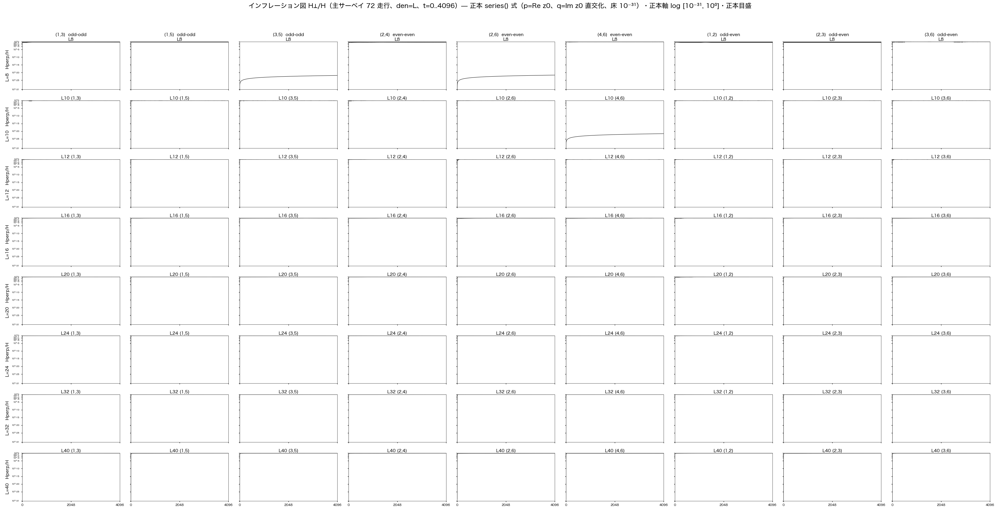

**図6b　インフレーション指標 $H_\perp/H$：gcd＋den=40対照**

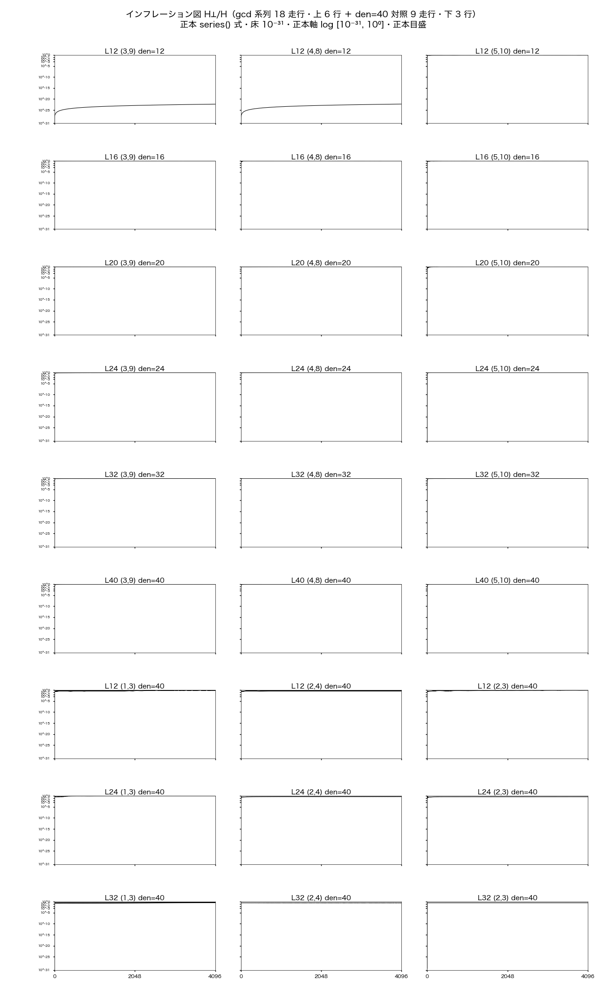

全99走行で $f(0)$ は構成上ほぼ表示床にある。しかしその後、

- 5走行は固定点に留まり、
- 94走行は最初の数stepで $O(1)$ へ達した。

すなわち、先行研究[K2]で見られた

$$
\text{床への滞在}
\rightarrow
\text{onset}
\rightarrow
\text{飽和}
$$

という緩和曲線は、今回の99走行には一本も含まれていなかった。

なお §6.3 の固定 Gram 幾何から、$H_\perp/H$ はエネルギーの増大ではなく、**固定 Gram の 2-frame が初期2平面の外へ回転して展開する度合い**を測る量と読める。

## 12.2 現時点での仮説

本サーベイが確定したのは、99走行が緩和曲線の両側（厳密固定点と即時飽和）のみを含むことである。発生条件は次の三領域の比較から絞り込む。

1. **対称性が高すぎる端:** 共役対条件を満たす厳密固定点。
2. **対称性が低い端:** 初期平面から即時離脱する94走行。
3. **その中間:** 過去の90度高対称系で観測された有限の床滞在とonsetを持つ領域。

また、今回の固定点は重心が比較的小さいが、重心が小さいだけで固定するわけではない。固定を決めるのは $\chi=1$（§6.3 の定理）であり、実測でも固定5走行のみ $\chi=1$、残る94走行は $\chi\le0.486$ である（図5）。したがって、

$$
\boxed{
\text{高い対称性}
+
\text{原点近傍の重心}
+
\text{ただし厳密固定点ではない}
}
$$

という組合せが候補となる。検証は結論に示す摂動系列実験で行う。

---

# 13. 「時間の矢」とエントロピーについて

本稿の基本構造では、時間方向を定義するためにエントロピーを導入する必要はない。

二体系 $A,B$ があれば、

$$
\tilde U_{BA}
=
\tilde U_{AB}^{-1}
$$

という有向関係が最初から存在する。

したがって局所的な時計の向きは、二体系の関係によって定義できる。

一方、全体系を外側から一括して記述するなら、

$$
\sum_nC_n^2=0
$$

という閉じた構造があるだけであり、そこに絶対的な時間の矢を基本変数として置く必要はない。

もし巨視的粗視化によってエントロピー増大が観測されるなら、それは局所的な関係時計に沿った状態再編成と対応する可能性がある。本稿では、

$$
\boxed{
\text{エントロピー増大が時間方向を作る}
}
$$

とは仮定せず、むしろ

$$
\boxed{
\text{局所的な関係発展が先にあり、
エントロピー方向はその粗視化された観測像である可能性}
}
$$

を今後の検討課題として残す。

これは本稿の数学的主結果ではなく、二乗凝縮と局所時計の構造から生じる物理解釈候補である。

---

# 14. 先行研究との関係

本研究の二乗凝縮および階層閉塞は、以下の外部研究を仮定して導出したものではない。本研究ではまず数値実験と代数構造から

$$
\sum_mz_m^2=C^2
$$

を見いだし、その後、外部時間を基本変数としない既存の研究との概念的関係を調べた。

Page と Wootters [E1] は、閉じた全体系をstationary stateとして扱い、内部時計との相関によって観測される発展を記述した。本研究との共通点は、外部絶対時計を基本としない点である。一方、本研究ではclock/systemという異種分割を出発点とせず、同種の局所凝縮体AとBが互いを時計として読む。

Rovelli [E2] は、基本時間変数が定義されない領域でも観測可能な発展を記述する可能性を論じた。本研究は量子重力の正準形式から出発せず、有限複素関係波の二乗閉塞と実直交保存運動から出発する。

Boette と Rossignoli [E3] は、有限次元量子時計と離散history stateを扱い、複数時点を一つの静的構造へ含める形式を論じた。本研究との接点は、長い状態系列を一つの閉じた構造の内部として扱える点にある。しかし本研究では独立のclock Hilbert spaceを仮定しない。

Wharton [E4] は、初期条件から未来を逐次生成する記述だけを唯一の基本形式とせず、時間対称な境界条件による全履歴の制約を論じた。本研究との接点は、全体系の側に絶対的な未来生成方向を置く必要がない点である。相違点は、本研究が作用原理や連続場境界条件ではなく、有限二乗閉塞と関係位相運動を出発点とする点にある。

二乗写像による調和振動子とケプラー問題の対応自体は、Bohlin [E5] および Levi-Civita [E6] 以来の既知の対応である。本研究はこの既知変換を仮定してモデルを構成したのではない。関係閉塞と固定 Gram 幾何から二乗写像が独立に現れ、結果を得た後に既知対応と比較した。相違点は、本研究では時間変数 $t$ 自体が外部から与えられず、時計読み出し公理 $dt=r\,d\tau$ による関係時計として現れる点にある。

---

# 15. 本稿で確定したこと／していないこと

## 15.1 確定した数学的・数値的結果

1. 現行力学では $K^T=-K$ であり、各stepの更新 $R=e^{\Delta\tau K}$ は実直交である。
2. したがって
   $$
   Z^TZ=\sum_mz_m^2=C^2
   $$
   は厳密保存される。
3. 99走行・4096 stepのデータは、この保存を数値精度内で確認した。
4. 多数波は二乗量について一つの $C^2$ に厳密縮約できる。
5. 複数凝縮体について
   $$
   C_n^2=\sum_mz_{nm}^2
   $$
   とすれば、
   $$
   \sum_nC_n^2=\sum_{n,m}z_{nm}^2
   $$
   が厳密に成立する。
6. 二凝縮体ゼロ閉塞
   $$
   C_1^2+C_2^2=0
   $$
   の非自明解は90度位相差を持つ。
7. この閉塞を保存する運動は実直交変換、連続表示では実反対称生成子により定義できる。
8. $H$ と $C^2$ の同時保存は実部・虚部の Gram 行列の固定と等価であり、固有値は
   $$
   \lambda_\pm=\frac{H\pm|C^2|}{2}
   $$
   である。形状指標 $\chi=|C^2|/H\in[0,1]$ は各走行の保存ラベルとなる。
9. 全成分非零・線グラフ連結の下で $\chi=1\iff K=0$。実測でも $\chi=1$ は凍結類5走行のみ（他は $\chi\le0.486$、図5）。
10. 凝縮体分割に対し $J_{nm}=2Z_n^TK_{nm}Z_m$ は $J_{mn}=-J_{nm}$ を満たし、
    $$
    \dot C_n^2=\sum_{m\ne n}J_{nm},
    \qquad
    \frac{d}{ds}\sum_nC_n^2=0
    $$
    が成立する（自己項はゼロ）。
11. 局所状態空間は一般（$\chi<1$）に $\mathcal L_{H,C^2}\simeq O(M)/O(M-2)$、実次元 $2M-3$（$\chi=1$ では $M-1$）。
12. 関係位相 $\tilde U_{AB}=e^{i(\Theta_B-\Theta_A)}$（$\Theta_n=\arg C_n^2$）は一価・共通位相不変で、
    $$
    \tilde U_{BA}=\tilde U_{AB}^{-1},
    \qquad
    \tilde U_{AB}\tilde U_{BC}=\tilde U_{AC}
    $$
    を満たす。二重被覆の持ち上げ $U_{AB}^2=\tilde U_{AB}$ は最小閉塞で $U_{AB}=\pm i$ を与え、$\mathbb Z_2$ ファイバーが方向を担う。
13. 二モード初期族の $\chi$ は $(L,m_a,m_b)$ の閉形式（$S_L(r)$ による、付録C）で決まり、全99走行の実測と機械精度で一致する。
14. 二乗写像 $w=u^2$ により固定 Gram 楕円は焦点原点の楕円へ写り、その離心率は $e=\chi=|C^2|/H$。
15. 時計読み出し公理 $dt=r\,d\tau=|u|^2d\tau$ の下でケプラー方程式 $M=E_K-e\sin E_K$（$n=2\omega/A$）が導かれる（公理自体は導出していない）。
16. 同じ変換から面積速度一定 $h=2ab\omega$ および逆二乗中心力 $\ddot{\mathbf r}=-\mu\mathbf r/r^3$（$\mu=2\omega^2H$、$n^2A^3=\mu$）が導かれる。

## 15.2 まだ確定していないこと

1. $C_n$ が現実のどの粒子・場・空間領域に対応するか。
2. 90度位相関係が現実の時空構造と同一であること。
3. 関係位相から得る局所時計が物理的固有時間と一致すること。
4. インフレーション型緩和曲線の必要十分条件。
5. 高対称性・重心近傍条件が緩和型発展を保証すること。
6. エントロピー方向が局所関係時計の向きに必ず従うこと。
7. 本モデルが一般相対論または標準量子論の時間概念を完全に再現すること。
8. 時計読み出し公理 $dt=r\,d\tau$ の、関係時計 $\tilde U$ または二乗閉塞構造からの導出。

---

# 16. 結論

本研究は、論文1[K1]の最小二波閉系を多数波完全関係力学へ拡張した。当初期待した緩和型時間構造は99走行では得られなかった。この結果から、より単純で強い不変構造が明らかになった。

$$
\boxed{
\sum_m z_m^2=C^2
}
$$

である。

$$
\sum_mz_m^2+(iC)^2=0
$$

と書けるため、多数の内部波は二乗量に関して一つの複素凝縮量 $C^2$ に厳密にまとめられる。

複数凝縮体では

$$
C_n^2=\sum_mz_{nm}^2
$$

と定義でき、

$$
\boxed{
\sum_nC_n^2=0
}
$$

を上位閉塞として再び同じ形で用いることができる。したがって二乗閉塞は、内部自由度を凝縮して階層化しても形式を失わない。

最小二凝縮体系

$$
C_1^2+C_2^2=0
$$

は90度位相関係を持ち、閉塞保存運動を外部絶対時間を仮定せず定義できる。二つの局所凝縮体AとBがあれば、AからBへの位相差とBからAへの位相差が互いに符号反転した関係として存在する。したがって、絶対時計を置かず、

$$
\boxed{
\text{AにとってBが時計であり、
BにとってAが時計である}
}
$$

という関係的局所時計の構成が可能になる。

全体系を一括して見れば絶対時計も絶対的時間の矢も基本変数として導入する必要はない。一方、局所系の間には有向関係があり、そこから局所的な順序を読むことができる。

本稿の最も簡潔な結論は次の連鎖で表される。

$$
\boxed{
K^T=-K
\Longrightarrow
(H,C^2)\text{ 保存}
\Longrightarrow
\text{固定Gram局所空間}
\Longrightarrow
\text{二乗凝縮・階層閉塞}
\Longrightarrow
\text{関係的局所時計}
\Longrightarrow
w=u^2
\Longrightarrow
e=\chi
\Longrightarrow
dt=r\,d\tau
\Longrightarrow
\text{Kepler equation}
\Longrightarrow
\frac1{r^2}\text{ 中心力}
}
$$

本稿の中心結果は、物理時間および空間座標を基本変数として仮定しない有限関係閉塞から、保存幾何・局所時計・ケプラー方程式・逆二乗中心力が一つの二乗構造を通じて接続されることである。

次段階の課題は、二乗閉塞を保った複数凝縮体を明示的に構成し、高対称90度配置と重心原点近傍条件のもとで、過去のインフレーション型緩和曲線が再現されるかを独立に検証することである。

---

# 参考文献

## 自己引用

**[K1]** 木原範昭, 「時間発展を頂点化した有限完全関係閉系―― $U^K=I$ による $N=1,K=4$ 最小厳密閉系と偶奇倍音の完全ネットワーク解析」, 2026. Version DOI: 10.5281/zenodo.22763330; Concept DOI: 10.5281/zenodo.22763329.

**[K2]** 木原範昭, 「自己無撞着な関係波閉鎖系におけるインフレーション的急拡大の機構」, 2026. Version DOI: 10.5281/zenodo.22176949; Concept DOI: 10.5281/zenodo.22112008.

## 外部参考文献：概念上の近隣研究

**[E1]** D. N. Page and W. K. Wootters, “Evolution without evolution: Dynamics described by stationary observables,” *Physical Review D* **27**, 2885–2892 (1983). DOI: 10.1103/PhysRevD.27.2885.

**[E2]** C. Rovelli, “Time in quantum gravity: An hypothesis,” *Physical Review D* **43**, 442–456 (1991). DOI: 10.1103/PhysRevD.43.442.

**[E3]** A. Boette and R. Rossignoli, “History states of systems and operators,” *Physical Review A* **98**, 032108 (2018). DOI: 10.1103/PhysRevA.98.032108.

**[E4]** K. Wharton, “Time-Symmetric Boundary Conditions and Quantum Foundations,” *Symmetry* **2**, 272–283 (2010). DOI: 10.3390/sym2010272.

**[E5]** K. Bohlin, “Note sur le problème des deux corps et sur une intégration nouvelle dans le problème des trois corps,” *Bulletin Astronomique* **28**, 113–119 (1911).

**[E6]** T. Levi-Civita, “Sur la régularisation du problème des trois corps,” *Acta Mathematica* **42**, 99–144 (1920).

---

# 付録A　使用した全図ファイル一覧

本稿では、2026-09-16に作成した図カタログのうち**完成図のみ**を引用した（初期状態カタログの作成過程の中間版 v1〜v3 は引用しない）。

1. `fig_initial_states_all99_v4_page1_main72_20260916.png`
2. `fig_initial_states_all99_v4_page2_gcd18_ctrl9_20260916.png`
3. `fig_waveforms_linear_sum_all99_page1_main72_20260916.png`
4. `fig_waveforms_linear_sum_all99_page2_gcd18_ctrl9_20260916.png`
5. `fig_final_states_all99_page1_main72_20260916.png`
6. `fig_final_states_all99_page2_gcd18_ctrl9_20260916.png`
7. `fig_residual_timeseries_all99_page1_main72_20260916.png`
8. `fig_residual_timeseries_all99_page2_gcd18_ctrl9_20260916.png`
9. `fig_inflation_hperp_all99_page1_main72_20260916.png`
10. `fig_inflation_hperp_all99_page2_gcd18_ctrl9_20260916.png`
11. `fig_chi_all99_20260916.png`

図1–4の各a/bが上記1–8に、図6a/bが9–10に、図5（χ カタログ）が11に対応する。

---

# 付録B　再現性メモ

本稿の99走行生軌道データベースは、各runについて4097状態を保存し、QA、metadata、invariants、SHA256を保持している。全99走行は収集完了後に固定され、本稿の図は保存済み `states.npz` のread-only参照から生成された。図生成時に生軌道の再走行や条件変更は行っていない。

本稿で用いた中心的な保存式

$$
\sum_mz_m^2=C^2
$$

は図作成後の解釈変更によって導入された仮説ではなく、もともと実反対称生成子・実直交更新が持つ厳密な代数的保存則である。新しいのは、この保存量を「ゼロからの残差」ではなく「多数波を代表する凝縮量」として読み直した点にある。

---

# 付録C　χ(L, m_a, m_b) の閉形式導出

初期条件 $z_{jk}(0)=c_aU^{m_a\Delta}+c_bU^{m_b\Delta}$（$c_a=e^{-i\pi/(2L)}$、$c_b=e^{+i\pi/(2L)}$、$\Delta=k-j$）に対し、差分 $\Delta=1,\ldots,L-1$ を持つ辺の本数は $L-\Delta$ である。そこで

$$
S_L(r):=\sum_{\Delta=1}^{L-1}(L-\Delta)U^{r\Delta},
\qquad U=e^{2\pi i/L}
$$

と定義する。

**$S_L(r)$ の評価。** $r\equiv0\pmod L$ なら $U^{r\Delta}=1$ で $S_L(r)=\sum_{\Delta=1}^{L-1}(L-\Delta)=M$。$r\not\equiv0$ のとき $\omega=U^r\neq1$、$\omega^L=1$ に対して

$$
\sum_{\Delta=1}^{L-1}\omega^\Delta=-1,
\qquad
\sum_{\Delta=1}^{L-1}\Delta\,\omega^\Delta=\frac{L}{\omega-1}
$$

（後者は $\omega^L=1$ を用いる標準和）。したがって

$$
S_L(r)=L\cdot(-1)-\frac{L}{\omega-1}
=-L\,\frac{\omega}{\omega-1}
=\frac{L\omega}{1-\omega}.
$$

$\omega=e^{i\theta}$（$\theta=2\pi r/L$）に対し $\dfrac{\omega}{1-\omega}=-\dfrac12+\dfrac i2\cot\dfrac\theta2$ なので

$$
S_L(r)=-\frac L2+\frac{iL}2\cot\frac{\pi r}{L}.
$$

**$C^2$ と $H$。** $c_a^2=e^{-i\alpha}$、$c_b^2=e^{i\alpha}$、$c_ac_b=1$、$c_a\bar c_b=e^{-i\alpha}$（$\alpha=\pi/L$）を用い、辺和を $\Delta$ 類でまとめると

$$
C^2=\sum_e z_e^2
=e^{-i\alpha}S_L(2m_a)+e^{i\alpha}S_L(2m_b)+2S_L(m_a+m_b),
$$

$$
H=\sum_e|z_e|^2
=2M+e^{-i\alpha}S_L(m_a-m_b)+e^{i\alpha}S_L(m_b-m_a)
=2M+2\Re\!\left[e^{-i\alpha}S_L(m_a-m_b)\right]
$$

（$S_L(-r)=\overline{S_L(r)}$ を用いた）。よって

$$
\chi(L,m_a,m_b)=\frac{|C^2|}{H}.
$$

**凍結類。** $m_a+m_b\equiv0\pmod L$ なら $S_L(m_a+m_b)=M$、かつ $m_a-m_b\equiv2m_a\pmod L$ なので

$$
C^2=2M+2\Re\!\left[e^{-i\alpha}S_L(2m_a)\right]=H,
$$

すなわち $C^2$ は実正値で $\chi=1$ が解析的に従う。

**数値照合。** 本閉形式は全99走行の実測 $\chi,\ C^2,\ H$ と最大相対偏差 $9.3\times10^{-15}$ で一致する。
