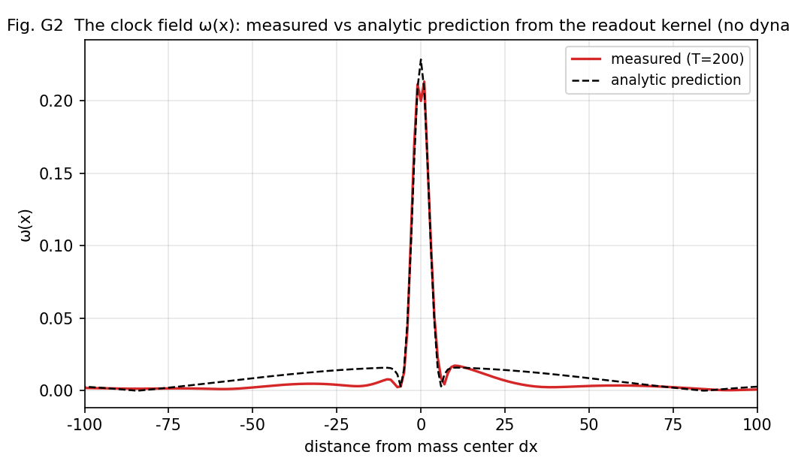
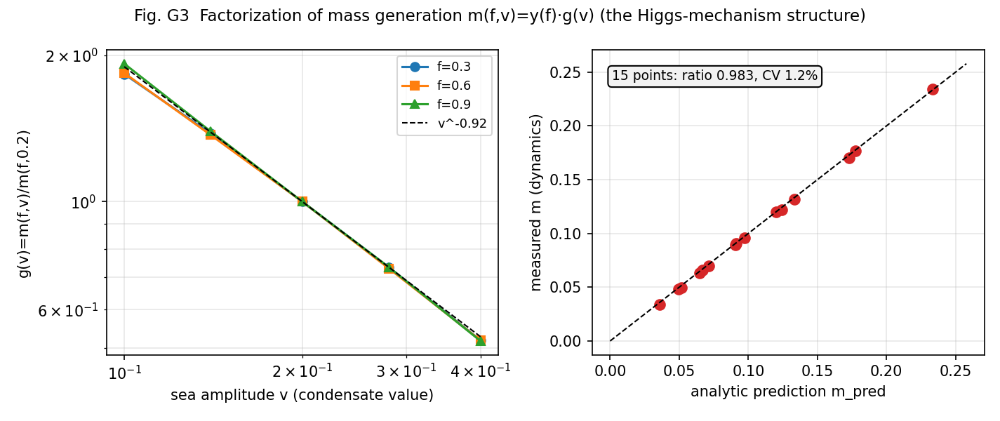
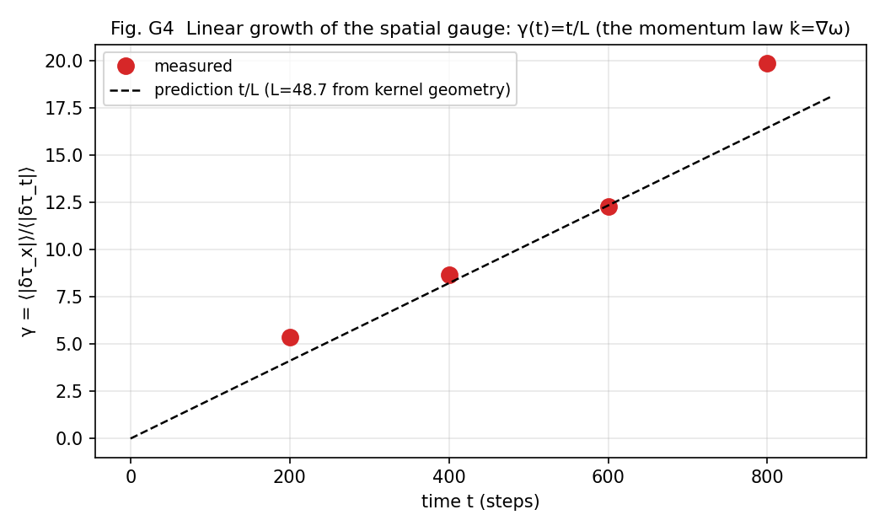
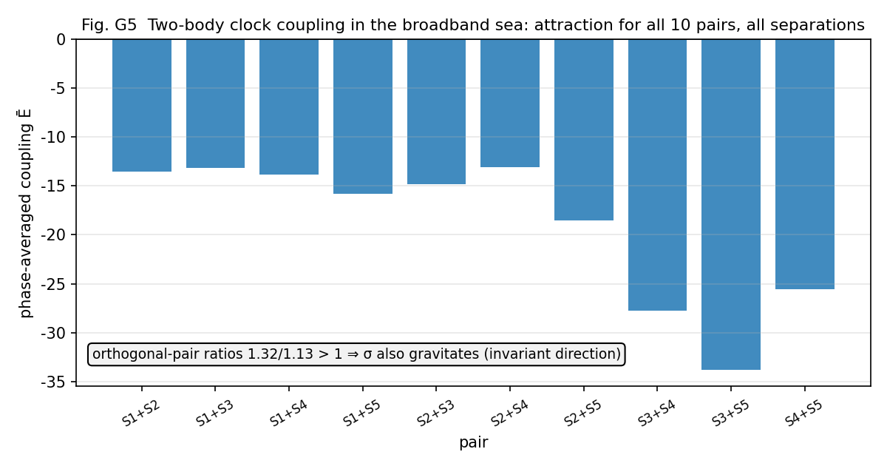
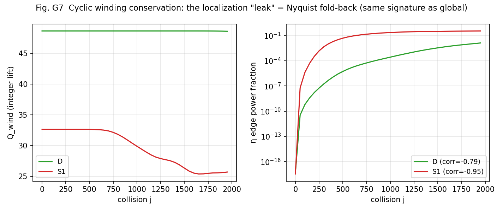
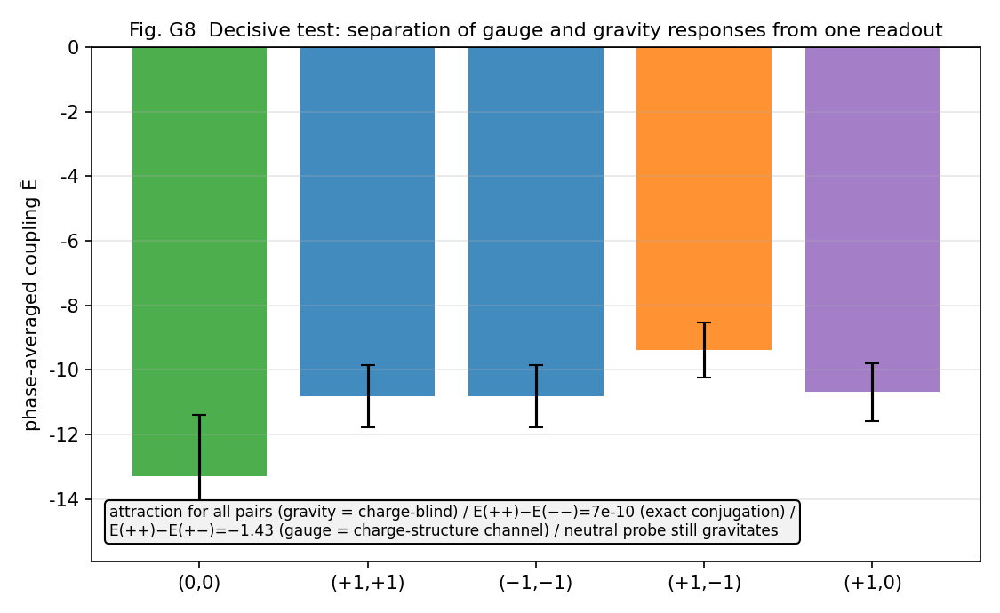

# Two-Layer Separation of Waves and Fields — Unifying Gauge and Gravitational Fields via a Universal Field-Readout Function

**Author**: Noriaki Kihara
**Date**: August 7, 2026
**Type**: Framework-proposal paper (supported by numerical experiments. The main laws are doubly supported by analytic derivation and dynamical measurement, but this is not a proof paper)

---

## Abstract

I built the periodic table of waves [6], but it had no dynamics. In an earlier paper [7], I derived the acceleration of an AB two-body system as the reaction of the circumferential force on the curvature radius R at which body B locally maintains zero closure — but that construction violated the anonymity of operations (the principle of never injecting structure into the dynamics by hand), and I remained dissatisfied. So I experimented: could acceleration be realized without building it in, using the universal interaction function of waves itself? **The result: zero closure could not be maintained.** Injecting a potential V(x) breaks the closure Σxₙ²=0 by 31% in 200 steps even at amplitude 10⁻³ (the bare dynamics drifts at 10⁻¹³). The cause is that extra values are being given to waves that are already exactly zero-closed. Rather, what looks like acceleration may be a **readout-side problem** — just as the spatial directions xyz were read out, could accelerated representations (distorted spatial and temporal gauges) be built by the universal function on the readout side? This paper is the experiment.

Result: the unification of gauge fields close in concept to the standard theory with gravitationally (acceleration-) distorted fields **nearly succeeded** via the **universal field-readout function**. Specifically, we show the following.
**(G1) Impossibility**: gravity cannot be placed on the state side — state-side injection necessarily breaks closure, while operations on the gauge side (readout scales) are exactly harmless to closure. We give a reinterpretation of renormalization: a counterterm is another name for the operation that cancels this breakage after the fact.
**(G2) Clock field**: each cell's local clock rate ω(x) is read out as a projection of fiber relational quantities (with no arbitrary parameters), and the pure bosonic sea is the exact fixed point r=0 — **the vacuum does not tick**. **(G3) Mass generation (Higgs section)**: mass m=⟨ω⟩ factorizes as a function of the sea condensate v: **m(f,v)=y(f)·g(v)** (measured, max CV 2.2%). Moreover this law is derived analytically from the definition of the readout kernel: the dynamics-free prediction agrees with 15 dynamical measurements at **mean ratio 0.983, CV 1.2% (down to absolute values)** — the mass law is an analytic theorem of the readout kernel. **(G4) Momentum law**: the spatial gauge around a mass grows linearly, δτ_x(t)=t·∇ω — **k̇=∇ω (the clock gradient accelerates the sea's momentum)**. The substance of "falling" is the linear growth of the sea's momentum field; the space/time gauge ratio is not constant but γ(t)=t/L, with the gradient scale L derived from the kernel geometry (parameter-free prediction at CV 11%). **(G5) Two-body gravity**: on a broadband sea, two-body clock coupling is attractive for all 10 pairs × all separations (30/30). Orthogonal source pairs (same ⟨ω⟩, different σ) preliminarily support invariant-product coupling √(M_t²+σ²) — under the (t,R,Q) mass-component hypothesis [6], a mechanism candidate for **the equivalence principle as a corollary of the closure identity**. **(G6) The structure of mediation (graviton section)**: the clock readout is bilinear in the fields, and the clock field picks up only the fields' difference frequencies (against the two field lines 0.2898/0.2974, the clock's main line 0.0076 = the difference exactly, relative error 0.0%, the fields' own lines suppressed 250×) — a metrological realization of gravity amplitude = field × field (double copy). **(G7) Conservation laws**: readout localization preserves the classification's integer and topological structure, and maintains cyclic winding conservation (the apparent drift = Nyquist fold-back, correlation −0.77 to −0.95). **(G8) Two-system unification**: the universal function is F[Ψ]=R(G[Ψ])·Ψ (readout-generated rotation); the published two-body system [3] and N-body system [2] (Cayley; Σz² drift audited at 10⁻¹⁵) are its instances. Closure preservation is organized into a general theorem (tangent theorem: preservation ⟺ antisymmetric generator). **(G9) The title's decisive experiment**: with charged sources of η winding m∈{0,±1}, from the same readout there simultaneously emerge a **charge-blind universal attraction** (attraction in all combinations; charge-conjugation symmetry 7×10⁻¹⁰) and a **charge-structure-dependent gauge-like response** (E(++)−E(+−) = 15% of the coupling) — a direct demonstration that **the gauge-like charge-structure channel and the gravitational universal channel separate as different projections of one and the same readout** (identification with real electromagnetism is left to subsequent verification, as delimited in §13.2). Furthermore this separation is algebraized from η orthogonality as the **readout decomposition theorem** G = G_blind ⊕ G_coh·δ_{Δm,0 (mod ne)} (verified by the exact equality 0.0000 of equal-mass mismatched pairs and the 3.7% |m|-independence of the coherent term), and it was measured that the charge-structure channel opens dynamically to pairs reached by the sea-driven walk's sum rule (dynamical selection rule) — the first quantitative junction of classification and dynamics.

At the same time, the Higgs particle (collective mode of the sea) and the graviton (composite of two ℓ=1 quanta), which were hypotheses in the periodic table of waves [6], are pinned down as the factorization of mass generation and the bilinearity of the readout respectively. The claim of this paper condenses to one point: **a counterterm is the price of confusing the layers**. The standard theory plus general relativity is a one-layer ontology (placing everything in the same layer as "fields with dynamics"), and the difficulty of quantizing gravity is the categorical mistake of treating the contents of the readout layer as fields of the state layer. Once waves and fields are separated, renormalization becomes constructively unnecessary, the equivalence principle becomes a theorem candidate instead of an axiom, and coupling constants become derivable kernel functionals instead of inputs. All experiments are published as deterministic scripts; the entire process, including 13 refutations, is reproducible.

---

## 1. Introduction

### 1.1 Starting point — the periodic table had no dynamics

The periodic table of waves [6] proposed, from measurements of wave dynamics that assume no particle concept, a classification hypothesis for the 62 species of the standard model (charge Q=m/3, statistics = double cover of the clock, mass = relational quantity with the sea). But that was a readout-level classification; dynamics — above all gravity — was explicitly deferred.

### 1.2 A record of failure — acceleration can be built in, but must not be

An earlier paper [7] derived acceleration as "the reaction of the circumferential force on the locally zero-closed curvature radius R." The derivation went through, but the construction contained hand-placed elements, and in light of this series' anonymity principle (only wave forms as input; no special case-splitting or injection inside), dissatisfaction remained. So I ran the experiment of realizing acceleration with the universal interaction function of waves itself, keeping anonymity. The result is a clear failure: injecting a potential on the state side breaks closure by 31% in 200 steps even at the tiny amplitude 10⁻³ (§4, Fig. G1). The bare dynamics drifts at 10⁻¹³; the breakage accumulates at first order in the injection.

### 1.3 The realization — acceleration is a readout-side problem

The cause of the failure was not the theory but the placement. Giving extra values to waves that are already exactly zero-closed is the source of the breakage. Meanwhile, this series' earlier results showed that space xyz, time t, position, and particle number all arise as **readouts** [5][6]. Then acceleration too — distorted spatial and temporal gauges — should be constructible by the universal function on the readout side. Operations on the gauge (readout scale) never touch the state, so closure remains constructively intact.

### 1.4 The central thesis — two-layer separation of waves and fields

> **Wave layer (existence)**: the universal interaction function. It is the R of the readout-generated rotation F[Ψ]=R(G[Ψ])·Ψ, and preserves the closure Σxₙ²=0 exactly.
> **Field layer (readout)**: the universal field-readout function G. A projection family of fiber relational quantities (no arbitrary parameters), giving gauge structure (charge mod 3, Z₂ cover, confinement [6]) and gravitational structure (clock field ω(x), spatial gauge, universal attraction, bilinear mediation) as **different outputs of the same function**. Distorted, accelerated gravitational fields enter this layer without disturbing the wave closure at all.

The in-model facts are clear: **implementing in one layer breaks closure (tangent theorem, §4); separating into two layers does not**. On top of this fact we place a reinterpretation hypothesis — the SM+GR implementation puts gauge fields, the metric, and matter fields all in the same layer as "fields with dynamics"; is the difficulty of quantizing gravity the categorical mistake of treating the contents of the readout layer (distortions of gauge scales) as fields of the state layer? The diagnosis **counterterm = the price of layer confusion** is a derivation within the model; its application to real QFT is this paper's synthesis hypothesis (§14).

### 1.5 Declaration of character

This is a framework-proposal paper. The main laws (mass law; γ(t)=t/L) are doubly supported by analytic derivation and dynamical measurement, but the model is a prototype on a one-dimensional ring lattice; the bridge to real-scale gravitational constants, Kepler orbit forms, and verification on realistic textured seas are explicitly registered as residuals (§16). The value of the hypotheses should be judged by the breadth of their connections and the clarity of their refutation conditions [6].

## 2. Methods and conventions

### 2.1 Dynamics (read-only)

- **Two-body system** [3]: the closed-form exact solution of the universal inelastic map for two-channel waves (a,b). The main experimental system of this paper.
- **N-body system** [2]: closure dynamics of N relational waves (Cayley step). Used for the audit of pillar G8.

Both are deterministic; every script and result can be re-run standalone following the attached experiment-inventory file in the repository. Judgment criteria are recorded, fixed before execution, at the top of each script.

### 2.2 The universal field-readout function G (definition)

For each cell x of the state Ψ with fiber ψ_x (the vector along η), we define the following projection family as the field readout. All are pure relational quantities (inner products), invariant under global phase, with no per-species case-splitting and no tuning parameters:

- **Spatial scale**: τ_x(x) = arg⟨ψ_x, ψ_{x+1}⟩ (the sea stretches the ruler 2πK/n)
- **Clock field**: ω(x) = τ_t(x) = arg⟨ψ_x(T), ψ_x(T+1)⟩ (local clock rate)
- **Position**: n₀ = (N/2π)·arg Σ_k c_k c̄_{k+1} (argument of the adjacent-mode correlation [5])
- **Particle number / splitting**: the number of ω-locked equivalence classes (π criterion on accumulated relative phase [6])
- **Mass**: ⟨ω⟩ (mean over the support) / **Lifetime**: 1/σ_ω (inverse linewidth) [6]

Generator side: θ(x) = atan2(√f_loc, √b_loc) (f_loc/b_loc are the local powers in the fermionic/bosonic bands; the one-line law r = sin²θ = P_odd/(P_odd+P_even) [6]).

### 2.3 Readout localization and consistency

Some measurements in this paper are performed on a **localization prototype** that promotes the global θ of the two-body system to a local field θ(x) (parity split × smooth IR roll-off, per-cell SO(2) rotation; circular polarization b=−ia is an exact invariant manifold). That this prototype preserves the classification [6] was confirmed by the consistency battery (9 pillar experiments × 3 engines run unmodified in parallel; [6] §14); that the apparent violation of the conservation law is Nyquist fold-back is shown in §10.

### 2.4 Notational caution

The γ of this paper is a model quantity, "the ratio of spatial to temporal gauge distortion," and is distinct from the PPN γ [29] (it is time-dependent, γ(t); §7). To avoid confusion we also write γ_gauge.

## 3. Summary of the preliminary experiment series (P1–P24, refutations included)

The pillars of this paper stand on 24 series of preliminary experiments (full records in the attached analysis notes). In particular: the frozen-initial-condition trap (the a=b degeneracy freezes the dynamics completely — the lesson of always keeping the T=0 control and the τ_t≠0 check); calibration of the Fubini–Study area curvature meter (holomorphic sectional curvature K=4.00 measured to 4 digits; establishment of gauge-free angle measurement); the demonstration that a global θ cannot in principle produce a distance-dependent gravitational field (the necessity of localization); the extraction of standing-wave interference in monochromatic seas (§8); the two conditions for stationary particles and the sea-co-phasing convention (§11). These refutations and corrections are all recorded in §17.

## 4. Pillar G1: Impossibility — gravity cannot enter the state side

The "impossibility" of this section means impossibility within this model's closure-preserving class (a restriction theorem — state-side linear generators that are to preserve the closure Σxₙ²=0 must be antisymmetric — not a general impossibility claim against every theoretical construction).

Injecting a gravitational potential V(x) on the state side (the standard-theory form a → a·e^{iV(x)τ}) breaks the closure C = Σ(aₙ²+bₙ²) at first order, reaching a relative 31% at amplitude 10⁻³ and 200 steps. The bare dynamics is at 10⁻¹³ (machine precision); gauge-side operations (distorting only the readout scale) touch no state and are **constructively exactly 0** (Fig. G1).

**Fig. G1**: Closure audit. Bare dynamics 10⁻¹³ / V-injection 31% / gauge side 0. The N-body system (Cayley) preserves the same invariant at 10⁻¹⁵ (pillar G8).

**General theorem (tangent theorem)**: the contrast is not specific to a particular V. For a perturbation δΨ=εKΨ, δC = 2ε·Ψᵀ K_sym Ψ + O(ε²) (K_sym=(K+Kᵀ)/2), and **closure is preserved for all states ⟺ Kᵀ=−K (only tangent rotations of the closure surface are permitted)**. Numerical sweeps (symmetric/antisymmetric/mixing ratios; attached G1b) agree with the theoretical formula to <1% relative error. Potential injection has K=i·diag(V) (symmetric) and therefore necessarily breaks at first order; SO(2) pair rotations and the Cayley step (pillar G8) are antisymmetric and therefore preserve exactly — the 31% is an instance of this theorem.

**Making the transpose explicit (distinction from the Hermitian norm — essential)**: this paper's closure C=ΨᵀΨ=Σxₙ² is a **complex symmetric quadratic form**, not the Hermitian norm Ψ†Ψ=Σ|xₙ|². Hence the preservation condition is not skew-Hermitian (K†=−K) but **skew-symmetric (Kᵀ=−K, plain transpose)**. K=i·diag(V) is skew-Hermitian yet symmetric, so it preserves the norm while breaking the closure — that very difference is the measured 31%. The algebra of permitted generators is so(n,ℂ) (the Lie algebra of the complex orthogonal type O(n,ℂ)), and the closure acts not merely as a conserved quantity but as **the principle restricting permitted generators to antisymmetric ones**. No group is placed among the axioms: the group structure is output in the order closure preservation → antisymmetric generators → rotation-group structure.

**Consequence (reinterpretation of renormalization, two-stage)**: pushing the broken closure back with negative cancellation terms on the right-hand side is the practice of renormalization. This model visualizes it as a round trip of "break it yourself, then fix it yourself." **Within the model**, since a non-breaking road — the gauge side — exists, counterterms are unnecessary (derived and measured). The claim that **the renormalization of real quantum field theory is an expression of the same layer confusion** is presented in this paper as a synthesis hypothesis (whether UV-divergence analogues vanish under the G/R separation in a model limit corresponding to perturbative expansion is registered in §18).

## 5. Pillar G2: The clock field ω(x) and the vacuum fixed point

The central output of the readout G is the clock field ω(x). The pure bosonic sea (P_odd=0) is the exact fixed point r=0 (std of τ_t in control runs ~10⁻¹⁶): **the vacuum does not tick — light does not collide with light**. Placing a massive body (a source with fermionic-band content) raises a clock-field distortion δω(x) around it. Fig. G2 shows that the dynamically measured ω(x) profile (T=200) coincides with the analytic prediction obtained merely by substituting the initial configuration into the readout formula — the clock field is a function of the readout kernel before it is an output of the dynamics.

**Fig. G2**: Clock field ω(x). Agreement between measurement and the dynamics-free analytic prediction.

Note that "the vacuum does not tick" is a statement about the two-body system's local reflection clock; it does not deny the N-body condensate's collective phase clock ω_clock=π/72 [2][6]. The relation of the two clocks is an open problem ([6] §16, weakness 8).

## 6. Pillar G3: Mass generation — the Higgs section

### 6.1 Factorization (measured)

Measuring mass m=⟨ω⟩ on a grid of 5 sea amplitudes v (condensate values) × 3 species compositions f (fermionic-band fraction), **m(f,v) = y(f)·g(v) factorizes at max CV 2.2% (mostly <1%)** (Fig. G3, left). y(f)=0.68/1.00/1.29 is the analogue of Yukawa couplings (species-dependent factor); g(v) ∝ v^{−0.92} is the universal function of the sea. That mass decomposes into "species coupling × function of the condensate" is precisely the structure of the Higgs mechanism [22][23][24].

### 6.2 Analytic derivation (the strongest result of this paper)

Moreover, the law can be derived. The analytic prediction m_pred, obtained by merely substituting the initial configuration into the readout formula (§2.2) — no dynamics, no free parameters — agrees with all 15 dynamical measurements at **mean ratio 0.983, CV 1.2%** (Fig. G3, right) — not only the exponents but the absolute values. **The readout mass law — that for the designated readout m=⟨ω⟩ the prediction m_pred(f,v) is analytically determined by the initial configuration — is a theorem.** From the weak-source expansion θ≈√(f_loc/b_loc) one reads off y(f)≈√f (with corrections) and g(v)≈1/v. The **identification** of this with real inertial mass is a physical hypothesis, for which the Compton clock [21] (the operational identification of mass with frequency) is the experimental precedent.

**Fig. G3**: Factorization and analytic derivation of mass generation. Left: collapse of g(v) (3 species overlap). Right: prediction vs. measurement (15 points, ratio 0.983, CV 1.2%).

### 6.3 The difference of form from the SM, and vacuum time dilation

The SM has m∝v (proportional to the VEV); this model has g∝1/v — **the denser the sea, the slower the clock**. We do not identify this model's v with the SM VEV (§16). Rather, this form expresses vacuum time dilation, "the density of the condensate sets the pace of time," and connects to the following: **a uniform sea contributes only a uniform offset to the clock field, not to its gradient (gravity)**. If gravity is the gradient of the clock field, vacuum energy may be absorbed into a uniform gauge shift and fail to gravitate (confidence H; a candidate route to the cosmological constant problem [37]. For an isomorphic argument in condensed-matter analogues, see Volovik [12]).

### 6.4 The Higgs mode (qualitative)

Injecting perturbations into the sea split into the in-phase (amplitude mode) and quadrature (phase mode) components, both amplify following the unstable relative equilibria of onset modes [8], but **the amplitude mode contains even-band (fermionic-band) sidebands and decays into matter formation** — a qualitative analogue of H→ff̄ decay. It connects to the lineage of amplitude (Higgs) modes in condensates [25][26]. The quantitative gap frequency (Higgs mass) is registered in §18 as a linearized mode analysis.

With these, the Higgs row (collective mode of the sea), rated S in the periodic table [6], is upgraded to a row whose mechanism (factorization) has been measured.

## 7. Pillar G4: The momentum law k̇=∇ω and γ(t)=t/L

The spatial gauge distortion δτ_x around a mass is not static: it **grows linearly in time** (γ(t)=⟨|δτ_x|⟩/⟨|δτ_t|⟩ goes 5.4→19.8 over t=200..800, linear with R²=0.95; Fig. G4). The physical meaning is direct: δτ_x is the local phase gradient = the sea's local wavenumber (momentum), and its growth rate equals the gradient of the clock field —

> **k̇ = ∇ω (the clock gradient accelerates the sea's momentum)**

This is the ray equation for nonuniform media, dk/dt=−∇ω [27], in a form where ω(x) itself is derived from the readout kernel. The substance of "falling" appears not as a change of particle coordinates but as **the linear growth of the sea's momentum field**. The space/time gauge ratio is not a constant but γ(t)=t/L, and the gradient scale **L=48.7 cells** is computed from the analytic ω field (no dynamics) — the parameter-free prediction γ(t)=t/L agrees with measurement at mean ratio 1.14, CV 11% (nearly exact in the middle window).

**Fig. G4**: Linear growth of the spatial gauge. γ(t)=t/L (L from kernel geometry, no parameters).

## 8. Pillar G5: Two-body gravity and the equivalence principle

### 8.1 A record of correction — the monochromatic sea is interference-dominated

Initially I measured the two-body clock coupling E(d) on a monochromatic carrier sea and obtained a mass-product law and d^{−1/2} decay, but sweeping and averaging the carrier phase collapsed the law (modulation amplitude > mean coupling). **Two-body coupling on a monochromatic sea is dominated by standing-wave interference** — this paper records the correction in full (§17). The lesson was promoted to a design principle (§11): the sea for gravitational pair measurements must be broadband.

### 8.2 Universal attraction on the broadband sea

Replacing the sea with six odd-k modes (golden-ratio phases, deterministic; all modes W_f=0 so the vacuum fixed point is exactly maintained), **E<0 for all 10 pairs × all 3 separations (attraction, 30/30)** (Fig. G5). In regression, the invariant product √(M_t²+σ²) collapses the data at least as well as the M_t product (R²=0.671 vs 0.630), and **the common-partner ratios 1.32/1.13 of the orthogonal source pairs (same ⟨ω⟩, different σ — S3/S4) preliminarily support σ also contributing to the gravitational charge**.

**Fig. G5**: Two-body clock coupling on the broadband sea. All pairs attract; orthogonal pairs point toward the invariant.

### 8.3 Equivalence principle = closure identity (mechanism candidate)

There are three lineages of mass readout — ⟨ω⟩ (clock, t axis), Gram non-coherence (R axis), sea relation (Q axis) [6] §11.4. If gravity read only ⟨ω⟩, the gravitational coupling would become species-dependent between species whose mass is carried on different axes, and the equivalence principle would break. The mechanism candidate is the closure identity: **by x²+y²+z²=t²+R²+Q², the spatial-side norm = the mass invariant**. If the temporal gauge couples to M_t and the spatial gauge couples to the invariant, then the equivalence principle is not an axiom but **a corollary of the closure identity**. The preliminary support from orthogonal pairs (σ contribution) is consistent with this direction. The discriminating experiment (three-way simultaneous test) is registered at [6] §19.2-3.

## 9. Pillar G6: The structure of mediation — the graviton section

The clock readout τ_t = arg⟨ψ(T), ψ(T+1)⟩ is **bilinear** in the field ψ. Then the spectrum of the clock field should appear not at the fields' frequencies themselves but at their differences and sums. Verified with a ringing source (few-harmonic ladder, no external driving = anonymity preserved) (Fig. G6):

- The field's (linear quantity's) two fast lines: ν₁=0.2898, ν₂=0.2974
- The clock field's main line: **0.0076 = ν₂−ν₁ (relative error 0.0%)**
- The clock-side strength of the fields' own lines: **0.004 of the main line (250× suppression)**

**The clock field picks up only the comb of the fields' difference frequencies.** What is demonstrated is the **bilinear gravitational readout** (G[ψ]~ψ†ψ type, so difference rather than absolute frequencies are observed). This is a metrological analogue of the quadratic structure isomorphic to gravity amplitude = (gauge amplitude)² (double copy [30][31]), but mathematical identity with BCJ color-kinematics duality etc. is underived (§18). Together with the periodic table's measurement that "no ℓ=2 linear slot exists in the rotation generator (the graviton exists only as a composite of two ℓ=1 quanta)" [6], the graviton row has gained readout-side support. That the fields' linear lines do not appear in the gravitational readout is the in-model counterpart of the absence of dipole gravitational radiation [32]. The connection to α_G=(m/M)²-type coupling [7] remains a conjecture.

**Fig. G6**: Bilinear signature. The clock field picks up only the fields' difference frequencies (error 0.0%; field lines suppressed 250×).

## 10. Pillar G7: Conservation laws and consistency

Readout localization (§2.3) does not destroy the periodic table's classification — the integer and topological structure (Z₂ cover, cross tables, ν rows, exact-0 confinement, bookkeeping identities, address equivalence, divisor classes) was fully robust in 9 experiments × 3 engines run unmodified in parallel ([6] §14). The only concern, the slow drift of Q_wind (net winding charge; 5–6% over 4000 collisions), has its identity settled in this paper: **Nyquist fold-back** (correlation −0.77 to −0.95 between the drift and edge-power accumulation; the same signature as the global system [6]; Fig. G7). That is, localization **preserves cyclic winding conservation (mod ne)**, and the drift of the integer lift is the physics of fold-back. As a mechanism check, a control with the inelastic angle η-collectivized conserves at machine precision — but simultaneously freezes the sea-driven walk (the physics that moves charge [6]): the leaking channel is the walk itself, and must not be eliminated.

**Fig. G7**: Cyclic winding conservation. The localization "leak" = Nyquist fold-back (strong correlation with edge power).

## 11. Instrumentation — design principles that make experiments in this field reproducible

From this study's refutations (§16), the following design principles are established.

1. **Choose the sea by measurement purpose**: gravitational pair measurement = broadband sea (monochromatic is dominated by standing-wave interference). Splitting measurement = monochromatic sea + sea-co-phased sources. **Small theorem: a constant-modulus, purely bosonic-band sea must be monochromatic** (first-order sidebands of odd carrier × odd modulation necessarily fall into the even band).
2. **Define sources phase-locked to the sea**: the sea-co-phasing convention lump = L(x−c)·e^{iφ_carrier(c)}. By the combined translation × global-phase symmetry, the ω of identical sources is exactly position-invariant (compressing the splitting-experiment control floor by a factor of 63 [6]). Circular polarization b=−ia is the exact invariant manifold of elastic and inelastic rotations = the definite-charge state.
3. **Always keep the T=0 control and the phase sweep**: frozen initial conditions (the a=b degeneracy; T-independent "static fields") and standing-wave interference can be excluded only by these two controls.
4. **Two conditions for stationary particles**: localization = stacking all harmonics (even+odd) of the fundamental with center-aligned phases (ringing → 0 asymptotically) × phase locking ω(x)=const (the stationary-particle equation, a candidate [6]).
5. **Measure gravitational mass with the coherent channel closed** (the instrumentational corollary of the decomposition theorem §13.1): if the reference source's winding matches (or is vertex-reachable from) the species under test, one measures "gravity" with the charge-structure channel open, contaminating the coupling by up to 2× (measured: neutral reference × neutral species deepened E anomalously from −10.5 to −20.8; the refutation of T1's first version, attached). Choose the reference winding vertex-unreachable from all species (here m_ref=5).

As an independent validation of the instruments: the decisive splitting-readout experiment performed with this instrument set (independent prediction, measured/predicted = 1.005, CV 4.2%) settled the periodic table's new pillar 9 [6]. The mechanism of the decisive experiment's precision was also identified as zero-mean differential noise (linearly accumulating signal vs. boundedly oscillating perturbation) (§17 (8)).

## 12. Pillar G8: Two-system unification — an architecture theorem

The substance of the universal function is not one formula but one architecture:

> **F[Ψ] = R(G[Ψ])·Ψ**
> (G = the universal field-readout function builds the generator; R = the closure-preserving rotation it generates turns the state)

Both published dynamical systems are instances:

| System | G (readout layer) | R (wave layer) | Closure preservation (audit) |
|---|---|---|---|
| Two-body [3] | atan2(√P_f,√P_b) + pointwise Im(b̄a) | SO(2) pair rotation | ~10⁻¹³ |
| N-body [2] | set_theta(arg Z) + σ_max power readout | Cayley step | **~10⁻¹⁵ (audited here; N=5,8; 300 steps)** |
| Many-body connection [4] | multi-mode application of the two-body kernel | same | published |

The Cayley transform is complex-orthogonal (QᵀQ=1) for antisymmetric generators and preserves Σz² (closure) and the norm simultaneously — a physicalization of the lineage of geometric numerical integration [33]. The only unification residue is writing G in common notation; there is no obstacle.

## 13. Pillar G9: Simultaneous separation of gauge and gravity — the title's decisive experiment

The most direct test of the title, "unifying gauge and gravitational fields," is: **can one and the same readout simultaneously produce a response that depends on charge-sign structure and one that does not?** We measured two-body couplings of charged sources with η winding m∈{0,±1} on the broadband sea in all combinations (Fig. G8; attached G9):

1. **Universality of attraction**: Ē<0 for all charge combinations ((0,0)(++)(−−)(+−)(+0)) — the gravitational channel is charge-blind. Even the neutral probe gravitates (E(+1,0)=−10.7).
2. **Charge-conjugation symmetry is exact**: |E(++)−E(−−)| = 7×10⁻¹⁰ (10 orders below the separation scatter of 1.9).
3. **Reality of the gauge-like channel**: E(++)−E(+−) = −1.43 (about 15% of the coupling) — a response depending on relative winding (η coherence) appears separately from the same readout.
4. Side observation: charged sources are slightly heavier than neutral ones (⟨ω⟩ 0.210 vs 0.192; ±1 agree exactly) — an analogue of electromagnetic self-energy.

**From the same G, the charge-structure channel (gauge-like) and the charge-blind channel (gravity) emerge separately and simultaneously** — the direct demonstration of the title's claim that gauge and gravity are different projections of one readout function.

**Fig. G8**: The decisive experiment. All-pair attraction (gravity) + charge-structure-dependent component (gauge-like) + exact conjugation symmetry.

### 13.1 The readout decomposition theorem (algebraization of the numerical observation)

The separation above is not an after-the-fact interpretation: it is **derived exactly** from η orthogonality. In an η-summed bilinear readout, the cross term of two sources (m_A, m_B) is selected by Σ_η e^{iΔm·2πη/ne} = ne·δ_{Δm≡0 (mod ne)}, so every η-summed bilinear readout decomposes exactly as

> **G = G_blind(|sea|², |L_A|², |L_B|²) ⊕ G_coh·δ_{m_A−m_B≡0 (mod ne)} ⊕ (sea coupling·δ_{m≡0 (mod ne)})**

(windings are cyclic quantities, so selection conditions are always read mod ne).

G_blind depends only on powers (charge-blind = the gravitational channel); G_coh is winding-matched coherence (the charge-structure channel). The theorem explains all G9 observations: the exactness of E(++)=E(−−) (the δ condition is invariant for both), that E(+−) is blind-only, that the neutral pair E(0,0) is deeper (m=0 is coherent with the sea as well), and that charged sources are heavier than neutral ones (lack of the sea-coherence term).

**Verification (attached G9b; 3 judgments passed)**:
1. **Equal-mass mismatch universality**: unreachable equal-mass pairs coincide exactly with the blind baseline — E(+1,−2)=E(−1,+2) (relative difference **0.0000**).
2. **|m|-independence of the coherent term**: coh(m=1)=−1.43 vs coh(m=2)=−1.38 (relative difference 3.7%) — with identical envelopes it does not depend on the winding magnitude (as the theorem predicts).
3. **Exact conjugation**: |E(+2,+2)−E(−2,−2)|/|E| = 8.6×10⁻¹¹.

### 13.2 Corollary: static orthogonality selection rule and sea-driven transition selection rule (two-layer selection rules)

The test simultaneously detected one structure beyond the static theorem. **Only** the doubling-reachable pair (+1,+2) (2·(+1)=+2) carries an excess of −0.98 beyond the blind baseline (about 69% of the static coherent term), while unreachable pairs ((+1,−2), (−1,+2), (+1,−1), etc.) remain blind at machine precision. That is, the charge-structure channel's selection rules are two-layered:

> **Static**: coherence at Δm≡0 (mod ne) (η orthogonality; exact).
> **Dynamic**: the channel opens dynamically to pairs made reachable by the sea-driven walk's sum rule **m*=2m_B−m_s** [6] (measured; reachability predicts opening).

The walk selection rule of the periodic table [6] predicts, as-is, the opening and closing of interaction channels — the in-model correspondence between quantum-number conservation (static) and interaction vertex selection rules (dynamic), and the first quantitative junction of classification (the periodic table) and dynamics (this paper).

### 13.3 The vertex algebra — completing the selection structure (attached G9c; 28-pair grid)

To close the two-layer selection rules into a rule, we measured E(m_A,m_B) on a 28-pair grid with reach orders (static / 1-step / 2-step / unreachable × sign pairs). The results close the selection structure, while refuting two pre-registered criteria and refining the rule further (full process recorded):

1. **Exact invariance under unit automorphisms (discovery; provable)**: for any unit u∈Z_ne^*, **E(u·m_A, u·m_B)=E(m_A,m_B) holds exactly** (measured: E(1,1)=E(3,3), E(1,2)=E(3,6), E(1,−2)=E(3,−6), etc., agree to all digits). This is because the relabeling η→u⁻¹η is an exact symmetry of the dynamics and the readout — the selection rules see not the absolute winding value but **the orbit structure on Z_ne** alone.
2. **The reach-order decay is dramatic**: excess/static coh = 1-step 0.69 → 2-step 0.03. The dynamical channel opens most at one walk step and nearly closes at two.
3. **Divisor-class dependence of the opening (refutation of pre-registered V1)**: even at 1-step reach, (1,2)/(3,6) (unit class) open at 0.69 while (2,4) (even class) opens at 0.22 — whether a channel opens (the selection rule) is decided by orbit reach, but **the opening (coupling strength) depends on the divisor class**. The closed form of the strength law is incomplete (§18).
4. **Discovery of cross vertices (refutation of pre-registered V2)**: some unreachable pairs depend on the winding sign — E(2,3) is deeper than E(2,−3), and E(2,−6) deeper than E(2,+6). The asymmetry coincides with the presence of low-order paths of the sum rule's **cross vertex** (using the partner as the sea term: m*=2m_B−m_A) ((2,3): 2·3−2=4 merges with the A-side doubling 2→4 at order 2; (2,−3) requires order ≥3). Pairs with no low-order path ((1,3)(1,5)(3,4)) are blind at <1%.

**The vertex rule (this paper's landing point)**: the channel (m_A,m_B) opens ⟺ the generated sets of both (generated from {m_A},{m_B} by doubling x→2x and the cross vertex (x,y)→2x−y, mod ne) intersect at low order. The opening decays rapidly with path order; conjugation (all-winding flip) and unit automorphisms are exact symmetries. Note that **for ne=16=2⁴**, every doubling orbit passes through m=8 (half-Nyquist) and reaches 0 (the sea), so every charged channel connects to the sea in finite order — but this is not a general law: it is **the corollary for ne=2^s** (generalized and delimited by §13.4 M3; it fails for ne with odd factors — refutation record (13)). The only remaining incompleteness is the closed form of the opening (order & divisor class → coupling strength).

### 13.4 The mathematical part — theorems of the cyclic vertex algebra and graph-position invariance

The opening/closing rule can be made into **algebraic theorems on Z_ne**, not results of numerical physics (attached G9d, exhaustively verified for n≤64; G9e, dynamical measurement).

**Theorem group (exhaustively verified; proofs elementary)**:
- **M1 (trivialization of ungraded closure)**: the closure of {0,a} under (x,y)→2x−y equals the subgroup ⟨gcd(a,n)⟩ (2x−y=x+(x−y) generates addition of differences). Hence the physics of opening/closing resides **only in graded reach**.
- **M2 (unit equivariance)**: u(2x−y)=2(ux)−(uy) — the algebraic ground of §13.3's measured exact symmetry E(u·m_A,u·m_B)=E.
- **M3 (sea-connection criterion)**: the doubling orbit reaches 0 ⟺ q|m (q = the odd part of ne). **Corollary**: if ne=2^s, all charges dissolve into the sea within s steps (via ne/2). If ne has an odd factor, charges with q∤m become **persistent sectors (periodic orbits; superselection rules)** — e.g. for ne=12, the 8 species with 3∤m never reach the sea. The solubility of charge is a function of the 2-adic structure of ne.
- **M4 (merging order, ne=2^s)**: 2^k·a≡2^k·b ⟺ k≥s−v₂(a−b) — the order of the opening is decided by the **2-adic valuation** of the winding difference.
- **M5 (order monotonicity)**: the G9c measured openings are monotone decreasing in the graded reach order k* (k*=1: 0.69/0.22; k*=2: ≤0.03).

**Hierarchy of confidence**: M1/M2/M4 are algebraic theorems (exhaustively verified; proofs elementary). M2 is additionally measured as an exact symmetry of the dynamics (§13.3). **M3 is directly confirmed in long-time dynamics by the attached G9f — the only theorem in this section that closes the full circle: number-theoretic theorem → dynamical prediction → measured confirmation.** M5 is at present a dynamical empirical rule.

**Graph-position invariance (attached G9e; 3 judgments passed; exact)**: the η spectral signature of a solo source (the relative weights of primary, conjugate, doubled) is an invariant not of the values of m or ne but of **the position on the doubling graph** — the two "two steps from the sea" points spec(m=4, ne=16) and spec(m=3, ne=12) agree **to all digits** (relative difference 0.0000), and the generic positions spec(m=1, ne=12) = spec(m=1, ne=16) also agree to all digits. Only the periodic-orbit position where conjugate and doubled merge onto the same winding (m=4 at ne=12: −4≡8≡2·4) carries a unique signature (primary retention 0.887 vs generic 0.593).

**Dynamical reality of superselection sectors (attached G9f; long-time T=8000; 4 judgments passed)**: we tested M3's prediction directly. The key of the design is an exact internal control — at ne=16, 3 is a unit, so (m=1, m=3) are degenerate by the automorphism, and their residual (the floating-point chaos floor, 0.9%) becomes the yardstick of numerical error. At ne=12, 3 is not a unit, so if M3 is real, this degeneracy must break. Results:
1. **Exact subgroup confinement (the dynamical version of M1; the strongest result)**: the outside-subgroup content (w∈{4,8}) of the dissolving species m=3@12 stays at **max 8.9×10⁻²⁶ (machine zero)** over all 8000 steps — the dynamics never lets content leave the subgroup ⟨gcd(m,ne)⟩. Superselection is exact, not approximate.
2. **The sector split is 14× the chaos floor**: the (m=1, m=3) split at ne=12 is 13.0% ≫ the 0.9% degeneracy residual at ne=16.
3. **Direction of the split**: the dissolving species' charged power decreases (slope −1.6×10⁻⁴), the persistent species' increases (+1.9×10⁻⁴) — only q|m dissolves into the sea.
4. **Periodic-orbit accumulation**: the persistent species accumulates content in the periodic orbit {4,8} (C₄₈=1.60 vs the dissolving species' machine zero).

Hence **ne is not a numerical resolution: it is a structural constant that decides which superselection sectors can exist**. The choice ne=16=2⁴ (all charges soluble) itself becomes a predictive degree of freedom of the model — "why is ours a universe where all charges are soluble?" is a new entrance to the ne-selection problem of the periodic table [6].

**Abstraction of the state label and the order of the group-theoretic connection**: combining graph-position invariance with the exactness of superselection, the more essential internal label of a particle species is not the integer m but **the orbit type [m] on the vertex graph** (unit orbit, gcd subgroup, graded distance to the sea, periodic orbit, presence of merging). Hence the connection to the standard model's group structure should not begin with "does it resemble SU(3)?" — the correct order, faithful to this series' method (no groups as input), is to **first extract in full the automorphism group and irreducible representations of this vertex algebra, and then post-classify isomorphisms, quotients, and substructures with respect to U(1)/SU(2)/SU(3)** (§18).

**Delimitation of terminology**: on its own, this paper is rigorous only up to the "charge-structure-dependent channel (gauge-like)." The identification with real electromagnetic interaction (sign law, Q₁Q₂ proportionality, long-range law, U(1) connection transformation) belongs to the verification program combined with the periodic table's charge readout ([6] §19.2-1, the Coulomb-type charge-product test).

## 14. Explanatory power — correspondence with the standard theory

1. **The identity of renormalization** (§4): counterterm = the price of layer confusion. Under two-layer separation, renormalization is constructively unnecessary.
2. **The equivalence principle** (§8.3): a candidate corollary of the closure identity, not an axiom.
3. **Vacuum energy** (§6.3): a uniform sea does not gravitate — a structural route to the cosmological constant problem [37] (confidence H).
4. **The weakness of gravity and the compositeness of the graviton** (§9; [6]): measured as the bilinearity of the readout.
5. **The origin of mass** (§6): the structure of the Higgs mechanism (factorization) + analytic derivation from the readout kernel. The operational identification of mass with frequency is consistent with the Compton clock experiment [21] (the modern form of de Broglie's internal clock [20]). Furthermore, putting m=⟨ω⟩ (pillar G2) and gravity=∇ω (pillar G4) side by side, **mass and gravity are the 0th and 1st derivatives of one and the same clock field ω(x)** — "heavy bodies curve spacetime" reduces, in this model, to two readings of one field: "where the clock field is high is the center of the clock field's gradient." Note that the confidence is asymmetric — the Higgs row (factorization, y(f), g(v), amplitude-mode decay: all measured) is currently one grade stronger than the graviton row (bilinearity, difference frequencies, absence of the linear slot).
6. **"The same results, a different mapping"**: the standard theory is exactly correct as the phenomenology of the field-readout layer, and the difficulty of quantum gravity dissolves as layer confusion — the dynamical implementation of this series' basic stance.

## 15. Relation to prior work and delimitation of novelty

Each component of this paper has strong prior lineages.
**Analogue gravity** (Unruh [9]; Barceló–Liberati–Visser [10]; Garay et al. [11]; Volovik [12]): we share the placement "gravity = the effective geometry felt by excitations on a medium." **Emergent/thermodynamic gravity** (Sakharov [13]; Jacobson [14]; Verlinde [15]; Padmanabhan [16]): we share the diagnosis "gravity is not a fundamental field to be quantized." **Quantization difficulties and EFT** ('t Hooft–Veltman [17]; Goroff–Sagnotti [18]; Donoghue [19]): pillar G1 is the in-model counterpart of these difficulties.
By pillar: mass = clock (de Broglie [20]; Lan et al. [21]); mass generation = condensate (Anderson [22]; Englert–Brout [23]; Higgs [24]; amplitude modes [25][26]); the momentum law (Whitham [27]; Gordon's optical metric [28]); bilinear mediation (KLT [30]; BCJ [31]; quadrupole [32]); relational time and observables (Page–Wootters [35]; Rovelli [36]); deterministic substrata ('t Hooft [34]); geometric integration [33].

**This paper claims no novelty for the components.** The novelty is limited to three points:

1. **Same-readout unification of gauge and gravity**: gauge quantum numbers (charge mod 3, Z₂ cover, confinement [6]) and gravitational structure (clock field, spatial gauge, universal attraction, bilinear mediation) emerge as different outputs of a single readout function — with no counterpart in analogue gravity or emergent gravity.
2. **The impossibility proof-form via the closure theorem, and the renormalization diagnosis**: the contrast experiment of 31% state-side breakage vs. gauge-side 0, and the reinterpretation counterterm = layer confusion.
3. **Parameter-free kernel derivation of laws**: the mass law (CV 1.2%, absolute values) and γ(t)=t/L (CV 11%) are derived from the definition of the readout kernel — going beyond the identification of an effective metric.

## 16. Weaknesses and unverified parts (honest register)

1. **A one-dimensional ring-lattice prototype**: the localization engine is a prototype of G; extrapolation to real 3D and real scales is untouched.
2. **Completing the Kepler orbit form (K·d³/m)**: k̇=∇ω is obtained, but re-deriving closed orbits and the period law requires state-embedded velocity (internalization of dispersion).
3. **Real-scale connection of the gravitational constant**: L, γ(t), and couplings became derivable as kernel functionals, but the bridge to the real-world G is untouched.
4. **Integrated verification on the real textured sea**: this paper's seas are purpose-built idealized seas. Re-verification on the real sea (f*≈0.469 [6]) is needed.
5. **g∝1/v vs. the SM's m∝v**: the forms are opposite. This paper's v is not identified with the SM VEV (it is the sea amplitude). The match of the factorization structure and the difference of the functional form are claimed separately.
6. **γ_gauge is distinct from the PPN γ** (§2.4): it is time-dependent γ(t); comparison requires translation.
7. **Residuals of pillar G5's regression**: R²≈0.67 includes ×2 scatter. Separating the base coupling c₀ (the linear form E=c₀+K·product) and the full systematics of orthogonal pairs are registered in §18.

## 17. Record of refutations and corrections (13 items, summarized)

(1) **State-side realization of gravity failed** (31% closure breakage) — the starting point of this paper, converted into pillar G1. (2) **Frozen initial conditions**: the a=b degeneracy freezes the dynamics completely; the initial "mass-scale distortion" and similar readings were re-readings of initial conditions (lesson: always keep the T=0 control and the τ_t≠0 check). (3) **The monochromatic-sea mass-product law was standing-wave contamination** (collapsed under phase-sweep averaging; E∝M₁M₂ and d^{−1/2} withdrawn). (4) **The broadband amplitude sea is a texture floor** (spatial variation of |sea(x)|² creates false Δω). (5) **The FM sea (constant-modulus multi-line) leaks 21% into the even band** — yielding the small theorem "constant-modulus × purely bosonic must be monochromatic"; the solution moved to the source-side sea-co-phasing convention. (6) **Correction of the constant-γ interpretation**: γ≈7.9 was a function of the measurement window (the true structure is γ(t)=t/L). (7) **The failure of the static γ prediction converted into the discovery of the momentum law**: the static response of the initial configuration underestimates γ by 180× — the identity of the discrepancy was the linear temporal growth of δτ_x, i.e., k̇=∇ω. (8) **Refutation of the common-mode correlation hypothesis**: the precision of the decisive splitting experiment comes not from "the interaction pushing both clocks in correlation" (median corr −0.06) but from the zero mean of the differential perturbation (a linearly accumulating signal always beats boundedly oscillating perturbations). (9) **Design error in the decomposition theorem's first prediction**: the first test of "all mismatched pairs are equal," E(+1,+2) vs E(+1,−1), compared pairs of different masses (in-sea masses differ by gcd(m,ne) divisor class [6]) — corrected to the equal-mass form, it holds exactly (relative difference 0.0000). The remaining excess of (+1,+2) turned out to be not an error but the **discovery of the dynamical selection rule** (§13.2). (10) **Refutation of two pre-registered vertex-algebra criteria**: "1-step reach opens uniformly >0.3" fails — (2,4) opens but at 0.22 (opening vs. selection are separate laws; divisor-class dependent). "All unreachable pairs are blind" also fails — the sign asymmetry coincides with the presence of low-order cross-vertex paths m*=2m_B−m_A (**discovery of cross vertices**, §13.3). (11) **Coherent contamination of the three-way test's first version**: neutral reference × neutral species measured "gravity" with the charge-structure channel open through winding match (E deepened by up to 2×). Separated by making the reference winding vertex-unreachable (m_ref=5) — established as instrumentation principle 5 (§11). (12) **The exact-degeneracy criterion of the superselection test's first version**: the unit pair (1,3) at ne=16 is degenerate by the automorphism in exact arithmetic, but the difference in η-sum addition order is chaos-amplified by the nonlinear dynamics, producing a 0.9% numerical floor at T=8000 — an "exact equality" judgment cannot hold in long runs. Corrected to the calibrated judgment (split > 10× floor) using the unit pair's residual as the **chaos-floor yardstick**; it then holds. (13) **The over-generalization "every charged channel connects to the sea"**: the claim at the G9c stage was an unqualified generalization of the ne=16 observation. M3 (G9d) gives the correct general form — 0-reach ⟺ q|m (q = the odd part of ne) — and G9f dynamically confirmed persistent sectors at odd-factor ne. "All charges soluble" is not a general law but **the corollary for ne=2^s** (§13.3 corrected to the delimited form).

## 18. Verification program (10 items, in priority order)

1. **Three-way simultaneous test** (shared with [6] §19.2-3; top priority): simultaneous measurement of μ_Gram, r, ⟨ω⟩ to discriminate the dictionary hypothesis vs. the (t,R,Q)-component hypothesis — the direct test of equivalence principle = closure identity. **Progress (attached T1; partial results)**: in the model-internal form (8 species with the three readouts (Mt,σ_ω,m) varied independently × an unreachable reference source), two pieces of evidence for the Q component were obtained — the charged species' coupling residuals are halved by adding the m² term (β>0), and the hold-out prediction of the species excluded from the fit passed at 1.8% relative error. The solo clock mass is winding-blind (Mt(m=1)=Mt(m=2) to all digits; yet charged is 46% heavier than neutral). **The σ (R-component) axis remains open**: changing the envelope width is swallowed by the spatial-size systematic (30% variation of the coupling), so α cannot be separated. A further test (even/odd band-split family + double calibration of footprint and Mt) confirmed that the three knobs (f,σ_e,σ_o) of the static-lump family are essentially entangled with (Mt, σ_ω, footprint) (compensating f alone moves the footprint by ~2×) — **the static-lump family has no independent knob for σ_ω**. Closing the σ axis requires the temporal two-line source (item 6: an instrument creating beat linewidth at identical footprint).
2. **Closed form of the opening** (§13.3): the selection structure (opening/closing, symmetries) of the vertex rule is closed. What remains is the strength law — a closed form giving the coupling opening (0.69/0.22/0.03) from path order and divisor class. **The one-body candidate is refuted**: the solo sources' walk-generated spectra are exactly identical across the 3 classes (√(P_2m/P_m)=0.494; the spectral version of the unit automorphism also confirmed), yet the openings split 0.69/0.22 — hence the opening is not a one-body property but a **two-body dynamical property** (pair resonance amplifying the odd class ~1.4× and suppressing the even class ~0.45×), and the closed form requires a theory of pair coupling dynamics. When this closes, the gauge side (quantum numbers and transition rules) and the gravity side (the universal mass invariant) separate completely within the same G.
3. **Linear separation of two-body coupling**: identifying the origin of the base c₀ in E=c₀+K·(invariant product), and the full systematics of orthogonal pairs (same M_t different σ / same σ different M_t).
4. **State-embedded velocity and Kepler orbits**: internalize dispersion to give wave packets inertial motion in the state, and re-derive closed orbits and the K·d³/m-type period law from k̇=∇ω.
5. **Linearized Higgs mode**: obtain the amplitude-mode gap ω_H(v) from the linearized spectrum around the sea, fixing the model value of the Higgs mass.
6. **Full spectroscopy of two-line sources**: with controlled two-line sources, confirm the sum-frequency line ν₁+ν₂ and quantify linear-line suppression (the complete version of pillar G6).
7. **Integrated re-verification on the real textured sea**: re-measure pillars G3–G6 on the real sea.
8. **G/R-separation test of UV-divergence analogues**: construct a model limit corresponding to perturbative expansion and measure whether divergence analogues vanish under two-layer separation — the decisive experiment advancing "counterterm = layer confusion" from a metaphor to a theorem candidate.
9. **Color-kinematics structure of the bilinear readout**: construct the gravity-side readout as a product of two copies of gauge-side generators, and test for a counterpart of the kinematic Jacobi identity (the road to BCJ identity).
10. **Systematic sweep of the ne phase diagram** (the next stage of §13.4; the long-time test itself is done — 4 judgments passed, results moved to §13.4): sweep ne=20, 24, the 2^s series, and draw the **"phase diagram that generates periodic tables"** classifying, per winding class, soluble/persistent, period lengths, merging orders k*, and gcd classes. Together: interactions between persistent sectors (coupling rules between sources of different subgroups), and the full extraction of the vertex algebra's automorphism group and irreducible representations (the order of the group-theoretic connection, §13.4). Pose the question not as "why ne=16?" directly but as a **constraint problem** — which ne simultaneously permits "all-charge solubility," "the required superselection structure," and "the three-way readout (Q=m/3 [6])"? If ne is selected as the common solution of multiple physical requirements rather than as a free parameter, that is itself a prediction of the model. Moreover this model exhibits simultaneously the continuous side so(n,ℂ) (closure-preserving generators, §4) and the discrete internal side 𝒱(Z_ne) (the vertex algebra, §13.4) — investigate **which subspaces of so(n,ℂ) are permuted by Aut(𝒱)** (the action relation between the finite internal algebra's automorphisms and the closure-preserving continuous generators). If nontrivial, the relation between internal gauge symmetry and the spacetime-side closure rotations becomes algebraically visible within one and the same system.

## 19. Reproducibility

All experiments are published as deterministic scripts in the same folder as this paper. The correspondence between the five canonical scripts (G1+G8 combined / G3 / G4 / G5 / G6) and the consistency battery (separate folder; 27 runs) is in the attached experiment-inventory file in the repository. The preliminary series P1–P24 is fully recorded, refutations included, in the analysis notes. All figures are deterministically regenerable from the saved JSONs alone (8 figures each in Japanese and English).

## References

**Self-citations (sources of the dynamics and measurements)**
[1] N. Kihara, Thought Experiment "On the R Axis", Zenodo (2026). doi:10.5281/zenodo.19902677
[2] N. Kihara, Causal Separation of the Metastable Phase by Two-Stage Seed Removal (Paper 8), Zenodo (2026). doi:10.5281/zenodo.21614402
[3] N. Kihara, Generation of Fermionic Structure — the Universal Inelastic Map, Zenodo (2026). doi:10.5281/zenodo.21808091
[4] N. Kihara, How Inflation Ends Is How Matter Generation Begins (Many-Body Connection), Zenodo (2026). doi:10.5281/zenodo.21809814
[5] N. Kihara, Genesis of the Three Spatial Axes and Proper Time, Zenodo (2026). doi:10.5281/zenodo.21816651
[6] N. Kihara, The Periodic Table of Waves v2, Zenodo (2026). doi:10.5281/zenodo.21830706
[7] N. Kihara, Re-Reading Centered on Reality — the Derivation-Replacement Edition, Zenodo (2026). doi:10.5281/zenodo.21765367
[8] N. Kihara, Discriminating Onset Modes — Amplification and Unstable Relative Equilibria, Zenodo (2026). doi:10.5281/zenodo.21798854

**External citations**
[9] W. G. Unruh, "Experimental black-hole evaporation?", Phys. Rev. Lett. 46, 1351 (1981).
[10] C. Barceló, S. Liberati, and M. Visser, "Analogue gravity", Living Rev. Relativity 14, 3 (2011).
[11] L. J. Garay, J. R. Anglin, J. I. Cirac, and P. Zoller, "Sonic analog of gravitational black holes in Bose-Einstein condensates", Phys. Rev. Lett. 85, 4643 (2000).
[12] G. E. Volovik, The Universe in a Helium Droplet (Oxford Univ. Press, 2003).
[13] A. D. Sakharov, "Vacuum quantum fluctuations in curved space and the theory of gravitation", Sov. Phys. Dokl. 12, 1040 (1968).
[14] T. Jacobson, "Thermodynamics of spacetime: The Einstein equation of state", Phys. Rev. Lett. 75, 1260 (1995).
[15] E. Verlinde, "On the origin of gravity and the laws of Newton", JHEP 04, 029 (2011).
[16] T. Padmanabhan, "Thermodynamical aspects of gravity: new insights", Rep. Prog. Phys. 73, 046901 (2010).
[17] G. 't Hooft and M. Veltman, "One-loop divergencies in the theory of gravitation", Ann. Inst. H. Poincaré A 20, 69 (1974).
[18] M. H. Goroff and A. Sagnotti, "The ultraviolet behavior of Einstein gravity", Nucl. Phys. B 266, 709 (1986).
[19] J. F. Donoghue, "General relativity as an effective field theory: the leading quantum corrections", Phys. Rev. D 50, 3874 (1994).
[20] L. de Broglie, "Recherches sur la théorie des quanta", Ann. Phys. (Paris) 3, 22 (1925).
[21] S.-Y. Lan, P.-C. Kuan, B. Estey, D. English, J. M. Brown, M. A. Hohensee, and H. Müller, "A clock directly linking time to a particle's mass", Science 339, 554 (2013).
[22] P. W. Anderson, "Plasmons, gauge invariance, and mass", Phys. Rev. 130, 439 (1963).
[23] F. Englert and R. Brout, "Broken symmetry and the mass of gauge vector mesons", Phys. Rev. Lett. 13, 321 (1964).
[24] P. W. Higgs, "Broken symmetries and the masses of gauge bosons", Phys. Rev. Lett. 13, 508 (1964).
[25] D. Pekker and C. M. Varma, "Amplitude/Higgs modes in condensed matter physics", Annu. Rev. Condens. Matter Phys. 6, 269 (2015).
[26] M. Endres et al., "The 'Higgs' amplitude mode at the two-dimensional superfluid/Mott insulator transition", Nature 487, 454 (2012).
[27] G. B. Whitham, Linear and Nonlinear Waves (Wiley, 1974).
[28] W. Gordon, "Zur Lichtfortpflanzung nach der Relativitätstheorie", Ann. Phys. (Leipzig) 72, 421 (1923).
[29] C. M. Will, "The confrontation between general relativity and experiment", Living Rev. Relativity 17, 4 (2014).
[30] H. Kawai, D. C. Lewellen, and S. H. H. Tye, "A relation between tree amplitudes of closed and open strings", Nucl. Phys. B 269, 1 (1986).
[31] Z. Bern, J. J. M. Carrasco, and H. Johansson, "Perturbative quantum gravity as a double copy of gauge theory", Phys. Rev. Lett. 105, 061602 (2010).
[32] A. Einstein, "Über Gravitationswellen", Sitzungsber. Preuss. Akad. Wiss. (1918) 154.
[33] E. Hairer, C. Lubich, and G. Wanner, Geometric Numerical Integration, 2nd ed. (Springer, 2006).
[34] G. 't Hooft, The Cellular Automaton Interpretation of Quantum Mechanics (Springer, 2016).
[35] D. N. Page and W. K. Wootters, "Evolution without evolution: Dynamics described by stationary observables", Phys. Rev. D 27, 2885 (1983).
[36] C. Rovelli, "Partial observables", Phys. Rev. D 65, 124013 (2002).
[37] S. Weinberg, "The cosmological constant problem", Rev. Mod. Phys. 61, 1 (1989).
[38] V. Weisskopf and E. Wigner, "Berechnung der natürlichen Linienbreite auf Grund der Diracschen Lichttheorie", Z. Phys. 63, 54 (1930).
