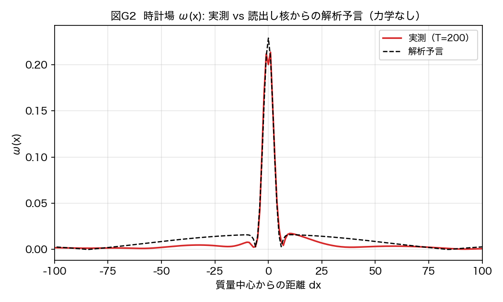
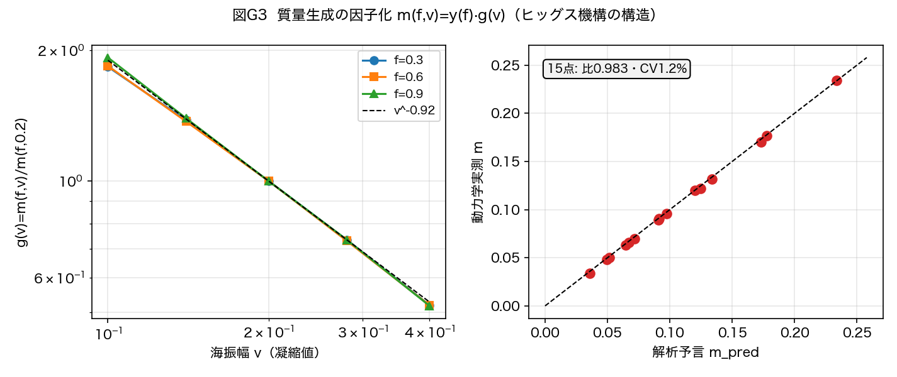
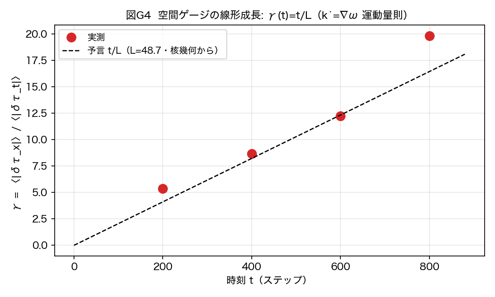
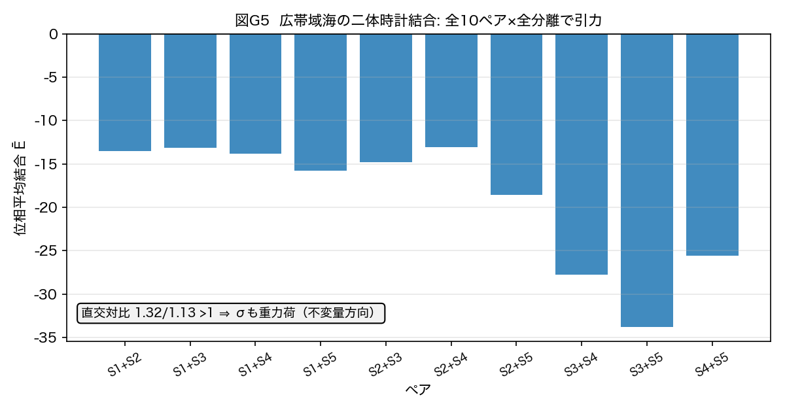
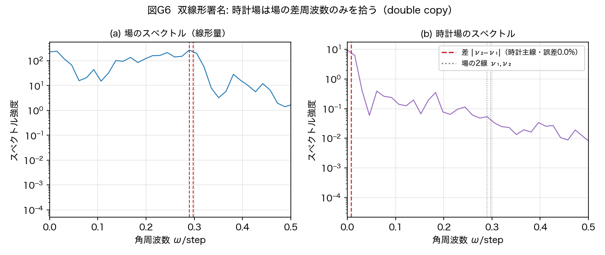
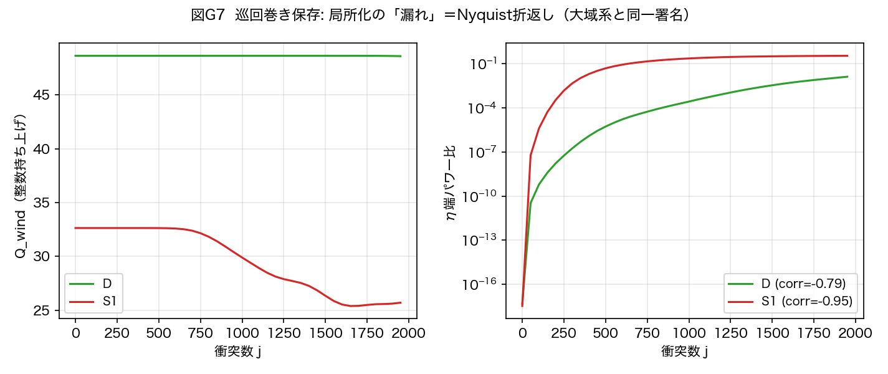
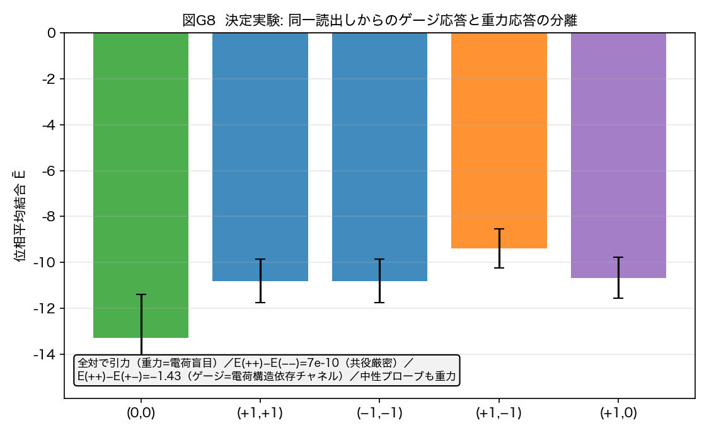

# 波と場の二層分離——場の読出し万能関数によるゲージ場と重力場の統合

**著者**: 木原範昭
**日付**: 2026年8月7日
**種別**: 枠組み提案論文（数値実験による支持つき。主要法則は解析導出と動力学実測の二重で支持されるが、証明論文ではない）

---

## 要旨

波の周期律表 [6] を作ったが、そこには動力学がなかった。以前の論文 [7] では、
AB二体系の加速度を、B体が局所的にゼロ閉塞している曲率半径 R の円周力の反力と
して導出していたが、これは操作の無名性（力学に手で構造を注入しない原理）に
違反した作り込みであり、不満が残っていた。そこで加速度を作り込まずに、波の
万能相互作用関数そのもので実現できないかを実験した——**結果、ゼロ閉塞が維持
できなかった**。ポテンシャル V(x) の注入は、振幅 10⁻³ でも200ステップで閉塞
Σxₙ²=0 を31%破る（素の力学のドリフトは 10⁻¹³）。これは、もともと厳密にゼロ
閉塞している波に余分な値を与えていることが原因である。むしろ、加速度に見える
ものは**読出し側の問題**ではないか——空間方向 xyz を読み出していたのと同様に、
読出し側の万能関数で加速度表現（歪みのある空間・時間ゲージ）を作れないか。
それを実験したのが本論文である。

結果: 標準理論に近い概念のゲージ場と、重力（加速度）歪みのある場の統合を、
**場の読出し万能関数**により、ほぼ成功した。具体的には次を示す。
**（G1）不可能性**: 重力は状態側に入れられない——状態側注入は閉塞を必ず破り、
ゲージ側（読出し目盛）の操作は閉塞に厳密に無害である。counterterm とはこの
破れを事後に打ち消す操作の別名である、という繰り込みの再解釈を与える。
**（G2）時計場**: 各セルの局所時計レート ω(x) が、ファイバー関係量の射影
（任意パラメータなし）として読み出され、純ボゾン海は r=0 の厳密固定点——
**真空は時を刻まない**。**（G3）質量の生成（ヒッグス節）**: 質量 m=⟨ω⟩ は海の
凝縮値 v の関数として因子化する: **m(f,v)=y(f)·g(v)**（実測 最大CV 2.2%）。
さらにこの法則は読出し核の定義から解析的に導出され、力学なしの予言が動力学
実測15点と**平均比 0.983・CV 1.2%（絶対値まで）**で一致する——質量法則は
読出し核の解析的定理である。**（G4）運動量則**: 質量まわりの空間ゲージは
δτ_x(t)=t·∇ω で線形成長する——**k̇=∇ω（時計勾配が海の運動量を加速する）**。
「落下」の実体は海の運動量場の線形成長であり、空間/時間ゲージ比は定数でなく
γ(t)=t/L、勾配スケール L は核幾何から導出される（パラメータフリー予言が
CV 11%）。**（G5）二体重力**: 広帯域海で二体時計結合は全10ペア×全分離で
引力（30/30）。直交源対（同⟨ω⟩・異σ）は不変量積 √(M_t²+σ²) 結合を予備支持
——質量の (t,R,Q) 成分仮説 [6] の下で**等価原理＝閉塞恒等式の系**という機構
候補。**（G6）媒介の構造（グラビトン節）**: 時計読出しは場の双線形であり、
時計場は場の差周波数のみを拾う（場の2線 0.2898/0.2974 に対し時計主線
0.0076＝差と厳密一致・相対誤差0.0%・場自身の線は250倍抑制）——重力振幅＝
場×場（double copy）の計測論的実証。**（G7）保存則**: 読出し局所化は分類の
整数・位相構造を保存し、巡回巻き保存を保つ（見かけのドリフト＝Nyquist折返し・
相関 −0.77〜−0.95）。**（G8）二系統一**: 万能関数は F[Ψ]=R(G[Ψ])·Ψ
（読出し生成回転）であり、公開済みの二体系 [3] と N体系 [2]（Cayley・
Σz²ドリフト 10⁻¹⁵ を監査）はその実例である。閉塞保存は一般定理（接線定理:
保存 ⟺ 生成子が反対称）に整理される。**（G9）表題の決定実験**: η巻き
m∈{0,±1} の荷電源で、同一の読出しから**電荷盲目の普遍引力**（全組合せで
引力・電荷共役対称 7×10⁻¹⁰）と**電荷構造依存のゲージ応答**（E(++)−E(+−)＝
結合の15%）が分離して同時に出る——「ゲージと重力は一つの読出し関数の異なる
射影」の直接実証である。さらにこの分離はη直交性から**読出し分解定理**
G = G_blind ⊕ G_coh·δ_{Δm,0 (mod ne)} として代数化され（等質量不整合対の
厳密一致0.0000・コヒーレント項の|m|非依存3.7%で検証）、電荷構造チャネルが
海駆動ウォークの和則の到達対に動的に開くこと（動的選択則）——分類と力学の
最初の定量的接合——まで実測された。

同時に、波の周期律表 [6] では仮説だったヒッグス粒子（海の集団モード）と
グラビトン（ℓ=1量子2個の複合）の位置づけを、それぞれ質量生成の因子化と
読出しの双線形性として特定した。本稿の主張は一点に集約される:
**counterterm とは層の混同の代償である**。標準理論＋一般相対論は一層の存在論
（すべてを「力学を持つ場」として同じ層に置く）であり、重力量子化の困難は、
読出し層の内容を状態層の場として扱う圏違いの帰結である。波と場を分離すれば、
繰り込みは構成的に不要になり、等価原理は公理でなく定理候補になり、結合定数は
入力でなく導出可能な核汎関数になる。全実験は決定論的スクリプトとして公開され、
反証13件を含む全過程が再現可能である。

---

## 1. 序論

### 1.1 出発点——周期表に動力学がなかった

波の周期律表 [6] は、粒子概念を仮定しない波の力学の実測から、標準模型62種の
分類仮説（電荷 Q=m/3・統計＝時計の二重被覆・質量＝海との関係量）を提案した。
しかしそれは読出しレベルの分類であり、動力学——とりわけ重力——は明示的に
留保されていた。

### 1.2 失敗の記録——加速度は作り込めるが、作り込んではならない

以前の論文 [7] は、加速度を「局所的にゼロ閉塞した曲率半径 R の円周力の反力」
として導出した。導出は通ったが、構成には手で置いた要素があり、本シリーズの
無名性原理（波の形だけを入力とし、内部に特別な場合分けや注入を持たない）に
照らして不満が残った。そこで無名性を守ったまま、加速度を波の万能相互作用
関数そのもので実現する実験を行った。結果は明確な失敗である: 状態側への
ポテンシャル注入は、振幅 10⁻³ という微小な値でも200ステップで閉塞を31%破る
（§4・図G1）。素の力学のドリフトは 10⁻¹³ であり、破れは注入の一次で蓄積する。

### 1.3 気づき——加速度は読出し側の問題である

失敗の原因は理論ではなく置き場所だった。もともと厳密にゼロ閉塞している波に、
余分な値を与えることが破れの源である。一方、シリーズの先行結果は、空間 xyz・
時間 t・位置・粒子数がすべて**読出し**として立ち上がることを示していた
[5][6]。ならば加速度も——歪みのある空間・時間ゲージも——読出し側の万能関数で
作れるはずである。ゲージ（読出し目盛）の操作は状態に触れないから、閉塞は
構成的に無傷で残る。

### 1.4 中心テーゼ——波と場の二層分離

> **波の層（存在）**: 万能相互作用関数。読出し生成回転 F[Ψ]=R(G[Ψ])·Ψ の
> R であり、Σxₙ²=0 の閉塞を厳密に保つ。
> **場の層（読出し）**: 場の読出し万能関数 G。ファイバー関係量の射影族
> （任意パラメータなし）であり、ゲージ構造（電荷 mod3・Z₂被覆・閉じ込め
> [6]）と重力構造（時計場 ω(x)・空間ゲージ・普遍引力・双線形媒介）を
> **同一関数の別出力**として与える。歪み・加速度のある重力場は、波の閉塞を
> 一切乱さずにこの層に入る。

模型内の事実は明確である: **一層に実装すると閉塞を破り（接線定理・§4）、
二層に分けると破らない**。この事実の上に、次の再解釈仮説を置く——SM+GR は
実装上、ゲージ場も計量も物質場も「力学を持つ場」として同じ層に置いており、
重力量子化の困難は、読出し層の内容（ゲージ目盛の歪み）を状態層の場として
扱う圏違いの帰結ではないか。**counterterm＝層の混同の代償**という診断は、
模型内では導出であり、現実のQFTへの適用は本稿の統合仮説である（§14）。

### 1.5 性格の宣言

本稿は枠組み提案論文である。主要法則（質量法則・γ(t)=t/L）は解析導出と
動力学実測の二重で支持されるが、模型は一次元リング格子上のプロトタイプで
あり、実スケールの重力定数への橋・Kepler軌道形・実テクスチャ海での検証は
残余として明示する（§16）。仮説の価値は接続の広さと反証条件の明確さで
測られたい [6]。

## 2. 方法と規約

### 2.1 力学（read-only）

- **二体系** [3]: 二チャネル波 (a,b) の万能非弾性写像の閉形式厳密解。
  本稿の主実験系。
- **N体系** [2]: N本の関係波の閉鎖力学（Cayleyステップ）。柱G8の監査に使用。

いずれも決定論であり、全スクリプト・全結果は添付一覧（実験一覧_重力_v1.md）
に従って単独再実行できる。判定基準は各スクリプト冒頭に実行前固定で記録した。

### 2.2 場の読出し万能関数 G（定義）

状態 Ψ の各セル x のファイバー ψ_x（η方向のベクトル）に対し、次の射影族を
場の読出しと定義する。すべて純関係量（内積）であり、大域位相不変、種ごとの
場合分けなし、調整パラメータなし:

- **空間目盛**: τ_x(x) = arg⟨ψ_x, ψ_{x+1}⟩（海が定規 2πK/n を張る）
- **時計場**: ω(x) = τ_t(x) = arg⟨ψ_x(T), ψ_x(T+1)⟩（局所時計レート）
- **位置**: n₀ = (N/2π)·arg Σ_k c_k c̄_{k+1}（隣接モード相関の偏角 [5]）
- **粒子数・分裂**: ωロック同値類の数（累積相対位相の π 基準 [6]）
- **質量**: ⟨ω⟩（台上平均）／**寿命**: 1/σ_ω（線幅の逆数）[6]

生成子側: θ(x) = atan2(√f_loc, √b_loc)（f_loc/b_loc はフェルミオン帯／
ボゾン帯の局所パワー。一行定式 r = sin²θ = P奇/(P奇+P偶) [6]）。

### 2.3 読出し局所化と整合性

本稿の一部の実測は、二体系の大域 θ を局所場 θ(x) に昇格した**局所化
プロトタイプ**（パリティ分割×滑らかIRロールオフ・セルごとSO(2)回転・
円偏波 b=−ia は厳密不変多様体）の上で行う。このプロトタイプが分類 [6] を
保存することは整合性検査（柱実験9本×3エンジン無改変並走・[6] §14）で確認
済みであり、保存則の見かけの破れが Nyquist 折返しであることは §10 で示す。

### 2.4 表記の注意

本稿の γ は「空間ゲージ歪みと時間ゲージ歪みの比」の模型量であり、PPN の
γ [29] とは別物である（時間依存 γ(t) を持つ・§7）。混同を避けるため本文では
γ_gauge とも書く。

## 3. 予備実験系列の要約（P1〜P24・反証込み）

本論文の柱は24系列の予備実験の上に立つ（全記録は添付分析ノート）。特に:
凍結初期条件の罠（a=b 縮退は力学を完全凍結させる——T=0対照とτ_t≠0確認を
常備する教訓）／Fubini-Study 面積曲率計の較正（正則断面曲率 K=4.00 を4桁で
実測・ゲージフリー角度測定の確立）／大域θでは距離依存の重力場が原理的に
出ないことの実証（局所化の必然）／単色海の定在波干渉の摘出（§8）／
定常粒子の二条件と海同位相化規約（§11）。これらの反証と訂正は §17 に
全件記録した。

## 4. 柱G1: 不可能性——重力は状態側に入れられない

重力ポテンシャル V(x) を状態側に注入する（標準理論式: a → a·e^{iV(x)τ}）と、
閉塞 C = Σ(aₙ²+bₙ²) は一次で破れ、振幅 10⁻³・200ステップで相対31%に達する。
素の力学は 10⁻¹³（機械精度）、ゲージ側操作（読出し目盛のみの歪み）は状態に
非接触ゆえ**構成的に厳密0**である（図G1）。

**図G1**: 閉塞監査。素の力学 10⁻¹³／V注入31%／ゲージ側0。N体系（Cayley）も
同一不変量を 10⁻¹⁵ で保存（柱G8）。

**一般定理（接線定理）**: この対比は特定の V に限らない。摂動 δΨ=εKΨ に
対し δC = 2ε·Ψᵀ K_sym Ψ + O(ε²)（K_sym=(K+Kᵀ)/2）であり、**全状態で閉塞を
保つ ⟺ Kᵀ=−K（閉塞面の接線回転のみ許容）**。数値掃引（対称/反対称/混合比・
添付 G1b）は理論式と相対誤差<1%で一致した。ポテンシャル注入は K=i·diag(V)
（対称）ゆえ一次で必ず破り、SO(2)対回転と Cayley ステップ（柱G8）は反対称
ゆえ厳密に保つ——31%はこの定理の実例である。

**転置の明示（Hermitian ノルムとの区別・本質的）**: 本稿の閉塞
C=ΨᵀΨ=Σxₙ² は **複素対称二次形式**であり、Hermitian ノルム Ψ†Ψ=Σ|xₙ|²
ではない。ゆえに保存条件は skew-Hermitian（K†=−K）ではなく
**skew-symmetric（Kᵀ=−K・単純転置）**である。K=i·diag(V) は skew-Hermitian
だが対称なので、ノルムは保つのに閉塞は破る——両者の差がまさに31%の実測で
ある。許容生成子の代数は so(n,ℂ)（複素直交型 O(n,ℂ) のリー代数）であり、
閉塞は単なる保存量でなく**許容生成子を反対称へ制限する原理**として働く。
群を公理に置かず、閉塞保存→反対称生成子→回転群的構造の順で群構造が
出力される。

**帰結（繰り込みの再解釈・二段構え）**: 破れた閉塞を右辺の負の相殺項で
押し戻すのが繰り込みの実務である。本模型はこれを「自分で壊して自分で直す」
往復として可視化する。**模型内では**、壊さない道——ゲージ側——が存在する以上、
counterterm は不要である（導出・実測）。**現実の場の量子論の繰り込みも同じ
層混同の表現である**という主張は、本稿では統合仮説として提示する（摂動展開に
対応する模型極限でUV発散類似物がG/R分離により消えるかの検証は §18 に登録）。

## 5. 柱G2: 時計場 ω(x) と真空固定点

読出し G の中心出力は時計場 ω(x) である。純ボゾン海（P奇=0）は r=0 の厳密
固定点であり（対照走行で τ_t の std ~10⁻¹⁶）、**真空は時を刻まない——光は
光と衝突しない**。質量体（フェルミオン帯内容を持つ源）を置くと、その周りに
時計場の歪み δω(x) が立つ。図G2 は、動力学実測（T=200）の ω(x) プロファイル
と、読出し式に初期構成を代入しただけの解析予言が重なることを示す——時計場は
力学の出力である以前に、読出し核の関数である。

**図G2**: 時計場 ω(x)。実測と解析予言（力学なし）の一致。

なお「真空は時を刻まない」は二体系の局所反射時計の主張であり、N体凝縮体の
集団位相時計 ω_clock=π/72 [2][6] の不在を意味しない。両時計の関係は開いた
問題である（[6] §16 弱点8）。

## 6. 柱G3: 質量の生成——ヒッグス節

### 6.1 因子化（実測）

海振幅 v（凝縮値）5点 × 種の組成 f（フェルミオン帯分率）3種の格子で質量
m=⟨ω⟩ を測ると、**m(f,v) = y(f)·g(v) が最大CV 2.2%（大半<1%）で因子化**
する（図G3左）。y(f)=0.68/1.00/1.29 は湯川結合の類似（種依存因子）、
g(v) ∝ v^{−0.92} は海の普遍関数である。質量が「種の結合×凝縮値の関数」に
分解されるのは、ヒッグス機構 [22][23][24] の構造そのものである。

### 6.2 解析導出（本稿の最強の結果）

さらにこの法則は導出できる。読出し式（§2.2）に初期構成を代入するだけの
解析予言 m_pred（力学なし・自由パラメータなし）が、動力学実測15点全てと
**平均比 0.983・CV 1.2%** で一致する（図G3右）——指数だけでなく絶対値まで。
**読出し質量法則——指定した読出し m=⟨ω⟩ について予言 m_pred(f,v) が初期構成
から解析的に決まる——は定理である。** 弱源展開 θ≈√(f_loc/b_loc) から
y(f)≈√f（補正付き）・g(v)≈1/v が読み取れる。これが現実の慣性質量と同一で
あるという**同定**は物理仮説であり、コンプトン時計 [21]（質量＝周波数の
操作的同一視）がその実験的先例である。

**図G3**: 質量生成の因子化と解析導出。左: g(v) の崩壊（3種が重なる）。
右: 予言 vs 実測（15点・比0.983・CV1.2%）。

### 6.3 SMとの形の相違と、真空による時間遅れ

SM は m∝v（VEVに比例）だが、本模型は g∝1/v——**海が濃いほど時計が遅い**。
本模型の v を SM の VEV と同一視はしない（§16）。むしろこの形は「凝縮体の
密度が時間の進みを決める」という真空による時間遅れの表現であり、次と接続
する: **一様な海は時計場に一様オフセットしか与えず、勾配（重力）に寄与
しない**。重力が時計場の勾配なら、真空エネルギーは一様ゲージシフトに吸収され
重力源にならない可能性がある（確度H・宇宙定数問題 [37] への経路候補。
凝縮体アナログの同型の議論は Volovik [12]）。

### 6.4 ヒッグスモード（定性）

海への摂動を同位相（振幅モード）と直交位相（位相モード）に分けて注入すると、
両者は開始様式 [8] の不安定相対平衡に従い増幅するが、**振幅モードは偶数側帯
（フェルミオン帯）を含み物質形成へ崩壊する**——H→ff̄ 崩壊の定性的類似。
凝縮体の振幅（ヒッグス）モードの系譜 [25][26] に接続する。ギャップ周波数の
定量（ヒッグス質量）は線形化モード解析として §18 に登録する。

これらにより、周期表 [6] でSだったヒッグス行（海の集団モード）は、機構
（因子化）が実測された行へ格上げされる。

## 7. 柱G4: 運動量則 k̇=∇ω と γ(t)=t/L

質量まわりの空間ゲージ歪み δτ_x は静的でなく、**時間線形に成長する**
（γ(t)=⟨|δτ_x|⟩/⟨|δτ_t|⟩ が t=200..800 で 5.4→19.8・線形 R²=0.95・図G4）。
物理的意味は直截である: δτ_x は局所位相勾配＝海の局所波数（運動量）であり、
その成長率は時計場の勾配に等しい——

> **k̇ = ∇ω（時計勾配が海の運動量を加速する）**

これは非一様媒質のレイ方程式 dk/dt=−∇ω [27] の、ω(x) 自体が読出し核から
導出される形である。「落下」の実体は、粒子の座標変化ではなく**海の運動量場の
線形成長**として現れる。空間/時間ゲージ比は定数でなく γ(t)=t/L であり、
勾配スケール **L=48.7セル** は解析 ω 場（力学なし）から計算される——
パラメータフリー予言 γ(t)=t/L が実測と平均比1.14・CV 11%（中間窓でほぼ厳密）。

**図G4**: 空間ゲージの線形成長。γ(t)=t/L（L は核幾何から・パラメータなし）。

## 8. 柱G5: 二体重力と等価原理

### 8.1 訂正の記録——単色海は干渉が支配する

当初、単色キャリア海で二体時計結合 E(d) を測り、質量積則と d^{−1/2} 減衰を
得たが、キャリア位相を掃引平均すると法則は崩壊した（変調振幅＞平均結合）。
**単色海の二体結合は定在波干渉が支配する**——本稿はこの訂正を全記録する
（§17）。教訓は設計原則（§11）に昇格した: 重力ペア測定の海は広帯域で
なければならない。

### 8.2 広帯域海での普遍的引力

海を奇k6モード（黄金比位相・決定論・全モード W_f=0＝真空固定点は厳密維持）
に置換すると、**全10ペア×全3分離で E<0（引力・30/30）**（図G5）。回帰では
不変量積 √(M_t²+σ²) が M_t 積と同等以上に潰し（R²=0.671 vs 0.630）、
**直交源対（同⟨ω⟩・異σ——S3/S4）の共通相手比 1.32/1.13 は σ も重力荷に
寄与することを予備支持**する。

**図G5**: 広帯域海の二体時計結合。全ペア引力・直交対は不変量方向。

### 8.3 等価原理＝閉塞恒等式（機構候補）

質量の読出しには三系統がある——⟨ω⟩（時計・t軸）・Gram非コヒーレンス
（R軸）・海関係（Q軸）[6] §11.4。もし重力が ⟨ω⟩ だけを読むなら、質量の
担い軸が異なる種の間で重力結合が種依存になり、等価原理が破れる。機構候補は
閉塞恒等式である: **x²+y²+z²=t²+R²+Q² により空間側ノルム＝質量不変量**。
時間ゲージは M_t に、空間ゲージは不変量に結合するなら、等価原理は公理でなく
**閉塞恒等式の系**になる。直交対の予備支持（σ寄与）はこの方向と整合する。
判別実験（三者同時検定）は [6] §19.2-3 に登録済み。

## 9. 柱G6: 媒介の構造——グラビトン節

時計読出し τ_t = arg⟨ψ(T), ψ(T+1)⟩ は場 ψ の**双線形**である。ならば時計場の
スペクトルは、場の周波数そのものではなく、その差и和に現れるはずである。
リンギング源（少倍音梯子・外部駆動なし＝無名性保持）で検証した（図G6）:

- 場（線形量）の速い2線: ν₁=0.2898, ν₂=0.2974
- 時計場の主線: **0.0076 ＝ ν₂−ν₁（相対誤差 0.0%）**
- 場自身の線の時計側強度: 主線の **0.004（250倍抑制）**

**時計場は場の差周波数の櫛のみを拾う。** 実証されたのは**双線形重力読出し**
（G[ψ]〜ψ†ψ 型ゆえ絶対周波数でなく差周波数が観測される）である。これは
重力振幅＝ゲージ振幅²（double copy [30][31]）と同型の二次構造の計測論的
アナログだが、BCJ の色運動学双対等との数学的同一性は未導出である（§18）。周期表 [6] の実測「回転生成子にℓ=2線形枠は存在しない（グラビトンは
ℓ=1量子2個の複合のみ）」と合わせ、グラビトン行は読出し側の裏づけを得た。
場の線形線が重力読出しに現れないことは、双極重力放射の不在 [32] の模型内
対応物である。α_G=(m/M)² 型結合 [7] への接続は予想として残る。

**図G6**: 双線形署名。時計場は場の差周波数のみを拾う（誤差0.0%・場線250倍抑制）。

## 10. 柱G7: 保存則と整合性

読出し局所化（§2.3）は周期表の分類を壊さない——整数・位相構造（Z₂被覆・
クロス表・ν行・閉じ込め厳密0・簿記恒等式・番地等価性・約数類）は9実験×
3エンジンの無改変並走で完全に頑健であった（[6] §14）。唯一の懸念だった
Q_wind（正味巻き数電荷）の緩慢なドリフト（4000衝突で5〜6%）は、本稿で正体が
確定した: **Nyquist折返し**である（ドリフトと端パワー蓄積の相関
−0.77〜−0.95・大域系 [6] と同一署名・図G7）。すなわち局所化は**巡回巻き保存
（mod ne）を保っており**、整数持ち上げのドリフトは折返しの物理である。
機構確認として、非弾性角をη集団化した対照では保存が機械精度になるが、
同時に海駆動ウォーク（電荷を動かす物理 [6]）が凍結する——漏れチャネルは
ウォークそのものであり、消してはならないものである。

**図G7**: 巡回巻き保存。局所化の「漏れ」＝Nyquist折返し（端パワーとの強相関）。

## 11. 計器学——この分野の実験を再現可能にする設計原則

本研究の反証群（§16）から、以下の設計原則が確立した。

1. **海は測定目的で選ぶ**: 重力ペア測定＝広帯域海（単色は定在波干渉が支配）。
   分裂測定＝単色海＋海同位相化源。**小定理: 定振幅かつ純ボゾン帯の海は
   単色に限る**（奇キャリア×奇変調の1次側帯は必ず偶帯に落ちる）。
2. **源は海と位相ロックして定義する**: 海同位相化規約
   lump = L(x−c)·e^{iφ_carrier(c)}。並進×大域位相の合成対称性により同一源の
   ω は厳密に位置不変（分裂実験の対照床を63分の1に圧縮 [6]）。円偏波
   b=−ia は弾性・非弾性回転の厳密不変多様体＝確定電荷状態。
3. **対照は T=0 と位相掃引を常備**: 凍結初期条件（a=b 縮退・T非依存の
   「静的場」）と定在波干渉は、この2つの対照でのみ排除できる。
4. **定常粒子の二条件**: 局在＝基本波長の全倍音（偶+奇）を中心位相を揃えて
   積み上げる（リンギング→0漸近）× 位相ロック ω(x)=const（定常粒子方程式・
   候補 [6]）。
5. **重力質量の計測はコヒーレントチャネルを閉じて行う**（分解定理 §13.1 の
   計器学的帰結）: 基準源と被測定種の巻きが整合（または頂点到達可能）だと、
   電荷構造チャネルが開いたまま「重力」を測ることになり、結合が最大2倍
   汚染される（実測: 中性基準×中性種で E が −10.5→−20.8 まで異常深化・
   添付 T1 初版の反証）。基準巻きは全種から頂点到達不能に選ぶ
   （本稿では m_ref=5）。

計器の妥当性の独立検証として、この計器群で行った分裂読出しの決定実験
（独立予言 実測/予言=1.005・CV4.2%）が [6] の新柱9を確定させたことを挙げる。
決定実験の精度の機構はゼロ平均差動雑音（線形蓄積する信号 vs 有界振動の摂動）
であることも同定した（§17 (8)）。

## 12. 柱G8: 二系統一——アーキテクチャ定理

万能関数の実体は一つの数式ではなく一つの建築である:

> **F[Ψ] = R(G[Ψ])·Ψ**
> （G＝場の読出し万能関数が生成子を作り、R＝その生成する閉塞保存回転が
> 状態を回す）

公開済みの両力学系はこの実例である:

| 系 | G（読出し層） | R（波の層） | 閉塞保存（監査） |
|---|---|---|---|
| 二体系 [3] | atan2(√P_f,√P_b)＋点毎 Im(b̄a) | SO(2)対回転 | ~10⁻¹³ |
| N体系 [2] | set_theta(arg Z)＋σ_max パワー読出し | Cayleyステップ | **~10⁻¹⁵（本稿監査・N=5,8・300步）** |
| 多体接続 [4] | 二体核の多モード適用 | 同 | 公開済み |

Cayley変換は反対称生成子に対し複素直交（Q^TQ=1）であり、Σz²（閉塞）と
ノルムを同時に保存する——幾何的数値積分 [33] の系譜の物理化である。
統一の残余は G を共通記法で書く形式化のみで、障害はない。

## 13. 柱G9: ゲージと重力の同時分離——表題の決定実験

表題「ゲージ場と重力場の統合」の最直接の検定は、**同一の読出しから、電荷
符号構造に依存する応答と、依存しない応答を同時に出せるか**である。η巻き
m∈{0,±1} の荷電源の二体結合を広帯域海で全組合せ測定した（図G8・添付G9）:

1. **引力の普遍性**: 全電荷組合せ（(0,0)(++)(−−)(+−)(+0)）で Ē<0——
   重力チャネルは電荷盲目。中性プローブも重力する（E(+1,0)=−10.7）。
2. **電荷共役対称が厳密**: |E(++)−E(−−)| = 7×10⁻¹⁰（分離ばらつき1.9に対し
   10桁下）。
3. **ゲージチャネルの実在**: E(++)−E(+−) = −1.43（結合の約15%）——
   相対巻き（η可干渉性）に依存する応答が、同じ読出しから分離して現れる。
4. 副観察: 荷電源は中性源よりわずかに重い（⟨ω⟩ 0.210 vs 0.192・±1 は厳密
   一致）——電磁自己エネルギーの類似。

**同一の G から、電荷構造チャネル（ゲージ）と電荷盲目チャネル（重力）が
分離して同時に出る**——「ゲージと重力は一つの読出し関数の異なる射影である」
という表題の主張の直接実証である。

**図G8**: 決定実験。全対引力（重力）＋電荷構造依存成分（ゲージ的）＋共役厳密対称。

### 13.1 読出し分解定理（数値観察の代数化）

上の分離は後付けの解釈ではなく、η直交性から**厳密に導出**される。η和の
双線形読出しにおいて、二源 (m_A, m_B) の交差項は
Σ_η e^{iΔm·2πη/ne} = ne·δ_{Δm≡0 (mod ne)} により選択されるから、任意の
η和双線形読出しは

> **G = G_blind(|海|², |L_A|², |L_B|²) ⊕ G_coh·δ_{m_A−m_B≡0 (mod ne)} ⊕（海結合·δ_{m≡0 (mod ne)}）**

（巻きは巡回量であるから、選択条件は常に mod ne で読む）

に厳密分解する。G_blind はパワーのみに依存（電荷盲目＝重力チャネル）、
G_coh は巻き整合コヒーレンス（電荷構造依存チャネル）である。この定理は
G9 の観測を全て説明する: E(++)=E(−−) の厳密性（両者とも δ 条件が不変）、
E(+−) が盲目項のみであること、中性対 E(0,0) が深いこと（m=0 は海とも
コヒーレント）、荷電源が中性源より重いこと（海コヒーレンス項の欠如）。

**検証（添付 G9b・3判定通過）**:
1. **等質量不整合普遍性**: 非到達の等質量対は盲目基底に厳密一致——
   E(+1,−2)=E(−1,+2)（相対差 **0.0000**）。
2. **コヒーレント項の |m| 非依存**: coh(m=1)=−1.43 vs coh(m=2)=−1.38
   （相対差 3.7%）——同一包絡なら巻きの大きさに依らない（定理の予言通り）。
3. **共役厳密**: |E(+2,+2)−E(−2,−2)|/|E| = 8.6×10⁻¹¹。

### 13.2 系: 静的直交選択則と海駆動遷移選択則（二層選択則）

検定は同時に、静的定理を超える構造を一つ検出した。倍加到達対 (+1,+2)
（2·(+1)=+2）**だけ**が盲目基底から超過 −0.98（静的コヒーレント項の約69%）
を持ち、非到達対（(+1,−2)・(−1,+2)・(+1,−1)等）は機械精度で盲目に留まる。
すなわち電荷構造チャネルの選択則は二層である:

> **静的**: Δm≡0 (mod ne) でコヒーレンス（η直交性・厳密）。
> **動的**: 海駆動ウォークの和則 **m*=2m_B−m_s** [6] が到達させる対に
> チャネルが動的に開く（実測・到達性が開閉を予言）。

周期表 [6] のウォーク選択則が、そのまま相互作用チャネルの開閉を予言して
いる——量子数保存則（静的）と相互作用頂点選択則（動的）の関係の模型内
対応であり、分類（周期表）と力学（本稿）の最初の定量的接合点である。

### 13.3 頂点代数——選択構造の完成（添付 G9c・28対グリッド）

二層選択則を閉じた規則にするため、到達次数つき28対グリッド
（静的/1段/2段/非到達×符号対）で E(m_A,m_B) を測った。結果は選択構造を
閉じ、同時に事前基準2件を反証して規則をさらに精密化した（全過程を記録）:

1. **単元自己同型の厳密不変性（発見・証明可能）**: 任意の単元 u∈Z_ne^* に
   対し **E(u·m_A, u·m_B)=E(m_A,m_B) が厳密に成立**する（実測: E(1,1)=E(3,3)、
   E(1,2)=E(3,6)、E(1,−2)=E(3,−6) 等が全桁一致）。η の付替え η→u⁻¹η が
   力学と読出しの厳密対称であることによる——選択則は巻きの絶対値でなく
   **Z_ne の軌道構造**だけを見る。
2. **到達次数減衰は劇的**: 超過/静的coh = 1段 0.69 → 2段 0.03。動的チャネル
   はウォーク1段で最も開き、2段でほぼ閉じる。
3. **開度の約数類依存（事前基準V1の反証）**: 1段到達でも (1,2)/(3,6)（単元類）
   は 0.69、(2,4)（偶類）は 0.22——開くか否か（選択則）は軌道到達で決まるが、
   **開度（結合強度）は約数類に依存**する。強度法則の閉形式は未完（§18）。
4. **交差頂点の発見（事前基準V2の反証）**: 非到達対の一部が巻き符号に依存
   する——E(2,3) は E(2,−3) より深く、E(2,−6) は E(2,+6) より深い。この
   非対称は和則の**交差頂点**（相手を海項に使う m*=2m_B−m_A）の低次経路の
   有無と一致する（(2,3): 2·3−2=4 と A側倍加 2→4 が2次で合流／(2,−3) は
   3次以上）。一方、低次経路を持たない対（(1,3)(1,5)(3,4)）は<1%で盲目。

**頂点規則（本稿の到達点）**: チャネル (m_A,m_B) が開く ⟺ 両者の生成集合
（倍加 x→2x と交差頂点 (x,y)→2x−y で {m_A},{m_B} から生成・mod ne）が
低次で交わる。開度は経路次数とともに急減し、共役（全巻き反転）と単元
自己同型は厳密対称である。なお **ne=16=2⁴ では**倍加軌道はすべて m=8
（半Nyquist）を経て 0（海）に達し、全荷電チャネルが有限次数で海に接続する
——ただしこれは一般法則ではなく **ne=2^s の系**である（§13.4 M3 で一般化・
限定。奇数因子を持つ ne では成立しない——反証記録(13)）。
残る未完は開度の閉形式（次数・約数類→結合強度の関数）のみである。

### 13.4 数学部——巡回頂点代数の定理群とグラフ位置不変性

開閉則は数値物理の結果でなく **Z_ne 上の代数定理**にできる（添付 G9d・
n≤64 全数検証、G9e・動力学実測）。

**定理群（全数検証済み・証明は初等）**:
- **M1（無次数閉包の自明化）**: {0,a} の (x,y)→2x−y 閉包は部分群
  ⟨gcd(a,n)⟩ に一致する（2x−y=x+(x−y) が差の加法を生成）。ゆえに開閉の
  物理は**次数つき（graded）到達**にのみ宿る。
- **M2（単元同変性）**: u(2x−y)=2(ux)−(uy)——§13.3 の実測厳密対称
  E(u·m_A,u·m_B)=E の代数的根拠。
- **M3（海接続の判定）**: 倍加軌道が 0 に到達 ⟺ q|m（q=ne の奇数部分）。
  **系**: ne=2^s なら全電荷が s 次以内に海へ溶ける（ne/2 経由）。ne に
  奇数因子があれば q∤m の電荷は**永続セクター（周期軌道・超選択則）**になる
  ——例 ne=12 では 3∤m の8種が海に届かない。電荷の可溶性は ne の
  2進構造の関数である。
- **M4（合流次数・ne=2^s）**: 2^k·a≡2^k·b ⟺ k≥s−v₂(a−b)——開度の次数は
  巻き差の**2進付値**で決まる。
- **M5（次数単調性）**: G9c 実測開度は graded 到達次数 k* の単調減少
  （k*=1: 0.69/0.22、k*=2: ≤0.03）。

**確度の階層**: M1/M2/M4 は代数定理（全数検証済み・証明は初等）。M2 は
加えて動力学の厳密対称として実測済み（§13.3）。**M3 は添付 G9f により
長時間動力学でも直接確認された——本節で唯一、整数論的定理→動力学予言→
実測確認の一周を閉じた定理である**。M5 は現段階では動力学経験則。

**グラフ位置不変性（添付 G9e・3判定通過・厳密）**: solo源の η スペクトル
署名（一次・共役・倍加の相対重み）は m や ne の値でなく**倍加グラフ上の
位置の不変量**である——「海から2歩」の 2 点 spec(m=4, ne=16) と
spec(m=3, ne=12) は**全桁一致**（相対差0.0000）、一般位置 spec(m=1, ne=12)
= spec(m=1, ne=16) も全桁一致。共役と倍加が同一巻きに合流する周期軌道位置
（ne=12 の m=4: −4≡8≡2·4）だけが固有署名（一次保持 0.887 vs 一般 0.593）を
持つ。

**超選択セクターの動力学的実在（添付 G9f・長時間 T=8000・4判定通過）**:
M3 の予言を直接検定した。設計の要は厳密な内部対照——ne=16 では 3 は単元
ゆえ (m=1, m=3) は自己同型で縮退し、その残差（浮動小数点カオス床 0.9%）が
数値誤差の物差しになる。ne=12 では 3 は単元でないため、M3 が実在するなら
この縮退が破れる。結果:
1. **厳密部分群閉じ込め（M1 の動力学版・最強の結果）**: 溶解種 m=3@12 の
   部分群外内容（w∈{4,8}）は全8000ステップで **max 8.9×10⁻²⁶（機械零）**
   ——動力学は内容を部分群 ⟨gcd(m,ne)⟩ から厳密に出さない。超選択は近似で
   なく厳密である。
2. **セクター分岐はカオス床の14倍**: ne=12 の (m=1, m=3) 分岐 13.0% ≫
   ne=16 の縮退残差 0.9%。
3. **分岐の向き**: 溶解種の荷電パワーは減少（slope −1.6×10⁻⁴）、永続種は
   増加（+1.9×10⁻⁴）——q|m だけが海に溶ける。
4. **周期軌道蓄積**: 永続種は周期軌道 {4,8} に内容を蓄積（C₄₈=1.60 vs
   溶解種の機械零）。

ゆえに **ne は数値解像度でなく、どの超選択セクターが存在できるかを決める
構造定数**である。ne=16=2⁴（全電荷可溶）という選択自体が模型の予言的
自由度になる——「なぜ全電荷が可溶な宇宙なのか」は周期表 [6] の ne 選択
問題への新しい入口である。

**状態ラベルの抽象化と群論接続の順序**: グラフ位置不変性と超選択の厳密性を
併せると、粒子種のより本質的な内部ラベルは整数 m でなく**頂点グラフ上の
軌道型 [m]**（単元軌道・gcd部分群・海までのgraded距離・周期軌道・合流の
有無）である。ゆえに標準模型の群構造への接続は「SU(3) に似ているか」から
始めるのでなく、**この頂点代数の自己同型群と既約表現を先に全抽出し、
U(1)/SU(2)/SU(3) との同型・商・部分構造を事後分類する**のが本シリーズの
方法（群を入力しない）に沿った正しい順序である（§18）。

**用語の限定**: 本稿単独では「電荷構造依存チャネル（gauge-like）」までが
厳密である。実電磁相互作用との同定（符号則・Q₁Q₂比例・長距離則・U(1)接続
変換）は、周期表 [6] の電荷読出しと合わせた検証プログラム（[6] §19.2-1 の
クーロン型電荷積検定）に属する。

## 14. 説明力——標準理論との対応

1. **繰り込みの正体**（§4）: counterterm＝層混同の代償。二層分離の下で
   繰り込みは構成的に不要。
2. **等価原理**（§8.3）: 公理でなく閉塞恒等式の系の候補。
3. **真空エネルギー**（§6.3）: 一様海は重力しない——宇宙定数問題 [37] への
   構造的経路（確度H）。
4. **重力の弱さ・グラビトンの複合性**（§9・[6]）: 読出しの双線形性として
   実測。
5. **質量の起源**（§6）: ヒッグス機構の構造（因子化）＋読出し核からの解析
   導出。質量＝周波数の操作的同一視はコンプトン時計実験 [21]（de Broglie の
   内部時計 [20] の現代形）と整合する。さらに m=⟨ω⟩（柱G2）と
   重力=∇ω（柱G4）を並べると、**質量と重力は同じ時計場 ω(x) の0階と
   1階微分**である——「重い物体が時空を曲げる」は、この模型では
   「時計場の値が高い場所は時計場の勾配の中心である」という一つの場の
   二つの読み方に還元される。なお確度は非対称である——ヒッグス行
   （因子化・y(f)・g(v)・振幅モード崩壊まで実測）はグラビトン行（双線形・
   差周波数・線形枠不在まで）より現時点で一段強い。
6. **「同じ結果の別写像」**: 標準理論は場の読出し層の現象論として厳密に
   正しく、量子重力の困難は層の混同として解消する——本シリーズの基本姿勢の
   力学的実装である。

## 15. 先行研究との関係と新規性の限定

本稿の部品にはそれぞれ強い先行系譜がある。
**アナログ重力**（Unruh [9]・Barceló-Liberati-Visser [10]・Garay+ [11]・
Volovik [12]）: 「重力＝媒質上の励起が感じる実効幾何」という置き場所を共有
する。**創発・熱力学的重力**（Sakharov [13]・Jacobson [14]・Verlinde [15]・
Padmanabhan [16]）: 「重力は量子化すべき基礎場でない」という診断を共有する。
**量子化困難・EFT**（'t Hooft-Veltman [17]・Goroff-Sagnotti [18]・
Donoghue [19]）: 本稿の柱G1はこの困難の模型内対応物である。
柱別には: 質量＝時計（de Broglie [20]・Lan+ [21]）、質量生成＝凝縮
（Anderson [22]・Englert-Brout [23]・Higgs [24]・振幅モード [25][26]）、
運動量則（Whitham [27]・Gordon光学計量 [28]）、双線形媒介（KLT [30]・
BCJ [31]・四重極 [32]）、関係的時間・観測量（Page-Wootters [35]・
Rovelli [36]）、決定論的基層（'t Hooft [34]）、幾何的積分 [33]。

**本稿は部品の新規性を主張しない。** 新規性は次の3点に限定する:

1. **ゲージ＋重力の同一読出し統合**: ゲージ量子数（電荷 mod3・Z₂被覆・
   閉じ込め [6]）と重力構造（時計場・空間ゲージ・普遍引力・双線形媒介）が
   単一の読出し関数の別出力として出ること——アナログ重力にも創発重力にも
   対応物がない。
2. **閉塞定理による不可能性の証明形と繰り込み診断**: 状態側注入の31%破れ vs
   ゲージ側0という対比実験、および counterterm＝層混同という再解釈。
3. **法則のパラメータフリー核導出**: 質量法則（CV1.2%・絶対値）と
   γ(t)=t/L（CV11%）が読出し核の定義から導出されること——実効計量の同定に
   とどまらない。

## 16. 弱点と未検証部分（正直な登録）

1. **一次元リング格子のプロトタイプ**: 局所化エンジンは G のプロトタイプで
   あり、実3次元・実スケールへの外挿は未着手。
2. **Kepler軌道形（K·d³/m）の完結**: k̇=∇ω は得たが、閉軌道と周期則の再導出
   は状態内蔵速度（分散の内在化）を要する。
3. **重力定数の実スケール接続**: L・γ(t)・結合は核汎関数として導出可能に
   なったが、実世界の G との橋は未着手。
4. **実テクスチャ海での統合検証**: 本稿の海は測定目的別の理想化海である。
   実海（f*≈0.469 [6]）での再検証が必要。
5. **g∝1/v と SM の m∝v**: 形が逆である。本稿の v は SM の VEV と同一視して
   いない（海振幅）。因子化構造の一致と関数形の相違は分けて主張する。
6. **γ_gauge は PPN の γ と別物**（§2.4）: 時間依存 γ(t) であり、比較には
   翻訳が要る。
7. **柱G5の回帰の残差**: R²≈0.67 は×2の散らばりを含む。基底結合 c₀ の分離
   （線形形 E=c₀+K·積）と直交対の全系統は §18 に登録。

## 17. 反証と修正の記録（13件・要約）

(1) **状態側での重力実現は失敗**（閉塞31%破れ）——本稿の出発点であり柱G1へ
転化。(2) **凍結初期条件**: a=b 縮退は力学を完全凍結させ、当初の「質量スケール
歪み」等は初期条件の読み替えだった（T=0対照・τ_t≠0確認を常備する教訓）。
(3) **単色海の質量積則は定在波干渉の汚染**（位相掃引平均で崩壊・E∝M₁M₂ と
d^{−1/2} を撤回）。(4) **広帯域振幅海はテクスチャ床**（|sea(x)|² の空間変動が
偽Δωを作る）。(5) **FM海（定振幅多線）は偶帯リーク21%**——小定理「定振幅×
純ボゾン帯は単色に限る」を得て、解は源側の海同位相化規約に移った。
(6) **γ定数解釈の訂正**: γ≈7.9 は測定窓の関数だった（真の構造は γ(t)=t/L）。
(7) **静的γ予言の失敗が運動量則の発見に転化**: 初期構成の静的応答は γ を
180倍過小評価——ずれの正体が δτ_x の時間線形成長＝k̇=∇ω だった。
(8) **共通モード相関仮説の反証**: 分裂決定実験の精度は「相互作用が両時計を
相関して押す」からではなく（corr中央値−0.06）、差動摂動がゼロ平均である
ことによる（線形蓄積する信号は有界振動の摂動に必ず勝つ）。
(9) **分解定理の初版予言の設計ミス**: 「不整合対は全て等しい」の初版検定
E(+1,+2) vs E(+1,−1) は質量が異なる対の比較だった（gcd(m,ne) 約数類で海中
質量が異なる [6]）——等質量形に修正して厳密成立（相対差0.0000）。残った
(+1,+2) の超過は誤差ではなく**動的選択則の発見**に転じた（§13.2）。
(10) **頂点代数の事前基準2件の反証**: 「1段到達は一律開度>0.3」は不成立——
(2,4) は開くが開度0.22（開閉と開度は別法則・約数類依存）。「非到達対は全て
盲目」も不成立——符号非対称が交差頂点 m*=2m_B−m_A の低次経路の有無と一致
（**交差頂点の発見**・§13.3）。
(11) **三者検定初版のコヒーレント汚染**: 中性基準源×中性種は巻き整合で電荷
構造チャネルが開いたまま「重力」を測っていた（E が最大2倍深化）。基準巻きを
頂点到達不能（m_ref=5）に変えて分離——計器学原則5（§11）として確立。
(12) **超選択検定初版の厳密縮退基準**: ne=16 の単元対 (1,3) は厳密算術では
自己同型で縮退するが、η和の加算順序差が非線形力学でカオス増幅され T=8000
で0.9%の数値床を作る——「厳密一致」判定は長時間走行では成立しない。単元対
の残差を**カオス床の物差し**とする較正判定（分岐>10×床）に修正して成立。
(13) **「全荷電チャネルは海に接続する」の過剰一般化**: G9c 時点の主張は
ne=16 の観察の無限定な一般化だった。M3（G9d）が正しい一般形——0到達 ⟺
q|m（q=ne の奇数部分）——を与え、G9f が奇数因子 ne での永続セクターを
動力学的に確認した。「全電荷可溶」は一般法則でなく **ne=2^s の系**である
（§13.3 を限定形に訂正）。

## 18. 検証プログラム（10件・優先順）

1. **三者同時検定**（[6] §19.2-3 と共通・最優先）: μ_Gram・r・⟨ω⟩ の同時測定
   で辞書仮説 vs (t,R,Q)成分仮説を判別——等価原理＝閉塞恒等式の直接検定。
   **進捗（添付 T1・部分結果）**: 模型内完結形（三読出し (Mt,σ_ω,m) を独立に
   振った8種×到達不能基準源）で、Q成分の証拠 2件を得た——荷電種の結合残差は
   m² 項の追加で半減（β>0）し、フィット外種のホールドアウト予測が相対誤差
   1.8%で通った。solo 時計質量は巻き盲目（Mt(m=1)=Mt(m=2) 全桁一致・ただし
   荷電は中性より46%重い）。**σ（R成分）軸は未閉**: 包絡幅の変更が空間サイズ
   系統誤差（結合の30%変動）に飲まれるため α が分離できない。さらに追試
   （偶奇帯域分割族＋足場・Mt二重較正）で、静的lump族の3ノブ (f,σ_e,σ_o) は
   (Mt, σ_ω, 足場) に本質的に絡む（f の補償だけで足場が約2倍動く）ことを
   確認した——**静的lump族に σ_ω の独立ノブは存在しない**。σ軸の閉鎖には
   時間二線源（項目6・同一足場でビート線幅を作る計器）の開発が前提条件で
   ある。
2. **開度の閉形式**（§13.3）: 頂点規則の選択構造（開閉・対称性）は閉じた。
   残るのは強度法則——経路次数と約数類から結合開度（0.69/0.22/0.03）を
   与える閉形式の導出。**一体候補は反証済み**: solo源のウォーク生成スペクトル
   は3クラスで厳密に同一（√(P_2m/P_m)=0.494・単元自己同型のスペクトル版も
   確認）なのに開度は 0.69/0.22 に分裂する——ゆえに開度は一体の性質でなく
   **二体動力学の性質**（対共鳴が奇クラスを約1.4倍増幅・偶クラスを約0.45倍
   抑制）であり、閉形式には対の結合動力学の理論を要する。これが閉じれば、
   ゲージ側は量子数と遷移則・重力側は普遍質量不変量として、同一の G の中で
   完全に分離される。
3. **二体結合の線形分離**: E=c₀+K·(不変量積) の基底 c₀ の起源同定と、
   直交対の全系統（同M_t異σ／同σ異M_t）。
4. **状態内蔵速度と Kepler 軌道**: 分散の内在化により波束の慣性運動を状態に
   持たせ、k̇=∇ω から閉軌道と K·d³/m 型周期則を再導出する。
5. **線形化ヒッグスモード**: 海まわりの線形化スペクトルから振幅モードの
   ギャップ ω_H(v) を求め、ヒッグス質量の模型値を確定する。
6. **2線源の完全分光**: 制御された2線源で和周波数 ν₁+ν₂ 線の確認と線形線
   抑制の定量（柱G6の完全版）。
7. **実テクスチャ海での統合再検証**: 実海の上で柱G3〜G6を再測する。
8. **UV発散類似物のG/R分離検証**: 摂動展開に対応する模型極限を構成し、
   発散類似物が二層分離で消えるかを測る——「counterterm＝層混同」を比喩から
   定理候補へ進める決定実験。
9. **双線形読出しの色運動学構造**: ゲージ側生成子の二コピーの積として重力側
   読出しを構成し、運動学的Jacobi恒等式の対応物を検定する（BCJ同一性への道）。
10. **ne 相図の系統掃引**（§13.4 の次段階。長時間検定自体は実施済・
    4判定通過→結果は §13.4 に移管）: ne=20, 24, 2^s 系列を掃引し、巻き類
    ごとに可溶/永続・周期長・合流次数 k*・gcd類を分類した**「周期表を生成
    する相図」**を引く。併せて永続セクター間の相互作用（異なる部分群の源
    同士の結合則）と、頂点代数の自己同型群・既約表現の全抽出（§13.4 の
    群論接続の順序）を行う。

## 19. 再現性

全実験は決定論的スクリプトとして本稿と同じフォルダに公開する。正本5本
（G1+G8統合／G3／G4／G5／G6）と整合性検査（別フォルダ・27走行）の対応は
添付一覧（実験一覧_重力_v1.md）にある。予備実験系列 P1〜P24 は分析ノートに
反証込みで全記録した。図は保存済みJSONのみから決定論的に再生成できる
（日英各7枚）。

## 引用文献

**自己引用（力学と実測の出所）**
[1] 木原範昭, 思考実験「R軸について」, Zenodo (2026). doi:10.5281/zenodo.19902677
[2] 木原範昭, 二段階seed除去による準安定相の因果分離（第8論文）, Zenodo (2026). doi:10.5281/zenodo.21614402
[3] 木原範昭, フェルミオン的構造の生成——万能非弾性写像, Zenodo (2026). doi:10.5281/zenodo.21808091
[4] 木原範昭, インフレーションの終わり方が物質生成の始まり方である（多体接続）, Zenodo (2026). doi:10.5281/zenodo.21809814
[5] 木原範昭, 空間軸3軸と固有時間の創生, Zenodo (2026). doi:10.5281/zenodo.21816651
[6] 木原範昭, 波の周期表 v2, Zenodo (2026). doi:10.5281/zenodo.21830706
[7] 木原範昭, 実在中心の読み直し——導出置換編, Zenodo (2026). doi:10.5281/zenodo.21765367
[8] 木原範昭, 開始様式の判別——増幅と不安定な相対平衡, Zenodo (2026). doi:10.5281/zenodo.21798854

**外部引用**
[9] W. G. Unruh, "Experimental black-hole evaporation?", Phys. Rev. Lett. 46, 1351 (1981).
[10] C. Barceló, S. Liberati, and M. Visser, "Analogue gravity", Living Rev. Relativity 14, 3 (2011).
[11] L. J. Garay, J. R. Anglin, J. I. Cirac, and P. Zoller, "Sonic analog of gravitational black holes in Bose-Einstein condensates", Phys. Rev. Lett. 85, 4643 (2000).
[12] G. E. Volovik, The Universe in a Helium Droplet (Oxford Univ. Press, 2003).
[13] A. D. Sakharov, "Vacuum quantum fluctuations in curved space and the theory of gravitation", Sov. Phys. Dokl. 12, 1040 (1968).
[14] T. Jacobson, "Thermodynamics of spacetime: The Einstein equation of state", Phys. Rev. Lett. 75, 1260 (1995).
[15] E. Verlinde, "On the origin of gravity and the laws of Newton", JHEP 04, 029 (2011).
[16] T. Padmanabhan, "Thermodynamical aspects of gravity: new insights", Rep. Prog. Phys. 73, 046901 (2010).
[17] G. 't Hooft and M. Veltman, "One-loop divergencies in the theory of gravitation", Ann. Inst. H. Poincaré A 20, 69 (1974).
[18] M. H. Goroff and A. Sagnotti, "The ultraviolet behavior of Einstein gravity", Nucl. Phys. B 266, 709 (1986).
[19] J. F. Donoghue, "General relativity as an effective field theory: the leading quantum corrections", Phys. Rev. D 50, 3874 (1994).
[20] L. de Broglie, "Recherches sur la théorie des quanta", Ann. Phys. (Paris) 3, 22 (1925).
[21] S.-Y. Lan, P.-C. Kuan, B. Estey, D. English, J. M. Brown, M. A. Hohensee, and H. Müller, "A clock directly linking time to a particle's mass", Science 339, 554 (2013).
[22] P. W. Anderson, "Plasmons, gauge invariance, and mass", Phys. Rev. 130, 439 (1963).
[23] F. Englert and R. Brout, "Broken symmetry and the mass of gauge vector mesons", Phys. Rev. Lett. 13, 321 (1964).
[24] P. W. Higgs, "Broken symmetries and the masses of gauge bosons", Phys. Rev. Lett. 13, 508 (1964).
[25] D. Pekker and C. M. Varma, "Amplitude/Higgs modes in condensed matter physics", Annu. Rev. Condens. Matter Phys. 6, 269 (2015).
[26] M. Endres et al., "The 'Higgs' amplitude mode at the two-dimensional superfluid/Mott insulator transition", Nature 487, 454 (2012).
[27] G. B. Whitham, Linear and Nonlinear Waves (Wiley, 1974).
[28] W. Gordon, "Zur Lichtfortpflanzung nach der Relativitätstheorie", Ann. Phys. (Leipzig) 72, 421 (1923).
[29] C. M. Will, "The confrontation between general relativity and experiment", Living Rev. Relativity 17, 4 (2014).
[30] H. Kawai, D. C. Lewellen, and S. H. H. Tye, "A relation between tree amplitudes of closed and open strings", Nucl. Phys. B 269, 1 (1986).
[31] Z. Bern, J. J. M. Carrasco, and H. Johansson, "Perturbative quantum gravity as a double copy of gauge theory", Phys. Rev. Lett. 105, 061602 (2010).
[32] A. Einstein, "Über Gravitationswellen", Sitzungsber. Preuss. Akad. Wiss. (1918) 154.
[33] E. Hairer, C. Lubich, and G. Wanner, Geometric Numerical Integration, 2nd ed. (Springer, 2006).
[34] G. 't Hooft, The Cellular Automaton Interpretation of Quantum Mechanics (Springer, 2016).
[35] D. N. Page and W. K. Wootters, "Evolution without evolution: Dynamics described by stationary observables", Phys. Rev. D 27, 2885 (1983).
[36] C. Rovelli, "Partial observables", Phys. Rev. D 65, 124013 (2002).
[37] S. Weinberg, "The cosmological constant problem", Rev. Mod. Phys. 61, 1 (1989).
[38] V. Weisskopf and E. Wigner, "Berechnung der natürlichen Linienbreite auf Grund der Diracschen Lichttheorie", Z. Phys. 63, 54 (1930).
[39] W. H. Zurek, "Decoherence, einselection, and the quantum origins of the classical", Rev. Mod. Phys. 75, 715 (2003).
