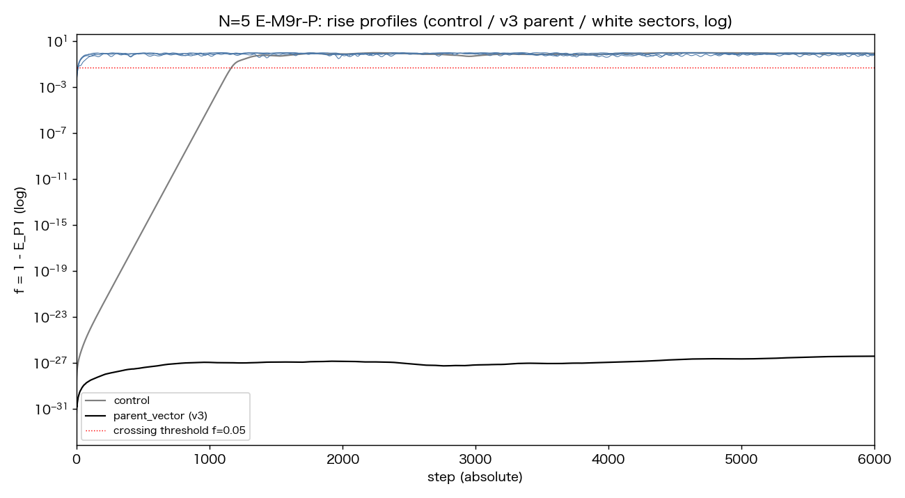
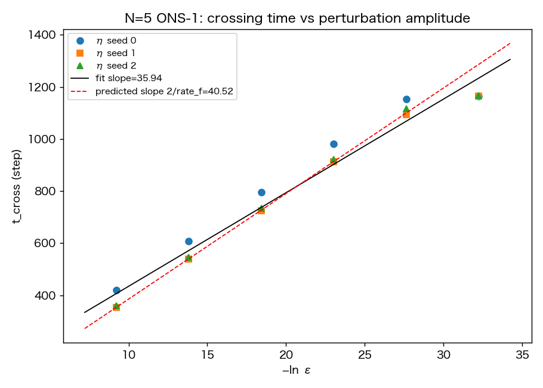

# 雑踏からは、宇宙は始まらない——インフレーションを起こせるのは、倒れかけの澄んだ波だけだった

木原範昭  
2026年8月5日

前回の記事で、こう報告しました。

タネがなくても、インフレーションは起きた。

揺らぎの種を手で仕込まなくても、私たちの波のモデルは、ひとりでに急拡大を始め、三つの方向を生み、そして止まった。

すると、次の疑問が自然に浮かびます。

**では、どんな波から始めても、インフレーションは起きるのだろうか。**

今回は、この問いに実験で答えます。

結論を先に言うと、答えはノーでした。

しかも、予想とは逆向きのノーでした。

## 発端は、素朴な疑問だった

これまでの実験は、すべて同じ出発点を使っていました。

すべての波が、たった一つの振動にぴったり乗った状態。たとえるなら、オーケストラ全員が同じ一つの音を、寸分の狂いもなく出している状態です。レーザーのように澄んだ、完全にコヒーレントな波。

でも、考えてみてください。

宇宙の始まりが、そんなに行儀のよい状態だったと考えるほうが、不自然ではないでしょうか。

むしろ、あらゆる高さの音が混ざり合った雑踏——物理の言葉でホワイトノイズと呼ばれる状態——のほうが、始まりの姿として自然に思えます。

そこで私たちは、こう予想しました。

**雑踏のような波の海から始めても、同じインフレーションが起きるはずだ。**

そして、それを確かめる実験を組みました。

## 雑踏の海を、ズルなしで作る

実験の準備には、ひとつ注意が要りました。

このモデルの波は、閉じているという条件（全部の二乗を足すとゼロになる、という規則）を満たさなければなりません。

雑踏を作るときも、この条件だけは守り、それ以外は完全にサイコロ任せにします。手で形を整えたら、実験になりません。

乱数から出発して、条件が自動的に成り立つ作り方を設計しました。

面白いことに、この設計の途中で、ひとつの定理が出てきました。

直流成分——波のゼロ番目の成分——は、どうやっても単独ではこの条件を満たせないのです。つまりこのモデルでは、直流成分は最初から存在する資格がない。除外は人の判断ではなく、公理からの帰結でした。

こうして、雑踏由来の初期状態を全部で82通り用意しました。

そして、澄んだ一つの波から出発する従来の系列と、まったく同じ土俵で走らせました。

## 結果——雑踏は、一本も膨張しなかった

予想は、完全に外れました。

（ここに図1を挿入）

図1。縦軸は、出発点からどれだけ離れたかを対数で表したもの。灰色が、澄んだ一つの波から出発した系列です。長い静止のあと、18桁にわたって一直線の急上昇——これがインフレーションです。青が、雑踏から取り出した波たち。静止期間はゼロで、はじめの数歩でするりとほどけて、そのまま落ち着いてしまいます。急上昇はどこにもありません。

澄んだ波から出発した系列は、これまでどおり、長い助走のあとに18桁の幾何級数的な急拡大を見せました。

ところが、雑踏由来の82通りは、**一本の例外もなく、膨張しませんでした。**

急拡大が遅れて来るのではありません。急拡大という過程そのものが、存在しないのです。雑踏の波は、最初の数歩でするりと形を変え、あとは静かに落ち着いてしまいます。

さらに意外なことに、落ち着いた先の姿は、澄んだ波が急拡大の果てにたどり着く姿と同じでした。三つの方向を持つ、あの準安定状態です。

つまり、終着点は同じ。違うのは、そこへ至る道だけ。

**18桁の急拡大という痕跡は、系が澄んだ一つの波から始まったことを示す、化石なのです。**

## なぜか——倒れかけの鉛筆

なぜ、澄んだ波だけが膨張するのでしょうか。

鍵は、バランスにありました。

澄んだ一つの波に全員が乗った状態は、この力学の中で、完璧にバランスした状態——専門用語で相対平衡——になっています。

たとえるなら、鉛筆が芯の先で逆さに立っている状態です。

完璧に立っている間、鉛筆は動きません。これが、急拡大の前の長い静止——助走期間の正体です。止まって見えるのは、休んでいるからではなく、倒れる寸前のバランスで立っているからでした。

そして、バランスがほんのわずかでも崩れると、傾きは倍々ゲームで増えていきます。指数関数的な崩壊。これが18桁の急拡大の正体です。

一方、雑踏はどうか。

雑踏は、そもそも立っていません。最初から床に転がっている状態です。転がっているものは、倒れるという劇的な瞬間を持ちません。だから急拡大がないのです。

この説明は、たとえ話のままでは終わらせませんでした。三つの検証実験で、数字にしました。

- 立っているかどうかを直接測る量（一歩進めたときのズレ）を全状態で測ると、澄んだ波では小数点以下15桁目、雑踏では小数点以下2桁目。その差は13桁。中間は一つもありませんでした
- 倒れる速さを力学から計算すると、実測した急拡大の速さと、五体の系では小数点以下5桁まで一致しました
- そして決定打がありました。実は澄んだ波の中に、一つだけ膨張しない例外があったのです。調べてみると、それは倒れかけではなく、**安定に立っている状態**でした。倒れようがないから、膨張しない。例外までもが、この説明のとおりでした

まとめると、波の運命は三通りに分類されます。

- 転がっている波（雑踏）は、即座にほどける
- 安定に立っている波は、何も起きない
- **倒れかけで立っている波だけが、長い静止のあとに、指数関数的に倒れる——これがインフレーションである**

## おまけの収穫——種の正体を、測ってしまった

前回の記事で、種がなくてもインフレーションは起きる、と報告しました。

でも、完璧なバランスで立っている鉛筆は、永遠に倒れないはずです。何かが最初の一押しをしているはずです。

今回、その正体を測る実験をしました。

人工の一押しをわざと加えて、その強さをどんどん小さくしていくと、倒れるまでの時間は規則正しく延びていきます。

（ここに図2を挿入）

図2。横軸は一押しの小ささ、縦軸は倒れるまでの時間。きれいな直線に乗ります。直線の傾きは理論の予言と1000分の4の精度で一致しました。そして右端に注目してください。一押しをある強さより小さくすると、時間はそれ以上延びなくなります。

延びが止まった理由は、こうです。

人工の一押しが、系がもともと持っている一押しより小さくなったから。

その、もともとの一押しの強さを直線から逆算すると、小数点以下13桁目でした。

そしてこの値は、澄んだ波を計算機の中で組み立てるときに、どうしても残ってしまう組み立ての誤差——完璧なバランスを目指しても届かない、最後のわずかな傾き——の大きさと、ぴったり同じ桁でした。

**種の正体は、完璧であろうとして完璧になりきれない、その残りでした。**

完璧な平衡は、原理的にも実際にも作れません。作り損ないが、必ず残る。その残りが、時間をかけて倍々ゲームで育ち、やがて宇宙規模の急拡大になる。

前回の謎——なぜ助走の後に急拡大が始まるのか——の、これが答えです。

## 実は、40年もめている問題だった

正直に書くと、この実験は、先行研究を調べて設計したものではありません。

雑踏のほうが自然なはずだ、という素朴な予想から出発し、その予想が実験に棄却され、予想外の結果を前にして、あらためて宇宙論の文献を調べ直しました。

すると、驚くことが分かりました。

**インフレーション宇宙論には、初期条件問題と呼ばれる40年来の未解決問題があったのです。**

標準的なインフレーション理論は、始まりの状態として、ほぼ一様なコヒーレントな場——まさに澄んだ一つの波——を仮定しています。導出しているのではありません。仮定です。そしてその仮定の是非をめぐって、理論家たちは長く割れてきました。当事者たち自身が、分裂（schism）と呼ぶほどの状態です。

混沌からでも着火する、と主張する数値計算のグループもあります。ただしよく読むと、その計算の初期データは、場の値をあらかじめ都合のよい範囲に制限してから乱しています。私たちの言葉でいえば、それは雑踏ではなく、澄んだ波に揺らぎを載せた状態です。

私たちは、この論争を知らないまま、自分たちの模型の中で同じ問いに突き当たり、そこで明確な答えを得ていました。

雑踏からは、増幅は出ない。倒れかけの澄んだ波からだけ、出る。

もちろん、私たちの模型は本物の宇宙の理論ではありません。時空の計量も、重力も、場の理論も入っていない、波の関係だけの模型です。だからこの結果を、現実の宇宙の証明として振りかざすことはできません。

それでも、最小の公理だけを置いた模型が、独自の道筋で40年来の論争点と同じ問いにたどり着き、模型の内部でははっきりした答えを返した——この一致は、記録しておく価値があると考えています。

## 一行でまとめると

前回は、

**揺らぎを仮定しなくても、インフレーション的な急拡大はひとりでに起こる**

ことを示しました。

今回は、その出発点を疑い、

**急拡大を起こせるのは、倒れかけのバランスで立つ澄んだ一つの波だけであり、雑踏の海は決して膨張しない**

こと、そして

**種の正体は、完璧な平衡を目指した組み立ての、避けられない残りである**

ことを示しました。

残る謎は、また三つです。

どの澄んだ波が倒れかけで、どの波が安定なのか。それを波の形から予言できるか。

雑踏の海から、澄んだ一つの波は、どうやって生まれるのか。

そして、倒れた後の海から、物質はどう生まれるのか——この三つ目は、すでに別の実験系列で動き始めています。

## 論文と再現用データ

今回の記事は、次の論文に基づいています。

「幾何級数的急拡大は不安定な自己無撞着閉包に固有である——一般零閉塞初期状態による開始様式の因果判別」

Concept DOI（常に最新版）  
https://doi.org/10.5281/zenodo.21798854

Version DOI（v1）  
https://doi.org/10.5281/zenodo.21798855

Zenodo公開レコード  
https://zenodo.org/record/21798855

日本語・英語の論文本文とPDFを公開しています。実験プログラム・生データ・図はすべてGitHubリポジトリにコミットされており、判定基準と予言は実行前に固定して記録しています。

前回の論文（第8論文）  
「N体関係波閉鎖系における三方向生成の時間構造——二段階seed除去による因果分離」  
https://doi.org/10.5281/zenodo.21614402

二つの公理の定義  
「無名等振幅複合波モデル 基本公理系」  
https://doi.org/10.5281/zenodo.21315735

前回の記事  
「タネがなくても、インフレーションは起きた——そして方向は三つで止まった」

---

#理論物理学 #数理物理学 #インフレーション #宇宙論 #ビッグバン #初期条件問題 #波 #ホワイトノイズ #コヒーレンス #相対平衡 #不安定性 #創発 #閉鎖系 #準安定 #独立研究 #プレプリント #Zenodo #数値実験 #数値シミュレーション #思考実験
