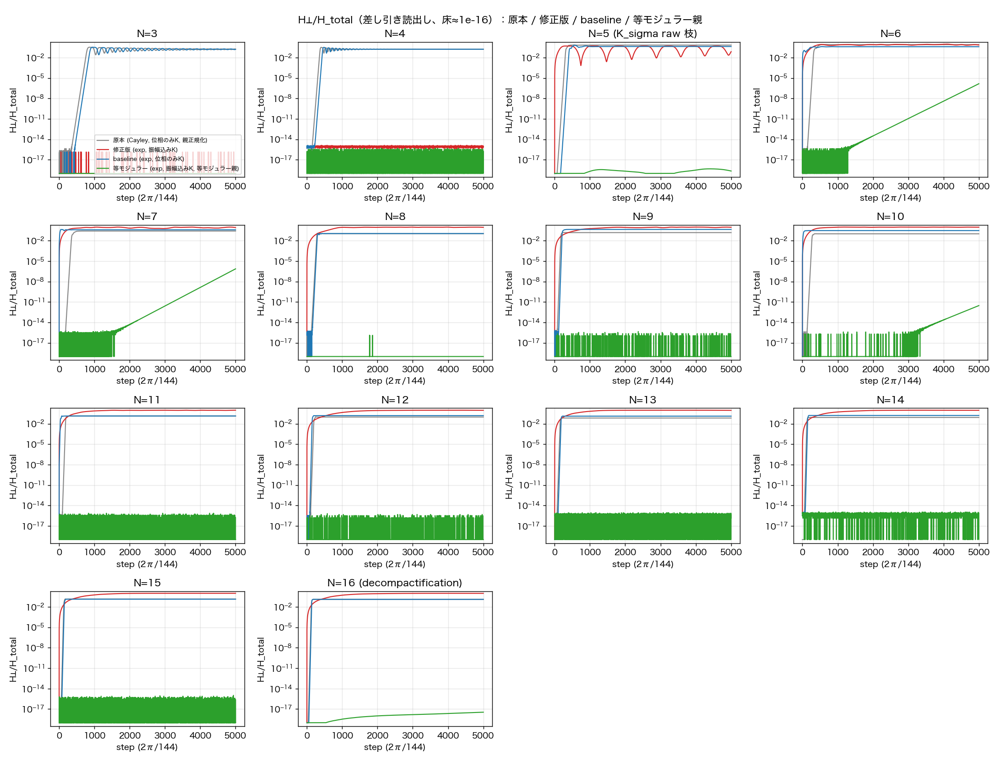
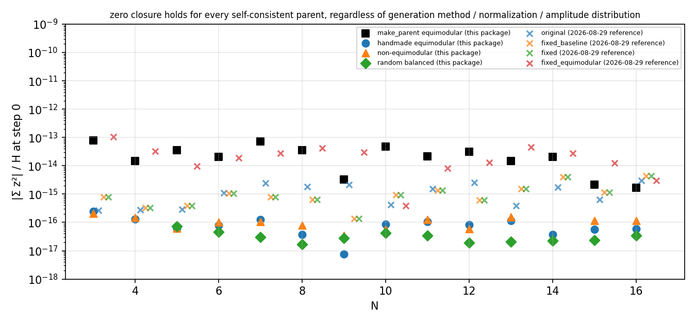
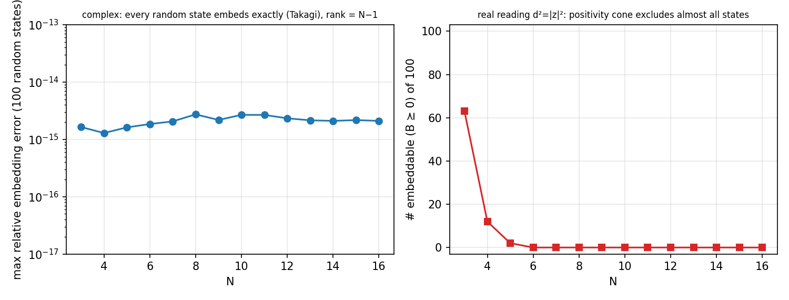
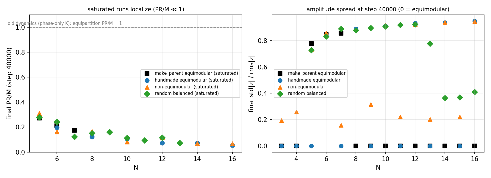
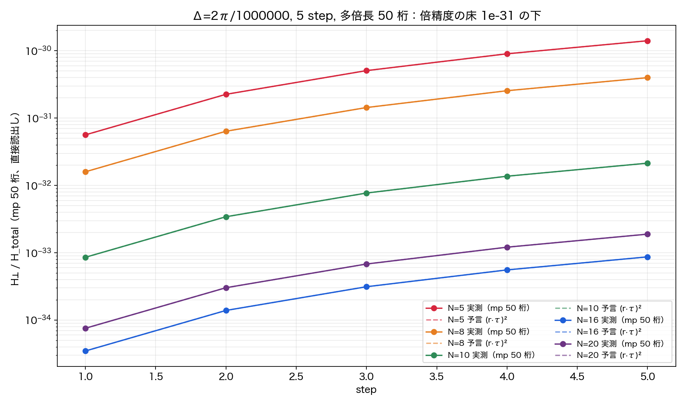
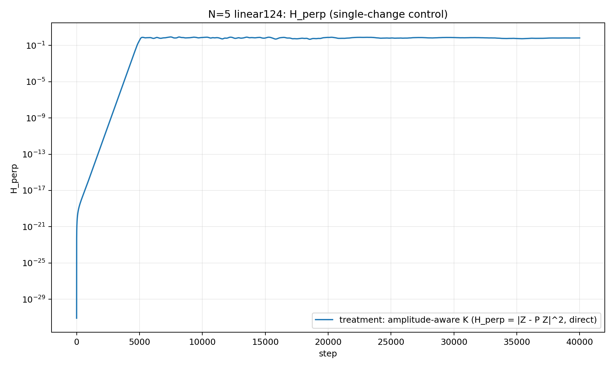
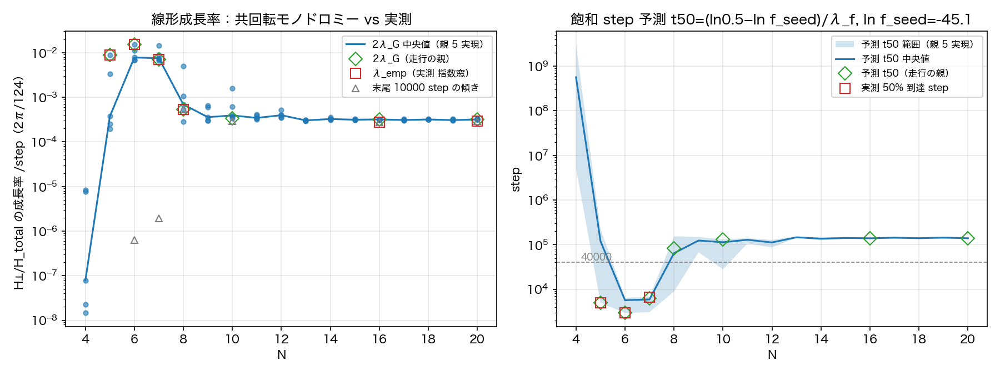

# Mechanism of Inflation-like Rapid Expansion in Self-Consistent Closed Relational-Wave Systems — Second Edition: Correction of Computational Conditions and Re-examination for N = 3–16

**Author:** Noriaki Kihara (WF System Co., Ltd.)　**Date:** 2026-08-30
**Version DOI:** [10.5281/zenodo.22176949](https://doi.org/10.5281/zenodo.22176949)　**Concept DOI:** [10.5281/zenodo.22112008](https://doi.org/10.5281/zenodo.22112008)
**Corrects:** First edition, Version DOI [10.5281/zenodo.22112009](https://doi.org/10.5281/zenodo.22112009) (published 2026-08-27; hereafter "v1")

---

## Abstract

This paper is a corrected edition of v1. All programs cited by v1 were traced back to their originals, re-executed and audited. The numerical results of v1 are reproduced unchanged by the published programs; the programs, however, contained three computational conditions that conflict with the theory: (1) a **hidden amplitude normalization** left inside the initialization `make_parent` and inside the interaction; (2) the Cayley transform used for time evolution (**a rational approximation of the frozen generator**, whose eigenphase response is distorted to $2\arctan(\gamma\sigma)$); (3) the fact that the random-generated initial states are **not self-consistent** under the corrected dynamics. We replace these three by (1) complete removal of normalization and the amplitude-aware interaction $K_{ij}=\mathrm{Im}(\bar z_i z_j)$; (2) the exactly orthogonal exponential rotation $\exp(\Delta K)$ with the generator frozen at each step (a first-order integrator of the continuous flow $dv/d\tau=K(v)v$ that preserves norm and closure exactly; hereafter "linear rotation"); (3) initialization by exact self-consistent solutions (two families, with and without the equimodular constraint), and re-examine $N=3$–16.

There are three claims.

1. **Zero closure $\sum_m z_m^2=0$ is a theorem, not an axiom.** As long as the generator is real antisymmetric and the state is one of its non-zero eigenmodes (self-consistency), closure holds regardless of normalization, amplitude distribution, $N$, or the method of generating the parent (five-line proof; $|\sum z^2|/H\le10^{-13}$ at step 0 for the 54 parents of four generation methods and the 56 parents of the four old systems, and $\le5\times10^{-13}$ throughout 40000-step runs). The derivation in v1 §6 and §24 is correct in this sense; this paper fixes its scope (that it depends on nothing else).
2. **The complex simplex imposes no constraint on the geometry.** A real simplex requires its squared distances to satisfy the positive-semidefiniteness condition (Schoenberg), whereas a complex symmetric matrix always admits a Takagi factorization, so that **any** set of complex squared distances embeds exactly in an $(N-1)$-dimensional complex space. All 1400 random states ($N=3$–16 × 100) embed with error $10^{-15}$ and have rank $N-1$, while under the real reading none of 100 embeds for $N\ge6$. The complex simplex is the image of the state with the sign of each relation $z_e\to-z_e$ forgotten ($v/(\mathbb Z_2)^M$), not a selection principle. Closure is possible only because complexification discards positivity.
3. **The changes of computational conditions had a substantial effect on the inflation-like evolution, but the inflation-like evolution itself is reproduced.** Under the corrected dynamics, self-consistent but unstable initial states grow exponentially from the floor of the computational precision ($10^{-32}$ in double precision; deeper in multiprecision — the floor is set by precision and parent residual, not by physics) and saturate. What we confirm is that linearly unstable relative equilibria among the self-consistent states amplify arbitrarily small perturbations (parent residual, rounding error) exponentially and saturate nonlinearly — i.e., linear instability and its saturation — not an "onset mechanism" including a perturbation source. The growth rate drops from v1's $0.17$–$0.25$/step to $0.006$–$0.022$/step (10–30 times slower), and the saturated state is not v1's equipartition (PR/M $=1$) but localization onto a few relations (PR/M $=0.05$–0.31). In the highly symmetric families of initial states (1-factorization / distance-class constructions, equimodular and their amplitude deformations) a clear parity asymmetry appears — $N=6,8,\dots,16$ all saturate and $N=5,7,\dots,15$ all stay on the floor ($N=3,4$ both on the floor) — but since the random balanced parents without symmetry also have unstable states at odd $N$, this is not a universal law determined by the parity of $N$ alone. For the 54 runs (four generation methods × $N=3$–16), the prediction by the co-rotating one-step linearization matrix (the Jacobian of the discrete map), fixed before the runs, agrees with the measured classification in 53/54 cases, and the growth rates of the 25 saturating runs agree with the predictions within 0.997–1.008.

This paper adds no new interpretation. It makes explicit which claims of v1 are kept, modified or withdrawn (table in §9), and closes by recording that the proposition implicitly assumed in v1 — that self-consistency uniquely selects the physical state — does not hold.

---

## 1. Position of this correction relative to v1

### 1.1 The chain of corrections

The preceding work [K8] showed that rapid expansion occurs even when the external seed is removed, and stated that "the initialization `make_parent` presupposes the zero-square-closure condition." v1 §2.1 corrected this by code audit: `make_parent` does not impose closure as a constraint; closure appears as the output of a self-consistent fixed-point search. That correction is correct.

This paper goes one step further back. v1 §4 declared `make_parent` "audited", but the audit missed two points: the line `v = v/‖v‖` inside `make_parent` (amplitude normalization of the parent) and the interaction built from phases only, $K_{ij}=\sin(\theta_j-\theta_i)$ (a hidden amplitude normalization inside the interaction). In addition, the Cayley transform used for time evolution is a rational approximation to the frozen generator (eigenphase response $2\arctan(\gamma\sigma)$) and should be replaced by the exact exponential rotation of the frozen generator (response $\Delta\sigma$). The numerical claims of v1 are results under these computational conditions.

### 1.2 How this paper is written

Every claim in this paper is assigned to one of the following four kinds, stated where it appears.

- **Proven**: follows from the axioms and definitions by computation alone.
- **Numerical fact**: stated together with where it was measured ($N$, generation method, number of runs).
- **Unproven proposition**: can be formulated mathematically but has neither proof nor counterexample.
- **Lemma required for proof**: a finite set of facts that would turn an unproven proposition into a theorem.

Expressions such as "strongly supports" or "is considered to" are not used.

In this paper "inflation-like" refers to the phenomenon, inside the model, in which $H_\perp/H_{\rm total}$ is amplified exponentially and saturates nonlinearly; no identity with cosmological inflation is claimed (the cosmological analogies of v1 §25–26 are not treated here).

---

## 2. Minimal input of the system (inherited from v1 §3 and §5)

### 2.1 States and interaction

To each of the $M=\binom N2$ pairwise relations among $N$ entities we assign a complex wave $z_e=a_e+ib_e$. The state vector is $v=(z_e)\in\mathbb C^M$ with norm $\|v\|^2=\sum_e|z_e|^2=H_{\rm total}$. The only structural parameter of the relation graph is $N$; $M$ is derived. (v1 §3's "the only independent parameter is $N$" is a statement about the structure; the step $\Delta$ introduced below and the overall amplitude — which affects the rotation speed through $K(cv)=|c|^2K(v)$ — are specified separately.)

The interaction acts only between two relations $e,f$ that share a vertex, with strength

$$
K_{ef}=A_{ef}\,\mathrm{Im}(\bar z_e z_f)=A_{ef}\,(a_eb_f-b_ea_f)
$$

($A$ is the adjacency matrix of the line graph of the relations). $K$ is real antisymmetric, $K^T=-K$, and satisfies $K(cz)=|c|^2K(z)$ (proportional to the amplitudes).

### 2.2 Evolution

The evolution law is the continuous flow

$$
\frac{dv}{d\tau}=K(v)\,v .
$$

Since $K$ is real antisymmetric, the flow preserves $\|v\|^2$ and $v^Tv=\sum z_e^2$; it is also the Hamiltonian flow of $H_{\rm int}=\tfrac12\sum_{\{e,f\}}(\mathrm{Im}\,\bar z_ez_f)^2$ (the sum runs once over each unordered adjacent pair $\{e,f\}$), $\dot z_e=2i\,\partial H_{\rm int}/\partial\bar z_e=(Kz)_e$ (we adopt the sign convention $\dot z=+2i\,\partial H/\partial\bar z$; in the convention $\dot z=-2i\,\partial H/\partial\bar z$ the Hamiltonian is $-H_{\rm int}$). Numerically we advance with the exponential map of the generator frozen at each step,

$$
v_{t+1}=\exp(\Delta\,K(v_t))\,v_t,\qquad \Delta=\frac{2\pi}{L}.
$$

Since $\exp(\Delta K)$ is a real orthogonal matrix, $\|v\|^2$ and $v^Tv$ are preserved exactly by the discrete map as well (the theorem of v1 §16 holds for the Cayley map and for the exponential map alike), whereas $H_{\rm int}$ is not preserved exactly and drifts at $O(\Delta)$ (§10). "Linear rotation" in this paper denotes this exponential map of the frozen generator, as opposed to the Cayley transform of the old code (a rational map of the frozen generator). Both are linear operators for a frozen $K$, and both are nonlinear as maps of the state $v$. The step index is a processing count, and the flow parameter $\tau$ is not physical time either (v1 §12 and §8.2: the quantity corresponding to time is defined separately as the phase advance of the state itself).

### 2.3 Self-consistent states

A state $v$ is called self-consistent when it is a non-zero eigenmode of its own generator,

$$
iK(v)\,v=\mu v,\qquad \mu\neq0 .
$$

Then $v$ rotates uniformly with angular velocity $\mu$ without changing shape (a relative equilibrium). Writing $v=a+ib$, we have $Ka=\mu b$, $Kb=-\mu a$: the real and imaginary parts are the rotating pair that appears inside an eigenmode of a real antisymmetric action (v1 §5: a complex rotational structure emerges from real phases and a self-consistent real antisymmetric action).

The minimal input is, as in v1 §3,

$$
N+\text{complete pairwise relations}+\text{self-consistent fixed-point condition}.
$$

What becomes clear in this paper is that this minimal input does **not** determine the state uniquely (§7.4, §11).

---

## 3. The three changes and their separation

### 3.1 Contents of the changes

The differences between the original programs of the 15 packages cited by v1 (the `run_n_scaling_lowrank_v1_*.py` engine family) and the corrected programs of this paper reduce to three points.

| Change | Old (v1) | New (this paper) |
|---|---|---|
| **1. Removal of hidden amplitude normalization** | (a) the parent normalized to $v\mapsto v/\|v\|$ inside `make_parent`; (b) the interaction built from phases only, $K_{ef}=\sin(\theta_f-\theta_e)$ ($K(cz)=K(z)$, amplitudes discarded); (c) in some packages an external seed added to the initial state followed by normalization | (a) removed; (b) amplitude-aware $K_{ef}=\mathrm{Im}(\bar z_ez_f)$; (c) removed ($Z_0=v$, seedless) |
| **2. From the Cayley rational map to the exponential map of the frozen generator** | Cayley transform $(I-\gamma K)^{-1}(I+\gamma K)$, $\gamma=\tan(\pi/144)$ (a rational function of the frozen $K$; eigenphase response $2\arctan(\gamma\sigma)$). $K/\sigma_{\max}$ normalization in some packages | exactly orthogonal exponential rotation of the frozen $K$, $\exp(\Delta K)$, $\Delta=2\pi/L$ (eigenphase response $\Delta\sigma$). The $K/\sigma$ branch is abolished. Both are linear for a frozen $K$ and nonlinear in the state (§2.2) |
| **3. Change of initialization** | the state obtained from random phases by eigenmode iteration of the phase-only $K$ (not a fixed point of the corrected dynamics: residual $0.058$–$0.007$ with respect to the amplitude-aware $K$) | exact self-consistent solutions. 3-1: with the equimodular constraint (all $|z_e|$ equal). 3-2: without it (non-equimodular) |

### 3.2 Unchanged re-execution of the v1 packages (numerical fact)

The 15 packages cited by v1 were re-executed with no change other than four path edits and compared with the stored data and figures (`論文v1_全再現テスト_20260828`). The main numerical claims — Floquet multiplier $\mu_1=1.090086569$ (9 digits), slope 11.616 of the onset–residual law, growth rate 0.172513, exact conservation $4.4\times10^{-16}$, equipartition, and the exact part of the closure search — are reproduced. What is not reproduced are the late-time quantities whose trajectories diverge by exponential amplification of rounding (the step at which ordering is reached, the final split $H_\parallel/H_\perp$, moduli phases, and the number of digits of the starting depth). The program that generated the $3+3+2+2$ time separation of $N=5$ (2627/4923 steps) was not contained in the published packages.

### 3.3 Separation by three-way and four-way comparison (numerical fact)

The changes were applied stepwise to the same 15 packages and re-executed (`論文v1_全プログラム修正版_20260828`, $L=144$, 5000 steps).

| System | Changes applied | Result |
|---|---|---|
| original | none | latency 100–600 steps → exponential growth 0.17–0.25/step → equipartition ($|z|^2\to1/M$, PR/M $=1$), $\sigma=N-1$, Floquet 1.0901 |
| baseline | change 2 and change 1(a)(c) (interaction still phase-only) | **reproduces the original**: growth rate 0.172 ($N=5$), Floquet 1.0903, equipartition, and the 13 / 12 closures of $N=5$ |
| fixed | change 1(b) also applied, old initialization | the parent is not a fixed point, so it departs ballistically from step 1; no exponential regime; $H_\perp/H\to0.93$–0.999; localization (relative spread of $|z|^2$ $\approx2$); spectral entropy 0.87 |
| fixed_equimodular | changes 1, 2 and 3-1 | latency restored and exponential growth from the rounding floor. $N=5$: on the floor within 5000 steps ($4.6\times10^{-19}$); $N=6,7$: onset 4152/4316, growth rates 0.0059/0.0063; $N=8$–15: floor; $N=16$: $1.3\times10^{-17}$. Floquet ($N=5$) 1.0001 |

The table establishes the following.

- **Change 2 (Cayley → exponential map) and change 1(a)(c) (normalization of parent and initial state) are not the cause of the v1 phenomena** (baseline reproduces the original).
- **The picture specific to v1 — latency of a few hundred steps and rapid expansion at $0.17$–$0.25$/step, equipartition, and the $3+3+2+2$ of $N=5$ — depended on change 1(b), i.e., on the phase-only interaction.** The phase-only $K$ is an interaction in which a vanished wave still exerts full action, and equipartition was its consequence. By contrast, $\sigma=N-1$ survives in its scale-invariant form $\mu=-(N-1)r^2$ under the amplitude-aware $K$ (§6.1), and inflation-like growth itself also survives (§7).
- Once change 1(b) is applied, the old initial states cease to be fixed points (the reason change 3 is needed). The ballistic departure of fixed is a term produced by the parent residual, not an instability (§8.1).

For fixed, $N=6,7,10,11$ are invalid as controls because a side effect of change 1(a) broke the convergence test of the parent search (a residual formula assuming unit norm). fixed_equimodular does not have this problem (residuals $10^{-11}$–$10^{-13}$).

**Figure 1.** $H_\perp/H_{\rm total}$ in the four-way comparison ($L=144$, 5000 steps, subtraction readout with floor $10^{-16}$), $N=3$–16. Grey: original (Cayley, phase-only $K$, normalized parent); blue: baseline (linear rotation, phase-only $K$); red: fixed (amplitude-aware $K$, old parent); green: fixed_equimodular (amplitude-aware $K$, equimodular self-consistent parent). baseline overlaps the original, fixed departs ballistically from step 1, and fixed_equimodular shows exponential growth within 5000 steps only for $N=6,7$ (and the late part of $N=10$).

### 3.4 Unified protocol

All new runs from §5 on use the following protocol: amplitude-aware $K_{ef}=\mathrm{Im}(\bar z_ez_f)$, $\exp((2\pi/124)K)$, no normalization, seedless $Z_0=v$, 40000 steps, and $H_\perp$ computed directly as the component orthogonal to the parent plane (the real two-dimensional span of $a,b$), $\|Z-p(p\cdot Z)-q(q\cdot Z)\|^2$ (rounding floor $10^{-32}$). The step $L$ (144 in §3.3, 124 in §7) affects the continuum-limit trajectory only as a reparametrization of time (v1 §12), but at finite step the discrete computation retains an $O(\Delta^2)$ integrator dependence (§8.3: the apparent growth rate $\Delta^2/8$ of neutral parents changes with $L$).

---

## 4. Claim 1: zero closure is a theorem

### 4.1 Theorem and proof (proven)

**Theorem.** Let $K$ be a real antisymmetric matrix and let $v=a+ib$ satisfy $iKv=\mu v$ with $\mu\ne0$. Then $v^Tv=\sum_e z_e^2=0$, i.e., $a^Ta=b^Tb$ and $a^Tb=0$.

**Proof.** The real and imaginary parts of $iK(a+ib)=\mu a+i\mu b$ give $Ka=\mu b$ and $Kb=-\mu a$. Hence $\mu\,a^Ta=-a^TKb$ and $\mu\,b^Tb=b^TKa=-a^TKb$ (antisymmetry), so $\mu(a^Ta-b^Tb)=0$. Also $\mu\,a^Tb=a^TKa=0$ (the quadratic form of an antisymmetric matrix vanishes). Since $\mu\ne0$ the claim follows. □

The proof uses only three facts: $K$ is real, $K$ is antisymmetric, and $v$ is a non-zero eigenmode. Normalization, amplitude distribution, $N$, adjacency structure, and the method of generating the parent do not appear. Equivalently, for a fixed $K$ the eigenvectors $v$ and $\bar v$ (eigenvalues $\mu$ and $-\mu$) are orthogonal, $\bar v^\dagger v=v^Tv=0$ (the form used in v1 §6).

**Corollary (conservation by the dynamics).** Since $\exp(\Delta K)$ is real orthogonal, $v^Tv$ is conserved. If closure holds initially it holds at every step.

**Remark (scope).** This theorem also holds for the phase-only $K$ (the old engine of v1). Hence the validity of closure is not evidence for the correctness of the amplitude-aware interaction. The origin of closure lies in the non-zero complex eigenmode structure of a real antisymmetric generator (the three conditions: $K$ real, $K$ antisymmetric, $\mu\ne0$).

### 4.2 Measurements (numerical fact)

**The four old systems (2026-08-29)**: for the 56 parents of original / baseline / fixed / fixed_equimodular × $N=3$–16, $|\sum z^2|/H$ at step 0 is at most $1.0\times10^{-13}$ (fixed_equimodular, corresponding to a parent residual $10^{-11}$) and $\le4.4\times10^{-15}$ otherwise. It holds whether the amplitudes are equipartitioned or localized (relative spread of $|z|^2$ 1.3), and with normalization ($\|v\|=1$) or without ($0.45$–$1.91$).

**The four generation methods of this paper (§7.1)**: $\le8\times10^{-14}$ (make_parent) and $\le2.5\times10^{-16}$ (the other three) for the 54 parents. During the runs $|Z^TZ|/H\le5.1\times10^{-13}$ over 40000 steps (rounding accumulation only).

**Figure 2.** $|\sum z^2|/H$ at step 0, $N=3$–16. Filled symbols: the four generation methods of this paper (54 parents); crosses: the four reference systems of 2026-08-29 (56 parents). All are below $10^{-13}$ regardless of generation method, normalization, or amplitude distribution (the make_parent family at the level of its parent residual $10^{-11}$; handmade, non-equimodular and random balanced at $10^{-16}$).

### 4.3 Relation to v1

v1 §6 derived the same theorem and §24 placed closure as "a theorem derivable from self-consistency rather than an axiom". This paper does not retract that. What is corrected is that v1 had checked "closure emerges from self-consistent parents" mainly with the parents of the old engine; here the theorem is verified numerically on 110 parents of implementations to depend on neither generation method, normalization, nor amplitude distribution (a proven theorem needs no confirmation by samples; the verification confirms that the implementations satisfy the premises of the theorem).

As in v1 §24, $U^n=I$ does not follow from this theorem (compactness of the $S^1$ orbit $\not\Rightarrow$ finite recurrence). It remains underived in this paper.

---

## 5. Claim 2: the complex simplex imposes no constraint

### 5.1 Theorem (proven)

Read the squared distance of each relation as $d^2_{ij}=z_{ij}^2$, and let $D^2=(d^2_{ij})$, $J=I-\mathbf 1\mathbf 1^T/N$, $B=-\tfrac12JD^2J$ (as in v1 §17).

- **Real case**: for real $d^2_{ij}$, a real configuration $x_i\in\mathbb R^{N-1}$ with $|x_i-x_j|^2=d^2_{ij}$ exists if and only if $B\succeq0$ (Schoenberg [E3]; equivalent to the Cayley–Menger conditions). This is an inequality constraint that cuts a cone out of the space of $d^2$.
- **Complex case**: $B$ is a complex symmetric matrix. Every complex symmetric matrix admits the Autonne–Takagi factorization $B=U\Sigma U^T$ ($U$ unitary, $\Sigma\ge0$ diagonal) [E2]. Put $X=U\Sigma^{1/2}$; then $B=XX^T$. Since $D^2$ is symmetric with zero diagonal, $B_{ii}+B_{jj}-2B_{ij}=d^2_{ij}$ holds identically, and for the rows $x_i$ of $X$, $(x_i-x_j)\cdot(x_i-x_j)=x_i\cdot x_i+x_j\cdot x_j-2x_i\cdot x_j=B_{ii}+B_{jj}-2B_{ij}=d^2_{ij}$ (bilinear form, no complex conjugation). Moreover $B\mathbf 1=0$ (since $J\mathbf1=0$), so keeping only the columns of non-zero singular values gives $X^T\mathbf1=0$: a centred embedding in $\mathbb C^{N-1}$ with rank $X\le N-1$. The positivity condition disappears and **every** complex $d^2$ embeds. □

Thus every state $v\in\mathbb C^M$ yields a complex simplex (degenerate ones with rank $<N-1$ allowed). However, the dictionary $d^2=z^2$ forgets the sign of each relation $z_e\to-z_e$, so the map from states to shapes is not one-to-one: for a state without zero components, $2^M$ states (sign branches) correspond to one shape, and the shape represents $v/(\mathbb Z_2)^M$. The sign branches are related by an exact discrete symmetry of the present dynamics: for $S=\mathrm{diag}(s_e)$, $s_e=\pm1$, $K(Sv)=SK(v)S$ ($K_{ef}$ acquires the factor $s_es_f$), hence $\Phi(Sv)=e^{\Delta SK(v)S}Sv=S\,\Phi(v)$ and the orbits of sign branches are conjugate. The degrees of freedom on the shape side, $N(N-1)$ complex coordinates $-(N-1)$ translations $-(N-1)(N-2)/2$ for the complex orthogonal group $O(N-1,\mathbb C)$ $=M$, coincide with those of the state modulo signs.

**Corollary.** Under the real reading $d^2=|z|^2\ge0$, closure $\sum d^2=0$ is impossible except for the zero state. Closure is possible because complexification removed the positivity constraint. The complex simplex is neither an axiom, a theorem, nor a selection; it is the sign-forgetting image of the state under the dictionary (convention) $d^2:=z^2$.

### 5.2 Measurements (numerical fact)

For random states that are neither self-consistent nor closed (real and imaginary parts of each component standard normal; $N=3$–16 × 100 states; `v2補完実験_…/program/pass2_embed_random.py`):

| $N$ | complex: embedding error $\max|(x_i-x_j)^2-d^2_{ij}|/\max|d^2|$ | complex: rank $=N-1$ | real ($d^2=|z|^2$): number embeddable ($B\succeq0$) out of 100 |
|---|---|---|---|
| 3 | $1.6\times10^{-15}$ | 100/100 | 63 |
| 4 | $1.3\times10^{-15}$ | 100/100 | 12 |
| 5 | $1.6\times10^{-15}$ | 100/100 | 2 |
| 6–16 | $\le2.7\times10^{-15}$ | 100/100 | 0 |

**Figure 3.** Embedding of 100 random states for each $N=3$–16. Left: maximum relative error of the complex embedding ($d^2=z^2$) — all at the $10^{-15}$ level, rank $=N-1$. Right: number of states embeddable under the real reading ($d^2=|z|^2$, $B\succeq0$) — zero for $N\ge6$.

### 5.3 Status of the geometric theorems of v1

The theorem of v1 §17, "star square closure at all vertices $\Leftrightarrow$ all vertices lie on $x_i\cdot x_i=0$", holds by the algebra of $B$ alone and is kept. The name, however, is changed from "light cone" to **complex null cone**: the zero set of a complex quadratic form has no distinction between timelike and spacelike. Only when all $d^2$ are real and the configuration embeds into $\mathbb R^{2,2}$, as for the equimodular state of $N=5$, may it be called a light cone — and that is a property of the equimodular point, not of $N=5$ (for the non-equimodular $N=5$ of §7.1 the $d^2$ are complex).

The conclusion of this paper is that the complex simplex is a **language for depicting results**, not a **principle that selects states**. When v1 §18 stated "the metastable state = equimodular null complex simplex", it was not the geometry that selected the state; the phase-only interaction drove the system there (§3.3).

---

## 6. Preparation for Claim 3: how the self-consistent initial states are made

We define the four generation methods of the initial states ("parents") used for change 3. Below, $S_i=\sum_{j\ne i}z_{ij}^2$ (the local sum at vertex $i$; local closure is $S_i=0$) and $W_i=\sum_{j\ne i}|z_{ij}|^2$ (the vertex weight).

### 6.1 Vertex form of self-consistency (proven)

Substituting $\mathrm{Im}(\bar z_ez_f)=(\bar z_ez_f-z_e\bar z_f)/2i$,

$$
(iKv)_e=\tfrac12\bigl[\bar z_e(Az^2)_e-z_e(A|z|^2)_e\bigr],
$$

and since the adjacent sums for $e=(i,j)$ are $(Az^2)_e=S_i+S_j-2z_e^2$ and $(A|z|^2)_e=W_i+W_j-2|z_e|^2$, self-consistency $iKv=\mu v$ is equivalent, for each relation, to

$$
S_i+S_j=(2\mu+W_i+W_j)\,\frac{z_e^2}{|z_e|^2}.
$$

**Corollary**: if $S_i=0$ (all vertices) and $W_i=W$ (all vertices), the state is self-consistent with $\mu=-W$. Conversely, if the state is self-consistent and $S\equiv0$, then $W_i\equiv-\mu$. For equimodular states $W_i=(N-1)r^2$, hence $\mu=-(N-1)r^2$ (the scale-invariant form of v1's $\sigma=N-1$; for $N=3$, $-\tfrac32 r^2$).

### 6.2 The four generation methods

| Symbol | Method | Constraint | Construction |
|---|---|---|---|
| mp | make_parent equimodular (3-1) | equimodular | three stages: the old algorithm (eigenmode iteration of the phase-only $K$, no normalization) gives a rank-2 state → time evolution under the phase-only $K$ until the relative spread of $|z|^2$ is $<10^{-9}$ → mixing iteration toward the eigenmode of the amplitude-aware $K$ until the residual is $<10^{-10}$. Random generator rng(40260721+1000N) |
| hm | handmade equimodular (3-1) | equimodular | even $N$: colour $c$ of a 1-factorization of the complete graph (circle method) gets phase $\theta=c\pi/(N-1)$. Odd $N$: distance class $d$ gets $\theta=(d-1)\pi/q$, $q=(N-1)/2$. $N=3$: $0/60/120°$. The general sum rules $\sum_f r_f^2\sin^2\phi_{ef}=-\mu$, $\sum_f r_f^2\sin2\phi_{ef}=0$ are satisfied exactly (residual $\le1.2\times10^{-16}$) |
| ne | non-equimodular (3-2) | none | the same phase configuration as hm with the squared amplitude of class $c$ set to $a_c=\bar r^2(1+0.6\cos(4\pi c/q))$ (the self-consistency condition is $\sum_ca_c\omega^c=0$, $\omega=e^{2\pi i/q}$; satisfied for $q\ge4$). For $q\le3$, i.e. $N=3,4,5,7$, another point on the continuous family of self-consistent solutions through the equimodular point ($N=5,7$ on the branch preserving $S=0$; $N=3,4$ with $S\ne0$) |
| rb | random balanced (3-2) | none | the state obtained by solving $\{S_i=0,\ W_i=W_0\}$ by Newton iteration from a random initial state (self-consistent by the corollary of §6.1). No phase classes and no symmetry. One per $N$, rng(100+N) |

For each $N$, $\|v\|$ is set equal to that of the mp parent (the scale affects only the rotation speed). Acceptance tests (54/54 passed): residual $\le6.4\times10^{-11}$ (mp) / $\le1.7\times10^{-16}$ (others), $|\sum z^2|/H\le8\times10^{-14}$, $\mu\ne0$. Local closure holds except for $N=3$ (impossible) and ne at $N=4$. All ranks are $N-1$ (for $N=3$, hm has rank 1 and mp, ne rank 2).

The mere existence of non-equimodular self-consistent solutions (ne, rb) shows that the equimodularity of v1 §18 is not a necessary condition for self-consistency. The dimension of the set of self-consistent solutions through the equimodular point has been measured numerically as $N^2-4N+1$ for $N\ge5$ ($=2M-(3N-1)$, coinciding with the number of constraints in $\{S=0,W=\text{const}\}$; `複素シンプレックス_重心閉塞_非等モジュラー族_20260830`). That the solution set near the equimodular point coincides with $\{S=0,W=\text{const}\}$ becomes a theorem, by the implicit function theorem, once two finite rank conditions are verified in exact arithmetic: **a lemma required for proof**.

### 6.3 Predictions fixed before the runs

For each parent, the real Jacobian of the one-step map $\Phi(z)=\exp(\Delta K(z))z$ was computed by central differences, the parent's own rotation $e^{-i\phi}$ ($\phi=\Delta\mu$) was undone, and from the largest absolute eigenvalue $\rho$ of the co-rotating one-step linearization matrix $G=R(+\phi)D\Phi(v)$ (the tangent map of the fixed point in the rotating frame; called the co-rotating monodromy in earlier records) we computed $\lambda_f=2\ln\rho$ (the per-step growth rate of $H_\perp$) and fixed it before the runs (`results/parents_predictions.csv`). Decision rule: "unstable (saturates within 40000 steps)" if $\rho-1>10^{-3}$, "neutral (floor)" otherwise. Since even known floors (hm at $N=5,7$) give $\rho-1\approx10^{-4}$ (the step-induced term of §8.3; $10^{-7}$ for $N=4$), this threshold was calibrated on 2026-08-30 against six real runs of known floors and saturations ($N=4$–9).

---

## 7. Claim 3: inflation-like evolution after the change of computational conditions, $N=3$–16

### 7.1 Result matrix (numerical fact; `v2補完実験_…/results/matrix_N_by_method.md`)

Floor = $\max H_\perp/H<10^{-10}$ within 40000 steps. Saturation = $H_\perp/H\ge0.5$ reached. $t_{50}$ = the step at which it is reached. $\lambda$ = slope of $\ln H_\perp$ in the exponential window ($10^{-10}<H_\perp<10^{-3}$), per step. In parentheses: the prediction $\lambda_f$ fixed before the run.

| $N$ | mp (equimodular) | hm (equimodular) | ne (non-equimodular) | rb (random balanced) |
|---|---|---|---|---|
| 3 | floor | floor | floor | — |
| 4 | floor | floor | floor | — |
| 5 | **saturated** $t_{50}=5029$, $\lambda=0.0089$ (0.0089) | floor (0.0002) | **saturated** 5971, 0.0113 (0.0114) | **saturated** 5322, 0.0126 (0.0126) |
| 6 | **saturated** 2933, 0.0151 (0.0151) | **saturated** 4338, 0.0160 (0.0160) | **saturated** 4395, 0.0148 (0.0148) | **saturated** 6115, 0.0103 (0.0103) |
| 7 | **saturated** 6564, 0.0070 (0.0070) | floor (0.0002) | floor (0.0003) | **saturated** 6553, 0.0097 (0.0097) |
| 8 | floor, growing $\lambda=0.0005$ (0.0005) | **saturated** 3864, 0.0177 (0.0177) | **saturated** 4031, 0.0172 (0.0172) | **saturated** 9345, 0.0067 (0.0066) |
| 9 | floor, growing 0.0007 (0.0007) | floor (0.0003) | floor (0.0003) | **saturated** 6505, 0.0098 (0.0098) |
| 10 | floor (0.0003) | **saturated** 3468, 0.0198 (0.0198) | **saturated** 3610, 0.0193 (0.0193) | **saturated** 6522, 0.0100 (0.0100) |
| 11 | floor (0.0003) | floor (0.0003) | floor (0.0003) | **saturated** 6814, 0.0094 (0.0094) |
| 12 | floor (0.0004) | **saturated** 3391, 0.0202 (0.0202) | **saturated** 3371, 0.0198 (0.0198) | **saturated** 11535, 0.0057 (0.0057) |
| 13 | floor (0.0003) | floor (0.0003) | floor (0.0003) | **saturated** 30809, 0.0020 (0.0020) |
| 14 | floor (0.0003) | **saturated** 3194, 0.0209 (0.0209) | **saturated** 3270, 0.0204 (0.0204) | floor (0.0004) |
| 15 | floor (0.0003) | floor (0.0003) | floor (0.0003) | floor (0.0004) |
| 16 | floor (0.0003) | **saturated** 3186, 0.0215 (0.0215) | **saturated** 3266, 0.0210 (0.0210) | floor (0.0005) |

**Figure 4.** $H_\perp/H$ for all 54 runs (log scale, 40000 steps, $L=124$, seedless, direct readout). Black: mp, blue: hm, orange: ne, green: rb. The numbers in the legends are the predictions $\lambda_f$ fixed before the runs. Saturating runs rise in a straight line from the $10^{-27}$ level; floor runs stay at $10^{-20}$–$10^{-14}$.

### 7.2 Comparison with the predictions (numerical fact)

- The classification predicted before the runs agrees with the measurements in **53/54** cases (main result). The single disagreement, rb$_{N=13}$, has $\rho-1=9.86\times10^{-4}$, just below the threshold $10^{-3}$, and was predicted "neutral" but saturated at $t_{50}=30809$. Its $\lambda$ is 0.00197 measured against 0.00197 predicted (ratio 0.998), so the growth-rate prediction is correct. Replacing the rule by "predicted $t_{50}\le$ run length" would give 54/54, but that is a change of rule after seeing the result and is not adopted as a main result.
- For the 25 saturating runs the ratio of measured to predicted $\lambda$ is **0.997–1.008** ($R^2\ge0.997$ in the exponential window). The meaning of this agreement is that the linearization of the same discrete map (the co-rotating one-step linearization matrix $G$) gives the initial exponential rate of the nonlinear run of that map — an agreement between linear stability analysis and direct time evolution — not an independent physical prediction.
- The slope of $\ln f$ in the late part (30000–40000 steps) of the floor runs is $2.7$–$3.2\times10^{-4}$/step, a common value independent of generation method and $N$ (§8.3). For mp at $N=8,9$ ($5.4$, $6.6\times10^{-4}$) a weak flow instability adds to it, and they grew to $10^{-10}$ and $4\times10^{-9}$ within 40000 steps.

**Figure 5.** $\rho-1$ fixed before the runs (co-rotating one-step linearization matrix) versus measured classification. Filled = saturated/growing, open = floor. The green band ($\rho-1<10^{-3}$) is the predicted "floor within 40000 steps" domain. Only the single point sitting on the band boundary (rb, $N=13$) missed the classification.

**Figure 6.** Growth rate: predicted $\lambda_f=2\ln\rho$ against measured $\lambda$ (slope of $\ln H_\perp$ in the exponential window). Ratio 0.997–1.008 for the 25 saturating runs.

**Figure 7.** $N$ dependence of $t_{50}$ (step at which $H_\perp/H=0.5$ is reached). Filled = measured, open = predicted ($f_0=3\times10^{-32}$). Dashed line: run length 40000. For hm/ne at even $N$, $t_{50}$ shortens with $N$; for rb it lengthens with $N$ and exceeds the run length from $N=14$ on.

### 7.3 States after saturation (numerical fact)

In all 25 saturating runs, the participation ratio PR/M ($=(\sum|z|^2)^2/(M\sum|z|^4)$) at step 40000 is 0.05–0.31 and decreases with $N$ ($N=5$: 0.27–0.31; $N=16$: 0.05–0.07), the smallest amplitude is below $10^{-4}$ and the largest is 0.6–1.05 — localization onto a few relations. The same type is reached whether one starts from equimodular parents (mp, hm), non-equimodular parents (ne) or random balanced parents (rb). The equipartition of v1 §18–19 (PR/M $=1$, $|z|^2\to1/M$) appears nowhere among the 54 runs.

**Figure 8.** States at step 40000. Left: participation ratio PR/M of the saturating runs — none reaches the dashed line PR/M $=1$ (equipartition of the old dynamics), and it falls from 0.3 to 0.05 with $N$. Right: amplitude spread std$|z|$/rms$|z|$ — saturating runs cluster at 0.7–0.95 regardless of generation method, floor runs keep their initial value (0 for equimodular).

### 7.4 Reading by generation method (an arrangement of numerical facts; no interpretation added)

1. **hm and ne show the same stripe**: even $N=6,8,\dots,16$ all saturate; odd $N$ and $N=3,4$ all stay on the floor. Since ne has the same phase configuration as hm and differs only in amplitudes (spread of $|z|$ 0.11–0.42), **the amplitude distribution does not change the class (saturation/floor) and changes $\lambda$ by only 2–3%**.
2. For hm/ne at even $N$, $\lambda$ increases monotonically with $N$ (0.016 → 0.0215; $t_{50}$ from 4338 to 3186).
3. **A clear parity asymmetry exists in the highly symmetric families (hm, ne).** It is, however, not a universal law determined by the parity of $N$ alone: at the same $N=5,7,9,11,13$ the symmetry-free rb saturates. This stripe occurs simultaneously with the switch of construction — "1-factorization (exists only for even $N$) / distance classes (used for odd $N$)" — so whether the cause is the number-theoretic parity of $N$ itself or the accompanying difference in discrete symmetric structure is **not separated** (what is proven is only that "parity alone does not explain it"; running a distance-class construction at even $N$ and an alternative to the 1-factorization at odd $N$ would separate them, but this was not done here).
4. mp (the generation method of the v1 lineage) saturates only for $N=5,6,7$; $N\ge8$ stays on the floor. What appeared to be "$N$ dependence" in the v1 lineage is a property of the parent series obtained by the make_parent generation method.
5. rb saturates for $N=5$–13 and stays on the floor for $N=14,15,16$ (one parent per $N$).
6. $N=3,4$ stay on the floor for all four methods ($\rho-1\le10^{-5}$).

Hence **under the corrected dynamics, whether inflation-like evolution occurs at a given $N$ is not determined by $N$ alone; the structure of the initial state is required.** Self-consistency cuts out the admissible set of states, but does not select a state within it uniquely (non-equimodular solutions, continuous families, and parents of different stability coexist at the same $N$).

---

## 8. Ballistic law, readout, and step-induced growth

### 8.1 Ballistic law (numerical fact, multiprecision 50 digits)

Let $r=\|iKv-\mu v\|/\|v\|$ be the self-consistency residual of the parent. The early rise of the corrected dynamics follows, at short times,

$$
\frac{H_\perp}{H_{\rm total}}\simeq(r\tau)^2\qquad(\tau\to0),\qquad \tau=\Delta\cdot\text{step}
$$

(a numerical fact; no analytic derivation from a first-order expansion is carried out). With mpmath at 50 digits, $\Delta=2\pi/10^6$ and 5 steps (`Nall_linear1000000_steps5_mpmath50_…_20260828`):

| $N$ | $r$ | measured at step 1 | $(r\Delta)^2$ | measured at step 5 | $(r\tau)^2$ |
|---|---|---|---|---|---|
| 5 | $3.78\times10^{-11}$ | $5.63248\times10^{-32}$ | $5.63248\times10^{-32}$ | $1.40812\times10^{-30}$ | $1.40812\times10^{-30}$ |
| 8 | $2.01\times10^{-11}$ | $1.59347\times10^{-32}$ | $1.59347\times10^{-32}$ | $3.98367\times10^{-31}$ | $3.98368\times10^{-31}$ |
| 16 | $9.38\times10^{-13}$ | $3.47645\times10^{-35}$ | $3.47645\times10^{-35}$ | $8.69113\times10^{-34}$ | $8.69114\times10^{-34}$ |
| 20 | $1.38\times10^{-12}$ | $7.56157\times10^{-35}$ | $7.56245\times10^{-35}$ | $1.89039\times10^{-33}$ | $1.89061\times10^{-33}$ |

The drift of $H_{\rm total}$ is at the $10^{-50}$ level (exact conservation).

The meaning of this result is as follows. **The starting floor is not set by physics.** In double precision the floor of $H_\perp/H$ appears at $10^{-32}$ ($10^{-16}$ in amplitude), but when the precision is raised to 50 digits the floor moves down below $10^{-35}$, and the same law $(r\tau)^2$ holds there to 5–7 digits. The numerical floor is determined by (i) the computational precision and (ii) the self-consistency residual $r$ of the parent; polishing the parent to $r\to0$ at high precision pushes the floor down without limit (from an exact fixed point nothing happens until an unstable mode amplifies the precision noise). Hence both the "31 digits from $10^{-32}$" of v1's article Figure 1 and the "23 digits from $10^{-24}$" of §7 here are **numbers of digits displayed by the computational precision**, not physical numbers of digits, and no physical initial perturbation amplitude can be read off from them (the perturbation source is unidentified, §10). The number of digits did not decrease from 31 to 23 ($10^{-24}$ is the double-precision floor $10^{-32}$ with the ballistic term $(r\Delta)^2$ of the parent residual $r\approx10^{-11}$ added on top).

**Figure 9.** $H_\perp/H$ (direct readout) at 50-digit multiprecision, $\Delta=2\pi/10^6$, 5 steps. Below the double-precision floor $10^{-31}$, all of $N=5,8,10,16,20$ lie on $(r\tau)^2$ (dashed lines, hidden under the data). The floor is set by precision and parent residual and moves down as the precision is raised.

v1's onset–residual law $t_{\rm onset}=11.616[-\ln\varepsilon]-99.6$ is a law about fixed points of the phase-only $K$; under the corrected dynamics it is replaced by an exponential growth $e^{\lambda_f\,\text{step}}$ due to the instability of the parent, riding on the deterministic drift $\simeq(r\tau)^2$ produced by the parent residual. For $N=5$ (mp), 23 digits from $10^{-24}$ to $10^{-1}$ lie on a straight line ($\lambda=0.0089$/step, $R^2=1.000$).

**Figure 10.** $H_\perp$ (log scale) for $N=5$, make_parent equimodular parent, 40000 steps, direct readout. At step 1 it jumps from the double-precision floor $10^{-32}$ to the ballistic term $(r\Delta)^2\approx10^{-24}$, then grows exponentially at the constant rate 0.0089/step up to $10^{-1}$, saturates at about 5000 steps and remains in a localized state. The interval that looks like latency is, from the start, exponential growth at the same rate.

### 8.2 Readout (numerical fact)

If $H_\perp$ is obtained by subtraction, $H_{\rm total}-H_\parallel$, the rounding floor is $10^{-15}$ (on the scale of $H$) and growth below it looks like "no motion". An intermediate record that read $N=16$ as "stable" was due to this readout defect; with the direct computation of the orthogonal component (floor $10^{-32}$) the mp parent of $N=16$ also grows monotonically from $10^{-32}$ to $1.6\times10^{-15}$ over 40000 steps. All numbers in this paper use the direct readout.

### 8.3 Step-induced growth (numerical fact)

From runs with the step angle $\Delta$ varied over $L=62$–1984 (`飽和ステップ数とNの関係_固定点ヤコビアン解析_20260829`), the per-step growth rate of $H_\perp/H$ separates as

$$
\lambda_f=a\,\Delta+b\,\Delta^2,\qquad b=0.1250\simeq\tfrac18\ (N=16,\ \text{numerical result to 4 digits}).
$$

Here $a$ is the linear instability of the relative equilibrium of the continuous flow $dv/d\tau=K(v)v$ (an instability intrinsic to the model, independent of discretization; parent-dependent — for mp parents, all five parents at $N=6,7$ have $a=0.13$–$0.30$, and 0 of 25 at $N\ge11$), while $b\Delta^2$ is the discretization error due to the integrator freezing the state-dependent $K$ for one step, independent of $N$ and parent. The late slope $\sim3\times10^{-4}$/step of the floor runs in §7 is this second term ($\Delta^2/8=3.2\times10^{-4}$ for $\Delta=2\pi/124$). In units of $\tau$, $\tau_{50}=355/\Delta\to\infty$ as $\Delta\to0$, so **neutral parents do not saturate in the continuum limit**. The "floor" of §7 is a verdict within 40000 steps; step-induced growth can reach $O(1)$ at the $10^5$-step level.

**Figure 11.** Growth rate and saturation step for make_parent equimodular parents (five realizations per $N$). Left: $2\lambda_G$ from the co-rotating one-step linearization matrix (blue; median and individual realizations) and measured $\lambda$ (red squares) — for $N\ge9$ they sit on the common floor $3\times10^{-4}$/step (the step-induced term). Right: predicted $t_{50}=(\ln0.5-\ln f_{\rm seed})/\lambda_f$ and measured — $N=5$–7 below 40000, $N\ge8$ above $10^5$.

---

## 9. Claims of v1: kept, modified, or withdrawn

| Claim of v1 (numbering of §28; article figures) | Verdict | Grounds |
|---|---|---|
| 1. The real orthogonal update conserves $Z^\dagger Z$ and $Z^TZ$ exactly | **kept** (Cayley → $\exp$ rewritten) | §2.2, §8.1 ($10^{-50}$) |
| 2. Growth of $H_\perp$ is internal transfer, $H_\perp\le H_{\rm total}$ | **kept** | §7 |
| 3. $K/\sigma_{\max}$ normalization is a change of clock; the 6.8% difference is explained by the step-convergence law | **restricted** | a statement about the phase-only $K$; the $K/\sigma$ branch is abolished in the corrected code |
| 4. onset $\propto-\ln\varepsilon$, growth rate invariant | **modified** | §8.1: ballistic law $(r\tau)^2$ plus parent-dependent $\lambda_f$ |
| 5. Floquet real double eigenvalue $\mu_1=1.0901$, rank-4 selection | **modified** | value of the old map. For the corrected $N=5$ mp parent the co-rotating one-step linearization gives $\rho=1.0045$; the hm parent is neutral |
| 6. Triple agreement 0.1725 / 11.616 / $\mu_1$ | **modified** | §7.2: replaced by the agreement between the one-step linearization prediction and the measured $\lambda$ (0.997–1.008) |
| 7. Star closure $\Leftrightarrow$ vertices on the complex null cone | **kept** (term changed to complex null cone) | §5.3 |
| 8. Metastable state = equimodular null complex simplex (equipartition) | **withdrawn** | §7.3: localization under the corrected dynamics; equipartition is the endpoint of the phase-only $K$ |
| 9. The $120°$ of $N=4$ is a theorem from local closure + equipartition | **kept (theorem) / withdrawn (attainment)** | the theorem is correct; that the system reaches it belongs to the old dynamics |
| 10. The 13 closures / 12 exact covers of $N=5$ | **withdrawn** | trajectory-dependent even in the old dynamics (0 on re-execution); no 4-group structure under the corrected dynamics |
| 11. $3+3+2+2$ and equal moduli over 8 seeds | **withdrawn** | as above |
| 12. self-consistency ⇒ closure ⇒ $S^1$ orbit; $U^n=I$ separate | **kept** | §4 |
| Article Figure 1, "31 digits from $10^{-32}$" | **modified (strengthened)** | the starting floor $10^{-32}$ is the double-precision rounding floor, not a physical floor. Running the same evolution at 50 digits pushes the floor down, and the law $(r\tau)^2$ continues to $10^{-35}$ (§8.1). The numerical floor is a lower bound set by precision and parent residual $r$, arbitrarily deep for an exact fixed point $r\to0$. "31 digits" and "23 digits" are digits displayed by the precision; the physical number of digits did not decrease from 31 to 23, and no physical initial perturbation amplitude can be read from them |
| Article Figure 6, "perfect equipartition" | **withdrawn** | §7.3 |
| Table of §20 for $N=3$–16 (rank $=N-1$, $|z|^2\to1/M$) | **modified** | rank kept; equipartition withdrawn. $\sigma=N-1$ kept as $\mu=-(N-1)r^2$ ($-\tfrac32r^2$ for $N=3$) |
| §4, "`make_parent` has been audited" | **corrected** | §1.1, §3.1 |
| §25.3–25.4 analogies with the IIB matrix model and dynamical compactification; §26.3 preheating-type analogy | **deleted** | discussions that relied on Figures 1 and 6; this paper adds no new interpretation |

---

## 10. Limitations

1. **Machine dependence of trajectories**: long individual trajectories are not reproduced across machines because of exponential amplification of rounding (for $N=5$, from step 6800 on, $10^{-8}\to10^{-2}$ within 2600 steps). The $t_{50}$, $\lambda$ and PR/M of this paper are stable as statistics, but the individual configuration after saturation is not reproduced. The $N=5$ claims of v1 ($3+3+2+2$, 13/12) did not appear on re-execution even under the same old dynamics.
2. **One rb parent per $N$**: the neutrality at $N\ge14$ is a single instance each, not a statistic.
3. **Floor is a verdict within 40000 steps**: by the step-induced term of §8.3, even neutral parents can reach $O(1)$ at the $10^5$-step level in step units. Claims about the continuum limit require an invariance check in units of $\tau$.
4. **$H_{\rm int}$ is not conserved exactly**: $\exp(\Delta K(z))$ freezes $K$ for one step, so $H_{\rm int}=\tfrac12\sum_{\{e,f\}}(\mathrm{Im}\,\bar z_ez_f)^2$ drifts in proportion to $\Delta$ (reducing $\Delta$ by 1/10 reduces the variation by 1/10). Norm and closure are conserved exactly. Whether the integrator is symplectic is not decided in this paper (that would require examining $(D\Phi)^TJ\,D\Phi-J$ for the real Jacobian of the one-step map).
5. **Unproven propositions**: (a) "self-consistency ⇒ local closure" for $N\ge5$ (holds numerically near the equimodular point; $N=4$ has a counterexample branch). (b) The mechanism by which symmetric parents (hm at odd $N$, $N=3,4$) are neutral. (c) Whether the cause of the parity asymmetry of the highly symmetric families is parity or the discrete symmetric structure of the construction (§7.4). (d) $U^n=I$ (rational locking).
6. **The perturbation source is unidentified**: an exact self-consistent state stays as $v(\tau)=e^{-i\mu\tau}v(0)$ and never departs. The rise in this paper is initiated by the parent residual $r$ and rounding errors entering the unstable mode (§8.1); what this paper confirms is linear instability and its nonlinear saturation, not an onset mechanism including a physical perturbation source.
7. **$N=6,7,10,11$ of the fixed system** are invalid as controls because of contamination of the parent search (§3.3).

---

## 11. Conclusion

1. Zero closure $\sum z^2=0$ is a theorem that follows solely from the generator being real antisymmetric and the state being one of its non-zero eigenmodes; it depends on neither normalization, amplitude distribution, $N$, nor the method of generating the parent (proven; verified numerically on 110 parents of implementations).
2. The complex simplex removes not a single point from the state space. Any complex squared distances embed exactly by the Takagi factorization (proven; verified numerically on 1400 random states), and closure is possible because complexification removed positivity. What the shape represents is the sign-forgetting image $v/(\mathbb Z_2)^M$ of the state, whose sign branches are related by an exact discrete symmetry of the dynamics. Geometry is a language for depicting results, not a principle that selects states.
3. Even with the hidden amplitude normalization removed, the exponential rotation of the frozen generator, and exact self-consistent initialization, when a small perturbation (parent residual, rounding error) enters a linearly unstable parent among the self-consistent relative equilibria, the transverse component grows exponentially and saturates nonlinearly. The growth rate is 10–30 times smaller than in v1, and the saturated state is localization rather than equipartition. In the highly symmetric hm/ne families a clear stability asymmetry appears between even $N=6$–16 and odd $N=5$–15 ($N=3,4$ on the floor), but since unstable states exist at odd $N$ for the random balanced parents, this is not a universal law determined by the parity of $N$ alone. Hence $N$ alone does not decide whether the evolution occurs; the structure of the initial state is required. The co-rotating one-step linearization matrix of the discrete map gives the class of the 54 runs in 53/54 cases and the growth rates within 0.997–1.008.

In summary: zero closure remains as a theorem. The complex simplex was not a selection principle. The old inflation picture (latency → rapid expansion → equipartition) has been modified, but the linear instability of the relative equilibria of the continuous flow and its saturation remain. A parity asymmetry appeared in the highly symmetric families. Self-consistency alone cannot select the physical state uniquely, and an additional selection principle has not been found.

---

## 12. References and reproducibility

### 12.1 Self-citations

**[K1]** N. Kihara, *Anonymous Equal-Amplitude Composite-Wave Model: Basic Axiom System v9 — Pure Definition*, 2026.
**[K2]** N. Kihara, "Linear Upper Bound on Generator Rank and Three-Direction Saturation in N-Body Complete Pairwise Relational Waves," 2026. Concept DOI: 10.5281/zenodo.21465898.
**[K8]** N. Kihara, "Temporal Structure of Three-Direction Generation in N-Body Closed Relational-Wave Systems — Causal Separation by Two-Stage Seed Removal," 2026. Concept DOI: 10.5281/zenodo.21614402.
**[K9]** N. Kihara, "Geometric Rapid Expansion Is Intrinsic to Unstable Self-Consistent Closure — Causal Discrimination of Onset Modes by General Zero-Closure Initial States," 2026. Concept DOI: 10.5281/zenodo.21798854.
**[v1]** N. Kihara, first edition of this paper, 2026-08-27. Version DOI: 10.5281/zenodo.22112009.

### 12.2 External references

**[E1]** A. Aste, "Origin of the Complex Structure of Quantum Mechanics," arXiv:1905.12894, 2019.
**[E2]** T. Takagi, "On an algebraic problem related to an analytic theorem of Carathéodory and Fejér and on an allied theorem of Landau," *Japan. J. Math.* 1 (1925) 83–93. (Autonne–Takagi factorization; see also R. A. Horn, C. R. Johnson, *Matrix Analysis*, 2nd ed., Cambridge Univ. Press, 2013, Cor. 4.4.4.)
**[E3]** I. J. Schoenberg, "Remarks to Maurice Fréchet's article 'Sur la définition axiomatique d'une classe d'espace distanciés vectoriellement applicable sur l'espace de Hilbert'," *Ann. of Math.* 36 (1935) 724–732.

### 12.3 Reproduction packages

The 15 packages cited by v1 (old engine; 14 zips are included in Zenodo 22112009, and `complex_simplex_decompactification_N5_N16_20260826`, the source of the article's Figure 1, is kept in the repository) are retained as they are for reproducing v1. The claims of this paper are reproduced by the following packages (GitHub `WurabeSeiji/ai-chat-logs-open`, under `次元の生成構造/電子の反跳実験/seed除去による準安定相追試/chatgpt追試/`; each package contains program, data, results, figures, README, run_all.sh and SHA256SUMS).

| Section | Package |
|---|---|
| §3.2 | `論文v1_全再現テスト_20260828` |
| §3.3 | `論文v1_全プログラム修正版_20260828` (fixed / fixed_baseline / fixed_equimodular, four-way comparison), `不足プログラム復元_chatgpt_20260828` |
| §4 | `公理見直し_ゼロ閉塞定理と固有時計_20260829`, `v2補完実験_4生成法_N3toN16_統一プロトコル_20260830` |
| §5 | `v2補完実験_…` (pass2), `複素シンプレックス基礎_N別全展開_20260830`, `複素シンプレックス基礎_N別全展開_非等モジュラー版_20260830` |
| §6 | `手作り自己無撞着親と対称性_倍音と関係数の検討_20260829`, `複素シンプレックス_重心閉塞_非等モジュラー族_20260830` |
| §7 | `v2補完実験_4生成法_N3toN16_統一プロトコル_20260830` (54 runs, predictions, Figures 2–8) |
| §8 | `N5/N16_linear124_equimodular_selfconsistent_directHperp_treatment_only_20260828`, `Nall_linear1000000_steps5_mpmath50_…_20260828`, `飽和ステップ数とNの関係_固定点ヤコビアン解析_20260829` |

### 12.4 Figure files

The figures of this paper are collected in `論文v2_figures/` (same folder as the text). Sources:

- Figure 1 `figA_four_way_Hperp_N3_N16.png` ← `論文v1_全プログラム修正版_20260828/results/figures/four_way_Hperp_frac_N3_N16.png`
- Figure 2 `fig1_closure_step0.png`, Figure 3 `fig2_embed_random.png`, Figure 4 `fig3_Hperp_grid_N3_N16.png`, Figure 5 `fig5_rho_bands.png`, Figure 6 `fig6_lambda_pred_vs_meas.png`, Figure 7 `fig7_t50_vs_N.png`, Figure 8 `fig4_final_state.png` ← `v2補完実験_4生成法_N3toN16_統一プロトコル_20260830/figures/`
- Figure 9 `figB_ballistic_mp50.png` ← `Nall_linear1000000_steps5_mpmath50_…_20260828/figures/compare_N_L1000000_5_mp50.png`
- Figure 10 `figD_N5_directHperp_40000.png` ← `N5_linear124_equimodular_selfconsistent_directHperp_treatment_only_20260828/figures/N5_Hperp_baseline_vs_amplitude_aware.png` (file name fixed by the old script; the content is the treatment branch only)
- Figure 11 `figC_lambda_t50_vs_N.png` ← `飽和ステップ数とNの関係_固定点ヤコビアン解析_20260829/figures/lambda_and_t50_vs_N.png`
