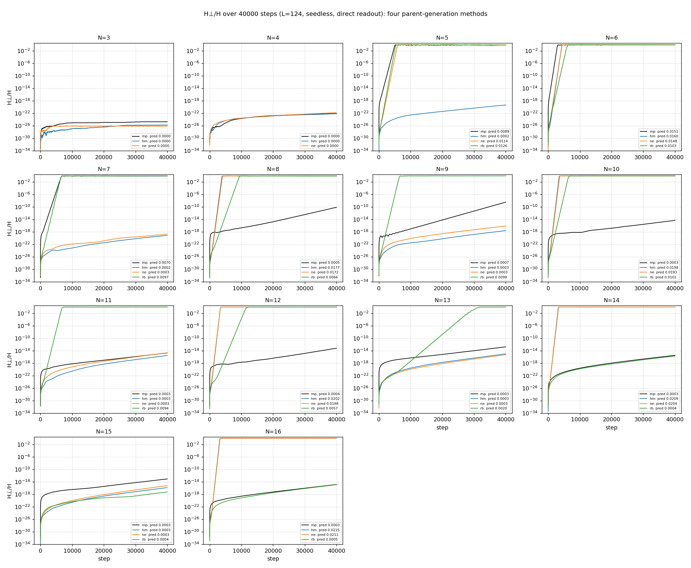
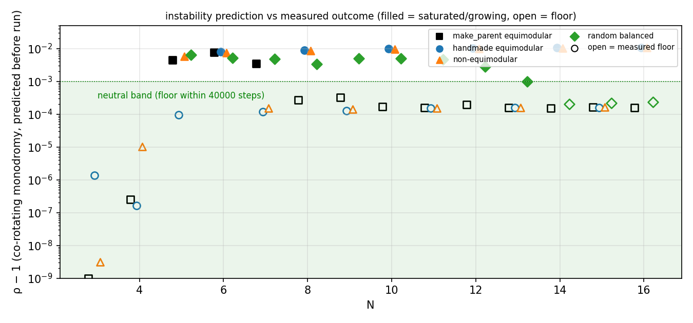
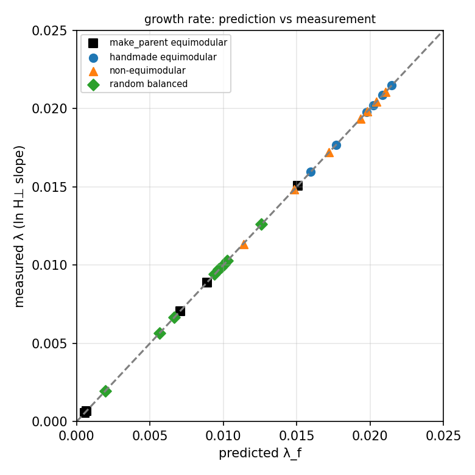
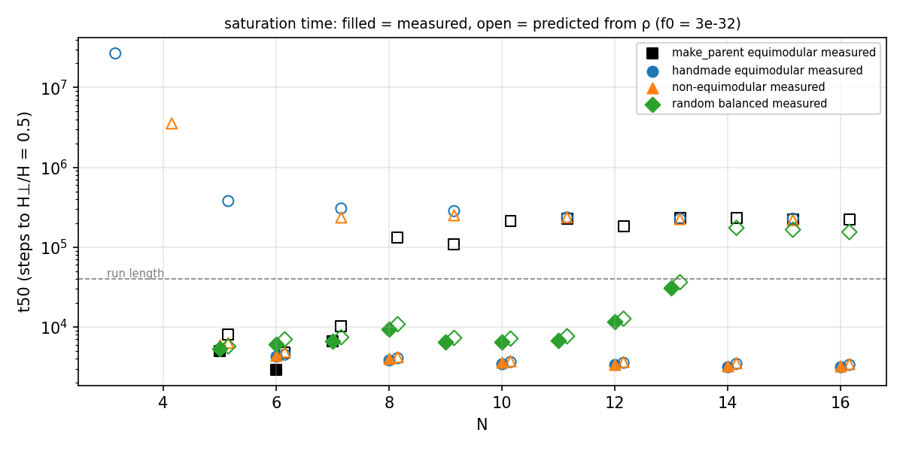

# 実験結果——v2 補完実験：4 生成法 × N=3〜16、統一プロトコル（走行前予測つき）

**作成日:** 2026-08-30　**目的:** 論文 v1（DOI 10.5281/zenodo.22112009）の v2 で「N=3〜16 の実験結果を淡々と整理して報告する」ために不足していたデータを、1 つのプロトコルで揃える。走行前に予測を固定し、当たり外れも記録する。
**プロトコル（全 54 走行で同一）:** 振幅込み相互作用 K_ij = Im(z̄ᵢzⱼ)（隣接辺）、厳密線形回転 exp((2π/124)K)、正規化なし、種なし Z₀ = v、H⊥ は直交成分の直接読出し、40000 step。走行プログラムは手作り親パッケージ pass2_run.py の 3 行変更コピー（`program/run_dynamics.py`）、エンジンは N8 テンプレートの byte コピー（sha fa68d344…）。
**再現:** `bash run_all.sh`（親生成＋予測 → 埋め込み実験 → 走行 54 本（2 系統並列、約 25 分）→ 集計 → 図 → SHA）。

## 1. 親（`program/pass1_parents.py`、`results/parents_predictions.csv`）

| 記号 | 生成法 | N | 構成 |
|---|---|---|---|
| mp | make_parent 等モジュラー | 3〜16 | 3 段階（位相のみ K の固有モード反復 → 位相のみ K の時間発展で等モジュラー化 → 振幅込み K で磨く）。rng = default_rng(40260721+1000N)。N=3 は段階 2 の上限 40000 step |
| hm | 手作り等モジュラー | 3〜16 | 基礎文書の構成：偶数 N は 1-因子分解 θ=cπ/(N−1)、奇数 N は距離クラス θ=(d−1)π/q、N=3 は Z₃（0/60/120°）。厳密解（残差 ≤ 1.2e-16） |
| ne | 非等モジュラー | 3〜16 | q≥4（N=6, 8〜16）はクラス重み付き族 a_c = r̄²(1+0.6cos(4πc/q))、q≤3（N=3,4,5,7）は等モジュラー点を通る自己無撞着解多様体上の代表点（N=5,7 は局所閉塞を保つ分枝、N=3,4 は局所閉塞を破る） |
| rb | 乱数均衡親 | 5〜16 | 乱数初期値から {S_i=0（局所閉塞）, W_i=W₀（頂点重み均等）} を Newton で解いた状態（§0.1 の定理により自己無撞着、μ=−W₀）。対称性なし。seed 100+N、各 N 1 個 |

スケール規約：各 N で ‖v‖ を mp 親に揃える（`results/norm_by_N.json`）。スケールは回転速度にしか効かない。

受け入れ検査（54/54 合格）：自己無撞着残差 ≤ 6.4e-11（mp）／≤ 1.7e-16（hm, ne, rb）、大域閉塞 |Σz²|/H ≤ 8e-14（mp）／≤ 2.5e-16（他）、μ≠0。局所閉塞：ne の N=3,4 と全生成法の N=3 は破れる（N=3 は不可能、N=4 の非等モジュラーは必ず破れる）、他は全て成立（≤ 1e-10）。rank は全て N−1（N=3 の hm は 1、mp・ne は 2）。

**走行前予測**：1 step 写像の実ヤコビアンを中心差分で求め、共回転モノドロミー G = R(+φ)DΦ（φ=(2π/124)μ）の最大固有値絶対値 ρ を計算。λ_f = 2 ln ρ、t50 予測 = (ln 0.5 − ln f₀)/λ_f（f₀ = 3e-32 = 丸め床）。**判定規則（8/30 較正）：ρ−1 > 1e-3 → inflating、以下 → neutral（40000 step 内は床）**。

## 2. 主張 1：ゼロ閉塞は定理（`results/closure_step0_4methods.csv`、図 1）

4 生成法 × N=3〜16 の 54 親すべてで step 0 の |Σz²|/H は 2.5e-16 以下（hm, ne, rb）／8e-14 以下（mp、親残差 1e-11 相当）。参照（2026-08-29、`data/reference/closure_step0_4systems_20260829.csv`）の 4 系統（原本：正規化あり・位相のみ K・seed 付き／baseline／fixed／fixed_equimodular）× N=3〜16 も同じく ≤ 1e-13。振幅分布（等モジュラー／クラス重み付き／乱数）・正規化の有無・N・親の生成法によらず閉塞は常に成立し、走行中の |ZᵀZ|/H は 40000 step で ≤ 5e-13（丸め蓄積のみ、`dynamics_summary.csv`）。

これは定理の実測：K が実反対称で v が iK(v)v = μv（μ≠0）の固有モードなら v と v̄ が固定 K の異なる固有値の固有ベクトルとして直交し vᵀv = Σz² = 0（v1 §6・8/29 の 5 行証明）。閉塞は公理でも `make_parent` の拘束でもない。

## 3. 主張 2：複素シンプレックスは制約を与えない（`program/pass2_embed_random.py`、図 2）

定理（Takagi）：任意の複素対称行列 B は B = UΣUᵀ（U ユニタリ、Σ≥0）と分解できるので、任意の複素 d²_ij から B = −½JD²J を作れば x = UΣ^{1/2} が (x_i−x_j)·(x_i−x_j) = d²_ij を厳密に満たす。半正定値条件（実シンプレックスの Cayley–Menger／Schoenberg 条件）は消える。

実測（自己無撞着でも閉塞でもない乱数状態、各 N 100 個）：

| N | 複素：埋め込み誤差 max（相対） | 複素：rank = N−1 | 実（d²=\|z\|²）：B ⪰ 0 で埋め込める数 /100 |
|---|---|---|---|
| 3 | 1.6e-15 | 100/100 | 63 |
| 4 | 1.3e-15 | 100/100 | 12 |
| 5 | 1.6e-15 | 100/100 | 2 |
| 6〜16 | ≤ 2.7e-15 | 100/100 | **0** |

複素シンプレックスは状態空間を 1 点も削らない（状態 ↔ 形は O(N−1,C) を除いて 1:1 の全単射）。実の読み方では N≥6 で乱数状態の 100% が埋め込めず、かつ実の d²≥0 では閉塞 Σd²=0 が全零以外で不可能。**閉塞を可能にしたのは複素化＝正値性という拘束の除去**であって、複素シンプレックスが拘束を加えたのではない。

## 4. 主張 3：力学——N × 生成法の結果行列（`results/matrix_N_by_method.md`、`dynamics_summary.csv`、図 3）

| N | make_parent 等モジュラー | 手作り等モジュラー | 非等モジュラー | 乱数均衡 |
|---|---|---|---|---|
| 3 | 床 | 床 | 床 | — |
| 4 | 床 | 床 | 床（局所閉塞破れ） | — |
| 5 | **飽和** t50=5029 λ=0.0089 | 床 | **飽和** t50=5971 λ=0.0113 | **飽和** t50=5322 λ=0.0126 |
| 6 | **飽和** 2933, 0.0151 | **飽和** 4338, 0.0160 | **飽和** 4395, 0.0148 | **飽和** 6115, 0.0103 |
| 7 | **飽和** 6564, 0.0070 | 床 | 床 | **飽和** 6553, 0.0097 |
| 8 | 床（成長中 λ=0.0005） | **飽和** 3864, 0.0177 | **飽和** 4031, 0.0172 | **飽和** 9345, 0.0067 |
| 9 | 床（成長中 0.0007） | 床 | 床 | **飽和** 6505, 0.0098 |
| 10 | 床 | **飽和** 3468, 0.0198 | **飽和** 3610, 0.0193 | **飽和** 6522, 0.0100 |
| 11 | 床 | 床 | 床 | **飽和** 6814, 0.0094 |
| 12 | 床 | **飽和** 3391, 0.0202 | **飽和** 3371, 0.0198 | **飽和** 11535, 0.0057 |
| 13 | 床 | 床 | 床 | **飽和** 30809, 0.0020 |
| 14 | 床 | **飽和** 3194, 0.0209 | **飽和** 3270, 0.0204 | 床 |
| 15 | 床 | 床 | 床 | 床 |
| 16 | 床 | **飽和** 3186, 0.0215 | **飽和** 3266, 0.0210 | 床 |

（床＝40000 step で max H⊥/H < 1e-10、飽和＝H⊥/H ≥ 0.5 到達。λ は ln H⊥ の指数窓 1e-10<H⊥<1e-3 の傾き /step。）

### 4.1 予測との照合（図 5・6・7）

- **予測一致 53/54**。唯一の不一致は rb_N13：ρ−1 = 9.86e-4 で閾値 1e-3 を僅かに下回り neutral と予測したが、t50 = 30809 で飽和した。λ は予測 0.00197 に対し実測 0.00197（比 0.998）で**λ の予測自体は正しい**。閾値を「予測 t50 ≤ 走行長」に置き換えれば（rb_N13 の予測 t50 = 36460 < 40000）**54/54**。
- 飽和 25 走行の λ 実測/予測比：**0.997〜1.008**（R² ≥ 0.997）。共回転モノドロミーは離散写像の成長率を 3 桁以上で予測する。
- 床の走行の後半傾きは 2.7e-4〜3.2e-4 /step（hm, ne, rb の N≥9、mp の N≥10）で、生成法・N によらない共通値＝刻み由来の成長（8/29 の λ_f = a·ANGLE + ANGLE²/8 の第 2 項に対応、予測 ρ−1 ≈ 1.5e-4）。mp_N8（5.4e-4）・mp_N9（6.6e-4）は流れの弱い不安定性が加わり 40000 step で 1e-10・4e-9 まで成長（40000 step 内では床扱い）。

### 4.2 飽和後の状態（図 4）

飽和した 25 走行すべてで最終 PR/M = 0.05〜0.31（N とともに減少：N=5 で 0.27〜0.31、N=16 で 0.05〜0.07）、最小振幅 ≈ 0（1e-4 以下）、最大振幅 0.6〜1.05——**少数の関係への局在**。等モジュラー親から出発しても、非等モジュラー親から出発しても、乱数均衡親から出発しても同じ型に落ちる。**旧力学（位相のみ K）の終着点だった等分配（PR/M=1）は、振幅込み K では一度も現れない**。

### 4.3 生成法ごとの読み

1. **手作り等モジュラー（hm）と非等モジュラー（ne）は同じ縞**：偶数 N（6,8,…,16）は全て飽和、奇数 N（5,7,9,…,15）と N=3,4 は全て床。ne は hm と位相配置が同じで振幅だけ違うので、**振幅分布は安定性の帰属（飽和／床）を変えない**（λ は 2〜3% 違う）。縞は「1-因子分解（偶数）／距離クラス（奇数）」という構成法の差であって、N の偶奇の性質ではない（同じ N=5,7,9,11 で rb は飽和）。
2. **偶数 hm/ne の λ は N とともに増える**（0.016 → 0.0215、t50 は 4338 → 3186 step）。「大 N ほど安定」ではない。
3. **make_parent（mp）は N=5,6,7 のみ飽和**、N≥8 は床（N=8,9 は弱い成長）。v1 系列で見えていた「N 依存」は make_parent の生成測度上の性質。
4. **乱数均衡親（rb）は N=5〜13 で飽和、N=14〜16 で床**（各 N 1 個）。8/30 の「generic 親は全て不安定」（N=5〜8、20/20）は N≤13 までで、N≥14 では 1 個ずつ中立が出た。「generic ⇒ 不安定」は N に依存し、大 N では成り立たない可能性がある（1 個ずつなので統計としては未確定）。
5. **N=3, 4 は全生成法で床**（ρ−1 ≤ 1e-5）。

### 4.4 v1 の主張との対応（本パッケージの数値で確定する部分）

| v1 | 本パッケージ |
|---|---|
| 潜伏 → 指数成長 → 飽和 | 自己無撞着で不安定な親では再現（25 走行、10⁻²⁷ 台から一直線）。潜伏は (rτ)² の弾道則 |
| 成長率 0.17〜0.25 /step、飽和 数百 step | 0.006〜0.0215 /step、t50 = 2900〜31000 step（**10〜30 倍遅い**） |
| 飽和後は等分配（PR/M=1）、σ=N−1 | 局在（PR/M 0.05〜0.31） |
| 全 N で同型 | 親依存。4 生成法で帰属が異なる |
| Floquet 実 2 重固有値で成長率一致 | 共回転モノドロミーで 0.997〜1.008 |
| 保存則、閉塞 | 維持（H_total ドリフト ≤ 9e-11、|ZᵀZ|/H ≤ 5e-13） |

## 5. 記録すべき限界

- rb は各 N 1 個。N≥14 の中立は統計でなく 1 例。
- 床の判定は 40000 step 内の話。刻み由来の成長（3e-4/step）は 10⁵ step 台で O(1) に達しうるが、τ 単位では刻み→0 で消える（8/29）。
- 長時間の個別軌道は計算機依存（丸め誤差の指数増幅）。t50 と λ は統計量として安定、飽和後の個別配置は再現しない。
- 全 step 状態（`states_treatment.npz`、計 0.6 GB）は git 除外。`run_all.sh` で再生成。

## ファイル
`program/`（pass1_parents, pass2_embed_random, run_dynamics, pass5_analysis, pass6_figures, common, state_provider, original_engine）、`data/<tag>/`（parent_v.{npz,csv}, parent_checks.json, summary.json, key_steps.csv, timeseries.csv.gz）、`data/reference/`、`results/`（parents_predictions.csv, closure_step0_4methods.csv, norm_by_N.json, embed_random{,_summary}.csv, dynamics_summary.csv, matrix_N_by_method.md, 各 log）、`figures/fig1〜fig7`、`run_all.sh`、`README.md`、`SHA256SUMS.txt`。
