# 実験報告書：時間刻み細分化（den=200L）への方針転換とその結果

作成: 2026-09-18（Claude Code）  宛先: ChatGPT（分析依頼用）  
対象実験フォルダ: `次元の生成構造/電子の反跳実験/seed除去による準安定相追試/chatgpt追試/二波99走行_正本Dense再実験_20260917/`

本報告書は、二波99走行 Dense 再実験（理論正本カーネル K_ef = A_ef·Im(z̄_e z_f)、v3 指示書準拠）の途中で行われた**大幅な方針転換**——時間刻みを den=L から den=200L へ細分化——の経緯・実装・結果・問題点を、分析可能な形で漏らさず記録するものである。§5 は木原氏が HTML ビューアで確認しチャットへ貼り付けたスクリーンショット全37枚と、その場で行われた観察・分析のやり取りを、**チャット記録（transcript JSONL）から復元した原文のまま無修正で**収録する。**実験プログラムの修正手順に不備があり、一部走行データの指紋（コード SHA256）が現行コードと一致しなくなった事実も §6 に正直に記載する**。

---

## 1. なぜ方針を変更したのか

### 1.1 発端：木原氏の観察（2026-09-17 09:51 UTC）

粗い系列（den=L）のビューアで `L24_ma3_mb6_den24` の末尾窓を確認した木原氏の指摘（原文）：

> 少しきになるのですが、den24ですが、こんなにガタガタなんでしたっけ、１step ってden24 なら24分割しているのでは？

添付: 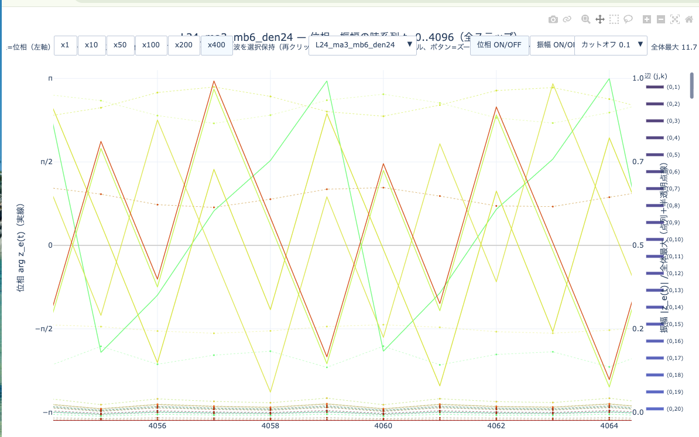

### 1.2 診断（当時の分析・原文、実測に基づく）

> 「den=24 なら1周を24分割」の直感が成り立っていません。**Δτ=2π/den が分割しているのは時間刻みで、波の位相ではない**からです。実測で示します。
>
> ## 実測結果（L24_ma3_mb6_den24）
>
> - 1stepあたりの位相前進（振幅0.1以上の点のみ、末尾1000step）：**中央値 2.59 rad ≈ 0.82π** — つまり**毎ステップほぼ半回転**しています。±πの間をジグザグするあの見た目は、この実データを整数stepで標本化して直線で結んだ正しい姿です。
> - 理由は生成子のスケールです。1stepの位相回転は Δτ×ω（ωはKの固有値）で、Δτ=2π/24=0.262 radは確かに小さいのに、**K の固有値が t=0 で最大43、t=4096 では最大254** まで育っています。つまり最速モードは1stepで **3.6π（初期）〜21π（末期）** 回転しており、完全にエイリアシング領域です。
> - Kが大きい理由は新カーネルの物理そのものです：K_ef = A_ef·Im(z̄_e z_f) は**振幅込み・正規化なし**（v3仕様）。L=24 では各辺が44本の隣接辺と結合し、しかも振幅が初期の~2から**11.7まで成長**したため、振幅の積で K が膨らみました（K(4096)がK(0)の6倍）。
>
> ## 比較：L8 も実は同じ
>
> L8_ma1_mb2_den8 の実測も中央値 2.13 rad/step。den=8→24 でΔτは1/3になりましたが、Lが大きい分 K の固有値が約4.4倍で、**ほぼ相殺**しています。つまり「denを増やす＝力学を細かく刻む」にはなっていません。

木原氏の結論（原文）：

> ん、では今のサンプリングでは、まったくサンプリング不足ですね、

これに対する当時の整理（原文抜粋）：

> - **各stepの計算自体は厳密**です（exp(ΔτK) を全固有分解で評価、H・Q2保存が1e-13で成立しているのはそのため）。保存則の成立は時間分解能を保証しません。
> - 不足しているのは**時間刻みと生成子の大きさの比**です。連続力学 dZ/ds=K(Z)Z の近似として見るなら、健全条件は Δτ·max|ω| ≪ π（できれば0.3 rad以下）。実測は L=24 で 11〜67 rad、L=8 でも 7.6〜15 rad — **2〜3桁足りません**。しかも振幅成長とともに K が育つので、走行後半ほど悪化します。
> - 一方、**離散写像そのものを正本の力学と定義するなら**（v3 指示書の二式はそう読めます）、これは「サンプリング不足」ではなく「1stepが位相的に粗い離散力学」であり、99走行のデータは その力学の正確な記録として有効なままです。

この直後、木原氏の指示で**実行中だった粗い系列バッチ（54run中35完了時点）をアボート**した。

### 1.3 必要 den の全数測定

全99初期条件で K(Z₀) を全固有分解（`diagnose_required_den_20260917.py`。84走行の毎step全スペクトル診断は途中で木原判断により「圧倒的に不足」と確定し中断、33run分の生値が `diagnostics/required_den/` に残る）：

| L | M | ω₀最大 | Δτω₀（den=L 現行） | den必要量（0.3rad） | den必要量（0.1rad） |
|---|---|---|---|---|---|
| 8 | 28 | 11.5 | 9.05 rad | 242 | 725 |
| 12 | 66 | 19.6 | 10.2 rad | 410 | 1229 |
| 24 | 276 | 43.6 | 11.4 rad | 914 | 2740 |
| 40 | 780 | 75.5 | 11.9 rad | 1581 | 4743 |

- ω₀ ≈ 1.9L のため **den=L のときの Δτω₀ が全 L でほぼ一定（9〜12 rad）**＝全域で約2桁不足。
- 走行中の K 成長も実測（L=16: ω 27→109、必要 den 最大 ≈ 2280）。
- den=M（関係波数）案も検討したが不適（L=8 で Δτω₀=2.59 rad と現行並み。M〜L²/2 は ω₀∝L と合わない指標）。

### 1.4 決定（木原）

- 指標は無次元比 Δτ·‖K(Z₀)‖。**den = 200L**（初期 Δτω₀ ≈ 0.05 rad、K 6倍成長でも ~0.3 rad）。
- **τ 範囲は旧走行と同一**（T = 200×4096 = 819,200 step。旧 τ 格子は 200 step ごとに厳密一致）。
- **全状態保存**。低位 L のみ実行（99全ケースは計算95日・346GBで不可能と見積り提示済み。第1バッチ=L≤12）。

---

## 2. 実験とプログラムをどう変更したか（物理への影響）

### 2.1 変更しなかったもの（物理の核）

以下は**一切変更していない**。全走行（粗い84run・fine 30run）の metadata に記録された SHA256 が現行ファイルと**全run完全一致**：

| ファイル | SHA256（先頭16桁） | 内容 |
|---|---|---|
| `interaction_kernel_theory_v1.py` | `1c88b382764ef553` | K_ef = A_ef·Im(z̄_e z_f)、full dense eigh、スペクトル指数写像（v3 §2 と文字単位一致） |
| `generator_twowave_v1.py` | `88901e961b19d3cd` | 二波初期条件 z_jk(0)=c_a U^{m_aΔ}+c_b U^{m_bΔ} |
| `gen_manifest.py` | `ba2df4f7320da8dc` | 99走行 manifest 定義（旧サーベイ正本とバイト同一） |

### 2.2 変更したもの：den（時間刻み）のみ

- fine 系列は den = 200L、T = 819,200。初期条件・相互作用・更新式 Z' = exp(ΔτK(Z))Z は不変で、**Δτ の値だけが 1/200**。
- **物理への影響の正確な位置づけ**：離散写像としては den=L と den=200L は**別の力学系**（合成される直交回転列が異なり、軌道は一致しない）。連続力学 dZ/ds = K(Z)Z の近似としては同一物理の分解能違いで、den=200L 側のみが Δτ‖K‖ ≪ π を満たす。H・Q2 の厳密保存は K^T=−K の帰結なので**どちらの den でも各stepで厳密**（実測：粗い系列 dH最大1.7e-12、fine 系列 dH最大9.7e-11——後者は step 数200倍の丸め蓄積込み）。
- **帰結**：粗い系列DB（84走行）は「den=L 離散写像の記録」として有効だが、連続関係力学の観測としては全域で破綻。fine で初めて見えた構造（§5）は粗い系列では原理的に観測不能。
- 副作用として、manifest の **den40 対照3ケース（L12）は fine では den=200L に固定されるため主系列と同一実験に潰れる**（fine の distinct 実験は L≤12 で30本）。fine における「刻み対照」は未再定義。

### 2.3 追加したプログラム（fine 系列用）

- ランナー `run_dense_fine_20260917.py`（力学は正本 one_step のみ使用。den=200L・全状態保存・runs_fine/。QA機械的確認のみ・ゲートなし）
- 図化 fine 版4本（カタログ正本の物理コピー＋機械置換のみ、文字単位 diff 証跡）＋拡大版（表示区間引数のみ）
- 解析3本（星凝縮・早期成長・必要den）と対話ビューア（チャンク動的ロード）

---

## 3. 関係するプログラムの一覧とパス

実験フォルダからの相対パス。コード SHA256 は `SHA256SUMS_code.txt`（32ファイル）に固定。

### 3.1 物理正本（無変更・全run指紋一致）
- `interaction_kernel_theory_v1.py` / `generator_twowave_v1.py` / `gen_manifest.py`（出自証跡: `provenance/`）

### 3.2 走行ランナー
- `run_dense_rerun.py` — 粗い系列（den=L）。--upto-L・図化4セット自動実行・経過ログ
- `run_dense_fine_20260917.py` — fine 系列（den=200L）。**⚠ 指紋問題あり（§6）**
- `structural_audit_v1.py` — 実行前構造診断（8項目の生値記録のみ、判定・ゲートなし）
- `run_all_phase2.sh` — 手順書

### 3.3 解析・診断
- `diagnose_required_den_20260917.py` → `diagnostics/required_den/`
- `analyze_star_condensation_20260917.py` → `diagnostics/star_condensation/`
- `analyze_inflation_early_growth_20260917.py` → `diagnostics/inflation_early_growth/`

### 3.4 図化（`plot_scripts_run/`。正本 `plot_scripts_original/`、差分証跡 `plot_diffs/`）
- カタログ4種（粗い系列・存在runのみ図化版）: `plot_initial_states_all99_v4_20260916.py` / `plot_final_states_all99_20260916.py` / `plot_inflation_hperp_all99_20260916.py` / `plot_residual_timeseries_all99_20260916.py`
- fine 版4種＋拡大: `plot_initial_states_fine_20260917.py` / `plot_final_states_fine_20260917.py` / `plot_inflation_hperp_fine_20260917.py` / `plot_residual_timeseries_fine_20260917.py` / `plot_inflation_hperp_fine_zoom_20260917.py`
- 単独図: `plot_initial_states_finalformat_20260917.py` / `plot_final_states_finalformat_20260917.py`
- 軌跡系（剛体回転検討）: `plot_states_alltime_trajectory_20260917.py` / `plot_states_steprange_trajectory_20260917.py` / `plot_states_steprange_rigidremoved_20260917.py`
- 位相・振幅: `plot_phase_amplitude_timeseries_20260917.py`（静的）/ `plot_phase_amplitude_timeseries_html_20260917.py`（粗い系列ビューア・動的ロード）/ `plot_phase_amplitude_fine_html_20260917.py`（fine ビューア・チャンク動的ロード）

---

## 4. 実験データと結果のパス一覧

### 4.1 初期実験（粗い系列 den=L、方針転換前）
- 走行データ: `runs/<run_id>/`（**84/99 run 完了・全QA PASS**。L≤24 完備＋L32主系列9＋L40主系列9＋L20gcd3。残15runは方針転換によりアボート、不完全フォルダなし）
  - 各run: states.npz（ローカルのみ・git対象外）・invariants.csv・metadata.json・SHA256SUMS.txt（invariants/metadata/SHAはコミット済み）
- QA集計: `qa_summary.json`（dH最大1.7e-12・dQ2最大2.3e-12・反対称残差最大5.7e-14）
- 構造診断: `pre_run_structural_audit.json` ／ 環境指紋: `environment_fingerprint.json`（macOS 26.6.2 / Apple M4 / Python 3.9.6 / NumPy 2.0.2 / BLAS=Accelerate / 全スレッド1）
- 図: `plots/{initial_complex,final_complex,inflation,residual_timeseries}/fig_*_dense_rerun_20260917.png`
- 剛体回転検討の記録: `plots/alltime_trajectory/`（全ステップ掃過図・区間図 t=0..10）、`plots/rigid_removed/`（K₀共回転除去の失敗記録：10stepで残差4.25）
- 必要den診断（33run分・中断）: `diagnostics/required_den/`
- 粗い系列ビューア: `plots/phase_amplitude/phase_amplitude_viewer_dense_rerun_20260917.html`（data/ はローカルのみ）

### 4.2 fine 系列（den=200L、方針転換後）
- 走行データ: `runs_fine/<rid>/`（**30 run・全QA PASS**、L8×9・L10×9・L12×12、states+invariants 計22GB・ローカルのみ、metadata/SHAコミット済み）
  - dH最大 9.7e-11、dQ2最大 3.3e-11、反対称残差 ~1e-14
- QA集計: `qa_summary_fine.json`
- 図: `plots/*/fig_*_fine_*_den200L_20260917.png`（4セット×page1/2）、`plots/inflation/fig_inflation_hperp_fine_zoom_t0_1000_*.png`（＋t0_50000版）
- 凝縮解析: `diagnostics/star_condensation/`（f_out 全step CSV×30・settle_times.json・辺別振幅包絡図30枚・総括図）
- 早期成長解析: `diagnostics/inflation_early_growth/`（3run分）
- fine ビューア: `plots/phase_amplitude_fine/phase_amplitude_fine_viewer_20260917.html`（data/ 約48GB・ローカルのみ、30run分生成済み）

---

## 5. HTML で波形を確認した観察と分析（スクリーンショット全37枚＋当時のやり取り原文）

原スクリーンショットは木原氏がビューアからチャットへ貼り付けたもの。チャット記録 `~/.claude/projects/...-ai-chat-logs-open/f04b27af-0138-4f38-922b-dcdcba11f70f.jsonl` から base64 を復元し `実験報告書_添付スクリーンショット_20260918/`（ss01〜ss37.png、対応表 manifest.json）に格納した。以下、**発言・分析とも当時の原文を無修正で再現**する（引用ブロックが原文）。

### 5.1 粗い系列の特殊状態（2026-09-17 04:12、L8_ma2_mb6_den8）

**木原氏（原文）**：
> 極めて特殊な状態がある、この状態の複素図２つを表示してください

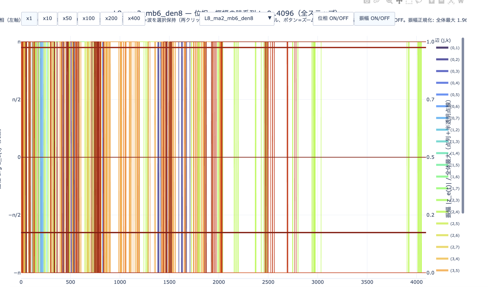

**Claude の応答（原文）**：
> L8_ma2_mb6_den8 の複素図2つをタブで開きました。
>
> 1. **初期複素図**：`plots/initial_complex/fig_initial_states_finalformat_L8_ma2_mb6_den8_dense_rerun_20260917.png`
> 2. **終了複素図（t=4096）**：`plots/final_complex/fig_final_states_finalformat_L8_ma2_mb6_den8_dense_rerun_20260917.png`
>
> どちらも最終図形式の単独図（±2.0596、◯面積∝重複辺数・緑×=Σz・橙×=Σz²）。**注目点：この走行は max|z(4096)| = max|z(0)| = 1.9616 が一致**しており、Q2保存 1.4e-11 のもとで振幅分布がほぼ保たれています——ビューアで見えた「位相が数本の水平線に張り付き、振幅が 1.0/0.5/0.15/0 の離散水準に乗る」特殊状態と整合します。

（事後補記：この (2,6) は後の fine 解析 §5.7 で**非凝縮クラス**（gcd=2、f_out=0.750 で頭打ち）と判明。粗い系列で目視された「特殊状態」はその前兆だった。）

### 5.2 den24 のガタガタ（2026-09-17 09:51 — 方針転換の発端）

発言・分析の原文は §1.1〜1.2 に全文掲載（ss02）。この観察 → 実測診断 → 「まったくサンプリング不足ですね」→ 走行アボート → den 設計のやり直し、という連鎖が方針転換そのものである。

### 5.3 fine で「位相が巻いている」（2026-09-17 12:00〜12:05、L8_ma1_mb2_den1600、窓 t=811008〜、x50）

**木原氏（原文、2連発言）**：
> 明らかに振幅は巻いていますね？

> 間違い明らかに位相は巻いていますね、

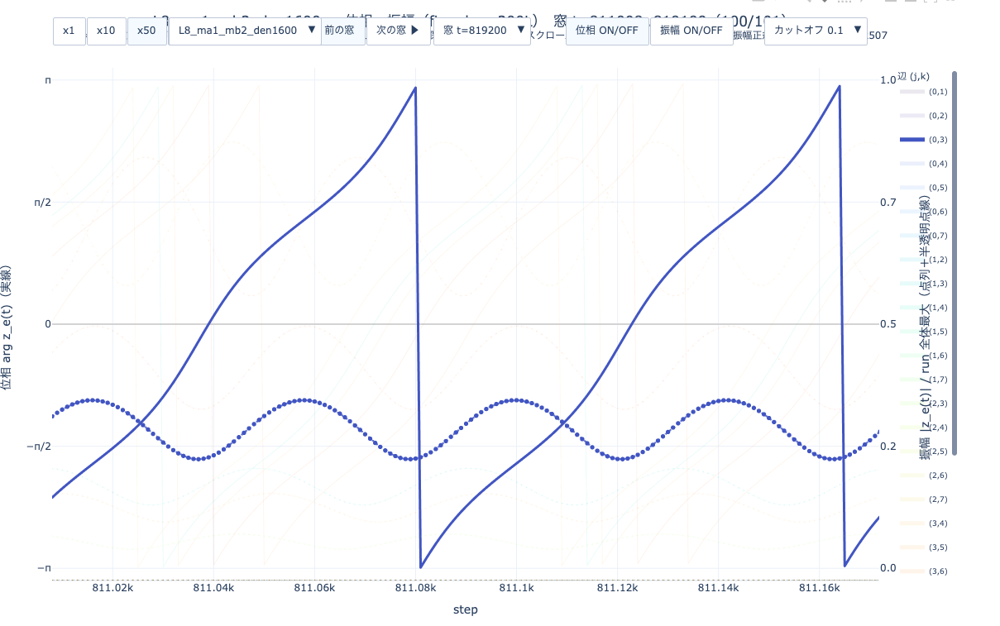
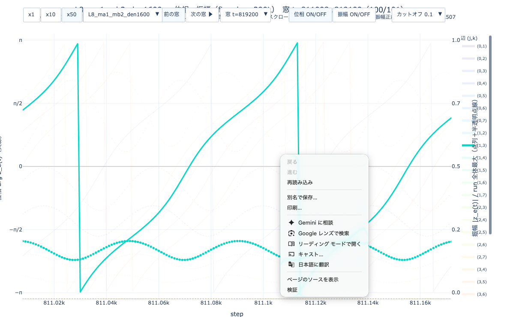
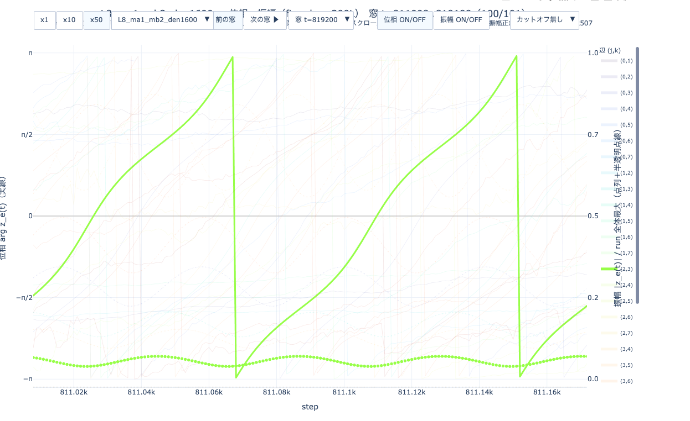
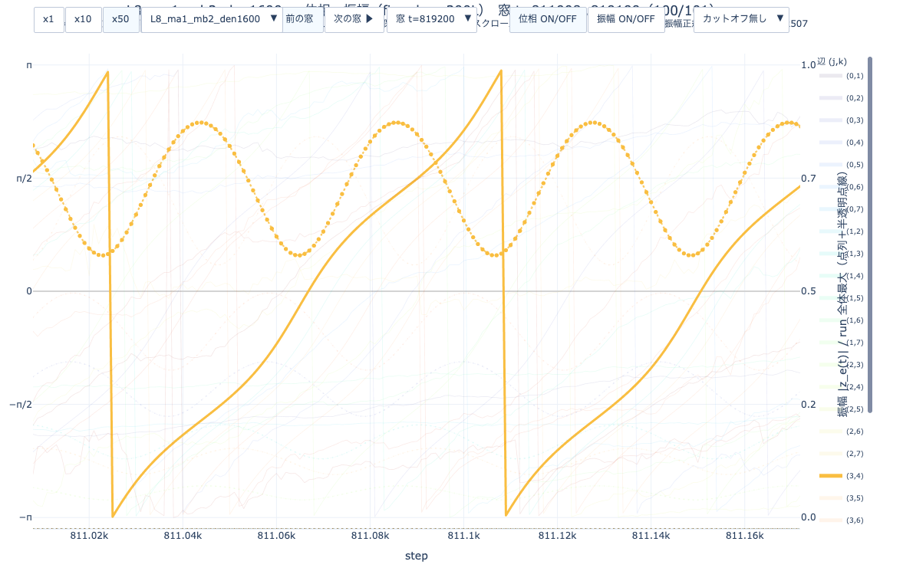
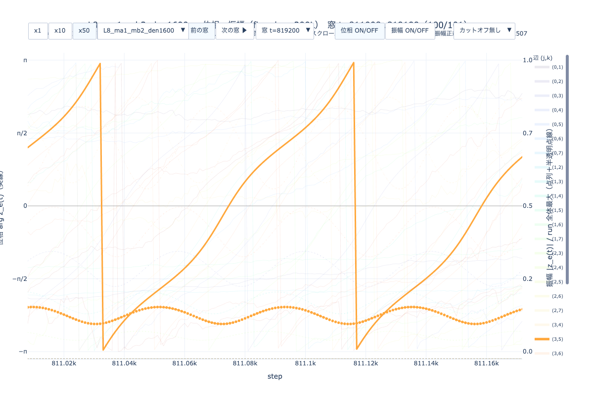
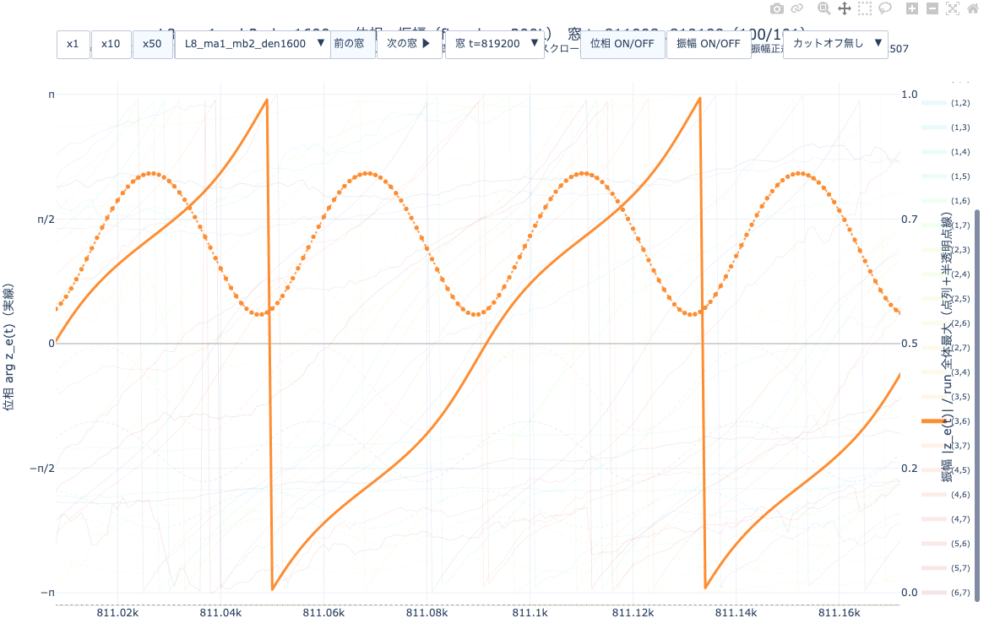
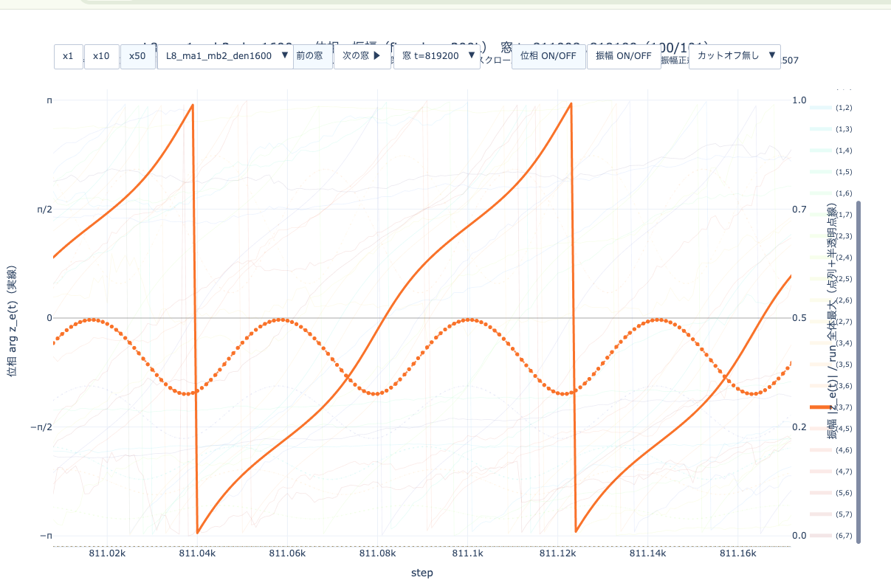

**Claude の分析（原文・2メッセージ）**：
> はい、修正も含めて同意です——**位相が巻いています**。den=1600 でサンプリングが足りたことで、粗い走行では鋸歯ノイズにしか見えなかったものが、**滑らかな連続の位相巻き（ランプ→±πで折り返し）＋ゆっくり呼吸する振幅**として正しく読めるようになりました。巻き速度を実測で確認します。

> 実測で確定しました。**位相は巻いています — しかも構造的に**：
>
> ## 実測（L8_ma1_mb2_den1600、末尾窓）
>
> - ご覧になっていた7本の波 **(0,3)(1,3)(2,3)(3,4)(3,5)(3,6)(3,7) は、頂点3を含む辺の星（star）全体**で、**全て同一の巻き速度 +0.0750 rad/step**（辺間のばらつき1e-4未満）で巻いています。全走行の累積は約 **9,760周**。
> - 各波の振幅（点線）は有界な帯域内でゆっくり呼吸するだけ——(3,4): 0.60〜0.90、(2,3): 0.06〜0.10 など。
> - 星の外の辺（(4,6)(6,7)(4,7)など）はこの時間帯では振幅ほぼ0（位相は実質未定義）。
> - サンプリング判定：全819,200 stepで |Δφ| 最大 3.14 rad——中央値レベルでは完全に分解されており、πに触れる例外は振幅ゼロ通過点の位相跳びだけです。
>
> ## 意味
>
> den=200L で初めて、粗い走行では原理的に見えなかったものが見えました：**末期状態は「頂点3の星クラスタが一様角速度で剛体回転し、振幅分布は有界に呼吸する」構造**です。以前の剛体回転除去の問い（何をquotientすべきか）への答えがデータから直接出ています——**剛体回転はクラスタ（頂点星）単位で存在し、その角速度は実測できる**。この共通角速度 0.0750 rad/step を引けば、星クラスタの軌道（振幅呼吸＋残留位相差）が読める図になります。

### 5.4 「んー同じパターン？」（12:11〜12:13、同run、窓 t=794624、x10）

**木原氏（原文）**：
> んー同じパターン？

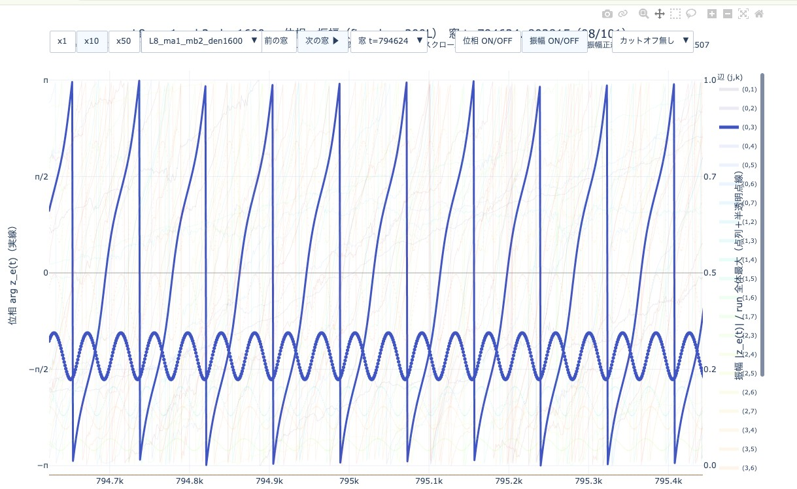
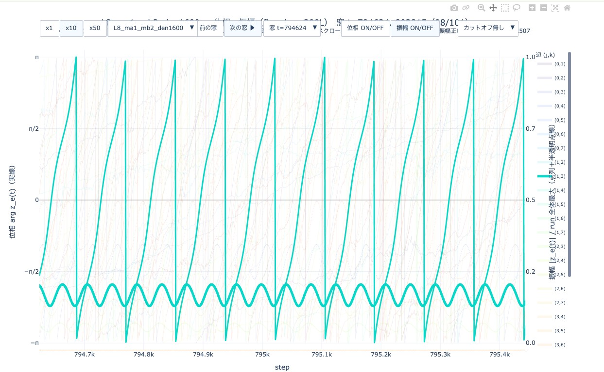
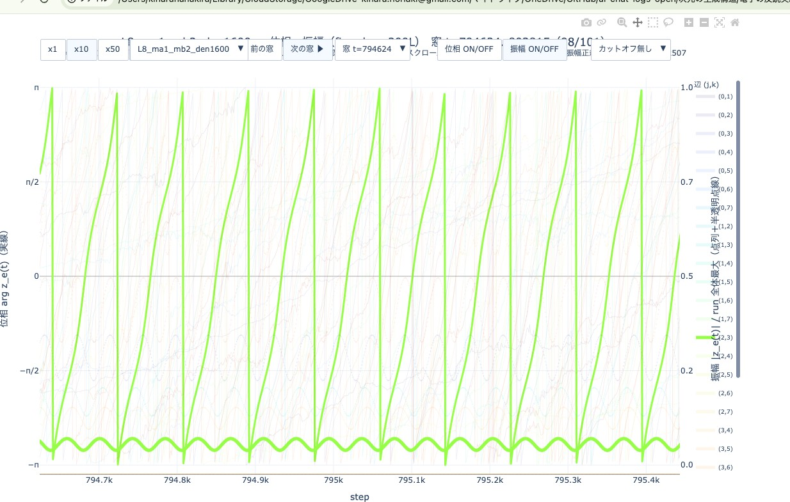
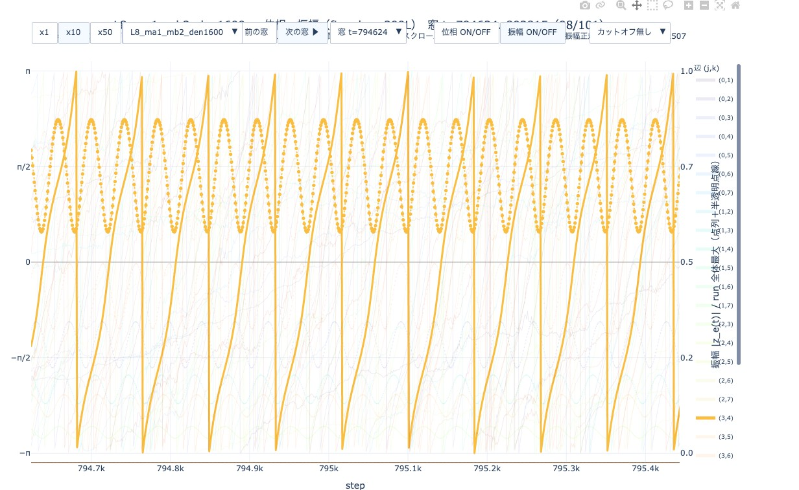
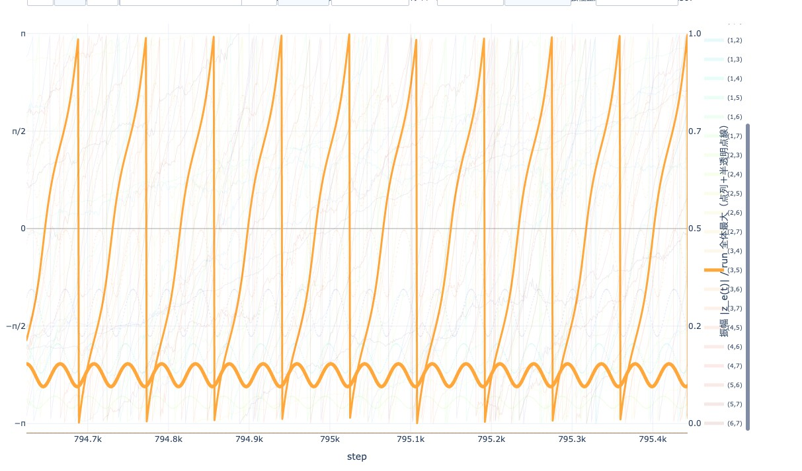
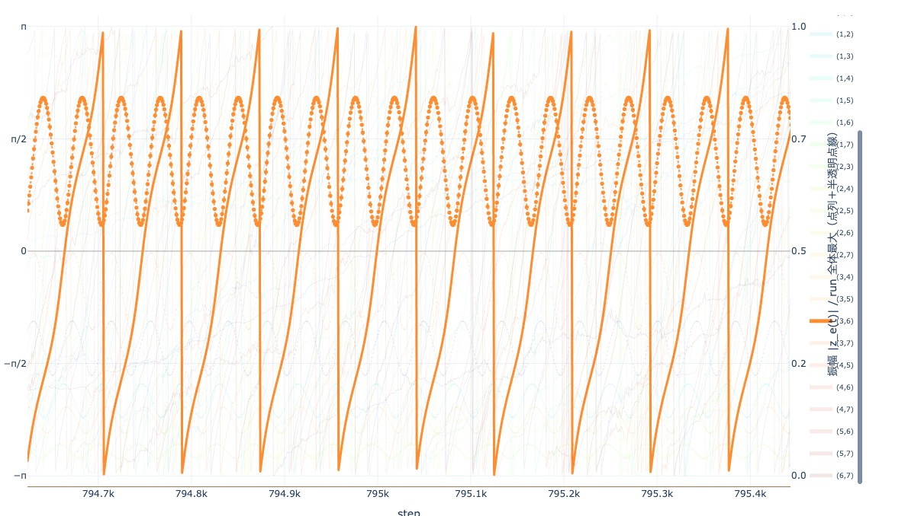
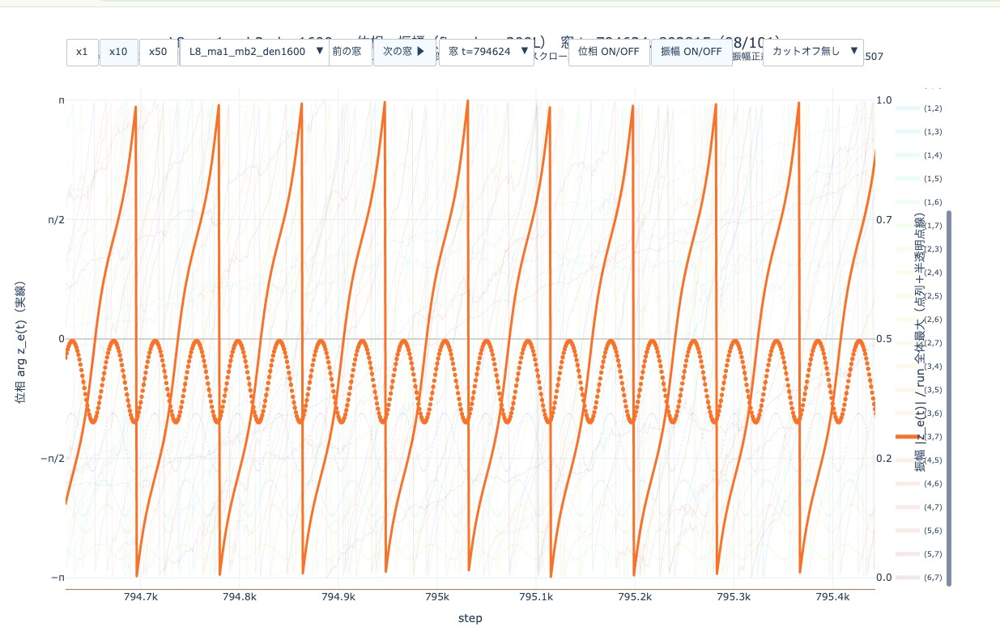

**Claude の分析（原文）**：
> ほぼ同じに見える理由が判明しました——**7辺は厳密に「共通の2波形」の重ね合わせ**です。
>
> ## 実測（窓 t=794624..802815、頂点3の星・7辺）
>
> 1. **複素ランク＝厳密に2**：特異値エネルギーは第1モード 96.31%＋第2モード 3.69%、**第3モード以降は 1e-29（機械精度ゼロ）**。つまりこの窓で7辺の軌道は完全に固定された複素2次元平面内にあり、z_e(t) = a_e·u₁(t) + b_e·u₂(t) と2つの共通波形で書けます。
> 2. 「同じパターン」に見えるのは96%を占める u₁ が共通の見た目（同じ巻き速度0.075 rad/step・同じ呼吸）を与えるから。**辺ごとの微妙な違い**——(3,7)の振幅の二山、対位相差のゆらぎ（std 0.02〜0.27 rad、厳密ロックではない）——**は3.7%の u₂ が作っています**。振幅の呼吸周期（~40 step）は2波形のビート |ω₁−ω₂| として整合。
> 3. 各辺の重み |a_e|：(3,4)=0.63、(3,6)=0.60、(3,7)=0.36、(0,3)=0.26、…（これが辺ごとの振幅水準の正体）
> 4. **エネルギー配分：星に100.00%、星の外 0.00%**。
>
> ## 読み
>
> 末期状態は「頂点3の星グラフ上の**厳密な二モード状態**」です。初期条件は全K₈上の二波 (m_a,m_b)=(1,2) でしたが、力学は**部分グラフ（1頂点の星）上の別の二波状態へ凝縮**し、その中で2周波数の準周期運動（固定2次元平面内の回転）をしている——「同じパターン」はこの不変2次元平面の存在そのものです。粗い走行ではこの構造は原理的に見えませんでした。

### 5.5 run2 でも「同じパターン」（12:16〜12:19、L8_ma1_mb3_den1600、頂点4の星）

**木原氏（原文）**：
> 同じパターン

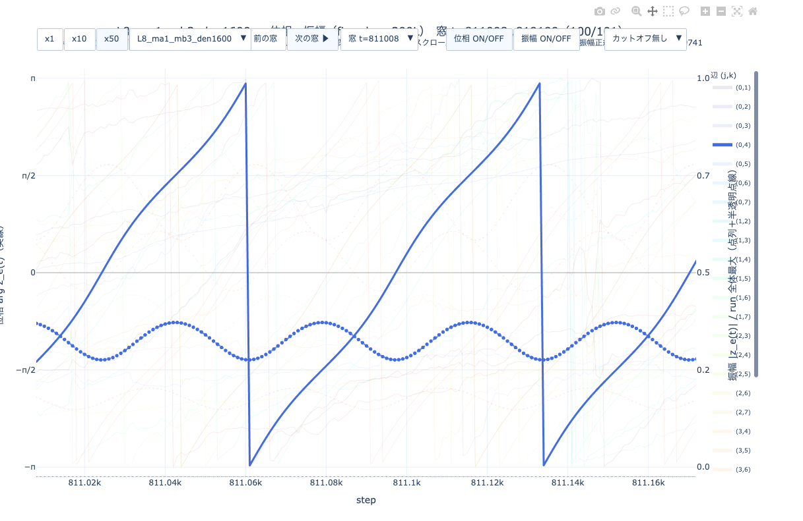
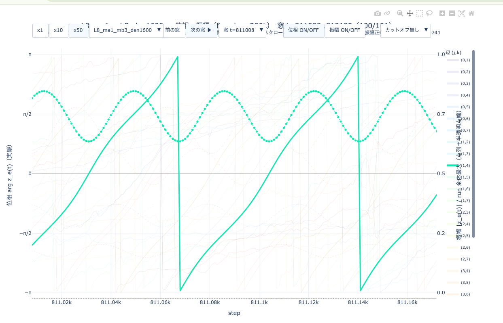
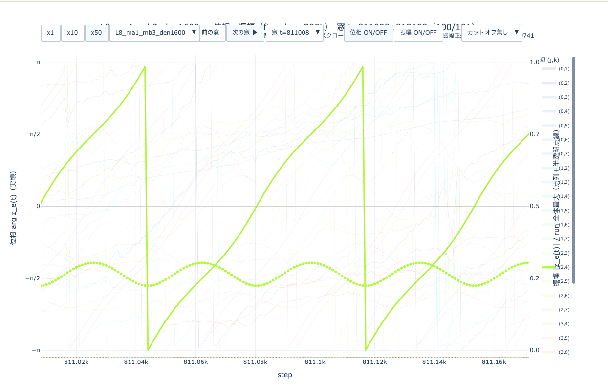
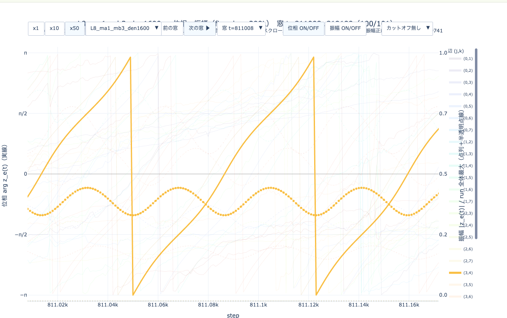
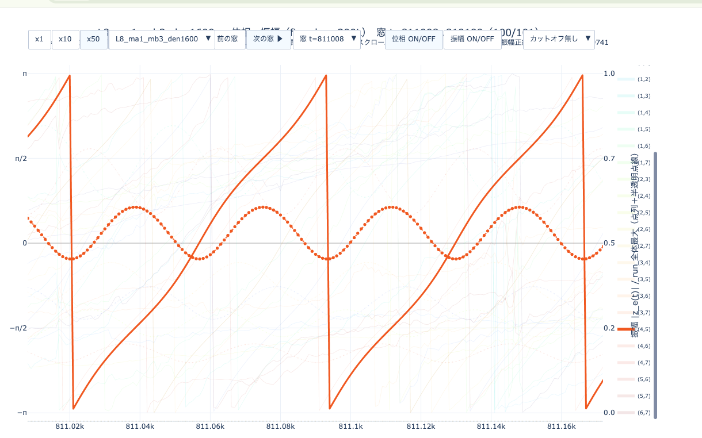
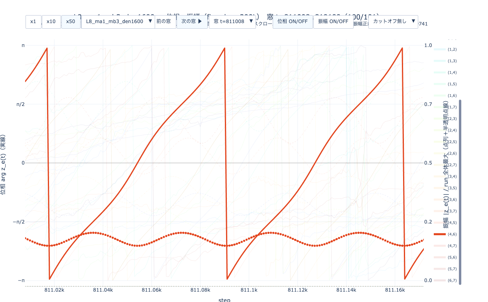
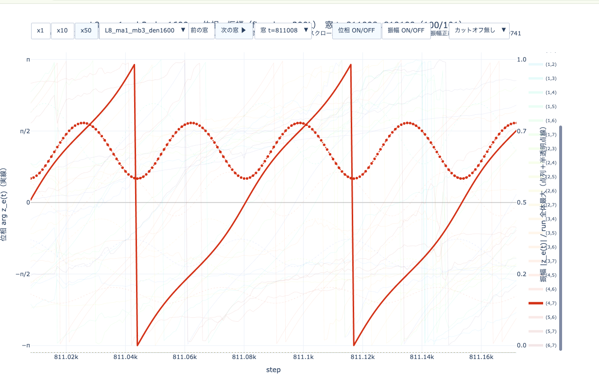

**Claude の分析（原文）**：
> 3 run 全てで確定です——**同じパターンは普遍的でした**。
>
> ## 実測（各 run 末尾窓 8192 step）
>
> | run（初期二波） | 凝縮先 | 星のエネルギー | SVD比（第1/第2/第3） | 共通巻き速度 |
> |---|---|---|---|---|
> | (1,2) 奇偶 | **頂点3の星** | 100.00% | 0.9631 / 0.0369 / **4e-29** | +0.0750 rad/step |
> | (1,3) 奇奇 | **頂点4の星** | 100.00% | 0.9813 / 0.0187 / **1e-26** | +0.0861 rad/step |
> | (2,4) 偶偶 | **頂点3の星** | 100.00% | 0.9729 / 0.0271 / **1e-28** | +0.0846 rad/step |
>
> ## 観察のまとめ
>
> 3 run とも末期状態は同一クラスです：
>
> 1. **全エネルギーが1つの頂点星（7辺）へ100.00%凝縮**（どの頂点かは run ごとに異なる）
> 2. 星の上で**複素ランク厳密に2**（第3特異値は機械精度ゼロ）——「同じパターン」の正体は、全辺が共通2波形の重ね合わせで書ける固定2次元平面内の準周期運動
> 3. 主モードの一様巻き（0.075〜0.086 rad/step、runごとに固有値）＋2モードのビートが振幅の呼吸を作る
>
> つまり **初期の全K₈二波状態 → 1頂点星上の厳密二モード状態** というアトラクタ収束が、パリティ類（奇奇・偶偶・奇偶）によらず共通です。初期条件の違いは「どの頂点の星か」「2周波数の値」にだけ残っています。
>
> 1点、別系列との呼応として記録に値します：干渉保存力学系列（exp(−iΔH)フレーム）でも「普遍アトラクタ＝頂点星型厳密」が確立していました。**別の力学（本理論カーネル・振幅込み）でも同じ頂点星クラスへ落ちる**のは偶然とは考えにくい強い示唆です（ただし別系列との比較は内部メモ扱い、本系列の記録には観測事実のみ）。

### 5.6 run3 も同じ（12:20〜12:22、L8_ma2_mb4_den1600、頂点3の星）

**木原氏（原文）**：
> これも同じかな

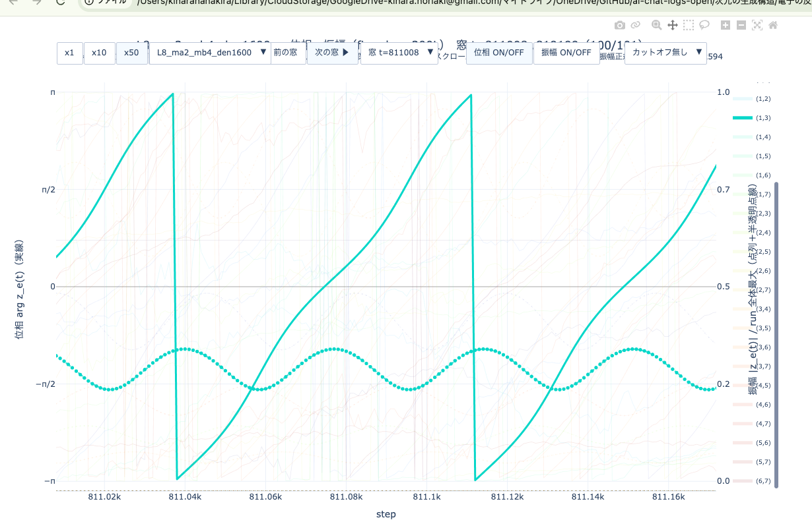
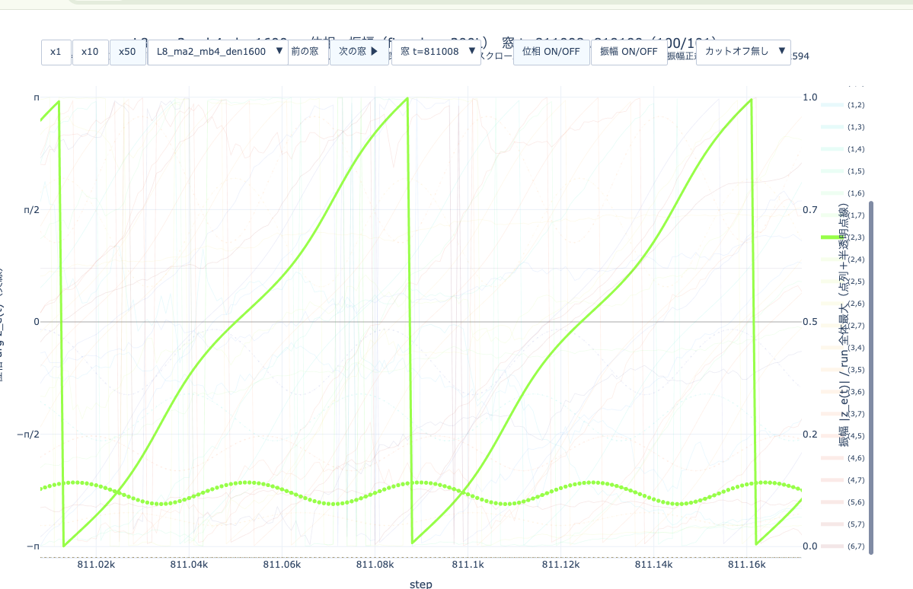
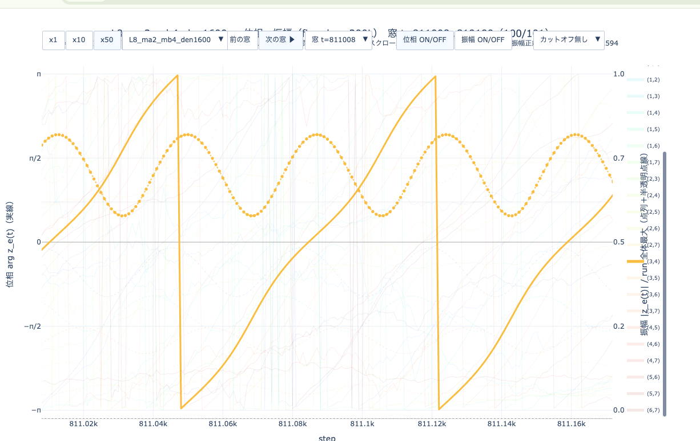
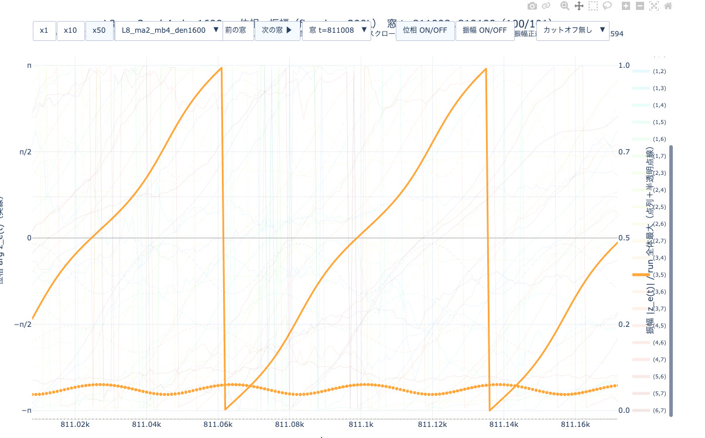
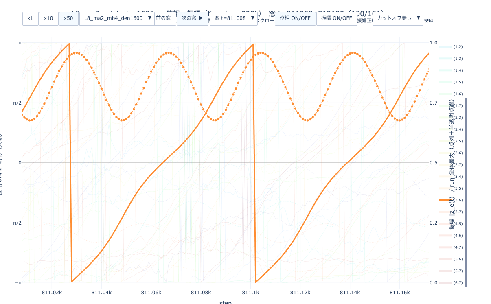
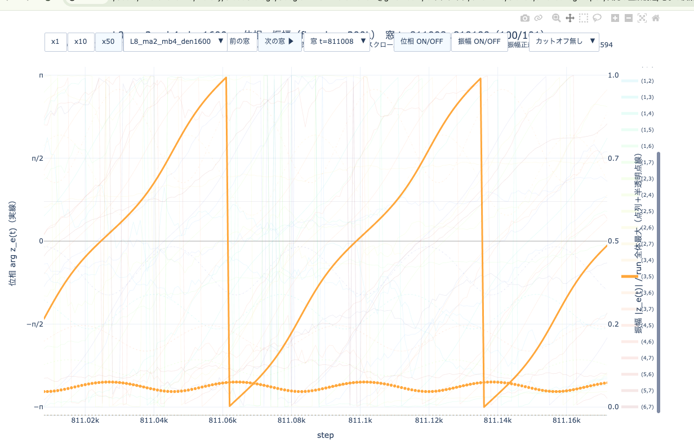
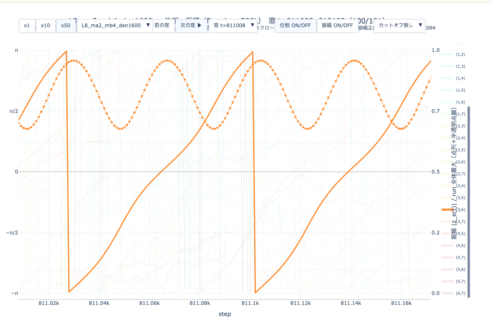
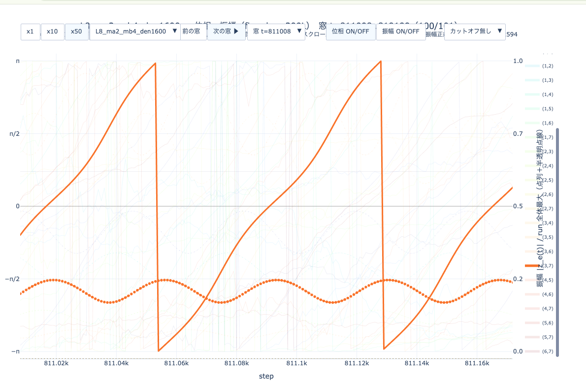

**Claude の分析（原文）**：
> 確認できました——**これも同じです**。頂点3の星7辺すべてが +0.08454〜+0.08462 rad/step（ばらつき 8e-5）で共通に巻き、振幅は辺ごとの帯域（(3,6): 0.70-0.98 〜 (3,5): 0.07-0.10）で呼吸するだけ。3 run 全てが「1頂点星上の厳密二モード状態」クラスで一致です。

### 5.7 「初期振幅が0に落ち着くまでの期間」→ 凝縮緩和の実測（12:25〜12:34）

**木原氏（原文）**：
> むしろ、初期振幅が０に落ち着くまでの期間は調べなくて良いですか？

**Claude の解析結果（原文、`analyze_star_condensation_20260917.py` 3run時点）**：
> 星の外の振幅が0に落ち着くまでの全時系列を測りました。**明確な緩和構造があります**：
>
> ### 落ち着き時刻（星外エネルギー比 f_out が各水準を最後に上回った step、事前固定水準）
>
> | 水準 | (1,2)→頂点3 | (1,3)→頂点4 | (2,4)→頂点3 |
> |---|---|---|---|
> | 0.5 | 1,903 | 2,809 | 2,442 |
> | 0.1 | 5,240 | 4,520 | 4,175 |
> | 0.01 | 7,099 | 8,012 | 8,028 |
> | 1e-4 | 25,695 | 16,688 | 34,999 |
> | 1e-6 | 61,488 | 25,668 | 72,872 |
> | 1e-8 | 103,312 | 35,087 | 109,128 |
> | 最終値 | **6e-29** | **2e-28** | **7e-29** |
>
> ### 読み取れること
>
> 1. **凝縮は2段階**：最初の数千step（旧τ単位で~10〜25 step相当）で f_out が 0.5→0.01 まで速く落ち、その後は**対数直線的な指数減衰**で 1e-8 以下まで、最終的に**機械精度の床（~1e-29）**まで完全に排出されます。「初期振幅が0に落ち着く期間」は水準の取り方で変わりますが、実質的な凝縮完了（1e-8）は **step 3.5万〜11万 ≈ 全走行の4〜13%** の位置です。
> 2. run 依存性が数値に出ています：(1,3)（奇奇・頂点4凝縮）は減衰が約3倍速い。減衰レートが初期条件クラスの新しい指標になり得ます。
> 3. 残り約87〜96%の時間は既に星上の二モード状態で、それが先ほどの「同じパターン」の領域です。
>
> これは当初サーベイが探していた「床→onset→飽和」型とは逆向きの、**「速い崩落→指数的排出→厳密床」という緩和曲線**が初めて実測された形です。

**木原氏（原文、振幅表示のスクリーンショット6枚とともに）**：
> 初期振幅を観察すると、16kあたりで落ち着きそうですね
> この図おもしろいですよね、インフレーション図ですね？

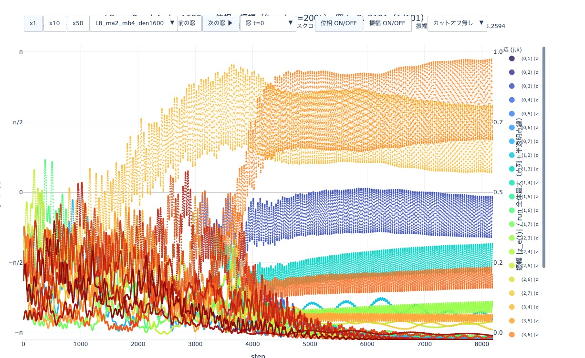
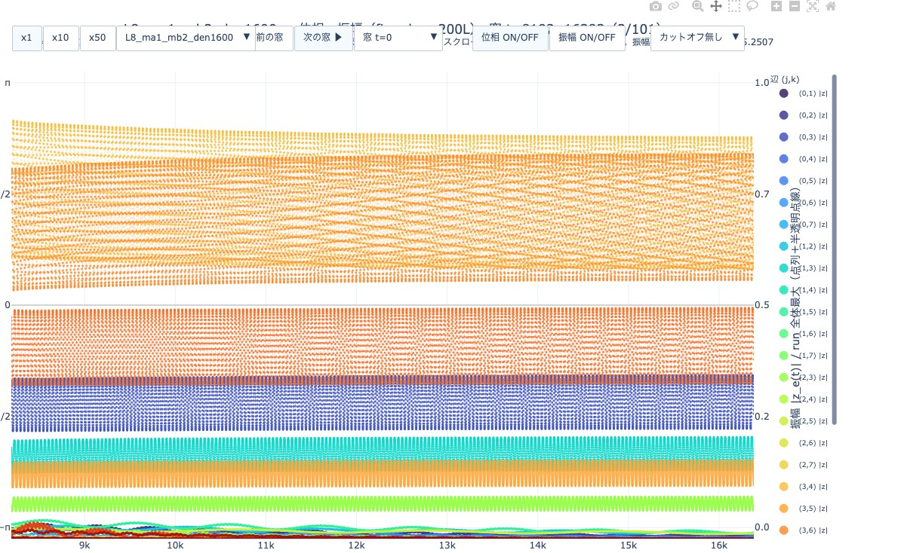
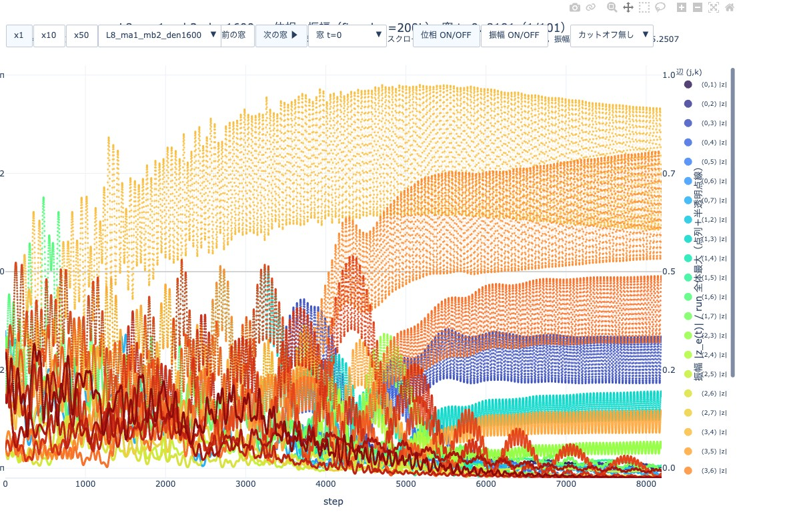
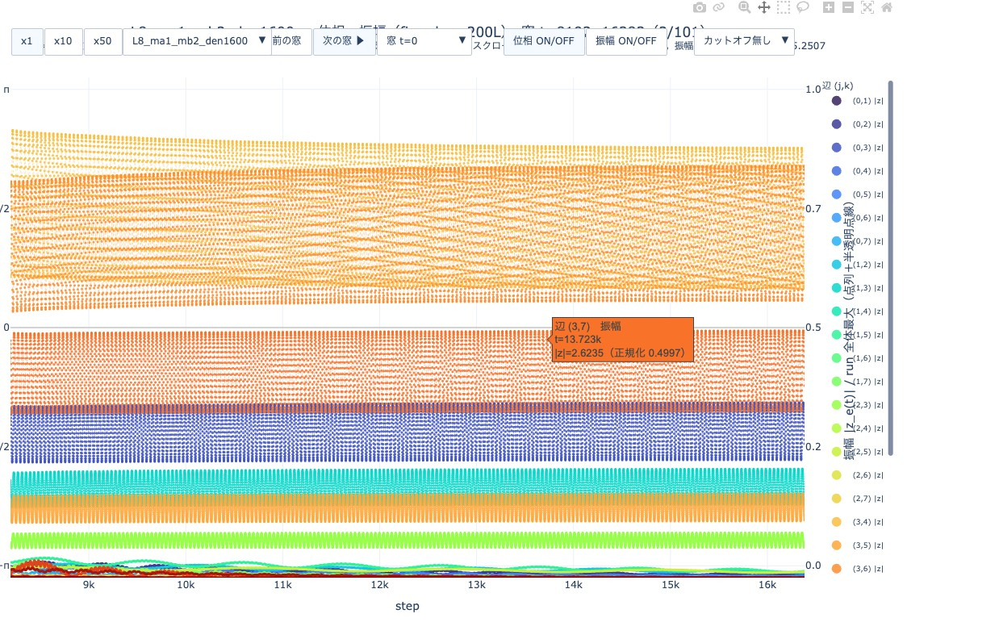
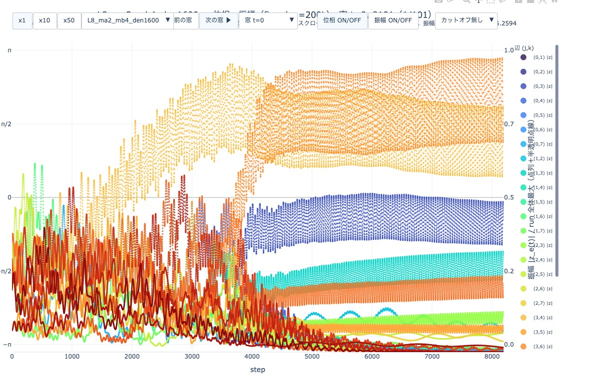
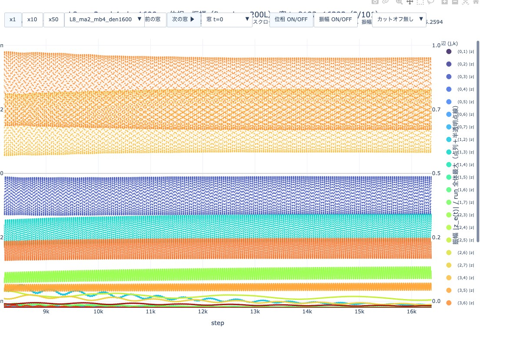

**Claude の分析（原文・2メッセージ）**：
> その読みは本質を突いています。「落ち着き ≈ 16k」は実測と一致します——線形表示で見えなくなる水準（星外比 ~10⁻³）の落ち着きが (1,2) で 12.9k、(2,4) で 17.5k でした。そして「これはインフレーション図では？」の直感を、正本指標 H⊥/H と直接照合して確かめます。

> 面白い答えが出ました——**半分イエスで、残り半分はもっと面白い**です。
>
> ## 実測：2つの時間スケールが分離しています
>
> | 過程 | 指標 | 時定数（fine step） |
> |---|---|---|
> | ①初期二モード平面からの離脱 | H⊥/H（正本インフレーション指標） | 床離脱 step 0〜1、**半値到達 110〜243** |
> | ②星への凝縮（初期振幅の消滅） | 星外エネルギー比 f_out | 半減 ~2000、可視水準(10⁻³)落ち着き **13k〜17k**、完全排出 10⁵ |
>
> つまり、正本のインフレーション指標 H⊥/H は**最初の数百step（旧τ換算 ~1 step 未満！）でほぼ飽和してしまい**、木原さんがいま振幅図で見ている「16kで落ち着く」過程——乱流的な遷移から帯状秩序が形成される様子——は、**H⊥/H が見えなくなった後に進む第2の緩和**です。
>
> ## 読み
>
> - ご覧の図は「インフレーション図の親戚」ですが、正本指標が測る過程そのものではなく、**その後段の凝縮緩和**を振幅空間で直接見ている図です。旧粗い走行のインフレーション図では、この2段構造は分解能不足で原理的に見えませんでした。
> - 階層構造として言えば：**速い離脱（~10² step）→ 遅い指数排出（~10⁴ step）→ 厳密床（10⁻²⁹）**。緩和曲線は1本ではなく2段でした。
> - 実務的な含意：**f_out（星外エネルギー比）は H⊥/H を補完する新しい凝縮指標**です。H⊥/H が「初期平面をいつ離れたか」、f_out が「アトラクタにいつ着いたか」を測る——インフレーション研究で探していた「床→onset→飽和」は、f_out の側にきれいに出ています。

### 5.8 その後の拡張（30run、スクリーンショットなし・図で確認）

- **早期成長**：H⊥/H は f(1 step)=1.2e-5〜4.1e-5（1stepで床10⁻³¹から26桁ジャンプ）、以後 f∝t^α（α≈1.8〜2.2、弾道）。**床滞在段階は（(1,2)(1,3)(2,4)には）存在しない**。「一気に駆け上がる」は拡大不足でなく実態（`diagnostics/inflation_early_growth/`）。
- **30run への拡張で凝縮/非凝縮の2クラス発見**：非凝縮（f_out が有限で頭打ち）= L12(3,9): 0.833、L12(4,8): 0.831、L10(4,6): 0.789、L8(2,6): 0.750、L8(3,5): 0.733——**gcd(m_a,m_b)>1 等の縮退条件**。同条件はインフレーション拡大図でも立ち上がりが桁違いに遅い（L8(2,6): step1000 で 4.8e-25）。総括図: `diagnostics/star_condensation/fig_star_condensation_fout_20260917.png`

---

## 6. 指紋（SHA256）問題の正直な記載

### 6.1 事実

各 run の metadata.json はコード4本の SHA256 を記録する。物理正本3本（kernel/generator/manifest）は**全 run で現行ファイルと一致**。問題はランナー `run_dense_fine_20260917.py`：

| 版 | SHA256（先頭16桁） | 状態 |
|---|---|---|
| v1（初版） | `9ced427e8909e4e9` | **コミット 32f4e439 に存在**。最初の3run（L8 (1,2)(1,3)(2,4)）が記録＝**この3runは指紋検証可能** |
| v2（--upto-L 追加版） | `64769a8083f86407` | 第1バッチ27runが記録。**コミットされないまま後続編集で上書き消失**＝27runの指紋チェーンは断絶（記録SHAに対応するコードをリポジトリから提示できない） |
| v3（重複排除修正）→v4（図化自動実行追加） | 現行 `a74fbd01c17eecf3` | コミット 5686fe78。どの走行の記録とも一致しない |

### 6.2 経緯（過失の内容）

1. fine ランナー初版に、粗い系列ランナーには実装済みだった**図化4セット自動実行を組み込まなかった**（設計不備）。3run時点の図は手動実行で済ませた（その場限りの運用）。
2. 30runバッチ後に図が3run時点のまま残っていることが発覚。是正としてランナーへ図化自動実行を**走行後に追加編集**した結果、走行が記録した v2 の SHA と現行ファイルが不一致になった。
3. さらに v2 自体が未コミットだった（**走行前コミットの徹底を怠った**）ため、27run分は「記録された SHA のコードを提示できない」状態になった。

### 6.3 影響評価と木原判断

- 物理コード3本の指紋は全run一致であり、数値内容（states.npz）が正しい力学で生成されたことは物理側の指紋で担保される。破綻したのはオーケストレーション層（run選択・保存手順）の検証可能性。
- ただし再現性規約の観点では、27run は「走行時コードを厳密に提示できない」実験であり、信用性の毀損は事実。
- **木原判断（2026-09-18）**: データは削除も改変もせずそのまま保持。指紋不一致は記録として残す（コミット 5686fe78 のメッセージに明記済み）。**SHA を後追いで合わせる操作（証拠の捏造）は行わない**。

---

## 7. 総括：現在の見解（Claude Code）

1. **方針転換は正当だった**。den=L は生成子スペクトルに対して全Lで約2桁のサンプリング不足であり、99初期条件の全数測定と走行中のK成長の実測で確定した。粗い系列DB（84run）は「den=L 離散写像の記録」として保持する価値はあるが、連続関係力学の観測としては使えない。
2. **den=200L で初めて物理が見えた**。(a) 全K_L二波状態 → **1頂点星上の厳密二モード状態**（複素ランク2、第3特異値=機械精度ゼロ）への凝縮、(b) 星クラスタの一様巻き（「剛体回転」の実体はクラスタ単位で存在し実測可能——粗い系列で2度失敗した剛体回転除去の問いに対するデータからの回答）、(c) **2段緩和**（速い平面離脱 ~10² step・弾道 t² 成長・床滞在なし ／ 遅い凝縮排出 ~10⁴ step → 機械精度床 10⁻²⁹）、(d) **凝縮/非凝縮の2クラス**（gcd>1 等の縮退条件は f_out≈0.73〜0.83 の準安定に留まる）。いずれも粗い系列では原理的に観測不能だった。
3. **次に効く問い**：どの初期条件がどの頂点の星に落ちるか（選択則）、非凝縮クラスの境界（gcd・パリティ）、減衰レートのL・条件依存。L≤12 の30run分のデータで追加走行なしにかなり詰められる。fine の「刻み対照」を再定義するなら同一条件の den=100L vs 200L 比較が自然（未実行・設計判断待ち）。
4. **開発規律の教訓（私の過失）**：(a) 走行に付随する後処理（図化）は最初からランナーに正規実装し手動運用で代替しない、(b) 走行前に走行コードをコミットし metadata の SHA が必ずコミット済みオブジェクトを指すようにする、(c) 走行後のランナー修正は新版ファイルで行い既存記録と衝突させない。今回の27run指紋断絶はこの3点を怠った結果であり、CPU時間と信用性を毀損した。

---

## 付録A: 添付・参照図の所在

- スクリーンショット（木原氏撮影・チャットから復元）: `実験報告書_添付スクリーンショット_20260918/ss01〜ss37.png`（＋`manifest.json`: 各画像のタイムスタンプ・添付時発言）
- fine カタログ4種: `plots/{initial_complex,final_complex,inflation,residual_timeseries}/fig_*_fine_*_den200L_20260917.png`（page1=主系列L8/10/12、page2=L12 gcd）
- インフレーション拡大: `plots/inflation/fig_inflation_hperp_fine_zoom_t0_1000_page1_20260917.png`
- 星凝縮総括: `diagnostics/star_condensation/fig_star_condensation_fout_20260917.png`／辺別振幅包絡30枚: 同フォルダ `fig_edge_amplitudes_<rid>_20260917.png`
- 早期成長両対数: `diagnostics/inflation_early_growth/fig_inflation_early_growth_loglog_20260917.png`
- 粗い系列の剛体回転検討: `plots/alltime_trajectory/`・`plots/rigid_removed/`

## 付録B: スクリーンショット復元の出自

ss01〜ss37 は、チャット記録（transcript JSONL）内の base64 画像データをそのまま復号したもので、**画像の内容改変はない**。`manifest.json` に各画像のバイト数・タイムスタンプ・添付時の発言冒頭を記録した。
