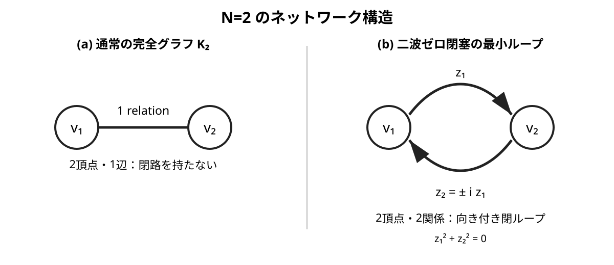

# 複素二乗閉塞から導く光子の最小直交構造

## ― 円偏光・ヘリシティ、二頂点二辺ループ、および高対称多体系での二波閉塞の出現 ―

**著者:** 木原範昭  
**ORCID:** 0009-0004-6753-4020  
**DOI:** （取得後記入）  
**Concept DOI:** （取得後記入）  
**初版:** 2026-09-07  
**改訂版 v2:** 2026-09-08

## 要旨

本稿では複素波集合の実中心投影条件

$$
\sum_{k=1}^{n}z_k^2=R^2,\qquad R\in\mathbb R
$$

を出発点として光子の最小構成を検討する。当初、局在しない光子は単一の複素数波で表現できると想定した。しかし光子候補に曲率半径を持たないゼロ閉塞条件 $R=0$ を課すと、単一の非零複素数では条件を満たせない。最小の非自明構成は二つの複素数であり、

$$
z_1^2+z_2^2=0
$$

から

$$
z_2=\pm iz_1
$$

が得られる。したがって二成分は等振幅かつ直交し、相対位相は $\pm\pi/2$ である。

この二つの解を二次元回転に対して調べると、それぞれが回転作用素の固有状態となり $e^{\mp i\varphi}$ の位相因子を得る。この構造は左右円偏光および光子の二つのヘリシティ $h=\pm1$ の回転表現と一致する。

本改訂ではさらに、最小二波閉塞をネットワーク幾何として読む。通常の $N=2$ 完全グラフ $K_2$ は二頂点を一辺で結ぶだけで閉路を持たない。これに対し本構成では、二頂点間に逆向きの二つの関係波を置くことで最小の向き付き閉ループを構成する。$z_2=+iz_1$ と $z_2=-iz_1$ はこのループの二つの向きに対応し、左右円偏光の二状態と結び付く。

加えて、高対称な $N$ 波系の初期理論床を数値的に監査した速報結果を報告する。監査範囲では $N=8k$ の系列で全関係波が二波ゼロ閉塞対へ完全分解できた。一方、それ以外の系列では二波閉塞は一般に成立せず、3波、5波、7波、11波、13波……といった素数次数の多波ゼロ閉塞構造が現れた。本稿ではこの数値結果を速報としてのみ記載し、一般初期条件への普遍性、時間発展後の保存性、インフレーション過程後の再編成、および二波閉塞と多波閉塞の動力学的差異は今後の課題とする。

さらに回転位相を時間読み出し $\varphi=\omega t$ に写すと $e^{-i\omega t}$ が得られ、標準量子論の時間発展との対応から $E=\hbar\omega=h\nu$ に接続する。本構成では Maxwell 方程式、電場・磁場、光子スピン、Planck 定数を出発点に置かず、複素二乗閉塞の最小非自明解から直交二成分構造を得る。

## 1. 出発点

本研究では物理状態を複素数波の集合として表し、その幾何学的閉包を

$$
\sum_k z_k^2=R^2,\qquad R\in\mathbb R
$$

によって記述する。$R$ は複素ノルムではなく、複素二乗和を実数へ閉じた中心投影半径である。

$z_k=a_k+ib_k$ とすれば

$$
\sum_k(a_k^2-b_k^2)+2i\sum_k a_kb_k=R^2,
$$

したがって

$$
\sum_k a_kb_k=0,\qquad
\sum_k(a_k^2-b_k^2)=R^2.
$$

光子候補について $R=0$ を考えると

$$
\sum_k z_k^2=0
$$

となる。

## 2. 単一複素数仮説の棄却と最小二成分

一成分なら

$$
z^2=0
$$

であり、複素数体上の解は $z=0$ のみである。したがって $z\neq0$ かつ $R=0$ の非自明な一成分状態は存在しない。

二成分では

$$
z_1^2+z_2^2=0
$$

より

$$
z_2^2=-z_1^2
$$

であるから

$$
\boxed{z_2=\pm iz_1}.
$$

従って

$$
|z_1|=|z_2|,\qquad
\boxed{\Delta\phi=\pm\frac{\pi}{2}}.
$$

任意の非零 $z$ に対して $(z,+iz)$ と $(z,-iz)$ が解であるため、固定される本質は絶対振幅や絶対位相ではなく二成分間の直交関係である。

## 3. $N=2$ のネットワーク幾何：一辺ではなく二辺の閉ループ

通常の単純完全グラフ $K_2$ は二頂点 $v_1,v_2$ と一辺からなる。

$$
M=\frac{N(N-1)}2=1\qquad (N=2)
$$

であり、これは二頂点間の単一関係を表す。しかし単一関係だけでは閉路を構成できず、前節の二波ゼロ閉塞も表せない。

本稿の光子候補では、二つの複素関係波を幾何的に

$$
z_1:v_1\rightarrow v_2,\qquad
z_2:v_2\rightarrow v_1
$$

と読む。すると二頂点の間に逆向きの二辺が存在し、

$$
v_1\xrightarrow{z_1}v_2\xrightarrow{z_2}v_1
$$

という最小閉ループを作る。

**図1.** 左は通常の単純完全グラフ $K_2$ であり、二頂点・一辺なので閉路を持たない。右は本稿の二波ゼロ閉塞の模式図であり、二頂点間に逆向きの二つの関係 $z_1,z_2$ が存在して向き付き閉ループを作る。ここで $z_2=\pm iz_1$ なので、ループ全体は $z_1^2+z_2^2=0$ を満たす。

この意味で、本稿の最小光子候補は通常の $K_2$ ではなく、二頂点を二つの関係で結んだ最小の多重有向閉路として表される。

### 3.1 ループの二つの向きと左右性

二つの解

$$
(z_1,z_2)=(z,+iz),\qquad (z,-iz)
$$

は、同じ二頂点・二辺構造に対して相対位相の向きが反対である。したがって内部位相平面では二つの向き付きループとして区別できる。

さらに二つの関係を交換すると

$$
(z,iz)\mapsto(iz,z)=i(z,-iz),
$$

となる。全体位相 $i$ を除けば、交換は $+i$ 解と $-i$ 解を入れ替える。したがって、関係波の交換はループの向きを反転し、後述する左右円偏光・ヘリシティの交換に対応する。

ここで重要なのは、波1・波2というラベルそのものではなく、二関係が作る**向き付き閉関係**が物理的情報を担うことである。

## 4. 曲率半径ゼロの光子

二成分全体は

$$
z_1^2+z_2^2=0
$$

なので

$$
R^2=0.
$$

この状態は非零の内部関係を持ちながら有限の中心投影半径を持たない。本構成では光子単独に有限の大きさ、絶対位置、絶対位相を割り当てない。定義される最小情報は

$$
\boxed{\text{二つの複素成分が直交し、向き付き閉関係を作る}}
$$

ことである。

## 5. 回転から円偏光とヘリシティ

規格化して

$$
\Psi_\pm=\frac1{\sqrt2}
\begin{pmatrix}1\\ \pm i\end{pmatrix}
$$

とする。二次元回転

$$
\mathcal R(\varphi)=
\begin{pmatrix}
\cos\varphi&-\sin\varphi\\
\sin\varphi&\cos\varphi
\end{pmatrix}
$$

を作用させると

$$
\boxed{\mathcal R(\varphi)\Psi_+=e^{-i\varphi}\Psi_+},
$$

$$
\boxed{\mathcal R(\varphi)\Psi_-=e^{+i\varphi}\Psi_-}.
$$

したがって複素二乗ゼロ閉塞から得た二つの直交解は回転固有状態であり、無次元回転固有値は $\pm1$ である。これは左右円偏光、および伝播軸に沿った光子の二つのヘリシティ $h=\pm1$ の回転表現と一致する。

二波閉ループの向きと回転固有状態の符号を合わせると、導出系列は

$$
\boxed{
\sum z_k^2=0
\Longrightarrow
z_2=\pm iz_1
\Longrightarrow
\text{向き付き二辺閉路}
\Longrightarrow
\Delta\phi=\pm\frac{\pi}{2}
\Longrightarrow
e^{\mp i\varphi}
\Longrightarrow
h=\pm1
}
$$

となる。

## 6. 時間位相と Planck--Einstein 関係

回転位相が時間読み出しに対して一定角速度 $\omega$ で進むとする。

$$
\varphi(t)=\omega t.
$$

すると

$$
\boxed{\Psi(t)=e^{-i\omega t}\Psi(0)}
$$

である。この段階まで Planck 定数は必要ない。

標準量子論のエネルギー固有状態は

$$
\Psi(t)=e^{-iEt/\hbar}\Psi(0)
$$

と書かれる。両者の位相を対応させれば

$$
\omega=\frac{E}{\hbar},
\qquad
E=\hbar\omega.
$$

さらに

$$
\omega=2\pi\nu,\qquad \hbar=\frac{h}{2\pi}
$$

より

$$
\boxed{E=h\nu}.
$$

したがって本構成で基礎的に得られるのは位相回転率 $\omega$ であり、$E=h\nu$ はその位相回転と標準的エネルギー読み出しとの対応として現れる。

空間回転の二符号はヘリシティに対応するが、両ヘリシティの正周波数光子についてエネルギーは $E=+\hbar\omega$ である。

## 7. 高対称 $N$ 波系における二波閉塞の出現（速報）

前節までの議論は二波ゼロ閉塞そのものの解析的結果である。これとは独立に、高対称に構成した $N$ 波系の初期理論床について、全関係波

$$
M=\frac{N(N-1)}2
$$

をより小さいゼロ閉塞単位へ因数分解できるかを数値監査した。

### 7.1 $N=8k$ では全波が二波閉塞へ完全分解する

監査範囲 $N=4,6,8,\dots,40$ の偶数系列では、

$$
\boxed{N=8,16,24,32,40}
$$

に限って、全 $M$ 波を

$$
z_b=\pm iz_a,
\qquad
z_a^2+z_b^2=0
$$

を満たす二波対へ完全に分解できた。被覆率は100%であり、余り波は0であった。

代表例を表1に示す。

| $N$ | $M=N(N-1)/2$ | 二波閉塞数 | 二波被覆率 |
|---:|---:|---:|---:|
| 8 | 28 | 14 | 100% |
| 16 | 120 | 60 | 100% |
| 24 | 276 | 138 | 100% |
| 32 | 496 | 248 | 100% |
| 40 | 780 | 390 | 100% |

この結果は、二波ゼロ閉塞が単なる孤立した $N=2$ の代数解ではなく、高対称多体系の内部で全体系を覆う最小閉塞単位として出現し得ることを示す。

### 7.2 その他の系列では素数次数の多波閉塞が現れる

同じ高対称理論床で、$N=8k$ 以外の偶数系列では exact な二波閉塞は部分的に残るのではなく、監査範囲では0であった。代わりに全波は3波、5波、7波、11波、13波、17波、19波などのより高次数のゼロ閉塞ブロックへ完全分解できた。例えば

$$
N=6\rightarrow 3\text{波},\quad
N=10\rightarrow 5\text{波},\quad
N=14\rightarrow 7\text{波},\quad
N=22\rightarrow 11\text{波}
$$

である。$N=4$ は例外的に6波全体が3波閉塞2組へ分解する。

奇数系列 $N=3,5,\dots,39$ では二波閉塞対は全19系列で0であり、各距離クラスは $N$ の最小素因子 $p$ に対応する $p$ 波閉塞へ完全分解できた。例えば

$$
N=9\rightarrow 3\text{波},\qquad
N=25\rightarrow 5\text{波},\qquad
N=35\rightarrow 5\text{波}.
$$

また奇素数 $N=7,11,13,17,\dots$ では最小対称閉塞単位は $N$ 波そのものになる。

従って本監査範囲では、高対称理論床は概念的に

$$
\boxed{
N=8k\;\Rightarrow\;\text{二波閉塞相},
\qquad
\text{その他}\;\Rightarrow\;\text{素数次数の多波閉塞相}
}
$$

という分岐を示した。

ただし本節は速報である。ここで確認したのは**高対称初期理論床の静的因数分解**であり、一般初期条件に対する普遍性、因数分解の一意性、各閉塞ブロックの力学的保存性、インフレーション過程後の再編成、二波閉塞と多波閉塞の散乱応答の差異は本稿では扱わない。

## 8. 既存研究との関係

Riemann--Silberstein ベクトルは電磁場を

$$
\mathbf F_\pm\propto\mathbf E\pm i\mathbf B
$$

として複素化し、Maxwell 方程式と光子の二ヘリシティを簡潔に記述する。Białynicki-Birula はこの構造を光子波動関数として体系化し、複素構造と左右ヘリシティの対応を論じている [1,2]。Elbistan, Horváthy, Zhang は Riemann--Silberstein 型光子波動関数における双対性とヘリシティを扱う [3]。

また複素 null vector と円偏光の関係自体には既存の記述があり、等しい直交実成分を持つ複素ベクトルが null となる構造が論じられている [4]。

本稿では電場 $\mathbf E$、磁場 $\mathbf B$、Maxwell 方程式、円偏光、ヘリシティを出発条件とせず、

$$
\sum_kz_k^2=R^2
$$

という複素二乗閉塞から出発する。その $R=0$ の最小非自明解として二成分直交状態を得て、その回転表現から円偏光と二ヘリシティ構造へ接続する。さらに本改訂では、この二成分を二頂点・二関係の向き付き閉ループとして幾何的に表現し、高対称多体系の一部系列で同じ二波閉塞が全体系の最小構成単位として出現することを数値的に示した。

## 9. 議論と今後の課題

本稿の解析部分で確定するのは、複素二乗ゼロ閉塞の最小非自明解が二波であり、その二波が等振幅・直交位相を持ち、回転に対して $e^{\mp i\varphi}$ の固有位相を得ることである。この構造は左右円偏光およびヘリシティ $\pm1$ の標準的な回転表現と一致する。

一方、高対称多体系に関する第7節は数値速報であり、以下を今後の検討課題とする。

1. 高対称初期床で確認した $N=8k$ の二波完全閉塞が、より一般の自己無撞着初期条件でも成立するか。
2. 二波閉塞対が時間発展中に保存されるか、あるいは別の二波・多波閉塞へ組み替わるか。
3. インフレーション過程を経た後にも二波閉塞相／多波閉塞相の区別が残るか。
4. 二波閉塞と3波、5波、7波……の多波閉塞が、同じ相互作用に対して異なる散乱・反射・増幅応答を示すか。
5. 多波閉塞の素数次数と、粒子的内部構造・束縛・閉じ込めとの対応が存在するか。

従って本稿では、高対称多体系の結果を光子同定の証明として用いるのではなく、二波ゼロ閉塞が大きな高対称系の中にも自然に現れることを示す独立な数値的傍証として位置付ける。

## 10. 結論

複素二乗の実中心投影条件

$$
\sum_kz_k^2=R^2
$$

に対し光子候補として $R=0$ を要求すると、単一非零複素数では解が存在しない。最小非自明解は二成分であり

$$
\boxed{z_2=\pm iz_1}
$$

となる。

したがって光子の最小構成は、絶対位置・有限の大きさ・絶対位相を必要とせず、二つの複素成分の直交関係として記述される。幾何的には、これは通常の二頂点一辺の $K_2$ ではなく、二頂点を逆向きの二関係で結んだ最小の向き付き閉ループである。二つの符号はループの二つの向きに対応し、

$$
\mathcal R(\varphi)\Psi_\pm=e^{\mp i\varphi}\Psi_\pm
$$

と変換することから、左右円偏光および二ヘリシティ $h=\pm1$ の回転構造に一致する。

さらに $\varphi=\omega t$ とすると

$$
\Psi(t)=e^{-i\omega t}\Psi(0)
$$

となり、この段階まで Planck 定数は不要である。標準量子論の時間発展との対応から

$$
E=\hbar\omega=h\nu
$$

へ接続する。

加えて高対称初期理論床の数値監査では、$N=8k$ の系列で全関係波が二波ゼロ閉塞対へ完全分解されることが確認された。その他の系列では3波、5波、7波……の素数次数の多波閉塞構造が現れた。この結果は速報であり、その時間発展と物理的同定は今後の課題である。

従って

$$
\boxed{
\text{複素二乗ゼロ閉塞}
\rightarrow
\text{最小二成分}
\rightarrow
\text{向き付き二辺閉ループ}
\rightarrow
\text{直交}
\rightarrow
\text{左右円偏光}
\rightarrow
\text{二ヘリシティ}
\rightarrow
\text{時間位相}
\rightarrow
E=h\nu
}
$$

という短い導出系列を得る。

## 数値実験の再現資料

第7節の速報結果は、以下の保存済み実験フォルダに基づく。

- 偶数系: `干渉保存力学_資格審査とシード無し系列_20260831/高対称理論床_偶数系_光子対と凝縮体因数分解_20260908/`
- 奇数系: `干渉保存力学_資格審査とシード無し系列_20260831/高対称理論床_奇数系_ゼロ閉塞因数分解監査_20260908/`

各フォルダには解析プログラム、CSV、分析Markdown、README、SHA256SUMSを保存している。

## 改訂履歴

- **v1 (2026-09-07):** 複素二乗ゼロ閉塞の最小二波解、円偏光・ヘリシティ、Planck--Einstein関係への接続を記載。
- **v2 (2026-09-08):** (i) 二波解を二頂点・二関係の向き付き閉ループとして幾何化、(ii) $\pm i$ の二解とループ向き・左右円偏光の関係を明確化、(iii) 高対称 $N$ 波初期理論床における $N=8k$ の二波完全閉塞およびその他系列の素数次数多波閉塞を速報として追加、(iv) 時間発展・インフレーション後の再編成を今後の課題として明示。

## 参考文献

[1] I. Białynicki-Birula, "On the Wave Function of the Photon," *Progress in Optics*, 36, 245--294 (1996). DOI: 10.1016/S0079-6638(08)70316-0.

[2] I. Białynicki-Birula and Z. Białynicka-Birula, "The role of the Riemann--Silberstein vector in classical and quantum theories of electromagnetism," *J. Phys. A: Math. Theor.* 46, 053001 (2013). DOI: 10.1088/1751-8113/46/5/053001.

[3] M. Elbistan, P. A. Horváthy, P.-M. Zhang, "Duality and helicity: the photon wave function approach," *Physics Letters A* 381, 2375--2379 (2017). DOI: 10.1016/j.physleta.2017.05.042.

[4] D. H. Delphenich, "Algebra of Complex Vectors and Applications in Electromagnetic Theory and Quantum Mechanics," *Mathematics* 3(3), 781--842 (2015). DOI: 10.3390/math3030781.
