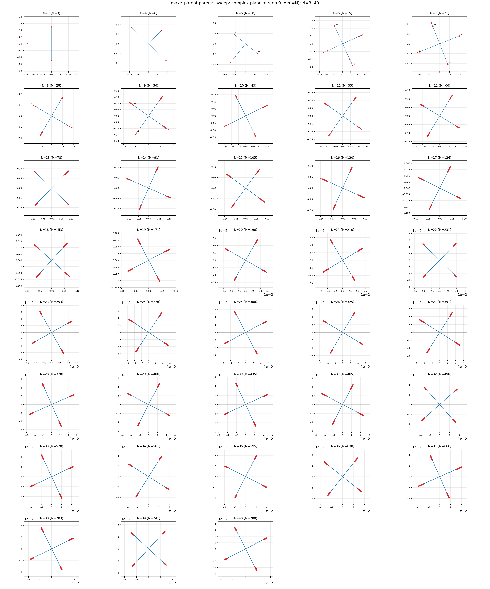

# The Qualification for Ignition Is an Unstable Relative Equilibrium — A Qualification Screening of Three Families of Initial Values for Relational-Wave Closed Systems

**Series:** Foundations of Self-Consistent Relational-Wave Closed Systems (Paper 2 of 10)
**Author:** Noriaki Kihara (WF System Co., Ltd.)　**Date:** 2026-09-12
**Version DOI:** 10.5281/zenodo.22728824
**Concept DOI:** 10.5281/zenodo.22728823
**ORCID:** 0009-0004-6753-4020
**Zenodo:** https://zenodo.org/records/22728824

---

## Abstract

The inflation (Paper 6) and SSB (Paper 5) of relational-wave closed systems start from a specific initial value (floor). We establish, through a controlled experiment that takes the initial value as the control variable, that this initial value is not a "conveniently planted seed." Leaving the physical map unchanged, we substituted only the initial value with three families——(A) symmetric parents with phases $0^\circ/90^\circ$ (equal-amplitude system), (B) zero-centroid parents, (C) high-symmetry theoretical floor (cyclic-Fourier relative equilibrium $z_{ij}=r_d e^{i2\pi(i+j)/N}$)——and ran 500 steps for $N=3,\ldots,40$. Results: (A) is a neutral fixed point for $N\equiv1\ (\mathrm{mod}\,4)$, and for other $N$ it relaxes immediately at step 1 (no ignition); (B) also relaxes immediately with residual $O(1)$; **only (C) has the step-1 jump vanish in all 38 systems, igniting via an exponential ramp from the floor** (onset $65$–$421$ for $N=4$–$17$; for $N\ge18$ a slow ramp is in progress; $N=3$ is a neutral floor). **The qualification for ignition is "an unstable relative equilibrium (a self-consistent eigenmode $H(z)z=\lambda z$, residual at machine precision)"; high symmetry, zero centroid, and square-closure are not qualifications.** The failures of (A)(B) are established as arising not from "being highly symmetric" but from "not having been a relative equilibrium." The floor data used by Papers 5, 6, and 7 is the make_parent eigenmode floor (Experiment 13) that satisfies this qualification. Classification: hypothesis → refutation → established (controlled experiment).

---

## 1. The Problem——A Response to "the Conveniently Planted Seed"

If the floor were conveniently chosen for the result, the very rapid expansion of this system would be suspect. Therefore we need to disentangle, through a controlled experiment that takes the initial value as the sole control variable, **which of the properties of the initial value determines ignition**. The candidate "seemingly good properties" are high symmetry, zero centroid, square-closure $\sum z^2=0$, and relative equilibrium (fixed point). This paper separates these to identify the qualification.

## 2. The Dynamics and the Qualification of Relative Equilibrium

The map is the one_step $z\to\exp(\Delta\tau K)z$, $K_{ef}=A_{ef}\sin(\varphi_f-\varphi_e)$, $\Delta\tau=2\pi/N$ of the canonical source `run_N3_N40_stage123_v1.py` (SHA256 `1abf2353…`) (Paper 1 §2). For the floor to be a relative equilibrium that "stays at rest when placed" means that $z$ is a self-consistent eigenmode $H(z)z=\lambda z$ ($H=iK$) of the generator. If it is a relative equilibrium, no immediate jump occurs at step 1, and if the equilibrium is **unstable**, the infinitesimal component is amplified exponentially and ignites (Paper 6). **We define the qualification for ignition as follows: the floor is a relative equilibrium (a self-consistent eigenmode) and possesses a linearly unstable direction (the floor Jacobian has $\lambda_{\max}>0$, or a positive exponential growth rate is measured).** This is a **separate concept** from "whether the onset threshold was crossed within the observation time (500 steps in this experiment)"; even with the qualification, if the clock is slow, it can remain uncrossed within the observation window (the $N\ge18$ of §4). The qualification is established up to the point of departure from the floor (exponential amplification of the unstable direction); whether it locks at the terminus is a separate dynamical fact (Paper 5). The run changes only PARENT_DIR/OUT of the physical canonical source (with SHA match confirmed, the physical equations unchanged); the decision rules are not put into the dynamics but only into post-run analysis.

## 3. The Three Families of Initial Values Plus the Data Floor

| Family | Phase | Amplitude | Centroid $\sum z$ | Square-closure | Relative equilibrium? |
|---|---|---|---|---|---|
| (A) Symmetric parent v2 | $0^\circ/90^\circ$ only | Family-unified (even $M$ equal-amplitude / odd $M$ 2-valued) | Largest-class $\sqrt{M/2}$ | $\approx0$ | Only $N\equiv1\,(4)$ (neutral) |
| (B) Zero-centroid v3 | 4-position ± pairs/trios | — | Exactly zero | $\approx0$ | No (residual $O(1)$) |
| (C) High-symmetry theoretical floor | $2\pi(i+j)/N$ (cyclic Fourier) | Distance-class constant $r_d$ | $\le2.0\times10^{-15}$ | $\le3.1\times10^{-16}$ | **Yes** (residual $4.1\text{e-}16$–$4.8\text{e-}14$) |
| Data floor make_parent | $0/90$ lattice (Z4 residual $\le2\text{e-}12$) | Per-edge (self-consistent adjustment) | Nonzero $0.25$–$1.41$ | $\approx0$ ($P_A=P_B$) | **Yes** (residual $\sim10^{-13}$) |

(A) becomes an exact relative equilibrium ($\sigma=N-1$) only for two-axis equal amplitude with $n_A=n_B$ (the $(N-1)/2$-regular graph of $N\equiv1\ \mathrm{mod}\,4$), because $P_A=n_A r^2=P_B=n_B r^2$ is required for closure; otherwise it is not a fixed point. The generation of (C) follows a derivation procedure (fix phases → contract distance classes → eigenvalue problem → full-space verification) and does not use make_parent.

## 4. Results of the Qualification Screening (Experiment 12, Experiment 13)

- **(A) Symmetric parent v2 is NG**: only $N=3$ ramps (gauge-identical to the old make_parent floor), $N\equiv1\ \mathrm{mod}\,4$ is a neutral fixed point at the floor (no ignition), and for other $N$ it **relaxes immediately** at step 1 to $f(1)=7.5\times10^{-4}$–$2.7\times10^{-2}$ with no linear phase. Decomposition: $\sum z^2$ held, but the cross-term channel was empty (all waves $ab\equiv0$) and the centroid was largest-class.
- **(B) Zero-centroid v3 is also NG** (trial runs $N=3$–$6$): even satisfying the 4 conditions (phase, zero centroid, square-closure, normalization) exactly, because it is not a relative equilibrium (residual $O(1)$) it relaxes immediately at step 1 to $0.15$–$0.52$.
- **(C) The high-symmetry theoretical floor is OK**: the immediate jump at step 1 **vanishes in all 38 systems** ($f(1)=5\times10^{-32}$–$8\times10^{-31}$). $N=4$–$17$ ignites via an exponential ramp from the floor (onset $>0.05$ is $65$ ($N=4$)–$421$ ($N=17$)), and the amplification rate of $N=4$, $0.470\ \log_{10}/\text{step}$, nearly matches the old floor's $0.475$ and the saturation $1/6$ also matches. $N\ge18$ has a positive amplification rate ($0.060$–$0.015\ \log_{10}/\text{step}$, monotonically decreasing) with the 500 steps running out while the ramp is in progress = **unstable in all systems (qualified for ignition), only the clock is slow with increasing $N$**. $N=3$ is a neutral floor ($\lambda=-3/2$, consistent with the $N=3$ final-state lock value). $H_{\rm total}=1.000000$ (unitary conservation), global closure maximum $\sim10^{-13}$.

## 5. Established——The Qualification Is an "Unstable Relative Equilibrium"

The hypothesis (that one of zero centroid / square-closure / high symmetry is the qualification for ignition) is refuted:

- **Zero centroid is not a qualification**: (B) does not ignite even with the centroid exactly zero. On the other hand, the data floor make_parent ignites even with a nonzero centroid ($0.25$–$1.41$). The value of the centroid does not determine the presence or absence of ignition.
- **Square-closure is not a qualification**: (A)(B) do not ignite even with $\sum z^2\approx0$.
- **High symmetry itself is not a qualification**: (A) is the most symmetric but does not ignite.

**Established: the qualification for ignition is solely "an unstable relative equilibrium (a self-consistent eigenmode, residual at machine precision)."** The failures of (A)(B) are not because they are "highly symmetric" but because they "were not relative equilibria." This independently re-confirms, through an initial-value controlled experiment, the "amplification ⟺ unstable relative equilibrium" of the onset-mode discrimination paper [2]. Therefore the floor used by Papers 5 and 6 is not a "seed that conveniently moves" but an unstable starting point determined solely by the map plus the selection criterion "the most symmetric relative equilibrium" (that a self-consistent floor can be built on the 90-degree skeleton is Paper 1 ($D^{-1}KD=iW$ · Perron); the algebraic exact solution of the 90-degree skeleton is Paper 3; the analytical backing for why the floor becomes 90-degree is Paper 0).

From this controlled experiment, initial states are dynamically divided into three onset modes. A state that is not a relative equilibrium relaxes immediately, a stable or neutral relative equilibrium stays at the floor, and only an unstable relative equilibrium departs exponentially after a latency period. (B) is not a relative equilibrium (immediate relaxation), (A) is a relative equilibrium but neutral (stays at the floor), and (C) and make_parent are unstable relative equilibria (exponential ramp after latency)——the three families actually separate this three-way classification. Therefore "ignition" is classified not by the apparent symmetry or closure of the initial value but by the linear stability of the relative equilibrium. **The stability class of the initial state determines the onset mode of the time evolution.**

## 6. The Floor Used by the Paper Data (make_parent Eigenmode Floor)

The run data of Papers 5, 6, 7, and 8 (`full_N3_N40_sweep`) uses a floor obtained by finding the self-consistent eigenmode $v$ through the `make_parent` iteration of the canonical engine (`rng=default_rng(40260722+1000N)`, `iters=1200`, `tol=1e-12`), and setting $Z_0=(v+10^{-15}g)/\|\cdot\|$ ($g$ = the infinitesimal seed of the zero-closure kernel). Structural audit (all 38 systems): Z4 phase residual $\le2.0\times10^{-12}$ rad, $P_{\rm even}=P_{\rm odd}=0.500000$ exactly, Rayleigh residual $\sim10^{-15}$–$10^{-13}$. The $v,g,Z_0$ of $N=40$ are bit-identical to the July canonical static parent (control gate). The step-0 complex plane (all $N=3$–$40$) is shown in Figure 1——it is a 90-degree lattice in which every wave lies on one of two orthogonal axes (a **different member** that algebraically and exactly constructs a self-consistent floor on the 90-degree skeleton——with the same ignition qualification but a different $W$, amplitude, and centroid——is treated in Paper 3. It is not an exact version of the make_parent floor itself, Paper 0).

**Figure 1** The step-0 complex plane of the data floor (make_parent) ($N=3$–$40$).

## 7. Claim Classification and Open Items

- Classification: hypothesis → refutation → established (a controlled experiment taking the initial value as the sole control variable). Decision: the qualification = unstable relative equilibrium (relative equilibrium + linearly unstable direction) is established.
- The qualification and the firing within the observation window are separate (§2): with the (C) theoretical floor, $N=4$–$17$ crossed the onset threshold within 500 steps; $N\ge18$ has a positive amplification rate ($0.060$–$0.015\,\log_{10}/\text{step}$) and is **qualified for ignition = departs from the floor**, but the clock is slow and it is uncrossed within 500 steps; $N=3$ is neutral ($\lambda=-3/2$, unqualified). What this paper establishes is up to this qualification (departure from the floor); **whether or not it locks at the terminus is out of scope and is treated by Paper 5** (with the data floor, the lock of $\Delta_{\rm tail}=-2\pi/N$ · equal amplitude has been confirmed up to $N=64$).
- Open: the moduli of the relative equilibrium (with a different generating measure a different self-consistent fixed point exists; the 90-degree floor is the most symmetric member). The origin of the neutrality of $N=3$ ($\lambda=-3/2$).

## Related work (structural agreement, not the source of derivation)

- Onset-mode discrimination paper (amplification ⟺ unstable relative equilibrium · all 86 states) Concept DOI 10.5281/zenodo.21798854: this paper is its initial-value-controlled version.
- Relative equilibrium (Marsden & Ratiu, geometric mechanics): the floor = a rigid-rotation relative equilibrium.

## References

1. Noriaki Kihara, "The mechanism of inflationary rapid expansion in self-consistent relational-wave closed systems," Concept DOI 10.5281/zenodo.22112008.
2. Noriaki Kihara, "Onset-mode discrimination (amplification and unstable relative equilibrium)," Concept DOI 10.5281/zenodo.21798854.
3. J. E. Marsden and T. S. Ratiu, *Introduction to Mechanics and Symmetry*, Springer (1999).

## Reproduction

Controlled experiment (three families): `対称親v2_500step走行_20260906/` (`make_parents_theoretical_floor_v1.py` = generation of (C), `make_parents_v3_centroid_zero_v1.py` = (B), `wrapper_run_symmetric500_v1.py`, `再実験結果メモ_理論床_N3_N40.md`, `compare_theoretical_floor_vs_old_makeparent.csv`, `theoretical_floor_parent_manifest.json`, `SHA256SUMS.txt`). (A) symmetric parent is in `最も対称性の高い初期値_20260906/`. The data floor make_parent and its structural audit and bit reproduction: `make_parent型初期値_自己無撞着構造_20260907/` (`make_static_parents_N3_N40_v1.py`, `audit_parent_structure_N3_N40_v1.py`, `full_N3_N40_sweep/`). The run changes only PARENT_DIR/OUT of the physical canonical source `run_N3_N40_stage123_v1.py` (SHA256 `1abf2353fee2e4f56f05e7a6f149fd086885136beb61ab571b48a56b09691567`), with the physical equations unchanged. * The data npz files are saved in each folder due to size (regenerable with SHA256SUMS + run_all.sh).
