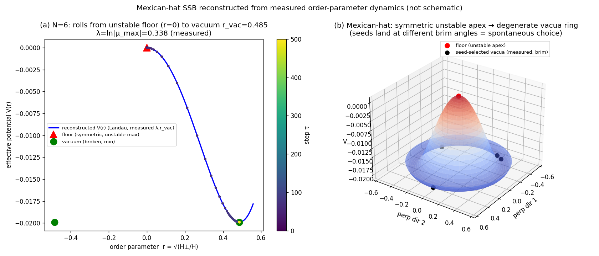
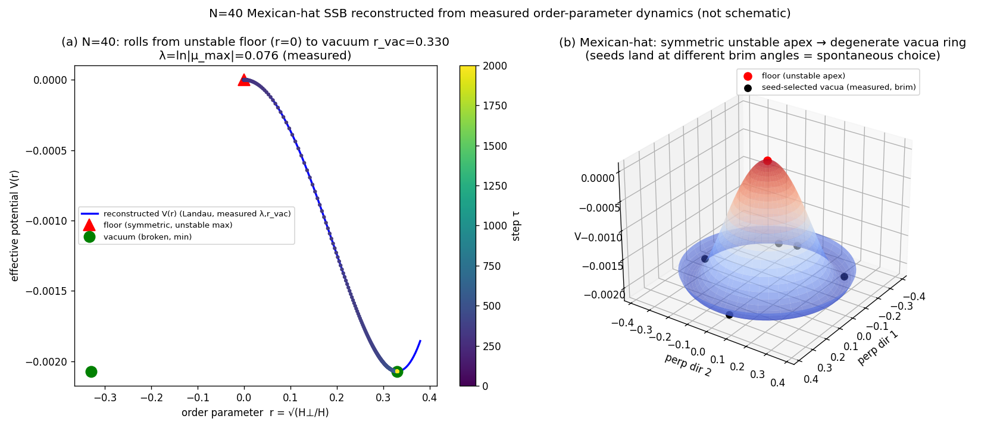
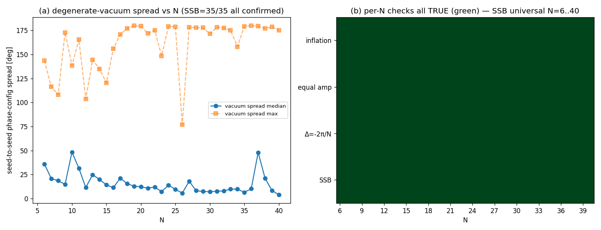

# Spontaneous Symmetry Breaking and Degenerate Vacua from the 90-Degree Floor——Symmetry Breaking by an Infinitesimal Seed and the $\Delta=-2\pi/N$ Lock ($N=6,\ldots,40$, all cases)

**Series:** Foundations of Self-Consistent Relational-Wave Closed Systems (Paper 5 of 10)
**Author:** Noriaki Kihara (WF System Co., Ltd.)　**Date:** 2026-09-12
**Version DOI:** 10.5281/zenodo.22729089
**Concept DOI:** 10.5281/zenodo.22729088
**ORCID:** 0009-0004-6753-4020
**Zenodo:** https://zenodo.org/records/22729089

---

## Abstract

The 90-degree floor is a self-consistent unstable relative equilibrium with a 90° phase skeleton (Papers 1 and 2). When the same floor $Z_0$ is given an infinitesimal seed of amplitude $10^{-8}$ pointing in **different directions** and run with the exact one_step, the symmetry breaks, and after exponential inflation (Paper 6) the system locks onto an equal-amplitude, phase-dispersed, tilted relative equilibrium (one of the degenerate vacua). In all 35 cases $N=6,\ldots,40$, every seed triggers inflation and locks onto an **isomorphic equilibrium** with a 1-step rotation angle that is exactly $\Delta=-2\pi/N$ (error $\sim10^{-5}$) and equal amplitude (ratio $\to1$, $\sim10^{-3}$), while the phase configuration (the direction of the vacuum) differs depending on the seed (vacuum difference: median $4.0^\circ$–$48.4^\circ$, maximum $76.9^\circ$–$180^\circ$). That is, from a symmetric, unstable floor, an infinitesimal seed **spontaneously selects** one of the degenerate vacua. This is spontaneous symmetry breaking on a discrete map (Mexican-hat type). From the measured dynamics of the order parameter $r=\sqrt{H_\perp/H}$, a Landau-type effective potential $V(r)$ can be reconstructed with measured parameters ($N=6{:}\lambda=0.338,r_{\rm vac}=0.485$／$N=40{:}\lambda=0.076,r_{\rm vac}=0.330$; ansatz). Large $N$ that were unlocked at 500 steps all lock within 2000 steps ($N=22$ at step $663$, $N=40$ at step $1299$). Classification: empirical support for a new hypothesis (the SSB picture; exhaustive verification).

---

## 1. Problem

In Paper 1 the 90-degree floor was established as "an unstable relative equilibrium in which the amplitude-driving $\sin(2\Delta\varphi)$ vanishes individually for every term (90° phase skeleton)", and in Paper 2 as "the qualification for ignition = an unstable relative equilibrium". This paper investigates what that instability concretely produces——**what an infinitesimal seed selects**——for all $N$, and reads it as Mexican-hat-type SSB.

## 2. Dynamics and the seed (control experiment)

The map is the canonical one_step (Paper 1 §2, SHA `1abf2353…`). The floor $Z_0$ is step0 of `full_N3_N40_sweep` (the make_parent eigenmode floor, Paper 2 §6). The only control variable is the initial seed (no change to the physical equations; the decision rules are not put into the dynamics but applied in post-run analysis): for each $N$ we give $Z_0+10^{-8}(\xi+i\eta)$ ($\xi,\eta$ random, normalized) in 5 different directions, and run until adaptive stopping (equal amplitude and gauge-invariant relative-phase rate of change below threshold, upper limit 2600 steps). In the final state of each seed we measure lock_step, $H_\perp/H$, amplitude ratio, $\Delta$ (1-step rotation angle), $|\Delta+2\pi/N|$, and the inter-seed difference of the relative-phase configuration.

## 3. Mechanism——Mexican-hat-type SSB

The 90-degree floor = the 90° skeleton unstable relative equilibrium (schematically, the summit of the sombrero); the valley = the family of degenerate relative equilibria (equal amplitude, phase dispersion, tilted equilibria; sharing the common invariants $\Delta=-2\pi/N$ and equal amplitude). An infinitesimal seed breaks the symmetry and rolls the system down an unstable eigendirection (inflation, Paper 6), locking onto a single point in the valley——from an unstable symmetric maximum it spontaneously selects one of the degenerate lower equilibria. We confirmed for $N=6$ that the valley (the degenerate vacuum manifold) is not a finite discrete map-symmetry orbit but a **continuous moduli of tilted relative equilibria** (the 5 final states do not map onto one another under any of the $6!=720$ vertex permutations plus a global phase plus complex conjugation: `頂点置換による縮退真空同定_N6_20260913/`). This is consistent with the fact that the valley of a Mexican-hat is intrinsically a continuous degenerate manifold (this is not the claim that the valley forms a single discrete symmetry orbit). From the measurement of the order parameter $r=\sqrt{H_\perp/H}$ ($H_\perp$ = the energy of the component orthogonal to the floor plane), a Landau-type

$$V(r)=-\tfrac12\lambda r^2+\frac{\lambda}{4\,r_{\rm vac}^2}r^4,\qquad \lambda=\ln|\mu_{\max}|,\ r_{\rm vac}=\sqrt{H_\perp/H|_{\rm sat}}$$

can be reconstructed ($N=6{:}\lambda=0.338,r_{\rm vac}=0.485$／$N=40{:}\lambda=0.076,r_{\rm vac}=0.330$). This is an **effective description (ansatz)** in which the coefficients are identified from measured quantities. A first-principles derivation of $V(r)$ is left as future work. $r=\sqrt{H_\perp/H}$ is one scalar coordinate representing the amount of departure from the floor, and the Mexican-hat in the figures is a **schematic visualization** of the SSB configuration; it does not mean that $r$ is an exact radial coordinate common to all degenerate vacua (in fact $H_\perp/H$ differs from vacuum to vacuum, $0.19$–$0.38$, §7). Here "vacuum" is a mathematical designation for the degenerate minima of the effective potential; the physical characterization of the vacuum is left as future work. Note that $\lambda=\ln|\mu_{\max}|$ ($\mu_{\max}$ = the spectral radius of the floor Jacobian, a quantity distinct from the $\mu$ of $iK$) is itself the inflation amplification rate of Paper 6, so **the curvature of the SSB potential = the amplification rate of inflation** are tied together by the same $\mu_{\max}$.

**Figures 1 and 2** Mexican-hat-type SSB (measured reconstruction, $N=6$／$N=40$).

## 4. Decisive verification (same floor + different seeds → degenerate vacua, $N=6$)

Final states obtained by giving the $N=6$ floor seeds of amplitude $10^{-8}$ pointing in different directions: every seed locks onto an **isomorphic equilibrium** with $\Delta=-1.047198=-2\pi/6$ ($|\Delta+2\pi/N|\le4.3\times10^{-7}$) and amplitude ratio $1.0000$–$1.0006$. Meanwhile, the inter-seed difference in the direction of the vacuum (the relative-phase configuration) **differs**, from median $1.6^\circ$ (seed1 vs 0) to $112.7^\circ$ (seed5 vs 0). The invariants ($\Delta=-2\pi/N$, equal amplitude) are common to the vacua, while the broken degree of freedom (the direction of the phase configuration) is selected by the seed.

**Figure 3** SSB degenerate vacua (real data, $N=6$).

## 5. Exhaustive verification ($N=6,\ldots,40$, 35/35)

For all 35 cases $N=6$–$40$ (5 differently-directed seeds per $N$ = $35\times5=175$ runs in total), all three SSB conditions hold (batch summary `ssb_batch_summary.csv`):

- **Every seed triggers inflation** (clear departure from the floor, `onset_ok=True` for all 35).
- **All equal amplitude** (amplitude ratio $<1.01$, `all_equal_amp=True` for all 35) and **the 1-step rotation angle is exactly $\Delta=-2\pi/N$** (`all_lock_2piN=True` for all 35, $|\Delta+2\pi/N|<10^{-3}$).
- **The phase configuration (the direction of the vacuum) differs depending on the seed**: vacuum difference median $4.0^\circ$ ($N=40$)–$48.4^\circ$ ($N=10$), maximum $76.9^\circ$ ($N=26$)–$180.0^\circ$.

That is, from an unstable floor, an infinitesimal seed spontaneously selects one of the degenerate vacua permitted by the symmetry of the map (SSB confirmed in 35/35).

**Figure 4** SSB over all $N=6$–$40$ (35/35).

## 6. Long-time verification ($N=22,40$, 2000 steps)

The large $N$ ($N=22,30,\ldots,40$) that were unlocked at 500 steps were so because of truncation; running without stopping up to 2000 steps, they all lock. $N=22$ locks completely at step $663$ and $N=40$ at step $1299$ ($\Delta_{\rm tail}$ exactly $-2\pi/N$, equal-amplitude ratio $1.0000$, rigid-rotation residual of floor/tail at machine zero). A control test confirmed that the initial value bit-matches the old run at step0 (step1 difference $\sim10^{-16}$, after which inflation exponentially amplifies), ensuring faithful reproduction.

## 7. Claim classification and open items

- Classification: empirical support for a new hypothesis (the SSB picture; exhaustive verification). Verdict: retained.
- Assertion: this system exhibits spontaneous symmetry breaking (the configuration——the 90° skeleton unstable relative equilibrium → the family of degenerate lower equilibria → spontaneous selection by an infinitesimal seed → all vacua isomorphic with $\Delta=-2\pi/N$ and equal amplitude——holds to machine precision, 35/35. The Mexican-hat is a schematic effective model, §3). **The key point is that from the same 90° floor, the terminal surface (the direction of the vacuum) is not uniquely determined but depends on the seed.**
- Structure of the vacuum manifold (the valley): the 5 final states of $N=6$ do not map onto one another under any of the $6!=720$ vertex permutations plus a global phase (plus complex conjugation) (minimum residual $0.05$–$0.83$). Hence the valley is not a finite discrete map-symmetry orbit but a **continuous moduli of tilted relative equilibria** ($H_\perp/H=0.19$–$0.38$ is continuous). This is consistent with the fact that the valley of a Mexican-hat is intrinsically a continuous degenerate manifold, and does not negate SSB. Identifying the dimension and metric of the moduli is left as future work.
- A detailed classification of the symmetry group is outside the scope of this paper. The invariants are $\Delta=-2\pi/N$ and equal amplitude; what changes with the seed is the direction of the vacuum (tilt $H_\perp/H$ is $0.19$–$0.38$, $N=6$). "Vacuum" is a mathematical designation for the degenerate minima of the effective potential; the physical vacuum is uncharacterized. $V(r)$ is an ansatz.

## Related work (structural agreement, not the source of derivation)

- Spontaneous symmetry breaking / Landau theory / Goldstone・Higgs (Landau 1937; Goldstone 1961; Anderson 1963; Higgs 1964): this section is one example of SSB on a discrete map, and the reconstructed effective potential is a Ginzburg–Landau-type sombrero.
- Kuramoto model (synchronization): lock = synchronization.

## References

1. Noriaki Kihara, "The mechanism of inflationary rapid expansion in self-consistent relational-wave closed systems", Concept DOI 10.5281/zenodo.22112008.
2. L. D. Landau, "On the theory of phase transitions", 1937; J. Goldstone, Nuovo Cimento 19 (1961) 154; P. W. Anderson, Phys. Rev. 130 (1963) 439; P. W. Higgs, Phys. Rev. Lett. 13 (1964) 508.
3. Y. Kuramoto, *Chemical Oscillations, Waves, and Turbulence*, Springer (1984).

## Reproduction

The verification scripts, figures, and summaries are in `位相ロック全N確認_相対平衡_20260912/自発的対称性の破れ_シード依存縮退真空_20260912/` (`verify_ssb_seed_vacua_20260912.py`, `make_figure_ssb.py`, `make_figure_mexican_hat.py`/`_N40.py`, `REPORT.md`, `SHA256SUMS.txt`, `run_all.sh`), and under it `全N6_40_SSBバッチ_20260912/` (`run_ssb_batch_N6_N40_20260912.py`, `per_N/N{6..40}.txt`, `ssb_batch_summary.csv`, `fig_ssb_batch_allN.png`). The long-time runs are `N22_2000step検証走行_20260912/` and `N40_2000step検証走行_20260912/`. The decisive $N=6$ test that the vacuum manifold is a continuous moduli (not a finite discrete symmetry orbit) is `頂点置換による縮退真空同定_N6_20260913/` (`verify_vacua_permutation_orbit_N6_20260913.py` = imports the canonical one_step with SHA verification, a read-only exhaustive $S_6$ sweep). The floor data is the make_parent floor (Paper 2 §6). The runs are identical to the canonical `run_N3_N40_stage123_v1.py` (SHA256 `1abf2353fee2e4f56f05e7a6f149fd086885136beb61ab571b48a56b09691567`), with only the initial seed controlled.
