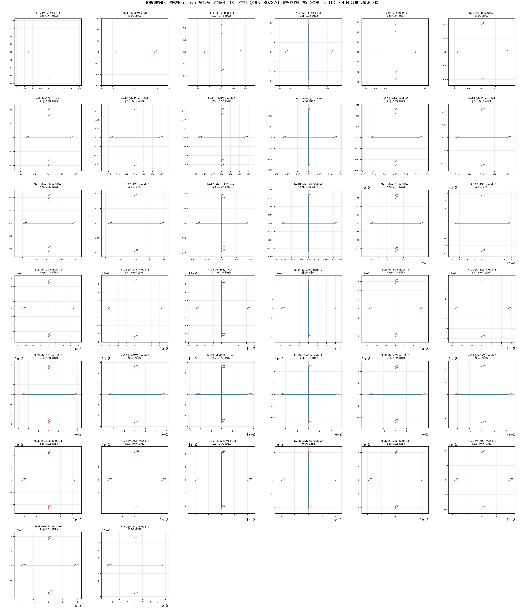
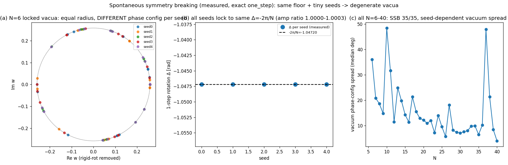
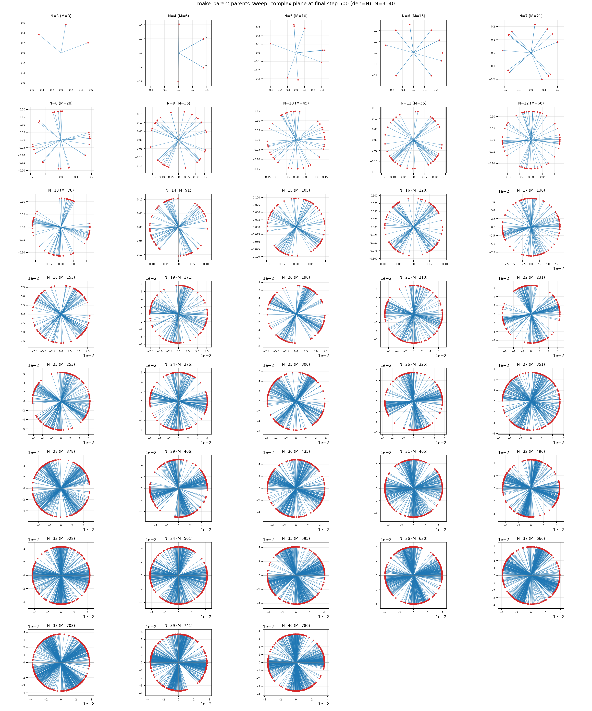
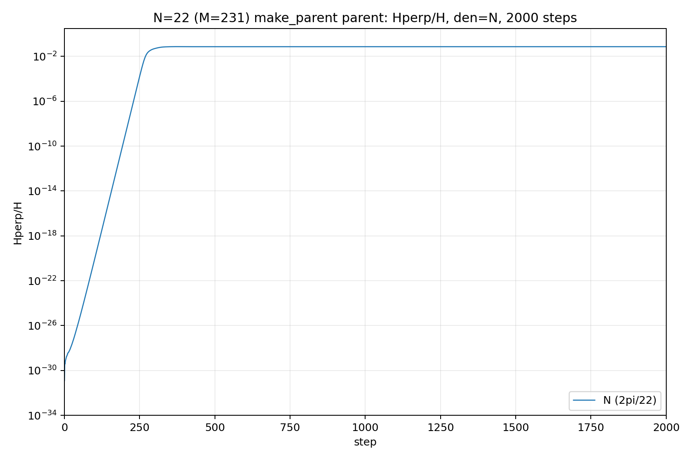
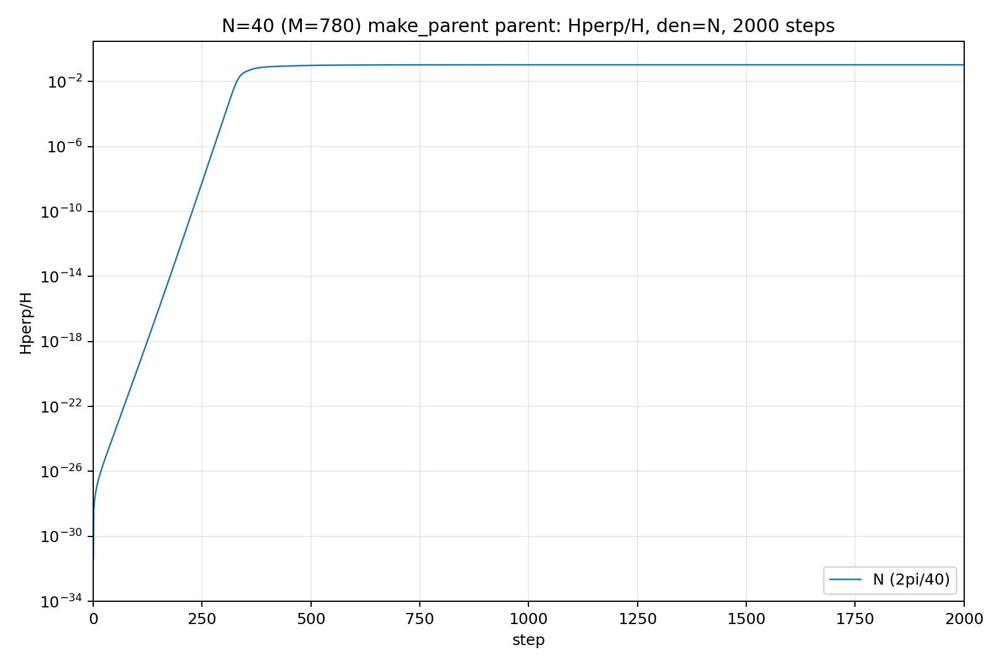
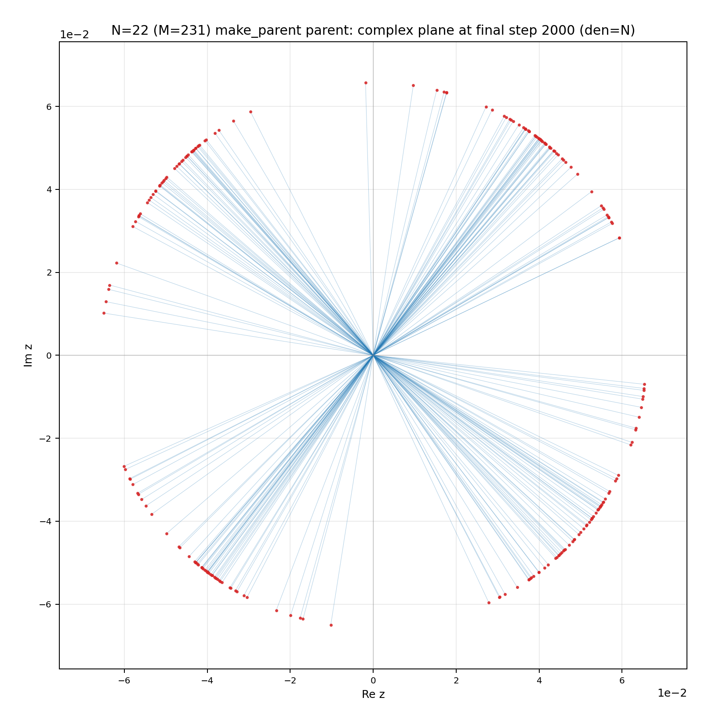
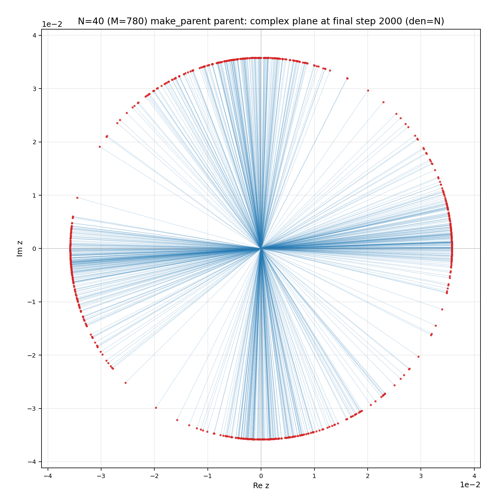

# 自己無撞着な関係波閉鎖系の力学——90°相対平衡の局所不安定性からインフレーション、自発的対称性の破れ、Grassmann 幾何、終端普遍性・関係主義まで

**シリーズ:** 自己無撞着な関係波閉鎖系の基礎（論文0＝総括／全10本）
**著者:** 木原 範昭（WF System Co., Ltd.）　**日付:** 2026-09-12
**Version DOI:** （取得後記入・本シリーズ最後に取得）
**Concept DOI:** （取得後記入）
**ORCID:** 0009-0004-6753-4020

---

## 要旨

先行研究（自己無撞着な関係波閉鎖系におけるインフレーション的急拡大の機構, Concept DOI 10.5281/zenodo.22112008）で定義した力学——完全グラフ $K_N$ の各辺に複素関係波 $z_e$ を置き、位相のみの実反対称生成子 $K_{ef}=A_{ef}\sin(\varphi_f-\varphi_e)$（$A$ は辺グラフ $L(K_N)$ の隣接）で回す実直交写像 $z\to\exp(\Delta\tau K)z$（$\Delta\tau=2\pi/N$）——について、本総括は9本の基礎論文（論文1〜9）を**一つの因果連鎖**として確定する：

$$\text{写像}\ \to\ \text{90°自己無撞着相対平衡（床）}\ \to\ \text{点火資格＝床の局所不安定性}\ \to\ \textbf{インフレーション的急拡大}\ \to\ \text{SSB・面の再配向}\ \to\ \text{終端の振幅普遍化}\ \to\ \text{関係的不変量だけが残る}.$$

**中心命題**：自己無撞着な90°相対平衡の局所不安定性が、**インフレーション的急拡大**（床平面外成分 $H_\perp/H$ の指数増大）・自発的対称性の破れ・面の再配向を生み、非線形飽和後には各波の振幅を $\sqrt{H/M}$ へ普遍化しながら、関係的な位相・幾何情報だけを残す。急拡大の**機構**は床の線形不安定であり、その**実増幅率**は実軌道上の時変接線コサイクルの有限時間 Lyapunov 率で精密化される（現象＝インフレーション、機構＝線形不安定＋時変接線コサイクル）。

連鎖の各段：(1) 単一波の運動方程式を厳密導出（蔵本型位相結合・振幅は第2高調波 $\sin2\Delta\varphi$ 駆動、論文1）。(2) 90°骨格では $D^{-1}KD=iW$（$D=\operatorname{diag}(e^{i\varphi_e})$、$W$ 実対称非負）で床の複素自己無撞着問題は実対称 $W$ の Perron 問題と厳密同値、正振幅床が一意に存在し、parity 二部構造から $\sigma^2$・各辺振幅²・全スペクトルが**任意 $N$** の閉形式で書け活動次元は $O(N)$（論文1・3）。(3) 点火の資格は「不安定な相対平衡」だけで、高対称・重心ゼロ・二乗閉塞は資格でない（論文2）。(4) **巡回Fourier高対称床では**零閉塞の因数分解が $L=N/\gcd(N,4)$・$p=\operatorname{spf}(L)$ の**離散 block size** に量子化され、$p=2\iff 8\mid N$（$\nu_2(N)\ge3$）は二乗写像の2進選択則（論文4）。(5) 微小シードが対称性を破って**インフレーション的急拡大**を起こす。床ヤコビアンの初期・凍結率 $\lambda_0=\ln\rho_0$（$\rho_0=\rho(J_0)$、$=$ Landau 頂上曲率 $V''(0)=-\lambda_0$）で始まり、その**実増幅率は実軌道上の接線コサイクル $\Phi(t,0)=\prod_t J(z_t)$ の有限時間 Lyapunov 率 $\gamma_t$**（$N=6,8,10$ では $\gamma_t>\lambda_0$）である（論文5・6）。(6) 状態は各瞬間 rank 2 の平面 $P(t)$（$\Pi_{t+1}=Q_t\Pi_tQ_t^{\mathsf T}$）で、$H_\perp/H=\tfrac14\|\Pi_t-\Pi_0\|_F^2$——インフレは $\mathrm{Gr}(2,M)$ 上の初期面からの指数的離脱、終端面は元の面と2つの非零主角で4次元を張る（累積写像は $SO(4)$ でない、論文7）。(7) 終端は等振幅 $a_\infty=\sqrt{H/M}$（示量 $(H,M)$／示強 $\rho=H/M$ の状態量）・$\Delta_{\rm tail}=-2\pi/N$ に普遍化する（論文5・8）。**縮退真空族**は $S_N$＋大域位相＋共役の有限離散軌道としては同定できず（$N=6$ の5終状態が互いに写らないことを確認）、向きはシード依存である（35個の $N$ ×5シード＝175走行すべてで SSB 確認）。有限離散軌道でないことは確定、連続性・より大きな連続対称群の同定は未決（論文5）。(8) 波は無名（$S_N$ ゲージ）で、閉塞単独では離散種を生まず（$\mathcal C_k\simeq Q_{k-2}/S_k$、$k\ge3$ 連続）、離散なのは床が量子化する block size $p$、物理的内容は関係的不変量に宿る（論文9）。

これらは三本の統合軸に整理される：**A. 不安定性の一本化**——点火資格・SSB頂上曲率・インフレ増幅・Grassmann 離脱は一つの局所不安定性 $\rho(J_0)>1$ から始まり、接線コサイクルがその後の実増幅を担う。**B. 記憶と消去**——過渡は初期構造を $J_0,\Phi(t,0)$ に記憶するが、終端振幅は $H/M$ だけを残して構成を忘れ、位相配置・面方向にはSSB履歴が残る（履歴情報の選択的消去）。**C. 関係主義**——絶対波番号も絶対法線も読めず、物理的内容は $S_N$・大域位相・座標回転を除いた関係的不変量にのみ宿る。

なお本論で用いる「インフレーション」「真空」「自発的対称性の破れ」は、本力学系の数学的特徴に対する呼称であり、宇宙論・素粒子物理との実体的対応は §9 の通り未決である。

本総括は9本の基礎論文（論文1〜9）の上に立つ。射程は90°骨格を持つ自己無撞着な単一コヒーレント相対平衡とその微小異方摂動に限られ、座標の同定（$xyzt$ か $R,Q$ を含むか）、ゲージの型（等間隔／対数／巻数）、多粒子・真空そのものの理解には踏み込まない。これらは明示的に未決として記す（§9）。

---

## 1. はじめに

本研究シリーズは、$N$ 個の存在の全二体関係 $M=N(N-1)/2$ を複素関係波 $z_e\in\mathbb C$ とし、外部seedを除去した閉鎖系の力学を数値的に調べてきた。波は完全グラフ $K_N$ の辺に住み、相互作用は頂点を共有する辺どうしの位相差だけで決まる。先行論文［1］はこの系のインフレーション的急拡大（親平面外成分 $H_\perp/H$ の指数増大、rank-4 的読出し、準安定構造への移行）を報告したが、**なぜ一つの関係波がその軌道を取るか**を運動方程式のレベルでは示していなかった。本総括はその一点を出発点に、初期値（90°床）の必然性・資格・厳密解、急拡大＝自発的対称性の破れという読み、ロック後の Grassmann 幾何、終端の振幅普遍化と関係主義までを一つの因果連鎖として確定する。

本総括の骨格は、論文1〜9 を貫く**一本の因果連鎖**である（論文4・8・9 は補助でなく連鎖の本体）。

- **(a) 動力学**（§2・論文1）：各辺波は頂点共有の隣接辺と蔵本型に結合し、位相は $\sin^2$ で単調前進、振幅は第2高調波 $\sin(2\Delta\varphi)$ で増減する。
- **(b) 床＝90°自己無撞着相対平衡とその厳密解**（§3・§4・論文1・3）：振幅を termwise に凍らせる最大対称な相対平衡は90°格子に限られる（make_parent が到達した termwise 床が90°格子になる解析的理由。なぜ反復がその termwise 分枝を選ぶかは未決、§4）。90°骨格では $D^{-1}KD=iW$ で床は実対称 $W$ の Perron 問題と厳密同値、parity 二部構造から $\sigma^2$・振幅²・全スペクトルが**任意 $N$** の閉形式、活動次元は $O(N)$。
- **(c) 点火資格と零閉塞の量子化**（§3.4・§3.5・論文2・4）：点火の資格は「不安定な相対平衡」だけ（高対称・重心ゼロ・二乗閉塞は資格でない）。零閉塞 $\sum z^2=0$ 単独では連続モジュライだが、巡回Fourier高対称床の離散対称性が block size $p=\operatorname{spf}(N/\gcd(N,4))$ に量子化する（$p=2\iff 8\mid N$）。
- **(d) インフレーション的急拡大——局所不安定性から接線コサイクルへ**（§5・§6・論文5・6）：微小シードが対称性を破り、床平面外成分 $H_\perp/H$ が指数増大する（**インフレーション**）。急拡大は床ヤコビアンの初期・凍結率 $\lambda_0=\ln\rho_0$（$\rho_0=\rho(J_0)$、$=$ Landau 頂上曲率 $V''(0)=-\lambda_0$）で始まり、その**実増幅率は実軌道上の接線コサイクル $\Phi(t,0)=\prod_t J(z_t)$ の有限時間 Lyapunov 率 $\gamma_t$**へ昇格する（$N=6,8,10$ で $\gamma_t>\lambda_0$）。
- **(e) 幾何——Grassmann 上の指数的離脱**（§7・論文7）：状態は各瞬間 rank 2 の平面 $P(t)$（$\Pi_{t+1}=Q_t\Pi_tQ_t^{\mathsf T}$）で、$H_\perp/H=\tfrac14\|\Pi_t-\Pi_0\|_F^2$ ゆえインフレは $\mathrm{Gr}(2,M)$ 上の初期面からの指数的離脱、終端面は2つの非零主角で4次元を張る（累積写像は $SO(4)$ でない）。
- **(f) 終端の普遍化と関係主義**（§8・論文5・8・9）：終端は等振幅 $a_\infty=\sqrt{H/M}$（示強的終端状態量）に普遍化して構成を忘れる一方、位相配置・面方向にはSSB履歴が残る（記憶の選択的消去）。波は無名（$S_N$ ゲージ）で、物理的内容は関係的不変量にのみ宿る。

これら (a)–(f) は三本の統合軸に集約される：**A. 不安定性の一本化**（点火資格・SSB頂上曲率・インフレ増幅・Grassmann 離脱は一つの局所不安定性 $\rho(J_0)>1$ から始まり、接線コサイクルが実増幅を担う）、**B. 記憶と消去**（過渡は初期構造を記憶、終端振幅は忘れ、位相・幾何は履歴を保持）、**C. 関係主義**（絶対波番号も絶対法線も読めず、関係的不変量のみが物理）。

本論文で導入・使用するのは、先行論文で定義された力学（§2）ただ一つである。零閉塞や特定の振幅分布は前提とせず、導出される。各節は主張と要点の数式・図を本総括内に持ち、詳細な導出・全数データ・追加図・再現手順は対応する基礎論文（論文1〜9、Concept DOI は補遺A）に委ねる。「濃さ」はこの総括が9本を一つの連鎖として統合する点にあり、生データの重複ではない。

## 2. 力学と単一波の運動方程式

### 2.1 写像

先行論文の one_step は次で与えられる。$A$ を $K_N$ の辺グラフ $L(K_N)$ の隣接行列（辺 $e,f$ が頂点を共有すれば $A_{ef}=1$）、$\varphi_e=\arg z_e$ とし、
$$K_{ef}=A_{ef}\sin(\varphi_f-\varphi_e)$$
は実反対称行列（成分は位相差の正弦のみ、振幅 $|z_e|$ を含まない）である。one_step は
$$z_{n+1}=\exp(\Delta\tau\,K)\,z_n,\qquad \Delta\tau=\frac{2\pi}{\mathrm{den}}=\frac{2\pi}{N}$$
であり、$\exp(\Delta\tau K)$ は実直交行列である。実部・虚部に同一の直交行列が作用するため、総ノルム $\|z\|^2$ と二乗閉塞 $z^{\mathsf T}z=\sum_e z_e^2$ は厳密保存される。

**検証** $\exp(\Delta\tau K(\varphi_n))z_n$ が正本軌道 $z_{n+1}$ を再現する誤差は最大 $3\times10^{-15}$（$N=6,22,40$、$\le300$ step）で、$K$ がまさに生成子であることを確認した（論文1）。

### 2.2 単一波の運動方程式

生成子の流れ $dz/d\tau=Kz$ を成分で書き、$z_e=r_e e^{i\varphi_e}$ と分解する。$\sum_f A_{ef}\sin(\varphi_f-\varphi_e)r_f e^{i(\varphi_f-\varphi_e)}$ の実部・虚部から、隣接辺 $f\sim e$ について
$$\boxed{\ \frac{dr_e}{d\tau}=\frac12\sum_{f\sim e}r_f\,\sin\!\big(2(\varphi_f-\varphi_e)\big)\ }\tag{振幅}$$
$$\boxed{\ r_e\,\frac{d\varphi_e}{d\tau}=\sum_{f\sim e}r_f\,\sin^2(\varphi_f-\varphi_e)\ }\tag{位相}$$
を得る。各辺波は頂点共有の隣接辺とのみ、位相差の正弦で結合する蔵本型振動子である。$\sin^2\ge0$ より位相は単調前進（＝回転）し、その波間差が剛体回転を除いた位相変位を与える。振幅の増減は第2高調波 $\sin(2\Delta\varphi)$ が駆動する。剛体回転を除いた枠では、振幅の再配置が位相場の再配向（歳差）として現れ、これがインフレーション期に面が傾く動力学的実体である（§7）。

**検証** 微小サブステップ $(\exp(\varepsilon K)z-z)/\varepsilon$ の振幅・位相成分は上式と最大 $10^{-6}$（$\varepsilon$ スケール差分の丸め由来）で一致する（$N=6,22,40$、論文1）。

**図1** 単一波運動方程式の検証（N=6、詳細は論文1）。左：振幅、右：位相。実測（縦軸）と導出式（横軸）が $y=x$ 上に載る。

## 3. 高対称床の導出——課した条件は写像＋最大対称性の選択基準

初期値（床）が結果に都合よく選ばれていないことを、写像に「相対平衡かつ最大対称」という選択基準を課すだけの導出として示す（それ以外の入力はない）。この主張は初期値制御実験（論文2）と代数的厳密解（論文3）で二重に裏付けられる。

### 3.1 相対平衡の条件

床は剛体回転する相対平衡、すなわち振幅凍結 $dr_e/d\tau=0$（$\forall e$）かつ位相速度が全 $e$ で一様、を満たす。振幅方程式から前者は
$$\sum_{f\sim e}r_f\,\sin\!\big(2(\varphi_f-\varphi_e)\big)=0\qquad(\forall e)\tag{3.1}$$
を必要条件として与える（位相一様性は §3.3 で床を $iK$ の固有モードに取ると $z(t)=e^{-i\mu\tau}z_0$ となり自動的に満たされる）。

### 3.2 90°格子は最大対称な相対平衡として強制される

(3.1) の実現には二種がある。（i）各項が個別に零（termwise）、（ii）個別項は非零だが和が相殺（cancellation）。**全結合項を個別に消す最大対称な平衡**は、$\sin(2\Delta\varphi)=0$、すなわち
$$\sin(2\psi)=0\iff \psi=k\cdot90^\circ\ (k\in\mathbb Z)$$
より、全ての隣接位相差が $90^\circ$ の倍数、つまり全位相が共通の90°格子 $\{0,90,180,270\}^\circ$（大域位相を除く）に乗ることが必要十分である。これは選択でなく、振幅駆動が第2高調波であることの帰結である（§4、論文1）。

### 3.3 振幅は決定論的な固有モード（代数的厳密解）

90°格子を与えると生成子は整数反対称行列（成分 $0,\pm1$）に確定し、床 $z$ はその $\sigma_{\max}$ 固有モード（$iK$ の**絶対値最大の負固有値** $\mu=-\sigma_{\max}$ の固有ベクトル。位相は $d\varphi/d\tau=-\mu=\sigma_{\max}>0$ で前進し §2.2 の位相方程式 $r\dot\varphi=\sum r_f\sin^2\Delta\varphi\ge0$ と整合。実データ・コードで確認）として決まる。振幅は整数対称行列 $K^{\mathsf T}K$ の固有値の平方根（＝整数反対称行列 $K$ の特異値）＝代数的数で、連続的なチューニングを含まない決定論的構成である。**より一般に、$D=\operatorname{diag}(e^{i\varphi_e})$ に対し90°骨格では恒等式 $\sin\psi\,e^{i\psi}=i\sin^2\psi$ から $D^{-1}KD=iW$（$W_{ef}=A_{ef}\sin^2\psi_{ef}$、実対称・非負・0/1）が成り立ち、床の複素自己無撞着問題 $Kz=i\omega z$（$z=Dr$）は実対称非負整数行列の固有値問題 $Wr=\omega r$ と厳密同値である。$W$ が既約なら Perron–Frobenius により正振幅の主固有ベクトルが一意（$\omega=\rho(W)=\sigma$）——すなわち90°骨格上に自己無撞着床が構成でき、その一意性が保証される（論文1。90°骨格の $W$ は parity 二部グラフ $W_{ef}=A_{ef}\mathbf 1_{p_e\neq p_f}$ で、任意 $N\ge3$ で連結＝既約であることを論文3が証明）。整数K床はこの $W$ の Perron 固有ベクトルの閉形式にほかならない。零閉塞 $\sum z^2=0$ も、90°骨格ではこの二部固有モードの $\|x\|^2=\|y\|^2$ から自動的に従う（論文3、Perron に限らず全非零固有モード）。** この構成に自由パラメータはなく、$\sigma^2$（偶数 $N(N-2)$／奇数 $N^2-2N-1$）と各辺振幅²（有理数、parity クラスで確定）は閉形式で書ける（種 $k_e=(i+j)\bmod4$ の parity $p_e=(i+j)\bmod2$ だけで $W_{ef}=A_{ef}\mathbf 1_{p_e\neq p_f}$ が二部グラフになり、縮約 Perron 問題〔偶数 $2\times2$／奇数 $3\times3$〕から**任意 $N$** で導出。床残差 $\sim10^{-15}$、sympy 記号＋数値 $N=3$–$40$ 検証、論文3）。さらに活動次元は $O(N)$（$M=O(N^2)$ のうち非零スペクトルは $O(N)$ 個）で、$N\ge6$ では $\operatorname{rank}K=2(N-1)$・核次元 $(N-1)(N-4)/2$ の閉形式が成り立つ（$N=3,4,5$ は低次元例外：$N=3$ は rank 2／核 1、$N=4$ は rank 2／核 4、$N=5$ は rank 6／核 4）。論文3で未決だった振幅クラスの辺割当・奇数残差重心も閉形式で決着した。実験データが用いる make_parent 床（論文2・論文5–8）は、同じ90°位相格子上の不安定な自己無撞着固有モードだが、振幅分布・重心が異なる**相対平衡モジュライの別メンバー**である（重心 $|\sum z|$：make_parent $0.25$–$1.41$、整数K床 $\le0.24$）。整数K床はデータ床そのものの厳密版ではなく、同じ点火資格を満たす床を代数的に厳密構成したものである（差異と訂正は「引用論文との差異と訂正」節）。

**図2b** 90°床の代数的厳密解（$N=3$–$40$、詳細は論文3）。全波が直交2軸に乗る90°位相格子。

### 3.4 零閉塞は要件でなく帰結（定理）

**定理** $K$ が実反対称、$v=a+ib$ が自己無撞着固有モード $iK(v)v=\mu v$（$\mu\neq0$）ならば $\sum_e v_e^2=0$、すなわち $a^{\mathsf T}a=b^{\mathsf T}b$ かつ $a^{\mathsf T}b=0$。

**証明** $iK(a+ib)=iKa-Kb=\mu a+i\mu b$ の実虚部より $Ka=\mu b,\ Kb=-\mu a$。反対称性から $\mu(a^{\mathsf T}a-b^{\mathsf T}b)=0\Rightarrow a^{\mathsf T}a=b^{\mathsf T}b$、$\mu a^{\mathsf T}b=a^{\mathsf T}Ka=0\Rightarrow a^{\mathsf T}b=0$。∎

証明が使うのは「$K$ が実反対称」と「$v$ が $iK$ の固有ベクトル（$\mu\neq0$）」だけであり、自己無撞着性は $v$ が床であるための条件であって代数には不要である。**零閉塞も特定の振幅分布も床の構成に課していない。課したのは写像と『最大対称な相対平衡（termwise＋$\sigma_{\max}$）』という選択基準だけであり、閉塞は定理として現れる。**（実測：床で $\sum z^2\sim10^{-14}$。零閉塞ブロックへの因数分解は §3.5。）

### 3.5 零閉塞の因数分解定理と2進選択則

**巡回Fourier高対称床**（$z_{ij}=r_d e^{i2\pi(i+j)/N}$）では、零閉塞 $\sum z^2=0$がより小さなゼロ閉塞ブロックへ厳密に因数分解できる（データ床一般ではなく、この高対称床・同一距離クラスの root-of-unity 構造に対する命題）。距離クラス内の二乗波 $w=z^2$ が位相ステップ $q=e^{i8\pi/N}$（位数 $L=N/\gcd(N,4)$）で正 $L$ 角形を巡回し、最小零閉塞ブロックは $L$ の最小素因子

$$p=\operatorname{spf}(L),\qquad \boxed{\,p=2\iff L\ \text{偶}\iff 8\mid N\iff \nu_2(N)\ge3\,}$$

である（最小性は Lam–Leung の消失和定理）。$N=8k$ では最小単位が2波（$\pm i$ 光子対）まで落ち、他は $p$ 波凝縮体（$3\mid N$ で3波、奇素数 $N$ で $N$ 波）。$p=2$ が $8\mid N$ に限るのは、二乗写像が位相ステップを $4\pi/N\to8\pi/N$ と倍化し、対蹠点（位数2の部分群）が $\mathbb Z_L$ に存在する条件が $L$ 偶＝$\nu_2(N)\ge3$ だから、という**2進選択則**である（論文4）。重要なのは、閉塞 $\sum z^2=0$ **単独**では解空間は連続モジュライ（$\mathcal C_k\simeq Q_{k-2}/S_k$、$k\ge3$ で $\dim_{\mathbb C}=k-2$、論文9）で離散 block size は生じず、**床の離散対称性が課されて初めて** $p=\operatorname{spf}(L)$ に量子化される点である。なおデータ床 make_parent は厳密 $\pm i$ 対を持たない（近ペアのみ、「引用論文との差異と訂正」節）——因数分解は零閉塞・90°格子でなく巡回Fourier床の追加構造に依存する。

### 3.6 タネは仕込んでいない——点火の資格は不安定な相対平衡

90°床が「うまくいく特別な配置」でないことは、初期値制御実験（論文2）で確定している。初期値だけを3系統に差し替えて同一物理で走らせると、(A) 位相 $0/90$ の対称親（等振幅）と (B) 重心ゼロ親はどちらも点火せず（中立固定点または step1 の即時緩和）、(C) 高対称理論床（巡回Fourier相対平衡）と実験データの make_parent 床のみが床から指数ランプで点火する。すなわち **点火の資格は「不安定な相対平衡（自己無撞着固有モード、残差機械精度）」だけ**であり、重心ゼロ・二乗閉塞・高対称そのものは資格でない。(A)(B) の失敗は「高対称だから」でなく「**不安定な相対平衡ではなかったから**」に確定する（A には中立固定点も含み、それが点火しないことがこの区別を示す）。これは開始様式判別論文［2、Concept 21798854］の「増幅⟺不安定な相対平衡」の初期値制御版である。加えて、インフレーションを起動するシードは無限小・generic（床残差 $\sim10^{-13}$ でも乱数 $10^{-8}$ でも）で設計した摂動ではない（§5 の全数実験）。**この点はシードの底を100桁精度で直接検証した実験で確立している**（精度・シード切り分け実験、$N=7,8$・$D=N$）：初期値を100桁で生成して closure $\sim10^{-102}$・床 $f_\perp\sim10^{-200}$ まで下げても、増幅率 $\gamma_\tau$ は64bit走行と **8桁（$N=8$）・6桁（$N=7$）一致**（＝指数不安定性は力学に内在し、精度にもシード深さにも依存しない）、床 $\sim10^{-200}$ から**約179桁を単一指数則で成長して必ず発火**し（$N=8$ step 967／$N=7$ step 871）、onset は seed 桁数に比例して遅れるだけである（$\Delta\text{step}=\Delta(\text{seed 桁})/(\gamma_{\rm step}/\ln10)$）。発展中の float64 丸めは onset を +6 step 早める二次効果にすぎない。したがって点火は**倍精度アーティファクトでも仕込んだタネでもなく**、床は generic に不安定な出発点である（増幅率のシード非依存は先行インフレ論文［参考文献1］とシード条件論文の $\delta$ 掃引 $10^{-15}$–$10^{-2}$〔Concept DOI 10.5281/zenodo.21874481〕とも整合）。

### 3.7 確定範囲と未決事項

以下は本数理系からまだ導いていないため未決である（弱気ゆえでなく未導出ゆえ）。床の全体スケール $r^2$ を決めるものは枠内にない（スケール私有）。正規化 $\|z\|=1$ は規約である。また、生成測度が違えば別の自己無撞着固定点が存在し（相対平衡の moduli）、90°最大対称床はその族の最も対称な一員であって唯一解ではない。$N=3$ は床分岐で振る舞いが分かれる：T型（$\sigma=\sqrt2$、$|\sum z|=0.707$、点火。make_parent 床・整数K床）と三つ組型（$\mu/r^2=-3/2$、rank 1、中立。巡回Fourier床）。データ系列で走る $N=3$ は T型で点火する（「引用論文との差異と訂正」節）。これらは未決として明記する。

## 4. なぜ自己無撞着床は90°になるか——make_parent が自然に90°になった理由

§3.2 の中核を独立に述べる。振幅駆動は生成子の $\sin(\varphi_f-\varphi_e)$（第1高調波）から来る第2高調波 $\sin(2\Delta\varphi)$ であり、$[0,360^\circ)$ での零点は $0,90,180,270^\circ$ のみである（数え上げ確認）。したがって振幅を **termwise に**（各項個別に）凍らせる最大対称な自己無撞着相対平衡は、全対の位相差が $90^\circ$ の倍数——共通90°格子——に限られる。make_parent が全 $N$ で termwise な90°床へ収束することは**実測事実**である（実験4-1・検討28）。本節の運動方程式は、その到達床が**なぜ必ず90°格子か**を解析的に説明する：**termwise に振幅を凍らせる最大対称相対平衡は $\sin2\Delta\varphi=0$ により90°格子に限られる（定理）**。ただし make_parent の反復が cancellation 型でなくこの termwise 分枝を選ぶ basin／反復選択機構そのものは別の問い（未決）である。論文1 は90°を**所与**（自然にそうなった経験的事実）として床の構成（自己無撞着＝振幅の固有値問題）を扱い、本総括はその到達床が90°格子である**理由**（termwise⇒90°）を定理として与える——経験的な所与と解析的な必然は同じ事実の両面である。

**実測（$N=6$）** 床では隣接辺の個別項 $|\sin(2\Delta\varphi)|$ が最大 $2.3\times10^{-12}$（termwise 平衡）。一方、ロック（傾いた真空）では個別項が最大 $1.0$ と $O(1)$ でありながら辺ごとの重み和が $1.4\times10^{-7}$（cancellation 平衡）で、位相差は90°格子から中央 $23.5^\circ$・最大 $44.6^\circ$ ずれる。すなわち90°格子は「振幅駆動が全項個別に消える唯一の最大対称配置」であり、ロック真空はそれとは別の相殺型平衡である（論文1）。

**図2** 90°必然性（N=6、詳細は論文1）。

## 5. 自発的対称性の破れと縮退真空

### 5.1 機構

SSB で走る床は、90°骨格を持つ自己無撞着な不安定相対平衡（データ床 make_parent、§3）である。無限小シード $\delta$ が対称性を破り、床の不安定固有方向で指数増幅（インフレーション、§6）し、等振幅・位相分散の傾いた相対平衡へロックする。これはメキシカンハット型の自発的対称性の破れである：床＝不安定な極大、谷＝縮退した相対平衡の族（有限離散対称性軌道でない、§5.2）、シードがその一点を自発選択する。**本節で「真空」と呼ぶのは、秩序変数 $r$ の有効ポテンシャルの縮退極小（＝ロック相対平衡）を指す数学的呼称であり、物理的真空の特徴づけではない（§9）。**

秩序変数 $r=\sqrt{H_\perp/H}$（$H_\perp$ は床平面に直交する成分のエネルギー）の実測ダイナミクスから、Landau 型有効ポテンシャル
$$V(r)=-\tfrac12\lambda_0 r^2+\frac{\lambda_0}{4\,r_{\rm vac}^2}r^4$$
を測定パラメータ（$\lambda_0=\ln\rho_0$、$\rho_0=\rho(J_0)$、$r_{\rm vac}=\sqrt{H_\perp/H|_{\rm sat}}$）で再構成できる（$N=6$：$\lambda_0=0.338,\ r_{\rm vac}=0.485$）。これは測定量で係数を同定した有効記述（アンサッツ）である。$V(r)$ の第一原理導出は今後の検討課題とする（論文5）。

**図3** メキシカンハット型SSB（実測再構成、詳細は論文5）。上=N=6（$\lambda_0=0.338,\ r_{\rm vac}=0.485$）、下=N=40（$\lambda_0=0.076,\ r_{\rm vac}=0.330$）。

### 5.2 全数確認（$N=6,\ldots,40$）

同一床 $Z_0$ に振幅 $10^{-8}$ の異なる向きの微小シード5通りを与え、厳密 one_step で適応ロックまで走行した。$N=6,\ldots,40$ の全35本×各5シード＝**175走行すべて**で：
- 全シードがインフレーションを起こす（床から明確に離脱）。
- 全て等振幅（$|a_{\max}/a_{\min}-1|\lesssim10^{-3}$）・1step 回転角が $\Delta_{\rm tail}=-2\pi/N$ に一致（誤差 $\sim10^{-5}$）の同型平衡へロック。
- 位相配置（真空の向き）はシード依存で相異（真空差中央 $4^\circ$〜$48^\circ$）。

すなわち、不安定な床から、無限小シードが縮退した真空の一つを自発的に選ぶ。これが本系の自発的対称性の破れである（**175/175 で確認**、論文5）。**縮退真空族**は**少なくとも $S_N$＋大域位相＋複素共役からなる有限離散軌道としては同定できない**：$N=6$ の5終状態は $6!=720$ 頂点置換＋大域位相＋複素共役のどれでも互いに写らないことを確認した（最小残差 $0.05$–$0.83$、論文5）。**本結果の要点は、同じ90°床から終端面（真空の向き）がシード依存で一意に定まらないことである。** より大きな連続対称群の存在・同定、および縮退真空族の連続性（seed 方向の1パラメータ連続走査 $\delta(\theta)=\cos\theta\,\delta_1+\sin\theta\,\delta_2$ で終端が連続に動くか）は未決とする（この未決は SSB そのものを格下げしない）。

**図4** SSB縮退真空（実データ、N=6）。

**図5** 全 $N=6$–$40$ の SSB（175/175確認）。

**図5a** 全 $N=3$–$40$ のインフレーション $H_\perp/H$（step500、図5b と同一配列）。各パネルの den$=N$（$2\pi/N$）曲線が本系のインフレで、床（$\sim10^{-29}$、float64 丸めがシード）から指数ランプ→飽和する。$N$ 増で率が下がり onset が伸びる（§6）。他曲線は分母制御対照（$2\pi/(N\pm k)$・$2\pi/124$）。図5a（インフレ）→図5b（終端複素）で床→急拡大→ロックが全 $N$ で一望できる。

**図5b** 終端複素図（make_parent データ床、step500、全 $N=3$–$40$）。床（§3.3 の 図2b、および make_parent step0＝論文2 図1）が SSB で**等振幅**（半径 $\sim1/\sqrt M$）・$\Delta=-2\pi/N$ の傾いた相対平衡へロックした姿。90°格子の花弁状 step0 に対し、終端は各波が共通半径のリング上に分散する（§8 の $a_\infty=\sqrt{H/M}$）。小 $N$ はロック済、大 $N$（$\ge18$）は step500 でリング充填中で、2000 step で全数ロックする（§5.3）。整数K解析床（図2b）も同じ普遍終端（$\Delta=-2\pi/N$・等振幅）へロックする。

### 5.3 長時間検証（$N=22,40$・2000 step）

500step で未ロックだった大 $N$（$N=22,30,\ldots,40$）は打ち切りが原因であり、2000step まで無停止走行すると全数がロックする。$N=22$ は step $663$、$N=40$ は step $1299$ で完全ロック（$\Delta_{\rm tail}$ 厳密 $-2\pi/N$、等振幅比 $1.0000$、床/末尾の剛体回転残差 機械ゼロ）。対照テストで初期値が旧走行と step0 bit一致（step1 差 $\sim10^{-16}$、以後インフレが指数増幅）を確認し、忠実再現であることを担保した（論文5）。

インフレーション曲線（$H_\perp/H$ の指数増大→飽和）と終端 step2000 の複素図を $N=22,40$ で示す。

**図5c** インフレーション $H_\perp/H$（$N=22$、2000 step）。床（$\sim10^{-29}$、float64 丸めがシード）から指数ランプで増大し飽和する。

**図5d** インフレーション $H_\perp/H$（$N=40$、2000 step）。指数ランプ→飽和（$N$ 増で率が下がり onset が伸びる、§6）。

**図5e** 終端複素図（$N=22$、step2000）。全 $M=231$ 波が共通半径 $\sim1/\sqrt{231}$ のリング上に分散＝完全ロック（step663）。

**図5f** 終端複素図（$N=40$、step2000）。全 $M=780$ 波が共通半径 $\sim1/\sqrt{780}=0.0358$ のリング上に分散＝完全ロック（step1299、$\Delta_{\rm tail}=-2\pi/40$）。図5b（step500 の大 $N$ はリング充填中）が 2000 step で図5e・5f のように全周ロックする。

## 6. インフレーション曲線＝床の線形不安定

インフレーション曲線は微小シードの線形不安定増幅である。床の線形化写像（ヤコビアン $J$）のスペクトル半径を $\rho_0=\rho(J_0)$、$\lambda_0=\ln\rho_0$ と書く（§3 の $iK$ 固有値 $\mu$ とは別量。以下 Jacobian 側は一貫して $\rho_0,\lambda_0$）。$\rho_0$ が
$$\frac{H_\perp}{H}(t)\approx H_{\perp0}\,\rho_0^{2t}\ \ (H_{\perp0}=\text{seed}^2),\qquad
\text{ランプ傾き}=2\log_{10}\rho_0,\qquad
\text{onset}\approx\frac{\ln(1/H_{\perp0})}{2\ln\rho_0}=\frac{\ln(1/\text{seed})}{\lambda_0}$$
を与える。固定床 $J$ で微小 $\delta$ を発展させた $H_\perp$ の傾きは $2\log_{10}\rho_0$ に厳密一致する（$N=6$：$0.2935$ vs $0.2937$）。$\rho_0$ は $N$ とともに減少（$N=6$：$1.402$、$8$：$1.269$、$10$：$1.185$）し、インフレーションが遅くなり onset が伸びる（実測 onset は $N=6,8,10$ で $64,87,133$ 歩）。onset の閉形式 $N$ 依存則は今後の検討課題とする。

増幅は**二段階の力学**である。床近傍では $\delta_{t+1}=J_0\delta_t$ で初期・凍結率 $\lambda_0=\ln\rho_0$（＝Landau 頂上曲率 $V''(0)=-\lambda_0$、§5）。床を離れると状態自身が変わり $\delta_t=\Phi(t,0)\delta_0$、$\Phi(t,0)=J(z_{t-1})\cdots J(z_0)$（**接線コサイクル**＝時変・非可換なヤコビアンの時間順序積）となる。**実インフレーション率は、この接線コサイクルの有限時間 Lyapunov 率**

$$\gamma_t=\frac1t\ln\frac{\|P_\perp\Phi(t,0)\delta_0\|}{\|P_\perp\delta_0\|},\qquad \text{ランプ傾き}=\frac{2\gamma_t}{\ln10}$$

である（$P_\perp$＝床平面直交射影）。追試Aは実軌道上の $\prod_t J(z_t)$ で発展させた $H_\perp$ 傾きが実測ランプに一致することを**直接確認**した（時変/実測 $=0.999/1.004/1.019$、$N=6,8,10$）。$J$ は非正規（$0.53$–$0.76$）で非可換ゆえ $\Phi(t,0)\neq J_0^t$、最大増幅方向が回転しながら増幅される。$\lambda_0=\ln\rho_0$（床近傍の初期・凍結率）と実率 $\gamma_t$ は別量で、$\gamma_t$ を担うのは $\Phi(t,0)$（実軌道の増幅力学）である。$N=6,8,10$ では $\gamma_t>\lambda_0$（実ランプが床値を $18$–$31\%$ 上回る）——「補正」ではなく二段階力学の帰結。$\gamma_t$ が一般に $\lambda_0$ を下回らない（$\lambda_0$ が下界である）ことは本系では $N=6,8,10$ の観測にとどまり一般証明はない。閉形式の $\gamma_t$ も未導出（論文6）。

**図6** インフレーション＝床の線形不安定（詳細は論文6）。

## 7. ロック後の幾何——Grassmann 上の面の乗り換えと初期面・終端面の4次元 span

インフレーションとロックが状態空間で何をするか——**瞬時 rank 2 の平面 $P(t)$ が Grassmann 多様体 $\mathrm{Gr}(2,M)$ 上で床平面から指数的に離脱し、別の rank 2 面へ乗り換える**——を確定する。これは §2 の動力学（振幅再配置＝位相場の再配向＝歳差）の幾何的帰結である。

**(i) 瞬時 rank 2 と Grassmann 運動** 写像は実直交回転 $z_t=M_t z_0$（$Q_t=\exp(\Delta\tau K_t)$ が1ステップ写像、$M_t=Q_{t-1}\cdots Q_0$ が累積写像、ともに実直交で実部・虚部に同一作用）であり、状態はどの瞬間も2次元面（rank 2）に留まる（$[\Re z,\Im z]$ の特異値が全 step で二値のみ、$z^{\mathsf T}z=0$ 保存で直交等長フレーム）。大域位相を除けば観測対象は2次元部分空間 $P(t)=\mathrm{span}\{\Re z,\Im z\}$ そのもの（$\mathrm{Gr}(2,M)$ 上の運動）で、射影 $\Pi_t$ は1ステップ写像 $Q_t$ で $\Pi_{t+1}=Q_t\Pi_tQ_t^{\mathsf T}$ と厳密に動く。床では $Q_0P_0=P_0$（$Ka=\mu b,\ Kb=-\mu a$）で不動（主角度ゼロ）、インフレで $\Pi_t\neq\Pi_0$ と動き、飽和で $P_{\rm term}$ へ再ロックする。

**(ii) 初期面と終端面が張る4次元** ロック面 $P_{\rm term}$ は $P_0$ から傾き、主角度は $N$ に依らず**二つとも非零**（$N=6$：$27.1^\circ,30.8^\circ$、$N=40$：$18.1^\circ,20.4^\circ$）で $\dim(P_0+P_{\rm term})=4$。ロック面の床からの傾きは全 $N=6$–$40$ で $14.2^\circ$–$29.0^\circ$（中央 $\sim19.2^\circ$）。**同じ床からこの終端の向きはシード依存で一意に定まらない**（§5）。

**(iii) 傾き・2主角・$H_\perp/H$ は同一の Grassmann 量（全時刻で成立する恒等式）** 定義から、各時刻 $t$ で $P_0$ と $P(t)$ の主角 $\theta_1(t),\theta_2(t)$ について

$$\frac{H_\perp(t)}{H}=\frac12\left(\sin^2\theta_1(t)+\sin^2\theta_2(t)\right)=\frac14\big\|\Pi_t-\Pi_0\big\|_F^2$$

（$\Pi=UU^{\mathsf T}$）が成り立つ（終端 $\Pi_{\rm term}$ に限らず全 $t$）。ゆえ §6 の初期ランプ $H_\perp/H\propto e^{2\gamma_t t}$ から直ちに

$$\boxed{\ \|\Pi_t-\Pi_0\|_F\propto e^{\gamma_t t}\ }$$

——**インフレーションは $\mathrm{Gr}(2,M)$ 上での床平面からの指数的離脱である**。これは「そう読める」ではなく、定義からの恒等式と §6 の指数率を合わせた**導出済み**の幾何学的記述である。

**(iv) 4D span は最小 span であって $SO(4)$ 力学ではない** 遷移で第2方向が立ち（transient $s_3/s_1\approx0.10$–$0.20$＝移動する2平面が短時間に掃く局所 span）、ロック後は単一面へ戻る（tail $s_3/s_1\approx0$）。累積写像 $M_t=\prod\exp(\Delta\tau K)$ は4次元部分空間を保たない（$M_tS\neq S$、判別計算で確認）ため**「力学が4次元上の $SO(4)$ 二重回転」は棄却**する——$\dim(P_0+P_{\rm term})=4$ は二つの2平面の相対配置に必要な最小 span であって力学が住む不変空間ではない。短窓SVDテストで、面の傾きが長窓集約の見かけでなく実在であることを分離した（論文7）。

なお、初期に複素平面が一枚のみのとき、その法線は縮退した直交補空間で観測不能（概念的）である。インフレーションが法線空間に特定の向きを立てて初めて、元の面と新しい面の相対位相（傾き）が読み出し可能になる。読み出せるのは常に関係量（面どうしの相対位相）であって、絶対的な法線方向は状態単独からは復元できない（$Q_t$ が向きを隠し、それを指す保存量もない）。

## 8. 終端普遍性・記憶の選択的消去・無名性

**終端普遍性（示強的状態量）**：ロック後の終端は等振幅で、その半径は示量変数 $(H,M)$ だけで決まる：$a_\infty=\sqrt{H/M}$。これは $H=\sum_e|z_e|^2=Ma_\infty^2$ からの厳密な帰結で、$(H,M)$ は示量量、$\rho=H/M$ は示強量、$a_\infty=\sqrt\rho$ は**示強的な終端状態量**である。非自明なのは公式でなく**終端普遍性**——三角数混合 $M(9)=M(7)+M(6)$ を同一密度に正規化した混合系も単独系も同じ $a_\infty=1/6$ に収束し、初期値系統（staged／解析床／v2）で点火の有無すら変わる（v2 は非点火の中立固定点）のに終端は共通である（論文8）。

**記憶の選択的消去（B軸）**：過渡（インフレ期）は初期構造を床ヤコビアン $J_0$ と接線コサイクル $\Phi(t,0)=\prod_t J(z_t)$ に記憶し、onset・経路を決める。しかし非線形飽和後には $|z_e|^2\to H/M$ となり、**振幅セクターから構成情報が消える**。一方、位相配置・終端面の向きにはSSB履歴が残る（§5・§7）。したがって

$$\boxed{\text{振幅は }H/M\text{ に普遍化して構成を忘れ、位相配置・面方向は SSB 履歴を保持する}}$$

——「すべてを忘れる」でなく**セクター選択的な消去**（履歴情報の選択的消去）である。

**無名性と関係主義（C軸）**：辺の番号は頂点置換 $S_N$ のゲージで、読めるのは $S_N$ 不変量のみ（「どの波か」は読めない）。終端では $|z_e|$ の個体差まで消えて値でも区別できず、同種粒子の識別不可能性が動力学の帰結として現れる。これは §7 の関係読み出し（絶対法線は不可観測、面どうしの相対位相のみ読める）と同一原理で、**物理的内容は $S_N$・大域位相・座標回転を除いた関係的不変量にのみ宿る**（論文9）。

**閉塞は離散種を生まない——量子化は床が担う**：波個体でなく最小閉塞ブロックを情報単位とする**仮説**の下でも、閉塞 $\sum z^2=0$ **単独**では離散種は生じない（数学的事実）：$\mathcal C_k\simeq Q_{k-2}/S_k$（射影二次超曲面 $\dim_{\mathbb C}=k-2$）で、$k=2$ は $[1{:}i],[1{:}{-}i]$ が $S_2$ で1軌道に潰れ（$\pm$ は匿名 bit でない）、$k\ge3$ は連続。$Q_{k-2}$ は $k\ge3$ で連結、有限群 $S_k$ の商も連結ゆえ、閉塞単独では**離散的な連結成分としての「種」は生じない**。離散なのは §3.5 の block size $p=\operatorname{spf}(L)$——**閉塞＋巡回Fourier高対称床の離散対称性が block size を量子化する**（論文9）。連続な関係モジュライから離散型を選択する自己無撞着力学（orientation・winding・topology・力学的選択則）の同定が次の研究問題である。

## 9. 確定範囲と未決問題

以下は本数理系からまだ導いていないため未決である（弱気ゆえでなく未導出ゆえ）。

- **座標の同定**：§7 で得た4次元 span を物理的 $xyzt$（か $xyztRQ$・$xyztRQ_1Q_2Q_3$）に同定できるかは未決。確定したのは初期2面と終端2面が張る最小 span の次元が $\dim(P_0+P_{\rm term})=4$、その相対配置が2つの非零主角 $\theta_1,\theta_2\neq0$ を持つことであって、4本の物理軸でも2本の独立回転力学でもない（$SO(4)$ 力学は §7 で棄却）。
- **ゲージ（目盛り）**：各方向にゲージが定義できるか、その型（等間隔／対数／巻数）は未定義。外部ステップ $\tau$ は物理的な内部時計ではなく（先行研究で $\tau$ の等間隔性はインフレ後に破れることを実測）、内在的な等間隔時計が存在するかは未決。時計はコヒーレントかつ異周波数の二成分のビートとしてのみ立ち、単一コヒーレントモードでは立たない。
- **状態の対称性の狭さ**：本研究は90°骨格を持つ自己無撞着な単一コヒーレント相対平衡と、その微小異方摂動を主対象とする。多様な質量・電荷を持つ粒子が共存する状態は扱っていない。
- **真空**：90°床が真の真空か既に構造を持つ凝縮体かは未特定。真空そのものは特徴づけていない。
- **循環導出の留意**：終端等振幅（論文8）は本エンジンの位相正規化（振幅を殺す処理）を内在するため、ノルム形式の独立傍証としては提示しない。振幅保持型対照力学での独立検証は未決。
- **論文A の帯・毛レジスタは足場（判定の格下げ）**：波ごとに $16\times8=128$ 個の内部レジスタを与える先行研究（論文A、Concept 21874481）で読まれた型（ボゾン/フェルミオン等）は、閉塞公理・無名性から導かれない**宣言定数**による足場であり、本シリーズは物理的主張として引用しない。型を物理化するには閉塞公理＋床の離散対称性＋力学的選択則から離散自由度を導出する必要がある（現状未達、論文9）。
- **離散種の量子化機構**：連続な閉塞モジュライ（$\mathcal C_k\simeq Q_{k-2}/S_k$）から粒子種に相当する離散型を選択する自己無撞着力学（orientation・winding・topology・力学的選択則）は未同定（§8・論文9）。
- **その他**：スケール私有 $r^2$、相対平衡の moduli、$N=3$ 例外、絶対時間 $t$ の非可読性。

## 10. 関連研究（構造的一致——導出元でなく先行技術への対応）

本研究の結果は §2 の写像から独立に導いたが、その構造は既存理論と一致する。

- **蔵本モデル**（Kuramoto 1975）：生成子 $K_{ef}=A_{ef}\sin(\varphi_f-\varphi_e)$ は $L(K_N)$ 上の蔵本型位相結合であり、ロックは同期に対応する。
- **自発的対称性の破れ／Landau理論／Goldstone・Higgs**（Landau 1937; Goldstone 1961; Anderson 1963; Higgs 1964）：§5 の現象は離散写像上のSSBの一例で、再構成した有効ポテンシャルは Ginzburg–Landau 型ソンブレロである。
- **非正規行列の一時的増幅・擬スペクトル**（Trefethen & Embree 2005）：固定非正規系の一時的増幅の構造的一致。本系で実ランプが床固有値を持続的に超える分は、固定床の transient でなく実軌道上の時変・非可換な接線コサイクル $\Phi(t,0)$ が担うことを追試Aで確認（§6）。
- **辺グラフのスペクトル**（Cvetković et al., 代数的グラフ理論）：$A=L(K_N)$ の固有値。
- **相対平衡**（Marsden & Ratiu, 幾何力学）：床・ロックの剛体回転相対平衡。

## 引用論文との差異と訂正（整合のための注記）

本総括と基礎論文の間には、床の同定に関する食い違いが3点ある。総括の主張がブレないよう、元論文側の主張と、それが誤りであること（またはどう限定して読むべきか）を、導出／測定の理由つきで明記する。作成時点の元論文の記述は弱化せず残し、誤りは誤りとしてここで訂正する。確定しているのは、点火の資格は「不安定な相対平衡」だけであり、それを満たす床は互いに異なる三つの族に分かれるという点である：(i) 実験データ（論文5–8）が用いる **make_parent 床**（90°位相骨格・不安定な相対平衡・重心非ゼロ・厳密 $\pm i$ 対なし）、(ii) 論文3の **整数K解析床**（同じ90°位相骨格上の厳密相対平衡・重心 $\le0.24$・$N=8k$ で $\pm i$ 対あり）、(iii) 論文2(C)/論文4の **巡回Fourier床**（別の高対称相対平衡族で、一般には90°位相格子ではなく巡回対称に基づく——$z_{ij}=r_d e^{i2\pi(i+j)/N}$）。(i)(ii) は90°骨格を共有する別メンバー、(iii) は骨格自体が異なる第三の族である。

**訂正1：論文3の「整数K床は make_parent 床の厳密版（同一床）」という含意は、誤りであることが分かった。**
論文3は 要旨・§1・§4（精度比較表）で、make_parent 床を「自己無撞着固有モードを反復で近似した解（残差 $\sim10^{-13}$）」とし、整数K床の相対平衡残差 $\sim10^{-15}$ を「make_parent の $\sim10^{-13}$ を上回る」と並べて、整数K床を**同一床のより精密な構成**として提示した。この「同一床」という含意は、次の測定によって**誤りであることが分かった**：(i) 重心 $|\sum z|$ が両床で異なる（make_parent $0.25$–$1.41$／整数K床 $\le0.24$、$4\mid N$ で整数K床は $\sim10^{-15}$）。(ii) $\pm i$ 対構造が異なる（論文4・実験15：make_parent は厳密 $\pm i$ 対を持たない／整数K・巡回Fourier床は $N=8k$ で持つ）。正しくは、両床は同一床の近似版／厳密版ではなく、同じ点火資格（不安定な相対平衡・90°位相格子）を満たす相対平衡モジュライ（生成測度で選ばれる自己無撞着固定点の族）の**別メンバー**である。論文3の個別事実（make_parent 床は近似的相対平衡、整数K床は厳密相対平衡、残差の大小）は正しいが、両床を同一床とみなす含意が誤りであった。

**訂正2：$\pm i$ 光子対因数分解は高対称理論床（巡回Fourier床）の性質で、データ床には厳密には成立しない。**
差異：論文4の $\pm i$ 対完全被覆（$N=8k$）と $p$ 波凝縮体は巡回Fourier床 $z_{ij}=r_d e^{i2\pi(i+j)/N}$ の性質。make_parent データ床は厳密 $\pm i$ 対を持たない（論文4・実験15：全 $N\le40$ で strict pair 0、最良 $\varepsilon=3.71\times10^{-8}$）。訂正：総括 §3.5 の因数分解は床族を限定して読む——高対称理論床では厳密、データ床では近ペアのみ。

**訂正3：$N=3$ は床分岐で点火／中立が分かれる。**
差異：$N=3$ には T型（$\sigma=\sqrt2$、$|\sum z|=0.707$、点火。make_parent 床・整数K床）と三つ組型（$\mu/r^2=-3/2$、rank 1、中立。巡回Fourier床）の2分岐がある。訂正：総括 §3.7 の「$N=3$ は $-3/2$ の例外」は三つ組型分岐を指す。データ系列で走る $N=3$ は T型で、onset 45 で点火する（論文2・実験13）。

以上により、総括の床に関する主張は「データ床＝make_parent 床（90°格子・不安定な相対平衡・重心非ゼロ・厳密 $\pm i$ 対なし）」に一本化する。論文3の整数K解析床は同じ90°骨格上の別メンバー（厳密版でなく同資格の別床）、論文4の巡回Fourier床は90°骨格を共有しない別の高対称相対平衡族として位置づける。三者の点火する分枝は「不安定な相対平衡」という点火資格を共有するが、床の骨格・重心・$\pm i$ 対構造で区別される。ただし $N=3$ の巡回Fourier三つ組型（$\mu/r^2=-3/2$、rank 1）は中立分枝であり点火しない（訂正3）。

## 参考文献

1. 木原範昭「自己無撞着な関係波閉鎖系におけるインフレーション的急拡大の機構」Version DOI 10.5281/zenodo.22176949 / Concept DOI 10.5281/zenodo.22112008.（本論文の力学の定義・零閉塞の運動学化・$\tau\neq$ 時間の出典）
2. 本シリーズ 論文1〜9（自己無撞着な関係波閉鎖系の基礎、Concept DOI は補遺A）。
3. Y. Kuramoto, *Chemical Oscillations, Waves, and Turbulence*, Springer (1984); "Self-entrainment of a population of coupled non-linear oscillators", 1975.
4. L. D. Landau, "On the theory of phase transitions", 1937; J. Goldstone, Nuovo Cimento 19 (1961) 154; P. W. Anderson, Phys. Rev. 130 (1963) 439; P. W. Higgs, Phys. Rev. Lett. 13 (1964) 508.
5. L. N. Trefethen and M. Embree, *Spectra and Pseudospectra*, Princeton (2005).
6. D. Cvetković, P. Rowlinson, S. Simić, *An Introduction to the Theory of Graph Spectra*, Cambridge (2010).
7. J. E. Marsden and T. S. Ratiu, *Introduction to Mechanics and Symmetry*, Springer (1999).

## 補遺A：自己引用論文一覧

量が多いため本文でなく補遺に集約する。

### (a) 本シリーズ基礎論文（論文1〜9・本総括の各節の詳細・全数データ・図の出典）
| 論文 | タイトル（短縮） | 対応節 | Version/Concept DOI |
|---|---|---|---|
| 論文1 | 単一波の運動方程式・90°骨格での自己無撞着床の条件（振幅固有値問題） | §2・§4 | （取得後記入） |
| 論文2 | 初期値の資格審査＝不安定な相対平衡 | §3.6 | （取得後記入） |
| 論文3 | 90度床の解析的厳密解（整数Kσmax・parity二部・任意N閉形式・O(N)） | §3.3 | （取得後記入） |
| 論文4 | ゼロ閉塞因数分解定理（L=N/gcd(N,4)・p=spf(L)・2進選択則） | §3.5 | （取得後記入） |
| 論文5 | 自発的対称性の破れと縮退真空（全N6-40・175/175・有限離散軌道でない縮退族） | §5 | （取得後記入） |
| 論文6 | インフレは床の線形不安定（接線コサイクルの有限時間Lyapunov率） | §6 | （取得後記入） |
| 論文7 | ロック後の幾何（Grassmann面移動・4次元span・2非零主角・SO(4)棄却） | §7 | （取得後記入） |
| 論文8 | 加法法則 a∞=√(H/M)（示強状態量・記憶の選択的消去） | §8 | （取得後記入） |
| 論文9 | 無名性と情報の最小単位（検討論文・Cₖ≃Q_{k-2}/S_k） | §8 | （取得後記入） |

### (b) 既公開の親論文（本シリーズの下敷き）
| 論文 | Version DOI | Concept DOI |
|---|---|---|
| 自己無撞着な関係波閉鎖系におけるインフレーション的急拡大の機構（v2） | 10.5281/zenodo.22176949 | 10.5281/zenodo.22112008 |
| 開始様式判別（増幅⟺不安定な相対平衡・全86状態） | — | 10.5281/zenodo.21798854 |
| 時空を仮定しない自己無撞着複素関係系からの熱力学的読出し（Λ・宇宙項） | 10.5281/zenodo.22240034 | 10.5281/zenodo.22240033 |
| 無名複素ゼロ閉包からの時空・波動計量の読出し（log時空・c=1） | 10.5281/zenodo.22282218 | 10.5281/zenodo.22282217 |
| シードが粒子を生む条件と分解能の下限（論文A） | 10.5281/zenodo.21874482 | 10.5281/zenodo.21874481 |
| 再現仕様書（総括＋3章） | 10.5281/zenodo.22317636 | （要確認） |

### (c) 未公開だが相互引用予定（公開時に相互引用）・シリーズ内実験
- **精度・シード切り分け実験（100桁）** `N7_N8_DeltaTau_denominator_wide_sweep_20260902/precision_seed_dynamics_isolation_100digit_20260902/`（§3.6 のシード底検証の出典。IC100 で closure $\sim10^{-102}$・床 $f_\perp\sim10^{-200}$、$\gamma_\tau$ が IC64 と8桁一致、床から約179桁を単一指数則で成長し発火。README／ANALYSIS／`results/precision_summary.csv`）。関連：多倍長50桁 `Nall_linear1000000_steps5_mpmath50_equimodular_selfconsistent_directHperp_20260828/`。
- **追試A：ランプ超過＝時変非正規積（直接Lyapunov）** `位相ロック全N確認_相対平衡_20260912/ランプ直接Lyapunov_非正規時変積_20260912/`（§6 の非正規補正機構の直接確認。時変積 $\prod J(z_t)$ の $H_\perp$ 傾きが実測に一致・床凍結を18–31%上回る、$N=6,8,10$。`analyze_ramp_lyapunov_20260912.py`／`results/ramp_lyapunov_summary.csv`／REPORT／SHA／run_all）。
- 波の周期表_完成論文_v1（電荷時計／質量時計、§9 の未決の時計論の出典予定）。
- 発見台帳 `発見台帳_干渉保存力学_20260905起点.md`（実験・検討の一元記録＝再現の背骨）。

## 付録B：図一覧・生成プログラム・相対パス（再現性）

各図の内容・**生成プログラム**・**図の相対パス**（本総括ファイルからの相対）を挙げる。パスの `../` は本シリーズ直下（`干渉保存力学_資格審査とシード無し系列_20260831/`）を指す。力学写像は全図で正本 `run_N3_N40_stage123_v1.py`（SHA256 `1abf2353…`）と同一・物理無変更。

| 図 | 内容 | 生成プログラム（相対パス） | 図の相対パス |
|---|---|---|---|
| 図1 | 単一波EOM検証（実測 vs 導出、$y=x$） | `../位相ロック全N確認_相対平衡_20260912/単一波運動方程式_導出と検証_20260912/make_figures_eom_90deg_20260912.py`（検証 `verify_single_wave_eom_20260912.py`） | `../位相ロック全N確認_相対平衡_20260912/単一波運動方程式_導出と検証_20260912/fig_single_wave_eom_verify.png` |
| 図2 | 90°必然性（$\sin2\Delta\varphi$ 零点＋床/ロック分布） | 同上 `make_figures_eom_90deg_20260912.py`（検証 `verify_90deg_necessity_20260912.py`） | `../位相ロック全N確認_相対平衡_20260912/単一波運動方程式_導出と検証_20260912/fig_90deg_necessity.png` |
| 図2b | 90°床の代数的厳密解（整数K床・全N複素図） | `../90度理論床_整数K解析解_全N_20260909/make_90deg_floor_analytic_v1.py`（閉形式検証 `closed_form_90deg_floor_verify_v1.py`、parity `parity二部構造_解析的証明_20260912/verify_parity_bipartite_analytic_20260912.py`） | `../90度理論床_整数K解析解_全N_20260909/fig_90deg_floor_complex_planes_analytic.png` |
| 図3 | メキシカンハット有効ポテンシャル（N=6／N=40） | `../位相ロック全N確認_相対平衡_20260912/自発的対称性の破れ_シード依存縮退真空_20260912/make_figure_mexican_hat_20260912.py`（N40 は `make_figure_mexican_hat_N40_20260912.py`） | `../位相ロック全N確認_相対平衡_20260912/自発的対称性の破れ_シード依存縮退真空_20260912/fig_mexican_hat_ssb.png`（N40: `fig_mexican_hat_ssb_N40.png`） |
| 図4 | SSB 縮退真空（$N=6$・実データ） | `../位相ロック全N確認_相対平衡_20260912/自発的対称性の破れ_シード依存縮退真空_20260912/make_figure_ssb_20260912.py`（検証 `verify_ssb_seed_vacua_20260912.py`） | `../位相ロック全N確認_相対平衡_20260912/自発的対称性の破れ_シード依存縮退真空_20260912/fig_ssb_degenerate_vacua.png` |
| 図5 | 全 $N$ SSB 175/175＋$\Delta=-2\pi/N$ | `../位相ロック全N確認_相対平衡_20260912/自発的対称性の破れ_シード依存縮退真空_20260912/全N6_40_SSBバッチ_20260912/make_figure_batch_20260912.py`（走行 `run_ssb_batch_N6_N40_20260912.py`） | `../位相ロック全N確認_相対平衡_20260912/自発的対称性の破れ_シード依存縮退真空_20260912/全N6_40_SSBバッチ_20260912/fig_ssb_batch_allN.png` |
| 図5a | 全N インフレ $H_\perp/H$（step500・複素図と同一配列） | `../make_parent型初期値_自己無撞着構造_20260907/wrapper_run_makeparent_sweep_v1.py`（走行）＋`postprocess_makeparent_sweep_v1.py`（図化） | `../make_parent型初期値_自己無撞着構造_20260907/full_N3_N40_sweep/fig_Hperp_makeparent_N3_N40_500.png` |
| 図5b | 終端複素図（make_parent 床 step500・全 $N$・等振幅リング） | `../make_parent型初期値_自己無撞着構造_20260907/wrapper_run_makeparent_sweep_v1.py`（走行）＋`plot_complex_planes_makeparent_v1.py`（図化） | `../make_parent型初期値_自己無撞着構造_20260907/full_N3_N40_sweep/fig_complex_plane_step500_makeparent_N3_N40.png` |
| 図5c | インフレ $H_\perp/H$（$N=22$・2000step） | `../位相ロック全N確認_相対平衡_20260912/N22_2000step検証走行_20260912/plot_inflation_N22_v1.py`（走行 `wrapper_run_N22_2000_v1.py`） | `../位相ロック全N確認_相対平衡_20260912/N22_2000step検証走行_20260912/fig_Hperp_N22_den22_2000.png` |
| 図5d | インフレ $H_\perp/H$（$N=40$・2000step） | `../位相ロック全N確認_相対平衡_20260912/N40_2000step検証走行_20260912/plot_inflation_N40_v1.py`（走行 `wrapper_run_N40_2000_v1.py`） | `../位相ロック全N確認_相対平衡_20260912/N40_2000step検証走行_20260912/fig_Hperp_N40_den40_2000.png` |
| 図5e | 終端複素 step2000（$N=22$・等振幅リング） | `../位相ロック全N確認_相対平衡_20260912/N22_2000step検証走行_20260912/plot_complex_plane_final_N22_v1.py` | `../位相ロック全N確認_相対平衡_20260912/N22_2000step検証走行_20260912/fig_complex_plane_step2000_N22.png` |
| 図5f | 終端複素 step2000（$N=40$・等振幅リング） | `../位相ロック全N確認_相対平衡_20260912/N40_2000step検証走行_20260912/plot_complex_plane_final_N40_v1.py` | `../位相ロック全N確認_相対平衡_20260912/N40_2000step検証走行_20260912/fig_complex_plane_step2000_N40.png` |
| 図6 | インフレ＝線形不安定（$N$ 依存・ランプ・重畳） | `../位相ロック全N確認_相対平衡_20260912/インフレ曲線_線形不安定解析_20260912/make_figure_inflation_20260912.py`（解析 `analyze_inflation_linear_instability_20260912.py`） | `../位相ロック全N確認_相対平衡_20260912/インフレ曲線_線形不安定解析_20260912/fig_inflation_linear_instability.png` |

**公開時の再現性（必須）**：本総括を公開する際は、上表の全生成プログラム・入力データ（床 npz・states npz）・出力図・各パッケージの `README`／`SHA256SUMS`／`run_all.sh`、および正本 `run_N3_N40_stage123_v1.py` を一括アップロードし、`run_all.sh` で図とデータが再生成できる状態を保つ。基礎論文1〜9 の各パッケージ（補遺A）も同様に完備すること。

## 査読反映記録

- v1→v1.1（2026-09-12）：§6 onset 公式の係数訂正（$\ln(1/H_{\perp0})/(2\ln|\mu|)=\ln(1/\text{seed})/\ln|\mu|$）、「唯一の termwise 平衡」→「最大対称平衡・大域一意性は主張しない」、§5「真空」＝有効ポテンシャル縮退極小の数学的呼称と明示、$V(r)$ をアンサッツと明記、§7 を瞬時rank2／4D span／二重回転の3層に分離、冒頭に呼称の caveat。
- v1.1→（本シリーズ総括, 2026-09-12）：内容の希薄さを修正。方向・主張は不変のまま、§1 を研究プログラムと因果連鎖として厚くし、§3 に資格審査（論文2）と代数的厳密解（論文3・図2b）を統合、§3.4 に因数分解（論文4）、§8 に循環導出の留意を追加。各節の詳細・全数データ・図の出典を基礎論文1〜9へ紐づけ、補遺A（自己引用一覧）を新設。
- 内容査読（2026-09-12）：基礎論文との整合を検査し、床の同定の食い違い3点を「引用論文との差異と訂正」節に明記。特に**論文3の「整数K床＝make_parent 床の厳密版（同一床）」という含意を、重心・$\pm i$ 対構造の測定により誤りと訂正**（元論文の記述は弱化せず、誤りは誤りとして明記）。あわせて曖昧語・言い訳・根拠薄の数値（onset「$\approx7.4$–$7.9N$」等）を除去し、未確立の導出（onset 閉形式・$V(r)$ 第一原理・$S^3$ 同定ほか）を今後の検討課題として明示。
- 符号規約の確定（2026-09-12・実データ／正本コード照合）：床は $iK$ の**絶対値最大の負固有値** $\mu=-\sigma_{\max}$ の固有モードで、$d\varphi/d\tau=-\mu=\sigma_{\max}>0$（位相方程式 $r\dot\varphi=\sum r_f\sin^2\Delta\varphi\ge0$ と整合。$N=6$ で make_parent 床 $\mu=-4.868$／整数K床 $\mu=-4.899$、ともに $iK$ の最小固有値）。§3.3・論文3の「$iK$ の最大固有値」表記は符号不整合であったため訂正した（$\sigma_{\max}=|\mu|$＝スペクトル半径＝最大特異値の呼称は保持、床の形は $z=\sigma_{\max}u-iKu$）。なお §6・論文6 の $|\mu_{\max}|$ は床ヤコビアン $J$ のスペクトル半径であり、この $\mu$ とは別量。
- SO(4)判別計算（2026-09-12・実データ／正本コード）：累積写像 $M_t=\prod\exp(\Delta\tau K(\varphi_n))$ を構成し4次元部分空間 $S=\mathrm{span}(P_0\cup P_{\rm term})$ の不変性を検査。$M_tS=S$ は破れる（$S$ 外成分 $0.84$–$0.99$、$M_S$ 非直交 $\|M_S^{\mathsf T}M_S-I\|=1.21$、$N=6$）。よって**「力学が4次元上の $SO(4)$ 二重回転」は棄却**し、§7・論文7を「4次元 span・2非零主角・相対配置の二重回転（累積写像は $SO(4)$ でない）」へ訂正。既に確定の $\dim(P_0+P_{\rm term})=4$・2非零主角は保持。
- シード底の引用補強（2026-09-12）：§3.5 に**100桁精度でシードの底を検証した実験**（precision_seed_dynamics_isolation_100digit_20260902、$N=7,8$）を追加。IC100 で closure $\sim10^{-102}$・床 $\sim10^{-200}$ まで下げても $\gamma_\tau$ が64bitと8桁一致し必ず発火することが示済み。これにより「多倍長で確認は追加研究」という前版の記述は誤りで、**検証済み**として引用に置換（防御的ヘッジを撤去）。
- 既存論文突合による未決の再査読（2026-09-12）：発見台帳と全パッケージに全「未決／追加研究」項目を突合。**既検証を未決扱いしていた2件を訂正**——(i) $N\ge18$ ロック（論文5 $N=22,40$＋N=64位相ロック検証で確定、§論文2）、(ii) 遷移 rank4 の $S^3$（短窓SVD＋判別計算で一時的・持続構造なしと検査済み、論文7）。**追試で決着した3件**——(A) 非正規補正機構＝時変非正規積（時変積の傾きが実測に一致・床凍結を18–31%上回る、断定。論文6）、(B) 終端ブロック分解はデータ系列（make_parent 床→終端）では立たず最小ブロックは巡回Fourier/整数K 高対称床固有（否定。論文9）、(C) $\sigma=N-1$↔頂点セクターは次元ラベルの偶合で対応せず（3分解と $\sigma\to N-1$ は保持、否定。論文8）。各追試は専用パッケージ（py＋results＋README＋REPORT＋SHA＋run_all）で保存し該当論文に引用。genuinely open として残すもの（$V(r)$ 第一原理・onset/増幅率の閉形式・座標/ゲージ/時計・循環導出の振幅保持対照力学）は今後の課題として明示。理論床の $N\ge18$ 長時間走行はデータ床の $N=64$ 確認で自明のため不要と判断。
- 論文3の任意 $N$ 解析化に伴う同期（2026-09-12）：種 $k_e=(i+j)\bmod4$ の parity $p_e=(i+j)\bmod2$ だけで論文1の $W$ が二部グラフ $W_{ef}=A_{ef}\mathbf 1_{p_e\neq p_f}$ になることを確認（反復床の $W$ が種 parity の $W$ と機械精度一致・‖差‖ $\le3\times10^{-27}$、床は $k\to W\to$ Perron $\to z=Dr$ で一発構成でき反復不要、符号ゲージを除き反復床と一致）。これにより論文3の閉形式（$\sigma^2$・振幅²・全スペクトル）は縮約 Perron 問題で**任意 $N$**（sympy 記号＋数値 $N=3$–$40$）に格上げ、活動次元 $O(N)$（$N\ge6$ で rank$K=2(N-1)$・核 $(N-1)(N-4)/2$；$N=3,4,5$ は低次元例外 rank 2／1・rank 2／4・rank 6／4）と、論文3で未決だった振幅クラスの辺割当（＝parity クラス）・奇数残差重心の閉形式が決着。さらに二乗閉塞 $\sum z^2=0$ が二部固有モードの帰結（$\|x\|^2=\|y\|^2$・Perron に限らず全非零モード）であること、二部 $W$ の連結性が任意 $N\ge3$ で成り立つこと（論文1の Perron 適用条件を回収）、符号ゲージ族が $2^{M-1}$ であることを一般証明として確定。§3.3 の論文3引用を「$N=3$–$20$ sympy」から「任意 $N$」へ、$W$ 既約を「$N=3$–$40$ 確認」から「任意 $N\ge3$ 証明」へ更新。追試 `90度理論床_整数K解析解_全N_20260909/parity二部構造_解析的証明_20260912/`。
- **1〜9 全査読後の総括再構成（2026-09-13）**：論文1〜9 を順に自己査読・格上げした結果を総括へ統合。要旨・§1 を新しい因果連鎖（写像→90°相対平衡→点火資格→**インフレーション的急拡大**→SSB・面の再配向→終端普遍化→関係的不変量）＋中心命題＋統合軸 A/B/C に全面改稿（旧「第一に〜第四に」の重複展開を削除）。§3.5 に因数分解定理（$p=\operatorname{spf}(L)$・$p=2\iff8\mid N\iff\nu_2(N)\ge3$）を独立節として昇格、点火資格を§3.6・未決を§3.7 へ繰り下げ改名（「honest な未決」→「確定範囲と未決事項」）。§5 の「不安定な最大対称平衡」→「90°骨格の不安定な相対平衡（make_parent）」、「35/35」→「175/175」、真空多様体＝連続モジュライ（720頂点置換テスト）を反映。§6 を「床固有値＋非正規補正」から**二段階力学**（接線コサイクル $\Phi(t,0)=\prod_t J(z_t)$ の有限時間 Lyapunov 率、$\mu_{\max}$ は下界）へ。§7 を Grassmann 定式化（$\Pi_{t+1}=Q_t\Pi_tQ_t^{\mathsf T}$・恒等式 $H_\perp/H=\tfrac14\|\Pi_t-\Pi_0\|_F^2$・$\mathrm{Gr}(2,M)$ 上の指数的離脱）へ、タイトルも更新。新§8「終端普遍性・記憶の選択的消去・無名性」を追加（論文8・9 を補助から本体へ、B/C軸）。旧§8「主張しないこと」を§9「確定範囲と未決問題」へ改名し、論文A の128レジスタを足場として格下げ明記、§9関連研究→§10。監査基準を「証明済みは証明した／全数は確認した／棄却は棄却した／未導出のみ未決」に統一（逃げ言葉の排除、**インフレーションの現象名を機構語で置換して弱化しない**）。あわせて全N インフレ図（図5a・step500 grid）、N=22/40 の 2000step インフレ＋終端複素（図5c–5f）を既存図から追加。付録B を「図・生成プログラム・相対パス」の再現性表に拡充し公開時の一括アップロード方針を明記。
- **総括の精密化査読（2026-09-13・7点。定理と実測を分ける／主語を限定する）**：①§3.5・要旨の因数分解を「巡回Fourier高対称床では」に主語限定（データ床一般でない）。②§3.6 の点火不成立理由を「相対平衡でなかった」→「**不安定な相対平衡ではなかった**」（A の中立固定点を含む）。③SSB 真空多様体の「連続モジュライ」を「**有限離散対称性軌道（$S_N$＋大域位相＋共役）として同定できない**」に精密化、連続性は seed 1パラメータ走査による未決と明示、「$G/H$ 解析同定は一般に不能」を削除（連続群なら $G/H$ は連続軌道）。C_k 抽象閉塞空間の連続性（$Q_{k-2}$）は証明済ゆえ保持。④§6 の「$\mu_{\max}$ は実率の下界」を「$\lambda_0=\ln\rho_0$（初期・凍結率）と実率 $\gamma_t$ は別量、$N=6,8,10$ で $\gamma_t>\lambda_0$、一般証明なし」に分離。Jacobian 側の記法を $\rho_0=\rho(J_0),\lambda_0$ に統一（$iK$ の $\mu$ との衝突を本文で解消）。⑤§7 の恒等式 $H_\perp(t)/H=\tfrac14\|\Pi_t-\Pi_0\|_F^2$ を全時刻で明記し $\|\Pi_t-\Pi_0\|_F\propto e^{\gamma_t t}$ を導出済みとして強化。⑥§9「最大対称な単一コヒーレントモード」→「90°骨格の自己無撞着な単一コヒーレント相対平衡」、§10 Trefethen–Embree を時変接線コサイクル基準に更新。⑦旧節番号参照（因数分解 §3.4→§3.5、$N=3$ 例外 §3.6→§3.7、補遺100桁 §3.5→§3.6）を同期。タイトルを現在地（局所不安定→インフレ→SSB→Grassmann→終端普遍性→関係主義）に更新。
- **コミット直前の全体整合監査（2026-09-13・実質2点＋記号1点）**：①§3.3・査読記録の rank 公式に $N=3,4,5$ 例外を復活——活動次元 $O(N)$ は一般に成立、閉形式 $\operatorname{rank}K=2(N-1)$・核 $(N-1)(N-4)/2$ は $N\ge6$ に限る（$N=3$：rank 2／核 1、$N=4$：rank 2／核 4、$N=5$：rank 6／核 4 の低次元例外を明記）。②巡回Fourier床を「90°床の別メンバー」に混ぜていた箇所を三族分離に訂正——(i) make_parent 床（90°骨格）、(ii) 整数K解析床（同じ90°骨格）、(iii) 巡回Fourier床（別の高対称相対平衡族・一般には90°格子でなく巡回対称 $z_{ij}=r_de^{i2\pi(i+j)/N}$）。「引用論文との差異と訂正」冒頭・末尾で三族を明示し、§1(c)・§8 の block size 量子化を「巡回Fourier高対称床の離散対称性」に主語限定。三者は点火資格「不安定な相対平衡」を共有するが床骨格・重心・$\pm i$ 対構造で区別。③§5.1 の $V(r)$ 本体の係数を $\lambda\to\lambda_0$ に統一（$\lambda_0=\ln\rho_0$、パラメータ定義と本体の記号衝突を解消）。

## 再現

本総括の各主張の検証スクリプト・全数データ・追加図は、対応する基礎論文（論文1〜9）のパッケージに一式（py＋REPORT＋SHA256SUMS＋run_all.sh）で保存されている（補遺A・付録B の相対パス）。力学の写像は先行論文（参考文献1）と同一（正本 `run_N3_N40_stage123_v1.py`、SHA256 `1abf2353fee2e4f56f05e7a6f149fd086885136beb61ab571b48a56b09691567` 照合済み・物理式無変更）。シリーズ目次は `関係波閉鎖系基礎シリーズ_論文一覧と元資料_20260912.md`。
