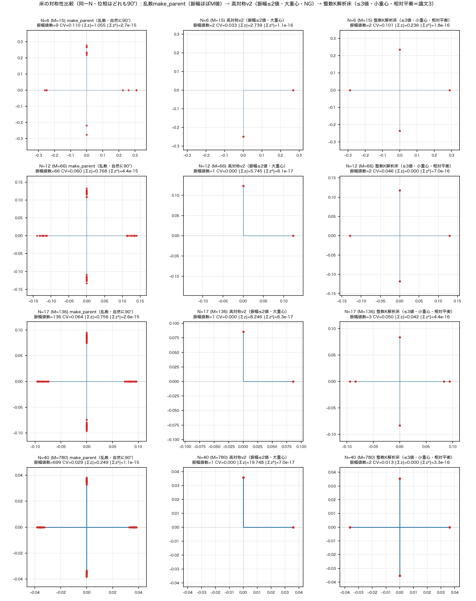
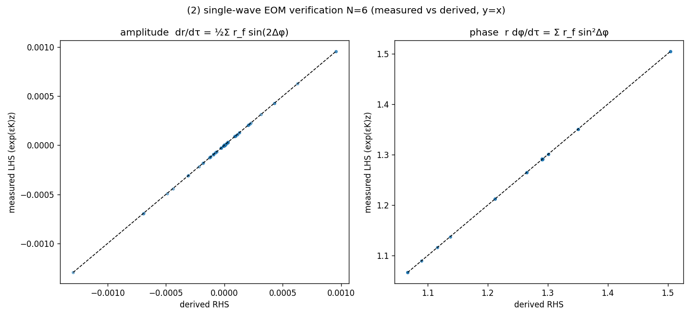
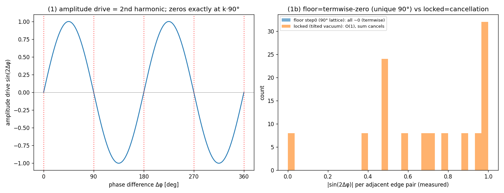

# 関係波閉鎖系における単一波の運動方程式——$L(K_N)$ 上の蔵本型位相結合と、90°位相差骨格での自己無撞着床の条件

**シリーズ:** 自己無撞着な関係波閉鎖系の基礎（論文1／全10本）
**著者:** 木原 範昭（WF System Co., Ltd.）　**日付:** 2026-09-12
**Version DOI:** （取得後記入）
**Concept DOI:** （取得後記入）
**ORCID:** 0009-0004-6753-4020

---

## 要旨

完全グラフ $K_N$ の各辺に複素関係波 $z_e\in\mathbb C$ を置き位相のみの実反対称生成子で回す閉鎖系写像（先行研究［1］で定義）について、本論文の問いは経験的動機から立つ：乱数シードから自己無撞着固定点 $KZ=i\sigma Z$ を作る make_parent の床が全 $N$ で**自然に90°二軸位相格子**になった（実験4-1・検討28）ため、『なぜ90°か』ではなく——90°を所与として——『**90°位相差骨格の上に、自己無撞着に回転する極めて対称な床を構成できるか**』を問う。まず one_step 写像 $z\to\exp(\Delta\tau K)z$ を振幅・位相に分解し、各辺波が頂点共有の隣接辺とのみ蔵本型 $\sin(\varphi_f-\varphi_e)$ で結合することと、

$$\frac{dr_e}{d\tau}=\frac12\sum_{f\sim e}r_f\sin\!\big(2(\varphi_f-\varphi_e)\big)\quad(\text{振幅}),\qquad r_e\frac{d\varphi_e}{d\tau}=\sum_{f\sim e}r_f\sin^2(\varphi_f-\varphi_e)\quad(\text{位相})$$

を導く。90°骨格（位相差が $90^\circ$ の倍数）では振幅駆動の第2高調波 $\sin(2\psi)$ が **termwise に消え** $\dot r_e=0$（振幅凍結）。残る自己無撞着条件（一様回転 $\dot\varphi_e=\omega$）は振幅ベクトルの固有値問題 $\omega r_e=\sum_{f\sim e}r_f\sin^2\psi_{ef}$（$Wr=\omega r$）に帰着する。さらに $D=\operatorname{diag}(e^{i\varphi_e})$ に対し90°骨格では $\boxed{D^{-1}KD=iW}$（$W_{ef}=A_{ef}\sin^2\psi_{ef}$ 実対称・非負）が成り立ち、**複素自己無撞着問題 $Kz=i\omega z$（$z=Dr$）は実対称非負整数行列の固有値問題 $Wr=\omega r$ と厳密同値**である。$W$ 既約なら Perron–Frobenius で正振幅の主固有ベクトルが一意に存在し（$\omega=\rho(W)$）、$z=Dr$ が90°骨格上の自己無撞着波を構成する（全 $N=3$–$40$ で $W$ 既約・確認）。その代数的厳密解は論文3が与える（make_parent 床は各自の90°ラベルが定める $W$ の Perron 固有ベクトルの反復近似で、整数K床とはラベル・$W$ が異なる別メンバー）。同一Nで並べると、make_parent 床の振幅は $N=40$ で699値とほぼ全辺で異なるのに対し、意図構成の高対称床は振幅≤3値で対称性が明確に高い（図2）。厳密写像の軌道再現は $\le3.0\times10^{-15}$、EOMの有限差分検証は振幅 $\le1.4\times10^{-6}$・位相 $\le2.4\times10^{-7}$、90°骨格の振幅凍結は $\le1.1\times10^{-13}$（$N=6,22,40$）。分類：正本 one_step からの導出済み帰結＋機械精度検証。

---

## 1. はじめに

本シリーズは、$N$ 個の存在の全二体関係 $M=N(N-1)/2$ を複素関係波 $z_e$ とし、外部seedを除去した閉鎖系の力学を調べる。初期に用いた **make_parent** は、乱数シードから自己無撞着な固定点（$KZ=i\sigma Z$）を反復で作る手続きで、その床は全 $N=3$–$40$ で**自然に90°二軸位相格子**（相対位相差 $90^\circ$）になった（図1、実験4-1・検討28）。位相は自然に90°だが、振幅は辺ごとにバラバラ（$N=40$ で699値・CV数%）・重心 $\Sigma z\neq0$ で、対称性は高くない。

**図1** 乱数 make_parent 床の複素平面（$N=3$–$40$、step0）。乱数シードから作った自己無撞着固定点が、全 $N$ で自然に直交2軸（相対位相差 $90^\circ$）に乗る。これが本論文の出発点＝「90°は所与」の経験的事実であり、その理由（自己無撞着＋termwise から90°が必然）は論文0が与える。

この経験的事実を出発点に、本論文の問いは『なぜ90°か』ではなく——**90°は所与（自然にそうなった）とした上で**——『**90°位相差骨格の中に、自己無撞着に回転する極めて対称な床を構成できるか**』である。実際、同一 $N$ で並べると（図2）、乱数 make_parent 床（振幅ほぼ $M$ 値）に対し、意図的に構成した高対称床は振幅が少数値（高対称v2：≤2値・$D_N$対称／整数K解析床：≤3値・小重心の相対平衡）で、対称性が明確に高い。

本論文はまず単一波EOMを導出し、90°骨格で振幅が termwise に凍ること、残る自己無撞着条件が振幅ベクトルの固有値問題になること（→論文3で厳密解）を示す。床の点火資格・厳密解・対称構成はそれぞれ論文2・3で扱う。力学の定義以外の入力（零閉塞・特定振幅分布）は前提しない。

**図2** 床の対称性比較（$N=6,12,17,40$）。乱数 make_parent が自然に生む90°床（振幅ほぼ $M$ 値・$N=40$ で699値）に対し、意図構成の高対称床は振幅が少数値で対称性が高い（詳細は論文2・3）。

## 2. 力学（写像）

正本 `run_N3_N40_stage123_v1.py`（SHA256 `1abf2353…`）の one_step は、$u=e^{i\arg z}$、$H_{ef}=A_{ef}\,u_f\bar u_e$、$H\leftarrow i\,\Im H$ として $z_{n+1}=\exp(-i\Delta\tau H)z_n$。整理すると

$$K_{ef}=A_{ef}\sin(\varphi_f-\varphi_e),\qquad z_{n+1}=\exp(\Delta\tau K)\,z_n,\qquad \Delta\tau=\frac{2\pi}{N},$$

ここで $A$ は $K_N$ の辺グラフ $L(K_N)$ の隣接行列（辺 $e,f$ が頂点共有なら $A_{ef}=1$）、$\varphi_e=\arg z_e$。**$K$ は位相のみで決まり振幅を含まない実反対称行列**で、$\exp(\Delta\tau K)$ は実直交行列。$\Re z,\Im z$ に同一作用するため $\|z\|^2$ と二乗閉塞 $z^{\mathsf T}z=\sum_e z_e^2$ を厳密保存する。

## 3. 単一波の運動方程式（導出）

生成子の流れ $dz/d\tau=Kz$ を成分で書くと、$f\sim e$（頂点共有辺）について

$$\frac{dz_e}{d\tau}=\sum_{f\sim e}\sin(\varphi_f-\varphi_e)\,z_f=\sum_{f\sim e}r_f\sin(\varphi_f-\varphi_e)\,e^{i\varphi_f}.$$

$z_e=r_e e^{i\varphi_e}$ とし左辺を $e^{i\varphi_e}(\dot r_e+ir_e\dot\varphi_e)$、右辺の $e^{i\varphi_f}=e^{i\varphi_e}e^{i\psi}$（$\psi=\varphi_f-\varphi_e$）で $e^{i\varphi_e}$ を約すと $\text{RHS}=\sum r_f\sin\psi(\cos\psi+i\sin\psi)$。実部・虚部より

$$\boxed{\ \dot r_e=\frac12\sum_{f\sim e}r_f\sin(2\psi)\ }\qquad\boxed{\ r_e\dot\varphi_e=\sum_{f\sim e}r_f\sin^2\psi\ }$$

を得る（$\sin\psi\cos\psi=\tfrac12\sin2\psi$ を用いた）。各辺波は頂点共有の隣接辺とのみ蔵本型に結合する振動子である。

## 4. この式が軌道を説明する

- **位相（回転と剛体回転を除いた変位）**：$\sin^2\ge0$ ゆえ全波 $\varphi_e$ は単調前進＝回転。共通分が剛体回転、波ごとの $(1/r_e)\sum r_f\sin^2\psi$ の**差**が剛体回転を除いた位相変位。
- **振幅（増減）**：駆動は第2高調波 $\sin(2\psi)$。隣接辺との位相差の2倍の正弦の重み付き和。
- **床（90°骨格）**：位相差が全て $90^\circ$ の倍数 $\Rightarrow\sin(2\psi)=0\Rightarrow\dot r_e=0$（termwise 振幅凍結）。さらに振幅が $Wr=\omega r$（$W_{ef}=A_{ef}\sin^2\psi_{ef}$）を満たす配置では全波が同率回転 $\dot\varphi_e=\omega$ となり、自己無撞着相対平衡を形成する。この床の存在・一意性は §5 で扱う。

本論文の主題は90°骨格上の自己無撞着床の**構成**であり、その床が不安定であること（点火の資格）と、床を離れた後の動態（インフレーション・再ロック）は本論文では扱わない（論文2・5・6）。

## 5. 90°骨格での振幅凍結と自己無撞着条件

90°は所与の骨格（make_parent の自己無撞着床が自然にそうなった、§1）である。その上で本節は、90°骨格が振幅を termwise に凍らせること、そして自己無撞着床の条件が振幅の固有値問題になることを示す。

**振幅凍結（termwise）**：振幅駆動は第2高調波 $\sin(2\psi)$ で、$[0,360^\circ)$ の零点は $\psi=0,90,180,270^\circ$ のみ（数え上げ）。ゆえに位相差が全て $90^\circ$ の倍数なら全対で $\sin(2\psi)=0$、すなわち $\dot r_e=0$ が**各項ごと**に成り立つ（termwise）。これは生成子が $\sin\psi$（第1高調波）ゆえ振幅駆動が第2高調波になる直接の帰結で、90°骨格が「振幅を壊さず置ける」骨格である理由である。（一般位相でも辺ごとの和が相殺すれば $\dot r=0$ になり得る＝cancellation 型で、これはロック終点に対応する。）

**定理（90°骨格の実対称化）** 90°骨格の上で自己無撞着な単一回転（$\dot\varphi_e=\omega$ 一様）を課すと、位相方程式は $\omega r_e=\sum_{f\sim e}r_f\sin^2\psi_{ef}$、すなわち $Wr=\omega r$（$W_{ef}=A_{ef}\sin^2\psi_{ef}$）になる。これは固有値問題が単に「出てくる」以上の**厳密同値**である：$\psi_{ef}\in\frac{\pi}{2}\mathbb Z$、$D=\operatorname{diag}(e^{i\varphi_e})$ なら、恒等式 $\sin\psi\,e^{i\psi}=\tfrac12\sin2\psi+i\sin^2\psi=i\sin^2\psi$（$\Leftrightarrow\sin2\psi=0$）より
$$\boxed{\ D^{-1}KD=iW\ },\qquad W_{ef}=A_{ef}\sin^2\psi_{ef}\in\{0,1\}\ (\text{実対称・非負}).$$
したがって $\boxed{\,Kz=i\omega z\ (z=Dr,\ r\ \text{実})\iff Wr=\omega r\,}$。90°骨格の複素自己無撞着固有波問題は、実対称非負整数行列 $W$ の固有値問題と厳密に同値である。

**系（正振幅自己無撞着波の存在・一意性）** $W$ が既約（対応グラフが連結）なら、Perron–Frobenius により $Wr=\rho(W)r$、$r_e>0$ を満たす $r$ がスケールを除き一意に存在する。よって $\boxed{\,z=Dr\,}$ は90°骨格上の自己無撞着単一回転 $Kz=i\rho(W)z$ である。すなわち本論文の問い「90°骨格上に自己無撞着な正振幅波を作れるか」の答えは、$W$ 既約の下で **作れる（スケールを除き一意）**。

**確認（全 $N=3$–$40$・追試）** 整数K床・make_parent 床とも $\|D^{-1}KD-iW\|\le2\times10^{-12}$、$Wr=\omega r$ の $\omega=\rho(W)=\sigma$（iK スペクトル半径）一致、$r>0$、$r$ と $W$ 主固有ベクトルの重なり $1.000000$、$W$ は全 $N$ で既約（連結）。要約すれば $\boxed{\text{90°骨格}\overset{D^{-1}KD=iW}{\longrightarrow}\text{実非負対称固有値問題}\overset{\rm PF}{\longrightarrow}\text{正振幅自己無撞着波の存在・一意}}$。

その高対称解の**閉形式**（$\rho(W)$ の $N$ 依存、振幅の2/3値縮退、整数 $K$ の $\sigma_{\max}$ との一致）は論文3が具体的に解く。make_parent 床は、反復の結果として得られた各自の90°位相ラベルが定める $W$（$W_{\rm mp}$）の Perron 主固有ベクトルを近似したものであり（和則 $(\sum_f r_f\sin^2\psi_{ef})/r_e=\sigma$ が全 $N$ で成立、検討31）、整数K床とはラベルも $W$ も異なる別メンバーだが、各々が自分の $W$ の Perron 解である点で整合する（$W_{\rm mp}\neq W_{\rm integerK}$、論文0）。

すなわち90°は導出される必然でなく所与の骨格であり、本論文が確定するのは「90°骨格では振幅が termwise に凍り、自己無撞着床の存在が振幅の固有値問題 $Wr=\omega r$ に帰着する」ことである。床の点火資格（不安定性）は論文2、厳密解は論文3、そこからの急拡大は論文5・6で扱う。

## 6. 数値検証（$N=6,22,40$）

| テスト | 内容 | 最大誤差 |
|---|---|---|
| T1 | 厳密写像 $\exp(\Delta\tau K(\varphi_n))z_n$ が正本軌道 $z_{n+1}$ を再現（$K$ が生成子） | $\le3.0\times10^{-15}$ |
| T2 | サブステップ $(\exp(\varepsilon K)z-z)/\varepsilon$ の振幅・位相成分が §3 のEOMと一致 | 振幅 $\le1.4\times10^{-6}$／位相 $\le2.4\times10^{-7}$ |
| T3 | 床の90°格子で $\dot r_e\approx0$（振幅凍結） | $|\dot r|\le1.1\times10^{-13}$ |

（T2は $\varepsilon$ スケール差分の丸め由来。式は厳密。）90°骨格 vs ロック終点の実測：90°骨格（step0）は個別項 $|\sin2\psi|\sim10^{-12}\text{–}10^{-14}$（termwise、格子ずれ $0.0^\circ$）、ロック終点は個別項 $\sim1.0$ だが辺ごと重み和 $\sim10^{-7}\text{–}10^{-13}$（cancellation、格子ずれ $\sim45^\circ$）。

**図3** 単一波運動方程式の検証（$N=6$）。

**図4** 90°骨格（termwise 振幅凍結）とロック終点（cancellation）の実測（$N=6$）。

## 7. 主張分類・未決

- 分類：正本 one_step からの**導出済み帰結**（＋機械精度検証）。判定：保持。
- 断定（本論文の主結果）：90°骨格で $D^{-1}KD=iW$ が成り立ち、複素自己無撞着問題 $Kz=i\omega z$ は実対称非負整数行列 $W_{ef}=A_{ef}\sin^2\psi_{ef}$ の固有値問題 $Wr=\omega r$ と**厳密同値**。$W$ 既約なら Perron–Frobenius で正振幅の主固有ベクトルが一意（$\omega=\rho(W)$）＝**90°骨格上に自己無撞着な正振幅床が構成できる**（全 $N=3$–$40$ で $W$ 既約・機械精度確認）。これが「90°骨格に自己無撞着な高対称波を作れるか」への数学的回答である。
- 未決：床の全体スケール $r^2$（スケール私有）、相対平衡の moduli（90°床は最も対称な一員で唯一解でない）、$N=3$ の例外（$\mu/r^2=-3/2$, rank 1）、任意の90°ラベル配置での $W$ 既約性の一般条件。これらは論文2・3・5で扱う。

## 関連研究（構造的一致・導出元でない）

- 蔵本モデル（Kuramoto 1975/1984）：$K_{ef}=A_{ef}\sin(\varphi_f-\varphi_e)$ は $L(K_N)$ 上の蔵本型位相結合。

## 参考文献

1. 木原範昭「自己無撞着な関係波閉鎖系におけるインフレーション的急拡大の機構」Concept DOI 10.5281/zenodo.22112008.（本論文の力学の定義・$\tau\neq$ 時間の出典）
2. Y. Kuramoto, *Chemical Oscillations, Waves, and Turbulence*, Springer (1984); "Self-entrainment of a population of coupled non-linear oscillators", 1975.

## 再現

検証スクリプト・データは `位相ロック全N確認_相対平衡_20260912/単一波運動方程式_導出と検証_20260912/`（`verify_single_wave_eom_20260912.py`＝T1/T2/T3、`verify_90deg_necessity_20260912.py`、`make_figures_eom_90deg_20260912.py`、`REPORT.md`、`SHA256SUMS.txt`、`run_all.sh`）に一式。**90°骨格での複素↔実対称同値 $D^{-1}KD=iW$ と Perron–Frobenius の全 $N$ 検証（§5）**は `位相ロック全N確認_相対平衡_20260912/複素実対称同値_DKD_iW_20260912/`（`verify_DKD_iW_equivalence_20260912.py`、`results/DKD_iW_summary.csv`、README／REPORT／SHA／run_all；読出しのみ）。図1の対称性比較は `同/床の対称性比較_makeparent_vs_高対称_20260912/`。入力は既存 den=N npz（$N=6$: 500 step、$N=22,40$: 本系列 2000 step）。力学写像は正本 `run_N3_N40_stage123_v1.py`（SHA256 `1abf2353fee2e4f56f05e7a6f149fd086885136beb61ab571b48a56b09691567`）と同一・物理式無変更。
