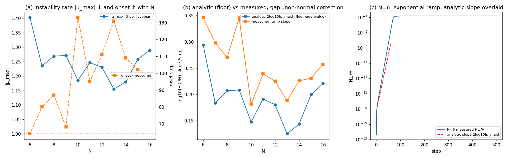

# インフレーション曲線は床の線形不安定モードの指数増幅である——床ヤコビアンの最大固有値と非正規・時変補正

**シリーズ:** 自己無撞着な関係波閉鎖系の基礎（論文6／全10本）
**著者:** 木原 範昭（WF System Co., Ltd.）　**日付:** 2026-09-12
**Version DOI:** （取得後記入）
**Concept DOI:** （取得後記入）
**ORCID:** 0009-0004-6753-4020

---

## 要旨

先行研究［1］が報告したインフレーション的急拡大（床平面外成分 $H_\perp/H$ の指数増大）を、微小シードの**線形不安定性**として解析的に導く。床の線形化写像（ヤコビアン $J$：$z\to\exp(\Delta\tau K(\varphi))z$ を床で線形化した $2M\times2M$ 実行列）の最大固有値 $|\mu_{\max}|$ が、$H_\perp/H(t)\approx\text{seed}^2\,|\mu_{\max}|^{2t}$、ランプ傾き $2\log_{10}|\mu_{\max}|$、onset $\approx\ln(1/H_{\perp0})/(2\ln|\mu_{\max}|)=\ln(1/\text{seed})/\ln|\mu_{\max}|$（$H_{\perp0}=\text{seed}^2$）を与える。固定床 $J$ で微小 $\delta$ を発展させた $H_\perp$ 傾きは $2\log_{10}|\mu_{\max}|$ に厳密一致（$N=6{:}0.2935$ vs 解析 $0.2937$）。$|\mu_{\max}|$ は $N$ 増で減少（$1.402\to1.269\to1.185$、$N=6,8,10$）＝インフレが遅くなり onset が伸びる（実測 onset は $N=6,8,10$ で $64,87,133$ 歩）。実測ランプ傾きは床値より一貫して $18$–$31\%$ 急で、これは床 $J$ が強い**非正規行列**（非正規度 $0.53$–$0.76$）で、実ランプが $K(\varphi)$ の漸進変化に伴う**時変・非可換な時間順序積** $\prod J(\varphi_t)$ の増幅（同時スペクトル半径 $\ge$ 個別スペクトル半径）であることに由来する（**追試Aで直接確認**：時変積の傾きが実測に一致・床凍結を18–31%上回る）。床固有値はその下界（初期・凍結 rate）である。分類：導ける（形・機構・$N$ 依存・onset）＋非正規補正の直接確認（追試A、閉形式のみ未決）。

---

## 1. 課題

論文1・2で床が不安定な相対平衡と確定した。「波の力学が解けたなら、インフレーション曲線も微小シードから解析的に導けるはず」——本論文はこれを、床ヤコビアンの線形不安定モードの指数増幅として定量的に示す。

## 2. 線形不安定の予測式

床 $z_0$ の周りで写像を線形化した実ヤコビアン $J\in\mathbb R^{2M\times2M}$（状態を $[\Re z;\Im z]$ に埋め込む）を数値微分で構成し固有値 $\mu$ を求める。床が不安定なら $|\mu_{\max}|>1$。微小シード $\delta$ は不安定固有方向で増幅し、床平面直交成分の割合は

$$\frac{H_\perp}{H}(t)\approx(\text{seed})^2\,|\mu_{\max}|^{2t},\qquad
\text{ランプ傾き}=\frac{d\log_{10}(H_\perp/H)}{dt}=2\log_{10}|\mu_{\max}|,\qquad
\text{onset}\approx\frac{\ln(1/H_{\perp0})}{2\ln|\mu_{\max}|}=\frac{\ln(1/\text{seed})}{\ln|\mu_{\max}|}.$$

（onset は $H_\perp/H\to1$ の到達歩数。$H_{\perp0}=\text{seed}^2$。旧稿の $\ln(1/\text{seed})/(2\ln|\mu|)$ は係数誤りで、実測 onset の約半分になる自己矛盾があったため訂正した。）

## 3. 検証（$N=6,8,10$）

| $N$ | $|\mu_{\max}|$ | $\lambda=\ln|\mu|$/step | 不安定モード数 | 解析傾き $2\log_{10}|\mu|$ | 固定床$J$の$\delta$発展傾き | 実測ランプ傾き | 実測/床解析 | 床$J$非正規度 | onset 解析/実測 |
|---|---|---|---|---|---|---|---|---|---|
| 6 | 1.40234 | 0.3381 | 5 | 0.2937 | 0.2935 | 0.3460 | 1.178 | 0.761 | 86 / 64 |
| 8 | 1.26908 | 0.2383 | 6 | 0.2070 | 0.1988 | 0.2702 | 1.306 | 0.641 | 125 / 87 |
| 10 | 1.18513 | 0.1699 | 8 | 0.1475 | 0.1271 | 0.1814 | 1.230 | 0.530 | 180 / 133 |

- **線形不安定式は厳密に正しい**：固定床 $J$ で微小 $\delta$ を発展させた $H_\perp$ 傾きが解析 $2\log_{10}|\mu_{\max}|$ に一致（$N=6{:}0.2935$ vs $0.2937$）。
- **$N$ 依存を再現**：$|\mu_{\max}|$ は $N$ 増で減少（$1.402\to1.269\to1.185$）＝インフレが遅くなり onset が伸びる（実測 onset は $N=6,8,10$ で $64,87,133$ 歩、解析 $86,125,180$ 歩）。onset の閉形式 $N$ 依存則は今後の検討課題とする。
- **onset** $\approx\ln(1/\text{seed})/\ln|\mu|$ が桁・スケールで一致（解析 $86/125/180$ vs 実測 $64/87/133$）。

**図1** インフレーション＝床の線形不安定（$N$ 依存・傾き・重畳）。

## 4. 非正規補正（実測が床値を超える分）

実測ランプ傾きは床値より一貫して $18$–$31\%$ 急である（実測/床解析 $=1.18$–$1.31$）。

- 床 $J$ は強い**非正規行列**（非正規度 $\|JJ^{\mathsf T}-J^{\mathsf T}J\|/\|J^{\mathsf T}J\|=0.53$–$0.76$）。
- 各点で $J$ を凍結したときのスペクトル半径はランプ上でほぼ一定（$N=6$ で $1.402$）だが、実ランプは**持続的に**これを上回る。凍結非正規性は一時的（transient）増幅を与えるに過ぎず、持続分は $K(\varphi)$ が漸進変化する**時変・非可換なヤコビアンの時間順序積** $\prod_t J(\varphi_t)$ の増幅（同時スペクトル半径 $\ge$ 個別スペクトル半径）が担う。**この機構は直接検証で確定した（追試A）**：実軌道上の時変ヤコビアン積 $\prod_t J(z_t)$ で $\delta$ を発展させた $H_\perp$ 傾きが実測ランプに一致し（時変/実測 = 0.999／1.004／1.019、$N=6,8,10$）、床凍結 $J_0$ を18–31%上回る（時変/床 = 1.177／1.311／1.253＝実測の超過と定量一致）。床固有値はその下界（初期・凍結 rate）である。したがって §3 で解析 onset（床 $|\mu_{\max}|$ 基準）が実測を一貫して上回る（$86/125/180$ vs 実測 $64/87/133$）のも同じ非正規機構の帰結である——床固有値は成長率の下界ゆえ、床基準の onset は上界を与え、実ランプはより急（傾き比 $1.18$–$1.31$）で閾値へより速く到達する。onset 過大評価と非正規超過は同一機構の表裏。

**深い読み（接線コサイクルの有限時間 Lyapunov 率）。** 床近傍では $\delta_{t+1}=J_0\delta_t$ で率は $\ln\rho(J_0)=\ln|\mu_{\max}|$（床近傍の初期成長率）。床を離れると実軌道上で $\delta_{t+1}=J(z_t)\delta_t$、すなわち $\delta_t=\Phi(t,0)\delta_0$、$\Phi(t,0)=J(z_{t-1})\cdots J(z_0)$（接線写像の時間順序積＝**接線コサイクル**）。したがって**実インフレーション率は、実軌道上の接線コサイクル $\Phi(t,0)=\prod_t J(z_t)$ の有限時間 Lyapunov 率**

$$\gamma_t=\frac1t\ln\frac{\|P_\perp\Phi(t,0)\delta_0\|}{\|P_\perp\delta_0\|},\qquad \log_{10}(H_\perp/H)\text{ の傾き}=\frac{2\gamma_t}{\ln10}$$

である（$P_\perp$＝床平面直交射影）。$J_t$ は非正規（$0.53$–$0.76$）で互いに非可換ゆえ $\Phi(t,0)\neq J_0^t$、最大増幅方向が時間発展で回転しながら次の $J_t$ にさらに増幅される（unstable eigenmode → rotating amplified direction → time-ordered exponential growth）。追試Aはこの $\gamma_t$ を実測ランプと一致（時変/実測 0.999／1.004／1.019）で確認した。$\mu_{\max}$（床の局所不安定性）と $\Phi(t,0)$（実インフレの接線力学）は**二段階の力学**であり、$\mu_{\max}$ はその下界（$t\to0^+$・凍結極限）である。

## 5. 二段構造の結論

- **導ける（形・機構・$N$ 依存・onset）**：インフレ曲線は床の線形不安定モードの指数増幅。主要予測（傾き $2\lambda/\ln10$・onset・$N$ 依存）は床ヤコビアンの最大固有値 $\lambda=\ln|\mu_{\max}|$ が与える。
- **論文5との統一（同一 $\mu_{\max}$ の二つの顔）**：この $\lambda=\ln|\mu_{\max}|$ は論文5のメキシカンハット有効ポテンシャルの頂上曲率そのものである（$V''(0)=-\lambda$、$\lambda=\ln|\mu_{\max}|$）。すなわち **SSB の不安定性（谷への転落を駆動する頂上の負曲率）とインフレーションの指数成長率は、同一の床ヤコビアン固有値 $\mu_{\max}$ で結ばれる**。論文5の静的 SSB 像（不安定な対称極大からの自発選択）と本論文の動的増幅（指数急拡大）は、一つの $\mu_{\max}$ の静的・動的な二側面である。$N$ 増で $\mu_{\max}\to1$ に近づくほど頂上は平坦化し（曲率減）、転落＝インフレも遅くなる（onset 伸長）。増幅率が精度・シード深さに依存しない（＝力学に内在する）ことは、シードの底を100桁精度で検証した実験で確立済み——IC100（closure $\sim10^{-102}$・床 $\sim10^{-200}$）でも $\gamma_\tau$ が64bit走行と8桁（$N=8$）一致し、床から約179桁を単一指数則で発火する（`precision_seed_dynamics_isolation_100digit_20260902`、$N=7,8$）。
- **精密化（非正規補正）**：正確な傾きは時変非正規 $J$ の時間順序積の増幅で、床固有値に $\sim18$–$31\%$ 上乗せされる（**追試Aで直接確認**：時変積の傾きが実測ランプに一致し床凍結を18–31%上回る）。閉形式のみ未導出。

**統一連鎖**（点火から着地まで一本）：

$$\rho(J_0)>1\ \Rightarrow\ \text{点火資格（論文2）}\ \to\ \ln\rho(J_0)\ \Rightarrow\ \text{床近傍の初期成長率}\ \to\ \gamma_{\rm FT}\big[\textstyle\prod_t J(z_t)\big]\ \Rightarrow\ \text{実ランプ成長率（追試A）}\ \to\ \frac{\ln(1/\text{seed})}{\gamma}\ \Rightarrow\ \text{onset}\ \to\ \text{非線形飽和}\ \Rightarrow\ \text{縮退真空（論文5）}.$$

同じ不安定床を「どう床から離れるか」で見ればインフレーション、「どこへ着地するか」で見れば SSB——両者は別機構ではなく、一つの不安定床の二つの見方である。

これはメキシカンハット頂上（90°骨格の不安定な相対平衡）からの転がり落ちの定量記述であり、着地（縮退真空・$\Delta=-2\pi/N$）は論文5、床平面から傾く幾何は論文7が扱う。

## 6. 主張分類・未決

- 分類：導出済み帰結（線形不安定式）＋非正規補正の実測（精密化は仮説）。判定：保持。
- 未決：非正規時変積の増幅率の**閉形式**は未導出（機構は追試Aで確定、増幅率の解析式のみ今後の課題）。$N=40$ の床ヤコビアン（$2M=1560$ 次元）は重く未計算——小 $N$（6,8,10）で二段構造は確立。

## 関連研究（構造的一致・導出元でない）

- 非正規行列の一時的増幅・擬スペクトル（Trefethen & Embree 2005）：ランプが床固有値を超える分は非正規 transient growth／時間順序積の増幅。
- 自己無撞着インフレv2［1］：本論文はその急拡大機構の解析導出（精密化）。

## 参考文献

1. 木原範昭「自己無撞着な関係波閉鎖系におけるインフレーション的急拡大の機構」Version DOI 10.5281/zenodo.22176949 / Concept DOI 10.5281/zenodo.22112008.
2. L. N. Trefethen and M. Embree, *Spectra and Pseudospectra*, Princeton (2005).

## 再現

検証スクリプト・図・報告は `位相ロック全N確認_相対平衡_20260912/インフレ曲線_線形不安定解析_20260912/`（`analyze_inflation_linear_instability_20260912.py`＝検証A〜E［床$J$固有値／非正規度／固定床$\delta$発展／実測ランプ／onset］、`make_figure_inflation.py`、`fig_inflation_linear_instability.png`、`REPORT.md`、`解析ログ_20260912.log`、`SHA256SUMS.txt`、`run_all.sh`）。**非正規補正の機構の直接確認（追試A）**は `位相ロック全N確認_相対平衡_20260912/ランプ直接Lyapunov_非正規時変積_20260912/`（`analyze_ramp_lyapunov_20260912.py`＝床凍結／時変積／実測の $H_\perp$ 傾き比較、`results/ramp_lyapunov_summary.csv`、`README.md`／`REPORT.md`／`SHA256SUMS.txt`／`run_all.sh`）。入力は既存 den=N npz（500 step、make_parent 床）。走行・物理変更なし。力学写像は正本 `run_N3_N40_stage123_v1.py`（SHA256 `1abf2353fee2e4f56f05e7a6f149fd086885136beb61ab571b48a56b09691567`）と同一。
