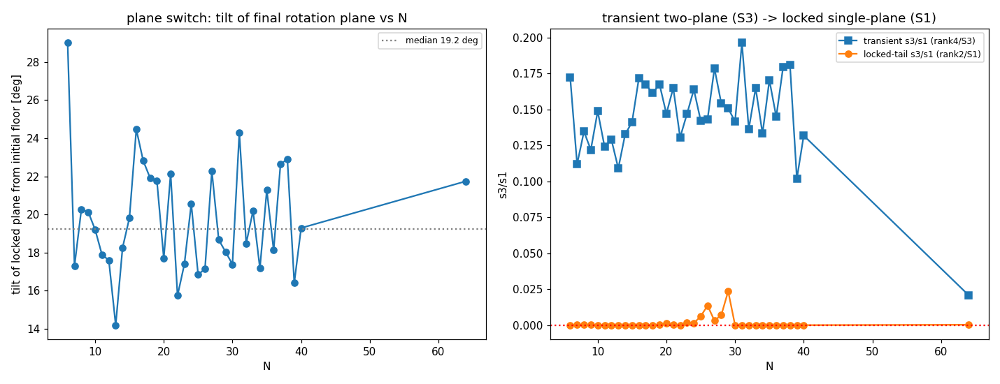
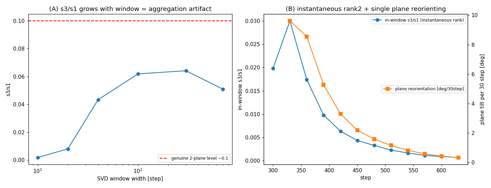

# ロック後の幾何——元の面と終端面が張る4次元（2つの非零主角）、面の乗り換えは長窓SVDの集約アーティファクトでない

**シリーズ:** 自己無撞着な関係波閉鎖系の基礎（論文7／全10本）
**著者:** 木原 範昭（WF System Co., Ltd.）　**日付:** 2026-09-12
**Version DOI:** （取得後記入）
**Concept DOI:** （取得後記入）
**ORCID:** 0009-0004-6753-4020

---

## 要旨

インフレーション（論文6）とSSBロック（論文5）が状態空間で何をするかを幾何的に確定する。写像は実直交回転 $z(t)=Q_t z_0$ で、状態はどの瞬間も2次元面（rank 2）に留まる（$[\Re z,\Im z]$ の特異値が全 step で二値、$z^{\mathsf T}z=0$ 保存で直交等長フレーム）。床では床平面 $P_0=\mathrm{span}\{\Re z_0,\Im z_0\}$ が $K$ 不変で状態は $P_0$ に留まる。SSB で床を離れると、ロック面 $P_{\rm term}$ は $P_0$ から傾き、両面の主角度は $N$ に依らず**二つとも非零**（$N=6{:}27.1^\circ,30.8^\circ$／$N=40{:}18.1^\circ,20.4^\circ$）で二面が張る次元は $4$。$P_0$ と $P_{\rm term}$ は2つの非零主角で4次元を張り、同じ床から終端の向きはシード依存で一意に定まらない。累積写像に特定の $SO(4)$ 回転構造は主張しない（実データで $M_t$ は4次元部分空間を保たないことを確認）。ロック面の床からの傾きは全 $N=6$–$40$ で $14.2^\circ$–$29.0^\circ$（中央 $\sim19.2^\circ$）。遷移では第2方向が立ち上がり（transient $s_3/s_1\approx0.10$–$0.20$＝実効 rank4）、ロック後は単一面へ再ロック（tail $s_3/s_1\approx10^{-5}$–$10^{-13}$＝rank2）。短窓SVDテストにより、この「面の乗り換え」は長窓集約の見かけでなく**実在の面の傾き**であることを分離した。分類：導出済み幾何＋実測（アーティファクト排除）。

---

## 1. 課題

終点を「円環」と読むだけでは、この写像の本来の観察——**ある面から別の面へ乗り換える**——を捉えない。全 $N\ge6$ でこれを定量化し、見かけ（長窓SVDの集約）と実在の回転を分離する。

## 2. 瞬時的構造——rank 2（単一面）

写像は実直交回転 $z(t)=Q_t z_0$（$Q_t$ 実直交、$\Re z,\Im z$ に同一作用）であり、状態はどの瞬間も2次元面に留まる（$[\Re z,\Im z]\in\mathbb R^{2\times M}$ の特異値が全 step で二値のみ、$z^{\mathsf T}z=0$ 保存で直交等長フレーム）。**Grassmann 運動としての定式化**：$z=a+ib$ に対し $z^{\mathsf T}z=0$・$\|z\|=1$ から $\|a\|^2=\|b\|^2=\tfrac12$・$a^{\mathsf T}b=0$ ゆえ $u=\sqrt2\,a,\ v=\sqrt2\,b$ は常に直交規格化された実2-frame $(u,v)\in V_2(\mathbb R^M)$。大域位相 $z\mapsto e^{i\theta}z$ は同じ面内で $(u,v)$ を回すだけなので、観測対象は大域位相を除いた**2次元部分空間 $P(t)=\mathrm{span}\{u,v\}$ そのもの**（Grassmann 多様体 $\mathrm{Gr}(2,M)$ 上の運動）。射影 $\Pi_t=u_tu_t^{\mathsf T}+v_tv_t^{\mathsf T}$ は各 step の実直交 $Q_t=e^{\Delta\tau K_t}$ で厳密に

$$\Pi_{t+1}=Q_t\,\Pi_t\,Q_t^{\mathsf T}$$

と動く。床では $Q_0P_0=P_0$ ゆえ $\Pi_{t+1}=\Pi_t$（相対平衡・不動）、インフレで $\Pi_t\neq\Pi_0$ と平面が動き、飽和で $P_{\rm term}$ へ再ロックする。§3–5 はこの平面運動 $\Pi_0\to\Pi_t\to\Pi_{\rm term}$ を実測している。床では $P_0=\mathrm{span}\{\Re z_0,\Im z_0\}$ が $K$ 不変（$Ka=\mu b,\ Kb=-\mu a$）で状態は $P_0$ に留まる（主角度ゼロ）。ロック後の末尾200 step の状態空間 SVD 第3/第1特異値比 $s_3/s_1$ は $10^{-5}$–$10^{-13}$＝単一面（rank2/$S^1$）。

## 3. 初期面と終端面の張る次元——4D span

SSB で床を離れると、ロック面 $P_{\rm term}$ は $P_0$ から傾く。元の面 $P_0$ と終端面 $P_{\rm term}$ の主角度は $N$ に依らず**二つとも非零**（$N=6{:}27.1^\circ,30.8^\circ$／$N=40{:}18.1^\circ,20.4^\circ$）で、二面が張る次元は $4$。ロック面の床からの傾き（$\arcsin\sqrt{H_\perp/H_{\rm end}}$）は全 $N=6$–$40$ で以下（`plane_switch_allN.csv` から抜粋）：

| $N$ | 傾き[°] | transient $s_3/s_1$ | tail $s_3/s_1$ |
|---|---|---|---|
| 6 | 29.0 | 0.172 | $3.8\times10^{-6}$ |
| 8 | 20.3 | 0.135 | $2.8\times10^{-4}$ |
| 16 | 24.5 | 0.172 | $1.1\times10^{-5}$ |
| 22 | 15.7 | 0.130 | $1.1\times10^{-13}$ |
| 40 | 19.3 | 0.132 | $4.5\times10^{-7}$ |
| 64 | 21.7 | 0.021 | $2.5\times10^{-4}$ |

全 $N$ で傾き $14.2^\circ$–$29.0^\circ$（中央 $\sim19.2^\circ$）、$0^\circ$ でも $90^\circ$ でもない＝等方性が破れている。

**傾き・2主角・$H_\perp/H$ は独立な測定量ではなく同一の Grassmann 幾何。** 初期・終端フレーム $U_0=(u_0,v_0),\ U_1=(u_1,v_1)$ と $P_0^\perp=I-U_0U_0^{\mathsf T}$ について、主角の定義（$U_0^{\mathsf T}U_1$ の特異値 $=\cos\theta_i$）から $\|P_0^\perp U_1\|_F^2=\sin^2\theta_1+\sin^2\theta_2$。$z=\tfrac1{\sqrt2}(u+iv)$ ゆえ

$$\frac{H_\perp}{H}=\frac12\left(\sin^2\theta_1+\sin^2\theta_2\right)=\frac14\big\|\Pi_{\rm term}-\Pi_0\big\|_F^2,\qquad \alpha=\arcsin\sqrt{\frac{\sin^2\theta_1+\sin^2\theta_2}{2}}$$

（$\Pi=UU^{\mathsf T}$ より $\|\Pi_1-\Pi_0\|_F^2=2(\sin^2\theta_1+\sin^2\theta_2)$）。これは追加仮説でなく定義からの**厳密な幾何恒等式**で、$N=6$ の $(27.1^\circ,30.8^\circ)\to\alpha=29.0^\circ$、$N=40$ の $(18.1^\circ,20.4^\circ)\to\alpha=19.3^\circ$ が表と一致する。すなわち床からの傾き $\alpha$ は初期面からの **Grassmann 距離** $\tfrac14\|\Pi_{\rm term}-\Pi_0\|_F^2$ そのものである。

**図1** 面の乗り換えの $N$ 依存。

## 4. 元の面と終端面は4次元を張る

$P_0$ と $P_{\rm term}$ は二つとも非零の主角度（$N=6{:}27.1^\circ,30.8^\circ$／$N=40{:}18.1^\circ,20.4^\circ$）で交わり $\dim(P_0+P_{\rm term})=4$——終端面は元の面から2つの独立方向に傾く（この「4方向」は span の次元の意味に限る）。**同じ床からこの終端の向きはシード依存で一意に定まらない**（論文5）。累積写像 $M_t=\prod_n\exp(\Delta\tau K(\varphi_n))$ に特定の $SO(4)$ 回転構造は主張しない——実データで $M_t$ はこの4次元部分空間を保たない（$M_tS=S$ の不変性が破れる）ことを確認済みで、$M_t$ は全 $\mathbb R^M$ の直交回転が $P_0$ を4次元 span 内へ傾けるものである。

遷移期には第2回転面が立ち上がる（transient $s_3/s_1\approx0.10$–$0.20$＝rank4）が、ロック後は単一面へ再ロック（tail $s_3/s_1\approx0$＝rank2）。$N=64$ は transient $s_3/s_1=0.021$ と小さく、大 $N$ で第2面 transient が弱まる。この遷移 rank4 は一時的で、ロック後は rank2 に戻り、累積写像も4次元部分空間を保たない（§4）——**持続的な $S^3$ 構造は認められない**（検査済み、短窓SVD＋判別計算）。

論文6で確認した時変・非正規な接線コサイクルでは、最大増幅方向が時間とともに回転しながら増幅される。本論文で観測される transient の追加方向は、その接線力学が瞬時 rank2 の平面 $P(t)$ を時間とともに傾ける幾何学的発現と読める。したがって transient の実効 rank4 は**瞬時状態の4次元化ではなく、移動する2平面 $P(t)$ が短時間に掃く局所 span** であり、飽和後には単一の終端面へ再び rank2 ロックする。すなわち論文6（接線空間で増幅方向が回転）と論文7（状態空間で2平面 $P(t)$ が傾いて別の2平面へ移る）は同一現象の接線側・状態側の表現である。$H_\perp/H=\tfrac14\|\Pi_t-\Pi_0\|_F^2$（§3 恒等式）を使えば、論文6の初期ランプ $H_\perp/H\propto e^{2\gamma t}$ は幾何学的に $\|\Pi_t-\Pi_0\|_F\propto e^{\gamma t}$——**インフレーションは Grassmann 空間 $\mathrm{Gr}(2,M)$ 上での初期面からの指数的離脱**である。

## 5. アーティファクトの排除

長窓の SVD は、単一面が時間とともに回れば見かけ上高ランクに集約され得る。短窓SVDテスト（`artifact_test_shortwindow_svd`）で、瞬時は rank2 のまま元の面 $P_0$ が2方向へ傾く（$P_0$ と $P_{\rm term}$ が4次元を張る）ことを分離した——「面の乗り換え」は長窓集約の見かけでなく**実在の面の傾き**である。

**図2** アーティファクト排除（短窓SVD）。

## 6. 読み出しの但し書き

初期に複素平面が一枚のみのとき、その法線は縮退した直交補空間で観測不能（概念的）である。インフレーションが法線空間に特定の向きを立てて初めて、元の面と新しい面の相対位相（傾き）が読み出し可能になる。**読み出せるのは常に関係量（面どうしの相対位相）**であって、絶対的な法線方向は状態単独からは復元できない（$Q_t$ が向きを隠し、それを指す保存量もない）。

## 7. 主張分類・未決

- 分類：導出済み幾何（実直交回転 rank2）＋実測（主角度・傾き・4次元span・アーティファクト排除）＋判別計算（累積写像は4次元部分空間を保たず $SO(4)$ ではないと確認）。判定：4次元span・2非零主角・相対配置の二重回転は保持、「力学が4次元上の $SO(4)$ 二重回転」は棄却。
- 参考（別レジーム）：$N=3,4$ の結晶終状態は面がマジック角 $\arccos\sqrt{2/3}=35.264^\circ$ で再凍結する特殊解（一般の $N\ge6$ ロックは $14$–$29^\circ$）。結晶／ガラスの分岐は本シリーズの別課題。
- 未決：4次元 span の物理的同定（$xyzt$ か $xyztRQ$ か等）・ゲージ（目盛り）の型は本論文の範囲外（論文0 §未決）。

## 関連研究（構造的一致・導出元でない）

- $SO(4)$ の二重回転（不変平面2枚・独立回転角2つ）：$P_0\to P_{\rm term}$ の**相対配置**の記述であって、累積写像そのものの性質ではない（§4 の判別計算で $M_tS\neq S$）。
- 相対平衡（Marsden & Ratiu）：床・ロックの剛体回転相対平衡。

## 参考文献

1. 木原範昭「自己無撞着な関係波閉鎖系におけるインフレーション的急拡大の機構」Concept DOI 10.5281/zenodo.22112008.
2. J. E. Marsden and T. S. Ratiu, *Introduction to Mechanics and Symmetry*, Springer (1999).

## 再現

解析スクリプト・図・CSVは `位相ロック全N確認_相対平衡_20260912/面の乗り換え全N_20260912/`（`analyze_plane_switch_allN_20260912.py`、`artifact_test_shortwindow_svd_20260912.py`、`plane_switch_allN.csv`、`fig_plane_switch_allN.png`、`fig_artifact_shortwindow_svd.png`）。ロック済みデータは小 $N$・$N=23$–$29$ が 500 step、未飽和 $N$（22,30–40）と $N=64$ が 2000 step。初期・終端面の主角度は `N22_2000step検証走行_/`・`N40_2000step検証走行_/` の step0/step2000 複素平面。早期の rank-3 監査は `independent_rank3_geometry_audit_20260831/`。力学写像は正本 `run_N3_N40_stage123_v1.py`（SHA256 `1abf2353fee2e4f56f05e7a6f149fd086885136beb61ab571b48a56b09691567`）と同一・読出しのみ。
