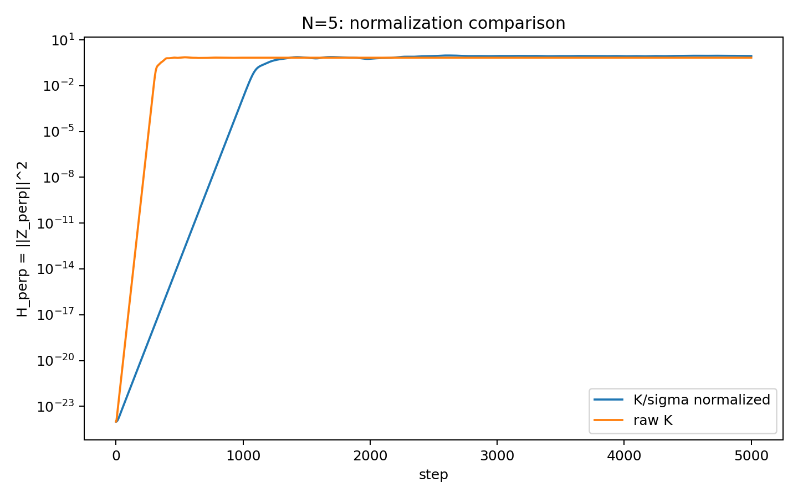
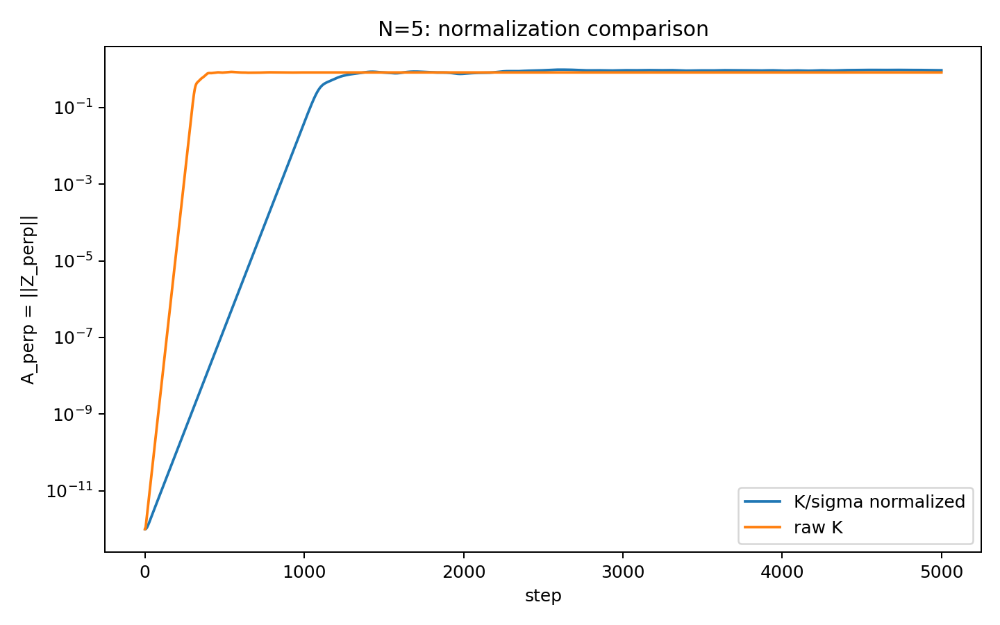
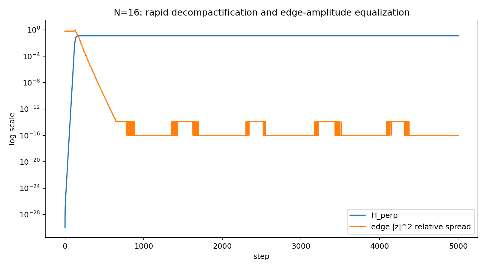

# 自己無撞着な関係波閉鎖系におけるインフレーション的急拡大の機構
## ――正規化監査、rank 生成、二乗閉包保存、simplex 対称化および公理系の再構成

**著者:** 木原 範昭  
**所属:** WF System Co., Ltd.  
**日付:** 2026-08-26  
**状態:** 完成稿 v2（DOI 取得前）

---

## 要旨

先行研究「N体関係波閉鎖系における三方向生成の時間構造――二段階seed除去による因果分離」では、外部seedを除去した状態でも、長い潜伏過程の後に関係波系がインフレーション的な急拡大を起こし、初期には存在しなかった三方向的な準安定構造へ移行することを報告した。しかし、その急拡大が何によって開始し、何が実際に拡大し、なぜ停止し、どのように方向が生成されるのかについては未解明な点が残っていた。

本研究では、この未解明部分を解くため、既存プログラムをコードまで遡って監査し、系の唯一の規模パラメータを $N$ として $N=3,\ldots,16$ を再検証した。完全二体関係数は

$$
M=\frac{N(N-1)}2
$$

である。

第一に、先行実験の時間発展コードには、生成子 $K$ をそのスペクトルノルム $\sigma_{\max}$ で割る

$$
K\rightarrow K/\sigma_{\max}
$$

という、本来の物理規則として不要な正規化が混入していた。この正規化を除去して再実験した結果、インフレーション的急拡大は消失せず、むしろ急拡大の時間発展が速くなった。したがって、先行研究の急拡大は正規化によるアーティファクトではなく、正規化は逆に急拡大を抑制していた。

第二に、初期化関数 `make_parent` を精査した結果、従来公理として置いていた

$$
\sum_m z_m^2=0,\qquad U^n=I
$$

を初期化の拘束条件として直接与えていないことが確認された。`make_parent` が行っている本質的操作は、実数乱数で与えた初期位相から、実反対称な関係作用の自己無撞着な固有モード固定点を探索することである。この固定点では、複素回転対、二乗ゼロ閉包、rank-2 初期平面、および有限位相閉鎖が自発的に成立した。したがって、本モデルのより基礎的な原理は「自己無撞着性」であり、複素構造、二乗ゼロ閉包、有限回帰性は、その自己無撞着固定点から導出される構造として再整理できる。

第三に、時間発展では、現在の $M$ 本の関係波から位相依存生成子を構成し、Cayley 変換による位相回転を行い、その結果を次の $M$ 本の波へ書き戻す。この反復によって、`make_parent` が与える rank-2 初期状態から rank-4 構造が自発的に立ち上がる。rank-4 は初期条件として作り込まれていない。急拡大しているのは、新たに立ち上がった親平面外方向への複素振幅成分であり、実験条件によって多数桁、約 $10^{30}$ オーダーに及ぶ二乗振幅の増大が観測された。一方、全過程を通じて

$$
\sum_m z_m^2\simeq0
$$

は数値精度内で保存される。したがってこれは外部からエネルギーを注入して全体ノルムを増大させる過程ではなく、閉じた有限系の内部で新たな方向へ振幅が再配分される過程である。

第四に、長時間発展を追跡すると、急拡大の停止過程と、関係波の振幅および位相関係が複素simplex対称性と整合する準安定配置へ再編成される過程とが同一の時間発展上で対応して進行することが分かった。停止の因果機構そのものは一意には特定できていないが、発展方向として

$$
\text{rank-2初期状態}
\rightarrow
\text{rank-4生成}
\rightarrow
\text{新方向への急拡大}
\rightarrow
\text{振幅・位相秩序化}
\rightarrow
\text{simplex対称配置}
\rightarrow
\text{準安定化}
$$

が確認された。

第五に、$N=3$ から $16$ の全系列で、$M$ 本の複素関係波は $N$ 頂点、rank $N-1$ の複素simplexを形成し、準安定状態では全辺の振幅二乗が原則として

$$
|z_{ij}|^2\rightarrow\frac1M
$$

へ等振幅化することを確認した。また各頂点 $i$ について

$$
\sum_{j\neq i} z_{ij}^2\simeq0
$$

が成立し、各頂点状態が自分以外の $N-1$ 本の関係波の線形合成閉包として成立することも確認した。

さらに、この自明な頂点閉包を除外して追加閉包を探索したところ、$N=5$ に特異な非自明対称性が見つかった。$N=5, M=10$ では、頂点閉包から導けない2辺ゼロ閉包が13個存在し、その最良残差は $1.88\times10^{-10}$ まで収束する。さらに10辺全体を

$$
10=2+2+2+2+2
$$

の5個の非自明閉包へ完全分割する exact cover が12通り存在した。

以上の結果は、先行研究で観測されたseedなしインフレーション的急拡大が数値正規化や任意の刻みによる人工現象ではなく、自己無撞着な関係波閉鎖系自身の力学として再現されること、またその基礎公理系を「自己無撞着性」へさらに還元できる可能性を示す。

---

## 1. はじめに

本研究シリーズでは、$N$ 個の存在と、その全二体関係

$$
M=\frac{N(N-1)}2
$$

を関係波として扱う閉鎖系を数値的に研究してきた。従来は基礎条件として、

$$
\sum_m z_m^2=0
$$

という非自明二乗ゼロ閉包と、

$$
U^n=I
$$

という有限回帰性を公理として置き、その上で有限閉鎖系、位相、方向、相互作用、量子化の可能性を検討してきた。

先行研究 [K8] では、外部seedを段階的に除去しても、系が長い潜伏過程の後に幾何級数的な急拡大を起こし、急拡大中に方向部分空間が回転・混合し、最終的に三方向的な準安定構造へ移行することを確認した。したがって「seedが無ければ急拡大しない」という単純な説明は否定された。

しかし同研究では、次の問題が未解明として残った。

1. なぜ急拡大が開始するのか。
2. 実際に何が急拡大しているのか。
3. rank-4 はいつ、どこから現れるのか。
4. なぜ急拡大は停止するのか。
5. なぜ方向が生成されるのか。
6. 初期化や時間発展に含まれる数値正規化・刻みが現象を作っていないか。
7. 従来の二公理 $\sum z^2=0$ と $U^n=I$ は本当に独立な入力公理なのか。

本研究は、これらを実装監査と $N=3$〜16 の再実験によって再検証する。

---

## 2. 先行研究からの継承点と本研究での訂正

### 2.1 直接の先行研究

直接の先行研究は [K8] である。同研究は、seedを除去しても急拡大と方向生成が存続することを確認した。

一方、同論文には次の記述があった。

> 初期化 `make_parent` は零二乗閉塞条件を前提としている。

今回、コードを原本まで遡って監査した結果、この記述は修正が必要であることが分かった。

`make_parent` は、$\sum z_m^2=0$ を数値拘束として直接課していない。実際に行っているのは、位相依存の実反対称作用に対する自己無撞着固有モード固定点の探索である。その結果として、二乗ゼロ閉包が出力側に現れている。

したがって本論文は、[K8] の実験事実を否定するものではなく、**初期化機構の理解をコード監査によって訂正し、その結果として公理系をさらに上流へ再構成する**ものである。

### 2.2 何を再検証したか

本研究では、

- 原本コード
- `make_parent`
- Cayley時間発展
- $K/\sigma_{\max}$ 正規化
- 処理刻み `GAMMA`
- rank の時間発展
- $Z^T Z$
- 複素距離
- simplex rank
- 振幅・位相の準安定化
- 部分ゼロ閉包

を再監査した。

---

## 3. 系の最小入力

本研究で独立な規模パラメータは $N$ とする。

$N$ 個の存在の全二体関係を取るため、

$$
M=\binom N2=\frac{N(N-1)}2
$$

は導出量であり、独立パラメータではない。

現在の実装を抽象化すると、最小入力は

$$
\boxed{
N
+\text{完全二体関係}
+\text{自己無撞着固定点条件}
}
$$

である。

---

## 4. `make_parent` の実装監査

### 4.1 実コード

現在使用している `make_parent` の中心部は以下である。

```python
def make_parent(sys_lr, rng, iters=400, beta=0.5, tol=1e-8, restarts=3):
    best = (None, np.inf, None)
    for _ in range(restarts):
        theta = rng.uniform(0.0, 2.0 * np.pi, sys_lr.m)
        v = None
        for it in range(iters):
            sys_lr.set_theta(theta)
            ev, EV = np.linalg.eig(sys_lr.J @ sys_lr.G)
            idx = int(np.argmin(ev.imag))  # lambda = -i sigma_max
            v = sys_lr.w(EV[:, idx].astype(complex))
            v = v / np.linalg.norm(v)
            theta_new = np.angle(v)
            mix = (1.0 - beta) * np.exp(1j * theta) \
                + beta * np.exp(1j * theta_new)
            theta = np.angle(mix)

            if it % 10 == 9:
                sys_lr.set_theta(np.angle(v))
                res_now = _eigenmode_residual(sys_lr, v)
                if res_now < tol:
                    break

        sys_lr.set_theta(np.angle(v))
        residual = _eigenmode_residual(sys_lr, v)
        if residual < best[1]:
            best = (v, residual, sys_lr.sigma_spectrum())
        if residual < tol:
            break

    v, residual, sig = best
    sys_lr.set_theta(np.angle(v))
    return v, residual, sig
```

ここで初期値 `theta` は、

```python
theta = rng.uniform(0.0, 2.0*np.pi, M)
```

という**実数乱数**である。

実部・虚部の二組の乱数振幅を物理初期値として与えてはいない。

数値実装上 `astype(complex)` を用いているのは、実行列 `J @ G` の複素共役固有モードを格納するためであり、複素位相関係を外部条件として指定しているわけではない。

### 4.2 固定点としての自己無撞着性

概念的には、

$$
\theta
\rightarrow
G(\theta)
\rightarrow
v
\rightarrow
\arg v
\rightarrow
\theta'
$$

を反復し、

$$
\boxed{\theta'=\theta}
$$

となる固定点を探索している。

したがって `make_parent` の本質は、

$$
\boxed{\mathcal F(X)=X}
$$

という自己無撞着固定点条件である。

---

## 5. 複素構造の自発生成

### 5.1 実反対称作用

生成子 $K$ は実反対称である。

$$
K^T=-K.
$$

非零固有モードは

$$
Kv=i\sigma v
$$

の形を取る。

$$
v=a+ib
$$

と書くと、

$$
Ka=-\sigma b,\qquad
Kb=\sigma a.
$$

したがって $a,b$ は独立に外部から与えた二成分ではなく、**実反対称作用の非零固有モード内部に現れる回転対**である。

この意味で、

$$
\boxed{
\text{実数初期位相}
+\text{自己無撞着な実反対称作用}
\Rightarrow
\text{複素回転構造}
}
$$

と読むことができる。

---

## 6. 自己無撞着性から二乗ゼロ閉包

実反対称性から任意の $v$ について

$$
v^T K v=0
$$

である。

自己無撞着非零固有モード

$$
Kv=i\sigma v,\qquad \sigma\neq0
$$

を代入すると、

$$
v^TKv=i\sigma v^Tv=0.
$$

したがって

$$
\boxed{v^Tv=0}
$$

すなわち、

$$
\boxed{\sum_m v_m^2=0}
$$

が従う。

さらに $v=a+ib$ とすれば、

$$
\sum_m(a_m+ib_m)^2=0
$$

より、

$$
\boxed{\|a\|^2=\|b\|^2},
\qquad
\boxed{a\cdot b=0}.
$$

したがって、二乗ゼロ閉包は `make_parent` に外部拘束として与えたものではなく、自己無撞着な非零反対称固有モードから導かれる。

---

## 7. 各頂点における線形合成閉包

$N$ 頂点の完全グラフでは、頂点 $i$ に接続する関係波は $N-1$ 本である。

今回の $N=3$〜16 解析では、$N\ge4$ について各頂点で

$$
\boxed{
\sum_{j\neq i} z_{ij}^2\simeq0
}
$$

が数値精度内で成立した。

これは各頂点状態が、自分以外の $N-1$ 個の関係波から構成される線形合成閉包であることを意味する。

$$
\boxed{
\text{1頂点の状態}
=
(N-1)\text{本の関係波の自己無撞着な線形合成状態}
}
$$

である。

各関係 $z_{ij}$ は頂点 $i$ と $j$ の双方の局所閉包に属するため、全体系は互いに重なり合う $N$ 個の局所線形閉包によって被覆される。

---

## 8. 二乗閉包から有限回帰性へ

$$
v^Tv=0
$$

より、

$$
\|a\|=\|b\|,\qquad a\perp b
$$

であり、状態は有限半径の回転対として表せる。

$$
X(\theta)=a\cos\theta+b\sin\theta.
$$

このとき

$$
\|X(\theta)\|=\text{const.}
$$

かつ

$$
X(\theta+2\pi)=X(\theta).
$$

有限閉周期上で自己整合する位相差を

$$
\Delta\theta=2\pi\frac mn
$$

とすれば、

$$
U=e^{i\Delta\theta}
$$

に対し、

$$
\boxed{U^n=I}
$$

である。

したがって本研究での論理階層は、従来の

$$
\sum z^2=0,\qquad U^n=I
$$

という二独立公理から、

$$
\boxed{
\text{自己無撞着固定点}
\Rightarrow
\text{複素回転対}
\Rightarrow
\sum z^2=0
\Rightarrow
\text{有限閉周期}
\Rightarrow
U^n=I
}
$$

へ再整理される。

なお、これは「結論を前提にした循環論証」ではなく、一周した写像が元状態を再生する

$$
\mathcal F(X)=X
$$

という固定点条件である。

---

## 9. 時間発展の実装

時間発展では、各stepで現在状態の位相を読み、

```python
sys_lr.set_theta(np.angle(Z))
sig_est, wp = sys_lr.sigma_max_power(wp)
Z = sys_lr.cayley_step(Z, sig_est)
```

として次状態を書き戻す。

物理的には、

$$
Z_t
\rightarrow
\theta_t=\arg Z_t
\rightarrow
K(\theta_t)
\rightarrow
U_t Z_t
\rightarrow
Z_{t+1}
$$

である。

したがって生成子は固定ではなく、**現在の波状態を読み出した結果から毎step再構成される状態依存生成子**である。

---

## 10. Cayley更新と位相回転

時間発展は

$$
Z_{t+1}
=
(I-\gamma K_t)^{-1}
(I+\gamma K_t)Z_t
$$

という Cayley 変換である。

実反対称 $K_t$ に対し、この更新はノルム保存回転となる。

固有モード

$$
K_tv=i\sigma v
$$

に対しては、

$$
v\rightarrow
\frac{1+i\gamma\sigma}
     {1-i\gamma\sigma}v
=
e^{i\Delta\phi}v,
$$

$$
\boxed{
\Delta\phi
=
2\arctan(\gamma\sigma)
}
$$

である。

この式が「状態を読み出し、位相を回転し、次状態へ書き戻す」処理の数式表現である。

---

## 11. 不要な正規化の発見

### 11.1 旧コード

先行コードでは、

```python
def cayley_step(self, z, sigma):
    gn = GAMMA / sigma
    r = z + gn * self.kmatvec(z)
    A2 = (sigma / GAMMA) * self.J + self.G
    rhs = self.wt(r)
    y = np.linalg.solve(A2, rhs)
    return r - self.w(y)
```

となっていた。

これは数式では、

$$
\tilde K=\frac{K}{\sigma_{\max}}
$$

として、

$$
Z_{t+1}
=
(I-\gamma\tilde K)^{-1}
(I+\gamma\tilde K)Z_t
$$

を実行している。

### 11.2 修正版

修正後は、

```python
def cayley_step(self, z, sigma):
    gn = GAMMA
    r = z + gn * self.kmatvec(z)
    A2 = (1.0 / GAMMA) * self.J + self.G
    rhs = self.wt(r)
    y = np.linalg.solve(A2, rhs)
    return r - self.w(y)
```

であり、

$$
\boxed{
Z_{t+1}
=
(I-\gamma K)^{-1}
(I+\gamma K)Z_t
}
$$

と、生の $K$ をそのまま使う。

### 11.3 直接比較

N=4およびN=5で、初期状態・乱数系列・step数を固定し、正規化の有無だけを変えた。

| N | 更新 | $H_\perp$ 指数率 /step | $A_\perp$ 指数率 /step | $H_\perp=10^{-8}$ 到達 |
|---:|---|---:|---:|---:|
| 4 | $K/\sigma$ | 0.05488 | 0.02744 | 708 |
| 4 | raw $K$ | **0.14864** | **0.07432** | **262** |
| 5 | $K/\sigma$ | 0.04936 | 0.02468 | 757 |
| 5 | raw $K$ | **0.17251** | **0.08625** | **217** |

したがって、

$$
\boxed{
K/\sigma_{\max}\text{ 正規化は急拡大を生成していない。
むしろ急拡大を抑制していた。}
}
$$

この結果により、先行研究のインフレーション的急拡大は、不要な正規化による数値アーティファクトではないことが確認された。

**図1　N=5における正規化あり／なしの親平面外二乗振幅 $H_\perp$ の比較。** raw $K$ では立ち上がりが明瞭に早く、$K/\sigma_{\max}$ 正規化が急拡大を生成したのではなく、逆に抑制していたことが直接読める。



**図2　同じ比較を振幅 $A_\perp=\|Z_\perp\|$ で表示したもの。** 比率量だけではなく、親平面外振幅そのものが指数増大していることを示す。



---

## 12. `144` は物理定数ではなく時間刻みである

コードでは、

```python
GAMMA = math.tan(math.pi / 144.0)
```

としている。

ここで注意すべきなのは、$\pi/144$ は Cayley パラメータの角であり、$\sigma=1$ の正規化固有モードに対する実際の一step回転角は

$$
\Delta\phi
=
2\arctan[\tan(\pi/144)]
=
\frac{2\pi}{144}
=
\frac{\pi}{72}
=
2.5^\circ
$$

である。

したがって「144」は物理定数ではなく、2.5°刻みを得るために選んだ数値時間刻みの分母である。

N=5について、

$$
n_\gamma=144,\ 288,\ 576,\ 1152,\ 2304
$$

と刻みを細分化し、

$$
\gamma=\tan(\pi/n_\gamma)
$$

として連続刻み極限を調べた。

累積位相あたりの成長率は、

- 144: 1.131171 /rad
- 288: 1.145300 /rad
- 576: 1.152475 /rad
- 1152: 1.156090 /rad
- 2304: 1.157905 /rad

へ収束した。

したがって、

$$
\boxed{
144\text{ に固有の物理的共鳴はなく、}
\gamma\rightarrow0
\text{ の連続時間極限へ収束する。}
}
$$

**図3　時間刻み細分化による連続極限の検証。** $n_\gamma=144,288,576,1152,2304$ と細分化しても、累積位相で読み直した成長率は同一極限へ収束する。したがって144は物理定数ではなく数値刻みである。


---

## 13. rank-2 初期状態と rank-4 の自発生成

`make_parent` によって得られる親状態は、実部と虚部が張る rank-2 の初期平面を持つ。

この初期状態から時間発展を開始すると、親平面外成分が自発的に立ち上がり、rank-4 の読出し構造へ移行する。

重要なのは、

$$
\boxed{
\text{rank-4 は初期条件として与えていない}
}
$$

という点である。

rank-4 は現在状態を読み出して生成子を再構成し、位相回転結果を書き戻す反復によって自発的に生成される。

ここでいう rank-4 は、後述する複素simplexの Gram rank $N-1$ とは異なる。前者は時間発展によって立ち上がる「二つの2次元回転平面」の読出し、後者は $N$ 頂点距離幾何のsimplex rankである。

---

## 14. 三方向の生成

初期 rank-2 平面を $A$ とする。

時間発展によって親平面外に第二の2次元平面 $B$ が立ち上がる。

この二平面の相対配置を読出すと、

1. 両平面に関係する共有方向、
2. 平面 $A$ 側の独立方向、
3. 平面 $B$ 側の独立方向、

という三方向として識別できる。

したがって、

$$
\boxed{
\text{rank-2}
\rightarrow
\text{rank-4}
\rightarrow
\text{三方向的読出し}
}
$$

という生成系列が得られる。

先行研究 [K8] で観測された「三方向」は、最初から固定された3軸を増幅したものではなく、急拡大中に部分空間の回転・混合を伴って動的に形成される。

---

## 15. 何が急拡大しているのか

親平面 $A$ に対する直交成分を

$$
Z_\perp
$$

とする。

$$
A_\perp=\|Z_\perp\|,
\qquad
H_\perp=\|Z_\perp\|^2.
$$

過去の図化量は

$$
f=\frac{H_\perp}{H_{\rm total}}
$$

であった。

今回の監査では、

$$
H_{\rm total}=Z^\dagger Z
$$

がほぼ一定であることを確認した。

したがって $f$ の指数増大は分母がゼロへ落ちるためではなく、

$$
\boxed{
H_\perp
}
$$

そのものの指数増大を表している。

振幅 $A_\perp$ でも指数増大が確認される。

すなわち、インフレーション的急拡大で増大しているのは、

$$
\boxed{
\text{時間発展によって新たに開いた親平面外方向への複素振幅}
}
$$

である。

---

## 16. 急拡大中も二乗ゼロ閉包は保存される

正規化を除いた raw-$K$ 時間発展でも、

$$
Z^TZ\simeq0
$$

が維持された。

代表例では、

- N=5: 最大 $|Z^TZ|$ は $4.829\times10^{-15}$ 程度
- N=16: 最大 $|Z^TZ|$ は $3.775\times10^{-15}$ 程度

である。

したがって、

$$
\boxed{
\text{急拡大は外部からの非保存的な注入ではなく、
二乗ゼロ閉包を保った内部再配置である。}
}
$$

本研究で「インフレーション的」と呼ぶのは、外部エネルギーを追加して全ノルムが指数増大するという意味ではなく、閉包を保ったまま新たな幾何方向の振幅スケールが指数的に展開するという意味である。

---

## 17. 複素simplexとしての再構成

各関係

$$
z_{ij}=a_{ij}+ib_{ij}
$$

を複素距離と読み、

$$
d_{ij}^2=z_{ij}^2
$$

とする。

中心化行列

$$
J=I-\frac1N\mathbf 1\mathbf 1^T
$$

を用いて、

$$
B=-\frac12 JD^2J
$$

という複素Gram行列を構成する。

$N=3$〜16 の全系列で、

$$
\boxed{
\operatorname{rank}B=N-1
}
$$

が成立した。

したがって、$M$ 本の関係波は $M$ 次元へ独立に広がるのではなく、

$$
\boxed{
N\text{頂点、}N-1\text{次元の複素simplex}
}
$$

として自己整合的な距離幾何を形成する。

**図4　N=5複素simplexの構造図。** 10本の関係波を独立な10次元自由度として読むのではなく、5頂点・rank 4 の複素simplex距離幾何として再構成できる。


---

## 18. 準安定化と等振幅化

長時間発展後、多くの $N$ で全関係の振幅二乗は

$$
\boxed{
|z_{ij}|^2\rightarrow\frac1M
}
$$

へ均等化する。

例として、

$$
N=16,\quad M=120
$$

では、

$$
|z_{ij}|^2\simeq\frac1{120}
$$

へ全120辺が高精度に収束した。

これは急拡大がsimplex構造を破壊する過程ではなく、むしろ**等振幅simplexへ再編成する過程**であることを示す。

**図5　N=16における急拡大と等振幅化。** 大自由度側でも、急拡大とsimplex全体の振幅均等化が同一の時間発展内で進むことを示す。



---

## 19. 急拡大の停止とsimplex対称化

停止原因そのものを一意に同定したわけではない。

しかし時間発展上で、

$$
\boxed{
\text{急拡大の停止・準安定化}
}
$$

と、

$$
\boxed{
\text{振幅の等分配と位相関係のsimplex整合配置への秩序化}
}
$$

が対応して進行することは確認できる。

N=5では、$H_\perp$ が最終値の99%に達するのが約 step 449 である一方、最終的な4群の位相・距離構造はその後も長く秩序化を続け、

- 誤差 $10^{-4}$ 以下: step 2627
- 誤差 $10^{-8}$ 以下: step 4923

で成立した。

したがって時間発展は少なくとも二段階である。

$$
\boxed{
\text{第1段階：新方向への急拡大}
}
$$

$$
\boxed{
\text{第2段階：simplex対称配置への長時間秩序化}
}
$$

である。

この結果は、simplex対称配置が準安定アトラクタとして機能する可能性を示唆する。ただし、「対称化そのものが停止の原因」なのか、「停止と対称化が同一のより深い自己無撞着化過程の二つの現れ」なのかは未解明である。

**図6　N=5における急拡大と秩序化の時間分離。** 親平面外振幅の急拡大がほぼ終了した後も、位相・複素距離クラスの収束は長く継続する。急拡大と最終simplex対称化が同一瞬間ではなく、連続する二段階過程であることが分かる。


---

## 20. $N=3$〜16 の系列

主要結果をまとめる。

| N | M | simplex rank | 準安定位相構造の概略 |
|---:|---:|---:|---|
| 3 | 3 | 2 | 三角simplex、5000 stepでは緩和途上 |
| 4 | 6 | 3 | $2+2+2$：四面体の3組の対辺 |
| 5 | 10 | 4 | $3+3+2+2$、さらに非自明2辺閉包 |
| 6 | 15 | 5 | 厳密には多クラス、緩和の遅い境界例 |
| 7 | 21 | 6 | 高精度では21辺非縮退 |
| 8 | 28 | 7 | 高精度では28辺非縮退 |
| 9 | 36 | 8 | 高精度では36辺非縮退 |
| 10 | 45 | 9 | 高精度では45辺非縮退 |
| 11 | 55 | 10 | 高精度では55辺非縮退 |
| 12 | 66 | 11 | 高精度では66辺非縮退 |
| 13 | 78 | 12 | 高精度では78辺非縮退 |
| 14 | 91 | 13 | 非縮退、6辺quasi-closure候補 |
| 15 | 105 | 14 | 高精度では105辺非縮退 |
| 16 | 120 | 15 | 高精度では120辺非縮退 |

普遍的なのは、

$$
\boxed{
\operatorname{rank}=N-1
}
$$

と、準安定状態での

$$
\boxed{
|z|^2\rightarrow1/M
}
$$

である。

一方、少数位相群や追加閉包は $N$ に強く依存する。

---

## 21. N=4 の対辺構造

N=4では6辺が、

$$
(12,34),\qquad
(13,24),\qquad
(14,23)
$$

という

$$
\boxed{2+2+2}
$$

の3群へ分かれる。

これは四面体の3組の対辺そのものである。

各対辺内は同位相へ収束し、3群の複素二乗距離位相は約120°ずつ離れる。

したがってN=4では、

$$
\boxed{
\text{simplexの組合せ幾何}
\leftrightarrow
\text{複素距離の位相分類}
}
$$

が直接対応する。

ただし、この3辺閉包をstar-spanで解析すると、追加の独立閉包ではなく各頂点閉包の線形帰結として説明できる。

**図7　N=4の四面体における対辺3組。** 6辺が $2+2+2$ に分かれ、位相分類と四面体の組合せ幾何が一致する。


---

## 22. N=5 の特殊対称性

N=5 は今回の $N=3$〜16 系列の中で、単なる「5頂点・rank 4 の複素simplex」にとどまらず、**位相分類、複素二乗距離分類、3次元的読出し、さらに一般の頂点閉包から独立な部分ゼロ閉包が同時に重なる最も明瞭な特異例**である。

ここでは N=5 を、最終状態だけでなく時間発展を含めて詳しく記述する。

まず、N=5で得られた構造を一枚で把握できる総合図を示す。以下の詳細節は、この図の各要素を順に分解して検証したものである。

**図7A　N=5複素関係距離構造の総合図。** 5頂点・10関係、rank 4、$3+3+2+2$ の4群、$K_5$ 上での辺配置、45組の位相差分類、3次元四角錐としての読出しを一枚にまとめた。N=5で「何が特別なのか」を最も直接に示す図である。


**図7B　N=5複素simplex完全解析の総合図。** 最終4群構造だけでなく、親平面外成分 $H_\perp$ の急拡大、4群一致誤差の長時間緩和、代表到達stepまで同じ時間軸上に整理している。急拡大が先にほぼ完了し、その後に位相・距離秩序化が継続する二段階発展を一望できる。


### 22.1 基本幾何：5頂点・10関係・rank 4

N=5 では、完全二体関係数は

$$
M=\frac{5\cdot4}{2}=10
$$

である。

10本の複素関係波 $z_{ij}$ から複素二乗距離

$$
d_{ij}^2=z_{ij}^2
$$

を作り、中心化複素Gram行列

$$
B=-\frac12 JD^2J
$$

を構成すると、非自明rankは

$$
\boxed{\operatorname{rank}B=4}
$$

となる。

したがって、まず基礎構造は通常の4-simplexに対応する「5頂点・10辺・rank 4」であり、この点自体はN=5だけの特異性ではない。特異性は、その10関係の**位相と複素二乗距離がさらに少数の高対称クラスへ自己組織化すること**にある。

### 22.2 10辺は最終的に $3+3+2+2$ の4群へ秩序化する

step 5000 の準安定状態では、10辺は

$$
A_+:\{12,13,45\},
$$

$$
A_-:\{14,15,23\},
$$

$$
B_+:\{24,35\},
$$

$$
B_-:\{25,34\}
$$

という

$$
\boxed{10=3+3+2+2}
$$

の4群へ収束する。

ここで重要なのは、これは単なる「位相の近い辺を人為的にクラスタリングした」分類ではないことである。各辺について $a,b,a^2,b^2,ab$ を直接追うと、同じ群に属する辺は複素二乗距離

$$
z_{ij}^2=(a_{ij}^2-b_{ij}^2)+2i a_{ij}b_{ij}
$$

の実部・虚部まで同一クラスへ収束する。

**図8　N=5の最終複素二乗距離クラス。** 10辺が4群へ分離し、各群内部で $z^2$ が同一値へ収束することを示す。


### 22.3 4群は「2種類の距離方向 × 符号反転」としてさらに縮約できる

4群の間には、

$$
A_-=-A_+,
\qquad
B_-=-B_+
$$

という関係が成立する。

したがって4群は独立な4種類ではなく、本質的には

$$
\boxed{
2\text{種類の複素二乗距離方向}
\times
\text{符号反転}
}
$$

である。

複素二乗距離では符号反転 $z^2\rightarrow-z^2$ は位相を $\pi$ だけずらすため、$A_+$ と $A_-$、$B_+$ と $B_-$ はそれぞれ同じ距離族の反対向きとして読める。

**図9　N=5の二つの距離族と符号反転。** $A$ 系と $B$ 系の二つの基本成分、およびその符号反転によって4群全体が構成される。


この構造は、N=5の位相分類を「4種類の偶然なクラス」ではなく、**二つの基本方向に対する反転対称性**として読む根拠になる。

### 22.4 3次元四角錐としての読出し

N=5の距離幾何そのものは rank 4 の4-simplexである。しかし、上の $3+3+2+2$ 位相・距離分類を用いると、10辺は3次元の四角錐として非常に自然に配置できる。

四角錐の辺数は、

- 底面4辺
- 頂点から底面4頂点へ向かう側辺4本
- 底面対角線2本

で、合計

$$
4+4+2=10
$$

である。

したがって全10関係を

$$
\boxed{8\text{外郭辺}+2\text{底面対角線}}
$$

として3次元的に読むことができる。

**図10　N=5の3次元四角錐読出し。** rank 4 の複素simplexそのものを3次元へ縮退させたという主張ではなく、最終位相・距離クラスが3次元四角錐の辺・対角線構造として読めることを示す。


ここは誤読を避けるため重要である。

$$
\boxed{
\text{複素simplex rank}=4
}
$$

と、

$$
\boxed{
\text{位相・距離分類の3次元的読出し}
}
$$

は異なる観測量であり、両者は矛盾しない。

### 22.5 この4群は急拡大の初めから存在するのではない

最終 $3+3+2+2$ 構造を step ごとに逆追跡すると、急拡大の開始時点から完成形が固定されているわけではない。

親平面外振幅は先に急増し、その後に群内の位相差・距離差が長時間をかけて縮小する。

N=5では、親平面外二乗振幅 $H_\perp$ が最終値の99%へ到達するのは約 step 449 であるのに対し、4群構造の最終パターンへの誤差は、

$$
10^{-4}\text{ 以下}:\ \text{step }2627,
$$

$$
10^{-8}\text{ 以下}:\ \text{step }4923
$$

まで緩和を続ける。

**図11　N=5の4群構造への収束。** 急拡大が停止した後にも、群内部の位相・複素距離の均等化が長く続く。


したがってN=5の時間発展は、

$$
\boxed{
\text{新方向への急拡大}
\rightarrow
\text{4群位相・距離構造への秩序化}
}
$$

という二段階である。

この観測は、本論文全体の「急拡大停止とsimplex対称化が時間的に対応する」という主張を、N=5で最も詳細に可視化した例である。

### 22.6 N=5の全体構造

以上をまとめると、N=5では同じ10本の関係波に、異なる読み出し階層が同時に成立する。

1. **完全グラフとして:** $K_5$、10辺。
2. **距離幾何として:** 5頂点・rank 4 の複素4-simplex。
3. **準安定位相分類として:** $3+3+2+2$ の4群。
4. **代数的縮約として:** 2種類の複素距離方向とその符号反転。
5. **3次元的読出しとして:** 四角錐の8外郭辺 + 2底面対角線。
6. **局所閉包として:** 各頂点に接続する4辺のvertex-starゼロ閉包。
7. **追加閉包として:** vertex-star spanでは説明できない非自明2辺ゼロ閉包。

**図12　N=5複素simplex完全解析図。** 同じ10関係が、rank 4 simplex、4群位相構造、二距離族、3次元四角錐読出しとして同時に記述できることに加え、急拡大期から準安定期への時間発展までを統合している。個別図8〜11の関係を一枚で確認できる。


### 22.7 非自明2辺ゼロ閉包

各頂点の4辺閉包は、完全グラフ $K_5$ のvertex-star閉包として一般に期待される。そこで、この自明な閉包の incidence row span を除外して追加閉包を探索した。

その結果、N=5では **13個の非自明2辺閉包** が存在した。

代表的な最良例は、

$$
\boxed{
z_{23}^2+z_{45}^2\simeq0
}
$$

である。

閉包残差を

$$
C(B)
=
\frac{\left|\sum_{e\in B}z_e^2\right|}
{\sum_{e\in B}|z_e^2|}
$$

と定義すると、この2辺対では

$$
\boxed{
C=1.88\times10^{-10}
}
$$

まで連続的にゼロへ収束した。

ここで2辺しか使っていないことは重要である。vertex-star閉包は4辺を必要とするため、この2辺閉包は単一頂点の自明な局所閉包そのものではない。

さらに、10辺全体を互いに重ならない5個の2辺ゼロ閉包へ分解する exact cover が **12通り** 存在した。

$$
\boxed{
10=2+2+2+2+2
}
$$

である。

この結果は、N=5の4群位相構造が単なる視覚的対称性ではなく、**全10関係をより小さいゼロ閉包単位へ再分解できる追加の代数構造**と対応していることを示す。

**図12B　N=5の13個の非自明2辺ゼロ閉包関係。** 各ノードは $K_5$ の1本の関係辺、線はその2辺の複素二乗和がゼロ閉包する組を表す。vertex-star閉包とは異なる追加の閉包ネットワークが、10関係の上に形成されていることを可視化した。


### 22.8 N=5は「低次元だから単純」ではない

N=4にも $2+2+2$ の明瞭な対辺対称性があるが、その閉包はvertex-star閉包の線形帰結として説明できる。一方、N=5では、4群構造に加えて、一般のstar-spanから独立な2辺閉包とexact coverが現れる。

したがって今回の $N=3$〜16 系列でN=5が特別なのは、単に辺数が少なく可視化しやすいからではない。

$$
\boxed{
\text{simplex対称性}
+
\text{位相縮退}
+
\text{3次元的読出し}
+
\text{追加ゼロ閉包}
}
$$

が同一のNで重なることが、N=5の特異性である。

## 23. N=14〜16 の追加閉包探索

自明な $N-1$ 辺vertex-star閉包より小さい全次数を対象に、

- N=14: $k=2,\ldots,12$
- N=15: $k=2,\ldots,13$
- N=16: $k=2,\ldots,14$

を探索した。

N=14では $k=6$ に

$$
C=9.25\times10^{-7}
$$

の候補が存在したが、時間発展では $10^{-6}$ 近傍で停止し、N=5のように $10^{-8}$, $10^{-10}$ へ連続収束しない。

したがってこれは厳密な追加閉包ではなく quasi-closure と分類する。

N=15,16では探索した全次数で $10^{-6}$ を明瞭に下回る追加閉包は確認されなかった。

---

## 24. 本研究での公理系再構成

### 24.1 従来

従来は、

$$
\boxed{
\sum z_m^2=0,\qquad U^n=I
}
$$

を二つの基本公理としていた。

### 24.2 本研究後

今回のコード監査と解析から、より上位に、

$$
\boxed{
\mathcal F(X)=X
}
$$

という自己無撞着固定点原理を置くことができる。

論理構造は、

$$
\boxed{
\begin{array}{c}
N+\text{完全二体関係}\\
\downarrow\\
\text{自己無撞着固定点}\\
\downarrow\\
\text{実反対称固有モード}\\
\downarrow\\
\text{複素回転構造}\\
\downarrow\\
\sum z_m^2=0\\
\downarrow\\
\text{有限閉周期}\\
\downarrow\\
U^n=I
\end{array}
}
$$

となる。

したがって、複素数、二乗ゼロ閉包、有限回帰性はいずれもより基礎的な自己無撞着性から生成される構造として整理できる。

---

## 25. 先行研究との関係

### 25.1 研究の時間的順序

本研究の数値モデルは、以下に挙げる外部先行研究を実装または再現する目的で構築したものではない。

研究の時間的順序は、

$$
\boxed{
\text{独立な数値実験}
\rightarrow
\text{現象の発見}
\rightarrow
\text{後日の文献調査}
\rightarrow
\text{構造的関係の認識}
}
$$

である。

したがって外部文献は、本モデルの出発仮定ではなく、独立に得られた結果を既存研究空間へ位置づけるために引用する。

### 25.2 実構造からの複素構造

Aste [E1] は、有限次元の実Euclidean Hilbert空間の線形力学から複素構造が現れる可能性を論じている。

本研究との共通点は「複素数を最初から原始的な入力としなくてもよい」という問題意識にある。

一方、本研究では完全二体関係から構成した実反対称作用の自己無撞着固定点が複素回転対を生成する点が異なる。

### 25.3 高次元自由度からの低次元膨張時空

Lorentzian type IIB / IKKT matrix modelでは、多数の行列自由度から低次元の膨張時空が動的に現れる可能性が数値的に研究されている [E2,E3]。

本研究も、多数の関係自由度からrank生成と方向選択が生じるという構造的類似を持つ。

ただし作用、自由度、確率測度、数値手法は異なり、本研究はIKKT模型の再現ではない。

### 25.4 インフレーションと動的コンパクト化

Kihara et al. [E4] は10次元Einstein–Yang–Mills系において、4次元側の指数膨張と余剰次元のコンパクト化を同一の力学系で研究している。

本研究のseedなし系では全主軸が等方的に展開するが、将来の倍音seed実験では、一部方向が巨視化し、別の方向がcompactなまま残る異方的分離を検証する予定である。

この意味で、同研究は今後の比較対象として重要である。

---

## 26. 考察

### 26.1 インフレーション的拡大の開始

初期 `make_parent` はrank-2である。

その状態依存生成子を用いて相互作用を反復するとrank-4が自発的に立ち上がる。

したがって急拡大の開始は、

$$
\boxed{
\text{初期閉包に存在しなかった新しいrank方向の開口}
}
$$

と同時に起きる。

これは「最初から存在した方向の単純増幅」ではない。

### 26.2 拡大の意味

全ノルムや二乗ゼロ閉包を破らずに、親平面外の複素振幅が指数増幅する。

したがって、この現象は閉じた有限系の内部自由度の再配置として理解できる。

幾何学的には、compactに巻かれた自由度が別方向へ展開する decompactification 的な読みが可能である。

### 26.3 停止への発展

停止原因はまだ一意には特定していない。

しかし、

$$
\text{急拡大}
\rightarrow
\text{等振幅化}
\rightarrow
\text{位相秩序化}
\rightarrow
\text{simplex準安定化}
$$

という発展方向は確認した。

したがって本研究は「なぜ完全に止まるか」を最終的に解いたわけではないが、「停止へ向かう系が何をしているか」は同定した。

### 26.4 N=5の意味

N=5だけが、一般のsimplex閉包に加えて、非自明2辺閉包と exact cover を持つ。

これは低次元的な位相秩序が偶然の可視化ではなく、追加の代数閉包構造と関係している可能性を示す。

---

## 27. 限界と今後の課題

本研究で未解明な点は以下である。

1. simplex対称化が停止の**原因**なのか、停止と対称化が同じ自己無撞着化の結果なのか。
2. $U^n=I$ の $n$ を一般 $N$ に対して解析的に一意に分類できるか。
3. N=5の非自明2辺閉包が、なぜN=5だけで強く現れるのか。
4. N=14のquasi-closureが有限step誤差なのか、真の準閉包なのか。
5. 倍音seedを導入したとき、高次元simplexが巨視的方向とcompact方向へ分離するか。
6. rank-4読出しと3空間方向の対応を解析的に一意化できるか。
7. `make_parent` 固定点の全解分類および一意性。
8. 自己無撞着性からfinite recurrenceまでの導出を、数値証拠だけでなく完全解析証明へ拡張できるか。

---

## 28. 結論

本研究は、先行研究で発見したseedなしインフレーション的急拡大を、実装・幾何・公理の三方向から再検証した。

主要結果は以下である。

1. 先行コードの $K/\sigma_{\max}$ 正規化は不要であり、急拡大を作ったのではなく抑制していた。
2. `make_parent` は二乗ゼロ閉包を外部拘束として直接課しておらず、自己無撞着固有モード探索から複素構造と二乗ゼロ閉包が自発的に得られる。
3. rank-2 初期状態から、状態依存位相回転の反復によってrank-4が自発生成される。
4. 新たに開いた親平面外方向の複素振幅が指数的に急拡大する。
5. 全過程で $\sum z_m^2\simeq0$ が保存される。
6. `144` は物理定数ではなくCayley更新の有限時間刻みであり、細分化極限で同一連続軌道へ収束する。
7. 急拡大の停止過程と、振幅・位相関係がsimplex対称配置へ秩序化する過程が時間的に対応する。
8. $N=3$〜16で、$N$ 頂点・rank $N-1$ の複素simplexが普遍的に成立する。
9. 各頂点は自分以外の $N-1$ 関係波の線形合成閉包として成立する。
10. N=5には一般の頂点閉包から独立な2辺ゼロ閉包が存在し、10辺全体を5つの2辺閉包へ完全分解できる。

したがって、本モデルのより基礎的な原理は、

$$
\boxed{
\text{二乗閉包と有限回帰を個別に仮定することではなく、
関係系が自己無撞着であること}
}
$$

である可能性が高い。

そしてインフレーション的急拡大は、

$$
\boxed{
\text{自己無撞着閉包}
\rightarrow
\text{rank生成}
\rightarrow
\text{新方向への指数展開}
\rightarrow
\text{simplex対称化}
\rightarrow
\text{準安定化}
}
$$

という一連の内部自己組織化過程として理解できる。

---

# 参考文献

## 自己引用

**[K1]** N. Kihara, *Anonymous Equal-Amplitude Composite-Wave Model: Basic Axiom System v9 — Pure Definition*, 2026.

**[K2]** 木原範昭, 「N体完全二体関係波における生成子ランク線形上界と三方向飽和」, 2026. Concept DOI: 10.5281/zenodo.21465898.

**[K3]** 木原範昭, 「N体固定生成子系における平面分解読出し」, 2026. Concept DOI: 10.5281/zenodo.21468959.

**[K4]** 木原範昭, 「N体関係波閉鎖系における状態の自発的分裂の開始と帰結の三分類」, 2026. Concept DOI: 10.5281/zenodo.21486233.

**[K5]** 木原範昭, 「波の数は系の分解能である」, 2026. Concept DOI: 10.5281/zenodo.21486544.

**[K6]** 木原範昭, 「完全二体関係波の反対称生成子から生じる三方向構造」, 2026.

**[K7]** 木原範昭, 「N体関係波閉鎖系における三方向空間の創発」, 2026.

**[K8]** 木原範昭, 「N体関係波閉鎖系における三方向生成の時間構造――二段階seed除去による因果分離」, 2026. Version DOI: 10.5281/zenodo.21614403; Concept DOI: 10.5281/zenodo.21614402.  
note: https://note.com/kiharanoriaki/n/n48a02cd70f47

## 外部先行研究

**[E1]** A. Aste, “Origin of the Complex Structure of Quantum Mechanics,” arXiv:1905.12894, 2019.  
https://arxiv.org/abs/1905.12894

**[E2]** T. Aoki, M. Hirasawa, Y. Ito, J. Nishimura, A. Tsuchiya, “On the structure of the emergent 3D expanding space in the Lorentzian type IIB matrix model,” *Progress of Theoretical and Experimental Physics* 2019, 093B03 (2019). DOI: 10.1093/ptep/ptz092.

**[E3]** M. Hirasawa, K. N. Anagnostopoulos, T. Azuma, K. Hatakeyama, J. Nishimura, S. Papadoudis, A. Tsuchiya, “The effects of SUSY on the emergent spacetime in the Lorentzian type IIB matrix model,” arXiv:2407.03491, 2024.  
https://arxiv.org/abs/2407.03491

**[E4]** H. Kihara, M. Nitta, M. Sasaki, C.-M. Yoo, I. Zaballa, “Dynamical Compactification and Inflation in Einstein-Yang-Mills Theory with Higher Derivative Coupling,” *Physical Review D* **80**, 066004 (2009). DOI: 10.1103/PhysRevD.80.066004.

---

## 再現性に関する注記

本研究で用いた再実験データ・プログラム・図化は、2026-08-26 に作成した以下の検証パッケージ群に保存している。

- `K_sigma_normalization_artifact_test_N4_N5_20260826.zip`
- `N5_gamma_continuum_test_bundle_20260825.zip`
- `N3_N4_complex_simplex_complete_analysis_20260826.zip`
- `N5_complex_simplex_complete_analysis_20260826.zip`
- `N6_N7_complex_simplex_complete_analysis_20260826.zip`
- `N8_N9_complex_simplex_complete_analysis_20260826.zip`
- `N10_N11_complex_simplex_complete_analysis_20260826.zip`
- `N12_N13_complex_simplex_complete_analysis_20260826.zip`
- `N14_N15_complex_simplex_complete_analysis_20260826.zip`
- `N16_complex_simplex_complete_analysis_20260826.zip`
- `N3_N16_partial_zero_closure_analysis_20260826.zip`
- `N3_N16_nontrivial_zero_closure_analysis_20260826.zip`
- `N14_N16_complete_nontrivial_zero_closure_search_20260826.zip`

これらのプログラム・生データ・図化を用いることで、本稿の主要数値結果を再現できる。
